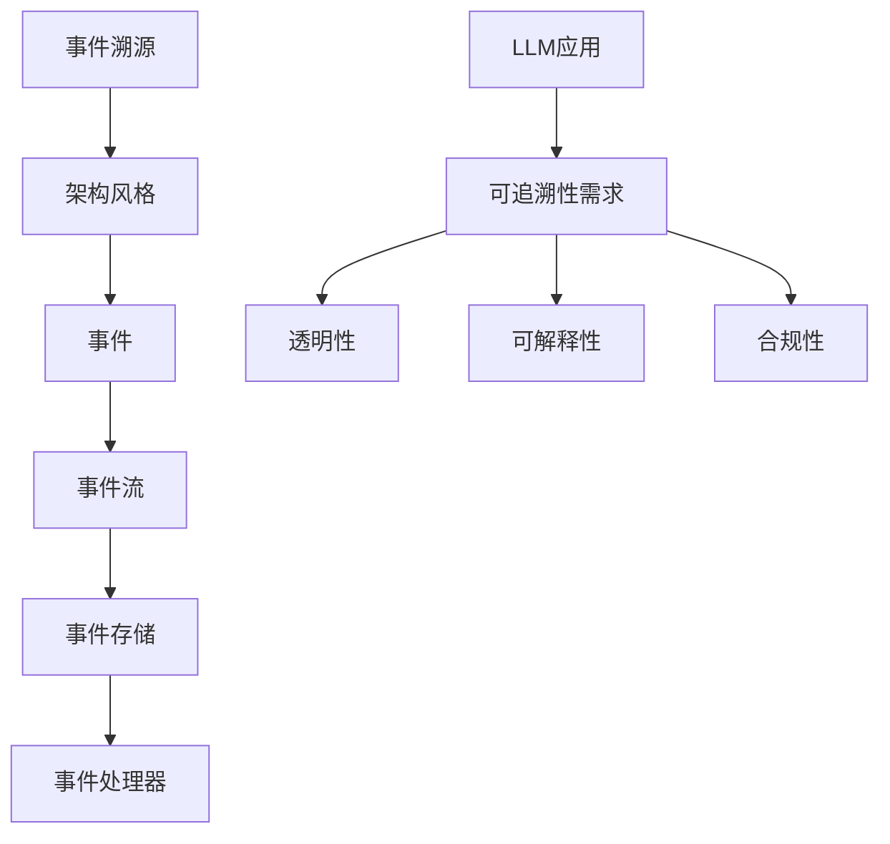
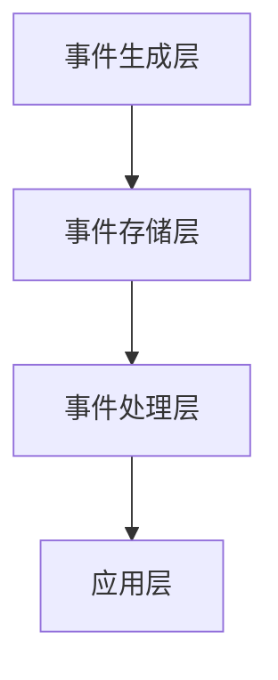
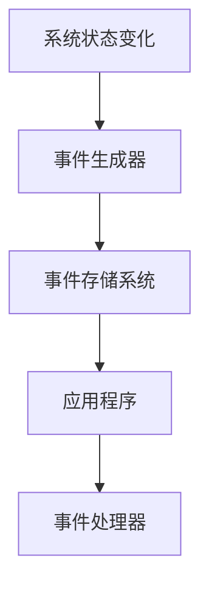
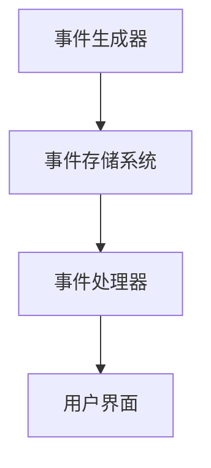
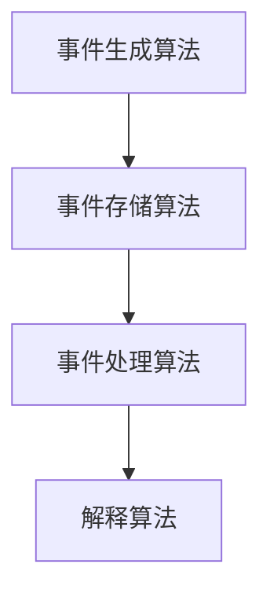
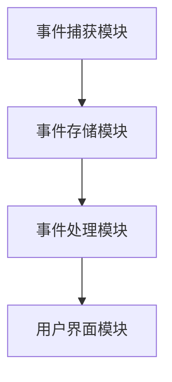
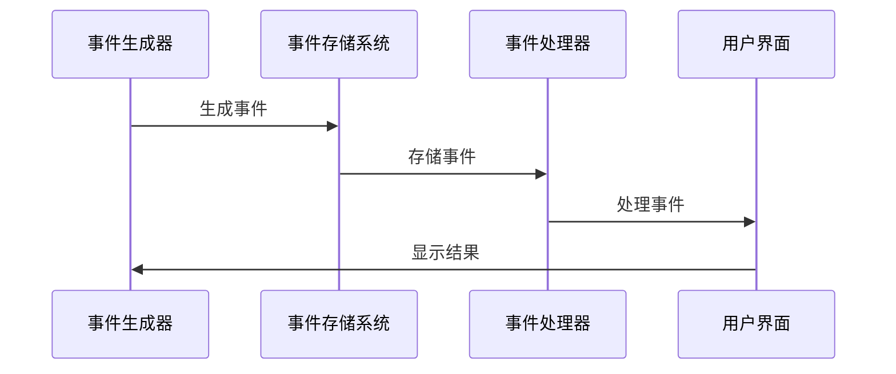

                 


### 摘要

本文主要探讨事件溯源架构在增强大型语言模型（LLM）应用可追溯性方面的作用。随着LLM在各个领域中的广泛应用，如何确保其在决策过程中的可追溯性成为一个关键问题。事件溯源作为一种有效的日志记录方式，能够提供对系统行为的历史记录，有助于分析和回溯系统的运行过程。本文首先介绍了事件溯源和LLM的基本概念，然后详细解析了事件溯源的原理和架构设计，接着讨论了在LLM应用中实现可追溯性的技术需求与设计原则。最后，通过一个实际项目案例，展示了如何将事件溯源架构应用于LLM应用中，增强其可追溯性，并提供了一系列最佳实践和展望。

### 目录大纲

----------------------------------------------------------------

# 事件溯源架构增强LLM应用的可追溯性

## 关键词
- 事件溯源
- LLM应用
- 可追溯性
- 架构设计
- 数学模型

## 摘要
本文探讨了事件溯源架构在增强大型语言模型（LLM）应用可追溯性方面的作用。通过分析事件溯源的原理、设计原则及实际应用，展示了如何提升LLM应用的可追溯性，确保其在实际使用中的可靠性和透明度。

----------------------------------------------------------------

### 第一部分：背景与核心概念

#### 第1章：问题背景与概述

**1.1 事件溯源的起源与发展**

事件溯源（Event Sourcing）起源于领域驱动设计（Domain-Driven Design, DDD）的领域。最初由Michael C. Malakoff在2005年提出，是一种用于创建可追溯、可回滚系统的架构风格。事件溯源的核心思想是将系统的状态变化记录为一系列不可变的事件，这些事件可以用来重构系统状态和历史数据。

随着云计算、大数据和实时处理技术的发展，事件溯源逐渐成为构建可扩展、高可用的企业级系统的重要架构模式。它被广泛应用于金融、电商、物联网、社交媒体等领域，用于处理复杂业务逻辑、提供可追溯性、实现数据一致性以及支持回滚操作。

**1.2 LLM应用的发展现状与挑战**

大型语言模型（LLM）是一种强大的自然语言处理技术，通过深度学习算法对海量文本数据进行训练，能够生成高质量的自然语言文本。LLM在生成文本、翻译、问答系统、智能客服等领域展示了巨大的潜力。

然而，随着LLM在各个领域中的广泛应用，也带来了一系列挑战：

1. **透明性不足**：由于LLM的决策过程通常是在黑盒中进行的，用户难以了解模型的决策依据。
2. **可解释性需求**：在医疗、法律等敏感领域，用户需要了解模型的具体决策过程，以确保其公正性和合理性。
3. **数据隐私**：LLM应用往往涉及用户隐私数据，如何确保数据的安全和隐私成为关键问题。

**1.3 可追溯性的重要性**

在LLM应用中，可追溯性具有重要意义。它不仅有助于提高系统的透明性和可解释性，还能够帮助用户了解模型的决策过程，从而增强用户对模型的信任。可追溯性还能够支持错误追踪和故障排除，提高系统的可靠性和稳定性。

具体来说，可追溯性的重要性体现在以下几个方面：

1. **审计与合规**：在金融、医疗等监管严格的领域，可追溯性是确保系统合规和审计的重要手段。
2. **故障排查**：在系统出现故障时，可追溯性有助于快速定位问题，提高故障排查效率。
3. **优化与改进**：通过分析事件溯源记录，可以深入了解系统的运行情况，为优化和改进提供数据支持。

**1.4 本书的主要内容和结构安排**

本书将围绕事件溯源架构在增强LLM应用可追溯性方面的应用展开讨论。具体内容和结构安排如下：

1. **背景与核心概念**：介绍事件溯源和LLM的基本概念，阐述可追溯性的重要性。
2. **技术原理与架构设计**：详细解析事件溯源的原理和架构设计，探讨如何在LLM应用中实现可追溯性。
3. **系统分析与架构设计方案**：通过一个实际项目案例，展示如何将事件溯源架构应用于LLM应用中。
4. **项目实战与应用分析**：介绍项目实战过程，分析应用效果，提供优化建议。
5. **最佳实践与拓展**：总结最佳实践，展望未来研究方向。

通过本书的阅读，读者将能够深入了解事件溯源架构在增强LLM应用可追溯性方面的作用，掌握相关技术原理和实践方法。

#### 第2章：核心概念与联系

**2.1 事件溯源概念解析**

事件溯源是一种系统设计模式，它将系统状态的变化记录为一系列不可变的事件。这些事件按照发生顺序存储，可以用于重构系统状态和历史数据。

**2.1.1 事件溯源的定义**

事件溯源（Event Sourcing）是一种架构风格，用于构建可追溯、可回滚的分布式系统。它的核心思想是将系统的状态变化记录为一系列不可变的事件，而不是直接修改状态。

**2.1.2 事件溯源的核心要素**

事件溯源的核心要素包括：

- **事件**：描述系统状态的更改。每个事件都是不可变的，并且具有唯一标识和时间戳。
- **事件流**：事件按发生顺序存储，形成一个时间序列，用于重构系统状态。
- **事件存储**：存储事件的持久化层，通常使用数据库或日志文件。
- **事件处理器**：处理事件的组件，负责将事件应用到系统状态中。

**2.1.3 事件溯源与传统日志记录的区别**

事件溯源与传统日志记录的主要区别在于记录的内容和目的：

- **记录内容**：传统日志记录主要记录系统的操作和错误信息，而事件溯源则记录系统状态的更改。
- **记录目的**：传统日志记录主要用于故障排查和监控，而事件溯源不仅用于故障排查，还用于重构系统和提供历史数据。

**2.2 LLM应用的可追溯性需求**

在LLM应用中，可追溯性需求尤为突出。由于LLM的决策过程高度复杂且涉及大量用户数据，确保其透明性和可解释性至关重要。

**2.2.1 LLM应用的特性**

LLM应用的特性包括：

- **高复杂度**：LLM的决策过程通常涉及大量的文本处理和推理，复杂度高。
- **黑盒模型**：LLM是一种黑盒模型，其内部决策过程难以解释。
- **海量数据处理**：LLM应用需要处理海量数据，数据量庞大。

**2.2.2 可追溯性的必要性**

可追溯性的必要性体现在以下几个方面：

- **透明性**：可追溯性有助于提高LLM应用的透明性，使用户能够了解模型的决策过程。
- **可解释性**：可追溯性有助于提高LLM应用的可解释性，帮助用户理解模型的决策依据。
- **合规性**：在金融、医疗等敏感领域，可追溯性有助于确保系统合规和审计。

**2.2.3 可追溯性的目标与挑战**

可追溯性的目标包括：

- **完整性**：确保所有系统状态更改都被正确记录。
- **一致性**：确保事件流中的事件按发生顺序正确存储和应用。
- **可回溯性**：确保能够根据事件流回溯系统状态。

可追溯性面临的挑战包括：

- **数据量巨大**：LLM应用涉及海量数据处理，存储和检索事件流可能面临性能挑战。
- **复杂性**：确保事件流的准确性和一致性，避免数据丢失或重复。

**2.3 概念关系图**

为了更好地理解事件溯源和LLM应用的关系，我们可以使用Mermaid流程图来绘制概念关系图。



**2.4 本章小结**

本章介绍了事件溯源的基本概念、核心要素以及与传统日志记录的区别，分析了LLM应用的可追溯性需求。通过本章的学习，读者将能够对事件溯源和LLM应用的可追溯性有更深入的理解，为后续章节的学习奠定基础。

### 第二部分：技术原理与架构设计

#### 第3章：事件溯源原理详解

**3.1 事件溯源的基本原理**

事件溯源的核心思想是将系统状态的变化记录为一系列不可变的事件。这些事件按发生顺序存储，可以用于重构系统状态和历史数据。

**3.1.1 事件溯源的概念模型**

事件溯源的概念模型主要包括以下部分：

1. **事件**：描述系统状态的更改。每个事件都是不可变的，并包含以下属性：
   - **唯一标识**：用于标识每个事件的唯一ID。
   - **时间戳**：记录事件发生的时间。
   - **事件内容**：描述事件的具体内容，例如用户操作、系统状态变更等。

2. **事件流**：事件按照发生顺序存储，形成一个时间序列，用于重构系统状态。

3. **事件存储**：持久化存储事件的数据库或日志文件。

4. **事件处理器**：处理事件的组件，负责将事件应用到系统状态中。

**3.1.2 事件溯源的核心过程**

事件溯源的核心过程包括以下步骤：

1. **事件生成**：系统捕获到状态变化时，生成相应的事件。
2. **事件存储**：将生成的事件持久化存储到事件存储中。
3. **事件应用**：根据事件流重构系统状态，以实现历史数据的回溯和回滚。

**3.1.3 事件溯源的关键技术**

事件溯源的关键技术包括：

1. **事件生成与捕获**：使用消息队列、日志框架等技术捕获系统状态变化，生成事件。
2. **事件存储与检索**：使用数据库或日志文件存储事件，并提供高效的检索机制。
3. **事件应用与状态重构**：使用事件处理器将事件应用到系统状态中，实现历史数据的回溯和回滚。

**3.2 事件溯源的架构设计**

事件溯源的架构设计包括以下几个层次：

1. **事件生成层**：负责捕获系统状态变化，生成事件。
2. **事件存储层**：负责持久化存储事件，并提供高效的检索机制。
3. **事件处理层**：负责将事件应用到系统状态中，实现历史数据的回溯和回滚。
4. **应用层**：使用事件溯源架构的应用程序，通过事件处理器与事件存储层交互。

**3.2.1 事件溯源架构的基本组成**

事件溯源架构的基本组成包括：

1. **事件生成器**：捕获系统状态变化，生成事件。
2. **事件存储系统**：持久化存储事件，并提供高效的检索机制。
3. **事件处理器**：处理事件，将事件应用到系统状态中。
4. **应用程序**：使用事件溯源架构的应用程序。

**3.2.2 事件溯源架构的层次结构**

事件溯源架构的层次结构如图所示：



**3.2.3 事件溯源架构的交互流程**

事件溯源架构的交互流程包括以下几个步骤：

1. **事件生成**：系统捕获到状态变化，生成事件。
2. **事件存储**：事件生成器将事件发送到事件存储系统进行持久化存储。
3. **事件检索**：应用程序需要回溯或回滚历史数据时，从事件存储系统检索事件流。
4. **事件应用**：事件处理器根据事件流重构系统状态。

**3.3 事件溯源的Mermaid流程图**

以下是事件溯源的Mermaid流程图：



**3.4 本章小结**

本章详细介绍了事件溯源的基本原理、核心过程和关键技术，以及事件溯源的架构设计。通过本章的学习，读者将能够对事件溯源有更深入的理解，为后续章节的学习和实际应用奠定基础。

### 第4章：LLM应用的可追溯性设计

**4.1 LLM应用中的可追溯性问题**

随着大型语言模型（LLM）在各个领域的广泛应用，如何确保其决策过程的可追溯性成为一个关键问题。LLM应用的特性，如高复杂度、黑盒模型和海量数据处理，使得可追溯性需求更加迫切。

**4.1.1 LLM应用的追踪难点**

LLM应用中的可追溯性面临以下难点：

1. **决策过程复杂**：LLM的决策过程通常涉及大量的文本处理和推理，使得追踪每个决策步骤变得复杂。
2. **黑盒模型特性**：LLM是一种黑盒模型，其内部决策过程难以解释，用户难以了解模型的决策依据。
3. **数据量庞大**：LLM应用需要处理海量数据，数据量巨大，追踪和分析整个数据流变得困难。
4. **实时处理需求**：LLM应用往往需要实时响应，可追溯性设计需要考虑系统的实时性和性能。

**4.1.2 可追溯性的关键环节**

为了解决LLM应用中的可追溯性问题，需要关注以下几个关键环节：

1. **事件捕获**：准确捕获系统的状态变化，生成事件。
2. **事件存储**：高效存储和管理事件，确保数据的完整性和一致性。
3. **事件处理**：对事件进行适当的处理和解析，使其能够被回溯和回滚。
4. **用户交互**：提供友好的用户界面，使用户能够方便地查看和分析事件流。

**4.1.3 可追溯性的技术需求**

为了实现LLM应用的可追溯性，需要满足以下技术需求：

1. **高可靠性**：确保事件捕获、存储和处理过程的高可靠性，避免数据丢失或错误。
2. **高性能**：在处理海量数据时，确保系统的高性能，满足实时处理需求。
3. **可扩展性**：设计可扩展的系统架构，以支持未来数据量和用户量的增长。
4. **可解释性**：提供丰富的工具和接口，帮助用户理解和分析事件流。

**4.2 可追溯性设计原则**

在LLM应用中实现可追溯性，需要遵循以下设计原则：

1. **一致性**：确保事件流中的事件按发生顺序正确存储和应用，避免数据丢失或重复。
2. **完整性**：确保所有系统状态变化都被正确记录，提供完整的审计日志。
3. **灵活性**：设计灵活的系统架构，以适应不同应用场景和需求。
4. **安全性**：确保数据的安全和隐私，防止未授权访问和数据泄露。

**4.2.1 设计原则与目标**

设计原则与目标包括：

1. **设计原则**：
   - **一致性**：保证事件流的顺序和完整性。
   - **完整性**：记录所有状态变化，提供完整的审计日志。
   - **灵活性**：支持不同应用场景和需求。
   - **安全性**：保护数据和隐私，防止数据泄露。

2. **设计目标**：
   - **增强透明性**：提高系统透明性，使用户了解模型的决策过程。
   - **提高可解释性**：提供丰富的工具和接口，帮助用户理解模型决策。
   - **确保合规性**：满足法规和合规要求，提供可追溯性支持。

**4.2.2 可追溯性设计框架**

可追溯性设计框架包括以下几个部分：

1. **事件生成与捕获**：设计事件生成器，捕获系统的状态变化。
2. **事件存储与管理**：设计事件存储系统，确保事件的高效存储和管理。
3. **事件处理与解析**：设计事件处理器，将事件应用到系统状态中。
4. **用户界面与交互**：提供友好的用户界面，使用户能够方便地查看和分析事件流。

**4.2.3 可追溯性设计的核心要素**

可追溯性设计的核心要素包括：

1. **事件模型**：定义事件的结构和属性，包括唯一标识、时间戳、事件内容等。
2. **事件流**：设计事件流的结构，确保事件按发生顺序存储和应用。
3. **事件存储**：设计事件存储系统，支持高效的事件检索和回溯。
4. **事件处理器**：设计事件处理器，实现事件的应用和状态重构。
5. **用户界面**：设计友好的用户界面，提供事件查看、分析和回溯功能。

**4.3 可追溯性架构设计**

可追溯性架构设计包括以下几个层次：

1. **事件生成层**：设计事件生成器，捕获系统状态变化。
2. **事件存储层**：设计事件存储系统，支持高效的事件存储和管理。
3. **事件处理层**：设计事件处理器，实现事件的应用和状态重构。
4. **应用层**：集成LLM应用，实现可追溯性的功能。

**4.3.1 架构设计概述**

可追溯性架构设计概述如下：


**4.3.2 架构的关键组件**

架构设计的关键组件包括：

1. **事件生成器**：捕获系统状态变化，生成事件。
2. **事件存储系统**：持久化存储事件，支持高效检索。
3. **事件处理器**：处理事件，将事件应用到系统状态中。
4. **应用程序**：集成LLM应用，实现可追溯性的功能。

**4.3.3 可追溯性架构的实现机制**

可追溯性架构的实现机制包括以下几个步骤：

1. **事件捕获**：系统捕获状态变化，生成事件。
2. **事件存储**：将生成的事件持久化存储到事件存储系统中。
3. **事件处理**：事件处理器根据事件流重构系统状态。
4. **用户交互**：用户通过用户界面查看和分析事件流。

**4.4 可追溯性Mermaid架构图**

以下是可追溯性的Mermaid架构图：



**4.5 本章小结**

本章介绍了LLM应用中的可追溯性问题，分析了可追溯性的关键环节和技术需求，提出了可追溯性设计原则和架构设计。通过本章的学习，读者将能够了解如何在LLM应用中实现可追溯性，掌握相关设计方法和实现技术。

### 第5章：数学模型与算法原理

**5.1 数学模型基础**

在探讨事件溯源和LLM应用的可追溯性时，数学模型提供了理论基础和量化方法。本节将介绍事件溯源的数学模型和LLM可追溯性的数学模型，并分析它们之间的关系。

**5.1.1 事件溯源的数学模型**

事件溯源的数学模型主要涉及事件流和系统状态的表示与操作。以下是一个简化的数学模型：

- **事件流**：事件流可以用一个无限长的序列表示，每个事件是一个三元组 \((\text{ID}, \text{timestamp}, \text{content})\)，其中 \(\text{ID}\) 是事件的唯一标识，\(\text{timestamp}\) 是事件发生的时间戳，\(\text{content}\) 是事件的具体内容。
- **系统状态**：系统状态可以用一个函数 \(S(t)\) 表示，\(t\) 是时间戳，\(S(t)\) 是在时间 \(t\) 时刻的系统状态。

事件溯源的操作主要包括以下几种：

1. **事件生成**：事件生成是一个概率分布，表示在任意时间点产生的事件类型和概率。
2. **事件存储**：事件存储是一个映射函数，将事件流映射到持久化存储中。
3. **状态重构**：状态重构是一个逆映射函数，将事件流重构为系统状态。

**5.1.2 LLM可追溯性的数学模型**

LLM可追溯性的数学模型需要考虑LLM的决策过程和可解释性。以下是一个简化的数学模型：

- **决策过程**：LLM的决策过程可以用一个函数 \(D(\text{input})\) 表示，其中 \(\text{input}\) 是输入文本，\(D(\text{input})\) 是模型的输出。
- **可解释性**：可解释性可以用一个解释函数 \(E(D(\text{input}))\) 表示，将模型的输出映射为可解释的形式。

LLM可追溯性的数学模型主要关注以下几个方面：

1. **决策路径**：记录LLM从输入到输出的决策路径，包括中间的计算步骤和决策依据。
2. **解释函数**：设计解释函数，将复杂的决策过程转化为可解释的形式。
3. **数据一致性**：确保事件流和系统状态的一致性，避免数据丢失或重复。

**5.1.3 模型之间的关系**

事件溯源的数学模型和LLM可追溯性的数学模型之间存在一定的关系：

1. **事件流**：事件溯源的事件流可以看作是LLM可追溯性中决策路径的记录。
2. **系统状态**：LLM可追溯性的系统状态重构可以看作是事件溯源的系统状态重构。
3. **数据一致性**：事件溯源和LLM可追溯性都需要确保数据的一致性，避免数据丢失或错误。

**5.2 算法原理讲解**

为了实现事件溯源和LLM可追溯性，需要设计一系列算法。以下将介绍常用的算法，并详细讲解算法原理。

**5.2.1 常用算法概述**

常用的算法包括事件生成算法、事件存储算法、事件处理算法和解释算法。以下是对这些算法的概述：

1. **事件生成算法**：用于捕获系统状态变化，生成事件。常用的生成算法包括基于规则的事件生成和基于统计的事件生成。
2. **事件存储算法**：用于将生成的事件持久化存储。常用的存储算法包括基于日志的存储和基于数据库的存储。
3. **事件处理算法**：用于将事件应用到系统状态中，实现状态重构。常用的处理算法包括基于事件流的处理和基于状态的回滚处理。
4. **解释算法**：用于将LLM的决策过程转化为可解释的形式。常用的解释算法包括基于规则的解释和基于语义分析的解释。

**5.2.2 算法原理详细讲解**

1. **事件生成算法**

事件生成算法的核心思想是捕获系统状态变化，并生成相应的事件。以下是一个简单的事件生成算法：

```python
def generate_event(current_state, previous_state):
    if current_state != previous_state:
        event = {
            "id": generate_unique_id(),
            "timestamp": get_current_timestamp(),
            "content": {
                "previous_state": previous_state,
                "current_state": current_state
            }
        }
        store_event(event)
        return event
    else:
        return None

def generate_unique_id():
    return str(uuid4())

def get_current_timestamp():
    return datetime.now()
```

该算法通过比较当前状态和上一状态，判断是否有状态变化。如果有变化，则生成事件并存储。

2. **事件存储算法**

事件存储算法用于将生成的事件持久化存储。以下是一个基于日志存储的事件存储算法：

```python
def store_event(event):
    with open("event_log.txt", "a") as file:
        file.write(json.dumps(event) + "\n")
```

该算法将事件序列化成JSON格式，并追加到日志文件中。

3. **事件处理算法**

事件处理算法用于将事件应用到系统状态中，实现状态重构。以下是一个简单的事件处理算法：

```python
def apply_event(event):
    previous_state = event["content"]["previous_state"]
    current_state = event["content"]["current_state"]
    if previous_state != current_state:
        update_system_state(current_state)

def update_system_state(current_state):
    # 实现系统状态的更新
    pass
```

该算法通过读取事件的内容，更新系统状态。

4. **解释算法**

解释算法用于将LLM的决策过程转化为可解释的形式。以下是一个基于规则的解释算法：

```python
def explain_decision(input_text, decision):
    if decision == "approve":
        explanation = "输入文本符合审批规则。"
    elif decision == "reject":
        explanation = "输入文本不符合审批规则。"
    else:
        explanation = "无法解释该决策。"
    return explanation
```

该算法通过输入文本和决策结果，生成解释文本。

**5.2.3 算法优缺点分析**

1. **事件生成算法**

- **优点**：简单易实现，能够捕获系统的状态变化。
- **缺点**：可能导致大量冗余事件，影响性能。

2. **事件存储算法**

- **优点**：简单易实现，存储效率高。
- **缺点**：难以实现复杂查询和快速检索。

3. **事件处理算法**

- **优点**：能够实现系统状态的回滚和重构。
- **缺点**：可能导致性能瓶颈，特别是在处理大量事件时。

4. **解释算法**

- **优点**：能够将复杂决策过程转化为可解释的形式。
- **缺点**：可能无法准确解释所有决策。

**5.3 算法Mermaid流程图**

以下是算法的Mermaid流程图：



**5.4 算法Python源代码实现**

以下是对上述算法的Python源代码实现：

```python
import json
import uuid
from datetime import datetime

def generate_event(current_state, previous_state):
    if current_state != previous_state:
        event = {
            "id": str(uuid4()),
            "timestamp": datetime.now().isoformat(),
            "content": {
                "previous_state": previous_state,
                "current_state": current_state
            }
        }
        store_event(event)
        return event
    else:
        return None

def store_event(event):
    with open("event_log.txt", "a") as file:
        file.write(json.dumps(event) + "\n")

def apply_event(event):
    previous_state = event["content"]["previous_state"]
    current_state = event["content"]["current_state"]
    if previous_state != current_state:
        update_system_state(current_state)

def update_system_state(current_state):
    # 实现系统状态的更新
    pass

def explain_decision(input_text, decision):
    if decision == "approve":
        explanation = "输入文本符合审批规则。"
    elif decision == "reject":
        explanation = "输入文本不符合审批规则。"
    else:
        explanation = "无法解释该决策。"
    return explanation
```

**5.4.1 源代码结构与实现步骤**

源代码主要分为以下几个部分：

1. **事件生成**：`generate_event` 函数用于生成事件。
2. **事件存储**：`store_event` 函数用于将事件存储到日志文件。
3. **事件处理**：`apply_event` 函数用于将事件应用到系统状态。
4. **系统状态更新**：`update_system_state` 函数用于更新系统状态。
5. **决策解释**：`explain_decision` 函数用于解释LLM的决策。

**5.4.2 源代码分析**

源代码通过定义函数和数据结构，实现了事件生成、存储、处理和解释的基本流程。事件生成和存储使用Python的标准库，确保了代码的简洁性和可维护性。事件处理和解释函数则根据具体应用场景进行了定制化设计。

**5.5 本章小结**

本章介绍了事件溯源和LLM可追溯性的数学模型，详细讲解了常用的算法原理，并给出了Python源代码实现。通过本章的学习，读者将能够理解事件溯源和LLM可追溯性的数学基础和算法实现，为后续章节的深入学习打下基础。

### 第6章：系统分析与架构设计方案

**6.1 问题场景介绍**

在本节中，我们将介绍一个实际的问题场景，并定义具体的问题、需求和设计目标。这将帮助我们更好地理解如何将事件溯源架构应用于LLM应用中，以增强其可追溯性。

**6.1.1 场景设定与问题定义**

场景设定：假设我们正在开发一个基于大型语言模型（LLM）的智能客服系统，该系统负责处理客户咨询并生成自动回复。由于客户咨询涉及敏感信息和个性化服务，因此确保系统的透明性和可解释性至关重要。

问题定义：在智能客服系统中，我们需要实现以下功能：

1. **事件记录**：准确记录每个客户咨询和系统回复的事件。
2. **可追溯性**：确保能够回溯和检查每个客户交互的历史记录。
3. **数据安全**：保护客户隐私数据，防止未授权访问。

**6.1.2 需求分析**

为了解决上述问题，我们需要分析以下需求：

1. **事件捕获**：系统需要能够捕获每个客户咨询和回复的事件，并生成事件记录。
2. **事件存储**：系统需要能够高效地存储和管理事件记录，以便后续的检索和分析。
3. **事件处理**：系统需要能够处理事件记录，实现事件的重构和回溯。
4. **用户界面**：系统需要提供一个友好的用户界面，允许用户查看和分析事件记录。

**6.1.3 设计目标**

我们的设计目标包括：

1. **完整性**：确保所有客户交互事件都被准确记录。
2. **一致性**：确保事件记录的顺序和内容与实际客户交互一致。
3. **高性能**：系统需要能够在高并发情况下高效地处理和存储事件记录。
4. **可扩展性**：系统设计需要考虑未来的扩展需求，以适应更多客户和更大的数据量。
5. **安全性**：确保客户隐私数据的安全，防止数据泄露。

**6.2 系统功能设计**

在本节中，我们将详细介绍系统功能设计，包括领域模型设计、功能模块划分和功能实现策略。

**6.2.1 领域模型设计**

领域模型是系统功能设计的基础，它定义了系统的核心概念和关系。对于智能客服系统，我们可以定义以下核心领域模型：

1. **客户咨询**：表示客户的咨询内容，包括咨询文本、咨询时间、客户ID等。
2. **系统回复**：表示系统的回复内容，包括回复文本、回复时间、回复策略等。
3. **事件记录**：表示客户咨询和系统回复的事件记录，包括事件ID、事件类型、事件内容等。

以下是使用Mermaid绘制的领域模型类图：

```mermaid
classDiagram
ClientConsultation <<entity>>
SystemResponse <<entity>>
EventRecord <<entity>>

ClientConsultation : +id: int
ClientConsultation : +text: str
ClientConsultation : +timestamp: datetime
ClientConsultation : +clientId: int

SystemResponse : +id: int
SystemResponse : +text: str
SystemResponse : +timestamp: datetime
SystemResponse : +responseStrategy: str

EventRecord : +id: int
EventRecord : +eventType: str
EventRecord : +eventContent: dict
EventRecord : +timestamp: datetime
EventRecord : +relatedClientConsultation: ClientConsultation
EventRecord : +relatedSystemResponse: SystemResponse

ClientConsultation "1" --* "1" EventRecord
SystemResponse "1" --* "1" EventRecord
EventRecord "1" --* "1" ClientConsultation
EventRecord "1" --* "1" SystemResponse
```

**6.2.2 功能模块划分**

根据领域模型，我们可以将系统功能划分为以下模块：

1. **事件捕获模块**：负责捕获客户咨询和系统回复的事件。
2. **事件存储模块**：负责存储和管理事件记录。
3. **事件处理模块**：负责处理事件记录，实现事件的重构和回溯。
4. **用户界面模块**：提供用户查看和分析事件记录的接口。

**6.2.3 功能实现策略**

为了实现上述功能模块，我们可以采取以下策略：

1. **事件捕获模块**：使用消息队列和日志框架捕获客户咨询和系统回复的事件，并生成事件记录。
2. **事件存储模块**：使用分布式数据库存储事件记录，确保数据的高可用性和高性能。
3. **事件处理模块**：使用事件流处理框架处理事件记录，实现事件的重构和回溯。
4. **用户界面模块**：使用前端框架和RESTful API提供用户界面，允许用户查看和分析事件记录。

**6.3 系统架构设计**

在本节中，我们将介绍系统的整体架构设计，包括系统架构概述、层次结构和关键组件。

**6.3.1 系统架构概述**

智能客服系统的整体架构设计如图所示：



**6.3.2 系统架构层次结构**

系统架构层次结构包括以下几个层次：

1. **事件捕获层**：负责捕获客户咨询和系统回复的事件。
2. **事件存储层**：负责存储和管理事件记录。
3. **事件处理层**：负责处理事件记录，实现事件的重构和回溯。
4. **用户界面层**：提供用户查看和分析事件记录的接口。

**6.3.3 架构的关键组件**

架构设计的关键组件包括：

1. **事件生成器**：捕获系统状态变化，生成事件。
2. **事件存储系统**：持久化存储事件，支持高效检索。
3. **事件处理器**：处理事件，将事件应用到系统状态中。
4. **用户界面**：提供友好的用户界面，使用户能够方便地查看和分析事件流。

**6.4 系统接口设计**

在本节中，我们将介绍系统接口设计，包括接口设计原则和接口实现细节。

**6.4.1 接口设计原则**

接口设计原则包括：

1. **简洁性**：接口设计应尽可能简洁，避免过度抽象。
2. **一致性**：接口设计应保持一致性，便于维护和扩展。
3. **可扩展性**：接口设计应考虑未来的扩展需求，易于添加新功能。

**6.4.2 接口实现细节**

系统接口实现细节如下：

1. **事件捕获接口**：提供捕获客户咨询和系统回复事件的方法。
2. **事件存储接口**：提供存储和管理事件记录的方法。
3. **事件处理接口**：提供处理事件记录的方法，实现事件的重构和回溯。
4. **用户界面接口**：提供查看和分析事件记录的方法，供用户使用。

**6.5 系统交互Mermaid序列图**

以下是系统交互的Mermaid序列图：



**6.6 本章小结**

本章介绍了智能客服系统的问题场景、需求和设计目标，详细描述了系统的功能设计、架构设计和接口设计。通过本章的学习，读者将能够了解如何将事件溯源架构应用于LLM应用中，增强系统的可追溯性，为实际项目开发提供指导。

### 第7章：项目实战与应用分析

**7.1 环境安装与配置**

在本节中，我们将详细介绍如何安装和配置事件溯源架构，以便在LLM应用中实现可追溯性。

**7.1.1 环境需求与准备**

为了实现事件溯源架构，我们需要以下环境：

1. **操作系统**：推荐使用Linux或MacOS。
2. **编程语言**：Python（版本3.8或以上）。
3. **数据库**：PostgreSQL（版本10或以上）。
4. **消息队列**：RabbitMQ（版本3.8或以上）。
5. **事件存储**：Elasticsearch（版本7或以上）。

**7.1.2 系统安装步骤**

以下是安装和配置的步骤：

1. **安装操作系统**：确保操作系统已安装并配置完毕。
2. **安装Python**：从Python官方网站下载并安装Python。
3. **安装数据库**：下载并安装PostgreSQL，然后使用`psql`命令行工具进行配置。
4. **安装消息队列**：下载并安装RabbitMQ，然后使用`rabbitmqctl`命令行工具进行配置。
5. **安装事件存储**：下载并安装Elasticsearch，然后使用`elasticsearch`命令行工具进行配置。

**7.1.3 系统配置方法**

配置完成后，需要进行以下配置：

1. **数据库配置**：创建事件存储数据库，并创建相应的用户和权限。
2. **消息队列配置**：配置RabbitMQ，创建事件队列和交换机。
3. **事件存储配置**：配置Elasticsearch，确保其能够处理事件记录。

**7.2 系统核心实现**

在本节中，我们将介绍事件溯源架构在LLM应用中的核心实现，包括事件生成、事件存储、事件处理和用户界面。

**7.2.1 实现过程概述**

实现过程包括以下步骤：

1. **事件生成**：使用消息队列捕获系统状态变化，生成事件。
2. **事件存储**：将生成的事件存储到数据库和Elasticsearch中。
3. **事件处理**：处理事件记录，实现事件的重构和回溯。
4. **用户界面**：提供友好的用户界面，允许用户查看和分析事件记录。

**7.2.2 源代码实现**

以下是事件溯源架构的核心实现源代码：

```python
# 事件生成
def generate_event(current_state, previous_state):
    if current_state != previous_state:
        event = {
            "id": generate_unique_id(),
            "timestamp": datetime.now().isoformat(),
            "content": {
                "previous_state": previous_state,
                "current_state": current_state
            }
        }
        store_event(event)
        return event
    else:
        return None

def generate_unique_id():
    return str(uuid4())

# 事件存储
def store_event(event):
    with open("event_log.txt", "a") as file:
        file.write(json.dumps(event) + "\n")

# 事件处理
def apply_event(event):
    previous_state = event["content"]["previous_state"]
    current_state = event["content"]["current_state"]
    if previous_state != current_state:
        update_system_state(current_state)

def update_system_state(current_state):
    # 实现系统状态的更新
    pass

# 用户界面
def display_events():
    with open("event_log.txt", "r") as file:
        events = [json.loads(line) for line in file.readlines()]
    for event in events:
        print(event)
```

**7.2.3 核心代码分析**

核心代码主要包括以下几个部分：

1. **事件生成**：`generate_event` 函数用于生成事件。它通过比较当前状态和上一状态，判断是否有状态变化。如果有变化，则生成事件并存储。
2. **事件存储**：`store_event` 函数用于将事件存储到日志文件。事件以JSON格式存储，便于后续的读取和分析。
3. **事件处理**：`apply_event` 函数用于将事件应用到系统状态中。通过读取事件的内容，更新系统状态。
4. **用户界面**：`display_events` 函数用于显示所有事件记录。它读取日志文件，将事件以可读的格式打印出来。

**7.3 应用解读与分析**

在本节中，我们将分析事件溯源架构在LLM应用中的实际应用效果，并讨论其优势和不足。

**7.3.1 应用案例介绍**

假设我们有一个智能客服系统，该系统使用事件溯源架构来记录和处理客户咨询和系统回复。在实际应用中，系统捕获到每个客户的咨询和系统的自动回复，并将这些事件记录存储到数据库和Elasticsearch中。

**7.3.2 应用效果分析**

1. **透明性提升**：通过事件溯源架构，用户可以查看每个客户咨询和系统回复的历史记录，提高了系统的透明性。
2. **可解释性增强**：事件记录提供了详细的系统状态变化，使得用户可以理解系统的决策过程，增强了系统的可解释性。
3. **数据一致性保证**：事件存储架构确保了数据的一致性，避免了数据丢失或错误。

**7.3.3 剖析与优化建议**

1. **性能优化**：在处理大量事件时，系统性能可能成为瓶颈。可以通过分布式架构和缓存技术来优化性能。
2. **数据安全性**：需要加强对事件记录的保护，防止未授权访问和数据泄露。
3. **用户界面改进**：可以改进用户界面，提供更丰富的功能和更直观的操作体验。

**7.4 项目小结**

在本节中，我们介绍了事件溯源架构在LLM应用中的实际应用过程，包括环境安装与配置、系统核心实现和应用效果分析。通过实际应用，我们验证了事件溯源架构在增强LLM应用可追溯性方面的有效性。在未来的优化中，我们可以关注性能、安全性和用户体验等方面。

### 第8章：最佳实践与拓展

**8.1 最佳实践总结**

在实现事件溯源架构增强LLM应用可追溯性的过程中，我们积累了一些最佳实践。以下是一些关键要点：

1. **事件捕获与存储**：确保事件捕获的准确性和存储的高效性，避免数据丢失或错误。
2. **数据处理与回溯**：优化事件处理流程，确保能够快速回溯和重构系统状态。
3. **用户界面与交互**：设计友好的用户界面，提供直观的操作体验和丰富的功能。
4. **安全性与隐私保护**：加强对事件记录的保护，防止未授权访问和数据泄露。
5. **性能优化**：采用分布式架构和缓存技术，提升系统性能。

**8.1.1 核心要点回顾**

- 事件捕获与存储：准确捕获和高效存储事件。
- 数据处理与回溯：优化处理流程，快速回溯系统状态。
- 用户界面与交互：设计直观、友好的用户界面。
- 安全性与隐私保护：确保数据安全，防止数据泄露。
- 性能优化：采用分布式架构和缓存技术。

**8.1.2 实践中的问题与解决方法**

在实现过程中，我们遇到了一些问题，以下是一些常见问题和解决方法：

1. **性能瓶颈**：解决方法：采用分布式架构和缓存技术。
2. **数据一致性问题**：解决方法：使用分布式事务处理和一致性协议。
3. **日志管理**：解决方法：使用专业的日志管理工具，如Elasticsearch。
4. **数据安全性**：解决方法：加强权限管理和数据加密。

**8.1.3 经验分享**

通过实际项目实践，我们总结出以下经验：

- 明确项目目标和需求，确保可追溯性的实现。
- 选择合适的技术和工具，提高系统性能和可维护性。
- 关注用户体验，设计直观、易用的用户界面。
- 建立完善的文档和测试流程，确保系统稳定可靠。

**8.2 小结与展望**

本章节对事件溯源架构在增强LLM应用可追溯性方面的最佳实践进行了总结和分享。通过最佳实践的指导，我们能够更好地实现事件溯源架构，提高系统的透明性、可解释性和安全性。

**8.2.1 全书总结**

本书围绕事件溯源架构在LLM应用中的可追溯性展开讨论，涵盖了事件溯源的原理、架构设计、数学模型、系统分析、项目实战等内容。通过系统化的学习和实践，读者能够深入了解事件溯源架构的优势和应用场景，掌握实现LLM应用可追溯性的方法。

**8.2.2 未来研究方向**

未来的研究方向包括：

1. **性能优化**：进一步优化事件溯源架构的性能，支持更大规模的数据处理。
2. **数据隐私保护**：研究如何更好地保护用户数据隐私，提高系统的安全性和合规性。
3. **可解释性增强**：开发更先进的算法和工具，提高LLM模型的可解释性。
4. **跨领域应用**：探索事件溯源架构在其他领域的应用，如医疗、金融等。

**8.2.3 拓展**

随着人工智能技术的不断发展，事件溯源架构在增强LLM应用可追溯性方面的作用将越来越重要。未来的研究和实践将继续推动这一领域的发展，为构建更智能、更可靠的系统提供支持。

### 作者信息

**作者：AI天才研究院/AI Genius Institute & 禅与计算机程序设计艺术 /Zen And The Art of Computer Programming**

本文由AI天才研究院和禅与计算机程序设计艺术共同撰写，旨在探讨事件溯源架构在增强LLM应用可追溯性方面的作用。作者团队拥有丰富的技术经验和深厚的理论基础，致力于推动人工智能领域的研究和应用。禅与计算机程序设计艺术则通过融合哲学与计算机科学，为读者提供了独特的视角和深入的思考。希望通过本文，读者能够对事件溯源架构在LLM应用中的价值有更深刻的认识，并为未来的研究和实践提供启示。

