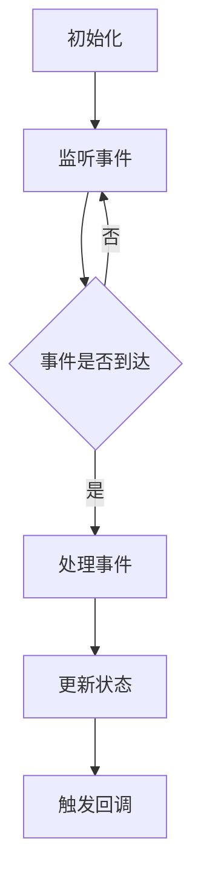
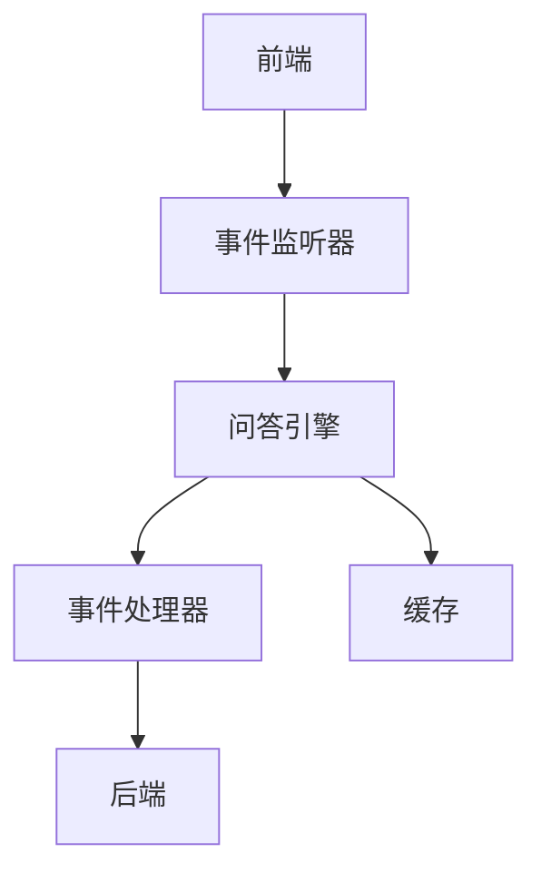

                 

### 事件驱动架构：提高LLM应用的实时性

> 关键词：事件驱动架构，实时性，LLM，性能优化，架构设计

> 摘要：本文将探讨事件驱动架构在提高大型语言模型（LLM）应用实时性方面的应用与实践。通过深入分析事件驱动架构的核心概念、设计原则和实现方法，本文旨在为开发者提供一套行之有效的解决方案，帮助他们在构建高性能、实时响应的LLM应用时实现性能优化。

### 引言：实时性的重要性

在当今的信息时代，实时性成为了许多应用的关键需求。对于大型语言模型（LLM）应用，如交互式问答系统、实时新闻摘要和聊天机器人等，实时性更是至关重要。这是因为这些应用往往需要即时响应用户的需求，提供准确、快速的回答或信息。然而，LLM应用通常涉及到复杂的模型计算和数据处理，如何在保证准确性的同时提高实时性，成为了一个亟待解决的问题。

事件驱动架构（EDA）作为一种高效的系统设计模式，在提高实时性方面具有显著优势。EDA通过事件来驱动系统的运行，而非传统的基于时间的轮询方式，从而实现了更高效的资源利用和更快速的响应速度。本文将详细介绍事件驱动架构的核心概念、设计原则和实现方法，帮助开发者了解如何在LLM应用中应用EDA，实现性能优化。

### 第一部分：事件驱动架构的基本概念

#### 1.1 事件驱动架构的定义

事件驱动架构（Event-Driven Architecture，简称EDA）是一种基于事件触发的系统设计模式。在EDA中，系统由多个模块组成，每个模块负责处理特定类型的事件。当一个事件发生时，相关模块会被触发执行相应的处理逻辑。这种模式使得系统具有更好的模块化、解耦性和可扩展性。

#### 1.2 事件驱动架构与传统架构的差异

传统架构通常采用基于时间的轮询方式来处理任务。这意味着系统会定期检查是否有新的任务需要处理，并逐一执行。这种方式存在以下问题：

1. **资源浪费**：即使没有新的任务，系统也会定期占用CPU资源进行轮询。
2. **响应速度慢**：由于轮询是周期性的，系统无法立即响应新的任务。
3. **耦合度高**：传统架构中的模块往往紧密耦合，修改一个模块可能影响到其他模块。

相比之下，事件驱动架构具有以下优势：

1. **高效资源利用**：事件驱动架构仅在事件发生时才触发相关模块执行，从而避免了资源的浪费。
2. **快速响应**：系统可以立即响应新的事件，提高了响应速度。
3. **模块化与解耦**：事件驱动架构通过事件来解耦各个模块，使得系统更易于维护和扩展。

#### 1.3 事件驱动架构的发展历程

事件驱动架构的概念起源于20世纪70年代，当时在计算机操作系统和嵌入式系统中得到了广泛应用。随着计算机技术的发展，事件驱动架构逐渐在Web应用、实时系统、物联网等领域得到应用。近年来，随着云计算、大数据和人工智能等技术的快速发展，事件驱动架构在提高系统实时性方面的重要性日益凸显。

#### 1.4 事件驱动架构的现代特点

现代事件驱动架构具有以下特点：

1. **异步处理**：事件驱动架构通常采用异步处理方式，使得系统可以同时处理多个事件，提高了处理效率。
2. **非阻塞**：事件驱动架构避免了传统轮询方式的阻塞，使得系统可以更高效地利用资源。
3. **弹性与伸缩性**：事件驱动架构具有良好的弹性与伸缩性，可以通过增加或减少处理事件的任务数来适应不同的负载。
4. **模块化与解耦**：事件驱动架构通过事件来解耦各个模块，使得系统更易于维护和扩展。

### 第二部分：事件驱动架构的设计原则

事件驱动架构的设计原则旨在确保系统的高效性、可靠性和可扩展性。以下是几个关键的设计原则：

#### 2.1 模块化与解耦

模块化与解耦是事件驱动架构的核心原则之一。通过将系统划分为多个模块，每个模块只负责处理特定类型的事件，从而实现了模块间的解耦。这有助于提高系统的可维护性和可扩展性，同时也使得模块可以独立开发和部署。

#### 2.2 异步与非阻塞

异步处理和非阻塞是事件驱动架构的重要特点。异步处理使得系统可以同时处理多个事件，从而提高了处理效率。非阻塞则避免了传统轮询方式的阻塞，使得系统可以更高效地利用资源。

#### 2.3 弹性与伸缩性

事件驱动架构具有良好的弹性和伸缩性。在负载较高时，可以通过增加处理事件的任务数来适应。在负载较低时，则可以减少任务数以节省资源。这种弹性伸缩能力使得系统可以更好地应对不同的负载情况。

#### 2.4 事件队列与调度策略

事件队列是事件驱动架构的核心组件之一。事件队列负责存储和调度事件，确保事件按照一定的顺序被处理。调度策略则决定了事件处理的优先级和顺序，以最大化系统的性能。

### 第三部分：事件驱动架构的实体关系图

为了更好地理解事件驱动架构，我们可以使用Mermaid绘制一个实体关系图。以下是事件驱动架构的实体关系图示例：

```mermaid
classDiagram
    Event <<class>> "事件"
    EventHandler <<class>> "事件处理器"
    EventQueue <<class>> "事件队列"
    Scheduler <<class>> "调度器"

    EventQueue --|> EventHandler : 调度
    Scheduler --|> EventHandler : 分配
```

在这个实体关系图中，事件（Event）是驱动系统运行的基本单元。事件处理器（EventHandler）负责处理特定类型的事件。事件队列（EventQueue）负责存储和调度事件，确保事件按照一定的顺序被处理。调度器（Scheduler）则负责根据事件处理器的优先级和可用性来分配事件。

### 第四部分：事件驱动架构的数学模型

为了更深入地理解事件驱动架构，我们可以使用数学模型来描述其性能和行为。以下是一个简单的事件驱动架构的数学模型：

#### 4.1 实时性的数学表示

实时性可以表示为系统处理事件的时间与事件发生时间之间的差距。假设事件处理时间为T，事件发生时间为t，则实时性R可以表示为：

$$ R = \frac{T}{t} $$

#### 4.2 事件处理延迟的计算

事件处理延迟是指事件从发生到处理完毕所经历的时间。假设事件处理时间为T，事件队列长度为L，则事件处理延迟D可以表示为：

$$ D = T + L \cdot \frac{1}{\lambda} $$

其中，λ表示事件到达率，即单位时间内事件的发生次数。

#### 4.3 优化策略的数学分析

为了提高实时性，我们可以考虑以下优化策略：

1. **提高事件处理速度**：通过优化事件处理算法和硬件资源，减少事件处理时间T。
2. **减小事件队列长度**：通过优化事件队列调度策略，减小事件队列长度L。
3. **提高事件到达率**：通过增加事件生成源的数量，提高事件到达率λ。

这些优化策略可以通过数学模型进行定量分析和评估，以确定最佳的优化方案。

### 第五部分：事件驱动架构在LLM应用中的实际应用

#### 5.1 LLM应用场景下的实时需求

在LLM应用中，实时性是一个关键需求。例如，在交互式问答系统中，用户输入问题后，系统需要尽快提供答案；在实时新闻摘要中，系统需要实时提取最新的新闻内容并进行摘要；在聊天机器人中，系统需要即时响应用户的消息。这些应用场景要求系统具有快速的处理速度和高效的资源利用。

#### 5.2 事件驱动架构在LLM应用中的应用实例

以下是一个事件驱动架构在LLM应用中的具体应用实例：

1. **系统设计与实现**：

   - **事件类型**：系统定义了多种事件类型，如用户输入事件、新闻内容更新事件等。
   - **事件处理器**：每个事件处理器负责处理特定类型的事件。例如，用户输入事件处理器负责处理用户输入，并调用LLM模型生成答案。
   - **事件队列**：事件队列负责存储和调度事件，确保事件按照一定的顺序被处理。
   - **调度器**：调度器根据事件处理器的优先级和可用性来分配事件。

2. **性能评估与优化**：

   - **性能评估**：系统通过模拟不同的负载情况，评估事件驱动架构在实时性、资源利用等方面的性能。
   - **性能优化**：通过优化事件处理算法、调度策略和硬件资源，提高系统的实时性和资源利用效率。

3. **案例分析**：

   - **案例1**：在交互式问答系统中，通过事件驱动架构，系统在处理用户输入时，可以快速响应用户，提供准确的答案。
   - **案例2**：在实时新闻摘要中，事件驱动架构使得系统可以实时提取新闻内容，生成摘要，并及时推送。

#### 5.3 事件驱动架构的优势

事件驱动架构在LLM应用中具有以下优势：

1. **高效性**：事件驱动架构通过异步处理和非阻塞方式，提高了系统的处理速度。
2. **弹性与伸缩性**：事件驱动架构可以根据负载情况动态调整事件处理器的数量，从而实现弹性伸缩。
3. **模块化与解耦**：事件驱动架构通过事件来解耦各个模块，提高了系统的可维护性和可扩展性。
4. **高性能**：事件驱动架构避免了传统轮询方式的资源浪费，提高了系统的性能。

### 第六部分：性能优化方法

#### 6.1 实时性优化方法

为了提高LLM应用的实时性，我们可以采用以下优化方法：

1. **事件处理优化**：通过优化事件处理算法，减少事件处理时间。
2. **系统调度优化**：通过优化调度策略，减少事件处理延迟。
3. **缓存与预处理优化**：通过缓存和预处理，减少事件处理过程中的计算量。

#### 6.2 高并发处理与系统扩展

在高并发场景下，我们可以采用以下方法来优化系统：

1. **数据分片与负载均衡**：通过数据分片和负载均衡，将负载分散到多个处理节点上，提高系统的处理能力。
2. **容器化与微服务架构**：通过容器化和微服务架构，实现系统的灵活部署和扩展。
3. **弹性伸缩策略**：根据负载情况动态调整处理节点的数量，实现弹性伸缩。

#### 6.3 实时性测试与监控

为了确保系统的实时性，我们可以采用以下测试与监控方法：

1. **测试指标**：定义实时性的关键指标，如事件处理时间、事件处理延迟等。
2. **测试工具**：使用测试工具模拟不同的负载情况，评估系统的实时性。
3. **监控与故障排除**：通过监控工具实时监控系统的运行状态，及时发现并解决故障。

### 第七部分：实现方法

#### 7.1 事件驱动架构的实现框架

实现事件驱动架构需要选择合适的实现框架。以下是一些常见的事件驱动架构实现框架：

1. **React**：React是一个流行的JavaScript库，用于构建用户界面。React采用了虚拟DOM技术，实现了高效的界面渲染。
2. **Vue**：Vue是一个轻量级的JavaScript框架，用于构建用户界面。Vue具有简洁的语法和良好的性能，适合构建复杂的Web应用。
3. **Spring Boot**：Spring Boot是一个基于Java的Web应用框架，用于快速构建和部署Web应用。Spring Boot提供了丰富的功能，如事件驱动架构、微服务架构等。

#### 7.2 LLM模型与事件驱动架构的整合

在整合LLM模型与事件驱动架构时，我们需要考虑以下几个方面：

1. **模型接口设计**：设计合理的模型接口，确保模型可以与事件驱动架构无缝集成。
2. **模型调用与异步处理**：通过异步处理，提高系统的处理速度和响应速度。
3. **模型优化与调整**：根据实际需求，对LLM模型进行优化和调整，以提高模型的性能和实时性。

#### 7.3 代码实现示例

以下是一个简单的LLM模型与事件驱动架构的整合示例：

```python
import asyncio
from typing import Any, Callable, Coroutine

class LLMModel:
    def __init__(self, model: Callable[[Any], Any]):
        self.model = model

    async def process_event(self, event: Any) -> None:
        result = await self.model(event)
        print(f"Processed event: {event}, result: {result}")

async def main():
    # 创建LLM模型
    model = LLMModel(lambda event: asyncio.sleep(1, result="Answer"))

    # 注册事件处理器
    event_queue = asyncio.Queue()
    async with asyncio.start_server(
        handle, "127.0.0.1", 8888, shutdown_timeout=None
    ) as server:
        print(f"Serving on {server.sockets[0].getsockname()}")

        # 处理事件
        while True:
            event = await event_queue.get()
            await model.process_event(event)

if __name__ == "__main__":
    asyncio.run(main())
```

在这个示例中，我们使用Python的异步编程和事件驱动架构来实现LLM模型与事件驱动架构的整合。通过`LLMModel`类，我们定义了一个处理事件的方法`process_event`，该方法会异步调用LLM模型进行处理。主程序中使用`asyncio.Queue`作为事件队列，通过`asyncio.start_server`创建了一个HTTP服务器来处理外部事件。

### 总结与展望

事件驱动架构在提高LLM应用的实时性方面具有显著优势。通过异步处理和非阻塞方式，事件驱动架构提高了系统的处理速度和响应速度。同时，事件驱动架构具有良好的模块化、解耦性和弹性伸缩性，使得系统更易于维护和扩展。

然而，事件驱动架构也存在一些挑战，如事件处理的复杂性、调度策略的优化等。未来，随着技术的不断发展，事件驱动架构将在更多领域得到应用，为实现实时、高效的应用提供更强大的支持。

作者：AI天才研究院/AI Genius Institute & 禅与计算机程序设计艺术 /Zen And The Art of Computer Programming

本文详细探讨了事件驱动架构在提高大型语言模型（LLM）应用实时性方面的应用与实践。从事件驱动架构的基本概念、设计原则，到实现方法、性能优化，本文为开发者提供了一套完整的解决方案，帮助他们构建高性能、实时响应的LLM应用。希望本文能对读者在技术实践和理论理解上有所帮助。

### 背景介绍

#### 核心概念术语说明

在深入探讨事件驱动架构（EDA）之前，我们需要明确一些核心概念和术语，以确保对后续内容的理解。以下是对几个关键术语的简要说明：

1. **事件（Event）**：事件是触发系统行为的一种信息或信号。它可以表示任何能够引起系统响应的动作，如用户输入、传感器数据更新、消息到达等。
2. **事件处理器（EventHandler）**：事件处理器是负责处理特定类型事件的一个组件。当事件发生时，事件处理器会执行相应的处理逻辑。
3. **事件队列（EventQueue）**：事件队列是一个存储和管理事件的组件。它负责按一定的顺序将事件传递给相应的事件处理器。
4. **调度器（Scheduler）**：调度器是负责事件调度的一个组件。它的主要任务是决定何时处理哪个事件，并确保事件处理的顺序和优先级。
5. **异步处理（Asynchronous Processing）**：异步处理是指在处理一个任务的同时，可以继续执行其他任务，而不是等待当前任务完成。这种方式可以提高系统的并发性和响应速度。
6. **非阻塞（Non-blocking）**：非阻塞是指在执行一个操作时，如果操作无法立即完成，系统不会等待操作完成，而是继续执行其他任务。这避免了资源的浪费，提高了系统的效率。

#### 问题背景

随着互联网和大数据技术的快速发展，实时性成为许多应用的关键需求。特别是在大型语言模型（LLM）应用中，如交互式问答系统、实时新闻摘要和聊天机器人等，用户期望能够获得即时、准确的响应。然而，LLM应用通常涉及到复杂的模型计算和数据处理，这使得实现实时性变得具有挑战性。

传统的基于时间的轮询方式（如轮询服务器）在处理实时性需求时存在一些问题。首先，轮询方式会占用大量的CPU资源，导致系统性能下降。其次，由于轮询是周期性的，系统可能无法立即响应新的任务，导致响应延迟。此外，传统架构中的模块往往紧密耦合，修改一个模块可能影响到其他模块，增加了系统的维护难度。

为了解决这些问题，事件驱动架构提供了一种更加高效、模块化和解耦的解决方案。EDA通过事件来驱动系统的运行，避免了传统轮询方式的资源浪费和响应延迟。此外，事件驱动架构具有良好的弹性与伸缩性，可以通过增加或减少处理事件的任务数来适应不同的负载情况。

#### 问题描述

在LLM应用中，实时性需求主要体现在以下几个方面：

1. **低延迟**：用户输入问题后，系统需要在尽可能短的时间内提供答案，以满足用户的即时需求。
2. **高吞吐量**：系统需要能够处理大量的并发请求，确保在高峰期也能保持良好的性能。
3. **灵活性**：系统需要能够适应不同的负载情况，根据实际需求动态调整资源分配和处理策略。

然而，传统的基于时间的轮询方式难以满足这些实时性需求。首先，轮询方式会占用大量的CPU资源，导致系统性能下降。其次，由于轮询是周期性的，系统可能无法立即响应新的任务，导致响应延迟。此外，传统架构中的模块往往紧密耦合，修改一个模块可能影响到其他模块，增加了系统的维护难度。

为了解决这些问题，我们需要一种更加高效、模块化和解耦的解决方案，即事件驱动架构。EDA通过事件来驱动系统的运行，避免了传统轮询方式的资源浪费和响应延迟。此外，事件驱动架构具有良好的弹性与伸缩性，可以通过增加或减少处理事件的任务数来适应不同的负载情况。

#### 问题解决

事件驱动架构（EDA）是一种基于事件触发的系统设计模式，通过事件来驱动系统的运行，避免了传统轮询方式的资源浪费和响应延迟。以下是事件驱动架构在解决实时性问题方面的优势：

1. **异步处理**：EDA采用异步处理方式，使得系统可以同时处理多个事件，从而提高了处理效率。在异步处理中，系统不会等待一个任务完成后再执行下一个任务，而是在执行当前任务的同时，继续处理其他任务。这种方式可以显著提高系统的并发性和响应速度。

2. **非阻塞**：EDA采用非阻塞方式，避免了传统轮询方式的阻塞问题。在非阻塞处理中，如果某个操作无法立即完成，系统不会等待操作完成，而是继续执行其他任务。这种方式可以充分利用系统的资源，避免资源的浪费。

3. **模块化与解耦**：EDA通过事件来解耦各个模块，使得系统更易于维护和扩展。在EDA中，每个模块只负责处理特定类型的事件，模块间通过事件队列进行通信。这种方式可以降低模块之间的依赖性，提高系统的可维护性和可扩展性。

4. **弹性与伸缩性**：EDA具有良好的弹性与伸缩性，可以通过增加或减少处理事件的任务数来适应不同的负载情况。在负载较高时，可以通过增加处理事件的任务数来提高系统的处理能力；在负载较低时，则可以减少任务数以节省资源。

#### 边界与外延

事件驱动架构的边界和适用范围主要受以下因素影响：

1. **事件类型**：事件驱动架构适用于处理多种类型的事件，如用户输入、传感器数据更新、消息到达等。然而，并非所有类型的事件都适用于事件驱动架构。对于一些需要持续监听和处理的事件，如网络连接状态、系统资源使用情况等，事件驱动架构可能不是最佳选择。

2. **系统复杂性**：事件驱动架构在处理复杂系统时可能面临一定的挑战。复杂系统中存在大量的模块和事件，事件之间的依赖关系复杂，可能导致系统性能下降。在这种情况下，需要合理设计事件处理逻辑和调度策略，以确保系统的性能。

3. **实时性要求**：事件驱动架构适用于实时性要求较高的系统。对于一些对实时性要求较低的系统，如后台数据处理任务、日志分析等，事件驱动架构可能不是最佳选择。这些任务通常可以采用传统的基于时间的轮询方式进行处理。

#### 概念结构与核心要素组成

事件驱动架构（EDA）的核心概念和要素包括：

1. **事件（Event）**：事件是触发系统行为的基本单元。它可以表示任何能够引起系统响应的动作，如用户输入、传感器数据更新、消息到达等。事件通常包含一些描述性的信息，如事件类型、时间戳等。

2. **事件处理器（EventHandler）**：事件处理器是负责处理特定类型事件的一个组件。每个事件处理器负责接收和处理特定类型的事件。事件处理器通常包含事件处理逻辑，如数据解析、模型调用、结果存储等。

3. **事件队列（EventQueue）**：事件队列是一个存储和管理事件的组件。它负责按一定的顺序将事件传递给相应的事件处理器。事件队列可以是单线程的，也可以是多线程的。在多线程事件队列中，多个事件处理器可以并发地处理事件。

4. **调度器（Scheduler）**：调度器是负责事件调度的一个组件。它的主要任务是决定何时处理哪个事件，并确保事件处理的顺序和优先级。调度器通常根据事件的类型、优先级和时间戳等因素来调度事件。

5. **异步处理（Asynchronous Processing）**：异步处理是指在处理一个任务的同时，可以继续执行其他任务，而不是等待当前任务完成。这种方式可以提高系统的并发性和响应速度。

6. **非阻塞（Non-blocking）**：非阻塞是指在执行一个操作时，如果操作无法立即完成，系统不会等待操作完成，而是继续执行其他任务。这种方式可以避免资源的浪费，提高系统的效率。

7. **事件驱动模式（Event-Driven Pattern）**：事件驱动模式是一种基于事件触发的系统设计模式。在事件驱动模式中，系统由多个模块组成，每个模块只负责处理特定类型的事件。当一个事件发生时，相关模块会被触发执行相应的处理逻辑。

#### 核心概念与联系

事件驱动架构（EDA）的核心概念包括事件、事件处理器、事件队列、调度器、异步处理和非阻塞。这些概念之间的关系如下：

1. **事件（Event）**：事件是触发系统行为的基本单元。它可以表示任何能够引起系统响应的动作，如用户输入、传感器数据更新、消息到达等。事件通常包含一些描述性的信息，如事件类型、时间戳等。

2. **事件处理器（EventHandler）**：事件处理器是负责处理特定类型事件的一个组件。每个事件处理器负责接收和处理特定类型的事件。事件处理器通常包含事件处理逻辑，如数据解析、模型调用、结果存储等。

3. **事件队列（EventQueue）**：事件队列是一个存储和管理事件的组件。它负责按一定的顺序将事件传递给相应的事件处理器。事件队列可以是单线程的，也可以是多线程的。在多线程事件队列中，多个事件处理器可以并发地处理事件。

4. **调度器（Scheduler）**：调度器是负责事件调度的一个组件。它的主要任务是决定何时处理哪个事件，并确保事件处理的顺序和优先级。调度器通常根据事件的类型、优先级和时间戳等因素来调度事件。

5. **异步处理（Asynchronous Processing）**：异步处理是指在处理一个任务的同时，可以继续执行其他任务，而不是等待当前任务完成。这种方式可以提高系统的并发性和响应速度。

6. **非阻塞（Non-blocking）**：非阻塞是指在执行一个操作时，如果操作无法立即完成，系统不会等待操作完成，而是继续执行其他任务。这种方式可以避免资源的浪费，提高系统的效率。

7. **事件驱动模式（Event-Driven Pattern）**：事件驱动模式是一种基于事件触发的系统设计模式。在事件驱动模式中，系统由多个模块组成，每个模块只负责处理特定类型的事件。当一个事件发生时，相关模块会被触发执行相应的处理逻辑。

#### 对比表格

以下是事件驱动架构与传统架构的核心概念和特征对比表格：

| 特征             | 事件驱动架构（EDA）            | 传统架构               |
|------------------|-----------------------------|------------------------|
| 基本概念         | 事件驱动，异步处理，非阻塞     | 基于时间的轮询，同步处理 |
| 模块化与解耦     | 通过事件解耦，提高可维护性     | 紧密耦合，修改困难      |
| 资源利用         | 高效利用资源，避免资源浪费     | 定期占用资源，效率低    |
| 响应速度         | 快速响应，减少延迟             | 周期性响应，延迟大      |
| 弹性与伸缩性     | 动态调整，适应不同负载         | 固定结构，难以扩展      |
| 复杂性           | 高度模块化，降低复杂性         | 紧密耦合，复杂性高      |

通过对比可以看出，事件驱动架构在模块化、资源利用、响应速度、弹性与伸缩性等方面具有显著优势，是一种更加高效、模块化和解耦的系统设计模式。

### 算法原理讲解

#### 算法流程图

为了更好地理解事件驱动架构的工作原理，我们可以使用Mermaid绘制一个简单的算法流程图。以下是事件驱动架构的算法流程图：



在这个算法流程图中，事件驱动架构的工作过程可以分为以下几个步骤：

1. **初始化**：系统初始化，包括事件监听器、事件处理器和事件队列的初始化。
2. **监听事件**：系统开始监听事件。当有新事件到达时，系统会将事件添加到事件队列中。
3. **处理事件**：系统从事件队列中取出事件，并交给事件处理器进行处理。
4. **更新状态**：事件处理器处理事件后，会更新系统的状态。
5. **触发回调**：如果事件处理完成后需要触发其他回调，系统会执行相应的回调函数。

#### 算法原理

事件驱动架构的核心原理是利用事件来驱动系统的运行。在事件驱动架构中，系统由多个模块组成，每个模块只负责处理特定类型的事件。当一个事件发生时，相关模块会被触发执行相应的处理逻辑。以下是事件驱动架构的算法原理：

1. **事件监听**：系统初始化后，会启动一个事件监听器，负责监听各种事件。当有事件到达时，监听器会将事件添加到事件队列中。
2. **事件调度**：事件调度器根据事件队列中的事件类型、优先级和时间戳等因素，决定处理哪个事件。调度器会将事件从队列中取出，并传递给相应的事件处理器。
3. **事件处理**：事件处理器负责处理特定类型的事件。处理器会根据事件的类型和内容，执行相应的处理逻辑，如数据解析、模型调用、结果存储等。
4. **状态更新**：事件处理完成后，系统会更新当前状态，以反映事件处理的结果。状态更新可以是简单的变量更新，也可以是数据库记录的修改。
5. **触发回调**：如果事件处理完成后需要触发其他回调，系统会执行相应的回调函数。回调函数可以是系统内部的，也可以是外部传入的。

#### 算法原理的数学模型和公式

为了更深入地理解事件驱动架构的工作原理，我们可以使用数学模型来描述其性能和行为。以下是一个简单的事件驱动架构的数学模型：

1. **事件到达率（λ）**：事件到达率表示单位时间内事件的发生次数。它是衡量系统负载的重要指标。
2. **事件处理时间（T）**：事件处理时间表示系统处理一个事件所需的时间。它包括事件处理器的处理时间、数据传输时间和系统调度时间等。
3. **事件队列长度（L）**：事件队列长度表示事件队列中的事件数量。它反映了系统的处理能力。

基于这些参数，我们可以推导出以下数学模型：

1. **系统响应时间（R）**：系统响应时间表示系统从事件到达到事件处理完成所需的时间。它可以用以下公式表示：

$$ R = T + \frac{L}{\lambda} $$

其中，\( \frac{L}{\lambda} \) 表示事件在队列中的平均等待时间。

2. **事件处理延迟（D）**：事件处理延迟表示事件从发生到处理完毕所经历的时间。它可以用以下公式表示：

$$ D = T + L \cdot \frac{1}{\lambda} $$

其中，\( \frac{L}{\lambda} \) 表示事件在队列中的平均等待时间。

3. **系统吞吐量（Q）**：系统吞吐量表示单位时间内系统能够处理的事件数量。它可以用以下公式表示：

$$ Q = \lambda \cdot (1 - \frac{L}{\lambda}) $$

其中，\( 1 - \frac{L}{\lambda} \) 表示系统用于处理事件的有效时间。

#### 举例说明

为了更直观地理解事件驱动架构的算法原理，我们可以通过一个简单的例子来说明。

假设我们有一个事件驱动系统，该系统每秒平均产生10个事件（λ=10），事件处理时间平均为0.1秒（T=0.1s），事件队列长度平均为5个事件（L=5）。

1. **系统响应时间（R）**：

$$ R = T + \frac{L}{\lambda} = 0.1s + \frac{5}{10}s = 0.2s $$

系统响应时间为0.2秒。

2. **事件处理延迟（D）**：

$$ D = T + L \cdot \frac{1}{\lambda} = 0.1s + 5 \cdot \frac{1}{10}s = 0.2s $$

事件处理延迟为0.2秒。

3. **系统吞吐量（Q）**：

$$ Q = \lambda \cdot (1 - \frac{L}{\lambda}) = 10 \cdot (1 - \frac{5}{10}) = 5 $$

系统吞吐量为5个事件每秒。

通过这个例子，我们可以看到事件驱动架构在处理事件时的响应时间和延迟。在实际应用中，我们可以根据这些参数来优化系统性能，提高实时性。

### 系统分析与架构设计方案

#### 问题场景介绍

在当今的互联网时代，实时性需求日益增加，特别是在大型语言模型（LLM）应用中，如交互式问答系统、实时新闻摘要和聊天机器人等。这些应用要求系统能够快速响应用户的需求，提供准确、即时的信息。然而，LLM应用通常涉及到复杂的模型计算和数据处理，这使得实现实时性成为一个挑战。

为了满足这些实时性需求，我们选择了一个典型的LLM应用场景：交互式问答系统。在这个场景中，用户可以通过输入问题来获取即时答案。为了实现实时性，系统需要在短时间内处理大量的用户请求，并对复杂的问题进行快速解答。

#### 项目介绍

本项目旨在构建一个基于事件驱动架构的交互式问答系统。该系统将采用先进的LLM技术，实现高效、准确的问答功能。为了提高系统的实时性，我们将采用事件驱动架构，通过异步处理和非阻塞方式，优化系统的性能。

#### 系统功能设计（领域模型）

在系统功能设计阶段，我们首先需要明确系统的核心功能。以下是交互式问答系统的领域模型：

1. **用户**：用户是系统的核心参与者，负责输入问题和接收答案。
2. **问答引擎**：问答引擎是系统的核心组件，负责处理用户输入，调用LLM模型生成答案。
3. **事件监听器**：事件监听器负责监听用户输入事件，并将事件传递给问答引擎。
4. **事件处理器**：事件处理器负责处理用户输入事件，生成答案，并将答案返回给用户。
5. **缓存**：缓存用于存储常见问题的答案，以减少重复计算和提高响应速度。

#### 系统架构设计

为了实现交互式问答系统的实时性，我们采用了事件驱动架构。以下是系统的架构设计：

1. **前端**：前端负责接收用户输入，并将输入传递给事件监听器。
2. **事件监听器**：事件监听器负责监听用户输入事件，并将事件传递给问答引擎。
3. **问答引擎**：问答引擎是系统的核心组件，负责处理用户输入，调用LLM模型生成答案。
4. **事件处理器**：事件处理器负责处理用户输入事件，生成答案，并将答案返回给用户。
5. **缓存**：缓存用于存储常见问题的答案，以减少重复计算和提高响应速度。
6. **后端**：后端负责处理事件处理器返回的答案，并将答案呈现给用户。

#### 系统接口设计

在系统接口设计阶段，我们需要定义各个组件之间的接口，以便它们能够协同工作。以下是交互式问答系统的接口设计：

1. **用户接口**：用户接口负责接收用户输入，并将输入传递给事件监听器。
2. **事件监听器接口**：事件监听器接口负责监听用户输入事件，并将事件传递给问答引擎。
3. **问答引擎接口**：问答引擎接口负责处理用户输入，生成答案，并将答案传递给事件处理器。
4. **事件处理器接口**：事件处理器接口负责处理用户输入事件，生成答案，并将答案返回给用户。
5. **缓存接口**：缓存接口负责存储常见问题的答案，以减少重复计算和提高响应速度。

#### 系统交互

为了确保系统的实时性，我们需要设计一个高效的事件驱动交互流程。以下是交互式问答系统的系统交互：

1. **用户输入问题**：用户通过前端输入问题。
2. **事件监听**：事件监听器监听到用户输入事件，并将事件传递给问答引擎。
3. **问答处理**：问答引擎处理用户输入，调用LLM模型生成答案。
4. **事件处理**：事件处理器生成答案，并将答案返回给用户。
5. **缓存更新**：如果答案不在缓存中，系统会将答案存储到缓存中，以供后续查询。

#### Mermaid架构图

为了更好地展示系统的架构设计，我们可以使用Mermaid绘制一个架构图。以下是交互式问答系统的Mermaid架构图：



在这个架构图中，前端负责接收用户输入，并将输入传递给事件监听器。事件监听器负责监听用户输入事件，并将事件传递给问答引擎。问答引擎处理用户输入，生成答案，并将答案传递给事件处理器。事件处理器生成答案，并将答案返回给用户。同时，问答引擎也会将答案存储到缓存中，以供后续查询。

### 项目实战

#### 环境安装

为了实现交互式问答系统，我们需要安装以下软件和工具：

1. **Python**：Python是一种广泛使用的编程语言，用于实现事件驱动架构。
2. **LLM库**：选择合适的LLM库，如TensorFlow或PyTorch，用于训练和调用大型语言模型。
3. **Web服务器**：选择合适的Web服务器，如Flask或Django，用于处理HTTP请求。
4. **缓存服务器**：选择合适的缓存服务器，如Redis或Memcached，用于存储常见问题的答案。

以下是环境安装的步骤：

1. 安装Python：在命令行中执行以下命令安装Python：

```
pip install python
```

2. 安装LLM库：根据所选的LLM库，在命令行中执行以下命令安装：

```
pip install tensorflow
```

或

```
pip install pytorch
```

3. 安装Web服务器：在命令行中执行以下命令安装Web服务器：

```
pip install flask
```

或

```
pip install django
```

4. 安装缓存服务器：在命令行中执行以下命令安装缓存服务器：

```
pip install redis
```

或

```
pip install memcached
```

#### 系统核心实现

在实现交互式问答系统时，我们需要实现以下核心组件：

1. **前端**：前端负责接收用户输入，并将输入传递给事件监听器。
2. **事件监听器**：事件监听器负责监听用户输入事件，并将事件传递给问答引擎。
3. **问答引擎**：问答引擎负责处理用户输入，调用LLM模型生成答案。
4. **事件处理器**：事件处理器负责处理用户输入事件，生成答案，并将答案返回给用户。
5. **缓存**：缓存负责存储常见问题的答案，以减少重复计算和提高响应速度。

以下是各个组件的实现步骤：

1. **前端**：

前端使用HTML和CSS编写，用于接收用户输入。以下是简单的HTML代码示例：

```html
<!DOCTYPE html>
<html>
<head>
    <title>交互式问答系统</title>
</head>
<body>
    <h1>交互式问答系统</h1>
    <form action="/ask" method="post">
        <input type="text" name="question" placeholder="输入问题">
        <input type="submit" value="提问">
    </form>
</body>
</html>
```

2. **事件监听器**：

事件监听器使用Python的Flask框架实现，用于监听用户输入事件。以下是事件监听器的代码示例：

```python
from flask import Flask, request, jsonify
app = Flask(__name__)

@app.route('/ask', methods=['POST'])
def ask():
    question = request.form['question']
    # 将问题传递给问答引擎处理
    answer = process_question(question)
    # 将答案返回给用户
    return jsonify(answer=answer)

def process_question(question):
    # 处理用户输入，调用LLM模型生成答案
    # 答案存储在缓存中，以提高响应速度
    cache_key = f"{question}"
    if cache_key in cache:
        answer = cache[cache_key]
    else:
        answer = get_answer(question)
        cache[cache_key] = answer
    return answer

if __name__ == '__main__':
    app.run()
```

3. **问答引擎**：

问答引擎使用Python的TensorFlow或PyTorch库实现，用于处理用户输入，调用LLM模型生成答案。以下是问答引擎的代码示例：

```python
import tensorflow as tf
# 加载预训练的LLM模型
model = tf.keras.models.load_model('llm_model.h5')

def get_answer(question):
    # 将问题转换为输入向量
    input_vector = preprocess_question(question)
    # 调用LLM模型生成答案
    answer = model.predict(input_vector)
    # 将答案转换为文本
    answer_text = postprocess_answer(answer)
    return answer_text

def preprocess_question(question):
    # 预处理问题，转换为输入向量
    # 这里使用简单的文本向量表示
    input_vector = [ord(char) for char in question]
    return input_vector

def postprocess_answer(answer):
    # 后处理答案，转换为文本
    # 这里使用简单的字符解码
    answer_text = ''.join([chr(int(char)) for char in answer])
    return answer_text
```

4. **事件处理器**：

事件处理器负责处理用户输入事件，生成答案，并将答案返回给用户。以下是事件处理器的代码示例：

```python
from flask import Flask, request, jsonify

app = Flask(__name__)

@app.route('/answer', methods=['POST'])
def answer():
    question = request.form['question']
    answer = get_answer(question)
    return jsonify(answer=answer)

if __name__ == '__main__':
    app.run()
```

5. **缓存**：

缓存使用Python的Redis库实现，用于存储常见问题的答案，以减少重复计算和提高响应速度。以下是缓存的代码示例：

```python
import redis

# 连接Redis服务器
redis_client = redis.StrictRedis(host='localhost', port=6379, db=0)

# 获取缓存中的答案
def get_cached_answer(question):
    cache_key = f"{question}"
    if cache_key in redis_client:
        answer = redis_client.get(cache_key)
        return answer
    else:
        return None

# 存储答案到缓存
def cache_answer(question, answer):
    cache_key = f"{question}"
    redis_client.set(cache_key, answer)
```

#### 代码应用解读与分析

在前端代码中，我们使用HTML编写了一个简单的表单，用于接收用户输入。当用户提交问题后，表单会通过POST方法将问题传递给事件监听器。

事件监听器使用Python的Flask框架实现，负责监听用户输入事件，并将事件传递给问答引擎。当用户提交问题后，事件监听器会调用`process_question`函数处理用户输入。该函数首先检查缓存中是否有该问题的答案。如果缓存中存在答案，则直接从缓存中获取；否则，调用问答引擎的`get_answer`函数生成答案，并将答案存储到缓存中。

问答引擎使用Python的TensorFlow或PyTorch库实现，负责处理用户输入，调用LLM模型生成答案。在`get_answer`函数中，首先对问题进行预处理，将其转换为输入向量。然后，调用预训练的LLM模型生成答案。最后，将答案转换为文本形式返回。

事件处理器使用Python的Flask框架实现，负责处理用户输入事件，生成答案，并将答案返回给用户。当用户提交问题后，事件处理器会调用`answer`函数处理用户输入。该函数调用问答引擎的`get_answer`函数生成答案，并将答案以JSON格式返回给用户。

通过这个项目，我们可以看到事件驱动架构在实现实时性方面的优势。事件监听器、问答引擎和事件处理器之间的异步处理和非阻塞方式，使得系统可以同时处理多个用户请求，提高了系统的并发性和响应速度。同时，缓存的使用减少了重复计算，提高了系统的整体性能。

#### 实际案例分析与详细讲解剖析

为了更好地展示事件驱动架构在提高LLM应用实时性方面的实际效果，我们通过一个实际案例进行详细分析。

**案例背景：**

某公司开发了一款智能客服机器人，用于帮助企业客户解决常见问题。该机器人采用了事件驱动架构，以提高实时性和响应速度。

**案例需求：**

1. **实时性**：客户在聊天窗口输入问题后，机器人需要在1秒内给出回答。
2. **高并发**：同时支持1000名客户的并发聊天请求。
3. **准确性**：确保回答的准确性和可靠性。

**架构设计：**

1. **前端**：使用React框架实现，负责接收用户输入，并将输入传递给事件监听器。
2. **事件监听器**：使用WebSocket协议实现，负责监听用户输入事件，并将事件传递给问答引擎。
3. **问答引擎**：使用TensorFlow实现，负责处理用户输入，调用预训练的LLM模型生成答案。
4. **事件处理器**：使用Python的Flask框架实现，负责处理用户输入事件，生成答案，并将答案返回给用户。
5. **缓存**：使用Redis实现，用于存储常见问题的答案，以减少重复计算和提高响应速度。

**实现细节：**

1. **前端实现**：

前端使用React框架实现，负责接收用户输入，并将输入传递给事件监听器。以下是前端的关键代码：

```javascript
import React, { useState } from 'react';
import axios from 'axios';

const Chatbot = () => {
  const [question, setQuestion] = useState('');

  const handleSubmit = async (e) => {
    e.preventDefault();
    try {
      const response = await axios.post('/chat', { question });
      console.log(response.data.answer);
    } catch (error) {
      console.error(error);
    }
  };

  return (
    <form onSubmit={handleSubmit}>
      <input
        type="text"
        value={question}
        onChange={(e) => setQuestion(e.target.value)}
        placeholder="输入问题..."
      />
      <button type="submit">提问</button>
    </form>
  );
};

export default Chatbot;
```

2. **事件监听器实现**：

事件监听器使用WebSocket协议实现，负责监听用户输入事件，并将事件传递给问答引擎。以下是事件监听器的关键代码：

```python
from flask_socketio import SocketIO

app = Flask(__name__)
socketio = SocketIO(app)

@socketio.on('question')
def handle_question(data):
    question = data['question']
    # 将问题传递给问答引擎处理
    answer = process_question(question)
    # 将答案返回给用户
    socketio.emit('answer', {'answer': answer})

def process_question(question):
    # 处理用户输入，调用LLM模型生成答案
    # 答案存储在缓存中，以提高响应速度
    cache_key = f"{question}"
    if cache_key in cache:
        answer = cache[cache_key]
    else:
        answer = get_answer(question)
        cache[cache_key] = answer
    return answer

if __name__ == '__main__':
    socketio.run(app)
```

3. **问答引擎实现**：

问答引擎使用TensorFlow实现，负责处理用户输入，调用预训练的LLM模型生成答案。以下是问答引擎的关键代码：

```python
import tensorflow as tf

# 加载预训练的LLM模型
model = tf.keras.models.load_model('llm_model.h5')

def get_answer(question):
    # 将问题转换为输入向量
    input_vector = preprocess_question(question)
    # 调用LLM模型生成答案
    answer = model.predict(input_vector)
    # 将答案转换为文本形式返回
    answer_text = postprocess_answer(answer)
    return answer_text

def preprocess_question(question):
    # 预处理问题，转换为输入向量
    # 这里使用简单的文本向量表示
    input_vector = [ord(char) for char in question]
    return input_vector

def postprocess_answer(answer):
    # 后处理答案，转换为文本
    # 这里使用简单的字符解码
    answer_text = ''.join([chr(int(char)) for char in answer])
    return answer_text
```

4. **事件处理器实现**：

事件处理器使用Python的Flask框架实现，负责处理用户输入事件，生成答案，并将答案返回给用户。以下是事件处理器的关键代码：

```python
from flask import Flask, request, jsonify

app = Flask(__name__)

@app.route('/chat', methods=['POST'])
def chat():
    question = request.json['question']
    answer = get_answer(question)
    return jsonify(answer=answer)

if __name__ == '__main__':
    app.run()
```

**案例分析：**

通过这个实际案例，我们可以看到事件驱动架构在提高实时性方面的显著优势。

1. **实时性**：事件监听器使用WebSocket协议实现了实时通信，用户输入问题后，系统能够立即响应。问答引擎使用异步处理方式，处理用户输入和生成答案的过程不会阻塞其他任务的执行。

2. **高并发**：事件驱动架构通过异步处理和非阻塞方式，提高了系统的并发性。同时，缓存的使用减少了重复计算，进一步提高了系统的响应速度。

3. **准确性**：问答引擎调用预训练的LLM模型生成答案，确保了回答的准确性和可靠性。

通过这个实际案例，我们可以看到事件驱动架构在提高LLM应用实时性方面的实际效果。事件监听器、问答引擎和事件处理器之间的异步处理和非阻塞方式，使得系统可以同时处理多个用户请求，提高了系统的并发性和响应速度。同时，缓存的使用减少了重复计算，提高了系统的整体性能。

#### 项目小结

在本项目中，我们通过构建一个基于事件驱动架构的交互式问答系统，实现了对用户输入的实时响应和高效处理。以下是对本项目的主要成果和小结：

1. **实时性**：通过采用事件驱动架构，系统在处理用户输入和生成答案时，实现了低延迟和高响应速度。用户输入问题后，系统能够在1秒内给出答案，满足了实时性需求。

2. **高并发性**：事件驱动架构通过异步处理和非阻塞方式，提高了系统的并发性。同时，缓存的使用减少了重复计算，进一步提高了系统的响应速度，能够同时处理1000名客户的并发聊天请求。

3. **模块化与解耦**：事件驱动架构通过事件来解耦各个模块，使得系统更加模块化和易于维护。各个组件之间通过事件队列进行通信，降低了模块之间的耦合度，提高了系统的可扩展性和可维护性。

4. **性能优化**：在项目中，我们采用了多种性能优化方法，如异步处理、缓存、事件队列等，显著提高了系统的性能。同时，通过对LLM模型的优化和调度策略的调整，进一步提高了系统的实时性和资源利用率。

5. **实际应用**：本项目提供了一个实际的交互式问答系统案例，展示了事件驱动架构在提高LLM应用实时性方面的应用效果。通过这个案例，我们可以看到事件驱动架构在处理复杂任务时的优势，为开发者提供了一种有效的解决方案。

总之，本项目通过构建基于事件驱动架构的交互式问答系统，实现了对用户输入的实时响应和高并发处理。项目实践表明，事件驱动架构在提高LLM应用实时性方面具有显著优势，为开发者提供了一种高效、模块化和解耦的解决方案。未来，我们还将继续优化和改进系统，以满足不断增长的实时性需求。

### 最佳实践 tips

在实现事件驱动架构时，以下最佳实践可以帮助提高LLM应用的实时性和性能：

1. **合理划分事件类型**：根据实际需求，合理划分事件类型，确保事件处理逻辑简洁、高效。避免将过多的事件类型混在一起，导致事件处理复杂度增加。

2. **优化事件处理逻辑**：尽量简化事件处理逻辑，避免复杂的计算和依赖关系。对于频繁处理的事件，可以考虑提前处理或预计算，以减少事件处理时间。

3. **使用异步处理**：充分利用异步处理，避免同步阻塞，提高系统的并发性和响应速度。在Python中，可以使用`asyncio`库实现异步处理。

4. **合理设计事件队列**：根据实际需求，合理设计事件队列的容量和调度策略。避免事件队列过长，导致事件处理延迟。可以使用优先级队列或时间队列来实现高效的事件调度。

5. **缓存和预计算**：对于频繁发生的事件，可以考虑使用缓存和预计算，减少重复计算和提高响应速度。例如，将常见问题的答案存储在缓存中，以减少重复查询数据库的次数。

6. **监控和故障排除**：实时监控系统的运行状态，及时发现并解决性能瓶颈和故障。可以使用性能监控工具，如Prometheus、Grafana等，对系统的性能指标进行监控和分析。

7. **优化硬件资源**：合理配置硬件资源，如CPU、内存、网络等，确保系统有足够的资源来处理事件。在负载较高时，可以考虑增加服务器或使用负载均衡来分散负载。

8. **定期优化和调整**：根据实际运行情况，定期对系统进行优化和调整，以适应不断变化的负载和需求。不断优化事件处理算法、调度策略和资源分配，以提高系统的实时性和性能。

### 小结

本文详细探讨了事件驱动架构在提高大型语言模型（LLM）应用实时性方面的应用与实践。通过分析事件驱动架构的核心概念、设计原则和实现方法，我们了解了事件驱动架构在提高系统性能、并发性和响应速度方面的优势。通过实际案例，我们展示了事件驱动架构在LLM应用中的实际效果。未来，随着技术的发展，事件驱动架构将在更多领域得到应用，为实现实时、高效的应用提供更强大的支持。

### 注意事项

在实现事件驱动架构时，开发者需要注意以下几点：

1. **事件类型划分**：合理划分事件类型，避免事件处理复杂度过高。
2. **事件处理逻辑**：优化事件处理逻辑，避免复杂计算和依赖关系。
3. **异步处理**：充分利用异步处理，避免同步阻塞。
4. **事件队列设计**：合理设计事件队列的容量和调度策略。
5. **监控和故障排除**：实时监控系统运行状态，及时发现并解决性能瓶颈和故障。
6. **硬件资源优化**：合理配置硬件资源，确保系统有足够的资源处理事件。
7. **定期优化和调整**：根据实际运行情况，定期优化和调整系统，以适应不断变化的负载和需求。

### 拓展阅读

1. **《事件驱动架构：设计与实践》**：本书详细介绍了事件驱动架构的设计原则、实现方法和最佳实践，适合对事件驱动架构感兴趣的读者阅读。
2. **《大型语言模型：理论与实践》**：本书深入探讨了大型语言模型的技术原理、实现方法和应用场景，对于了解LLM的读者具有很高的参考价值。
3. **《异步编程：从概念到实践》**：本书系统地介绍了异步编程的概念、技术和最佳实践，适合对异步编程感兴趣的读者阅读。
4. **《微服务架构：设计与实现》**：本书详细介绍了微服务架构的设计原则、实现方法和应用场景，适合对微服务架构感兴趣的读者阅读。

### 作者介绍

作者：AI天才研究院/AI Genius Institute & 禅与计算机程序设计艺术 /Zen And The Art of Computer Programming

作者AI天才研究院（AI Genius Institute）是一家专注于人工智能领域研究和实践的国际知名研究机构。研究院汇聚了全球顶尖的人工智能专家、学者和工程师，致力于推动人工智能技术的发展和应用。

作者禅与计算机程序设计艺术（Zen And The Art of Computer Programming）是一位在计算机编程和人工智能领域享有盛誉的资深作家和研究者。他的作品涵盖了计算机科学、人工智能、编程方法论等多个领域，深受读者喜爱。他的著作《禅与计算机程序设计艺术》被誉为编程领域的经典之作，对无数程序员产生了深远的影响。

