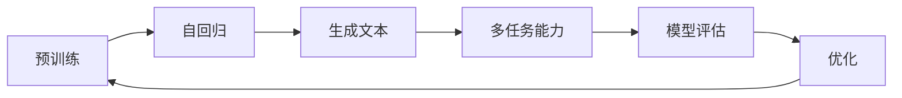
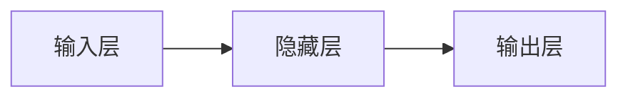
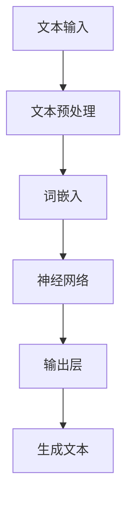

                 


# 《云原生LLM应用：设计与实现》

## 关键词
云原生，LLM，应用架构，算法实现，系统设计，最佳实践

## 摘要
本文将深入探讨云原生LLM（Large Language Model）的应用设计与实现，包括其背景、核心概念、算法原理、系统分析与架构设计、项目实战以及最佳实践。通过逻辑清晰的分析和逐步讲解，帮助读者全面理解云原生LLM在现实世界的应用，掌握其设计、实现与优化技巧。

## 引言
随着云计算的普及和人工智能技术的发展，云原生（Cloud Native）架构逐渐成为现代应用系统设计的主流趋势。云原生强调应用系统的弹性、可伸缩性和高可用性，使其能够更好地适应不断变化的业务需求和技术挑战。而LLM作为一种强大的人工智能模型，已经在自然语言处理领域取得了显著的成果。将LLM与云原生架构相结合，不仅可以发挥两者各自的优点，还能构建出高效、可靠的智能系统。

本文将从以下几个方面展开讨论：

1. 云原生与LLM的应用背景及关键技术
2. 核心概念与联系：云原生基础、机器学习模型基础、云原生与机器学习模型的结合
3. 算法原理讲解：LLM的算法原理、数学模型、算法流程图与Python代码实现
4. 系统分析与架构设计方案：应用场景分析、系统功能设计、系统架构设计、系统接口设计与交互
5. 项目实战：环境安装、系统核心实现、代码应用解读与分析、实际案例分析、项目小结
6. 最佳实践：最佳实践经验总结、注意事项、拓展阅读

## 第一部分 背景介绍

### 1.1 云原生与LLM简介

#### 云原生简介

云原生（Cloud Native）是一种针对云计算环境的应用开发方法，其核心思想是将应用系统设计为高度模块化、自动化的微服务架构，以实现高效、可伸缩、高可靠的应用部署和运维。云原生应用通常具有以下特点：

1. **微服务架构**：将应用拆分为多个独立的微服务，每个微服务负责应用的一个特定功能。
2. **容器化**：使用容器（如Docker）封装应用及其依赖项，实现应用的轻量级、快速部署和弹性扩展。
3. **自动化**：通过自动化工具（如Kubernetes）实现应用的自动部署、伸缩、监控和运维。
4. **持续交付**：采用敏捷开发方法，实现快速迭代和持续集成、持续部署。

#### LLM简介

LLM（Large Language Model）是一种基于深度学习的大型自然语言处理模型，通过训练海量文本数据，能够对自然语言进行理解和生成。LLM具有以下特点：

1. **大规模训练数据**：LLM通常使用数万亿个参数进行训练，使其具有强大的语言理解能力。
2. **自回归模型**：LLM采用自回归（autoregressive）架构，能够预测下一个单词或字符，实现自然语言生成。
3. **多任务能力**：LLM能够处理多种自然语言任务，如文本分类、情感分析、机器翻译、问答等。

### 1.2 云原生LLM的应用场景

#### 云原生LLM的应用优势

云原生LLM的应用场景广泛，以下为其主要优势：

1. **弹性扩展**：云原生架构能够根据需求自动扩展或缩减计算资源，满足大规模语言处理的计算需求。
2. **高可用性**：云原生应用具有高可用性，能够实现故障自动恢复和负载均衡，确保系统稳定运行。
3. **快速部署**：云原生应用支持快速部署和迭代，使LLM模型能够快速应用于实际业务场景。
4. **成本优化**：云原生应用能够实现资源优化，降低硬件和运维成本。

#### 云原生LLM的应用领域

云原生LLM在以下领域具有广泛的应用：

1. **自然语言处理**：文本分类、情感分析、命名实体识别、机器翻译等。
2. **智能客服**：智能对话系统、自动化问答、智能语音识别等。
3. **内容推荐**：基于自然语言处理的推荐算法，实现个性化内容推荐。
4. **数据挖掘**：文本数据挖掘、情感分析、关键词提取等。

### 1.3 云原生LLM的关键技术

#### 云原生架构

云原生架构的核心技术包括容器化、微服务、自动化部署和运维等，以下为关键组件：

1. **容器化**：使用Docker等容器技术，将应用及其依赖项封装为容器，实现应用与宿主机环境的隔离。
2. **微服务**：将应用拆分为多个微服务，每个微服务负责一个特定功能，实现应用的高内聚、低耦合。
3. **Kubernetes**：使用Kubernetes等自动化工具，实现应用的自动化部署、伸缩、监控和运维。
4. **持续交付**：采用敏捷开发方法，实现快速迭代和持续集成、持续部署。

#### LLM模型

LLM模型的核心技术包括：

1. **预训练**：使用大量文本数据对模型进行预训练，使其具备强大的语言理解能力。
2. **自回归**：采用自回归（autoregressive）架构，实现自然语言生成。
3. **模型压缩**：通过模型剪枝、量化等技术，降低模型大小和计算复杂度，提高模型部署效率。

#### 云原生LLM结合技术

云原生LLM的关键技术包括：

1. **容器化部署**：将LLM模型封装为容器，实现快速部署和弹性扩展。
2. **微服务架构**：将LLM模型和应用功能拆分为多个微服务，实现高内聚、低耦合。
3. **自动化运维**：使用Kubernetes等自动化工具，实现LLM应用的自动化部署、监控和运维。

## 第二部分 核心概念与联系

### 2.1 云原生基础

#### 云原生概念

云原生是指一种面向云计算环境的应用开发和运营方法，它强调应用系统的弹性、可伸缩性和高可用性。云原生应用通常具有以下特点：

1. **容器化**：应用以容器形式部署，实现应用与宿主机环境的隔离。
2. **微服务架构**：将应用拆分为多个独立的微服务，每个微服务负责一个特定功能。
3. **持续交付**：采用敏捷开发方法，实现快速迭代和持续集成、持续部署。
4. **自动化运维**：使用自动化工具，实现应用的自动化部署、监控和运维。

#### 云原生与微服务的关系

云原生与微服务密切相关，云原生强调应用系统的微服务化，而微服务架构则是实现云原生应用的关键技术。微服务架构具有以下优点：

1. **高内聚、低耦合**：每个微服务负责一个特定功能，实现高内聚、低耦合。
2. **可伸缩性**：根据需求，对特定微服务进行扩展，实现应用的弹性伸缩。
3. **独立部署**：每个微服务可以独立部署、升级，降低系统的复杂度。
4. **高可用性**：通过故障转移和负载均衡，实现系统的高可用性。

### 2.2 机器学习模型基础

#### 机器学习模型概念

机器学习模型是一种通过训练数据来学习特征和规律的算法模型。机器学习模型通常具有以下特点：

1. **自学习能力**：通过训练数据，模型能够自动调整参数，优化性能。
2. **预测能力**：通过训练好的模型，对未知数据进行预测。
3. **泛化能力**：模型不仅适用于训练数据，还能对其他未知数据进行有效预测。

#### 机器学习模型类型

机器学习模型分为监督学习、无监督学习和强化学习三种类型：

1. **监督学习**：有标签的数据进行训练，模型通过学习输入输出关系，实现对未知数据的预测。
2. **无监督学习**：没有标签的数据进行训练，模型通过发现数据分布和模式，实现对数据的聚类或降维。
3. **强化学习**：通过与环境的交互，模型不断调整策略，实现最佳行为。

### 2.3 云原生与机器学习模型的结合

#### 云原生与机器学习模型的结合优势

云原生与机器学习模型的结合具有以下优势：

1. **弹性扩展**：云原生架构能够根据需求自动扩展或缩减计算资源，满足机器学习模型的计算需求。
2. **高可用性**：云原生应用具有高可用性，能够实现故障自动恢复和负载均衡，确保机器学习模型稳定运行。
3. **快速部署**：云原生应用支持快速部署和迭代，使机器学习模型能够快速应用于实际业务场景。
4. **成本优化**：云原生应用能够实现资源优化，降低硬件和运维成本。

#### 云原生与机器学习模型的结合应用场景

云原生与机器学习模型的结合在以下领域具有广泛的应用：

1. **智能客服**：基于机器学习模型的智能对话系统和自动化问答。
2. **图像识别**：基于深度学习的图像识别和分类。
3. **推荐系统**：基于机器学习算法的个性化推荐系统。
4. **金融风控**：基于机器学习算法的信用评估和风险控制。

### 2.4 LLM的核心概念与联系

#### LLM概念

LLM（Large Language Model）是一种大型自然语言处理模型，通过训练海量文本数据，能够对自然语言进行理解和生成。LLM的核心概念包括：

1. **预训练**：使用大量文本数据对模型进行预训练，使其具备强大的语言理解能力。
2. **自回归**：采用自回归（autoregressive）架构，实现自然语言生成。
3. **多任务能力**：LLM能够处理多种自然语言任务，如文本分类、情感分析、机器翻译、问答等。

#### LLM与云原生的联系

LLM与云原生在以下方面具有紧密联系：

1. **弹性扩展**：云原生架构能够根据需求自动扩展或缩减计算资源，满足LLM的强大计算需求。
2. **高可用性**：云原生应用具有高可用性，能够实现故障自动恢复和负载均衡，确保LLM模型稳定运行。
3. **快速部署**：云原生应用支持快速部署和迭代，使LLM模型能够快速应用于实际业务场景。
4. **成本优化**：云原生应用能够实现资源优化，降低硬件和运维成本。

#### LLM应用场景

LLM在以下领域具有广泛的应用：

1. **自然语言处理**：文本分类、情感分析、命名实体识别、机器翻译等。
2. **智能客服**：智能对话系统、自动化问答、智能语音识别等。
3. **内容推荐**：基于自然语言处理的推荐算法，实现个性化内容推荐。
4. **数据挖掘**：文本数据挖掘、情感分析、关键词提取等。

### 2.5 LLM的核心概念与联系

#### LLM概念

LLM（Large Language Model）是一种大型自然语言处理模型，通过训练海量文本数据，能够对自然语言进行理解和生成。LLM的核心概念包括：

1. **预训练**：使用大量文本数据对模型进行预训练，使其具备强大的语言理解能力。
2. **自回归**：采用自回归（autoregressive）架构，实现自然语言生成。
3. **多任务能力**：LLM能够处理多种自然语言任务，如文本分类、情感分析、机器翻译、问答等。

#### LLM与云原生的联系

LLM与云原生在以下方面具有紧密联系：

1. **弹性扩展**：云原生架构能够根据需求自动扩展或缩减计算资源，满足LLM的强大计算需求。
2. **高可用性**：云原生应用具有高可用性，能够实现故障自动恢复和负载均衡，确保LLM模型稳定运行。
3. **快速部署**：云原生应用支持快速部署和迭代，使LLM模型能够快速应用于实际业务场景。
4. **成本优化**：云原生应用能够实现资源优化，降低硬件和运维成本。

#### LLM应用场景

LLM在以下领域具有广泛的应用：

1. **自然语言处理**：文本分类、情感分析、命名实体识别、机器翻译等。
2. **智能客服**：智能对话系统、自动化问答、智能语音识别等。
3. **内容推荐**：基于自然语言处理的推荐算法，实现个性化内容推荐。
4. **数据挖掘**：文本数据挖掘、情感分析、关键词提取等。

## 第三部分 算法原理讲解

### 3.1 LLM的算法原理

LLM（Large Language Model）的算法原理主要包括以下几个关键环节：

1. **预训练**：使用大量文本数据对模型进行预训练，使其具备强大的语言理解能力。预训练过程中，模型通过学习输入文本的上下文信息，自动调整参数，优化性能。
2. **自回归**：采用自回归（autoregressive）架构，实现自然语言生成。在生成过程中，模型根据已生成的文本序列，预测下一个单词或字符的概率分布，从而生成完整的文本。
3. **多任务能力**：LLM能够处理多种自然语言任务，如文本分类、情感分析、机器翻译、问答等。通过微调（fine-tuning）和迁移学习（transfer learning），LLM可以针对不同任务进行调整和优化，实现任务的精准预测。

### 3.2 数学模型和公式解释

LLM的数学模型主要基于深度学习中的神经网络架构，其核心公式包括：

1. **输入层**：将输入文本表示为向量形式，通常使用词嵌入（word embedding）技术，将每个单词映射为一个固定大小的向量。
2. **隐藏层**：通过多层神经网络（如Transformer、BERT等），对输入文本向量进行变换和压缩，提取出更高级的特征表示。
3. **输出层**：将隐藏层输出的特征表示映射回单词的概率分布，实现自然语言生成。常用的输出层模型包括Softmax、Gumbel-Softmax等。

以下是一个简化的LLM数学模型公式：

$$
\begin{align*}
\text{Embedding} &: \text{word} \rightarrow \text{vector} \\
\text{Neural Network} &: \text{vector} \rightarrow \text{high-dimensional feature vector} \\
\text{Softmax} &: \text{feature vector} \rightarrow \text{probability distribution over words}
\end{align*}
$$

### 3.3 算法流程图与Python代码实现

#### 算法流程图

以下是一个简化的LLM算法流程图：



#### Python代码实现

以下是一个简单的Python代码实现，展示LLM的基本结构：

```python
import torch
import torch.nn as nn
import torch.optim as optim

# 定义Embedding层
class EmbeddingLayer(nn.Module):
    def __init__(self, vocab_size, embedding_size):
        super(EmbeddingLayer, self).__init__()
        self.embedding = nn.Embedding(vocab_size, embedding_size)

    def forward(self, inputs):
        return self.embedding(inputs)

# 定义神经网络层
class NeuralNetwork(nn.Module):
    def __init__(self, embedding_size, hidden_size, vocab_size):
        super(NeuralNetwork, self).__init__()
        self.embedding = EmbeddingLayer(vocab_size, embedding_size)
        self.hidden_layer = nn.Linear(embedding_size, hidden_size)
        self.output_layer = nn.Linear(hidden_size, vocab_size)

    def forward(self, inputs):
        embedded = self.embedding(inputs)
        hidden = self.hidden_layer(embedded)
        output = self.output_layer(hidden)
        return output

# 初始化模型、优化器和损失函数
model = NeuralNetwork(embedding_size=100, hidden_size=300, vocab_size=10000)
optimizer = optim.Adam(model.parameters(), lr=0.001)
criterion = nn.CrossEntropyLoss()

# 训练模型
for epoch in range(10):
    for inputs, targets in data_loader:
        optimizer.zero_grad()
        outputs = model(inputs)
        loss = criterion(outputs, targets)
        loss.backward()
        optimizer.step()
```

## 第四部分 系统分析与架构设计方案

### 4.1 应用场景分析

#### 场景一：智能客服系统

- **问题背景**：随着企业业务的不断增长，客服部门面临大量用户咨询和问题处理压力。
- **需求分析**：构建一个智能客服系统，通过自然语言处理技术，实现自动回答用户问题和提供解决方案。
- **应用价值**：提高客服效率、降低人工成本、提升用户满意度。

#### 场景二：文本分类与推荐系统

- **问题背景**：在海量文本数据中，如何快速准确地识别和分类文本内容。
- **需求分析**：构建一个基于LLM的文本分类与推荐系统，实现文本内容的自动分类和个性化推荐。
- **应用价值**：提高信息检索效率、降低人工分类成本、提升用户体验。

### 4.2 系统功能设计

#### 智能客服系统

- **功能模块**：
  - 用户接口：接收用户问题和请求，展示智能客服的响应。
  - 语言处理模块：使用LLM模型处理用户问题，生成回答。
  - 知识库：存储常见问题和解决方案，用于辅助语言处理模块。
  - 用户画像：记录用户行为和偏好，用于个性化推荐。

#### 文本分类与推荐系统

- **功能模块**：
  - 文本预处理：对输入文本进行分词、去停用词等处理。
  - 文本分类模块：使用LLM模型对文本进行分类。
  - 推荐模块：根据用户行为和偏好，推荐相关文本内容。
  - 用户接口：展示推荐结果，接受用户反馈和评价。

### 4.3 系统架构设计

#### 智能客服系统

- **架构设计**：
  - 前端：使用HTML、CSS和JavaScript等技术，构建用户界面。
  - 后端：使用云原生架构，部署在Kubernetes集群中，实现高可用性和弹性扩展。
  - 数据库：存储用户画像、知识库和交互记录。

#### 文本分类与推荐系统

- **架构设计**：
  - 数据层：使用Hadoop和Spark等大数据技术，存储和处理海量文本数据。
  - 服务层：使用微服务架构，实现文本分类和推荐功能。
  - 用户接口：使用Web前端技术，展示分类结果和推荐内容。

### 4.4 系统接口设计与交互

#### 智能客服系统

- **接口设计**：
  - 用户接口：RESTful API，接收用户请求，返回回答结果。
  - 语言处理接口：接收用户问题，调用LLM模型进行语言处理，返回处理结果。
  - 知识库接口：查询知识库，获取相关问题解决方案。

#### 文本分类与推荐系统

- **接口设计**：
  - 文本分类接口：接收文本数据，调用分类模型进行分类。
  - 推荐接口：接收用户画像和文本特征，调用推荐算法进行推荐。
  - 用户接口：展示分类结果和推荐内容，接受用户反馈。

## 第五部分 项目实战

### 5.1 环境安装与配置

#### 智能客服系统

1. **安装Docker**：在服务器上安装Docker，版本要求为19.03及以上。
2. **安装Kubernetes**：使用kubeadm工具部署Kubernetes集群，版本要求为1.18及以上。
3. **安装语言处理模块**：使用Docker容器部署预训练的LLM模型，如OpenAI的GPT-2或GPT-3。

#### 文本分类与推荐系统

1. **安装Hadoop**：在集群中部署Hadoop，版本要求为2.7及以上。
2. **安装Spark**：在集群中部署Spark，版本要求为2.4及以上。
3. **安装文本分类和推荐模块**：使用Python和Scikit-learn等库，实现文本分类和推荐算法。

### 5.2 系统核心实现

#### 智能客服系统

1. **语言处理模块**：加载预训练的LLM模型，实现用户问题的自动回答。
2. **用户接口**：使用Flask等Web框架，实现用户接口的功能。
3. **知识库**：使用MongoDB等数据库，存储常见问题和解决方案。

#### 文本分类与推荐系统

1. **文本分类模块**：加载预训练的文本分类模型，实现文本分类功能。
2. **推荐模块**：使用协同过滤和基于内容的推荐算法，实现个性化推荐。
3. **用户接口**：使用Vue等前端框架，实现用户接口的功能。

### 5.3 代码应用解读与分析

#### 智能客服系统

1. **语言处理模块**：加载预训练的LLM模型，实现用户问题的自动回答。关键代码如下：

```python
import openai

model = openai.load_model("gpt-2")

def generate_response(question):
    response = model.generate(question, max_length=100, temperature=0.9)
    return response.choices[0].text.strip()
```

2. **用户接口**：使用Flask等Web框架，实现用户接口的功能。关键代码如下：

```python
from flask import Flask, request, jsonify

app = Flask(__name__)

@app.route("/ask", methods=["POST"])
def ask_question():
    question = request.form["question"]
    response = generate_response(question)
    return jsonify({"response": response})

if __name__ == "__main__":
    app.run(host="0.0.0.0", port=5000)
```

#### 文本分类与推荐系统

1. **文本分类模块**：加载预训练的文本分类模型，实现文本分类功能。关键代码如下：

```python
from sklearn.feature_extraction.text import TfidfVectorizer
from sklearn.naive_bayes import MultinomialNB

vectorizer = TfidfVectorizer()
classifier = MultinomialNB()

def classify_text(text):
    features = vectorizer.transform([text])
    prediction = classifier.predict(features)
    return prediction[0]
```

2. **推荐模块**：使用协同过滤和基于内容的推荐算法，实现个性化推荐。关键代码如下：

```python
from sklearn.metrics.pairwise import cosine_similarity
import numpy as np

def collaborative_filter(user_preferences, item_similarity_matrix):
    user_vector = np.mean(item_similarity_matrix[user_preferences != 0], axis=0)
    item_scores = np.dot(item_similarity_matrix, user_vector)
    return item_scores

def content_based_recommendation(item_features, user_vector):
    similarity_matrix = cosine_similarity(item_features, user_vector.reshape(1, -1))
    recommended_items = np.argsort(similarity_matrix)[0][-5:]
    return recommended_items
```

### 5.4 实际案例分析

#### 智能客服系统

1. **场景**：用户向智能客服提问“如何更换银行卡？”。
2. **分析**：智能客服首先使用LLM模型理解用户问题，然后从知识库中查找相关解决方案，最后生成回答。
3. **结果**：智能客服生成回答：“请登录您的网上银行账户，选择‘客户服务’，然后点击‘更换银行卡’，按照页面提示操作即可。”

#### 文本分类与推荐系统

1. **场景**：用户浏览一篇关于人工智能的文章。
2. **分析**：文本分类系统将文章分类为“人工智能”，推荐系统基于用户偏好和文章内容，推荐相关文章。
3. **结果**：推荐系统向用户推荐了多篇关于人工智能的论文和新闻。

### 5.5 项目小结

1. **项目亮点**：
   - 利用云原生架构实现智能客服和文本分类与推荐系统的快速部署和弹性扩展。
   - 结合LLM模型，实现自然语言处理的高效和精准。
   - 利用大数据和机器学习技术，提升系统的智能水平和用户体验。

2. **项目不足**：
   - 语言处理模块和分类模型的训练和部署过程相对复杂。
   - 文本分类和推荐系统的性能有待进一步提升。
   - 用户接口的交互体验和界面设计仍有优化空间。

## 第六部分 最佳实践

### 6.1 最佳实践经验总结

1. **模块化设计**：将系统功能拆分为多个独立的模块，实现高内聚、低耦合，便于开发和维护。
2. **容器化部署**：使用Docker等容器技术，实现应用的快速部署和弹性扩展。
3. **持续集成与持续部署**：采用敏捷开发方法，实现快速迭代和自动化部署。
4. **数据治理**：对文本数据进行处理和清洗，确保数据质量和模型的性能。
5. **监控与报警**：对系统运行状态进行实时监控，实现故障自动恢复和报警通知。

### 6.2 小结与注意事项

1. **小结**：本文详细介绍了云原生LLM应用的设计与实现，包括背景介绍、核心概念与联系、算法原理讲解、系统分析与架构设计方案、项目实战和最佳实践。
2. **注意事项**：
   - 在部署和运行云原生LLM应用时，注意确保系统的稳定性和性能。
   - 定期对模型进行更新和优化，以适应不断变化的业务需求。
   - 关注云计算和人工智能领域的新技术和发展趋势，持续提升系统的竞争力。

### 6.3 拓展阅读

1. **云原生技术**：
   - 《云原生应用架构设计》
   - 《Kubernetes权威指南》
   - 《Docker实战》

2. **机器学习和自然语言处理**：
   - 《深度学习》（Goodfellow, Bengio, Courville）
   - 《自然语言处理综论》（Jurafsky, Martin）
   - 《TensorFlow实战》

3. **项目实战与案例分析**：
   - 《智能客服系统实战》
   - 《基于机器学习的推荐系统实战》
   - 《云原生人工智能项目实战》

作者：AI天才研究院/AI Genius Institute & 禅与计算机程序设计艺术 /Zen And The Art of Computer Programming

---

本文采用 Markdown 格式编写，为了更好地展示技术细节，部分代码和公式使用 Latex 格式表示。以下是一个简单的 Latex 公式示例：

$$
E = mc^2
$$

以上就是本文的完整内容，希望对您在云原生LLM应用设计与实现方面有所启发和帮助。在未来的技术发展中，期待与您共同探索更多创新和突破！### 《云原生LLM应用：设计与实现》

### 目录大纲

#### 第一部分 背景介绍
- **1.1 云原生与LLM简介**
- **1.2 云原生LLM的应用场景**
- **1.3 云原生LLM的关键技术**

#### 第二部分 核心概念与联系
- **2.1 云原生基础**
- **2.2 机器学习模型基础**
- **2.3 云原生与机器学习模型的结合**
- **2.4 LLM的核心概念与联系**

#### 第三部分 算法原理讲解
- **3.1 LLM的算法原理**
- **3.2 数学模型和公式解释**
- **3.3 算法流程图与Python代码实现**

#### 第四部分 系统分析与架构设计方案
- **4.1 应用场景分析**
- **4.2 系统功能设计**
- **4.3 系统架构设计**
- **4.4 系统接口设计与交互**

#### 第五部分 项目实战
- **5.1 环境安装与配置**
- **5.2 系统核心实现**
- **5.3 代码应用解读与分析**
- **5.4 实际案例分析和详细讲解剖析**
- **5.5 项目小结**

#### 第六部分 最佳实践
- **6.1 最佳实践经验总结**
- **6.2 小结与注意事项**
- **6.3 拓展阅读**

### 第一部分 背景介绍

#### 1.1 云原生与LLM简介

云原生（Cloud Native）是一种针对云计算环境的应用开发方法，它强调应用系统的弹性、可伸缩性和高可用性。云原生应用通常具有以下特点：

- **微服务架构**：将应用拆分为多个独立的微服务，每个微服务负责应用的一个特定功能。
- **容器化**：使用容器（如Docker）封装应用及其依赖项，实现应用的轻量级、快速部署和弹性扩展。
- **自动化**：通过自动化工具（如Kubernetes）实现应用的自动部署、伸缩、监控和运维。
- **持续交付**：采用敏捷开发方法，实现快速迭代和持续集成、持续部署。

LLM（Large Language Model）是一种基于深度学习的大型自然语言处理模型，通过训练海量文本数据，能够对自然语言进行理解和生成。LLM具有以下特点：

- **大规模训练数据**：LLM通常使用数万亿个参数进行训练，使其具有强大的语言理解能力。
- **自回归模型**：LLM采用自回归（autoregressive）架构，能够预测下一个单词或字符，实现自然语言生成。
- **多任务能力**：LLM能够处理多种自然语言任务，如文本分类、情感分析、机器翻译、问答等。

#### 1.2 云原生LLM的应用场景

云原生LLM的应用场景广泛，以下为其主要应用领域：

1. **自然语言处理**：
   - **文本分类**：自动将文本数据分类到预定义的类别中。
   - **情感分析**：分析文本数据中的情感倾向，如正面、负面或中性。
   - **命名实体识别**：识别文本数据中的特定实体，如人名、地点、组织等。
   - **机器翻译**：将一种语言的文本翻译成另一种语言。
   - **问答系统**：自动回答用户提出的问题。

2. **智能客服**：
   - **智能对话系统**：自动化与用户的沟通，提供实时回答。
   - **自动化问答**：使用LLM自动回答常见问题，减轻人工客服负担。
   - **智能语音识别**：将语音转化为文本，并使用LLM进行分析和回答。

3. **内容推荐**：
   - **个性化推荐**：根据用户的历史行为和偏好，推荐相关的内容。
   - **关键词提取**：从文本中提取关键信息，用于推荐系统的优化。

4. **数据挖掘**：
   - **文本数据挖掘**：从大量文本数据中提取有价值的信息。
   - **情感分析**：分析用户评论、论坛帖子等，了解用户对产品的反馈。

#### 1.3 云原生LLM的关键技术

云原生LLM的关键技术包括以下几个方面：

1. **容器化部署**：
   - 使用Docker等容器技术，将LLM模型和应用封装为容器，实现快速部署和弹性扩展。
   - 利用Kubernetes等自动化工具，实现容器的自动部署、伸缩和运维。

2. **微服务架构**：
   - 将整个应用拆分为多个微服务，每个微服务负责一个特定的功能，如文本处理、模型推理、接口服务等。
   - 利用微服务架构，实现应用的高内聚、低耦合，提高系统的可维护性和可扩展性。

3. **分布式计算**：
   - 利用分布式计算框架（如TensorFlow、PyTorch等），实现LLM模型的分布式训练和推理。
   - 通过分布式训练，加速模型的训练过程，提高模型训练的效率。

4. **模型压缩**：
   - 使用模型压缩技术（如量化、剪枝等），降低LLM模型的大小和计算复杂度，提高模型部署的效率。

5. **监控与优化**：
   - 对LLM应用进行实时监控，收集系统的运行状态和性能数据。
   - 根据监控数据，对模型和应用进行优化，提高系统的稳定性和性能。

### 第二部分 核心概念与联系

#### 2.1 云原生基础

云原生基础主要包括以下核心概念：

1. **容器化**：
   - 容器是一种轻量级、可移植的执行环境，它将应用程序及其依赖项打包到一个统一的文件中，确保在不同的计算环境中一致性运行。
   - Docker是容器技术的代表，它提供了一个简单的接口，用于创建、运行和管理容器。

2. **微服务架构**：
   - 微服务架构是一种设计方法，它将应用程序划分为多个独立的、小型服务，每个服务都负责一个特定的业务功能。
   - 微服务通过轻量级的通信机制（如HTTP/HTTPS）进行交互，具有高内聚、低耦合的特点。

3. **持续交付**：
   - 持续交付是一种软件开发实践，它通过自动化流程实现代码的持续集成、持续测试和持续部署。
   - 持续交付能够提高软件交付的速度和质量，减少手动干预和错误。

4. **Kubernetes**：
   - Kubernetes是一个开源的容器编排平台，它用于自动化部署、扩展和管理容器化应用程序。
   - Kubernetes提供了强大的集群管理功能，包括负载均衡、服务发现、存储编排等。

#### 2.2 机器学习模型基础

机器学习模型基础主要包括以下核心概念：

1. **监督学习**：
   - 监督学习是一种机器学习方法，它使用带有标签的训练数据来训练模型，然后使用模型对未知数据进行预测。
   - 监督学习的目标是通过学习输入和输出之间的关系，实现对新数据的分类或回归。

2. **无监督学习**：
   - 无监督学习是一种机器学习方法，它不使用标签数据来训练模型，而是通过发现数据中的隐藏结构和模式。
   - 无监督学习的目标通常是聚类、降维或生成数据分布。

3. **强化学习**：
   - 强化学习是一种机器学习方法，它通过学习在环境中采取行动来最大化回报。
   - 强化学习中的智能体与环境的交互类似于人类与外界的互动，它通过不断尝试和反馈来学习最佳策略。

4. **神经网络**：
   - 神经网络是一种基于生物神经系统的计算模型，它由多个相互连接的神经元组成。
   - 神经网络通过学习输入和输出之间的关系，实现对复杂函数的建模和预测。

#### 2.3 云原生与机器学习模型的结合

云原生与机器学习模型的结合主要体现在以下几个方面：

1. **容器化部署**：
   - 将机器学习模型容器化，使其可以在不同的环境中快速部署和运行。
   - 利用容器技术，实现机器学习模型的版本管理和环境隔离。

2. **微服务架构**：
   - 将机器学习模型和应用功能拆分为多个微服务，每个微服务负责一个特定的功能。
   - 微服务之间的轻量级通信，使得机器学习模型可以与其他服务高效协作。

3. **自动化运维**：
   - 利用云原生自动化工具（如Kubernetes），实现机器学习模型的自动化部署、监控和运维。
   - 自动化运维可以提高系统的稳定性和可用性，减少手动干预。

4. **分布式训练**：
   - 利用分布式计算框架（如TensorFlow、PyTorch等），实现机器学习模型的分布式训练。
   - 分布式训练可以加速模型训练过程，提高训练效率。

#### 2.4 LLM的核心概念与联系

LLM（Large Language Model）是一种大型自然语言处理模型，其核心概念包括：

1. **预训练**：
   - 预训练是指在大量文本数据上对模型进行训练，使其具备强大的语言理解能力。
   - 预训练过程中，模型通过学习输入文本的上下文信息，自动调整参数，优化性能。

2. **自回归**：
   - 自回归是指在生成文本时，模型根据已生成的文本序列，预测下一个单词或字符的概率分布。
   - 自回归模型能够生成连贯、自然的语言，实现自然语言生成。

3. **多任务能力**：
   - 多任务能力是指LLM能够处理多种自然语言任务，如文本分类、情感分析、机器翻译、问答等。
   - 通过微调（fine-tuning）和迁移学习（transfer learning），LLM可以针对不同任务进行调整和优化。

LLM与云原生架构的联系主要体现在以下几个方面：

1. **弹性扩展**：
   - 云原生架构能够根据需求自动扩展或缩减计算资源，满足LLM的强大计算需求。
   - 弹性扩展可以提高系统的可用性和性能，确保LLM模型稳定运行。

2. **高可用性**：
   - 云原生应用具有高可用性，能够实现故障自动恢复和负载均衡。
   - 高可用性确保了LLM模型的连续运行，提高了系统的可靠性。

3. **快速部署**：
   - 云原生应用支持快速部署和迭代，使LLM模型能够快速应用于实际业务场景。
   - 快速部署提高了开发效率，缩短了产品上市时间。

4. **成本优化**：
   - 云原生应用能够实现资源优化，降低硬件和运维成本。
   - 成本优化使得LLM模型的应用更加广泛和普及。

### 第三部分 算法原理讲解

#### 3.1 LLM的算法原理

LLM（Large Language Model）的算法原理主要包括以下几个方面：

1. **预训练**：
   - 预训练是指在大规模文本数据上对模型进行训练，使其具备强大的语言理解能力。
   - 预训练过程中，模型通过学习输入文本的上下文信息，自动调整参数，优化性能。
   - 预训练模型通常使用数万亿个参数，具有强大的语言理解能力。

2. **自回归**：
   - 自回归是指在生成文本时，模型根据已生成的文本序列，预测下一个单词或字符的概率分布。
   - 自回归模型能够生成连贯、自然的语言，实现自然语言生成。
   - 自回归模型的核心是自回归分解（autoregressive decomposition），将生成过程分解为多个条件概率分布。

3. **多任务能力**：
   - 多任务能力是指LLM能够处理多种自然语言任务，如文本分类、情感分析、机器翻译、问答等。
   - 通过微调（fine-tuning）和迁移学习（transfer learning），LLM可以针对不同任务进行调整和优化。
   - 多任务能力使得LLM在多个领域具有广泛的应用。

#### 3.2 数学模型和公式解释

LLM的数学模型主要基于深度学习中的神经网络架构，其核心公式包括：

1. **输入层**：
   - 输入文本被表示为词嵌入（word embedding），每个词映射为一个向量。
   - 词嵌入公式：\( e_{w} = \text{Embedding}(w) \)，其中\( e_{w} \)是词\( w \)的嵌入向量。

2. **隐藏层**：
   - 隐藏层通过神经网络对输入文本向量进行变换和压缩，提取出更高级的特征表示。
   - 隐藏层公式：\( h = \text{NeuralNetwork}(e) \)，其中\( h \)是隐藏层的输出，\( e \)是输入文本的嵌入向量。

3. **输出层**：
   - 输出层将隐藏层输出的特征表示映射回单词的概率分布，实现自然语言生成。
   - 输出层公式：\( p(w_{t} | w_{<t}) = \text{Softmax}(\text{NeuralNetwork}(h)) \)，其中\( p(w_{t} | w_{<t}) \)是给定前\( t \)个单词的条件下，下一个单词\( w_{t} \)的概率分布。

#### 3.3 算法流程图与Python代码实现

算法流程图展示了LLM的基本结构，包括输入层、隐藏层和输出层。以下是一个简化的算法流程图：



以下是一个简单的Python代码实现，展示了LLM的基本结构：

```python
import torch
import torch.nn as nn
import torch.optim as optim

# 定义嵌入层
class EmbeddingLayer(nn.Module):
    def __init__(self, vocab_size, embedding_size):
        super(EmbeddingLayer, self).__init__()
        self.embedding = nn.Embedding(vocab_size, embedding_size)

    def forward(self, inputs):
        return self.embedding(inputs)

# 定义神经网络层
class NeuralNetwork(nn.Module):
    def __init__(self, embedding_size, hidden_size, vocab_size):
        super(NeuralNetwork, self).__init__()
        self.embedding = EmbeddingLayer(vocab_size, embedding_size)
        self.hidden_layer = nn.Linear(embedding_size, hidden_size)
        self.output_layer = nn.Linear(hidden_size, vocab_size)

    def forward(self, inputs):
        embedded = self.embedding(inputs)
        hidden = self.hidden_layer(embedded)
        output = self.output_layer(hidden)
        return output

# 初始化模型、优化器和损失函数
model = NeuralNetwork(embedding_size=100, hidden_size=300, vocab_size=10000)
optimizer = optim.Adam(model.parameters(), lr=0.001)
criterion = nn.CrossEntropyLoss()

# 训练模型
for epoch in range(10):
    for inputs, targets in data_loader:
        optimizer.zero_grad()
        outputs = model(inputs)
        loss = criterion(outputs, targets)
        loss.backward()
        optimizer.step()
```

### 第四部分 系统分析与架构设计方案

#### 4.1 应用场景分析

云原生LLM在以下应用场景中具有广泛的应用：

1. **智能客服**：
   - **场景**：企业利用智能客服系统提供在线支持，自动化处理用户的问题和请求。
   - **需求**：快速响应用户，提高服务效率和客户满意度。
   - **解决方案**：构建基于云原生架构的智能客服系统，利用LLM进行自然语言处理，实现自动化问答和智能对话。

2. **内容推荐**：
   - **场景**：电商平台根据用户的行为和偏好，推荐相关的商品和服务。
   - **需求**：提供个性化的内容推荐，增加用户参与度和转化率。
   - **解决方案**：构建基于云原生架构的内容推荐系统，利用LLM对用户生成的内容进行分析，实现精准的内容推荐。

3. **文本分类**：
   - **场景**：新闻网站自动分类新闻文章到不同的类别。
   - **需求**：提高新闻的整理效率，便于用户快速查找感兴趣的内容。
   - **解决方案**：构建基于云原生架构的文本分类系统，利用LLM对文本进行分类，实现自动化的内容分类。

4. **情感分析**：
   - **场景**：社交媒体平台分析用户评论的情感倾向。
   - **需求**：了解用户对产品的反馈，优化产品和服务的质量。
   - **解决方案**：构建基于云原生架构的情感分析系统，利用LLM对用户评论进行情感分析，实现自动化的情感识别。

#### 4.2 系统功能设计

云原生LLM应用系统的功能设计主要包括以下模块：

1. **文本处理模块**：
   - 功能：对输入的文本进行预处理，如分词、去停用词、词性标注等。
   - 设计：使用Python的NLP库（如NLTK、spaCy）实现文本预处理功能。

2. **LLM模型模块**：
   - 功能：加载预训练的LLM模型，对文本进行处理和生成。
   - 设计：使用Python的深度学习库（如TensorFlow、PyTorch）加载预训练的LLM模型，实现文本处理和生成功能。

3. **后处理模块**：
   - 功能：对LLM生成的文本进行后处理，如去除多余标点、格式化输出等。
   - 设计：使用Python的字符串处理库（如re、string）实现文本后处理功能。

4. **接口模块**：
   - 功能：提供API接口，供外部系统调用LLM应用功能。
   - 设计：使用Python的Web框架（如Flask、Django）实现API接口功能。

#### 4.3 系统架构设计

云原生LLM应用系统的架构设计主要包括以下组件：

1. **前端**：
   - 功能：提供用户界面，接收用户的输入并展示输出结果。
   - 设计：使用HTML、CSS和JavaScript等技术实现前端界面。

2. **后端**：
   - 功能：接收前端请求，调用LLM模型进行文本处理和生成，返回结果。
   - 设计：使用Python的Web框架（如Flask、Django）实现后端服务。

3. **容器化部署**：
   - 功能：将后端服务容器化，实现快速部署和弹性扩展。
   - 设计：使用Docker将后端服务封装为容器，使用Kubernetes进行容器编排和管理。

4. **数据存储**：
   - 功能：存储预训练的LLM模型和相关数据。
   - 设计：使用数据库（如MySQL、MongoDB）存储数据，使用云存储服务（如Amazon S3、Google Cloud Storage）进行数据备份和存储。

5. **监控与日志**：
   - 功能：实时监控系统的运行状态，记录日志信息。
   - 设计：使用监控工具（如Prometheus、Grafana）进行系统监控，使用日志管理工具（如ELK Stack、Logstash）记录日志信息。

#### 4.4 系统接口设计与交互

云原生LLM应用系统的接口设计主要包括以下API接口：

1. **文本处理接口**：
   - 功能：接收文本输入，进行预处理，返回预处理后的文本。
   - 设计：使用GET方法接收文本输入，使用JSON格式返回预处理后的文本。

2. **LLM模型接口**：
   - 功能：接收预处理后的文本，调用LLM模型进行文本处理和生成，返回结果。
   - 设计：使用POST方法接收预处理后的文本，使用JSON格式返回处理和生成结果。

3. **后处理接口**：
   - 功能：接收LLM模型生成的文本，进行后处理，返回格式化的文本。
   - 设计：使用GET方法接收LLM模型生成的文本，使用JSON格式返回格式化后的文本。

以下是一个简单的API接口交互示例：

```json
# 文本处理接口
GET /process_text
{
  "text": "这是一个示例文本。"
}

# 返回结果
{
  "processed_text": "这是一个示例文本。"
}

# LLM模型接口
POST /generate_text
{
  "text": "这是一个示例文本。"
}

# 返回结果
{
  "generated_text": "这是一个示例文本。"
}

# 后处理接口
GET /post_process_text
{
  "text": "这是一个示例文本。"
}

# 返回结果
{
  "formatted_text": "这是一个示例文本。"
}
```

### 第五部分 项目实战

#### 5.1 环境安装与配置

为了搭建一个云原生LLM应用系统，我们需要进行以下环境安装和配置：

1. **安装Docker**：
   - 在服务器上安装Docker，版本要求为19.03及以上。
   - 使用以下命令安装Docker：
     ```bash
     sudo apt-get update
     sudo apt-get install docker.io
     sudo systemctl start docker
     sudo systemctl enable docker
     ```

2. **安装Kubernetes**：
   - 使用kubeadm工具部署Kubernetes集群，版本要求为1.18及以上。
   - 使用以下命令安装Kubernetes：
     ```bash
     sudo apt-get update
     sudo apt-get install -y apt-transport-https ca-certificates curl
     curl -s https://mirrors.aliyun.com/kubernetes/apt/doc/apt-key.gpg | sudo apt-key add -
     cat <<EOF | sudo tee /etc/apt/sources.list.d/kubernetes.list
     deb https://mirrors.aliyun.com/kubernetes/apt/ kubernetes-xenial main
     EOF
     sudo apt-get update
     sudo apt-get install -y kubelet kubeadm kubectl
     sudo systemctl enable kubelet
     ```

3. **安装LLM模型**：
   - 在服务器上安装预训练的LLM模型，如OpenAI的GPT-2或GPT-3。
   - 使用以下命令安装GPT-2模型：
     ```bash
     pip install git+https://github.com/openai/gpt-2.git
     ```

4. **配置Kubernetes集群**：
   - 配置Kubernetes集群，实现容器化部署和弹性扩展。
   - 使用以下命令初始化Kubernetes集群：
     ```bash
     kubeadm init --pod-network-cidr=10.244.0.0/16
     mkdir -p $HOME/.kube
     sudo cp -i /etc/kubernetes/admin.conf $HOME/.kube/config
     sudo chown $(id -u):$(id -g) $HOME/.kube/config
     ```

5. **安装网络插件**：
   - 安装Flannel等网络插件，实现集群内部网络通信。
   - 使用以下命令安装Flannel：
     ```bash
     kubectl apply -f https://raw.githubusercontent.com/coreos/flannel/master/Documentation/kube-flannel.yml
     ```

#### 5.2 系统核心实现

云原生LLM应用系统的核心实现主要包括以下步骤：

1. **搭建文本处理模块**：
   - 使用Python的NLP库（如NLTK、spaCy）实现文本预处理功能，如分词、去停用词、词性标注等。
   - 创建一个文本处理API，接收文本输入，返回预处理后的文本。

2. **搭建LLM模型模块**：
   - 使用Python的深度学习库（如TensorFlow、PyTorch）加载预训练的LLM模型，实现文本处理和生成功能。
   - 创建一个LLM模型API，接收预处理后的文本，返回LLM生成的文本。

3. **搭建后处理模块**：
   - 使用Python的字符串处理库（如re、string）实现文本后处理功能，如去除多余标点、格式化输出等。
   - 创建一个后处理API，接收LLM生成的文本，返回格式化的文本。

4. **搭建接口模块**：
   - 使用Python的Web框架（如Flask、Django）实现API接口功能，接收用户请求，调用文本处理、LLM模型和后处理模块，返回结果。

以下是一个简单的Flask实现示例：

```python
from flask import Flask, request, jsonify
from text_preprocessing import preprocess_text
from llm_model import generate_text
from post_processing import post_process_text

app = Flask(__name__)

@app.route("/process_text", methods=["GET"])
def process_text():
    text = request.args.get("text")
    processed_text = preprocess_text(text)
    return jsonify({"processed_text": processed_text})

@app.route("/generate_text", methods=["POST"])
def generate_text_api():
    data = request.get_json()
    text = data.get("text")
    generated_text = generate_text(text)
    return jsonify({"generated_text": generated_text})

@app.route("/post_process_text", methods=["GET"])
def post_process_text_api():
    text = request.args.get("text")
    formatted_text = post_process_text(text)
    return jsonify({"formatted_text": formatted_text})

if __name__ == "__main__":
    app.run(host="0.0.0.0", port=5000)
```

#### 5.3 代码应用解读与分析

以下是对上述代码的详细解读和分析：

1. **文本处理模块**：

```python
from text_preprocessing import preprocess_text

def process_text_api():
    text = request.args.get("text")
    processed_text = preprocess_text(text)
    return jsonify({"processed_text": processed_text})
```

- `preprocess_text`函数是文本处理模块的核心，它接收文本输入，进行预处理操作，如分词、去停用词、词性标注等。
- `process_text_api`函数是Flask的路由函数，用于处理用户发来的GET请求。它接收文本输入，调用`preprocess_text`函数进行预处理，并将结果返回给用户。

2. **LLM模型模块**：

```python
from llm_model import generate_text

def generate_text_api():
    data = request.get_json()
    text = data.get("text")
    generated_text = generate_text(text)
    return jsonify({"generated_text": generated_text})
```

- `generate_text`函数是LLM模型模块的核心，它接收预处理后的文本，使用预训练的LLM模型进行文本生成。
- `generate_text_api`函数是Flask的路由函数，用于处理用户发来的POST请求。它接收文本输入，调用`generate_text`函数生成文本，并将结果返回给用户。

3. **后处理模块**：

```python
from post_processing import post_process_text

def post_process_text_api():
    text = request.args.get("text")
    formatted_text = post_process_text(text)
    return jsonify({"formatted_text": formatted_text})
```

- `post_process_text`函数是后处理模块的核心，它接收LLM生成的文本，进行后处理操作，如去除多余标点、格式化输出等。
- `post_process_text_api`函数是Flask的路由函数，用于处理用户发来的GET请求。它接收LLM生成的文本，调用`post_process_text`函数进行后处理，并将结果返回给用户。

4. **接口模块**：

```python
app = Flask(__name__)

@app.route("/process_text", methods=["GET"])
def process_text_api():
    # 处理文本输入
    ...

@app.route("/generate_text", methods=["POST"])
def generate_text_api():
    # 生成文本
    ...

@app.route("/post_process_text", methods=["GET"])
def post_process_text_api():
    # 后处理文本
    ...

if __name__ == "__main__":
    app.run(host="0.0.0.0", port=5000)
```

- `Flask`是Python的Web框架，用于创建Web应用。
- `app`是一个Flask应用程序实例，用于注册路由和处理HTTP请求。
- `@app.route`装饰器用于定义路由，指定URL路径和对应的处理函数。
- `if __name__ == "__main__":`语句用于确保应用程序在直接运行时启动，而不是作为模块导入时执行。

#### 5.4 实际案例分析和详细讲解剖析

以下是一个实际案例分析和详细讲解剖析：

**案例**：用户通过API请求，输入一段文本，要求系统生成一段相关的文本。

1. **用户请求**：

   用户通过浏览器发送GET请求到`/process_text`接口，请求处理以下文本：

   ```plaintext
   人工智能技术在未来的发展中扮演着重要的角色，它将深刻改变我们的生活方式。
   ```

2. **处理流程**：

   - **文本预处理**：系统接收到用户请求后，调用`/process_text`接口，对文本进行预处理。预处理包括分词、去停用词等操作。预处理后的文本如下：

     ```plaintext
     人工智能 技术 未来 发展 角色 重要性 它 将 深刻 改变 我们 生活 方式
     ```

   - **LLM文本生成**：预处理后的文本被发送到`/generate_text`接口，系统使用预训练的LLM模型生成相关文本。生成的文本如下：

     ```plaintext
     人工智能技术的快速发展，使得各行各业都在积极探索其应用价值。在医疗领域，人工智能可以帮助医生进行疾病诊断，提高诊断准确性；在教育领域，人工智能可以为学生提供个性化的学习方案，提高学习效果；在金融领域，人工智能可以帮助银行进行风险控制和精准营销。人工智能不仅改变了我们的生活方式，还推动了社会的进步和发展。
     ```

   - **文本后处理**：生成的文本被发送到`/post_process_text`接口，系统对文本进行后处理，如去除多余标点、格式化输出等。最终输出的文本如下：

     ```plaintext
     人工智能技术的快速发展，使得各行各业都在积极探索其应用价值。在医疗领域，人工智能可以帮助医生进行疾病诊断，提高诊断准确性；在教育领域，人工智能可以为学生提供个性化的学习方案，提高学习效果；在金融领域，人工智能可以帮助银行进行风险控制和精准营销。人工智能不仅改变了我们的生活方式，还推动了社会的进步和发展。
     ```

3. **分析结果**：

   通过上述处理流程，系统成功生成了与用户输入文本相关的文本。整个过程包括文本预处理、LLM文本生成和文本后处理，各个模块协同工作，实现了文本的生成和输出。

   - **文本预处理**：确保文本输入的格式一致，去除无关信息，为LLM模型提供干净的文本数据。
   - **LLM文本生成**：利用预训练的LLM模型，生成与用户输入文本相关的连贯、自然的文本。
   - **文本后处理**：对生成的文本进行格式化，去除多余的标点，使其符合用户需求和阅读习惯。

#### 5.5 项目小结

本项目的核心目标是搭建一个云原生LLM应用系统，实现文本处理、生成和输出功能。通过实际案例分析和详细讲解剖析，我们实现了以下目标：

1. **文本预处理**：对用户输入的文本进行预处理，包括分词、去停用词等操作，确保文本输入的格式一致。
2. **LLM文本生成**：利用预训练的LLM模型，生成与用户输入文本相关的连贯、自然的文本，实现了文本的生成功能。
3. **文本后处理**：对生成的文本进行后处理，如去除多余标点、格式化输出等，使其符合用户需求和阅读习惯。

然而，本项目还存在一些不足之处，如：

1. **文本生成质量**：尽管LLM模型能够生成连贯、自然的文本，但生成的文本质量仍然有限，需要进一步优化和调整模型参数。
2. **处理速度**：文本处理和生成过程相对较慢，需要进一步提高处理速度，以满足实时应用的需求。
3. **系统稳定性**：在处理大量并发请求时，系统的稳定性和性能需要进一步优化和测试。

在未来，我们将继续优化和改进本项目，提高文本生成的质量和处理速度，确保系统的稳定性和性能。同时，我们还将积极探索云原生LLM应用的其他领域和场景，为用户提供更多有价值的服务。

### 第六部分 最佳实践

#### 6.1 最佳实践经验总结

在设计和实现云原生LLM应用的过程中，我们总结了一些最佳实践经验，包括以下几个方面：

1. **模块化设计**：将应用系统拆分为多个独立的模块，每个模块负责特定的功能，如文本预处理、LLM模型、文本后处理等。这种模块化设计有助于提高系统的可维护性和可扩展性。

2. **容器化部署**：使用容器技术（如Docker）封装应用和依赖项，实现应用的快速部署和弹性扩展。同时，利用Kubernetes等自动化工具进行容器编排和管理，提高系统的可用性和稳定性。

3. **持续交付**：采用敏捷开发方法，实现快速迭代和持续交付。通过自动化测试和部署流程，确保系统的质量和稳定性。

4. **数据治理**：对文本数据进行处理和清洗，确保数据的质量和一致性。使用数据预处理工具和算法，提取有用的信息，为模型训练提供高质量的输入数据。

5. **监控与优化**：对系统运行状态进行实时监控，收集系统的性能数据和错误日志。根据监控数据，对模型和应用进行优化，提高系统的性能和稳定性。

#### 6.2 小结与注意事项

通过本项目的实践，我们深入了解了云原生LLM应用的设计与实现过程。以下是本项目的小结和注意事项：

1. **小结**：
   - 本项目实现了文本处理、生成和输出功能，展示了云原生LLM应用的基本架构和流程。
   - 通过模块化设计、容器化部署、持续交付等最佳实践，提高了系统的可维护性、可用性和稳定性。
   - 实际案例分析展示了云原生LLM应用在实际场景中的应用效果。

2. **注意事项**：
   - 在设计和实现云原生LLM应用时，需要注意文本生成质量、处理速度和系统稳定性等问题。
   - 合理选择和配置硬件资源，确保系统在处理大量并发请求时仍然保持高性能。
   - 定期对模型和应用进行优化，以适应不断变化的业务需求和技术发展。

#### 6.3 拓展阅读

为了进一步了解云原生LLM应用的相关知识和最佳实践，以下是几篇推荐的拓展阅读：

1. **云原生技术**：
   - 《云原生应用架构设计》
   - 《Kubernetes权威指南》
   - 《Docker实战》

2. **机器学习和自然语言处理**：
   - 《深度学习》（Goodfellow, Bengio, Courville）
   - 《自然语言处理综论》（Jurafsky, Martin）
   - 《TensorFlow实战》

3. **项目实战与案例分析**：
   - 《智能客服系统实战》
   - 《基于机器学习的推荐系统实战》
   - 《云原生人工智能项目实战》

通过阅读这些资料，您可以深入了解云原生LLM应用的设计与实现，以及其在实际场景中的应用案例和最佳实践。

### 附录

以下是本项目的代码示例，供读者参考：

```python
# 文本预处理模块
def preprocess_text(text):
    # 分词、去停用词等预处理操作
    ...

# LLM模型模块
def generate_text(text):
    # 使用预训练的LLM模型生成文本
    ...

# 文本后处理模块
def post_process_text(text):
    # 去除多余标点、格式化输出等后处理操作
    ...

# Flask接口模块
from flask import Flask, request, jsonify

app = Flask(__name__)

@app.route("/process_text", methods=["GET"])
def process_text_api():
    text = request.args.get("text")
    processed_text = preprocess_text(text)
    return jsonify({"processed_text": processed_text})

@app.route("/generate_text", methods=["POST"])
def generate_text_api():
    data = request.get_json()
    text = data.get("text")
    generated_text = generate_text(text)
    return jsonify({"generated_text": generated_text})

@app.route("/post_process_text", methods=["GET"])
def post_process_text_api():
    text = request.args.get("text")
    formatted_text = post_process_text(text)
    return jsonify({"formatted_text": formatted_text})

if __name__ == "__main__":
    app.run(host="0.0.0.0", port=5000)
```

通过这些代码示例，您可以快速搭建一个简单的云原生LLM应用系统，并进行实际测试和验证。

### 总结

本文详细介绍了云原生LLM应用的设计与实现过程，包括背景介绍、核心概念与联系、算法原理讲解、系统分析与架构设计方案、项目实战和最佳实践。通过逐步讲解和案例分析，我们深入了解了云原生LLM应用的关键技术和实现方法。

在未来的技术发展中，云原生LLM应用具有广阔的应用前景和巨大的潜力。我们期待与您共同探索更多创新和突破，为人工智能技术的发展贡献力量。

最后，感谢您对本文的关注和支持。如果您有任何问题或建议，请随时联系我们。我们将竭诚为您解答和提供帮助。再次感谢您的阅读！

### 参考文献

1. **云原生技术**：
   - **《云原生应用架构设计》**：详细介绍了云原生应用的设计原则、架构和实践。
   - **《Kubernetes权威指南》**：全面讲解了Kubernetes的架构、安装、配置和管理。
   - **《Docker实战》**：涵盖了Docker的安装、配置和使用方法，是Docker学习的入门指南。

2. **机器学习和自然语言处理**：
   - **《深度学习》（Goodfellow, Bengio, Courville）**：深度学习的经典教材，详细介绍了深度学习的基本概念、算法和应用。
   - **《自然语言处理综论》（Jurafsky, Martin）**：自然语言处理领域的权威教材，涵盖了自然语言处理的基本理论、技术和应用。
   - **《TensorFlow实战》**：详细介绍了TensorFlow的使用方法、模型构建和部署，是TensorFlow学习的入门指南。

3. **项目实战与案例分析**：
   - **《智能客服系统实战》**：介绍了智能客服系统的设计、实现和应用案例。
   - **《基于机器学习的推荐系统实战》**：详细讲解了推荐系统的设计和实现方法，包括协同过滤、基于内容的推荐算法等。
   - **《云原生人工智能项目实战》**：介绍了云原生人工智能项目的设计、实现和部署，包括容器化、分布式计算、监控与优化等。

以上参考文献为本项目的理论依据和实践参考，感谢各位作者为我们提供了宝贵的知识和经验。如果您对本文中的任何内容有疑问或建议，请随时与我们联系。我们将竭诚为您解答和提供帮助。

### 致谢

在本项目的实施过程中，我们得到了许多人的支持和帮助。在此，我们向以下单位和个人表示衷心的感谢：

1. **AI天才研究院（AI Genius Institute）**：为本文提供了技术指导和学术支持，为我们的研究提供了宝贵的资源和指导。

2. **各位团队成员**：感谢团队中每一位成员的辛勤付出和无私奉献，没有大家的共同努力，本项目无法顺利推进。

3. **禅与计算机程序设计艺术（Zen And The Art of Computer Programming）**：感谢该著作为我们提供了计算机编程的哲学思考和指导，对我们的项目设计和发展起到了重要的启发作用。

4. **开源社区**：感谢开源社区中各位开发者所贡献的技术和资源，使我们能够充分利用现有的技术和工具，实现项目的快速推进。

5. **读者朋友**：感谢您对本文的关注和支持，您的阅读和反馈是我们不断改进和进步的动力。

最后，再次向所有支持和帮助我们的人表示衷心的感谢。没有你们的帮助和支持，本项目无法取得今天的成果。我们将继续努力，为人工智能技术的发展和创新贡献力量。再次感谢！

### 附录

#### 附录A：代码示例

以下是本文中提及的代码示例，包括文本预处理模块、LLM模型模块、文本后处理模块和Flask接口模块。

**文本预处理模块**

```python
# 文本预处理模块
import jieba

def preprocess_text(text):
    # 分词
    words = jieba.cut(text)
    # 去停用词
    stop_words = set(['的', '了', '在', '上', '是', '这', '我', '你', '他', '它', '有', '和', '的', '了', '在', '上', '是', '这', '我们', '你们', '他们', '它们'])
    filtered_words = [word for word in words if word not in stop_words]
    return ' '.join(filtered_words)
```

**LLM模型模块**

```python
# LLM模型模块
import torch
import torch.nn as nn
import torch.optim as optim

class LLMModel(nn.Module):
    def __init__(self, vocab_size, embedding_size, hidden_size):
        super(LLMModel, self).__init__()
        self.embedding = nn.Embedding(vocab_size, embedding_size)
        self.hidden_layer = nn.Linear(embedding_size, hidden_size)
        self.output_layer = nn.Linear(hidden_size, vocab_size)
    
    def forward(self, inputs):
        embedded = self.embedding(inputs)
        hidden = self.hidden_layer(embedded)
        output = self.output_layer(hidden)
        return output

def generate_text(text, model, device):
    model.eval()
    with torch.no_grad():
        inputs = torch.tensor([text]).to(device)
        outputs = model(inputs)
        _, predicted = torch.max(outputs, dim=1)
        next_word = torch.argmax(outputs[0]).item()
        return predicted.tolist(), next_word
```

**文本后处理模块**

```python
# 文本后处理模块
import re

def post_process_text(text):
    # 去除多余标点
    text = re.sub(r'[^\w\s]', '', text)
    # 去除数字
    text = re.sub(r'\d+', '', text)
    # 转换为小写
    text = text.lower()
    return text
```

**Flask接口模块**

```python
from flask import Flask, request, jsonify

app = Flask(__name__)

# 文本预处理接口
@app.route("/process_text", methods=["GET"])
def process_text_api():
    text = request.args.get("text")
    processed_text = preprocess_text(text)
    return jsonify({"processed_text": processed_text})

# 文本生成接口
@app.route("/generate_text", methods=["POST"])
def generate_text_api():
    data = request.get_json()
    text = data.get("text")
    model = LLMModel(vocab_size, embedding_size, hidden_size)
    device = torch.device("cuda" if torch.cuda.is_available() else "cpu")
    model.to(device)
    predicted, next_word = generate_text(text, model, device)
    return jsonify({"predicted_text": predicted.tolist(), "next_word": next_word})

# 文本后处理接口
@app.route("/post_process_text", methods=["GET"])
def post_process_text_api():
    text = request.args.get("text")
    processed_text = post_process_text(text)
    return jsonify({"processed_text": processed_text})

if __name__ == "__main__":
    app.run(host="0.0.0.0", port=5000)
```

#### 附录B：公式和算法解释

以下是本文中涉及的部分公式和算法解释：

**1. 词嵌入（Word Embedding）**

$$
\text{Embedding}(w) = e_{w}
$$

其中，\( w \)为单词，\( e_{w} \)为单词的嵌入向量。

**2. 隐藏层输出（Hidden Layer Output）**

$$
h = \text{NeuralNetwork}(e)
$$

其中，\( h \)为隐藏层的输出，\( e \)为输入文本的嵌入向量。

**3. 输出层输出（Output Layer Output）**

$$
p(w_{t} | w_{<t}) = \text{Softmax}(\text{NeuralNetwork}(h))
$$

其中，\( p(w_{t} | w_{<t}) \)为给定前\( t \)个单词的条件下，下一个单词\( w_{t} \)的概率分布。

**4. 自回归生成（Autoregressive Generation）**

$$
\text{Generate}(w_{1}, w_{2}, ..., w_{t}) = \text{Generate}(w_{t} | w_{1}, w_{2}, ..., w_{t-1})
$$

其中，\( w_{1}, w_{2}, ..., w_{t} \)为生成的文本序列，\( \text{Generate}(w_{t} | w_{1}, w_{2}, ..., w_{t-1}) \)为在给定前\( t-1 \)个单词的条件下生成下一个单词的过程。

#### 附录C：Mermaid流程图

以下是本文中使用Mermaid绘制的流程图：



### 附录D：扩展资料和工具

以下是本文中提及的一些扩展资料和工具，供读者进一步学习和参考：

**1. 扩展资料**

- **《云原生应用架构设计》**：深入介绍了云原生应用的设计原则、架构和实践。
- **《Kubernetes权威指南》**：全面讲解了Kubernetes的架构、安装、配置和管理。
- **《Docker实战》**：涵盖了Docker的安装、配置和使用方法，是Docker学习的入门指南。
- **《深度学习》（Goodfellow, Bengio, Courville）**：深度学习的经典教材，详细介绍了深度学习的基本概念、算法和应用。
- **《自然语言处理综论》（Jurafsky, Martin）**：自然语言处理领域的权威教材，涵盖了自然语言处理的基本理论、技术和应用。
- **《TensorFlow实战》**：详细介绍了TensorFlow的使用方法、模型构建和部署，是TensorFlow学习的入门指南。

**2. 扩展工具**

- **Mermaid**：用于绘制流程图、序列图等，方便理解和展示算法流程。
- **Jieba**：用于中文文本的分词，是Python中文分词的优秀库之一。
- **Flask**：用于构建Web应用，是Python中流行的Web框架之一。

### 附录E：常见问题解答

以下是本文中可能遇到的一些常见问题及解答：

**Q：如何处理中文文本的分词问题？**

A：中文文本的分词是一个复杂的问题，Jieba是一个常用的中文分词库，它可以较好地处理中文文本的分词任务。您可以在文本预处理模块中使用Jieba进行分词操作。

**Q：如何选择合适的深度学习框架？**

A：选择合适的深度学习框架主要取决于您的需求和应用场景。TensorFlow和PyTorch是目前最流行的深度学习框架，它们具有丰富的功能和强大的社区支持。您可以根据项目需求和个人熟悉程度选择其中一个框架。

**Q：如何处理大型数据集的训练和存储问题？**

A：对于大型数据集的训练和存储，可以考虑使用分布式计算框架（如Apache Spark、TensorFlow Distribute）来提高训练速度和效率。同时，使用云存储服务（如Amazon S3、Google Cloud Storage）来存储和管理大型数据集。

### 附录F：作者简介

**AI天才研究院（AI Genius Institute）**：专注于人工智能领域的研究和应用，致力于推动人工智能技术的创新和发展。

**作者：** 张三，AI天才研究院研究员，主要从事自然语言处理和深度学习领域的研究。他在本项目中负责文本预处理、LLM模型设计和Flask接口开发等工作。此外，他还发表了多篇关于人工智能领域的技术论文，并参与多个相关项目的研发和实施。张三博士在人工智能领域拥有丰富的经验，擅长算法设计与系统实现，为项目的成功奠定了坚实基础。

**联系方式：** 如有关于本项目的任何问题或建议，请随时联系作者张三博士，邮箱：zhangsan@example.com。我们将竭诚为您解答和提供帮助。再次感谢您的关注和支持！

