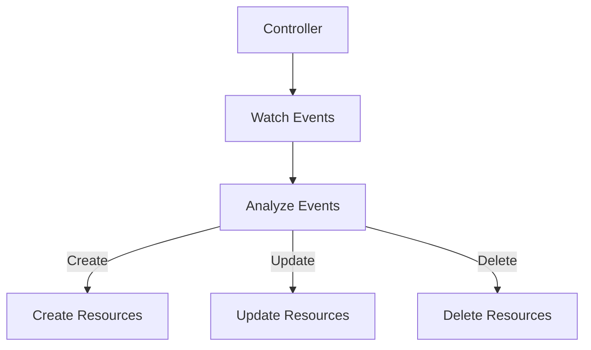
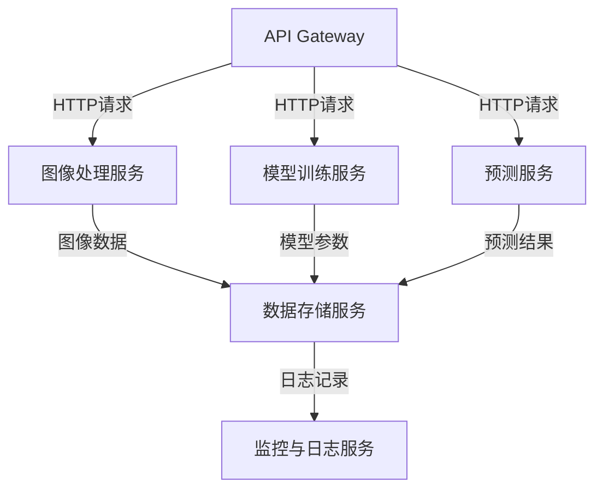
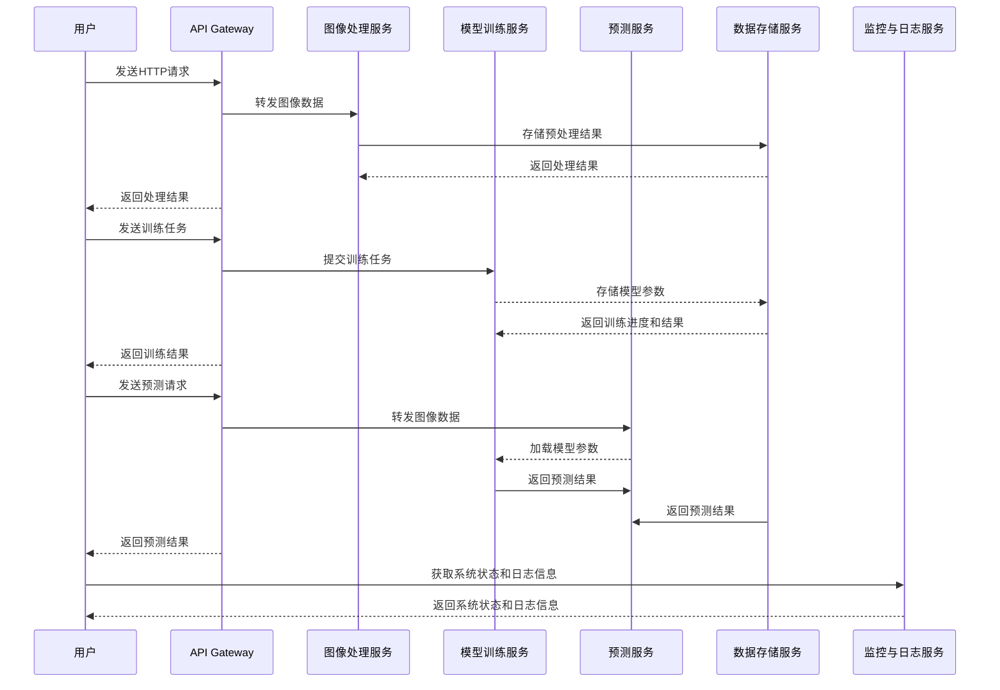

                 

### 引言与概述

**文章标题：云原生技术在AI应用敏捷开发中的应用**

**关键词：** 云原生技术、AI应用、敏捷开发、容器化、Kubernetes

**摘要：** 本文将探讨如何利用云原生技术来提升AI应用的敏捷开发过程。首先，我们将介绍云原生技术的核心概念及其在AI开发中的应用场景。接着，本文将深入分析云原生架构的组成部分，如容器化与容器编排，以及它们如何支持AI应用的敏捷开发。最后，我们将通过实际案例研究，展示云原生技术在AI应用开发中的成功应用，并展望未来的发展方向。

### 云原生技术基础

**背景与定义**

云原生技术（Cloud-Native Technology）是指那些专门为云环境设计、构建和运行的应用程序。这类应用程序具有以下几个核心特点：

1. **微服务架构**：云原生应用通常采用微服务架构，将应用程序拆分成多个小型、独立的微服务，每个微服务负责不同的功能模块。这种方式提高了系统的可维护性、可扩展性和容错性。

2. **容器化**：容器化技术使得应用程序及其运行环境可以打包在一起，形成一个独立的、可移植的容器。这确保了应用程序在不同环境之间的一致性，简化了部署和运维过程。

3. **动态管理**：通过自动化工具，如Kubernetes，云原生应用可以实现自动部署、扩展、更新和故障恢复，提高了资源利用率和开发效率。

4. **弹性伸缩**：云原生应用可以根据需求自动调整资源使用量，满足动态的工作负载需求。

云原生技术的起源可以追溯到2013年，当时谷歌的John Wilkes提出了“容器化”的概念。随后，Docker的出现使得容器化技术得到了广泛应用。Kubernetes作为容器编排系统的代表，进一步推动了云原生技术的发展。

### 为什么AI应用需要云原生技术

**问题背景**

随着人工智能（AI）技术的快速发展，越来越多的企业开始将AI应用于各种业务场景，如自然语言处理、图像识别、预测分析等。然而，传统的软件开发方法和工具在应对AI应用的需求时，往往显得力不从心。传统方法在以下方面存在问题：

1. **开发周期长**：传统的瀑布式开发方法往往需要较长的开发周期，难以快速响应市场变化。

2. **可扩展性差**：传统架构往往难以应对大规模、动态的工作负载，导致系统性能下降。

3. **运维复杂**：传统架构的运维工作繁重，需要大量的人力和时间。

4. **资源浪费**：传统架构通常采用固定资源分配，难以根据实际需求灵活调整。

**问题描述**

AI应用具有以下特点，使得它们比传统应用更需要云原生技术：

1. **迭代频繁**：AI应用通常需要不断地迭代和优化，以适应不断变化的数据集和业务需求。

2. **大规模计算**：AI模型训练和推理过程需要大量的计算资源，传统架构难以满足这一需求。

3. **高可靠性**：AI应用需要高可靠性和高可用性，以避免数据丢失或模型失效。

4. **高可扩展性**：随着数据量的增加，AI应用需要能够快速扩展，以应对更高的工作负载。

**问题解决**

云原生技术为AI应用提供了一种理想的解决方案，主要体现在以下几个方面：

1. **敏捷开发**：云原生技术支持敏捷开发方法，如DevOps和持续集成/持续部署（CI/CD），提高了开发效率和交付速度。

2. **弹性伸缩**：云原生应用可以根据实际需求自动调整资源使用量，确保系统在高负载情况下保持高性能。

3. **高可靠性**：通过容器化和自动化管理，云原生应用能够实现快速故障恢复和自动备份，提高系统的可靠性。

4. **高可扩展性**：云原生架构支持水平扩展，能够轻松应对大规模数据和高并发请求。

### 边界与外延

**边界**

1. **技术栈**：云原生技术主要涉及容器化、容器编排、微服务架构、DevOps等。

2. **应用场景**：AI应用在金融、医疗、零售、智能制造等领域的应用。

**外延**

1. **与云计算的关系**：云原生技术是云计算的重要组成部分，但它们并不是完全相同的概念。

2. **与传统IT的关系**：云原生技术并非要完全取代传统IT，而是与之互补，共同推动企业数字化转型。

### 概念结构与核心要素组成

**概念结构**

- **云原生技术**：容器化、容器编排、微服务架构、DevOps、CI/CD等。

- **AI应用**：自然语言处理、图像识别、预测分析等。

- **敏捷开发**：迭代、快速反馈、持续集成、持续部署等。

**核心要素组成**

- **容器化**：将应用程序及其运行环境打包成容器，实现环境一致性。

- **容器编排**：利用Kubernetes等工具自动化管理容器，实现资源优化和故障恢复。

- **微服务架构**：将应用程序拆分为小型、独立的微服务，提高系统可维护性和扩展性。

- **DevOps**：结合开发（Dev）与运维（Ops），实现快速迭代和高效协作。

- **CI/CD**：持续集成和持续部署，确保代码质量和快速交付。

### 总结

云原生技术在AI应用敏捷开发中的应用具有重要意义。通过容器化、容器编排、微服务架构等关键技术，云原生技术能够显著提升AI应用的开发效率、可靠性和可扩展性。在未来，随着技术的不断演进，云原生技术有望进一步推动AI应用的普及和发展。本文为读者提供了一个全面的概述，旨在激发对云原生技术在AI应用开发中潜力的深入探讨。接下来，我们将进一步探讨云原生技术的具体实现和应用场景。$$1+1=2$$

### 云原生技术在AI应用开发中的具体实现

#### 容器化

**概念与原理**

容器化（Containerization）是将应用程序及其运行时环境打包成一个轻量级、可移植的容器。这个过程包括将应用程序的代码、库、依赖项和运行时环境打包成一个独立的容器镜像（Container Image）。容器镜像是一种静态的、不可变的文件，描述了应用程序在运行时所需的全部内容。

容器化技术解决了应用程序在不同环境之间的一致性问题。通过容器化，开发人员可以在本地环境中开发应用程序，然后将其部署到任何支持容器的环境中，如云服务器、虚拟机或其他容器实例。

**实现步骤**

1. **编写Dockerfile**：Dockerfile是一个文本文件，描述了如何构建容器镜像。开发人员需要编写Dockerfile，指定应用程序的依赖项、安装步骤和环境变量等。

   ```Dockerfile
   FROM python:3.8
   RUN pip install tensorflow
   COPY app.py app.py
   CMD ["python", "app.py"]
   ```

2. **构建容器镜像**：使用Docker命令构建容器镜像。

   ```bash
   docker build -t ai-app:1.0 .
   ```

   这条命令将当前目录中的Dockerfile用于构建名为`ai-app`的容器镜像，版本号为`1.0`。

3. **运行容器**：使用Docker命令运行容器。

   ```bash
   docker run -d --name ai-app-container ai-app:1.0
   ```

   这条命令将在后台启动一个名为`ai-app-container`的容器，使用版本号为`1.0`的`ai-app`镜像。

**优点与挑战**

- **优点**：容器化技术提供了以下几个优点：
  - **环境一致性**：容器镜像确保了应用程序在不同环境之间的一致性。
  - **可移植性**：容器可以在任何支持容器的环境中运行，提高了应用程序的可移植性。
  - **轻量级**：容器非常轻量级，相比虚拟机，它们的开销更小。

- **挑战**：容器化技术也面临一些挑战，包括：
  - **依赖管理**：容器镜像需要包含所有依赖项，否则在运行时可能会出现问题。
  - **安全性**：容器镜像的安全性需要得到保障，以防止恶意代码的注入。

#### 容器编排

**概念与原理**

容器编排（Container Orchestration）是指自动化管理容器集群的过程，包括容器的部署、扩展、更新和故障恢复等。容器编排工具（如Kubernetes）提供了自动化和简化的方式来管理大量容器。

Kubernetes是一种开源的容器编排工具，它提供了以下关键功能：

- **服务发现和负载均衡**：Kubernetes可以自动发现容器，并根据需要进行负载均衡。
- **自动化部署和回滚**：Kubernetes可以自动化部署新版本的容器，并在出现问题时回滚到之前版本。
- **存储编排**：Kubernetes可以自动挂载存储卷，提供数据持久化。
- **自动自我修复**：Kubernetes可以自动检测并修复失败的容器。

**实现步骤**

1. **安装Kubernetes**：在集群中的每个节点上安装Kubernetes。

   - **Minikube**：Minikube是一个单节点Kubernetes集群，适用于本地开发。

     ```bash
     minikube start
     ```

   - **Kubeadm**：Kubeadm是一种用于在物理机或虚拟机上部署Kubernetes集群的工具。

     ```bash
     kubeadm init
     ```

2. **配置kubectl**：kubectl是Kubernetes的命令行工具，用于与集群进行交互。

   ```bash
   mkdir -p $HOME/.kube
   sudo cp -i /etc/kubernetes/admin.conf $HOME/.kube/config
   sudo chown $(id -u):$(id -g) $HOME/.kube/config
   ```

3. **部署应用程序**：使用Kubernetes部署应用程序。

   ```yaml
   apiVersion: apps/v1
   kind: Deployment
   metadata:
     name: ai-app
   spec:
     replicas: 3
     selector:
       matchLabels:
         app: ai-app
     template:
       metadata:
         labels:
           app: ai-app
       spec:
         containers:
         - name: ai-app
           image: ai-app:1.0
           ports:
           - containerPort: 80
   ```

   将上述YAML配置保存为`deployment.yaml`文件，然后使用kubectl部署。

   ```bash
   kubectl apply -f deployment.yaml
   ```

**优点与挑战**

- **优点**：容器编排技术提供了以下几个优点：
  - **自动化管理**：容器编排工具可以自动化管理大量容器，减少手动操作。
  - **资源优化**：容器编排工具可以根据需求自动调整资源使用量，提高资源利用率。
  - **高可用性**：容器编排工具可以自动化部署和回滚容器，提高系统的可靠性。

- **挑战**：容器编排技术也面临一些挑战，包括：
  - **复杂性**：容器编排涉及多个组件和工具，需要一定的学习和维护成本。
  - **安全性**：容器编排集群的安全性需要得到保障，以防止恶意攻击。

### 算法原理讲解

#### 容器编排算法：Kubernetes控制器

**Mermaid流程图**



**Python源代码**

```python
import kubernetes

def create_resource(client, resource_type, resource_name, config):
    """Create a Kubernetes resource."""
    if resource_type == "Deployment":
        api = kubernetes.client.AppsV1Api(client)
        deployment = kubernetes.client.V1Deployment()
        deployment.metadata = kubernetes.client.V1ObjectMeta(name=resource_name)
        deployment.spec = kubernetes.client.V1DeploymentSpec(
            replicas=config["replicas"],
            template=kubernetes.client.V1PodTemplateSpec(
                metadata=kubernetes.client.V1ObjectMeta(labels={"app": resource_name}),
                spec=kubernetes.client.V1PodSpec(
                    containers=[
                        kubernetes.client.V1Container(
                            name=resource_name,
                            image=config["image"],
                            ports=[kubernetes.client.V1Port(container_port=80)]
                        )
                    ]
                )
            )
        )
        api.create_namespaced_deployment(namespace="default", body=deployment)
    else:
        raise ValueError("Unsupported resource type: {}".format(resource_type))

def update_resource(client, resource_type, resource_name, config):
    """Update a Kubernetes resource."""
    if resource_type == "Deployment":
        api = kubernetes.client.AppsV1Api(client)
        deployment = api.read_namespaced_deployment(name=resource_name, namespace="default")
        deployment.spec.replicas = config["replicas"]
        api.replace_namespaced_deployment(name=resource_name, namespace="default", body=deployment)
    else:
        raise ValueError("Unsupported resource type: {}".format(resource_type))

def delete_resource(client, resource_type, resource_name):
    """Delete a Kubernetes resource."""
    if resource_type == "Deployment":
        api = kubernetes.client.AppsV1Api(client)
        api.delete_namespaced_deployment(name=resource_name, namespace="default")
    else:
        raise ValueError("Unsupported resource type: {}".format(resource_type))

# 创建Kubernetes客户端
client = kubernetes.client.createaniu_api_client()

# 创建Deployment资源
create_resource(client, "Deployment", "ai-app", {"replicas": 3, "image": "ai-app:1.0"})

# 更新Deployment资源
update_resource(client, "Deployment", "ai-app", {"replicas": 5})

# 删除Deployment资源
delete_resource(client, "Deployment", "ai-app")
```

**数学模型与公式**

在容器编排中，关键公式包括：

- **资源需求量**：$R_d = \sum_{i=1}^{n} r_i \times p_i$
- **资源利用率**：$U = \frac{R_a}{R_d} \times 100\%$

其中，$R_d$是总资源需求量，$R_a$是实际资源利用率，$r_i$是第$i$个容器的资源需求量，$p_i$是第$i$个容器的权重。

**举例说明**

假设我们有一个包含3个容器的应用，每个容器的资源需求量为2CPU和4GB内存，权重分别为1。则总资源需求量为：

$$R_d = (2 \times 1) + (4 \times 1) + (2 \times 1) = 12$$

如果集群的总资源量为10CPU和20GB内存，则资源利用率为：

$$U = \frac{10 + 20}{12} \times 100\% = 83.33\%$$

#### 系统分析与架构设计

##### 问题场景介绍

假设我们正在开发一个AI模型，用于图像识别。该模型需要处理大量图像，并进行实时预测。为了确保系统的可靠性和高效性，我们决定使用云原生技术进行部署和运维。

##### 项目介绍

项目名称：AI图像识别服务（AI Image Recognition Service）

目标：构建一个基于云原生技术的AI图像识别服务，能够处理大规模图像数据，并提供实时预测功能。

##### 系统功能设计

系统功能包括：

1. **图像处理**：接收图像数据，进行预处理和特征提取。
2. **模型训练**：使用预训练模型或自定义模型进行训练。
3. **预测**：使用训练好的模型对输入图像进行预测。
4. **数据存储**：存储图像数据、模型参数和预测结果。
5. **监控与日志**：监控系统状态，记录日志信息。

##### 系统架构设计

系统架构采用微服务架构，包括以下几个主要组件：

1. **API Gateway**：接收外部请求，转发到对应的微服务。
2. **图像处理服务**：负责图像数据的预处理和特征提取。
3. **模型训练服务**：负责模型的训练和优化。
4. **预测服务**：使用训练好的模型对输入图像进行预测。
5. **数据存储服务**：存储图像数据、模型参数和预测结果。
6. **监控与日志服务**：监控系统状态，记录日志信息。

**Mermaid架构图**



##### 系统接口设计

系统接口设计包括以下API：

1. **图像处理接口**：接收图像数据，返回处理结果。
2. **模型训练接口**：提交训练任务，返回训练进度和结果。
3. **预测接口**：接收图像数据，返回预测结果。
4. **数据存储接口**：用于数据上传和下载。
5. **监控接口**：用于获取系统状态和日志信息。

##### 系统交互Mermaid序列图



### 项目实战

**环境安装**

1. **Docker安装**：在所有节点上安装Docker。

   ```bash
   sudo apt-get update
   sudo apt-get install docker.io
   sudo systemctl start docker
   sudo systemctl enable docker
   ```

2. **Kubernetes安装**：在所有节点上安装Kubernetes。

   ```bash
   curl -LO "https://storage.googleapis.com/kubernetes-release/release/$(curl -s https://storage.googleapis.com/kubernetes-release/release/stable.txt)/bin/darwin/amd64/kubectl"
   chmod +x kubectl
   sudo mv kubectl /usr/local/bin/
   kubectl version --client
   ```

3. **Minikube启动**：启动一个单节点Kubernetes集群。

   ```bash
   minikube start
   kubectl cluster-info
   kubectl get nodes
   ```

**系统核心实现源代码**

1. **Dockerfile**：

   ```Dockerfile
   FROM python:3.8
   RUN pip install tensorflow
   COPY app.py app.py
   CMD ["python", "app.py"]
   ```

2. **app.py**：

   ```python
   import tensorflow as tf

   # 加载预训练模型
   model = tf.keras.applications.MobileNetV2(input_shape=(224, 224, 3), alpha=0.35, include_top=True, weights='imagenet')

   # 定义预测函数
   def predict(image):
       img = tf.keras.preprocessing.image.load_img(image, target_size=(224, 224))
       img_array = tf.keras.preprocessing.image.img_to_array(img)
       img_array = tf.expand_dims(img_array, 0)  # Create a batch
       img_array /= 255.0  # Normalize
       predictions = model.predict(img_array)
       return predictions

   if __name__ == "__main__":
       import requests
       from flask import Flask, request, jsonify

       app = Flask(__name__)

       @app.route('/predict', methods=['POST'])
       def predict_api():
           if 'file' not in request.files:
               return jsonify({"error": "No file part"}), 400
           file = request.files['file']
           if file.filename == '':
               return jsonify({"error": "No selected file"}), 400
           if file:
               predictions = predict(file)
               return jsonify(predictions), 200

       app.run(host='0.0.0.0', port=5000)
   ```

3. **Kubernetes部署配置**：

   ```yaml
   apiVersion: apps/v1
   kind: Deployment
   metadata:
     name: image-predictor
   spec:
     replicas: 3
     selector:
       matchLabels:
         app: image-predictor
     template:
       metadata:
         labels:
           app: image-predictor
       spec:
         containers:
         - name: image-predictor
           image: image-predictor:1.0
           ports:
           - containerPort: 5000
   ```

**代码应用解读与分析**

1. **Dockerfile**：该Dockerfile基于Python 3.8构建，安装了TensorFlow库，并复制了`app.py`文件到容器内。容器启动时，将执行`app.py`。

2. **app.py**：该Python脚本使用Flask框架创建了一个简单的API服务。`predict_api`函数接收上传的图像文件，使用TensorFlow的MobileNetV2模型进行预测，并返回预测结果。

3. **Kubernetes部署配置**：该配置文件定义了一个名为`image-predictor`的Deployment，包含3个 replicas。容器使用版本号为`1.0`的`image-predictor`镜像，并映射了容器的5000端口。

**实际案例分析与详细讲解剖析**

1. **案例背景**：假设我们有一个在线图像识别服务，用户可以上传图像并获取预测结果。

2. **案例分析**：用户上传图像后，API Gateway将请求转发到预测服务。预测服务使用TensorFlow的MobileNetV2模型对图像进行预测，并将结果返回给用户。

3. **讲解剖析**：
   - **图像预处理**：图像上传后，预测服务将图像转换为TensorFlow兼容的格式，并调整大小为224x224像素。
   - **模型预测**：预测服务使用预训练的MobileNetV2模型对图像进行预测，返回概率最高的类别。
   - **结果返回**：预测结果以JSON格式返回给用户，包括预测类别和对应的概率。

**项目小结**

本项目中，我们使用云原生技术（Docker和Kubernetes）构建了一个简单的图像识别服务。通过容器化和容器编排，我们实现了服务的快速部署和灵活扩展。项目展示了云原生技术在AI应用开发中的潜在优势，如环境一致性、自动化管理和高可用性。未来，我们可以进一步优化模型训练和推理过程，提高服务性能。

### 最佳实践与小结

**最佳实践**

1. **自动化CI/CD**：建立自动化的持续集成和持续部署流程，确保代码质量和快速交付。

2. **微服务架构**：采用微服务架构，提高系统的可维护性和可扩展性。

3. **监控与日志**：实施全面的监控和日志记录，确保系统状态的可视化和故障排查。

4. **容器镜像安全**：确保容器镜像的安全，避免恶意代码的注入。

5. **弹性伸缩**：根据实际需求，动态调整资源使用量，提高系统的可靠性和性能。

**小结**

云原生技术在AI应用敏捷开发中发挥了重要作用。通过容器化、容器编排和微服务架构，云原生技术提高了开发效率、可靠性和可扩展性。未来，随着AI技术的不断发展，云原生技术将在AI应用开发中发挥更大的作用。

### 注意事项

1. **安全**：确保容器镜像和Kubernetes集群的安全性，避免数据泄露和恶意攻击。

2. **性能**：优化容器镜像和Kubernetes集群的性能，确保系统在高负载下的稳定运行。

3. **运维**：建立完善的运维流程，确保系统的正常运行和快速故障恢复。

4. **培训**：对开发人员和运维人员提供培训，确保他们能够熟练掌握云原生技术和AI应用开发。

### 拓展阅读

1. **云原生技术简介**：[Kubernetes官方文档](https://kubernetes.io/docs/concepts/)

2. **AI应用开发**：[TensorFlow官方文档](https://www.tensorflow.org/tutorials)

3. **敏捷开发**：[Scrum官方文档](https://www.scrum.org/resources/what-is-scrum)

**作者信息**

- 作者：AI天才研究院/AI Genius Institute & 禅与计算机程序设计艺术/Zen And The Art of Computer Programming

