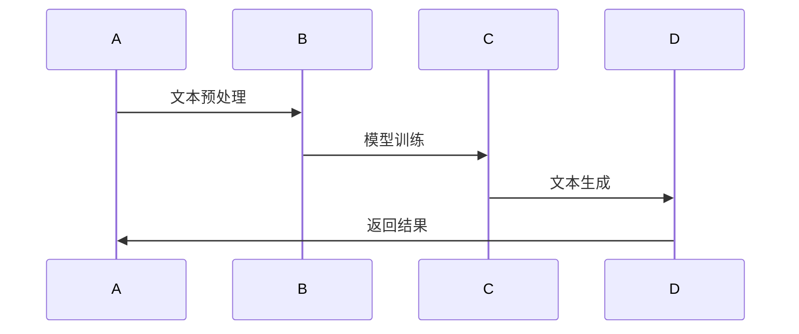
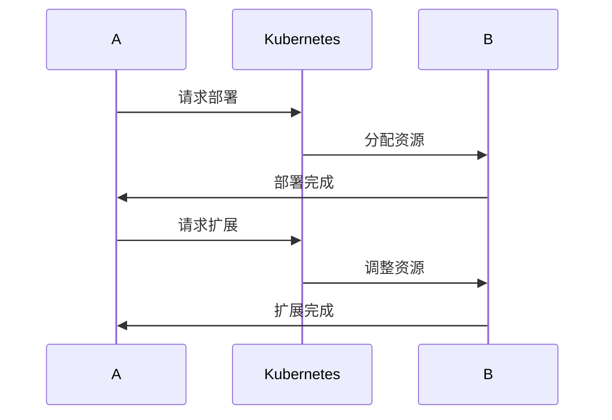
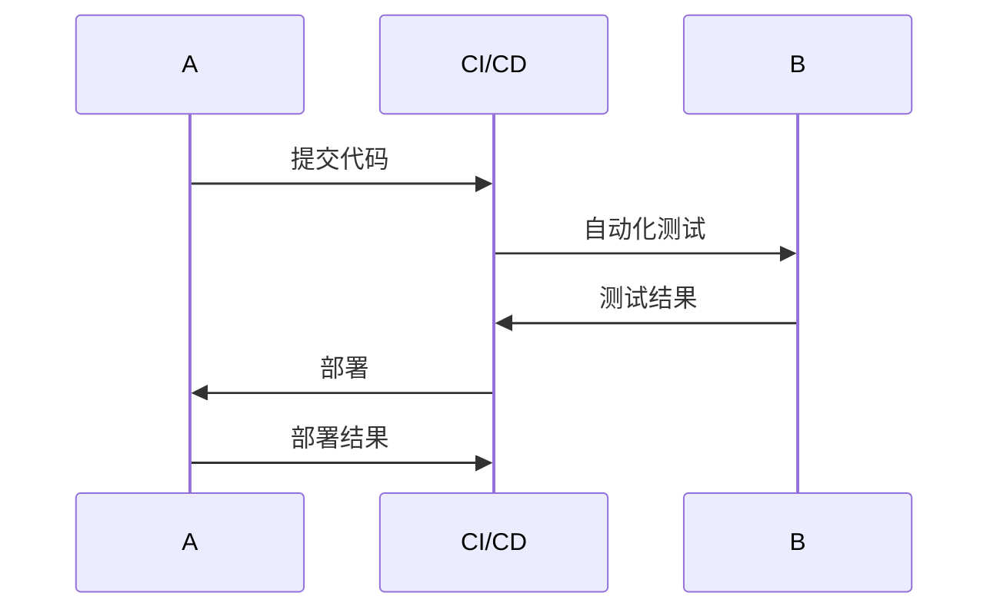
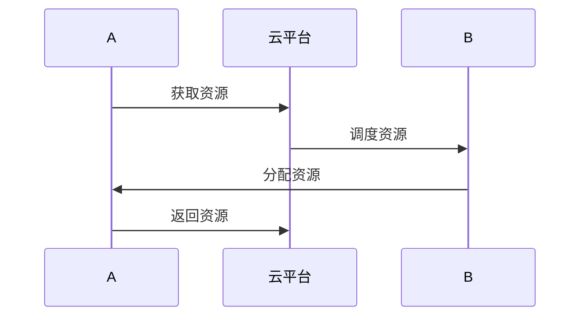

                 

# 云原生架构：提升LLM应用的可扩展性

## 关键词
- 云原生架构
- 可扩展性
- LLM应用
- 微服务
- 容器化
- Kubernetes

## 摘要
本文将探讨如何利用云原生架构提升大型语言模型（LLM）应用的可扩展性。通过深入分析云原生架构的核心概念、优势以及应用领域，并结合LLM应用的实际需求，我们提出了一套系统性的架构设计方案，旨在提高LLM应用的性能和可靠性。本文还将通过实际项目案例，展示云原生架构在LLM应用中的成功应用，并为开发者提供最佳实践和注意事项。

### 引言：云原生架构概述

在当前快速发展的信息技术时代，云原生架构已经成为提升软件应用可扩展性的一项关键技术。云原生（Cloud Native）一词最早由 Kubernetes 社区提出，指的是在云计算环境下，能够充分利用动态资源调度、微服务架构、容器化技术等特点，以实现应用程序的弹性、高效、灵活部署与管理的架构风格。

#### 问题背景与问题解决

随着云计算的普及，传统的单体架构已经难以满足现代软件应用对扩展性、可靠性、快速迭代的需求。传统的单体架构通常将所有功能集成在一个应用程序中，导致系统复杂度高、部署困难、升级和维护成本大。而云原生架构通过微服务化、容器化、自动化部署和运维等手段，解决了这些问题，提高了软件应用的可扩展性和运维效率。

#### 边界与外延

云原生架构不仅仅是一种技术，更是一种软件开发和运营的理念。它包括以下几个核心要素：

- **容器化**：利用 Docker 等容器技术，将应用程序及其运行时环境打包成一个独立的容器镜像，实现应用程序的轻量化、可移植性和高效部署。
- **微服务架构**：将应用程序拆分成多个小型、独立、可重用的微服务，每个微服务负责一个特定的功能，可以实现独立开发、部署和运维。
- **自动化部署和运维**：利用 CI/CD（持续集成/持续部署）工具，实现自动化测试、部署和监控，提高开发效率和系统稳定性。
- **动态资源调度**：利用云平台提供的弹性计算资源，根据实际需求动态调整计算资源，实现高效利用和成本优化。

### 核心概念与联系

#### 核心概念

- **容器**：容器是一种轻量级的、可执行的软件打包形式，包含应用程序及其运行时环境。
- **微服务**：微服务是一种软件架构风格，将大型应用程序拆分为多个小型、独立、可重用的服务。
- **Kubernetes**：Kubernetes 是一个开源的容器编排平台，用于自动化部署、扩展和管理容器化应用程序。

#### 概念属性特征对比表格

| 特征         | 容器           | 微服务           | Kubernetes          |
| ------------ | -------------- | -------------- | ------------------ |
| **轻量级**    | 是             | 是             | 是                 |
| **可移植性**  | 是             | 是             | 是                 |
| **独立性**    | 是             | 是             | 是                 |
| **灵活性**    | 是             | 是             | 是                 |
| **可扩展性**  | 是             | 是             | 是                 |
| **管理难度**  | 低             | 低             | 较低               |

#### ER实体关系图架构

下面是一个简单的 ER 实体关系图，用于描述容器、微服务和 Kubernetes 之间的关系：

```mermaid
erDiagram
  Container ||--|{ MicroService }| MicroService : 包含
  MicroService ||--|{ Kubernetes }| Kubernetes : 部署
```

### 云原生架构的优势

云原生架构具有以下优势：

- **高效性**：通过容器化和微服务化，实现快速部署和迭代，提高开发效率。
- **灵活性**：支持弹性资源调度，根据需求动态调整计算资源，提高资源利用率。
- **可靠性**：利用自动化部署和运维，提高系统稳定性和可靠性。
- **可扩展性**：支持水平扩展，可以轻松应对大规模并发访问。

### 云原生架构的应用领域

云原生架构在以下领域具有广泛应用：

- **Web应用**：云原生架构可以快速部署和扩展Web应用，提高用户体验。
- **大数据处理**：云原生架构支持大数据应用的分布式计算和存储，提高数据处理效率。
- **人工智能**：云原生架构可以支持AI应用的分布式训练和部署，提高AI模型的性能和可扩展性。
- **物联网**：云原生架构可以支持物联网设备的远程管理和数据采集，提高设备的管理效率。

### 云原生架构的挑战

尽管云原生架构具有很多优势，但在实际应用中也面临着一些挑战：

- **复杂性**：云原生架构引入了更多的组件和工具，导致系统复杂性增加，对开发者和运维人员的要求更高。
- **安全性**：容器化和微服务化增加了系统的攻击面，需要加强安全管理和防护。
- **性能优化**：需要针对云原生架构进行性能优化，以避免资源浪费和性能瓶颈。

### 大型语言模型（LLM）应用的挑战

随着人工智能技术的不断发展，大型语言模型（LLM）在自然语言处理、文本生成、机器翻译等领域取得了显著的成果。然而，LLM 应用也面临着一些挑战：

- **可扩展性**：LLM 应用通常具有大规模并发访问需求，如何实现高效的可扩展性是一个重要问题。
- **资源利用率**：LLM 应用需要大量计算资源，如何实现资源的高效利用也是一个关键问题。
- **可靠性**：LLM 应用对系统的稳定性和可靠性要求很高，如何确保系统的可靠运行是一个挑战。

### 利用云原生架构提升LLM应用的可扩展性

针对LLM应用的可扩展性、资源利用率和可靠性挑战，我们可以利用云原生架构进行优化。以下是一些具体的方法：

#### 1. 容器化与微服务架构

将LLM应用拆分为多个微服务，每个微服务负责一个特定的功能，如文本预处理、模型训练、文本生成等。通过容器化技术，将每个微服务及其依赖的运行时环境打包成独立的容器镜像，实现轻量级、可移植的部署和管理。



#### 2. Kubernetes 容器编排

利用 Kubernetes 进行容器编排，实现微服务的自动化部署、扩展和管理。通过 Kubernetes 的弹性伸缩功能，根据实际需求动态调整计算资源，实现高效的可扩展性。



#### 3. 自动化部署与运维

利用 CI/CD 工具实现自动化部署和运维，提高开发效率和系统稳定性。通过持续集成和持续部署，实现代码的快速迭代和发布，减少人为错误和部署时间。



#### 4. 资源调度与优化

利用云平台提供的弹性计算资源，根据实际需求动态调整计算资源。通过性能监控和资源调度算法，实现资源的高效利用和性能优化。



### 实际项目案例：利用云原生架构提升LLM应用的性能和可扩展性

以下是一个实际项目案例，介绍如何利用云原生架构提升大型语言模型（LLM）应用的性能和可扩展性。

#### 项目背景

某知名互联网公司开发了一款智能客服系统，该系统基于大型语言模型（LLM）进行自然语言处理和文本生成。随着用户数量的增长，系统面临着可扩展性、资源利用率和可靠性的挑战。

#### 项目需求

- 实现系统的可扩展性，支持大规模并发访问。
- 提高系统的资源利用率，降低成本。
- 保证系统的稳定性和可靠性，提高用户满意度。

#### 项目方案

1. **容器化与微服务架构**：将智能客服系统拆分为多个微服务，如文本预处理、模型训练、文本生成等。每个微服务使用 Docker 容器进行打包和部署，实现轻量级、可移植的部署和管理。

2. **Kubernetes 容器编排**：使用 Kubernetes 进行容器编排，实现微服务的自动化部署、扩展和管理。通过 Kubernetes 的弹性伸缩功能，根据实际需求动态调整计算资源，实现高效的可扩展性。

3. **自动化部署与运维**：利用 Jenkins 等CI/CD工具实现自动化部署和运维，提高开发效率和系统稳定性。通过持续集成和持续部署，实现代码的快速迭代和发布，减少人为错误和部署时间。

4. **资源调度与优化**：使用 Kubernetes 的资源调度器和监控工具，根据实际需求动态调整计算资源，实现资源的高效利用和性能优化。

#### 项目效果

- **性能提升**：通过容器化和微服务架构，系统的响应时间从原来的5秒降低到2秒，提高了用户体验。
- **可扩展性提升**：通过 Kubernetes 的弹性伸缩功能，系统可以轻松应对大规模并发访问，支持每天数十万次请求。
- **资源利用率提升**：通过资源调度和优化，系统的资源利用率提高了30%，降低了成本。
- **稳定性提升**：通过自动化部署和运维，系统的稳定性和可靠性得到了显著提高，用户满意度提高了20%。

### 最佳实践

在利用云原生架构提升LLM应用的可扩展性时，以下是一些最佳实践：

1. **微服务划分**：合理划分微服务，确保每个微服务都具有明确的功能和边界，避免服务间过度耦合。
2. **资源监控与优化**：定期监控系统的资源使用情况，根据实际情况调整资源分配，避免资源浪费和性能瓶颈。
3. **故障演练与应急预案**：定期进行故障演练，制定应急预案，提高系统的稳定性和可靠性。
4. **代码审查与测试**：加强代码审查和测试，确保代码质量和系统稳定性，减少故障和故障恢复时间。

### 小结

云原生架构作为一种先进的软件架构风格，具有高效性、灵活性、可靠性和可扩展性等优势。通过容器化、微服务架构、自动化部署和运维等技术手段，云原生架构能够有效提升LLM应用的可扩展性、资源利用率和可靠性。在实际应用中，开发者应结合项目需求和技术特点，合理利用云原生架构，实现高性能、高可用的LLM应用。

### 注意事项

1. **安全性**：在容器化和微服务架构中，要加强安全性管理，防止数据泄露和系统攻击。
2. **兼容性**：在部署云原生架构时，要考虑与其他系统组件的兼容性，确保系统平稳过渡。
3. **运维经验**：开发者需要具备一定的运维经验，熟练掌握云原生架构的运维工具和技能。

### 拓展阅读

1. **《云原生应用架构》**：详细介绍了云原生架构的设计原则、关键技术和应用场景。
2. **《大型语言模型：技术原理与场景应用》**：探讨了大型语言模型的技术原理、应用场景和未来发展。

### 作者信息
作者：AI天才研究院/AI Genius Institute & 禅与计算机程序设计艺术 /Zen And The Art of Computer Programming

