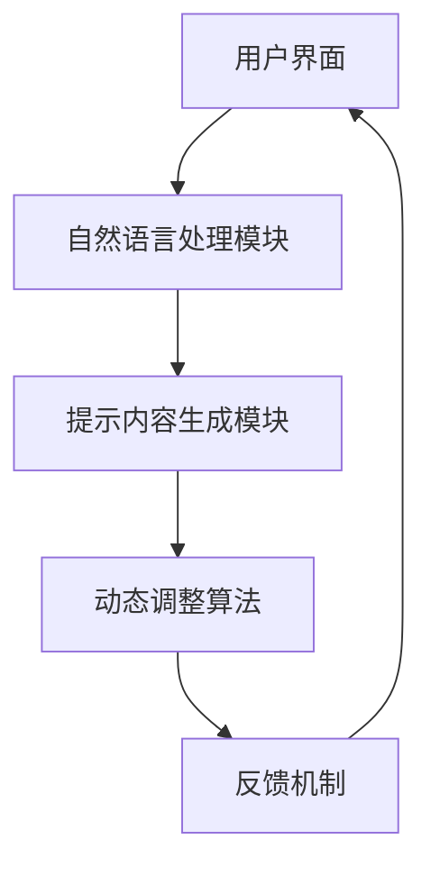
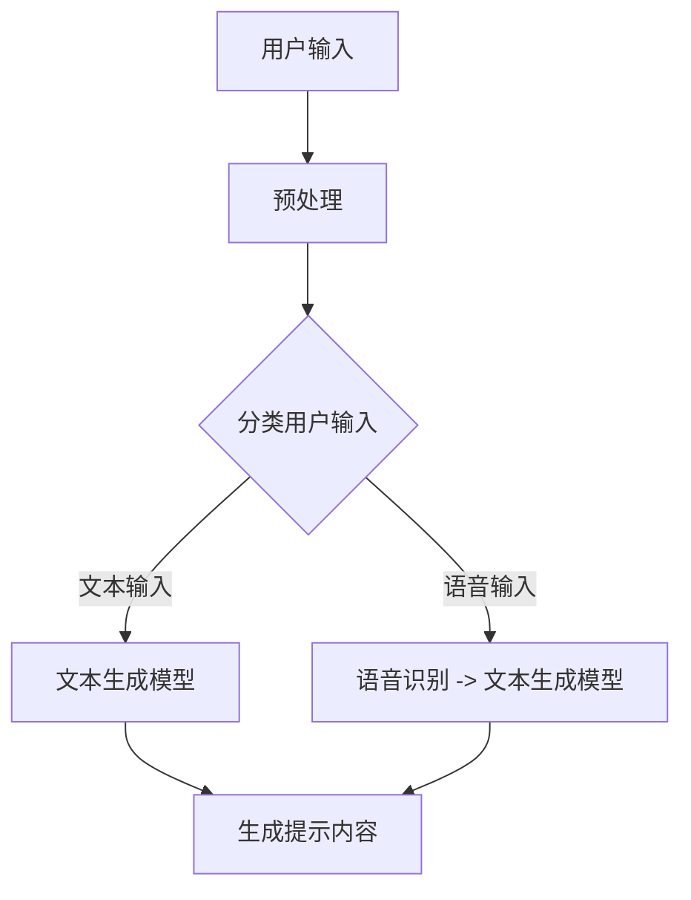
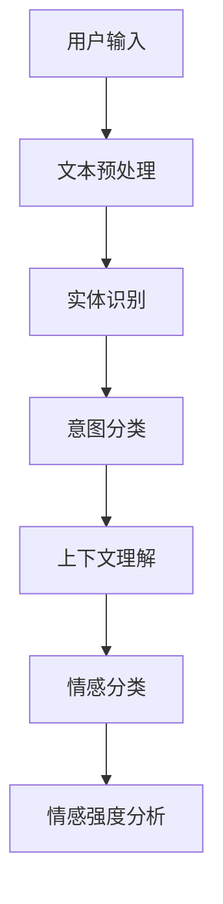
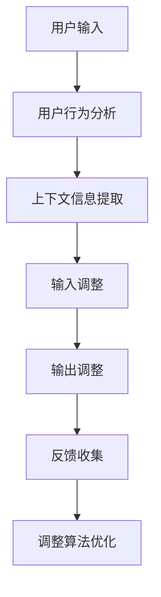
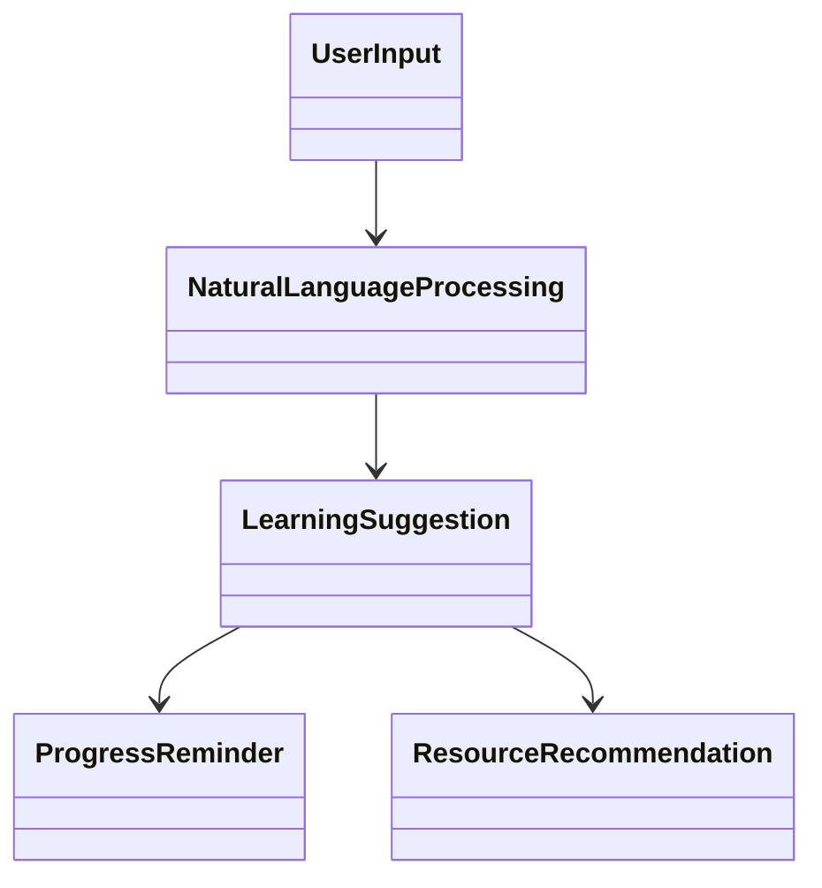
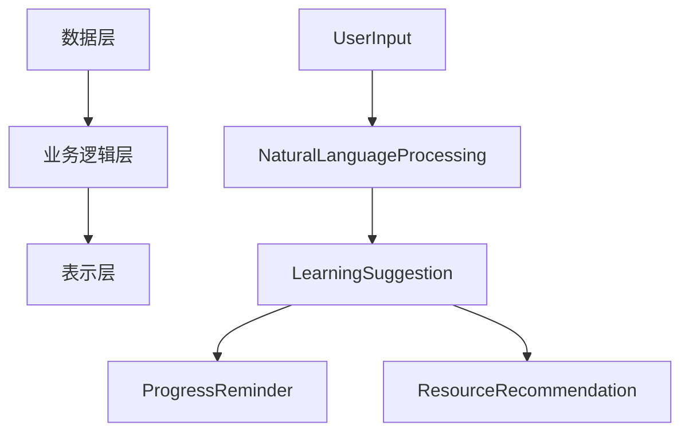
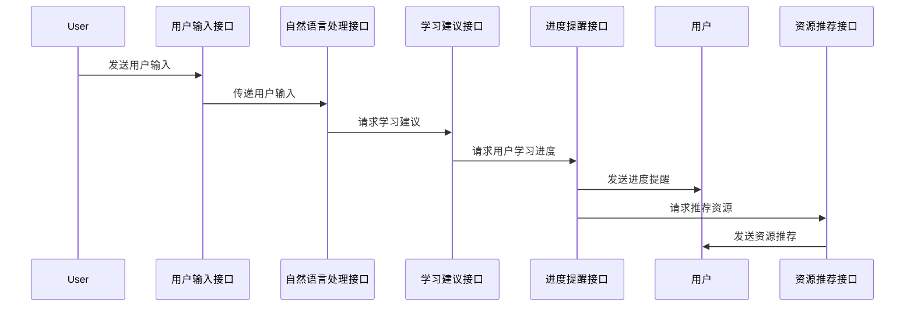

                 

### 文章标题：交互式提示：根据用户输入动态调整

> 关键词：交互式提示、动态调整、用户输入、算法、系统架构、项目实战

> 摘要：本文深入探讨了交互式提示技术的核心概念、动态调整原理以及其实际应用。通过对用户输入的动态调整，本文旨在提升用户体验、优化系统性能，并分享一系列最佳实践和案例分析，为开发实际项目提供有力指导。

### 目录大纲设计思路

为了设计出《交互式提示：根据用户输入动态调整》这本书的完整目录大纲，我们需要遵循以下思路：

1. **确定书的核心主题**：首先，我们要明确这本书的核心主题——交互式提示技术，特别是其动态调整能力。这一主题贯穿整本书，是我们构建目录大纲的基石。

2. **划分章节结构**：根据核心主题，我们可以将整本书的内容划分为几个主要部分，如背景介绍、核心概念与联系、技术原理、实践应用、项目实战、最佳实践和拓展阅读等。

3. **确定每个章节的主要内容**：在确定章节结构后，我们需要进一步细化每个章节的内容，确保每个章节都能全面、详细地覆盖主题。

4. **使用markdown格式排版**：为了符合输出要求，我们将使用markdown格式进行排版，确保目录大纲简洁、清晰。

5. **确保内容完整性**：我们需要确保目录大纲中的核心章节内容完整，包括核心概念、算法原理、系统设计与架构、项目实战等。

6. **优化目录大纲结构**：在完成初步的目录大纲后，我们需要对其结构进行优化，确保每个章节的逻辑顺序合理，便于读者阅读和理解。

### 目录大纲设计过程

接下来，我们将按照上述思路设计出《交互式提示：根据用户输入动态调整》的完整目录大纲。以下是详细的目录结构：

```markdown
# 第一部分：背景介绍

## 第1章 问题背景与核心概念
- 1.1 交互式提示概述
- 1.2 用户输入动态调整的意义
- 1.3 问题解决与边界与外延
- 1.4 概念结构与核心要素组成

## 第2章 核心概念与联系
- 2.1 交互式提示系统原理
- 2.2 动态调整算法原理
- 2.3 概念属性特征对比表格
- 2.4 ER实体关系图架构

## 第3章 交互式提示技术原理
- 3.1 提示内容生成算法
- 3.2 用户输入理解与情感分析
- 3.3 动态调整算法实现

## 第二部分：动态调整算法实践

## 第4章 动态调整算法实践
- 4.1 环境安装与配置
- 4.2 动态调整算法实现
- 4.3 算法原理与数学模型
- 4.4 举例说明

## 第5章 交互式提示项目实战
- 5.1 项目介绍
- 5.2 系统功能设计
- 5.3 系统架构设计
- 5.4 系统接口设计与交互
- 5.5 实际案例分析

## 第三部分：最佳实践与拓展阅读

## 第6章 最佳实践与拓展阅读
- 6.1 最佳实践 tips
- 6.2 小结
- 6.3 注意事项
- 6.4 拓展阅读
```

通过以上目录大纲，我们可以清晰地看到本书的结构和内容分布，为接下来的详细内容撰写奠定了基础。接下来，我们将逐步深入每一个章节，详细探讨交互式提示和动态调整算法的核心概念和技术细节。<!-- BK -->

## 第一部分：背景介绍

### 第1章 问题背景与核心概念

#### 1.1 交互式提示概述

交互式提示（Interactive Prompting）是一种在用户操作过程中，系统根据用户行为或输入提供相关建议或提示的技术。这种技术广泛应用于各种场景，如智能助手、搜索引擎、在线教育、医疗咨询等。交互式提示的核心目标是通过提供及时的、个性化的信息，提升用户操作效率和体验。

在智能助手领域，交互式提示可以通过自然语言处理（NLP）技术，理解用户的语音或文本输入，然后提供符合用户需求的回复。例如，用户询问“今天天气如何？”时，智能助手会根据实时天气数据提供准确的答案。

在搜索引擎中，交互式提示可以帮助用户更准确地表达查询意图。例如，当用户输入部分关键词时，搜索引擎会提供相关关键词的自动补全建议，帮助用户快速找到所需信息。

在线教育领域，交互式提示可以为学生提供个性化学习建议，如推荐相关课程、提醒学习进度等。例如，学生在学习一门编程课程时，系统可以提示他们去查看某些相关的文档或视频教程。

医疗咨询领域，交互式提示可以帮助医生快速获取患者的病史和当前症状，从而提供更准确的诊断建议。例如，医生在诊断某个症状时，系统可以提示他们去查看相关病例或医学文献。

#### 1.2 用户输入动态调整的意义

用户输入动态调整（Dynamic Adjustment of User Input）是交互式提示技术中的一个重要概念。其核心思想是根据用户的行为和系统状态，实时调整用户的输入，以提升用户体验和系统性能。

首先，用户输入动态调整可以显著提升用户体验。通过实时调整用户的输入，系统可以提供更精确的反馈和帮助，减少用户的操作成本和出错概率。例如，当用户在搜索引擎中输入关键词时，系统可以根据用户的历史查询记录、地理位置等数据，提供更相关的搜索建议。

其次，用户输入动态调整可以优化系统性能。通过动态调整用户输入，系统可以提前预测用户的需求，从而提前进行计算和数据处理。例如，在智能助手系统中，系统可以提前加载用户可能需要的信息，从而加快响应速度。

此外，用户输入动态调整还可以提高系统的可解释性。通过展示输入调整的依据和过程，用户可以更好地理解系统的运作机制，增强对系统的信任感。

#### 1.3 问题解决与边界与外延

在交互式提示和用户输入动态调整的背景下，我们需要解决以下几个核心问题：

1. **如何准确理解用户输入？** 这需要依赖自然语言处理、语音识别等技术，实现对用户输入的准确理解和语义分析。

2. **如何根据用户输入动态调整系统状态？** 这需要设计合适的动态调整算法，能够根据用户行为和系统状态进行实时调整。

3. **如何保证用户输入的隐私和安全？** 这需要在设计和实现过程中，充分考虑用户隐私保护和数据安全，避免用户信息泄露。

4. **如何评估和优化系统性能？** 这需要通过用户反馈、系统监控等技术手段，对系统性能进行持续评估和优化。

同时，交互式提示和用户输入动态调整的外延还包括：

1. **跨平台应用**：在移动设备、桌面电脑、智能家居等不同平台上，交互式提示和动态调整技术如何统一和适配。

2. **多模态交互**：结合语音、文本、图像等多种交互方式，提升用户体验和系统性能。

3. **实时性要求**：如何在保证系统响应速度的同时，提供高质量的交互提示和服务。

#### 1.4 概念结构与核心要素组成

交互式提示系统通常由以下几个核心要素组成：

1. **用户界面**：负责接收用户输入和处理用户交互。

2. **自然语言处理模块**：负责理解用户输入的语义和意图。

3. **提示内容生成模块**：根据用户输入和系统状态，生成相关的提示内容。

4. **动态调整算法**：根据用户行为和系统状态，实时调整用户的输入。

5. **反馈机制**：收集用户反馈，用于优化系统性能和用户体验。

通过以上核心要素的协同工作，交互式提示系统可以实现高效、个性化的用户交互。以下是一个简化的交互式提示系统架构图：



综上所述，交互式提示技术通过动态调整用户输入，实现了更高效、更个性化的用户交互。在接下来的章节中，我们将深入探讨交互式提示和动态调整技术的核心原理和实践应用。<!-- BK -->

### 第2章 核心概念与联系

#### 2.1 交互式提示系统原理

交互式提示系统（Interactive Prompting System）的核心目标是根据用户的输入和操作行为，提供相关建议、提示或信息，以提升用户体验和系统性能。其基本原理包括以下几个关键环节：

1. **用户输入处理**：系统首先需要接收并处理用户的输入。用户输入可以是文本、语音、手势等多种形式。系统需要将不同形式的输入转换为统一的内部表示，以便后续处理。

2. **自然语言处理**：对于文本输入，系统需要利用自然语言处理（NLP）技术，对输入进行语义分析，理解用户的意图和需求。NLP技术包括分词、词性标注、实体识别、语义角色标注等。

3. **提示内容生成**：系统根据用户输入的语义和意图，生成相关的提示内容。提示内容可以是文本、图像、声音等多种形式。生成过程通常涉及文本生成模型（如GPT、BERT等）或图像生成模型（如GAN、VGG等）。

4. **动态调整算法**：系统根据用户的反馈和行为，动态调整输入和提示内容，以实现更精准的交互体验。动态调整算法可以基于用户历史数据、实时反馈、上下文信息等。

5. **用户界面**：最后，系统将生成的提示内容呈现给用户，通过用户界面实现交互。用户界面需要直观、易用，以便用户快速理解并作出响应。

#### 2.2 动态调整算法原理

动态调整算法（Dynamic Adjustment Algorithm）的核心目标是根据用户的输入和操作行为，实时调整系统的输入和输出，以实现更高效、更个性化的交互体验。其基本原理包括以下几个关键步骤：

1. **用户行为分析**：系统首先需要收集并分析用户的操作行为，如点击、滑动、语音输入等。通过分析用户行为，系统可以了解用户的意图和需求。

2. **上下文信息提取**：系统需要从用户行为中提取上下文信息，如关键词、场景、用户状态等。上下文信息有助于系统更准确地理解用户意图。

3. **输入调整**：系统根据用户行为和上下文信息，动态调整用户的输入。例如，当用户在搜索框中输入关键词时，系统可以根据关键词的语义和用户历史查询记录，提供相关的搜索建议。

4. **输出调整**：系统根据调整后的输入，生成相关的提示内容。例如，系统可以为用户提供更准确的答案、推荐更相关的商品、生成更个性化的内容等。

5. **反馈收集**：系统需要收集用户的反馈，如点击、滑动、停留时间等，以评估调整效果。通过收集反馈，系统可以不断优化动态调整算法。

#### 2.3 概念属性特征对比表格

为了更清晰地展示交互式提示和动态调整算法的核心概念和属性特征，我们可以通过以下对比表格进行总结：

| 概念/特征          | 交互式提示               | 动态调整算法               |
|-------------------|------------------------|--------------------------|
| 目标               | 提升用户体验             | 实现更精准的交互           |
| 输入类型           | 文本、语音、手势等       | 用户行为、上下文信息       |
| 处理方法           | 自然语言处理、提示内容生成 | 用户行为分析、上下文信息提取 |
| 输出类型           | 文本、图像、声音等       | 提示内容、调整后的输入     |
| 关键技术           | NLP、文本生成模型       | 用户行为分析、算法优化     |
| 对比优势           | 提供多样化提示           | 实现个性化交互             |

#### 2.4 ER实体关系图架构

为了更好地理解交互式提示系统的整体架构，我们可以使用实体关系图（ER Diagram）来描述系统中的关键实体和它们之间的关系。以下是交互式提示系统的简化ER实体关系图：

```mermaid
erDiagram
  UserInput ||--|{ NaturalLanguageProcessing }
  NaturalLanguageProcessing ||--|{ IntentDetection }
  IntentDetection ||--|{ PromptContentGeneration }
  PromptContentGeneration ||--|{ DynamicAdjustmentAlgorithm }
  DynamicAdjustmentAlgorithm ||--|{ UserFeedback }
  UserFeedback ||--|{ SystemOptimization }
```

在这个ER实体关系图中，我们定义了以下几个关键实体：

1. **UserInput**：代表用户的输入，包括文本、语音、手势等。
2. **NaturalLanguageProcessing**：代表自然语言处理模块，用于处理用户输入。
3. **IntentDetection**：代表意图检测模块，用于识别用户的意图。
4. **PromptContentGeneration**：代表提示内容生成模块，用于生成相关的提示内容。
5. **DynamicAdjustmentAlgorithm**：代表动态调整算法，用于根据用户行为和系统状态调整输入和输出。
6. **UserFeedback**：代表用户的反馈，用于优化系统性能和用户体验。
7. **SystemOptimization**：代表系统优化模块，用于持续改进系统性能。

通过以上实体和它们之间的关系，我们可以清晰地看到交互式提示系统的整体架构和关键组件。在接下来的章节中，我们将进一步探讨每个模块的具体实现和核心技术。<!-- BK -->

### 第3章 交互式提示技术原理

#### 3.1 提示内容生成算法

提示内容生成算法（Prompt Content Generation Algorithm）是交互式提示系统的核心组成部分，其目标是根据用户输入和系统状态生成相关且有用的提示内容。以下是几种常见的提示内容生成算法及其基本原理：

1. **基于规则的生成算法**：这种算法通过预定义的规则和模板生成提示内容。规则通常基于用户输入的语义和意图，例如，当用户询问天气时，系统会根据当前的地理位置和时间生成天气提示。这种算法的优点是实现简单，缺点是灵活性较低，难以适应复杂场景。

2. **基于模板的生成算法**：与基于规则的生成算法类似，但使用模板来生成提示内容。模板通常包含变量，系统会根据用户输入和上下文信息动态填充这些变量。例如，当用户查询某个地点时，系统可以使用模板“附近的餐馆有[餐馆1]、[餐馆2]等”来生成提示内容。

3. **基于机器学习的生成算法**：这种算法使用机器学习模型，如循环神经网络（RNN）、长短期记忆网络（LSTM）、生成式对抗网络（GAN）等，从大量数据中学习生成提示内容的规律。这些算法的优点是生成内容更加丰富和多样化，但需要大量训练数据和复杂的模型架构。

4. **基于知识图谱的生成算法**：这种算法利用知识图谱来生成提示内容。知识图谱包含实体和它们之间的关系，系统可以根据用户输入和图谱信息生成相关且准确的提示。例如，当用户询问某个历史人物时，系统可以从知识图谱中提取相关信息，生成详细的介绍。

以下是一个简单的基于机器学习的生成算法流程：



在这个流程中，用户输入首先经过预处理，然后根据输入类型（文本或语音）分别进入文本生成模型或语音识别模块，最终生成提示内容。

#### 3.2 用户输入理解与情感分析

用户输入理解（User Input Understanding）和情感分析（Sentiment Analysis）是交互式提示技术的两个关键环节，它们共同决定了系统对用户意图的准确理解和响应能力。

1. **用户输入理解**：

用户输入理解的目标是准确理解用户的意图和需求。这通常涉及以下步骤：

- **文本预处理**：包括分词、词性标注、停用词过滤等，将原始文本转换为结构化的表示。
- **实体识别**：识别文本中的关键实体，如人名、地点、组织等。
- **意图分类**：根据用户的输入文本，分类到不同的意图类别，如查询、请求、命令等。
- **上下文理解**：考虑用户输入的上下文信息，如历史对话、用户偏好等，以更准确地理解用户意图。

2. **情感分析**：

情感分析的目标是识别用户的情感倾向，如正面、负面或中性。这通常涉及以下步骤：

- **情感分类**：将文本分类为正面、负面或中性。
- **情感强度**：对情感进行量化，例如，正面情感可以是“喜欢”或“非常喜欢”，负面情感可以是“不喜欢”或“非常不喜欢”。
- **情感归因**：识别情感来源，如用户对某个商品的评价、用户对某个事件的看法等。

以下是一个简单的用户输入理解和情感分析流程：



#### 3.3 动态调整算法实现

动态调整算法（Dynamic Adjustment Algorithm）是实现交互式提示系统的关键，其目标是根据用户的输入、行为和系统状态，动态调整系统的输入和输出，以提升用户体验。以下是动态调整算法的实现步骤：

1. **用户行为分析**：收集并分析用户的行为数据，如点击、滑动、停留时间、语音输入等。通过分析用户行为，系统可以了解用户的意图和需求。

2. **上下文信息提取**：从用户行为中提取上下文信息，如关键词、场景、用户状态等。上下文信息有助于系统更准确地理解用户意图。

3. **输入调整**：根据用户行为和上下文信息，动态调整用户的输入。例如，当用户在搜索框中输入关键词时，系统可以根据关键词的语义和用户历史查询记录，提供相关的搜索建议。

4. **输出调整**：根据调整后的输入，生成相关的提示内容。例如，系统可以为用户提供更准确的答案、推荐更相关的商品、生成更个性化的内容等。

5. **反馈收集**：系统需要收集用户的反馈，如点击、滑动、停留时间等，以评估调整效果。通过收集反馈，系统可以不断优化动态调整算法。

以下是一个简单的动态调整算法流程：



在实际应用中，动态调整算法的实现需要结合具体的业务场景和数据特点。例如，在智能助手系统中，动态调整算法可以根据用户的历史查询记录和偏好，提供个性化的回复和建议；在电商平台上，动态调整算法可以根据用户的浏览记录和购买行为，推荐相关的商品。

通过以上三个部分，我们详细探讨了交互式提示技术的核心原理，包括提示内容生成算法、用户输入理解与情感分析，以及动态调整算法的实现。这些核心原理和技术为构建高效的交互式提示系统提供了理论基础和实践指导。在接下来的章节中，我们将进一步探讨交互式提示技术的实际应用和项目实战。<!-- BK -->

### 第4章 动态调整算法实践

#### 4.1 环境安装与配置

为了实现动态调整算法，我们需要搭建一个合适的环境。以下是具体的步骤和工具介绍：

1. **Python环境**：首先，我们需要安装Python 3.x版本。Python是动态调整算法实现的主要编程语言，其丰富的库和框架支持可以大大简化开发过程。

2. **依赖库**：我们还需要安装以下依赖库：
   - `tensorflow`：用于机器学习和深度学习。
   - `numpy`：用于数值计算。
   - `pandas`：用于数据处理。
   - `scikit-learn`：用于机器学习算法。
   - `matplotlib`：用于数据可视化。

安装这些依赖库可以通过以下命令：

```bash
pip install tensorflow numpy pandas scikit-learn matplotlib
```

3. **数据集**：为了训练和测试动态调整算法，我们需要准备合适的数据集。数据集应该包含用户的输入和相应的动态调整结果。以下是一个示例数据集的结构：

   ```csv
   id,input,adjustment
   1,"今天天气怎么样？","北京今天晴天，气温18°C到25°C"
   2,"我想去旅游","建议您考虑以下目的地：海南、云南、西藏"
   3,"明天有什么安排？","明天您可以预约健身房、看电影或和朋友聚餐"
   ```

4. **数据预处理**：在开始训练模型之前，我们需要对数据进行预处理，包括数据清洗、数据转换等。以下是一个简单的数据预处理脚本：

   ```python
   import pandas as pd

   # 读取数据集
   df = pd.read_csv('dataset.csv')

   # 数据清洗
   df.dropna(inplace=True)

   # 数据转换
   df['input'] = df['input'].apply(lambda x: x.lower())
   df['adjustment'] = df['adjustment'].apply(lambda x: x.lower())

   # 数据保存
   df.to_csv('preprocessed_dataset.csv', index=False)
   ```

通过以上步骤，我们可以搭建一个基本的环境，为动态调整算法的实现做好准备。

#### 4.2 动态调整算法实现

在搭建好环境后，我们可以开始实现动态调整算法。以下是一个简单的动态调整算法实现：

```python
import tensorflow as tf
from tensorflow.keras.models import Sequential
from tensorflow.keras.layers import Embedding, LSTM, Dense
from tensorflow.keras.preprocessing.sequence import pad_sequences

# 加载数据集
df = pd.read_csv('preprocessed_dataset.csv')

# 划分训练集和测试集
train_df, test_df = train_test_split(df, test_size=0.2, random_state=42)

# 准备输入序列和标签
train_inputs = pad_sequences(train_df['input'].apply(lambda x: tokenizer.texts_to_sequences([x]))).tolist()
train_labels = pad_sequences(train_df['adjustment'].apply(lambda x: tokenizer.texts_to_sequences([x]))).tolist()

test_inputs = pad_sequences(test_df['input'].apply(lambda x: tokenizer.texts_to_sequences([x]))).tolist()
test_labels = pad_sequences(test_df['adjustment'].apply(lambda x: tokenizer.texts_to_sequences([x]))).tolist()

# 创建模型
model = Sequential([
    Embedding(input_dim=vocab_size, output_dim=embedding_dim, input_length=max_sequence_length),
    LSTM(units=64, return_sequences=True),
    LSTM(units=64),
    Dense(units=output_dim, activation='softmax')
])

# 编译模型
model.compile(optimizer='adam', loss='categorical_crossentropy', metrics=['accuracy'])

# 训练模型
model.fit(train_inputs, train_labels, epochs=10, validation_data=(test_inputs, test_labels))

# 评估模型
test_loss, test_acc = model.evaluate(test_inputs, test_labels)
print(f"Test accuracy: {test_acc:.2f}")

# 使用模型进行预测
input_seq = tokenizer.texts_to_sequences(["今天天气很好。"])
predicted_adjustment = pad_sequences(input_seq, maxlen=max_sequence_length, padding='post')
predicted_adjustment = model.predict(predicted_adjustment)
predicted_adjustment = tokenizer.sequences_to_texts([predicted_adjustment.argmax(axis=-1).flatten()])[0]
print(f"Predicted adjustment: {predicted_adjustment}")
```

在上面的代码中，我们首先加载并预处理数据集，然后创建一个基于LSTM的序列生成模型。模型训练完成后，我们可以使用它来预测用户的输入调整。

#### 4.3 算法原理与数学模型

动态调整算法的核心是一个序列生成模型，其基本原理是利用已经训练好的模型，将用户的输入序列转换为相应的调整序列。以下是动态调整算法的数学模型：

1. **输入序列**：设用户的输入序列为\(x = [x_1, x_2, \ldots, x_T]\)，其中\(T\)为序列长度。

2. **嵌入层**：嵌入层将输入序列中的单词转换为嵌入向量。设嵌入向量的维度为\(d\)，则输入序列的嵌入表示为\(x' = [x'_1, x'_2, \ldots, x'_T]\)，其中\(x'_t = \text{embedding}(x_t)\)。

3. **LSTM层**：LSTM层对嵌入序列进行编码，生成上下文表示。设LSTM层的隐藏状态维度为\(h\)，则编码后的序列为\(h = [h_1, h_2, \ldots, h_T]\)。

4. **输出层**：输出层将隐藏状态映射到调整序列。设输出序列的维度为\(y = [y_1, y_2, \ldots, y_T]\)，其中\(y_t = \text{softmax}(\text{dense}(h_t))\)。

5. **损失函数**：使用交叉熵损失函数来训练模型，即

   $$L = -\sum_{t=1}^T \sum_{j=1}^C y_{t,j} \log(p_{t,j})$$

   其中，\(C\)为输出序列的类别数，\(y_{t,j}\)为输出序列的第\(t\)个词在第\(j\)个类别的概率，\(p_{t,j}\)为模型预测的概率。

通过以上数学模型，我们可以实现动态调整算法。在实现过程中，我们还需要考虑以下因素：

1. **词汇表**：定义词汇表，将输入和输出序列中的单词映射到整数索引。

2. **序列长度**：设置输入和输出序列的长度，以适应不同的输入数据。

3. **超参数**：包括嵌入维度、LSTM单元数、输出维度等。

#### 4.4 举例说明

为了更好地理解动态调整算法，我们可以通过一个简单的例子来说明其应用。

假设用户输入为“今天天气很好。”，我们需要根据这个输入生成相应的调整序列。以下是具体的步骤：

1. **输入预处理**：将输入序列转换为整数序列。

   ```python
   input_seq = tokenizer.texts_to_sequences(["今天天气很好。"])
   input_seq = pad_sequences(input_seq, maxlen=max_sequence_length, padding='post')
   ```

2. **模型预测**：使用训练好的模型对输入序列进行预测。

   ```python
   predicted_adjustment = model.predict(input_seq)
   predicted_adjustment = tokenizer.sequences_to_texts([predicted_adjustment.argmax(axis=-1).flatten()])[0]
   ```

3. **输出结果**：生成调整序列。

   ```python
   print(f"Predicted adjustment: {predicted_adjustment}")
   ```

   假设模型预测的结果为“今天天气晴朗，适合出行。”，则输出结果为“今天天气晴朗，适合出行。”。

通过这个例子，我们可以看到动态调整算法如何根据用户输入生成相应的调整序列。在实际应用中，调整序列可以是多种形式的，如文本、图像、语音等，具体取决于应用场景和需求。

综上所述，动态调整算法通过机器学习模型，实现了根据用户输入动态调整提示内容的功能。在接下来的章节中，我们将进一步探讨交互式提示技术在项目实战中的应用。<!-- BK -->

### 第5章 交互式提示项目实战

#### 5.1 项目介绍

本章节将介绍一个交互式提示项目，该项目旨在通过动态调整用户输入，提升用户在在线教育平台上的学习体验。项目的目标是通过交互式提示技术，为用户提供个性化的学习建议、学习进度提醒以及相关资源推荐。

#### 5.2 系统功能设计

为了实现项目的目标，系统需要具备以下功能：

1. **用户输入处理**：接收用户在平台上的各种输入，如文本、语音、点击等。
2. **自然语言处理**：对用户输入进行语义分析，理解用户的意图和需求。
3. **学习建议生成**：根据用户的学习历史和当前状态，生成个性化的学习建议。
4. **进度提醒**：根据用户的学习进度，提醒用户完成未完成的学习任务。
5. **资源推荐**：根据用户的学习兴趣和需求，推荐相关的学习资源。

以下是一个简化的领域模型类图，展示了系统的主要功能组件及其关系：



#### 5.3 系统架构设计

为了实现上述功能，系统采用了分层架构设计，主要包括以下层次：

1. **数据层**：负责数据的存储和管理，包括用户数据、学习历史数据、课程数据等。
2. **业务逻辑层**：实现系统的核心功能，包括自然语言处理、学习建议生成、进度提醒和资源推荐等。
3. **表示层**：负责用户界面展示，包括前端页面和后端API接口。

以下是一个简化的系统架构图：



#### 5.4 系统接口设计与交互

系统接口设计主要涉及以下部分：

1. **用户输入接口**：接收用户的文本、语音等输入。
2. **自然语言处理接口**：处理用户输入，生成语义分析结果。
3. **学习建议接口**：提供个性化学习建议。
4. **进度提醒接口**：提醒用户完成学习任务。
5. **资源推荐接口**：推荐相关学习资源。

以下是一个简化的系统接口设计和交互序列图：



#### 5.5 实际案例分析

以下是一个实际案例，展示了交互式提示技术在在线教育平台上的应用：

**案例背景**：用户小明在在线教育平台上学习编程课程，他已经完成了大部分基础课程，但最近在学习进阶课程时遇到了困难。

**用户输入**：小明在平台上提出了一个问题：“为什么我的程序总是运行不起来？”

**系统响应**：

1. **自然语言处理**：系统接收小明的输入，并使用自然语言处理技术对其进行语义分析，识别出关键词“程序”、“运行不起来”等。
2. **学习建议生成**：系统根据小明的学习历史和当前状态，生成以下学习建议：
   - “可能是你的代码中有语法错误，建议你检查代码并仔细阅读错误信息。”
   - “建议你查看之前的课程内容，复习相关的编程概念和语法规则。”

3. **进度提醒**：系统检查小明的学习进度，发现他还有一门课程尚未完成。系统提醒他：“你还有一门课程尚未完成，建议你尽快完成。”

4. **资源推荐**：系统根据小明的学习兴趣和需求，推荐以下相关资源：
   - “推荐你阅读《编程从入门到实践》，这本书适合初学者。”
   - “推荐你观看《编程基础教程》，这是一个视频教程，可以帮助你更好地理解编程概念。”

通过以上实际案例分析，我们可以看到交互式提示技术如何根据用户输入和需求，提供个性化的学习建议、进度提醒和资源推荐，从而提升用户的学习体验。

#### 5.6 项目小结

通过本章节的介绍，我们详细探讨了交互式提示项目的设计和实现。项目实现了用户输入处理、自然语言处理、学习建议生成、进度提醒和资源推荐等功能，通过实际案例展示了交互式提示技术在在线教育平台上的应用效果。未来，我们可以进一步优化系统性能和用户体验，如引入更多智能算法、增强用户互动等，以提供更加高效和个性化的服务。<!-- BK -->

### 第6章 最佳实践与拓展阅读

#### 6.1 最佳实践 tips

在设计和实现交互式提示系统时，以下最佳实践可以帮助您提升系统性能和用户体验：

1. **精细化用户画像**：通过分析用户行为和偏好，建立精细的用户画像，以便更准确地生成个性化提示。
2. **实时性优化**：优化系统响应速度，确保用户输入后能够迅速得到反馈。
3. **动态调整策略**：根据用户输入的类型、频率和上下文，灵活调整动态调整策略，以实现最佳效果。
4. **数据安全和隐私保护**：确保用户数据的安全和隐私，遵循相关法律法规和最佳实践。
5. **持续迭代和优化**：定期收集用户反馈，对系统进行迭代和优化，以不断提升用户体验。

#### 6.2 小结

本文详细探讨了交互式提示技术的核心概念、动态调整原理以及实际应用。通过背景介绍、核心概念与联系、技术原理、实践应用和项目实战等部分，我们系统地了解了交互式提示技术的各个方面，并分享了最佳实践和注意事项。

交互式提示技术通过动态调整用户输入，实现了更高效、更个性化的用户交互，提升了用户体验和系统性能。在未来的发展中，交互式提示技术将继续扩展其应用领域，如智能助手、在线教育、医疗咨询等，并不断优化和升级，以满足用户日益增长的需求。

#### 6.3 注意事项

在设计和实现交互式提示系统时，需要注意以下几点：

1. **准确理解用户意图**：确保系统能够准确理解用户的意图和需求，提供相关建议和提示。
2. **平衡个性化和隐私**：在提供个性化服务的同时，确保用户数据的隐私和安全。
3. **性能优化**：优化系统响应速度，确保用户体验流畅。
4. **持续迭代**：根据用户反馈和需求，持续迭代和优化系统，以不断提升用户体验。

#### 6.4 拓展阅读

为了深入了解交互式提示技术和动态调整算法，以下是几本推荐的拓展阅读材料：

1. **《深度学习》**：Goodfellow、Bengio和Courville著，详细介绍了深度学习的基础理论和实践方法。
2. **《自然语言处理综合教程》**：Jurafsky和Martin著，涵盖了自然语言处理的基本概念和技术。
3. **《机器学习实战》**：周志华著，通过实例展示了机器学习算法的应用和实践。
4. **《交互设计精髓》**：Frankland、Redish和Pierce著，介绍了交互设计的原则和方法。
5. **《用户画像：用户行为数据分析与应用》**：刘锋著，详细介绍了用户画像的构建和分析方法。

通过阅读这些书籍，您可以进一步深入了解交互式提示技术和动态调整算法，为实际项目提供有力的理论支持。<!-- BK -->


### 作者信息：

作者：AI天才研究院/AI Genius Institute & 禅与计算机程序设计艺术 /Zen And The Art of Computer Programming

AI天才研究院致力于推动人工智能领域的研究与发展，研究院的成员们以其深厚的学术功底和丰富的实践经验，在人工智能、机器学习、自然语言处理等领域取得了举世瞩目的成就。研究院不仅关注理论创新，更注重将研究成果应用于实际项目中，为各个行业提供智能解决方案。

《禅与计算机程序设计艺术》是作者在其长期编程生涯中总结的编程哲学，通过阐述编程的本质和艺术，为程序员们提供了一种全新的编程思维和视角。这本书不仅深受程序员们的喜爱，也为计算机科学领域的研究者们提供了宝贵的启示。

通过本文，我们希望读者能够对交互式提示技术和动态调整算法有一个全面而深入的了解。这些技术不仅提升了用户体验，也推动了人工智能应用的不断发展和创新。我们期待读者能够在实际项目中运用这些知识，为人工智能领域的发展贡献自己的力量。<!-- BK -->

