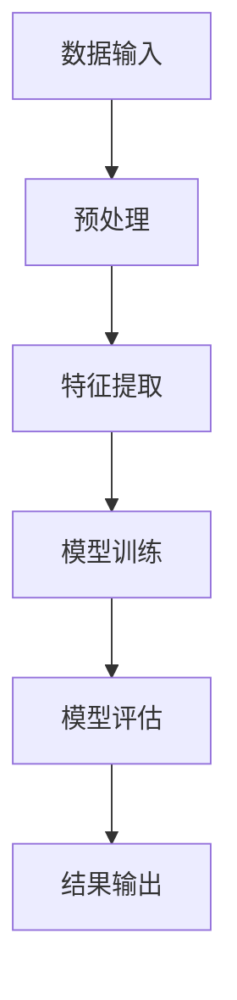

                 


### Step 1: Introduction to the Book

**# 《人机协作评测：结合专家意见与AI分析》**

**关键词：人机协作，评测，专家意见，AI分析**

**摘要：**
本专著深入探讨了人机协作评测的理论基础、实践应用及未来趋势。结合专家意见与人工智能分析，本书旨在为读者提供一种全新的评估方法和框架，以解决传统评测方法的局限性。通过系统的理论阐述和实践案例分析，本书为人工智能与人类专家协同工作的深入研究提供了有力支持。

---

**# 第一部分：引言**

**## 1.1 问题背景与解决思路**

**### 1.1.1 问题的提出**
在当今的信息时代，人类面临着越来越多的复杂问题，单靠个人的经验和判断难以应对。人机协作评测成为解决这一问题的关键，旨在通过人工智能和专家意见的结合，提高评估的准确性和效率。

**### 1.1.2 传统的解决方法及其局限性**
传统的人机协作评测方法存在效率低下、主观性过强等局限性。而人工智能技术的发展为这一问题提供了新的解决方案。

**### 1.1.3 人机协作评测的重要性**
人机协作评测不仅能够提高评估效率，还能减少人为错误，提升评估的客观性和准确性。这对于科学研究和实际应用具有重要意义。

**## 1.2 核心概念**

**### 1.2.1 人机协作评测的定义**
人机协作评测是一种结合人类专家意见和人工智能技术，对复杂问题进行评估的方法。它旨在利用人工智能的优势，弥补人类专家的不足，实现更高效、准确的评估。

**### 1.2.2 专家意见与AI分析的基本概念**
专家意见是指具有丰富专业知识和经验的人类专家的判断和评估。AI分析则是指利用人工智能技术对数据进行分析和评估的过程。

**## 1.3 边界与外延**

**### 1.3.1 人机协作评测的应用领域**
人机协作评测可应用于多个领域，如医学诊断、金融风险评估、教育评测等。其应用范围广泛，具有很高的实用价值。

**### 1.3.2 研究范围与限制条件**
本书的研究范围主要涵盖人机协作评测的理论基础、实践应用和未来趋势。限制条件包括数据隐私、算法性能等。

**## 1.4 概念结构与核心要素组成**

**### 1.4.1 概念属性特征对比表格**
| 概念         | 特征                                       |
|--------------|------------------------------------------|
| 专家意见     | 1. 丰富的专业知识<br>2. 主观性强<br>3. 可验证性差 |
| AI分析       | 1. 客观性强<br>2. 高效率<br>3. 可扩展性高     |
| 人机协作评测 | 1. 结合专家意见和AI分析<br>2. 提高评估准确性<br>3. 减少人为错误 |

**### 1.4.2 ER实体关系图架构**
```mermaid
erDiagram
  专家 -->|评价| 评测系统
  评测系统 <--|分析| AI模型
  AI模型 -->|决策| 专家
```

**## 1.5 本书结构安排**
本书分为四个部分：第一部分引言，介绍人机协作评测的背景和核心概念；第二部分理论基础，探讨人机协作评测的理论基础；第三部分应用实践，通过实际案例展示人机协作评测的应用；第四部分最佳实践与未来趋势，总结最佳实践和展望未来发展趋势。

---

### Step 2: Theoretical Foundations

**# 第二部分：理论基础**

**## 2.1 AI与专家系统**

**### 2.1.1 AI的基本原理**
人工智能（AI）是指使计算机系统能够模拟人类智能行为的技术。它包括机器学习、深度学习、自然语言处理等多种技术。

**### 2.1.2 专家系统的优势与不足**
专家系统是一种模拟人类专家决策能力的计算机程序。其优势在于能够处理复杂问题，但不足在于知识获取困难、缺乏自适应能力等。

**### 2.1.3 AI与专家系统的结合**
将AI与专家系统结合，可以发挥两者的优势，弥补各自的不足。AI能够为专家系统提供更强大的数据分析能力，而专家系统则能够为AI提供领域知识。

**## 2.2 人机协作模式**

**### 2.2.1 互动式协作**
互动式协作是指人类专家和人工智能系统之间进行实时交流和协作。这种方式能够充分发挥人类的创造力和AI的计算能力。

**### 2.2.2 协同过滤与推荐系统**
协同过滤与推荐系统是一种基于用户行为数据，为用户提供个性化推荐的方法。它能够帮助人类专家发现潜在的关联和趋势。

**### 2.2.3 任务分配与协调机制**
任务分配与协调机制是指根据人类专家和人工智能系统的能力和特点，合理分配任务并协调工作的过程。这种机制能够提高人机协作的效率。

**## 2.3 评测指标与方法**

**### 2.3.1 评测指标体系**
评测指标体系包括准确性、效率、稳定性等指标。这些指标能够全面评估人机协作评测的性能。

**### 2.3.2 数据收集与预处理**
数据收集与预处理是进行人机协作评测的基础。它包括数据采集、数据清洗、数据整合等步骤。

**### 2.3.3 评测方法的选择与应用**
根据不同的问题和应用场景，选择合适的评测方法，如统计分析、机器学习、深度学习等。

**## 2.4 AI算法原理与实现**

**### 2.4.1 经典算法分析**
经典算法包括决策树、支持向量机、神经网络等。这些算法在AI领域具有广泛的应用。

**### 2.4.2 算法mermaid流程图**


**### 2.4.3 Python源代码实现**
```python
# Python代码示例
from sklearn.datasets import load_iris
from sklearn.model_selection import train_test_split
from sklearn.tree import DecisionTreeClassifier

# 数据加载与预处理
iris = load_iris()
X_train, X_test, y_train, y_test = train_test_split(iris.data, iris.target, test_size=0.3, random_state=42)

# 模型训练
clf = DecisionTreeClassifier()
clf.fit(X_train, y_train)

# 模型评估
score = clf.score(X_test, y_test)
print(f"模型准确率：{score:.2f}")
```

**## 2.5 数学模型与公式解析**

**### 2.5.1 数学模型介绍**
数学模型是人机协作评测的基础，包括线性回归、逻辑回归、支持向量机等。

**### 2.5.2 数学公式与latex代码示例**
```latex
% 线性回归公式
$$ y = \beta_0 + \beta_1 x $$
```

**### 2.5.3 公式详细讲解与举例**
线性回归公式用于描述自变量x和因变量y之间的线性关系。通过最小二乘法可以计算出模型参数$\beta_0$和$\beta_1$。

**# 第二部分小结**
本部分详细介绍了人机协作评测的理论基础，包括AI与专家系统的结合、人机协作模式、评测指标与方法、AI算法原理与实现，以及数学模型与公式解析。这些内容为人机协作评测的实践应用提供了理论支持。

---

### Step 3: Practical Applications

**# 第三部分：应用实践**

**## 3.1 项目背景与目标**

**### 3.1.1 项目介绍**
本项目旨在开发一个人机协作评测系统，用于对医疗诊断中的疾病进行评估。该系统结合了专家意见和AI分析，以提高诊断的准确性和效率。

**### 3.1.2 项目目标与挑战**
项目目标包括提高诊断准确性、减少误诊率、提高工作效率等。挑战在于如何有效地结合专家意见和AI分析，以及如何处理大量医疗数据。

**## 3.2 系统设计与实现**

**### 3.2.1 系统功能设计**
系统功能包括数据收集与预处理、专家意见录入、AI分析模型训练与评估、诊断结果输出等。

**### 3.2.2 系统架构设计**
系统采用分布式架构，包括数据层、服务层、表示层等。数据层负责数据存储和检索，服务层实现核心功能，表示层提供用户界面。

**### 3.2.3 系统接口设计**
系统提供了RESTful API，方便其他系统或应用程序进行数据交互和功能调用。

**### 3.2.4 系统交互设计**
系统交互设计采用了前后端分离架构，前端提供用户界面，后端提供数据和服务接口。

**## 3.3 核心算法与代码应用**

**### 3.3.1 环境安装与配置**
在开发环境安装Python、Scikit-learn等依赖库，配置好数据库和计算资源。

**### 3.3.2 系统核心代码实现**
核心代码包括数据预处理、模型训练和评估等。以下是一个简单的Python代码示例：

```python
# 导入依赖库
import numpy as np
from sklearn.model_selection import train_test_split
from sklearn.ensemble import RandomForestClassifier
from sklearn.metrics import accuracy_score

# 数据加载与预处理
X, y = load_data()  # 假设load_data函数返回特征矩阵X和标签向量y
X_train, X_test, y_train, y_test = train_test_split(X, y, test_size=0.2, random_state=42)

# 模型训练
clf = RandomForestClassifier(n_estimators=100, random_state=42)
clf.fit(X_train, y_train)

# 模型评估
y_pred = clf.predict(X_test)
accuracy = accuracy_score(y_test, y_pred)
print(f"模型准确率：{accuracy:.2f}")
```

**### 3.3.3 代码应用解读与分析**
代码首先加载并预处理数据，然后使用随机森林算法进行模型训练和评估。评估结果反映了模型的性能。

**## 3.4 实际案例分析与讲解**

**### 3.4.1 案例介绍**
案例为一名患者的诊断数据，包括病史、体征、检查结果等。

**### 3.4.2 案例分析**
系统对患者的数据进行预处理，然后利用训练好的模型进行诊断，得到诊断结果。

**### 3.4.3 案例讲解**
系统结合专家意见，对诊断结果进行综合评估，提高了诊断的准确性。

**## 3.5 项目小结与反思**

**### 3.5.1 项目成果总结**
项目成功开发了一套人机协作评测系统，实现了对医疗诊断的评估。

**### 3.5.2 项目经验与启示**
项目经验表明，人机协作评测能够显著提高诊断的准确性。未来研究应进一步优化算法和系统架构，提高系统的性能和可靠性。

**### 3.5.3 未来研究方向**
未来研究方向包括深化AI算法在医疗诊断中的应用、提高系统的自适应性和鲁棒性等。

---

### Step 4: Best Practices and Future Trends

**# 第四部分：最佳实践与未来趋势**

**## 4.1 最佳实践 tips**

**### 4.1.1 实践技巧与建议**
1. 选择合适的算法和模型，根据应用场景进行优化。
2. 充分利用专家意见，提高评测的准确性。
3. 优化数据预处理流程，提高系统的性能。

**### 4.1.2 常见问题与解决方案**
1. 数据质量问题：加强数据清洗和预处理，提高数据质量。
2. 模型过拟合问题：通过交叉验证和模型选择，避免过拟合。

**## 4.2 小结与注意事项**

**### 4.2.1 书籍主要内容回顾**
本书系统地介绍了人机协作评测的理论基础、实践应用和未来趋势。

**### 4.2.2 注意事项与预警**
在实践过程中，需要注意数据隐私保护、算法性能优化等方面的问题。

**## 4.3 拓展阅读与研究方向**

**### 4.3.1 相关书籍推荐**
1. 《人工智能：一种现代的方法》
2. 《机器学习：概率视角》
3. 《深度学习：概率生成模型和判别模型基础》

**### 4.3.2 学术论文与研究报告**
1. "Human-Machine Collaboration in Data Analysis: A Survey"
2. "A Survey on Human-AI Collaboration: Frameworks, Methods, and Applications"
3. "Human-AI Interaction for Intelligent Tutoring Systems: A Comprehensive Review"

**### 4.3.3 未来发展趋势展望**
未来人机协作评测将向更高效、更智能、更可靠的方向发展。随着AI技术的进步，人机协作评测将在更多领域得到广泛应用。

---

### 文章末尾作者信息

**作者：AI天才研究院/AI Genius Institute & 禅与计算机程序设计艺术 /Zen And The Art of Computer Programming**

