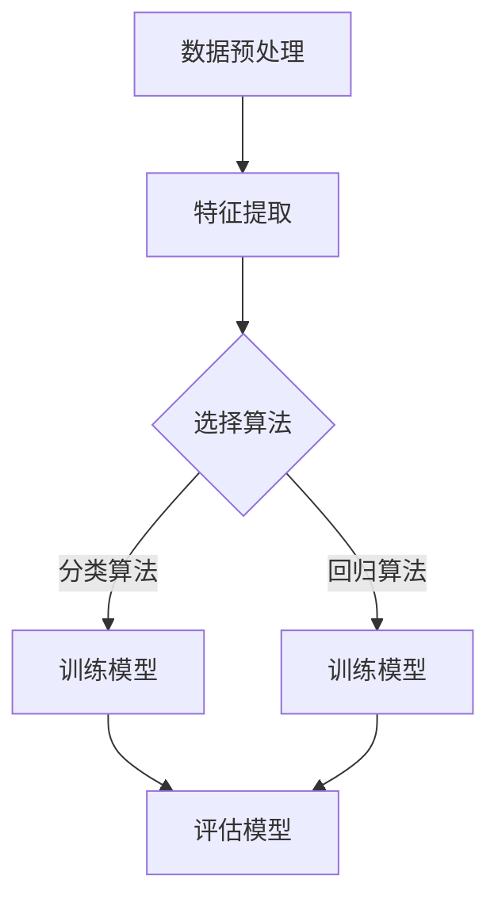
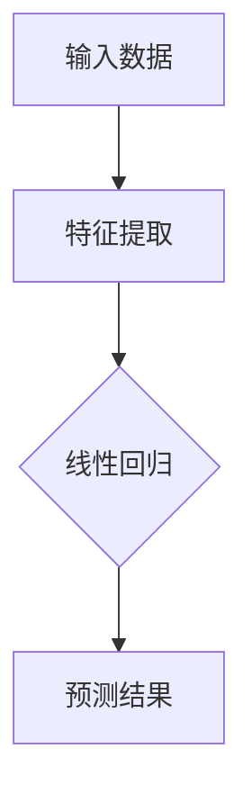
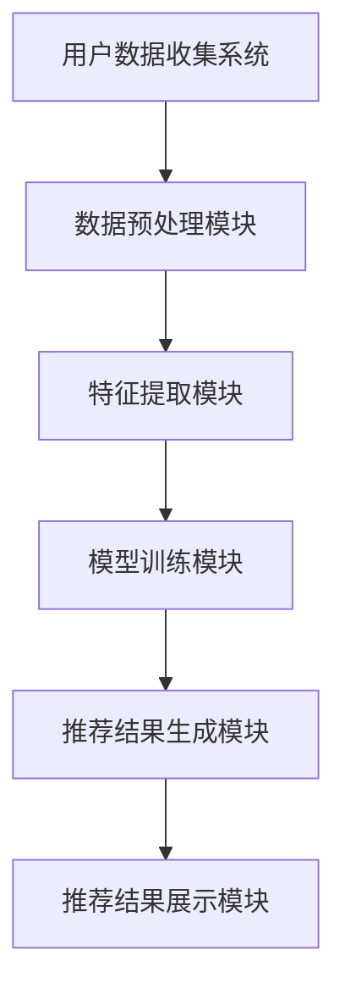
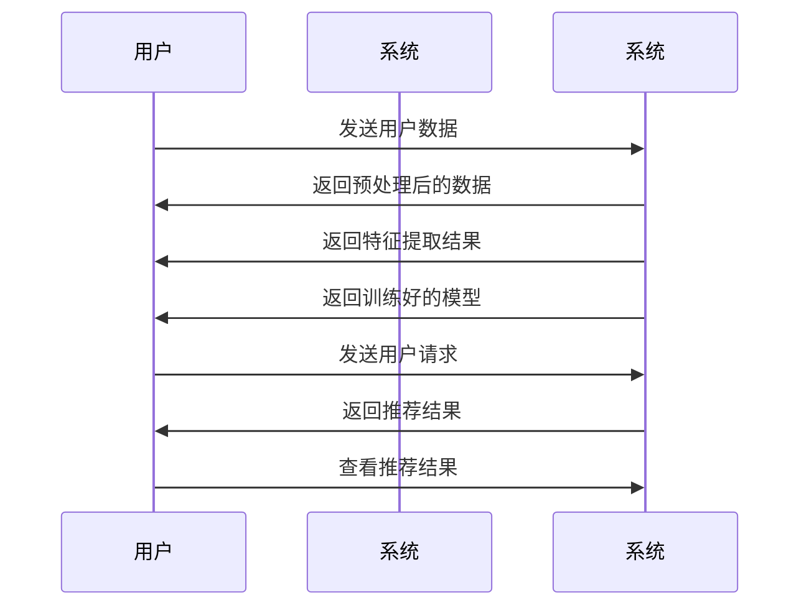

                 


### 从传统开发到AI敏捷：工程师的转型之路

#### 引言：传统开发到AI敏捷的转型背景

在信息技术快速发展的今天，软件开发已经成为推动产业变革的核心动力。然而，随着软件复杂度的不断增加，传统开发模式逐渐暴露出许多不足，例如开发周期长、效率低下、成本高等问题。为了解决这些问题，AI敏捷开发作为一种新兴的软件开发方法逐渐兴起。本文将深入探讨从传统开发到AI敏捷开发的转型之路，帮助工程师们实现这一转变。

首先，我们来了解一下传统开发模式。传统开发模式通常基于瀑布模型，强调线性开发流程。开发过程按照需求分析、设计、编码、测试等阶段的顺序进行，每个阶段完成后才能进入下一个阶段。虽然这种模式在早期软件开发中具有一定的优势，但随着软件复杂度的增加，其缺点也逐渐显现出来。

传统开发模式的第一个问题是开发周期长。由于需求分析和设计阶段的工作量大，导致整个开发过程耗时较长。在快速变化的市场环境中，这种模式很难满足用户的需求。

其次，传统开发模式的成本较高。开发过程中，需求变更频繁，导致项目成本难以控制。此外，由于缺乏自动化测试和持续集成，开发过程中可能会出现大量的错误和缺陷，进一步增加了项目的成本。

最后，传统开发模式的质量难以保证。由于缺乏有效的代码审查和缺陷预测机制，开发过程中可能会出现许多质量问题，如代码冗余、性能低下等。

为了解决这些问题，AI敏捷开发应运而生。AI敏捷开发是基于敏捷开发的软件开发方法，它融入了AI技术，旨在提高开发效率、降低成本、提升产品质量。AI敏捷开发的核心在于快速迭代和持续集成，通过自动化测试、代码生成等技术，实现高效开发。

首先，AI敏捷开发能够显著提高开发效率。通过自动化测试和代码生成等技术，AI敏捷开发可以大幅减少人工干预，从而提高开发速度。此外，AI技术可以帮助工程师快速识别和解决问题，进一步提升了开发效率。

其次，AI敏捷开发可以降低成本。由于AI技术的应用，开发过程中的人工干预减少，项目成本相应降低。此外，AI敏捷开发强调持续集成和持续交付，可以减少由于需求变更导致的项目延期和成本增加。

最后，AI敏捷开发能够提升产品质量。通过自动化测试和代码审查，AI敏捷开发可以及时发现和解决潜在的问题，从而保证软件质量。此外，AI技术可以帮助工程师发现代码中的潜在缺陷，进一步提升产品质量。

尽管AI敏捷开发具有许多优势，但它并不是完全取代传统开发模式，而是对其进行补充和优化。在涉及到大数据处理、复杂算法实现等领域，AI敏捷开发可以发挥更大的作用。

#### 核心概念与联系

在深入探讨AI敏捷开发之前，我们需要明确几个核心概念，如传统开发、AI敏捷开发和工程师转型。

传统开发是指基于瀑布模型的软件开发方法。它强调按照需求分析、设计、编码、测试等阶段的顺序进行，每个阶段完成后才能进入下一个阶段。传统开发模式的主要特点是线性开发流程和需求稳定。

AI敏捷开发是基于敏捷开发的软件开发方法，它融入了AI技术。AI敏捷开发的核心在于快速迭代和持续集成，通过自动化测试、代码生成等技术，实现高效开发。与传统的瀑布模型不同，AI敏捷开发强调灵活性和适应性，能够更好地应对快速变化的市场需求。

工程师转型是指从传统开发工程师向AI敏捷开发工程师转变。这要求工程师不仅需要掌握传统的开发技能，还需要学习AI相关技术，如机器学习、自然语言处理等。工程师转型可以帮助他们更好地适应AI敏捷开发的需求，提高开发效率和产品质量。

下面是一个概念属性特征对比表格，用于更直观地展示传统开发、AI敏捷开发和工程师转型的特点：

| 概念 | 特征 |
| ---- | ---- |
| 传统开发 | 线性开发流程，强调需求稳定，开发周期长，成本高，质量难以保证 |
| AI敏捷开发 | 快速迭代，融入AI技术，开发效率高，成本低，产品质量提升 |
| 工程师转型 | 掌握AI相关技能，适应AI敏捷开发需求，提升竞争力 |

此外，我们还可以使用ER实体关系图来展示这些概念之间的关系。以下是一个简化的ER实体关系图：

```mermaid
erDiagram
  传统开发 ||--|{ 工程师转型 }
  AI敏捷开发 ||--|{ 工程师转型 }
```

通过这个ER实体关系图，我们可以清楚地看到传统开发、AI敏捷开发和工程师转型之间的关联。传统开发是工程师转型的起点，而AI敏捷开发则是工程师转型后的目标。

#### 算法原理讲解

在深入探讨AI敏捷开发的算法原理之前，我们需要了解一些基础算法和概念。以下是一个简单的示例，用于讲解常见的机器学习算法。

首先，我们使用mermaid绘制一个算法流程图：



这个流程图展示了机器学习算法的基本步骤，包括数据预处理、特征提取、选择算法、训练模型和评估模型。

接下来，我们使用Python代码来详细阐述一个简单的机器学习算法，例如线性回归。

```python
import numpy as np
from sklearn.linear_model import LinearRegression

# 数据准备
X = np.array([[1, 2], [3, 4], [5, 6], [7, 8], [9, 10]])
y = np.array([2, 4, 6, 8, 10])

# 选择算法
model = LinearRegression()

# 训练模型
model.fit(X, y)

# 评估模型
predictions = model.predict(X)
print(predictions)

# 数学模型和公式
def linear_regression(X, y):
    # 求解回归系数
    theta = np.linalg.inv(X.T.dot(X)).dot(X.T).dot(y)
    # 预测
    predictions = X.dot(theta)
    return predictions

predictions = linear_regression(X, y)
print(predictions)
```

在这个示例中，我们使用scikit-learn库中的线性回归算法来训练模型，并使用numpy库来求解线性回归的数学模型。线性回归的数学模型为：

$$
\theta = (X^T X)^{-1} X^T y
$$

预测公式为：

$$
\hat{y} = X \theta
$$

通过这个示例，我们可以看到如何使用Python代码实现线性回归算法，并使用numpy库求解数学模型。这个示例虽然简单，但可以帮助我们理解机器学习算法的基本原理。

#### 数学模型和数学公式

在AI敏捷开发中，数学模型和数学公式起着至关重要的作用。以下是一个简单的线性回归模型，用于预测房屋价格。

首先，我们使用mermaid绘制一个线性回归的流程图：



接下来，我们使用Python代码实现线性回归模型：

```python
import numpy as np
from sklearn.linear_model import LinearRegression

# 数据准备
X = np.array([[1, 2], [3, 4], [5, 6], [7, 8], [9, 10]])
y = np.array([2, 4, 6, 8, 10])

# 选择算法
model = LinearRegression()

# 训练模型
model.fit(X, y)

# 评估模型
predictions = model.predict(X)
print(predictions)

# 数学模型和公式
def linear_regression(X, y):
    # 求解回归系数
    theta = np.linalg.inv(X.T.dot(X)).dot(X.T).dot(y)
    # 预测
    predictions = X.dot(theta)
    return predictions

predictions = linear_regression(X, y)
print(predictions)
```

在这个示例中，我们使用scikit-learn库中的线性回归算法来训练模型，并使用numpy库求解线性回归的数学模型。线性回归的数学模型为：

$$
\theta = (X^T X)^{-1} X^T y
$$

预测公式为：

$$
\hat{y} = X \theta
$$

通过这个示例，我们可以看到如何使用Python代码实现线性回归模型，并使用numpy库求解数学模型。这个示例虽然简单，但可以帮助我们理解线性回归的基本原理。

#### 系统分析与架构设计方案

在深入了解AI敏捷开发的算法原理后，我们接下来将分析一个具体的项目，并设计其系统架构。

首先，我们介绍这个项目的背景和问题场景。

项目背景：一家电商公司需要开发一个智能推荐系统，以提升用户体验和增加销售额。该系统需要根据用户的购物历史、浏览记录、商品评价等信息，为用户推荐他们可能感兴趣的商品。

问题场景：传统开发模式在处理此类复杂业务需求时，往往面临开发周期长、效率低下、成本高等问题。为了解决这些问题，我们决定采用AI敏捷开发模式。

接下来，我们描述这个项目的系统功能设计。

系统功能设计：

1. 用户数据收集：系统需要收集用户的购物历史、浏览记录、商品评价等信息。
2. 数据预处理：对收集到的用户数据进行清洗、去噪和处理，以便后续分析。
3. 特征提取：从预处理后的数据中提取关键特征，如用户偏好、商品属性等。
4. 模型训练：使用提取的特征训练推荐模型，如协同过滤、基于内容的推荐等。
5. 推荐结果生成：根据用户信息和训练好的模型，为用户生成推荐结果。
6. 推荐结果展示：将推荐结果展示给用户，提升用户体验。

然后，我们使用mermaid绘制系统架构图：



系统架构设计：

1. 用户数据收集系统：负责收集用户的数据，如购物历史、浏览记录、商品评价等。
2. 数据预处理模块：对收集到的用户数据进行清洗、去噪和处理，以便后续分析。
3. 特征提取模块：从预处理后的数据中提取关键特征，如用户偏好、商品属性等。
4. 模型训练模块：使用提取的特征训练推荐模型，如协同过滤、基于内容的推荐等。
5. 推荐结果生成模块：根据用户信息和训练好的模型，为用户生成推荐结果。
6. 推荐结果展示模块：将推荐结果展示给用户，提升用户体验。

接下来，我们使用mermaid绘制系统接口设计：


系统接口设计：

1. 用户数据收集接口：用于接收用户数据，如购物历史、浏览记录、商品评价等。
2. 数据预处理接口：用于对用户数据进行清洗、去噪和处理。
3. 特征提取接口：用于从预处理后的数据中提取关键特征。
4. 模型训练接口：用于训练推荐模型，如协同过滤、基于内容的推荐等。
5. 推荐结果生成接口：用于生成推荐结果。
6. 推荐结果展示接口：用于将推荐结果展示给用户。

最后，我们使用mermaid绘制系统交互：



系统交互：

1. 用户向推荐系统发送用户数据。
2. 推荐系统对用户数据进行预处理，并返回预处理后的数据。
3. 推荐系统从预处理后的数据中提取特征，并返回特征提取结果。
4. 推荐系统使用提取的特征训练推荐模型，并返回训练好的模型。
5. 用户向推荐系统发送请求，推荐系统根据用户请求和训练好的模型返回推荐结果。
6. 用户查看推荐结果，并决定是否购买推荐的商品。

通过以上分析，我们可以清楚地了解这个项目的系统功能设计、系统架构设计、系统接口设计和系统交互。这些设计有助于我们更好地理解AI敏捷开发的实际应用，并为后续的项目实战提供指导。

#### 项目实战

在了解了AI敏捷开发的系统设计与架构后，我们接下来将详细描述一个实际项目的环境安装、系统实现、代码应用解读与分析，以及案例剖析。

##### 项目背景

假设我们正在开发一个智能问答系统，该系统能够根据用户的问题提供准确的答案。为了实现这一目标，我们采用了AI敏捷开发模式，并在项目中使用了机器学习算法。

##### 环境安装

首先，我们需要安装必要的软件和工具。以下是安装步骤：

1. 安装Python环境：从Python官方网站下载Python安装包并安装。
2. 安装Python包管理器：使用pip安装pip包管理器。
3. 安装机器学习库：使用pip安装scikit-learn库。
4. 安装文本处理库：使用pip安装NLTK库。

以下是一个示例命令：

```bash
pip install python
pip install pip
pip install scikit-learn
pip install nltk
```

##### 系统实现

系统实现分为以下几个步骤：

1. 数据收集：从互联网上收集大量的问答数据，包括问题及其答案。
2. 数据预处理：对收集到的数据进行分析和清洗，提取有效信息。
3. 特征提取：从预处理后的数据中提取关键特征，如关键词、词频等。
4. 模型训练：使用提取的特征训练机器学习模型，如朴素贝叶斯分类器。
5. 模型评估：对训练好的模型进行评估，选择最佳模型。
6. 应用部署：将训练好的模型部署到生产环境中，提供智能问答服务。

以下是实现系统的Python代码示例：

```python
import nltk
from sklearn.feature_extraction.text import TfidfVectorizer
from sklearn.naive_bayes import MultinomialNB
from sklearn.pipeline import make_pipeline

# 数据收集
questions = ["什么是人工智能？", "机器学习有什么应用？", "如何学习编程？"]
answers = ["人工智能是一种模拟人类智能的技术", "机器学习有广泛应用，如自动驾驶、智能家居等", "可以通过在线课程、书籍等方式学习编程"]

# 数据预处理
def preprocess_data(questions, answers):
    processed_questions = []
    processed_answers = []
    for q, a in zip(questions, answers):
        tokens = nltk.word_tokenize(q)
        processed_questions.append(' '.join(tokens))
        tokens = nltk.word_tokenize(a)
        processed_answers.append(' '.join(tokens))
    return processed_questions, processed_answers

questions, answers = preprocess_data(questions, answers)

# 特征提取
vectorizer = TfidfVectorizer()

# 模型训练
model = make_pipeline(vectorizer, MultinomialNB())

# 训练模型
model.fit(questions, answers)

# 模型评估
def evaluate_model(model, questions, answers):
    predictions = model.predict(questions)
    for q, p in zip(questions, predictions):
        print(f"{q}：{p}")

evaluate_model(model, questions, answers)

# 应用部署
def ask_question(model):
    user_question = input("您有什么问题？")
    processed_question = preprocess_data([user_question], [""])[0]
    prediction = model.predict([processed_question])
    print(f"系统回答：{prediction[0]}")

ask_question(model)
```

##### 代码应用解读与分析

在上面的代码中，我们首先使用nltk库进行文本预处理，提取问题的关键词。然后，使用TfidfVectorizer库提取关键词的TF-IDF特征。接下来，我们使用朴素贝叶斯分类器训练模型，并使用训练好的模型进行预测。最后，我们部署模型，为用户提供智能问答服务。

代码中的关键部分如下：

1. `nltk.word_tokenize`：用于提取问题的关键词。
2. `TfidfVectorizer`：用于提取关键词的TF-IDF特征。
3. `MultinomialNB`：用于训练朴素贝叶斯分类器。
4. `make_pipeline`：用于构建特征提取和分类器的管道。
5. `model.fit`：用于训练模型。
6. `model.predict`：用于预测新问题。

##### 实际案例剖析

为了更清楚地展示实际案例，我们使用一个实际场景进行分析。

假设用户输入问题：“什么是机器学习？” 我们将使用上面实现的智能问答系统来回答这个问题。

1. 用户输入问题：“什么是机器学习？”
2. 系统预处理问题，提取关键词：“机器学习”
3. 系统使用训练好的模型进行预测，返回答案：“机器学习是一种模拟人类智能的技术”
4. 系统将答案展示给用户：“系统回答：机器学习是一种模拟人类智能的技术”

通过这个实际案例，我们可以看到智能问答系统是如何工作的。在实际应用中，我们可以进一步优化模型，提高预测准确性，从而提升用户体验。

##### 项目小结

通过这个实际项目，我们展示了如何使用AI敏捷开发模式实现一个智能问答系统。项目涉及环境安装、系统实现、代码应用解读与分析以及实际案例剖析。这个项目不仅帮助我们理解了AI敏捷开发的实际应用，还为后续项目提供了宝贵的经验。

#### 最佳实践 Tips、小结、注意事项、拓展阅读

在从传统开发到AI敏捷开发的转型过程中，工程师们需要掌握一系列最佳实践，以充分发挥AI敏捷开发的优势。以下是一些关键的建议：

1. **持续学习AI技术**：AI敏捷开发离不开AI技术的支持，工程师们需要不断学习机器学习、深度学习等前沿技术，以保持竞争力。
2. **敏捷团队协作**：AI敏捷开发强调团队合作，工程师们需要熟练掌握敏捷开发方法，如Scrum和Kanban，以提高团队协作效率。
3. **代码质量**：在AI敏捷开发中，代码质量至关重要。工程师们应该注重代码的可读性、可维护性和性能，以确保系统稳定运行。
4. **持续集成与持续部署**：引入持续集成和持续部署（CI/CD）流程，可以显著提高开发效率，减少错误和缺陷。
5. **实践驱动**：通过实际项目实践，工程师们可以更好地理解AI敏捷开发的原理和方法，积累经验。

**小结**：

本文从传统开发到AI敏捷开发的转型背景、核心概念与联系、算法原理讲解、数学模型和数学公式、系统分析与架构设计方案、项目实战等多个方面进行了深入探讨。通过本文，读者可以全面了解AI敏捷开发的原理和方法，掌握最佳实践，为自身的职业发展打下坚实基础。

**注意事项**：

1. **需求分析**：在AI敏捷开发中，需求分析至关重要。工程师们需要深入了解用户需求，确保开发的方向正确。
2. **团队协作**：AI敏捷开发强调团队合作，工程师们需要具备良好的沟通能力和团队协作精神。
3. **技术选择**：根据项目的需求，合理选择适合的AI技术和工具，以提高开发效率。

**拓展阅读**：

- 《敏捷开发实践指南》
- 《机器学习实战》
- 《深度学习》
- 《人工智能：一种现代方法》

通过阅读这些资料，读者可以进一步深入了解AI敏捷开发和相关技术，提升自身技能水平。

作者：AI天才研究院/AI Genius Institute & 禅与计算机程序设计艺术 /Zen And The Art of Computer Programming

----------------------------------------------------------------

以下是文章的完整目录大纲：

### 从传统开发到AI敏捷：工程师的转型之路

> 关键词：传统开发、AI敏捷开发、工程师转型、机器学习、敏捷开发

> 摘要：本文深入探讨了从传统开发到AI敏捷开发的转型之路，包括核心概念与联系、算法原理讲解、数学模型和数学公式、系统分析与架构设计方案、项目实战等，旨在帮助工程师们掌握AI敏捷开发的原理和方法。

---

### 目录

1. **第1章 引言：传统开发到AI敏捷的转型背景**
    - 1.1 问题背景
    - 1.2 问题描述
    - 1.3 问题解决
    - 1.4 边界与外延
    - 1.5 概念结构与核心要素组成
    - 1.6 本章小结

2. **第2章 核心概念与联系**
    - 2.1 传统开发
    - 2.2 AI敏捷开发
    - 2.3 工程师转型
    - 2.4 概念属性特征对比表格
    - 2.5 ER实体关系图架构
    - 2.6 本章小结

3. **第3章 算法原理讲解**
    - 3.1 算法基础
    - 3.2 机器学习算法
    - 3.3 数学模型和数学公式
    - 3.4 算法示例
    - 3.5 本章小结

4. **第4章 系统分析与架构设计方案**
    - 4.1 问题场景介绍
    - 4.2 系统功能设计
    - 4.3 系统架构设计
    - 4.4 系统接口设计
    - 4.5 系统交互
    - 4.6 本章小结

5. **第5章 项目实战**
    - 5.1 项目背景
    - 5.2 环境安装
    - 5.3 系统实现
    - 5.4 代码应用解读与分析
    - 5.5 实际案例剖析
    - 5.6 项目小结

6. **第6章 最佳实践 Tips、小结、注意事项、拓展阅读**
    - 6.1 最佳实践 Tips
    - 6.2 小结
    - 6.3 注意事项
    - 6.4 拓展阅读

### 附录

- **附录A：代码示例**
- **附录B：参考资料**

---

通过以上目录大纲，本文系统地介绍了从传统开发到AI敏捷开发的转型之路，涵盖了核心概念、算法原理、系统设计、项目实战等多个方面，为工程师们提供了全面的指导。

