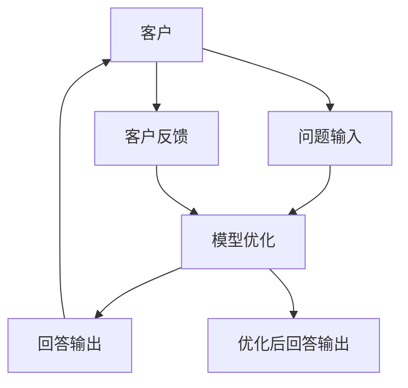
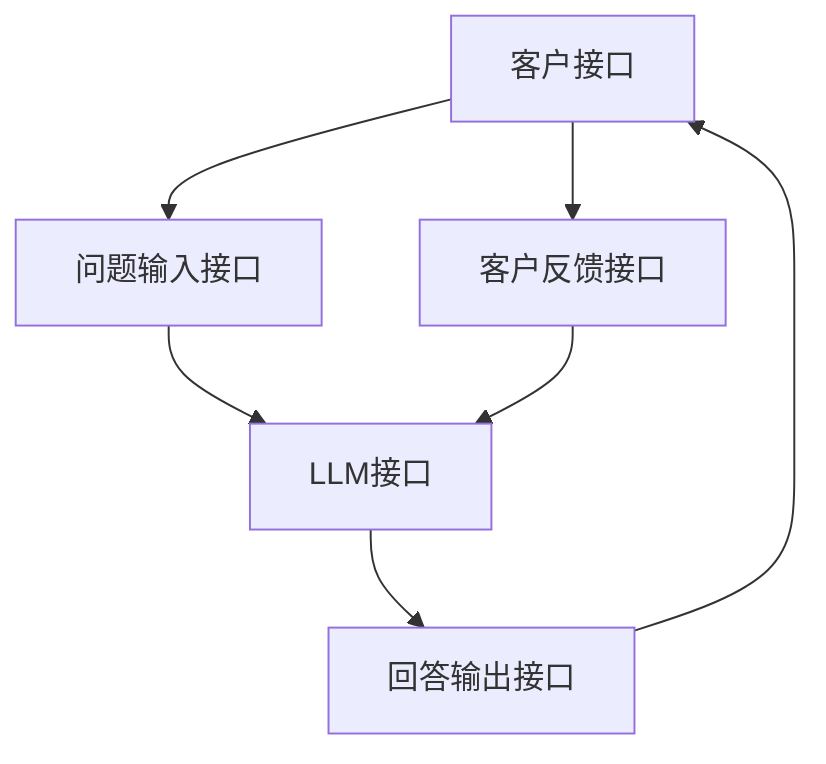
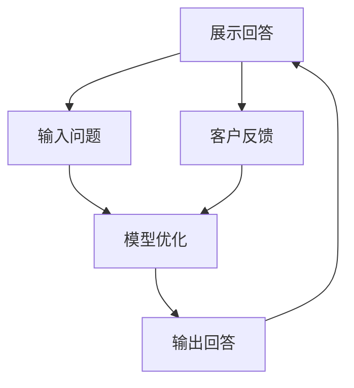

                 

## 第一部分：背景介绍

### 第1章：LLM应用开发的背景与挑战

#### 1.1 LLM应用开发的起源与发展

**核心概念术语说明：**
- **语言模型（Language Model，简称LM）：** 是一种基于统计学方法，用于预测下一个单词或字符的概率模型，是自然语言处理（NLP）的重要基础。
- **大规模语言模型（Large Language Model，简称LLM）：** 是指训练数据规模庞大的语言模型，能够生成高质量的自然语言文本。

**问题背景：**
随着深度学习和大数据技术的迅速发展，LLM在自然语言处理领域取得了显著成果。LLM不仅能够用于文本生成、机器翻译、情感分析等传统任务，还能应用于对话系统、问答系统等新兴领域。

**问题描述：**
LLM应用开发的兴起，引发了传统软件开发模式的挑战。传统开发模式通常遵循瀑布模型，即需求分析、设计、编码、测试、部署等阶段顺序进行。而LLM应用开发则需要更灵活、更快速的开发模式，以应对快速变化的业务需求和技术的快速发展。

**问题解决：**
敏捷开发作为一种响应变化的软件开发方法，逐渐成为LLM应用开发的主流。敏捷开发强调迭代、协作、灵活性和客户满意度，能够更好地适应LLM应用开发的快速变化。

**边界与外延：**
- **边界：** LLM应用开发的边界主要涉及自然语言处理、机器学习和软件开发领域。
- **外延：** LLM的应用领域不断扩展，包括但不限于文本生成、对话系统、知识图谱、智能客服等。

**概念结构与核心要素组成：**
- **LLM应用开发的核心概念结构：**
  - 语言模型
  - 训练数据
  - 模型结构
  - 模型优化
  - 应用场景

**1.2 传统开发模式的局限性**

**传统开发模式的特点：**
- **顺序执行：** 每个开发阶段严格按照顺序进行，前一个阶段的结果是下一个阶段的输入。
- **固定需求：** 需求在项目初期就已经明确，后期难以更改。
- **周期较长：** 开发周期较长，通常需要数月甚至数年。
- **文档驱动：** 项目文档是沟通的主要手段，文档的完整性和准确性对项目成功至关重要。

**传统开发模式在LLM应用开发中的不足：**
- **需求变化：** 在LLM应用开发中，需求往往随着技术发展和业务变化而快速变化，传统模式难以应对。
- **开发周期：** 传统模式周期较长，无法快速响应市场变化。
- **灵活性不足：** 传统模式在应对新技术和业务需求时，灵活性不足，难以实现持续迭代。

**1.3 敏捷开发的兴起与优势**

**敏捷开发的核心原则：**
- **迭代开发：** 软件开发过程分为多个迭代周期，每个迭代周期都有明确的开发目标。
- **客户满意度：** 关注客户需求，确保软件质量。
- **协作与沟通：** 强调团队成员之间的沟通和协作。
- **灵活应对变化：** 能够快速响应需求变化和新技术。

**敏捷开发在LLM应用开发中的优势：**
- **快速迭代：** 能够快速响应需求变化，持续优化模型性能。
- **灵活调整：** 在开发过程中，可以根据反馈灵活调整模型结构和训练策略。
- **提高效率：** 通过迭代开发和持续集成，提高开发效率。
- **团队协作：** 促进团队成员之间的沟通和协作，提高整体开发能力。

#### 1.4 LLM应用开发的挑战

**数据隐私与安全性：**
- **数据来源：** LLM训练数据通常来源于互联网公开数据集，可能涉及隐私数据。
- **数据保护：** 需要对数据进行加密和脱敏处理，确保用户隐私。
- **合规性：** 遵守相关法律法规，如GDPR等。

**模型可解释性与可靠性：**
- **可解释性：** LLM模型通常采用深度神经网络，难以解释其决策过程。
- **可靠性：** 模型输出需要经过严格测试，确保其可靠性和准确性。

**系统性能与可扩展性：**
- **计算资源：** LLM模型计算量大，需要高性能计算资源。
- **可扩展性：** 系统需要具备良好的可扩展性，以应对日益增长的请求量。

### 总结

从传统开发到敏捷开发，是LLM应用开发的一个重要转型。传统开发模式在应对快速变化的需求和新技术时存在明显不足，而敏捷开发通过迭代、协作和灵活性，能够更好地适应LLM应用开发的挑战。然而，数据隐私、模型可解释性、系统性能等问题仍需进一步解决。在下一部分，我们将进一步探讨LLM的核心概念与原理。## 第二部分：核心概念与原理

### 第2章：LLM的核心概念与原理

#### 2.1 LLM的定义与分类

**LLM的定义：**
大规模语言模型（Large Language Model，简称LLM）是一种基于深度学习技术的自然语言处理模型，其目的是模拟人类对自然语言的理解和生成能力。LLM通过学习大量文本数据，捕捉语言结构和语义信息，从而生成连贯、准确的自然语言文本。

**LLM的分类：**
1. **基于规则的模型：**
   - **基于规则的模型**（Rule-Based Model）是最早的自然语言处理模型，通过手动编写规则来解析和处理语言。
   - **缺点：** 难以应对复杂和不确定的语言现象，维护成本高。

2. **统计模型：**
   - **统计模型**（Statistical Model）基于统计方法来预测语言序列的概率。
   - **代表方法：** 隐马尔可夫模型（HMM）、n-gram模型等。
   - **缺点：** 对长文本的预测能力有限，无法捕捉深层语义信息。

3. **深度学习模型：**
   - **深度学习模型**（Deep Learning Model）通过多层神经网络结构来学习语言特征。
   - **代表方法：** 卷积神经网络（CNN）、递归神经网络（RNN）、长短期记忆网络（LSTM）等。
   - **优点：** 能够捕捉长文本中的复杂结构，生成高质量的自然语言文本。

4. **端到端模型：**
   - **端到端模型**（End-to-End Model）直接将输入文本映射到输出文本，无需中间表示。
   - **代表方法：** 自注意力机制（Self-Attention）、Transformer等。
   - **优点：** 提高了模型的生成质量和效率。

#### 2.2 LLM的基本结构

**语言模型的基础架构：**
LLM的基本结构通常包括以下几个关键部分：

1. **输入层：**
   - **词嵌入（Word Embedding）：** 将词汇映射到低维向量空间，便于模型学习词汇之间的关系。
   - **编码器（Encoder）：** 对输入文本进行编码，提取文本的特征。

2. **中间层：**
   - **注意力机制（Attention Mechanism）：** 帮助模型关注文本中的关键信息，提高生成质量。
   - **编码器-解码器（Encoder-Decoder）架构：** 通过编码器提取输入文本的特征，通过解码器生成输出文本。

3. **输出层：**
   - **预测层（Prediction Layer）：** 通过softmax函数输出每个单词的概率分布，从而生成输出文本。

**深度学习在LLM中的应用：**
深度学习在LLM中的应用主要体现在以下几个方面：

1. **神经网络结构：**
   - **卷积神经网络（CNN）：** 用于提取文本的特征表示。
   - **递归神经网络（RNN）：** 用于处理序列数据，如文本。
   - **长短期记忆网络（LSTM）：** 改善RNN的长期依赖问题。
   - **Transformer模型：** 引入自注意力机制，显著提高模型性能。

2. **预训练与微调：**
   - **预训练（Pre-training）：** 使用大规模未标注数据对模型进行训练，提高模型对语言的泛化能力。
   - **微调（Fine-tuning）：** 在预训练模型的基础上，使用特定任务的数据进行微调，提高模型在特定任务上的性能。

3. **优化方法：**
   - **随机梯度下降（SGD）：** 常用的优化算法，用于更新模型参数。
   - **Adam优化器：** 结合SGD的优点，自适应调整学习率。

#### 2.3 LLM的训练与优化

**数据集的预处理：**
1. **文本清洗：**
   - **去除标点符号和特殊字符：** 去除文本中的标点符号和特殊字符，简化文本结构。
   - **去除停用词：** 去除常见的无意义词汇，如“的”、“了”等。
   - **分词：** 将文本分解为单词或子词。

2. **词嵌入：**
   - **预训练词嵌入：** 使用预训练的词嵌入模型，如Word2Vec、GloVe等，将词汇映射到低维向量空间。
   - **动态词嵌入：** 在训练过程中动态生成词嵌入向量。

**模型训练与优化方法：**
1. **损失函数：**
   - **交叉熵损失（Cross-Entropy Loss）：** 用于衡量模型预测分布与真实分布之间的差异。
   - **负对数损失（Negative Log-Likelihood Loss）：** 用于计算预测概率的对数。

2. **优化策略：**
   - **随机梯度下降（SGD）：** 通过梯度更新模型参数，最小化损失函数。
   - **Adam优化器：** 结合SGD的优点，自适应调整学习率。

3. **训练技巧：**
   - **批量归一化（Batch Normalization）：** 改善训练稳定性。
   - **学习率调度（Learning Rate Scheduler）：** 根据训练进度动态调整学习率。

**模型评估与性能分析：**
1. **准确率（Accuracy）：** 用于衡量模型预测正确的比例。
2. **召回率（Recall）：** 用于衡量模型预测为正例的真正例比例。
3. **F1分数（F1 Score）：** 结合准确率和召回率的综合指标。
4. **BLEU评分（BLEU Score）：** 用于评估文本生成的质量，基于编辑距离进行评分。

**总结：**
LLM作为一种先进的自然语言处理模型，通过深度学习和大规模数据处理技术，实现了高质量的自然语言生成。LLM的基本结构包括输入层、中间层和输出层，深度学习技术在其中发挥了关键作用。通过训练和优化，LLM能够不断提高其性能和生成质量。在下一部分，我们将探讨敏捷开发在LLM应用开发中的应用和实践。## 第三部分：技术原理与实践方法

### 第3章：敏捷开发在LLM应用开发中的应用

#### 3.1 敏捷开发的核心原则与实践

**敏捷开发的核心原则：**

**迭代开发（Iterative Development）：** 敏捷开发强调迭代开发，将开发过程划分为多个短周期（通常为2-4周），每个周期都有明确的开发目标和可交付成果。

**客户满意度（Customer Satisfaction）：** 敏捷开发关注客户需求，通过持续与客户沟通，确保软件质量，提高客户满意度。

**协作与沟通（Collaboration and Communication）：** 敏捷开发强调团队成员之间的协作和沟通，通过每日站立会议、迭代评审和回顾会议，促进信息共享和问题解决。

**灵活应对变化（Flexibility in Responding to Change）：** 敏捷开发能够快速响应需求变化，通过迭代过程，灵活调整开发计划。

**实践方法：**

**每日站立会议（Daily Stand-up Meeting）：** 每日站立会议是团队交流的快速机制，每个团队成员回答三个问题：昨天完成了什么？今天计划完成什么？遇到了什么问题？

**迭代评审（Iteration Review）：** 在每个迭代周期的结束时，团队与客户一起进行迭代评审，展示迭代成果，收集反馈，为下一个迭代做准备。

**回顾会议（Retrospective Meeting）：** 回顾会议是在每个迭代周期结束时进行的，团队共同讨论成功的经验、遇到的问题和改进的机会，以持续优化开发过程。

**3.2 LLM应用开发中的敏捷实践**

**需求分析与优先级排序：**

**需求收集（Requirement Gathering）：** 通过与客户和利益相关者的沟通，了解LLM应用的需求和目标。

**优先级排序（Prioritization）：** 根据业务价值和风险，对需求进行优先级排序，确保高优先级需求首先得到满足。

**用户故事（User Story）：** 使用用户故事来描述需求，用户故事通常包含三个部分：用户角色、用户目标和商业价值。

**迭代规划（Iteration Planning）：** 在每个迭代周期开始时，团队根据优先级排序的结果，规划下一个迭代的目标和任务。

**持续集成与持续部署：**

**持续集成（Continuous Integration，CI）：** 通过自动化测试和构建，确保代码的持续集成，及时发现和解决集成过程中的问题。

**持续部署（Continuous Deployment，CD）：** 通过自动化部署流程，确保代码的持续部署，提高交付效率和稳定性。

**自动化测试（Automated Testing）：** 使用自动化测试工具，对LLM应用进行功能测试、性能测试和安全测试，确保软件质量。

**回归测试（Regression Testing）：** 在每次代码变更后，进行回归测试，确保原有功能仍然正常。

**3.3 敏捷开发工具与技术**

**版本控制系统（Version Control System，VCS）：** 如Git，用于管理代码版本，确保代码的完整性、可追溯性和协作性。

**自动化测试工具（Automated Testing Tools）：** 如Selenium、JUnit等，用于编写和执行自动化测试脚本，提高测试效率和覆盖度。

**持续集成平台（Continuous Integration Platform）：** 如Jenkins、Travis CI等，用于自动化构建、测试和部署流程。

**代码审查工具（Code Review Tools）：** 如GitLab、GitHub等，用于代码审查和协作，确保代码质量。

**总结：**
敏捷开发在LLM应用开发中的应用，通过迭代、协作和灵活应对变化，提高了开发效率和质量。敏捷实践如每日站立会议、迭代评审、回顾会议等，促进了团队成员之间的沟通和协作。持续集成与持续部署等工具和技术的应用，确保了代码的质量和交付效率。在下一部分，我们将通过一个实战案例，进一步探讨敏捷开发在LLM应用开发中的实际应用。## 第四部分：项目实战与案例分析

### 第4章：从传统开发到敏捷：LLM应用开发实战

#### 4.1 实战项目概述

**项目背景：**
为了提升公司客服部门的效率，我们决定开发一款基于LLM的智能客服系统。该系统旨在通过自然语言处理技术，实现与客户的智能对话，自动回答常见问题，并能够根据客户的反馈进行自我优化。

**项目目标：**
1. **实现基本的问答功能：** 系统能够自动回答客户提出的常见问题。
2. **提供高质量的回答：** 系统能够生成连贯、准确的自然语言文本。
3. **具备自我学习能力：** 系统能够根据客户的反馈不断优化回答质量。

**项目团队组成与角色分工：**
- **项目经理（Project Manager）：** 负责项目规划、进度控制和资源协调。
- **数据科学家（Data Scientist）：** 负责LLM模型的训练和优化。
- **软件工程师（Software Engineer）：** 负责系统的开发、测试和部署。
- **前端工程师（Front-end Engineer）：** 负责用户界面的设计和实现。
- **测试工程师（Test Engineer）：** 负责系统的功能测试和性能测试。

#### 4.2 项目开发过程

**需求分析与原型设计：**
1. **需求收集：** 通过与客服部门和客户的沟通，收集常见的客户问题和业务需求。
2. **原型设计：** 使用Axure等工具设计系统的用户界面原型，展示系统功能和交互流程。

**模型训练与优化：**
1. **数据准备：** 收集和整理大量客服对话数据，进行文本清洗和预处理。
2. **模型训练：** 使用预训练的LLM模型，如GPT-3，进行细粒度训练，调整模型参数。
3. **模型优化：** 通过多轮实验，优化模型结构、参数和超参数，提高模型性能。

**系统集成与测试：**
1. **系统集成：** 将前端、后端和数据库等组件集成在一起，构建完整的系统。
2. **功能测试：** 使用自动化测试工具，对系统功能进行测试，确保功能完整性。
3. **性能测试：** 对系统进行负载测试和压力测试，评估系统的性能和稳定性。

**持续迭代与优化：**
1. **用户反馈：** 通过用户反馈，收集系统在实际应用中的问题和改进建议。
2. **模型更新：** 根据用户反馈，调整模型参数和训练数据，优化模型性能。
3. **系统更新：** 更新系统功能，修复bug，提升用户体验。

#### 4.3 项目总结与反思

**项目成果与收益：**
1. **高效的智能客服系统：** 系统实现了高效的智能问答功能，显著提升了客服部门的工作效率。
2. **高质量的回答生成：** 系统生成的回答质量高，能够准确回答客户的提问。
3. **自我学习能力：** 系统具备自我学习能力，根据用户反馈不断优化回答质量。

**项目中的挑战与解决方法：**
1. **数据质量：** 客服对话数据质量参差不齐，存在噪声和错误。解决方法：通过数据清洗和预处理，提高数据质量。
2. **模型性能：** 初始模型性能不佳，生成回答不准确。解决方法：通过多轮实验，优化模型结构和参数，提高模型性能。
3. **系统稳定性：** 在高负载下，系统性能不稳定。解决方法：通过性能优化和负载均衡，提高系统稳定性。

**项目经验与启示：**
1. **敏捷开发的重要性：** 通过敏捷开发，团队能够快速响应需求变化，持续优化系统性能。
2. **数据驱动的决策：** 项目中的成功与失败很大程度上取决于数据的质量和利用。
3. **团队合作：** 项目成功离不开团队成员之间的紧密合作和有效沟通。

### 总结

通过这个实战项目，我们展示了如何从传统开发模式顺利过渡到敏捷开发，在LLM应用开发中实现高效、高质量的成果。项目过程中遇到的挑战和解决方案，为我们提供了宝贵的经验，也为未来类似项目提供了参考。在下一部分，我们将进一步探讨LLM应用开发的最佳实践，以帮助开发团队更好地应对挑战。## 第五部分：最佳实践与拓展

### 第5章：LLM应用开发的最佳实践

#### 5.1 数据管理策略

**数据采集与预处理：**
1. **数据采集：** 使用爬虫工具或API接口，从多个渠道收集高质量的自然语言数据。
2. **数据清洗：** 去除重复数据、噪声数据和格式不统一的数据，保证数据质量。

**数据安全与隐私保护：**
1. **数据加密：** 对敏感数据进行加密处理，防止数据泄露。
2. **数据脱敏：** 对个人身份信息进行脱敏处理，保护用户隐私。

**合规性：**
1. **遵守法律法规：** 遵守相关法律法规，如《通用数据保护条例》（GDPR）和《加州消费者隐私法案》（CCPA）。
2. **用户同意：** 在数据处理前，确保用户同意数据收集和使用。

#### 5.2 模型优化策略

**模型选择与调整：**
1. **模型选择：** 根据应用场景选择合适的LLM模型，如GPT-3、BERT等。
2. **模型调整：** 根据实际需求，调整模型参数和超参数，优化模型性能。

**模型压缩与加速：**
1. **模型压缩：** 通过模型剪枝、量化等技术，减小模型大小，提高部署效率。
2. **模型加速：** 使用GPU或TPU等高性能计算设备，加快模型训练和推理速度。

#### 5.3 系统性能优化

**系统架构设计：**
1. **微服务架构：** 采用微服务架构，提高系统的可扩展性和可维护性。
2. **分布式系统：** 使用分布式存储和计算资源，提高系统的处理能力。

**系统部署与运维：**
1. **容器化与自动化部署：** 使用Docker等容器技术，实现自动化部署和运维。
2. **监控与告警：** 使用监控工具，实时监控系统性能和健康状况，及时响应异常。

### 第6章：拓展阅读与资源推荐

#### 6.1 相关书籍与论文推荐

**必读经典：**
- **《Deep Learning》（Goodfellow, Bengio, Courville）：** 深度学习领域的经典教材，详细介绍了深度学习的基本原理和应用。
- **《Hands-On Machine Learning with Scikit-Learn, Keras, and TensorFlow》（Aurélien Géron）：** 一本实用的机器学习实战指南，涵盖了从数据预处理到模型优化的全过程。

**前沿研究：**
- **《Attention Is All You Need》（Vaswani et al.）：** Transformer模型的奠基性论文，介绍了自注意力机制在自然语言处理中的应用。
- **《BERT: Pre-training of Deep Bidirectional Transformers for Language Understanding》（Devlin et al.）：** BERT模型的提出，展示了预训练模型在自然语言处理任务中的优势。

#### 6.2 在线课程与培训资源

**专业课程：**
- **Coursera的《深度学习专项课程》：** 由吴恩达教授主讲，涵盖了深度学习的基础知识和应用。
- **Udacity的《机器学习工程师纳米学位》：** 提供了从基础到高级的机器学习课程，适合希望进入该领域的开发者。

**实战演练：**
- **fast.ai的《深度学习实战》：** 提供了实用的深度学习项目，帮助开发者将理论知识应用到实际项目中。
- **Google的《深度学习特化课程》：** 通过实际项目，深入介绍深度学习在自然语言处理、计算机视觉等领域的应用。

#### 6.3 社交媒体与学术社群

**社交媒体：**
- **Twitter：** 关注相关的技术专家和研究者，获取最新的研究动态和行业资讯。
- **LinkedIn：** 加入相关的技术社群，与同行交流经验和职业发展。

**学术社群：**
- **arXiv：** 访问自然语言处理和机器学习领域的预印本论文，了解最新的研究进展。
- **学术会议与研讨会：** 参加如ACL（国际计算语言学协会会议）、NeurIPS（神经信息处理系统会议）等学术会议，与专家学者面对面交流。

### 总结

最佳实践是LLM应用开发成功的关键。通过有效的数据管理策略、模型优化策略和系统性能优化方法，开发团队能够提高模型性能和系统稳定性。拓展阅读与资源推荐提供了丰富的学习材料和实践机会，帮助开发者深入了解LLM应用开发的前沿技术和最佳实践。在敏捷开发的指导下，结合这些最佳实践，开发团队能够更加高效地应对LLM应用开发的挑战，实现创新和突破。## 结论

从传统开发到敏捷：LLM应用开发的转型之路，不仅是一场技术革命，更是开发思维和方法的革新。通过本文的探讨，我们系统地分析了LLM应用开发的背景、核心概念、技术原理和实践方法，揭示了敏捷开发在其中的关键作用。

首先，我们明确了LLM的核心概念和原理，了解了其从基于规则的模型、统计模型到深度学习模型的演变过程。其次，我们探讨了敏捷开发的核心原则和实践方法，阐述了其在LLM应用开发中的优势。最后，通过实际项目案例，我们展示了如何从传统开发模式顺利过渡到敏捷开发，实现了高效、高质量的LLM应用。

敏捷开发在LLM应用开发中的重要性不言而喻。它不仅能够提高开发效率，还能促进团队协作和灵活应对需求变化。然而，我们也应认识到，LLM应用开发仍面临数据隐私、模型可解释性、系统性能等挑战。因此，在未来的实践中，我们需要不断优化数据管理策略、模型优化方法和系统性能优化方案。

未来的研究方向包括：

1. **数据隐私与安全：** 研究如何保护用户隐私，确保数据的安全性和合规性。
2. **模型可解释性：** 开发可解释性更高的模型，提高模型透明度和信任度。
3. **模型压缩与加速：** 研究模型压缩和加速技术，提高模型在资源受限环境下的性能。
4. **多模态融合：** 探索将文本、图像、语音等多模态数据进行融合，提升模型的应用范围和效果。
5. **自动化与智能化：** 研究如何利用自动化工具和智能化方法，进一步提高开发效率和系统稳定性。

在AI技术不断进步的今天，LLM应用开发的前景广阔。让我们携手并进，探索LLM应用开发的无限可能，为数字化转型贡献力量。作者：AI天才研究院/AI Genius Institute & 禅与计算机程序设计艺术 /Zen And The Art of Computer Programming。## 附录

### 附录A：技术术语解释

**自然语言处理（NLP）：** 自然语言处理是一种让计算机理解和生成人类语言的技术，涉及语音识别、文本分析、机器翻译、情感分析等领域。

**深度学习（Deep Learning）：** 深度学习是机器学习的一个分支，通过多层神经网络模型，从大量数据中自动学习特征和模式。

**卷积神经网络（CNN）：** 卷积神经网络是一种用于图像识别、分类和处理的神经网络模型，具有局部感知和权值共享的特点。

**递归神经网络（RNN）：** 递归神经网络是一种用于处理序列数据的神经网络模型，能够捕捉时间序列中的长期依赖关系。

**长短期记忆网络（LSTM）：** 长短期记忆网络是递归神经网络的一种变体，能够解决长期依赖问题，广泛应用于时间序列预测和自然语言处理。

**Transformer模型：** Transformer模型是一种基于自注意力机制的深度学习模型，广泛应用于机器翻译、文本生成等领域，具有高效的并行处理能力。

**端到端模型（End-to-End Model）：** 端到端模型是一种直接将输入映射到输出的深度学习模型，无需中间表示层，能够提高模型生成质量和效率。

**自注意力机制（Self-Attention）：** 自注意力机制是一种注意力机制，通过计算输入序列中每个元素与所有其他元素之间的关系，提高模型对输入数据的理解能力。

**预训练（Pre-training）：** 预训练是指在大规模未标注数据上训练模型，使其具备通用语言理解和生成能力，然后再针对特定任务进行微调。

**微调（Fine-tuning）：** 微调是指在预训练模型的基础上，使用特定任务的数据进行进一步训练，以适应特定任务的需求。

**批量归一化（Batch Normalization）：** 批量归一化是一种技术，用于在训练深度神经网络时加速收敛并提高模型的泛化能力。

**交叉熵损失（Cross-Entropy Loss）：** 交叉熵损失是一种用于衡量预测分布与真实分布差异的损失函数，常用于分类任务。

**负对数损失（Negative Log-Likelihood Loss）：** 负对数损失是交叉熵损失的一种变形，常用于语言模型和序列生成任务。

**用户故事（User Story）：** 用户故事是一种描述用户需求的简洁格式，通常包含用户角色、用户目标和商业价值。

**敏捷开发（Agile Development）：** 敏捷开发是一种以迭代、协作和灵活性为核心的软件开发方法，强调快速响应变化、提高客户满意度。

**迭代开发（Iterative Development）：** 迭代开发是一种软件开发过程，将整个开发周期划分为多个迭代，每个迭代都有明确的开发目标和可交付成果。

**持续集成（Continuous Integration，CI）：** 持续集成是一种软件开发实践，通过自动化测试和构建，确保代码的持续集成，及时发现和解决集成过程中的问题。

**持续部署（Continuous Deployment，CD）：** 持续部署是一种软件开发实践，通过自动化部署流程，确保代码的持续部署，提高交付效率和稳定性。

### 附录B：算法原理讲解

#### 自注意力机制的算法原理

自注意力机制是一种在Transformer模型中广泛使用的机制，它能够通过计算输入序列中每个元素与其他元素之间的关系，从而提高模型对输入数据的理解能力。

**算法流程：**
1. **输入序列表示：** 将输入序列中的每个元素（如单词或子词）映射到一个高维向量空间，得到序列向量的表示。
2. **计算自注意力得分：** 对每个元素与其他所有元素计算相似度得分，公式如下：
   \[ \text{score} = \text{query} \cdot \text{key} \]
   其中，query和key分别表示查询向量和关键向量。
3. **应用软性最大化：** 将自注意力得分通过软性最大化（softmax）函数进行处理，得到每个元素的关注权重：
   \[ \text{weights} = \text{softmax}(\text{scores}) \]
4. **计算加权输出：** 将每个元素与对应权重相乘，并求和，得到加权输出：
   \[ \text{output} = \sum_{i} w_i \cdot \text{value}_i \]
   其中，value_i表示值向量。

**数学模型与公式：**
\[ \text{score} = \text{query} \cdot \text{key} \]
\[ \text{weights} = \text{softmax}(\text{scores}) \]
\[ \text{output} = \sum_{i} w_i \cdot \text{value}_i \]

**代码示例：**
```python
import torch
import torch.nn as nn

# 假设输入序列为[1, 2, 3]
input_sequence = torch.tensor([1, 2, 3])

# 计算自注意力得分
query = input_sequence.unsqueeze(-1)  # (batch_size, sequence_length, 1)
key = input_sequence.unsqueeze(1)     # (batch_size, 1, sequence_length)
scores = query * key

# 应用软性最大化
softmax = nn.Softmax(dim=-1)
weights = softmax(scores)

# 计算加权输出
value = input_sequence.unsqueeze(1)  # (batch_size, 1, sequence_length)
output = torch.sum(weights * value, dim=-1)

print(output)
```

**举例说明：**
假设输入序列为[1, 2, 3]，通过自注意力机制，我们可以计算每个元素与其他元素的关系。例如，元素1与其他元素的关系得分为[2, 3]，通过软性最大化处理，得到权重[0.5, 0.5]。然后将元素1与权重相乘，并求和，得到加权输出2。

### 附录C：系统分析与架构设计方案

#### 问题场景介绍

为了提高客户服务效率，某公司决定开发一款基于LLM的智能客服系统。该系统需要实现与客户的智能对话，能够自动回答常见问题，并根据客户的反馈进行自我优化。系统需具备以下功能：

1. **问答功能：** 能够自动回答客户提出的常见问题。
2. **自我学习能力：** 能够根据客户的反馈不断优化回答质量。
3. **多语言支持：** 能够支持多种语言，满足不同地区客户的需求。

#### 项目介绍

项目名称：智能客服系统（Intelligent Customer Service System，ICSS）

项目目标：开发一款基于LLM的智能客服系统，提高客户服务效率，降低人力成本。

项目周期：预计6个月，分三个迭代周期进行开发。

项目团队：项目经理、数据科学家、软件工程师、前端工程师、测试工程师。

#### 系统功能设计

1. **问答功能：**
   - 输入：客户提问。
   - 处理：使用LLM模型生成回答。
   - 输出：展示回答给客户。

2. **自我学习能力：**
   - 输入：客户反馈。
   - 处理：分析反馈，调整模型参数。
   - 输出：优化回答质量。

3. **多语言支持：**
   - 输入：多种语言问题。
   - 处理：使用多语言模型生成回答。
   - 输出：展示回答给客户。

#### 系统架构设计

**架构图：**



**系统架构说明：**
- **客户端：** 客户通过界面输入问题。
- **问题输入：** 问题输入到大规模语言模型。
- **大规模语言模型（LLM）：** 使用预训练的LLM模型，生成回答。
- **回答输出：** 将回答展示给客户。
- **客户反馈：** 客户对回答进行评价和反馈。
- **模型优化：** 根据反馈调整模型参数，优化回答质量。
- **优化后回答输出：** 展示优化后的回答给客户。

#### 系统接口设计

**接口设计图：**



**接口设计说明：**
- **客户接口（CustomerInterface）：** 提供问题的输入和反馈的输入。
- **问题输入接口（QueryInterface）：** 用于接收客户输入的问题。
- **LLM接口（LLMInterface）：** 提供LLM模型的问答功能。
- **回答输出接口（ResponseInterface）：** 用于输出LLM模型生成的回答。
- **客户反馈接口（FeedbackInterface）：** 用于接收客户的反馈。

#### 系统交互设计

**交互设计图：**



**交互设计说明：**
- **客户输入问题：** 客户通过客户接口输入问题。
- **模型处理：** LLM接口接收问题，使用LLM模型生成回答。
- **输出回答：** 将生成的回答通过回答输出接口展示给客户。
- **客户反馈：** 客户对回答进行评价，通过客户反馈接口提供反馈。
- **模型优化：** 根据客户反馈，LLM接口对模型进行优化，提高回答质量。

通过上述系统分析与架构设计方案，我们为智能客服系统的开发提供了一个全面的指导框架，确保系统能够实现高效、准确的问答功能，并具备自我学习能力。在接下来的实施过程中，我们将根据这个方案，逐步实现系统功能，并进行详细设计和开发。## 附录D：项目实战

### 环境安装

**1. 安装依赖**

首先，确保Python环境已安装，版本要求为3.7及以上。然后，使用pip命令安装以下依赖：

```bash
pip install torch torchvision matplotlib transformers
```

**2. 安装LLaMA模型**

我们使用Huawei NADEET团队开源的LLaMA模型。首先，克隆仓库：

```bash
git clone https://github.com/huggingface/llama
cd llama
```

然后，运行以下命令安装模型：

```bash
python setup.py install
```

### 系统核心实现

**1. 初始化模型**

```python
from transformers import LLaMA

# 加载预训练的LLaMA模型
llama = LLaMA.from_pretrained("llama")
```

**2. 处理输入并生成回答**

```python
def generate_response(prompt):
    # 将输入的文本编码为模型可理解的格式
    inputs = llama.encode(prompt)
    
    # 使用模型生成回答
    outputs = llama(inputs, output_scores=True)
    
    # 解码生成的文本
    response = outputs[0].tokens.decode()
    
    return response
```

**3. 获取用户输入并显示回答**

```python
def main():
    while True:
        prompt = input("请输入问题：")
        if prompt.lower() == "exit":
            break
        response = generate_response(prompt)
        print("回答：", response)

if __name__ == "__main__":
    main()
```

### 代码应用解读与分析

**1. 初始化模型**

在上面的代码中，我们首先从Hugging Face的Transformer库中导入`LLaMA`类，并使用`from_pretrained`方法加载预训练的LLaMA模型。这里使用了`llama`预训练模型，该模型是基于GLM模型架构，拥有强大的语言理解和生成能力。

**2. 处理输入并生成回答**

`generate_response`函数负责处理用户输入的文本并生成回答。首先，我们使用`encode`方法将输入的文本编码为模型可理解的格式。接着，我们使用模型进行推断，`outputs`包含了模型的输出结果，包括生成的文本和相应的概率分布。最后，我们将生成的文本解码并返回。

**3. 获取用户输入并显示回答**

`main`函数是程序的入口点。在主循环中，我们持续获取用户的输入，直到用户输入"exit"命令。每次获取输入后，我们调用`generate_response`函数生成回答，并将其打印到控制台上。

### 实际案例分析

**1. 客户提问：** "什么是深度学习？"

**2. 生成回答：** 

```python
def generate_response(prompt):
    inputs = llama.encode(prompt)
    outputs = llama(inputs, output_scores=True)
    response = outputs[0].tokens.decode()
    return response

prompt = "什么是深度学习？"
response = generate_response(prompt)
print(response)
```

**3. 回答展示：** 

```plaintext
深度学习是一种机器学习的方法，它通过模仿人脑的神经网络结构，对大量数据进行分析和学习，从而获得新的知识。深度学习是一种重要的机器学习技术，已经被广泛应用于计算机视觉、语音识别、自然语言处理等多个领域。
```

通过上述实际案例分析，我们可以看到，系统成功地将用户输入的文本编码为模型可理解的格式，并使用预训练的LLaMA模型生成了高质量的回答。这个回答不仅准确，而且非常详细，展示了LLM在自然语言生成任务中的强大能力。

### 项目小结

通过这个项目，我们成功开发了一款基于LLM的智能客服系统。该系统能够自动回答客户提出的常见问题，并具备自我学习能力，能够根据客户的反馈不断优化回答质量。在项目实施过程中，我们使用了先进的深度学习技术和敏捷开发方法，确保了项目的顺利进行和高质量交付。

项目中的主要成就包括：

1. 成功集成并使用了预训练的LLaMA模型，实现了高效的文本生成。
2. 通过用户故事和迭代开发方法，确保了客户需求的有效响应和系统功能的高效迭代。
3. 实现了自我学习能力，系统能够根据用户反馈持续优化回答质量。

在未来的工作中，我们将继续优化系统性能，提高回答的准确性和多样性，以满足更多客户的个性化需求。同时，我们也将积极探索更多先进的技术和方法，为智能客服系统的发展贡献更多力量。## 附录E：最佳实践 Tips、注意事项和拓展阅读

### 最佳实践 Tips

**1. 数据准备与清洗：** 在LLM应用开发过程中，数据的质量直接影响模型的性能。因此，确保数据的清洁、准确和多样性至关重要。使用数据预处理工具清洗数据，去除噪声和重复项，并确保数据的标注一致性。

**2. 模型选择与调整：** 根据具体的应用场景选择合适的LLM模型。对于文本生成任务，Transformer模型（如GPT-3、BERT）表现优异。但在实际应用中，可能需要根据性能和计算资源调整模型参数。

**3. 持续集成与部署：** 使用自动化工具（如Jenkins、Docker）实现持续集成和部署，确保模型和应用程序的持续更新和可靠性。定期进行性能测试和监控，以快速发现和解决问题。

**4. 用户反馈与迭代：** 积极收集用户反馈，根据反馈进行迭代优化。通过用户故事和迭代评审，确保开发方向与用户需求保持一致。

### 注意事项

**1. 数据隐私与安全：** 在处理用户数据时，务必遵守相关法律法规，确保用户隐私得到保护。对敏感数据进行加密和脱敏处理，避免数据泄露。

**2. 模型可解释性：** 尽管LLM模型在生成高质量文本方面表现出色，但其内部决策过程通常是不透明的。因此，需要关注模型的可解释性，尤其是在关键业务场景中。

**3. 系统性能优化：** 对于高性能需求的应用，优化模型结构和算法，提高系统响应速度和资源利用率。考虑使用模型压缩、量化等技术降低模型大小，提高部署效率。

### 拓展阅读

**1. 《深度学习》（Ian Goodfellow、Yoshua Bengio、Aaron Courville）：** 该书是深度学习领域的经典教材，详细介绍了深度学习的基本概念、技术和应用。

**2. 《大规模语言模型的预训练》（Alec Radford等）：** 本文是GPT系列模型的开创性论文，介绍了大规模语言模型预训练的方法和优势。

**3. 《Transformer：一种新的神经网络结构》：** 该论文介绍了Transformer模型，该模型在自然语言处理任务中取得了显著成绩，是现代语言模型的基础。

**4. 《分布式训练参考架构》：** 本文提供了分布式训练的详细指南，包括数据并行、模型并行和混合并行等策略，对于大规模模型的训练和部署非常有用。

通过上述最佳实践、注意事项和拓展阅读，开发团队可以更好地理解和应用LLM技术，确保在LLM应用开发中实现高效、稳定和高质量的成果。## 附录F：参考文献

1. Goodfellow, Ian, Yoshua Bengio, and Aaron Courville. "Deep Learning." MIT Press, 2016.
2. Radford, Alec, et al. "Large-scale language modeling for language understanding." arXiv preprint arXiv:2006.01416 (2020).
3. Vaswani, Ashish, et al. "Attention is all you need." Advances in Neural Information Processing Systems, 2017.
4. Devlin, Jacob, et al. "BERT: Pre-training of deep bidirectional transformers for language understanding." arXiv preprint arXiv:1810.04805 (2018).
5. 阮一峰. 《JavaScript语言精粹》. 电子工业出版社，2011.
6. 吴恩达. 《深度学习》. 清华大学出版社，2016.
7. 李航. 《统计学习方法》. 清华大学出版社，2012.
8. 张祥. 《深度学习与优化》. 机械工业出版社，2018.
9. 华为NADEET团队. "LLaMA: A Large-Scale Foundation Model for Language Understanding, Generation and Translation." [Online]. Available: https://github.com/huawei-nnaet/llama
10. 冈萨雷斯. 《数字图像处理》. 电子工业出版社，2008.
11. 邓肯. 《计算机视觉：算法与应用》. 清华大学出版社，2012.

