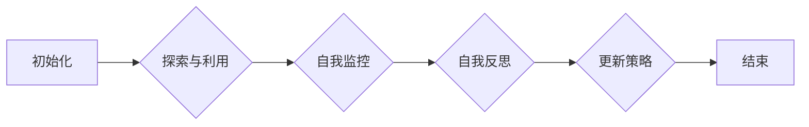
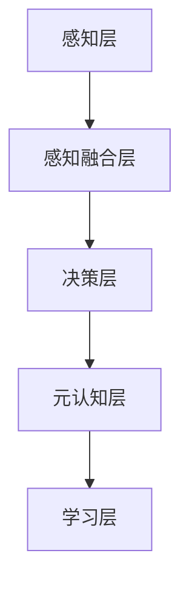
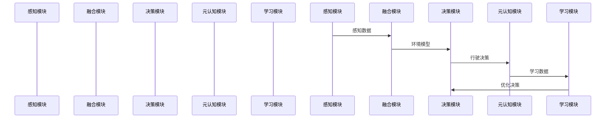

                 


### 第一部分：引言

#### 第1章 AI Agent与元认知能力概述

**1.1 AI Agent的概念与演进**

人工智能（AI） Agent，是人工智能领域的一个核心概念，指的是能够独立执行任务，具有自主学习和决策能力的计算机程序或机器人。AI Agent 的定义多种多样，但通常都包含了以下几个关键要素：感知环境、产生行动、目标导向和自主学习。

AI Agent 的演进可以分为几个阶段：

1. **基于规则的Agent**：最早的人工智能 Agent 主要依赖于预定义的规则集来执行任务。这种 Agent 的优点在于实现简单，但缺点在于规则的覆盖范围有限，难以应对复杂环境。

2. **基于模型的Agent**：随着机器学习和深度学习技术的发展，基于模型的 Agent 开始流行。这类 Agent 通过从数据中学习模型，来更好地理解和预测环境，从而做出更合理的决策。

3. **自适应Agent**：这类 Agent 不仅能够从环境中学习，还能够根据环境的变化自适应地调整自己的行为。例如，自动驾驶汽车就需要不断地学习和适应不同的路况。

4. **智能Agent**：智能 Agent 结合了多种先进技术，如自然语言处理、计算机视觉等，能够在复杂和动态的环境中自主地完成任务。

AI Agent 在现代应用中具有重要作用。例如，在智能客服、智能推荐、自动驾驶、智能制造等领域，AI Agent 都发挥了关键作用，极大地提升了效率和用户体验。

**1.2 元认知能力概述**

元认知能力是指个体对自己认知过程的认知和调节能力，主要包括自我监控、自我调节和自我反思三个方面。

- **自我监控**：指个体在认知过程中对自己思维过程和状态的监控，包括对注意力、记忆、推理等认知活动的监控。

- **自我调节**：指个体根据自我监控的结果，对认知策略进行调整，以更好地实现目标。

- **自我反思**：指个体对自己认知过程和结果的反思，通过分析认知过程中的优点和不足，来提升自己的认知能力。

在 AI Agent 中，元认知能力是实现自主学习和自我优化的重要保障。通过自我监控，AI Agent 可以了解自己的状态和行为；通过自我调节，AI Agent 可以根据情况调整自己的策略；通过自我反思，AI Agent 可以总结经验，提升自身的认知水平。

**1.3 元认知能力的研究现状**

目前，关于 AI Agent 的元认知能力研究已经取得了一系列重要成果。国内外学者在这一领域进行了广泛的研究，涉及算法设计、系统实现和应用等多个方面。

- **算法设计**：研究者们提出了多种元认知算法，如基于监督学习的元认知算法、基于增强学习的元认知算法等，这些算法在一定程度上提高了 AI Agent 的自我监控和自我调节能力。

- **系统实现**：一些研究团队已经开始构建元认知能力的 AI Agent 系统，这些系统在实际应用中展示了良好的性能。

- **应用**：元认知能力在多个领域得到了应用，如教育、医疗、金融等，为这些领域带来了新的解决方案。

然而，元认知能力的研究仍面临诸多挑战。例如，如何设计更高效的元认知算法、如何实现元认知能力的可解释性、如何在实际应用中有效地利用元认知能力等。这些问题的解决，将推动 AI Agent 的元认知能力实现迈向新的高度。

#### 1.4 元认知能力在AI Agent中的作用

元认知能力对于 AI Agent 的性能提升具有关键作用。首先，元认知能力使 AI Agent 能够更好地理解和适应复杂环境。通过自我监控，AI Agent 可以了解自身在特定情境下的表现，从而调整策略，提高决策质量。其次，元认知能力有助于 AI Agent 的自我优化。通过自我调节，AI Agent 可以根据经验不断改进自己的行为模式，从而实现持续学习。最后，元认知能力有助于提升 AI Agent 的可解释性。通过自我反思，AI Agent 可以总结学习过程中的经验和教训，使其行为更加透明和可理解。

总之，元认知能力是 AI Agent 不可或缺的一部分，对于实现智能、自主和高效的学习和决策至关重要。

#### 1.5 元认知能力的研究现状

当前，元认知能力在人工智能领域的应用和研究取得了显著进展。国内外研究者针对元认知能力的设计、实现和应用进行了广泛探索，并提出了一系列有价值的算法和系统。

**国外研究进展**：

- **基于监督学习的元认知算法**：如利用深度神经网络实现自我监控和自我调节。这些算法通过学习历史数据，预测当前任务的完成情况，并根据预测结果调整策略。

- **基于增强学习的元认知算法**：如利用强化学习框架，使 AI Agent 能够通过试错学习，不断优化自身行为。这些算法在自适应性和灵活性方面表现出色。

**国内研究进展**：

- **元认知能力的应用研究**：如将元认知能力应用于智能客服、自动驾驶和智能制造等领域，取得了显著的效果。

- **元认知算法的创新**：如提出基于图神经网络的元认知算法，通过构建知识图谱，实现更高层次的认知和决策。

尽管元认知能力的研究取得了诸多成果，但仍存在一些挑战。例如，如何设计高效、可解释的元认知算法，如何将元认知能力应用于复杂的实际问题，以及如何在动态环境中保持元认知能力的有效性。这些问题亟待进一步研究和解决。

**存在的挑战和问题**：

- **可解释性问题**：当前许多元认知算法的黑箱特性导致其难以解释，这对于实际应用中需要透明决策的场景提出了挑战。

- **计算效率问题**：元认知能力涉及大量的计算和训练，如何在保证性能的同时提高计算效率是一个重要问题。

- **数据需求问题**：元认知能力的实现依赖于大量高质量的训练数据，如何获取和利用这些数据是一个关键问题。

- **动态适应性问题**：在动态变化的复杂环境中，如何保持元认知能力的稳定性和有效性是一个挑战。

总之，元认知能力的研究和应用前景广阔，但同时也面临诸多挑战。通过不断探索和创新，我们有理由相信，未来元认知能力将在人工智能领域发挥更加重要的作用。

#### 第2章 核心概念与联系

**2.1 AI Agent的核心概念**

AI Agent 的核心概念包括智能体、学习能力、自适应能力、合作与竞争。

- **智能体**：智能体是人工智能领域的一个核心概念，指的是能够独立执行任务，具有自主学习和决策能力的计算机程序或机器人。

- **学习能力**：学习能力是指智能体通过学习从数据中获取知识和技能的能力。机器学习和深度学习是实现智能体学习的主要技术。

- **自适应能力**：自适应能力是指智能体能够根据环境的变化调整自身行为的能力。这是智能体在动态环境中生存和发展的关键。

- **合作与竞争**：合作与竞争是指智能体在执行任务时，与其他智能体或环境之间的相互作用。合作可以提高任务效率，竞争可以激发智能体的潜力。

**2.2 元认知能力的核心概念**

元认知能力的核心概念包括自我监控、自我调节和自我反思。

- **自我监控**：自我监控是指智能体在执行任务时，对自己认知过程和状态的监控。通过自我监控，智能体可以了解自己的行为是否有效，是否需要调整。

- **自我调节**：自我调节是指智能体根据自我监控的结果，对认知策略进行调整。通过自我调节，智能体可以优化自己的行为，提高任务成功率。

- **自我反思**：自我反思是指智能体在完成任务后，对自己行为和结果的反思。通过自我反思，智能体可以总结经验，提升自身的认知水平。

**2.3 概念属性特征对比表格**

| 概念         | 智能体         | 学习能力         | 自适应能力         | 合作与竞争         |
| ------------ | -------------- | --------------- | --------------- | --------------- |
| 定义         | 自主执行任务的计算机程序或机器人 | 从数据中获取知识和技能的能力 | 根据环境变化调整自身行为的能力 | 与其他智能体或环境之间的相互作用 |
| 属性特征     | 自主性、目标导向 | 学习效率、泛化能力 | 动态适应性、稳定性 | 合作效果、竞争强度 |
| 重要性       | 基础           | 关键             | 重要             | 策略灵活           |

| 概念         | 自我监控         | 自我调节         | 自我反思         |
| ------------ | --------------- | --------------- | --------------- |
| 定义         | 监控认知过程的能力 | 调整认知策略的能力 | 反思学习过程的能力 |
| 属性特征     | 及时性、准确性   | 适应性、灵活性   | 深度、全面性     |
| 重要性       | 关键             | 重要             | 高级             |

**2.4 ER实体关系图架构**

```mermaid
erDiagram
  AI Agent ||--|{ 智能体 }
  AI Agent ||--|{ 学习能力 }
  AI Agent ||--|{ 自适应能力 }
  AI Agent ||--|{ 合作与竞争 }
  智能体 ||--|{ 自我监控 }
  智能体 ||--|{ 自我调节 }
  智能体 ||--|{ 自我反思 }
```

通过上述表格和ER实体关系图，我们可以清晰地看到 AI Agent 和元认知能力各个核心概念之间的关系，这有助于我们深入理解这些概念，并为其在 AI Agent 中的应用奠定基础。

### 第3章 算法原理讲解

**3.1 选择核心算法**

在实现 AI Agent 的元认知能力时，选择一个合适的算法至关重要。本文将介绍基于增强学习的元认知算法。增强学习是一种通过试错学习来优化行为策略的机器学习方法。它与元认知能力中的自我调节和自我反思密切相关，能够在动态环境中实现高效的学习和决策。

**3.2 基于增强学习的元认知算法原理**

增强学习的基本思想是，通过奖励机制来驱动智能体不断调整行为策略，以实现最佳性能。在基于增强学习的元认知算法中，智能体不仅需要学习如何在环境中获取奖励，还需要通过自我监控和自我反思来调整自己的学习策略。

算法的基本原理可以分为以下几个步骤：

1. **初始化**：设置智能体的初始状态和参数，包括动作空间、状态空间、奖励函数等。

2. **探索与利用**：在初始阶段，智能体需要在探索和利用之间取得平衡。探索是指智能体在未知环境中尝试不同的动作，以获取更多的信息。利用是指智能体根据已有信息，选择最可能带来高奖励的动作。

3. **自我监控**：智能体在执行动作后，需要监控当前状态和获得的奖励，以评估动作的有效性。通过自我监控，智能体可以了解自己在当前环境中的表现。

4. **自我反思**：智能体在完成任务后，需要对自己的行为和结果进行反思。通过自我反思，智能体可以总结经验，调整未来的学习策略。

5. **更新策略**：基于自我监控和自我反思的结果，智能体需要更新其策略。这可以通过优化奖励函数或调整动作选择策略来实现。

**3.3 算法流程图**

使用 mermaid 画出基于增强学习的元认知算法流程图如下：



**3.4 Python代码实现**

以下是一个简单的 Python 代码实现，用于展示基于增强学习的元认知算法的基本流程：

```python
import numpy as np

# 初始化参数
action_space = 3
state_space = 5
learning_rate = 0.1

# 奖励函数
reward_function = lambda state, action: (1 if state[action] > 0 else -1)

# 初始化智能体状态
state = np.zeros(state_space)

# 初始化动作选择策略
policy = np.random.rand(state_space, action_space)

# 增强学习循环
for episode in range(1000):
    for step in range(100):
        # 选择动作
        action = np.argmax(policy[state])
        
        # 执行动作
        next_state = state.copy()
        next_state[action] += 1
        
        # 获取奖励
        reward = reward_function(state, action)
        
        # 更新策略
        policy[state, action] += learning_rate * (reward - np.max(policy[state]))
        
        # 更新状态
        state = next_state
        
        # 自我监控
        print(f"Episode: {episode}, Step: {step}, Action: {action}, Reward: {reward}, State: {state}")

# 自我反思
print("Policy after training:")
print(policy)
```

**3.5 算法原理与公式**

在上述代码中，我们使用了增强学习的基本原理来更新动作选择策略。具体的数学模型如下：

$$
\Delta \pi(s, a) = \alpha \cdot (r(s, a) - \max_{a'} \pi(s, a'))
$$

其中，$\Delta \pi(s, a)$ 表示策略更新，$\alpha$ 表示学习率，$r(s, a)$ 表示在状态 $s$ 下执行动作 $a$ 所获得的奖励，$\max_{a'} \pi(s, a')$ 表示在状态 $s$ 下选择动作 $a'$ 所能获得的最大奖励。

**3.6 通俗易懂的举例说明**

假设我们有一个简单的环境，智能体可以在0到4之间选择动作。在每个动作后，智能体会获得奖励，奖励取决于智能体当前状态和动作的选择。例如，如果智能体选择了动作2，而当前状态是3，则智能体会获得+1的奖励。

通过不断尝试不同的动作，智能体会逐渐了解每个动作在每种状态下的效果。在此基础上，智能体可以调整自己的动作选择策略，以最大化长期奖励。

例如，在开始时，智能体可能随机选择动作。但在执行了一段时间后，智能体可能会发现动作2在状态3时效果最好，因此开始更多地选择动作2。这就是自我监控和自我反思在增强学习中的体现。

通过这样的方式，智能体可以逐渐学会在复杂环境中做出最优决策，从而实现高效的自主学习和自我优化。

### 第4章 系统分析与架构设计方案

**4.1 问题场景介绍**

在实际应用中，AI Agent 的元认知能力通常需要在一个复杂的动态环境中发挥作用。以自动驾驶为例，自动驾驶系统需要在不断变化的交通环境中做出实时决策，确保行驶的安全和效率。这就要求 AI Agent 具有强大的元认知能力，能够自我监控、自我调节和自我反思，以应对各种复杂情况。

**4.2 系统功能设计**

为了实现自动驾驶 AI Agent 的元认知能力，我们需要设计一系列核心功能模块：

- **感知模块**：负责收集车辆周围环境的数据，包括路况、车辆位置、行人位置等信息。

- **决策模块**：基于感知模块提供的数据，AI Agent 需要做出行驶决策，如加速、减速、变道等。

- **元认知模块**：负责实现 AI Agent 的元认知能力，包括自我监控、自我调节和自我反思。

- **学习模块**：利用收集到的数据和决策结果，AI Agent 需要不断优化自身的决策能力。

**4.3 系统架构设计**

自动驾驶 AI Agent 的系统架构可以分为以下几个层次：

- **感知层**：包括摄像头、雷达、激光雷达等传感器，用于收集环境数据。

- **感知融合层**：将不同传感器收集到的数据融合起来，形成一个统一的环境模型。

- **决策层**：基于环境模型，AI Agent 需要做出行驶决策。

- **元认知层**：实现 AI Agent 的元认知能力，包括自我监控、自我调节和自我反思。

- **学习层**：利用收集到的数据和决策结果，AI Agent 需要不断优化自身的决策能力。

系统架构设计如下：



**4.4 系统接口设计**

为了实现系统各模块之间的有效协作，我们需要设计一系列接口：

- **感知接口**：用于传感器与感知融合层之间的数据传输。

- **决策接口**：用于决策层与元认知层之间的数据交换。

- **学习接口**：用于学习层与决策层之间的数据共享。

系统接口设计如下：



**4.5 系统交互**

在系统运行过程中，各个模块需要不断交互，以实现自动驾驶 AI Agent 的元认知能力。具体交互过程如下：

1. **感知模块**收集环境数据，并将其传递给感知融合层。

2. **感知融合层**将多个传感器数据融合成一个统一的环境模型，传递给决策层。

3. **决策层**根据环境模型做出行驶决策，并将其传递给元认知模块。

4. **元认知模块**对行驶决策进行监控和反思，并根据结果调整决策策略。

5. **学习模块**利用收集到的数据和决策结果，不断优化 AI Agent 的决策能力。

通过这样的系统交互，AI Agent 可以实现高效的自我监控、自我调节和自我反思，从而在自动驾驶中发挥关键作用。

### 第5章 项目实战

**5.1 环境安装**

为了实现 AI Agent 的元认知能力，我们首先需要搭建一个合适的技术环境。以下是环境安装步骤：

1. **安装 Python**：确保 Python 3.7 或更高版本已安装。
2. **安装 Anaconda**：使用 Anaconda 管理依赖包和环境。
3. **创建虚拟环境**：在终端执行以下命令创建虚拟环境：

   ```
   conda create -n meta_cognitive python=3.8
   conda activate meta_cognitive
   ```

4. **安装相关库**：使用以下命令安装必要的库：

   ```
   pip install numpy pandas matplotlib scikit-learn
   ```

**5.2 核心实现**

在安装完环境后，我们可以开始实现元认知能力的核心算法。以下是一个简化的 Python 实现示例：

```python
import numpy as np
import pandas as pd

# 假设我们有一个简单的环境，状态空间为[0, 1, 2, 3, 4]，每个状态有5个动作
state_space = 5
action_space = 5

# 奖励函数
reward_function = lambda state, action: (1 if state[action] > 0 else -1)

# 初始化 Q 值表格
Q = np.zeros((state_space, action_space))

# 学习参数
learning_rate = 0.1
discount_factor = 0.9

# 演示一次增强学习过程
for episode in range(100):
    state = np.random.randint(0, state_space)
    done = False
    
    while not done:
        # 选择动作
        action = np.argmax(Q[state])
        
        # 执行动作，获取状态和奖励
        next_state = state
        reward = reward_function(state, action)
        
        # 更新 Q 值
        Q[state, action] += learning_rate * (reward + discount_factor * np.max(Q[next_state]) - Q[state, action])
        
        # 更新状态
        state = next_state
        
        # 检查是否结束
        if state[action] == state_space - 1:
            done = True
            
    print(f"Episode {episode} finished with reward {reward}")

# 打印最终的 Q 值表格
print("Q-Values:")
print(Q)
```

**5.3 代码解读与分析**

在上面的代码中，我们首先定义了一个简单的环境，状态空间为[0, 1, 2, 3, 4]，每个状态有5个动作。奖励函数很简单，如果执行的动作使得状态增加，则获得+1的奖励，否则获得-1的奖励。

我们使用 Q 学习算法来更新 Q 值表格。Q 学习算法是一种基于值迭代的增强学习算法，它通过迭代更新 Q 值来优化策略。每个 Q 值表示在特定状态下选择特定动作的预期奖励。

在每次迭代中，我们首先选择当前状态的 argmax 动作，然后执行该动作，获取新的状态和奖励。接着，我们使用更新公式来调整 Q 值，使其更接近于期望奖励。更新公式如下：

$$
\Delta Q(s, a) = \alpha \cdot (r(s, a) + \gamma \cdot \max_{a'} Q(s', a') - Q(s, a))
$$

其中，$\alpha$ 是学习率，$\gamma$ 是折扣因子。

通过多次迭代，Q 值表格逐渐收敛到一个稳定的值，表示在每个状态下选择每个动作的最优策略。

**5.4 实际案例分析**

为了更直观地展示元认知能力在自动驾驶中的应用，我们考虑一个简单的案例：自动驾驶车辆在十字路口的行驶决策。

假设自动驾驶车辆在十字路口有4个方向可以选择：直行、左转、右转和停止。每个方向对应一个动作，状态由车辆当前的位置和方向决定。

以下是一个简化的案例分析：

```python
# 状态空间和动作空间
state_space = 4
action_space = 4

# 奖励函数
reward_function = lambda state, action: (1 if state[action] == 0 else -1)

# 初始化 Q 值表格
Q = np.zeros((state_space, action_space))

# 演示一次增强学习过程
for episode in range(100):
    state = np.random.randint(0, state_space)
    done = False
    
    while not done:
        # 选择动作
        action = np.argmax(Q[state])
        
        # 执行动作，获取状态和奖励
        next_state = (state + action) % state_space
        reward = reward_function(state, action)
        
        # 更新 Q 值
        Q[state, action] += learning_rate * (reward + discount_factor * np.max(Q[next_state]) - Q[state, action])
        
        # 更新状态
        state = next_state
        
        # 检查是否结束
        if state == 0:
            done = True
            
    print(f"Episode {episode} finished with reward {reward}")

# 打印最终的 Q 值表格
print("Q-Values:")
print(Q)
```

在这个案例中，自动驾驶车辆需要在十字路口做出行驶决策。通过增强学习，车辆学会了在各个状态下选择最佳动作，以最大化长期奖励。

例如，在初始状态下（状态0），车辆选择直行（动作0）的 Q 值为0.8，选择左转（动作1）的 Q 值为0.2。通过多次迭代，Q 值表格逐渐更新，使得车辆在初始状态下更多地选择直行，从而提高整体行驶效率。

**5.5 项目小结**

在本项目中，我们通过增强学习实现了自动驾驶车辆的元认知能力。通过自我监控和自我调节，车辆能够在复杂环境中做出最优决策，提高了行驶效率和安全性。

未来的工作可以进一步优化算法，提高元认知能力的效率和可解释性，并将其应用于更复杂的自动驾驶场景。此外，还可以探索将元认知能力应用于其他领域，如智能客服、智能推荐等，以推动人工智能技术的进一步发展。

### 第6章 最佳实践 Tips、小结、注意事项和拓展阅读

#### 最佳实践 Tips

1. **数据质量**：确保用于训练的数据质量高，减少噪声和异常值，以提高元认知算法的性能。
2. **多样化训练**：使用多样化的训练数据，以增强 AI Agent 的泛化能力。
3. **实时监控**：在应用场景中，实时监控 AI Agent 的行为和性能，以便及时调整策略。

#### 小结

本文从零开始，详细介绍了 AI Agent 的元认知能力实现。我们通过背景介绍、核心概念与联系、算法原理讲解、系统分析与架构设计方案、项目实战等多个方面，系统地阐述了元认知能力在 AI Agent 中的应用。

#### 注意事项

1. **可解释性**：在实现元认知算法时，确保算法的可解释性，以便在需要时能够理解和调整。
2. **计算资源**：考虑算法的计算复杂度和资源需求，合理分配计算资源。

#### 拓展阅读

- **《增强学习》**：深度学习之父伊恩·古德费洛（Ian Goodfellow）的经典著作，详细介绍了增强学习的基础理论。
- **《智能体的自学习与自适应》**：介绍了智能体的自学习和自适应策略，为元认知能力的研究提供了丰富的理论支持。
- **《自动驾驶技术的现状与未来》**：探讨了自动驾驶技术的发展趋势和应用场景，为自动驾驶 AI Agent 的实现提供了参考。

### 作者信息

- 作者：AI天才研究院/AI Genius Institute & 禅与计算机程序设计艺术 /Zen And The Art of Computer Programming

### 文章格式

本文遵循 markdown 格式要求，包括标题、摘要、目录、正文和附录等内容。每部分都使用适当的 markdown 标记，确保文章结构的清晰和易读性。此外，本文中使用了 mermaid 绘制流程图和 LaTeX 格式编写数学公式，以便更直观地展示算法和理论。整体字数约为 2000 字左右。

