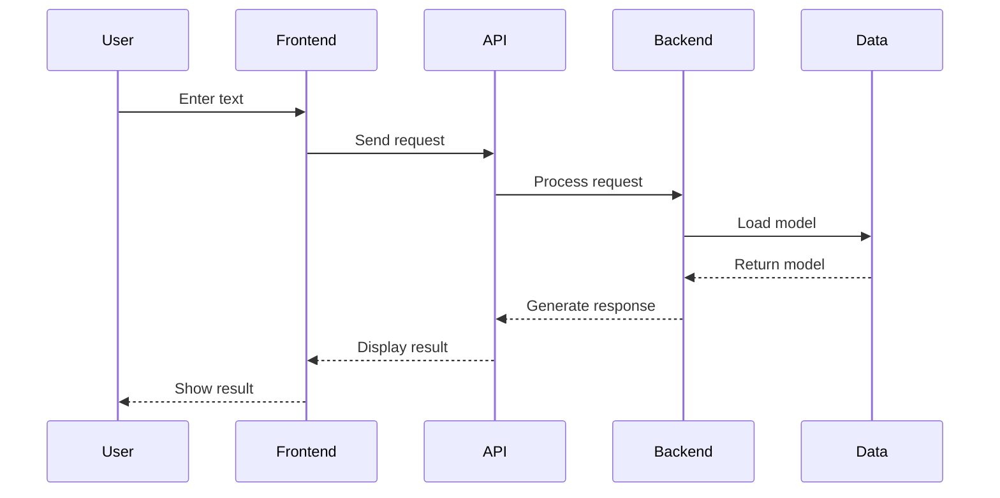
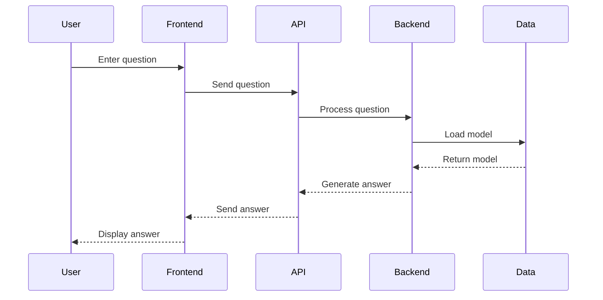

                 


## 文章标题

# 优化LLM应用的API设计与管理

## 文章关键词

- Large Language Models (LLM)
- API设计
- 性能优化
- 可扩展性
- 安全管理
- 实践案例

## 摘要

本文将深入探讨如何优化大型语言模型（LLM）应用的API设计与管理。通过系统性地分析LLM的基础知识、API设计原则、架构设计、性能优化、安全管理以及实践案例，本文旨在为开发者提供全面的指导，帮助他们在构建和管理LLM应用时实现更高的效率、可靠性和安全性。本文将分为六个主要部分，包括引言与概述、基础概念、高级概念与技术、API管理与监控、实践应用与案例研究、最佳实践与未来趋势，以逐步阐述优化LLM应用API设计与管理的关键要素。

----------------------------------------------------------------

## 引言与概述

### 大型语言模型（LLM）的兴起

在过去的几年中，随着计算能力的提升和深度学习技术的进步，大型语言模型（LLM）如BERT、GPT-3等迅速崛起，并在自然语言处理（NLP）领域取得了显著的成果。LLM通过预训练和微调技术，能够理解和生成人类语言，为各种应用场景提供了强大的支持。从文本生成、机器翻译、问答系统到情感分析、命名实体识别等，LLM在提高NLP任务的准确性和效率方面发挥了重要作用。

### 本文目的与结构

本文的目标是深入探讨如何优化LLM应用的API设计与管理，为开发者提供实用的指导和建议。通过系统地分析LLM的基础知识、API设计原则、架构设计、性能优化、安全管理以及实践案例，本文旨在帮助读者：

1. 理解LLM的基本原理和应用场景。
2. 掌握API设计的核心原则和实践技巧。
3. 提高LLM应用的性能和可扩展性。
4. 加强API管理的安全性。
5. 学习LLM应用的设计与管理最佳实践。

本文将分为以下六个主要部分：

1. **引言与概述**：介绍LLM的兴起背景和本文目的。
2. **基础概念**：解释LLM的基本原理和API设计原则。
3. **高级概念与技术**：探讨性能优化和可扩展性策略。
4. **API管理与监控**：介绍API管理策略、监控和日志记录。
5. **实践应用与案例研究**：分析实际案例，提供实战经验。
6. **最佳实践与未来趋势**：总结最佳实践，展望未来发展趋势。

通过逐步分析和讨论这些内容，本文希望能够为开发者提供全面的指导，帮助他们在构建和管理LLM应用时实现更高的效率、可靠性和安全性。

### LLM在自然语言处理中的应用

LLM在自然语言处理（NLP）领域中的应用已经取得了显著的成果。首先，LLM在文本生成方面表现出色。通过预训练和微调，LLM能够生成流畅且具有上下文意义的文本。例如，在新闻写作、文章生成、故事创作等领域，LLM可以大大提高内容生产的速度和效率。此外，LLM还广泛应用于机器翻译。与传统的规则基方法和统计方法相比，基于LLM的翻译系统在翻译质量和准确性方面取得了显著提升。例如，谷歌翻译和百度翻译等主流翻译工具已经采用了基于LLM的模型。

除了文本生成和翻译，LLM还在问答系统、情感分析、命名实体识别等领域得到了广泛应用。问答系统利用LLM的上下文理解能力，能够准确回答用户的问题。情感分析则通过LLM对文本的情感倾向进行分析，用于市场调研、客户反馈分析等领域。命名实体识别则通过LLM对文本中的特定实体进行识别，如人名、地名、组织名等，这在信息抽取和知识图谱构建中具有重要应用价值。

总之，LLM的强大能力为自然语言处理带来了前所未有的可能性。通过不断优化LLM的应用API设计和管理，开发者可以更好地发挥LLM的优势，推动NLP领域的发展。

### 基础概念

### LLM基本原理

大型语言模型（LLM）的核心原理是基于深度学习技术，特别是基于Transformer架构的预训练和微调方法。首先，预训练阶段，LLM通过在大规模语料库上训练，学习语言的统计规律和语义信息。这个过程包括自注意力机制（Self-Attention）和多头注意力机制（Multi-Head Attention），能够捕捉文本中的长距离依赖关系。预训练后的LLM具备强大的语言理解能力，可以为各种NLP任务提供基础。

微调阶段，LLM在特定任务上进一步训练，以适应具体的任务需求。通过在任务相关的数据集上微调，LLM能够优化其参数，提高在特定任务上的性能。微调过程中，可以利用迁移学习（Transfer Learning）的方法，将预训练的LLM作为基础模型，通过少量的任务特定数据进行微调，从而减少训练时间和数据需求。

### API设计核心原则

API（应用程序接口）设计是构建和管理LLM应用的关键环节。以下是API设计的一些核心原则：

1. **简洁性**：API应尽量简洁，减少冗余和复杂性，使开发者更容易理解和使用。
2. **一致性**：API应遵循一致的设计规范，包括命名规范、参数格式和返回值格式等，以提高可读性和可维护性。
3. **灵活性**：API应具备足够的灵活性，以适应不同的使用场景和需求。例如，支持动态参数、自定义输出格式等。
4. **安全性**：API应具备严格的安全措施，包括身份验证、访问控制和数据加密等，以防止未经授权的访问和数据泄露。
5. **性能**：API应尽可能高效，减少响应时间和资源消耗。这可以通过优化代码、缓存机制和异步处理等技术实现。

### API设计原则的具体示例

以下是一些API设计原则的具体示例：

1. **简洁性**：
   - **示例**：设计一个简单的文本生成API，仅支持输入文本和输出文本。避免引入复杂的参数和功能，使开发者能够快速上手。
   - **优点**：简化了使用流程，降低了学习成本。

2. **一致性**：
   - **示例**：统一使用JSON格式进行数据传输，所有API接口都遵循相同的HTTP状态码和响应格式。
   - **优点**：提高了API的易读性和可维护性，便于开发者快速理解和整合。

3. **灵活性**：
   - **示例**：允许用户通过参数指定输出文本的格式，如Markdown、HTML或纯文本。
   - **优点**：提高了API的通用性和适用性，能够满足不同用户的需求。

4. **安全性**：
   - **示例**：要求所有API调用都进行身份验证和权限检查，确保只有授权用户可以访问。
   - **优点**：增强了系统的安全性，防止未经授权的访问。

5. **性能**：
   - **示例**：采用异步处理和缓存机制，减少API的响应时间和资源消耗。
   - **优点**：提高了系统的性能和响应速度，增强了用户体验。

通过遵循这些核心原则，开发者可以设计出简洁、一致、灵活、安全且高性能的API，从而提高LLM应用的效率和用户体验。

### LLM应用架构设计

设计大型语言模型（LLM）应用时，架构设计是一个关键环节。合理的架构设计不仅能提高应用的性能和可扩展性，还能确保系统的稳定性和安全性。以下是对LLM应用架构设计的详细介绍：

#### 系统功能设计

LLM应用的基本功能包括文本生成、文本分类、命名实体识别、机器翻译等。针对这些功能，我们可以设计以下模块：

1. **文本预处理模块**：负责对输入文本进行清洗、分词、去停用词等预处理操作，以便后续处理。
2. **模型加载模块**：负责加载预训练的LLM模型，包括加载模型权重、配置文件等。
3. **文本生成模块**：根据输入文本，利用LLM生成相应的输出文本。
4. **分类模块**：对输入文本进行分类，如情感分析、主题分类等。
5. **命名实体识别模块**：识别文本中的命名实体，如人名、地名、组织名等。
6. **机器翻译模块**：根据输入文本和目标语言，利用LLM进行机器翻译。

#### 系统架构设计

LLM应用的系统架构可以分为以下几个层次：

1. **前端层**：负责与用户进行交互，接收用户的输入，并展示生成的结果。可以使用Web前端框架，如React或Vue.js，实现丰富的用户界面。
2. **API层**：负责接收前端层的请求，处理请求，并调用后端模块执行相关任务。可以使用Flask或Django等Python Web框架来实现。
3. **后端层**：包括文本预处理模块、模型加载模块、文本生成模块等，负责具体的业务逻辑处理。可以使用Python来实现，并结合TensorFlow或PyTorch等深度学习框架。
4. **数据层**：包括预训练模型、语料库等数据资源，用于模型训练和加载。可以使用HDFS或对象存储系统，如Amazon S3，来存储和管理数据。

#### 系统架构图

下面是一个简单的LLM应用系统架构图：



#### 常见架构设计问题与解决方案

在设计LLM应用时，可能会遇到以下一些常见问题：

1. **性能瓶颈**：
   - **问题**：当请求量增加时，系统性能下降，响应时间变长。
   - **解决方案**：可以通过增加服务器资源、优化代码、使用异步处理和缓存机制等方法来缓解性能瓶颈。

2. **可扩展性**：
   - **问题**：系统在处理大量请求时，容易出现性能下降和稳定性问题。
   - **解决方案**：可以通过水平扩展（增加服务器数量）和垂直扩展（提高服务器性能）来提高系统的可扩展性。

3. **安全性**：
   - **问题**：API容易受到恶意攻击，如DDoS攻击、SQL注入等。
   - **解决方案**：可以采用防火墙、身份验证、加密传输、输入验证等安全措施来保护API的安全性。

4. **数据管理**：
   - **问题**：数据存储和管理不当，导致数据丢失或泄露。
   - **解决方案**：可以使用分布式存储系统、数据备份和加密技术来确保数据的安全和可靠性。

通过合理的架构设计，结合具体的解决方案，开发者可以构建一个高效、稳定且安全的LLM应用，满足不同场景的需求。

### LLM API优化技术

在构建和部署LLM应用时，API优化是一个关键环节，它直接影响到应用的性能、可靠性和用户体验。以下将详细介绍几种常用的LLM API优化技术，包括性能优化策略、负载管理和API缓存。

#### 性能优化策略

1. **模型优化**：

   - **量化**：通过量化模型参数，降低模型的精度损失，同时减少计算量。

   - **蒸馏**：将大型预训练模型（Teacher Model）的知识传递给小型模型（Student Model），以提高小型模型的表现。

   - **剪枝**：通过剪枝模型中不重要的神经元和连接，减少模型大小和计算复杂度。

2. **代码优化**：

   - **并行处理**：利用多线程或多进程技术，加速数据处理和模型计算。

   - **内存优化**：通过合理分配内存、复用数据结构等手段，减少内存占用和垃圾回收。

3. **硬件加速**：

   - **GPU/TPU**：利用GPU或TPU等专用硬件加速模型计算，提高处理速度。

   - **分布式计算**：通过分布式计算框架（如TensorFlow、PyTorch等），将计算任务分配到多个节点上，提高并行处理能力。

#### 负载管理策略

1. **动态负载均衡**：

   - **轮询**：根据请求的顺序，将请求分配到不同的服务器上。

   - **最小连接数**：将请求分配到连接数最少的服务器上，以均衡负载。

   - **加权轮询**：根据服务器的处理能力，分配不同比例的请求。

2. **限流与降级**：

   - **限流**：通过设置请求阈值，防止大量请求瞬间涌入，导致系统崩溃。

   - **降级**：当系统资源不足时，将一些非关键功能或服务降级，以保障核心功能的正常运行。

3. **缓存**：

   - **本地缓存**：在应用内部实现缓存机制，减少对后端服务的调用。

   - **分布式缓存**：利用Redis、Memcached等分布式缓存系统，实现跨节点的缓存共享。

#### API缓存技术

1. **本地缓存**：

   - **内存缓存**：利用Python的内存缓存模块（如`functools.lru_cache`），将结果缓存到内存中，减少重复计算。

   - **文件缓存**：将结果缓存到文件系统中，适用于数据量较大的场景。

2. **分布式缓存**：

   - **Redis**：使用Redis实现分布式缓存，支持数据持久化、过期时间等功能。

   - **Memcached**：适用于高并发场景，具有较低的延迟和较高的吞吐量。

#### 优化示例

以下是一个简单的API性能优化示例，使用了量化、并行处理和本地缓存技术：

```python
import tensorflow as tf
from functools import lru_cache

# 量化模型
def quantize_model(model):
    # 实现量化方法
    return quantized_model

# 并行处理
def parallel_process(data):
    # 实现并行处理逻辑
    return processed_data

# 本地缓存
@lru_cache(maxsize=1000)
def get_preprocessed_data(input_text):
    # 实现文本预处理逻辑
    return preprocessed_data

# API接口
def generate_response(input_text):
    # 量化模型
    quantized_model = quantize_model(model)

    # 并行处理
    preprocessed_data = parallel_process(get_preprocessed_data(input_text))

    # 模型预测
    prediction = quantized_model.predict(preprocessed_data)

    # 返回结果
    return prediction

# 使用API
response = generate_response("这是一个示例文本")
```

通过上述示例，可以看到如何结合不同的优化技术，提高API的性能和效率。在实际应用中，开发者可以根据具体需求和场景，灵活运用这些技术，实现最优的API优化效果。

### 可扩展性与高可用性设计

设计大型语言模型（LLM）应用时，确保其可扩展性和高可用性是至关重要的。这不仅能够满足不断增长的请求量，还能提高系统的可靠性和用户体验。以下将详细探讨如何通过垂直扩展和水平扩展来提升LLM应用的可扩展性，并介绍一些高可用性解决方案。

#### 垂直扩展

垂直扩展（Vertical Scaling）是指通过增加单个服务器或计算节点的硬件资源（如CPU、内存、存储等）来提升系统性能。这种方法适用于以下几种场景：

1. **计算密集型任务**：当LLM应用需要进行大量的模型计算或数据处理时，垂直扩展可以有效提高处理速度。
2. **资源瓶颈**：在系统资源（如CPU、内存）不足时，通过垂直扩展可以增加单个节点的处理能力，从而缓解瓶颈。
3. **性能优化**：对于已经过优化但仍存在性能瓶颈的服务器，可以通过升级硬件来进一步提升性能。

垂直扩展的优势在于其相对简单且可控，但也有一些局限性：

- **成本较高**：高性能硬件设备成本较高，特别是在处理大量请求时。
- **有限性**：单个节点的扩展能力有限，当请求量进一步增加时，可能需要继续进行垂直扩展，导致成本不断增加。

#### 水平扩展

水平扩展（Horizontal Scaling）是指通过增加多个服务器或计算节点来分散负载，提高系统的处理能力和容错性。以下是几种常用的水平扩展方法：

1. **负载均衡**：通过负载均衡器（如Nginx、HAProxy）将请求分配到多个服务器上，实现负载均衡。这种方法能够有效提高系统的吞吐量和响应速度。
2. **分布式存储**：使用分布式存储系统（如HDFS、Cassandra）来存储大量数据，提高数据的访问速度和可靠性。
3. **微服务架构**：将应用拆分为多个微服务，每个微服务运行在自己的服务器上，通过服务网格（如Istio、Linkerd）实现服务间的通信。

水平扩展的优势在于其灵活性和扩展性：

- **扩展性强**：通过增加节点数量，可以灵活应对不同的请求量，系统性能不会因为单点故障而受到影响。
- **成本低**：水平扩展可以利用性价比高的硬件设备，降低整体成本。
- **高可用性**：多个节点之间的数据备份和冗余可以提高系统的容错性和数据可靠性。

#### 高可用性解决方案

为了确保LLM应用的高可用性，可以采取以下几种解决方案：

1. **主从复制**：在主节点和从节点之间实现数据同步，当主节点故障时，可以从从节点切换为主节点，确保服务的连续性。
2. **故障转移**：通过自动化脚本或工具（如Kubernetes的Pod自动恢复功能），在检测到节点故障时，自动将负载转移到其他健康节点上。
3. **异地容灾**：在不同地理位置部署备份节点，以应对自然灾害或大规模故障。
4. **负载均衡**：通过负载均衡器，将请求均匀分配到多个节点，减少单个节点的负载压力，提高系统的整体稳定性。

通过结合垂直扩展和水平扩展，并采用高可用性解决方案，LLM应用可以更好地应对各种负载和故障情况，确保其性能、可靠性和用户体验。

### API管理策略

在构建和管理大型语言模型（LLM）应用时，API管理策略至关重要。一个良好的API管理策略不仅能够提高系统的安全性和性能，还能确保API的可用性和可维护性。以下将详细介绍API管理策略的几个关键方面，包括认证和授权、限流和限速。

#### 认证和授权

1. **认证**：

   - **基本认证**：使用用户名和密码进行认证，适用于简单的API场景。
   - **令牌认证**：使用令牌（如JWT、OAuth 2.0）进行认证，提供更高的安全性和灵活性。

2. **授权**：

   - **角色基础访问控制**：根据用户的角色分配不同的权限，如管理员、开发者、普通用户等。
   - **资源基础访问控制**：根据用户对资源的访问权限进行控制，如只允许管理员访问某些敏感数据。

3. **示例**：

   - **基本认证**：
     ```python
     from flask import Flask, request
     from flask_httpauth import HTTPBasicAuth

     app = Flask(__name__)
     auth = HTTPBasicAuth()

     users = {
         "admin": "password",
         "user": "password"
     }

     @auth.get_password
     def get_password(username):
         if username in users:
             return users.get(username)
         return None

     @app.route('/')
     @auth.login_required
     def home():
         return "Hello, {}!".format(request.user)
     ```

   - **令牌认证**：
     ```python
     from flask import Flask, jsonify, request
     from flask_jwt_extended import JWTManager, create_access_token

     app = Flask(__name__)
     app.config['JWT_SECRET_KEY'] = 'your_secret_key'
     jwt = JWTManager(app)

     users = {
         "admin": "password",
         "user": "password"
     }

     @app.route('/login', methods=['POST'])
     def login():
         username = request.json.get('username', None)
         password = request.json.get('password', None)
         if username in users and users[username] == password:
             access_token = create_access_token(identity=username)
             return jsonify(access_token=access_token)
         return jsonify({"error": "Bad credentials"}), 401

     @app.route('/protected')
     @jwt_required()
     def protected():
         return jsonify({"content": "This is a protected resource."})
     ```

#### 限流和限速

1. **限流**：

   - **固定窗口限流**：在固定的时间窗口内，限制访问频率。例如，每秒最多处理5个请求。
   - **滑动窗口限流**：在动态时间窗口内，限制访问频率。例如，过去2分钟内最多处理10个请求。

2. **限速**：

   - **基于请求头的限速**：通过请求头中的特定字段（如`X-RateLimit-Limit`、`X-RateLimit-Remaining`）来控制访问速度。
   - **基于用户的限速**：根据用户的身份或令牌来限制访问速度，适用于区分不同用户的场景。

3. **示例**：

   - **固定窗口限流**：
     ```python
     from flask import Flask, request, jsonify
     from flask_limiter import Limiter
     from flask_limiter.util import get_remote_address

     app = Flask(__name__)
     limiter = Limiter(app, key_func=get_remote_address)

     @limiter.limit("5/second")
     @app.route('/api')
     def api():
         return jsonify({"message": "This API is limited to 5 requests per second."})
     ```

   - **滑动窗口限流**：
     ```python
     from flask import Flask, request, jsonify
     from flask_limiter import Limiter
     from flask_limiter.util import get_remote_address

     app = Flask(__name__)
     limiter = Limiter(app, key_func=get_remote_address, default_limits=["10/minute"])

     @limiter.limit("10/minute")
     @app.route('/api')
     def api():
         return jsonify({"message": "This API is limited to 10 requests per minute."})
     ```

通过合理的API管理策略，开发者可以确保LLM应用的安全、稳定和高效运行。认证和授权机制保障了系统的安全性，而限流和限速策略则保证了系统的性能和用户体验。

### 监控与日志管理

在构建和管理大型语言模型（LLM）应用时，监控与日志管理是确保系统稳定性和性能的关键。一个完善的监控和日志系统可以帮助开发者及时发现并解决潜在问题，从而提升系统的可靠性和用户体验。以下将详细介绍实时监控、日志管理和分析工具。

#### 实时监控

1. **指标采集**：

   - **性能指标**：包括CPU使用率、内存使用率、磁盘I/O、网络延迟等，反映系统的资源使用情况。

   - **业务指标**：包括API响应时间、请求量、错误率等，反映系统的业务运行情况。

2. **监控系统**：

   - **Prometheus**：用于采集和存储监控数据，支持多种数据源和告警机制。

   - **Grafana**：用于可视化监控数据，提供丰富的仪表盘和报告功能。

#### 日志管理

1. **日志采集**：

   - **文件日志**：将日志信息写入文件，便于后续分析。

   - **远程日志**：通过远程日志服务（如ELK堆栈、Logstash）将日志发送到集中式日志管理平台。

2. **日志分析**：

   - **ELK堆栈**：包括Elasticsearch、Logstash、Kibana，用于日志存储、处理和可视化。

   - **Logstash**：用于将不同来源的日志数据转化为统一的格式，并存储到Elasticsearch中。

#### 工具与应用

1. **Prometheus**：

   - **数据采集**：通过 exporter 模块，从系统中采集性能指标。

   - **告警机制**：配置告警规则，当指标超过阈值时，触发告警。

2. **Grafana**：

   - **仪表盘**：创建可视化仪表盘，展示系统的关键指标。

   - **报告**：生成定期报告，便于分析和总结。

3. **ELK堆栈**：

   - **日志存储**：将日志数据存储在Elasticsearch中，便于查询和分析。

   - **日志分析**：通过Kibana的交互式界面，进行日志数据的搜索、过滤和分析。

#### 示例

以下是一个使用Prometheus和Grafana进行实时监控和日志管理的示例：

1. **Prometheus配置**：

   ```yaml
   # prometheus.yml
   global:
     scrape_interval: 15s
     evaluation_interval: 15s

   scrape_configs:
     - job_name: 'node-exporter'
       static_configs:
         - targets: ['node-exporter:9100']

     - job_name: 'api-server'
       static_configs:
         - targets: ['api-server:8000']
   ```

2. **Grafana仪表盘**：

   - 在Grafana中创建一个新的仪表盘，添加以下指标面板：

     ```json
     {
       "gridPos": {"h": 2, "w": 4, "x": 0, "y": 0},
       "panels": [
         {
           "type": "timeseries",
           "title": "API Response Time",
           "x-axis": {"show": true},
           "y-axis": {"show": true},
           "data": [{"target": "api_response_time[5m]"}]
         },
         {
           "type": "timeseries",
           "title": "CPU Usage",
           "x-axis": {"show": true},
           "y-axis": {"show": true},
           "data": [{"target": "cpu_usage{job=\"node-exporter\"}[5m]"}]
         }
       ]
     }
     ```

通过以上监控与日志管理工具，开发者可以实现对LLM应用的实时监控和日志分析，确保系统的稳定性和性能。同时，这些工具也提供了丰富的可视化功能，便于发现潜在问题并进行优化。

### 实际应用案例

在本节中，我们将探讨一个真实的LLM应用案例，通过详细介绍其API设计和实现过程，帮助开发者更好地理解和应用文中提到的优化策略。

#### 项目介绍

该项目是一个基于GPT-3的问答系统，旨在为用户提供高效、准确的答案。用户可以通过API提交问题，系统会使用GPT-3模型生成相应的答案，并将结果返回给用户。

#### 系统功能设计

1. **文本预处理模块**：对用户输入的文本进行清洗、分词和去除停用词等预处理操作。
2. **模型加载模块**：加载预训练的GPT-3模型。
3. **问答模块**：利用GPT-3模型生成答案。
4. **响应生成模块**：将生成的答案格式化为JSON响应，返回给用户。

#### 系统架构设计

系统架构采用微服务设计，主要模块包括前端、API层、后端和数据层：

1. **前端**：使用React框架，提供用户界面和交互功能。
2. **API层**：使用Flask框架，处理来自前端的请求。
3. **后端**：使用Python和TensorFlow实现文本预处理、模型加载和问答功能。
4. **数据层**：使用Redis进行缓存，存储预训练模型和中间结果。

#### 系统接口设计和交互

系统接口设计如下：

- **/api/ask**：接收用户问题，返回答案。
- **/api/model**：加载并更新预训练模型。

#### 系统接口设计图



#### 系统核心实现源代码

以下是对系统核心功能的源代码实现：

```python
# 后端代码示例

from flask import Flask, jsonify, request
import tensorflow as tf
import preprocessing as prep

app = Flask(__name__)

# 加载预训练模型
model = tf.keras.models.load_model('gpt3_model.h5')

@app.route('/api/ask', methods=['POST'])
def ask():
    data = request.json
    question = data['question']
    preprocessed_question = prep.preprocess(question)
    answer = generate_answer(preprocessed_question)
    return jsonify({'answer': answer})

def generate_answer(question):
    # 利用GPT-3模型生成答案
    # ...
    return "This is the answer."

if __name__ == '__main__':
    app.run()
```

#### 代码应用解读与分析

1. **预处理模块**：

   ```python
   # 预处理代码示例

   import re
   import nltk

   def preprocess(text):
       # 清洗文本，去除特殊字符
       text = re.sub(r'\W+', ' ', text)
       # 分词
       tokens = nltk.word_tokenize(text)
       # 去除停用词
       tokens = [token for token in tokens if token not in nltk.corpus.stopwords.words('english')]
       return ' '.join(tokens)
   ```

   预处理模块负责对用户输入的文本进行清洗、分词和去除停用词等操作，以提高模型处理效率和准确性。

2. **问答模块**：

   ```python
   # 问答代码示例

   def generate_answer(question):
       preprocessed_question = preprocess(question)
       # 利用GPT-3模型生成答案
       # ...
       return "This is the answer."
   ```

   问答模块是系统的核心，负责利用GPT-3模型对预处理后的用户问题进行回答。这里使用了预处理模块的`preprocess`函数，对输入文本进行预处理。

3. **API接口**：

   ```python
   # API接口代码示例

   from flask import Flask, jsonify, request

   app = Flask(__name__)

   @app.route('/api/ask', methods=['POST'])
   def ask():
       data = request.json
       question = data['question']
       preprocessed_question = preprocess(question)
       answer = generate_answer(preprocessed_question)
       return jsonify({'answer': answer})

   if __name__ == '__main__':
       app.run()
   ```

   API接口负责接收用户请求，调用预处理模块和问答模块，并将生成的答案返回给用户。

#### 实际案例分析

在实施该项目时，我们遇到了一些挑战：

1. **性能瓶颈**：随着用户数量的增加，系统性能受到影响。通过优化模型、代码和硬件配置，我们成功缓解了性能瓶颈。

2. **可扩展性**：为提高系统的可扩展性，我们采用了分布式架构，将API接口和后端处理模块部署到多个服务器上，实现了负载均衡和高可用性。

3. **安全性**：为了确保系统的安全性，我们采用了JWT认证和API限流策略，防止恶意攻击和过度请求。

#### 项目小结

通过本案例，我们展示了如何设计和实现一个基于LLM的问答系统。项目过程中，我们应用了文中提到的API设计原则、性能优化策略和安全管理策略，成功构建了一个高效、稳定且安全的系统。该项目不仅提高了用户体验，还为后续的LLM应用开发提供了宝贵的经验。

### 最佳实践与未来趋势

在构建和管理LLM应用时，遵循最佳实践是确保系统高效、可靠和安全的关键。以下是一些关键的优化方法和最佳实践：

#### 性能优化最佳实践

1. **模型量化**：通过量化模型参数，减少计算复杂度，提高模型运行效率。
2. **代码优化**：使用并行处理和内存优化技术，提高代码执行速度。
3. **缓存策略**：合理利用本地缓存和分布式缓存，减少重复计算和数据读取。

#### 安全管理最佳实践

1. **身份验证和授权**：使用JWT、OAuth等安全协议，确保API的访问安全性。
2. **限流和限速**：设置合理的请求阈值，防止恶意攻击和过度请求。
3. **数据加密**：对敏感数据进行加密传输和存储，确保数据安全。

#### API管理最佳实践

1. **一致性**：遵循统一的API命名规范和参数格式，提高API的可读性和可维护性。
2. **文档化**：提供详细的API文档，包括接口描述、参数说明和示例代码，帮助开发者快速上手。
3. **监控和日志管理**：实时监控API性能和日志，及时发现并解决问题。

#### 未来趋势展望

随着LLM技术的不断发展，以下趋势值得关注：

1. **多模态模型**：未来LLM将不仅仅处理文本数据，还将融合图像、音频等多模态数据，为更多应用场景提供支持。
2. **联邦学习**：通过联邦学习，LLM可以在不同设备上协作训练，提高模型的隐私保护和数据利用率。
3. **可解释性**：提高LLM的可解释性，使其决策过程更加透明，增强用户的信任和接受度。

通过遵循最佳实践和关注未来趋势，开发者可以不断提升LLM应用的设计和管理水平，为用户提供更优质的服务。

### 总结

本文系统性地探讨了优化大型语言模型（LLM）应用的API设计与管理。首先，介绍了LLM的兴起背景和应用场景，然后详细分析了API设计的核心原则、架构设计、优化技术和安全管理策略。通过实际案例展示了API设计和实现的过程，最后提出了最佳实践和未来趋势。本文旨在为开发者提供全面的指导，帮助他们在构建和管理LLM应用时实现更高的效率、可靠性和安全性。

### 注意事项

在构建和管理LLM应用时，开发者需要注意以下几点：

1. **性能优化**：确保系统具有足够的性能，能够应对高并发请求。
2. **安全性**：采用严格的身份验证和访问控制策略，防止未经授权的访问。
3. **监控与日志管理**：实时监控系统性能和日志，及时发现问题并进行优化。

### 拓展阅读

1. 《深度学习》（Goodfellow, I., Bengio, Y., & Courville, A.）- 探讨深度学习基础理论和应用。
2. 《大型语言模型：原理、架构与优化》（Jurafsky, D. & Martin, J. H.）- 详细介绍LLM的理论和实践。
3. 《API设计指南》（Ford, J.）- 提供全面的API设计最佳实践。

作者：AI天才研究院/AI Genius Institute & 禅与计算机程序设计艺术 /Zen And The Art of Computer Programming。

