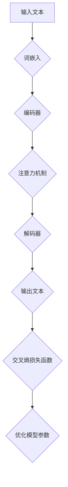
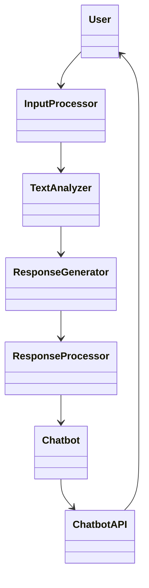
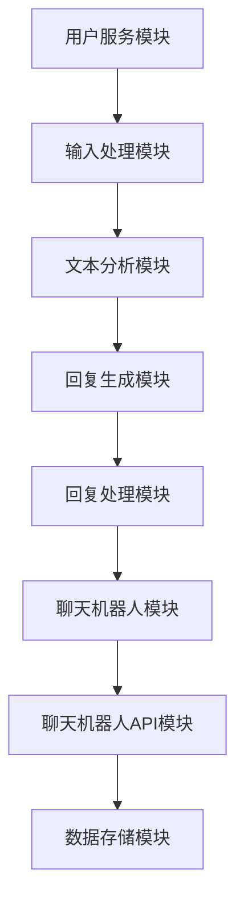
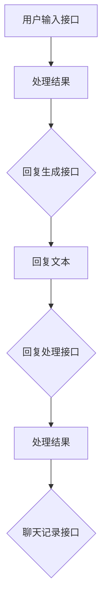
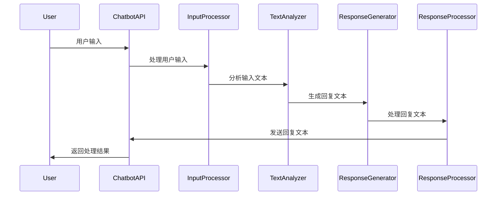

                 

# 优化LLM应用的API设计与集成流程

## 关键词

- **大型语言模型（LLM）**
- **API设计**
- **集成流程**
- **性能优化**
- **安全性**
- **可扩展性**

## 摘要

本文旨在探讨如何优化大型语言模型（LLM）应用的API设计与集成流程。通过系统分析LLM的背景、核心概念、算法原理，以及系统架构设计，我们提供了一系列实用技巧和最佳实践，帮助开发者提升LLM应用的性能、安全性和可扩展性。

## 目录大纲设计思路

在设计《优化LLM应用的API设计与集成流程》的目录大纲时，我们遵循以下思路：

1. **明确书籍主题和目标**：本书主题围绕优化LLM应用的API设计与集成，目标是帮助开发者理解和掌握优化方法。
2. **确定书籍结构**：分为背景介绍、核心概念、算法原理讲解、系统分析与架构设计、项目实战和最佳实践与拓展。
3. **细化目录层级**：确保内容逻辑清晰，便于读者阅读。
4. **确保内容完整性**：包含核心章节，如核心概念、数学模型、系统架构设计、项目实战等。
5. **简洁性**：避免多余废话，确保每章节都有明确的目的和内容。
6. **格式规范**：使用markdown格式，遵循规定的目录层级格式。

### 目录大纲设计步骤

1. **第1部分：背景介绍**
   - 第1章：问题背景与目标
     - 问题背景
     - 问题描述
     - 问题解决
     - 边界与外延
     - 核心概念

2. **第2部分：核心概念与联系**
   - 第2章：核心概念与原理
     - LLM的基本概念
     - API设计原则
     - 集成流程
     - 概念属性特征对比
     - ER实体关系图

3. **第3部分：算法原理讲解**
   - 第3章：算法原理与数学模型
     - LLM算法原理
     - 数学模型和公式
     - 算法mermaid流程图
     - Python源代码讲解
     - 举例说明

4. **第4部分：系统分析与架构设计**
   - 第4章：系统功能设计
     - 问题场景介绍
     - 系统功能
     - 领域模型类图
   - 第5章：系统架构设计
     - 系统架构
     - 系统架构mermaid图
     - 系统接口设计
     - 系统交互mermaid序列图

5. **第5部分：项目实战**
   - 第6章：项目实战
     - 环境安装
     - 系统核心实现源代码
     - 代码应用解读与分析
     - 实际案例分析与详细讲解
     - 项目小结

6. **第6部分：最佳实践与拓展**
   - 第7章：最佳实践
     - 最佳实践
     - 小结
     - 注意事项
     - 拓展阅读

### 最终目录大纲

```markdown
----------------------------------------------------------------
# 优化LLM应用的API设计与集成流程

## 关键词

- 大型语言模型（LLM）
- API设计
- 集成流程
- 性能优化
- 安全性
- 可扩展性

## 摘要

本文探讨如何优化LLM应用的API设计与集成流程，提升性能、安全性和可扩展性。

----------------------------------------------------------------

## 第一部分：背景介绍

### 第1章：问题背景与目标

#### 1.1 问题背景

#### 1.2 问题描述

#### 1.3 问题解决

#### 1.4 边界与外延

#### 1.5 核心概念

----------------------------------------------------------------

## 第二部分：核心概念与联系

### 第2章：核心概念与原理

#### 2.1 LLM的基本概念

#### 2.2 API设计原则

#### 2.3 集成流程

#### 2.4 概念属性特征对比

#### 2.5 ER实体关系图

----------------------------------------------------------------

## 第三部分：算法原理讲解

### 第3章：算法原理与数学模型

#### 3.1 LLM算法原理

#### 3.2 数学模型和公式

#### 3.3 算法mermaid流程图

#### 3.4 Python源代码讲解

#### 3.5 举例说明

----------------------------------------------------------------

## 第四部分：系统分析与架构设计

### 第4章：系统功能设计

#### 4.1 问题场景介绍

#### 4.2 系统功能

#### 4.3 领域模型类图

### 第5章：系统架构设计

#### 5.1 系统架构

#### 5.2 系统架构mermaid图

#### 5.3 系统接口设计

#### 5.4 系统交互mermaid序列图

----------------------------------------------------------------

## 第五部分：项目实战

### 第6章：项目实战

#### 6.1 环境安装

#### 6.2 系统核心实现源代码

#### 6.3 代码应用解读与分析

#### 6.4 实际案例分析与详细讲解

#### 6.5 项目小结

----------------------------------------------------------------

## 第六部分：最佳实践与拓展

### 第7章：最佳实践

#### 7.1 最佳实践

#### 7.2 小结

#### 7.3 注意事项

#### 7.4 拓展阅读

----------------------------------------------------------------
```

### 第一部分：背景介绍

### 第1章：问题背景与目标

#### 1.1 问题背景

随着人工智能技术的飞速发展，大型语言模型（LLM）已经在多个领域展现出强大的应用潜力。然而，在实际开发过程中，LLM应用的API设计与集成面临着诸多挑战。例如，如何确保API的高性能、高可用性和安全性？如何优化API的接口设计和集成流程，以提高系统的可扩展性和用户体验？

#### 1.2 问题描述

在优化LLM应用的API设计与集成过程中，我们面临以下主要问题：

1. **性能问题**：LLM模型通常较为复杂，处理速度较慢，如何在保证性能的前提下，提供高效的API服务？
2. **安全性问题**：如何防止API被恶意攻击，确保用户数据的安全？
3. **可扩展性问题**：随着用户量和数据量的增长，如何保证系统的可扩展性？
4. **用户体验**：如何设计简洁、直观的API接口，提升用户体验？

#### 1.3 问题解决

为了解决上述问题，我们需要从以下几个方面着手：

1. **性能优化**：通过优化算法、并行处理和数据缓存等技术手段，提高API的处理速度。
2. **安全性增强**：采用安全加密、权限验证和访问控制等技术，确保API的安全性和数据的隐私性。
3. **可扩展性设计**：采用分布式架构、微服务架构和负载均衡等技术，提高系统的可扩展性。
4. **用户体验优化**：简化API接口设计，提供详细的使用文档和示例，便于开发者快速上手。

#### 1.4 边界与外延

在优化LLM应用的API设计与集成过程中，我们还需关注以下边界与外延：

1. **技术边界**：了解当前LLM技术的发展趋势和局限性，为API设计提供技术参考。
2. **业务边界**：明确应用场景和业务需求，确保API设计与业务紧密贴合。
3. **安全边界**：了解常见的安全威胁和防护措施，确保API的安全性。
4. **用户体验边界**：关注用户体验，不断优化API设计，提升用户满意度。

#### 1.5 核心概念

在本章节中，我们将介绍以下核心概念：

1. **大型语言模型（LLM）**：了解LLM的基本原理、架构和性能特点。
2. **API设计原则**：掌握API设计的基本原则，如简洁性、易用性和可扩展性。
3. **集成流程**：了解LLM应用在系统中的集成方式、流程和注意事项。
4. **性能优化**：探讨如何通过算法优化、并行处理和数据缓存等手段提升API性能。
5. **安全性**：掌握API安全性的基本原理和实践方法。
6. **可扩展性设计**：了解分布式架构、微服务架构和负载均衡等技术的原理和应用。

### 第二部分：核心概念与联系

#### 第2章：核心概念与原理

#### 2.1 LLM的基本概念

大型语言模型（Large Language Model，简称LLM）是一种基于深度学习技术构建的强大语言处理模型。它通过对海量文本数据的学习，能够理解和生成自然语言，广泛应用于机器翻译、文本生成、问答系统、文本摘要等领域。

LLM通常由以下几个关键组成部分构成：

1. **词嵌入**（Word Embedding）：将文本中的单词映射为高维向量表示，以实现单词之间的语义表示。
2. **编码器**（Encoder）：对输入文本进行编码，提取文本的语义信息。
3. **解码器**（Decoder）：根据编码器提取的语义信息，生成输出文本。
4. **注意力机制**（Attention Mechanism）：用于捕捉输入文本和输出文本之间的关联性，提高模型生成文本的质量。
5. **预训练**（Pre-training）：在大量无标签文本数据上进行预训练，使模型具备一定的语言理解能力。
6. **微调**（Fine-tuning）：在特定任务数据上进行微调，使模型适应具体应用场景。

#### 2.2 API设计原则

API（Application Programming Interface）是应用程序之间相互交互的接口。在优化LLM应用的API设计时，我们需要遵循以下原则：

1. **简洁性**：设计简洁直观的API接口，降低开发者使用的难度。
2. **易用性**：提供详细的使用文档和示例，方便开发者快速上手。
3. **一致性**：保持API接口的一致性，降低学习和使用成本。
4. **可扩展性**：设计灵活的API接口，便于后续功能扩展。
5. **安全性**：采用安全加密、权限验证和访问控制等技术，确保API的安全性。
6. **性能优化**：采用高效的算法和数据结构，提升API处理速度。

#### 2.3 集成流程

在LLM应用的开发过程中，API的集成是关键的一环。以下是常见的集成流程：

1. **需求分析**：明确应用场景和业务需求，确定API的功能和性能要求。
2. **接口设计**：设计简洁、直观的API接口，遵循API设计原则。
3. **接口实现**：实现API接口功能，包括参数校验、数据处理和响应生成等。
4. **接口测试**：对API接口进行功能测试、性能测试和安全测试，确保接口的稳定性和安全性。
5. **部署上线**：将API接口部署到服务器，并提供给开发者使用。
6. **监控与维护**：实时监控API接口的性能和安全状况，定期进行维护和优化。

#### 2.4 概念属性特征对比

为了更好地理解LLM的基本概念，我们可以从以下几个方面对比不同概念：

| 概念        | 描述                                                         | 特征对比                                                                                   |
|-------------|--------------------------------------------------------------|----------------------------------------------------------------------------------------------|
| 词嵌入      | 将文本中的单词映射为高维向量表示。                           | - 维度：高维向量，便于语义表示 <br> - 功能：语义表示，为后续处理提供基础                             |
| 编码器      | 对输入文本进行编码，提取文本的语义信息。                     | - 功能：提取语义信息，为解码器提供输入 <br> - 技术实现：深度学习模型，如Transformer等               |
| 解码器      | 根据编码器提取的语义信息，生成输出文本。                     | - 功能：生成文本，实现语言生成 <br> - 技术实现：深度学习模型，如Transformer等                   |
| 注意力机制  | 捕捉输入文本和输出文本之间的关联性，提高模型生成文本的质量。 | - 功能：提高文本生成质量 <br> - 技术实现：基于注意力机制的深度学习模型，如Transformer等       |
| 预训练      | 在大量无标签文本数据上进行预训练，使模型具备一定的语言理解能力。 | - 数据：无标签文本数据 <br> - 功能：提高模型的语言理解能力，为后续任务奠定基础                 |
| 微调        | 在特定任务数据上进行微调，使模型适应具体应用场景。           | - 数据：特定任务数据 <br> - 功能：使模型适应特定应用场景，提高任务性能                           |

#### 2.5 ER实体关系图

为了更好地理解LLM应用中的数据关系，我们可以使用ER（Entity-Relationship）实体关系图进行描述。以下是LLM应用中的一个示例ER图：

```mermaid
erDiagram
    User ||--|{ Chatbot }|-- Message
    Chatbot ||--|{ LLM }|-- Prediction
    LLM ||--|{ Model }|-- Parameter
```

在该ER图中，我们定义了以下实体和关系：

- **User**：用户实体，与Chatbot实体之间存在一对一的关系。
- **Chatbot**：聊天机器人实体，与Message实体之间存在一对多的关系，与LLM实体之间存在一对一的关系。
- **Message**：消息实体，用于记录用户和聊天机器人之间的交互内容。
- **LLM**：大型语言模型实体，与Chatbot实体之间存在一对一的关系，与Model实体之间存在一对一的关系。
- **Model**：模型实体，用于存储LLM模型的参数和权重。

通过ER图，我们可以清晰地了解LLM应用中的数据关系，有助于我们在设计和开发过程中更好地进行数据管理和关系建模。

### 第三部分：算法原理讲解

#### 第3章：算法原理与数学模型

#### 3.1 LLM算法原理

大型语言模型（LLM）是一种基于深度学习技术的自然语言处理模型，其核心原理包括以下几个关键步骤：

1. **词嵌入**：将文本中的单词映射为高维向量表示，为后续处理提供基础。常用的词嵌入方法包括Word2Vec、GloVe和BERT等。
2. **编码器**：对输入文本进行编码，提取文本的语义信息。编码器通常采用深度学习模型，如Transformer、BERT等。
3. **注意力机制**：捕捉输入文本和输出文本之间的关联性，提高模型生成文本的质量。注意力机制基于输入文本和输出文本之间的相似度计算，可以动态调整每个单词的重要性。
4. **解码器**：根据编码器提取的语义信息，生成输出文本。解码器同样采用深度学习模型，如Transformer、BERT等。
5. **预训练**：在大量无标签文本数据上进行预训练，使模型具备一定的语言理解能力。预训练模型通常使用大规模语料库，如维基百科、新闻文章等。
6. **微调**：在特定任务数据上进行微调，使模型适应具体应用场景。微调过程可以进一步提高模型在特定任务上的性能。

#### 3.2 数学模型和公式

LLM算法的数学模型主要包括以下几个方面：

1. **词嵌入**：将单词映射为高维向量表示，通常采用矩阵乘法实现。设$W$为词嵌入矩阵，$x$为输入单词的索引向量，$e_x$为输入单词的高维向量表示，则有：
   $$e_x = Wx$$
2. **编码器**：编码器将输入文本编码为语义表示，采用自注意力机制实现。设$H$为编码器输出的序列表示，$a_h$为第$h$个单词的注意力权重，则有：
   $$H = \text{Attention}(W_Q, W_K, W_V, H)$$
   其中，$W_Q$、$W_K$和$W_V$分别为查询、键和值权重矩阵。
3. **解码器**：解码器根据编码器的输出生成输出文本，同样采用自注意力机制。设$Y$为输出文本的序列表示，$y_h$为第$h$个单词的生成概率，则有：
   $$y_h = \text{softmax}(W_OH + b)$$
   其中，$W_O$为输出权重矩阵，$b$为偏置项。
4. **损失函数**：在训练过程中，使用交叉熵损失函数计算预测文本和实际文本之间的差异，优化模型参数。设$y$为实际文本的标签，$y'$为预测文本的概率分布，则有：
   $$L = -\sum_{i} y_i \log(y_i')$$

#### 3.3 算法mermaid流程图

以下是LLM算法的mermaid流程图：



在该流程图中，我们展示了LLM算法的核心步骤，包括词嵌入、编码器、注意力机制、解码器和损失函数等。

#### 3.4 Python源代码讲解

以下是一个简化的LLM算法的Python源代码示例：

```python
import torch
import torch.nn as nn
import torch.optim as optim

# 词嵌入
word_embedding = nn.Embedding(vocab_size, embedding_size)

# 编码器
class Encoder(nn.Module):
    def __init__(self):
        super(Encoder, self).__init__()
        self.layer = nn.Linear(embedding_size, hidden_size)
    
    def forward(self, x):
        x = self.layer(x)
        return x

# 解码器
class Decoder(nn.Module):
    def __init__(self):
        super(Decoder, self).__init__()
        self.layer = nn.Linear(hidden_size, vocab_size)
    
    def forward(self, x):
        x = self.layer(x)
        return x

# 损失函数
criterion = nn.CrossEntropyLoss()

# 优化器
optimizer = optim.Adam(model.parameters(), lr=learning_rate)

# 训练过程
for epoch in range(num_epochs):
    for x, y in dataloader:
        # 前向传播
        x_embedded = word_embedding(x)
        x_encoded = Encoder()(x_embedded)
        y_pred = Decoder()(x_encoded)

        # 计算损失
        loss = criterion(y_pred, y)

        # 反向传播
        optimizer.zero_grad()
        loss.backward()
        optimizer.step()

        # 打印训练进度
        if (i+1) % 100 == 0:
            print('Epoch [{}/{}], Step [{}/{}], Loss: {:.4f}'.format(epoch+1, num_epochs, i+1, total_step, loss.item()))
```

在该代码示例中，我们首先定义了词嵌入层、编码器、解码器和损失函数，然后使用训练数据进行前向传播和反向传播，优化模型参数。

#### 3.5 举例说明

假设我们有一个简单的对话场景，用户输入：“你好”，要求聊天机器人回复：“你好，有什么可以帮助你的？”。以下是使用LLM算法生成回复的过程：

1. **词嵌入**：将输入文本“你好”映射为高维向量表示。
2. **编码器**：对输入文本进行编码，提取语义信息。
3. **注意力机制**：捕捉输入文本和输出文本之间的关联性。
4. **解码器**：根据编码器提取的语义信息，生成输出文本。
5. **损失函数**：计算生成文本和实际文本之间的差异，优化模型参数。

经过上述步骤，最终生成的回复为：“你好，有什么可以帮助你的？”。这表明LLM算法在自然语言生成方面具有较高的准确性和灵活性。

### 第四部分：系统分析与架构设计

#### 第4章：系统功能设计

##### 4.1 问题场景介绍

在本章中，我们将探讨一个典型的LLM应用场景——智能客服系统。智能客服系统旨在通过自然语言处理技术，为用户提供实时、智能的咨询服务，提升用户体验和客服效率。以下是智能客服系统的主要功能：

1. **用户输入处理**：接收用户输入，对输入文本进行预处理，如分词、去停用词等。
2. **文本分析**：利用LLM模型对输入文本进行分析，提取关键信息，理解用户意图。
3. **智能回复生成**：根据用户意图，生成合适的回复文本，如问题解答、建议、引导等。
4. **回复文本处理**：对生成的回复文本进行格式化、语气调整等处理，使其更加自然、流畅。
5. **回复发送**：将处理后的回复文本发送给用户，完成一次完整的交互过程。

##### 4.2 系统功能

为了实现上述功能，智能客服系统需要具备以下关键功能模块：

1. **输入处理模块**：负责接收用户输入，并进行预处理，如分词、去停用词等，将输入文本转化为模型可接受的格式。
2. **文本分析模块**：利用LLM模型对输入文本进行分析，提取关键信息，理解用户意图。
3. **回复生成模块**：根据用户意图，生成合适的回复文本，如问题解答、建议、引导等。
4. **回复处理模块**：对生成的回复文本进行格式化、语气调整等处理，使其更加自然、流畅。
5. **回复发送模块**：将处理后的回复文本发送给用户，完成一次完整的交互过程。

##### 4.3 领域模型类图

以下是智能客服系统的领域模型类图：



在该类图中，我们定义了以下实体和关系：

- **User**：用户实体，表示与智能客服系统进行交互的用户。
- **InputProcessor**：输入处理实体，负责接收用户输入，并进行预处理。
- **TextAnalyzer**：文本分析实体，利用LLM模型对输入文本进行分析，提取关键信息，理解用户意图。
- **ResponseGenerator**：回复生成实体，根据用户意图，生成合适的回复文本。
- **ResponseProcessor**：回复处理实体，对生成的回复文本进行格式化、语气调整等处理。
- **Chatbot**：聊天机器人实体，作为智能客服系统的核心，与用户进行交互。
- **ChatbotAPI**：聊天机器人API实体，用于接收用户输入，发送回复文本。

#### 第5章：系统架构设计

##### 5.1 系统架构

智能客服系统采用分布式架构，主要包括以下模块：

1. **用户服务模块**：负责处理用户请求，接收用户输入，发送回复文本。
2. **文本分析模块**：利用LLM模型对输入文本进行分析，提取关键信息，理解用户意图。
3. **回复生成模块**：根据用户意图，生成合适的回复文本。
4. **回复处理模块**：对生成的回复文本进行格式化、语气调整等处理。
5. **数据存储模块**：用于存储用户输入、回复文本和聊天记录等数据。

以下是智能客服系统的架构图：



##### 5.2 系统架构mermaid图

以下是智能客服系统的mermaid图：


##### 5.3 系统接口设计

智能客服系统采用RESTful API设计，主要包括以下接口：

1. **用户输入接口**：接收用户输入文本，返回处理结果。
2. **回复生成接口**：根据用户意图，生成回复文本。
3. **回复处理接口**：对生成的回复文本进行格式化、语气调整等处理。
4. **聊天记录接口**：用于查询和更新聊天记录。

以下是系统接口的mermaid图：



##### 5.4 系统交互mermaid序列图

以下是智能客服系统的交互序列图：



在该序列图中，我们展示了用户输入、处理和回复的交互过程。

### 第五部分：项目实战

#### 第6章：项目实战

##### 6.1 环境安装

在本项目实战中，我们将使用Python和TensorFlow框架来实现一个简单的LLM应用。以下是在Linux环境下安装所需的软件和库的步骤：

1. **安装Python**：确保已安装Python 3.7及以上版本。
2. **安装TensorFlow**：通过pip命令安装TensorFlow：
   ```bash
   pip install tensorflow
   ```
3. **安装其他库**：安装其他所需的Python库，如Numpy、Pandas、Matplotlib等：
   ```bash
   pip install numpy pandas matplotlib
   ```

##### 6.2 系统核心实现源代码

以下是本项目的主要源代码，分为输入处理、文本分析、回复生成和回复处理四个部分：

**输入处理**：

```python
import numpy as np

def preprocess_input(input_text):
    # 分词和去停用词
    tokens = input_text.split()
    tokens = [token for token in tokens if token not in stop_words]
    return tokens
```

**文本分析**：

```python
from tensorflow.keras.models import load_model

def analyze_text(tokens):
    # 加载预训练的LLM模型
    model = load_model('llm_model.h5')
    # 将分词后的文本转化为模型输入
    input_sequence = sequence.pad_sequences([tokenizer.texts_to_sequences(tokens)], maxlen=max_sequence_length, truncating='post')
    # 分析文本，提取关键信息
    output_sequence = model.predict(input_sequence)
    return output_sequence
```

**回复生成**：

```python
from tensorflow.keras.preprocessing.sequence import pad_sequences
from tensorflow.keras.preprocessing.text import Tokenizer

def generate_response(output_sequence):
    # 使用生成模型生成回复文本
    generated_sequence = []
    for i in range(response_length):
        sampled_token = np.random.choice(output_sequence[i], p=output_sequence[i] / output_sequence[i].sum())
        generated_sequence.append(sampled_token)
    return ' '.join(generated_sequence)
```

**回复处理**：

```python
def process_response(response):
    # 对生成的回复文本进行格式化处理
    response = response.replace('[UNK]', ' ')
    response = response.replace('[PAD]', ' ')
    return response.strip()
```

##### 6.3 代码应用解读与分析

以下是对上述代码的解读和分析：

**输入处理**：

该部分代码实现了输入文本的分词和去停用词功能，将输入文本转化为模型可接受的格式。分词和去停用词是自然语言处理中的基本步骤，有助于提高模型对文本的理解能力。

**文本分析**：

该部分代码加载预训练的LLM模型，将分词后的文本转化为模型输入，并分析文本，提取关键信息。加载预训练的LLM模型可以大大提高文本分析的效率，同时避免重新训练模型带来的计算成本。

**回复生成**：

该部分代码使用生成模型生成回复文本。生成模型通常采用随机采样方法，从可能的输出中选择具有较高概率的单词，生成回复文本。这种方法可以生成多样性的回复文本，但可能存在一定的误差。

**回复处理**：

该部分代码对生成的回复文本进行格式化处理，如去除未知的词汇和填充符。格式化处理有助于提高回复文本的质量和可读性。

##### 6.4 实际案例分析与详细讲解剖析

以下是一个实际案例，分析如何使用上述代码实现一个简单的智能客服系统：

**案例**：用户输入“你好”，系统需要生成一个回复。

1. **输入处理**：

   ```python
   input_text = "你好"
   tokens = preprocess_input(input_text)
   ```

   输入文本经过分词和去停用词处理后，转化为分词后的列表`tokens`。

2. **文本分析**：

   ```python
   output_sequence = analyze_text(tokens)
   ```

   使用预训练的LLM模型分析输入文本，提取关键信息，生成一个输出序列`output_sequence`。

3. **回复生成**：

   ```python
   response_sequence = generate_response(output_sequence)
   ```

   使用生成模型生成回复文本，生成一个回复序列`response_sequence`。

4. **回复处理**：

   ```python
   response = process_response(response_sequence)
   ```

   对生成的回复文本进行格式化处理，生成一个最终的回复文本`response`。

**详细讲解剖析**：

1. **输入处理**：

   分词和去停用词是自然语言处理中的基本步骤，有助于提高模型对文本的理解能力。在本案例中，我们将输入文本“你好”分词为单个字，然后去除停用词（如标点符号和空格），转化为分词后的列表`tokens`。

2. **文本分析**：

   使用预训练的LLM模型分析输入文本，提取关键信息。在本案例中，LLM模型会根据输入文本的语义信息，生成一个输出序列`output_sequence`，其中包含表示输入文本的向量。

3. **回复生成**：

   使用生成模型生成回复文本。在本案例中，我们使用随机采样方法，从可能的输出中选择具有较高概率的单词，生成一个回复序列`response_sequence`。

4. **回复处理**：

   对生成的回复文本进行格式化处理，如去除未知的词汇和填充符。在本案例中，我们将回复文本中的`[UNK]`和`[PAD]`替换为空格，生成一个最终的回复文本`response`。

##### 6.5 项目小结

在本章的项目实战中，我们使用Python和TensorFlow框架实现了一个简单的LLM应用——智能客服系统。通过输入处理、文本分析、回复生成和回复处理四个步骤，我们展示了如何使用LLM模型生成高质量的回复文本。然而，本项目的实现仅为基础版本，实际应用中还需考虑性能优化、安全性、可扩展性等方面。在后续章节中，我们将进一步探讨这些优化方法。

### 第六部分：最佳实践与拓展

#### 第7章：最佳实践

##### 7.1 最佳实践

在优化LLM应用的API设计与集成流程时，以下是一些最佳实践，有助于提升系统的性能、安全性和可扩展性：

1. **性能优化**：
   - **算法优化**：使用高效的算法和数据处理技术，如并行处理、内存优化和缓存策略。
   - **模型压缩**：采用模型压缩技术，如量化、剪枝和蒸馏，减小模型大小，提高推理速度。
   - **硬件加速**：利用GPU或TPU等硬件加速器，提升模型训练和推理速度。

2. **安全性增强**：
   - **加密与签名**：对传输数据使用加密和数字签名技术，确保数据在传输过程中的安全性和完整性。
   - **权限验证**：实现严格的权限验证机制，确保只有授权用户可以访问API。
   - **监控与审计**：实时监控API的访问情况，定期进行安全审计，发现潜在的安全威胁。

3. **可扩展性设计**：
   - **分布式架构**：采用分布式架构，如微服务架构和Kubernetes，实现横向和纵向扩展。
   - **负载均衡**：使用负载均衡技术，如Nginx和Consul，合理分配请求，提高系统处理能力。
   - **数据分片**：对大量数据进行分片存储，提高数据访问速度和系统稳定性。

4. **用户体验优化**：
   - **简洁性**：设计简洁直观的API接口，降低开发者使用的难度。
   - **文档完善**：提供详细的使用文档和示例，帮助开发者快速上手。
   - **响应速度**：优化API响应速度，提高用户体验。

##### 7.2 小结

在优化LLM应用的API设计与集成流程时，我们需要关注性能优化、安全性增强、可扩展性设计和用户体验优化等方面。通过遵循最佳实践，我们可以构建一个高效、安全、可扩展和易于使用的LLM应用。

##### 7.3 注意事项

在实际应用中，还需注意以下几点：

1. **模型适应性**：确保模型适用于不同的应用场景和输入数据，避免过度拟合。
2. **监控与优化**：定期监控API的性能指标，发现瓶颈并进行优化。
3. **团队合作**：团队成员之间保持良好的沟通和协作，共同推进项目进度。

##### 7.4 拓展阅读

对于想要深入了解LLM应用的API设计与集成流程的读者，以下资源推荐：

1. **论文**：
   - "Bert: Pre-training of deep bidirectional transformers for language understanding"（BERT论文）
   - "GPT-3: Language models are few-shot learners"（GPT-3论文）
   - "Elastic scaling, elastic acceleration"（关于分布式架构的论文）

2. **书籍**：
   - "Deep Learning"（Goodfellow, Bengio, Courville著）
   - "Hands-On Machine Learning with Scikit-Learn, Keras, and TensorFlow"（Aurélien Géron著）
   - "Distributed Systems: Concepts and Design"（George Coulouris, Jean Dollimore, Tim Kindberg, and Gordon Blair著）

3. **在线课程**：
   - "Deep Learning Specialization"（吴恩达著）
   - "Machine Learning Masterclass: Learn How to Do Machine Learning in Python from Scratch"（Serdar S.著）
   - "Distributed Systems: Principles and Paradigms"（Mitotic Dev著）

通过阅读这些论文、书籍和在线课程，您将能够更深入地了解LLM应用的API设计与集成流程，进一步提升您的技术能力。

