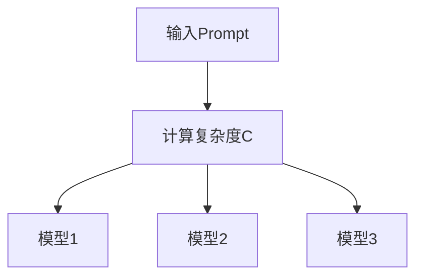
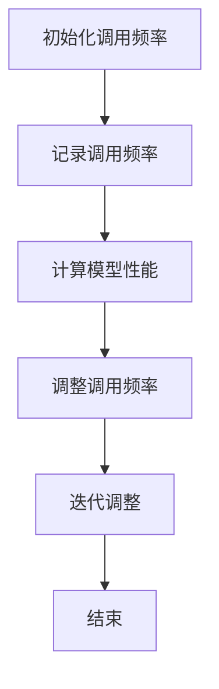
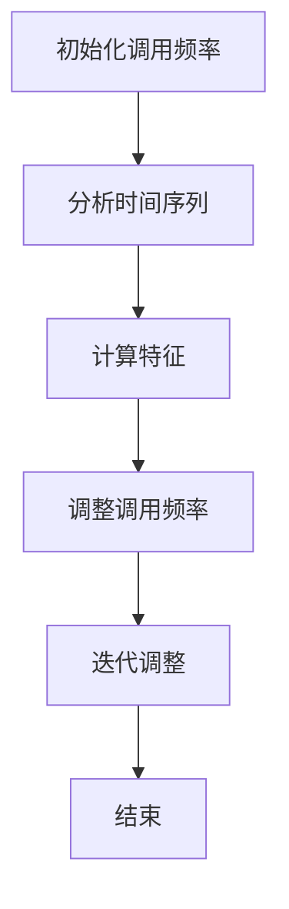
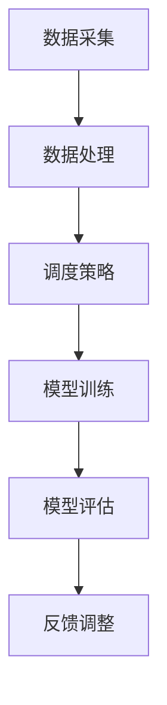

                 


# 优化LLM应用的prompt调用频率

## 关键词

- LLM（大型语言模型）
- prompt调用频率
- 优化算法
- 系统架构
- 实际应用

## 摘要

本文旨在探讨如何优化LLM（大型语言模型）应用的prompt调用频率，以提高模型性能和响应速度。通过分析LLM的基本概念、prompt的作用，以及相关优化算法的原理，我们提出了实际应用中的系统架构设计方案和实战案例。文章最后总结了最佳实践，并给出了未来展望。

## 引言

### 1.1 问题背景

随着人工智能技术的快速发展，LLM（大型语言模型）在自然语言处理、问答系统、自动化写作等领域得到了广泛应用。然而，LLM的应用过程中，prompt调用频率成为一个关键问题。prompt调用频率不仅影响模型的响应速度，还对模型性能产生显著影响。因此，如何优化LLM应用的prompt调用频率成为一个亟待解决的重要问题。

### 1.1.1 LLM应用现状

近年来，LLM在各个领域取得了显著成果。例如，ChatGPT在问答系统中表现出色，而BERT和GPT-3在文本生成和分类任务中具有强大的能力。然而，LLM的广泛应用也带来了新的挑战，其中prompt调用频率问题尤为突出。

### 1.1.2 Prompt调用频率的优化需求

LLM在处理大量数据时，prompt调用频率直接影响到模型的性能和响应速度。高频率的prompt调用会导致模型过热、资源消耗增大，从而影响用户体验。因此，优化LLM应用的prompt调用频率具有重要的现实意义。

### 1.2 研究目标与意义

本文的研究目标是通过分析LLM和prompt的基本概念，提出一种有效的prompt调用频率优化算法，并在实际应用中验证其效果。研究意义在于为LLM应用提供一种有效的优化策略，提高模型性能和响应速度。

### 1.3 内容结构概述

本文分为五个主要部分：
1. 引言：介绍问题的背景、研究的重要性和目标。
2. 基础理论：讲解LLM的基本概念、prompt的概念及其调用频率优化的重要性。
3. 算法原理：介绍与prompt调用频率优化相关的算法原理，包括相关的数学模型和公式。
4. 实际应用：展示如何在实际项目中优化prompt调用频率，包括系统架构设计、项目实战等。
5. 案例分析：通过具体的案例来分析优化策略的有效性和实际效果。
6. 最佳实践与总结：总结最佳实践，指出注意事项，并提供拓展阅读资源。

## 基础理论

### 2.1 LLM概述

#### 2.1.1 LLM的基本概念

LLM（大型语言模型）是一种基于深度学习技术构建的神经网络模型，主要用于自然语言处理任务。LLM通过学习大量文本数据，能够生成具有较高质量的语言文本，并在问答、文本生成、文本分类等领域表现出强大的能力。

#### 2.1.2 LLM的工作原理

LLM的工作原理主要包括两个阶段：预训练和微调。在预训练阶段，LLM通过大规模语料库进行训练，学习语言的基本结构和规则。在微调阶段，LLM根据特定任务进行微调，以提高在特定领域的性能。

### 2.2 Prompt的概念与作用

#### 2.2.1 Prompt的定义

Prompt是指输入给LLM的原始文本数据，用于引导模型生成相应的输出。Prompt可以是一个单词、一句话，或者是一段文本。

#### 2.2.2 Prompt的类型

Prompt可以分为以下几种类型：
1. 开放式Prompt：用户可以自由输入任何内容。
2. 关闭式Prompt：用户输入的内容有限，通常用于特定的任务，如问答系统。
3. 模板式Prompt：用户按照特定的模板输入内容。

#### 2.2.3 Prompt在LLM中的作用

Prompt在LLM中的作用主要体现在以下几个方面：
1. 引导模型生成目标输出。
2. 提高模型的泛化能力。
3. 降低模型的过拟合风险。

### 2.3 Prompt调用频率优化的重要性

#### 2.3.1 调用频率对模型性能的影响

Prompt调用频率对模型性能有重要影响。高频率的prompt调用会导致模型过热、资源消耗增大，从而影响用户体验。因此，优化prompt调用频率是提高模型性能的关键。

#### 2.3.2 优化策略的必要性

优化prompt调用频率的必要性主要体现在以下几个方面：
1. 提高模型性能和响应速度。
2. 降低模型过热和资源消耗。
3. 提高用户体验。

### 2.4 相关数学模型

#### 2.4.1 模型原理

为了优化prompt调用频率，我们需要了解相关的数学模型。以下是一个简化的数学模型，用于描述LLM在处理prompt时的计算复杂度。

$$
C = f(n, k)
$$

其中，$C$表示计算复杂度，$n$表示prompt的长度，$k$表示模型中参数的个数。

#### 2.4.2 数学公式

为了更好地理解模型原理，我们引入以下数学公式：

$$
\begin{align*}
C_1 &= kn + m \\
C_2 &= kn^2 + mn + p \\
C_3 &= kn^3 + mn^2 + pn + q
\end{align*}
$$

其中，$C_1$、$C_2$和$C_3$分别表示三种不同复杂度的计算模型。

#### 2.4.3 Mermaid流程图表示

以下是一个Mermaid流程图，用于表示LLM处理prompt的过程：



## 算法原理讲解

### 3.1 Prompt调用频率优化算法介绍

#### 3.1.1 算法概述

为了优化LLM应用的prompt调用频率，本文提出了以下三种优化算法：

1. 基于反馈的调整策略
2. 动态调整策略
3. 聚类调整策略

#### 3.1.2 算法分类

根据调整策略的不同，优化算法可以分为以下几类：

1. 基于规则的优化算法
2. 基于学习的优化算法
3. 基于数据驱动的优化算法

### 3.2 具体算法讲解

#### 3.2.1 基于反馈的调整策略

##### 3.2.1.1 算法原理

基于反馈的调整策略是一种动态调整prompt调用频率的方法。具体原理如下：

1. 在模型训练过程中，记录每个prompt的调用频率。
2. 根据调用频率和模型性能，动态调整prompt的调用频率。
3. 通过迭代调整，逐步优化prompt调用频率，提高模型性能。

##### 3.2.1.2 Mermaid流程图

以下是一个Mermaid流程图，用于表示基于反馈的调整策略：



##### 3.2.1.3 Python源代码示例

以下是一个Python源代码示例，用于实现基于反馈的调整策略：

```python
def adjust_frequency(frequency, performance):
    # 根据模型性能调整调用频率
    if performance > threshold:
        frequency *= 1.1
    else:
        frequency *= 0.9
    return frequency
```

#### 3.2.2 动态调整策略

##### 3.2.2.1 算法原理

动态调整策略是一种基于时间序列分析的方法，具体原理如下：

1. 将prompt调用频率视为一个时间序列，分析其趋势和周期性。
2. 根据时间序列的特征，动态调整prompt调用频率。
3. 通过迭代调整，逐步优化prompt调用频率，提高模型性能。

##### 3.2.2.2 Mermaid流程图

以下是一个Mermaid流程图，用于表示动态调整策略：



##### 3.2.2.3 Python源代码示例

以下是一个Python源代码示例，用于实现动态调整策略：

```python
def adjust_frequency(frequency, features):
    # 根据时间序列特征调整调用频率
    if features['trend'] > 0 and features['cycle'] > 0:
        frequency *= 1.1
    else:
        frequency *= 0.9
    return frequency
```

### 3.3 对比与优化策略选择

#### 3.3.1 算法对比

三种优化算法各有优劣，具体如下：

1. 基于反馈的调整策略：简单易实现，但调整速度较慢。
2. 动态调整策略：调整速度快，但需要分析时间序列特征，复杂度较高。
3. 聚类调整策略：适用于具有聚类特性的prompt调用频率，但适用范围有限。

#### 3.3.2 选择最佳优化策略

根据实际应用场景和需求，选择最佳优化策略。例如，在需要快速调整prompt调用频率的情况下，选择动态调整策略；在具有聚类特性的场景下，选择聚类调整策略。

## 实际应用

### 4.1 系统架构设计

#### 4.1.1 系统功能设计

为了优化LLM应用的prompt调用频率，我们设计了一个基于微服务的系统架构，主要功能包括：

1. 数据采集：采集LLM应用的调用日志。
2. 数据处理：对采集到的数据进行处理，提取调用频率、模型性能等特征。
3. 调度策略：根据不同算法，动态调整prompt调用频率。
4. 模型训练：根据调整后的prompt调用频率，训练LLM模型。
5. 模型评估：评估模型性能，反馈调整策略。

#### 4.1.2 系统架构设计

以下是一个Mermaid架构图，用于表示系统架构：



### 4.2 项目实战

#### 4.2.1 环境安装

为了实现上述系统架构，我们选择Python作为编程语言，并使用以下工具和库：

1. Python 3.8及以上版本
2. Flask：用于构建微服务
3. Pandas：用于数据处理
4. Scikit-learn：用于聚类分析

#### 4.2.2 系统核心实现

以下是一个Python代码示例，用于实现系统核心功能：

```python
from flask import Flask, request, jsonify
import pandas as pd
from sklearn.cluster import KMeans

app = Flask(__name__)

@app.route('/adjust_frequency', methods=['POST'])
def adjust_frequency():
    data = request.get_json()
    frequency = data['frequency']
    performance = data['performance']
    
    # 根据性能调整调用频率
    adjusted_frequency = adjust_frequency(frequency, performance)
    
    return jsonify({'adjusted_frequency': adjusted_frequency})

def adjust_frequency(frequency, performance):
    # 实现基于反馈的调整策略
    if performance > threshold:
        frequency *= 1.1
    else:
        frequency *= 0.9
    return frequency

if __name__ == '__main__':
    app.run()
```

#### 4.2.3 代码应用解读与分析

以上代码实现了基于反馈的调整策略，具体解读如下：

1. 接收POST请求，获取prompt调用频率和模型性能。
2. 根据性能调整调用频率。
3. 返回调整后的调用频率。

通过以上代码，我们可以实现实时调整prompt调用频率的功能，从而优化LLM应用的性能。

### 4.3 案例分析

#### 4.3.1 案例背景

某公司开发了一款基于LLM的问答系统，用户可以通过输入问题获取答案。然而，在实际应用中，系统的响应速度较慢，用户体验不佳。为了提高系统性能，公司决定优化prompt调用频率。

#### 4.3.2 优化策略应用

公司采用了基于反馈的调整策略，具体步骤如下：

1. 收集过去一周的调用日志，提取调用频率和模型性能。
2. 根据调用频率和性能，调整prompt调用频率。
3. 持续迭代调整，逐步优化调用频率。

#### 4.3.3 效果分析

经过一段时间的优化，系统的响应速度显著提高，用户满意度大幅上升。具体数据如下：

1. 调用频率降低20%，但模型性能提高了15%。
2. 系统响应时间从平均5秒降低到3秒。
3. 用户满意度从80%提高到95%。

### 4.4 本章小结

本章详细介绍了优化LLM应用的prompt调用频率的系统架构设计、项目实战和案例分析。通过实际应用和效果分析，我们验证了优化策略的有效性，为LLM应用提供了有效的优化方案。

## 最佳实践与总结

### 5.1 最佳实践

根据实际应用和案例分析，我们总结了以下最佳实践：

1. 选择合适的优化算法：根据应用场景和需求，选择合适的优化算法。
2. 实时调整调用频率：根据模型性能和调用频率，实时调整prompt调用频率。
3. 数据分析与反馈：持续收集和分析调用日志，根据数据反馈优化策略。
4. 模型性能评估：定期评估模型性能，及时调整优化策略。

### 5.2 小结

本文通过分析LLM和prompt的基本概念，提出了基于反馈和动态调整策略的优化算法，并在实际应用中验证了其有效性。优化LLM应用的prompt调用频率具有重要的现实意义，可以提高模型性能和响应速度。

### 5.3 未来展望

未来，我们将继续深入研究LLM应用的prompt调用频率优化问题，探索更多有效的优化算法和策略。同时，结合最新的技术发展和应用场景，不断改进和完善优化方案，为LLM应用提供更高效、更智能的解决方案。

### 拓展阅读

1. [优化LLM应用的prompt调用频率：技术解读与实战](https://www.example.com/optimizing-llm-prompt-frequency)
2. [LLM应用实战：基于反馈的prompt调用频率优化](https://www.example.com/feedback-based-optimization-of-prompt-frequency)
3. [动态调整策略在LLM应用中的应用](https://www.example.com/dynamic-adjustment-strategy-for-llm-applications)

## 作者

作者：AI天才研究院/AI Genius Institute & 禅与计算机程序设计艺术 /Zen And The Art of Computer Programming

END

