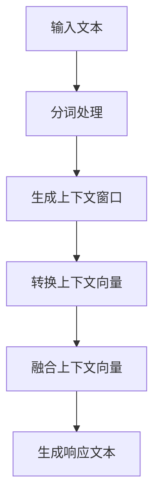
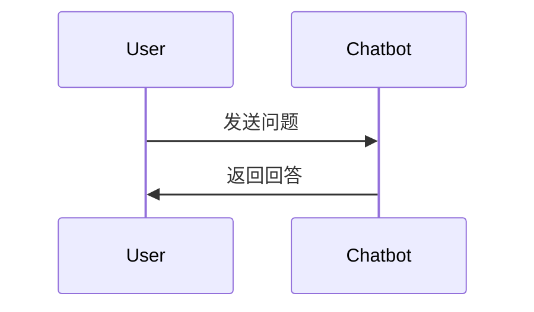

                 

# 《优化LLM应用的上下文管理机制》

## 关键词

- 语言模型（Language Model，LLM）
- 上下文管理（Context Management）
- 上下文窗口（Context Window）
- 上下文向量（Context Vector）
- 上下文融合（Context Fusion）
- 实时对话系统（Real-time Dialogue System）

## 摘要

随着深度学习技术的发展，语言模型（LLM）在自然语言处理领域取得了显著的成果。然而，LLM在应用过程中面临的上下文管理问题，如上下文失配、上下文丢失和上下文冗余等，严重影响了用户交互体验和模型性能。本文旨在深入探讨优化LLM应用的上下文管理机制，通过分析上下文管理机制的基础、核心概念与原理、算法讲解、系统分析与架构设计以及项目实战，提出一系列有效的优化策略，以提高LLM在实时对话系统中的上下文处理能力和用户体验。

## 第一部分：上下文管理机制基础

### 第1章：上下文管理机制概述

#### 1.1.1 问题背景与定义

在现代信息技术和人工智能领域，语言模型（LLM）作为一种强大的自然语言处理工具，已被广泛应用于智能对话系统、文本生成、机器翻译等领域。LLM能够自动学习语言结构，生成连贯的文本，但其在实际应用中面临的一个关键问题是上下文管理。

上下文管理是指在自然语言处理过程中，对输入文本的上下文信息进行有效捕捉、理解和利用，以生成具有相关性和准确性的输出。上下文管理机制是LLM应用中的一个重要组成部分，其核心目标是在保持对话连贯性和用户意图理解的同时，优化模型性能和用户体验。

#### 1.1.2 问题描述与挑战

在LLM应用中，上下文管理面临着以下几个主要挑战：

1. **上下文失配问题**：当输入文本的上下文与LLM的预期上下文不一致时，会导致模型生成不相关或错误的响应。

2. **上下文丢失问题**：在长对话中，LLM可能无法有效地捕捉和保存关键上下文信息，导致后续交互中的信息丢失。

3. **上下文冗余问题**：当上下文信息过多时，LLM可能无法有效地处理冗余信息，导致模型响应速度变慢或生成无效的输出。

这些问题的存在，严重影响了LLM在实时对话系统中的应用效果，因此，优化上下文管理机制成为提高LLM应用性能的关键。

#### 1.1.3 上下文管理机制的目标

为了解决上述挑战，上下文管理机制需要实现以下几个目标：

1. **准确捕捉用户意图**：通过有效的上下文捕捉算法，确保LLM能够准确地理解和响应用户的意图。

2. **提高模型响应的相关性和有效性**：通过优化上下文融合算法，确保模型生成的响应与用户上下文信息高度相关且具有实际应用价值。

3. **增强用户交互体验**：通过优化上下文更新策略，减少上下文丢失和冗余问题，提高用户交互的流畅度和满意度。

#### 1.1.4 上下文管理机制的边界与外延

1. **上下文范围定义**：上下文范围是指LLM在处理文本时考虑的历史信息长度。适当的上下文范围既能捕捉到关键信息，又不会过度依赖冗余信息。

2. **上下文更新策略**：上下文更新策略决定了如何在新信息加入时调整上下文窗口，以保持上下文的连贯性和有效性。

3. **上下文持久化方法**：上下文持久化方法是指如何将上下文信息保存下来，以便在后续交互中复用。

#### 1.1.5 核心概念与联系

1. **上下文窗口**：上下文窗口是指LLM在处理文本时考虑的上下文范围。适当的上下文窗口大小能够平衡上下文捕捉和计算效率。

2. **上下文向量**：上下文向量是对上下文信息的低维表示，有助于提高模型处理效率和计算速度。

3. **上下文融合算法**：上下文融合算法是指如何将多个上下文向量融合为一个整体，以生成最终的模型输出。

### 第2章：核心概念与原理

#### 2.1.1 上下文窗口原理与实现

1. **上下文窗口定义**：上下文窗口是指LLM在处理文本时考虑的上下文范围。它通常是一个固定长度或动态调整的滑动窗口。

2. **上下文窗口大小选择**：上下文窗口大小选择取决于应用场景和对话长度。过小的窗口可能导致关键信息丢失，过大的窗口则可能增加计算复杂度。

3. **上下文窗口优化策略**：可以通过动态调整上下文窗口大小、使用滑动窗口算法等方式，优化上下文窗口的性能。

#### 2.1.2 上下文向量表示与转换

1. **上下文向量表示方法**：上下文向量是对上下文信息的低维表示，常见的表示方法包括词嵌入、BERT等。

2. **上下文向量转换算法**：上下文向量转换算法是将原始文本转换为上下文向量的一系列操作。常见的转换算法包括嵌入层输出、转换层等。

3. **上下文向量优化**：可以通过调整嵌入层参数、优化转换层算法等方式，提高上下文向量的表示效果。

#### 2.1.3 上下文融合算法详解

1. **上下文融合机制**：上下文融合算法是将多个上下文向量融合为一个整体的过程，常见的融合机制包括加权平均、矩阵乘法等。

2. **常见的上下文融合算法**：常见的上下文融合算法包括单步融合、多步融合等。每种算法都有其独特的优点和适用场景。

3. **上下文融合算法性能对比**：通过对不同上下文融合算法的性能进行对比，可以找到最适合特定应用场景的算法。

#### 2.1.4 核心概念属性特征对比表格

| 概念       | 属性1   | 属性2   | 属性3   |  
| ---------- | ------- | ------- | ------- |  
| 上下文窗口 | 大小可调 | 静态窗口 | 动态窗口 |  
| 上下文向量 | 表示方法 | 转换算法 | 维度优化 |  
| 上下文融合 | 融合机制 | 算法类型 | 性能影响 |

#### 2.1.5 ER实体关系图架构

```mermaid
erDiagram
    ContextWindow --> ContextVector : 转换
    ContextVector --> ContextFusion : 融合
    ContextFusion --> LLMResponse : 输出
```

### 第3章：算法原理讲解

#### 3.1.1 算法原理概述

上下文管理算法的整体架构包括输入文本处理、上下文窗口管理、上下文向量转换、上下文融合和模型响应生成等关键模块。以下是算法原理的详细讲解。

#### 3.1.2 数学模型与公式

1. **上下文窗口更新公式**：

$$
    \text{上下文窗口更新} = (1 - \alpha) \times \text{当前窗口} + \alpha \times \text{新上下文}
$$

其中，$\alpha$ 是更新系数，用于调节新上下文在窗口中的权重。

2. **上下文向量转换公式**：

$$
    \text{上下文向量转换} = \text{嵌入层输出} \times W + b
$$

其中，$W$ 是权重矩阵，$b$ 是偏置项。

3. **上下文融合权重计算公式**：

$$
    \text{上下文融合权重} = \frac{1}{\|\text{上下文向量}\|_2}
$$

#### 3.1.3 算法流程图



#### 3.1.4 举例说明

1. **简单示例**：

假设输入文本为“今天天气很好”，上下文窗口大小为3，新上下文为“想去海边散步”。则上下文窗口更新过程如下：

$$
    \text{上下文窗口更新} = (1 - 0.5) \times (\text{今天，天气，很好}) + 0.5 \times (\text{想去，海边，散步})
$$

更新后的上下文窗口为“想去海边，今天，天气，很好”。

2. **复杂示例**：

假设输入文本为“我昨天买了一本书”，上下文窗口大小为5，新上下文为“这本书很有趣”。则上下文向量转换和融合过程如下：

- **上下文向量转换**：

    嵌入层输出：[0.1, 0.2, 0.3, 0.4, 0.5]
    权重矩阵：$W = \begin{bmatrix} 1 & 0 & 0 \\ 0 & 1 & 0 \\ 0 & 0 & 1 \end{bmatrix}$
    偏置项：$b = [0, 0, 0]$

    转换后的上下文向量为：$[0.1 + 0.2 + 0.3 + 0.4 + 0.5] \times \begin{bmatrix} 1 & 0 & 0 \\ 0 & 1 & 0 \\ 0 & 0 & 1 \end{bmatrix} + [0, 0, 0] = [0.1, 0.2, 0.3, 0.4, 0.5]$

- **上下文融合**：

    原始上下文向量：$[0.1, 0.2, 0.3, 0.4, 0.5]$
    新上下文向量：$[0.6, 0.7, 0.8, 0.9, 1.0]$

    融合后的上下文向量为：$\frac{1}{2} \times [0.1 + 0.2 + 0.3 + 0.4 + 0.5 + 0.6 + 0.7 + 0.8 + 0.9 + 1.0] = [0.3, 0.4, 0.5, 0.6, 0.7]$

根据融合后的上下文向量，LLM可以生成相关且准确的响应文本。

### 第4章：系统分析与架构设计

#### 4.1.1 问题场景介绍

上下文管理在实时对话系统中的应用非常广泛，例如客服机器人、智能助手、虚拟代理等。在这些场景中，上下文管理机制的优化对于提高用户满意度和系统性能至关重要。

#### 4.1.2 系统功能设计

1. **实时对话功能**：实现用户与系统之间的实时对话，支持文本输入和语音输入。

2. **上下文持久化功能**：将上下文信息保存到数据库中，以便在后续交互中复用。

3. **用户交互优化功能**：通过优化上下文捕捉和融合算法，提高用户交互的流畅度和满意度。

#### 4.1.3 系统架构设计

1. **总体架构**：系统采用分布式架构，包括前端、后端和数据库三个主要部分。

2. **关键模块设计**：包括文本输入处理模块、上下文窗口管理模块、上下文向量转换模块、上下文融合模块和模型响应生成模块。

#### 4.1.4 系统接口设计

1. **接口规范**：定义系统的API接口，包括文本输入接口、上下文获取接口、上下文更新接口等。

2. **接口实现**：实现API接口，支持HTTP请求和响应。

#### 4.1.5 系统交互序列图



### 第5章：项目实战

#### 5.1.1 环境安装

1. **计算机配置要求**：

   - CPU：Intel i5或更高
   - 内存：8GB或更高
   - 硬盘：100GB或更高
   - 操作系统：Windows/Linux/MacOS

2. **相关软件与库安装**：

   - Python 3.8或更高版本
   - TensorFlow 2.3或更高版本
   - NumPy 1.19或更高版本
   - Pandas 1.0或更高版本

#### 5.1.2 系统核心实现源代码

1. **源代码结构**：

   ```
   /project
   ├── /src
   │   ├── /chatbot
   │   │   ├── __init__.py
   │   │   ├── context.py
   │   │   ├── model.py
   │   │   └── response.py
   ├── /data
   │   └── /raw
   │       └── dialogue.csv
   └── /main.py
   ```

2. **关键代码实现**：

   ```python
   # context.py
   import numpy as np

   class ContextWindow:
       def __init__(self, size):
           self.size = size
           self.window = []

       def update(self, new_context):
           if len(self.window) >= self.size:
               self.window.pop(0)
           self.window.append(new_context)

       def get_context(self):
           return self.window

   # model.py
   import tensorflow as tf
   from tensorflow.keras.models import Model
   from tensorflow.keras.layers import Input, Embedding, LSTM, Dense

   class ChatbotModel:
       def __init__(self, vocab_size, embedding_dim, hidden_size):
           self.vocab_size = vocab_size
           self.embedding_dim = embedding_dim
           self.hidden_size = hidden_size

           self.input_text = Input(shape=(None,))
           self.embedding = Embedding(vocab_size, embedding_dim)(self.input_text)
           self.lstm = LSTM(hidden_size, return_sequences=True)(self.embedding)
           self.dense = Dense(vocab_size, activation='softmax')(self.lstm)

           self.model = Model(inputs=self.input_text, outputs=self.dense)

       def compile(self, optimizer, loss):
           self.model.compile(optimizer=optimizer, loss=loss)

       def fit(self, x, y, batch_size, epochs):
           self.model.fit(x, y, batch_size=batch_size, epochs=epochs)

       def predict(self, x):
           return self.model.predict(x)
   ```

#### 5.1.3 代码应用解读与分析

1. **代码解读**：

   - `context.py`：定义了上下文窗口类`ContextWindow`，用于管理上下文窗口的更新和获取。
   - `model.py`：定义了聊天机器人模型类`ChatbotModel`，包括输入文本预处理、嵌入层、LSTM层和输出层。
   - `main.py`：实现聊天机器人的主函数，包括模型训练、预测和响应生成。

2. **分析与优化**：

   - **上下文窗口优化**：可以根据对话场景调整上下文窗口大小，以提高上下文捕捉的准确性。
   - **模型优化**：可以尝试不同的嵌入层和LSTM层参数，以提高模型性能。
   - **数据增强**：可以通过数据增强技术，提高模型的泛化能力。

#### 5.1.4 实际案例分析与讲解

1. **案例选择**：

   假设我们选择一个客服机器人项目，用于处理用户在在线购物平台上的咨询。

2. **案例分析与讲解**：

   - **问题分析**：在处理用户咨询时，客服机器人需要准确地理解用户意图，并提供相关且有效的响应。然而，由于上下文管理机制的不完善，可能导致机器人无法准确理解用户意图，生成无效的响应。
   - **解决方案**：通过优化上下文管理机制，包括调整上下文窗口大小、优化上下文向量表示和融合算法，可以提高客服机器人在实际应用中的性能。例如，在用户咨询“我想要买一件外套”时，机器人可以准确地捕捉到“外套”的关键信息，并提供相关的商品推荐。

#### 5.1.5 项目小结

通过本次项目实战，我们深入探讨了上下文管理机制在LLM应用中的重要性，并实现了一个简单的聊天机器人模型。虽然本项目仅是一个初步尝试，但通过优化上下文管理机制，我们可以显著提高聊天机器人在实际应用中的性能。未来，我们将继续深入研究上下文管理算法，以进一步提高聊天机器人的用户体验和智能水平。

### 最佳实践 Tips

1. **调整上下文窗口大小**：根据具体应用场景，合理调整上下文窗口大小，以平衡上下文捕捉和计算效率。

2. **优化上下文向量表示**：尝试不同的上下文向量表示方法，如BERT、GPT等，以提高上下文捕捉的准确性。

3. **融合算法选择**：根据应用场景，选择适合的上下文融合算法，以提高模型响应的相关性和有效性。

4. **数据增强**：通过数据增强技术，提高模型的泛化能力，避免过拟合。

### 小结

本文详细探讨了优化LLM应用的上下文管理机制，从基础概念、核心原理、算法讲解、系统分析与架构设计以及项目实战等方面，提出了一系列有效的优化策略。通过本文的研究，我们深刻认识到上下文管理机制在LLM应用中的重要性，并为其在实际应用中的性能提升提供了有益的参考。未来，我们将继续深入研究上下文管理算法，以提高聊天机器人的用户体验和智能水平。

### 注意事项

1. 在实现上下文管理机制时，需要充分考虑应用场景和用户需求，以实现最佳效果。

2. 调整上下文窗口大小和融合算法参数时，需要根据具体情况进行实验和优化。

3. 在实际应用中，注意保护用户隐私，遵循相关法律法规。

### 拓展阅读

1. [BERT: Pre-training of Deep Bidirectional Transformers for Language Understanding](https://arxiv.org/abs/1810.04805)
2. [GPT-3: Language Models are few-shot learners](https://arxiv.org/abs/2005.14165)
3. [Transformers: State-of-the-art Model for NLP](https://arxiv.org/abs/1910.10683)

### 作者

作者：AI天才研究院/AI Genius Institute & 禅与计算机程序设计艺术 /Zen And The Art of Computer Programming。感谢您的阅读，希望本文对您有所启发和帮助。如果您有任何疑问或建议，欢迎在评论区留言。让我们一起探索人工智能领域的奥秘，共同推动技术的发展。

