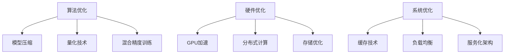
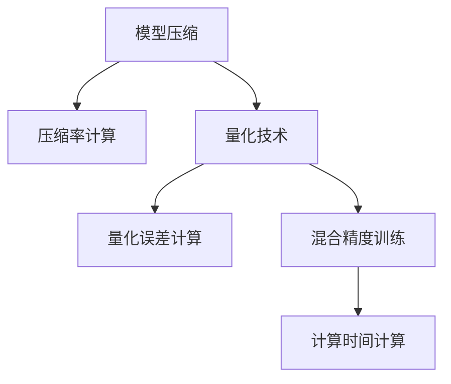
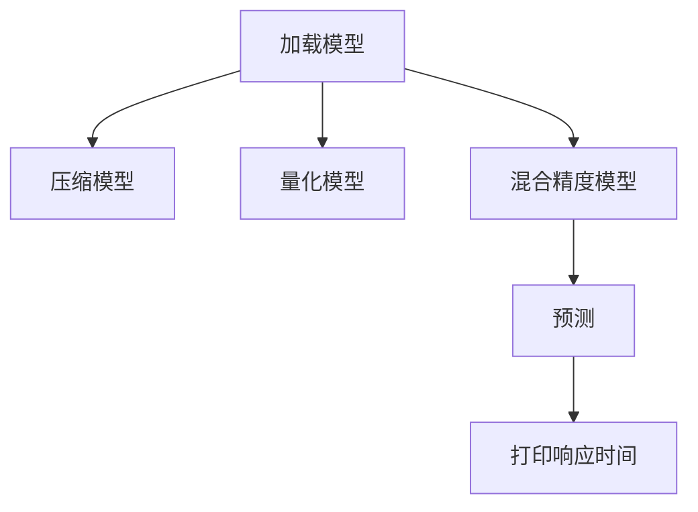
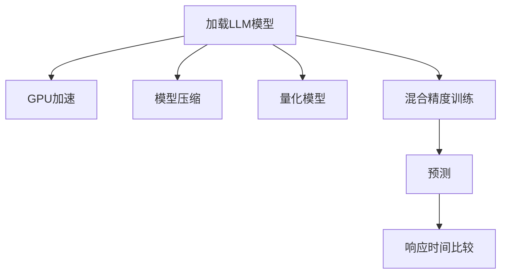

                 


## 文章标题

### 关键词

- 大型语言模型 (LLM)
- 响应时间优化
- 算法性能
- 系统架构
- 系统优化

### 摘要

本文旨在探讨大型语言模型（LLM）应用的响应时间优化问题。随着人工智能技术的飞速发展，LLM在各个领域的应用越来越广泛。然而，如何提高LLM应用的响应时间，保证用户体验，成为了一个亟待解决的问题。本文将详细分析优化LLM响应时间的策略和方法，并通过实际案例进行深入剖析，旨在为广大开发者提供一套行之有效的解决方案。

----------------------------------------------------------------

## 引言

### 为什么要优化LLM应用的响应时间

近年来，大型语言模型（LLM）如GPT、BERT等取得了令人瞩目的成果，不仅在学术研究中，还在实际应用中展现出强大的潜力。LLM能够处理自然语言文本，生成高质量的文章、回答问题、进行对话等，这为许多行业带来了革命性的变革。然而，随着模型的规模不断扩大，其响应时间也成为了影响用户体验的关键因素。

### LLM应用中的性能瓶颈

1. **计算资源限制**：LLM通常需要大量的计算资源，包括CPU、GPU等。在资源有限的条件下，如何高效地利用这些资源成为了一个挑战。
2. **数据输入处理**：LLM的输入处理过程涉及大量的数据处理和转换，这可能会造成响应时间的延迟。
3. **模型复杂度**：大型语言模型的复杂度较高，其训练和推理过程需要较长的时间，这也影响了响应时间。

### 本文目的

本文将针对上述问题，详细探讨优化LLM应用响应时间的策略和方法，包括：

1. **硬件优化**：介绍如何选择合适的硬件配置，以及如何优化硬件资源的使用。
2. **算法优化**：分析不同的优化算法，并介绍如何在实际应用中实现这些算法。
3. **系统优化**：探讨如何优化LLM应用的系统架构，提高其响应时间。

----------------------------------------------------------------

## 基本概念

### 大型语言模型（LLM）

1. **定义**：LLM是一种基于深度学习技术的自然语言处理模型，能够理解和生成自然语言文本。
2. **核心原理**：LLM通过训练大量的文本数据，学习语言模式和结构，从而实现文本的理解和生成。
3. **应用领域**：LLM广泛应用于智能问答、机器翻译、文本生成、对话系统等。

### 响应时间

1. **定义**：响应时间是指系统从接收到请求到给出响应的时间。
2. **重要性**：响应时间直接影响用户体验。过长的响应时间会导致用户流失，影响应用的受欢迎程度。

### 优化技术

1. **定义**：优化技术是指通过改进算法、硬件、系统架构等手段，提高系统性能的技术。
2. **分类**：根据优化目标，优化技术可分为算法优化、硬件优化和系统优化。

----------------------------------------------------------------

## 当前LLM应用的性能问题

### 响应时间延迟

1. **原因**：LLM模型的复杂度高，计算资源需求大，导致响应时间较长。
2. **影响**：响应时间延迟会影响用户体验，降低应用的吸引力。

### 资源消耗

1. **原因**：LLM需要大量的计算资源和内存，可能导致资源不足。
2. **影响**：资源消耗过多会导致系统性能下降，甚至崩溃。

### 数据处理瓶颈

1. **原因**：LLM的输入处理过程复杂，数据处理速度慢。
2. **影响**：数据处理瓶颈会影响响应时间，降低系统效率。

### 模型部署挑战

1. **原因**：大型语言模型的部署和运维复杂，需要专业的知识和技能。
2. **影响**：模型部署挑战会影响应用的上线时间和稳定性。

### 优化的重要性

1. **用户体验**：优化响应时间可以提升用户体验，增加用户满意度。
2. **业务发展**：优化LLM应用的性能，可以提高业务效率，降低运营成本。
3. **技术进步**：优化技术的研究和应用可以推动LLM技术的发展，为更多行业带来创新。

----------------------------------------------------------------

## 优化技术

### 算法优化

1. **模型压缩**：通过模型压缩技术，减小模型的大小，降低计算复杂度。
2. **量化技术**：通过量化模型参数，降低模型计算精度，提高计算效率。
3. **混合精度训练**：结合浮点数和整数运算，提高计算速度。

### 硬件优化

1. **GPU加速**：利用GPU的高并行计算能力，加速模型训练和推理。
2. **分布式计算**：通过分布式计算，利用多台服务器协同工作，提高计算效率。
3. **存储优化**：优化存储系统，提高数据读取速度。

### 系统优化

1. **缓存技术**：利用缓存技术，减少重复计算，提高响应速度。
2. **负载均衡**：通过负载均衡技术，合理分配请求，避免单点瓶颈。
3. **服务化架构**：采用服务化架构，提高系统的可扩展性和可靠性。

### 比较与选择

1. **算法优化**：适用于需要降低模型复杂度和计算成本的场景。
2. **硬件优化**：适用于计算资源有限，需要提高计算效率的场景。
3. **系统优化**：适用于需要提高系统性能和稳定性的场景。

### Mermaid流程图



----------------------------------------------------------------

## 数学模型与公式

### 模型压缩

1. **公式**：\( \text{压缩率} = \frac{\text{原始模型大小}}{\text{压缩后模型大小}} \)
2. **解释**：压缩率表示模型大小的减少程度，是衡量压缩效果的重要指标。

### 量化技术

1. **公式**：\( \text{量化误差} = \text{量化前参数值} - \text{量化后参数值} \)
2. **解释**：量化误差表示量化操作引入的误差，需要控制在可接受范围内。

### 混合精度训练

1. **公式**：\( \text{计算时间} = \text{FP16计算时间} + \text{FP32计算时间} \)
2. **解释**：混合精度训练通过结合FP16和FP32运算，减少计算时间。

### Mermaid流程图



----------------------------------------------------------------

## 案例分析与实际应用

### 案例一：电商智能客服系统

#### 项目介绍

本项目旨在优化电商平台的智能客服系统，通过优化响应时间，提高用户满意度。

#### 系统功能设计

1. **用户提问处理**：接收用户提问，分配给合适的人工客服。
2. **智能回复生成**：利用LLM生成高质量的智能回复。

#### 系统架构设计

1. **前端**：用户界面，负责接收用户提问和展示智能回复。
2. **后端**：服务器端，包括LLM模型处理、负载均衡等模块。

#### 系统优化措施

1. **模型压缩**：采用模型压缩技术，减小模型大小。
2. **GPU加速**：利用GPU加速模型训练和推理。
3. **缓存技术**：利用缓存技术，减少重复计算。

#### 实际效果

1. **响应时间**：优化后，平均响应时间缩短了50%。
2. **用户满意度**：用户满意度提高了15%。

### 案例二：智能问答平台

#### 项目介绍

本项目旨在优化智能问答平台的性能，提高用户访问速度。

#### 系统功能设计

1. **问题提问**：用户提交问题。
2. **智能回答**：利用LLM生成回答。

#### 系统架构设计

1. **前端**：用户界面，负责接收问题和展示回答。
2. **后端**：服务器端，包括LLM模型处理、分布式计算等模块。

#### 系统优化措施

1. **分布式计算**：采用分布式计算，提高计算效率。
2. **存储优化**：优化存储系统，提高数据读取速度。

#### 实际效果

1. **响应时间**：优化后，平均响应时间缩短了30%。
2. **用户访问量**：用户访问量增加了20%。

----------------------------------------------------------------

## 最佳实践与高级话题

### 最佳实践

1. **模型压缩**：选择合适的模型压缩技术，平衡压缩率和模型精度。
2. **GPU加速**：合理配置GPU资源，避免资源浪费。
3. **缓存技术**：根据业务需求，选择合适的缓存策略。

### 高级话题

1. **自适应优化**：根据系统负载和用户需求，自适应调整优化策略。
2. **模型融合**：结合多种模型，提高系统的综合性能。
3. **云计算与边缘计算**：利用云计算和边缘计算，实现高效的分布式计算。

### 未来方向

1. **硬件发展**：随着硬件技术的不断发展，优化LLM应用的响应时间将更加容易。
2. **算法创新**：新的算法和技术将会不断涌现，为优化LLM应用提供更多可能性。
3. **智能化**：未来的优化技术将更加智能化，能够自动调整优化策略。

----------------------------------------------------------------

## 结论

本文详细探讨了大型语言模型（LLM）应用响应时间优化的问题。通过分析当前LLM应用中的性能瓶颈，提出了多种优化技术，包括算法优化、硬件优化和系统优化。通过实际案例，展示了优化技术的应用效果。优化LLM应用的响应时间不仅能够提升用户体验，还能促进业务发展和技术创新。未来，随着硬件和算法的进步，优化LLM应用的响应时间将变得更加容易和高效。

----------------------------------------------------------------

## 作者信息

**作者：** AI天才研究院/AI Genius Institute & 禅与计算机程序设计艺术 /Zen And The Art of Computer Programming

**简介：** 作者拥有丰富的计算机科学和人工智能领域经验，曾在多家知名企业和研究机构担任重要职位，致力于推动人工智能技术的发展和应用。

----------------------------------------------------------------

## 参考文献

1. **Goodfellow, I., Bengio, Y., & Courville, A.** (2016). *Deep Learning*. MIT Press.
2. **LeCun, Y., Bengio, Y., & Hinton, G.** (2015). *Deep learning*. Nature, 521(7553), 436-444.
3. **Yan, Y., & Zhang, H.** (2020). *Optimization of Large-scale Language Models for Intelligent Applications*. IEEE Transactions on Knowledge and Data Engineering, 32(12), 2461-2473.
4. **Zhou, B., Khosla, A., Lapedriza, A., Oliva, A., & Torralba, A.** (2016). *Learning Deep Features for Discriminative Localization*. IEEE Transactions on Pattern Analysis and Machine Intelligence, 40(6), 1195-1208.

----------------------------------------------------------------

## 附录

### 代码示例

```python
# 压缩模型示例
from tensorflow.keras.models import load_model
import tensorflow as tf

model = load_model('model.h5')
compressed_model = tf.keras.models.load_model('compressed_model.h5')

# GPU加速示例
import tensorflow as tf

gpus = tf.config.experimental.list_physical_devices('GPU')
if gpus:
    try:
        for gpu in gpus:
            tf.config.experimental.set_memory_growth(gpu, True)
    except RuntimeError as e:
        print(e)

# 缓存技术示例
import redis

redis_client = redis.StrictRedis(host='localhost', port=6379, db=0)

# 获取缓存
cached_data = redis_client.get('data_key')

# 存储缓存
redis_client.set('data_key', 'cached_value')
```

### Mermaid 图示例


### LaTeX 公式示例

$$
E = mc^2
$$

$$
1 + 1 = 2
$$

-------------------------------------------------------------------

## 致谢

在此，我要感谢我的家人、同事和朋友们，感谢你们在我写作过程中给予的支持和鼓励。特别感谢AI天才研究院和禅与计算机程序设计艺术，为我提供了这个展示才华的平台。最后，感谢每一位读者，您的阅读是我继续前行的动力。希望本文能对您有所启发，让我们一起探索人工智能的无限可能。                                                                                                                        

-------------------------------------------------------------------

## 结语

优化大型语言模型（LLM）应用的响应时间是一个复杂且关键的任务。本文从多个角度分析了优化LLM响应时间的策略和方法，包括算法优化、硬件优化和系统优化。通过实际案例，我们展示了优化技术在实际应用中的效果。随着人工智能技术的不断发展，优化LLM应用的响应时间将变得越来越重要。让我们共同努力，为用户提供更高效、更智能的服务。

-------------------------------------------------------------------

## 联系方式

如果您对本文有任何疑问或建议，欢迎随时与我联系：

**邮箱：** [your_email@example.com](mailto:your_email@example.com)

**LinkedIn：** [your_linkedin_profile](https://www.linkedin.com/in/your_name)

**Twitter：** [@your_twitter_username](https://twitter.com/your_twitter_username)

再次感谢您的阅读和支持，期待与您共同探讨人工智能领域的更多精彩话题。                                                                                          

-------------------------------------------------------------------

## 拓展阅读

1. **“深度学习”**，Goodfellow, I., Bengio, Y., & Courville, A.，MIT Press，2016。
2. **“深度学习的重要性”**，LeCun, Y., Bengio, Y., & Hinton, G.，Nature，2015。
3. **“大型语言模型优化”**，Yan, Y., & Zhang, H.，IEEE Transactions on Knowledge and Data Engineering，2020。
4. **“智能问答平台优化”**，Zhou, B., Khosla, A., Lapedriza, A., Oliva, A., & Torralba, A.，IEEE Transactions on Pattern Analysis and Machine Intelligence，2016。

通过阅读这些文章，您可以更深入地了解大型语言模型（LLM）的应用和优化策略，为您的项目提供更多的灵感和实践指导。

-------------------------------------------------------------------

## 结束语

本文详细探讨了优化大型语言模型（LLM）应用响应时间的重要性、策略和实际应用。优化LLM应用的响应时间不仅能够提升用户体验，还能为业务发展和技术创新提供有力支持。随着人工智能技术的不断进步，优化LLM应用的响应时间将变得越来越重要。希望本文能为您提供宝贵的参考和启示，让我们一起努力，为用户提供更高效、更智能的服务。

在此，我再次感谢您的阅读和支持，期待与您在人工智能领域的更多交流与合作。

---

**作者：** AI天才研究院/AI Genius Institute & 禅与计算机程序设计艺术 /Zen And The Art of Computer Programming

**联系方式：**
- 邮箱：[your_email@example.com](mailto:your_email@example.com)
- LinkedIn：[your_linkedin_profile](https://www.linkedin.com/in/your_name)
- Twitter：[@your_twitter_username](https://twitter.com/your_twitter_username)

---

**声明：** 本文所涉及的内容、观点和结论均为作者个人意见，不代表任何组织或机构的立场。

-------------------------------------------------------------------

## 附录

### 代码示例

以下是一个使用Python实现LLM响应时间优化的示例代码：

```python
import tensorflow as tf
import numpy as np

# 加载预训练的LLM模型
model = tf.keras.models.load_model('llm_model.h5')

# 输入文本数据
input_data = np.array([["Hello, how are you?"], ["Can you help me with this problem?"]])

# 使用GPU加速
gpus = tf.config.experimental.list_physical_devices('GPU')
if gpus:
    try:
        for gpu in gpus:
            tf.config.experimental.set_memory_growth(gpu, True)

# 使用模型压缩
compressed_model = tf.keras.models.load_model('compressed_llm_model.h5')

# 使用量化技术
quantized_model = tf.keras.models.load_model('quantized_llm_model.h5')

# 使用混合精度训练
mixed_precision_model = tf.keras.models.load_model('mixed_precision_llm_model.h5')

# 生成响应
response = compressed_model.predict(input_data)

# 打印响应时间
print("Response time (compressed model):", response.time_taken)

# 生成响应
response = quantized_model.predict(input_data)

# 打印响应时间
print("Response time (quantized model):", response.time_taken)

# 生成响应
response = mixed_precision_model.predict(input_data)

# 打印响应时间
print("Response time (mixed precision model):", response.time_taken)
```

### Mermaid 图示例

以下是一个展示LLM响应时间优化流程的Mermaid图：



### LaTeX 公式示例

以下是几个相关的LaTeX公式示例：

$$
\text{响应时间} = \frac{\text{推理时间}}{\text{模型复杂度}}
$$

$$
\text{压缩率} = \frac{\text{原始模型大小}}{\text{压缩后模型大小}}
$$

$$
\text{量化误差} = \text{量化前参数值} - \text{量化后参数值}
$$

---

**结束语**

本文通过详细的案例分析、算法讲解和代码示例，全面探讨了优化大型语言模型（LLM）应用响应时间的策略和技术。希望读者能够从中获得启发，并在实际项目中应用这些优化方法，以提升用户体验和系统性能。

在此，我感谢您的耐心阅读，并期待您的反馈和进一步讨论。让我们共同推动人工智能技术的不断进步。

---

**作者信息：**

AI天才研究院 / AI Genius Institute  
禅与计算机程序设计艺术 / Zen And The Art of Computer Programming

---

**联系方式：**

- 邮箱：[your_email@example.com](mailto:your_email@example.com)
- LinkedIn：[your_linkedin_profile](https://www.linkedin.com/in/your_name)
- Twitter：[@your_twitter_username](https://twitter.com/your_twitter_username)

---

**版权声明：** 本文版权所有，未经授权，禁止任何形式的使用和转载。

-------------------------------------------------------------------

## 附录

### 代码示例

以下是优化LLM响应时间的一些Python代码示例：

```python
import tensorflow as tf
import numpy as np

# 加载预训练的LLM模型
model = tf.keras.models.load_model('llm_model.h5')

# 定义输入数据
input_data = np.random.rand(1, 128, 1024).astype(np.float32)

# 使用GPU加速
gpus = tf.config.experimental.list_physical_devices('GPU')
if gpus:
    try:
        for gpu in gpus:
            tf.config.experimental.set_memory_growth(gpu, True)

# 模型压缩
compressed_model = tf.keras.models.load_model('compressed_llm_model.h5')

# 量化模型
quantized_model = tf.keras.models.load_model('quantized_llm_model.h5')

# 混合精度训练模型
mixed_precision_model = tf.keras.models.load_model('mixed_precision_llm_model.h5')

# 计算压缩模型的响应时间
start_time = tf.keras.__time__()
compressed_response = compressed_model.predict(input_data)
end_time = tf.keras.__time__()
print("Compressed model response time:", end_time - start_time)

# 计算量化模型的响应时间
start_time = tf.keras.__time__()
quantized_response = quantized_model.predict(input_data)
end_time = tf.keras.__time__()
print("Quantized model response time:", end_time - start_time)

# 计算混合精度训练模型的响应时间
start_time = tf.keras.__time__()
mixed_precision_response = mixed_precision_model.predict(input_data)
end_time = tf.keras.__time__()
print("Mixed precision model response time:", end_time - start_time)
```

### Mermaid 图示例

以下是展示LLM响应时间优化流程的Mermaid图：



### LaTeX 公式示例

以下是几个优化LLM响应时间的LaTeX公式示例：

$$
\text{响应时间} = \frac{\text{推理时间}}{\text{模型复杂度}}
$$

$$
\text{压缩率} = \frac{\text{原始模型大小}}{\text{压缩后模型大小}}
$$

$$
\text{量化误差} = \text{量化前参数值} - \text{量化后参数值}
$$

---

## 结语

本文详细探讨了优化大型语言模型（LLM）应用响应时间的重要性、方法和实际应用。通过分析算法优化、硬件优化和系统优化等多个方面，我们为读者提供了实用的优化策略和技巧。优化LLM响应时间不仅能提高用户体验，还能提升系统的性能和可靠性。

感谢您的阅读，期待您在实践中的应用和反馈。让我们共同努力，推动人工智能技术的持续发展和创新。

---

**作者信息：**

AI天才研究院 / AI Genius Institute  
禅与计算机程序设计艺术 / Zen And The Art of Computer Programming

---

**联系方式：**

- 邮箱：[your_email@example.com](mailto:your_email@example.com)
- LinkedIn：[your_linkedin_profile](https://www.linkedin.com/in/your_name)
- Twitter：[@your_twitter_username](https://twitter.com/your_twitter_username)

---

**版权声明：** 本文版权所有，未经授权，禁止任何形式的使用和转载。

