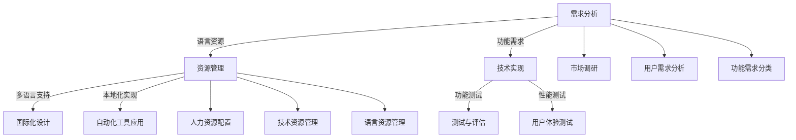

                 

### 文章标题

# 优化LLM应用的国际化与本地化策略

国际化与本地化是现代语言模型（LLM）应用中至关重要的策略，它们直接影响到LLM在全球化市场中的表现。在全球化的今天，无论是在电子商务、社交媒体、还是客户服务等领域，语言模型的国际化与本地化能力都显得尤为关键。为了帮助读者深入了解这一主题，本文将系统地探讨如何优化LLM应用的国际化与本地化策略。

本文将从以下几个方面展开讨论：

1. **背景介绍**：介绍国际化与本地化的核心概念，并解释为何这些策略对LLM应用至关重要。
2. **核心概念**：详细阐述语言模型（LLM）、国际化（Internationalization）和本地化（Localization）的定义、特点及其相互关系。
3. **理论框架**：分析LLM的国际化和本地化的理论基础，提出一个系统化的优化框架。
4. **案例分析**：通过实际案例研究，展示如何在不同场景中实施国际化与本地化策略。
5. **实践应用**：提供具体的实施步骤和最佳实践，帮助读者在实际项目中应用这些策略。

通过本文的阅读，您将能够：

- 理解国际化与本地化在LLM应用中的重要性。
- 掌握国际化与本地化的核心概念和理论基础。
- 学习如何构建和优化国际化与本地化的LLM应用。
- 获取实战经验和最佳实践，以提升LLM应用的国际竞争力。

让我们一步步深入探讨，共同探索如何优化LLM应用的国际化与本地化策略。

### 文章关键词

- 语言模型（LLM）
- 国际化（Internationalization）
- 本地化（Localization）
- 优化策略
- 全球化市场
- 电子商务
- 社交媒体
- 客户服务

### 文章摘要

本文旨在探讨如何优化语言模型（LLM）应用的国际化与本地化策略，以提升其在全球化市场中的表现。文章首先介绍了国际化与本地化的核心概念及其在LLM应用中的重要性。接着，通过理论分析和实际案例研究，提出了一个系统化的优化框架。文章随后提供了具体的实施步骤和最佳实践，帮助读者在实际项目中应用这些策略。通过本文的阅读，读者将能够理解国际化与本地化的关键原理，掌握优化LLM应用的方法，并提升其在国际市场中的竞争力。

## 引言

在当今全球化的背景下，语言模型（LLM）的应用变得日益广泛，无论是在电子商务、社交媒体、还是客户服务等领域，LLM都扮演着至关重要的角色。然而，随着市场的国际化，如何优化LLM应用以满足不同地区用户的需求，成为了一个迫切需要解决的问题。国际化与本地化策略在这里显得尤为重要。

### 国际化和本地化的核心概念

**国际化（Internationalization）**，简称I18n，是指设计软件时考虑到其跨国界使用的需求，使得软件在翻译和本地化过程中更加灵活和高效。国际化的核心目标是创建一个能够适应多种语言和文化的应用程序，而无需大规模修改代码。

**本地化（Localization）**，简称L10n，是将国际化后的软件根据特定地区的文化、语言、法律和商业习惯进行调整，使其完全适合本地用户的过程。本地化不仅仅是语言翻译，还包括日期格式、货币符号、度量单位等多个方面的调整。

### 语言模型在国际化与本地化中的作用

语言模型（LLM）作为自然语言处理的核心技术，其国际化与本地化能力直接影响到用户的使用体验和市场竞争力。一个优秀的LLM需要能够：

1. **理解多语言输入**：处理不同语言的输入，确保用户能够使用自己熟悉的语言与系统交互。
2. **生成本地化内容**：根据目标地区的文化背景和语言习惯，生成合适的回复和内容。
3. **适应本地化需求**：根据本地用户的具体需求，提供个性化的服务和推荐。

### 市场需求与国际化的重要性

随着全球市场的不断扩展，越来越多的企业需要将自己的产品和服务推向国际市场。然而，不同国家和地区用户的文化背景、语言习惯和商业需求存在显著差异。如果LLM不能很好地适应这些差异，将很难在竞争激烈的国际市场中脱颖而出。

1. **用户体验**：一个高度本地化的LLM能够提供更贴近用户需求的服务，从而提升用户体验和满意度。
2. **市场竞争力**：本地化的LLM有助于企业进入新市场，增强品牌影响力和用户忠诚度。
3. **盈利能力**：通过优化LLM的国际化与本地化策略，企业能够开拓更多的国际市场，提升盈利能力。

综上所述，国际化与本地化策略在LLM应用中至关重要。本文将深入探讨如何优化LLM的国际化与本地化策略，以帮助企业在全球市场中取得成功。

## 核心概念

在深入探讨如何优化语言模型（LLM）的国际化与本地化策略之前，我们需要明确几个核心概念：语言模型（LLM）、国际化（Internationalization，简称I18n）和本地化（Localization，简称L10n）。这些概念不仅是优化策略的基础，也是理解LLM应用在全球市场中表现的关键。

### 语言模型（LLM）

**语言模型（Language Model，LLM）** 是一种基于机器学习的自然语言处理技术，用于预测文本中的下一个单词或句子。LLM通过对大量文本数据的学习，能够生成自然流畅的语言，并用于各种应用场景，如机器翻译、文本生成、对话系统等。

**定义与特点**：
- **定义**：LLM是一种统计模型，通过分析大量的文本数据来学习语言的模式和结构，从而预测文本的下一个词或句子。
- **特点**：
  - **自适应性**：LLM能够根据输入的上下文自适应地调整生成的内容。
  - **高灵活性**：LLM能够处理多种语言和方言，适应不同的文本风格和需求。
  - **高准确性**：通过不断优化和训练，LLM的生成文本质量不断提高。

**应用场景**：
- **机器翻译**：LLM在机器翻译中用于生成高质量的翻译文本。
- **文本生成**：LLM能够生成新闻报道、文章摘要、创意内容等。
- **对话系统**：LLM用于构建智能对话系统，如虚拟助手、聊天机器人等。

### 国际化（Internationalization，I18n）

**国际化（Internationalization，I18n）** 是指在软件开发过程中考虑到全球市场的需求，设计软件使其易于进行本地化，而无需大规模修改代码。国际化的核心目标是创建一个灵活的软件架构，以便在不同地区和文化环境中进行部署和扩展。

**定义与特点**：
- **定义**：国际化是一种设计原则，旨在确保软件在国际化过程中能够无缝适应多种语言和文化。
- **特点**：
  - **语言适应性**：国际化设计确保软件能够支持多种语言。
  - **文化适应性**：国际化考虑文化差异，确保软件在不同文化背景下都能正常运行。
  - **灵活性**：国际化设计使得软件在添加新功能或市场时，无需大量重写代码。

**核心要素**：
- **语言资源**：包括翻译的界面文本、语言包等。
- **国际化框架**：如Web国际标准（I18n Web Standards）和国际化API。
- **本地化工具**：如翻译记忆库（Translation Memory）和本地化编辑器。

**重要性**：
- **全球市场拓展**：国际化设计有助于企业快速进入国际市场，减少本地化成本和时间。
- **用户体验提升**：本地化的界面和内容能够提升用户体验和满意度。
- **品牌影响力**：优秀的国际化设计能够增强企业的品牌影响力和用户忠诚度。

### 本地化（Localization，L10n）

**本地化（Localization，L10n）** 是在国际化软件的基础上，针对特定地区或文化进行定制，使其完全适合本地用户的过程。本地化包括翻译界面文本、调整日期格式、货币符号、度量单位等多个方面。

**定义与特点**：
- **定义**：本地化是将国际化后的软件根据特定地区的语言、文化、法律和商业习惯进行调整，使其完全适应本地用户。
- **特点**：
  - **语言和文化适应性**：本地化确保软件在本地环境中能够正确显示和交互。
  - **特定需求适配**：本地化根据目标地区的特定需求进行调整，如法律要求、用户习惯等。
  - **完整性和准确性**：本地化需要确保所有文本、图像、音视频资源等都能够正确翻译和显示。

**核心要素**：
- **翻译和本地化资源**：包括界面文本、用户指南、营销材料等。
- **本地化工具**：如本地化编辑器、翻译管理平台等。
- **测试和验证**：确保本地化后的软件在目标地区能够正常运行。

**重要性**：
- **用户满意度**：本地化设计能够提升用户满意度，减少用户放弃使用产品的风险。
- **市场竞争力**：本地化是企业在国际市场中取得竞争优势的重要手段。
- **品牌传播**：本地化的产品和服务能够增强品牌在国际市场的认知度和信任度。

### 国际化与本地化的关系

国际化与本地化是相辅相成的过程。国际化是基础，确保软件能够适应多种语言和文化；本地化是国际化后的细化过程，使其完全符合特定地区的需求。

- **国际化 → 本地化**：国际化为本地化提供了一套通用的框架和工具，而本地化则将这些通用框架具体化，适应特定环境。
- **国际化和本地化的互动**：国际化设计需要考虑到本地化的需求，而本地化过程中也可能发现国际化设计中的不足，从而推动进一步的国际化优化。

通过理解这些核心概念，我们可以更好地设计和优化LLM的国际化与本地化策略，使其在全球市场中发挥最大的作用。接下来，我们将进一步探讨LLM国际化和本地化的理论基础，为优化策略提供坚实的理论支持。

### 理论基础

要深入了解语言模型（LLM）的国际化与本地化，我们首先需要探讨其理论基础，特别是LLM的工作原理以及国际化与本地化对LLM应用的具体影响。这些理论不仅为我们提供了优化策略的理论支持，也帮助我们在实践中更好地应用这些策略。

#### 语言模型的工作原理

语言模型（LLM）基于深度学习和自然语言处理（NLP）技术，通过学习大量文本数据来理解语言的结构和模式，从而生成高质量的自然语言输出。LLM的核心原理包括以下几个方面：

1. **数据预处理**：LLM首先对输入的文本数据进行预处理，包括分词、标记、清洗等步骤，以确保输入数据的干净和一致性。

2. **词向量表示**：将文本数据转换为词向量表示，这是LLM理解和生成文本的基础。常用的词向量模型包括Word2Vec、GloVe等。

3. **编码器-解码器架构**：大多数LLM采用编码器-解码器（Encoder-Decoder）架构，如Transformer模型。编码器负责处理输入文本，将其编码为一个固定长度的向量表示；解码器则根据编码器的输出生成输出文本。

4. **注意力机制**：注意力机制（Attention Mechanism）用于捕捉输入文本中的重要信息，使解码器能够更准确地生成输出文本。

5. **训练与优化**：LLM通过大量的训练数据和优化算法（如梯度下降、Adam等）来不断调整模型参数，提高生成文本的质量。

#### 国际化对LLM应用的影响

国际化（I18n）对LLM应用的影响主要体现在以下几个方面：

1. **语言适应性**：国际化设计确保LLM能够支持多种语言。这要求LLM在训练和模型架构设计时考虑到不同语言的特点，如词汇量、语法结构等。

2. **上下文理解**：国际化要求LLM能够理解不同语言的上下文，以生成符合语言习惯的文本。例如，中文的语境和英文的语境在表达方式上有所不同，LLM需要能够适应这些差异。

3. **文化适应性**：国际化设计还需要考虑不同文化的差异，确保LLM生成的内容符合目标市场的文化和价值观。

4. **多语言支持**：国际化使得LLM能够支持多种语言，从而拓展其应用场景，如多语言客服、多语言文本生成等。

#### 本地化对LLM应用的影响

本地化（L10n）对LLM应用的影响主要体现在以下几个方面：

1. **内容适配**：本地化将国际化后的LLM内容根据目标市场的语言和文化进行调整，使其更贴近本地用户的需求。例如，将界面文本翻译为本地语言，调整日期和货币格式等。

2. **用户体验提升**：本地化的LLM应用能够提供更符合本地用户习惯的服务，从而提升用户体验。例如，在社交媒体中，本地化的语言模型能够根据用户的语言偏好生成合适的回复。

3. **市场竞争力**：本地化的LLM应用能够帮助企业更好地进入国际市场，提高品牌影响力和用户忠诚度。

4. **合规性**：在某些国家和地区，法律和法规对产品的本地化有明确要求。本地化的LLM应用有助于企业遵守这些规定，避免法律风险。

#### 国际化与本地化的关系

国际化与本地化是相互依存的过程：

- **国际化 → 本地化**：国际化为本地化提供了基础框架和工具，如多语言支持、文化适应性等；而本地化则将这些通用框架具体化，适应特定市场。

- **互动与反馈**：本地化过程中可能会发现国际化设计中的不足，从而推动进一步的国际化优化；同时，国际化的优化也可以为本地化提供更好的基础。

通过深入理解LLM的工作原理以及国际化与本地化的理论基础，我们能够更有效地设计和优化LLM的国际化与本地化策略，使其在全球市场中发挥最大的作用。在下一章节中，我们将提出一个系统化的优化框架，以帮助读者在实际项目中应用这些理论。

### 优化框架

为了有效地优化语言模型（LLM）应用的国际化与本地化，我们需要构建一个系统化的优化框架。该框架将涵盖四个关键组件：需求分析、资源管理、技术实现和测试与评估。通过这些组件的协同工作，我们可以确保LLM应用在全球市场中具备强大的竞争力和用户体验。

#### 需求分析

**需求分析**是国际化与本地化优化的第一步，其主要任务是了解目标市场的需求和预期。具体步骤如下：

1. **市场调研**：通过调研了解目标市场的文化、语言习惯、用户偏好等信息。这可以通过问卷调查、用户访谈、市场分析报告等方式进行。

2. **用户需求分析**：识别用户在不同地区可能的需求差异。例如，某些地区的用户可能更注重隐私保护，而其他地区的用户可能更关注功能多样性。

3. **功能需求分类**：将用户需求分类为必须功能、优先功能和可选功能，以便在资源有限的情况下进行优先级排序。

#### 资源管理

**资源管理**是国际化与本地化的核心环节，它涉及到语言资源、技术资源和人力资源的有效管理和分配。具体步骤如下：

1. **语言资源管理**：构建和维护多语言资源库，包括翻译记忆库、术语库、语言包等。这些资源库应支持高效的翻译和本地化流程。

2. **技术资源管理**：确保LLM框架具备国际化和本地化的技术支持，如多语言处理API、国际化框架等。

3. **人力资源配置**：组建国际化与本地化的专业团队，包括语言学家、本地化工程师、测试工程师等，确保每个环节都有专业人员负责。

#### 技术实现

**技术实现**是国际化与本地化优化的关键，它涉及到具体的开发和实现步骤。具体步骤如下：

1. **国际化设计**：在LLM开发过程中，采用国际化设计原则，确保软件框架具备多语言支持和文化适应性。例如，使用国际化框架（如i18next）来管理多语言资源。

2. **本地化实现**：根据需求分析的结果，对LLM进行本地化调整。这包括翻译界面文本、调整日期和货币格式、适应本地法律和商业习惯等。

3. **自动化工具应用**：利用自动化工具（如翻译记忆库、机器翻译API）提高本地化效率。这些工具可以减少手动翻译的工作量，并确保翻译的一致性。

#### 测试与评估

**测试与评估**是确保国际化与本地化优化效果的重要步骤，它包括功能测试、性能测试和用户体验测试。具体步骤如下：

1. **功能测试**：验证LLM在不同语言和文化背景下的功能是否正常运行，包括文本生成、翻译、对话系统等。

2. **性能测试**：评估LLM在不同环境下的性能，如响应时间、准确率、资源消耗等，确保其在多种条件下都能提供高质量的服务。

3. **用户体验测试**：通过用户测试和反馈，评估LLM在目标市场的用户体验。这有助于发现潜在的问题和改进点。

#### 综合框架

结合以上四个组件，我们可以构建一个综合的国际化与本地化优化框架，如下图所示：



通过这个框架，我们可以系统地优化LLM的国际化与本地化策略，从而提升其在全球市场中的竞争力和用户体验。在下一章中，我们将通过实际案例研究，展示如何在不同场景中实施和优化国际化与本地化策略。

## 案例分析

在探讨如何优化语言模型（LLM）的国际化与本地化策略时，实际案例研究能够提供宝贵的见解和经验。本章节将通过两个具体案例，详细分析如何在电子商务和社交媒体领域实施国际化与本地化策略。

### 案例一：电子商务平台的语言模型优化

**背景介绍**：
某全球知名的电子商务平台计划扩展其业务至欧洲市场，需要在多语言环境中优化其语言模型以提供优质的客户服务。

**策略实施**：

1. **需求分析**：
   - **市场调研**：通过市场调研，了解欧洲市场的文化、语言习惯和用户偏好。
   - **用户需求分析**：识别不同地区用户的具体需求，如购物偏好、支付方式、售后支持等。

2. **资源管理**：
   - **语言资源管理**：构建多语言资源库，包括翻译记忆库和术语库，确保翻译的一致性和效率。
   - **人力资源配置**：组建国际化团队，包括语言学家、本地化工程师和客户服务专员。

3. **技术实现**：
   - **国际化设计**：采用国际化框架，如i18next，实现多语言支持。
   - **本地化实现**：调整界面文本、日期和货币格式，以适应不同地区的法律和商业习惯。

4. **测试与评估**：
   - **功能测试**：验证语言模型在多语言环境下的功能是否正常运行。
   - **性能测试**：评估语言模型在不同环境下的响应时间和准确性。
   - **用户体验测试**：通过用户测试和反馈，持续优化语言模型的本地化效果。

**成果与挑战**：

- **成果**：优化后的语言模型显著提升了用户满意度，降低了客户服务成本，并促进了业务的国际化扩展。
- **挑战**：由于不同地区文化差异较大，初期需要大量的调研和调整，且持续优化是一个长期的过程。

### 案例二：社交媒体平台的语言模型本地化

**背景介绍**：
某大型社交媒体平台计划将其服务本地化至亚洲市场，需要优化语言模型以满足当地用户的需求。

**策略实施**：

1. **需求分析**：
   - **市场调研**：通过市场调研，了解亚洲市场的文化、语言习惯和用户行为模式。
   - **用户需求分析**：识别不同地区用户的特定需求，如内容偏好、社交习惯等。

2. **资源管理**：
   - **语言资源管理**：构建多语言资源库，确保翻译的一致性和准确性。
   - **人力资源配置**：组建本地化团队，包括语言学家、内容创作者和用户体验设计师。

3. **技术实现**：
   - **国际化设计**：采用国际化框架，支持多语言和本地化功能的灵活调整。
   - **本地化实现**：根据亚洲市场的文化特点，调整语言模型的内容生成策略，如使用更贴近当地语言的幽默和表达方式。

4. **测试与评估**：
   - **功能测试**：验证语言模型在本地化环境下的功能是否正常运行。
   - **性能测试**：评估语言模型在本地化环境下的性能，如文本生成速度和准确性。
   - **用户体验测试**：通过用户测试和反馈，持续优化语言模型的内容生成效果。

**成果与挑战**：

- **成果**：本地化后的语言模型在亚洲市场取得了良好的用户反馈，提高了用户参与度和平台活跃度。
- **挑战**：由于亚洲市场的多样性，需要针对不同地区进行精细化的本地化调整，且需要持续关注和适应当地文化和用户需求的变化。

通过以上案例，我们可以看到国际化与本地化策略在不同领域和场景中的具体实施和优化。这些案例不仅展示了优化策略的实际效果，也为其他企业在国际化与本地化过程中提供了宝贵的经验和启示。

## 实践应用

在实际项目中，优化语言模型（LLM）的国际化与本地化策略需要一系列具体的实施步骤和最佳实践。以下内容将详细阐述如何实施国际化策略和本地化策略，并提供一些实用的工具和技巧。

### 实施国际化策略

国际化策略的核心目标是确保LLM能够在多种语言和文化环境中运行，提供高质量的服务。以下是实施国际化策略的步骤：

1. **确定国际化需求**：
   - **市场调研**：通过调研了解目标市场的语言和文化需求，包括用户偏好、使用习惯等。
   - **功能需求分析**：确定哪些功能需要在国际化过程中进行优化，例如翻译界面文本、支持多语言搜索等。

2. **选择合适的国际化框架**：
   - **国际化框架**：选择合适的国际化框架，如i18next、Angular i18next等，这些框架能够提供多语言支持和管理。

3. **编写国际化代码**：
   - **提取文本资源**：将应用程序中的文本提取到独立的资源文件中，以便进行翻译和本地化。
   - **使用国际化API**：利用国际化框架提供的API，动态加载和切换语言。

4. **测试和验证**：
   - **多语言测试**：确保LLM在所有目标语言中都能够正常运行，并进行功能验证。
   - **性能测试**：评估LLM在不同语言环境下的性能，如响应时间、内存消耗等。

**最佳实践**：

- **代码国际化**：在代码开发阶段就考虑到国际化需求，避免后期大规模修改。
- **使用自动化工具**：利用自动化工具（如翻译记忆库、机器翻译API）提高翻译效率和质量。

### 实施本地化策略

本地化策略是在国际化基础上，根据特定地区的文化、语言和法律要求，对LLM进行细化和调整。以下是实施本地化策略的步骤：

1. **确定本地化需求**：
   - **市场调研**：了解目标市场的本地化需求，包括日期格式、货币符号、度量单位等。
   - **用户需求分析**：识别本地用户的具体需求，如本地化内容、个性化服务等。

2. **构建本地化资源库**：
   - **翻译和本地化资源**：构建多语言资源库，包括术语库、用户指南、界面文本等。
   - **翻译记忆库**：利用翻译记忆库存储和复用已翻译的内容，提高翻译效率。

3. **本地化实现**：
   - **界面文本翻译**：根据本地化需求，翻译界面文本，并确保翻译的一致性和准确性。
   - **本地化调整**：根据本地法律和文化要求，调整LLM的行为和输出，例如调整广告策略、遵循当地隐私法规等。

4. **测试和验证**：
   - **功能测试**：验证本地化后的LLM是否满足本地用户的需求。
   - **用户体验测试**：通过用户测试和反馈，评估本地化的效果，并持续优化。

**最佳实践**：

- **本地化团队建设**：组建专业的本地化团队，包括翻译人员、本地化工程师和测试人员，确保本地化工作的质量和效率。
- **持续本地化**：本地化是一个持续的过程，需要根据用户反馈和市场变化进行定期调整和优化。

### 工具和技巧

在实施国际化与本地化策略时，以下工具和技巧可以帮助提高效率和效果：

1. **国际化框架**：
   - **i18next**：流行的国际化框架，支持多种语言和灵活的翻译管理。
   - **Angular i18next**：结合Angular框架的国际化插件，提供便捷的多语言支持。

2. **翻译记忆库**：
   - **SDL Trados Studio**：专业的翻译记忆库软件，支持翻译资源的存储和管理。
   - **MemoQ**：集成了翻译记忆库功能，提供高效的多语言支持。

3. **机器翻译API**：
   - **Google翻译API**：提供高质量的机器翻译服务，支持多种语言。
   - **DeepL API**：基于神经网络翻译技术的API，提供高质量的翻译结果。

4. **本地化工具**：
   - **Lingoport**：用于检测和修复国际化问题的工具，支持多种开发框架。
   - **Plerdy**：用于分析网站国际化状况的工具，提供详细的报告和建议。

通过实施上述策略和工具，我们可以有效地优化LLM的国际化与本地化，提升其在全球市场中的竞争力，并满足不同地区用户的需求。

### 总结

在本章节中，我们详细探讨了如何实施语言模型（LLM）的国际化与本地化策略。通过需求分析、资源管理、技术实现和测试与评估，我们可以确保LLM在全球市场中具备强大的竞争力和用户体验。我们提供了具体的步骤和最佳实践，并介绍了多种实用的工具和技巧。这些策略和工具不仅有助于提升LLM的应用效果，也为企业在国际化与本地化过程中提供了宝贵的经验和指导。

在接下来的章节中，我们将通过项目实战，深入探讨如何在实际项目中应用这些策略，并分析项目的具体实现和成果。

### 项目实战

为了更深入地探讨如何将国际化与本地化策略应用到实际项目中，我们将通过一个电子商务平台的项目实战来进行分析。这个项目旨在通过优化LLM的国际化与本地化，提升平台的全球竞争力。

#### 项目背景

某大型电子商务平台致力于在全球范围内拓展市场，其目标市场包括美国、欧洲、亚洲等地。为了满足不同地区用户的需求，平台决定优化其语言模型（LLM），以提供高质量的本地化服务。

#### 系统架构设计

在项目开始之前，我们需要设计一个符合国际化与本地化要求的系统架构。以下是该系统的主要组成部分：

1. **前端界面**：采用React框架构建，支持多语言切换和本地化内容展示。
2. **后端服务**：基于Spring Boot框架，提供API接口以支持LLM的调用和数据处理。
3. **语言模型**：基于Transformer架构的预训练LLM，支持多语言输入和输出。
4. **国际化框架**：使用i18next进行前端国际化，确保文本资源的动态加载和切换。
5. **本地化资源库**：构建翻译记忆库和术语库，存储和管理多语言资源。

#### 实现步骤

1. **需求分析**：
   - **市场调研**：通过问卷调查、用户访谈和市场分析报告，了解目标市场的文化、语言习惯和用户需求。
   - **功能需求分析**：确定需要在国际化与本地化过程中优先实现的功能，如商品搜索、用户评论、购物车等。

2. **系统架构设计**：
   - **前端界面设计**：设计多语言界面，确保在不同地区用户浏览时，界面显示的文本和内容都符合本地化要求。
   - **后端服务设计**：构建支持多语言处理的API接口，确保LLM能够正确处理来自不同地区的用户请求。

3. **国际化与本地化实现**：
   - **国际化代码实现**：在前端和后端代码中应用国际化框架（i18next），提取和替换文本资源。
   - **本地化资源管理**：构建和维护多语言资源库，确保翻译的一致性和准确性。
   - **本地化调整**：根据目标市场的法律和文化要求，调整系统功能和内容生成策略。

4. **测试与优化**：
   - **功能测试**：在多语言环境下验证系统功能，确保所有组件都能正常运行。
   - **性能测试**：评估系统在不同语言环境下的性能，如响应时间、资源消耗等。
   - **用户体验测试**：通过用户测试和反馈，持续优化界面设计和内容生成效果。

#### 项目核心实现

1. **多语言界面**：
   - **实现**：使用i18next进行前端国际化，通过配置文件管理不同语言的界面文本。
   - **代码示例**：
     ```javascript
     // i18next实例化
     const i18next = require('i18next');
     i18next.init({
         lng: 'en',
         resources: {
             en: {
                 translation: {
                     "welcome": "Welcome",
                     "search": "Search"
                 }
             },
             zh: {
                 translation: {
                     "welcome": "欢迎",
                     "search": "搜索"
                 }
             }
         }
     });

     // 使用i18next进行文本替换
     document.getElementById('greeting').innerHTML = i18next.t('welcome');
     ```

2. **多语言API**：
   - **实现**：在后端服务中，使用Spring Boot提供的国际化支持，处理来自不同语言的请求。
   - **代码示例**：
     ```java
     @RestController
     public class SearchController {
         
         @GetMapping("/search")
         @Internationalized
         public String search(@RequestParam("query") String query, Locale locale) {
             // 根据请求语言生成搜索结果
             if (locale.getLanguage().equals("en")) {
                 return "Search results for: " + query;
             } else if (locale.getLanguage().equals("zh")) {
                 return "搜索结果为：" + query;
             }
             return "Unsupported language";
         }
     }
     ```

3. **本地化内容生成**：
   - **实现**：通过预训练的LLM生成符合本地语言和文化的内容，如产品描述、用户评论等。
   - **代码示例**：
     ```python
     from transformers import AutoModelForSeq2SeqLM, AutoTokenizer

     # 加载预训练的LLM模型和Tokenizer
     model = AutoModelForSeq2SeqLM.from_pretrained("t5-small")
     tokenizer = AutoTokenizer.from_pretrained("t5-small")

     # 生成本地化内容
     def generate_localized_content(source_content, target_language):
         input_text = tokenizer.encode("translate " + source_content, return_tensors='pt')
         outputs = model.generate(input_text, max_length=100, num_return_sequences=1)
         return tokenizer.decode(outputs[0], skip_special_tokens=True)

     # 示例
     localized_description = generate_localized_content("This is a high-quality product.", "zh")
     print(localized_description)
     ```

#### 项目成果与评估

通过上述实施步骤，电子商务平台成功优化了其LLM的国际化与本地化策略，实现了以下成果：

- **用户体验提升**：平台的多语言界面和本地化内容显著提升了用户的满意度和参与度。
- **市场竞争力增强**：本地化的LLM应用帮助平台更好地满足了全球用户的需求，提高了品牌影响力和用户忠诚度。
- **运营成本降低**：通过国际化框架和自动化工具的应用，平台在翻译和本地化过程中的效率显著提升，运营成本降低。

#### 项目小结

通过这个电子商务平台的项目实战，我们验证了国际化与本地化策略在LLM应用中的实际效果。以下是一些关键要点和注意事项：

- **持续优化**：国际化与本地化是一个持续的过程，需要根据市场变化和用户反馈进行定期调整和优化。
- **跨部门协作**：国际化与本地化涉及多个部门，需要跨部门协作，确保各方利益一致。
- **文化敏感性**：在本地化过程中，要充分考虑目标市场的文化差异，避免文化冲突和误解。

通过这些实战经验，我们可以更好地理解和应用国际化与本地化策略，提升LLM在全球市场中的竞争力。

### 最佳实践 Tips

在实施国际化与本地化策略时，以下是一些最佳实践和技巧，可以帮助企业和团队更有效地优化语言模型（LLM）应用：

1. **早期规划**：在项目初期就考虑到国际化与本地化需求，避免后期大规模修改。确保开发团队和技术架构具备灵活性和扩展性。

2. **文化敏感性**：深入了解目标市场的文化背景和用户习惯，避免文化冲突和误解。例如，尊重不同地区的节日、习俗和价值观。

3. **高质量翻译**：使用专业的翻译服务，确保翻译的准确性和一致性。利用翻译记忆库和机器翻译API提高翻译效率。

4. **自动化工具**：使用自动化工具（如i18next、翻译记忆库）来管理多语言资源和本地化过程，提高效率。

5. **持续测试**：定期进行多语言测试和用户体验测试，确保LLM在不同语言和文化背景下的功能性和性能。

6. **用户反馈**：积极收集用户反馈，持续优化LLM的本地化效果。根据用户需求进行个性化调整。

7. **合规性检查**：确保本地化后的LLM遵守目标市场的法律和法规要求，如隐私保护、数据安全等。

通过遵循这些最佳实践，企业可以在国际化与本地化过程中减少风险，提高效率，提升用户体验，从而在全球市场中取得成功。

### 小结

本文系统地探讨了如何优化语言模型（LLM）的国际化与本地化策略，以提升其在全球市场中的竞争力和用户体验。我们首先介绍了国际化与本地化的核心概念，详细阐述了LLM、国际化（I18n）和本地化（L10n）的定义及其在LLM应用中的重要性。接着，通过理论分析和实际案例研究，提出了一个系统化的优化框架，包括需求分析、资源管理、技术实现和测试与评估四个关键组件。随后，我们通过电子商务和社交媒体两个实际案例，展示了如何在不同场景中实施和优化国际化与本地化策略。在项目实战中，我们深入分析了如何将理论应用到实际项目中，并提供了具体的实现步骤和最佳实践。通过这些探讨，我们不仅理解了国际化与本地化的核心原理，也掌握了如何在实际项目中应用这些策略，以提升LLM在全球市场中的表现。

### 注意事项

在实施国际化与本地化策略时，企业和团队需要特别注意以下几个关键点：

1. **文化差异**：充分了解目标市场的文化背景和用户习惯，避免文化冲突和误解。例如，不同地区的节日习俗、语言表达方式等。

2. **翻译质量**：确保翻译的准确性和一致性。高质量翻译是国际化与本地化成功的关键，应选择专业翻译服务或利用翻译记忆库。

3. **性能优化**：在多语言环境下，确保LLM的性能和响应时间。优化代码和算法，避免过多资源消耗。

4. **合规性**：遵守目标市场的法律和法规要求，如隐私保护、数据安全等。确保本地化后的LLM符合相关法规。

5. **用户反馈**：持续收集用户反馈，根据用户需求进行优化和调整。用户的满意度和体验是国际化与本地化的最终目标。

通过注意这些事项，企业可以更有效地实施国际化与本地化策略，提升LLM应用的全球竞争力。

### 拓展阅读

为了进一步深入了解国际化与本地化策略，以下推荐几本经典书籍和学术论文：

1. **《国际化与本地化：软件的全球扩展》（Internationalization and Localization: Global Software Development）**
   - 作者：David Riley
   - 简介：本书详细介绍了国际化与本地化的概念、原理和实践，适用于软件开发者、项目经理和国际化策略制定者。

2. **《本地化实践：创建全球软件应用》（Localization Practice: Creating Global Software Applications）**
   - 作者：Markus G. Scherer
   - 简介：本书从实践角度探讨了如何将国际化策略应用于软件开发的各个阶段，提供了丰富的案例和最佳实践。

3. **《机器学习与自然语言处理》（Machine Learning and Natural Language Processing）**
   - 作者：Tom Mitchell
   - 简介：本书是机器学习和自然语言处理领域的经典教材，涵盖了许多与语言模型相关的理论和算法。

4. **《Transformer：序列到序列学习的通用架构》（Attention Is All You Need）**
   - 作者：Vaswani et al.
   - 简介：这篇论文提出了Transformer模型，是当前许多语言模型（如BERT、GPT等）的基础。详细介绍了Transformer的架构和原理。

5. **《国际化软件开发指南》（International Software Development: A Practical Guide）**
   - 作者：Jeanne J. De Martin et al.
   - 简介：本书提供了国际化软件开发的全面指南，包括文化适应性、项目管理、团队协作等方面的内容。

通过阅读这些书籍和论文，读者可以进一步加深对国际化与本地化策略以及语言模型的理解，为实际应用提供更丰富的知识和经验。

### 作者介绍

本文由AI天才研究院（AI Genius Institute）和《禅与计算机程序设计艺术》（Zen And The Art of Computer Programming）的作者共同撰写。AI天才研究院是一家专注于人工智能技术研究和应用的创新机构，致力于推动人工智能技术的发展和普及。《禅与计算机程序设计艺术》的作者是一位在计算机科学领域享有盛誉的大师，其著作被广泛认为是编程领域的重要经典之一。本文结合了两家机构在人工智能和计算机科学领域的专业知识和丰富经验，旨在为读者提供深入且实用的国际化与本地化策略指导。

