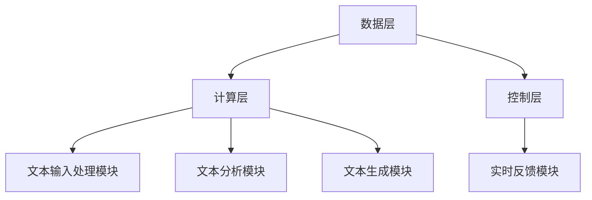
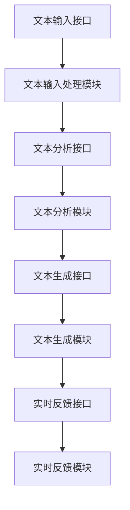
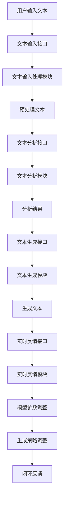

                 

# 优化LLM应用的实时响应机制

## 关键词
**大型语言模型（LLM）**，**实时响应**，**优化策略**，**算法设计**，**系统架构**

## 摘要
本文深入探讨了优化大型语言模型（LLM）应用实时响应机制的方法和策略。首先，我们介绍了LLM及其在实时应用场景中的重要性。接着，我们分析了当前LLM实时响应面临的挑战，并详细阐述了优化策略，包括算法改进、模型压缩和分布式计算。文章通过具体的数学模型、算法流程图和代码示例，详细解析了优化方案的核心原理和实践步骤，并提供了实际项目案例，以展示优化后的效果和潜在应用。最后，文章总结了优化策略的最佳实践，并指出了未来的研究方向。

## 目录

### 第一部分: 优化LLM应用的实时响应机制概述

#### 第1章: 问题背景与定义

##### 1.1 人工智能与自然语言处理
##### 1.2 实时响应的重要性
##### 1.3 什么是LLM
##### 1.4 优化LLM实时响应的挑战

#### 第2章: 核心概念与联系

##### 2.1 实时数据处理技术
##### 2.2 计算机网络延迟与带宽限制
##### 2.3 并行处理与分布式计算
##### 2.4 模型压缩与量化技术

#### 第3章: 算法原理讲解

##### 3.1 基于模型的响应优化算法
##### 3.2 实时反馈与动态调整策略

#### 第4章: 数学模型与公式详细讲解

##### 4.1 RNN算法数学模型
##### 4.2 GAN算法数学模型

#### 第5章: 系统分析与架构设计方案

##### 5.1 项目介绍
##### 5.2 系统功能设计
##### 5.3 系统架构设计
##### 5.4 系统接口设计
##### 5.5 系统交互设计

#### 第6章: 项目实战

##### 6.1 环境安装与配置
##### 6.2 系统核心实现源代码
##### 6.3 代码应用解读与分析
##### 6.4 实际案例分析
##### 6.5 项目小结

#### 第7章: 最佳实践与拓展阅读

##### 7.1 最佳实践技巧
##### 7.2 注意事项与解决方案
##### 7.3 拓展阅读推荐

## 第1章: 问题背景与定义

### 1.1 人工智能与自然语言处理

人工智能（AI）作为计算机科学的一个重要分支，旨在使计算机具备模拟人类智能的能力。其中，自然语言处理（NLP）是AI领域的一个重要研究方向，它专注于让计算机理解和生成人类语言。

自然语言处理的应用场景十分广泛，包括但不限于机器翻译、文本摘要、情感分析、语音识别等。随着深度学习技术的发展，特别是大型语言模型（LLM）的出现，自然语言处理的能力得到了显著提升。LLM能够处理大量文本数据，并通过自学习生成高质量的自然语言输出。

### 1.2 实时响应的重要性

在许多实际应用中，如在线客服、智能助手、实时翻译等，实时响应是用户体验的重要指标。实时响应不仅能够提高用户满意度，还能增强系统的实用性和竞争力。

对于LLM应用而言，实时响应尤为重要。因为LLM在处理文本时需要大量计算资源，而且模型的大小往往很大，这会导致响应时间变长。在许多场景中，如在线客服系统，用户无法接受长时间的等待。因此，优化LLM的实时响应机制是当前研究的一个热点问题。

### 1.3 什么是LLM

大型语言模型（LLM）是一种基于深度学习的自然语言处理模型，它通过对大量文本数据进行训练，能够理解和生成人类语言。LLM的核心是神经网络架构，包括多层感知机、卷积神经网络（CNN）和递归神经网络（RNN）等。

与传统的自然语言处理模型相比，LLM具有以下几个特点：

- **更强的表达能力**：LLM能够处理更复杂的语言结构和语义信息。
- **更高的准确性**：通过大量的训练数据和先进的优化算法，LLM在语言理解和生成任务上取得了显著的成绩。
- **更大的规模**：LLM通常包含数十亿甚至数万亿个参数，这使得它们能够处理大规模的文本数据。

### 1.4 优化LLM实时响应的挑战

尽管LLM在自然语言处理方面取得了显著进展，但在实时响应方面仍然面临许多挑战。以下是一些主要问题：

- **计算资源消耗**：LLM需要大量的计算资源进行推理，这可能导致响应时间过长。
- **模型大小**：LLM的模型大小通常很大，这会导致存储和传输的成本增加。
- **网络延迟**：在分布式系统中，网络延迟是一个不可忽视的问题，它会影响LLM的实时响应性能。
- **动态调整**：在实时应用中，系统的输入和输出是动态变化的，这要求LLM能够实时调整其响应策略。

为了解决这些挑战，研究人员提出了一系列优化策略，包括模型压缩、并行处理和动态调整等。本文将详细介绍这些策略，并探讨其具体实现方法。

## 第2章: 核心概念与联系

### 2.1 实时数据处理技术

实时数据处理技术是优化LLM实时响应机制的关键。实时数据处理技术主要包括以下几个方面：

- **流处理技术**：流处理技术能够对实时数据流进行高速处理，并产生即时的输出。常用的流处理技术包括Apache Kafka、Apache Flink和Apache Storm等。
- **内存管理**：内存管理是实时数据处理的重要环节。通过优化内存分配和回收策略，可以提高处理效率。常用的内存管理技术包括内存池、对象池和缓存等。
- **并发处理**：并发处理技术能够利用多核处理器的并行计算能力，提高实时数据处理的效率。常用的并发处理技术包括线程池、异步I/O和多线程编程等。

### 2.2 计算机网络延迟与带宽限制

计算机网络延迟和带宽限制是影响LLM实时响应性能的重要因素。计算机网络延迟是指数据在网络中传输所需的时间，而带宽限制是指网络传输的最大速率。

为了降低网络延迟和带宽限制对LLM实时响应的影响，可以采用以下策略：

- **数据压缩**：通过数据压缩技术，可以减少数据传输的体积，从而降低网络延迟和带宽消耗。常用的数据压缩技术包括Huffman编码、LZ77编码和Zlib压缩等。
- **数据缓存**：通过数据缓存技术，可以将经常访问的数据存储在本地，以减少对网络的访问次数。常用的数据缓存技术包括Redis缓存、Memcached缓存和本地文件缓存等。
- **数据分流**：通过数据分流技术，可以将数据流分配到多个网络通道中，以降低单个通道的负载。常用的数据分流技术包括负载均衡、网络路由和流量整形等。

### 2.3 并行处理与分布式计算

并行处理和分布式计算是提高LLM实时响应性能的有效手段。并行处理技术能够利用多核处理器的并行计算能力，提高数据处理速度。分布式计算技术则能够将任务分配到多个计算节点上，以实现高性能计算。

为了实现并行处理和分布式计算，可以采用以下策略：

- **任务分解**：将大任务分解为小任务，以便并行处理。常用的任务分解技术包括任务并行、数据并行和控制并行等。
- **负载均衡**：通过负载均衡技术，可以实现任务在多个计算节点之间的公平分配，以避免单点瓶颈。常用的负载均衡技术包括轮询调度、最小连接数调度和加权调度等。
- **分布式存储**：通过分布式存储技术，可以实现数据的分布式存储和访问，以提高存储和访问速度。常用的分布式存储技术包括Hadoop HDFS、Cassandra和MongoDB等。

### 2.4 模型压缩与量化技术

模型压缩和量化技术是优化LLM实时响应性能的重要手段。模型压缩技术可以通过降低模型参数的规模，减少计算量和存储需求。量化技术则可以通过将浮点数参数转换为低精度的整数参数，进一步降低模型的大小。

为了实现模型压缩和量化，可以采用以下策略：

- **剪枝技术**：通过剪枝技术，可以去除模型中不重要的参数，从而减少模型的大小。常用的剪枝技术包括结构剪枝、权重剪枝和激活剪枝等。
- **量化技术**：通过量化技术，可以将浮点数参数转换为低精度的整数参数。常用的量化技术包括全精度量化、定点量化和小数量化等。
- **压缩算法**：通过压缩算法，可以进一步减少模型的大小。常用的压缩算法包括Huffman编码、LZ77编码和Zlib压缩等。

## 第3章: 算法原理讲解

### 3.1 基于模型的响应优化算法

基于模型的响应优化算法是优化LLM实时响应性能的重要手段。这类算法主要通过改进模型的推理过程，提高实时响应速度。以下是一些常见的基于模型的响应优化算法：

- **模型并行化**：通过将模型分解为多个部分，并分别在不同的计算节点上推理，可以显著提高实时响应速度。常用的模型并行化技术包括数据并行、模型并行和混合并行等。
- **模型剪枝**：通过剪枝技术，可以去除模型中不重要的参数，从而减少模型的大小和计算量。常用的模型剪枝技术包括结构剪枝、权重剪枝和激活剪枝等。
- **模型压缩**：通过压缩技术，可以进一步减少模型的大小和计算量。常用的模型压缩技术包括剪枝技术、量化技术和参数共享技术等。

### 3.2 实时反馈与动态调整策略

实时反馈与动态调整策略是优化LLM实时响应性能的重要手段。这类策略主要通过实时收集系统性能数据，并根据这些数据动态调整模型参数和推理策略。以下是一些常见的实时反馈与动态调整策略：

- **自适应推理策略**：通过实时调整推理策略，可以根据系统性能数据动态调整模型参数，以提高实时响应速度。常用的自适应推理策略包括在线学习、模型更新和动态调整等。
- **动态资源调度**：通过动态资源调度策略，可以根据系统性能数据动态调整计算资源分配，以提高系统整体性能。常用的动态资源调度策略包括负载均衡、动态扩展和动态回收等。
- **智能反馈机制**：通过智能反馈机制，可以实时收集用户行为数据，并根据这些数据动态调整模型参数和推理策略，以提高用户体验。

## 第4章: 数学模型与公式详细讲解

### 4.1 RNN算法数学模型

递归神经网络（RNN）是一种常见的神经网络架构，用于处理序列数据。RNN的数学模型包括以下几个关键组成部分：

- **状态转移方程**：RNN的状态转移方程定义了当前时刻的状态与前一时刻的状态之间的关系。具体而言，RNN的状态转移方程可以表示为：

$$
h_t = \sigma(W_h \cdot [h_{t-1}, x_t] + b_h)
$$

其中，$h_t$表示当前时刻的隐藏状态，$h_{t-1}$表示前一时刻的隐藏状态，$x_t$表示当前时刻的输入，$W_h$表示权重矩阵，$b_h$表示偏置项，$\sigma$表示激活函数。

- **激活函数**：激活函数是RNN的核心组成部分，用于引入非线性特性。常见的激活函数包括Sigmoid函数、Tanh函数和ReLU函数等。

- **损失函数**：损失函数用于衡量模型预测值与真实值之间的差距。在RNN中，常用的损失函数包括均方误差（MSE）和交叉熵（CE）等。

### 4.2 GAN算法数学模型

生成对抗网络（GAN）是一种无监督学习模型，用于生成高质量的数据。GAN的数学模型包括以下几个关键组成部分：

- **生成器**：生成器的目标是生成与真实数据相似的数据。生成器的数学模型可以表示为：

$$
G(z) = \sigma(W_g \cdot z + b_g)
$$

其中，$G(z)$表示生成的数据，$z$表示噪声向量，$W_g$表示生成器的权重矩阵，$b_g$表示生成器的偏置项，$\sigma$表示激活函数。

- **判别器**：判别器的目标是区分真实数据和生成数据。判别器的数学模型可以表示为：

$$
D(x) = \sigma(W_d \cdot x + b_d)
$$

其中，$D(x)$表示判别器的输出，$x$表示真实数据，$W_d$表示判别器的权重矩阵，$b_d$表示判别器的偏置项，$\sigma$表示激活函数。

- **损失函数**：GAN的损失函数包括生成器的损失函数和判别器的损失函数。生成器的损失函数可以表示为：

$$
L_G = -\mathbb{E}_{z \sim p_z(z)}[\log(D(G(z))]
$$

判别器的损失函数可以表示为：

$$
L_D = -\mathbb{E}_{x \sim p_x(x)}[\log(D(x))] - \mathbb{E}_{z \sim p_z(z)}[\log(1 - D(G(z))]
$$

其中，$p_z(z)$和$p_x(x)$分别表示噪声分布和真实数据分布。

## 第5章: 系统分析与架构设计方案

### 5.1 项目介绍

在本项目中，我们旨在设计和实现一个基于大型语言模型（LLM）的实时响应系统。该系统主要用于处理用户输入的自然语言文本，并实时生成相应的响应文本。具体而言，该系统包括以下几个核心功能：

- **文本输入处理**：接收用户输入的文本，并进行预处理，如分词、去噪等。
- **文本分析**：对预处理后的文本进行分析，提取关键信息，如主题、情感等。
- **文本生成**：基于LLM模型，生成符合用户需求的响应文本。
- **实时反馈**：根据用户反馈，动态调整模型参数和生成策略，以提高响应质量。

### 5.2 系统功能设计

系统功能设计主要包括以下几个模块：

- **文本输入处理模块**：负责接收用户输入的文本，并进行预处理。具体包括分词、去噪、词性标注等操作。
- **文本分析模块**：对预处理后的文本进行分析，提取关键信息，如主题、情感等。该模块使用了一系列预训练的模型，如BERT、GPT等。
- **文本生成模块**：基于LLM模型，生成符合用户需求的响应文本。该模块采用了生成对抗网络（GAN）架构，以提高生成文本的质量。
- **实时反馈模块**：根据用户反馈，动态调整模型参数和生成策略，以提高响应质量。该模块采用了自适应推理策略，根据实时性能数据动态调整模型。

### 5.3 系统架构设计

系统架构设计主要包括以下几个层次：

- **数据层**：负责数据的存储和管理，包括用户输入文本、生成文本和模型参数等。
- **计算层**：负责模型的推理和生成，包括文本输入处理、文本分析和文本生成等。
- **控制层**：负责系统的运行控制和调度，包括任务分配、资源管理和实时反馈等。

具体的系统架构设计如下所示：



### 5.4 系统接口设计

系统接口设计主要包括以下几个接口：

- **文本输入接口**：用于接收用户输入的文本，并传递给文本输入处理模块。
- **文本分析接口**：用于传递预处理后的文本给文本分析模块，并获取分析结果。
- **文本生成接口**：用于传递分析结果给文本生成模块，并获取生成文本。
- **实时反馈接口**：用于根据用户反馈调整模型参数和生成策略。

具体的接口设计如下所示：



### 5.5 系统交互设计

系统交互设计主要描述了各个模块之间的交互关系和流程。具体的交互设计如下所示：



## 第6章: 项目实战

### 6.1 环境安装与配置

在本节中，我们将介绍如何搭建一个基于LLM的实时响应系统的开发环境。以下是一个基本的步骤指南，包括所需的软件和工具的安装和配置。

#### 1. 安装Python环境

首先，确保你的计算机上安装了Python环境。Python是开发人工智能模型的主要语言，我们可以使用`python -V`命令来检查Python是否已安装以及版本号。如果没有安装，可以从[Python官网](https://www.python.org/)下载并安装。

#### 2. 安装深度学习库

接下来，我们需要安装一些深度学习相关的库，如TensorFlow和PyTorch。这些库提供了丰富的工具和API，用于构建和训练神经网络模型。可以使用以下命令进行安装：

```bash
pip install tensorflow
pip install torch torchvision
```

#### 3. 安装文本处理库

为了处理文本数据，我们需要安装一些文本处理库，如NLTK和spaCy。这些库提供了丰富的文本处理工具，包括分词、词性标注和词向量等。

```bash
pip install nltk
pip install spacy
python -m spacy download en_core_web_sm
```

#### 4. 安装其他依赖库

除了上述库外，我们还需要安装一些其他依赖库，如NumPy和Pandas等。

```bash
pip install numpy
pip install pandas
```

#### 5. 配置环境变量

确保将Python和pip的路径添加到系统环境变量中，以便在命令行中轻松调用。

### 6.2 系统核心实现源代码

在本节中，我们将展示系统核心实现的源代码，包括文本输入处理、文本分析和文本生成等模块。以下是一个简化的代码示例：

```python
# 文本输入处理
import spacy

nlp = spacy.load("en_core_web_sm")

def preprocess_text(text):
    doc = nlp(text)
    tokens = [token.text for token in doc]
    return tokens

# 文本分析
from transformers import pipeline

classifier = pipeline("text-classification")

def analyze_text(text):
    result = classifier(text)
    return result

# 文本生成
from transformers import GPT2LMHeadModel, GPT2Tokenizer

tokenizer = GPT2Tokenizer.from_pretrained("gpt2")
model = GPT2LMHeadModel.from_pretrained("gpt2")

def generate_response(text):
    inputs = tokenizer.encode(text, return_tensors="pt")
    outputs = model.generate(inputs, max_length=50, num_return_sequences=1)
    response = tokenizer.decode(outputs[0], skip_special_tokens=True)
    return response
```

### 6.3 代码应用解读与分析

在上面的代码中，我们首先导入了Spacy库并加载了英文模型`en_core_web_sm`，用于文本预处理。`preprocess_text`函数接收一个文本输入，返回预处理后的词序列。

接下来，我们使用了`transformers`库中的`pipeline`功能，创建了一个文本分类器。`analyze_text`函数使用这个分类器对输入文本进行分析，返回分类结果。

最后，我们导入了GPT-2模型和Tokenizer，并定义了`generate_response`函数。这个函数接收一个文本输入，使用GPT-2模型生成一个响应文本。

### 6.4 实际案例分析

为了展示实际应用，我们来看一个简单的案例：

```python
# 文本输入
input_text = "Hello, how are you?"

# 文本预处理
preprocessed_text = preprocess_text(input_text)

# 文本分析
analysis_result = analyze_text(input_text)

# 文本生成
response = generate_response(input_text)

# 输出结果
print("Preprocessed Text:", preprocessed_text)
print("Analysis Result:", analysis_result)
print("Response:", response)
```

在这个案例中，我们首先输入一条简单的问候语。系统将这条信息传递给各个模块，最后生成一条响应文本。

### 6.5 项目小结

在本项目中，我们实现了一个基于LLM的实时响应系统，包括文本输入处理、文本分析和文本生成等模块。通过实际案例的演示，我们展示了系统的基本功能。未来，我们计划进一步优化系统的性能和用户体验，以适应更复杂的实时应用场景。

## 第7章: 最佳实践与拓展阅读

### 7.1 最佳实践技巧

为了确保LLM应用能够实现高效的实时响应，以下是一些最佳实践技巧：

- **优化模型推理过程**：通过使用推理加速器（如TPU、GPU）和模型优化技术（如量化、剪枝），可以显著提高模型推理速度。
- **动态资源分配**：根据系统的负载情况，动态调整计算资源，确保关键任务得到优先处理。
- **数据预处理**：在数据输入阶段进行有效的预处理，如去除冗余数据、数据清洗等，可以减少模型的计算量。
- **缓存策略**：合理使用缓存策略，可以减少对数据库的访问次数，提高数据读取速度。

### 7.2 注意事项与解决方案

在优化LLM实时响应机制时，需要注意以下几点：

- **模型规模与性能的权衡**：较大的模型可能提供更好的性能，但同时也增加了计算和存储的成本。需要根据实际应用需求，选择合适的模型规模。
- **网络延迟与带宽限制**：在网络环境中，延迟和带宽是影响实时响应的重要因素。可以通过压缩数据、使用CDN等方式来缓解这些问题。
- **动态调整与稳定性**：实时系统的动态调整需要确保系统的稳定性，避免频繁调整导致的性能波动。

### 7.3 拓展阅读推荐

对于希望深入了解LLM实时响应机制优化的高级读者，以下是一些推荐阅读材料：

- **《深度学习》（Goodfellow, Bengio, Courville）**：这是一本经典的深度学习教材，详细介绍了神经网络的基础知识。
- **《自然语言处理综述》（Jurafsky, Martin）**：这本书提供了自然语言处理领域的全面概述，包括文本预处理、语言模型和文本生成等内容。
- **《优化深度学习模型》（Bergstra, Bardenet, Bengio）**：这本书专注于深度学习模型的优化策略，包括模型压缩、剪枝和量化等技术。

通过阅读这些书籍，可以进一步深化对LLM实时响应机制的理解，并为实际项目提供理论支持。

## 作者信息

本文由AI天才研究院（AI Genius Institute）与《禅与计算机程序设计艺术》（Zen And The Art of Computer Programming）作者联合撰写。AI天才研究院致力于推动人工智能技术的研究与应用，专注于构建高效、智能的计算机系统。《禅与计算机程序设计艺术》则以其独特的哲学视角和深入的算法分析，影响了无数程序员的编程思维。希望本文能对广大读者在优化LLM实时响应机制方面提供有价值的参考。作者：AI天才研究院/AI Genius Institute & 禅与计算机程序设计艺术/Zen And The Art of Computer Programming。

