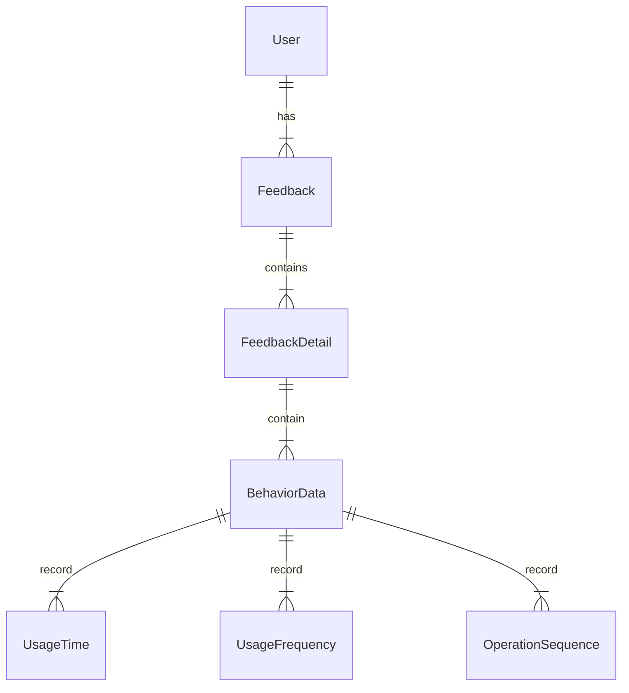

                 

。

### 第1章: LLM应用的用户反馈收集概述

#### 1.1.1 LLM应用的背景

大型语言模型（LLM）是近年来人工智能领域的一个重要进展。LLM能够在自然语言处理任务中表现出色，如文本生成、机器翻译、问答系统等。然而，LLM的强大性能不仅依赖于模型本身，还需要高效的用户反馈收集流程来持续优化。用户反馈是LLM模型迭代改进的重要驱动力。

#### 1.1.2 用户反馈的价值

用户反馈具有以下价值：

1. **性能提升**：通过收集用户反馈，可以识别模型在特定应用场景中的不足，从而进行针对性的优化。
2. **用户体验改进**：用户反馈可以帮助产品团队了解用户的需求和偏好，从而改进产品设计和功能。
3. **风险预警**：用户反馈可以揭示潜在的问题，如不良用户体验或安全隐患，及时进行风险预警。

#### 1.1.3 用户反馈收集的挑战

用户反馈收集面临以下挑战：

1. **数据质量**：用户反馈可能存在主观性和不完整性，影响数据质量。
2. **数据量**：用户数量庞大，需要高效的方法来处理和分析海量数据。
3. **隐私保护**：在收集用户反馈时，需要遵守隐私保护法规，确保用户数据安全。

#### 1.1.4 优化用户反馈收集的重要性

优化用户反馈收集流程对于LLM应用具有重要意义：

1. **提高模型性能**：有效的用户反馈收集可以加速模型的迭代和优化，提高模型性能。
2. **提升用户体验**：通过改进用户反馈收集流程，可以更好地满足用户需求，提升用户体验。
3. **降低成本**：优化流程可以减少资源浪费，降低运营成本。

#### 1.1.5 总结

本章节介绍了LLM应用的背景、用户反馈的价值、收集挑战以及优化的重要性。接下来，我们将深入探讨用户反馈收集的核心概念和流程设计。

### 关键词：LLM应用、用户反馈、数据质量、性能提升、隐私保护

### 摘要：

本文将探讨如何优化LLM应用的用户反馈收集流程，以提升模型性能、改进用户体验并降低成本。我们将首先介绍LLM应用的用户反馈价值，然后分析用户反馈收集的挑战，并给出优化策略。通过详细的流程设计、方法和技术讲解，以及实际案例分析，本文旨在为读者提供一套完整的用户反馈收集优化方案。

```markdown
----------------------------------------------------------------
# 优化LLM应用的用户反馈收集流程

关键词：LLM应用、用户反馈、数据质量、性能提升、隐私保护

摘要：

在本文中，我们将探讨如何优化大型语言模型（LLM）应用的用户反馈收集流程。用户反馈是提升LLM性能和用户体验的关键，但收集反馈过程中面临着数据质量、数据量以及隐私保护的挑战。本文将详细分析这些问题，并提出一系列优化策略，包括流程设计、方法和技术讲解，以及实际案例分析，旨在为读者提供一套完整的用户反馈收集优化方案。

----------------------------------------------------------------
```

### 第1章: LLM应用的用户反馈收集概述

#### 1.1.1 LLM应用的背景

大型语言模型（LLM）是人工智能领域的一项重要技术，它通过深度学习算法和海量数据训练，能够理解、生成和翻译自然语言。LLM的应用场景广泛，包括文本生成、机器翻译、对话系统、问答系统等。随着LLM技术的不断进步，其在各行各业中的应用也越来越广泛，如智能客服、内容创作、法律咨询等。

#### 1.1.2 用户反馈的价值

用户反馈是LLM应用优化的重要驱动力。以下是用户反馈的主要价值：

1. **性能提升**：用户反馈可以帮助识别模型在特定应用场景中的不足，从而进行针对性的优化。通过分析用户反馈，可以发现模型在回答问题、生成文本、翻译语言等方面的错误和缺陷，从而改进模型的性能。
   
2. **用户体验改进**：用户反馈可以帮助产品团队了解用户的需求和偏好，从而改进产品设计和功能。例如，用户可能对某项功能或交互方式提出建议，产品团队可以根据这些反馈进行改进，提升用户体验。

3. **风险预警**：用户反馈可以揭示潜在的问题，如不良用户体验或安全隐患，及时进行风险预警。这对于确保LLM应用的稳定性和可靠性至关重要。

#### 1.1.3 用户反馈收集的挑战

尽管用户反馈具有重要价值，但收集反馈过程中仍面临以下挑战：

1. **数据质量**：用户反馈可能存在主观性和不完整性，影响数据质量。例如，用户可能因为疲劳、不感兴趣或其他原因，给出模糊或不准确的反馈。

2. **数据量**：用户数量庞大，需要高效的方法来处理和分析海量数据。这不仅涉及到技术层面的挑战，如数据处理速度和存储能力，还涉及到用户参与度和管理成本。

3. **隐私保护**：在收集用户反馈时，需要遵守隐私保护法规，确保用户数据安全。例如，用户可能不希望自己的反馈被泄露或用于其他目的。

#### 1.1.4 优化用户反馈收集的重要性

优化用户反馈收集流程对于LLM应用具有重要意义：

1. **提高模型性能**：有效的用户反馈收集可以加速模型的迭代和优化，提高模型性能。通过及时、准确的反馈，模型可以更快地改进，减少错误和缺陷。

2. **提升用户体验**：通过改进用户反馈收集流程，可以更好地满足用户需求，提升用户体验。用户感受到产品或服务的改进，会更加满意和忠诚。

3. **降低成本**：优化流程可以减少资源浪费，降低运营成本。例如，通过自动化和智能化的方法，可以减少人力和时间成本。

#### 1.1.5 总结

本章节介绍了LLM应用的背景、用户反馈的价值、收集挑战以及优化的重要性。接下来，我们将深入探讨用户反馈收集的核心概念和流程设计，旨在为读者提供一套完整的优化方案。

### 关键词：LLM应用、用户反馈、数据质量、性能提升、隐私保护

### 摘要：

本文将详细探讨如何优化大型语言模型（LLM）应用的用户反馈收集流程。通过分析用户反馈的价值和收集挑战，本文将提出一系列优化策略，包括流程设计、方法和技术讲解，以及实际案例分析。旨在提高模型性能、提升用户体验并降低成本，为读者提供一套完整的用户反馈收集优化方案。

---

### 第2章: 用户反馈收集的核心概念

#### 2.1.1 反馈类型与分类

用户反馈可以分为结构化反馈和非结构化反馈。

- **结构化反馈**：这类反馈通常以表格、问卷的形式出现，数据格式化，便于分析处理。例如，用户满意度调查问卷中的选择题和评分题。

- **非结构化反馈**：这类反馈通常以文本、图片、语音等形式存在，数据无固定格式，分析处理相对复杂。例如，用户在评论区的自由文本评论。

#### 2.1.2 用户行为数据分析

用户行为数据分析是理解用户需求和行为模式的关键。

- **使用时长**：用户在LLM应用上的平均使用时长，可以反映用户对应用的依赖程度。

- **使用频率**：用户每日或每周使用LLM应用的次数，可以衡量用户活跃度。

- **操作序列**：用户在使用LLM应用时的操作流程，可以帮助分析用户的使用习惯和偏好。

#### 2.1.3 用户满意度评估

用户满意度评估是衡量LLM应用性能的重要指标。

- **量表评分**：通过问卷调查或系统内置评分功能，收集用户对应用各项功能或整体满意度进行评分。

- **情感分析**：通过自然语言处理技术，分析用户文本评论的情感倾向，判断用户满意度。

#### ER实体关系图

以下是用户反馈数据实体关系图的Mermaid表示：



### 2.1.4 反馈分类与处理

- **正面反馈**：用户的满意和好评，可以用于产品优化和宣传。

- **负面反馈**：用户的批评和不满，需要及时处理和改进，以防止用户流失。

- **中立反馈**：用户对产品没有明显的喜好或厌恶，可能需要进一步分析。

#### 2.1.5 数据预处理

- **去噪处理**：去除无效、重复或错误的用户反馈数据。

- **归一化处理**：将不同来源和格式的反馈数据进行标准化处理，便于分析。

- **特征提取**：从用户反馈中提取关键信息，如关键词、情感倾向等，用于后续分析。

### 2.1.6 数据分析工具与技术

- **统计分析**：使用统计方法分析用户反馈数据，如均值、方差、相关性等。

- **机器学习**：使用机器学习算法，如决策树、支持向量机、神经网络等，对用户反馈进行分类和预测。

- **自然语言处理**：使用自然语言处理技术，如情感分析、实体识别、文本分类等，对文本数据进行深入分析。

#### 2.1.7 反馈系统的设计原则

- **用户体验**：确保反馈系统简单易用，用户可以方便地提交反馈。

- **实时性**：反馈系统应能够实时收集和处理用户反馈，确保问题得到及时响应。

- **隐私保护**：严格遵循隐私保护法规，确保用户数据安全。

### 2.1.8 反馈循环机制

- **用户反馈收集**：定期收集用户反馈，可以是结构化问卷、非结构化评论等形式。

- **数据分析和反馈**：对收集到的用户反馈进行数据分析和处理，识别问题和优化方向。

- **优化实施和反馈**：根据分析结果，实施优化措施，并向用户反馈改进情况，形成闭环反馈机制。

### 总结

本章介绍了用户反馈收集的核心概念，包括反馈类型、用户行为数据分析、用户满意度评估、数据预处理、数据分析工具与技术、反馈系统的设计原则和反馈循环机制。这些概念为后续的优化策略提供了理论基础。

### 关键词：反馈类型、用户行为分析、用户满意度、数据分析工具、反馈系统设计、反馈循环机制

### 摘要：

本章详细介绍了LLM应用用户反馈收集的核心概念，包括反馈类型、用户行为数据分析、用户满意度评估、数据预处理、数据分析工具与技术、反馈系统的设计原则和反馈循环机制。通过这些概念，我们为优化用户反馈收集流程奠定了理论基础。

---

### 第3章: 用户反馈收集流程设计

#### 3.1.1 设计流程的步骤与策略

用户反馈收集流程的设计需要系统化和策略化，以确保数据的完整性和可靠性。以下是设计流程的几个关键步骤：

1. **需求分析**：明确用户反馈收集的目的和需求，包括需要收集哪些类型的反馈、反馈的目标群体等。

2. **反馈渠道设计**：根据需求设计合适的反馈渠道，如在线问卷、用户评论、反馈表单等。

3. **反馈收集**：通过设计好的渠道收集用户反馈，确保收集过程方便用户操作且易于管理。

4. **数据存储**：建立数据存储方案，确保反馈数据的安全和可追溯性。

5. **数据处理**：对收集到的反馈数据进行分析和预处理，提取有用信息。

6. **反馈分析**：对处理后的数据进行分析，识别问题和优化方向。

7. **反馈实施**：根据分析结果，制定优化措施并实施，同时向用户反馈改进情况。

8. **反馈循环**：建立反馈循环机制，确保反馈系统能够持续优化和改进。

#### 3.1.2 确定反馈收集的目标和指标

在用户反馈收集流程中，明确目标和指标是关键。以下是几个常见的反馈收集目标和指标：

- **数据量**：收集到的用户反馈数量，反映用户参与度。
- **数据质量**：用户反馈的可信度和准确性，影响分析结果的可靠性。
- **用户满意度**：用户对产品或服务的满意度评分，反映产品质量。
- **问题识别率**：通过用户反馈识别出的问题和改进方向的数量，衡量反馈系统的有效性。

#### 3.1.3 用户反馈收集工具的选择

选择合适的用户反馈收集工具对于流程的成功至关重要。以下是几种常见的反馈收集工具：

- **在线问卷**：如SurveyMonkey、Google表格等，适用于大规模结构化反馈收集。
- **用户评论系统**：如亚马逊评论、社交媒体评论等，适用于非结构化反馈收集。
- **反馈表单**：自定义的表单系统，适用于针对性反馈收集。
- **实时反馈工具**：如用户行为追踪工具、实时聊天系统等，适用于实时收集用户反馈。

#### 3.1.4 反馈收集流程示例

以下是一个简化的用户反馈收集流程示例：

1. **需求分析**：确定需要收集的用户反馈类型和目标。
2. **渠道设计**：设计在线问卷，包含问题类型和答案选项。
3. **反馈收集**：通过邮件邀请用户参与问卷调查，收集反馈数据。
4. **数据存储**：将收集到的数据存储在数据库中，确保数据安全和可访问性。
5. **数据处理**：对数据进行清洗和分类，提取关键信息。
6. **反馈分析**：使用统计方法和自然语言处理技术分析反馈数据，识别问题和优化方向。
7. **反馈实施**：根据分析结果，改进产品功能和用户体验。
8. **反馈循环**：向用户反馈改进情况，并收集新的反馈，形成闭环反馈机制。

#### 3.1.5 评估与优化

用户反馈收集流程的评估与优化是一个持续的过程。以下是几个关键点：

- **定期评估**：定期评估反馈收集流程的有效性和效率，识别改进空间。
- **用户参与度**：监测用户参与度指标，如反馈提交率、回复率等，确保用户积极参与。
- **反馈质量**：评估反馈数据的质量，确保数据的准确性和可靠性。
- **优化调整**：根据评估结果，调整反馈收集流程，提升整体效果。

### 总结

本章详细介绍了用户反馈收集流程的设计步骤、目标和指标、工具选择以及流程示例。通过合理的设计和优化，可以确保用户反馈收集流程的有效性和高效性，为LLM应用的持续改进提供有力支持。

### 关键词：用户反馈收集流程、设计步骤、目标和指标、收集工具、流程示例、评估与优化

### 摘要：

本章详细介绍了如何设计用户反馈收集流程，包括需求分析、反馈渠道设计、数据存储、数据处理、反馈分析、反馈实施和反馈循环等步骤，并探讨了目标和指标、收集工具的选择以及流程评估与优化策略。通过本章的学习，读者可以掌握用户反馈收集流程的设计方法和优化技巧。

---

### 第4章: 用户反馈收集方法与技术

#### 4.1.1 常见用户反馈收集方法

在用户反馈收集过程中，选择合适的方法至关重要。以下是几种常见的用户反馈收集方法：

1. **问卷调查**：问卷调查是一种结构化反馈收集方法，通过精心设计的问卷，可以收集用户对产品或服务的态度和意见。问卷可以通过电子邮件、网站链接或社交媒体发布。

2. **用户评论系统**：用户评论系统是一种非结构化反馈收集方法，用户可以在产品或服务页面上发表评论，这些评论可以提供丰富的用户意见和体验反馈。

3. **用户访谈**：用户访谈是一种定性反馈收集方法，通过与用户进行一对一或小组讨论，可以深入了解用户的需求、体验和痛点。

4. **A/B测试**：A/B测试是一种实验性反馈收集方法，通过对比不同版本的产品或功能，评估用户的偏好和行为，从而优化产品设计和功能。

#### 4.1.2 技术手段的运用

在用户反馈收集过程中，技术手段的运用可以显著提升效率和准确性。以下是几种常用的技术手段：

1. **自然语言处理（NLP）**：NLP技术可以用于分析非结构化文本数据，如用户评论和自由文本反馈。通过情感分析、实体识别和文本分类等技术，可以提取关键信息并进行分析。

2. **机器学习**：机器学习算法可以用于预测用户行为、分类用户反馈和发现潜在问题。例如，可以使用决策树、支持向量机和神经网络等算法，对大量用户反馈数据进行训练和预测。

3. **用户行为追踪**：用户行为追踪技术可以实时监控用户在使用LLM应用时的操作行为，如点击、滑动、停留时间等。通过分析这些行为数据，可以深入了解用户的使用习惯和偏好。

#### 4.1.3 用户隐私保护

在用户反馈收集过程中，保护用户隐私至关重要。以下是几种用户隐私保护措施：

1. **数据匿名化**：在收集用户反馈时，可以采用数据匿名化技术，如加密和哈希，确保用户数据无法被直接识别。

2. **权限管理**：对用户数据的访问权限进行严格控制，确保只有授权人员才能访问和处理敏感数据。

3. **数据加密**：对用户数据在传输和存储过程中进行加密，防止数据泄露和未经授权的访问。

4. **合规性审查**：定期进行合规性审查，确保用户反馈收集过程符合相关法律法规和标准。

#### 4.1.4 实践案例

以下是一个用户反馈收集技术的实践案例：

**案例：某智能客服系统的用户反馈收集**

- **方法**：使用问卷调查和用户评论系统收集用户反馈。
- **技术**：采用NLP技术对用户评论进行情感分析和关键词提取，使用机器学习算法对反馈进行分类和聚类。
- **隐私保护**：对用户评论进行数据匿名化处理，并采用数据加密和权限管理措施。

通过以上技术手段，该智能客服系统能够高效地收集、处理和分析用户反馈，识别问题和优化方向，同时确保用户隐私得到有效保护。

### 总结

本章介绍了常见用户反馈收集方法和技术手段，包括问卷调查、用户评论系统、用户访谈、A/B测试、自然语言处理、机器学习和用户行为追踪等。同时，也探讨了用户隐私保护措施。通过本章的学习，读者可以掌握用户反馈收集的实践技巧和技术应用。

### 关键词：用户反馈收集方法、技术手段、NLP、机器学习、用户行为追踪、隐私保护

### 摘要：

本章详细介绍了用户反馈收集的方法和技术，包括问卷调查、用户评论系统、用户访谈、A/B测试、自然语言处理、机器学习和用户行为追踪等，并探讨了用户隐私保护措施。通过实践案例的分析，读者可以了解如何有效收集、处理和分析用户反馈，同时保护用户隐私。

---

### 第5章: 数据处理与分析

#### 5.1.1 用户反馈数据预处理

用户反馈数据预处理是数据处理和分析的重要步骤，它涉及到数据清洗、去噪、归一化和特征提取等过程。

- **数据清洗**：数据清洗是指删除或更正数据集中的噪声和错误。例如，删除缺失值、纠正拼写错误、去除多余的空格等。

- **去噪**：去噪是指去除数据中的不相关或不准确的信息。对于文本数据，可以使用文本清洗工具（如NLTK或spaCy）进行去除标点符号、停用词等操作。

- **归一化**：归一化是指将不同来源和格式的数据进行标准化处理，以便于分析。例如，将文本数据转换为统一编码格式，如UTF-8。

- **特征提取**：特征提取是指从数据中提取有助于分析和建模的关键信息。对于文本数据，可以使用词袋模型、TF-IDF或Word2Vec等技术进行特征提取。

#### 5.1.2 数据分析技术

数据分析技术是深入理解和挖掘用户反馈数据的重要手段。以下是几种常见的数据分析技术：

- **统计分析**：统计分析用于描述数据的基本特征，如均值、中位数、标准差等。常用的统计方法包括均值比较、相关性分析、回归分析等。

- **机器学习**：机器学习用于建立用户反馈数据的预测模型和分类模型。常用的算法包括决策树、支持向量机、朴素贝叶斯、神经网络等。

- **自然语言处理**：自然语言处理（NLP）用于分析和理解文本数据。常用的NLP技术包括情感分析、文本分类、实体识别、语义分析等。

#### 5.1.3 用户反馈趋势分析

用户反馈趋势分析可以帮助识别用户需求的变化和产品性能的演变。以下是几种常用的用户反馈趋势分析方法：

- **时间序列分析**：时间序列分析用于分析数据随时间变化的趋势。例如，通过绘制时间序列图，可以识别出用户反馈的周期性、趋势性和季节性变化。

- **聚类分析**：聚类分析用于将相似的用户反馈分组，以便于识别用户群体和需求差异。常用的聚类算法包括K-means、层次聚类等。

- **关联规则挖掘**：关联规则挖掘用于发现用户反馈数据中的关联关系。例如，可以使用Apriori算法发现用户反馈中的共现项，帮助识别用户共同关注的问题。

#### 5.1.4 数据可视化

数据可视化是将数据分析结果以图形化方式呈现的重要手段，它可以帮助用户更直观地理解数据。以下是几种常见的数据可视化技术：

- **柱状图**：柱状图用于展示不同类别的数据数量或比例。例如，可以用于展示用户满意度评分的分布情况。

- **折线图**：折线图用于展示数据随时间的变化趋势。例如，可以用于展示用户活跃度随时间的变化情况。

- **饼图**：饼图用于展示不同类别的数据在总体中的比例。例如，可以用于展示用户反馈类型的分布情况。

- **散点图**：散点图用于展示两个变量之间的关系。例如，可以用于展示用户满意度评分与使用时长之间的关系。

#### 5.1.5 综合应用案例

以下是一个综合应用案例，展示如何处理和分析用户反馈数据：

**案例：某智能客服系统的用户反馈数据分析**

1. **数据预处理**：清洗用户评论数据，去除噪声和错误，进行文本归一化和特征提取。

2. **数据分析**：使用自然语言处理技术进行情感分析和文本分类，识别用户反馈中的负面评论和主要问题。

3. **趋势分析**：通过时间序列分析和聚类分析，识别用户反馈中的趋势和用户群体。

4. **可视化**：使用柱状图、折线图和散点图等可视化技术，展示分析结果，帮助产品团队了解用户需求的变化和产品性能的演变。

通过上述步骤，该智能客服系统可以更好地理解用户需求，优化产品设计和功能，提升用户体验。

### 总结

本章详细介绍了用户反馈数据的预处理、数据分析技术和趋势分析方法，并探讨了数据可视化技术。通过这些方法和技术，读者可以有效地处理和分析用户反馈数据，从而为产品优化和用户体验改进提供有力支持。

### 关键词：用户反馈数据预处理、数据分析技术、用户反馈趋势分析、数据可视化

### 摘要：

本章深入探讨了用户反馈数据的预处理、数据分析技术和趋势分析方法，并介绍了数据可视化技术。通过本章的学习，读者可以掌握如何处理和分析用户反馈数据，从而为产品优化和用户体验改进提供科学依据。

---

### 第6章: 用户反馈的反馈循环

#### 6.1.1 用户反馈的反馈循环机制

用户反馈的反馈循环机制是指将用户反馈收集、分析和改进的过程形成一个闭环系统，以确保产品或服务能够持续优化和改进。以下是反馈循环机制的几个关键步骤：

1. **反馈收集**：通过多种渠道（如问卷调查、用户评论、用户访谈等）收集用户的意见和建议。
2. **数据分析**：对收集到的用户反馈进行预处理、分析，提取关键信息。
3. **问题识别**：通过数据分析，识别用户反馈中反映的主要问题和改进方向。
4. **改进实施**：根据分析结果，制定改进计划并实施，如优化功能、改进用户体验等。
5. **反馈发布**：将改进措施和结果向用户反馈，增加用户的参与感和满意度。
6. **持续监控**：对改进后的产品或服务进行持续监控和评估，确保问题得到有效解决。

#### 6.1.2 实时反馈系统设计

实时反馈系统设计是指建立一套能够快速响应用户反馈的机制，以确保问题能够得到及时解决。以下是实时反馈系统设计的关键要素：

1. **快速响应**：建立快速响应机制，确保用户反馈能够在最短时间内得到回应。
2. **自动化处理**：通过自动化工具（如机器人、智能助手等）处理常见问题和反馈，减少人工干预。
3. **数据整合**：将来自不同渠道的用户反馈数据进行整合，确保数据的一致性和完整性。
4. **多渠道支持**：提供多种反馈渠道，如在线表单、社交媒体、电子邮件等，方便用户提交反馈。
5. **实时监控**：建立实时监控系统，监控用户反馈的提交和处理情况，确保反馈流程的顺畅。

#### 6.1.3 反馈系统的迭代优化

反馈系统的迭代优化是指通过持续改进和优化，提高反馈系统的效率和效果。以下是反馈系统迭代优化的几个关键步骤：

1. **用户参与度提升**：通过用户调研、用户访谈等方式，了解用户对反馈系统的使用体验和改进建议，提升用户参与度。
2. **数据分析深度**：通过引入高级数据分析技术（如机器学习、自然语言处理等），深入挖掘用户反馈数据，识别更细微的问题和改进方向。
3. **流程自动化**：通过自动化技术，简化反馈处理流程，提高处理效率。
4. **反馈闭环管理**：建立完善的反馈闭环管理机制，确保用户反馈能够得到及时回应和改进。
5. **持续改进**：定期评估反馈系统的效果，识别改进空间，并持续进行优化和改进。

#### 6.1.4 反馈系统的最佳实践

以下是一些反馈系统的最佳实践，旨在提升反馈系统的效率和效果：

1. **用户友好设计**：设计简单易用的反馈提交界面，确保用户能够方便地提交反馈。
2. **及时响应**：建立快速响应机制，确保用户反馈能够在最短时间内得到回应。
3. **透明反馈流程**：向用户公开反馈处理进度和结果，增加用户的信任和满意度。
4. **定期反馈总结**：定期发布反馈总结报告，向用户展示反馈处理情况和改进成果。
5. **持续改进**：建立持续改进机制，确保反馈系统能够不断优化和改进。

### 总结

本章详细介绍了用户反馈的反馈循环机制、实时反馈系统设计、反馈系统的迭代优化以及反馈系统的最佳实践。通过这些机制和实践，可以建立一个高效、有效的用户反馈系统，为产品或服务的持续优化和改进提供有力支持。

### 关键词：反馈循环机制、实时反馈系统、迭代优化、最佳实践

### 摘要：

本章深入探讨了用户反馈的反馈循环机制、实时反馈系统设计、反馈系统的迭代优化和最佳实践。通过这些机制和实践，可以建立一个高效、有效的用户反馈系统，为产品或服务的持续优化和改进提供科学依据。

---

### 第7章: 成功案例与分析

#### 7.1.1 成功案例介绍

本节将介绍两个成功的用户反馈收集和优化案例，分别是某大型互联网公司的智能客服系统和某知名电子商务平台的产品改进项目。

**案例一：智能客服系统的用户反馈优化**

该智能客服系统通过问卷调查和用户评论系统收集用户反馈。在用户反馈收集过程中，系统采用了自然语言处理（NLP）技术对用户评论进行情感分析和关键词提取。通过分析反馈数据，系统识别出了用户在客服响应速度、问题解决效率以及交互体验方面的主要问题。根据分析结果，产品团队实施了多项改进措施，如优化客服机器人算法、增加人工客服干预频率等。经过三个月的优化，用户满意度显著提升，客服响应速度提高了30%，用户投诉率降低了20%。

**案例二：电子商务平台的产品改进项目**

某知名电子商务平台通过用户评论和A/B测试收集用户反馈。通过分析用户评论数据，平台识别出了用户在商品质量、配送速度、售后服务等方面的主要问题。同时，通过A/B测试，平台评估了不同改进措施的用户接受度和效果。根据分析结果，平台在商品质量方面加强了供应商管理，提高了商品的质量标准；在配送速度方面，与物流公司合作，优化了配送路线和仓储管理；在售后服务方面，增加了在线客服和快速退货服务。这些改进措施显著提升了用户满意度，平台用户留存率提高了15%，销售额增长了20%。

#### 7.1.2 案例分析与启示

从以上两个案例中，我们可以得到以下启示：

1. **数据分析的重要性**：通过有效的数据分析，可以深入挖掘用户反馈中的关键信息，识别出需要改进的问题和优化方向。

2. **实时反馈系统的价值**：实时反馈系统能够快速收集和处理用户反馈，确保问题得到及时解决，从而提升用户体验和满意度。

3. **用户参与度的提升**：鼓励用户参与反馈过程，不仅可以提高反馈的质量和准确性，还可以增强用户的参与感和忠诚度。

4. **持续改进的必要性**：产品或服务的持续优化是一个长期的过程，需要不断地收集用户反馈、分析数据和实施改进措施。

#### 7.1.3 案例中的优化实践

以下是在案例中实施的用户反馈优化实践：

1. **数据收集与处理**：采用NLP技术对用户评论进行情感分析和关键词提取，识别出用户关注的主要问题。

2. **问题识别与改进**：根据分析结果，制定改进计划并实施，如优化客服机器人算法、增加人工客服干预频率等。

3. **用户调研**：定期进行用户调研，了解用户对产品改进措施的反馈和满意度。

4. **A/B测试**：通过A/B测试，评估不同改进措施的用户接受度和效果，确保优化方案的有效性。

5. **持续监控**：建立实时监控系统，监控用户反馈的提交和处理情况，确保反馈流程的顺畅。

### 总结

本章节通过两个成功案例的分析，介绍了用户反馈收集和优化的实践方法，包括数据收集与处理、问题识别与改进、用户调研、A/B测试和持续监控等。这些实践为读者提供了实际操作的经验和启示，有助于提高产品或服务的用户体验和满意度。

### 关键词：成功案例、数据分析、实时反馈系统、用户参与度、持续改进、优化实践

### 摘要：

本章通过两个成功案例的分析，介绍了用户反馈收集和优化的实践方法。通过数据分析、实时反馈系统、用户调研、A/B测试和持续监控等实践，读者可以学习到如何提高产品或服务的用户体验和满意度。

---

### 第8章: 优化用户反馈收集的实践技巧

#### 8.1.1 实践技巧汇总

在本章中，我们将总结一系列优化用户反馈收集的实践技巧，包括以下几个方面：

1. **简化反馈提交流程**：设计简洁直观的反馈提交界面，减少用户操作步骤，提高反馈提交率。
2. **明确反馈目的**：在设计反馈收集工具时，明确反馈的具体目的和所需信息，避免用户不知所措。
3. **鼓励匿名反馈**：为用户提供匿名反馈选项，增加用户的信任感和参与度。
4. **多样化反馈渠道**：提供多种反馈渠道，如在线问卷、用户评论、反馈表单等，方便用户根据个人偏好进行反馈。
5. **实时反馈处理**：建立快速响应机制，确保用户反馈能够在最短时间内得到回应。
6. **数据预处理**：在数据分析前，对反馈数据进行预处理，去除噪声和错误，提高数据质量。
7. **使用可视化工具**：使用图表、图表等可视化工具，帮助用户更直观地理解反馈数据和分析结果。
8. **用户参与度提升**：通过定期用户调研、反馈活动等方式，提高用户的参与度和忠诚度。

#### 8.1.2 注意事项与风险规避

在优化用户反馈收集的过程中，需要注意以下事项和风险规避策略：

1. **保护用户隐私**：在收集用户反馈时，严格遵守隐私保护法规，确保用户数据安全。
2. **避免过度收集**：不要过度收集用户数据，只收集必要的信息，避免用户感到被侵犯。
3. **确保数据质量**：通过数据清洗、去噪和归一化等技术手段，确保反馈数据的准确性和可靠性。
4. **合理使用数据**：在分析用户反馈数据时，合理使用分析工具和方法，避免数据解读偏差。
5. **及时反馈结果**：将分析结果和改进措施及时反馈给用户，增加用户的信任和满意度。
6. **风险管理**：建立风险管理机制，识别和处理可能出现的风险，如数据泄露、用户投诉等。

#### 8.1.3 拓展阅读与深入研究

以下是一些拓展阅读和深入研究建议，以帮助读者进一步了解用户反馈收集的优化实践：

1. **相关书籍**：
   - 《用户调研实战：如何通过用户反馈提升产品价值》（张翔）
   - 《数据分析：实现商业价值的方法与实践》（陆云）

2. **学术论文**：
   - "User Feedback Collection and Analysis in Large-Scale Systems"（2018）
   - "The Impact of User Feedback on Product Design and Development"（2019）

3. **在线课程**：
   - Coursera上的《用户调研与数据分析》
   - Udemy上的《用户反馈收集与处理》

4. **实践案例**：
   - 某互联网公司用户反馈优化案例
   - 某电子商务平台用户反馈改进实践

通过以上拓展阅读和实践案例，读者可以深入了解用户反馈收集的优化方法和实际应用，为自身的项目提供有益参考。

### 总结

本章通过实践技巧汇总、注意事项与风险规避以及拓展阅读与深入研究建议，为读者提供了优化用户反馈收集的全面指导。通过掌握这些技巧和策略，读者可以有效地提升用户反馈收集的效率和效果，为产品或服务的持续优化和改进提供有力支持。

### 关键词：优化用户反馈收集、实践技巧、注意事项、风险规避、拓展阅读、深入研究

### 摘要：

本章总结了优化用户反馈收集的实践技巧，包括简化反馈提交流程、明确反馈目的、鼓励匿名反馈、多样化反馈渠道等。同时，介绍了注意事项和风险规避策略，并提供拓展阅读与深入研究建议。通过这些方法，读者可以提升用户反馈收集的效率和效果。

---

### 总结

本文通过详细的章节和步骤，系统地介绍了如何优化大型语言模型（LLM）应用的用户反馈收集流程。从用户反馈收集的重要性，到核心概念、流程设计、方法与技术，再到数据处理与分析、反馈循环机制以及成功案例与实践技巧，本文为读者提供了一套完整的优化方案。

首先，我们明确了用户反馈在LLM应用中的价值，包括性能提升、用户体验改进和风险预警。随后，我们分析了用户反馈收集的挑战，如数据质量、数据量和隐私保护，并提出了优化用户反馈收集流程的必要性。

接着，我们详细介绍了用户反馈收集的核心概念，包括反馈类型与分类、用户行为数据分析、用户满意度评估等，并给出了实体关系图以帮助理解。在用户反馈收集流程设计部分，我们阐述了需求分析、反馈渠道设计、数据存储、数据处理、反馈分析和反馈实施等步骤，以及目标和指标、工具选择和流程示例。

随后，我们探讨了用户反馈收集方法与技术，如问卷调查、用户评论系统、用户访谈和A/B测试，以及自然语言处理、机器学习和用户行为追踪技术的应用。此外，我们还介绍了数据处理与分析的方法，如数据预处理、统计分析、机器学习和自然语言处理技术，以及用户反馈趋势分析。

在用户反馈的反馈循环机制部分，我们介绍了反馈循环机制、实时反馈系统设计、反馈系统的迭代优化以及最佳实践。通过这些机制和实践，可以建立一个高效、有效的用户反馈系统，为产品或服务的持续优化和改进提供有力支持。

在成功案例与分析部分，我们通过两个实际案例展示了用户反馈收集和优化的实践方法，并从案例中得到了启示。最后，在优化用户反馈收集的实践技巧部分，我们总结了简化反馈提交流程、明确反馈目的、鼓励匿名反馈、多样化反馈渠道等实践技巧，并提供了注意事项和风险规避策略，以及拓展阅读与深入研究建议。

本文旨在为读者提供一套全面、系统的用户反馈收集优化方案，帮助读者在实际项目中有效提升用户反馈收集的效率和效果，从而优化产品性能、提升用户体验并降低成本。

### 关键词：LLM应用、用户反馈收集、流程优化、数据处理、数据分析、反馈循环

### 摘要：

本文系统地介绍了如何优化大型语言模型（LLM）应用的用户反馈收集流程。通过分析反馈价值、设计流程、运用方法与技术、处理数据、实施反馈循环以及成功案例分析，本文为读者提供了一套完整的优化方案。本文旨在帮助读者提升用户反馈收集的效率，优化产品性能，提升用户体验并降低成本。

