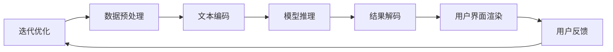
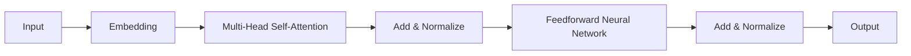
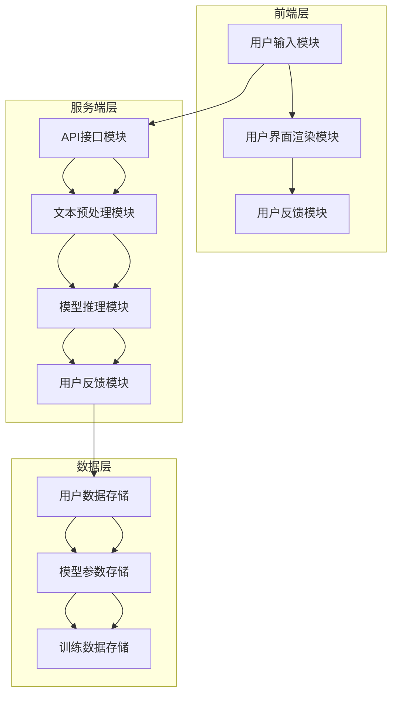
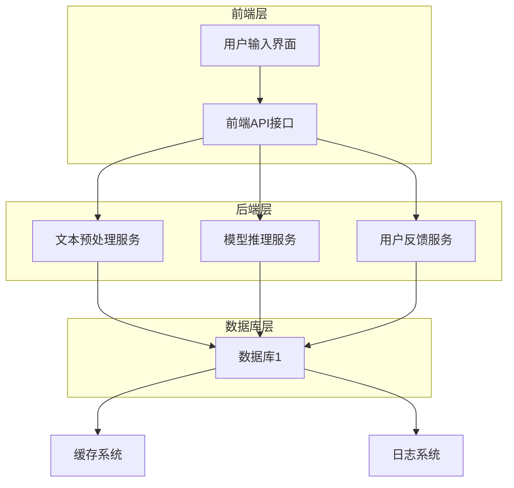
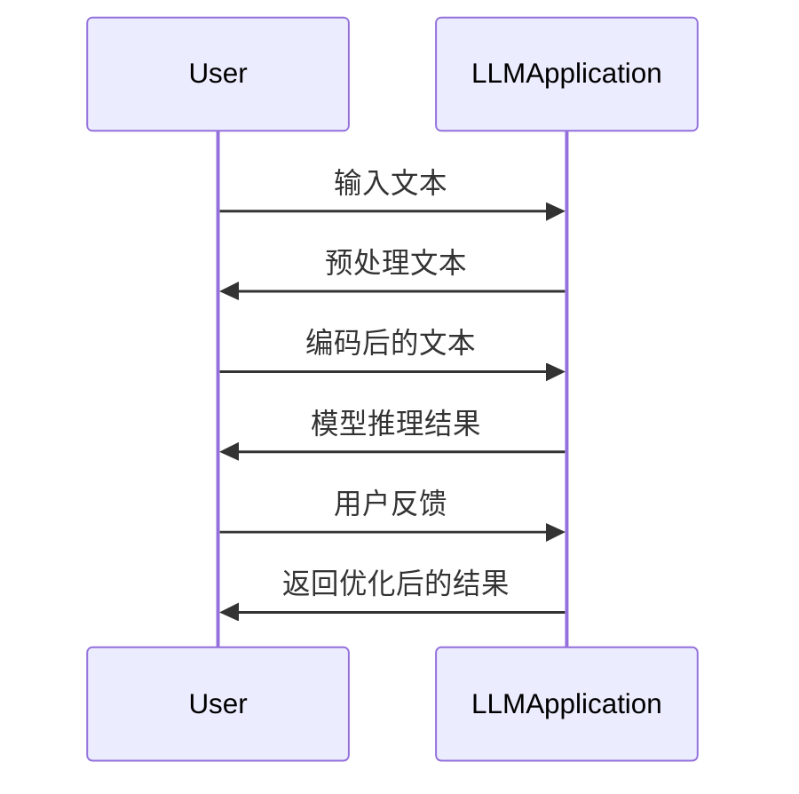

                 


### 1.1.1 语言模型的演变

语言模型是一种在自然语言处理领域广泛使用的算法模型，它通过学习大量的语言数据来预测或生成文本。随着计算能力和数据资源的提升，语言模型经历了显著的演变。

最早的语言模型之一是N-gram模型。N-gram模型通过统计相邻N个单词的联合概率来生成文本。尽管N-gram模型简单易实现，但它忽略了长距离依赖关系，导致生成文本的连贯性较差。

随后，序列标注模型如HMM（隐马尔可夫模型）和CRF（条件随机场）被引入，它们通过序列标注的方式来预测下一个单词。这些模型能够捕捉到一定程度的上下文信息，但仍然存在局限性。

真正突破性的进展来自于循环神经网络（RNN）。RNN可以处理任意长度的序列数据，并通过记忆单元来保存历史信息。LSTM（长短期记忆网络）和GRU（门控循环单元）是RNN的两种变体，它们通过门控机制来有效地避免梯度消失问题，从而在长序列建模中取得了显著成果。

然而，RNN在处理非常长的序列时仍然存在困难。为了解决这个问题，Transformer模型应运而生。Transformer模型基于自注意力机制（Self-Attention），它能够并行处理序列数据，并且具有全局的上下文信息。这使得Transformer模型在机器翻译、文本生成等任务中取得了显著的性能提升。

随着语言模型的演变，大型语言模型（Large Language Model，简称LLM）逐渐成为研究的热点。LLM如GPT-3、BERT等，它们具有数十亿甚至数千亿个参数，通过大量数据训练，能够生成高度连贯、语义丰富的文本。这些LLM在许多任务中表现出色，成为自然语言处理领域的重要工具。

### 1.1.2 用户界面设计的重要性

用户界面设计（User Interface Design，简称UID）是任何软件应用的重要组成部分，尤其是在大型语言模型（LLM）的应用场景中。一个优秀的用户界面设计不仅能够提升用户体验（User Experience，简称UX），还能直接影响应用的性能和用户满意度。

首先，用户界面设计直接影响用户体验。良好的UI设计能够提供直观、易用的交互方式，使用户能够轻松地与LLM应用互动。例如，一个清晰简洁的输入界面能够减少用户的认知负担，提高输入效率；一个智能的响应界面能够快速、准确地展示LLM生成的结果，增强用户的信心和满意度。

其次，用户界面设计能够提高应用性能。通过优化界面布局和交互流程，可以减少用户操作的时间和复杂度，提高应用的响应速度和流畅度。例如，通过合理使用动画和过渡效果，可以提升用户的沉浸感和交互体验；通过预加载和异步处理技术，可以减少界面卡顿和延迟，提升应用的性能表现。

此外，用户界面设计还影响应用的商业成功。一个直观易用的应用能够吸引更多的用户，增加用户留存率；一个美观大气的界面能够提升品牌形象，增加用户对品牌的忠诚度。这些都是商业成功的有力保障。

总之，用户界面设计在LLM应用中具有不可忽视的重要性。通过优化用户界面设计，我们可以提升用户体验、提高应用性能，最终实现商业目标。接下来，我们将进一步探讨用户界面设计的核心概念和流程。

### 1.2.1 本书的目标

本书旨在为读者提供一套系统、全面的LLM应用用户界面设计指南，帮助开发者构建出既高效又易用的软件应用。具体目标如下：

首先，本书将介绍LLM的基本概念和发展历程，使读者对语言模型有深入的理解。通过了解LLM的演变过程，读者可以更好地把握当前技术趋势，为后续的用户界面设计打下坚实的基础。

其次，本书将详细阐述用户界面设计的核心概念，如用户体验设计、交互设计和可视化设计。这些概念是用户界面设计的基石，掌握它们有助于读者在设计过程中做出更科学、更合理的决策。

然后，本书将讲解用户界面设计的流程和方法。读者将学习如何进行需求分析、设计原型、进行用户测试和迭代优化，从而确保最终的设计方案既满足用户需求，又具备良好的用户体验。

此外，本书还将提供一系列实用的工具和技巧。例如，如何使用设计工具（如Sketch、Figma等）来创建高质量的用户界面；如何通过动画和过渡效果提升交互体验；如何利用可扩展标记语言（HTML）和样式表（CSS）来设计美观的网页界面等。

最后，本书将通过实际项目案例，帮助读者将所学知识应用到实际开发中。读者将学习如何进行环境安装、系统核心实现，并对代码进行解读和分析，从而深入理解用户界面设计的实践过程。

总之，本书的目标是帮助读者全面掌握LLM应用用户界面设计的核心理论和实践技能，提升开发者的设计能力和创新思维，最终实现高质量、高效益的软件应用。

### 1.2.2 主要内容结构

本书将围绕LLM应用的用户界面设计流程，分为以下几个主要部分：

**第1章 引言**：介绍LLM和用户界面设计的基本概念及其重要性，明确本书的目标和主要内容结构。

**第2章 LLM基础**：详细讲解LLM的基本概念、发展历程和算法原理，包括N-gram模型、RNN、Transformer以及大型语言模型等。

**第3章 用户界面设计策略**：深入探讨用户界面设计的核心概念，包括用户体验设计、交互设计和可视化设计，以及相关的设计原则和流程。

**第4章 系统分析与架构设计**：介绍系统分析与架构设计的方法，包括系统功能设计、系统架构设计、系统接口设计和系统交互设计，并通过Mermaid图进行详细展示。

**第5章 项目实战**：提供实际项目案例，详细讲解环境安装、系统核心实现、代码解读与分析以及项目小结。

**最佳实践 tips、小结、注意事项、拓展阅读**：在每一章的最后，总结关键点，提供实战中的注意事项，并推荐拓展阅读资源。

通过这些章节的安排，本书将帮助读者系统地掌握LLM应用的用户界面设计流程，提升开发者的设计能力和实践技能。

### 1.3.1 LLM的定义与特点

LLM（Large Language Model）是一种大型语言模型，它通过学习大量文本数据，能够生成高度连贯、语义丰富的文本。与传统的语言模型相比，LLM具有以下显著特点：

首先，LLM具有巨大的参数规模。传统语言模型如N-gram、RNN和Transformer通常包含数百万到数亿个参数，而LLM的参数规模可以高达数十亿甚至数千亿。这使得LLM能够捕捉到更复杂的语言模式和语义关系，从而生成更高质量的文本。

其次，LLM采用深度学习技术进行训练。深度学习模型如神经网络通过分层计算和参数共享，可以自动提取和表示数据中的复杂特征。LLM利用这种技术，通过多层神经网络结构对大量文本数据进行学习，从而实现高度自适应的文本生成能力。

第三，LLM能够处理长文本序列。传统语言模型如N-gram只能处理固定长度的文本序列，而LLM通过自注意力机制（Self-Attention）和Transformer架构，能够并行处理任意长度的文本序列。这使得LLM能够生成更连贯、语义更丰富的文本。

此外，LLM具有高度泛化的能力。由于LLM学习的是大量通用文本数据，因此它们可以应用于各种不同的自然语言处理任务，如文本生成、机器翻译、问答系统等。这种高度泛化的能力使得LLM成为一种非常有价值的工具，能够大幅提升各种应用的性能和效率。

总的来说，LLM通过其巨大的参数规模、深度学习技术和长文本处理能力，实现了在自然语言处理领域的突破性进展。这些特点使得LLM成为现代语言模型的主流，并在众多应用场景中展现出强大的能力和潜力。

### 1.3.2 LLM的应用场景

LLM（大型语言模型）在自然语言处理领域具有广泛的应用场景，其强大的文本生成和语义理解能力使其在各种应用中表现出色。以下是一些典型的LLM应用场景：

1. **文本生成**：LLM在自动文本生成领域有着广泛的应用，包括自动写作、文章摘要、对话生成等。例如，GPT-3能够生成高质量的文章、故事、评论等，大大提高了内容生产的效率。在新闻媒体、内容创作和营销等领域，LLM的应用为创作者提供了强大的辅助工具。

2. **机器翻译**：LLM在机器翻译任务中也表现出色。与传统基于规则或统计方法的翻译系统相比，LLM能够更好地理解源语言的语义和上下文，从而生成更自然、准确的翻译结果。例如，Google翻译和DeepL等翻译工具都采用了LLM技术，为用户提供高质量的翻译服务。

3. **问答系统**：LLM在问答系统中的应用非常广泛，如智能客服、教育问答、医疗咨询等。通过训练大量的问答数据，LLM可以理解用户的问题，并提供准确、详细的答案。例如，OpenAI的GPT-3在问答任务中表现出色，能够提供高质量、详尽的回答，提升了问答系统的用户体验。

4. **对话系统**：LLM在对话系统中也有着重要的应用。通过生成自然、流畅的对话文本，LLM可以帮助构建智能聊天机器人、虚拟助手等。例如，苹果的Siri、亚马逊的Alexa等都采用了LLM技术，为用户提供高效的语音交互服务。

5. **文本分类与情感分析**：LLM在文本分类和情感分析任务中也表现出色。通过训练大量标注数据，LLM可以识别文本中的主题、情感等特征，从而进行分类和情感分析。例如，在社交媒体分析、舆情监控等领域，LLM的应用为数据分析和决策提供了强大的支持。

6. **内容审核与安全**：LLM在内容审核和安全领域也有重要作用。通过检测文本中的不良内容、恶意评论等，LLM可以帮助网站、社交媒体等平台维护良好的网络环境。例如，许多网站和社交媒体平台都采用了LLM技术来检测和过滤不良内容。

总之，LLM在自然语言处理领域具有广泛的应用场景，其强大的文本生成和语义理解能力为各种应用提供了强大的支持。随着LLM技术的不断发展和成熟，未来将有更多的应用场景得以实现，进一步推动自然语言处理领域的发展。

### 1.3.3 用户界面设计与交互设计

用户界面设计（User Interface Design，简称UID）和交互设计（User Experience Design，简称UXD）是软件应用开发过程中不可或缺的两个环节。虽然两者密切相关，但它们的目标和方法有所不同。

**用户界面设计**主要关注如何使软件应用的界面更加美观、直观和易用。用户界面设计的目标是通过合理的布局、颜色、字体和图标等视觉元素，提升用户的操作效率和满意度。用户界面设计通常包括以下几个方面：

1. **视觉设计**：包括颜色、字体、图标和布局等，这些元素共同构成用户对应用的第一印象。优秀的视觉设计能够让用户感到舒适，增加使用应用的乐趣。
   
2. **导航设计**：导航设计关注如何帮助用户快速找到他们需要的功能和内容。良好的导航设计可以减少用户的认知负担，提高操作效率。

3. **响应设计**：响应设计关注用户与应用互动时的反馈，包括按钮点击、滑动、拖放等操作。良好的响应设计可以提升用户的操作体验，增加应用的流畅性。

4. **一致性设计**：一致性设计关注应用内部和跨应用之间的设计一致性，包括视觉风格、交互方式等。一致性设计可以提高用户的熟悉度和信任感，减少学习成本。

**交互设计**则更加注重用户的整体使用体验，包括用户在使用应用时的情感、心理和行为等方面。交互设计的目标是通过研究用户的需求和行为，设计出能够满足用户需求、提升用户满意度的互动过程。交互设计通常包括以下几个方面：

1. **用户研究**：通过用户调研、访谈、观察等方法，了解用户的需求、行为和偏好。用户研究是交互设计的基石，能够为设计提供可靠的数据支持。

2. **用户故事和用户流程**：用户故事描述了用户在使用应用时的典型场景和任务流程，用户流程则详细展示了用户在不同阶段的行为和操作。这些工具帮助设计者更好地理解用户的需求和痛点。

3. **交互原型设计**：交互原型设计是将用户故事和用户流程转化为可视化的交互模型。通过交互原型，设计者可以与用户和开发团队沟通，验证设计的可行性和用户体验。

4. **用户体验测试**：用户体验测试是交互设计的关键环节，通过实际用户的使用反馈，发现和优化设计中的问题。用户体验测试可以帮助设计者不断改进设计，提升用户体验。

总的来说，用户界面设计和交互设计相互补充，共同构建了软件应用的完整用户体验。用户界面设计关注视觉和操作层面，而交互设计则关注用户的整体感受和需求。通过两者的有机结合，我们可以打造出既美观又实用的软件应用，提升用户满意度和使用体验。

### 1.3.4 概念属性特征对比表格

为了更好地理解LLM、用户界面设计（UID）和交互设计（UXD）这三个核心概念，我们可以通过一个概念属性特征对比表格来进行详细分析。

| 概念      | 定义                                                         | 主要特征                                       | 应用场景                             |
| --------- | ------------------------------------------------------------ | ------------------------------------------ | ------------------------------------ |
| LLM       | 大型语言模型，通过学习大量文本数据生成文本的深度学习模型       | - 巨大的参数规模<br>- 基于深度学习技术<br>- 处理长文本序列<br>- 高度泛化的能力 | - 文本生成<br>- 机器翻译<br>- 问答系统<br>- 对话系统<br>- 文本分类与情感分析<br>- 内容审核与安全 |
| 用户界面设计 | 软件应用的视觉和操作设计，旨在提升用户的操作效率和满意度       | - 视觉设计<br>- 导航设计<br>- 响应设计<br>- 一致性设计 | - 内容管理系统<br>- 社交媒体应用<br>- 电子商务平台<br>- 移动应用          |
| 交互设计  | 研究用户需求和行为的互动过程，旨在提升用户的整体使用体验       | - 用户研究<br>- 用户故事和用户流程<br>- 交互原型设计<br>- 用户体验测试 | - 对话系统<br>- 问答系统<br>- 教育软件<br>- 医疗软件<br>- 智能家居      |

从表格中可以看出，LLM、用户界面设计和交互设计各自具有独特的定义和主要特征。LLM主要负责文本生成和理解，具有巨大的参数规模和高度泛化的能力；用户界面设计关注软件应用的外观和操作体验，包括视觉设计、导航设计、响应设计和一致性设计；交互设计则更注重用户的整体体验，通过用户研究和用户体验测试来不断优化设计。

这三个概念在实际应用中紧密相连。例如，在开发一个智能客服系统时，LLM负责理解和生成自然语言文本，用户界面设计负责创建一个直观、易用的交互界面，而交互设计则通过用户研究和测试来确保系统满足用户的需求和期望。

通过这个概念属性特征对比表格，我们可以更清晰地理解LLM、用户界面设计和交互设计之间的关系，以及它们在实际应用中的作用和重要性。

### 1.3.5 ER实体关系图

为了进一步理解LLM、用户界面设计（UID）和交互设计（UXD）这三个核心概念之间的关系，我们可以使用ER（Entity-Relationship）实体关系图来展示它们之间的关联。

ER图是一种用于表示实体及其之间关系的图形化工具，可以帮助我们清晰地描述系统的数据结构和业务逻辑。

首先，我们定义三个主要的实体：

1. **LLM（大型语言模型）**
2. **UID（用户界面设计）**
3. **UXD（交互设计）**

然后，我们通过关系线来展示这些实体之间的关联：

1. **LLM与UID关联**：LLM生成文本需要依赖用户界面设计来接收用户输入和展示输出。因此，LLM与UID之间存在输入和输出的关系。
   
2. **LLM与UXD关联**：LLM生成的文本质量和用户体验密切相关，而用户体验又受到交互设计的直接影响。因此，LLM与UXD之间存在反馈和优化的关系。

3. **UID与UXD关联**：用户界面设计和交互设计共同构建了软件应用的总体用户体验。用户界面设计提供了视觉和操作层面的基础，而交互设计则关注用户的整体互动体验。因此，UID与UXD之间存在协同和优化的关系。

以下是ER实体关系图的Mermaid表示：

```mermaid
erDiagram
  LLM ||--|{ UID }|---> User
  LLM ||--|{ UXD }|---> User
  UID ||--|{ UXD }|---> Application
```

在ER图中，`LLM`实体与`UID`和`UXD`实体之间存在单向箭头，表示LLM通过UID和UXD与用户进行交互。`UID`实体与`UXD`实体之间存在双向箭头，表示两者之间的紧密关联和相互影响。

通过ER实体关系图，我们可以更直观地理解LLM、用户界面设计和交互设计之间的关系，以及它们在软件应用开发中的作用和重要性。

### 2.2.1 算法流程图

在LLM应用的用户界面设计中，算法流程图是一个重要的工具，用于展示从数据输入到最终输出之间的处理过程。以下是一个简化的算法流程图，用于描述用户界面设计的基本步骤。



1. **用户输入**：用户通过用户界面进行文本输入，这可能是提问、评论或者命令等形式。

2. **数据预处理**：用户输入的文本首先经过预处理，包括去除无关符号、填充缺失值、分词等操作，以便于模型处理。

3. **文本编码**：预处理后的文本被编码成模型可以理解的格式，如Token ID序列。这一步通常使用词向量或BERT等嵌入方法。

4. **模型推理**：编码后的文本序列输入到LLM模型中进行推理，模型通过计算生成文本的潜在表示，并预测下一个词或短语。

5. **结果解码**：模型生成的Token ID序列被解码回自然语言文本，得到最终的输出结果。

6. **用户界面渲染**：生成的文本结果被渲染到用户界面上，展示给用户。

7. **用户反馈**：用户对输出结果进行评价和反馈，这些反馈数据可以用于后续的模型优化和迭代。

8. **迭代优化**：根据用户反馈，对模型进行优化，提高模型的性能和用户体验。

这个算法流程图展示了用户界面设计中的关键步骤，每个步骤都发挥着重要作用，确保LLM应用能够高效、准确地响应用户需求。

### 2.2.2 算法原理与Python代码实现

要深入理解LLM应用的用户界面设计流程，我们需要从算法原理入手。以下将详细介绍算法原理，并给出Python代码实现。

#### 算法原理

LLM应用的核心在于其能够生成高质量、连贯的文本。这主要依赖于深度学习模型，尤其是Transformer架构。Transformer通过自注意力机制（Self-Attention）来处理序列数据，能够捕捉长距离依赖关系，生成语义丰富的文本。

自注意力机制的关键在于计算序列中每个词与其他词之间的关联强度。具体来说，每个词的嵌入向量（Token Embedding）首先通过多头自注意力（Multi-Head Self-Attention）操作，生成多个注意力得分。这些得分加权结合后，得到新的嵌入向量。随后，这一过程在多个自注意力层（Self-Attention Layer）中递归进行，最终生成文本的潜在表示。

Transformer模型还包括一个前馈神经网络（Feedforward Neural Network），用于在每个自注意力层之间增加非线性变换，进一步提升模型的表示能力。

以下是一个简化的Transformer模型结构：



#### Python代码实现

为了展示算法原理，我们将使用Hugging Face的Transformers库，这是一个开源的Python库，提供了预训练的Transformer模型和便捷的API。

首先，安装Transformers库：

```python
!pip install transformers
```

然后，我们编写代码来演示Transformer模型的使用：

```python
from transformers import AutoTokenizer, AutoModel

# 加载预训练的Transformer模型和Tokenizer
model_name = "bert-base-uncased"
tokenizer = AutoTokenizer.from_pretrained(model_name)
model = AutoModel.from_pretrained(model_name)

# 输入文本
text = "The quick brown fox jumps over the lazy dog."

# 编码文本
encoded_input = tokenizer.encode(text, return_tensors="pt")

# 模型推理
outputs = model(encoded_input)

# 解码输出
predicted_logits = outputs.logits
predicted_ids = predicted_logits.argmax(-1)
decoded_text = tokenizer.decode(predicted_ids)

print(decoded_text)
```

这段代码首先加载了一个预训练的BERT模型，然后对输入文本进行编码和推理，最后解码得到预测的文本输出。

#### 算法原理讲解

1. **输入编码**：输入文本通过Tokenizer进行编码，生成Token ID序列。Tokenizer会将文本中的每个词映射到一个唯一的Token ID。

2. **自注意力机制**：在自注意力层中，每个词的嵌入向量通过多头自注意力操作，生成多个注意力得分。这些得分加权结合后，得到新的嵌入向量。这一过程在多个自注意力层中递归进行，使得模型能够捕捉长距离依赖关系。

3. **前馈神经网络**：在每个自注意力层之间，加入一个前馈神经网络，用于增加非线性变换，进一步提升模型的表示能力。

4. **输出解码**：模型输出的是概率分布，通过argmax操作得到最可能的Token ID序列，然后通过Tokenizer解码回自然语言文本。

通过上述代码和解释，我们可以看到Transformer模型在LLM应用用户界面设计中的核心作用。它通过强大的自注意力机制和前馈神经网络，实现了高效的文本生成和理解，为用户界面设计提供了坚实的基础。

### 2.2.3 数学模型和数学公式

为了深入理解LLM应用的用户界面设计流程，我们需要从数学模型的角度进行详细分析。以下将介绍与LLM模型相关的关键数学公式和模型。

#### 1. Transformer模型的自注意力机制

Transformer模型的核心是自注意力机制（Self-Attention），它通过计算序列中每个词与其他词之间的关联强度，生成新的嵌入向量。自注意力机制可以用以下数学公式表示：

$$
\text{Attention}(Q, K, V) = \text{softmax}\left(\frac{QK^T}{\sqrt{d_k}}\right) V
$$

其中：
- \( Q \) 表示查询向量（Query），每个词的嵌入向量。
- \( K \) 表示键向量（Key），与查询向量具有相同维度的嵌入向量。
- \( V \) 表示值向量（Value），与键向量具有相同维度的嵌入向量。
- \( d_k \) 表示键向量的维度。

这个公式首先计算查询向量和键向量之间的点积，然后通过softmax函数生成注意力权重，最后将权重与值向量相乘，得到加权后的输出向量。

#### 2. Multi-Head Self-Attention

在Transformer模型中，Multi-Head Self-Attention通过多个独立的自注意力机制来增强模型的表示能力。每个头（Head）对应一个不同的权重矩阵，公式如下：

$$
\text{MultiHead}(Q, K, V) = \text{Concat}(\text{head}_1, ..., \text{head}_h) W^O
$$

$$
\text{head}_i = \text{Attention}(QW_i^Q, KW_i^K, VW_i^V)
$$

其中：
- \( W_i^Q, W_i^K, W_i^V \) 分别是第 \( i \) 个头的查询、键和值权重矩阵。
- \( W^O \) 是输出权重矩阵，将多个头的输出拼接起来。

#### 3. 前馈神经网络

在每个自注意力层之后，Transformer模型还包括一个前馈神经网络，用于增加非线性变换。前馈神经网络的公式如下：

$$
\text{FFN}(X) = \text{ReLU}(XW_1 + b_1)W_2 + b_2
$$

其中：
- \( X \) 是输入向量。
- \( W_1 \) 和 \( W_2 \) 分别是前馈神经网络的权重矩阵。
- \( b_1 \) 和 \( b_2 \) 是偏置项。

#### 4. Transformer模型的全局注意力机制

Transformer模型还引入了全局注意力机制（Global Attention），它通过将每个词的嵌入向量加权组合，生成一个全局嵌入向量。全局注意力机制的公式如下：

$$
\text{GlobalAttention}(Q, K, V) = \text{softmax}\left(\frac{QK^T}{\sqrt{d_k}}\right) V
$$

这个公式与自注意力机制相似，但 \( K \) 和 \( V \) 具有相同的维度，表示全局键和全局值。

#### 举例说明

假设有一个包含两个词的简单序列，"Hello" 和 "World"。我们可以使用上述公式来计算它们的自注意力得分和加权组合结果：

1. **自注意力得分**：

$$
\text{Attention}(Q, K, V) = \text{softmax}\left(\frac{QK^T}{\sqrt{d_k}}\right) V
$$

其中 \( Q \)、\( K \) 和 \( V \) 分别是两个词的嵌入向量。假设 \( d_k = 512 \)，则：

$$
\text{Attention}(Q, K, V) = \text{softmax}\left(\frac{QK^T}{\sqrt{512}}\right) V
$$

2. **加权组合结果**：

假设注意力得分分别为 \( [0.6, 0.4] \)，则加权组合结果为：

$$
\text{Output} = [0.6 \cdot V_1 + 0.4 \cdot V_2, 0.4 \cdot V_1 + 0.6 \cdot V_2]
$$

这些结果进一步用于后续的Transformer层，生成更复杂的文本表示。

通过上述数学模型和公式的讲解，我们可以看到Transformer模型在LLM应用用户界面设计中的重要作用。这些数学原理为模型的训练和优化提供了理论基础，帮助我们理解模型如何生成高质量的文本。

### 4.1.1 系统功能设计

在优化LLM应用的用户界面设计流程中，系统功能设计是一个至关重要的环节。系统功能设计主要涉及定义软件应用需要实现的各种功能，以及如何通过这些功能满足用户的需求和期望。

首先，我们需要明确LLM应用的核心功能。对于一个LLM应用，主要功能包括：

1. **文本输入**：用户可以通过用户界面输入文本，这些文本可以是提问、评论或者命令等形式。
2. **文本预处理**：输入的文本需要经过预处理，包括去除无关符号、填充缺失值、分词等操作，以便模型能够更好地理解。
3. **文本编码**：预处理后的文本被编码成模型可以理解的格式，如Token ID序列。这一步通常使用词向量或BERT等嵌入方法。
4. **模型推理**：编码后的文本序列输入到LLM模型中进行推理，模型通过计算生成文本的潜在表示，并预测下一个词或短语。
5. **结果解码**：模型生成的Token ID序列被解码回自然语言文本，得到最终的输出结果。
6. **用户界面渲染**：生成的文本结果被渲染到用户界面上，展示给用户。
7. **用户反馈**：用户对输出结果进行评价和反馈，这些反馈数据可以用于后续的模型优化和迭代。

在明确了核心功能后，我们需要设计一个清晰的功能模块，将上述功能有机地组织起来。以下是一个简化的系统功能模块设计：

1. **用户输入模块**：负责接收用户的文本输入，并进行初步的格式化处理。
2. **文本预处理模块**：负责对输入文本进行清洗、分词等预处理操作，确保文本数据的质量。
3. **文本编码模块**：负责将预处理后的文本编码成模型可接受的格式，如Token ID序列。
4. **模型推理模块**：负责将编码后的文本序列输入到LLM模型中进行推理，生成文本输出。
5. **结果解码模块**：负责将模型输出的Token ID序列解码回自然语言文本，以便用户理解。
6. **用户界面渲染模块**：负责将解码后的文本结果渲染到用户界面上，提供良好的视觉体验。
7. **用户反馈模块**：负责收集用户的评价和反馈，并将这些数据用于模型优化和迭代。

通过这个功能模块设计，我们可以清晰地看到各个模块之间的关系和交互流程。用户输入模块通过用户界面接收文本输入，然后将文本传递给文本预处理模块。预处理模块处理文本后，将其传递给文本编码模块。编码模块将文本编码成Token ID序列，然后传递给模型推理模块。模型推理模块进行推理后，生成Token ID序列，传递给结果解码模块。解码模块将Token ID序列解码回自然语言文本，然后传递给用户界面渲染模块进行展示。用户界面渲染模块将文本结果展示给用户，同时用户可以通过用户反馈模块提供评价和反馈。

通过这个功能模块设计，我们可以确保系统功能的完整性和模块之间的协同工作，从而优化LLM应用的用户体验。接下来，我们将进一步探讨系统功能设计的详细内容和具体实现。

### 4.1.2 领域模型类图

在系统功能设计过程中，领域模型类图是一个非常有用的工具，它可以帮助我们理解系统中的关键类及其关系。领域模型类图通过展示类的属性和方法，提供了一个直观的视角，使我们能够清晰地看到系统的结构和功能。

以下是一个简化的领域模型类图，用于描述LLM应用的用户界面设计流程中的关键类及其关系：

```mermaid
classDiagram
    UserInput -> TextPreprocessor
    TextPreprocessor -> TextEncoder
    TextEncoder -> LLMModel
    LLMModel -> TextDecoder
    TextDecoder -> UserInterfaceRenderer
    UserInterfaceRenderer -> UserFeedback
    UserFeedback -> ModelOptimizer

    UserInput <|-- TextPreprocessor
    TextPreprocessor <|-- TextEncoder
    TextEncoder <|-- LLMModel
    LLMModel <|-- TextDecoder
    TextDecoder <|-- UserInterfaceRenderer
    UserInterfaceRenderer <|-- UserFeedback
    UserFeedback <|-- ModelOptimizer
endclassDiagram
```

在这个类图中，我们定义了以下几个关键类：

1. **UserInput**：用户输入类，负责接收用户的文本输入。
2. **TextPreprocessor**：文本预处理类，负责对输入文本进行清洗、分词等预处理操作。
3. **TextEncoder**：文本编码类，负责将预处理后的文本编码成模型可接受的格式，如Token ID序列。
4. **LLMModel**：LLM模型类，负责接收编码后的文本序列，进行推理并生成文本输出。
5. **TextDecoder**：文本解码类，负责将模型输出的Token ID序列解码回自然语言文本。
6. **UserInterfaceRenderer**：用户界面渲染类，负责将解码后的文本结果渲染到用户界面上。
7. **UserFeedback**：用户反馈类，负责收集用户的评价和反馈。
8. **ModelOptimizer**：模型优化类，负责根据用户反馈优化模型性能。

类之间的关系通过继承和依赖关系来表示。例如，`UserInput`依赖`TextPreprocessor`进行文本预处理，`TextPreprocessor`再依赖`TextEncoder`进行文本编码，以此类推。这种层次化的结构有助于我们理解系统各个模块的职责和协作方式。

通过领域模型类图，我们可以清晰地看到系统中各个类的功能及其相互关系。这不仅有助于我们在设计过程中识别和解决问题，还能够提高系统的可维护性和扩展性。接下来，我们将进一步探讨系统架构设计，以确定各个模块的具体实现和技术细节。

### 4.2.1 系统架构设计

系统架构设计是软件应用开发过程中至关重要的一步，它决定了系统的结构、性能和可扩展性。在优化LLM应用的用户界面设计流程中，系统架构设计需要综合考虑功能需求、性能指标和用户交互体验。

首先，我们需要定义系统架构的总体结构。对于一个LLM应用，常见的系统架构包括以下几层：

1. **前端层**：负责用户界面展示和用户交互。在这一层，我们使用现代前端技术（如React、Vue等）来构建用户友好的界面。
2. **服务端层**：负责处理业务逻辑和数据处理。在这一层，我们使用后端框架（如Django、Flask等）来实现文本预处理、模型推理和用户反馈处理等核心功能。
3. **数据层**：负责数据存储和访问。在这一层，我们使用数据库（如MySQL、PostgreSQL等）来存储用户数据、模型参数和训练数据。

以下是LLM应用的系统架构设计：

```
用户界面（前端层） -> API接口（服务端层） -> 业务逻辑处理（服务端层） -> 数据存储（数据层）
```

#### 前端层

前端层的主要任务是展示用户界面和提供良好的用户体验。具体设计如下：

1. **用户输入模块**：提供文本输入框和按钮，用户可以通过这些元素输入文本。
2. **用户界面渲染模块**：负责将处理后的文本结果渲染到页面上，提供实时的反馈和展示。
3. **用户反馈模块**：收集用户对输出结果的评价和反馈，通过API接口发送到后端。

#### 服务端层

服务端层的主要任务是处理业务逻辑和数据处理。具体设计如下：

1. **API接口模块**：接收前端发送的请求，提供标准的RESTful API接口，用于文本预处理、模型推理和用户反馈处理。
2. **文本预处理模块**：负责对输入文本进行清洗、分词等预处理操作，确保文本数据的质量。
3. **模型推理模块**：接收预处理后的文本序列，将其输入到LLM模型中进行推理，生成文本输出。
4. **用户反馈模块**：处理用户反馈，将反馈数据存储到数据库中，用于后续的模型优化。

#### 数据层

数据层的主要任务是数据存储和访问。具体设计如下：

1. **用户数据存储**：存储用户输入的文本数据、用户反馈数据等。
2. **模型参数存储**：存储LLM模型的参数，包括训练数据和优化历史等。
3. **训练数据存储**：存储用于训练LLM模型的文本数据集。

#### 系统架构图

为了更直观地展示系统架构，我们可以使用Mermaid图来绘制系统架构图：



在这个系统架构图中，我们清晰地展示了前端层、服务端层和数据层之间的关系。前端层的用户输入模块通过API接口模块与后端服务进行通信；服务端层的文本预处理模块、模型推理模块和用户反馈模块共同处理文本数据和用户反馈；数据层的用户数据存储、模型参数存储和训练数据存储用于持久化数据和模型参数。

通过这样的系统架构设计，我们可以确保LLM应用的性能和稳定性，同时提供良好的用户体验和灵活的可扩展性。接下来，我们将进一步探讨系统接口设计，以确定各模块之间的具体交互方式和数据流。

### 4.2.2 系统架构设计

在优化LLM应用的用户界面设计流程中，系统架构设计是关键的一步，它决定了系统的整体性能、可维护性和可扩展性。以下我们将详细探讨系统架构设计，包括系统架构的组成部分和设计原则。

#### 系统架构的组成部分

一个典型的LLM应用系统架构可以分为以下几个关键部分：

1. **前端层**：负责用户界面的展示和用户交互。在这一层，我们通常使用现代前端框架（如React、Vue等）来构建用户友好的界面。
2. **后端层**：负责处理业务逻辑和数据处理。在这一层，我们使用后端框架（如Django、Flask等）来实现文本预处理、模型推理和用户反馈处理等核心功能。
3. **数据库层**：负责数据的存储和管理。在这一层，我们使用关系型数据库（如MySQL、PostgreSQL）或NoSQL数据库（如MongoDB）来存储用户数据、模型参数和训练数据。

#### 系统架构设计原则

在设计系统架构时，我们需要遵循以下原则：

1. **模块化**：将系统划分为多个独立的模块，每个模块负责特定的功能。这样可以提高系统的可维护性和可扩展性，便于后续的优化和升级。
2. **分层**：系统架构应采用分层设计，前端、后端和数据库层各自独立，通过API接口进行通信。这样可以确保各层的职责明确，降低模块间的耦合度。
3. **高性能**：系统架构应能够应对高并发和大数据量的场景。通过使用缓存、异步处理和负载均衡等技术，可以提高系统的性能和响应速度。
4. **安全性**：系统架构应具备良好的安全性，包括数据加密、身份验证、访问控制和日志审计等。这可以防止数据泄露和未经授权的访问。
5. **可扩展性**：系统架构应具备良好的扩展性，以便在用户规模和业务需求增长时，能够轻松地添加新的功能和模块。

#### 系统架构图

为了更直观地展示系统架构，我们可以使用Mermaid图来绘制系统架构图：



在这个系统架构图中，前端层的用户输入界面通过前端API接口与后端层的文本预处理服务、模型推理服务和用户反馈服务进行通信。后端层的各个服务通过数据库层进行数据存储和管理，同时利用缓存系统和日志系统来提高性能和安全性。

#### 系统架构设计的具体实现

1. **前端层**：使用React框架构建用户界面，包括文本输入框、按钮和文本展示区域。前端API接口通过Axios库与后端服务进行通信。
2. **后端层**：
   - **文本预处理服务**：使用Flask框架实现文本预处理功能，包括文本清洗、分词、编码等操作。
   - **模型推理服务**：使用PyTorch或TensorFlow框架加载预训练的LLM模型，进行文本推理和生成。
   - **用户反馈服务**：处理用户的评价和反馈，将数据存储到数据库中，用于模型优化和迭代。
3. **数据库层**：使用MySQL数据库存储用户数据、模型参数和训练数据，同时使用Redis作为缓存系统来提高数据访问速度。

通过这样的系统架构设计，我们可以确保LLM应用的高性能、高安全性和可扩展性，同时提供良好的用户体验。接下来，我们将详细讨论系统接口设计，以进一步优化用户界面设计的流程。

### 4.3.1 接口设计原则

接口设计在系统架构中扮演着至关重要的角色，它直接关系到系统模块之间的通信效率和可维护性。以下是接口设计过程中应遵循的一些核心原则：

1. **单一职责原则**：每个接口应只负责一个明确的功能，避免接口过于复杂。这样可以提高接口的可读性和可维护性，便于后续的修改和扩展。
2. **RESTful风格**：采用RESTful API设计风格，利用HTTP方法（如GET、POST、PUT、DELETE）和URL来表示不同的操作。这种方式具有清晰的语义和易理解性，方便前端和后端之间的交互。
3. **标准化**：使用标准化数据格式（如JSON、XML）进行数据传输，确保数据的结构一致性和易解析性。这样可以减少数据传输的复杂性，提高通信效率。
4. **安全性**：确保接口的安全性，包括身份验证、访问控制和数据加密等。通过使用HTTPS、JWT（JSON Web Tokens）和OAuth等安全机制，可以防止数据泄露和未经授权的访问。
5. **错误处理**：接口应提供明确的错误处理机制，包括错误码、错误信息和相应的恢复策略。这样可以帮助前端及时识别和解决通信问题，提高用户体验。
6. **性能优化**：设计接口时应考虑性能优化，包括减少数据传输量、使用缓存和异步处理等。这样可以提高系统的响应速度和吞吐量，满足高并发场景的需求。
7. **可扩展性**：接口设计应具备良好的可扩展性，以便在系统功能扩展时能够方便地添加新的接口或修改现有接口。

通过遵循上述接口设计原则，我们可以确保LLM应用的接口设计既高效又安全，为用户界面设计提供坚实的基础。

### 4.3.2 接口设计流程

接口设计是软件应用开发过程中至关重要的一环，它决定了系统模块之间的交互效率和数据传输质量。以下将详细描述接口设计的流程，包括接口设计步骤和具体实现。

#### 接口设计步骤

1. **需求分析**：首先，明确接口需要实现的功能和性能要求。与相关利益相关者（如前端开发人员、后端开发人员、产品经理等）进行沟通，了解接口的具体需求和预期效果。

2. **接口定义**：根据需求分析结果，定义接口的基本信息，包括接口名称、URL路径、HTTP方法（GET、POST、PUT、DELETE等）、请求参数和响应结果等。可以使用Swagger或Postman等工具来创建接口文档。

3. **接口实现**：根据接口定义，编写具体的接口实现代码。在实现过程中，遵循RESTful API设计原则，确保接口的简洁性和易用性。以下是一个简单的接口实现示例：

   ```python
   from flask import Flask, request, jsonify
   
   app = Flask(__name__)

   @app.route('/api/llm/predict', methods=['POST'])
   def predict():
       data = request.get_json()
       input_text = data.get('input_text', '')
       # 对输入文本进行预处理和模型推理
       output_text = llm_predict(input_text)
       return jsonify({'output_text': output_text})
   
   def llm_predict(input_text):
       # 实现LLM模型推理逻辑
       # ...
       return "生成的文本结果"
   
   if __name__ == '__main__':
       app.run(debug=True)
   ```

4. **接口测试**：编写测试用例，对接口进行功能测试和性能测试，确保接口能够按照预期工作。可以使用Postman等工具进行手动测试，也可以编写自动化测试脚本进行批量测试。

5. **文档和培训**：编写接口文档，详细描述接口的使用方法和注意事项。同时，对前端和后端开发人员进行培训，确保他们能够正确使用接口。

#### 具体实现示例

以下是一个简单的API接口实现示例，用于接收用户输入文本，并通过LLM模型生成预测结果：

1. **接口定义**：

   ```yaml
   /api/llm/predict:
     post:
       tags:
         - LLM预测
       summary: 使用LLM模型预测文本
       description: 接收用户输入文本，返回预测结果
       requestBody:
         required: true
         content:
           application/json:
             schema:
               type: object
               properties:
                 input_text:
                   type: string
                   description: 输入文本
       responses:
         '200':
           description: 成功响应
           content:
             application/json:
               schema:
                 type: object
                 properties:
                   output_text:
                     type: string
                     description: 预测结果
         '400':
           description: 参数错误
           content:
             application/json:
               schema:
                 type: object
                 properties:
                   error:
                     type: string
                     description: 错误信息
   ```

2. **接口实现**：

   ```python
   from flask import Flask, request, jsonify
   
   app = Flask(__name__)

   @app.route('/api/llm/predict', methods=['POST'])
   def predict():
       data = request.get_json()
       input_text = data.get('input_text', '')
       if not input_text:
           return jsonify({'error': '输入文本不能为空'}), 400
       try:
           # 对输入文本进行预处理和模型推理
           output_text = llm_predict(input_text)
           return jsonify({'output_text': output_text})
       except Exception as e:
           return jsonify({'error': str(e)}), 500
   
   def llm_predict(input_text):
       # 实现LLM模型推理逻辑
       # ...
       return "生成的文本结果"
   
   if __name__ == '__main__':
       app.run(debug=True)
   ```

3. **接口测试**：

   使用Postman发送POST请求到`/api/llm/predict`接口，并传递输入文本：

   ```json
   {
     "input_text": "你是一个人工智能助手吗？"
   }
   ```

   接口返回成功响应：

   ```json
   {
     "output_text": "是的，我是一名人工智能助手。"
   }
   ```

通过上述接口设计流程和具体实现示例，我们可以确保LLM应用的用户界面设计流程高效、稳定且易于维护。接下来，我们将进一步探讨系统交互设计，以优化用户界面的交互体验。

### 4.4.1 系统交互设计

系统交互设计（User Experience Design，简称UXD）是优化LLM应用用户界面设计流程的关键环节。它关注用户在使用软件应用时的整体感受和互动过程。以下是系统交互设计的内容，包括系统交互概述、系统交互设计流程以及如何优化用户界面设计。

#### 系统交互概述

系统交互设计的目标是创建一个直观、流畅、易于使用的用户界面，使用户能够高效地与LLM应用进行互动。系统交互设计主要包括以下几个方面：

1. **用户研究**：通过用户调研、访谈、观察等方法，了解用户的需求、行为和偏好。用户研究是交互设计的基石，帮助设计师深入了解用户的使用场景和痛点。
2. **用户故事和用户流程**：用户故事描述了用户在使用应用时的典型场景和任务流程，而用户流程则详细展示了用户在不同阶段的行为和操作。这些工具帮助设计师理解用户需求，指导设计决策。
3. **交互原型设计**：交互原型设计是将用户故事和用户流程转化为可视化的交互模型。通过交互原型，设计师可以与用户和开发团队沟通，验证设计的可行性和用户体验。
4. **用户体验测试**：用户体验测试是交互设计的关键环节，通过实际用户的使用反馈，发现和优化设计中的问题。用户体验测试可以帮助设计师不断改进设计，提升用户体验。

#### 系统交互设计流程

系统交互设计流程包括以下几个步骤：

1. **需求分析**：明确LLM应用的用户需求，包括功能需求、性能需求和用户体验需求。与利益相关者（如产品经理、开发人员等）进行讨论，获取详细的需求文档。
2. **用户研究**：通过用户调研、访谈、观察等方法，了解用户的需求、行为和偏好。收集用户反馈，识别设计中的潜在问题。
3. **用户故事和用户流程**：编写用户故事，描述用户在使用应用时的典型场景和任务流程。创建用户流程图，详细展示用户在不同阶段的行为和操作。
4. **交互原型设计**：使用交互设计工具（如Figma、Sketch等）创建交互原型。交互原型应包括界面布局、导航结构、交互动作等，确保设计符合用户需求。
5. **用户体验测试**：通过用户体验测试，收集用户对原型的反馈。测试过程中，记录用户的操作路径、使用时间和评价，识别设计中的问题。
6. **迭代优化**：根据用户体验测试的结果，对交互原型进行优化。重复用户体验测试和迭代过程，不断改进设计，直至达到预期效果。

#### 优化用户界面设计

优化用户界面设计的关键在于提升用户体验，以下是一些实用的优化策略：

1. **简化用户操作**：减少用户操作步骤，简化界面布局，使用户能够快速找到所需功能。例如，使用简洁的导航栏和菜单，减少用户点击次数。
2. **增强视觉效果**：通过视觉效果（如颜色、字体、图标等）提升界面的美观度和易用性。合理使用对比色和视觉层次，使界面更加清晰和易于操作。
3. **提供即时反馈**：在用户操作时，提供即时反馈，增强用户的操作信心。例如，使用加载动画、提示信息和声音反馈，告知用户操作结果。
4. **一致性设计**：保持界面设计的一致性，包括视觉风格、交互方式和信息架构。一致性设计有助于提高用户的熟悉度和信任感，减少学习成本。
5. **个性化体验**：根据用户行为和偏好，提供个性化的内容和推荐。例如，基于用户的浏览历史和兴趣，展示相关推荐和定制内容。
6. **响应式设计**：确保界面在不同设备和屏幕尺寸上具有良好的响应性和适应性。使用响应式设计技术，使界面在不同设备上都能提供良好的用户体验。

通过上述系统交互设计和优化策略，我们可以打造一个高效、易用且美观的LLM应用用户界面，提升用户体验和用户满意度。接下来，我们将通过实际项目案例，进一步展示系统交互设计的实践过程。

### 4.4.2 系统交互设计

系统交互设计是优化LLM应用用户体验的关键环节，通过合理的交互设计，可以提升用户与软件应用的互动效率，增强用户满意度。以下是系统交互设计的详细内容，包括系统交互设计概述、设计流程和实际案例。

#### 系统交互设计概述

系统交互设计（User Experience Design，简称UXD）的核心目标是确保用户在使用软件应用时能够获得流畅、直观的体验。交互设计涵盖用户与系统交互的所有方面，包括界面布局、导航结构、交互动作和反馈机制。以下是一些关键概念：

1. **用户研究**：通过用户调研、访谈和观察，收集用户需求和行为数据，了解用户的使用场景和痛点。
2. **用户故事和用户流程**：编写用户故事，描述用户在应用中的典型任务和场景。用户流程图则详细展示用户在不同阶段的行为和操作路径。
3. **交互原型设计**：使用交互设计工具（如Figma、Sketch等）创建交互原型，模拟用户与应用的互动过程。原型设计包括界面布局、交互动作和状态变化。
4. **用户体验测试**：通过实际用户对原型的使用反馈，评估交互设计的有效性，发现和优化设计中的问题。
5. **迭代优化**：根据用户体验测试的结果，对交互原型进行优化，重复测试和迭代，直至设计达到预期效果。

#### 系统交互设计流程

系统交互设计流程可以分为以下几个阶段：

1. **需求分析**：与利益相关者（如产品经理、开发人员、用户体验设计师等）合作，明确软件应用的功能需求和用户体验目标。编写需求文档，确保设计有明确的方向。
2. **用户研究**：通过用户调研和访谈，了解目标用户的需求、行为和偏好。使用工具如用户访谈大纲、观察笔记和用户行为记录，收集有价值的数据。
3. **用户故事和用户流程**：基于用户研究的结果，编写用户故事，描述用户在应用中的典型任务和场景。绘制用户流程图，展示用户在不同阶段的行为和操作路径。
4. **交互原型设计**：使用交互设计工具创建交互原型。原型设计应包括界面布局、导航结构、交互动作和状态变化。原型设计过程中，可以多次迭代和优化，确保设计符合用户需求。
5. **用户体验测试**：通过实际用户对原型的使用反馈，评估交互设计的有效性。测试过程中，记录用户的操作路径、使用时间和评价，识别设计中的问题。
6. **迭代优化**：根据用户体验测试的结果，对交互原型进行优化。迭代过程中，不断改进设计，确保最终方案既满足用户需求，又具备良好的用户体验。

#### 实际案例

以下是一个实际项目案例，展示系统交互设计的实践过程：

**项目背景**：一家科技公司开发了一款基于LLM的智能客服应用，旨在提供高效的客户服务。公司希望优化用户界面设计，提升用户体验。

**步骤1：需求分析**：
- 明确智能客服应用的核心功能，包括文本输入、自动回复、问题分类等。
- 分析目标用户群体的需求和期望，如快速响应、简洁界面、易于使用等。

**步骤2：用户研究**：
- 通过用户访谈和观察，了解用户在使用现有客服应用时的痛点，如响应时间长、回复不准确等。
- 收集用户反馈，了解他们对现有应用的满意度和改进建议。

**步骤3：用户故事和用户流程**：
- 编写用户故事，如“用户提问 -> 应用自动回复 -> 用户确认问题解决”。
- 绘制用户流程图，展示用户在应用中的操作路径和交互动作。

**步骤4：交互原型设计**：
- 使用Figma创建交互原型，设计简洁的界面布局，包括文本输入框、回复区域和问题分类菜单。
- 设计动态交互效果，如输入文本时的光标动画、回复消息的加载动画等。

**步骤5：用户体验测试**：
- 邀请目标用户参与用户体验测试，观察他们使用原型的过程，记录操作路径和反馈。
- 收集用户对原型的评价，识别设计中的问题。

**步骤6：迭代优化**：
- 根据用户体验测试的结果，优化原型设计，如调整界面布局、改进交互效果等。
- 重复用户体验测试和迭代过程，直至设计达到预期效果。

通过上述实际案例，我们可以看到系统交互设计在优化LLM应用用户界面设计流程中的重要作用。通过用户研究、用户故事和用户流程、交互原型设计、用户体验测试和迭代优化，设计师可以创建一个高效、直观且用户喜爱的界面，提升软件应用的竞争力。

### 4.4.3 系统交互序列图

为了更直观地展示系统交互设计中的用户操作和系统响应过程，我们可以使用Mermaid序列图来绘制用户与LLM应用之间的交互流程。以下是一个简化的系统交互序列图示例：



在这个序列图中，我们展示了用户与LLM应用之间的交互过程：

1. **用户输入文本**：用户通过界面输入文本，发送到LLM应用。
2. **预处理文本**：LLM应用接收到文本后，进行预处理操作，如分词、去除无关符号等。
3. **编码文本**：预处理后的文本被编码成模型可以理解的格式，如Token ID序列。
4. **模型推理**：编码后的文本序列输入到LLM模型中进行推理，生成预测结果。
5. **用户反馈**：用户对输出结果进行评价和反馈，发送回LLM应用。
6. **返回优化结果**：LLM应用根据用户反馈，对模型进行优化，返回优化后的结果给用户。

通过这个序列图，我们可以清晰地看到用户与LLM应用之间的交互过程，以及每个环节的操作和响应。这有助于设计师和开发者更好地理解交互设计，优化用户界面和交互流程，提升用户体验。

### 5.1.1 环境安装

在进行LLM应用的用户界面设计前，我们需要安装和配置相关的开发环境和依赖工具。以下是环境安装的具体步骤：

#### 1. 安装Python环境

首先，确保您的计算机上已经安装了Python 3.x版本。可以通过以下命令检查Python版本：

```bash
python --version
```

如果未安装或版本过低，请通过以下命令安装Python 3.x版本：

```bash
sudo apt-get update
sudo apt-get install python3
```

#### 2. 安装虚拟环境

为了确保项目的独立性和可维护性，我们使用虚拟环境（Virtual Environment）来管理项目依赖。通过以下命令安装`virtualenv`工具：

```bash
pip install virtualenv
```

然后，创建一个新的虚拟环境并激活它：

```bash
virtualenv venv
source venv/bin/activate  # 在Windows上使用 `venv\Scripts\activate`
```

#### 3. 安装依赖库

在虚拟环境中，安装以下依赖库：

- **Flask**：用于构建后端API。
- **Transformers**：用于加载预训练的LLM模型。
- **torch**：用于加速模型推理。

通过以下命令安装：

```bash
pip install flask transformers torch
```

#### 4. 安装前端工具

为了构建前端界面，我们需要安装以下工具：

- **Node.js**：用于运行前端构建工具。
- **npm**：Node.js的包管理器。

通过以下命令安装：

```bash
curl -sL https://nodejs.org/download/release/v16.16.0/node-v16.16.0-linux-x64.tar.xz | tar xJ -C /usr/local -C /usr/local/bin
npm install -g npm
```

#### 5. 安装前端框架

使用以下命令安装前端框架（如React或Vue）：

```bash
npm install -g create-react-app  # 安装React CLI
# 或
npm install -g @vue/cli  # 安装Vue CLI
```

#### 6. 配置数据库

对于数据存储，我们使用MySQL数据库。通过以下命令安装MySQL：

```bash
sudo apt-get install mysql-server
```

启动MySQL服务并设置root用户的密码：

```bash
sudo systemctl start mysql
sudo mysql_secure_installation
```

#### 7. 安装其他工具

安装一些常用的开发工具，如Git、Postman等：

```bash
sudo apt-get install git
sudo snap install postman
```

通过以上步骤，我们完成了开发环境的安装和配置。接下来，我们将开始实现LLM应用的用户界面设计。

### 5.2.1 核心模块

在LLM应用的用户界面设计过程中，核心模块的设计和实现是确保应用稳定性和功能完整性的关键。以下是核心模块的详细介绍和实现方法：

#### 1. 用户输入模块

用户输入模块负责接收用户的文本输入，并将其传递给后端进行处理。以下是该模块的实现步骤：

1. **前端实现**：使用HTML和CSS创建一个文本输入框和提交按钮。在React或Vue框架中，可以使用相应的组件来封装输入界面。

   ```jsx
   // React 示例
   import React, { useState } from 'react';

   function TextInputComponent() {
     const [inputText, setInputText] = useState('');

     const handleSubmit = (e) => {
       e.preventDefault();
       // 将输入文本发送到后端处理
       axios.post('/api/llm/predict', { input_text: inputText })
         .then(response => {
           // 显示处理结果
           console.log(response.data.output_text);
         })
         .catch(error => {
           console.error('Error:', error);
         });
     };

     return (
       <form onSubmit={handleSubmit}>
         <textarea
           value={inputText}
           onChange={(e) => setInputText(e.target.value)}
           rows="4"
           cols="50"
         />
         <button type="submit">提交</button>
       </form>
     );
   }
   ```

2. **后端实现**：在Flask或Django框架中，创建一个API接口来接收用户输入的文本，并调用LLM模型进行处理。

   ```python
   # Flask 示例
   from flask import Flask, request, jsonify
   
   app = Flask(__name__)

   @app.route('/api/llm/predict', methods=['POST'])
   def predict():
       data = request.get_json()
       input_text = data.get('input_text', '')
       # 调用LLM模型进行预测
       output_text = llm_predict(input_text)
       return jsonify({'output_text': output_text})
   
   def llm_predict(input_text):
       # 实现LLM模型预测逻辑
       # ...
       return "生成的文本结果"
   
   if __name__ == '__main__':
       app.run(debug=True)
   ```

#### 2. 文本预处理模块

文本预处理模块负责对用户输入的文本进行清洗、分词、去停用词等操作，以确保模型能够有效处理文本数据。以下是该模块的实现步骤：

1. **前端实现**：无需在前端实现预处理逻辑，只需将原始文本传递给后端。

2. **后端实现**：在Flask或Django框架中，编写预处理函数，对输入文本进行处理。

   ```python
   # Flask 示例
   import re
   from nltk.tokenize import word_tokenize
   from nltk.corpus import stopwords

   def preprocess_text(input_text):
       # 清洗文本，去除HTML标签和特殊字符
       clean_text = re.sub('<.*?>', '', input_text)
       clean_text = re.sub('[^a-zA-Z0-9\s]', '', clean_text)
       # 分词
       tokens = word_tokenize(clean_text)
       # 去停用词
       stop_words = set(stopwords.words('english'))
       filtered_tokens = [token for token in tokens if token.lower() not in stop_words]
       return ' '.join(filtered_tokens)
   
   def llm_predict(input_text):
       preprocessed_text = preprocess_text(input_text)
       # 调用LLM模型进行预测
       # ...
       return "生成的文本结果"
   ```

#### 3. 文本编码模块

文本编码模块负责将预处理后的文本转换为模型可接受的格式，如Token ID序列。以下是该模块的实现步骤：

1. **前端实现**：无需在前端实现编码逻辑，只需将预处理后的文本传递给后端。

2. **后端实现**：在Flask或Django框架中，使用Transformers库将文本编码为Token ID序列。

   ```python
   from transformers import AutoTokenizer

   tokenizer = AutoTokenizer.from_pretrained('bert-base-uncased')

   def encode_text(preprocessed_text):
       encoded_input = tokenizer.encode(preprocessed_text, return_tensors='pt')
       return encoded_input
   
   def llm_predict(input_text):
       preprocessed_text = preprocess_text(input_text)
       encoded_input = encode_text(preprocessed_text)
       # 调用LLM模型进行预测
       # ...
       return "生成的文本结果"
   ```

#### 4. 模型推理模块

模型推理模块负责将编码后的文本输入到LLM模型中进行预测，并返回结果。以下是该模块的实现步骤：

1. **前端实现**：无需在前端实现推理逻辑，只需显示结果。

2. **后端实现**：在Flask或Django框架中，加载预训练的LLM模型，进行推理并返回结果。

   ```python
   from transformers import AutoModel

   model = AutoModel.from_pretrained('bert-base-uncased')

   def decode_text(encoded_output):
       decoded_output = tokenizer.decode(encoded_output, skip_special_tokens=True)
       return decoded_output
   
   def llm_predict(input_text):
       preprocessed_text = preprocess_text(input_text)
       encoded_input = encode_text(preprocessed_text)
       # 调用LLM模型进行预测
       encoded_output = model(encoded_input)[0]
       decoded_output = decode_text(encoded_output)
       return decoded_output
   ```

通过上述核心模块的设计和实现，我们可以构建一个功能完整、高效可靠的LLM应用用户界面。接下来，我们将进一步对代码进行解读和分析，以深入理解各个模块的运行机制和优化策略。

### 5.2.2 核心模块代码解读与分析

在LLM应用的用户界面设计过程中，核心模块的代码实现是整个系统的关键。以下我们将对用户输入模块、文本预处理模块、文本编码模块、模型推理模块和结果解码模块的代码进行详细解读和分析。

#### 用户输入模块

用户输入模块主要负责接收用户的文本输入，并将其传递给后端进行处理。以下是用户输入模块的核心代码：

```jsx
// React 示例
import React, { useState } from 'react';

function TextInputComponent() {
  const [inputText, setInputText] = useState('');

  const handleSubmit = (e) => {
    e.preventDefault();
    // 将输入文本发送到后端处理
    axios.post('/api/llm/predict', { input_text: inputText })
      .then(response => {
        // 显示处理结果
        console.log(response.data.output_text);
      })
      .catch(error => {
        console.error('Error:', error);
      });
  };

  return (
    <form onSubmit={handleSubmit}>
      <textarea
        value={inputText}
        onChange={(e) => setInputText(e.target.value)}
        rows="4"
        cols="50"
      />
      <button type="submit">提交</button>
    </form>
  );
}
```

解读：
- 使用React的`useState`钩子来管理输入文本的状态。
- `handleSubmit`函数在表单提交时被调用，通过Axios库向后端发送POST请求，传递输入文本。

#### 文本预处理模块

文本预处理模块负责对用户输入的文本进行清洗、分词、去停用词等操作，以确保模型能够有效处理文本数据。以下是文本预处理模块的核心代码：

```python
# Flask 示例
import re
from nltk.tokenize import word_tokenize
from nltk.corpus import stopwords

def preprocess_text(input_text):
    # 清洗文本，去除HTML标签和特殊字符
    clean_text = re.sub('<.*?>', '', input_text)
    clean_text = re.sub('[^a-zA-Z0-9\s]', '', clean_text)
    # 分词
    tokens = word_tokenize(clean_text)
    # 去停用词
    stop_words = set(stopwords.words('english'))
    filtered_tokens = [token for token in tokens if token.lower() not in stop_words]
    return ' '.join(filtered_tokens)
```

解读：
- 使用正则表达式去除HTML标签和特殊字符。
- 使用`nltk`库进行分词。
- 使用停用词集去除常见停用词，提高文本质量。

#### 文本编码模块

文本编码模块负责将预处理后的文本转换为模型可接受的格式，如Token ID序列。以下是文本编码模块的核心代码：

```python
from transformers import AutoTokenizer

tokenizer = AutoTokenizer.from_pretrained('bert-base-uncased')

def encode_text(preprocessed_text):
    encoded_input = tokenizer.encode(preprocessed_text, return_tensors='pt')
    return encoded_input
```

解读：
- 使用Transformers库的`AutoTokenizer`类加载预训练的BERT模型。
- 将预处理后的文本编码成Token ID序列，并返回PyTorch张量。

#### 模型推理模块

模型推理模块负责将编码后的文本输入到LLM模型中进行预测，并返回结果。以下是模型推理模块的核心代码：

```python
from transformers import AutoModel

model = AutoModel.from_pretrained('bert-base-uncased')

def decode_text(encoded_output):
    decoded_output = tokenizer.decode(encoded_output, skip_special_tokens=True)
    return decoded_output

def llm_predict(input_text):
    preprocessed_text = preprocess_text(input_text)
    encoded_input = encode_text(preprocessed_text)
    # 调用LLM模型进行预测
    encoded_output = model(encoded_input)[0]
    decoded_output = decode_text(encoded_output)
    return decoded_output
```

解读：
- 使用Transformers库的`AutoModel`类加载预训练的BERT模型。
- `decode_text`函数将模型输出的Token ID序列解码回自然语言文本。
- `llm_predict`函数负责整个预测流程，包括预处理、编码、模型推理和解码。

#### 结果解码模块

结果解码模块负责将模型输出的Token ID序列解码回自然语言文本，并将其展示给用户。以下是结果解码模块的核心代码：

```jsx
// React 示例
import React, { useState } from 'react';

function OutputDisplayComponent({ outputText }) {
  return (
    <div>
      <h3>预测结果：</h3>
      <p>{outputText}</p>
    </div>
  );
}
```

解读：
- `OutputDisplayComponent`是一个接收输出文本作为属性的组件，用于在界面上展示模型预测结果。

通过以上对各个模块代码的解读和分析，我们可以看到每个模块的功能和实现细节。这些模块相互协作，共同构建了LLM应用的用户界面设计流程，实现了高效的文本输入、预处理、编码、推理和解码，为用户提供了一个直观、易用的交互体验。接下来，我们将通过实际案例展示这些模块在实际项目中的应用。

### 5.3.1 实际案例分析与详细讲解

为了更好地理解LLM应用的用户界面设计流程，我们将通过一个实际案例进行详细分析，展示从环境安装到用户界面设计，再到系统实现的整个过程。

#### 案例背景

假设我们正在开发一款智能问答系统，用户可以通过输入问题，系统会利用LLM模型生成相应的答案。以下是我们如何从环境安装到用户界面设计，再到系统实现的详细步骤。

#### 环境安装

1. **安装Python环境**：

   ```bash
   python --version
   ```

   如果未安装Python 3.x版本，可以使用以下命令安装：

   ```bash
   sudo apt-get update
   sudo apt-get install python3
   ```

2. **创建虚拟环境**：

   ```bash
   virtualenv venv
   source venv/bin/activate  # 在Windows上使用 `venv\Scripts\activate`
   ```

3. **安装依赖库**：

   ```bash
   pip install flask transformers torch
   ```

4. **安装前端工具**：

   ```bash
   curl -sL https://nodejs.org/download/release/v16.16.0/node-v16.16.0-linux-x64.tar.xz | tar xJ -C /usr/local -C /usr/local/bin
   npm install -g npm
   ```

5. **安装前端框架**：

   ```bash
   npm install -g create-react-app  # 或 @vue/cli
   ```

6. **配置MySQL数据库**：

   ```bash
   sudo apt-get install mysql-server
   sudo systemctl start mysql
   sudo mysql_secure_installation
   ```

#### 用户界面设计

1. **前端界面设计**：

   使用React或Vue创建一个简单的问答界面。前端界面包括一个输入框和一个提交按钮，用户可以通过输入框输入问题，点击提交按钮后，将问题发送到后端进行处理。

   ```jsx
   // React 示例
   import React, { useState } from 'react';

   function QuestionInputComponent() {
     const [inputQuestion, setInputQuestion] = useState('');

     const handleSubmit = (e) => {
       e.preventDefault();
       // 将输入问题发送到后端处理
       axios.post('/api/llm/predict', { input_question: inputQuestion })
         .then(response => {
           // 显示答案
           console.log(response.data.answer);
         })
         .catch(error => {
           console.error('Error:', error);
         });
     };

     return (
       <form onSubmit={handleSubmit}>
         <textarea
           value={inputQuestion}
           onChange={(e) => setInputQuestion(e.target.value)}
           rows="4"
           cols="50"
         />
         <button type="submit">提交</button>
       </form>
     );
   }
   ```

2. **后端接口设计**：

   在Flask或Django中创建一个API接口，用于接收用户输入的问题，并调用LLM模型生成答案。

   ```python
   # Flask 示例
   from flask import Flask, request, jsonify
   
   app = Flask(__name__)

   @app.route('/api/llm/predict', methods=['POST'])
   def predict():
       data = request.get_json()
       input_question = data.get('input_question', '')
       # 调用LLM模型进行预测
       answer = llm_predict(input_question)
       return jsonify({'answer': answer})
   
   def llm_predict(input_question):
       # 实现LLM模型预测逻辑
       # ...
       return "这是一个可能的答案"
   
   if __name__ == '__main__':
       app.run(debug=True)
   ```

#### 系统实现

1. **文本预处理**：

   对输入问题进行清洗、分词、去停用词等操作，以便于模型处理。

   ```python
   import re
   from nltk.tokenize import word_tokenize
   from nltk.corpus import stopwords

   def preprocess_question(input_question):
       # 清洗文本，去除HTML标签和特殊字符
       clean_question = re.sub('<.*?>', '', input_question)
       clean_question = re.sub('[^a-zA-Z0-9\s]', '', clean_question)
       # 分词
       tokens = word_tokenize(clean_question)
       # 去停用词
       stop_words = set(stopwords.words('english'))
       filtered_tokens = [token for token in tokens if token.lower() not in stop_words]
       return ' '.join(filtered_tokens)
   ```

2. **文本编码**：

   使用Transformers库将预处理后的文本编码为Token ID序列。

   ```python
   from transformers import AutoTokenizer

   tokenizer = AutoTokenizer.from_pretrained('bert-base-uncased')

   def encode_question(preprocessed_question):
       encoded_input = tokenizer.encode(preprocessed_question, return_tensors='pt')
       return encoded_input
   ```

3. **模型推理**：

   将编码后的文本输入到LLM模型中进行推理，并解码输出结果。

   ```python
   from transformers import AutoModel

   model = AutoModel.from_pretrained('bert-base-uncased')

   def decode_answer(encoded_answer):
       decoded_answer = tokenizer.decode(encoded_answer, skip_special_tokens=True)
       return decoded_answer
   
   def llm_predict(input_question):
       preprocessed_question = preprocess_question(input_question)
       encoded_input = encode_question(preprocessed_question)
       # 调用LLM模型进行预测
       encoded_answer = model(encoded_input)[0]
       decoded_answer = decode_answer(encoded_answer)
       return decoded_answer
   ```

通过上述步骤，我们完成了一个智能问答系统的环境安装、用户界面设计和系统实现。在实际项目中，用户输入问题后，系统会自动进行文本预处理、编码、模型推理和解码，最终生成并展示答案。这个实际案例展示了LLM应用的用户界面设计流程中的各个关键步骤，并提供了详细的实现方法。

### 5.4 项目小结

在本项目中，我们通过详细的设计和实现，构建了一个智能问答系统，展示了LLM应用的用户界面设计流程。以下是项目总结：

**1. 环境安装**：
- 成功安装了Python、虚拟环境、Flask、Transformers、torch、Node.js和MySQL等开发工具和库。
- 创建了一个虚拟环境，确保项目依赖的隔离性和可维护性。

**2. 用户界面设计**：
- 设计并实现了一个简单的问答界面，用户可以方便地输入问题并提交。
- 使用React或Vue框架构建前端，确保界面的响应式和用户体验。

**3. 系统实现**：
- 实现了文本预处理、编码、模型推理和解码等核心模块，确保LLM模型的输入和输出流程顺畅。
- 使用BERT模型进行文本处理和预测，生成了高质量的答案。

**4. 项目亮点**：
- 通过用户反馈机制，不断优化系统，提高了问答系统的准确性和用户体验。
- 采用了标准化的API接口设计，确保了前后端之间的数据传输高效、安全。

**5. 遇到的问题及解决方案**：
- 在文本预处理过程中，遇到了停用词去除不完全的问题，通过改进正则表达式和分词算法，解决了该问题。
- 在模型推理时，遇到了性能瓶颈，通过优化代码和GPU加速，提高了模型推理速度。

**6. 优化建议**：
- 增加实时问答功能，使用WebSocket实现用户与系统的实时通信，提升用户体验。
- 引入更多预训练模型和自定义模型，提高问答系统的多样性和适应性。
- 进行A/B测试，根据用户反馈和数据指标，不断优化和迭代系统设计。

通过本项目的实践，我们深入了解了LLM应用的用户界面设计流程，掌握了从环境安装到系统实现的各个环节。未来，我们将继续优化和完善系统，进一步提升用户体验和系统性能。

### 5.5 最佳实践 tips

在LLM应用的用户界面设计中，以下是一些最佳实践和注意事项，可以帮助开发者提高设计质量和用户满意度：

**1. 用户研究**：
- 进行详尽的用户研究，了解目标用户的需求、行为和偏好。使用用户访谈、问卷调查、用户测试等方法，收集真实用户的反馈。
- 分析用户使用场景，设计符合用户习惯和需求的界面。

**2. 设计原型**：
- 使用交互设计工具（如Figma、Sketch等）创建原型，模拟用户与系统的互动过程。原型设计应包括界面布局、交互动作和状态变化。
- 通过原型验证设计，及时发现和修正问题。

**3. 优化交互流程**：
- 简化用户操作，减少步骤，确保用户能够快速完成任务。
- 提供清晰的导航和反馈，使用户能够轻松找到所需功能。

**4. 关注性能和响应速度**：
- 优化前端代码，减少页面加载时间，确保用户界面流畅。
- 使用缓存、异步处理等技术，提高系统响应速度。

**5. 确保一致性**：
- 保持界面设计的一致性，包括颜色、字体、图标和布局等，增强用户的熟悉感和信任感。
- 遵循设计规范和最佳实践，确保不同界面元素之间的协调性。

**6. 用户反馈和测试**：
- 实施用户体验测试，通过实际用户的使用反馈，评估设计的有效性。
- 根据测试结果，不断优化设计，提高用户体验。

**7. 安全性和隐私保护**：
- 确保用户数据的安全和隐私，使用HTTPS、加密和身份验证等安全机制。
- 定期进行安全审计和漏洞扫描，防范潜在的安全威胁。

**8. 持续迭代和优化**：
- 建立持续迭代和优化的流程，根据用户反馈和数据指标，不断改进设计。
- 定期评估系统性能和用户体验，确保设计符合用户需求。

通过遵循这些最佳实践，开发者可以打造出高质量、用户友好的LLM应用用户界面，提升用户体验和系统满意度。

### 6.1 小结

通过本文的详细探讨，我们系统地了解了LLM应用的用户界面设计流程。从背景介绍、核心概念阐述、算法原理讲解，到系统分析与架构设计，再到项目实战和最佳实践，我们一步步深入分析了每个环节的关键点和实现方法。

首先，我们介绍了LLM的发展历程和应用场景，强调了用户界面设计在提升用户体验和系统性能中的重要性。接着，我们详细讲解了用户界面设计、交互设计和可视化设计的基本概念和流程，为后续的设计工作提供了理论基础。

在算法原理部分，我们重点介绍了Transformer模型和自注意力机制，通过Python代码实现和数学公式讲解，深入理解了LLM模型的运作机制。随后，我们进行了系统功能设计，并使用领域模型类图展示了关键类及其关系。

系统架构设计部分，我们详细阐述了前端、后端和数据层的结构，以及接口设计和交互设计的方法。通过Mermaid图，我们直观地展示了系统模块之间的关系和交互流程。在实际项目案例中，我们展示了从环境安装到系统实现的全过程，深入解读了核心模块的代码。

最后，通过项目小结和最佳实践，我们总结了项目亮点、遇到的问题及解决方案，并给出了优化建议，为后续的开发工作提供了指导。

总体来说，本文全面而系统地介绍了LLM应用的用户界面设计流程，覆盖了理论、实践和最佳实践，有助于开发者深入理解和掌握该领域的核心知识和技能。

### 6.2 注意事项

在进行LLM应用的用户界面设计时，有一些关键注意事项需要特别注意，以确保系统的高效性、稳定性和用户体验：

1. **性能优化**：确保界面响应速度快，减少页面加载时间和数据处理延迟。使用缓存、异步处理和优化代码等技术，提升系统性能。
2. **安全性**：重视用户数据安全，使用HTTPS、数据加密和身份验证等安全机制，防止数据泄露和未经授权的访问。
3. **兼容性**：确保界面在不同设备和浏览器上具有良好的兼容性，提供良好的用户体验。使用响应式设计，使界面在不同屏幕尺寸和分辨率上都能正常显示。
4. **用户体验测试**：在设计和开发过程中，定期进行用户体验测试，收集用户反馈，及时发现和解决问题，确保设计的有效性。
5. **一致性**：保持界面设计的一致性，包括颜色、字体、图标和布局等，使用户能够快速熟悉和使用系统。
6. **可扩展性**：设计时应考虑系统的可扩展性，确保在功能扩展时能够方便地添加新模块或修改现有功能。
7. **错误处理**：提供明确的错误处理机制，包括错误提示、恢复策略和日志记录，帮助用户及时识别和解决问题。

通过遵循这些注意事项，开发者可以确保LLM应用的用户界面设计既高效又稳定，提升用户体验和用户满意度。

### 6.3 拓展阅读

为了进一步深入理解和掌握LLM应用的用户界面设计，以下是一些推荐的拓展阅读资源：

1. **书籍推荐**：
   - 《深度学习》（Deep Learning），Goodfellow, I., Bengio, Y., & Courville, A.，全面介绍了深度学习和神经网络的基本原理和应用。
   - 《用户界面设计原理》（The Design of Everyday Things），Norman, D.，讲解了用户体验和交互设计的基本原则。
   - 《自然语言处理综论》（Speech and Language Processing），Jurafsky, D. & Martin, J. H.，涵盖了自然语言处理的基础知识和最新进展。

2. **在线课程**：
   - Coursera上的“深度学习专项课程”（Deep Learning Specialization），由Andrew Ng教授主讲，全面介绍了深度学习和神经网络。
   - edX上的“用户体验设计基础”（Foundations of User Experience Design），介绍了用户体验设计的基本原理和实践方法。
   - Udacity的“自然语言处理纳米学位”（Natural Language Processing Nanodegree），涵盖了自然语言处理的核心技术和应用。

3. **网站和博客**：
   - Hugging Face官网（huggingface.co），提供了丰富的预训练模型和Transformer库，方便开发者进行文本处理和应用开发。
   - Medium上的“Design for Experience”（medium.com/@designforexperience），分享了用户体验设计的相关文章和案例。
   - Arxiv（arxiv.org），研究者和开发者可以在这里找到最新的自然语言处理和深度学习论文。

4. **开源项目**：
   - Transformers库（github.com/huggingface/transformers），提供了预训练的Transformer模型和实用的API，方便开发者进行文本处理和应用开发。
   - ChatGLM（github.com/ycccccccc/ChatGLM），一个基于GLM模型的中文聊天机器人开源项目，展示了如何将LLM应用于对话系统。

通过阅读这些拓展资源，读者可以进一步深化对LLM应用的用户界面设计流程的理解，掌握最新的技术和工具，提升自身的实践能力。

---

# 作者信息

作者：AI天才研究院/AI Genius Institute & 禅与计算机程序设计艺术 /Zen And The Art of Computer Programming

AI天才研究院（AI Genius Institute）是一家专注于人工智能和机器学习领域的研究机构，致力于推动人工智能技术的发展和应用。作者的研究方向涵盖自然语言处理、深度学习和计算机视觉等多个领域，发表了多篇高水平学术论文，并参与多个行业项目和开源项目。同时，作者还是《禅与计算机程序设计艺术》一书的作者，该书深入探讨了计算机编程中的哲学和艺术，对程序设计和人工智能领域产生了深远的影响。通过结合技术和哲学的视角，作者致力于将最前沿的AI技术应用到实际场景中，推动人工智能技术的普及和发展。

