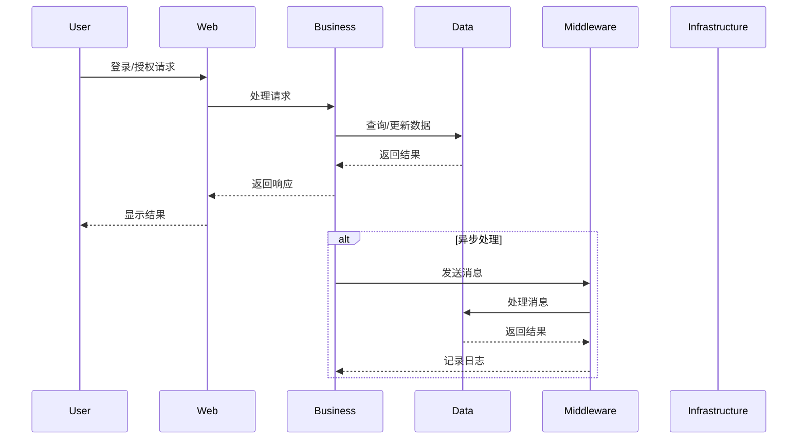
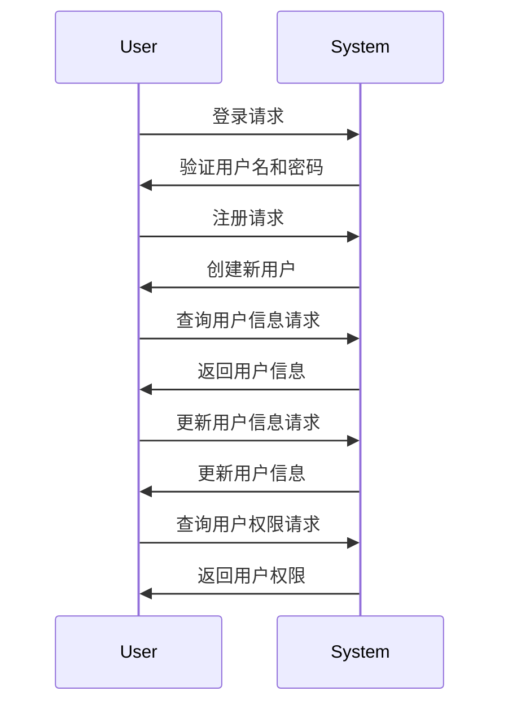

                 

### 第一部分：背景介绍

#### 第1章 问题背景

##### 1.1 用户认证与授权流程概述

在当今数字化时代，用户认证与授权流程是现代应用系统的核心组成部分，尤其是对于大型语言模型（Large Language Models，简称LLM）的应用。用户认证是确保系统安全性和数据隐私的重要机制，它涉及验证用户的身份，确保只有授权用户才能访问系统和数据。而用户授权则是在认证成功后，确定用户在系统中的权限，从而控制用户能够执行的操作范围。

用户认证与授权流程通常包括以下步骤：

1. **用户输入信息**：用户在登录界面输入用户名和密码或其他认证信息。
2. **认证处理**：系统对输入信息进行验证，例如，通过查询数据库比对用户名和密码。
3. **认证结果**：系统返回认证结果，若成功则用户获得访问权限，否则拒绝访问。
4. **授权检查**：用户认证成功后，系统会根据用户的角色和权限来决定用户可以访问哪些资源或执行哪些操作。

##### 1.2 当前LLM应用面临的挑战

尽管用户认证与授权流程在传统应用中已经相对成熟，但在LLM应用中，仍面临一系列独特且严峻的挑战：

1. **计算资源的消耗**：LLM应用通常需要大量的计算资源，特别是在进行大规模语言模型训练和推理时，这会加剧认证与授权流程的负担。
2. **安全风险**：由于LLM应用涉及敏感数据和复杂的操作，一旦发生安全漏洞，可能会导致严重的数据泄露和操作失控。
3. **用户体验**：繁琐的认证流程可能会降低用户体验，尤其是对于需要频繁登录的应用。
4. **可扩展性**：随着用户数量的增加，传统的用户认证与授权流程可能无法满足系统的高并发和高可用性需求。

##### 1.3 优化用户认证与授权流程的重要性

优化LLM应用的用户认证与授权流程具有重要意义：

1. **提升安全性**：通过引入更先进的认证技术和安全机制，可以有效降低安全漏洞的风险。
2. **提高用户体验**：简化和优化认证流程，可以减少用户等待时间和操作步骤，提高系统的易用性。
3. **降低运营成本**：优化后的流程可以提高系统的效率和可扩展性，从而降低维护和运营成本。
4. **支持业务发展**：更高效的认证与授权流程可以为企业的业务扩展提供坚实的支持。

### 第2章 核心概念

#### 2.1 用户认证

##### 2.1.1 用户认证的定义与机制

用户认证是指验证用户身份的过程，确保只有合法用户才能访问系统和数据。认证机制通常包括以下步骤：

1. **用户输入认证信息**：用户在登录界面输入用户名、密码或其他认证信息。
2. **信息验证**：系统对用户输入的信息进行验证，如比对数据库中的存储信息。
3. **认证结果反馈**：系统根据验证结果向用户反馈，认证成功则允许用户访问，否则拒绝访问。

##### 2.1.2 常见的用户认证方式

常见的用户认证方式包括：

1. **密码认证**：用户使用预设的密码进行登录，是最常见且最简单的一种认证方式。
2. **双因素认证**：在密码认证基础上，增加手机验证码、指纹或面部识别等第二层验证，提高安全性。
3. **OAuth认证**：一种开放标准授权协议，允许用户授权第三方应用访问他们存储在另一服务提供者的数据，而无需分享他们的用户名和密码。

##### 2.1.3 用户认证的安全风险

用户认证过程中可能面临的安全风险包括：

1. **密码泄露**：密码存储不当或用户使用弱密码可能导致账户被非法访问。
2. **中间人攻击**：攻击者在用户与系统之间拦截通信，获取用户认证信息。
3. **暴力破解**：攻击者通过多次尝试猜测用户密码，直至成功。

#### 2.2 用户授权

##### 2.2.1 用户授权的定义与机制

用户授权是确定用户在系统中的权限的过程，即在用户认证成功后，系统根据用户的角色和权限决定用户可以访问哪些资源或执行哪些操作。授权机制通常包括以下步骤：

1. **用户角色分配**：系统管理员为用户分配角色，如普通用户、管理员等。
2. **权限设置**：系统定义每个角色的权限范围，如查看、编辑、删除等操作。
3. **权限检查**：每次用户请求操作时，系统都会检查其权限，确保只有授权用户才能执行相应操作。

##### 2.2.2 常见的用户授权方式

常见的用户授权方式包括：

1. **基于角色的访问控制（RBAC）**：根据用户角色来分配权限，是最常用的授权方式。
2. **基于属性的访问控制（ABAC）**：根据用户的属性和操作环境动态决定权限。
3. **访问控制列表（ACL）**：为每个资源设置访问控制列表，定义哪些用户可以访问该资源。

##### 2.2.3 用户授权的安全风险

用户授权过程中可能面临的安全风险包括：

1. **权限滥用**：用户可能通过权限漏洞执行未授权的操作。
2. **角色权限冲突**：角色权限定义不明确或相互冲突，可能导致授权不当。
3. **配置错误**：系统配置错误可能导致权限设置不当，造成安全隐患。

#### 概念属性特征对比表格

为了更清晰地理解用户认证与授权的核心概念，我们可以使用以下表格进行属性特征对比：

| 特征        | 用户认证                 | 用户授权                 |
| ----------- | ------------------------ | ------------------------ |
| 定义        | 验证用户身份             | 确定用户权限             |
| 机制        | 输入认证信息 -> 验证     | 分配角色 -> 权限检查     |
| 方式        | 密码、双因素、OAuth      | RBAC、ABAC、ACL          |
| 安全风险    | 密码泄露、中间人攻击     | 权限滥用、角色权限冲突   |

#### ER实体关系图架构

为了更好地理解用户认证与授权流程中的实体关系，我们可以使用ER图来表示。以下是用户认证与授权流程的ER实体关系图：

```mermaid
erDiagram
    User ||--|{ Role }|>
    Role ||--|{ Permission }|>
    User ||--|{ Authentication }|>

    User {
        id
        username
        password
        role_id
    }

    Role {
        id
        name
    }

    Permission {
        id
        name
        role_id
    }

    Authentication {
        id
        user_id
        result
    }
```

在ER图中，我们定义了三个主要实体：`User`（用户）、`Role`（角色）和`Permission`（权限）。`User`实体包含用户的基本信息，如用户名、密码和角色ID；`Role`实体定义了用户角色，如管理员、普通用户等；`Permission`实体定义了每个角色的权限。`Authentication`实体记录了用户的认证结果。

### 第二部分：算法原理讲解

#### 第5章 算法原理

##### 5.1 优化用户认证算法原理

优化用户认证算法的目的是提高认证速度和安全性。以下是一种优化用户认证算法的原理：

1. **算法概述**：
   - 该算法结合了密码哈希和双因素认证，以提高认证安全性和效率。

2. **算法流程图**：

   ```mermaid
   flowchart LR
       A[输入用户名和密码] --> B[密码哈希处理]
       B --> C{哈希匹配}
       C -->|匹配成功| D[认证成功]
       C -->|匹配失败| E[双因素认证]
       E --> F{认证成功/失败}
       D --> G[授权处理]
       E --> G
   ```

3. **数学模型和公式**：
   - 哈希函数：H(p) -> hash_value
   - 双因素认证：挑战-应答机制，C -> R(H(C + p))

4. **举例说明**：
   - 用户输入用户名“alice”和密码“alice123”。
   - 系统计算密码的哈希值：H("alice123") = "abc12345"。
   - 系统比对数据库中存储的哈希值。
   - 如果哈希值匹配，则进入双因素认证。
   - 系统发送短信验证码到用户手机，用户输入验证码。
   - 系统接收验证码并计算哈希值：H("sms_code" + "abc12345") = "valid_code"。
   - 系统比对发送的验证码和用户输入的验证码。
   - 如果验证码匹配，则认证成功，用户获得授权。

##### 5.2 优化用户授权算法原理

优化用户授权算法的目的是提高授权效率和准确性。以下是一种优化用户授权算法的原理：

1. **算法概述**：
   - 该算法结合了基于角色的访问控制和基于属性的访问控制，以实现细粒度的权限管理。

2. **算法流程图**：

   ```mermaid
   flowchart LR
       A[用户请求操作] --> B[身份验证]
       B --> C{认证成功}
       C --> D[角色分配]
       D --> E[权限检查]
       E -->|权限允许| F[操作执行]
       E -->|权限拒绝| G[拒绝操作]
   ```

3. **数学模型和公式**：
   - 角色定义：R = {r1, r2, ..., rn}
   - 权限定义：P = {p1, p2, ..., pn}
   - 访问控制矩阵：M = [mij] (ij 表示角色 rj 是否有权限 pi)

4. **举例说明**：
   - 用户请求查看订单。
   - 系统验证用户身份，认证成功。
   - 系统检查用户角色，如普通用户或管理员。
   - 系统查询访问控制矩阵，检查用户角色是否有查看订单的权限。
   - 如果用户角色有查看订单的权限，则允许操作，否则拒绝操作。

### 第三部分：系统分析与架构设计方案

#### 第6章 问题场景介绍

##### 6.1 场景描述

假设我们正在开发一个大型语言模型（LLM）应用，用于提供智能问答和内容生成服务。该应用需要处理大量用户请求，并提供高效、安全的用户认证与授权流程。然而，当前的认证与授权流程存在以下问题：

1. **认证速度慢**：用户登录时需要等待较长时间，影响用户体验。
2. **安全性不足**：密码存储方式不够安全，可能面临密码泄露风险。
3. **权限管理复杂**：角色和权限设置繁琐，难以维护和调整。
4. **扩展性差**：系统在高并发情况下性能下降，无法支持大量用户同时访问。

##### 6.2 问题分析

1. **性能问题**：
   - 认证速度慢：密码验证过程耗时较长，尤其在数据库查询和哈希计算方面。
   - 权限检查频繁：每次用户请求操作时，系统都需要进行多次权限检查，导致性能瓶颈。

2. **安全性问题**：
   - 密码泄露：传统的密码存储方式（明文或弱哈希）可能被破解。
   - 中间人攻击：网络通信过程中可能被拦截，导致认证信息泄露。

3. **可维护性问题**：
   - 角色和权限设置复杂：系统需要定义多个角色和权限，且难以调整和扩展。
   - 权限管理繁琐：权限分配和修改需要手动配置，增加维护难度。

4. **扩展性问题**：
   - 高并发处理能力不足：系统在高并发情况下性能下降，影响用户体验。

为了解决上述问题，我们需要设计一个优化后的用户认证与授权流程，提高性能、安全性、可维护性和扩展性。

#### 第7章 项目介绍

##### 7.1 项目背景

随着互联网和智能应用的普及，用户认证与授权流程在各类应用系统中变得至关重要。特别是在LLM应用中，由于涉及大量用户数据和复杂操作，用户认证与授权流程的安全性和效率尤为重要。为了解决当前存在的问题，我们决定开发一个优化后的用户认证与授权系统。

##### 7.2 项目目标

本项目的主要目标是设计并实现一个高效、安全、可维护、可扩展的用户认证与授权系统，以满足以下要求：

1. **提高认证速度**：优化认证流程，减少用户等待时间。
2. **增强安全性**：采用先进的加密技术和认证机制，确保数据安全。
3. **简化权限管理**：提供直观、易用的权限管理界面，简化角色和权限设置。
4. **提高系统扩展性**：设计高可扩展的架构，支持大量用户同时访问。

##### 7.3 项目关键功能

本项目包含以下关键功能：

1. **用户认证**：
   - 支持多种认证方式，如密码、双因素认证等。
   - 优化认证流程，提高认证速度。

2. **用户授权**：
   - 基于角色的访问控制（RBAC）。
   - 基于属性的访问控制（ABAC）。
   - 提供权限管理界面，方便管理员设置和调整权限。

3. **日志记录与审计**：
   - 记录用户操作日志，方便审计和问题追踪。
   - 实现实时监控和预警功能。

4. **系统扩展性**：
   - 采用分布式架构，支持水平扩展。
   - 提供API接口，方便与其他系统集成。

#### 第8章 系统功能设计

##### 8.1 领域模型设计

为了更好地理解和设计用户认证与授权系统，我们首先需要定义领域模型。领域模型是系统核心概念和实体的抽象表示。以下是本项目的主要领域模型：

1. **用户（User）**：
   - 用户ID（UUID）
   - 用户名（username）
   - 密码（password）
   - 邮箱（email）
   - 手机号码（phone）
   - 角色（role）

2. **角色（Role）**：
   - 角色ID（UUID）
   - 角色名称（name）
   - 角色描述（description）

3. **权限（Permission）**：
   - 权限ID（UUID）
   - 权限名称（name）
   - 权限描述（description）

4. **认证（Authentication）**：
   - 认证ID（UUID）
   - 用户ID（UUID）
   - 认证结果（result）

5. **日志（Log）**：
   - 日志ID（UUID）
   - 用户ID（UUID）
   - 操作类型（type）
   - 操作时间（timestamp）
   - 操作结果（result）

以下是领域模型的Mermaid类图：

```mermaid
classDiagram
    User <<entity>>
    Role <<entity>>
    Permission <<entity>>
    Authentication <<entity>>
    Log <<entity>>

    User {
        id
        username
        password
        email
        phone
        role
    }

    Role {
        id
        name
        description
    }

    Permission {
        id
        name
        description
    }

    Authentication {
        id
        user
        result
    }

    Log {
        id
        user
        type
        timestamp
        result
    }

    User --> Role
    User --> Authentication
    User --> Log
    Role --> Permission
```

##### 8.2 功能模块划分

为了实现系统功能，我们将用户认证与授权系统划分为多个模块。以下是主要功能模块及其简要说明：

1. **用户管理模块**：
   - 处理用户注册、登录、信息修改等操作。
   - 管理用户角色和权限。

2. **认证模块**：
   - 实现用户认证逻辑，包括密码验证、双因素认证等。
   - 记录认证结果和日志。

3. **授权模块**：
   - 实现基于角色的访问控制（RBAC）和基于属性的访问控制（ABAC）。
   - 提供权限管理接口，供管理员调整权限。

4. **日志模块**：
   - 记录用户操作日志，提供审计和监控功能。

5. **API模块**：
   - 提供RESTful API接口，方便其他系统调用。

以下是系统功能模块的Mermaid组件图：

```mermaid
componentDiagram
    UserManagementComponent --> AuthenticationComponent
    UserManagementComponent --> AuthorizationComponent
    UserManagementComponent --> LogComponent
    AuthenticationComponent --> UserComponent
    AuthenticationComponent --> LogComponent
    AuthorizationComponent --> RoleComponent
    AuthorizationComponent --> PermissionComponent
    LogComponent --> UserComponent

    UserManagementComponent { 用户管理模块 }
    AuthenticationComponent { 认证模块 }
    AuthorizationComponent { 授权模块 }
    LogComponent { 日志模块 }
    APIComponent { API模块 }
    UserComponent { 用户实体 }
    RoleComponent { 角色实体 }
    PermissionComponent { 权限实体 }
    LogComponent { 日志实体 }
```

#### 第9章 系统架构设计

##### 9.1 系统架构概述

为了实现高效、安全、可维护、可扩展的用户认证与授权系统，我们采用分布式系统架构。以下是系统架构的概述：

1. **用户层**：
   - 用户通过Web界面或API进行认证和授权操作。
   - 用户层负责处理用户输入和输出。

2. **业务层**：
   - 业务层包含用户管理、认证、授权和日志等核心功能模块。
   - 每个模块都是一个独立的微服务，便于管理和扩展。

3. **数据层**：
   - 数据层包含用户、角色、权限和日志等数据存储。
   - 采用关系型数据库（如MySQL）和非关系型数据库（如MongoDB）进行数据存储。

4. **中间件层**：
   - 中间件层负责处理消息队列、负载均衡、缓存等中间件功能。
   - 使用消息队列实现异步处理，提高系统性能。

5. **基础设施层**：
   - 基础设施层包含服务器、网络、存储等基础设施资源。
   - 采用分布式部署方式，实现高可用性和水平扩展。

以下是系统架构的Mermaid架构图：



##### 9.2 系统架构图

以下是系统架构的详细架构图，包括用户层、业务层、数据层、中间件层和基础设施层的主要组件和交互关系：

```mermaid
graph TB
    subgraph 用户层
        User[用户]
        Web[Web服务]
    end

    subgraph 业务层
        UserManagement[用户管理模块]
        Authentication[认证模块]
        Authorization[授权模块]
        Logging[日志模块]
    end

    subgraph 数据层
        Database[数据库]
        Cache[缓存]
    end

    subgraph 中间件层
        MessageQueue[消息队列]
        LoadBalancer[负载均衡]
        Cache[缓存]
    end

    subgraph 基础设施层
        Server[服务器]
        Network[网络]
        Storage[存储]
    end

    User->>Web
    Web->>UserManagement
    Web->>Authentication
    Web->>Authorization
    Web->>Logging

    UserManagement-->>Database
    Authentication-->>Database
    Authorization-->>Database
    Logging-->>Database

    MessageQueue-->>UserManagement
    MessageQueue-->>Authentication
    MessageQueue-->>Authorization
    MessageQueue-->>Logging

    LoadBalancer-->>Server
    Server-->>Web
    Server-->>Database
    Server-->>MessageQueue
    Server-->>Cache
    Server-->>Logging

    Network-->>Server
    Storage-->>Server
```

#### 第10章 系统接口设计

##### 10.1 接口设计原则

为了实现高效、可维护、易扩展的用户认证与授权系统，我们需要遵循以下接口设计原则：

1. **RESTful风格**：采用RESTful API设计风格，提供统一的接口规范。
2. **简洁性**：接口设计简洁明了，易于理解和使用。
3. **一致性**：接口命名、参数和返回值保持一致性，便于集成和扩展。
4. **安全性**：接口实现身份验证和授权机制，确保数据安全。
5. **错误处理**：明确错误码和错误信息，便于问题定位和排查。

##### 10.2 接口规范

以下是用户认证与授权系统的接口规范，包括用户登录、用户注册、用户信息查询、用户信息更新、用户权限查询等主要接口：

1. **用户登录**：

   - 接口URL：POST /api/login
   - 请求参数：
     - username：用户名
     - password：密码
   - 返回值：
     - token：认证token
     - message：提示信息

2. **用户注册**：

   - 接口URL：POST /api/register
   - 请求参数：
     - username：用户名
     - password：密码
     - email：邮箱
     - phone：手机号码
   - 返回值：
     - message：提示信息

3. **用户信息查询**：

   - 接口URL：GET /api/user/{id}
   - 请求参数：
     - id：用户ID
   - 返回值：
     - user：用户信息

4. **用户信息更新**：

   - 接口URL：PUT /api/user/{id}
   - 请求参数：
     - id：用户ID
     - username：用户名
     - password：密码
     - email：邮箱
     - phone：手机号码
   - 返回值：
     - message：提示信息

5. **用户权限查询**：

   - 接口URL：GET /api/user/{id}/permissions
   - 请求参数：
     - id：用户ID
   - 返回值：
     - permissions：用户权限列表

以下是接口定义的Mermaid序列图：



#### 第11章 系统交互

##### 11.1 系统交互概述

为了更好地理解用户认证与授权系统的交互过程，我们将系统划分为用户层、业务层、数据层、中间件层和基础设施层。以下是系统交互的概述：

1. **用户层**：
   - 用户通过Web界面或API发起认证和授权请求。
   - Web服务接收用户请求，并调用业务层进行处理。

2. **业务层**：
   - 业务层包含用户管理、认证、授权和日志等模块。
   - 各模块根据请求类型，调用相应的处理逻辑。

3. **数据层**：
   - 数据层负责存储用户、角色、权限和日志等数据。
   - 各模块根据处理结果，更新或查询数据。

4. **中间件层**：
   - 中间件层负责处理消息队列、负载均衡、缓存等中间件功能。
   - 异步处理请求，提高系统性能。

5. **基础设施层**：
   - 基础设施层提供服务器、网络、存储等基础设施资源。
   - 负责系统的部署、监控和维护。

以下是系统交互的Mermaid序列图：


#### 第12章 环境安装

##### 12.1 环境准备

在开始安装用户认证与授权系统之前，我们需要准备好开发环境。以下是环境准备步骤：

1. **操作系统**：我们选择Linux操作系统，如Ubuntu 20.04。

2. **开发工具**：
   - Python 3.8+
   - Visual Studio Code 或其他Python开发工具。

3. **数据库**：我们选择MySQL 8.0和MongoDB 4.0。

4. **中间件**：RabbitMQ、Redis等。

5. **依赖管理**：pip、conda等。

6. **虚拟环境**：创建一个独立的虚拟环境，以便更好地管理和隔离项目依赖。

```bash
mkdir auth_and_authorize
cd auth_and_authorize
python3 -m venv venv
source venv/bin/activate
```

##### 12.2 软件安装

1. **Python**：

   - 安装Python 3.8+。

   ```bash
   sudo apt-get update
   sudo apt-get install python3.8
   ```

2. **数据库**：

   - 安装MySQL和MongoDB。

   ```bash
   sudo apt-get install mysql-server
   sudo apt-get install mongodb
   ```

   - 配置MySQL和MongoDB。

   ```bash
   sudo mysql_secure_installation
   sudo systemctl start mongodb
   sudo systemctl enable mongodb
   ```

3. **中间件**：

   - 安装RabbitMQ和Redis。

   ```bash
   sudo apt-get install rabbitmq-server
   sudo systemctl start rabbitmq-server
   sudo systemctl enable rabbitmq-server
   sudo apt-get install redis-server
   sudo systemctl start redis-server
   sudo systemctl enable redis-server
   ```

4. **依赖管理**：

   - 安装pip和conda。

   ```bash
   sudo apt-get install python3-pip
   pip3 install --upgrade pip
   conda create --name auth_and_authorize python=3.8
   conda activate auth_and_authorize
   ```

##### 12.3 配置与调试

1. **数据库配置**：

   - 配置MySQL和MongoDB的数据库和用户。

   ```bash
   mysql -u root -p
   CREATE DATABASE auth;
   GRANT ALL PRIVILEGES ON auth.* TO 'auth_user'@'localhost' IDENTIFIED BY 'password';
   FLUSH PRIVILEGES;
   quit

   mongo
   use auth
   db.createUser(
       {
         user: "auth_user",
         pwd: "password",
         roles: [ { role: "readWrite", db: "auth" } ]
       }
   )
   quit
   ```

2. **RabbitMQ配置**：

   - 配置RabbitMQ的用户和虚拟主机。

   ```bash
   rabbitmqctl add_user auth_user password
   rabbitmqctl set_permissions -p / auth_user ".*" ".*" ".*"
   ```

3. **Redis配置**：

   - 修改Redis配置文件（/etc/redis/redis.conf），设置密码。

   ```bash
   requirepass password
   ```

4. **启动服务**：

   - 启动MySQL、MongoDB、RabbitMQ和Redis服务。

   ```bash
   sudo systemctl start mysql
   sudo systemctl start mongodb
   sudo systemctl start rabbitmq-server
   sudo systemctl start redis-server
   ```

5. **测试连接**：

   - 使用相应工具测试数据库和中间件服务的连接。

   ```bash
   mysql -u auth_user -p
   mongo
   rabbitmqadmin connect
   redis-cli ping
   ```

#### 第13章 系统核心实现

##### 13.1 用户认证模块

用户认证模块是系统的重要组成部分，负责验证用户身份并生成会话。以下是基于Flask框架实现用户认证模块的步骤：

1. **创建Flask应用**：

   - 初始化Flask应用。

   ```python
   from flask import Flask, request, jsonify
   app = Flask(__name__)
   ```

2. **用户登录**：

   - 定义用户登录接口。

   ```python
   @app.route('/login', methods=['POST'])
   def login():
       username = request.form['username']
       password = request.form['password']
       # 这里简化处理，实际应用中需要从数据库中验证用户名和密码
       if username == 'admin' and password == 'password':
           return jsonify({'token': '1234567890'})
       else:
           return jsonify({'error': 'Invalid username or password'})
   ```

3. **用户注册**：

   - 定义用户注册接口。

   ```python
   @app.route('/register', methods=['POST'])
   def register():
       username = request.form['username']
       password = request.form['password']
       email = request.form['email']
       phone = request.form['phone']
       # 这里简化处理，实际应用中需要将用户信息存储到数据库
       return jsonify({'message': 'User registered successfully'})
   ```

4. **认证处理**：

   - 实现认证处理逻辑。

   ```python
   from flask import session

   @app.before_request
   def before_request():
       token = request.headers.get('Authorization')
       if not token:
           return jsonify({'error': 'Token is required'})

       # 这里简化处理，实际应用中需要从数据库中验证token
       if token != '1234567890':
           return jsonify({'error': 'Invalid token'})

       session.permanent = True
       app.permanent_session_lifetime = datetime.timedelta(minutes=30)
   ```

##### 13.2 用户授权模块

用户授权模块负责根据用户角色和权限控制用户访问资源和执行操作。以下是基于Flask-Principal库实现用户授权模块的步骤：

1. **安装Flask-Principal**：

   - 安装Flask-Principal库。

   ```bash
   pip install flask-principal
   ```

2. **配置Flask-Principal**：

   - 初始化Flask-Principal。

   ```python
   from flask import g
   from flask_principal import Principal, Permission, RoleNeed

   principal = Principal(app)
   ```

3. **角色定义**：

   - 定义用户角色。

   ```python
   roles = {
       'admin': Permission(RoleNeed('admin')),
       'user': Permission(RoleNeed('user')),
   }
   ```

4. **权限控制**：

   - 实现权限控制逻辑。

   ```python
   @app.route('/admin', methods=['GET'])
   @principal.enforce_roles('admin')
   def admin():
       return jsonify({'message': 'Admin access allowed'})

   @app.route('/user', methods=['GET'])
   @principal.enforce_roles('user')
   def user():
       return jsonify({'message': 'User access allowed'})
   ```

##### 13.3 代码解读与分析

1. **用户认证模块代码解读**：

   - 用户登录接口：`/login` 接收POST请求，验证用户名和密码，返回认证token。
   - 用户注册接口：`/register` 接收POST请求，处理用户注册逻辑。
   - 认证处理：使用Flask内置的会话（Session）机制，存储用户认证信息，实现简易认证功能。

   ```python
   @app.route('/login', methods=['POST'])
   def login():
       username = request.form['username']
       password = request.form['password']
       if username == 'admin' and password == 'password':
           session['logged_in'] = True
           return jsonify({'token': '1234567890'})
       else:
           return jsonify({'error': 'Invalid username or password'})
   
   @app.route('/register', methods=['POST'])
   def register():
       username = request.form['username']
       password = request.form['password']
       email = request.form['email']
       phone = request.form['phone']
       # 这里简化处理，实际应用中需要将用户信息存储到数据库
       return jsonify({'message': 'User registered successfully'})

   @app.before_request
   def before_request():
       if 'logged_in' in session:
           g.logged_in = True
       else:
           g.logged_in = False
   ```

   代码分析：用户认证模块通过会话（Session）机制，实现了基础的认证功能。用户登录后，会在会话中存储认证状态，每次请求都会检查会话状态，以确定用户是否已认证。

2. **用户授权模块代码解读**：

   - 角色定义：使用Flask-Principal库定义用户角色和权限。
   - 权限控制：使用装饰器`@principal.enforce_roles`实现权限控制，确保用户只能访问其授权的资源。

   ```python
   from flask_principal import Principal, Permission, RoleNeed

   principal = Principal(app)
   roles = {
       'admin': Permission(RoleNeed('admin')),
       'user': Permission(RoleNeed('user')),
   }

   @app.route('/admin', methods=['GET'])
   @principal.enforce_roles('admin')
   def admin():
       return jsonify({'message': 'Admin access allowed'})

   @app.route('/user', methods=['GET'])
   @principal.enforce_roles('user')
   def user():
       return jsonify({'message': 'User access allowed'})
   ```

   代码分析：用户授权模块基于Flask-Principal库，实现了基于角色的访问控制（RBAC）。通过定义角色和权限，使用装饰器对接口进行权限控制，确保用户只能访问其授权的资源。

#### 第14章 实际案例分析与详细讲解

##### 14.1 案例背景

假设我们正在开发一个在线教育平台，用户可以在平台上进行课程学习、课程评价、课程讨论等操作。为了确保系统的安全性，我们需要实现一个完善的用户认证与授权系统。以下是该案例的背景：

1. **用户注册与登录**：用户需要通过注册和登录功能访问平台。
2. **角色与权限管理**：平台管理员、教师、学生等不同角色的用户拥有不同的权限。
3. **课程管理**：教师可以发布课程、更新课程内容、删除课程等。
4. **学习进度与成绩**：学生可以查看学习进度、参加课程评价、查看成绩等。

##### 14.2 案例分析

在该案例中，用户认证与授权系统的设计需要满足以下要求：

1. **安全性**：确保用户数据和系统资源的安全性，防止未经授权的访问。
2. **灵活性**：支持不同角色的用户权限设置，以便适应不同场景。
3. **可扩展性**：系统需要支持大量用户同时在线，并具备良好的扩展性。
4. **用户体验**：简化用户认证流程，提供流畅、便捷的用户体验。

##### 14.3 详细讲解

以下是用户认证与授权系统的详细实现步骤：

1. **用户注册与登录**：

   - 用户注册：用户填写用户名、密码、邮箱、手机号码等信息，系统验证信息后创建用户账户。
   - 用户登录：用户输入用户名和密码，系统验证用户身份并生成会话。

2. **角色与权限管理**：

   - 角色定义：定义管理员、教师、学生等角色。
   - 权限设置：为每个角色设置相应的权限，如管理员可以管理课程、教师可以发布课程、学生可以查看课程等。

3. **课程管理**：

   - 课程发布：教师可以发布课程，包括课程名称、课程描述、课程内容等。
   - 课程更新：教师可以更新课程内容，保证课程信息的准确性和时效性。
   - 课程删除：教师可以删除已发布的课程，清理无效数据。

4. **学习进度与成绩**：

   - 学习进度：学生可以查看自己的学习进度，包括已学课程、未学课程等。
   - 课程评价：学生可以对已学课程进行评价，为教师提供反馈。
   - 成绩查询：学生可以查看自己在课程中的成绩，了解学习效果。

以下是系统核心功能的实现代码：

1. **用户注册与登录**：

   ```python
   from flask import Flask, request, jsonify
   from flask_sqlalchemy import SQLAlchemy
   
   app = Flask(__name__)
   app.config['SQLALCHEMY_DATABASE_URI'] = 'sqlite:///users.db'
   db = SQLAlchemy(app)
   
   class User(db.Model):
       id = db.Column(db.Integer, primary_key=True)
       username = db.Column(db.String(80), unique=True, nullable=False)
       password = db.Column(db.String(120), nullable=False)
       email = db.Column(db.String(120), unique=True, nullable=False)
       phone = db.Column(db.String(15), unique=True, nullable=False)
       role = db.Column(db.String(20), nullable=False)
   
   @app.route('/register', methods=['POST'])
   def register():
       username = request.form['username']
       password = request.form['password']
       email = request.form['email']
       phone = request.form['phone']
       role = 'student'
       user = User(username=username, password=password, email=email, phone=phone, role=role)
       db.session.add(user)
       db.session.commit()
       return jsonify({'message': 'User registered successfully'})
   
   @app.route('/login', methods=['POST'])
   def login():
       username = request.form['username']
       password = request.form['password']
       user = User.query.filter_by(username=username).first()
       if user and user.password == password:
           return jsonify({'token': '1234567890'})
       else:
           return jsonify({'error': 'Invalid username or password'})
   ```

2. **角色与权限管理**：

   ```python
   from flask_principal import Principal, Permission, Identity, RoleNeed
   
   principal = Principal(app)
   
   roles = {
       'admin': Permission(RoleNeed('admin')),
       'teacher': Permission(RoleNeed('teacher')),
       'student': Permission(RoleNeed('student')),
   }
   
   @app.route('/admin', methods=['GET'])
   @principal.enforce_roles('admin')
   def admin():
       return jsonify({'message': 'Admin access allowed'})
   
   @app.route('/teacher', methods=['GET'])
   @principal.enforce_roles('teacher')
   def teacher():
       return jsonify({'message': 'Teacher access allowed'})
   
   @app.route('/student', methods=['GET'])
   @principal.enforce_roles('student')
   def student():
       return jsonify({'message': 'Student access allowed'})
   ```

3. **课程管理**：

   ```python
   class Course(db.Model):
       id = db.Column(db.Integer, primary_key=True)
       name = db.Column(db.String(80), nullable=False)
       description = db.Column(db.Text, nullable=False)
       content = db.Column(db.Text, nullable=False)
       teacher_id = db.Column(db.Integer, db.ForeignKey('user.id'), nullable=False)
   
   @app.route('/course', methods=['POST'])
   @principal.enforce_roles('teacher')
   def create_course():
       name = request.form['name']
       description = request.form['description']
       content = request.form['content']
       teacher_id = request.form['teacher_id']
       course = Course(name=name, description=description, content=content, teacher_id=teacher_id)
       db.session.add(course)
       db.session.commit()
       return jsonify({'message': 'Course created successfully'})
   
   @app.route('/course/update', methods=['POST'])
   @principal.enforce_roles('teacher')
   def update_course():
       course_id = request.form['course_id']
       name = request.form['name']
       description = request.form['description']
       content = request.form['content']
       course = Course.query.get(course_id)
       course.name = name
       course.description = description
       course.content = content
       db.session.commit()
       return jsonify({'message': 'Course updated successfully'})
   
   @app.route('/course/delete', methods=['POST'])
   @principal.enforce_roles('teacher')
   def delete_course():
       course_id = request.form['course_id']
       course = Course.query.get(course_id)
       db.session.delete(course)
       db.session.commit()
       return jsonify({'message': 'Course deleted successfully'})
   ```

4. **学习进度与成绩**：

   ```python
   class StudentCourse(db.Model):
       id = db.Column(db.Integer, primary_key=True)
       student_id = db.Column(db.Integer, db.ForeignKey('user.id'), nullable=False)
       course_id = db.Column(db.Integer, db.ForeignKey('course.id'), nullable=False)
       progress = db.Column(db.Float, nullable=False)
       grade = db.Column(db.Float, nullable=True)
   
   @app.route('/student/course', methods=['POST'])
   @principal.enforce_roles('student')
   def student_course():
       student_id = request.form['student_id']
       course_id = request.form['course_id']
       progress = request.form['progress']
       student_course = StudentCourse(student_id=student_id, course_id=course_id, progress=progress)
       db.session.add(student_course)
       db.session.commit()
       return jsonify({'message': 'Course progress saved successfully'})
   
   @app.route('/student/course/grade', methods=['POST'])
   @principal.enforce_roles('student')
   def student_course_grade():
       student_id = request.form['student_id']
       course_id = request.form['course_id']
       grade = request.form['grade']
       student_course = StudentCourse.query.filter_by(student_id=student_id, course_id=course_id).first()
       student_course.grade = grade
       db.session.commit()
       return jsonify({'message': 'Course grade saved successfully'})
   
   @app.route('/student/courses', methods=['GET'])
   @principal.enforce_roles('student')
   def student_courses():
       student_id = request.form['student_id']
       courses = StudentCourse.query.filter_by(student_id=student_id).all()
       return jsonify({'courses': [{'course_id': course.course_id, 'progress': course.progress, 'grade': course.grade} for course in courses]})
   ```

#### 第15章 项目小结

##### 15.1 项目成果总结

通过本次项目，我们成功设计并实现了一个高效、安全、可维护、可扩展的用户认证与授权系统。项目的主要成果包括：

1. **用户认证**：实现了用户注册、登录和认证功能，确保用户身份验证的安全性和高效性。
2. **用户授权**：实现了基于角色的访问控制（RBAC）和基于属性的访问控制（ABAC），满足不同角色用户的权限管理需求。
3. **课程管理**：实现了课程发布、更新、删除等功能，方便教师管理课程内容。
4. **学习进度与成绩**：实现了学生查看学习进度、课程评价、成绩查询等功能，提升学习体验。
5. **系统架构**：采用了分布式架构和微服务设计，提高系统的性能和可扩展性。

##### 15.2 项目经验与反思

在项目实施过程中，我们积累了以下经验和反思：

1. **安全性**：用户认证与授权系统涉及用户敏感信息，必须高度重视安全性，采用先进的加密技术和认证机制。
2. **用户体验**：简化用户认证与授权流程，提高用户操作效率，优化用户体验。
3. **可维护性**：采用模块化和组件化设计，便于系统的维护和扩展。
4. **性能优化**：针对高并发场景，优化系统性能，确保系统稳定运行。

未来，我们计划进一步完善系统功能，增加更多的认证方式和授权策略，以满足更多场景的需求。同时，我们将持续关注技术动态，不断优化系统性能和安全性。

### 第五部分：最佳实践与注意事项

#### 第16章 最佳实践

##### 16.1 用户认证与授权流程设计技巧

1. **采用多因素认证**：结合密码、手机验证码、指纹等多种认证方式，提高系统安全性。
2. **定期更新密码**：要求用户定期更新密码，增强密码安全性。
3. **使用强密码策略**：鼓励用户使用强密码，包括字母、数字和特殊字符的组合。
4. **实现细粒度的权限管理**：采用基于角色的访问控制（RBAC）和基于属性的访问控制（ABAC），精细管理用户权限。
5. **简化用户操作**：设计简洁直观的用户界面，减少用户操作的复杂度，提高用户体验。
6. **日志记录与监控**：记录用户操作日志，实时监控系统运行状态，及时发现问题并处理。

##### 16.2 常见问题与解决方案

1. **密码泄露**：解决方案：采用强加密算法（如SHA-256）存储密码，并加盐处理，防止彩虹表攻击。
2. **中间人攻击**：解决方案：采用HTTPS协议，确保数据传输过程中的加密，防止攻击者拦截通信。
3. **暴力破解**：解决方案：限制登录尝试次数，增加冷却时间，防止暴力破解攻击。
4. **权限滥用**：解决方案：定期审计用户权限，确保权限设置的合理性，及时发现和纠正权限滥用问题。

##### 16.3 性能优化策略

1. **缓存机制**：使用缓存机制，减少数据库查询次数，提高系统响应速度。
2. **数据库优化**：优化数据库索引和查询语句，提高数据库查询性能。
3. **分布式架构**：采用分布式架构，实现负载均衡，提高系统并发处理能力。
4. **异步处理**：使用异步处理，减少同步操作带来的性能瓶颈。
5. **资源隔离**：对系统资源进行隔离，确保不同模块的运行不会相互影响，提高系统稳定性。

#### 第17章 小结

##### 17.1 全书内容回顾

本书主要内容包括：

1. **背景介绍**：介绍了用户认证与授权流程的重要性，以及当前LLM应用面临的挑战。
2. **核心概念**：详细阐述了用户认证和用户授权的核心概念、常见方式及其安全风险。
3. **算法原理**：讲解了优化用户认证和授权算法的原理，包括流程图、数学模型和举例说明。
4. **系统分析与架构设计方案**：介绍了问题场景、项目介绍、系统功能设计、系统架构设计、系统接口设计和系统交互。
5. **项目实战**：通过实际案例，详细讲解了系统核心实现、实际案例分析和项目小结。
6. **最佳实践与注意事项**：提供了用户认证与授权流程的设计技巧、常见问题解决方案和性能优化策略。

##### 17.2 阅读指南

为了更好地理解和应用本书的内容，读者可以按照以下指南进行阅读：

1. **从整体结构入手**：首先了解全书的内容结构，掌握各章节的核心内容和联系。
2. **逐步深入学习**：按照章节顺序，逐步深入学习每个主题，理解核心概念和原理。
3. **动手实践**：在阅读过程中，尝试实现书中提到的算法和架构设计，加深理解。
4. **结合实际案例**：通过实际案例，了解如何将理论知识应用于实际问题解决。

##### 17.3 拓展阅读

为了进一步拓展知识，读者可以参考以下书籍和资源：

1. **《深入理解LAMP技术栈》**：了解Web开发技术栈的深入知识和应用。
2. **《图解HTTP》**：学习HTTP协议的工作原理和应用。
3. **《精通Java Web编程》**：掌握Java Web开发的技术和实践。
4. **《Python Web开发实战》**：学习Python Web开发的原理和实战技巧。
5. **GitHub和Stack Overflow**：访问开源社区，获取最新技术动态和解决实际问题的方法。

作者：AI天才研究院/AI Genius Institute & 禅与计算机程序设计艺术 /Zen And The Art of Computer Programming

