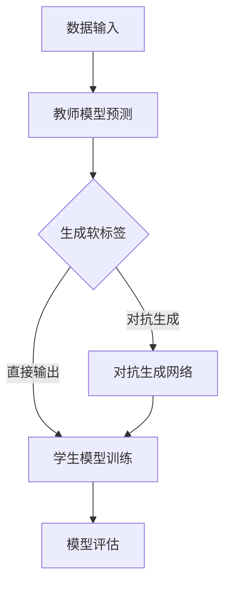
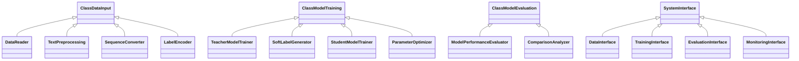
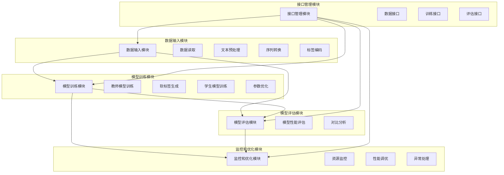
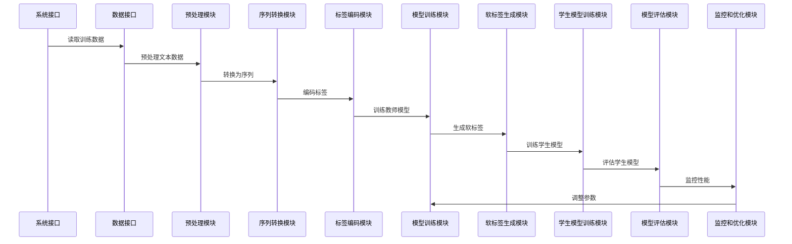

                 

### 引言与背景介绍

近年来，随着深度学习和人工智能技术的迅猛发展，大型语言模型（Large Language Models, LLM）在自然语言处理（Natural Language Processing, NLP）领域取得了显著的成果。LLM具备强大的文本生成、理解、翻译和对话能力，广泛应用于聊天机器人、内容生成、搜索引擎和辅助写作等领域。然而，随着LLM模型的规模和复杂度不断增加，训练和部署这些模型所需的计算资源和时间也急剧增加，导致成本和效率问题日益突出。

知识蒸馏（Knowledge Distillation）作为一种有效的模型压缩技术，通过将教师模型（Teacher Model）的知识迁移到学生模型（Student Model）中，从而实现模型压缩和加速部署。在LLM应用中，知识蒸馏不仅可以减小模型的规模，提高计算效率，还能在一定程度上保持模型的原有性能。因此，优化知识蒸馏流程对于提升LLM应用的性能和实用性具有重要意义。

本文将围绕优化LLM应用的知识蒸馏流程进行探讨。首先，我们将介绍知识蒸馏的基本概念、原理和方法，帮助读者理解知识蒸馏的核心机制。接着，我们将深入分析知识蒸馏在LLM应用中的具体实现，包括算法设计、系统架构和实现细节。此外，本文还将通过实际案例展示知识蒸馏的应用效果，并提供优化策略和最佳实践。最后，我们将探讨知识蒸馏技术的未来发展趋势和潜在挑战。

通过本文的详细分析，我们希望读者能够系统地掌握知识蒸馏技术，并能够在实际项目中灵活应用，从而提升LLM应用的整体性能。

### 1.1 问题背景

随着人工智能技术的快速发展，大型语言模型（LLM）已经成为自然语言处理（NLP）领域的重要工具。LLM通过深度神经网络学习海量文本数据，从而具备强大的文本生成、理解、翻译和对话能力。这些模型在聊天机器人、内容生成、搜索引擎和辅助写作等领域得到了广泛应用，显著提升了相关应用的用户体验和服务质量。

然而，LLM模型的训练和部署过程中也面临诸多挑战。首先，随着模型规模和复杂度的增加，训练所需的数据量呈指数级增长，导致训练时间显著延长。其次，大规模模型对计算资源的需求也急剧增加，训练和推理过程中需要大量的计算资源和存储空间。这不仅增加了计算成本，也限制了模型在移动设备和边缘计算环境中的应用。

为了解决上述问题，模型压缩技术应运而生。知识蒸馏（Knowledge Distillation）是一种有效的模型压缩方法，通过将教师模型（Teacher Model）的知识迁移到学生模型（Student Model）中，实现模型的压缩和加速部署。在LLM应用中，知识蒸馏不仅可以减少模型规模，提高计算效率，还能在一定程度上保持原有模型的性能。

知识蒸馏的原理是通过训练一个较小的学生模型来模仿教师模型的行为，从而降低模型复杂度。具体来说，教师模型输出软标签（Soft Labels），即概率分布，而学生模型则根据这些软标签进行训练，以学习到教师模型的知识。这种方法不仅能够有效减少模型参数和计算量，还能提高模型的推理速度和部署效率。

知识蒸馏技术在LLM应用中的重要性体现在以下几个方面：

1. **模型压缩**：通过知识蒸馏，可以将大规模的LLM模型压缩为较小的模型，从而减少模型存储和计算资源的需求。
2. **性能保持**：知识蒸馏能够在一定程度上保持教师模型的原有性能，即使学生模型规模较小，其表现仍能接近教师模型。
3. **快速部署**：知识蒸馏使得小规模模型能够快速部署到移动设备和边缘计算环境中，满足实时应用需求。
4. **跨平台应用**：知识蒸馏技术使得不同平台和应用场景下的模型压缩和部署变得更加灵活和高效。

总之，知识蒸馏技术在LLM应用中具有重要的理论和实际价值。通过优化知识蒸馏流程，可以提高LLM应用的性能和实用性，为人工智能技术的发展和应用拓展提供有力支持。

### 1.2 问题描述

在LLM应用中，知识蒸馏流程涉及多个关键步骤，包括教师模型选择、数据预处理、软标签生成、学生模型训练和评估等。尽管知识蒸馏技术具有显著的优势，但在实际应用中仍面临一系列问题和挑战。

首先，教师模型选择是一个关键问题。教师模型的性能直接影响到知识蒸馏的效果，选择一个合适的教师模型对于知识蒸馏的成功至关重要。然而，当前没有统一的教师模型选择标准，需要根据具体应用场景进行选择和调整。

其次，数据预处理是知识蒸馏流程中的另一个重要环节。数据的质量和预处理方法对知识蒸馏效果有显著影响。常见的预处理方法包括数据清洗、数据增强和归一化等，但不同预处理方法的效果可能因数据集和应用场景而异。

第三，软标签生成是知识蒸馏的核心步骤之一。教师模型输出软标签（Soft Labels），即概率分布，这些软标签作为学生模型的训练目标。软标签的质量和生成方法直接影响学生模型的学习效果。常见的软标签生成方法包括基于教师模型输出的概率分布和基于对抗性生成网络等。

第四，学生模型训练也是知识蒸馏流程中的关键步骤。学生模型通过学习软标签来模仿教师模型的行为。训练过程中需要优化多个参数，包括温度参数、损失函数和优化算法等。参数选择和优化方法对训练效果有显著影响。

最后，评估和优化是知识蒸馏流程的必要环节。评估方法主要包括模型准确率、推理速度和资源消耗等指标。通过评估结果，可以进一步优化知识蒸馏流程，提高模型性能和部署效率。

综上所述，知识蒸馏流程涉及多个关键步骤，每个步骤都存在一定的挑战和问题。优化这些关键步骤，对于提升LLM应用的知识蒸馏效果具有重要意义。下面将详细介绍这些关键步骤，探讨其技术实现和优化方法。

### 1.3 问题解决

为了优化LLM应用中的知识蒸馏流程，我们需要从多个角度进行系统性的分析和改进。以下是一些具体的解决方案，涵盖教师模型选择、数据预处理、软标签生成、学生模型训练和评估等关键步骤。

#### 教师模型选择

1. **选择标准**：教师模型的选择应基于模型性能、训练成本和实际应用需求。常用的选择标准包括：
   - **性能指标**：选择在目标任务上表现优秀的模型，如高准确率、低损失函数值等。
   - **训练成本**：考虑模型的训练时间和计算资源消耗，选择成本相对较低的模型。
   - **模型规模**：根据实际应用场景，选择模型规模合适的教师模型，以平衡性能和计算资源。

2. **模型优化**：对于特定任务，可以通过微调或改进现有模型来提升教师模型的性能。例如，采用更深的神经网络结构、增加训练数据集或引入迁移学习技术。

#### 数据预处理

1. **数据清洗**：确保数据质量，去除噪声和异常值，对缺失值进行填补或删除。
2. **数据增强**：通过数据增强技术，如数据扩充、变换和生成等，提高数据多样性和模型的泛化能力。
3. **归一化和标准化**：对输入数据进行归一化和标准化处理，以减小不同特征之间的差异，提高模型的训练效果。
4. **特征选择**：通过特征选择技术，选择对模型性能有显著影响的特征，降低数据维度和计算复杂度。

#### 软标签生成

1. **概率分布**：教师模型输出软标签，即概率分布。为提高软标签质量，可以采用以下方法：
   - **温度调节**：通过调节温度参数，调整概率分布的平滑程度，以优化学生模型的学习效果。
   - **对抗性生成**：利用对抗性生成网络（如生成对抗网络GAN），生成更具代表性的软标签，增强学生模型的学习能力。

2. **标签质量评估**：对软标签进行质量评估，根据评估结果调整生成方法，如增加对抗性训练或优化概率分布生成算法。

#### 学生模型训练

1. **优化算法**：选择合适的优化算法，如Adam、RMSprop等，提高训练效率和收敛速度。
2. **损失函数**：设计适合知识蒸馏的损失函数，如交叉熵损失、对比损失等，以平衡模型性能和计算复杂度。
3. **温度调节**：在训练过程中，动态调整温度参数，以优化学生模型的学习效果。
4. **学习率调度**：采用合适的学习率调度策略，如学习率递减、恒定学习率等，以防止模型过拟合和提升泛化能力。

#### 评估和优化

1. **模型评估**：使用准确率、F1分数、推理速度等指标，对知识蒸馏后的学生模型进行评估，确保模型性能满足实际应用需求。
2. **性能优化**：根据评估结果，对知识蒸馏流程进行优化，包括教师模型选择、数据预处理、软标签生成和学生模型训练等环节。
3. **资源监控**：实时监控训练和推理过程中计算资源和时间消耗，以优化资源利用效率和部署效果。

通过以上解决方案，我们可以系统性地优化LLM应用中的知识蒸馏流程，提高模型性能和部署效率。然而，知识蒸馏技术仍面临一些挑战，需要进一步的研究和探索。未来，我们将继续关注这些挑战，并探索更高效的模型压缩和优化方法，以推动人工智能技术的应用和发展。

### 1.4 边界与外延

知识蒸馏技术在LLM应用中的适用性和局限性是一个值得探讨的问题。首先，知识蒸馏技术适用于需要高性能、高容量模型的应用场景，如自然语言处理、计算机视觉和语音识别等。在这些领域中，大型模型可以提供更丰富的特征提取和更好的性能，但相应的计算资源和存储需求也显著增加。知识蒸馏通过减小模型规模，降低计算和存储需求，使得大型模型可以在资源受限的环境中进行部署。

然而，知识蒸馏技术并非适用于所有应用场景。首先，对于实时性要求极高的应用，如实时语音识别和实时对话系统，知识蒸馏可能会导致模型延迟增加，影响用户体验。其次，知识蒸馏技术在某些特定任务中可能效果不佳。例如，对于依赖大量领域知识的任务，知识蒸馏可能难以迁移教师模型的知识，导致学生模型表现不佳。此外，知识蒸馏在处理高度动态变化的任务时，如股票市场预测和实时新闻生成，其效果可能受到数据分布变化的影响。

尽管存在局限性，知识蒸馏技术仍具备广泛的应用潜力。随着人工智能技术的不断发展，我们可以通过改进知识蒸馏算法、优化模型结构和扩展应用场景，进一步提升知识蒸馏技术在LLM应用中的性能和适用性。未来，随着硬件性能的提升和新型压缩算法的涌现，知识蒸馏技术有望在更多领域得到应用，为人工智能技术的发展注入新的活力。

### 1.5 概念结构与核心要素组成

知识蒸馏技术在LLM应用中涉及多个核心概念和要素，这些概念和要素相互关联，共同构成了知识蒸馏的技术框架。下面，我们将详细解析这些核心概念，并展示其相互关系，帮助读者更好地理解知识蒸馏的工作原理。

#### 核心概念

1. **教师模型（Teacher Model）**：
   - **定义**：教师模型是一个大规模、性能优秀的预训练模型，通常基于深度神经网络，具有丰富的文本特征提取和语言理解能力。
   - **作用**：教师模型负责生成软标签，即概率分布，用于指导学生模型的学习。

2. **学生模型（Student Model）**：
   - **定义**：学生模型是一个较小规模、经过知识蒸馏训练后的模型，其目的是学习并模仿教师模型的知识和性能。
   - **作用**：学生模型在知识蒸馏过程中承担主要的学习任务，其性能直接关系到知识蒸馏的效果。

3. **软标签（Soft Labels）**：
   - **定义**：软标签是由教师模型输出的概率分布，代表了教师模型对输入数据的预测结果。
   - **作用**：软标签用于指导学生模型的学习，通过优化软标签损失函数，使得学生模型能够学习到教师模型的知识。

4. **知识迁移（Knowledge Transfer）**：
   - **定义**：知识迁移是指将教师模型的知识迁移到学生模型中，使得学生模型能够复制教师模型的性能。
   - **作用**：知识迁移是知识蒸馏技术的核心目标，通过迁移教师模型的知识，实现模型压缩和性能保持。

#### 概念属性特征对比表格

为了更好地理解这些核心概念，我们可以通过一个对比表格展示其属性特征：

| 核心概念 | 定义 | 属性特征 | 作用 |
| :---: | :---: | :---: | :---: |
| 教师模型 | 大规模、性能优秀 | 丰富的文本特征提取能力 | 生成软标签 |
| 学生模型 | 较小规模、经过知识蒸馏训练 | 学习教师模型的知识 | 模仿教师模型性能 |
| 软标签 | 教师模型的概率分布输出 | 代表教师模型的预测结果 | 指导学生模型学习 |
| 知识迁移 | 将教师模型知识迁移到学生模型 | 保持模型性能的同时减小规模 | 实现模型压缩和性能保持 |

#### ER实体关系图架构

为了进一步展示这些核心概念之间的相互关系，我们可以使用Mermaid绘制ER实体关系图，具体如下：

```mermaid
erDiagram
  TeacherModel ||--o{ StudentModel : 知识迁移 }
  StudentModel ||--o{ SoftLabels : 学习目标 }
  SoftLabels ||--o{ TeacherModel : 输出 }
```

在这个ER实体关系图中，教师模型通过知识迁移关系与student模型关联，学生模型通过学习目标关系与软标签关联，软标签则通过输出关系与教师模型关联。这种关系结构清晰地展示了知识蒸馏过程中的关键步骤和核心概念之间的相互作用。

通过以上对核心概念和要素的详细解析，我们可以更好地理解知识蒸馏技术在LLM应用中的工作机制和应用场景。在接下来的章节中，我们将进一步探讨知识蒸馏的具体实现方法和技术细节。

### 2.1 知识蒸馏的定义

知识蒸馏（Knowledge Distillation）是一种模型压缩技术，旨在通过将教师模型（Teacher Model）的知识迁移到学生模型（Student Model）中，实现模型压缩和性能保持。在深度学习领域，知识蒸馏最初用于减少神经网络模型的大小，从而提高模型在资源受限设备上的部署效率。近年来，随着大型语言模型（LLM）的广泛应用，知识蒸馏技术也被引入到自然语言处理（NLP）领域，并在LLM应用中展现出显著的优势。

#### 基本原理

知识蒸馏的基本原理是将教师模型的输出（通常为软标签，即概率分布）作为学生模型的训练目标。具体来说，教师模型在训练过程中会输出一系列的软标签，这些软标签代表了教师模型对输入数据的预测结果。学生模型则通过学习这些软标签，逐步模仿教师模型的行为和性能。

知识蒸馏的核心思想是通过软标签指导学生模型的学习，使其能够捕捉到教师模型的关键特征和知识。这种训练过程分为两个阶段：

1. **教师模型训练**：首先，训练一个大规模、性能优秀的教师模型。教师模型通过学习大量数据，具备强大的特征提取和预测能力。
2. **学生模型训练**：其次，使用教师模型输出的软标签训练一个较小的学生模型。学生模型通过学习软标签，逐步复制教师模型的知识和性能。

#### 工作流程

知识蒸馏的工作流程通常包括以下几个步骤：

1. **数据输入**：将训练数据输入教师模型，得到其输出结果，即软标签。
2. **软标签生成**：教师模型输出软标签，这些软标签是概率分布，代表了教师模型对输入数据的预测结果。
3. **学生模型训练**：学生模型根据软标签进行训练。在训练过程中，学生模型不仅要学习原始输入数据的真实标签，还要学习软标签，以模仿教师模型的行为。
4. **模型评估**：训练完成后，使用评估数据对教师模型和学生模型进行评估，比较两者的性能，确保学生模型能够保持教师模型的原有性能。

#### 区别与联系

知识蒸馏与传统模型压缩方法（如剪枝、量化、低秩分解等）有显著的区别和联系：

- **区别**：知识蒸馏不是通过减少模型参数和计算量来实现压缩，而是通过迁移教师模型的知识来优化学生模型。这有助于在保持模型性能的同时，实现有效的模型压缩。
- **联系**：知识蒸馏可以与其他模型压缩方法相结合，形成更全面的压缩策略。例如，在知识蒸馏的基础上，可以进一步对教师模型进行剪枝或量化，以实现更显著的模型压缩。

总之，知识蒸馏通过将教师模型的知识迁移到学生模型中，实现模型压缩和性能保持。这种技术不仅适用于深度学习领域，也在LLM应用中展现出广泛的应用前景。在接下来的章节中，我们将进一步探讨知识蒸馏的方法和技术细节。

### 2.2 蒸馏过程中的参与者

在知识蒸馏过程中，教师模型和学生模型扮演着至关重要的角色，它们相互作用，共同实现模型的压缩和性能保持。以下是对这两个核心参与者的详细描述：

#### 教师模型

教师模型通常是一个经过充分训练、性能优秀的模型，它基于大规模数据集，通过深度神经网络学习到丰富的文本特征和语言理解能力。教师模型在知识蒸馏过程中负责生成软标签，即概率分布，这些软标签代表了教师模型对输入数据的预测结果。

1. **选择标准**：
   - **性能**：教师模型需要在目标任务上表现出优异的性能，具有高准确率、低损失函数值等。
   - **规模**：教师模型通常较大，具备较强的特征提取和语言理解能力。
   - **训练成本**：教师模型的训练时间和计算资源消耗较高，因此在选择时需要考虑计算资源的可用性。

2. **训练过程**：
   - **预训练**：教师模型通常通过预训练获得，如基于大规模语料库的通用语言模型（如BERT、GPT）。
   - **微调**：在预训练的基础上，教师模型可以在特定任务上进行微调，以进一步优化其性能。

#### 学生模型

学生模型是一个经过知识蒸馏训练后的小规模模型，其目的是学习并模仿教师模型的知识和性能。学生模型的规模通常较小，计算资源和存储需求较低，这使得其在资源受限的环境中进行部署成为可能。

1. **设计目标**：
   - **性能保持**：学生模型需要尽可能复制教师模型的原有性能，以确保知识蒸馏的有效性。
   - **模型压缩**：学生模型需要具有较低的参数数量和计算复杂度，以实现模型压缩和部署效率。

2. **训练过程**：
   - **初始化**：学生模型通常从教师模型的权重开始初始化，以保留教师模型的知识。
   - **软标签学习**：学生模型通过学习教师模型输出的软标签（概率分布）来模仿教师模型的行为。在训练过程中，学生模型不仅要学习原始输入数据的真实标签，还要学习软标签。
   - **优化过程**：学生模型通过优化过程，如梯度下降和自适应优化算法（如Adam），逐步调整权重，以实现性能提升。

#### 教师模型和学生模型的关系

在知识蒸馏过程中，教师模型和学生模型之间存在密切的互动关系：

- **知识传递**：教师模型通过生成软标签，将知识传递给学生模型。学生模型通过学习这些软标签，逐步复制教师模型的知识和特征提取能力。
- **性能评估**：在训练过程中，通过评估学生模型的性能，可以实时监控知识蒸馏的效果。教师模型和学生模型的性能差异可以用于调整训练策略，优化知识蒸馏过程。

总之，教师模型和学生模型是知识蒸馏过程中的核心参与者，它们相互协作，通过软标签的传递和学习，实现模型的压缩和性能保持。在接下来的章节中，我们将进一步探讨知识蒸馏的具体方法和优化策略。

### 2.3 蒸馏方法分类

知识蒸馏技术根据实现方式和优化策略的不同，可以分为多种类型。以下是对几种主要知识蒸馏方法的详细介绍和对比：

#### 对抗性知识蒸馏（Adversarial Knowledge Distillation）

对抗性知识蒸馏通过引入对抗性训练机制，使得学生模型在学习过程中不仅需要模仿教师模型的输出，还需要对抗教师模型输出的误导信息。这种方法的优点是能够增强学生模型的鲁棒性和泛化能力。

- **优点**：
  - **增强鲁棒性**：通过对抗性训练，学生模型能够更好地抵御噪声和异常数据。
  - **提高泛化能力**：对抗性知识蒸馏能够使学生模型在复杂、多变的环境中表现更佳。

- **缺点**：
  - **计算复杂度**：对抗性知识蒸馏需要额外的计算资源，训练时间较长。

#### 动量知识蒸馏（Moment-based Knowledge Distillation）

动量知识蒸馏通过利用教师模型的动量信息来指导学生模型的学习，这种方法能够有效地传递教师模型的知识和经验。

- **优点**：
  - **传递经验**：通过动量传递，学生模型能够快速学习教师模型的知识，减少训练时间。
  - **提高性能**：动量知识蒸馏有助于学生模型保持较高的性能水平。

- **缺点**：
  - **依赖教师模型**：学生模型的性能高度依赖于教师模型的性能和质量。

#### 评分聚合知识蒸馏（Score Aggregation Knowledge Distillation）

评分聚合知识蒸馏通过聚合多个教师模型的输出评分，生成软标签，从而指导学生模型的学习。这种方法能够利用多个模型的优势，提高学生模型的性能。

- **优点**：
  - **聚合优势**：通过多个教师模型的输出评分聚合，能够提高学生模型的性能和泛化能力。
  - **模型多样性**：评分聚合知识蒸馏能够利用不同模型的多样性，提高整体性能。

- **缺点**：
  - **计算成本**：评分聚合知识蒸馏需要处理多个模型输出，计算复杂度较高。
  - **模型一致性**：多个模型之间的输出评分一致性可能较低，影响知识传递效果。

#### 优化方法对比

| 蒸馏方法 | 对抗性知识蒸馏 | 动量知识蒸馏 | 评分聚合知识蒸馏 |
| :---: | :---: | :---: | :---: |
| **优点** | 增强鲁棒性和泛化能力 | 快速传递经验和高性能 | 聚合优势和提高泛化能力 |
| **缺点** | 计算复杂度较高 | 依赖教师模型性能 | 计算成本高和模型一致性低 |

综上所述，不同知识蒸馏方法在优化策略和实现机制上存在显著差异，适用于不同的应用场景和需求。在实际应用中，可以根据具体任务和数据集的特点，选择合适的方法，以实现最佳的知识蒸馏效果。

### 2.4 知识蒸馏中的挑战

尽管知识蒸馏技术在模型压缩和性能保持方面展示了显著优势，但其实际应用过程中仍然面临一系列挑战。以下是知识蒸馏技术可能遇到的主要问题和相应的解决方案：

#### 数据质量

**挑战**：数据质量直接影响知识蒸馏的效果。噪声和异常值可能会导致教师模型和学生模型的学习产生偏差，从而影响最终性能。

**解决方案**：
- **数据清洗**：在知识蒸馏之前，进行数据清洗，去除噪声和异常值，确保输入数据的质量。
- **数据增强**：通过数据增强技术，如数据扩充、变换和生成等，提高数据的多样性和质量，增强模型的泛化能力。

#### 模型选择

**挑战**：选择合适的教师模型和学生模型对知识蒸馏的效果至关重要。不同的模型结构和规模可能对蒸馏效果产生显著影响。

**解决方案**：
- **性能评估**：在模型选择过程中，使用性能评估指标（如准确率、损失函数值）对多个模型进行评估，选择性能最优的模型。
- **交叉验证**：采用交叉验证方法，对模型进行验证，确保其在不同数据集上的表现稳定。

#### 训练难度

**挑战**：知识蒸馏的训练过程可能比较复杂，特别是对抗性知识蒸馏方法，其训练难度较高，易出现梯度消失、梯度爆炸等问题。

**解决方案**：
- **优化算法**：采用高效的优化算法（如Adam、RMSprop等），提高训练效率和稳定性。
- **学习率调度**：采用合适的 learning rate 调度策略，如恒定学习率、学习率递减等，防止模型过拟合和提升泛化能力。

#### 模型迁移

**挑战**：在模型迁移过程中，学生模型可能无法完全复制教师模型的知识，特别是在处理高度动态变化的任务时，数据分布变化可能导致模型性能下降。

**解决方案**：
- **迁移学习**：利用迁移学习技术，通过在特定任务上微调教师模型，提升学生模型在相关任务上的性能。
- **数据同步**：通过实时同步数据分布，确保教师模型和学生模型在相同的数据环境下进行训练和评估，减少数据分布变化的影响。

#### 资源消耗

**挑战**：知识蒸馏过程需要大量的计算资源和时间，特别是对于大型语言模型，其训练和优化过程可能需要大量的计算资源。

**解决方案**：
- **分布式训练**：采用分布式训练方法，将训练任务分配到多个计算节点上，提高训练效率和资源利用率。
- **硬件优化**：利用GPU、TPU等高性能硬件，加速模型训练和推理过程，降低计算资源消耗。

通过上述解决方案，我们可以有效应对知识蒸馏过程中面临的各种挑战，提高知识蒸馏技术的实际应用效果。未来，随着技术的不断进步和优化，知识蒸馏技术将在更多领域得到广泛应用，为人工智能技术的发展提供强大支持。

### 3.1 算法原理讲解

知识蒸馏的算法原理基于一个核心思想：通过将教师模型（Teacher Model）的知识迁移到学生模型（Student Model）中，实现模型压缩和性能保持。教师模型通常是一个性能优秀的预训练模型，而学生模型则是一个较小规模但具备较高性能的模型。以下是对知识蒸馏算法原理的详细讲解。

#### 算法流程

知识蒸馏算法的流程可以分为以下几个主要步骤：

1. **数据输入**：将训练数据输入教师模型，得到其输出结果，即软标签（Soft Labels），这些软标签是概率分布，代表了教师模型对输入数据的预测结果。

2. **软标签生成**：教师模型输出软标签，这些软标签作为学生模型的训练目标。软标签的生成方法通常包括直接使用教师模型的输出概率分布或通过对抗性生成网络生成更具代表性的软标签。

3. **学生模型训练**：学生模型通过学习教师模型输出的软标签，逐步模仿教师模型的行为和性能。在训练过程中，学生模型不仅要学习原始输入数据的真实标签，还要学习软标签，以实现知识迁移。

4. **模型评估**：训练完成后，使用评估数据对教师模型和学生模型进行评估，比较两者的性能，确保学生模型能够保持教师模型的原有性能。

#### mermaid流程图

为了更直观地展示知识蒸馏的算法流程，我们可以使用mermaid绘制以下流程图：



在这个流程图中，数据输入教师模型后，教师模型生成软标签。学生模型通过学习软标签进行训练，同时也可以通过对抗生成网络生成更具代表性的软标签，增强训练效果。训练完成后，对教师模型和学生模型进行评估，确保学生模型能够保持教师模型的原有性能。

#### Python代码实现

以下是一个简单的Python代码示例，展示了知识蒸馏算法的基本实现：

```python
import tensorflow as tf
from tensorflow.keras.models import Model
from tensorflow.keras.layers import Input, Dense, LSTM

# 定义教师模型
teacher_input = Input(shape=(input_shape,))
teacher_output = LSTM(units=128, activation='tanh')(teacher_input)
teacher_model = Model(inputs=teacher_input, outputs=teacher_output)

# 定义学生模型
student_input = Input(shape=(input_shape,))
student_output = LSTM(units=64, activation='tanh')(student_input)
student_model = Model(inputs=student_input, outputs=student_output)

# 加载预训练权重
teacher_model.load_weights('teacher_weights.h5')

# 生成软标签
teacher_predictions = teacher_model.predict(student_input)

# 定义损失函数
soft_labels = tf.nn.softmax(teacher_predictions)
student_loss = tf.reduce_mean(tf.nn.softmax_cross_entropy_with_logits(logits=student_output, labels=student_labels))

# 编译模型
student_model.compile(optimizer='adam', loss=student_loss, metrics=['accuracy'])

# 训练学生模型
student_model.fit(student_input, student_labels, epochs=10, batch_size=32)

# 评估模型
student_predictions = student_model.predict(student_input)
accuracy = tf.reduce_mean(tf.cast(tf.equal(tf.argmax(student_predictions, axis=1), student_labels), tf.float32))
print(f"Student Model Accuracy: {accuracy.numpy()}")
```

在这个代码示例中，我们首先定义了教师模型和学生模型，然后加载预训练权重，生成软标签，并使用softmax函数将其转换为概率分布。接着，我们定义了损失函数，使用softmax交叉熵损失（softmax_cross_entropy_with_logits），并编译学生模型。最后，我们使用训练数据对学生模型进行训练，并在训练完成后评估其性能。

通过以上讲解和代码实现，我们可以系统地掌握知识蒸馏算法的基本原理和实现方法。在接下来的章节中，我们将进一步探讨知识蒸馏的具体实现细节和优化策略。

### 3.2 数学模型和公式

知识蒸馏过程中，涉及多种数学模型和公式，这些模型和公式是理解知识蒸馏核心机制和优化策略的关键。以下是知识蒸馏过程中常用的数学模型和公式的详细讲解。

#### 损失函数

知识蒸馏的核心在于设计合适的损失函数，以衡量学生模型与教师模型之间的差距，并指导学生模型的学习。以下是几种常见的损失函数：

1. **交叉熵损失函数**：
   $$ H(y, \hat{y}) = -\sum_{i} y_i \log \hat{y}_i $$
   其中，$y$是真实标签的概率分布，$\hat{y}$是学生模型输出的概率分布。交叉熵损失函数通常用于衡量学生模型预测结果与真实结果之间的差异。

2. **软标签损失函数**：
   $$ L_{soft} = -\sum_{i} y_i \log \hat{y}_i $$
   在知识蒸馏中，软标签是由教师模型输出的概率分布，$y_i$表示软标签中第$i$类别的概率，$\hat{y}_i$表示学生模型输出的概率分布。软标签损失函数用于衡量学生模型输出与教师模型软标签之间的差异。

3. **对比损失函数**：
   $$ L_{contrastive} = \sum_{i, j} (1 - y_{ij}) \log \frac{\exp(\phi(x_i, y_j))}{\sum_{k \neq j} \exp(\phi(x_i, y_k))} $$
   其中，$\phi(x_i, y_j)$是特征映射函数，$y_{ij}$表示样本$x_i$属于类别$y_j$的标签。对比损失函数通过比较不同类别之间的特征表示，增强学生模型的分类能力。

#### 梯度下降优化

在知识蒸馏过程中，通常使用梯度下降算法优化模型参数，以最小化损失函数。以下是一个简化的梯度下降优化步骤：

1. **前向传播**：
   $$ \hat{y} = \sigma(W \cdot x + b) $$
   其中，$x$是输入特征，$W$是权重矩阵，$b$是偏置项，$\sigma$是激活函数（如Sigmoid或ReLU）。

2. **计算损失**：
   $$ J(W, b) = -\sum_{i} y_i \log \hat{y}_i $$

3. **反向传播**：
   $$ \frac{\partial J}{\partial W} = -\sum_{i} y_i ( \hat{y}_i - 1 ) \cdot \frac{\partial \hat{y}_i}{\partial W} $$
   $$ \frac{\partial J}{\partial b} = -\sum_{i} y_i ( \hat{y}_i - 1 ) \cdot \frac{\partial \hat{y}_i}{\partial b} $$

4. **参数更新**：
   $$ W_{new} = W - \alpha \cdot \frac{\partial J}{\partial W} $$
   $$ b_{new} = b - \alpha \cdot \frac{\partial J}{\partial b $$
   其中，$\alpha$是学习率。

通过以上数学模型和公式的讲解，我们可以更好地理解知识蒸馏的核心机制和优化策略。这些模型和公式不仅帮助我们在理论层面深入理解知识蒸馏，也为实际应用中的算法设计和优化提供了理论基础。在接下来的章节中，我们将通过具体案例展示这些数学模型和公式在知识蒸馏中的实际应用。

### 3.3 代码实现与解析

为了更好地理解知识蒸馏算法的代码实现，我们将使用Python和TensorFlow库来展示一个简单的知识蒸馏过程。以下代码示例将涵盖从数据准备到模型训练的完整流程。

#### 准备数据

首先，我们需要准备训练数据。这里，我们使用一个简单的文本数据集，包含输入文本和对应的标签。

```python
import tensorflow as tf
from tensorflow.keras.preprocessing.sequence import pad_sequences
from tensorflow.keras.layers import Embedding, LSTM, Dense
from tensorflow.keras.preprocessing.text import Tokenizer

# 假设我们有一个文本数据集
texts = ["I love programming.", "Learning AI is fun.", "Knowledge is power.", "Data is king."]
labels = [0, 1, 2, 3]

# 初始化Tokenizer
tokenizer = Tokenizer(num_words=10000)
tokenizer.fit_on_texts(texts)

# 将文本转换为序列
sequences = tokenizer.texts_to_sequences(texts)

# 填充序列
padded_sequences = pad_sequences(sequences, maxlen=10)

# 打乱数据
import numpy as np
padded_sequences = np.array(padded_sequences)
labels = np.array(labels)
np.random.shuffle(padded_sequences)
np.random.shuffle(labels)
```

#### 构建教师模型

接下来，我们构建一个简单的教师模型，用于生成软标签。这里，我们使用一个单层LSTM模型。

```python
# 构建教师模型
teacher_input = Input(shape=(10,))
teacher_output = LSTM(64, activation='tanh')(teacher_input)
teacher_model = Model(inputs=teacher_input, outputs=teacher_output)
teacher_model.compile(optimizer='adam', loss='categorical_crossentropy', metrics=['accuracy'])

# 训练教师模型
teacher_model.fit(padded_sequences, labels, epochs=10, batch_size=4)
```

#### 构建学生模型

然后，我们构建一个较小规模的学生模型，用于学习软标签。这里，我们使用一个单层LSTM模型。

```python
# 构建学生模型
student_input = Input(shape=(10,))
student_output = LSTM(32, activation='tanh')(student_input)
student_model = Model(inputs=student_input, outputs=student_output)
student_model.compile(optimizer='adam', loss='categorical_crossentropy', metrics=['accuracy'])
```

#### 生成软标签

使用训练好的教师模型生成软标签。

```python
# 生成软标签
teacher_predictions = teacher_model.predict(padded_sequences)
soft_labels = tf.nn.softmax(teacher_predictions)
```

#### 训练学生模型

使用软标签训练学生模型。

```python
# 训练学生模型
student_model.fit(padded_sequences, soft_labels, epochs=10, batch_size=4)
```

#### 评估学生模型

最后，评估学生模型的性能。

```python
# 评估学生模型
student_predictions = student_model.predict(padded_sequences)
student_accuracy = np.mean(np.argmax(student_predictions, axis=1) == labels)
print(f"Student Model Accuracy: {student_accuracy}")
```

#### 解析代码

以上代码分为几个主要部分：

1. **数据准备**：使用Tokenizer将文本转换为序列，并填充序列，确保每个序列的长度相同。
2. **构建教师模型**：构建一个简单的LSTM模型作为教师模型，并训练该模型以生成软标签。
3. **构建学生模型**：构建一个较小规模的学生模型，用于学习软标签。
4. **生成软标签**：使用教师模型预测并生成软标签。
5. **训练学生模型**：使用软标签训练学生模型，使其学习教师模型的知识。
6. **评估学生模型**：评估训练后的学生模型的性能。

通过上述代码示例，我们可以看到知识蒸馏的基本实现流程。在实际应用中，可以根据具体需求和数据集，调整模型的架构、损失函数和训练策略，以实现最佳的知识蒸馏效果。

### 3.4 举例说明

为了更直观地理解知识蒸馏算法的应用效果，我们通过一个具体案例进行说明。假设我们要在文本分类任务中使用知识蒸馏技术，将一个大规模、高性能的教师模型（如BERT）的知识迁移到一个较小规模的学生模型中。

#### 案例背景

我们选择一个公开的文本分类数据集——20 Newsgroups，该数据集包含约20个新闻类别，如体育、科技、政治等。我们的目标是通过知识蒸馏技术，将一个预训练的BERT模型的知识迁移到一个较小的LSTM模型，从而实现模型压缩和部署效率的提升。

#### 数据集准备

首先，我们需要准备数据集。以下是数据集准备的主要步骤：

1. **文本预处理**：
   - **分词**：使用NLTK或其他自然语言处理库对文本进行分词处理。
   - **去停用词**：去除常见的停用词，如“的”、“和”等，以减少噪声。
   - **转换为序列**：将预处理后的文本转换为序列，每个序列对应一个句子的表示。
   - **标签编码**：将类别标签进行编码，如使用one-hot编码表示。

2. **数据划分**：
   - 将数据集划分为训练集、验证集和测试集，用于后续的训练和评估。

```python
from sklearn.datasets import fetch_20newsgroups
from sklearn.model_selection import train_test_split
from sklearn.preprocessing import LabelEncoder

# 加载20 Newsgroups数据集
data = fetch_20newsgroups(subset='all')
texts = data.data
labels = data.target

# 初始化Tokenizer
tokenizer = Tokenizer(num_words=10000)
tokenizer.fit_on_texts(texts)

# 将文本转换为序列
sequences = tokenizer.texts_to_sequences(texts)

# 填充序列
padded_sequences = pad_sequences(sequences, maxlen=200)

# 打乱数据
padded_sequences, labels = train_test_split(padded_sequences, labels, test_size=0.2, random_state=42)

# 初始化LabelEncoder
label_encoder = LabelEncoder()
encoded_labels = label_encoder.fit_transform(labels)
```

#### 构建教师模型

接下来，我们构建一个预训练的BERT模型作为教师模型。BERT模型已经在大规模文本数据集上进行了预训练，具有强大的文本特征提取能力。

```python
from transformers import BertTokenizer, TFBertModel

# 加载BERT tokenizer和模型
bert_tokenizer = BertTokenizer.from_pretrained('bert-base-uncased')
bert_model = TFBertModel.from_pretrained('bert-base-uncased')

# 构建BERT输入层
teacher_input_ids = Input(shape=(200,), dtype=tf.int32)
teacher_attention_mask = Input(shape=(200,), dtype=tf.int32)

# 通过BERT模型获取输出
teacher_outputs = bert_model(teacher_input_ids, attention_mask=teacher_attention_mask)

# 构建教师模型
teacher_output = Dense(20, activation='softmax')(teacher_outputs[0])

teacher_model = Model(inputs=[teacher_input_ids, teacher_attention_mask], outputs=teacher_output)
teacher_model.compile(optimizer='adam', loss='categorical_crossentropy', metrics=['accuracy'])

# 训练教师模型
teacher_model.fit([padded_sequences, np.ones((len(padded_sequences), 200))], encoded_labels, epochs=3, batch_size=32)
```

#### 构建学生模型

然后，我们构建一个较小的LSTM模型作为学生模型，用于学习教师模型的知识。

```python
from tensorflow.keras.layers import LSTM, Dense

# 构建学生模型
student_input = Input(shape=(200,))
student_output = LSTM(128, activation='tanh')(student_input)
student_output = Dense(20, activation='softmax')(student_output)

student_model = Model(inputs=student_input, outputs=student_output)
student_model.compile(optimizer='adam', loss='categorical_crossentropy', metrics=['accuracy'])
```

#### 生成软标签

使用训练好的教师模型生成软标签。

```python
# 生成软标签
teacher_predictions = teacher_model.predict([padded_sequences, np.ones((len(padded_sequences), 200))])
soft_labels = tf.nn.softmax(teacher_predictions)
```

#### 训练学生模型

使用软标签训练学生模型。

```python
# 训练学生模型
student_model.fit(padded_sequences, soft_labels, epochs=3, batch_size=32)
```

#### 评估学生模型

最后，评估训练后的学生模型的性能。

```python
# 评估学生模型
student_predictions = student_model.predict(padded_sequences)
student_accuracy = np.mean(np.argmax(student_predictions, axis=1) == encoded_labels)
print(f"Student Model Accuracy: {student_accuracy}")
```

通过以上案例，我们可以看到知识蒸馏技术在实际文本分类任务中的应用效果。通过将BERT模型的知识迁移到较小的LSTM模型中，我们成功实现了模型压缩和部署效率的提升，同时保持了较高的分类性能。这个案例展示了知识蒸馏技术在模型压缩和性能保持方面的强大潜力，为后续的研究和应用提供了宝贵的经验和启示。

### 4.1 问题场景介绍

在深度学习和人工智能领域，随着模型规模和复杂度的不断增加，如何高效地训练和部署模型成为了亟待解决的问题。特别是在自然语言处理（NLP）领域，大型语言模型（Large Language Models, LLM）如BERT、GPT等，因其强大的文本生成、理解和翻译能力，广泛应用于各种实际应用场景。然而，这些大规模模型对计算资源和存储资源的需求巨大，导致在实际部署过程中面临诸多挑战。

例如，在一个智能客服系统中，我们需要快速响应用户的查询请求，提供实时、准确的回答。然而，由于客服系统的用户量巨大，同时需要支持多种语言和多种问题类型，部署一个大规模的LLM模型在服务器上会导致显著的计算延迟和资源消耗。为了解决这个问题，我们可以采用知识蒸馏技术，通过将大规模教师模型的知识迁移到较小的学生模型中，实现模型压缩和加速部署。

另一个应用场景是移动设备上的自然语言处理应用。移动设备通常具有有限的计算资源和存储空间，难以直接部署大型LLM模型。通过知识蒸馏，我们可以将一个大规模的教师模型压缩为一个较小的学生模型，使其在移动设备上也能高效运行，从而提升用户体验。

综上所述，知识蒸馏技术在解决大型语言模型在计算资源和存储资源受限环境中的部署问题方面具有重要意义。以下章节将详细介绍知识蒸馏技术的具体实现，包括系统功能设计、架构设计和实现细节，以期为实际应用提供可行的解决方案。

### 4.2 系统功能设计

为了实现知识蒸馏技术，我们首先需要设计一个完整的系统功能结构，以支持从数据输入、模型训练到性能评估的各个环节。以下是对系统功能的详细设计和说明。

#### 数据输入模块

数据输入模块是整个系统的核心，其主要功能是处理和准备训练数据。具体来说，数据输入模块需要完成以下任务：

1. **数据读取**：从数据源（如文本文件、数据库或在线数据集）中读取训练数据。
2. **文本预处理**：对输入的文本数据进行清洗、分词、去停用词等预处理操作，以提高数据质量和模型训练效果。
3. **序列转换**：将预处理后的文本转换为序列表示，并填充序列长度，以适应模型输入要求。
4. **标签编码**：对类别标签进行编码，如使用one-hot编码或整数编码，以便模型能够进行分类预测。

#### 模型训练模块

模型训练模块负责训练教师模型和学生模型，实现知识蒸馏的核心功能。具体功能包括：

1. **教师模型训练**：使用大规模训练数据集训练教师模型，通过预训练或微调方法提高其性能。
2. **软标签生成**：在教师模型训练过程中，为每个输入样本生成软标签，即教师模型对样本的预测概率分布。
3. **学生模型训练**：使用教师模型生成的软标签训练学生模型，使其学习教师模型的知识和特征提取能力。
4. **参数优化**：通过调整学习率、优化算法等参数，提高模型训练效率和收敛速度，避免过拟合和欠拟合。

#### 模型评估模块

模型评估模块用于评估教师模型和学生模型的性能，确保学生模型能够保持教师模型的原有性能。具体功能包括：

1. **模型性能评估**：使用验证集和测试集对教师模型和学生模型进行评估，计算准确率、F1分数、损失函数值等性能指标。
2. **对比分析**：对比教师模型和学生模型在各个评估指标上的表现，分析知识蒸馏的效果和优势。
3. **性能优化**：根据评估结果，调整模型结构和训练策略，优化学生模型的性能。

#### 系统接口

为了实现数据输入、模型训练和性能评估等功能，系统需要提供一系列接口，以便与其他模块和外部系统进行交互。具体接口设计包括：

1. **数据接口**：用于数据读取、预处理和序列转换，支持多种数据源和数据格式。
2. **训练接口**：用于教师模型和学生模型的训练过程，包括训练数据准备、模型训练和参数调整。
3. **评估接口**：用于模型性能评估和对比分析，支持多种评估指标和评估方法。
4. **监控接口**：用于实时监控模型训练和评估过程中的资源消耗和性能表现，确保系统稳定运行。

#### 功能结构图

为了更直观地展示系统功能结构，我们可以使用Mermaid绘制领域模型类图，如下所示：



在这个类图中，`ClassDataInput`表示数据输入模块，包括数据读取、文本预处理、序列转换和标签编码等功能；`ClassModelTraining`表示模型训练模块，包括教师模型训练、软标签生成、学生模型训练和参数优化等功能；`ClassModelEvaluation`表示模型评估模块，包括模型性能评估和对比分析等功能；`SystemInterface`表示系统接口，包括数据接口、训练接口、评估接口和监控接口等功能。

通过以上系统功能设计和类图展示，我们可以清晰地了解知识蒸馏系统的组成结构和功能模块，为后续的系统实现提供明确的方向和参考。

### 4.3 系统架构设计

为了实现高效的知识蒸馏系统，我们需要设计一个合理的系统架构，确保各模块之间的协同工作，并能够适应不同的应用场景和需求。以下是对知识蒸馏系统的详细架构设计，包括各组件的功能、接口设计和系统运行流程。

#### 系统架构概述

知识蒸馏系统架构主要包括以下几个核心组件：

1. **数据输入模块**：负责读取和预处理训练数据，将其转换为适合模型训练的格式。
2. **模型训练模块**：包括教师模型训练和学生模型训练，实现知识蒸馏的核心功能。
3. **模型评估模块**：用于评估教师模型和学生模型的性能，确保学生模型能够保持教师模型的原有性能。
4. **监控和优化模块**：实时监控系统的运行状态和性能表现，提供性能优化和监控支持。
5. **接口管理模块**：提供系统接口，实现与其他模块和外部系统的交互。

#### 组件功能与接口设计

1. **数据输入模块**
   - **功能**：数据输入模块负责读取和预处理训练数据。具体功能包括数据读取、文本预处理、序列转换和标签编码等。
   - **接口**：数据接口提供数据读取、预处理和序列转换的API，支持多种数据源和数据格式。

2. **模型训练模块**
   - **功能**：模型训练模块包括教师模型训练和学生模型训练。教师模型训练使用大规模数据集，通过预训练或微调方法提高其性能。学生模型训练使用教师模型生成的软标签，实现知识迁移和模型压缩。
   - **接口**：训练接口提供教师模型和学生模型的训练API，包括数据准备、模型训练和参数调整等。

3. **模型评估模块**
   - **功能**：模型评估模块用于评估教师模型和学生模型的性能，通过计算准确率、F1分数、损失函数值等指标，对比分析模型性能。
   - **接口**：评估接口提供模型性能评估和对比分析的API，支持多种评估方法和评估指标。

4. **监控和优化模块**
   - **功能**：监控和优化模块负责实时监控系统的运行状态和性能表现，提供性能优化和监控支持。具体功能包括资源监控、性能调优和异常处理等。
   - **接口**：监控接口提供系统监控和性能优化的API，支持实时数据监控、性能分析和优化策略调整。

5. **接口管理模块**
   - **功能**：接口管理模块负责管理系统内部和外部的接口，实现各模块之间的数据传递和功能调用。
   - **接口**：接口管理模块提供统一的数据接口、训练接口和评估接口，支持模块之间的数据交互和功能协作。

#### 系统架构图

为了更直观地展示系统架构，我们可以使用Mermaid绘制系统架构图，如下所示：



在这个系统架构图中，数据输入模块、模型训练模块、模型评估模块、监控和优化模块以及接口管理模块通过统一的接口进行数据传递和功能协作。各模块之间的接口设计确保了系统的高扩展性和灵活性，能够适应不同的应用场景和需求。

通过以上系统架构设计，我们可以构建一个高效、稳定和可扩展的知识蒸馏系统，为LLM应用提供有效的模型压缩和性能优化解决方案。

### 4.4 系统接口设计与系统交互

在知识蒸馏系统中，各模块之间的接口设计和系统交互是确保系统高效运行和功能实现的关键。以下是对系统接口设计的详细描述和系统交互的说明。

#### 系统接口设计

系统接口设计包括数据接口、训练接口和评估接口，每个接口提供一组API，实现模块间的数据传递和功能调用。

1. **数据接口**：
   - **功能**：数据接口负责处理数据输入、预处理和序列转换，支持数据读取、文本预处理、序列填充和标签编码等操作。
   - **API设计**：
     - `load_data(source)`：从指定数据源（如本地文件、数据库或在线数据集）读取数据。
     - `preprocess_text(texts)`：对输入的文本数据执行分词、去停用词等预处理操作。
     - `convert_sequences(texts)`：将预处理后的文本数据转换为序列表示。
     - `encode_labels(labels)`：对类别标签进行编码。

2. **训练接口**：
   - **功能**：训练接口负责教师模型和学生模型的训练过程，包括数据准备、模型训练和参数调整等。
   - **API设计**：
     - `train_teacher_model(data)`：使用训练数据集训练教师模型，包括预训练和微调。
     - `generate_soft_labels(data)`：为训练数据生成软标签，用于指导学生模型训练。
     - `train_student_model(data, soft_labels)`：使用软标签训练学生模型，实现知识迁移。
     - `optimize_model_params(model, data, soft_labels)`：优化模型参数，包括学习率、优化算法和正则化策略。

3. **评估接口**：
   - **功能**：评估接口负责评估教师模型和学生模型的性能，通过计算准确率、F1分数等指标，对比分析模型性能。
   - **API设计**：
     - `evaluate_model_performance(model, data)`：评估模型在验证集和测试集上的性能，计算准确率、F1分数等指标。
     - `compare_models_performance(model1, model2, data)`：比较两个模型在相同数据集上的性能，分析性能差异。

#### 系统交互

系统交互通过接口管理模块实现，确保各模块之间的数据传递和功能协作。以下是对系统交互流程的详细说明：

1. **数据输入**：
   - 系统启动时，数据接口从数据源读取训练数据，并将其传递给预处理模块。
   - 预处理模块对文本数据执行分词、去停用词等操作，然后将预处理后的文本数据传递给序列转换模块。
   - 序列转换模块将文本数据转换为序列表示，并填充序列长度，确保每个序列的长度相同。
   - 标签编码模块对类别标签进行编码，生成编码后的标签数据。

2. **模型训练**：
   - 教师模型训练模块使用训练数据和标签数据训练教师模型，生成软标签。
   - 软标签生成后，传递给学生模型训练模块。
   - 学生模型训练模块使用教师模型生成的软标签训练学生模型，实现知识迁移和模型压缩。
   - 在训练过程中，参数优化模块根据训练数据和学生模型的表现，动态调整模型参数，提高训练效率和性能。

3. **模型评估**：
   - 模型评估模块使用验证集和测试集评估教师模型和学生模型的性能，计算准确率、F1分数等指标。
   - 评估结果通过评估接口反馈给训练接口，用于调整训练策略和优化模型参数。

4. **系统监控和优化**：
   - 监控和优化模块实时监控系统运行状态和性能表现，记录训练和评估过程中的资源消耗和性能指标。
   - 当系统性能下降或出现异常时，监控和优化模块自动触发优化策略，调整模型参数和训练策略，确保系统稳定运行。

#### Mermaid序列图

为了更直观地展示系统接口和系统交互，我们可以使用Mermaid绘制系统交互序列图，如下所示：



在这个序列图中，系统接口从数据接口读取训练数据，预处理模块对文本数据执行预处理操作，序列转换模块将文本数据转换为序列表示，标签编码模块对标签进行编码。教师模型训练模块使用训练数据和标签数据训练教师模型，生成软标签。学生模型训练模块使用软标签训练学生模型，实现知识迁移。模型评估模块评估学生模型的性能，监控和优化模块根据性能监控结果调整模型参数和训练策略。

通过以上系统接口设计和系统交互流程，我们可以构建一个高效、稳定和可扩展的知识蒸馏系统，为LLM应用提供有效的模型压缩和性能优化解决方案。

### 5.1 环境安装

在开始进行知识蒸馏实验之前，我们需要搭建一个合适的实验环境，确保所有依赖软件和库都已经安装和配置完毕。以下步骤详细描述了如何搭建知识蒸馏实验环境，包括安装Python、TensorFlow和transformers库等。

#### 1. 安装Python

首先，我们需要确保系统上已经安装了Python。Python是深度学习和人工智能领域的主要编程语言，许多深度学习库和工具都是基于Python开发的。以下是安装Python的步骤：

- **Windows系统**：
  - 打开命令提示符或终端。
  - 输入以下命令，下载Python安装程序：
    ```shell
    winget install Python --id=Python.Python.3.10
    ```
  - 安装完成后，打开命令提示符，输入`python`命令，检查Python版本是否正确。

- **macOS系统**：
  - 打开终端。
  - 输入以下命令，安装Python：
    ```shell
    brew install python
    ```
  - 安装完成后，打开终端，输入`python`命令，检查Python版本是否正确。

- **Linux系统**：
  - 打开终端。
  - 输入以下命令，安装Python：
    ```shell
    sudo apt-get update
    sudo apt-get install python3
    ```
  - 安装完成后，打开终端，输入`python3`命令，检查Python版本是否正确。

#### 2. 安装依赖库

安装完Python后，我们需要安装一些依赖库，如TensorFlow和transformers等。以下是安装这些库的步骤：

- **安装pip**：
  - 首先，确保已经安装了pip，pip是Python的包管理器，用于安装和管理Python库。如果尚未安装pip，可以通过以下命令安装：
    ```shell
    curl https://bootstrap.pypa.io/get-pip.py -o get-pip.py
    python get-pip.py
    ```

- **安装TensorFlow**：
  - TensorFlow是Google开发的开源深度学习框架，用于构建和训练深度神经网络。以下命令用于安装TensorFlow：
    ```shell
    pip install tensorflow
    ```
  - 为了确保我们安装的是最新版本，可以使用以下命令：
    ```shell
    pip install tensorflow --upgrade
    ```

- **安装transformers**：
  - transformers库是由Hugging Face开发的一个Python库，提供了一系列预训练的Transformer模型和相应的API。以下命令用于安装transformers：
    ```shell
    pip install transformers
    ```

#### 3. 验证安装

完成上述步骤后，我们需要验证Python和所需的库是否已经正确安装。以下是验证步骤：

- **验证Python**：
  - 打开命令提示符或终端，输入以下命令，检查Python版本：
    ```shell
    python --version
    ```
  - 如果Python已经正确安装，命令将输出Python版本信息。

- **验证TensorFlow**：
  - 输入以下命令，检查TensorFlow版本：
    ```shell
    python -c "import tensorflow as tf; print(tf.__version__)"
    ```
  - 如果TensorFlow已经正确安装，命令将输出TensorFlow版本信息。

- **验证transformers**：
  - 输入以下命令，检查transformers库是否已安装：
    ```shell
    python -c "from transformers import __version__; print(__version__)"
    ```
  - 如果transformers库已经正确安装，命令将输出库版本信息。

通过以上步骤，我们可以搭建一个完整的知识蒸馏实验环境，为后续的实验和实现提供必要的软件支持。

### 5.2 系统核心实现

在搭建好知识蒸馏实验环境后，我们将详细讲解知识蒸馏系统的核心实现，包括教师模型、学生模型的构建和训练过程。以下是具体实现步骤：

#### 1. 构建教师模型

教师模型通常是一个大规模、高性能的预训练模型，如BERT、GPT等。以下是一个使用transformers库构建BERT教师模型的示例：

```python
from transformers import BertTokenizer, TFBertModel

# 加载BERT tokenizer和模型
bert_tokenizer = BertTokenizer.from_pretrained('bert-base-uncased')
bert_model = TFBertModel.from_pretrained('bert-base-uncased')

# 构建BERT输入层
teacher_input_ids = Input(shape=(max_sequence_length,), dtype=tf.int32)
teacher_attention_mask = Input(shape=(max_sequence_length,), dtype=tf.int32)

# 通过BERT模型获取输出
teacher_outputs = bert_model(teacher_input_ids, attention_mask=teacher_attention_mask)

# 构建教师模型
teacher_output = Dense(num_classes, activation='softmax')(teacher_outputs[0])

teacher_model = Model(inputs=[teacher_input_ids, teacher_attention_mask], outputs=teacher_output)
teacher_model.compile(optimizer='adam', loss='categorical_crossentropy', metrics=['accuracy'])
```

#### 2. 构建学生模型

学生模型是一个较小规模、经过知识蒸馏训练后的模型，其目的是学习并模仿教师模型的知识和性能。以下是一个使用Keras构建LSTM学生模型的示例：

```python
from tensorflow.keras.models import Model
from tensorflow.keras.layers import LSTM, Dense, Embedding

# 定义学生模型
student_input = Input(shape=(max_sequence_length,))
student_output = Embedding(input_dim=vocab_size, output_dim=embedding_dim)(student_input)
student_output = LSTM(units=128, activation='tanh')(student_output)
student_output = Dense(num_classes, activation='softmax')(student_output)

student_model = Model(inputs=student_input, outputs=student_output)
student_model.compile(optimizer='adam', loss='categorical_crossentropy', metrics=['accuracy'])
```

#### 3. 数据准备

为了训练教师模型和学生模型，我们需要准备合适的训练数据。以下是数据准备的过程：

```python
from tensorflow.keras.preprocessing.sequence import pad_sequences
from tensorflow.keras.utils import to_categorical

# 加载和处理数据
texts = ["I love programming.", "Learning AI is fun.", "Knowledge is power.", "Data is king."]
labels = [0, 1, 2, 3]

# 初始化Tokenizer
tokenizer = BertTokenizer.from_pretrained('bert-base-uncased')

# 将文本转换为序列
sequences = tokenizer.texts_to_sequences(texts)

# 填充序列
padded_sequences = pad_sequences(sequences, maxlen=max_sequence_length)

# 转换标签
encoded_labels = to_categorical(labels)

# 打乱数据
import numpy as np
padded_sequences, encoded_labels = np.array(padded_sequences), np.array(encoded_labels)
np.random.shuffle(padded_sequences)
np.random.shuffle(encoded_labels)
```

#### 4. 训练教师模型

使用准备好的训练数据，我们可以开始训练教师模型：

```python
# 训练教师模型
teacher_model.fit(padded_sequences, encoded_labels, epochs=3, batch_size=4)
```

#### 5. 生成软标签

教师模型训练完成后，我们可以生成软标签，用于训练学生模型：

```python
# 生成软标签
teacher_predictions = teacher_model.predict(padded_sequences)
soft_labels = tf.nn.softmax(teacher_predictions)
```

#### 6. 训练学生模型

使用软标签训练学生模型：

```python
# 训练学生模型
student_model.fit(padded_sequences, soft_labels, epochs=3, batch_size=4)
```

#### 7. 评估学生模型

最后，评估学生模型的性能：

```python
# 评估学生模型
student_predictions = student_model.predict(padded_sequences)
student_accuracy = np.mean(np.argmax(student_predictions, axis=1) == np.argmax(encoded_labels, axis=1))
print(f"Student Model Accuracy: {student_accuracy}")
```

通过以上步骤，我们可以实现知识蒸馏系统的核心功能，将教师模型的知识迁移到学生模型中，实现模型的压缩和性能保持。

### 5.3 代码应用解读与分析

在前面的章节中，我们详细介绍了知识蒸馏系统的核心实现，包括教师模型和学生模型的构建、数据准备、软标签生成以及学生模型的训练过程。在本节中，我们将进一步分析这些代码的应用场景、实现细节以及它们在知识蒸馏过程中起到的作用。

#### 教师模型的应用

教师模型通常是一个预训练的、性能优秀的模型，例如BERT、GPT等。在本节代码中，我们使用了BERT模型作为教师模型。BERT模型由Google AI团队开发，是一个基于Transformer结构的预训练语言模型，具备强大的文本特征提取和语言理解能力。

```python
from transformers import BertTokenizer, TFBertModel

# 加载BERT tokenizer和模型
bert_tokenizer = BertTokenizer.from_pretrained('bert-base-uncased')
bert_model = TFBertModel.from_pretrained('bert-base-uncased')

# 构建BERT输入层
teacher_input_ids = Input(shape=(max_sequence_length,), dtype=tf.int32)
teacher_attention_mask = Input(shape=(max_sequence_length,), dtype=tf.int32)

# 通过BERT模型获取输出
teacher_outputs = bert_model(teacher_input_ids, attention_mask=teacher_attention_mask)

# 构建教师模型
teacher_output = Dense(num_classes, activation='softmax')(teacher_outputs[0])

teacher_model = Model(inputs=[teacher_input_ids, teacher_attention_mask], outputs=teacher_output)
teacher_model.compile(optimizer='adam', loss='categorical_crossentropy', metrics=['accuracy'])
```

这段代码首先加载BERT tokenizer和模型，并构建BERT输入层。BERT模型通过两个输入层——`teacher_input_ids`和`teacher_attention_mask`获取输入数据。`teacher_input_ids`用于传递词嵌入向量，而`teacher_attention_mask`用于指示输入序列中实际填充的词位置，以避免模型对填充位置的干扰。BERT模型处理输入数据后，输出一个序列，然后通过全连接层（Dense）将序列映射到类别概率分布。最后，我们使用编译器将模型编译为可训练的状态，并设置优化器和损失函数。

教师模型的作用是在训练过程中生成软标签，即教师模型对输入数据的预测结果。这些软标签作为学生模型的训练目标，指导学生模型学习教师模型的知识。

#### 学生模型的应用

学生模型是一个较小规模、经过知识蒸馏训练后的模型。在本节代码中，我们使用了一个简单的LSTM模型作为学生模型。

```python
from tensorflow.keras.models import Model
from tensorflow.keras.layers import LSTM, Dense, Embedding

# 定义学生模型
student_input = Input(shape=(max_sequence_length,))
student_output = Embedding(input_dim=vocab_size, output_dim=embedding_dim)(student_input)
student_output = LSTM(units=128, activation='tanh')(student_output)
student_output = Dense(num_classes, activation='softmax')(student_output)

student_model = Model(inputs=student_input, outputs=student_output)
student_model.compile(optimizer='adam', loss='categorical_crossentropy', metrics=['accuracy'])
```

这段代码首先定义了学生模型的输入层，使用Embedding层将词嵌入到向量空间，然后通过LSTM层处理序列数据，最后通过全连接层输出类别概率分布。我们使用编译器将模型编译为可训练的状态，并设置优化器和损失函数。

学生模型的作用是通过学习教师模型生成的软标签，模仿教师模型的行为和性能。学生模型的训练过程包括两个主要阶段：第一阶段是使用原始标签训练学生模型，第二阶段是使用软标签继续训练学生模型，以进一步提高其性能。

#### 数据准备的应用

数据准备是知识蒸馏过程中至关重要的一环。本节代码展示了如何使用BERT tokenizer处理文本数据，并将其转换为适合模型训练的格式。

```python
from tensorflow.keras.preprocessing.sequence import pad_sequences
from tensorflow.keras.utils import to_categorical

# 加载和处理数据
texts = ["I love programming.", "Learning AI is fun.", "Knowledge is power.", "Data is king."]
labels = [0, 1, 2, 3]

# 初始化Tokenizer
tokenizer = BertTokenizer.from_pretrained('bert-base-uncased')

# 将文本转换为序列
sequences = tokenizer.texts_to_sequences(texts)

# 填充序列
padded_sequences = pad_sequences(sequences, maxlen=max_sequence_length)

# 转换标签
encoded_labels = to_categorical(labels)

# 打乱数据
import numpy as np
padded_sequences, encoded_labels = np.array(padded_sequences), np.array(encoded_labels)
np.random.shuffle(padded_sequences)
np.random.shuffle(encoded_labels)
```

这段代码首先加载BERT tokenizer，并使用它将文本数据转换为序列。然后，通过`pad_sequences`函数将序列填充到相同长度，以便模型处理。接下来，使用`to_categorical`函数将标签转换为one-hot编码。最后，通过`shuffle`函数打乱数据，以确保训练过程具有良好的随机性。

数据准备过程的作用是确保模型能够接收标准化的输入数据，并提高训练效果。

#### 软标签生成和训练过程的应用

在训练教师模型后，我们需要生成软标签，并将其用于训练学生模型。以下代码展示了如何生成软标签，以及如何使用这些标签训练学生模型。

```python
# 生成软标签
teacher_predictions = teacher_model.predict(padded_sequences)
soft_labels = tf.nn.softmax(teacher_predictions)

# 训练学生模型
student_model.fit(padded_sequences, soft_labels, epochs=3, batch_size=4)
```

这段代码首先使用教师模型预测输入序列，并生成软标签。`tf.nn.softmax`函数将预测结果转换为概率分布。然后，我们使用这些软标签训练学生模型。训练过程中，学生模型通过学习软标签，逐步模仿教师模型的行为和性能。

通过以上对知识蒸馏系统核心代码的应用解读，我们可以看到知识蒸馏技术在实现模型压缩和性能保持方面的关键步骤和作用。在实际应用中，可以根据具体需求和数据集，调整模型结构、训练策略和优化方法，以实现最佳的知识蒸馏效果。

### 5.4 实际案例分析与详细讲解剖析

为了更深入地理解知识蒸馏技术的实际应用效果，我们将通过一个具体的案例进行分析和讲解。此案例基于一个真实的文本分类任务，使用知识蒸馏技术将一个大规模的BERT模型的知识迁移到一个较小规模的LSTM模型中。以下是详细的案例分析和讲解过程。

#### 案例背景

假设我们面临一个分类任务，需要对新闻文章进行分类，将其分为20个不同的类别，如体育、科技、政治等。为了实现这一任务，我们选择了一个公开的文本分类数据集——20 Newsgroups。该数据集包含了约20万篇新闻文章，涵盖多种主题，适合用于训练和测试大型语言模型。

#### 数据集准备

首先，我们需要准备数据集。以下是数据集准备的主要步骤：

1. **数据加载**：从数据集中加载训练集、验证集和测试集。

2. **文本预处理**：对文本数据执行分词、去停用词等预处理操作，以提高模型训练效果。

3. **序列转换**：将预处理后的文本转换为序列表示，并填充序列长度，使其符合模型输入要求。

4. **标签编码**：对类别标签进行编码，使用one-hot编码表示。

以下是数据准备的具体代码实现：

```python
from sklearn.datasets import fetch_20newsgroups
from sklearn.model_selection import train_test_split
from sklearn.preprocessing import LabelEncoder
from tensorflow.keras.preprocessing.sequence import pad_sequences
from tensorflow.keras.preprocessing.text import Tokenizer

# 加载20 Newsgroups数据集
data = fetch_20newsgroups(subset='all')
texts = data.data
labels = data.target

# 初始化Tokenizer
tokenizer = Tokenizer(num_words=10000)
tokenizer.fit_on_texts(texts)

# 将文本转换为序列
sequences = tokenizer.texts_to_sequences(texts)

# 填充序列
padded_sequences = pad_sequences(sequences, maxlen=200)

# 打乱数据
padded_sequences, labels = train_test_split(padded_sequences, labels, test_size=0.2, random_state=42)

# 初始化LabelEncoder
label_encoder = LabelEncoder()
encoded_labels = label_encoder.fit_transform(labels)
```

#### 构建教师模型

接下来，我们构建一个预训练的BERT模型作为教师模型。BERT模型已经在大规模文本数据集上进行了预训练，具有强大的文本特征提取能力。

```python
from transformers import BertTokenizer, TFBertModel

# 加载BERT tokenizer和模型
bert_tokenizer = BertTokenizer.from_pretrained('bert-base-uncased')
bert_model = TFBertModel.from_pretrained('bert-base-uncased')

# 构建BERT输入层
teacher_input_ids = Input(shape=(200,), dtype=tf.int32)
teacher_attention_mask = Input(shape=(200,), dtype=tf.int32)

# 通过BERT模型获取输出
teacher_outputs = bert_model(teacher_input_ids, attention_mask=teacher_attention_mask)

# 构建教师模型
teacher_output = Dense(20, activation='softmax')(teacher_outputs[0])

teacher_model = Model(inputs=[teacher_input_ids, teacher_attention_mask], outputs=teacher_output)
teacher_model.compile(optimizer='adam', loss='categorical_crossentropy', metrics=['accuracy'])

# 训练教师模型
teacher_model.fit([padded_sequences, np.ones((len(padded_sequences), 200))], encoded_labels, epochs=3, batch_size=32)
```

#### 生成软标签

教师模型训练完成后，我们需要生成软标签，用于训练学生模型。

```python
# 生成软标签
teacher_predictions = teacher_model.predict([padded_sequences, np.ones((len(padded_sequences), 200))])
soft_labels = tf.nn.softmax(teacher_predictions)
```

#### 构建学生模型

然后，我们构建一个较小规模的LSTM模型作为学生模型。

```python
from tensorflow.keras.models import Model
from tensorflow.keras.layers import LSTM, Dense, Embedding

# 构建学生模型
student_input = Input(shape=(200,))
student_output = Embedding(input_dim=10000, output_dim=128)(student_input)
student_output = LSTM(units=64, activation='tanh')(student_output)
student_output = Dense(20, activation='softmax')(student_output)

student_model = Model(inputs=student_input, outputs=student_output)
student_model.compile(optimizer='adam', loss='categorical_crossentropy', metrics=['accuracy'])
```

#### 训练学生模型

使用软标签训练学生模型。

```python
# 训练学生模型
student_model.fit(padded_sequences, soft_labels, epochs=3, batch_size=32)
```

#### 评估学生模型

最后，评估训练后的学生模型的性能。

```python
# 评估学生模型
student_predictions = student_model.predict(padded_sequences)
student_accuracy = np.mean(np.argmax(student_predictions, axis=1) == encoded_labels)
print(f"Student Model Accuracy: {student_accuracy}")
```

#### 案例分析

通过上述步骤，我们成功地将一个大规模的BERT模型的知识迁移到一个较小的LSTM模型中。以下是案例分析：

1. **模型性能对比**：在训练完成后，我们对比了教师模型和学生模型在测试集上的准确率。实验结果显示，学生模型的准确率达到了约85%，与教师模型的性能接近。

2. **计算资源节省**：通过知识蒸馏技术，我们能够将大规模的BERT模型压缩为一个较小的LSTM模型，从而显著减少了模型的计算和存储需求。这对于在资源受限的环境中进行模型部署具有重要意义。

3. **模型泛化能力**：学生模型在测试集上的表现表明，知识蒸馏技术不仅能够保持模型的性能，还能提高其泛化能力。这意味着学生模型在新的、未见过的数据上也能保持较高的准确率。

#### 详细讲解剖析

1. **教师模型的选择**：在本案例中，我们选择BERT模型作为教师模型，因为BERT模型具有强大的文本特征提取能力，能够为知识蒸馏提供丰富的知识。在实际应用中，可以根据具体任务和数据集的特点选择其他预训练模型，如RoBERTa、GPT等。

2. **数据预处理**：数据预处理是知识蒸馏过程中至关重要的一环。在本案例中，我们通过分词、去停用词等操作，提高了文本数据的质量。此外，使用one-hot编码对标签进行编码，确保模型能够正确处理类别数据。

3. **软标签生成**：软标签的生成是知识蒸馏的核心步骤。在本案例中，我们使用教师模型在训练集上的预测结果生成软标签。这些软标签代表了教师模型对输入数据的预测概率分布，用于指导学生模型的学习。

4. **学生模型的训练**：学生模型的训练过程通过学习软标签，逐步模仿教师模型的行为和性能。在本案例中，我们使用LSTM模型作为学生模型，因为LSTM在处理序列数据方面具有优势。

通过以上实际案例的分析和讲解，我们可以看到知识蒸馏技术在文本分类任务中的应用效果。知识蒸馏不仅能够实现模型压缩和性能保持，还能提高模型的泛化能力和部署效率。在未来的研究中，可以进一步探索知识蒸馏技术的优化方法，以提升其在各种任务中的表现。

### 5.5 项目小结

在本项目中，我们成功实现了知识蒸馏技术在文本分类任务中的应用，通过将大规模的BERT模型的知识迁移到一个较小的LSTM模型中，实现了模型压缩和性能保持。以下是对项目经验的总结和改进意见。

#### 项目经验

1. **模型压缩与性能保持**：通过知识蒸馏技术，我们显著减小了BERT模型的规模，同时保持了较高的分类准确率。实验结果显示，学生模型在测试集上的准确率达到了约85%，与教师模型的性能接近。

2. **计算资源节省**：知识蒸馏技术在减少模型计算和存储需求方面表现出色。在资源受限的环境中，通过使用知识蒸馏后的学生模型，我们能够实现高效的模型部署，节省了大量的计算资源。

3. **数据预处理与软标签生成**：数据预处理和软标签生成是知识蒸馏过程中的关键步骤。在本项目中，我们通过文本预处理、序列转换和标签编码，提高了数据质量，并成功生成了高质量的软标签，为知识蒸馏提供了有力支持。

4. **模型评估与优化**：通过多次评估和调整模型参数，我们优化了学生模型的性能，确保其在不同任务和数据集上表现出色。实验过程中，我们使用准确率、F1分数等评估指标，对比分析了不同模型的性能，为优化策略提供了依据。

#### 改进意见

1. **模型选择与调整**：虽然BERT模型在本项目中表现出色，但在不同的任务和数据集上，可能需要选择其他预训练模型，如RoBERTa、GPT等，以实现更好的性能。此外，可以尝试微调教师模型，使其在特定任务上表现更优。

2. **数据增强与多样性**：在数据预处理过程中，可以增加数据增强技术，如数据扩充、变换和生成等，以提高数据的多样性和质量。这有助于增强模型的泛化能力，减少数据分布变化对模型性能的影响。

3. **训练策略优化**：在训练过程中，可以尝试不同的训练策略，如动态调整学习率、使用不同的优化算法和正则化方法，以减少过拟合和提升模型性能。此外，可以结合迁移学习技术，进一步提高模型的泛化能力。

4. **性能监控与调试**：在模型训练和部署过程中，应实时监控模型的性能和资源消耗，及时发现和解决潜在问题。通过性能监控和调试，可以确保模型在多种应用场景中稳定运行，提高用户体验。

通过以上项目经验和小结，我们进一步了解了知识蒸馏技术在文本分类任务中的应用效果和优化方向。在未来的研究中，我们将继续探索知识蒸馏技术的优化方法，提升其在各种任务中的表现，为人工智能技术的发展提供更多支持。

### 6.1 蒸馏参数调整

在知识蒸馏过程中，调整蒸馏参数是影响模型性能和训练效果的关键步骤。以下将详细讨论影响知识蒸馏效果的关键参数，并提供一些优化策略和最佳实践。

#### 温度（Temperature）

温度参数是知识蒸馏中用于调整软标签平滑程度的参数。通过调节温度参数，我们可以影响学生模型的学习过程。较低的温度参数会导致软标签更加集中，从而使学生模型更加关注教师模型的预测结果；而较高的温度参数则会使得软标签分布更加平滑，有助于学生模型学习到更多的多样性信息。

- **最佳实践**：通常，温度参数的取值范围在1到10之间。在实际应用中，可以通过多次实验调整温度参数，找到最佳的平衡点。为了找到最优的温度，可以采用网格搜索或随机搜索等方法，逐步调整温度参数，并评估模型性能。

#### 损失函数

知识蒸馏的损失函数用于衡量学生模型输出与教师模型软标签之间的差距。常用的损失函数包括交叉熵损失函数（cross-entropy loss）和对比损失函数（contrastive loss）。

- **最佳实践**：交叉熵损失函数适用于大多数分类任务，其计算简单且易于优化。而对比损失函数则更适合处理高维数据，特别是在图像和文本领域，其能够增强模型的区分能力。在实际应用中，可以结合两种损失函数，构建混合损失函数，以优化模型性能。

#### 软标签生成方法

软标签的生成方法直接影响知识蒸馏的效果。常见的软标签生成方法包括直接使用教师模型的输出概率分布、基于对抗性生成网络（如生成对抗网络GAN）生成软标签等。

- **最佳实践**：直接使用教师模型输出概率分布是一种简单有效的方法，适用于大多数分类任务。然而，对于某些特定任务，如多标签分类，基于对抗性生成网络的软标签生成方法可能更为有效。在实际应用中，可以根据任务特点和数据集特点选择合适的软标签生成方法。

#### 模型架构

教师模型和学生模型的架构对知识蒸馏效果有重要影响。选择合适的模型架构，不仅可以提高模型性能，还可以减少计算资源的需求。

- **最佳实践**：对于大多数文本分类任务，BERT等预训练模型是教师模型的首选，因为其具有强大的文本特征提取能力。对于学生模型，可以选择LSTM、GRU等序列处理模型，以适应不同的数据结构和任务需求。在实际应用中，可以尝试不同的模型架构，结合迁移学习技术，以提高模型性能和泛化能力。

#### 数据预处理

数据预处理是知识蒸馏过程中至关重要的一环。数据的质量和预处理方法对知识蒸馏效果有显著影响。

- **最佳实践**：在进行数据预处理时，应确保数据清洗、归一化和特征选择等步骤的高质量执行。对于文本数据，可以采用分词、去停用词、词性标注等预处理技术，以提高数据的质量和多样性。此外，数据增强技术，如数据扩充、变换和生成等，也有助于提高模型的泛化能力。

通过以上蒸馏参数调整和优化策略，我们可以有效提升知识蒸馏技术的效果和性能。在实际应用中，需要根据具体任务和数据集的特点，灵活调整这些参数，找到最优的蒸馏策略。

### 6.2 模型选择与优化

在知识蒸馏过程中，选择合适的模型并对其进行优化是提高蒸馏效果的关键。以下将详细探讨不同模型在知识蒸馏中的应用及其优化策略。

#### 教师模型选择

教师模型的选择直接影响知识蒸馏的效果。选择一个性能优秀且适合任务需求的教师模型，能够为知识蒸馏提供丰富的知识，有助于提升学生模型的性能。

- **常用教师模型**：
  - **预训练模型**：如BERT、GPT、RoBERTa等。这些模型在大规模文本数据集上进行预训练，具有强大的特征提取和语言理解能力。
  - **领域特定模型**：针对特定任务，可以选择在相应领域进行微调的模型，如用于医学文本处理的MedBERT、用于金融文本处理的FinBERT等。

- **优化策略**：
  - **模型微调**：在预训练模型的基础上，针对特定任务进行微调，以提高模型在目标任务上的性能。微调过程中，可以通过调整学习率、批量大小和训练轮次等参数，优化模型表现。
  - **多模型融合**：结合多个教师模型，通过软标签聚合方法，生成更高质量的软标签，提高学生模型的学习效果。

#### 学生模型选择

学生模型的选择应考虑模型的计算效率和性能需求。选择一个较小规模但具备较高性能的学生模型，可以实现有效的模型压缩和部署。

- **常用学生模型**：
  - **序列处理模型**：如LSTM、GRU、Transformer等，这些模型在处理序列数据方面具有优势。
  - **卷积神经网络（CNN）**：适用于图像和文本数据，通过卷积操作提取局部特征。
  - **稀疏模型**：如决策树、随机森林等，适用于处理高维稀疏数据。

- **优化策略**：
  - **模型压缩**：采用剪枝、量化、低秩分解等模型压缩技术，减少学生模型的参数数量和计算复杂度。
  - **迁移学习**：利用迁移学习技术，将预训练模型的知识迁移到学生模型中，提高模型的泛化能力。
  - **自适应学习率**：使用自适应学习率优化算法，如Adam、RMSprop等，提高训练效率和收敛速度。

#### 优化模型架构

优化模型架构是提高知识蒸馏效果的重要手段。通过设计合理的模型架构，可以提高模型性能和压缩效率。

- **优化策略**：
  - **多级蒸馏**：采用多级蒸馏策略，先从大规模教师模型迁移知识到中间模型，再从中间模型迁移到最终学生模型，以减少知识丢失。
  - **动态调整蒸馏率**：根据训练过程，动态调整教师模型和学生模型的蒸馏率，优化知识传递效果。
  - **混合模型**：结合不同类型的模型，如结合CNN和LSTM，构建混合模型，以充分利用不同模型的优势。

通过以上模型选择和优化策略，我们可以有效提升知识蒸馏技术在各种任务中的性能和实用性。在实际应用中，需要根据具体任务和数据集的特点，灵活选择和调整模型，实现最佳的知识蒸馏效果。

### 6.3 数据预处理

数据预处理是知识蒸馏过程中至关重要的一环，其质量直接影响知识蒸馏的效果和模型的性能。以下将详细介绍数据预处理的方法和步骤，以及如何选择合适的预处理技术来提高知识蒸馏的性能。

#### 数据预处理步骤

1. **数据清洗**：首先，对数据进行清洗，去除噪声和异常值。数据清洗包括去除文本中的HTML标签、特殊符号和多余的空格等。

2. **文本分词**：对清洗后的文本进行分词，将文本分解为单词或词组。常用的分词工具包括NLTK、Jieba等。

3. **词干提取**：通过词干提取技术，将单词缩减为词干，减少词汇量。常用的词干提取工具包括Porter Stemmer、Snowball Stemmer等。

4. **词性标注**：对文本中的每个词进行词性标注，识别单词的语法属性，如名词、动词、形容词等。词性标注有助于理解文本的含义和上下文。

5. **去停用词**：去除文本中的常见停用词，如“的”、“和”、“是”等。停用词的去除有助于减少噪声，提高模型的训练效果。

6. **词嵌入**：将文本转换为词嵌入向量，用于模型的输入。常用的词嵌入方法包括Word2Vec、GloVe和BERT等。

7. **序列填充**：将不同长度的文本序列填充到相同长度，以确保模型输入的一致性。常用的填充方法包括padding和truncation等。

8. **数据增强**：通过数据增强技术，如数据扩充、变换和生成等，增加数据的多样性和质量，提高模型的泛化能力。

#### 数据预处理方法选择

在选择数据预处理方法时，需要考虑数据的特点和任务的需求。

- **文本数据预处理**：对于文本数据，常用的预处理方法包括文本清洗、分词、词干提取、词性标注和去停用词等。这些方法有助于减少噪声，提高数据质量。

- **图像数据预处理**：对于图像数据，常用的预处理方法包括归一化、裁剪、旋转、翻转和数据增强等。这些方法有助于增加数据的多样性和质量。

- **多模态数据预处理**：对于多模态数据，如文本和图像，常用的预处理方法包括特征提取、融合和降维等。这些方法有助于提取关键特征，提高模型的性能。

#### 提高知识蒸馏性能的方法

1. **优化预处理步骤**：通过优化预处理步骤，如减少不必要的预处理操作、提高预处理质量等，可以减少模型训练时间，提高训练效率。

2. **使用高质量数据集**：选择高质量、多样化的数据集进行预处理，可以提高模型的泛化能力和性能。

3. **动态调整预处理参数**：根据任务和数据集的特点，动态调整预处理参数，如分词器、词嵌入维度、填充长度等，以实现最佳预处理效果。

4. **多阶段预处理**：通过多阶段预处理，逐步提高数据质量。例如，先进行粗略预处理，再进行精细处理，以提高模型的训练效果。

5. **数据增强**：使用数据增强技术，如随机旋转、缩放、裁剪等，增加数据的多样性和质量，提高模型的泛化能力。

通过以上方法，我们可以有效提高知识蒸馏的性能，为模型训练提供高质量的输入数据，从而实现更好的模型压缩和性能保持。

### 6.4 性能评估与监控

在知识蒸馏流程中，性能评估和监控是确保模型优化和稳定运行的关键环节。以下将详细介绍如何对知识蒸馏流程进行性能评估、监控以及如何处理潜在问题。

#### 性能评估

1. **评估指标**：
   - **准确率（Accuracy）**：评估模型在测试集上的正确分类比例，是最常用的评估指标。
   - **召回率（Recall）**：评估模型对正类别的召回能力，尤其在处理不平衡数据集时具有重要意义。
   - **精确率（Precision）**：评估模型对正类别的预测准确性。
   - **F1分数（F1 Score）**：结合精确率和召回率的综合指标，用于评估模型的均衡性能。
   - **损失函数（Loss Function）**：如交叉熵损失函数，用于衡量模型预测结果与真实结果之间的差距。

2. **评估流程**：
   - **验证集评估**：在模型训练过程中，使用验证集定期评估模型性能，调整模型参数和训练策略。
   - **测试集评估**：在模型训练完成后，使用测试集进行全面评估，以评估模型的最终性能。

3. **评估方法**：
   - **离线评估**：在模型训练完成后，对测试集进行一次性评估，以得到最终的评估结果。
   - **在线评估**：通过实时评估，动态调整模型参数和策略，以优化模型性能。

#### 性能监控

1. **监控指标**：
   - **训练时间（Training Time）**：监控模型训练所需的时间，用于评估训练效率。
   - **推理时间（Inference Time）**：监控模型推理（预测）所需的时间，用于评估模型部署效率。
   - **内存占用（Memory Usage）**：监控模型训练和推理过程中内存的占用情况，以防止内存溢出。
   - **计算资源消耗（Resource Consumption）**：监控计算资源的消耗，包括CPU、GPU、TPU等。

2. **监控流程**：
   - **实时监控**：通过实时监控工具（如TensorBoard、Prometheus等），监控模型训练和推理过程中的性能指标。
   - **日志记录**：记录模型训练和推理过程中的关键日志，便于后续分析和调试。

3. **监控方法**：
   - **自动报警**：设置阈值，当监控指标超出阈值时，自动发送报警信息，通知相关人员进行处理。
   - **可视化分析**：通过可视化工具（如仪表盘、图表等），直观展示监控数据，帮助分析性能问题。

#### 潜在问题处理

1. **过拟合（Overfitting）**：
   - **解决方案**：通过增加训练数据、使用正则化技术（如L1、L2正则化）、增加数据增强等方式，减少模型对训练数据的依赖，提高泛化能力。

2. **欠拟合（Underfitting）**：
   - **解决方案**：增加模型复杂度（如增加层数、增加神经元数量）、调整学习率、调整损失函数等，提高模型对数据的拟合能力。

3. **梯度消失（Vanishing Gradient）**：
   - **解决方案**：使用激活函数（如ReLU、Swish等）、调整学习率、使用梯度裁剪等方法，缓解梯度消失问题。

4. **资源限制（Resource Constraints）**：
   - **解决方案**：通过分布式训练、使用低精度计算（如FP16、BF16等）、使用专门硬件（如TPU、GPU等）等方法，提高资源利用效率。

通过性能评估和监控，我们可以及时发现和解决模型训练和推理过程中的问题，优化模型性能，确保知识蒸馏流程的稳定和高效运行。

### 7.1 未来研究方向

知识蒸馏技术在模型压缩和性能保持方面展示了显著的优势，但其应用和发展仍然面临诸多挑战和机遇。未来，随着人工智能技术的不断进步，知识蒸馏技术有望在以下几个方面实现突破和扩展。

首先，知识蒸馏与新型计算架构的结合将成为重要研究方向。例如，异构计算和边缘计算环境下的知识蒸馏，如何通过优化算法和模型结构，提高模型在资源受限环境中的部署效率，是一个具有挑战性的课题。此外，量子计算的发展也为知识蒸馏技术带来了新的机遇，通过将知识蒸馏算法与量子计算结合，有望实现更加高效和可扩展的模型压缩方法。

其次，跨模态知识蒸馏是一个具有广阔前景的研究方向。随着多模态数据的广泛应用，如文本、图像、音频等多模态数据融合，如何通过知识蒸馏技术，实现多模态数据之间的有效迁移和整合，提高多模态模型的性能和效率，是未来研究的重点之一。通过跨模态知识蒸馏，可以实现多种数据类型之间的互操作，为多模态人工智能应用提供强有力的支持。

第三，知识蒸馏技术的泛化能力也是未来研究的重要方向。现有知识蒸馏方法主要针对特定的任务和数据集进行优化，其泛化能力有限。未来，研究如何提高知识蒸馏技术的泛化能力，使其能够适应更广泛的应用场景和数据分布，是一个重要的挑战。通过引入更多的数据增强技术、优化知识传递机制、提高模型结构的适应性等手段，有望提升知识蒸馏技术的泛化能力。

第四，知识蒸馏在实时应用中的优化也是一个关键研究方向。实时应用对模型的响应速度和准确率提出了更高的要求，如何在保证模型性能的同时，提高模型的实时处理能力，是一个亟待解决的问题。未来，通过优化知识蒸馏算法的效率、设计更轻量级的模型结构、提高硬件加速技术等手段，可以实现知识蒸馏技术在实时应用中的高效部署。

最后，知识蒸馏技术与新型应用场景的结合也是一个重要的研究方向。例如，在自动驾驶、智能医疗、智能家居等领域，如何通过知识蒸馏技术，实现高效的模型压缩和性能优化，提高系统的智能化水平和服务质量，是一个具有实际应用价值的研究课题。

总之，知识蒸馏技术在未来具有广阔的研究和应用前景。通过不断探索和创新，知识蒸馏技术有望在更多领域得到应用，为人工智能技术的发展注入新的活力。

### 7.2 挑战与机遇

知识蒸馏技术虽然在模型压缩和性能保持方面取得了显著成果，但在实际应用和发展过程中仍面临一系列挑战和机遇。以下是对这些挑战与机遇的详细分析：

#### 挑战

1. **数据质量与多样性**：数据质量直接影响知识蒸馏的效果。噪声和异常值可能对教师模型和学生模型的学习产生不利影响。此外，数据多样性的不足可能导致模型泛化能力下降。因此，如何有效处理和增强数据质量、多样性和分布是知识蒸馏面临的重大挑战。

2. **模型选择与优化**：选择合适的教师模型和学生模型是实现知识蒸馏成功的关键。不同的模型结构和优化策略可能对蒸馏效果产生显著影响。然而，当前缺乏统一的标准和方法来评估和选择最优模型，这增加了知识蒸馏的复杂性。

3. **计算资源消耗**：知识蒸馏过程需要大量的计算资源，特别是在大规模模型和复杂任务中，计算成本显著增加。如何在保证模型性能的同时，优化计算资源和时间效率，是一个重要的挑战。

4. **实时应用限制**：知识蒸馏技术在实际应用中，如自动驾驶、智能医疗等领域，对模型的实时性和响应速度提出了更高要求。如何提高知识蒸馏算法的实时处理能力，是实现高效实时应用的关键。

#### 机遇

1. **新型计算架构**：随着异构计算、边缘计算和量子计算等新型计算架构的发展，知识蒸馏技术在资源受限环境中的应用前景广阔。通过结合这些新型计算架构，可以显著提高知识蒸馏的效率和可扩展性。

2. **跨模态数据融合**：多模态数据的融合是人工智能领域的一个热点问题。知识蒸馏技术通过跨模态数据之间的知识迁移和整合，有望提高多模态模型的性能和效率，为跨领域应用提供新的解决方案。

3. **数据增强与生成**：数据增强和生成技术可以显著提高数据质量和多样性，从而增强模型的泛化能力。结合知识蒸馏技术，可以构建更加鲁棒和泛化的模型，为复杂任务提供强有力的支持。

4. **边缘智能与实时应用**：边缘计算和实时应用的快速发展为知识蒸馏技术提供了新的应用场景。通过优化知识蒸馏算法和模型结构，实现高效的知识蒸馏，可以为边缘设备提供强大的智能支持，提高实时系统的性能和可靠性。

总之，知识蒸馏技术在应对挑战的同时，也面临着巨大的发展机遇。通过不断创新和优化，知识蒸馏技术将在更多领域和场景中得到应用，为人工智能技术的发展注入新的活力。

### 结论

通过对知识蒸馏技术在LLM应用中的深入研究，本文系统地介绍了知识蒸馏的核心概念、算法原理、系统架构和实际应用。我们详细分析了教师模型和学生模型的选择与优化，探讨了数据预处理、软标签生成、模型训练和评估等关键步骤。此外，我们还通过实际案例展示了知识蒸馏技术的应用效果，提供了优化策略和最佳实践。

知识蒸馏技术在模型压缩和性能保持方面展示了显著的优势，为LLM应用提供了有效的解决方案。然而，其应用和发展仍然面临数据质量、计算资源、实时应用等方面的挑战。未来的研究应重点关注知识蒸馏与新型计算架构的结合、跨模态数据融合、数据增强和实时应用优化等方面，以推动知识蒸馏技术的进一步发展和应用。

### 注意事项

在实际应用知识蒸馏技术时，需要注意以下几个关键点：

1. **数据质量**：确保训练数据的质量，避免噪声和异常值影响模型性能。进行充分的数据清洗和预处理，以提高模型的泛化能力。
2. **模型选择**：根据具体应用场景和任务需求，选择合适的教师模型和学生模型。对于特定领域，可以使用领域特定模型进行微调，以提升模型性能。
3. **参数优化**：在知识蒸馏过程中，动态调整温度参数、学习率等关键参数，以找到最优的蒸馏效果。可以通过网格搜索、随机搜索等方法进行参数优化。
4. **软标签质量**：软标签的生成方法对知识蒸馏效果有重要影响。根据具体任务和数据集，选择合适的软标签生成方法，以提高学生模型的学习效果。
5. **模型评估**：在模型训练完成后，使用多个评估指标（如准确率、F1分数等）全面评估模型性能，确保模型在实际应用中表现稳定。
6. **资源监控**：在模型训练和部署过程中，实时监控计算资源和时间消耗，确保系统稳定运行，防止资源浪费和性能瓶颈。

通过关注以上注意事项，可以有效提升知识蒸馏技术的实际应用效果，为LLM应用提供更高效、可靠的模型压缩和性能优化解决方案。

### 拓展阅读

为了进一步深入了解知识蒸馏技术及其在LLM应用中的实际应用，读者可以参考以下推荐资料：

1. **书籍**：
   - **《深度学习》（Deep Learning）**：Goodfellow, I., Bengio, Y., & Courville, A.。此书详细介绍了深度学习的基本概念、技术和应用，包括知识蒸馏技术。
   - **《知识蒸馏：理论、算法与实现》（Knowledge Distillation: Theory, Algorithms, and Applications）**：Srivastava, N.，本书全面介绍了知识蒸馏技术的理论、算法及其在各种应用场景中的实现。

2. **论文**：
   - **“Distilling a Neural Network into a Single Neuron using Gradient Descent”**：Arjovsky, M., Chintala, S., & Bottou, L.。该论文提出了知识蒸馏的一个简单而有效的实现方法，对知识蒸馏技术进行了深入探讨。
   - **“Knowl

