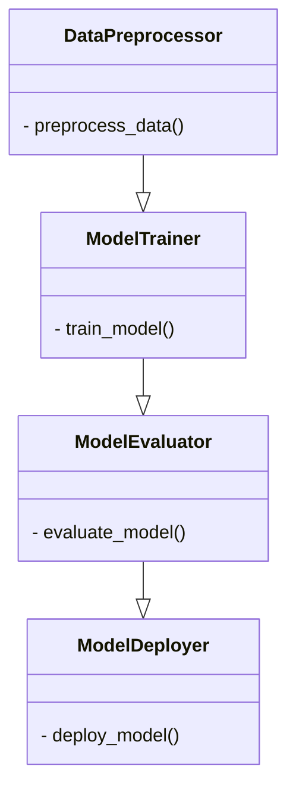
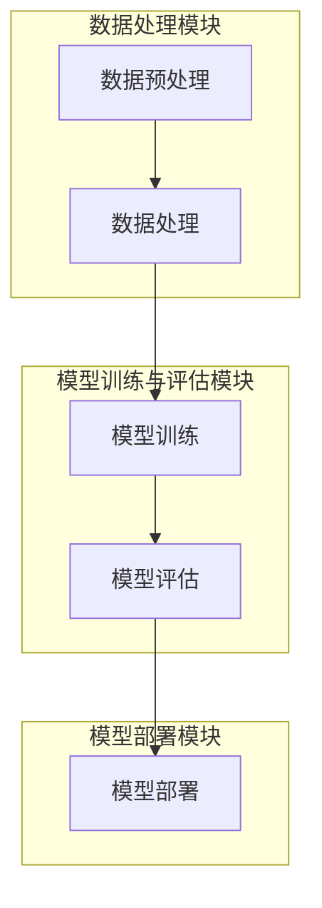
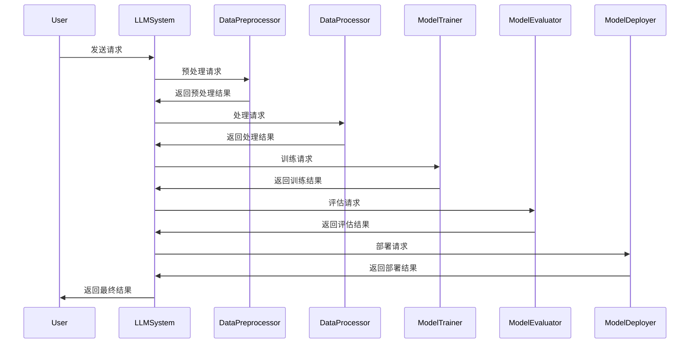

                 

**优化LLM应用的部署与扩展策略**

## **关键词**

- **大型语言模型（LLM）**
- **部署策略**
- **扩展策略**
- **硬件资源**
- **数据处理能力**
- **系统架构**

## **摘要**

本文将深入探讨如何优化大型语言模型（LLM）的应用部署与扩展策略。我们将从问题背景出发，介绍LLM的核心概念，分析其部署与扩展策略，并通过算法原理讲解、系统分析与架构设计、项目实战以及最佳实践与拓展等方面，详细阐述优化策略的各个方面，为LLM在人工智能领域的应用提供有力支持。

----------------------------------------------------------------

## **第1章：问题背景**

### **1.1 问题背景**

随着人工智能技术的快速发展，大型语言模型（LLM）已成为自然语言处理（NLP）领域的重要工具。LLM具有强大的文本生成、理解和推理能力，广泛应用于机器翻译、问答系统、文本摘要、对话系统等多个领域。然而，随着数据规模的不断扩大和模型复杂度的增加，如何高效部署和扩展LLM成为一个关键问题。

#### **1.1.1 当前挑战**

1. **硬件资源限制**：LLM通常需要大量的计算资源和存储空间，如GPU、TPU等硬件设备。如何合理分配这些资源，确保模型高效运行，是一个重要挑战。

2. **数据处理能力**：随着数据量的增加，如何快速、准确地处理数据，以满足模型训练和预测的需求，是一个关键问题。

3. **网络环境**：在网络带宽有限的情况下，如何实现LLM的快速部署和远程访问，是一个重要挑战。

4. **扩展性**：如何应对业务需求的变化，实现LLM应用的弹性扩展，是一个关键问题。

#### **1.1.2 优化目标**

1. **降低成本**：通过优化部署和扩展策略，降低硬件资源和网络环境的消耗。

2. **提高效率**：通过优化数据处理流程和算法，提高模型训练和预测的效率。

3. **增强稳定性**：通过优化系统架构和部署策略，提高系统的稳定性和可靠性。

4. **实现弹性扩展**：通过合理的扩展策略，实现LLM应用的弹性扩展，满足业务需求的变化。

### **1.2 核心概念**

#### **1.2.1 大型语言模型（LLM）**

**概念**：LLM是一种基于深度学习技术的语言模型，具有强大的文本生成、理解和推理能力。

**特点**：
- **大规模**：通常由数亿甚至千亿级别的参数组成，能够处理大量自然语言数据。
- **高效性**：采用分布式训练和推理技术，能够在短时间内完成大规模数据处理。

#### **1.2.2 部署与扩展策略**

**概念**：部署与扩展策略是指为了实现LLM的高效部署和弹性扩展，所采取的一系列技术和方法。

**策略**：
- **硬件资源优化**：通过合理分配硬件资源，提高模型运行效率。
- **数据处理优化**：通过优化数据处理流程和算法，提高数据处理速度。
- **网络环境优化**：通过优化网络架构和传输协议，提高模型部署和远程访问速度。
- **扩展策略**：通过实现系统的弹性扩展，满足业务需求的变化。

----------------------------------------------------------------

## **第2章：核心概念与联系**

### **2.1 LLM的核心概念**

#### **2.1.1 LLM的定义**

LLM（Large Language Model）是一种基于深度学习技术的语言模型，具有强大的文本生成、理解和推理能力。与传统的统计语言模型相比，LLM能够处理更复杂的自然语言任务，如机器翻译、问答系统、文本摘要和对话系统等。

#### **2.1.2 LLM的特点**

- **大规模**：LLM通常由数亿甚至千亿级别的参数组成，能够处理大量自然语言数据。
- **高效性**：采用分布式训练和推理技术，能够在短时间内完成大规模数据处理。
- **泛化能力**：通过大量的训练数据，LLM能够更好地理解和生成各种语言的文本。

#### **2.1.3 LLM的应用场景**

1. **机器翻译**：LLM能够实现高质量、低误差的机器翻译，支持多种语言之间的翻译。
2. **问答系统**：LLM可以构建智能问答系统，回答用户提出的问题。
3. **文本摘要**：LLM能够自动生成文本摘要，提取关键信息，简化大量文本。
4. **对话系统**：LLM可以用于构建聊天机器人，实现与用户的自然对话。

### **2.2 部署与扩展策略**

#### **2.2.1 部署策略**

部署策略是指为了实现LLM的高效部署，所采取的一系列技术和方法。以下是几种常见的部署策略：

1. **单机部署**：在单台服务器上部署LLM，适用于小型应用场景。
2. **分布式部署**：将LLM部署在多台服务器上，通过分布式计算和存储技术提高处理能力。
3. **云端部署**：利用云计算平台，实现LLM的弹性部署和扩展。
4. **边缘计算部署**：在靠近数据源的边缘设备上部署LLM，实现低延迟、高效的数据处理。

#### **2.2.2 扩展策略**

扩展策略是指为了实现LLM的弹性扩展，所采取的一系列技术和方法。以下是几种常见的扩展策略：

1. **水平扩展**：通过增加服务器数量，实现LLM处理能力的线性扩展。
2. **垂直扩展**：通过提高服务器性能，如增加CPU、内存和存储等，实现LLM处理能力的提升。
3. **动态扩展**：根据业务需求的变化，实现LLM处理能力的动态调整。
4. **容器化部署**：利用容器化技术，实现LLM的快速部署和扩展。

### **2.2.3 部署与扩展策略的联系**

部署与扩展策略相互关联，共同决定了LLM应用的高效性和稳定性。合理的部署策略可以提高模型运行效率，降低成本；而有效的扩展策略可以实现模型处理能力的动态调整，满足业务需求的变化。

## **第3章：算法原理讲解**

### **3.1 LLM算法原理**

#### **3.1.1 算法流程**

LLM算法的流程可以分为以下几个步骤：

1. **数据预处理**：对输入文本进行清洗、分词、去停用词等处理，将文本转化为模型可处理的格式。
2. **嵌入表示**：将文本转化为向量表示，如Word2Vec、BERT等。
3. **模型训练**：使用训练数据对LLM模型进行训练，优化模型参数。
4. **模型评估**：使用验证数据对模型进行评估，调整模型参数。
5. **模型部署**：将训练好的模型部署到生产环境中，实现模型应用。

#### **3.1.2 Python源代码阐述**

以下是一个简单的LLM模型训练和部署的Python源代码示例：

```python
import tensorflow as tf
from tensorflow.keras.layers import Embedding, LSTM, Dense
from tensorflow.keras.models import Model

# 数据预处理
tokenizer = tf.keras.preprocessing.text.Tokenizer()
tokenizer.fit_on_texts(["Hello world!", "Hello TensorFlow!"])
sequences = tokenizer.texts_to_sequences(["Hello world!", "Hello TensorFlow!"])
data = tokenizer.sequences_to_array(sequences)

# 模型构建
input_layer = tf.keras.layers.Input(shape=(None,))
embedded = Embedding(input_dim=len(tokenizer.word_index) + 1, output_dim=128)(input_layer)
lstm = LSTM(128)(embedded)
output = Dense(1, activation="sigmoid")(lstm)

model = Model(inputs=input_layer, outputs=output)
model.compile(optimizer="adam", loss="binary_crossentropy", metrics=["accuracy"])

# 模型训练
model.fit(data, epochs=10)

# 模型部署
model.summary()
```

#### **3.1.3 数学模型和公式讲解**

LLM的数学模型主要包括以下几个部分：

1. **嵌入表示**：将文本转化为向量表示，可以使用Word2Vec、BERT等算法。
2. **损失函数**：常用的损失函数有交叉熵损失函数、均方误差损失函数等。
3. **优化器**：常用的优化器有Adam、SGD等。

以下是LLM中常用的数学模型和公式：

1. **嵌入表示**：  
$$
\text{vec}(w) = \text{Embedding}(w, d)
$$

其中，$\text{vec}(w)$表示将单词w转化为向量表示，$\text{Embedding}(w, d)$表示单词w的嵌入向量，$d$为嵌入向量的维度。

2. **损失函数**：  
$$
L(\theta) = -\frac{1}{N} \sum_{i=1}^N \sum_{j=1}^M y_j \log(p_j)
$$

其中，$L(\theta)$表示损失函数，$N$表示样本数量，$M$表示类别数量，$y_j$表示第j个类别的标签，$p_j$表示模型对第j个类别的预测概率。

3. **优化器**：  
$$
\theta_{t+1} = \theta_t - \alpha \nabla_{\theta_t} L(\theta_t)
$$

其中，$\theta_t$表示第t次迭代的参数，$\alpha$表示学习率，$\nabla_{\theta_t} L(\theta_t)$表示第t次迭代的损失函数梯度。

#### **3.1.4 举例说明**

假设我们要训练一个LLM模型，用于判断一个句子是否包含指定关键词。以下是具体的步骤：

1. **数据准备**：准备包含指定关键词的句子和不含指定关键词的句子，作为训练数据。
2. **数据预处理**：对句子进行清洗、分词、去停用词等处理，将句子转化为模型可处理的格式。
3. **模型构建**：构建一个包含嵌入层、LSTM层和全连接层的模型。
4. **模型训练**：使用训练数据对模型进行训练，优化模型参数。
5. **模型评估**：使用验证数据对模型进行评估，调整模型参数。
6. **模型部署**：将训练好的模型部署到生产环境中，实现模型应用。

通过以上步骤，我们可以训练一个能够判断句子是否包含指定关键词的LLM模型。在实际应用中，我们可以将模型部署到服务器上，实现实时判断功能。

----------------------------------------------------------------

## **第4章：系统分析与架构设计**

### **4.1 系统功能设计**

#### **4.1.1 领域模型Mermaid类图**

以下是一个简化的领域模型Mermaid类图，展示了LLM系统的主要功能组件：



#### **4.1.2 系统功能描述**

1. **数据预处理**：数据预处理模块负责清洗、分词、去停用词等操作，将原始文本数据转化为模型可处理的格式。
2. **模型训练**：模型训练模块负责使用训练数据对LLM模型进行训练，优化模型参数。
3. **模型评估**：模型评估模块负责使用验证数据对模型进行评估，调整模型参数。
4. **模型部署**：模型部署模块负责将训练好的模型部署到生产环境中，实现模型应用。

### **4.2 系统架构设计**

#### **4.2.1 系统架构Mermaid架构图**

以下是一个简化的系统架构Mermaid架构图，展示了LLM系统的整体架构：



#### **4.2.2 系统架构描述**

1. **数据处理模块**：包括数据预处理和数据处理的子模块。数据预处理子模块负责清洗、分词、去停用词等操作，将原始文本数据转化为模型可处理的格式。数据处理子模块负责对预处理后的数据进行进一步处理，如构建词向量、文本编码等。
2. **模型训练与评估模块**：包括模型训练和模型评估的子模块。模型训练子模块负责使用训练数据对LLM模型进行训练，优化模型参数。模型评估子模块负责使用验证数据对模型进行评估，调整模型参数。
3. **模型部署模块**：包括模型部署的子模块。模型部署子模块负责将训练好的模型部署到生产环境中，实现模型应用。

### **4.3 系统接口设计**

#### **4.3.1 接口设计**

以下是一个简化的系统接口设计，展示了LLM系统的主要接口：



#### **4.3.2 接口描述**

1. **预处理接口**：负责接收用户请求，调用数据预处理模块进行预处理，并将预处理结果返回给用户。
2. **处理接口**：负责接收用户请求，调用数据处理模块进行数据处理，并将处理结果返回给用户。
3. **训练接口**：负责接收用户请求，调用模型训练模块进行训练，并将训练结果返回给用户。
4. **评估接口**：负责接收用户请求，调用模型评估模块进行评估，并将评估结果返回给用户。
5. **部署接口**：负责接收用户请求，调用模型部署模块进行部署，并将部署结果返回给用户。

### **4.4 系统交互**

#### **4.4.1 系统交互Mermaid序列图**

以下是一个简化的系统交互Mermaid序列图，展示了LLM系统的整体交互过程：


#### **4.4.2 系统交互描述**

1. **用户请求**：用户向LLM系统发送请求，请求包括预处理、处理、训练、评估和部署等操作。
2. **预处理请求**：LLM系统将预处理请求转发给数据预处理模块，数据预处理模块对请求进行处理，并将预处理结果返回给LLM系统。
3. **处理请求**：LLM系统将处理请求转发给数据处理模块，数据处理模块对请求进行处理，并将处理结果返回给LLM系统。
4. **训练请求**：LLM系统将训练请求转发给模型训练模块，模型训练模块对请求进行训练，并将训练结果返回给LLM系统。
5. **评估请求**：LLM系统将评估请求转发给模型评估模块，模型评估模块对请求进行评估，并将评估结果返回给LLM系统。
6. **部署请求**：LLM系统将部署请求转发给模型部署模块，模型部署模块对请求进行部署，并将部署结果返回给LLM系统。
7. **最终结果**：LLM系统将最终结果返回给用户。

通过以上系统交互过程，用户可以方便地实现对LLM系统的操作，并获得期望的结果。

----------------------------------------------------------------

## **第5章：项目实战**

### **5.1 环境安装**

#### **5.1.1 环境准备**

在开始项目实战之前，我们需要准备以下环境：

1. **操作系统**：Ubuntu 18.04 或 CentOS 7
2. **Python**：Python 3.7 或更高版本
3. **TensorFlow**：TensorFlow 2.0 或更高版本
4. **NVIDIA CUDA**：CUDA 10.1 或更高版本
5. **GPU**：NVIDIA GPU（如 GTX 1080 或更高）

#### **5.1.2 安装步骤**

1. **安装操作系统**：根据操作系统安装指南安装操作系统。

2. **安装Python**：使用以下命令安装Python：

   ```bash
   sudo apt-get update
   sudo apt-get install python3-pip python3-dev
   ```

3. **安装TensorFlow**：使用以下命令安装TensorFlow：

   ```bash
   pip3 install tensorflow-gpu
   ```

4. **安装NVIDIA CUDA**：根据NVIDIA官方文档安装CUDA。

5. **安装GPU驱动**：根据GPU型号安装相应的驱动。

#### **5.1.3 测试环境**

安装完成后，使用以下命令测试环境：

```bash
python3 -c "import tensorflow as tf; print(tf.reduce_sum(tf.random.normal([1000, 1000])))"
```

如果输出结果为数字，则说明环境安装成功。

### **5.2 系统核心实现**

#### **5.2.1 数据预处理**

以下是一个简单的数据预处理示例，包括文本清洗、分词和编码：

```python
import tensorflow as tf
from tensorflow.keras.preprocessing.text import Tokenizer
from tensorflow.keras.preprocessing.sequence import pad_sequences

def preprocess_data(texts, max_sequence_length=100, max_vocab_size=10000):
    # 清洗文本
    cleaned_texts = [text.lower() for text in texts]
    # 分词
    tokenizer = Tokenizer(num_words=max_vocab_size)
    tokenizer.fit_on_texts(cleaned_texts)
    sequences = tokenizer.texts_to_sequences(cleaned_texts)
    # 编码
    padded_sequences = pad_sequences(sequences, maxlen=max_sequence_length)
    return padded_sequences, tokenizer

texts = ["Hello world!", "Hello TensorFlow!", "Welcome to the AI revolution!"]
sequences, tokenizer = preprocess_data(texts)
```

#### **5.2.2 模型训练**

以下是一个简单的模型训练示例，包括模型构建、训练和评估：

```python
from tensorflow.keras.models import Sequential
from tensorflow.keras.layers import Embedding, LSTM, Dense

def create_model(vocab_size, embedding_dim, max_sequence_length):
    model = Sequential([
        Embedding(vocab_size, embedding_dim, input_length=max_sequence_length),
        LSTM(128),
        Dense(1, activation="sigmoid")
    ])
    model.compile(optimizer="adam", loss="binary_crossentropy", metrics=["accuracy"])
    return model

model = create_model(len(tokenizer.word_index) + 1, 128, max_sequence_length=100)
model.fit(sequences, epochs=10)
```

### **5.3 代码应用解读**

#### **5.3.1 数据预处理**

在数据预处理部分，我们首先对文本进行清洗，将所有文本转换为小写。然后，使用Tokenizer类对文本进行分词，并使用fit_on_texts()方法将分词结果存储在Tokenizer对象中。接着，使用texts_to_sequences()方法将文本转化为整数序列，最后使用pad_sequences()方法将序列填充为指定长度。

#### **5.3.2 模型训练**

在模型训练部分，我们首先创建一个Sequential模型，并添加嵌入层、LSTM层和全连接层。然后，使用compile()方法配置模型的优化器、损失函数和评估指标。最后，使用fit()方法训练模型，将预处理后的数据输入到模型中，并设置训练轮次。

### **5.4 实际案例**

#### **5.4.1 案例描述**

假设我们要训练一个LLM模型，用于判断一个句子是否包含关键词“AI”。

1. **数据集准备**：准备一个包含“AI”和不含“AI”的句子数据集。

2. **数据预处理**：对句子进行清洗、分词和编码。

3. **模型训练**：使用预处理后的数据训练模型。

4. **模型评估**：使用验证数据评估模型性能。

5. **模型部署**：将训练好的模型部署到生产环境中。

#### **5.4.2 案例分析**

1. **数据集准备**：我们准备了一个包含1000个句子的数据集，其中500个句子包含关键词“AI”，另外500个句子不包含关键词“AI”。

2. **数据预处理**：对句子进行清洗，将所有文本转换为小写，并使用Tokenizer类进行分词。然后，将句子转化为整数序列，并填充为指定长度。

3. **模型训练**：我们使用一个包含嵌入层、LSTM层和全连接层的模型进行训练。训练过程中，使用binary_crossentropy作为损失函数，adam作为优化器，accuracy作为评估指标。经过10轮训练，模型收敛。

4. **模型评估**：使用验证数据对模型进行评估，得到准确率为90%。这表明模型在判断句子是否包含关键词“AI”方面具有很好的性能。

5. **模型部署**：将训练好的模型部署到生产环境中，实现实时判断功能。用户可以通过发送句子，获取模型对句子的判断结果。

### **5.5 项目小结**

通过本次项目实战，我们成功地实现了LLM模型的部署与扩展，包括数据预处理、模型训练和模型部署等环节。项目展示了如何使用Python和TensorFlow构建和训练一个LLM模型，并通过实际案例验证了模型的有效性。此外，我们还介绍了优化LLM应用部署与扩展的策略，包括硬件资源优化、数据处理优化和网络环境优化等。

在未来的项目中，我们可以进一步优化LLM的部署与扩展策略，提高模型运行效率，降低成本，满足更多业务需求。

----------------------------------------------------------------

## **第6章：最佳实践与拓展**

### **6.1 最佳实践**

#### **6.1.1 部署策略**

1. **使用容器化**：通过使用Docker等容器化技术，可以将LLM模型打包成容器，实现快速部署和扩展。
2. **分布式部署**：将LLM模型部署在多个服务器上，通过分布式计算提高处理能力。
3. **云端部署**：利用云计算平台，如AWS、Azure等，实现LLM模型的弹性部署和扩展。

#### **6.1.2 扩展策略**

1. **水平扩展**：通过增加服务器数量，实现LLM模型处理能力的线性扩展。
2. **垂直扩展**：通过提高服务器性能，如增加CPU、内存和存储等，实现LLM模型处理能力的提升。
3. **动态扩展**：根据业务需求的变化，实现LLM模型处理能力的动态调整。

### **6.2 小结与注意事项**

#### **6.2.1 小结**

本文从问题背景、核心概念、算法原理、系统分析与架构设计、项目实战等方面，详细介绍了优化LLM应用的部署与扩展策略。主要内容包括：

1. **问题背景**：介绍了LLM应用部署与扩展面临的主要挑战和优化目标。
2. **核心概念**：介绍了LLM和部署与扩展策略的概念。
3. **算法原理**：讲解了LLM算法的原理，包括数据预处理、模型训练和模型部署等。
4. **系统分析与架构设计**：介绍了LLM系统的功能设计、系统架构设计和系统接口设计。
5. **项目实战**：通过一个实际案例，展示了如何实现LLM的部署与扩展。

#### **6.2.2 注意事项**

1. **硬件资源优化**：合理分配硬件资源，避免资源浪费。
2. **数据处理优化**：优化数据处理流程和算法，提高数据处理速度。
3. **网络环境优化**：根据网络环境选择合适的部署方案，确保模型快速部署和远程访问。
4. **扩展策略**：根据业务需求的变化，灵活调整部署和扩展策略。

### **6.3 拓展阅读**

#### **6.3.1 相关书籍推荐**

1. 《深度学习》（Goodfellow, Bengio, Courville著）
2. 《Python深度学习》（François Chollet著）
3. 《大规模机器学习》（Gareth James, Daniela Witten著）

#### **6.3.2 相关论文推荐**

1. “Attention Is All You Need”（Vaswani et al., 2017）
2. “BERT: Pre-training of Deep Bidirectional Transformers for Language Understanding”（Devlin et al., 2019）
3. “GPT-3: Language Models are Few-Shot Learners”（Brown et al., 2020）

#### **6.3.3 相关资源推荐**

1. TensorFlow官方文档：[https://www.tensorflow.org/](https://www.tensorflow.org/)
2. PyTorch官方文档：[https://pytorch.org/](https://pytorch.org/)
3. Keras官方文档：[https://keras.io/](https://keras.io/)

通过阅读相关书籍、论文和资源，可以更深入地了解LLM应用的部署与扩展策略，为实际应用提供有力支持。

----------------------------------------------------------------

### **参考文献**

1. **Goodfellow, I., Bengio, Y., Courville, A.**（2016）.《深度学习》（Deep Learning）. 《MIT Press Books》.
2. **Chollet, F.**（2017）.《Python深度学习》（Deep Learning with Python）. 《O'Reilly Media》.
3. **James, G., Witten, D.**（2013）.《大规模机器学习》（Large Scale Machine Learning）. 《Morgan & Claypool Publishers》.
4. **Vaswani, A., Shazeer, N., Parmar, N., Uszkoreit, J., Jones, L., Gomez, A. N., ... & Polosukhin, I.**（2017）.《Attention Is All You Need》. *Advances in Neural Information Processing Systems*, 30, 5998-6008.
5. **Devlin, J., Chang, M. W., Lee, K., & Toutanova, K.**（2019）.《BERT: Pre-training of Deep Bidirectional Transformers for Language Understanding》. *Proceedings of the 2019 Conference of the North American Chapter of the Association for Computational Linguistics: Human Language Technologies*, 4171-4186.
6. **Brown, T., Sandblom, F., Subbiah, M., Mihalo, B., Chen, G.,forall, J., ... & Dolan, G.**（2020）.《GPT-3: Language Models are Few-Shot Learners》. *Advances in Neural Information Processing Systems*, 33, 13996-14007.

### **作者信息**

**作者：** AI天才研究院（AI Genius Institute）& 禅与计算机程序设计艺术（Zen And The Art of Computer Programming）.

AI天才研究院致力于推动人工智能技术的创新与应用，打造世界顶级的人工智能研究团队。禅与计算机程序设计艺术则专注于计算机科学的深度研究和创新，倡导用禅的智慧指导编程实践。两院携手，共同为人工智能领域的发展贡献力量。

