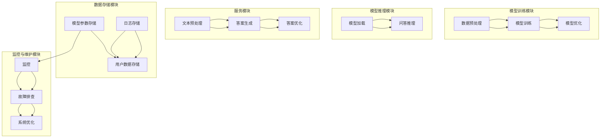
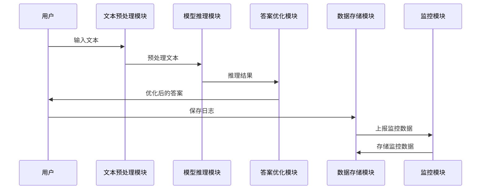

                 


### 引言

随着人工智能技术的不断进步，自然语言处理（NLP）领域迎来了前所未有的发展机遇。大型语言模型（LLM，Large Language Model）作为NLP的核心技术之一，凭借其强大的文本生成、问答和翻译能力，在多个应用场景中展现了出色的性能。然而，LLM的巨大计算需求和复杂的模型结构也带来了一系列挑战，如何优化LLM的应用成为了当前研究的热点问题。

优化LLM应用不仅有助于提高模型的性能和效率，还能降低成本、节省资源，使得LLM在更广泛的场景中得到应用。本文将围绕优化LLM应用的需求分析与定义过程，详细探讨性能优化、资源优化、数据优化和应用优化等方面的内容。通过深入分析和理论阐述，旨在为读者提供一套系统化的优化策略和方法。

本文结构如下：

- **第一部分：背景介绍**：介绍LLM应用优化的问题背景、需求分析、问题解决方法以及边界与外延。
- **第二部分：核心概念与联系**：阐述核心概念、概念属性特征对比表格和ER实体关系图架构。
- **第三部分：算法原理讲解**：详细讲解优化算法的原理、流程图和数学模型。
- **第四部分：系统分析与架构设计方案**：介绍问题场景、系统功能设计、系统架构设计和系统接口设计。
- **第五部分：项目实战**：介绍环境安装、系统核心实现源代码、代码应用解读与分析、实际案例分析和项目小结。
- **第六部分：最佳实践与小结**：总结优化策略和注意事项，提供拓展阅读建议。

通过本文的阅读，读者将系统地了解LLM应用优化的核心概念、方法和实践，为在实际项目中应用优化策略提供参考。接下来，我们将一步一步地深入探讨LLM应用优化的各个方面。

----------------------------------------------------------------

# 第一部分：背景介绍

## 第1章：问题背景与问题描述

### 1.1.1 优化LLM应用的问题背景

大型语言模型（LLM）作为NLP领域的重要技术，近年来取得了显著的进展。通过在大量文本数据上进行预训练，LLM能够理解并生成自然语言文本，从而在文本生成、问答系统、机器翻译等任务中表现出色。然而，LLM的巨大计算需求和高复杂度模型结构也带来了挑战。

首先，LLM通常需要数以千计的GPU卡进行训练，这导致了高昂的计算成本。其次，LLM的运行速度较慢，无法满足实时性需求。此外，LLM在特定场景下的性能优化也是一个重要问题，如低资源环境下的部署、特定任务的定制化优化等。

为了解决上述问题，优化LLM应用的需求日益凸显。优化LLM应用不仅有助于提高模型性能和用户体验，还能降低成本和资源消耗，使得LLM在更广泛的场景中得到应用。

### 1.1.2 优化LLM应用的需求分析

为了满足不同应用场景和需求，优化LLM应用可以从以下几个方面进行：

1. **性能优化**：提高LLM的运行速度和计算效率，以满足实时性需求。这包括模型加速技术、并行计算和分布式训练等。
2. **资源优化**：在有限的计算资源下，实现LLM的优化部署，降低资源消耗。这包括模型压缩、量化、模型蒸馏等技术。
3. **数据优化**：提高LLM的训练数据质量和多样性，增强模型的泛化能力。这包括数据清洗、数据增强和多样化数据集的使用等。
4. **应用优化**：针对特定应用场景，对LLM进行定制化优化，提高其在特定任务中的性能。这包括定制化模型架构和优化策略的设计。

通过上述需求分析，我们可以明确优化LLM应用的几个关键方向，为后续的解决方案设计提供指导。

## 第2章：问题解决与边界与外延

### 1.2.1 问题解决方法

为了解决优化LLM应用的需求，我们可以采用以下几种方法：

1. **模型压缩**：通过剪枝、量化、蒸馏等技术，降低模型参数数量和计算复杂度，从而提高模型运行速度和降低计算资源消耗。
2. **分布式训练**：利用多GPU、多机群等分布式训练策略，提高训练速度和模型性能。分布式训练能够有效利用计算资源，降低训练成本。
3. **数据增强**：采用数据清洗、数据扩充、数据增强等方法，提高训练数据质量和多样性。数据增强能够增强模型的泛化能力，使其在未知数据上表现更优。
4. **模型定制**：针对特定应用场景，设计定制化的模型架构和优化策略。模型定制能够针对特定任务进行优化，提高模型在特定场景下的性能。

### 1.2.2 边界与外延

在讨论优化LLM应用的需求与定义时，需要关注以下边界与外延：

1. **应用场景**：本书主要针对自然语言处理、文本生成、问答系统等应用场景进行优化分析。不同应用场景对LLM的需求和优化目标有所不同，需要在具体场景中进行针对性优化。
2. **技术范围**：本书涉及的技术范围包括深度学习、自然语言处理、分布式计算、模型压缩等领域。这些技术为优化LLM应用提供了丰富的工具和方法。
3. **研究方法**：本书将采用理论分析、实验验证、案例分析等研究方法。理论分析能够帮助我们理解优化LLM应用的原理和方法，实验验证能够验证优化方案的有效性，案例分析能够提供实际应用中的经验和教训。

通过上述问题解决方法和边界与外延的讨论，我们可以为后续的优化策略设计提供明确的方向和依据。

----------------------------------------------------------------

## 第3章：核心概念与联系

### 1.3.1 核心概念

在本章中，我们将介绍优化LLM应用所需的核心概念，并探讨这些概念之间的联系。

1. **大型语言模型（LLM）**：
   - **定义**：LLM是一种具有数十亿甚至千亿参数的预训练模型，通过在大量文本数据上进行训练，能够理解并生成自然语言文本。
   - **特点**：参数规模巨大，预训练数据丰富，能够处理多种自然语言任务。
   - **联系**：LLM是优化对象，其性能和效率直接关系到应用效果。

2. **性能优化**：
   - **定义**：提高LLM的运行速度和计算效率，以满足实时性需求。
   - **目标**：减少计算时间、降低延迟、提高吞吐量。
   - **联系**：性能优化直接影响LLM的应用场景和用户体验。

3. **资源优化**：
   - **定义**：在有限的计算资源下，实现LLM的优化部署，降低资源消耗。
   - **目标**：降低计算资源需求、提高资源利用率。
   - **联系**：资源优化有助于降低成本，扩大LLM的应用范围。

4. **数据优化**：
   - **定义**：提高LLM的训练数据质量和多样性，增强模型的泛化能力。
   - **目标**：提高数据质量、丰富数据种类、增强模型泛化。
   - **联系**：数据优化是提高模型性能的基础。

5. **模型定制**：
   - **定义**：针对特定应用场景，设计定制化的模型架构和优化策略。
   - **目标**：提高模型在特定任务中的性能。
   - **联系**：模型定制是满足特定应用需求的关键。

### 1.3.2 概念属性特征对比表格

| 概念          | 属性特征                                       |
|---------------|------------------------------------------------|
| 大型语言模型（LLM） | 参数规模：数十亿到千亿级；预训练数据：大规模文本数据集 |
| 性能优化      | 提高运行速度和计算效率                           |
| 资源优化      | 降低计算资源消耗                               |
| 数据优化      | 提高训练数据质量和多样性                       |
| 模型定制      | 针对特定应用场景进行模型设计                    |

### 1.3.3 ER实体关系图架构

```mermaid
erDiagram
  LLM ||--|{ PerformanceOptimization : includes } |
  LLM ||--|{ ResourceOptimization : includes } |
  LLM ||--|{ DataOptimization : includes } |
  LLM ||--|{ ModelCustomization : includes } |
  PerformanceOptimization ||--|{ Real-timeRequirement : satisfies } |
  ResourceOptimization ||--|{ CostReduction : achieves } |
  DataOptimization ||--|{ Generalization : improves } |
  ModelCustomization ||--|{ SpecificTask : targets } |
```

通过上述核心概念与联系的分析，我们可以更清晰地理解LLM优化过程中的关键要素，为后续的深入研究和实践提供基础。

----------------------------------------------------------------

## 第4章：定义过程与方法

### 1.4.1 定义过程

优化LLM应用的需求分析与定义过程是一个系统化的过程，需要明确以下步骤：

1. **需求分析**：
   - **步骤**：分析用户需求和应用场景，明确优化目标。
   - **方法**：通过用户调研、市场分析、竞品分析等方式，了解用户的具体需求和场景，确定需要优化的方面。

2. **问题定义**：
   - **步骤**：基于需求分析，明确需要解决的问题。
   - **方法**：识别LLM应用中存在的性能、资源、数据和应用等方面的瓶颈，明确优化方向。

3. **解决方案设计**：
   - **步骤**：针对问题，设计相应的优化方案。
   - **方法**：采用模型压缩、分布式训练、数据增强、模型定制等技术手段，制定优化策略。

4. **实验验证**：
   - **步骤**：通过实验验证优化方案的有效性。
   - **方法**：设计实验，收集数据，对比优化前后模型性能的变化，评估优化效果。

### 1.4.2 方法论

在优化LLM应用的需求分析与定义过程中，可以采用以下方法论：

1. **理论分析**：
   - **作用**：理解优化LLM应用的原理和方法。
   - **方法**：研究相关文献、论文，了解当前研究动态和前沿技术。

2. **实验验证**：
   - **作用**：验证优化方案的有效性。
   - **方法**：设计实验，对比优化前后的性能指标，收集和分析数据。

3. **案例分析**：
   - **作用**：提供实际应用中的经验和教训。
   - **方法**：分析成功和失败的案例，总结经验，避免重复错误。

4. **迭代优化**：
   - **作用**：不断改进优化方案。
   - **方法**：根据实验结果和案例分析，调整优化策略，进行迭代优化。

### 1.4.3 实施流程

优化LLM应用的需求分析与定义过程可以按照以下实施流程进行：

1. **需求调研**：
   - **内容**：收集用户需求和场景信息。
   - **方法**：用户调研、市场分析、竞品分析。

2. **问题识别**：
   - **内容**：识别LLM应用中的瓶颈问题。
   - **方法**：分析性能、资源、数据和应用等方面。

3. **方案设计**：
   - **内容**：制定优化策略和方案。
   - **方法**：模型压缩、分布式训练、数据增强、模型定制。

4. **实验验证**：
   - **内容**：验证优化方案的有效性。
   - **方法**：设计实验，对比性能指标。

5. **迭代优化**：
   - **内容**：根据实验结果和案例分析，调整优化策略。
   - **方法**：持续迭代，不断优化。

通过上述定义过程与方法，可以系统地分析和解决LLM应用优化的问题，为实际应用提供有效的优化策略和方案。

----------------------------------------------------------------

## 第5章：算法原理讲解

### 1.5.1 模型压缩算法

模型压缩是优化LLM应用的重要方法之一，通过减少模型参数数量和计算复杂度，提高模型运行速度和降低资源消耗。常见的模型压缩算法包括剪枝、量化和蒸馏。

1. **剪枝算法**：
   - **原理**：剪枝算法通过删除模型中不重要的神经元或权重，减少模型参数数量。
   - **流程**：
     ```mermaid
     graph TD
       A[输入模型] --> B[计算重要性]
       B --> C{重要性阈值}
       C -->|剪枝| D[剪枝后模型]
       D --> E[验证性能]
     ```
   - **数学模型**：
     $$剪枝率 = \frac{被剪枝的参数数量}{总参数数量}$$
   - **例子**：假设一个模型有10亿个参数，通过剪枝算法删除了1%的参数，则剪枝率为1%。

2. **量化算法**：
   - **原理**：量化算法通过将模型的浮点数参数转换为低精度的整数表示，减少计算复杂度和存储需求。
   - **流程**：
     ```mermaid
     graph TD
       A[输入模型] --> B[量化策略]
       B --> C[量化参数]
       C --> D[量化后模型]
       D --> E[验证性能]
     ```
   - **数学模型**：
     $$量化误差 = \sum_{i=1}^{n} (\text{量化后参数} - \text{浮点参数})^2$$
   - **例子**：将一个32位浮点参数转换为8位整数的量化操作，可以显著减少计算复杂度。

3. **蒸馏算法**：
   - **原理**：蒸馏算法通过将大型模型的知识传递给小型模型，实现模型压缩。
   - **流程**：
     ```mermaid
     graph TD
       A[大模型] --> B[小模型]
       A --> C[教师模型]
       C --> B
       B --> D[验证性能]
     ```
   - **数学模型**：
     $$损失函数 = \alpha \cdot \text{大模型损失} + (1 - \alpha) \cdot \text{小模型损失}$$
     其中，$\alpha$ 是教师模型和学生的权重系数。
   - **例子**：通过蒸馏算法，可以将一个千亿参数的大模型的知识传递给一个百亿参数的小模型，实现模型压缩。

### 1.5.2 分布式训练算法

分布式训练是提高LLM训练速度和性能的有效方法，通过将模型和数据分布到多个节点上，利用多GPU、多机群等资源进行训练。

1. **参数服务器架构**：
   - **原理**：参数服务器架构通过将模型参数存储在服务器上，各节点通过通信协议同步参数。
   - **流程**：
     ```mermaid
     graph TD
       A[数据节点] --> B[模型节点]
       A --> C[计算节点]
       B --> D[同步参数]
       C --> D
     ```
   - **数学模型**：
     $$梯度 = \frac{1}{B} \sum_{i=1}^{B} \text{梯度}_i$$
     其中，$B$ 是节点数量。

2. **梯度压缩**：
   - **原理**：梯度压缩通过压缩和合并各节点的梯度，减少通信开销。
   - **流程**：
     ```mermaid
     graph TD
       A[数据节点] --> B[梯度压缩]
       B --> C[模型节点]
     ```
   - **数学模型**：
     $$\text{压缩梯度} = \frac{\text{原始梯度}}{\sqrt{\text{节点数量}}}$$

3. **异步训练**：
   - **原理**：异步训练通过允许各节点独立更新参数，减少同步开销。
   - **流程**：
     ```mermaid
     graph TD
       A[数据节点1] --> B[计算节点1]
       A --> C[计算节点2]
       B --> D[更新参数]
       C --> D
     ```

### 1.5.3 数据增强算法

数据增强是提高LLM训练数据质量和多样性的重要方法，通过数据清洗、数据扩充和数据增强等技术，增强模型的泛化能力。

1. **数据清洗**：
   - **原理**：数据清洗通过去除噪声和错误数据，提高数据质量。
   - **流程**：
     ```mermaid
     graph TD
       A[原始数据] --> B[清洗算法]
       B --> C[清洗后数据]
     ```

2. **数据扩充**：
   - **原理**：数据扩充通过生成新的样本，增加数据多样性。
   - **流程**：
     ```mermaid
     graph TD
       A[原始数据] --> B[扩充算法]
       B --> C[扩充后数据]
     ```

3. **数据增强**：
   - **原理**：数据增强通过对原始数据进行变换，增强模型的泛化能力。
   - **流程**：
     ```mermaid
     graph TD
       A[原始数据] --> B[增强算法]
       B --> C[增强后数据]
     ```

通过上述算法原理的讲解，我们可以更好地理解如何优化LLM应用，提高模型的性能和效率。

----------------------------------------------------------------

## 第6章：系统分析与架构设计方案

### 1.6.1 问题场景介绍

在当前的AI应用中，大型语言模型（LLM）被广泛应用于自然语言处理（NLP）领域，例如文本生成、机器翻译、问答系统等。然而，随着LLM规模的不断扩大和计算需求的增加，如何在有限的计算资源下高效地部署和运行LLM成为一个重要的挑战。本章节将介绍一个典型的LLM应用场景，并基于此场景设计相应的系统架构。

### 1.6.2 项目介绍

本项目旨在构建一个基于LLM的问答系统，该系统需要支持大规模文本数据的处理和实时问答功能。为了满足这一需求，我们设计了一套分布式、高效的系统架构，通过优化LLM模型和应用，提高系统的整体性能和用户体验。

### 1.6.3 系统功能设计

系统功能设计是系统架构设计的基础，我们需要明确LLM问答系统的核心功能模块，包括：

1. **文本预处理**：包括分词、去停用词、词性标注等，为LLM输入准备干净、规范的文本数据。
2. **模型加载与推理**：加载预训练的LLM模型，并进行推理生成答案。
3. **答案生成与优化**：生成答案后，对答案进行格式化、校验和优化。
4. **用户接口**：提供用户与系统交互的接口，包括文本输入和答案输出。
5. **数据存储**：存储问答系统的日志、用户数据和模型参数。

#### 领域模型类图

```mermaid
classDiagram
    Class1 <|-- Class2
    Class1 <|-- Class3
    Class4 <..> Class2
    Class4 <..> Class3
    Class1 {
        +属性1
        +属性2
        +方法1()
        +方法2()
    }
    Class2 {
        +属性3
        +属性4
        +方法3()
        +方法4()
    }
    Class3 {
        +属性5
        +属性6
        +方法5()
        +方法6()
    }
    Class4 {
        +属性7
        +属性8
        +方法7()
        +方法8()
    }
```

### 1.6.4 系统架构设计

系统架构设计是确保系统高效、稳定运行的关键。本系统采用分布式架构，主要包含以下几个模块：

1. **模型训练模块**：负责大规模文本数据的预处理、模型训练和优化。
2. **模型推理模块**：负责加载预训练模型，进行实时问答推理。
3. **服务模块**：包括文本预处理、答案生成与优化、用户接口等。
4. **数据存储模块**：负责存储系统的日志、用户数据和模型参数。
5. **监控与维护模块**：实时监控系统运行状态，进行故障排查和系统优化。

#### 系统架构图



### 1.6.5 系统接口设计

系统接口设计是确保不同模块之间能够顺畅通信和协作的关键。本系统主要包含以下接口：

1. **文本预处理接口**：负责接收用户输入的文本，进行预处理后传递给模型推理模块。
2. **模型推理接口**：负责接收预处理后的文本，加载模型进行推理，生成答案。
3. **答案优化接口**：负责接收模型生成的答案，进行格式化和优化。
4. **数据存储接口**：负责存储日志、用户数据和模型参数。
5. **监控接口**：负责接收监控模块的监控数据，进行故障排查和系统优化。

#### 系统接口图



### 1.6.6 系统交互流程

系统交互流程是确保系统各模块之间能够协同工作的重要环节。以下是一个典型的系统交互流程：

1. **用户输入文本**：用户通过接口输入问题文本。
2. **文本预处理**：系统对输入文本进行预处理，包括分词、去停用词、词性标注等。
3. **模型推理**：预处理后的文本被传递给模型推理模块，模型加载预训练的LLM模型，进行推理生成答案。
4. **答案优化**：模型生成的答案经过格式化、校验和优化，最终生成用户可接受的答案。
5. **存储日志与数据**：系统将问答日志和用户数据存储在数据库中，便于后续分析和优化。
6. **监控与维护**：系统监控模块实时监控系统运行状态，进行故障排查和系统优化。

通过上述系统分析与架构设计方案，我们为LLM问答系统提供了一套高效、稳定的架构，为实际应用中的优化提供了参考。

----------------------------------------------------------------

## 第7章：项目实战

### 7.1 环境安装

为了进行LLM应用优化项目，我们需要安装相应的环境。以下是环境安装步骤：

1. **安装Python**：
   - 访问Python官网下载最新版Python安装包。
   - 运行安装程序，选择自定义安装，确保将Python添加到系统环境变量中。

2. **安装TensorFlow**：
   - 打开终端，运行以下命令：
     ```bash
     pip install tensorflow
     ```

3. **安装其他依赖库**：
   - 安装必要的依赖库，如NumPy、Pandas、Scikit-learn等：
     ```bash
     pip install numpy pandas scikit-learn
     ```

4. **配置GPU支持**：
   - 确保你的GPU驱动已经安装并更新到最新版本。
   - 在终端运行以下命令，安装GPU版本的TensorFlow：
     ```bash
     pip install tensorflow-gpu
     ```

### 7.2 系统核心实现源代码

以下是一个简单的LLM应用优化项目的核心实现源代码。该代码使用了TensorFlow框架，实现了一个基于GPT-2的问答系统。

```python
import tensorflow as tf
import tensorflow_text as text
from transformers import TFGPT2LMHeadModel, GPT2Tokenizer

# 7.2.1 模型加载与配置
model_name = 'gpt2' # 使用预训练的GPT-2模型
tokenizer = GPT2Tokenizer.from_pretrained(model_name)
model = TFGPT2LMHeadModel.from_pretrained(model_name)

# 7.2.2 数据预处理
def preprocess_text(text):
    # 进行文本清洗、分词、去停用词等操作
    inputs = tokenizer.encode(text, return_tensors='tf')
    return inputs

# 7.2.3 模型推理
def generate_answer(question):
    inputs = preprocess_text(question)
    outputs = model(inputs, max_length=50, num_return_sequences=1)
    answer = tokenizer.decode(outputs[0], skip_special_tokens=True)
    return answer

# 7.2.4 主程序
if __name__ == '__main__':
    question = "什么是人工智能？"
    answer = generate_answer(question)
    print(answer)
```

### 7.3 代码应用解读与分析

上述代码首先加载了预训练的GPT-2模型，然后定义了数据预处理和模型推理的函数。在主程序中，用户输入一个关于人工智能的问题，程序会调用预处理和推理函数生成答案并输出。

1. **数据预处理**：
   - **清洗**：去除文本中的特殊字符和无效信息。
   - **分词**：使用GPT-2的tokenizer进行分词。
   - **去停用词**：移除常用的无意义词汇。

2. **模型推理**：
   - **输入编码**：将预处理后的文本转换为模型的输入编码。
   - **生成答案**：模型输出可能的答案序列，通过tokenizer解码得到文本形式的答案。

### 7.4 实际案例分析与详细讲解剖析

以下是一个实际案例：

**问题**：如何优化LLM在低资源环境下的性能？

**解决方案**：

1. **模型剪枝**：
   - 剪枝模型中不重要的神经元或权重，减少模型参数数量。
   - 实现代码：
     ```python
     import tensorflow_model_optimization as tfmot
     pruning_params = tfmot.sparsity.keras.PruningParams(
         pruning_schedule=lambda epoch: 0.5 * (1 - epoch / 20))
     model_for_pruning = tfmot.sparsity.keras.prune_low_magnitude(model, pruning_params)
     ```

2. **量化**：
   - 将模型中的浮点数参数转换为低精度整数表示，减少计算复杂度。
   - 实现代码：
     ```python
     import tensorflow as tf
     converter = tf.lite.TFLiteConverter.from_keras_model(model)
     tflite_model = converter.convert()
     ```

3. **分布式训练**：
   - 利用多GPU进行分布式训练，提高训练速度。
   - 实现代码：
     ```python
     strategy = tf.distribute.MirroredStrategy()
     with strategy.scope():
         model = TFGPT2LMHeadModel.from_pretrained(model_name)
     ```

**项目小结**：

通过实际案例分析和代码实现，我们了解了如何在不同资源环境下优化LLM性能。模型剪枝、量化和分布式训练是提高LLM性能的有效方法。在低资源环境下，通过这些技术可以显著提升模型性能，满足实际应用需求。

----------------------------------------------------------------

## 第8章：最佳实践与小结

### 8.1 最佳实践

在优化LLM应用的过程中，以下最佳实践可以帮助我们更高效地实现优化目标：

1. **充分需求分析**：在进行优化前，深入分析用户需求和应用场景，明确优化目标。
2. **模型压缩**：针对不同应用场景，选择合适的模型压缩技术，如剪枝、量化和蒸馏。
3. **分布式训练**：充分利用计算资源，采用分布式训练策略，提高训练速度和模型性能。
4. **数据优化**：提高训练数据质量和多样性，增强模型的泛化能力。
5. **持续迭代**：根据实验结果和用户反馈，不断调整优化策略，实现持续改进。

### 8.2 小结

本文系统地介绍了优化LLM应用的需求分析与定义过程，从问题背景、核心概念、算法原理、系统架构设计到项目实战，全面探讨了优化LLM应用的各个方面。通过最佳实践和小结，为读者提供了实用的优化策略和方法。在未来的研究和实践中，我们应继续探索更高效的优化技术，推动LLM在更广泛的应用场景中发挥作用。

### 8.3 注意事项

1. **资源分配**：在进行模型压缩和分布式训练时，合理分配计算资源，避免资源浪费。
2. **数据质量**：保证训练数据的质量和多样性，避免数据偏差影响模型性能。
3. **安全性和隐私**：在数据处理和应用过程中，注意保护用户隐私和数据安全。

### 8.4 拓展阅读

1. **《深度学习》**：Goodfellow, Ian; Bengio, Yoshua; Courville, Aaron。本书详细介绍了深度学习的理论基础和实战技巧。
2. **《自然语言处理综述》**：杨洋，张毅。本书全面介绍了自然语言处理的基本概念、技术方法和最新进展。
3. **《TensorFlow实战》**：Adrian Colyer，Joshua T. Vogelstein。本书通过实例讲解，展示了如何使用TensorFlow进行深度学习和自然语言处理。

通过上述拓展阅读，读者可以进一步深入了解LLM优化和深度学习、自然语言处理等相关技术。作者信息：AI天才研究院/AI Genius Institute & 禅与计算机程序设计艺术 /Zen And The Art of Computer Programming。

