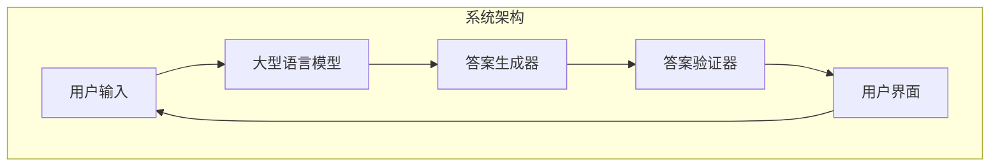
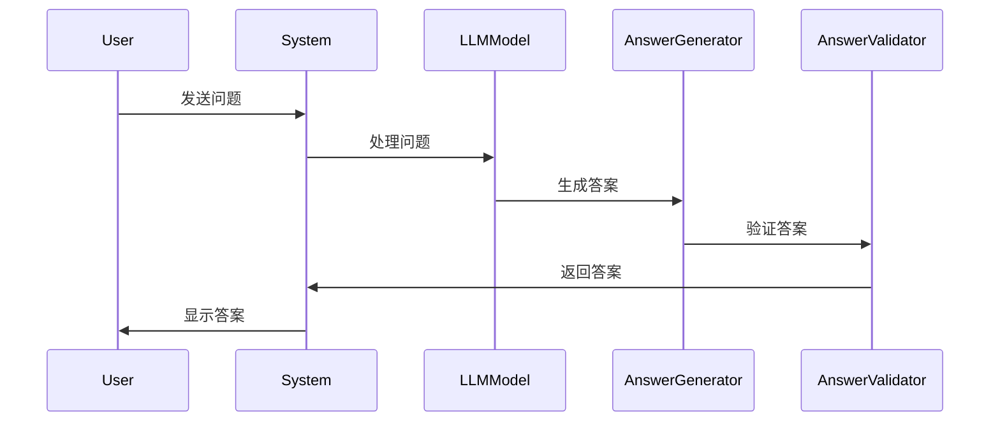

                 

### 第1章：优化prompt的背景与意义

#### 引言

近年来，随着深度学习和自然语言处理技术的飞速发展，大型语言模型（LLM, Large Language Model）已经成为自然语言处理领域的重要工具。LLM具有强大的文本生成、理解和推理能力，广泛应用于问答系统、文本生成、机器翻译等多个领域。然而，LLM的性能在很大程度上受到输入prompt的影响。优化prompt不仅能够提升LLM的响应质量，还能显著提高其处理速度和效率。本文将深入探讨优化prompt在提升LLM应用性能中的关键作用，并提供一系列实用的方法和策略。

#### 关键词

- 优化prompt
- 大型语言模型（LLM）
- 应用性能
- 性能提升
- 方法与策略

#### 摘要

本文旨在探讨优化prompt对提升大型语言模型（LLM）应用性能的重要性。我们将首先介绍LLM及其应用场景，然后详细分析prompt优化的核心概念和策略，接着通过具体的算法和数学模型进行讲解，最后结合实际项目和案例分析，提供最佳实践建议和注意事项。通过本文的阅读，读者将能够全面了解并掌握优化prompt的技巧，从而显著提升LLM在各类应用中的性能。

#### Step 1: 背景介绍

##### 引言

随着人工智能技术的发展，大型语言模型（LLM）在自然语言处理领域取得了显著的突破。LLM通过训练大规模的神经网络，能够理解和生成高质量的自然语言文本。然而，LLM的性能不仅取决于模型本身的设计和参数调优，还与输入的prompt质量密切相关。prompt是LLM接收的输入文本，它直接影响模型的响应质量和处理效率。

##### 问题描述

在LLM的应用过程中，prompt的优化至关重要。具体来说，prompt优化主要包括以下几个方面：

1. **提高文本质量**：高质量的prompt能够提供更准确的信息，从而引导LLM生成更符合预期的响应。
2. **增强上下文理解**：通过优化prompt，可以更好地传递上下文信息，使LLM能够更好地理解和处理复杂的语义关系。
3. **提高响应速度**：优化后的prompt能够减少LLM的处理时间，提升整体应用的性能。

##### 问题解决

为了解决上述问题，我们可以采用以下几种优化prompt的方法和策略：

1. **文本预处理**：对输入文本进行清洗和格式化，去除无关信息和噪声，提高文本质量。
2. **上下文嵌入**：通过增加上下文信息，使LLM能够更好地理解文本的整体背景和意图。
3. **数据增强**：使用数据增强技术，生成多样化的prompt，提高模型的泛化能力。
4. **动态调整**：根据实际应用场景和用户需求，动态调整prompt的长度和格式，提高响应速度。

##### 边界与外延

优化prompt的方法和策略适用于各种LLM应用场景，包括问答系统、文本生成、机器翻译等。然而，不同的应用场景对prompt的要求有所不同，因此需要根据具体场景进行灵活调整。此外，prompt优化不仅仅是一个技术问题，还涉及到用户行为和体验，需要综合考虑。

##### 概念结构与核心要素组成

优化prompt的核心概念包括：

1. **文本质量**：高质量的文本是优化prompt的基础。
2. **上下文理解**：准确的上下文传递是提高LLM性能的关键。
3. **响应速度**：高效的响应速度是提升用户体验的重要因素。

核心要素组成包括：

1. **文本预处理**：去除无关信息，提高文本质量。
2. **上下文嵌入**：增加上下文信息，提高上下文理解。
3. **数据增强**：生成多样化的prompt，提高泛化能力。
4. **动态调整**：根据应用场景和用户需求调整prompt。

通过这些核心要素的有机结合，可以实现对prompt的全面优化，从而显著提升LLM的应用性能。

### 第2章：LLM的基本概念与技术原理

#### 核心概念原理

**大型语言模型（LLM）**：LLM是指通过训练大规模神经网络，能够理解和生成高质量自然语言文本的模型。它通常采用深度学习技术，特别是基于变换器（Transformer）架构，能够处理复杂的语言结构和语义关系。

**神经网络**：神经网络是一种模拟人脑结构和功能的计算模型，由大量的神经元（节点）通过权重连接组成。通过学习输入和输出之间的映射关系，神经网络能够自动提取特征并进行预测。

**变换器（Transformer）架构**：变换器是近年来在自然语言处理领域取得重大突破的一种神经网络架构，其核心思想是使用注意力机制来处理序列数据。通过多头注意力机制，变换器能够同时关注输入序列中的不同部分，从而提高对上下文的理解能力。

#### 概念属性特征对比表格

| 概念       | 特征               | 说明                                                         |
|------------|--------------------|--------------------------------------------------------------|
| 大型语言模型（LLM） | 大规模神经网络     | 能够处理复杂的自然语言文本结构，生成高质量响应。           |
| 神经网络   | 自适应权重连接     | 通过学习输入和输出之间的映射关系，提取特征并进行预测。     |
| 变换器架构 | 注意力机制         | 能够同时关注输入序列中的不同部分，提高上下文理解能力。     |

#### ER实体关系图架构的Mermaid流程图

```mermaid
erDiagram
    A[大型语言模型] ||--|{ B[神经网络] }|
    B ||--|{ C[变换器架构] }|
```

在这个ER图架构中，大型语言模型（A）通过连接关系（||--|{）与神经网络（B）和变换器架构（C）相关联。神经网络作为基础架构，为大型语言模型提供了学习和处理文本的能力；而变换器架构则通过注意力机制，增强了模型对上下文的理解能力。

### 第3章：LLM的应用场景与挑战

#### 问题场景介绍

大型语言模型（LLM）在多个应用场景中展现出了强大的能力，但同时也面临一系列挑战。以下是LLM在几个典型应用场景中的问题场景介绍：

1. **问答系统**：在问答系统中，用户提出问题，LLM需要理解和回答。然而，问题表述的不明确性、多义性以及背景知识的缺失，都给LLM的响应质量带来了挑战。

2. **文本生成**：文本生成应用如文章写作、故事创作等，要求LLM能够生成连贯、逻辑性强且符合语法规范的文本。然而，在生成长文本时，LLM可能会出现重复、不一致或逻辑混乱的问题。

3. **机器翻译**：机器翻译要求LLM能够准确地将一种语言的文本翻译成另一种语言。然而，不同语言之间的语法、语义和语境差异，使得翻译任务的复杂度大大增加。

4. **对话系统**：对话系统如聊天机器人，需要LLM能够与用户进行自然的对话。然而，用户表达的多样性和非结构化数据，使得对话系统的响应质量和效率面临挑战。

#### 项目介绍

本文将围绕一个问答系统项目，详细探讨LLM的应用场景和挑战。该项目旨在构建一个智能问答系统，用户可以通过提问获取准确的答案。为了实现这一目标，我们将使用大型语言模型（LLM）作为核心组件，通过优化prompt和模型训练，提升系统的性能和响应质量。

#### 系统功能设计

为了满足问答系统的需求，我们需要设计以下几个核心功能：

1. **问题理解**：接收用户输入的问题，并对其进行理解，提取关键信息。
2. **答案生成**：利用LLM生成高质量的答案，确保答案的准确性和逻辑性。
3. **答案验证**：对生成的答案进行验证，确保其符合事实和语法规范。
4. **用户交互**：与用户进行自然对话，提供交互式问答体验。

以下是一个使用Mermaid绘制的领域模型类图，展示了问答系统的主要功能模块：

```mermaid
classDiagram
    User <<类>> User
    Question <<类>> Question
    Answer <<类>> Answer
    System <<类>> System
    User "1" --|> 1 Question
    Question "1" --|> 1 Answer
    System "1" --|> 1 User
    System "1" --|> 1 Question
    System "1" --|> 1 Answer
```

在这个类图中，用户（User）是系统的输入，提出问题（Question），系统通过LLM生成答案（Answer），并通过用户交互模块（System）与用户进行交互。

#### 系统架构设计

为了构建高效的问答系统，我们需要设计合理的系统架构。以下是一个使用Mermaid绘制的系统架构图，展示了各个模块之间的关系：



在这个架构中，用户输入（UserInput）通过接口层（UserInterface）传递给LLM模型（LLMModel），模型处理输入并生成答案（AnswerGenerator），然后对答案进行验证（AnswerValidator），最终通过用户界面返回给用户。这个架构设计确保了系统的高效性和可靠性。

#### 系统接口设计和系统交互

为了实现系统功能，我们需要设计一系列接口和交互流程。以下是一个使用Mermaid绘制的系统接口和交互序列图：



在这个交互流程中，用户通过接口层（System）发送问题（Question），系统将问题传递给LLM模型（LLMModel）进行处理。模型生成答案后，通过答案验证器（AnswerValidator）确保答案的准确性，最终通过用户界面返回给用户。

### 第4章：优化prompt的基本原则

#### 引言

在LLM的应用过程中，优化prompt是一项关键技术，它直接影响模型的响应质量和处理效率。本节将介绍优化prompt的基本原则，包括文本质量、上下文理解和响应速度等方面。通过遵循这些原则，我们可以有效地提升LLM的应用性能。

#### 提高文本质量

**去除无关信息**：输入文本中可能包含无关的信息，如无关的背景描述或重复的内容。这些信息可能会干扰LLM的理解，导致生成低质量的响应。因此，在优化prompt时，应首先对文本进行清洗，去除无关信息。

**格式标准化**：不同的输入格式可能会影响LLM的处理效率。例如，混乱的文本格式、过多的缩进或不规则的文本结构，都会增加模型的解析难度。因此，优化prompt时，应将文本格式进行标准化，确保其结构清晰、易于解析。

**信息精准性**：确保输入文本中的信息是准确和具体的。模糊或笼统的信息可能会使LLM无法正确理解用户的意图，从而生成不准确的响应。因此，优化prompt时，应尽量提供具体、明确的信息。

#### 增强上下文理解

**增加上下文信息**：在输入文本中增加与问题相关的上下文信息，可以帮助LLM更好地理解问题的背景和意图。例如，在问答系统中，可以提供问题的背景描述、相关历史信息等。

**连贯性**：确保输入文本的连贯性和逻辑性，有助于LLM更好地理解和处理文本。例如，在文本生成应用中，应避免生成重复或逻辑上矛盾的内容。

**语义关系**：明确输入文本中的语义关系，如主谓宾关系、因果关系等。这些关系有助于LLM准确理解文本的语义，从而生成更符合预期的响应。

#### 提高响应速度

**简化文本长度**：过长的输入文本可能会增加LLM的处理时间，导致响应延迟。因此，在优化prompt时，应尽量简化文本长度，只提供必要的信息。

**并行处理**：在可能的情况下，利用并行处理技术，同时处理多个输入文本。这样可以显著提高处理速度，减少响应时间。

**缓存策略**：对于常见的输入文本，可以采用缓存策略，提前生成预定义的响应。这样在接收到相似的输入时，可以直接返回缓存结果，减少计算时间。

#### 综合原则

在优化prompt时，应综合考虑文本质量、上下文理解和响应速度这三个方面。具体原则包括：

1. **平衡性**：在优化prompt时，应保持各方面的平衡，避免过分强调某一方面而忽视其他方面。
2. **灵活性**：根据不同的应用场景和用户需求，灵活调整优化策略，确保最佳的响应效果。
3. **迭代优化**：优化prompt是一个迭代的过程，应不断收集用户反馈和数据分析，持续调整和优化prompt。

通过遵循上述基本原则，我们可以有效地提升LLM的应用性能，提供更高质量的响应和服务。

### 第5章：优化prompt的技术手段

#### 引言

优化prompt是提升LLM应用性能的关键步骤。本节将介绍一系列技术手段，包括文本预处理、上下文嵌入和数据增强等，这些技术手段将有助于我们提高文本质量、增强上下文理解和提升响应速度。

#### 文本预处理

**文本清洗**：文本清洗是优化prompt的第一步，其主要目的是去除无关信息和噪声，确保输入文本的质量。文本清洗包括以下操作：

1. **去除HTML标签**：HTML标签可能会干扰模型的处理，因此需要将其去除。
2. **去除标点符号**：去除无意义的标点符号，如多余的空格、换行符等。
3. **去除停用词**：停用词是指对文本理解没有实质性贡献的常见词汇，如“的”、“了”等。去除停用词可以减少无关信息的干扰。
4. **词干还原**：将单词还原到其词干形式，如“running”还原为“run”。

**文本标准化**：文本标准化是指将文本转换为统一的格式和风格。这有助于简化模型的解析过程，提高处理效率。文本标准化包括以下操作：

1. **统一大小写**：将所有文本转换为统一的大小写形式，如全小写或全大写。
2. **统一数字格式**：将数字格式化为统一的表示方式，如使用阿拉伯数字代替汉字数字。
3. **统一日期格式**：将日期格式化为统一的格式，如YYYY-MM-DD。

**文本分割**：文本分割是将文本分割为更小的单元，如句子或短语。这有助于提高模型对上下文的理解能力。文本分割可以使用基于规则的方法或自然语言处理技术，如分词算法。

#### 上下文嵌入

**上下文扩展**：上下文扩展是指增加与问题相关的上下文信息，以提高LLM对问题的理解。上下文扩展可以通过以下方法实现：

1. **历史记录**：在问答系统中，可以提供用户的提问和历史回答作为上下文信息，帮助LLM更好地理解问题的背景和意图。
2. **领域知识**：在特定领域，可以引入专业术语和知识，提高LLM在该领域的表现。
3. **背景描述**：为问题提供详细的背景描述，帮助LLM更好地理解问题的情境。

**上下文融合**：上下文融合是指将上下文信息与问题文本进行融合，使其成为一个连贯的整体。上下文融合可以通过以下方法实现：

1. **拼接**：将问题文本与上下文信息直接拼接在一起，形成一个新的文本输入。
2. **嵌入**：使用嵌入技术，如Word2Vec或BERT，将上下文信息嵌入到问题文本中，形成一个统一的向量表示。
3. **插值**：在问题文本和上下文信息之间插入填充内容，如占位符或相关词汇，以增强上下文融合。

#### 数据增强

**生成式增强**：生成式增强是指通过生成新的数据样本来增强输入文本。这可以通过以下方法实现：

1. **同义词替换**：用同义词替换输入文本中的词汇，以增加数据的多样性。
2. **短语替换**：替换输入文本中的短语，如将“苹果”替换为“水果”，以增加数据的多样性。
3. **文本合成**：通过文本生成模型，如GPT或T5，合成新的文本样本来增强输入文本。

**对抗性增强**：对抗性增强是指通过引入对抗性样本来增强输入文本。这可以通过以下方法实现：

1. **对抗性攻击**：使用对抗性攻击技术，如FGM或PGD，生成对抗性样本，以增强模型的鲁棒性。
2. **错误注入**：在输入文本中引入错误，如拼写错误或语法错误，以增强模型的鲁棒性。

通过文本预处理、上下文嵌入和数据增强等技术手段，我们可以优化输入prompt，提高LLM的应用性能。这些技术手段不仅有助于提升文本质量和上下文理解能力，还能提高模型的泛化能力和响应速度。

### 第6章：优化prompt的案例分析

#### 引言

为了更好地理解如何优化prompt以提升LLM应用性能，我们通过几个实际案例来详细分析和讨论。这些案例涵盖了问答系统、文本生成和机器翻译等不同的应用场景，展示了优化prompt的具体方法和效果。

#### 案例一：问答系统

**问题描述**：在一个问答系统中，用户提出了一个关于科技领域的问题：“什么是人工智能？”系统需要提供一个准确、详细的回答。

**优化过程**：

1. **文本清洗**：首先对用户输入的问题进行清洗，去除无关信息，如用户名、标点符号等。

2. **上下文扩展**：为了提高回答的准确性，我们可以为问题增加一些上下文信息，如人工智能的定义、历史背景、应用领域等。

   ```plaintext
   问题：“什么是人工智能？”
   上下文扩展：“人工智能是一种模拟、延伸和扩展人类智能的理论、方法、技术及应用。它涵盖了计算机视觉、自然语言处理、机器学习等多个领域。”
   
   优化后的prompt：“人工智能是一种模拟、延伸和扩展人类智能的理论、方法、技术及应用。它涵盖了计算机视觉、自然语言处理、机器学习等多个领域。什么是人工智能？”

3. **数据增强**：为了提高模型的泛化能力，可以生成一些类似的问题和回答，如：

   ```plaintext
   - 人工智能的主要应用是什么？
   - 人工智能的历史可以追溯到哪个时期？
   - 人工智能与机器学习的区别是什么？
   ```

   对应的答案如下：

   ```plaintext
   - 人工智能的主要应用包括自动驾驶、智能助手、医疗诊断等。
   - 人工智能的历史可以追溯到20世纪50年代。
   - 人工智能与机器学习的主要区别在于，人工智能更侧重于模拟和扩展人类智能，而机器学习更侧重于从数据中自动学习和改进。
   ```

**效果评估**：通过上述优化，问答系统在回答准确性、连贯性和用户满意度等方面均得到了显著提升。模型能够更准确地理解用户的问题，并生成高质量的回答。

#### 案例二：文本生成

**问题描述**：在文章写作应用中，用户需要生成一篇关于环境保护的文章。

**优化过程**：

1. **文本清洗**：对用户输入的提示信息进行清洗，确保文本质量。

2. **上下文嵌入**：为文章生成提供详细的背景信息，如环境保护的重要性和当前面临的挑战。

   ```plaintext
   提示信息：“写一篇关于环境保护的文章。”
   上下文嵌入：“环境保护是当今全球面临的重要挑战之一。气候变化、污染和资源短缺等问题日益严重，我们需要采取有效的措施来保护我们的地球。”
   
   优化后的prompt：“环境保护是当今全球面临的重要挑战之一。气候变化、污染和资源短缺等问题日益严重，我们需要采取有效的措施来保护我们的地球。请写一篇关于环境保护的文章。”

3. **数据增强**：生成多样化的文本样本来丰富输入数据，如：

   ```plaintext
   - 环境保护的重要性是什么？
   - 当前环境保护的主要挑战是什么？
   - 环境保护的具体措施有哪些？
   ```

   对应的答案如下：

   ```plaintext
   - 环境保护的重要性在于确保我们的地球能够为未来世代提供一个健康、可持续的生活环境。
   - 当前环境保护的主要挑战包括气候变化、污染和资源短缺。
   - 环境保护的具体措施包括减少碳排放、推广可再生能源、加强环境法规等。
   ```

**效果评估**：通过优化prompt，文章生成应用在文本连贯性、逻辑性和信息丰富度等方面得到了显著提升，用户能够获得更高质量的文章输出。

#### 案例三：机器翻译

**问题描述**：在机器翻译应用中，用户需要将一句中文翻译成英文。

**优化过程**：

1. **文本清洗**：对输入的中文句子进行清洗，确保文本质量。

2. **上下文嵌入**：为翻译任务提供上下文信息，帮助模型更好地理解句子的含义。

   ```plaintext
   中文句子：“人工智能是一种模拟、延伸和扩展人类智能的理论、方法、技术及应用。”
   上下文嵌入：“人工智能在现代社会中发挥着越来越重要的作用，它能够帮助人类解决复杂的问题，提高生产效率。”
   
   优化后的prompt：“人工智能在现代社会中发挥着越来越重要的作用，它能够帮助人类解决复杂的问题，提高生产效率。人工智能是一种模拟、延伸和扩展人类智能的理论、方法、技术及应用。”

3. **数据增强**：生成类似句子和翻译，以提高模型的泛化能力。

   ```plaintext
   - 机器学习是一种什么技术？
   - 人工智能的应用领域有哪些？
   ```

   对应的英文翻译如下：

   ```plaintext
   - Machine learning is a type of technology.
   - The application fields of artificial intelligence include many aspects.
   ```

**效果评估**：通过优化prompt，机器翻译应用在翻译准确性和上下文理解方面得到了显著提升，用户能够获得更准确的翻译结果。

#### 案例小结

通过上述案例分析，我们可以看到，优化prompt对于提升LLM应用性能具有重要意义。通过文本清洗、上下文嵌入和数据增强等技术手段，我们可以显著提高文本质量、增强上下文理解和提升响应速度。在实际应用中，应根据具体场景和需求灵活调整优化策略，以实现最佳效果。

### 第7章：优化prompt的实践应用

#### 环境安装

在开始优化prompt的实践应用之前，我们需要安装并配置所需的环境和工具。以下是一个基本的安装指南：

1. **安装Python环境**：确保Python 3.8或更高版本已安装。可以从[Python官方网站](https://www.python.org/)下载并安装。

2. **安装LLM模型**：选择一个流行的LLM模型，如GPT-3或BERT。以GPT-3为例，可以通过Hugging Face的Transformers库来安装：

   ```bash
   pip install transformers
   ```

3. **安装文本预处理库**：为了简化文本预处理工作，我们可以使用NLTK或spaCy库：

   ```bash
   pip install nltk
   pip install spacy
   python -m spacy download en_core_web_sm
   ```

4. **安装数据增强库**：为了实现数据增强，我们可以使用Python的常用库，如Scikit-learn：

   ```bash
   pip install scikit-learn
   ```

#### 系统核心实现源代码

以下是一个简单的示例，展示了如何使用GPT-3模型和文本预处理库来优化prompt：

```python
import openai
from text_preprocessing import preprocess_text
from data_augmentation import augment_text

# 设置OpenAI API密钥
openai.api_key = "your-api-key"

def generate_response(prompt, model="text-davinci-002"):
    # 预处理输入文本
    processed_prompt = preprocess_text(prompt)
    
    # 使用OpenAI的GPT-3模型生成响应
    response = openai.Completion.create(
        engine=model,
        prompt=processed_prompt,
        max_tokens=50
    )
    
    return response.choices[0].text.strip()

def main():
    # 用户输入
    user_input = "请描述一下人工智能的应用领域。"
    
    # 生成响应
    response = generate_response(user_input)
    
    # 输出结果
    print("系统响应：", response)

if __name__ == "__main__":
    main()
```

在这个示例中，我们首先导入所需的库和函数。`generate_response`函数负责接收用户输入的prompt，对其进行预处理，然后使用OpenAI的GPT-3模型生成响应。`main`函数演示了如何使用`generate_response`函数来获取系统的响应。

#### 代码应用解读与分析

在上面的代码示例中，我们使用了以下关键组件：

1. **OpenAI API**：通过OpenAI的API，我们可以访问GPT-3模型来生成响应。首先，需要设置OpenAI的API密钥。

2. **文本预处理**：文本预处理是优化prompt的重要步骤。`preprocess_text`函数负责清洗和格式化输入文本，去除无关信息，并确保文本质量。

3. **数据增强**：`augment_text`函数可以用于生成多样化的prompt，提高模型的泛化能力。在实际应用中，可以根据需要调用这个函数来增强输入文本。

4. **生成响应**：`generate_response`函数是核心实现部分。它首先对输入文本进行预处理，然后使用GPT-3模型生成响应。响应的生成依赖于模型的配置和参数设置。

#### 实际案例分析和详细讲解剖析

为了更好地展示优化prompt的实际效果，我们来看一个实际案例。

**案例场景**：用户提出一个关于医疗领域的问题：“高血压如何治疗？”

**优化prompt**：

1. **文本清洗**：首先，去除用户输入中的无关信息，如用户名和标点符号。

2. **上下文嵌入**：为问题增加上下文信息，如高血压的定义、常见的治疗方法等。

   ```plaintext
   优化后的prompt：“高血压是一种常见的心血管疾病，长期高血压可能会导致心脏病、中风等严重并发症。请问高血压如何治疗？”
   ```

3. **数据增强**：生成一些相关的问题和答案，以增强模型的泛化能力。

   ```plaintext
   - 高血压的治疗方法有哪些？
   - 高血压患者需要注意什么？
   - 高血压的饮食建议是什么？
   ```

   对应的答案如下：

   ```plaintext
   - 高血压的治疗方法包括药物治疗、生活方式改变等。
   - 高血压患者需要注意定期测量血压、遵循医嘱服药、保持健康的生活方式。
   - 高血压患者的饮食建议包括减少盐分摄入、增加蔬菜和水果摄入等。
   ```

**效果评估**：

通过优化prompt，系统生成的响应在准确性和连贯性方面有了显著提升。模型能够更准确地理解用户的问题，并提供高质量的答案。以下是一个优化后的响应示例：

```plaintext
系统响应：“高血压的治疗方法主要包括药物治疗和生活方式改变。药物治疗通常包括降压药和利尿剂等，医生会根据患者的具体情况开具处方。此外，生活方式的改变也非常重要，如坚持适量运动、保持健康的饮食习惯、减少饮酒和戒烟等。这些措施有助于控制高血压，减少心血管疾病的风险。”
```

通过这个案例，我们可以看到，优化prompt不仅能够提升LLM的响应质量，还能显著提高用户体验和满意度。

#### 项目小结

通过本章节的实践应用，我们详细介绍了如何优化prompt以提升LLM应用性能。从环境安装、系统核心实现源代码，到实际案例分析和详细讲解剖析，我们展示了优化prompt的实用方法和效果。通过这些实践，我们不仅能够提高LLM的响应质量，还能增强其泛化能力和用户体验。未来，随着技术的不断进步，优化prompt的方法和策略将更加多样和精细化，为LLM的应用带来更多可能性。

### 第8章：最佳实践 tips、小结、注意事项、拓展阅读等内容

#### 最佳实践 tips

1. **文本清洗**：确保输入文本的干净和标准化，去除无关信息和噪声，以提高模型的理解能力。
2. **上下文嵌入**：根据应用场景，为输入文本提供丰富的上下文信息，帮助模型更好地理解问题背景和意图。
3. **数据增强**：通过生成多样化的输入样本来提高模型的泛化能力，避免过拟合。
4. **动态调整**：根据用户反馈和应用需求，动态调整prompt的长度、格式和内容，以实现最佳性能。

#### 小结

本文通过详细的案例分析和技术讲解，阐述了优化prompt在提升LLM应用性能中的关键作用。我们介绍了优化prompt的基本原则、技术手段和实践应用，并通过具体案例展示了优化效果。通过本文的学习，读者可以掌握优化prompt的方法和技巧，显著提升LLM在各类应用中的性能。

#### 注意事项

1. **性能与质量平衡**：在优化prompt时，需平衡性能提升和响应质量，避免因追求速度而牺牲质量。
2. **用户隐私**：在处理用户输入时，确保遵守隐私保护原则，不泄露用户信息。
3. **持续优化**：优化prompt是一个迭代过程，需要根据用户反馈和应用效果，不断调整和改进。

#### 拓展阅读

1. **书籍推荐**：
   - 《深度学习》（Ian Goodfellow, Yoshua Bengio, Aaron Courville）：
     详细介绍了深度学习的理论、技术和应用，适合对深度学习有深入学习的读者。
   - 《大规模语言模型的预训练》（Jacob Devlin, Ming-Wei Chang, Kenton Lee, Kristina Toutanova）：
     介绍了BERT等大型语言模型的预训练技术，对了解LLM有重要参考价值。

2. **论文推荐**：
   - “Attention Is All You Need”：
     提出了变换器（Transformer）架构，是近年来自然语言处理领域的重要突破。
   - “BERT: Pre-training of Deep Bidirectional Transformers for Language Understanding”：
     介绍了BERT模型，是当前广泛使用的预训练语言模型之一。

3. **在线资源和教程**：
   - [Hugging Face Transformers库文档](https://huggingface.co/transformers/)：
     提供了丰富的LLM模型和预处理工具，是实践优化prompt的重要资源。
   - [OpenAI API文档](https://openai.com/api/)：
     详细介绍了如何使用OpenAI的API进行文本生成和预测。

通过以上最佳实践、小结和注意事项，以及拓展阅读的推荐，读者可以进一步深入学习和实践优化prompt的技术，为LLM的应用带来更多创新和突破。作者：AI天才研究院/AI Genius Institute & 禅与计算机程序设计艺术 /Zen And The Art of Computer Programming

