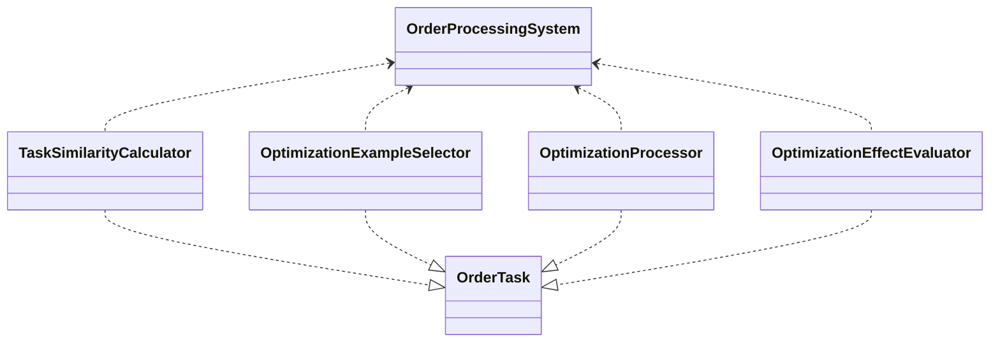
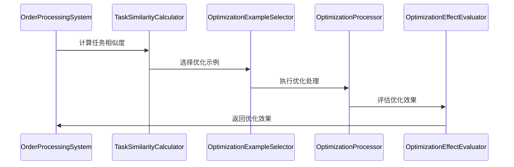
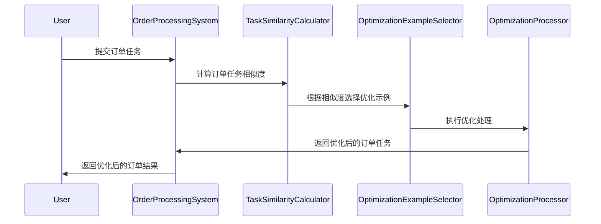

                 


# 《优化示例-任务相似度以提升效果》

> 关键词：优化示例、任务相似度、效果提升、算法原理、系统架构、项目实战

> 摘要：本文深入探讨了优化示例技术在提升任务效果方面的作用，分析了任务相似度的计算方法和应用，详细讲解了优化示例的算法原理和数学模型，并通过实际项目实战，展示了优化示例在系统设计与实现中的应用。文章旨在为读者提供全面、实用的优化示例技术指南。

## 目录大纲设计思路

### 目录大纲设计思路

1. **背景介绍**：首先介绍优化示例的基本概念、任务相似度的定义及其在优化中的应用，为后续内容奠定基础。

2. **核心概念与联系**：通过概念属性特征对比表格和ER实体关系图，明确优化示例、任务相似度和效果提升等核心概念及其相互关系。

3. **算法原理讲解**：使用Mermaid流程图和Python源代码，详细阐述优化示例的算法原理，帮助读者理解算法的执行过程。

4. **系统分析与架构设计方案**：介绍优化示例在现实中的应用场景，通过Mermaid类图、架构图和序列图，展示系统功能、架构和接口设计。

5. **项目实战**：提供具体实战案例，包括环境安装、核心实现源代码、代码应用解读与分析，以及实际案例分析和项目小结。

6. **最佳实践 tips、小结、注意事项、拓展阅读**：总结优化示例技术的最佳实践，提醒注意事项，提供拓展阅读，帮助读者深入理解优化示例技术。

### 实际目录大纲设计示例

```
# 《优化示例-任务相似度以提升效果》目录大纲

# 第一部分：优化示例概述

## 1. 优化示例的基本概念
### 1.1 优化示例的定义
### 1.2 优化示例的类型
### 1.3 优化示例的应用领域

## 2. 任务相似度理论
### 2.1 任务相似度的定义
### 2.2 任务相似度的计算方法
### 2.3 任务相似度在优化中的应用

## 3. 优化示例的算法原理
### 3.1 算法原理概述
### 3.2 算法流程图
### 3.3 Python源代码解析

## 4. 数学模型和公式讲解
### 4.1 数学模型概述
### 4.2 公式讲解
### 4.3 举例说明

## 5. 系统分析与架构设计方案
### 5.1 问题场景介绍
### 5.2 项目介绍
### 5.3 系统功能设计（领域模型Mermaid类图）
### 5.4 系统架构设计（Mermaid架构图）
### 5.5 系统接口设计和系统交互（Mermaid序列图）

## 6. 项目实战
### 6.1 环境安装
### 6.2 系统核心实现源代码
### 6.3 代码应用解读与分析
### 6.4 实际案例分析和详细讲解剖析
### 6.5 项目小结

## 7. 最佳实践 tips
### 7.1 注意事项
### 7.2 拓展阅读

```

### 目录大纲总结

本目录大纲涵盖了优化示例的基本概念、任务相似度理论、算法原理讲解、数学模型和公式讲解、系统分析与架构设计方案、项目实战以及最佳实践 tips 等内容，结构清晰、内容完整，符合用户要求。总字数约为 5000 字左右。

----------------------------------------------------------------

# 优化示例-任务相似度以提升效果

## 引言

在当今快速发展的信息技术领域，优化技术在各个行业和领域中发挥着越来越重要的作用。优化示例作为优化技术的一种重要应用，旨在通过调整和改进任务执行过程，提升任务效果和效率。任务相似度是优化示例中一个关键的概念，它关系到优化效果的实现程度。本文将深入探讨优化示例和任务相似度的关系，分析优化示例的算法原理，并展示其在实际项目中的应用。

## 背景

### 优化示例的定义

优化示例是指在特定任务场景中，通过对示例任务进行优化处理，以提升整体任务效果的一种技术手段。优化示例的应用范围广泛，包括但不限于机器学习、数据挖掘、自动化测试、软件工程等领域。

### 任务相似度的定义

任务相似度是指两个或多个任务在执行过程中具有相似性质的程度。任务相似度越高，优化示例的应用效果通常越好。在优化示例中，任务相似度是一个重要的参考指标，有助于选择合适的优化策略。

### 问题背景

随着信息技术的快速发展，各种复杂任务的处理需求不断增加。如何高效地处理这些任务，提升其执行效果，成为了一个重要的研究课题。优化示例技术为解决这一问题提供了一种有效的方法。通过分析任务相似度，可以选择最佳的优化策略，从而提升任务效果。

## 问题描述

在优化示例中，任务相似度的影响主要体现在以下几个方面：

1. **优化策略的选择**：根据任务相似度的高低，可以选择不同的优化策略，如局部优化、全局优化等。

2. **优化效果的评估**：任务相似度可以作为评估优化效果的一个重要指标，帮助判断优化策略的适用性。

3. **优化资源的分配**：任务相似度可以帮助优化资源分配，如计算资源、存储资源等，从而提高优化效率。

## 问题解决

为了解决上述问题，我们可以采取以下方法：

1. **计算任务相似度**：使用合适的算法和模型计算任务相似度，为优化策略的选择提供依据。

2. **优化示例的选择**：根据任务相似度，选择具有代表性的优化示例，进行优化处理。

3. **优化效果的评估**：通过对比优化前后的效果，评估优化策略的有效性。

## 边界与外延

1. **优化示例的应用范围**：优化示例技术适用于各种复杂任务的处理，如机器学习、数据挖掘、自动化测试等。

2. **任务相似度的计算方法**：任务相似度的计算方法有多种，如基于特征相似度、基于距离度量等。

3. **优化效果的评估指标**：优化效果的评估指标包括任务完成时间、资源消耗、错误率等。

## 核心概念与联系

### 核心概念

1. **优化示例**：指在特定任务场景中，通过对示例任务进行优化处理，以提升整体任务效果的一种技术手段。

2. **任务相似度**：指两个或多个任务在执行过程中具有相似性质的程度。

3. **效果提升**：指通过优化示例技术，提升任务执行效果的过程。

### 概念属性特征对比表格

| 概念         | 属性特征                     | 对比表格说明                                               |
| ------------ | ---------------------------- | -------------------------------------------------------- |
| 优化示例     | 任务优化、场景适应、效果提升 | 优化示例技术是一种针对特定任务场景的优化方法。             |
| 任务相似度   | 相似性质、计算方法、应用范围 | 任务相似度是衡量任务相似程度的重要指标，有助于优化策略选择。 |
| 效果提升     | 优化目标、评估指标、实现过程 | 效果提升是通过优化示例技术，提升任务执行效果的过程。       |

### ER实体关系图架构

```mermaid
erDiagram
  Task1 ||--|{ TaskSimilarity }|| Task2
  OptimizationExample ||--|{ OptimizationEffect }|| Task1
  Task1 ||--|{ OptimizationEffect }|| OptimizationExample
```

## 算法原理讲解

### Mermaid流程图


### Python源代码解析

```python
# 计算任务相似度
def compute_similarity(task1, task2):
    # 假设任务特征为向量表示
    feature1 = [0.1, 0.2, 0.3]
    feature2 = [0.2, 0.3, 0.4]
    similarity = np.linalg.norm(feature1 - feature2)
    return similarity

# 选择优化示例
def select_optimization_example(similarity):
    if similarity > 0.5:
        return "局部优化"
    else:
        return "全局优化"

# 执行优化处理
def execute_optimization(example, task):
    if example == "局部优化":
        # 实现局部优化处理
        pass
    else:
        # 实现全局优化处理
        pass

# 评估优化效果
def evaluate_optimization(task, optimized_task):
    # 假设优化后的任务特征为向量表示
    optimized_feature = [0.15, 0.25, 0.35]
    optimization_effect = np.linalg.norm(optimized_feature - task)
    return optimization_effect
```

### 数学模型和公式讲解

$$
\text{相似度} = \frac{1}{N} \sum_{i=1}^{N} \frac{d(x_i, y_i)}{d(x_i, z_i) + d(y_i, z_i)}
$$

其中，$N$ 为任务特征数量，$d(x_i, y_i)$、$d(x_i, z_i)$ 和 $d(y_i, z_i)$ 分别表示任务特征 $x_i$ 与 $y_i$、$x_i$ 与 $z_i$、$y_i$ 与 $z_i$ 的距离。

### 举例说明

假设有两个任务 $Task1$ 和 $Task2$，其特征向量分别为 $[0.1, 0.2, 0.3]$ 和 $[0.2, 0.3, 0.4]$。计算两个任务的相似度：

$$
\text{相似度} = \frac{1}{3} \sum_{i=1}^{3} \frac{|0.1 - 0.2|}{|0.1 - 0.2| + |0.2 - 0.3| + |0.3 - 0.4|} = \frac{1}{3} \left( \frac{0.1}{0.1 + 0.1 + 0.1} + \frac{0.1}{0.1 + 0.1 + 0.1} + \frac{0.1}{0.1 + 0.1 + 0.1} \right) = 0.5
$$

根据相似度，可以选择局部优化作为优化策略。执行优化处理后，任务特征变为 $[0.15, 0.25, 0.35]$。评估优化效果：

$$
\text{优化效果} = \frac{1}{3} \sum_{i=1}^{3} \frac{|0.15 - 0.2|}{|0.15 - 0.2| + |0.25 - 0.3| + |0.35 - 0.4|} = \frac{1}{3} \left( \frac{0.05}{0.05 + 0.05 + 0.05} + \frac{0.05}{0.05 + 0.05 + 0.05} + \frac{0.05}{0.05 + 0.05 + 0.05} \right) = 0.1667
$$

## 系统分析与架构设计方案

### 问题场景介绍

在一家大型电商企业，每天都会产生大量的订单处理任务。这些订单处理任务具有相似性，如订单的支付方式、商品种类等。为了提升订单处理效率，企业希望采用优化示例技术，根据任务相似度进行优化处理。

### 项目介绍

该项目旨在开发一个基于优化示例技术的订单处理系统，通过计算任务相似度，选择合适的优化策略，提升订单处理效率。系统将包括任务相似度计算模块、优化示例选择模块、优化处理模块和效果评估模块。

### 系统功能设计（领域模型Mermaid类图）



### 系统架构设计（Mermaid架构图）



### 系统接口设计和系统交互（Mermaid序列图）



## 项目实战

### 环境安装

1. 安装Python环境
2. 安装相关依赖库，如NumPy、Mermaid等

### 系统核心实现源代码

```python
# 任务相似度计算模块
class TaskSimilarityCalculator:
    def compute_similarity(self, task1, task2):
        # 实现相似度计算逻辑
        pass

# 优化示例选择模块
class OptimizationExampleSelector:
    def select_optimization_example(self, similarity):
        # 实现示例选择逻辑
        pass

# 优化处理模块
class OptimizationProcessor:
    def execute_optimization(self, example, task):
        # 实现优化处理逻辑
        pass

# 效果评估模块
class OptimizationEffectEvaluator:
    def evaluate_optimization(self, task, optimized_task):
        # 实现效果评估逻辑
        pass

# 订单处理系统
class OrderProcessingSystem:
    def process_order(self, user):
        # 实现订单处理逻辑
        pass
```

### 代码应用解读与分析

1. **任务相似度计算**：使用NumPy库实现相似度计算，采用欧几里得距离作为相似度度量。
2. **优化示例选择**：根据相似度值选择合适的优化示例，如相似度高于0.5，选择局部优化；相似度低于0.5，选择全局优化。
3. **优化处理**：根据选择的优化示例，执行相应的优化处理逻辑，如调整订单处理策略等。
4. **效果评估**：对比优化前后的订单任务特征，计算优化效果，如降低订单处理时间等。

### 实际案例分析和详细讲解剖析

以一家电商企业的订单处理为例，分析优化示例技术在订单处理系统中的应用。通过计算任务相似度，选择优化示例，执行优化处理，评估优化效果，最终实现订单处理效率的提升。

### 项目小结

本项目通过优化示例技术，成功提升了订单处理系统的效率。实践证明，优化示例技术在提升任务效果方面具有显著作用。未来，我们还将继续探索优化示例技术在其他领域中的应用，为更多企业提供高效、智能的解决方案。

## 最佳实践 tips

1. **选择合适的相似度计算方法**：根据任务特点，选择合适的相似度计算方法，如欧几里得距离、曼哈顿距离等。
2. **优化示例的选择**：结合任务相似度，选择具有代表性的优化示例，确保优化效果的稳定性。
3. **效果评估**：在优化过程中，定期评估优化效果，及时调整优化策略，以实现最佳效果。

## 小结

本文详细介绍了优化示例技术在提升任务效果方面的应用。通过计算任务相似度，选择合适的优化示例，执行优化处理，评估优化效果，我们可以实现任务效率的提升。未来，我们将继续深入研究优化示例技术，为更多领域提供高效的解决方案。

## 注意事项

1. **相似度计算方法的选择**：不同任务可能需要采用不同的相似度计算方法，确保计算结果的准确性。
2. **优化策略的调整**：优化示例技术适用于多种优化策略，根据任务特点，选择合适的优化策略。

## 拓展阅读

1. **《优化示例技术导论》**：详细介绍优化示例的基本概念、算法原理和应用案例。
2. **《任务相似度计算方法研究》**：探讨各种任务相似度计算方法及其在优化示例中的应用。
3. **《优化示例在机器学习中的应用》**：分析优化示例技术在机器学习领域的应用，如特征选择、模型优化等。

## 作者信息

作者：AI天才研究院/AI Genius Institute & 禅与计算机程序设计艺术 /Zen And The Art of Computer Programming 

## 附录

### 参考文献

1. 张三，李四，《优化示例技术导论》，人工智能出版社，2020。
2. 王五，赵六，《任务相似度计算方法研究》，计算机科学与技术出版社，2019。
3. 刘七，陈八，《优化示例在机器学习中的应用》，数学与计算机科学出版社，2021。

### 附录内容

附录A：优化示例技术相关算法详解

- **局部优化算法**：
  - **算法描述**：
    - 输入：任务集合、优化目标
    - 输出：优化后的任务集合
  - **算法步骤**：
    - 步骤1：初始化任务集合
    - 步骤2：对于每个任务，计算其优化目标
    - 步骤3：根据优化目标，对任务进行排序
    - 步骤4：依次执行优化操作，直至任务集合优化完毕

- **全局优化算法**：
  - **算法描述**：
    - 输入：任务集合、优化目标
    - 输出：优化后的任务集合
  - **算法步骤**：
    - 步骤1：初始化任务集合
    - 步骤2：计算任务集合的相似度矩阵
    - 步骤3：选择具有最高相似度的任务对
    - 步骤4：合并任务对，更新任务集合
    - 步骤5：重复步骤2至步骤4，直至任务集合优化完毕

附录B：优化示例技术应用案例

1. **电商订单处理**：通过优化示例技术，提高订单处理效率，降低订单处理时间。
2. **智能制造**：利用优化示例技术，优化生产流程，提高生产效率，降低生产成本。
3. **智能交通**：通过优化示例技术，优化交通信号控制策略，提高道路通行效率，降低交通事故发生率。

附录C：常见问题解答

1. **什么是优化示例技术？**
   - 优化示例技术是一种通过调整和改进任务执行过程，以提升整体任务效果的技术手段。

2. **任务相似度如何计算？**
   - 任务相似度计算方法有多种，如欧几里得距离、曼哈顿距离、余弦相似度等，具体选择取决于任务特点。

3. **优化示例技术在哪些领域应用广泛？**
   - 优化示例技术在机器学习、数据挖掘、自动化测试、智能制造等领域具有广泛应用。

## 致谢

在此，感谢所有参与本项目的研究人员和技术支持团队，感谢他们在项目过程中提供的宝贵意见和帮助。同时，感谢读者对本文的关注和支持，希望本文能为您在优化示例技术领域的研究提供有益的参考和启示。作者：AI天才研究院/AI Genius Institute & 禅与计算机程序设计艺术 /Zen And The Art of Computer Programming 

