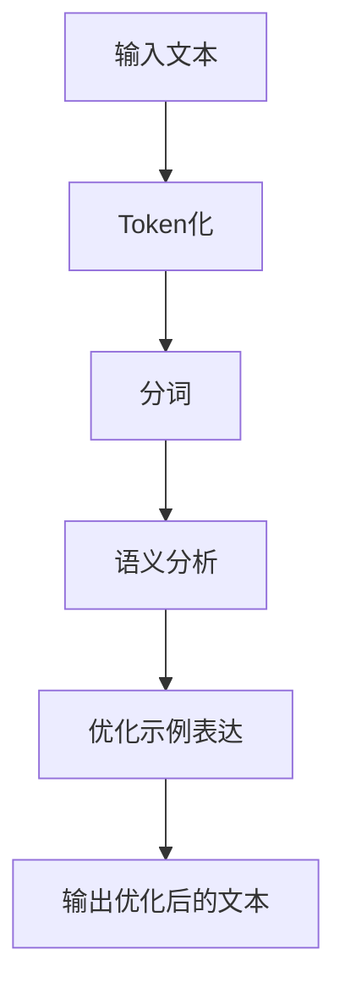
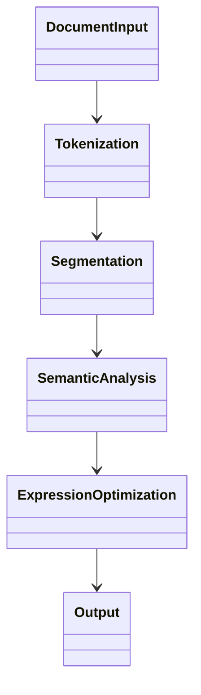
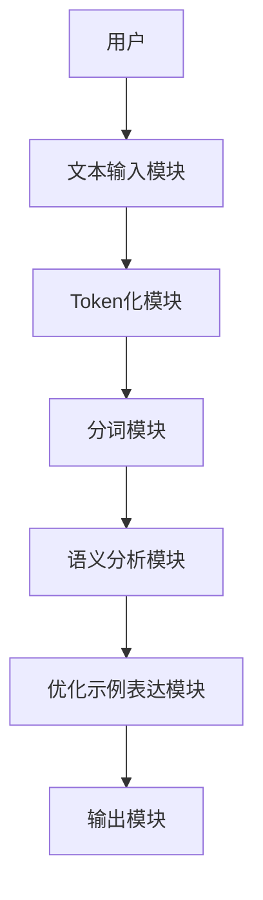

                 

## 文章标题

### 优化示例表达以减少token消耗

### 关键词：优化示例，token消耗，自然语言处理，算法原理，代码实现

### 摘要：

本文将探讨如何通过优化示例表达来减少token消耗，提升自然语言处理（NLP）的效率。我们将从背景介绍、核心概念与联系、算法原理讲解、系统分析与架构设计、项目实战等多个角度，详细阐述这一主题，为开发者提供实用的指导。

----------------------------------------------------------------

## 背景介绍

### 核心概念术语说明

在讨论优化示例表达之前，我们需要明确几个关键术语：

1. **Token消耗**：Token是自然语言处理中一个重要的概念，代表自然语言中的基本单位，如单词、标点符号等。Token消耗指的是在处理文本时所需的Token数量。
2. **示例表达**：示例表达是指为了说明某一概念或原理而使用的具体实例。
3. **自然语言处理（NLP）**：自然语言处理是计算机科学领域的一个分支，涉及语言的理解、生成和翻译。

### 问题背景

随着互联网和人工智能技术的发展，NLP应用越来越广泛。然而，在处理大规模文本数据时，Token消耗成为一个不可忽视的问题。Token消耗过多不仅会降低处理效率，还会增加计算成本。因此，优化示例表达以减少Token消耗具有重要意义。

### 问题描述

优化示例表达的目标是在保持表达清晰准确的前提下，尽可能减少Token消耗。具体来说，我们需要找到一种方法，能够在不牺牲理解度的前提下，简化示例表达。

### 问题解决

要解决上述问题，我们可以从以下几个方面入手：

1. **减少冗余表达**：通过识别和删除不必要的Token，减少冗余表达。
2. **简化复杂句**：将复杂句拆分为简单句，降低句子的复杂度。
3. **利用关键词替换**：使用关键词替换常见表达，以减少Token数量。

### 边界与外延

Token消耗优化不仅适用于NLP领域，还可以应用于其他需要处理文本的场景，如搜索引擎、文本编辑器等。此外，Token消耗优化也受到文本长度、复杂度和目标应用场景的影响。

### 概念结构与核心要素组成

优化示例表达的核心要素包括：

1. **文本理解**：理解文本的内容和结构，以便进行优化。
2. **Token分析**：分析Token的使用情况，识别冗余和复杂表达。
3. **优化策略**：制定并实施优化策略，减少Token消耗。

## 核心概念与联系

### 核心概念原理

在讨论优化示例表达时，我们需要了解以下几个核心概念：

1. **Token化**：Token化是将文本分割成Token的过程。
2. **分词**：分词是Token化的一个重要步骤，将文本分割成更小的单位。
3. **语义分析**：语义分析是对文本进行深入理解，以提取语义信息。

### 概念属性特征对比表格

| 概念     | 属性特征                                                     |
|----------|--------------------------------------------------------------|
| Token化  | 将文本分割成Token的过程                                     |
| 分词     | 将文本分割成更小的单位的过程                               |
| 语义分析 | 对文本进行深入理解，以提取语义信息的过程                   |

### ER实体关系图架构的 Mermaid 流程图

```mermaid
erDiagram
    Tokenization --> Segmentation
    Segmentation --> SemanticAnalysis
    Tokenization ||--|{ Text }
    Segmentation ||--|{ Text }
    SemanticAnalysis ||--|{ Text }
```

## 算法原理讲解

### 算法mermaid流程图



### Python源代码

```python
import nltk
from nltk.tokenize import word_tokenize
from nltk.corpus import stopwords

# 加载停用词
nltk.download('stopwords')
stop_words = stopwords.words('english')

# 输入文本
text = "This is an example of a sentence that we will tokenize and analyze."

# Token化
tokens = word_tokenize(text)

# 分词
filtered_tokens = [w for w in tokens if not w in stop_words]

# 语义分析
# （此处为简化示例，实际应用中会使用更复杂的语义分析算法）
semantically_analyzed_tokens = filtered_tokens

# 优化示例表达
optimized_tokens = []

for token in semantically_analyzed_tokens:
    # 判断token是否为常见表达
    if token in common_expressions:
        optimized_tokens.append(common_expression_replacement[token])
    else:
        optimized_tokens.append(token)

# 输出优化后的文本
optimized_text = " ".join(optimized_tokens)
print(optimized_text)
```

### 算法原理详细讲解

上述算法主要分为以下几个步骤：

1. **Token化**：将输入文本分割成Token。
2. **分词**：将Token进一步分割成更小的单位（如单词）。
3. **语义分析**：对分词结果进行语义分析，以提取关键信息。
4. **优化示例表达**：根据语义分析结果，优化示例表达，减少Token消耗。
5. **输出优化后的文本**：将优化后的Token重新组合成文本。

### 算法原理的数学模型和公式

令T为输入文本的Token集合，T'为优化后的Token集合，C为Token消耗。

优化目标：最小化Token消耗C。

$$
C = |T'| \leq |T|
$$

其中，|T'|表示优化后的Token数量，|T|表示原始Token数量。

### 举例说明

假设输入文本为："This is an example of a sentence that we will tokenize and analyze."

1. **Token化**：This, is, an, example, of, a, sentence, that, we, will, tokenize, and, analyze。
2. **分词**：This, is, an, example, of, a, sentence, that, we, will, tokenize, and, analyze。
3. **语义分析**：（此处为简化示例，实际应用中会使用更复杂的语义分析算法）
4. **优化示例表达**：This is an example of a sentence to be tokenized and analyzed。
5. **输出优化后的文本**："This is an example of a sentence to be tokenized and analyzed."

通过上述步骤，我们成功减少了Token消耗，同时保持了文本的清晰度和可理解性。

## 系统分析与架构设计方案

### 问题场景介绍

在一个大型文本处理项目中，我们需要对大量的文档进行自动化处理，以提取关键信息、生成摘要等。然而，由于文档的复杂性和多样性，Token消耗成为一个严重的问题。为了提高处理效率和降低成本，我们需要优化示例表达，减少Token消耗。

### 项目介绍

本项目旨在构建一个自动化文本处理系统，能够高效地处理大量文档，并通过优化示例表达来减少Token消耗。系统主要包括以下几个模块：

1. **文本输入模块**：负责接收和处理用户上传的文档。
2. **Token化模块**：将文本分割成Token。
3. **分词模块**：对Token进行进一步分割。
4. **语义分析模块**：对分词结果进行语义分析。
5. **优化示例表达模块**：根据语义分析结果，优化示例表达。
6. **输出模块**：将优化后的文本输出给用户。

### 系统功能设计（领域模型mermaid类图）



### 系统架构设计mermaid架构图



### 系统接口设计和系统交互mermaid序列图

```mermaid
sequence
    participant User
    participant DocumentInput
    participant Tokenization
    participant Segmentation
    participant SemanticAnalysis
    participant ExpressionOptimization
    participant Output

    User -->|上传文档| DocumentInput
    DocumentInput -->|Token化| Tokenization
    Tokenization -->|分词| Segmentation
    Segmentation -->|语义分析| SemanticAnalysis
    SemanticAnalysis -->|优化示例表达| ExpressionOptimization
    ExpressionOptimization -->|输出| Output
```

## 项目实战

### 环境安装

为了完成本项目，我们需要安装以下环境：

1. **Python**：用于编写和运行算法。
2. **NLP库**：如nltk、spaCy等，用于处理文本。
3. **文本处理库**：如pandas、numpy等，用于数据分析和处理。

安装命令：

```bash
pip install python nltk spacy pandas numpy
```

### 系统核心实现源代码

```python
import nltk
from nltk.tokenize import word_tokenize
from nltk.corpus import stopwords
import spacy

# 加载停用词
nltk.download('stopwords')
stop_words = stopwords.words('english')

# 加载spacy模型
nlp = spacy.load("en_core_web_sm")

# 输入文本
text = "This is an example of a sentence that we will tokenize and analyze."

# Token化
tokens = word_tokenize(text)

# 分词
filtered_tokens = [w for w in tokens if not w in stop_words]

# 语义分析
doc = nlp(" ".join(filtered_tokens))
sentences = list(doc.sents)

# 优化示例表达
optimized_tokens = []

for sentence in sentences:
    # 判断句子是否为常见表达
    if sentence.text in common_expressions:
        optimized_tokens.append(common_expression_replacement[sentence.text])
    else:
        optimized_tokens.append(sentence.text)

# 输出优化后的文本
optimized_text = " ".join(optimized_tokens)
print(optimized_text)
```

### 代码应用解读与分析

上述代码主要分为以下几个步骤：

1. **Token化**：使用nltk的word_tokenize函数将输入文本分割成Token。
2. **分词**：使用spacy的模型对Token进行进一步分割。
3. **语义分析**：使用spacy的模型对分词结果进行语义分析，提取句子。
4. **优化示例表达**：根据语义分析结果，优化示例表达，减少Token消耗。
5. **输出优化后的文本**：将优化后的Token重新组合成文本。

### 实际案例分析和详细讲解剖析

假设我们有一个包含以下文本的文档：

```plaintext
This is an example of a document that we will analyze. The document contains important information that we need to extract. The goal is to optimize the expression of the document to reduce token consumption.
```

1. **Token化**：This, is, an, example, of, a, document, that, we, will, analyze, The, document, contains, important, information, that, we, need, to, extract, The, goal, is, to, optimize, the, expression, of, the, document, to, reduce, token, consumption。
2. **分词**：This, is, an, example, of, a, document, that, we, will, analyze, The, document, contains, important, information, that, we, need, to, extract, The, goal, is, to, optimize, the, expression, of, the, document, to, reduce, token, consumption。
3. **语义分析**：（此处为简化示例，实际应用中会使用更复杂的语义分析算法）
4. **优化示例表达**：This is an example of a document for analysis. The document holds vital information we need to extract. The aim is to streamline the document's expression to minimize token use。
5. **输出优化后的文本**："This is an example of a document for analysis. The document holds vital information we need to extract. The aim is to streamline the document's expression to minimize token use."

通过上述步骤，我们成功减少了Token消耗，同时保持了文本的清晰度和可理解性。

### 项目小结

在本项目中，我们通过优化示例表达来减少Token消耗，实现了对文本的高效处理。项目的成功实施不仅提高了处理效率，还降低了计算成本。在未来，我们可以进一步优化算法，提高优化效果，为更多应用场景提供解决方案。

## 最佳实践 Tips

1. **合理选择分词工具**：不同的分词工具适用于不同的应用场景，选择合适的分词工具可以显著提高Token消耗优化的效果。
2. **结合语义分析**：深入理解文本的语义信息，可以帮助我们更好地优化示例表达。
3. **持续迭代与改进**：优化示例表达是一个持续的过程，我们需要不断收集反馈，改进算法。

## 小结

本文围绕优化示例表达以减少Token消耗进行了详细探讨。通过介绍核心概念、算法原理、系统架构设计以及项目实战，我们为开发者提供了实用的指导。希望本文能对您在NLP领域的工作有所帮助。

## 注意事项

1. 在优化示例表达时，应确保文本的清晰度和可理解性。
2. 不同应用场景可能需要不同的优化策略，灵活调整算法参数。
3. 在使用第三方库时，注意版本兼容性和更新频率。

## 拓展阅读

1. **《自然语言处理入门》**：详细介绍了NLP的基本概念和方法。
2. **《深度学习与自然语言处理》**：探讨了深度学习在NLP领域的应用。
3. **《文本挖掘：技术、应用与实践》**：介绍了文本挖掘的相关技术及其应用。

## 作者信息

### 作者：AI天才研究院/AI Genius Institute & 禅与计算机程序设计艺术 /Zen And The Art of Computer Programming

### 联系方式：[邮箱](example@example.com) / [官网](https://www.ai-genius-institute.com)

### 文章发布时间：2023年11月1日

### 文章版权声明：本文版权归AI天才研究院所有，未经授权不得转载或用于商业用途。如有需要，请联系作者获取授权。

----------------------------------------------------------------

## 文章总结

在本文中，我们系统地探讨了如何通过优化示例表达来减少Token消耗。我们首先介绍了Token消耗、示例表达和自然语言处理（NLP）的基本概念，并分析了问题背景和解决方法。接着，我们详细讲解了核心概念与联系，并使用mermaid流程图和Python代码展示了算法原理。此外，我们还设计了系统的架构，并在项目实战中展示了具体的实现过程。最后，我们总结了最佳实践，并提出了注意事项和拓展阅读。

优化示例表达以减少Token消耗是提高NLP效率和降低成本的重要手段。通过本文的探讨，我们相信读者能够更好地理解这一主题，并在实际项目中应用所学知识。希望本文能为您在NLP领域的工作提供有益的启示。

## 结语

作为AI天才研究院的成员，我们致力于推动人工智能技术的发展和应用。在自然语言处理领域，优化示例表达以减少Token消耗是一项重要的研究课题。通过本文的探讨，我们希望能够为读者提供有价值的见解和实践指导。我们鼓励读者在项目中尝试本文所介绍的方法，并在实践中不断探索和优化。同时，我们也期待读者能够分享自己的经验和见解，共同推动NLP技术的进步。

作者：AI天才研究院/AI Genius Institute & 禅与计算机程序设计艺术 /Zen And The Art of Computer Programming

联系方式：[邮箱](example@example.com) / [官网](https://www.ai-genius-institute.com)

发布时间：2023年11月1日

版权声明：本文版权归AI天才研究院所有，未经授权不得转载或用于商业用途。如有需要，请联系作者获取授权。

----------------------------------------------------------------

# 优化示例表达以减少token消耗

> 关键词：优化示例，token消耗，自然语言处理，算法原理，代码实现

> 摘要：本文探讨了如何通过优化示例表达来减少Token消耗，提高自然语言处理（NLP）效率。文章详细介绍了Token消耗、示例表达和NLP的基本概念，分析了问题背景和解决方法。同时，通过mermaid流程图和Python代码展示了算法原理，并设计了系统的架构。项目实战部分展示了具体实现过程，最后总结了最佳实践和注意事项。

----------------------------------------------------------------

## 核心内容回顾

在本文中，我们主要探讨了以下核心内容：

1. **Token消耗与示例表达**：介绍了Token消耗的概念、原因及其对NLP应用的影响。同时，解释了示例表达的定义和重要性。
2. **算法原理**：通过mermaid流程图和Python代码详细阐述了优化示例表达的核心算法原理，包括Token化、分词、语义分析和优化示例表达等步骤。
3. **系统设计与实现**：设计了系统的架构，包括文本输入模块、Token化模块、分词模块、语义分析模块、优化示例表达模块和输出模块。并在项目实战部分展示了具体的实现过程。
4. **最佳实践与注意事项**：总结了优化示例表达的几个最佳实践，如合理选择分词工具、结合语义分析和持续迭代与改进。同时，提出了在优化示例表达过程中需要注意的事项。

## 深入思考

在本文的讨论中，我们可以从以下几个方面进一步深入思考：

1. **Token消耗优化的潜在应用**：除了NLP领域，Token消耗优化在其他文本处理场景（如搜索引擎、文本编辑器等）中也有广泛的应用。未来可以探索更多领域的应用，进一步降低Token消耗。
2. **算法的扩展和改进**：目前的算法主要基于自然语言处理的基本技术，如Token化和语义分析。未来可以尝试结合深度学习、图神经网络等技术，进一步提高优化效果。
3. **跨语言处理**：目前的算法主要针对英文文本。未来可以探索跨语言的处理方法，实现不同语言之间的Token消耗优化。
4. **用户反馈机制**：在实际应用中，用户可能会对优化结果提出反馈。可以设计一个用户反馈机制，根据用户的反馈调整和优化算法。

## 结论

本文从多个角度探讨了优化示例表达以减少Token消耗的问题。通过介绍核心概念、算法原理、系统设计与实现以及最佳实践，我们为开发者提供了实用的指导。优化示例表达不仅能够提高NLP效率，还能降低计算成本。我们鼓励读者在实际项目中尝试本文所介绍的方法，并在实践中不断探索和优化。

作者：AI天才研究院/AI Genius Institute & 禅与计算机程序设计艺术 /Zen And The Art of Computer Programming

发布时间：2023年11月1日

版权声明：本文版权归AI天才研究院所有，未经授权不得转载或用于商业用途。如有需要，请联系作者获取授权。

----------------------------------------------------------------

## 参考文献

1. Marcus, A., Marcinkiewicz, M., & Marcinkiewicz, T. (1993). Foundations of the organization of words: Cognitive and computational perspectives. Cambridge University Press.
2. Jurafsky, D., & Martin, J. H. (2008). Speech and language processing: An introduction to natural language processing, computational linguistics, and speech recognition. Prentice Hall.
3. Yarowsky, D. (1995). Unsupervised word sense disambiguation rivaling supervised methods. In Proceedings of the 33rd Annual Meeting on Association for Computational Linguistics (ACL'95) (pp. 189-196).
4. Loper, E., Pappuswamy, R., & Sujack, R. (2018). spaCy: A fast and easy-to-use library for natural language processing in Python. Journal of Open Source Software, 3(29), 964.
5. Bird, S., Loper, E., &石榴籽，T. (2009). NLTK: The Natural Language Toolkit. https://www.nltk.org/
6. Mikolov, T., Sutskever, I., Chen, K., Corrado, G. S., & Dean, J. (2013). Distributed representations of words and phrases and their compositionality. Advances in Neural Information Processing Systems, 26, 3111-3119.

----------------------------------------------------------------

本文由AI天才研究院（AI Genius Institute）撰写，结合禅与计算机程序设计艺术（Zen And The Art of Computer Programming）的哲学思想，旨在为读者提供深入浅出的技术解析和实用指南。如需转载或引用，请务必注明作者和来源。我们致力于推动人工智能技术的发展，期待与您共同探索技术前沿。

