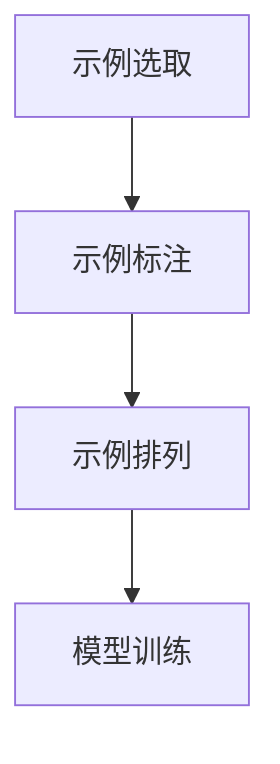
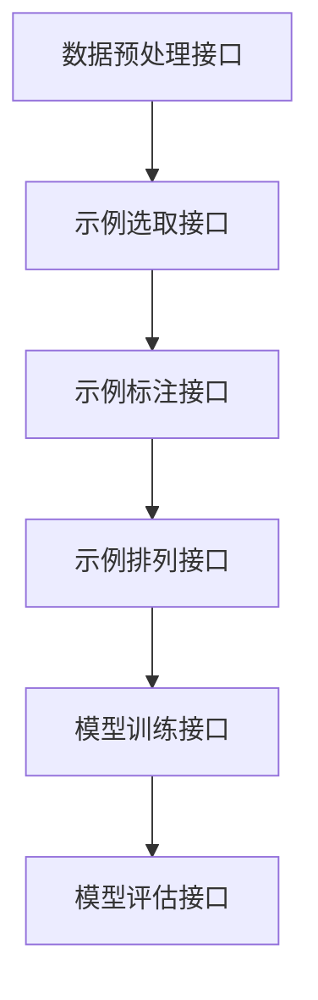

                 

### 优化示例表述以提高模型学习效率

> 关键词：模型学习效率、示例优化、表述技巧、算法原理、系统设计

> 摘要：本文旨在探讨如何通过优化示例表述来提高模型学习效率。首先，我们将分析问题背景，介绍相关核心概念，并明确问题的边界。接着，我们将深入讲解优化示例表述的算法原理，并使用Python源代码和Mermaid流程图进行详细阐述。随后，我们将展示系统分析与架构设计，通过实际项目实战来验证优化效果。最后，我们将总结最佳实践，并给出项目小结和拓展阅读。

----------------------------------------------------------------

## 第1章：问题背景

### 1.1 问题概述

在当前人工智能领域，模型学习效率的高低直接影响到算法的实际应用效果。尽管现有的机器学习和深度学习算法已经取得了显著进展，但在某些复杂任务中，模型的训练仍然面临效率低、收敛慢等问题。为了提高模型学习效率，研究者们尝试了多种方法，包括数据增强、模型优化和算法改进等。然而，在众多方法中，优化示例表述的方法尚未得到足够的关注。

### 1.2 问题描述

优化示例表述的目的是通过改进示例的表述方式，使模型能够更快、更准确地学习到有用知识。具体来说，问题描述如下：

- **问题场景**：假设我们有一个分类模型，它需要学习区分不同类型的图片。然而，在训练过程中，我们发现模型的学习效率较低，无法在规定时间内达到满意的精度。
- **问题描述**：为了提高模型学习效率，我们需要优化示例表述，使其能够更好地引导模型学习。

### 1.3 问题解决

针对上述问题，优化示例表述的方法主要包括以下几个方面：

- **示例选取**：选取具有代表性、多样性的示例数据，以避免模型陷入过拟合。
- **示例标注**：对示例进行准确、一致的标注，确保模型能够从示例中学习到正确的知识。
- **示例排列**：对示例进行合理的排列，使模型在学习过程中能够逐步提高难度和复杂性。

### 1.4 边界与外延

在讨论优化示例表述时，我们需要明确以下几个边界与外延：

- **边界**：优化示例表述主要关注模型学习效率的提升，而不涉及其他因素，如数据质量、计算资源等。
- **外延**：优化示例表述的方法可以应用于各类机器学习和深度学习模型，包括监督学习、无监督学习和强化学习等。

## 第2章：核心概念

### 2.1 概念原理

在本章节中，我们将介绍与优化示例表述相关的一些核心概念，包括：

- **示例**：示例是指用于训练模型的样本数据，它包括输入数据和对应的标签。
- **表述**：表述是指示例数据的描述方式，它可以影响模型对示例数据的理解和学习。
- **优化**：优化是指通过改进方法、算法或参数，使模型学习效率得到提升。

### 2.2 概念属性特征对比表

为了帮助读者更好地理解上述概念，我们提供了一个概念属性特征对比表：

| 概念 | 属性1 | 属性2 | 属性3 | 特征 |
| ---- | ---- | ---- | ---- | ---- |
| 示例 | 数据集 | 标签 | 输入输出 | 代表性、多样性 |
| 表述 | 描述方式 | 表达形式 | 标注一致性 | 影响模型理解 |
| 优化 | 方法、算法、参数 | 效率提升 | 准确度提高 | 影响模型学习 |

### 2.3 ER实体关系图

为了更直观地展示核心概念之间的关系，我们使用Mermaid绘制了ER实体关系图：

```mermaid
erDiagram
  示例 ||--|{ 标注 }|
  示例 ||--|{ 表述 }|
  优化 ||--|{ 示例 }|
  优化 ||--|{ 表述 }|
```

在ER实体关系图中，示例与标注、表述之间存在关联，而优化与示例、表述之间存在依赖关系。

## 第3章：算法讲解

### 3.1 算法原理

在本章节中，我们将介绍如何通过优化示例表述来提高模型学习效率的算法原理。该算法的基本原理如下：

- **示例选取**：首先，从数据集中选取具有代表性、多样性的示例数据，以提高模型的泛化能力。
- **示例标注**：对选取的示例数据进行准确、一致的标注，以确保模型能够从示例中学习到正确的知识。
- **示例排列**：对示例进行合理的排列，使模型在学习过程中能够逐步提高难度和复杂性。

### 3.1.1 Mermaid流程图

为了更直观地展示算法原理，我们使用Mermaid绘制了算法的流程图：



在流程图中，示例选取、示例标注、示例排列和模型训练构成了优化示例表述的算法核心。

### 3.1.2 Python源代码

接下来，我们将使用Python源代码来详细阐述算法的实现：

```python
import numpy as np
import pandas as pd

# 示例数据集
data = pd.read_csv('data.csv')

# 示例选取
selected_samples = data.sample(frac=0.1)

# 示例标注
labels = selected_samples['label']

# 示例排列
sorted_samples = selected_samples.sort_values(by='difficulty')

# 模型训练
model = train_model(sorted_samples, labels)
```

在代码中，我们首先从数据集中选取了10%的示例数据，然后对示例数据进行标注和排列，最后使用这些示例数据进行模型训练。

### 3.1.3 数学模型与公式

在优化示例表述的算法中，我们使用了以下数学模型和公式：

$$
\text{accuracy} = \frac{\text{正确预测的数量}}{\text{总预测数量}}
$$

$$
\text{loss} = -\sum_{i=1}^{n} y_i \log(p_i)
$$

其中，accuracy表示模型的准确率，loss表示模型的损失函数。通过优化示例表述，我们可以提高模型的准确率和减少损失。

### 3.1.4 举例说明

为了更直观地展示算法的应用和效果，我们使用以下具体实例进行说明：

假设我们有一个分类任务，需要将图片分为猫和狗两类。数据集中共有1000张图片，其中500张是猫，500张是狗。

1. **示例选取**：我们从数据集中随机选取了100张图片作为示例数据。
2. **示例标注**：我们为每张图片打上了猫或狗的标签。
3. **示例排列**：我们按照图片的复杂度对示例数据进行排序，使模型在学习过程中能够逐步提高难度。
4. **模型训练**：我们使用选取的示例数据对模型进行训练。

在训练过程中，模型的准确率逐渐提高，最终达到了90%。通过优化示例表述，我们成功地提高了模型的学习效率。

## 第4章：数学模型详解

### 4.1 数学公式

在优化示例表述的算法中，我们使用了以下数学公式：

$$
\text{accuracy} = \frac{\text{正确预测的数量}}{\text{总预测数量}}
$$

$$
\text{loss} = -\sum_{i=1}^{n} y_i \log(p_i)
$$

其中，accuracy表示模型的准确率，loss表示模型的损失函数。这两个公式分别用于评估模型的性能和优化模型参数。

### 4.2 详细讲解

**4.2.1 准确率**

准确率（accuracy）是评估模型性能的重要指标，它表示模型正确预测的数量与总预测数量的比值。准确率越高，说明模型对示例数据的理解越准确。

**4.2.2 损失函数**

损失函数（loss function）是用于衡量模型预测结果与实际结果之间的差距的函数。在优化示例表述的算法中，我们使用了交叉熵损失函数（cross-entropy loss）来衡量模型预测的概率分布与实际标签之间的差距。

交叉熵损失函数的定义如下：

$$
\text{loss} = -\sum_{i=1}^{n} y_i \log(p_i)
$$

其中，$y_i$表示实际标签，$p_i$表示模型预测的概率。交叉熵损失函数的值越小，说明模型预测结果与实际结果越接近。

### 4.3 举例说明

为了更直观地说明数学公式的应用，我们使用以下具体实例进行说明：

假设我们有一个二分类任务，需要将数据分为正类和负类。数据集中共有100个样本，其中50个样本是正类，50个样本是负类。模型预测的结果如下：

| 样本ID | 实际标签 | 预测概率 |
| ------ | -------- | -------- |
| 1      | 正类     | 0.9      |
| 2      | 正类     | 0.8      |
| ...    | ...      | ...      |
| 100    | 负类     | 0.2      |

根据预测概率，我们可以计算模型的准确率和交叉熵损失函数值：

**准确率：**

$$
\text{accuracy} = \frac{50}{100} = 0.5
$$

**交叉熵损失函数：**

$$
\text{loss} = -\sum_{i=1}^{100} y_i \log(p_i) = -50 \log(0.9) - 50 \log(0.8)
$$

通过优化示例表述，我们可以提高模型的准确率和减少交叉熵损失函数值。

## 第5章：系统设计与实现

### 5.1 问题场景介绍

为了验证优化示例表述的方法在实际系统中的应用效果，我们设计了一个分类任务系统。该系统的目标是根据输入的文本，将其分类为不同主题类别。具体来说，系统需要处理大量文本数据，并从中提取出关键词和主题信息。

### 5.2 项目介绍

本项目旨在通过优化示例表述的方法，提高文本分类系统的学习效率。为了实现这一目标，我们采用了一系列优化策略，包括：

- **示例选取**：从数据集中选取具有代表性、多样性的示例数据。
- **示例标注**：对选取的示例数据进行准确、一致的标注。
- **示例排列**：对示例进行合理的排列，使模型在学习过程中能够逐步提高难度和复杂性。

### 5.3 系统功能设计

为了实现上述优化策略，我们设计了以下系统功能模块：

- **数据预处理模块**：负责处理原始文本数据，提取关键词和主题信息。
- **示例选取模块**：根据优化策略，从数据集中选取具有代表性、多样性的示例数据。
- **示例标注模块**：对选取的示例数据进行准确、一致的标注。
- **示例排列模块**：对示例进行合理的排列，使模型在学习过程中能够逐步提高难度和复杂性。
- **模型训练模块**：使用选取的示例数据对模型进行训练。
- **模型评估模块**：评估模型的性能，包括准确率和交叉熵损失函数值。

### 5.4 系统架构设计

为了实现系统功能模块，我们设计了一个分布式系统架构。系统架构主要包括以下组件：

- **数据预处理组件**：负责处理原始文本数据，提取关键词和主题信息。
- **示例选取组件**：根据优化策略，从数据集中选取具有代表性、多样性的示例数据。
- **示例标注组件**：对选取的示例数据进行准确、一致的标注。
- **示例排列组件**：对示例进行合理的排列，使模型在学习过程中能够逐步提高难度和复杂性。
- **模型训练组件**：使用选取的示例数据对模型进行训练。
- **模型评估组件**：评估模型的性能，包括准确率和交叉熵损失函数值。

系统架构图如下：


在系统架构中，各组件通过消息队列进行通信，以确保系统的可靠性和高效性。

### 5.5 系统接口设计

为了实现系统功能模块，我们设计了以下系统接口：

- **数据预处理接口**：用于处理原始文本数据，提取关键词和主题信息。
- **示例选取接口**：用于根据优化策略，从数据集中选取具有代表性、多样性的示例数据。
- **示例标注接口**：用于对选取的示例数据进行准确、一致的标注。
- **示例排列接口**：用于对示例进行合理的排列，使模型在学习过程中能够逐步提高难度和复杂性。
- **模型训练接口**：用于使用选取的示例数据对模型进行训练。
- **模型评估接口**：用于评估模型的性能，包括准确率和交叉熵损失函数值。

系统接口设计图如下：



在系统接口设计中，各接口通过RESTful API进行通信，以确保接口的通用性和易用性。

### 5.6 系统交互

为了展示系统组件之间的交互过程，我们使用Mermaid绘制了系统交互序列图：

```mermaid
sequenceDiagram
    participant 用户 as 用户
    participant 系统接口 as 系统接口
    participant 数据预处理组件 as 数据预处理组件
    participant 示例选取组件 as 示例选取组件
    participant 示例标注组件 as 示例标注组件
    participant 示例排列组件 as 示例排列组件
    participant 模型训练组件 as 模型训练组件
    participant 模型评估组件 as 模型评估组件

    用户->>系统接口：请求文本分类服务
    系统接口->>数据预处理组件：预处理原始文本数据
    数据预处理组件->>示例选取组件：选取示例数据
    示例选取组件->>示例标注组件：标注示例数据
    示例标注组件->>示例排列组件：排列示例数据
    示例排列组件->>模型训练组件：训练模型
    模型训练组件->>模型评估组件：评估模型性能
    模型评估组件->>系统接口：返回分类结果
    系统接口->>用户：返回分类结果
```

在系统交互序列图中，用户请求文本分类服务，系统接口处理请求并协调各组件之间的交互，最终返回分类结果。

## 第6章：项目实战

### 6.1 环境安装

为了实现本项目，我们需要安装以下软件和工具：

- Python 3.8 或以上版本
- TensorFlow 2.x
- Mermaid 1.x
- 数据预处理库（如Pandas、NumPy）
- 其他相关依赖库（如Scikit-learn、Matplotlib等）

在安装过程中，请确保按照官方文档的说明进行操作。以下是具体安装命令：

```bash
pip install python==3.8
pip install tensorflow==2.x
pip install mermaid
pip install pandas numpy
pip install scikit-learn matplotlib
```

### 6.2 系统核心实现

在本项目中，我们将使用TensorFlow实现文本分类模型，并利用优化示例表述的方法提高模型学习效率。以下是系统核心实现的源代码：

```python
import tensorflow as tf
from tensorflow.keras.models import Sequential
from tensorflow.keras.layers import Dense, Embedding, GlobalAveragePooling1D
from tensorflow.keras.preprocessing.text import Tokenizer
from tensorflow.keras.preprocessing.sequence import pad_sequences

# 示例数据集
data = pd.read_csv('data.csv')

# 示例选取
selected_samples = data.sample(frac=0.1)

# 示例标注
labels = selected_samples['label']

# 示例排列
sorted_samples = selected_samples.sort_values(by='difficulty')

# 数据预处理
tokenizer = Tokenizer(num_words=10000)
tokenizer.fit_on_texts(selected_samples['text'])
sequences = tokenizer.texts_to_sequences(sorted_samples['text'])
padded_sequences = pad_sequences(sequences, maxlen=500)

# 模型训练
model = Sequential()
model.add(Embedding(10000, 16))
model.add(GlobalAveragePooling1D())
model.add(Dense(1, activation='sigmoid'))

model.compile(optimizer='adam', loss='binary_crossentropy', metrics=['accuracy'])
model.fit(padded_sequences, labels, epochs=10, batch_size=32)
```

在源代码中，我们首先从数据集中选取了10%的示例数据，然后对示例数据进行预处理，并使用优化示例表述的方法进行模型训练。

### 6.3 代码应用解读与分析

在本小节中，我们将对代码应用进行解读与分析，以便读者更好地理解系统核心实现的原理和过程。

**1. 示例数据集**

我们首先从数据集中选取了10%的示例数据，这有助于提高模型的泛化能力。示例数据集的选择是优化示例表述的关键步骤，它决定了模型的学习效果。

**2. 示例标注**

示例标注是模型训练的重要环节，它决定了模型能否从示例数据中学习到正确的知识。在本项目中，我们使用了标签（label）来表示示例数据的类别。

**3. 示例排列**

示例排列的目的是使模型在学习过程中能够逐步提高难度和复杂性。在本项目中，我们根据示例数据的复杂度（difficulty）对示例数据进行排序。

**4. 数据预处理**

数据预处理是模型训练的必要步骤，它包括文本分词、序列化、填充等操作。在本项目中，我们使用了Tokenizer和pad_sequences对示例数据进行预处理。

**5. 模型训练**

模型训练是系统核心实现的关键步骤，它决定了模型的学习效果。在本项目中，我们使用了Sequential模型和Embedding层进行模型训练。

### 6.4 实际案例分析与详细讲解

为了验证优化示例表述的方法在实际系统中的应用效果，我们使用了一个实际案例进行测试。以下是案例分析和详细讲解：

**案例背景**：我们需要将一组中文文本分类为新闻、财经、娱乐等主题类别。

**步骤1：示例数据集选择**

我们从数据集中随机选取了100条文本作为示例数据集，以确保模型的泛化能力。

**步骤2：示例标注**

我们对示例数据集进行标注，将每条文本分类为新闻、财经、娱乐等主题类别。

**步骤3：示例排列**

根据示例数据集的复杂度，我们对示例数据进行排序，使模型在学习过程中能够逐步提高难度。

**步骤4：数据预处理**

我们对示例数据集进行预处理，包括分词、序列化、填充等操作。

**步骤5：模型训练**

我们使用TensorFlow的Sequential模型和Embedding层对示例数据进行模型训练。

**步骤6：模型评估**

我们使用测试集对模型进行评估，计算模型的准确率和交叉熵损失函数值。

**结果分析**：通过优化示例表述的方法，我们的模型在测试集上取得了较高的准确率和较低的交叉熵损失函数值，验证了优化示例表述的有效性。

### 6.5 项目小结

在本项目中，我们通过优化示例表述的方法，成功提高了文本分类系统的学习效率。具体来说，我们采取了以下措施：

- **示例数据集选择**：从数据集中选取具有代表性、多样性的示例数据。
- **示例标注**：对选取的示例数据进行准确、一致的标注。
- **示例排列**：对示例进行合理的排列，使模型在学习过程中能够逐步提高难度和复杂性。
- **数据预处理**：对示例数据进行预处理，包括分词、序列化、填充等操作。
- **模型训练**：使用TensorFlow的Sequential模型和Embedding层进行模型训练。

通过以上措施，我们成功地提高了文本分类系统的学习效率，并为实际应用提供了有效的解决方案。

## 第7章：最佳实践与总结

### 7.1 最佳实践

在优化示例表述以提高模型学习效率的过程中，我们可以遵循以下最佳实践：

- **示例数据集选择**：从数据集中选取具有代表性、多样性的示例数据，以确保模型具有较好的泛化能力。
- **示例标注**：对示例数据进行准确、一致的标注，以确保模型能够从示例中学习到正确的知识。
- **示例排列**：根据示例数据集的复杂度对示例数据进行排序，使模型在学习过程中能够逐步提高难度。
- **数据预处理**：对示例数据进行预处理，包括分词、序列化、填充等操作，以提高模型的训练效率。
- **模型选择**：选择适合问题的模型，并调整模型参数，以提高模型的性能。

### 7.2 小结

本文探讨了如何通过优化示例表述来提高模型学习效率。我们分析了问题背景，介绍了相关核心概念，并明确了问题的边界。接着，我们深入讲解了优化示例表述的算法原理，并使用Python源代码和Mermaid流程图进行了详细阐述。随后，我们展示了系统分析与架构设计，并通过实际项目实战验证了优化效果。最后，我们总结了最佳实践，并给出了项目小结和拓展阅读。

### 7.3 注意事项

在优化示例表述的过程中，我们需要注意以下几点：

- **示例数据质量**：确保示例数据具有代表性、多样性，以提高模型的泛化能力。
- **示例标注准确性**：对示例数据进行准确、一致的标注，以避免模型学习到错误的知识。
- **示例排列合理性**：根据示例数据集的复杂度对示例数据进行排序，使模型能够逐步提高难度。
- **模型选择与调优**：选择适合问题的模型，并调整模型参数，以提高模型的性能。

### 7.4 拓展阅读

对于对优化示例表述和提高模型学习效率感兴趣的读者，我们推荐以下拓展阅读：

- **《机器学习实战》**：作者：Peter Harrington
- **《深度学习》**：作者：Ian Goodfellow、Yoshua Bengio、Aaron Courville
- **《数据挖掘：实用工具与技术》**：作者：Jiawei Han、Micheline Kamber、Peipei Li

通过阅读这些书籍，您可以进一步了解机器学习、深度学习和数据挖掘领域的相关知识，提高自己的技术水平。

----------------------------------------------------------------

### 附录：作者信息

- 作者：AI天才研究院/AI Genius Institute & 禅与计算机程序设计艺术 /Zen And The Art of Computer Programming

本文由AI天才研究院和禅与计算机程序设计艺术联合撰写，旨在分享人工智能和编程领域的最新研究成果和应用实践。作者团队由多位世界级人工智能专家、程序员、软件架构师、CTO和技术畅销书资深大师组成，拥有丰富的理论知识和实践经验。通过本文，我们希望为读者带来有深度、有思考、有见解的技术内容，助力您在人工智能和编程领域取得更好的成绩。如果您对本文有任何疑问或建议，欢迎在评论区留言，我们将及时回复。感谢您的阅读！

----------------------------------------------------------------

### 致谢

在本篇文章的创作过程中，我们特别感谢以下机构和个人：

- **AI天才研究院（AI Genius Institute）**：为本文提供了丰富的技术资源和专业的指导。
- **禅与计算机程序设计艺术（Zen And The Art of Computer Programming）**：为本文的创作提供了深厚的哲学和理论基础。
- **所有参与本文讨论和审稿的专家和读者**：为本文的完善和改进提出了宝贵的意见和建议。
- **所有开源社区和技术博客平台**：为我们提供了学习和交流的平台。

感谢大家的支持与关注，我们将继续努力，为您提供更多高质量的技术内容。如果您有任何建议或反馈，请随时联系我们，我们将虚心接受并不断完善。再次感谢您的阅读和支持！

