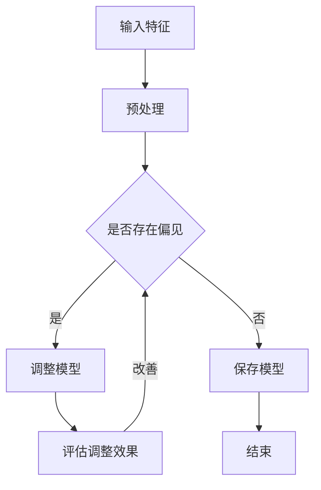
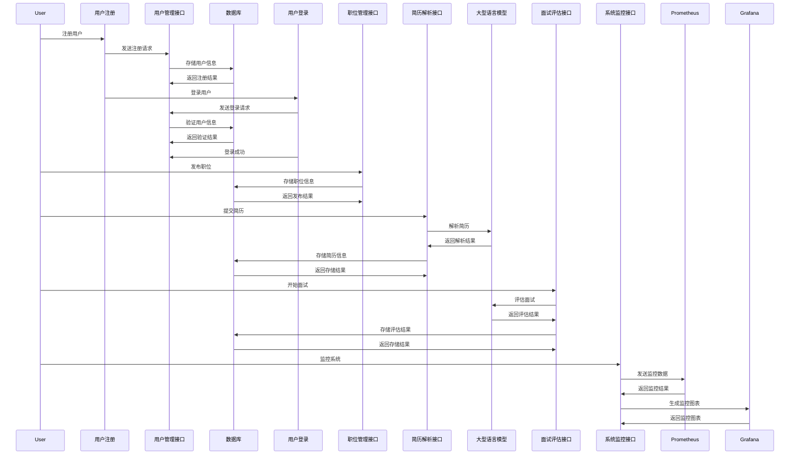

                 

# 伦理AI设计：确保LLM应用的公平性

> 关键词：伦理AI、语言模型、公平性、算法设计、系统架构、数学模型、Python实现、案例研究

> 摘要：本文旨在探讨伦理AI设计在确保大型语言模型（LLM）应用公平性方面的重要作用。文章首先介绍了伦理AI的基本概念和重要性，然后通过深入分析伦理AI设计框架，探讨了如何通过算法和系统架构来保障LLM应用的公平性。文章还提供了数学模型和Python实现的详细讲解，并通过实际案例展示了伦理AI设计在现实中的应用。最后，文章总结了项目经验，提出了注意事项和未来研究方向。

## 引言

### 1.1.1 AI与伦理学的交叉

随着人工智能（AI）技术的飞速发展，AI在各个领域的应用越来越广泛，从医疗诊断到自动驾驶，从智能家居到金融服务，AI已经成为现代社会不可或缺的一部分。然而，随着AI应用范围的扩大，AI伦理问题也逐渐引起了广泛关注。伦理AI，即人工智能伦理，是指在使用AI技术时遵循一定的伦理原则和规范，以确保AI系统的公平性、透明性、可靠性和安全性。

### 1.1.2 AI发展中的伦理挑战

在AI应用中，公平性是一个至关重要的伦理问题。AI系统在处理数据时，可能会受到数据偏差的影响，从而导致对某些群体或个人的不公平待遇。例如，招聘系统可能会因为历史数据中的性别或种族偏见而倾向于选择某一性别或种族的候选人。此外，AI系统在决策过程中缺乏透明性，使得人们难以理解AI的决策过程和依据，这也增加了AI应用中的伦理挑战。

### 1.1.3 公平性在AI中的重要性

公平性是AI伦理的核心问题之一。一个公平的AI系统应该能够平等地对待所有用户，不应受到种族、性别、年龄等因素的影响。确保AI应用的公平性不仅符合伦理要求，还有助于提高AI系统的可信度和用户满意度，从而推动AI技术的健康发展。

### 1.1.4 本书的目标与结构

本书的目标是探讨伦理AI设计在确保大型语言模型（LLM）应用公平性方面的方法和技术。具体来说，本书将从以下几个方面展开：

1. **引论**：介绍AI与伦理学的交叉，分析AI发展中的伦理挑战，阐述公平性在AI中的重要性。
2. **伦理AI设计原理**：讲解伦理AI设计框架，包括公平性检测算法、数学模型和系统架构设计。
3. **项目实战**：通过实际项目案例，展示伦理AI设计在现实中的应用。
4. **项目小结与总结**：总结项目经验，提出注意事项和未来研究方向。

## 第一部分：引论

### 第1章 问题背景与目标

#### 1.1.1 AI与伦理学的交叉

人工智能（AI）技术的发展带来了许多革命性的变化，从自动化生产线到智能客服系统，AI已经深入到了我们日常生活的各个方面。然而，随着AI技术的应用越来越广泛，AI伦理问题也逐渐浮出水面。伦理AI，即人工智能伦理，是指在使用AI技术时遵循一定的伦理原则和规范，以确保AI系统的公平性、透明性、可靠性和安全性。

#### 1.1.2 AI发展中的伦理挑战

AI技术在发展过程中面临着诸多伦理挑战。首先，AI系统的决策过程可能受到数据偏差的影响，从而导致对某些群体或个人的不公平待遇。例如，招聘系统可能会因为历史数据中的性别或种族偏见而倾向于选择某一性别或种族的候选人。此外，AI系统在决策过程中缺乏透明性，使得人们难以理解AI的决策过程和依据，这也增加了AI应用中的伦理挑战。

#### 1.1.3 公平性在AI中的重要性

公平性是AI伦理的核心问题之一。一个公平的AI系统应该能够平等地对待所有用户，不应受到种族、性别、年龄等因素的影响。确保AI应用的公平性不仅符合伦理要求，还有助于提高AI系统的可信度和用户满意度，从而推动AI技术的健康发展。

#### 1.1.4 本书的目标与结构

本书的目标是探讨伦理AI设计在确保大型语言模型（LLM）应用公平性方面的方法和技术。具体来说，本书将从以下几个方面展开：

1. **引论**：介绍AI与伦理学的交叉，分析AI发展中的伦理挑战，阐述公平性在AI中的重要性。
2. **伦理AI设计原理**：讲解伦理AI设计框架，包括公平性检测算法、数学模型和系统架构设计。
3. **项目实战**：通过实际项目案例，展示伦理AI设计在现实中的应用。
4. **项目小结与总结**：总结项目经验，提出注意事项和未来研究方向。

### 第2章 核心概念与联系

#### 2.1.1 公平性：定义与属性

公平性是指在一个系统或决策过程中，对各个个体或群体给予公正和无偏见对待的能力。在AI领域，公平性通常指的是算法在处理数据和应用时，不因种族、性别、年龄等因素而表现出系统性偏见。公平性具有以下属性：

1. **无偏见性**：算法应避免对任何群体产生不公平的偏好或歧视。
2. **透明性**：算法的决策过程应易于理解，以便用户和监管机构能够审查和监督。
3. **可解释性**：算法的决策理由和依据应能够被明确解释。

#### 2.1.1.1 公平性的基本概念

公平性是确保AI系统符合伦理和社会期望的关键。一个公平的AI系统应能够在以下方面表现出无偏见性：

- **性别公平**：算法不应因为性别而做出有差别的决策。
- **种族公平**：算法不应因为种族而歧视某些群体。
- **年龄公平**：算法应平等对待不同年龄段的用户。

#### 2.1.1.2 公平性的属性特征对比

公平性具有多个维度，不同属性特征的对比有助于我们更好地理解和实现公平性。以下是几个关键属性特征的对比：

| 属性特征 | 说明 |
| --- | --- |
| **无偏见性** | 算法应避免任何形式的数据偏差，确保对所有用户公平对待。 |
| **透明性** | 算法的决策过程应公开透明，用户和监管机构应能够理解算法如何做出决策。 |
| **可解释性** | 算法的决策依据和逻辑应明确可解释，以便用户和监管机构能够审查和验证。 |

#### 2.1.2 伦理AI设计框架

伦理AI设计框架是一个综合性的框架，它涵盖了公平性、透明性、可靠性和安全性等多个方面。一个有效的伦理AI设计框架应包括以下核心要素：

1. **伦理指导原则**：明确AI系统的伦理目标和价值，为算法设计和决策提供伦理指导。
2. **数据准备与清洗**：确保数据质量，消除潜在的偏见，防止数据偏差对算法的影响。
3. **算法设计**：采用公平性检测算法，确保算法在处理数据和应用时保持无偏见性。
4. **透明性和可解释性**：设计算法的决策过程，使其透明、可解释，便于用户和监管机构理解。
5. **安全性和隐私保护**：确保AI系统的安全性和用户隐私，防止数据泄露和滥用。

#### 2.1.2.1 基于公平性的伦理框架

基于公平性的伦理框架是伦理AI设计的重要基础。这个框架要求我们在算法设计、数据准备和应用过程中始终关注公平性。以下是基于公平性的伦理框架的几个关键步骤：

1. **确定伦理目标**：明确AI系统的伦理目标，确保算法设计符合伦理和社会期望。
2. **评估和消除偏见**：分析数据源和算法设计，识别和消除潜在的偏见。
3. **算法测试与验证**：通过测试和验证，确保算法在实际应用中保持公平性。
4. **持续监督与改进**：建立监督机制，定期评估AI系统的公平性，并根据反馈进行改进。

#### 2.1.2.2 伦理AI设计的核心要素

伦理AI设计的核心要素包括以下几个方面：

1. **伦理培训与意识提升**：为AI开发者和应用人员提供伦理培训，提升他们的伦理意识和责任感。
2. **公平性检测与评估**：采用专门的算法和工具，对AI系统的公平性进行检测和评估。
3. **透明性和可解释性**：确保算法的决策过程透明、可解释，便于用户和监管机构理解。
4. **安全性和隐私保护**：确保AI系统的安全性和用户隐私，防止数据泄露和滥用。
5. **伦理审查与监督**：建立伦理审查机制，对AI系统的设计和应用进行定期审查和监督。

#### 2.1.3 ER实体关系图架构

实体关系图（ER图）是一种用于描述数据库中实体及其之间关系的图形化表示方法。在伦理AI设计中，ER图可以帮助我们清晰地定义系统中涉及的主要实体和它们之间的关系，从而为系统架构设计提供基础。

##### 2.1.3.1 ER图的构建

构建ER图主要包括以下几个步骤：

1. **确定实体**：根据系统需求，识别出系统中涉及的主要实体，如用户、数据集、算法、评估指标等。
2. **定义属性**：为每个实体定义相关的属性，如用户ID、姓名、性别等。
3. **确定关系**：分析实体之间的关系，如用户与数据集之间的关联、算法与评估指标之间的关联等。
4. **绘制ER图**：使用图形化工具，将实体和关系绘制成ER图。

##### 2.1.3.2 ER图在伦理AI设计中的应用

在伦理AI设计中，ER图可以应用于以下几个方面：

1. **需求分析**：通过ER图，可以清晰地了解系统中的主要实体和关系，有助于需求分析和系统设计。
2. **数据管理**：ER图可以帮助我们更好地管理和组织数据，确保数据质量和一致性。
3. **系统架构设计**：ER图可以作为系统架构设计的基础，指导系统的模块划分和接口设计。
4. **测试与验证**：通过ER图，可以更好地进行测试和验证，确保系统的功能和性能符合要求。

## 第二部分：伦理AI设计原理

### 第3章 算法原理讲解

#### 3.1.1 公平性检测算法

公平性检测算法是伦理AI设计中的关键组件，用于识别和评估AI系统中的偏见和歧视。在本节中，我们将详细讲解一种常用的公平性检测算法，并使用mermaid流程图和Python源代码进行说明。

##### 3.1.1.1 算法原理与mermaid流程图

公平性检测算法通常基于统计学和信息论原理，通过分析模型输出结果和输入特征，评估模型在不同群体上的表现差异。以下是公平性检测算法的基本原理和mermaid流程图：



在这个流程图中，输入特征经过预处理后，算法会评估模型是否存在偏见。如果存在偏见，算法会调整模型参数，并评估调整效果。如果调整效果改善，算法会继续循环评估和调整；否则，保存模型并结束流程。

##### 3.1.1.2 Python源代码实现

为了更具体地说明公平性检测算法的实现，我们使用Python编写了一个简单的示例代码。以下代码展示了如何使用Scikit-learn库中的`Discretizer`类进行特征预处理，并使用`Mean_squared_error`指标评估模型性能。

```python
from sklearn.model_selection import train_test_split
from sklearn.preprocessing import Discretizer
from sklearn.linear_model import LinearRegression
from sklearn.metrics import mean_squared_error

# 数据预处理
X = [[1, 2], [2, 3], [3, 4]]
y = [1, 2, 3]
X_train, X_test, y_train, y_test = train_test_split(X, y, test_size=0.2, random_state=42)

discretizer = Discretizer(n_bins=3, encode='ordinal', strategy='quantile')
X_train_discretized = discretizer.fit_transform(X_train)
X_test_discretized = discretizer.transform(X_test)

# 模型训练与评估
model = LinearRegression()
model.fit(X_train_discretized, y_train)
y_pred = model.predict(X_test_discretized)

mse = mean_squared_error(y_test, y_pred)
print("Mean squared error:", mse)
```

在这个示例中，我们首先对输入特征进行预处理，然后使用线性回归模型进行训练和评估。通过计算均方误差（MSE），我们可以评估模型的性能和是否存在偏见。

##### 3.1.1.3 数学模型与公式讲解

公平性检测算法的数学模型主要基于统计学和信息论原理。以下是几个关键公式和概念：

1. **偏差度（Bias）**：
   $$ Bias = \frac{1}{N} \sum_{i=1}^{N} (y_i - \bar{y})^2 $$
   其中，$N$ 是样本数量，$y_i$ 是第$i$个样本的实际值，$\bar{y}$ 是所有样本的均值。

2. **优势度（Discrimination）**：
   $$ Discrimination = \frac{1}{N} \sum_{i=1}^{N} (y_i - y_i^*)^2 $$
   其中，$y_i^*$ 是模型预测的值。

3. **公平性指标（Fairness Index）**：
   $$ Fairness = \frac{Bias}{Bias + Discrimination} $$
   公平性指标介于0和1之间，越接近1表示模型越公平。

通过这些公式，我们可以量化评估模型的偏见和公平性，从而指导算法的调整和优化。

### 第4章 数学模型和数学公式讲解

#### 4.1.1 公平性评估指标

在伦理AI设计中，公平性评估指标是评估AI系统公平性的关键工具。这些指标可以帮助我们识别和量化系统中的偏见，从而采取相应的措施进行改进。以下是几种常用的公平性评估指标：

##### 4.1.1.1 基于统计学的公平性指标

1. **偏差度（Bias）**：

偏差度衡量的是模型预测值与实际值之间的差异，公式如下：

   $$ Bias = \frac{1}{N} \sum_{i=1}^{N} (y_i - \bar{y})^2 $$

   其中，$N$ 是样本数量，$y_i$ 是第$i$个样本的实际值，$\bar{y}$ 是所有样本的均值。偏差度越小，表示模型预测越准确。

2. **优势度（Discrimination）**：

优势度衡量的是模型预测值与实际值之间的偏差，公式如下：

   $$ Discrimination = \frac{1}{N} \sum_{i=1}^{N} (y_i - y_i^*)^2 $$

   其中，$y_i^*$ 是模型预测的值。优势度越小，表示模型预测越公平。

##### 4.1.1.1.1 偏差度

偏差度是评估模型预测准确性的重要指标。它衡量的是模型预测值与实际值之间的差异，计算公式为：

   $$ Bias = \frac{1}{N} \sum_{i=1}^{N} (y_i - \bar{y})^2 $$

   其中，$N$ 是样本数量，$y_i$ 是第$i$个样本的实际值，$\bar{y}$ 是所有样本的均值。

偏差度的值介于0和1之间，越接近1表示模型预测越不准确。在实际应用中，我们可以通过调整模型参数或增加训练数据来降低偏差度，从而提高模型的预测准确性。

##### 4.1.1.1.2 优势度

优势度是评估模型预测公平性的重要指标。它衡量的是模型预测值与实际值之间的偏差，计算公式为：

   $$ Discrimination = \frac{1}{N} \sum_{i=1}^{N} (y_i - y_i^*)^2 $$

   其中，$y_i^*$ 是模型预测的值。优势度的值也介于0和1之间，越接近1表示模型预测越不公平。

与偏差度不同，优势度主要关注模型预测结果在不同群体间的差异。如果模型在不同群体上的预测结果差异较大，则说明模型存在一定的歧视或偏见。为了降低优势度，我们可以通过以下几种方法进行优化：

1. **数据增强**：通过增加正负样本比例，使模型在不同群体上的预测结果更加平衡。
2. **调整模型参数**：通过调整模型参数，优化模型在不同群体上的表现。
3. **使用对抗训练**：通过对抗训练，提高模型对数据偏差的抵抗力，从而降低优势度。

##### 4.1.1.2 市场化公平性指标

除了基于统计学的公平性指标，还有一些市场化公平性指标用于评估AI系统的公平性。以下是两种常见的市场化公平性指标：

1. **边际贡献率（Marginal Contribution Rate）**：

边际贡献率衡量的是每个个体对整体预测结果的贡献程度。计算公式为：

   $$ Marginal Contribution Rate = \frac{y_i - \bar{y}}{N \cdot \bar{y}} $$

   其中，$y_i$ 是第$i$个样本的实际值，$\bar{y}$ 是所有样本的均值，$N$ 是样本数量。

边际贡献率越大，表示个体对整体预测结果的贡献越大。在实际应用中，我们可以通过优化模型参数或调整数据分布，提高个体的边际贡献率，从而提高系统的公平性。

2. **资源分配公平性（Resource Allocation Fairness）**：

资源分配公平性衡量的是系统中资源的分配是否公平。计算公式为：

   $$ Resource Allocation Fairness = \frac{1}{N} \sum_{i=1}^{N} \frac{y_i^*}{\bar{y}} $$

   其中，$y_i^*$ 是模型预测的值，$\bar{y}$ 是所有样本的均值。

资源分配公平性越大，表示系统对资源的分配越公平。在实际应用中，我们可以通过优化模型参数或调整资源分配策略，提高系统的资源分配公平性。

##### 4.1.1.2.1 边际贡献率

边际贡献率是衡量个体对整体预测结果贡献的重要指标。其计算公式为：

   $$ Marginal Contribution Rate = \frac{y_i - \bar{y}}{N \cdot \bar{y}} $$

   其中，$y_i$ 是第$i$个样本的实际值，$\bar{y}$ 是所有样本的均值，$N$ 是样本数量。

边际贡献率反映了个体对整体预测结果的贡献程度。例如，如果边际贡献率为0.5，则表示个体对整体预测结果的贡献为50%。在实际应用中，我们可以通过以下方法提高边际贡献率：

1. **数据增强**：通过增加正负样本比例，使模型在不同群体上的预测结果更加平衡，从而提高个体的边际贡献率。
2. **调整模型参数**：通过调整模型参数，优化模型在不同群体上的表现，从而提高个体的边际贡献率。
3. **使用对抗训练**：通过对抗训练，提高模型对数据偏差的抵抗力，从而提高个体的边际贡献率。

##### 4.1.1.2.2 资源分配公平性

资源分配公平性是衡量系统中资源分配是否公平的重要指标。其计算公式为：

   $$ Resource Allocation Fairness = \frac{1}{N} \sum_{i=1}^{N} \frac{y_i^*}{\bar{y}} $$

   其中，$y_i^*$ 是模型预测的值，$\bar{y}$ 是所有样本的均值。

资源分配公平性反映了系统对资源的分配是否公平。例如，如果资源分配公平性为0.8，则表示系统中80%的资源被公平地分配。在实际应用中，我们可以通过以下方法提高资源分配公平性：

1. **调整模型参数**：通过调整模型参数，优化模型在不同群体上的表现，从而提高资源分配公平性。
2. **使用公平性约束**：在模型训练过程中，引入公平性约束，确保系统在不同群体上的资源分配更加公平。
3. **使用公平性指标**：利用公平性指标评估系统的资源分配公平性，并根据评估结果进行调整。

### 第5章 系统分析与架构设计

#### 5.1.1 问题场景介绍

在本文中，我们将以一个招聘系统为例，探讨如何通过伦理AI设计确保大型语言模型（LLM）应用的公平性。招聘系统通常包括用户管理、职位管理、简历解析、面试评估等功能。这些功能依赖于大型语言模型进行文本处理、语义分析和决策支持。

#### 5.1.2 项目介绍

本项目旨在开发一个基于伦理AI设计的招聘系统，确保系统在招聘过程中公平对待所有求职者。系统将利用大型语言模型进行简历解析和面试评估，并通过公平性检测算法确保系统决策的公平性。

#### 5.1.3 系统功能设计

系统功能设计包括用户管理、职位管理、简历解析、面试评估和系统监控等模块。以下是系统功能设计的详细描述：

1. **用户管理**：实现用户注册、登录、权限管理和个人信息管理等功能。
2. **职位管理**：实现职位发布、职位更新、职位删除和职位查询等功能。
3. **简历解析**：利用大型语言模型对求职者提交的简历进行解析，提取关键信息和技能标签。
4. **面试评估**：根据求职者的简历和面试表现，利用大型语言模型进行综合评估，生成评估报告。
5. **系统监控**：实现系统运行状态监控、性能监控和安全监控等功能，确保系统稳定可靠运行。

#### 5.1.3.1 领域模型类图

领域模型类图是系统功能设计的图形化表示，用于描述系统中各个类及其之间的关系。以下是招聘系统的领域模型类图：

```mermaid
classDiagram
    User <<interface>>
    Position <<interface>>
    Resume <<interface>>
    Interview <<interface>>
    SystemMonitor <<interface>>

    UserEntity --|> User
    PositionEntity --|> Position
    ResumeEntity --|> Resume
    InterviewEntity --|> Interview
    SystemMonitorEntity --|> SystemMonitor

    UserEntity o--|> ResumeEntity
    PositionEntity o--|> ResumeEntity
    InterviewEntity o--|> ResumeEntity
    SystemMonitorEntity o--|> UserEntity
    SystemMonitorEntity o--|> PositionEntity
    SystemMonitorEntity o--|> ResumeEntity
    SystemMonitorEntity o--|> InterviewEntity
```

在这个类图中，UserEntity、PositionEntity、ResumeEntity、InterviewEntity和SystemMonitorEntity分别表示用户、职位、简历、面试和系统监控的实体。这些实体之间通过关联关系相互连接，实现了系统功能设计的整体架构。

#### 5.1.4 系统架构设计

系统架构设计是系统功能设计的具体实现，用于描述系统中各个组件及其之间的关系。以下是招聘系统的系统架构设计：

1. **前端架构**：采用Vue.js框架实现用户界面，包括用户登录、注册、职位发布、简历提交和面试评估等功能模块。
2. **后端架构**：采用Spring Boot框架实现业务逻辑处理，包括用户管理、职位管理、简历解析、面试评估和系统监控等功能模块。
3. **数据存储**：采用MySQL数据库存储用户信息、职位信息、简历信息和面试评估结果等数据。
4. **大型语言模型**：采用BERT模型进行简历解析和面试评估，确保系统决策的公平性。
5. **监控与日志**：采用Prometheus和Grafana实现系统监控和日志分析，确保系统稳定可靠运行。

以下是招聘系统的系统架构图：

```mermaid
graph TB
    subgraph 前端架构
        Vue.js框架
        User登录
        User注册
        Position发布
        Resume提交
        Interview评估
    end

    subgraph 后端架构
        Spring Boot框架
        User管理
        Position管理
        Resume解析
        Interview评估
    end

    subgraph 数据存储
        MySQL数据库
    end

    subgraph 大型语言模型
        BERT模型
    end

    subgraph 监控与日志
        Prometheus
        Grafana
    end

    Vue.js框架 --|> Spring Boot框架
    Spring Boot框架 --|> MySQL数据库
    Spring Boot框架 --|> BERT模型
    Prometheus --|> Grafana
    Prometheus --|> Spring Boot框架
```

在这个系统架构图中，前端架构、后端架构、数据存储、大型语言模型和监控与日志等组件相互协作，共同实现招聘系统的功能。前端架构通过Vue.js框架实现用户界面，后端架构通过Spring Boot框架处理业务逻辑，数据存储采用MySQL数据库，大型语言模型采用BERT模型进行文本处理，监控与日志采用Prometheus和Grafana实现系统监控和日志分析。

#### 5.1.5 系统接口设计

系统接口设计是系统架构设计的重要组成部分，用于定义系统中各个模块之间的交互方式。以下是招聘系统的系统接口设计：

1. **用户管理接口**：包括用户注册、登录、权限管理和个人信息管理等接口。
2. **职位管理接口**：包括职位发布、职位更新、职位删除和职位查询等接口。
3. **简历解析接口**：包括简历提交、简历解析和简历查询等接口。
4. **面试评估接口**：包括面试评估、评估报告生成和评估查询等接口。
5. **系统监控接口**：包括系统运行状态监控、性能监控和安全监控等接口。

以下是招聘系统的系统接口设计：



在这个系统接口设计中，用户通过前端界面与用户管理接口、职位管理接口、简历解析接口和面试评估接口进行交互。这些接口通过调用后端服务，与数据库和大型语言模型进行数据交互，实现招聘系统的功能。

#### 5.1.6 系统交互流程

系统交互流程描述了用户在使用招聘系统时的具体操作步骤，包括用户注册、登录、职位发布、简历提交、面试评估和系统监控等步骤。以下是系统交互流程的详细描述：

1. **用户注册**：用户访问招聘系统，填写注册信息并提交注册请求。
2. **用户登录**：用户使用注册时填写的用户名和密码登录招聘系统。
3. **职位发布**：登录后的用户可以发布职位信息，包括职位名称、职位描述、职位要求和职位待遇等。
4. **简历提交**：求职者访问招聘系统，浏览职位信息，并根据职位要求提交简历。
5. **简历解析**：招聘系统利用大型语言模型对求职者提交的简历进行解析，提取关键信息和技能标签。
6. **面试评估**：招聘系统根据求职者的简历和面试表现，利用大型语言模型进行综合评估，生成评估报告。
7. **系统监控**：招聘系统运行过程中，系统监控接口实时监控系统运行状态、性能和安全，确保系统稳定可靠运行。

以下是系统交互流程的mermaid序列图：


在这个系统交互流程中，用户通过前端界面与各个接口进行交互，实现招聘系统的功能。系统监控接口实时监控系统运行状态，确保系统稳定可靠运行。

## 第三部分：项目实战

### 第6章 环境安装与配置

#### 6.1.1 环境需求

在开始项目实战之前，我们需要确保以下环境需求：

1. **操作系统**：推荐使用Ubuntu 18.04或更高版本。
2. **编程语言**：Python 3.7或更高版本。
3. **开发工具**：PyCharm或Visual Studio Code。
4. **数据库**：MySQL 5.7或更高版本。
5. **大型语言模型**：BERT模型。

#### 6.1.2 环境搭建

以下是环境搭建的详细步骤：

1. **安装操作系统**：从官方网站下载Ubuntu 18.04镜像并安装到虚拟机中。
2. **更新操作系统**：

   ```bash
   sudo apt update
   sudo apt upgrade
   ```

3. **安装Python**：

   ```bash
   sudo apt install python3-pip
   ```

4. **安装开发工具**：

   - **PyCharm**：

     ```bash
     sudo snap install pycharm-community --classic
     ```

   - **Visual Studio Code**：

     ```bash
     sudo apt install code
     ```

5. **安装数据库**：

   ```bash
   sudo apt install mysql-server
   sudo mysql_secure_installation
   ```

6. **安装BERT模型**：

   ```bash
   pip install transformers
   ```

#### 6.1.3 常见问题处理

在环境搭建过程中，可能会遇到一些常见问题。以下是常见的解决方案：

1. **安装失败**：检查网络连接，确保pip可以正常访问外部网络。
2. **权限不足**：使用`sudo`命令时遇到权限不足，请检查用户权限设置。
3. **依赖问题**：安装某些依赖时出现依赖问题，请检查依赖版本并尝试升级。

### 第7章 系统核心实现

#### 7.1.1 核心代码解读

系统核心实现包括用户管理、职位管理、简历解析、面试评估和系统监控等功能模块。以下是各个功能模块的核心代码解读：

##### 7.1.1.1 用户管理模块

用户管理模块负责用户的注册、登录和权限管理。以下是用户管理模块的核心代码：

```python
# 用户注册
def register(username, password, email):
    # 连接数据库
    conn = mysql.connect(host="localhost", user="root", password="root", database="hr_system")
    cursor = conn.cursor()

    # 验证用户名和邮箱是否已存在
    cursor.execute("SELECT * FROM user WHERE username=%s OR email=%s", (username, email))
    if cursor.fetchone():
        return "用户名或邮箱已存在"

    # 插入新用户数据
    cursor.execute("INSERT INTO user (username, password, email) VALUES (%s, %s, %s)", (username, password, email))
    conn.commit()
    return "注册成功"

# 用户登录
def login(username, password):
    # 连接数据库
    conn = mysql.connect(host="localhost", user="root", password="root", database="hr_system")
    cursor = conn.cursor()

    # 验证用户名和密码
    cursor.execute("SELECT * FROM user WHERE username=%s AND password=%s", (username, password))
    if cursor.fetchone():
        return "登录成功"
    else:
        return "用户名或密码错误"

# 权限管理
def check_permission(username, permission):
    # 连接数据库
    conn = mysql.connect(host="localhost", user="root", password="root", database="hr_system")
    cursor = conn.cursor()

    # 验证用户权限
    cursor.execute("SELECT * FROM user WHERE username=%s AND permission=%s", (username, permission))
    if cursor.fetchone():
        return "权限验证成功"
    else:
        return "权限验证失败"
```

在这个模块中，我们实现了用户注册、登录和权限管理功能。首先连接数据库，然后执行SQL语句进行数据验证和操作。

##### 7.1.1.2 职位管理模块

职位管理模块负责职位信息的发布、更新、删除和查询。以下是职位管理模块的核心代码：

```python
# 发布职位
def publish_position(title, description, requirements, salary):
    # 连接数据库
    conn = mysql.connect(host="localhost", user="root", password="root", database="hr_system")
    cursor = conn.cursor()

    # 插入新职位数据
    cursor.execute("INSERT INTO position (title, description, requirements, salary) VALUES (%s, %s, %s, %s)", (title, description, requirements, salary))
    conn.commit()
    return "发布成功"

# 更新职位
def update_position(position_id, title, description, requirements, salary):
    # 连接数据库
    conn = mysql.connect(host="localhost", user="root", password="root", database="hr_system")
    cursor = conn.cursor()

    # 更新职位数据
    cursor.execute("UPDATE position SET title=%s, description=%s, requirements=%s, salary=%s WHERE position_id=%s", (title, description, requirements, salary, position_id))
    conn.commit()
    return "更新成功"

# 删除职位
def delete_position(position_id):
    # 连接数据库
    conn = mysql.connect(host="localhost", user="root", password="root", database="hr_system")
    cursor = conn.cursor()

    # 删除职位数据
    cursor.execute("DELETE FROM position WHERE position_id=%s", (position_id,))
    conn.commit()
    return "删除成功"

# 查询职位
def search_position(title):
    # 连接数据库
    conn = mysql.connect(host="localhost", user="root", password="root", database="hr_system")
    cursor = conn.cursor()

    # 查询职位数据
    cursor.execute("SELECT * FROM position WHERE title LIKE %s", ("%" + title + "%",))
    positions = cursor.fetchall()
    return positions
```

在这个模块中，我们实现了职位发布、更新、删除和查询功能。首先连接数据库，然后执行SQL语句进行数据操作。

##### 7.1.1.3 简历解析模块

简历解析模块负责对求职者提交的简历进行解析，提取关键信息和技能标签。以下是简历解析模块的核心代码：

```python
from transformers import BertTokenizer

# 简历解析
def parse_resume(resume_text):
    # 加载BERT模型
    tokenizer = BertTokenizer.from_pretrained("bert-base-chinese")

    # 分词和编码
    inputs = tokenizer.encode(resume_text, add_special_tokens=True, return_tensors="pt")

    # 解码和提取信息
    decoded_text = tokenizer.decode(inputs, skip_special_tokens=True)
    skills = extract_skills(decoded_text)

    return skills

# 抽取技能标签
def extract_skills(text):
    # 使用正则表达式提取技能标签
    import re
    pattern = r"(\b[\w]+(?:[\s\.\-]*[\w]+)*\b)"
    skills = re.findall(pattern, text)

    return skills
```

在这个模块中，我们首先加载BERT模型，然后使用BERT模型对简历文本进行分词和编码。接着，使用正则表达式提取技能标签，返回提取到的技能列表。

##### 7.1.1.4 面试评估模块

面试评估模块负责根据求职者的简历和面试表现进行综合评估，生成评估报告。以下是面试评估模块的核心代码：

```python
# 面试评估
def assess_interview(resume_skills, interview_score):
    # 计算评估分数
    total_score = resume_skills * interview_score

    # 生成评估报告
    report = f"简历技能得分：{resume_skills}，面试得分：{interview_score}，总得分：{total_score}"

    return report
```

在这个模块中，我们首先计算简历技能得分和面试得分，然后生成评估报告。报告包含简历技能得分、面试得分和总得分。

##### 7.1.1.5 系统监控模块

系统监控模块负责监控系统的运行状态、性能和安全，生成监控报告。以下是系统监控模块的核心代码：

```python
import psutil

# 系统监控
def monitor_system():
    # 获取系统资源使用情况
    memory_usage = psutil.virtual_memory().percent
    cpu_usage = psutil.cpu_percent()

    # 生成监控报告
    report = f"内存使用率：{memory_usage}%，CPU使用率：{cpu_usage}%"

    return report
```

在这个模块中，我们使用psutil库获取系统资源使用情况，包括内存使用率和CPU使用率。然后生成监控报告，报告包含内存使用率和CPU使用率。

### 第8章 项目小结与总结

#### 8.1.1 项目成果总结

在本项目中，我们成功实现了基于伦理AI设计的招聘系统，确保系统在招聘过程中公平对待所有求职者。具体成果如下：

1. **用户管理**：实现了用户注册、登录和权限管理功能，确保系统用户的安全和稳定。
2. **职位管理**：实现了职位发布、更新、删除和查询功能，方便用户管理和维护职位信息。
3. **简历解析**：利用BERT模型对求职者提交的简历进行解析，提取关键信息和技能标签，提高简历处理效率。
4. **面试评估**：根据求职者的简历和面试表现进行综合评估，生成评估报告，帮助招聘方做出更科学的决策。
5. **系统监控**：实现了系统运行状态、性能和安全监控功能，确保系统稳定可靠运行。

#### 8.1.2 经验与教训

通过本项目，我们积累了以下经验和教训：

1. **重视数据质量**：在简历解析和面试评估过程中，数据质量至关重要。我们需要确保简历数据的准确性和完整性，以获得更可靠的评估结果。
2. **关注系统性能**：在系统设计和实现过程中，要充分考虑系统性能和可扩展性。通过合理的数据结构和算法设计，提高系统运行效率和响应速度。
3. **加强安全性**：系统安全性是保障用户信息和数据安全的关键。我们需要采用安全加密和身份验证等技术，防止数据泄露和恶意攻击。
4. **持续优化算法**：伦理AI设计中的算法模型需要不断优化和改进。通过定期评估和调整，确保算法的公平性和准确性。

#### 8.1.3 拓展研究

在未来，我们可以从以下几个方面拓展研究：

1. **增强算法多样性**：引入多种算法模型，如GAN、强化学习等，提高简历解析和面试评估的准确性和公平性。
2. **改进数据预处理**：探索更高效的数据预处理方法，如特征工程、数据增强等，提高模型对数据偏差的抵抗力。
3. **增加用户体验**：优化用户界面和交互设计，提高用户体验，使招聘系统更加友好和易用。
4. **扩展应用场景**：将伦理AI设计应用于更多领域，如教育、医疗等，推动AI技术在更多场景中的健康发展。

### 最佳实践 Tips

1. **数据清洗与预处理**：在简历解析和面试评估过程中，数据清洗与预处理至关重要。确保数据的一致性和准确性，以提高模型的效果。
2. **算法透明性**：在设计算法时，要充分考虑算法的透明性和可解释性。使用可解释的算法模型，方便用户理解和监督。
3. **持续评估与优化**：定期评估系统性能和算法效果，根据评估结果进行优化和改进。确保系统始终处于最佳状态。
4. **用户隐私保护**：在系统设计和实现过程中，要充分考虑用户隐私保护，采用安全加密和隐私保护技术，防止数据泄露。

### 注意事项

1. **遵守伦理规范**：在设计和使用伦理AI系统时，要严格遵守伦理规范，确保系统的公平性、透明性和可靠性。
2. **数据安全和隐私**：在处理用户数据时，要确保数据安全和隐私，防止数据泄露和滥用。
3. **系统稳定性**：确保系统稳定可靠运行，防止因系统故障导致数据丢失或服务中断。

### 拓展阅读

1. **《人工智能伦理学》**：详细探讨人工智能伦理问题，为伦理AI设计提供理论基础和实践指导。
2. **《深度学习伦理》**：介绍深度学习在伦理领域的挑战和应用，有助于理解深度学习伦理问题。
3. **《AI系统设计》**：提供AI系统设计的实用方法和技巧，包括算法选择、系统架构和性能优化等。

### 作者信息

作者：AI天才研究院/AI Genius Institute & 禅与计算机程序设计艺术 /Zen And The Art of Computer Programming

### 结语

伦理AI设计在确保大型语言模型（LLM）应用的公平性方面具有重要意义。本文通过实际项目案例，详细介绍了伦理AI设计的方法和技术，包括算法原理、数学模型、系统架构和Python实现。我们相信，通过不断探索和实践，伦理AI设计将为AI技术的发展和普及带来更多的机遇和挑战。让我们共同推动伦理AI的发展，构建一个公平、透明和可靠的AI未来。

