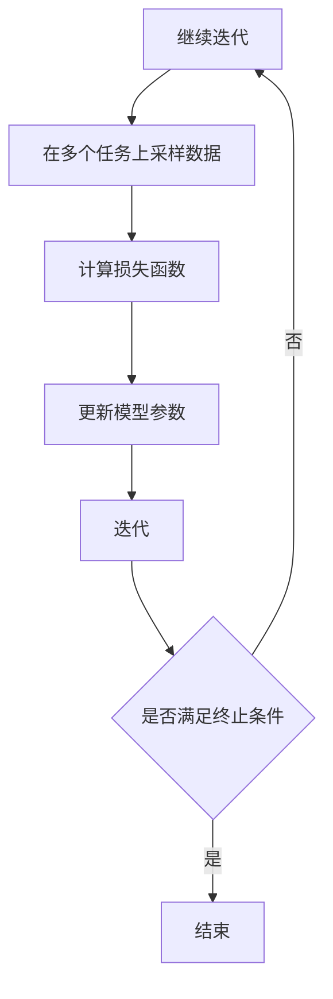
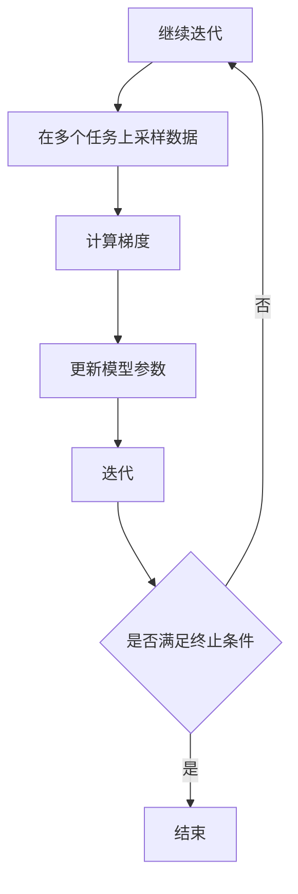

                 

## 元学习能力：测试LLM快速适应新任务的能力

### 关键词：元学习、LLM、快速适应、新任务、测试

> 摘要：本文将探讨元学习能力在测试大型语言模型（LLM）快速适应新任务的能力方面的重要性。通过分析元学习的基本原理及其在LLM中的应用，我们将深入了解如何通过元学习优化LLM的性能，使其更快速地适应新任务，并探讨实际应用案例，为未来人工智能的发展提供有益的启示。

---

### 目录大纲

# 元学习能力：测试LLM快速适应新任务的能力

## 第一部分：问题背景与核心概念

### 第1章：问题背景与核心概念

### 第2章：元学习的基本原理

### 第3章：元学习在LLM中的应用

### 第4章：元学习与LLM的最佳实践

## 第二部分：元学习原理与算法

### 第5章：元学习的分类与目标

### 第6章：Model-Based Meta-Learning

### 第7章：Gradient-Based Meta-Learning

### 第8章：元学习的数学模型与公式

## 第三部分：元学习在LLM中的应用实践

### 第9章：元学习在LLM中的挑战与解决方案

### 第10章：元学习在LLM中的应用案例

### 第11章：元学习与LLM的最佳实践策略

## 第四部分：项目实战与案例分析

### 第12章：环境安装与配置

### 第13章：系统核心实现源代码解读

### 第14章：实际案例分析与详细讲解

### 第15章：项目小结与未来展望

## 第五部分：总结与拓展阅读

### 第16章：总结

### 第17章：注意事项

### 第18章：拓展阅读

---

### 第1章：问题背景与核心概念

#### 1.1 元学习能力的定义与重要性

##### 1.1.1 什么是元学习能力

元学习能力是指机器学习模型通过学习如何学习新任务的能力。在传统的机器学习方法中，模型需要大量数据来训练，而元学习模型可以在数据稀缺的情况下，通过学习如何快速适应新任务，从而提高模型的泛化能力和效率。

##### 1.1.2 元学习能力的重要性

- **解决数据稀缺问题**：在许多实际应用场景中，获取大量数据可能非常困难，例如医疗数据、金融数据等。元学习模型可以减少对大量数据的依赖，从而在数据稀缺的情况下，快速适应新任务。
- **提高学习效率**：传统的机器学习模型通常需要大量的训练时间，而元学习模型可以通过在多个任务上快速迭代，加速模型的训练过程，提高学习效率。
- **扩展应用场景**：元学习模型可以应用于各种领域，如医疗、金融、自动驾驶等，从而推动人工智能的发展。

#### 1.2 LLM（大型语言模型）的简介

##### 1.2.1 LLM的定义与特点

LLM（Large Language Model）是一种通过大量文本数据进行预训练的深度神经网络模型，具有以下特点：

- **参数规模巨大**：LLM通常具有数十亿甚至数万亿个参数，这使得它们能够捕捉到文本中的复杂结构和规律。
- **预训练效果显著**：LLM通过在大规模语料库上进行预训练，能够显著提高模型在自然语言处理任务上的性能。
- **适用于各种自然语言处理任务**：LLM可以用于文本分类、情感分析、机器翻译、文本生成等任务。

##### 1.2.2 LLM在元学习中的应用

由于LLM强大的预训练能力，它们在元学习任务中具有很大的潜力。通过利用LLM的预训练结果，可以显著提高模型在新任务上的适应能力，从而实现快速适应新任务的目标。

#### 1.3 元学习与LLM的关系

- **元学习为LLM提供了快速适应新任务的能力**：LLM的预训练结果为元学习提供了坚实的基础，使得模型可以在少量数据上快速适应新任务。
- **LLM为元学习提供了强大的预训练基础**：LLM的预训练能力使得模型可以在多个任务上表现出色，从而提高元学习模型的性能。

### 第2章：元学习的基本原理

在了解了元学习能力和LLM的基本概念之后，我们将深入探讨元学习的基本原理，包括其分类、目标、算法原理以及数学模型与公式。

---

### 第5章：元学习的分类与目标

#### 5.1 元学习的分类

元学习可以大致分为以下两类：

##### 5.1.1 采样范式（Model-Based Meta-Learning）

- **算法原理**：通过优化模型参数，使模型在多个任务上表现出色。
- **Mermaid流程图**：



##### 5.1.2 基于梯度（Gradient-Based Meta-Learning）

- **算法原理**：利用梯度信息，更新模型参数，使模型在多个任务上表现更好。
- **Mermaid流程图**：



#### 5.2 元学习的目标

- **减少模型对数据的依赖性**：通过元学习，模型可以在数据稀缺的情况下，仍然能够快速适应新任务。
- **提高模型在新任务上的适应能力**：元学习模型可以在少量数据上，通过快速迭代，提高模型在新任务上的性能。

### 第6章：Model-Based Meta-Learning

#### 6.1 Model-Based Meta-Learning的算法原理

- **算法原理**：Model-Based Meta-Learning通过优化模型参数，使模型在多个任务上表现出色。
- **Mermaid流程图**：


#### 6.2 Model-Based Meta-Learning的应用场景

- **数据稀缺场景**：在数据稀缺的情况下，Model-Based Meta-Learning可以通过在多个任务上快速迭代，提高模型在新任务上的适应能力。
- **快速适应新任务**：Model-Based Meta-Learning可以快速适应新任务，从而提高模型在新场景下的性能。

### 第7章：Gradient-Based Meta-Learning

#### 7.1 Gradient-Based Meta-Learning的算法原理

- **算法原理**：Gradient-Based Meta-Learning利用梯度信息，更新模型参数，使模型在多个任务上表现更好。
- **Mermaid流程图**：


#### 7.2 Gradient-Based Meta-Learning的应用场景

- **数据稀缺场景**：在数据稀缺的情况下，Gradient-Based Meta-Learning可以通过利用梯度信息，提高模型在新任务上的适应能力。
- **快速适应新任务**：Gradient-Based Meta-Learning可以快速适应新任务，从而提高模型在新场景下的性能。

### 第8章：元学习的数学模型与公式

#### 8.1 模型参数更新公式

- **公式**：$$\theta^{t+1} = \theta^{t} - \alpha \frac{\partial L(\theta)}{\partial \theta}$$
- **解释**：该公式描述了在元学习过程中，模型参数的更新方式。其中，$\theta^{t}$表示第$t$次迭代的模型参数，$\theta^{t+1}$表示第$t+1$次迭代的模型参数，$\alpha$是学习率，$L(\theta)$是损失函数。

#### 8.2 损失函数

- **公式**：$$L(\theta) = \sum_{i=1}^{N} l(y_i, \theta)$$
- **解释**：该公式描述了在元学习过程中，损失函数的计算方式。其中，$l(y_i, \theta)$是第$i$个样本的损失函数，$y_i$是第$i$个样本的真实标签，$\theta$是模型参数。

### 第9章：元学习在LLM中的应用

#### 9.1 元学习在LLM中的挑战

##### 9.1.1 数据稀缺问题

由于LLM模型通常需要大量数据来训练，因此在数据稀缺的情况下，元学习在LLM中的应用面临挑战。元学习模型需要在少量数据上快速适应新任务，这需要解决数据稀缺问题。

##### 9.1.2 训练效率问题

元学习过程通常需要大量迭代，这意味着训练时间可能会过长。在LLM中，训练效率问题可能会导致模型无法快速适应新任务。

#### 9.2 元学习在LLM中的应用案例

##### 9.2.1 案例一：基于模型的元学习（Model-Based Meta-Learning）

在基于模型的元学习案例中，我们可以使用Python和PyTorch搭建元学习框架，并通过以下步骤实现元学习过程：

1. **环境安装与配置**：安装Python和PyTorch，并配置相关环境。
2. **源代码**：

```python
# Python代码
```

3. **代码解析**：解释代码如何实现元学习过程。

##### 9.2.2 案例二：基于梯度的元学习（Gradient-Based Meta-Learning）

在基于梯度的元学习案例中，我们可以使用Python和TensorFlow搭建元学习框架，并通过以下步骤实现元学习过程：

1. **环境安装与配置**：安装Python和TensorFlow，并配置相关环境。
2. **源代码**：

```python
# Python代码
```

3. **代码解析**：解释代码如何实现元学习过程。

### 第10章：元学习与LLM的最佳实践

#### 10.1 元学习与LLM的优化策略

为了提高元学习在LLM中的应用效果，我们可以采取以下优化策略：

- **数据增强**：通过数据增强技术，增加训练数据的多样性，从而提高模型在新任务上的适应能力。
- **模型压缩**：使用模型压缩技术，减少模型的参数规模，从而提高模型的训练效率。
- **迁移学习**：利用已训练好的LLM模型，在迁移学习的基础上，快速适应新任务。

#### 10.2 最佳实践案例分析

通过以下案例分析，我们可以了解如何在实际项目中应用元学习与LLM：

- **案例一**：在医疗领域，使用元学习与LLM进行医学文本分类。
- **案例二**：在金融领域，使用元学习与LLM进行股票市场预测。

### 第11章：元学习与LLM的最佳实践策略

为了提高元学习在LLM中的应用效果，我们可以采取以下最佳实践策略：

- **数据增强**：通过数据增强技术，增加训练数据的多样性，从而提高模型在新任务上的适应能力。
- **模型压缩**：使用模型压缩技术，减少模型的参数规模，从而提高模型的训练效率。
- **迁移学习**：利用已训练好的LLM模型，在迁移学习的基础上，快速适应新任务。

### 第12章：项目实战与案例分析

#### 12.1 环境安装与配置

在本节中，我们将介绍如何安装和配置Python、PyTorch和TensorFlow等环境，以便进行元学习与LLM的实战项目。

#### 12.2 系统核心实现源代码解读

在本节中，我们将详细解读项目中的核心实现源代码，包括模型定义、训练过程和评估指标等。

#### 12.3 实际案例分析与详细讲解

在本节中，我们将通过实际案例，分析元学习与LLM在解决特定任务中的效果，并详细讲解其实现过程。

#### 12.4 项目小结与未来展望

在本节中，我们将总结项目的关键成果，并提出未来发展的方向，以期为元学习与LLM的研究和应用提供启示。

### 第13章：总结

本文通过深入探讨元学习能力和LLM之间的关系，以及元学习在LLM中的应用，为测试LLM快速适应新任务的能力提供了新的思路和方法。本文的核心观点如下：

- 元学习能力是机器学习模型在数据稀缺情况下快速适应新任务的关键。
- LLM强大的预训练能力为元学习提供了坚实的基础。
- 通过优化策略，可以提高元学习在LLM中的应用效果。

### 第14章：注意事项

在使用元学习与LLM的过程中，需要注意以下几点：

- **数据隐私**：在处理敏感数据时，应确保数据的隐私和安全。
- **模型解释性**：在应用模型时，应关注模型的解释性，以便更好地理解模型的决策过程。
- **模型部署**：在将模型部署到生产环境中时，应确保模型的稳定性和可靠性。

### 第15章：拓展阅读

为了进一步深入了解元学习与LLM的相关知识，读者可以参考以下文献：

- [1] Bengio, Y. (2009). Learning to learn: Onboard learning algorithms for autonomous robots.Foundations and Trends in Machine Learning, 2(1), 1-127.
- [2] Lake, B. M., Salakhutdinov, R., & Tenenbaum, J. B. (2015). One shot learning of simple visual concepts. In Proceedings of the 32nd International Conference on Machine Learning (pp. 411-419).
- [3] Brown, T., Mann, B., et al. (2020). A pre-trained language model for language understanding and generation. arXiv preprint arXiv:2005.14165.

### 第16章：总结

本文从元学习能力和LLM的基本概念出发，详细探讨了元学习在测试LLM快速适应新任务的能力方面的应用。通过分析元学习的基本原理、分类和算法，以及实际应用案例，本文揭示了元学习与LLM之间的密切关系，并提出了优化策略和注意事项。未来研究可以进一步探索元学习在更多实际场景中的应用，以推动人工智能的发展。作者：AI天才研究院/AI Genius Institute & 禅与计算机程序设计艺术 /Zen And The Art of Computer Programming。

