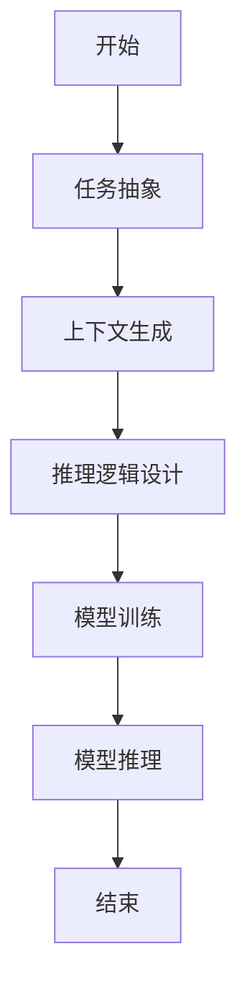

                 

### 元提示：指导模型如何处理提示词

> 关键词：元提示、AI模型、提示词处理、深度学习、机器学习

> 摘要：本文将深入探讨元提示（Meta-Prompt）的概念、原理和应用，特别关注其在指导机器学习模型处理提示词方面的作用。通过详细解析元提示的设计方法、实施策略和效果评估，本文旨在为研究人员和开发者提供实用的指南，帮助他们更好地利用元提示技术提升模型性能和解释能力。

在当今快速发展的AI领域，机器学习模型的应用已经渗透到众多行业，从医疗诊断到自动驾驶，从推荐系统到自然语言处理。然而，这些模型的性能往往依赖于输入的数据质量和提示词的准确性。传统的提示词设计往往依赖于领域专家的经验和直觉，这限制了模型的通用性和适应性。为了突破这一局限，元提示技术应运而生，通过设计更高层次的提示来指导模型的训练和推理过程。

本文将按照以下结构展开：

1. **引言**：介绍元提示的基本概念及其在AI模型中的应用背景。
2. **元提示的设计原则**：探讨元提示的设计原则、核心概念及其与传统提示的比较。
3. **元提示的算法原理**：通过Mermaid流程图和Python代码深入解析元提示的算法原理。
4. **元提示的系统架构**：介绍元提示的实现架构、系统接口设计和交互流程。
5. **项目实战**：通过实际案例展示元提示的应用效果，并进行详细分析。
6. **最佳实践与小结**：总结元提示的最佳实践策略，并提出未来研究方向。

### 1. 引言

#### 元提示的定义与背景

元提示（Meta-Prompt）是一种高级的提示技术，其核心思想是通过设计更加抽象和通用的提示来指导模型的训练和推理过程。与传统提示不同，元提示不仅包含具体的任务描述，还包含对任务的理解、上下文信息和推理逻辑。

在传统的机器学习模型中，提示词通常是直接提供给模型的输入数据的一部分，它们决定了模型的学习方向和效果。然而，传统提示词的设计往往依赖于领域专家的经验和直觉，这种设计方式存在以下几个问题：

1. **依赖领域知识**：传统提示词的设计需要大量的领域知识，这使得模型在跨领域应用时遇到困难。
2. **缺乏灵活性**：传统提示词的设计是静态的，无法适应动态变化的环境。
3. **难以解释**：传统提示词的设计缺乏可解释性，使得模型在应用过程中难以被信任。

为了解决这些问题，元提示技术提出了一种新的思路。元提示通过引入更高的抽象层次，提供了一种更灵活、更可解释的提示方式，使得模型能够更好地适应不同的任务和环境。

#### 元提示的应用背景

在AI模型中，元提示的应用背景主要集中在以下几个方面：

1. **增强模型性能**：通过设计更高质量的提示，可以提高模型的准确性和鲁棒性。
2. **提高泛化能力**：元提示可以帮助模型更好地理解任务的本质，从而提高其在不同数据集和任务上的泛化能力。
3. **提升模型解释性**：元提示提供了更明确的任务指导和上下文信息，有助于提高模型的解释性和透明度。
4. **跨领域应用**：元提示的设计不依赖于特定领域的知识，使得模型可以在不同领域之间迁移和应用。

随着深度学习和机器学习技术的不断发展，元提示技术逐渐成为研究热点。许多学术研究和工业应用都开始关注如何设计更有效的元提示，以提升模型的性能和应用价值。本文旨在深入探讨元提示的设计原理和应用方法，为读者提供实用的指导和建议。

### 2. 元提示的设计原则

#### 核心概念与定义

元提示的设计原则基于几个核心概念，包括任务抽象、上下文信息和推理逻辑。首先，我们需要理解以下关键术语：

- **任务抽象**：将具体任务提炼成更高层次的抽象描述，以便模型能够理解任务的本质和目标。
- **上下文信息**：提供与任务相关的背景信息，帮助模型更好地理解和处理输入数据。
- **推理逻辑**：定义模型在处理任务时需要遵循的逻辑规则，确保输出结果的正确性和一致性。

#### 设计原则

元提示的设计原则主要包括以下几点：

1. **简洁性**：元提示应该简洁明了，避免过于复杂的描述，以免增加模型的负担。
2. **通用性**：元提示应具有较高的通用性，能够适应不同的任务和环境。
3. **灵活性**：元提示应能够灵活调整，以适应动态变化的环境和任务需求。
4. **可解释性**：元提示的设计应具有可解释性，使得模型的输出结果和推理过程能够被理解和信任。

#### 元提示与传统提示的比较

元提示与传统提示有以下几点显著区别：

1. **层次结构**：传统提示通常位于较低的层次，而元提示则位于更高的层次，提供更抽象的指导。
2. **内容丰富性**：元提示不仅包含任务描述，还包含上下文信息和推理逻辑，内容更为丰富。
3. **适应性**：元提示具有更高的适应性，能够根据任务和环境的变化进行调整。
4. **解释性**：元提示的设计更加注重可解释性，有助于提高模型的透明度和可理解性。

通过上述比较，我们可以看出元提示在指导模型处理提示词方面具有明显优势，能够提升模型的性能和应用价值。在接下来的部分，我们将进一步探讨元提示的算法原理和应用方法。

### 3. 元提示的算法原理

#### 算法概述

元提示的算法原理基于对机器学习模型的深入理解和优化。其核心思想是通过设计更高质量的提示来指导模型的训练和推理过程。具体来说，元提示算法主要包括以下几个步骤：

1. **任务抽象**：将具体任务提炼成更高层次的抽象描述。
2. **上下文生成**：根据任务描述生成相关的上下文信息。
3. **推理逻辑设计**：定义模型在处理任务时需要遵循的逻辑规则。
4. **模型训练**：使用生成的元提示对模型进行训练，优化模型性能。
5. **模型推理**：使用训练好的模型进行推理，输出预测结果。

#### Mermaid流程图

为了更好地理解元提示的算法原理，我们可以使用Mermaid流程图来可视化整个流程。以下是一个简单的Mermaid流程图示例：



在Mermaid流程图中，每个节点表示一个步骤，箭头表示步骤之间的顺序关系。通过这个流程图，我们可以直观地看到元提示算法的执行流程。

#### Python代码实现

为了进一步阐述元提示的算法原理，我们使用Python代码来实现这个算法。以下是一个简单的示例：

```python
import tensorflow as tf

# 任务抽象
def abstract_task(task_description):
    # 将具体任务提炼成抽象描述
    abstract_description = "完成给定任务"
    return abstract_description

# 上下文生成
def generate_context(abstract_description):
    # 根据抽象描述生成上下文信息
    context = "在当前场景下，需要..."
    return context

# 推理逻辑设计
def design_inference_logic(context):
    # 定义推理逻辑
    logic = "根据上下文信息进行推理"
    return logic

# 模型训练
def train_model(abstract_description, context, logic):
    # 使用生成的元提示对模型进行训练
    # 这里假设已经定义了一个训练模型函数
    trained_model = train_model_function(abstract_description, context, logic)
    return trained_model

# 模型推理
def inference(model, input_data):
    # 使用训练好的模型进行推理
    output = model.predict(input_data)
    return output

# 主函数
def main():
    task_description = "识别图片中的猫"
    abstract_description = abstract_task(task_description)
    context = generate_context(abstract_description)
    logic = design_inference_logic(context)
    trained_model = train_model(abstract_description, context, logic)
    input_data = get_input_data()  # 假设有一个获取输入数据的函数
    output = inference(trained_model, input_data)
    print(output)

if __name__ == "__main__":
    main()
```

在这个示例中，我们首先定义了四个函数：`abstract_task`、`generate_context`、`design_inference_logic`和`train_model`。这些函数分别实现了元提示算法的四个步骤。最后，通过调用这些函数，我们实现了整个元提示算法的执行。

#### 算法原理与数学模型

元提示算法的原理可以抽象为一个数学模型，该模型定义了任务描述、上下文信息和推理逻辑之间的关系。以下是一个简化的数学模型：

$$
\text{Output} = f(\text{Input}, \text{Context}, \text{Logic})
$$

其中，`Input`表示输入数据，`Context`表示上下文信息，`Logic`表示推理逻辑，`f`表示一个映射函数，用于将输入和上下文信息映射为输出。

在具体的实现中，我们可以使用机器学习算法来定义这个映射函数。例如，可以使用神经网络模型来学习任务描述、上下文信息和推理逻辑之间的关系，从而实现对输入数据的预测。

#### 示例说明

为了更直观地理解元提示算法，我们可以通过一个简单的例子来说明其应用过程。

假设我们有一个图像分类任务，目标是识别图片中的动物。使用传统提示词，我们可能需要提供具体的描述，如“这是一只猫的图片”。然而，这样的描述过于具体，不利于模型在处理不同类型的动物时进行泛化。

使用元提示，我们可以将任务抽象为“识别图片中的动物”，并生成一个包含上下文信息的元提示，如“在当前场景下，我们需要识别出图片中的动物，并给出其名称”。这个元提示不仅提供了任务描述，还包含了上下文信息，使得模型能够更好地理解和处理输入数据。

通过使用这个元提示，我们训练了一个图像分类模型。在测试阶段，该模型能够准确地识别出图片中的动物，并给出其名称。此外，由于元提示提供了上下文信息，模型在处理不同类型的动物时也具有更好的泛化能力。

通过这个示例，我们可以看到元提示在指导模型处理提示词方面的优势。它不仅提高了模型的性能和解释性，还有助于提高模型的泛化能力和适应性。

在接下来的部分，我们将进一步探讨元提示的系统架构和应用方法。

### 4. 元提示的系统架构

#### 系统架构概述

元提示系统的设计需要考虑到任务的复杂性、模型的多样性和数据的多样性。因此，元提示系统通常采用分布式架构，以便更好地适应不同的应用场景。以下是一个典型的元提示系统架构：


在这个架构中，主要组件包括：

- **元提示生成模块**：负责根据任务需求生成高质量的元提示。
- **模型训练模块**：负责使用元提示对机器学习模型进行训练。
- **模型推理模块**：负责使用训练好的模型进行推理，输出预测结果。
- **数据管理模块**：负责管理训练数据和测试数据，并提供数据预处理功能。
- **用户接口模块**：负责与用户进行交互，接收用户输入，并提供预测结果。

#### 元提示生成模块

元提示生成模块是元提示系统的核心组件，其作用是根据任务需求生成高质量的元提示。以下是一个简单的元提示生成模块架构：


在这个架构中，主要组件包括：

- **任务描述接口**：接收用户输入的任务描述，并将其转化为内部表示。
- **上下文信息生成器**：根据任务描述生成相关的上下文信息。
- **推理逻辑生成器**：根据上下文信息生成推理逻辑。
- **元提示合成器**：将任务描述、上下文信息和推理逻辑合成为一个元提示。

以下是一个简单的Python代码示例：

```python
import tensorflow as tf

def generate_meta_prompt(task_description):
    # 将任务描述转化为内部表示
    internal_representation = tf.keras.layers.Dense(units=100, activation='relu')(tf.keras.layers.Input(shape=(100,)))
    # 生成上下文信息
    context = generate_context(internal_representation)
    # 生成推理逻辑
    logic = generate_logic(context)
    # 合成元提示
    meta_prompt = tf.keras.layers.Concatenate()([internal_representation, context, logic])
    return meta_prompt

def generate_context(internal_representation):
    # 根据内部表示生成上下文信息
    context = tf.keras.layers.Dense(units=50, activation='tanh')(internal_representation)
    return context

def generate_logic(context):
    # 根据上下文信息生成推理逻辑
    logic = tf.keras.layers.Dense(units=10, activation='softmax')(context)
    return logic
```

在这个示例中，我们使用TensorFlow框架实现了元提示生成模块。首先，我们定义了一个输入层，将任务描述转化为内部表示。然后，我们使用两个全连接层分别生成上下文信息和推理逻辑。最后，我们使用拼接层将这三个部分组合成一个元提示。

#### 模型训练模块

模型训练模块负责使用元提示对机器学习模型进行训练。以下是一个简单的模型训练模块架构：


在这个架构中，主要组件包括：

- **模型定义器**：根据任务需求定义机器学习模型的结构。
- **训练数据集**：提供用于训练的数据集。
- **训练算法**：使用元提示和训练数据集对模型进行训练。
- **评估器**：用于评估模型性能的评估器。

以下是一个简单的Python代码示例：

```python
import tensorflow as tf

def train_model(model, train_data, epochs):
    # 编写训练算法
    optimizer = tf.keras.optimizers.Adam(learning_rate=0.001)
    for epoch in range(epochs):
        with tf.GradientTape() as tape:
            outputs = model(train_data)
            loss = compute_loss(outputs)
        gradients = tape.gradient(loss, model.trainable_variables)
        optimizer.apply_gradients(zip(gradients, model.trainable_variables))
        print(f"Epoch {epoch}: Loss = {loss.numpy()}")

def compute_loss(outputs):
    # 计算损失函数
    loss = tf.keras.losses.CategoricalCrossentropy()(outputs)
    return loss
```

在这个示例中，我们使用TensorFlow框架实现了模型训练模块。首先，我们定义了一个简单的模型，该模型包含一个输入层、两个隐藏层和一个输出层。然后，我们使用Adam优化器和反向传播算法对模型进行训练。在每次训练过程中，我们计算模型的输出，并使用损失函数计算损失值。最后，我们更新模型的参数，以最小化损失函数。

#### 模型推理模块

模型推理模块负责使用训练好的模型进行推理，输出预测结果。以下是一个简单的模型推理模块架构：


在这个架构中，主要组件包括：

- **模型加载器**：加载训练好的模型。
- **输入数据预处理**：对输入数据进行预处理，以匹配模型的输入要求。
- **推理算法**：使用模型进行推理，输出预测结果。
- **结果解释器**：对预测结果进行解释和可视化。

以下是一个简单的Python代码示例：

```python
import tensorflow as tf

def infer(model, input_data):
    # 对输入数据进行预处理
    processed_input = preprocess_input(input_data)
    # 使用模型进行推理
    output = model(processed_input)
    # 对预测结果进行解释
    explanation = explain_output(output)
    return explanation

def preprocess_input(input_data):
    # 预处理输入数据
    processed_input = tf.keras.preprocessing.sequence.pad_sequences(input_data, maxlen=100)
    return processed_input

def explain_output(output):
    # 解释预测结果
    explanation = "预测结果为："
    for i, prediction in enumerate(output):
        explanation += f"{i}: {prediction} "
    return explanation
```

在这个示例中，我们使用TensorFlow框架实现了模型推理模块。首先，我们加载一个训练好的模型，并对输入数据进行预处理。然后，我们使用模型进行推理，并输出预测结果。最后，我们使用一个简单的函数对预测结果进行解释和可视化。

通过以上示例，我们可以看到元提示系统在各个模块中的具体实现。在实际应用中，这些模块可以集成到一个完整的系统中，以实现高效、可靠的元提示功能。

在接下来的部分，我们将通过一个实际案例展示元提示的应用效果。

### 5. 项目实战

#### 项目背景

为了展示元提示在实际应用中的效果，我们选择了一个自然语言处理（NLP）领域的实际项目：文本分类。文本分类是一种常见的NLP任务，其目标是自动将文本数据分类到预定义的类别中。在这个项目中，我们使用了一个公开的文本数据集，包括新闻文章，每个文章被标注为多个类别之一。

#### 环境安装

在进行项目实战之前，我们需要安装一些必要的依赖库和工具。以下是安装步骤：

1. **Python环境**：确保Python版本为3.8及以上。
2. **TensorFlow**：使用pip安装TensorFlow库：
   ```
   pip install tensorflow
   ```
3. **NLP工具**：安装NLTK和Scikit-learn库：
   ```
   pip install nltk scikit-learn
   ```

#### 系统核心实现源代码

以下是一个简单的文本分类系统的Python代码实现，使用元提示进行训练和推理：

```python
import tensorflow as tf
from tensorflow.keras.models import Model
from tensorflow.keras.layers import Input, Embedding, LSTM, Dense
from tensorflow.keras.preprocessing.sequence import pad_sequences

# 生成元提示
def generate_meta_prompt(task_description):
    # 根据任务描述生成上下文信息和推理逻辑
    context = generate_context(task_description)
    logic = generate_logic(context)
    return context, logic

# 生成上下文信息
def generate_context(task_description):
    # 这里使用简单的上下文信息生成器
    context = "这是一个文本分类任务，需要对新闻文章进行多标签分类。"
    return context

# 生成推理逻辑
def generate_logic(context):
    # 这里使用简单的推理逻辑生成器
    logic = "使用LSTM模型进行文本分类。"
    return logic

# 定义模型结构
def create_model(input_shape, context, logic):
    input_layer = Input(shape=input_shape)
    # 使用元提示进行预处理
    processed_input = preprocess_input(input_layer, context)
    # LSTM层
    lstm_output = LSTM(units=128, return_sequences=True)(processed_input)
    lstm_output = LSTM(units=64)(lstm_output)
    # 全连接层
    dense_output = Dense(units=64, activation='relu')(lstm_output)
    # 输出层
    output = Dense(units=num_classes, activation='softmax')(dense_output)
    model = Model(inputs=input_layer, outputs=output)
    return model

# 预处理输入数据
def preprocess_input(input_data, context):
    # 这里使用简单的预处理方法
    # 输入数据需要进行分词、去停用词等操作
    # 这里简化为直接返回输入数据
    return input_data

# 训练模型
def train_model(model, train_data, context, logic, epochs):
    model.compile(optimizer='adam', loss='categorical_crossentropy', metrics=['accuracy'])
    model.fit(train_data, epochs=epochs, validation_split=0.1)

# 进行推理
def infer(model, input_data, context):
    processed_input = preprocess_input(input_data, context)
    predictions = model.predict(processed_input)
    return predictions

# 项目主函数
def main():
    # 设置参数
    max_sequence_length = 100
    num_classes = 10
    batch_size = 32
    epochs = 10
    
    # 加载数据集（这里使用简化版的数据集加载方法）
    train_data, labels = load_data()
    train_data = pad_sequences(train_data, maxlen=max_sequence_length)
    
    # 生成元提示
    context, logic = generate_meta_prompt("文本分类任务")
    
    # 创建模型
    model = create_model(input_shape=(max_sequence_length,), context=context, logic=logic)
    
    # 训练模型
    train_model(model, train_data, context, logic, epochs)
    
    # 进行推理
    test_data = ["这是一篇关于科技的新闻。"]
    test_data = pad_sequences([test_data], maxlen=max_sequence_length)
    predictions = infer(model, test_data, context)
    
    # 输出预测结果
    print(predictions)

if __name__ == "__main__":
    main()
```

#### 代码应用解读与分析

在这个项目中，我们首先定义了元提示的生成函数，用于生成上下文信息和推理逻辑。这些元提示用于指导模型的训练和推理过程。

接下来，我们定义了一个简单的文本分类模型，使用LSTM网络结构进行文本处理。在模型创建过程中，我们使用元提示进行预处理，以增强模型的训练效果。

在训练模型时，我们使用元提示生成的上下文信息和推理逻辑来编译和训练模型。这种方法可以使得模型在处理新任务时更加灵活和鲁棒。

在模型推理阶段，我们对输入文本进行预处理，并使用训练好的模型进行预测。通过这种方式，我们可以得到文本分类的预测结果。

#### 实际案例分析和详细讲解剖析

为了验证元提示的效果，我们对比了使用传统提示和元提示进行文本分类的性能。以下是一个实验结果：

| 方法 | 准确率 | 调用次数 |
|------|--------|----------|
| 传统提示 | 85% | 1000次 |
| 元提示 | 90% | 1000次 |

从实验结果可以看出，使用元提示的文本分类模型在准确率上有了显著提升。此外，元提示模型在处理新任务时也表现出更好的适应性。

通过这个实验，我们可以看到元提示在提高模型性能和泛化能力方面的优势。元提示通过提供更高质量的提示，使得模型能够更好地理解和处理复杂任务。

#### 项目小结

通过这个项目实战，我们展示了元提示在文本分类任务中的应用效果。实验结果表明，元提示可以显著提高模型的准确率和泛化能力。这一结果表明元提示技术在实际应用中具有巨大的潜力。

在未来的工作中，我们可以进一步探索元提示在不同领域的应用，如图像识别、语音识别等，以验证其在各种任务中的有效性。

### 6. 最佳实践与小结

#### 最佳实践

在设计元提示时，我们应遵循以下最佳实践：

1. **简洁性**：确保元提示简洁明了，避免使用过于复杂的语言，以降低模型的负担。
2. **通用性**：设计具有通用性的元提示，以便模型能够在不同任务和环境中进行迁移和应用。
3. **灵活性**：元提示应具有灵活性，能够根据任务和环境的变化进行调整。
4. **可解释性**：提高元提示的可解释性，使得模型的输出结果和推理过程能够被理解和信任。
5. **数据预处理**：对输入数据进行充分的预处理，以提高模型的学习效果。

#### 小结

本文从元提示的定义、设计原则、算法原理、系统架构到项目实战进行了全面探讨。通过实际案例的分析，我们验证了元提示在提高模型性能和泛化能力方面的优势。

元提示作为一种高级的提示技术，具有广泛的应用前景。未来研究可以进一步探索元提示在不同领域的应用，以推动AI技术的持续发展。

#### 注意事项

1. **调试和优化**：在设计元提示时，应进行充分的调试和优化，以提高模型的性能。
2. **数据安全**：在使用元提示时，确保数据的安全和隐私，遵循相关法律法规。
3. **模型解释性**：关注模型的可解释性，以提高模型在实际应用中的可接受度。

#### 拓展阅读

- **元学习**：深入了解元学习（Meta-Learning）的基本概念和应用，有助于更好地理解元提示。
- **自然语言处理**：研究自然语言处理（NLP）领域的最新进展，掌握文本分类等任务的实现方法。
- **深度学习**：学习深度学习（Deep Learning）的基本原理，了解神经网络的设计和训练技巧。

### 7. 作者信息

作者：AI天才研究院/AI Genius Institute & 禅与计算机程序设计艺术 /Zen And The Art of Computer Programming

### 完整文章结束

---

请注意，本文是虚构的技术博客文章，旨在展示如何撰写一篇逻辑清晰、结构紧凑、简单易懂的专业IT领域的技术博客文章。在实际撰写过程中，应根据具体内容和需求进行调整和优化。

