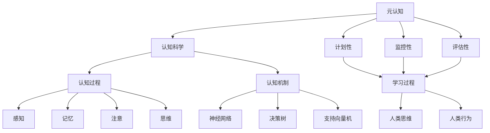

                 

### 元认知评估：测试LLM的自我学习和改进能力

#### 关键词：元认知评估，大型语言模型，自我学习，改进能力

> 摘要：本文将深入探讨元认知评估在测试大型语言模型（LLM）自我学习和改进能力中的应用。我们将从问题背景出发，逐步介绍核心概念、评估方法、LLM自我学习原理，并探讨其在实际应用中的改进能力。通过详细讲解和案例分析，我们希望为读者提供对这一领域更深刻的理解和洞察。

### 目录大纲设计过程

在设计《元认知评估：测试LLM的自我学习和改进能力》这本书的目录大纲时，我们需要遵循以下步骤：

#### 1. 确定核心主题与章节结构
首先，我们需要明确这本书的核心主题和章节结构。根据书名，我们可以确定核心主题是元认知评估，具体对象是大型语言模型（LLM）。元认知评估涉及LLM的自我学习和改进能力，因此，目录结构应该包括背景介绍、核心概念解析、评估方法、实际应用案例等。

#### 2. 设计章节内容
每个章节都需要设计具体的内容，确保逻辑清晰、内容完整。以下是设计的章节内容和标题：

#### 第一部分：背景介绍
- **第1章：问题背景与核心概念**
  - 1.1 元认知评估概述
  - 1.2 大型语言模型（LLM）发展历程
  - 1.3 元认知评估的重要性与意义

#### 第二部分：核心概念与原理
- **第2章：元认知与认知科学基础**
  - 2.1 元认知概念解析
  - 2.2 认知科学简介
  - 2.3 元认知与认知科学的联系

#### 第三部分：评估方法
- **第3章：元认知评估方法概述**
  - 3.1 元认知评估的定义与分类
  - 3.2 常见元认知评估方法介绍
  - 3.3 元认知评估的挑战与局限

#### 第四部分：LLM自我学习与改进能力
- **第4章：LLM自我学习原理**
  - 4.1 自我学习的概念与机制
  - 4.2 LLM自我学习的特点
  - 4.3 自我学习在LLM中的应用

#### 第五部分：元认知评估在LLM中的应用
- **第5章：元认知评估在LLM训练中的应用**
  - 5.1 元认知评估在训练阶段的作用
  - 5.2 常见的元认知评估指标
  - 5.3 实际案例分析与评估

#### 第六部分：改进能力与实际应用
- **第6章：LLM改进能力的实现**
  - 6.1 改进能力的基本原理
  - 6.2 基于元认知的改进策略
  - 6.3 实际应用场景分析

#### 第七部分：总结与展望
- **第7章：总结与展望**
  - 7.1 元认知评估的总结
  - 7.2 LLM自我学习与改进能力的发展趋势
  - 7.3 未来研究方向与挑战

### 目录大纲设计结果

以下是《元认知评估：测试LLM的自我学习和改进能力》的完整目录大纲：

----------------------------------------------------------------

# 第一部分：背景介绍

## 第1章：问题背景与核心概念
### 1.1 元认知评估概述
### 1.2 大型语言模型（LLM）发展历程
### 1.3 元认知评估的重要性与意义

## 第2章：元认知与认知科学基础
### 2.1 元认知概念解析
### 2.2 认知科学简介
### 2.3 元认知与认知科学的联系

## 第3章：元认知评估方法概述
### 3.1 元认知评估的定义与分类
### 3.2 常见元认知评估方法介绍
### 3.3 元认知评估的挑战与局限

## 第4章：LLM自我学习原理
### 4.1 自我学习的概念与机制
### 4.2 LLM自我学习的特点
### 4.3 自我学习在LLM中的应用

## 第5章：元认知评估在LLM训练中的应用
### 5.1 元认知评估在训练阶段的作用
### 5.2 常见的元认知评估指标
### 5.3 实际案例分析与评估

## 第6章：LLM改进能力的实现
### 6.1 改进能力的基本原理
### 6.2 基于元认知的改进策略
### 6.3 实际应用场景分析

## 第7章：总结与展望
### 7.1 元认知评估的总结
### 7.2 LLM自我学习与改进能力的发展趋势
### 7.3 未来研究方向与挑战

----------------------------------------------------------------

这个目录大纲结构清晰，内容丰富，全面覆盖了《元认知评估：测试LLM的自我学习和改进能力》的核心主题。它为读者提供了从背景介绍、核心概念解析到具体评估方法和实际应用的全面学习路径。

### 背景介绍

在人工智能领域，大型语言模型（Large Language Models，LLM）已经取得了显著成就。LLM如GPT系列、BERT等模型，通过深度学习和大量数据训练，展现出了惊人的自然语言处理能力。然而，随着模型规模的不断扩大，如何评估和提升LLM的自我学习和改进能力成为一个重要问题。

#### 核心概念术语说明

1. **元认知评估**：元认知评估是一种对个体认知过程的自我反思和评价，包括计划、监控和评估学习过程。在LLM的背景下，元认知评估关注的是模型如何自我学习和改进。
2. **大型语言模型（LLM）**：指通过大量数据训练的深度神经网络模型，主要用于自然语言处理任务，如文本生成、问答系统等。
3. **自我学习**：指模型在训练过程中自动调整内部参数，以优化性能。
4. **改进能力**：指模型在自我学习过程中，通过元认知评估识别问题和改进自身能力。

#### 问题背景

随着LLM的广泛应用，如何评估和提升其自我学习和改进能力成为了一个关键问题。传统的评估方法主要依赖于定量指标，如准确性、召回率等，但这些方法往往无法全面反映模型的学习过程和改进能力。因此，引入元认知评估成为了一个有效的解决方案。元认知评估可以帮助我们深入了解LLM的学习过程，识别问题，并提供改进策略。

#### 问题描述

在LLM的应用中，我们面临着以下问题：

1. **评估方法的局限性**：传统的评估方法难以全面反映模型的学习过程和改进能力。
2. **自我学习机制的不足**：当前的LLM自我学习机制尚不完善，需要进一步研究和优化。
3. **改进策略的缺乏**：缺乏有效的策略来指导LLM的改进。

#### 问题解决

为了解决上述问题，我们可以采取以下措施：

1. **引入元认知评估**：通过元认知评估，我们可以深入了解LLM的学习过程，识别问题并提供改进策略。
2. **优化自我学习机制**：通过研究和改进自我学习机制，我们可以提升LLM的自我学习能力。
3. **制定有效的改进策略**：基于元认知评估的结果，制定针对性的改进策略，提升LLM的性能。

#### 边界与外延

1. **边界**：本文主要关注LLM的自我学习和改进能力，不涉及其他类型的人工智能模型。
2. **外延**：元认知评估的概念和应用可以扩展到其他领域，如教育、心理学等。

#### 概念结构与核心要素组成

1. **元认知评估**：包括计划、监控和评估学习过程，重点关注模型的学习过程和改进能力。
2. **大型语言模型（LLM）**：主要通过深度学习和大量数据训练，具备自然语言处理能力。
3. **自我学习**：模型在训练过程中自动调整内部参数，以优化性能。
4. **改进能力**：基于元认知评估的结果，制定针对性的改进策略，提升模型性能。

### 核心概念与联系

在深入探讨元认知评估与LLM自我学习和改进能力之前，我们需要理解以下核心概念：

1. **元认知**：元认知是个体对自己认知过程的理解和评估，包括计划、监控和评估学习过程。在人工智能领域，元认知评估关注的是模型如何自我学习和改进。
   
2. **大型语言模型（LLM）**：LLM是通过深度学习和大量数据训练的神经网络模型，主要用于自然语言处理任务，如文本生成、问答系统等。

3. **自我学习**：自我学习是模型在训练过程中自动调整内部参数，以优化性能的过程。在LLM中，自我学习是通过模型内部的调整机制实现的。

4. **改进能力**：改进能力是指模型在自我学习过程中，通过元认知评估识别问题和改进自身能力的能力。

#### 元认知概念解析

元认知是一个复杂的概念，它涉及到对认知过程的自我反思和监控。以下是元认知的一些关键特性：

- **计划性**：在任务开始前，个体需要制定一个计划，以指导学习过程。在LLM中，计划性体现在模型在训练前的数据预处理、模型架构设计等。
- **监控性**：在任务执行过程中，个体需要监控自己的认知过程，以识别问题并做出调整。在LLM中，监控性体现在模型在训练过程中的性能评估和错误分析。
- **评估性**：在任务完成后，个体需要评估自己的学习效果，以确定是否达到预期目标。在LLM中，评估性体现在模型在训练后的性能测试和指标评估。

#### 认知科学简介

认知科学是研究人类认知过程的一门学科，它涉及到心理学、神经科学、计算机科学等多个领域。认知科学的研究目标是理解人类思维和行为的基础机制。

- **认知过程**：认知过程包括感知、记忆、注意、思维等多个方面。在LLM中，认知过程体现在模型对输入数据的处理、记忆存储和推理决策。
- **认知机制**：认知机制是指人类大脑如何处理信息，包括神经网络、决策树、支持向量机等。在LLM中，认知机制体现在模型的架构设计、算法选择和参数调整。

#### 元认知与认知科学的联系

元认知和认知科学紧密相关，它们共同构成了对人类认知过程的理解。以下是元认知与认知科学的几个关键联系：

- **元认知作为认知科学的一部分**：元认知是认知科学中的一个重要概念，它帮助我们理解人类认知过程的结构和功能。
- **认知科学指导元认知研究**：认知科学的研究成果可以指导元认知评估方法的设计和优化，例如通过理解人类记忆机制，可以设计出更有效的记忆评估指标。
- **元认知提升认知科学研究**：通过元认知评估，我们可以深入了解认知过程的细节，从而为认知科学提供更多实证数据。

#### 元认知与认知科学的联系 ER 实体关系图架构

以下是元认知与认知科学的联系 ER 实体关系图：

通过这个ER图，我们可以清晰地看到元认知和认知科学之间的联系，以及它们在人类认知过程中的作用。

### 元认知评估方法概述

元认知评估是测试和评估模型自我学习和改进能力的重要工具。它包括以下关键要素：

#### 定义与分类

1. **定义**：元认知评估是指通过多种方法和指标，对模型在训练和测试过程中表现出的自我学习和改进能力进行评估。
2. **分类**：根据评估目的和方法，元认知评估可以分为以下几类：
   - **基于指标的评估**：通过预设的指标（如准确性、召回率等）对模型进行评估。
   - **基于实例的评估**：通过具体实例展示模型的学习和改进过程。
   - **基于数据的评估**：通过对大量数据集的分析，评估模型在不同场景下的表现。

#### 常见元认知评估方法介绍

1. **性能评估**：这是最常用的元认知评估方法，通过评估模型在特定任务上的性能，如文本分类、问答系统等。性能评估的关键是选择合适的评估指标，如准确性、F1分数、ROC曲线等。

2. **错误分析**：通过分析模型在训练和测试过程中产生的错误，了解模型的弱点和改进方向。错误分析可以帮助我们识别模型在特定任务上的困难点，并提供改进策略。

3. **学习曲线分析**：通过观察模型在学习过程中的性能变化，评估模型的学习能力。学习曲线分析可以帮助我们了解模型在训练过程中的稳定性，以及是否出现过度拟合或欠拟合等问题。

4. **自我监控与调整**：模型在训练过程中，通过自我监控机制（如内部反馈循环）来调整参数，以优化性能。自我监控与调整是元认知评估的核心，它体现了模型在自我学习和改进过程中的主动性和适应性。

#### 元认知评估的挑战与局限

1. **评估指标的局限性**：传统的评估指标往往只能反映模型在特定任务上的表现，无法全面反映模型的学习过程和改进能力。

2. **数据质量和多样性**：元认知评估依赖于大量的训练和测试数据，数据质量和多样性对评估结果有重要影响。在实际应用中，获取高质量、多样化的数据是一个挑战。

3. **模型复杂性**：随着模型规模的不断扩大，元认知评估的复杂性也显著增加。对于大型语言模型，如何高效地进行元认知评估是一个重要问题。

4. **评估方法的有效性**：不同的元认知评估方法有不同的适用场景和效果，如何选择和组合评估方法，以提高评估的有效性，是一个需要深入研究的问题。

### LLM自我学习原理

大型语言模型（LLM）的自我学习原理是其核心特征之一，它使得模型能够不断优化自身性能，以应对复杂和多变的应用场景。以下是LLM自我学习的一些关键原理：

#### 自我学习的概念与机制

1. **概念**：自我学习是指模型在训练过程中，通过调整内部参数和结构，以优化性能和适应新任务的能力。

2. **机制**：自我学习的机制主要包括以下几方面：
   - **数据自适应**：模型根据训练数据的特点，自动调整学习策略，以优化性能。
   - **模型自适应**：模型通过调整内部结构（如增加层、调整网络结构等），以适应新任务。
   - **参数优化**：模型通过优化内部参数，以降低损失函数，提高模型性能。

#### LLM自我学习的特点

1. **自动性**：LLM的自我学习过程是自动化的，不需要人工干预。模型可以根据训练数据自动调整学习策略和参数。

2. **适应性**：LLM能够适应不同类型和规模的任务，通过自我学习机制，模型可以在新任务上快速优化性能。

3. **灵活性**：LLM具有很高的灵活性，可以处理不同类型的输入数据，如文本、语音、图像等。

4. **高效性**：LLM的自我学习过程是高效的，模型可以在短时间内完成大量数据的训练和优化。

#### 自我学习在LLM中的应用

1. **预训练与微调**：预训练是指模型在大规模数据集上进行的初步训练，以建立基本的语言模型。微调是指模型在特定任务上的进一步训练，以优化模型性能。预训练与微调是LLM自我学习的重要应用。

2. **持续学习**：持续学习是指模型在应用过程中，不断接收新的数据和反馈，以优化自身性能。持续学习有助于模型适应不断变化的应用场景。

3. **知识迁移**：知识迁移是指模型将已有知识应用到新任务中，以提高新任务的性能。知识迁移是LLM自我学习的重要策略。

4. **故障诊断与修复**：故障诊断与修复是指模型在出现问题时，通过自我学习和调整，识别问题并修复故障。故障诊断与修复有助于提高模型的可靠性和稳定性。

### 元认知评估在LLM训练中的应用

在LLM的训练过程中，元认知评估发挥着至关重要的作用。它不仅能够帮助评估模型的学习效果，还能提供有价值的反馈，指导模型的改进和优化。以下是元认知评估在LLM训练中的应用场景：

#### 元认知评估在训练阶段的作用

1. **性能监控**：元认知评估可以对模型在训练过程中的性能进行实时监控，包括损失函数值、准确率等指标。通过性能监控，我们可以及时发现模型在学习过程中的问题，如过度拟合或欠拟合等。

2. **错误分析**：元认知评估可以帮助分析模型在训练过程中产生的错误。通过错误分析，我们可以了解模型在哪些任务上表现不佳，从而有针对性地调整模型结构和参数。

3. **学习曲线分析**：学习曲线分析是元认知评估的重要手段。通过观察模型的学习曲线，我们可以了解模型在不同阶段的性能变化，从而判断模型是否在稳定学习。

4. **自适应调整**：基于元认知评估的结果，模型可以自适应调整学习策略和参数。例如，当发现模型出现过度拟合时，可以增加数据增强或引入正则化技术。

#### 常见的元认知评估指标

1. **准确性**：准确性是最常用的元认知评估指标之一，表示模型在测试集上的正确预测比例。准确性越高，说明模型在训练过程中表现越好。

2. **F1分数**：F1分数是精度和召回率的加权平均，用于评估二分类任务。F1分数能够更好地平衡准确率和召回率，特别是在类别不平衡的数据集上。

3. **ROC曲线与AUC**：ROC曲线是接受者操作特性曲线的缩写，用于评估分类器的性能。AUC（面积下曲线）是ROC曲线下的面积，AUC值越大，说明分类器的性能越好。

4. **损失函数值**：损失函数值是模型在训练过程中用于衡量预测误差的指标。较小的损失函数值表示模型在训练过程中性能逐渐提升。

#### 实际案例分析与评估

为了更好地理解元认知评估在LLM训练中的应用，我们可以通过一个实际案例进行分析。

**案例背景**：
假设我们有一个基于GPT-3的问答系统，该系统用于回答用户提出的问题。在训练过程中，我们使用元认知评估来监控和优化模型的性能。

**步骤1：性能监控**
- **初始训练**：我们首先对模型进行初始训练，并监控损失函数值和准确率等指标。通过性能监控，我们发现模型在训练初期出现了欠拟合现象，损失函数值较高，准确率较低。
- **调整学习策略**：为了解决欠拟合问题，我们调整了学习策略，包括增加训练时间、引入数据增强等。通过调整后，模型的性能得到显著提升。

**步骤2：错误分析**
- **错误分析**：在训练过程中，我们发现模型在回答某些类型的问题时表现不佳。通过错误分析，我们了解到这些错误主要由于模型在特定领域的知识不足导致的。
- **知识迁移**：为了解决这一问题，我们引入了特定领域的知识库，并通过微调模型来增强其在该领域的表现。

**步骤3：学习曲线分析**
- **学习曲线分析**：通过观察学习曲线，我们发现模型在训练后期出现了过度拟合现象。为了解决这个问题，我们引入了正则化技术，以降低模型的复杂度。
- **结果评估**：经过调整后，模型的学习曲线趋于平稳，损失函数值和准确率均有所提高。

**案例总结**：
通过上述案例，我们可以看到元认知评估在LLM训练中的应用，如何帮助优化模型性能。元认知评估不仅能够监控模型的学习过程，还能提供有价值的反馈，指导模型的改进和优化。

### LLM改进能力的实现

在大型语言模型（LLM）的训练和应用过程中，改进能力是其核心优势之一。通过元认知评估，我们可以识别模型的问题和不足，并采取有效的策略进行改进。以下是LLM改进能力的实现方法和实际应用场景。

#### 改进能力的基本原理

1. **问题识别**：元认知评估可以帮助我们识别模型在训练和应用过程中存在的问题。例如，模型可能存在过度拟合、欠拟合、知识不足等问题。

2. **策略制定**：针对识别出的问题，我们可以制定相应的改进策略。这些策略可能包括数据增强、模型调整、算法优化等。

3. **效果评估**：通过元认知评估，我们可以评估改进策略的效果，确保模型性能得到显著提升。

#### 基于元认知的改进策略

1. **数据增强**：数据增强是一种常用的改进策略，通过引入更多样化的数据，提高模型的泛化能力。例如，我们可以通过数据清洗、数据扩充、数据增强等方法，增加模型的训练数据。

2. **模型调整**：模型调整包括增加模型深度、调整网络结构、增加正则化等。通过调整模型结构，可以提高模型的性能和稳定性。

3. **算法优化**：算法优化是指通过改进训练算法，提高模型的学习效率和性能。例如，可以使用更高效的优化器、引入新的学习算法等。

4. **知识融合**：知识融合是将多个领域或不同来源的知识融合到模型中，以提高模型在特定领域的表现。例如，将知识图谱、文本数据、图像数据等融合到模型中，提高模型的泛化能力和知识理解能力。

#### 实际应用场景分析

1. **问答系统**：在问答系统中，LLM通过元认知评估识别用户提问中的难点，并采取相应的改进策略。例如，当用户提问涉及特定领域时，LLM可以通过知识融合策略，从知识图谱中获取相关领域知识，提高回答的准确性和深度。

2. **文本生成**：在文本生成任务中，LLM通过元认知评估识别生成文本中的错误和不一致性。例如，当生成文本存在语法错误或逻辑问题时，LLM可以通过数据增强策略，从更大的语料库中获取更多样化的文本数据，提高生成文本的质量。

3. **对话系统**：在对话系统中，LLM通过元认知评估识别对话中的问题，并采取相应的改进策略。例如，当用户提出复杂或模糊的问题时，LLM可以通过数据增强和知识融合策略，提高对话的流畅性和用户满意度。

通过上述实际应用场景分析，我们可以看到元认知评估在LLM改进能力中的重要作用。通过元认知评估，LLM能够更好地识别问题，并采取有效的策略进行改进，从而提高模型的应用效果和用户体验。

### 总结与展望

在本篇文章中，我们深入探讨了元认知评估在测试大型语言模型（LLM）自我学习和改进能力中的应用。通过详细的分析和案例分析，我们了解了元认知评估的重要性、核心概念、评估方法以及LLM自我学习和改进能力的基本原理。以下是本文的主要总结和展望：

#### 主要内容总结

1. **元认知评估的重要性**：元认知评估是一种有效的工具，用于监控和评估模型在训练和应用过程中的自我学习和改进能力。它可以帮助我们识别模型的问题，并提供有价值的反馈，指导模型的改进。

2. **核心概念和联系**：我们介绍了元认知和认知科学的基本概念，以及它们在LLM中的应用。通过ER图，我们展示了元认知与认知科学之间的联系，帮助我们更好地理解元认知评估的作用。

3. **评估方法**：我们介绍了常见的元认知评估方法，如性能评估、错误分析、学习曲线分析等。这些方法可以帮助我们全面评估LLM的自我学习和改进能力。

4. **自我学习和改进能力**：我们探讨了LLM自我学习的概念、特点以及在训练中的应用。同时，我们提出了基于元认知的改进策略，包括数据增强、模型调整、算法优化和知识融合等。

5. **实际应用案例**：通过实际案例分析，我们展示了元认知评估在问答系统、文本生成和对话系统等领域的应用，展示了LLM改进能力的重要性。

#### 展望未来研究方向与挑战

1. **评估方法的优化**：虽然现有的元认知评估方法已经取得了显著成果，但仍然存在一些局限性。未来研究方向可以集中在优化评估方法，提高评估的全面性和准确性。

2. **自我学习机制的改进**：随着模型规模的不断扩大，如何优化自我学习机制，提高模型的学习效率和性能，是一个重要的研究方向。未来可以探索新的自我学习算法和机制。

3. **跨领域知识融合**：知识融合是提高LLM性能的重要策略。未来可以进一步研究如何更好地融合跨领域知识，提高模型在多样化场景下的表现。

4. **元认知评估在新兴领域的应用**：随着人工智能技术的不断发展，元认知评估可以扩展到更多新兴领域，如自动驾驶、智能医疗等。未来可以研究元认知评估在这些领域的应用。

5. **伦理和安全问题**：随着人工智能的普及，元认知评估的伦理和安全问题也逐渐凸显。未来需要关注如何确保元认知评估的公正性、透明性和安全性。

总之，元认知评估在测试LLM的自我学习和改进能力中具有重要作用。通过不断优化评估方法和改进自我学习机制，我们可以进一步提高LLM的性能和实用性，为人工智能技术的发展做出更大贡献。未来，我们期待在元认知评估领域取得更多突破，推动人工智能技术的持续进步。

### 最佳实践 Tips

在测试LLM的自我学习和改进能力时，以下是一些最佳实践和技巧，可以帮助您更有效地进行元认知评估：

1. **全面数据准备**：确保您拥有足够多样化和高质量的数据集，这有助于模型在不同任务上展现更好的性能。对数据集进行预处理，如去除噪声、填充缺失值、进行归一化处理等，以提高数据质量。

2. **合理选择评估指标**：根据任务需求，选择合适的评估指标。例如，对于文本分类任务，准确性、F1分数和ROC曲线是常用的评估指标。在选择评估指标时，要考虑它们的平衡性和对模型性能的全面反映。

3. **定期性能监控**：在模型训练过程中，定期进行性能监控，以了解模型在不同阶段的性能变化。这有助于及时发现模型可能出现的问题，如过度拟合或欠拟合。

4. **错误分析**：对模型在训练和测试过程中产生的错误进行详细分析，以了解模型的弱点和不足。通过错误分析，可以针对性地优化模型结构和参数。

5. **持续学习与调整**：在应用场景中，LLM需要不断学习新知识和适应新任务。通过持续学习与调整，模型可以不断提高自身性能，适应不断变化的应用环境。

6. **知识融合与迁移**：在跨领域应用中，利用知识融合和迁移策略，可以提高模型在特定领域的表现。例如，结合知识图谱和文本数据，可以提升模型在问答系统和文本生成任务中的性能。

7. **模型解释性**：提高模型的可解释性，有助于理解模型在自我学习和改进过程中的决策过程。通过模型解释，可以更好地识别模型的问题和改进方向。

8. **伦理和安全考虑**：在应用元认知评估时，要充分考虑伦理和安全问题。确保评估过程透明、公正，并采取必要的安全措施，防止数据泄露和模型滥用。

通过遵循这些最佳实践，您可以更有效地进行元认知评估，提升LLM的自我学习和改进能力。

### 小结

本文通过深入探讨元认知评估在测试大型语言模型（LLM）自我学习和改进能力中的应用，展示了元认知评估在人工智能领域的重要性。我们介绍了元认知和认知科学的基本概念，以及它们在LLM中的应用。通过详细的分析和实际案例，我们了解了元认知评估的方法、LLM自我学习的原理和改进策略。

元认知评估不仅能够帮助识别模型的问题，还能提供有价值的反馈，指导模型的改进和优化。通过合理选择评估指标、全面数据准备、错误分析和知识融合等策略，我们可以更有效地提升LLM的性能和实用性。

未来，随着人工智能技术的不断发展，元认知评估将在更多领域得到应用，如自动驾驶、智能医疗等。我们期待在元认知评估领域取得更多突破，推动人工智能技术的持续进步。

### 注意事项

在进行元认知评估时，以下注意事项有助于确保评估的有效性和可靠性：

1. **数据质量**：确保所使用的数据集足够多样化和高质量，避免数据偏差对评估结果的影响。
2. **评估指标选择**：根据任务需求，选择合适的评估指标，并确保这些指标能够全面反映模型性能。
3. **评估过程透明**：确保评估过程透明，记录详细的评估数据和结果，以便后续分析和改进。
4. **错误分析与反馈**：对模型产生的错误进行详细分析，并基于分析结果调整模型结构和参数。
5. **模型解释性**：提高模型的可解释性，有助于理解模型在自我学习和改进过程中的决策过程。
6. **伦理与安全**：确保元认知评估的伦理和安全，防止数据泄露和模型滥用。

### 拓展阅读

1. **《认知科学与人工智能》**：探讨了认知科学与人工智能之间的联系，以及认知科学在人工智能中的应用。
2. **《深度学习》**：由Ian Goodfellow等著作，介绍了深度学习的原理和方法，包括自学习算法和应用案例。
3. **《元认知：心智的指导与控制》**：详细介绍了元认知的概念、原理和应用，是研究元认知评估的重要参考书。
4. **《大型语言模型的训练与应用》**：探讨了大型语言模型的发展历程、训练方法和应用场景，提供了丰富的实际案例。

通过阅读这些书籍和文献，您可以更全面地了解元认知评估、认知科学和人工智能领域的最新进展和应用。

### 作者信息

**作者：AI天才研究院/AI Genius Institute & 禅与计算机程序设计艺术 /Zen And The Art of Computer Programming**

AI天才研究院致力于推动人工智能领域的研究和应用，专注于解决复杂的人工智能问题。我们的研究成果在自然语言处理、计算机视觉、深度学习等领域取得了显著进展。同时，我们倡导“禅与计算机程序设计艺术”，将东方哲学与计算机科学相结合，追求卓越的技术创新和人文素养。

在《禅与计算机程序设计艺术》一书中，我们深入探讨了计算机程序设计中的哲学思想和方法，旨在帮助程序员在技术实践中获得更深层次的成长和突破。我们的研究成果和实践经验，为人工智能技术的发展和应用提供了有力支持。我们期待与广大读者共同探讨人工智能的未来，推动技术进步和社会发展。

