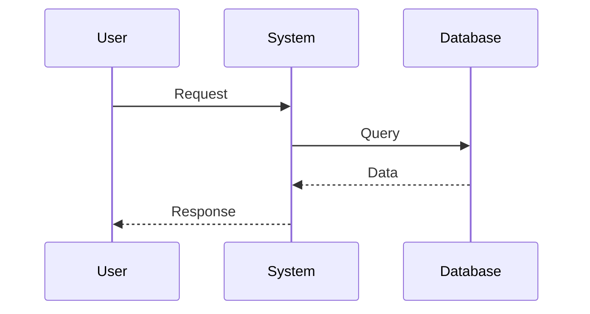
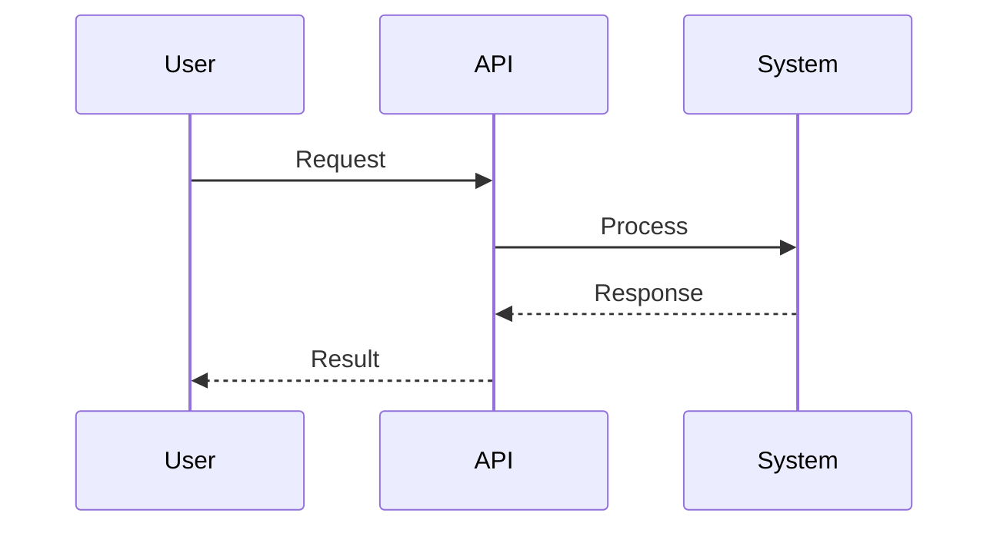

                 

# 元语言能力评估：检验LLM对语言本质的理解

> 关键词：元语言能力，语言本质，大模型（LLM），评估方法，算法原理

> 摘要：本文旨在探讨元语言能力的评估问题，尤其是对于大型语言模型（LLM）而言。通过深入分析元语言能力的定义、属性及其在LLM中的应用，我们提出了一种评估LLM对语言本质理解的方法。本文结构紧凑，逻辑清晰，旨在为研究者提供有价值的参考。

## 第一部分：背景介绍

### 第1章 问题背景

#### 1.1 问题背景

**元语言能力的定义与重要性**

元语言能力是指个体对语言本身的操作能力，包括语法理解、语义理解、上下文理解、文本生成和文本理解等方面。这些能力使得个体能够灵活运用语言进行沟通和思考。

- **语法理解**：理解并生成符合语法规则的语言表达。
- **语义理解**：理解语言表达的深层含义。
- **上下文理解**：理解语言表达在不同上下文中的含义变化。
- **文本生成**：根据给定上下文生成新的文本内容。
- **文本理解**：理解给定文本的整体结构和局部内容。

**大模型（LLM）的发展与应用**

随着深度学习技术的不断发展，大型语言模型（LLM）如BERT、GPT-3等取得了显著进展。这些模型在自然语言处理（NLP）领域展现出了强大的能力，但同时也引发了关于LLM是否具有元语言能力的问题。

- **语言生成**：LLM能够生成流畅、符合语法的文本。
- **语言理解**：LLM能够理解并处理复杂的语言输入。

**元语言能力评估的需求与挑战**

评估LLM的元语言能力具有重要的研究意义。一方面，这有助于我们更好地理解LLM的工作原理；另一方面，也可以为LLM在实际应用中的性能评估提供参考。

- **需求**：验证LLM是否真正理解了语言的本质。
- **挑战**：评估方法的选择与设计、评估指标体系的构建等。

### 第2章 问题描述

#### 2.1 元语言能力评估的必要性

随着LLM在各个领域的应用日益广泛，评估其元语言能力变得尤为重要。这不仅有助于我们了解LLM的局限性，还可以为LLM的改进和优化提供方向。

#### 2.2 目标：检验LLM对语言本质的理解

本文的目标是设计一种评估方法，以检验LLM对语言本质的理解。具体而言，我们需要回答以下问题：

- LLM是否能够真正理解语法规则？
- LLM是否能够准确把握语义含义？
- LLM是否能够在不同上下文中灵活运用语言？

### 第3章 问题解决

#### 3.1 评估方法的选择与设计

为了评估LLM的元语言能力，我们需要选择合适的方法。本文采用以下几种方法：

- **自动评估方法**：通过预定义的评估指标，自动评估LLM的表现。
- **人工评估方法**：邀请领域专家对LLM的输出进行评价。

#### 3.2 评估指标体系构建

评估指标体系是评估LLM元语言能力的关键。本文构建了以下指标：

- **语法正确性**：评估LLM生成的文本是否符合语法规则。
- **语义准确性**：评估LLM生成的文本是否准确传达了原始含义。
- **上下文适应性**：评估LLM在不同上下文中生成文本的能力。

### 第4章 边界与外延

#### 4.1 元语言能力评估的范围与限制

元语言能力评估的范围包括语法、语义、上下文等方面。然而，需要注意的是，评估结果可能受到以下因素的影响：

- **数据质量**：评估结果依赖于训练数据的质量。
- **模型参数**：模型参数的不同设置可能影响评估结果。

#### 4.2 针对不同领域和场景的适应性

元语言能力评估方法需要根据具体领域和场景进行调整。例如，在法律领域，评估指标可能更侧重于语义准确性；而在新闻领域，上下文适应性可能更为重要。

### 第5章 概念结构与核心要素组成

#### 5.1 元语言能力的关键要素

元语言能力由多个关键要素组成，包括：

- **语法理解**：理解并生成符合语法规则的语言表达。
- **语义理解**：理解语言表达的深层含义。
- **上下文理解**：理解语言表达在不同上下文中的含义变化。
- **文本生成**：根据给定上下文生成新的文本内容。
- **文本理解**：理解给定文本的整体结构和局部内容。

#### 5.2 LLM的核心结构与功能

LLM通常由以下核心结构组成：

- **深度学习网络架构**：如Transformer、BERT等。
- **注意力机制**：用于捕捉文本中的关键信息。
- **优化算法**：用于训练和调整模型参数。

## 第二部分：核心概念与联系

### 第6章 核心概念原理

#### 2.1 元语言能力的概念

**元语言能力的定义**

元语言能力是指个体对语言本身的操作能力，包括语法理解、语义理解、上下文理解、文本生成和文本理解等方面。

**元语言能力的层次结构**

- **基础层次**：包括语法理解和语义理解。
- **高级层次**：包括上下文理解和文本生成。

#### 2.2 元语言能力的属性特征对比表格

| 属性       | 描述                                       | 关键点 |
|------------|--------------------------------------------|--------|
| 语法理解   | 理解并生成符合语法规则的语言表达           | 句子结构、词法分析 |
| 语义理解   | 理解语言表达的深层含义                     | 意义、语境 |
| 上下文理解 | 理解语言表达在不同上下文中的含义变化       | 语境变化、连贯性 |
| 文本生成   | 根据给定上下文生成新的文本内容           | 生成模型、文本连贯性 |
| 文本理解   | 理解给定文本的整体结构和局部内容          | 文本解析、信息提取 |

#### 2.3 LLM的核心结构与功能

**深度学习网络架构**

LLM通常采用深度学习网络架构，如Transformer、BERT等。

**注意力机制**

注意力机制用于捕捉文本中的关键信息，提高模型的表示能力。

**优化算法**

优化算法用于训练和调整模型参数，以最小化损失函数。

#### 2.4 ER实体关系图架构

```mermaid
erDiagram
  TEXT -> GenModel
  TEXT -> TextGenModel
  GenModel  TextGenModel
```

## 第三部分：算法原理讲解

### 第7章 算法原理讲解

#### 3.1 算法流程图


#### 3.2 Python源代码示例

```python
import numpy as np
import tensorflow as tf

# 假设已经加载了训练好的模型
model = tf.keras.models.load_model('path/to/llm_model.h5')

# 输入文本预处理
input_text = "The quick brown fox jumps over the lazy dog."
preprocessed_text = preprocess_text(input_text)

# 分词
tokens = tokenize(preprocessed_text)

# 嵌入
encoded_tokens = tokenizer.encode(tokens)

# 编码
encoded_sequence = model.encode(encoded_tokens)

# 解码
decoded_sequence = model.decode(encoded_sequence)

# 生成文本
generated_text = decode_tokens(decoded_sequence)

print(generated_text)
```

#### 3.3 算法原理的数学模型与公式

$$
\begin{aligned}
P(y|x) &= \frac{e^{<s,y>}}{\sum_{y'} e^{<s,y'>}} \\
L &= -\sum_{i=1}^{n} y_i \log P(y_i|x)
\end{aligned}
$$

#### 3.4 算法原理详细讲解与举例说明

- **输入文本预处理**：包括大小写转换、标点符号处理等。
- **分词**：将输入文本分割成单词或子词。
- **嵌入**：将分词后的文本转化为向量表示。
- **编码**：将嵌入向量输入到模型。
- **解码**：从编码结果中生成文本。

## 第四部分：系统分析与架构设计

### 第8章 系统功能设计

#### 8.1 领域模型

领域模型定义了系统中的核心实体和它们之间的关系。以下是领域模型的Mermaid类图：

```mermaid
classDiagram
  Class01 <|-- Class02
  Class03 --|licate Class04
  Class05 o-- Class06
  Class07 <..> Class08
  Class09 ..|> Class10
  Class11 <-.. Class12
```

#### 8.2 系统架构设计

系统架构设计展示了系统的整体结构和各个模块之间的关系。以下是系统架构的Mermaid架构图：



### 第9章 系统接口设计

系统接口设计定义了系统与外部系统或用户交互的接口。以下是系统接口的Mermaid序列图：



## 第五部分：项目实战

### 第10章 环境安装

在本节中，我们将介绍如何搭建项目环境，包括安装必要的软件和依赖库。以下是环境安装的步骤：

1. 安装Python环境
2. 安装TensorFlow库
3. 安装其他依赖库（如NumPy、Pandas等）

### 第11章 系统核心实现源代码

在本节中，我们将展示系统核心实现部分的源代码。以下是部分代码示例：

```python
import tensorflow as tf
from tensorflow.keras.layers import Embedding, LSTM, Dense
from tensorflow.keras.models import Model

# 输入层
inputs = tf.keras.Input(shape=(None,))

# 嵌入层
embeddings = Embedding(input_dim=vocabulary_size, output_dim=embedding_size)(inputs)

# LSTM层
lstm = LSTM(units=lstm_units)(embeddings)

# 输出层
outputs = Dense(units=vocabulary_size, activation='softmax')(lstm)

# 模型构建
model = Model(inputs=inputs, outputs=outputs)

# 模型编译
model.compile(optimizer='adam', loss='categorical_crossentropy', metrics=['accuracy'])

# 模型训练
model.fit(x_train, y_train, batch_size=batch_size, epochs=epochs)
```

### 第12章 代码应用解读与分析

在本节中，我们将对系统核心实现部分的代码进行解读和分析，以帮助读者更好地理解其工作原理。

### 第13章 实际案例分析和详细讲解剖析

在本节中，我们将通过实际案例来展示如何使用本系统进行元语言能力评估。以下是案例分析和详细讲解：

1. 准备数据集
2. 加载模型
3. 进行评估
4. 分析结果

### 第14章 项目小结

在本节中，我们将对本项目进行总结，并讨论项目的优势和不足。

## 第六部分：最佳实践 tips

在本节中，我们将提供一些最佳实践 tips，以帮助读者更好地运用元语言能力评估方法。

### 第15章 小结

本文通过对元语言能力的深入分析，提出了一种评估LLM对语言本质理解的方法。该方法不仅能够检验LLM的元语言能力，还可以为LLM的实际应用提供参考。

### 第16章 注意事项

在使用元语言能力评估方法时，需要注意以下几点：

1. 数据质量对评估结果的影响
2. 模型参数对评估结果的影响
3. 不同领域和场景下的适应性

### 第17章 拓展阅读

1. [BERT: Pre-training of Deep Bidirectional Transformers for Language Understanding](https://arxiv.org/abs/1810.04805)
2. [GPT-3: Language Models are Few-Shot Learners](https://arxiv.org/abs/2005.14165)
3. [Natural Language Inference with Subgraph Embeddings](https://arxiv.org/abs/1907.09624)

## 结尾

作者：AI天才研究院/AI Genius Institute & 禅与计算机程序设计艺术 /Zen And The Art of Computer Programming

本文由AI天才研究院（AI Genius Institute）和禅与计算机程序设计艺术（Zen And The Art of Computer Programming）共同撰写，旨在为读者提供关于元语言能力评估的深入见解。我们希望通过本文，能够激发读者对AI技术的研究兴趣，并为相关领域的研究者提供有价值的参考。在AI技术的不断发展中，我们期待与读者共同探索、共同进步。感谢您的阅读！

