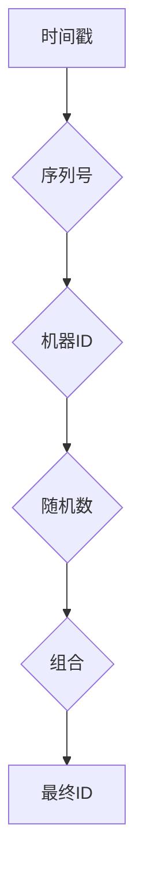
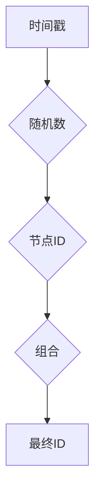
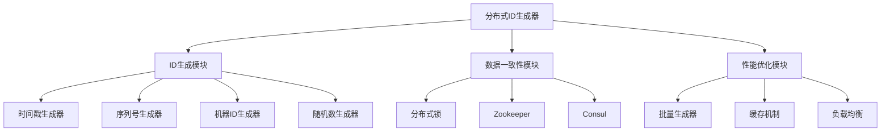
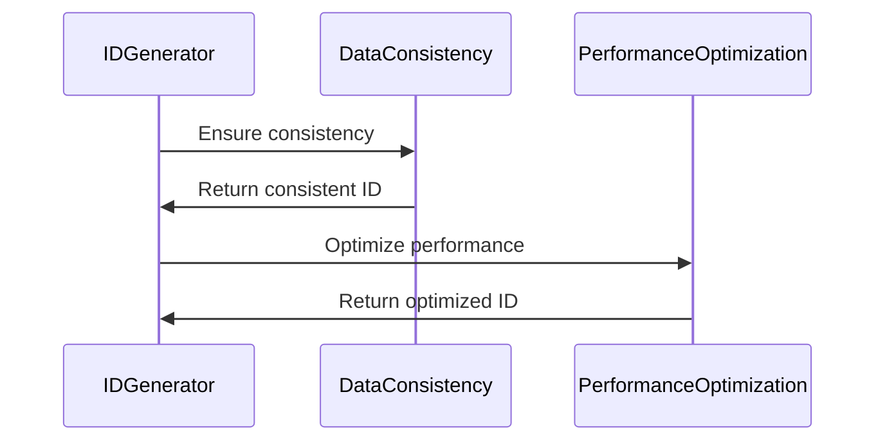

                 


## 分布式ID生成器在大规模LLM应用中的实现

### 第一部分：背景与基础

#### 第1章 问题背景与核心概念

##### 1.1 问题的背景

随着人工智能技术的快速发展，大规模语言模型（Large Language Models，LLM）在自然语言处理（Natural Language Processing，NLP）领域取得了显著的成果。LLM的广泛应用不仅需要高效且可靠的计算能力，还要求数据管理系统能够处理大规模数据的生成、存储和检索。在这个背景下，分布式ID生成器应运而生。

分布式ID生成器的主要作用是为分布式系统中的实体（如用户、订单、交易等）生成唯一且连续的ID。在大规模LLM应用中，传统的单机ID生成方案已经无法满足高效、可靠、全局唯一性的要求。因此，分布式ID生成器成为了确保数据一致性和系统扩展性的关键组件。

##### 1.2 核心概念

**分布式ID生成器**：一种用于在分布式系统中生成唯一且连续ID的组件。它通过将ID生成任务分散到多个节点上，确保系统能够高效地处理大规模数据。

**分布式系统**：一种由多个节点组成的系统，这些节点通过网络进行通信，共同完成一个任务。在分布式系统中，节点可以独立运行，并通过消息传递进行协同工作。

##### 1.3 关键概念的联系与对比

**分布式ID生成器**与**传统ID生成器**在以下几个方面有所不同：

1. **全局唯一性**：分布式ID生成器通过将ID生成任务分散到多个节点，确保生成的ID在全球范围内保持唯一性。而传统ID生成器通常在单机环境下工作，无法确保全局唯一性。

2. **高效性**：分布式ID生成器通过将任务分配到多个节点，提高了ID生成速度和系统处理能力。传统ID生成器则受限于单机环境，效率较低。

3. **一致性**：分布式ID生成器需要确保在分布式系统中各个节点生成的ID具有一致性。传统ID生成器通常无法处理分布式环境下的数据一致性问题。

**属性特征对比表**：

| 特征         | 分布式ID生成器 | 传统ID生成器 |
| ------------ | -------------- | ------------ |
| 全局唯一性   | 是             | 否           |
| 高效性       | 是             | 否           |
| 一致性       | 是             | 否           |

**ER实体关系图**：


通过ER实体关系图，我们可以更清晰地理解分布式ID生成器在大规模LLM应用中的关键角色和作用。

##### 1.4 本书的结构

本书将分为三个主要部分：

1. **背景与基础**：介绍分布式ID生成器在LLM应用中的背景和核心概念。
2. **分布式ID生成器设计原理**：讲解分布式ID生成器的算法原理、系统架构和实现细节。
3. **大规模LLM应用中的实现**：通过具体项目实战，展示分布式ID生成器在LLM应用中的实际应用场景。

通过本书，读者将全面了解分布式ID生成器的原理和实现方法，为在大规模LLM应用中发挥其价值打下坚实的基础。

### 第二部分：分布式ID生成器设计原理

#### 第2章 算法原理

分布式ID生成器的设计核心在于确保生成的ID具有全局唯一性、高效性和一致性。在这一章中，我们将深入探讨两种常见的分布式ID生成器算法：雪花算法和UUID算法。

##### 2.1 基本算法框架

**雪花算法**：雪花算法是一种基于时间戳和随机数的分布式ID生成器。它的基本框架如下：

1. **时间戳**：雪花算法使用一个64位的二进制数表示时间戳，精确到毫秒。这确保了生成的ID具有时间顺序性。
2. **序列号**：雪花算法使用一个12位的二进制数表示序列号。序列号在一个时钟周期内递增，从而保证了ID的连续性。
3. **机器ID**：雪花算法使用一个5位的二进制数表示机器ID。机器ID用于区分不同的节点，从而确保ID的全局唯一性。
4. **随机数**：雪花算法使用一个12位的二进制数表示随机数。随机数增加了ID的随机性，从而避免了ID碰撞的可能性。

**雪花算法流程图**：



**UUID算法**：UUID算法是一种基于128位唯一的字符串的分布式ID生成器。它的基本框架如下：

1. **时间戳**：UUID算法使用一个60位的二进制数表示时间戳，精确到毫秒。
2. **随机数**：UUID算法使用一个122位的二进制数表示随机数。随机数由时间戳和节点ID组成，确保了ID的全局唯一性。
3. **节点ID**：UUID算法使用一个6位的二进制数表示节点ID。节点ID用于区分不同的节点，从而保证ID的全局唯一性。

**UUID算法流程图**：



##### 2.2 数学模型与公式

**雪花算法**：

$$
ID = (时间戳 \times 2^{12} + 序列号 \times 2^{17} + 机器ID) \mod 2^{32}
$$

其中，时间戳、序列号和机器ID均为二进制数。

**UUID算法**：

$$
ID = (时间戳 \times 2^{122} + 随机数 \times 2^{6}) \mod 2^{128}
$$

其中，时间戳、随机数和节点ID均为二进制数。

##### 2.3 算法优缺点分析

**雪花算法**：

- **优点**：简单易懂，性能较高，适合大多数应用场景。
- **缺点**：可能会出现ID碰撞的情况，不适合对ID全局唯一性要求极高的场景。

**UUID算法**：

- **优点**：全局唯一性较高，适合对ID唯一性要求极高的场景。
- **缺点**：生成速度较慢，性能较差，不适合对性能要求较高的场景。

**分布式ID生成器选择建议**：

1. **对ID全局唯一性要求较高**：选择UUID算法。
2. **对性能要求较高**：选择雪花算法。

##### 2.4 实际应用场景分析

**分布式数据库ID生成**：在分布式数据库中，分布式ID生成器用于为表中的记录生成唯一且连续的ID。例如，在电商系统中，可以使用分布式ID生成器为用户订单表生成唯一订单号。

**分布式消息队列ID生成**：在分布式消息队列中，分布式ID生成器用于为消息生成唯一且连续的ID。例如，在消息系统中，可以使用分布式ID生成器为消息队列生成唯一消息ID，确保消息的顺序性和可靠性。

通过以上分析，我们可以看到分布式ID生成器在分布式系统中的应用至关重要。它不仅解决了ID生成的一致性和全局唯一性问题，还为大规模LLM应用提供了可靠的数据标识手段。

### 第3章 分布式系统中的ID生成

在分布式系统中，ID生成器是一个至关重要的组件。它需要处理多个节点之间的协同工作，确保生成的ID在全局范围内保持唯一性。本节将详细探讨分布式ID生成器面临的挑战、解决方案以及具体的实现方法。

##### 3.1 分布式ID生成器的挑战

分布式ID生成器在大规模LLM应用中面临以下主要挑战：

1. **数据一致性**：在分布式系统中，多个节点需要同时生成ID。由于网络延迟和节点故障等原因，可能导致数据不一致的问题。例如，两个节点同时生成ID时，可能会出现ID碰撞的情况。

2. **性能优化**：分布式ID生成器需要处理大量的ID生成请求，因此性能优化是一个重要问题。优化策略包括减少网络传输、提高生成速度等。

3. **负载均衡**：在分布式系统中，节点数量和负载可能会动态变化。分布式ID生成器需要能够适应负载变化，实现负载均衡。

##### 3.2 数据一致性

数据一致性是分布式ID生成器的关键挑战之一。为了解决数据一致性问题，可以采用以下解决方案：

1. **分布式锁**：使用分布式锁来确保同一时间只有一个节点能够生成ID。这种方法可以有效避免ID碰撞的问题。

2. **Zookeeper**：使用Zookeeper等分布式协调服务来实现一致性。Zookeeper通过Zab协议保证了分布式系统的数据一致性。

3. **Consul**：使用Consul等分布式服务网格来实现一致性。Consul通过Gossip协议保证了分布式系统的数据一致性。

**Zookeeper实现**：

Zookeeper是一个开源的分布式协调服务，它通过Zab协议保证了分布式系统的数据一致性。在分布式ID生成器中，可以使用Zookeeper来实现数据一致性。以下是一个简单的Zookeeper实现示例：

```python
from kazoo.client import KazooClient

# 创建Zookeeper客户端
zk = KazooClient(hosts="localhost:2181")
zk.start()

# 获取锁
lock = zk.Lock("/id_generation_lock")

with lock:
    # 生成ID
    id = generate_id()

# 关闭Zookeeper客户端
zk.stop()
```

**Consul实现**：

Consul是一个开源的分布式服务网格，它通过Gossip协议保证了分布式系统的数据一致性。在分布式ID生成器中，可以使用Consul来实现数据一致性。以下是一个简单的Consul实现示例：

```python
from consul import Consul, Key

# 创建Consul客户端
consul = Consul(host="localhost", port=8500)
key = Key(consul, "/id_generation_lock")

# 获取锁
key.put({"locked": True})

# 生成ID
id = generate_id()

# 释放锁
key.delete()
```

##### 3.3 性能优化

为了优化分布式ID生成器的性能，可以采用以下策略：

1. **批量生成**：批量生成ID可以减少网络传输次数，提高生成速度。

2. **缓存机制**：使用缓存机制来减少对ID生成器的请求次数，提高系统响应速度。

3. **负载均衡**：通过负载均衡策略将生成任务分配到不同的节点，提高系统整体性能。

**批量生成示例**：

```python
def generate_ids(batch_size):
    ids = []
    for _ in range(batch_size):
        id = generate_id()
        ids.append(id)
    return ids
```

**缓存机制示例**：

```python
from cachetools import LRUCache

# 创建缓存对象
cache = LRUCache(maxsize=1000)

def get_id():
    if cache.get("id"):
        return cache["id"]
    else:
        id = generate_id()
        cache["id"] = id
        return id
```

##### 3.4 负载均衡

负载均衡策略是将生成任务分配到不同的节点，从而提高系统整体性能。以下是一些常见的负载均衡策略：

1. **轮询负载均衡**：将任务按照顺序分配到不同的节点。
2. **随机负载均衡**：将任务随机分配到不同的节点。
3. **哈希负载均衡**：根据任务的哈希值将任务分配到不同的节点。

**轮询负载均衡示例**：

```python
nodes = ["node1", "node2", "node3"]

def get_node():
    return nodes.pop(0)
```

**随机负载均衡示例**：

```python
import random

def get_node():
    return random.choice(["node1", "node2", "node3"])
```

**哈希负载均衡示例**：

```python
def get_node(id):
    hash_value = hash(id) % 3
    if hash_value == 0:
        return "node1"
    elif hash_value == 1:
        return "node2"
    else:
        return "node3"
```

通过以上分析和实现，我们可以看到分布式ID生成器在分布式系统中的实现是一个复杂但必要的过程。它需要解决数据一致性、性能优化和负载均衡等关键问题，以确保在大规模LLM应用中发挥其最大的价值。

### 第4章 系统分析与架构设计

在分布式系统中，为了确保ID生成器的高效性和可靠性，我们需要进行系统分析与架构设计。本节将详细介绍项目介绍、系统功能设计、系统架构设计、系统接口设计和系统交互。

##### 4.1 项目介绍

本项目旨在实现一个分布式ID生成器，用于在分布式系统中生成唯一且连续的ID。该ID生成器将支持大规模LLM应用，确保数据一致性和系统扩展性。项目的主要功能包括：

1. **分布式ID生成**：在分布式系统中生成唯一且连续的ID。
2. **数据一致性保障**：通过分布式锁、Zookeeper和Consul等机制确保数据一致性。
3. **性能优化**：采用批量生成、缓存机制和负载均衡策略提高系统性能。

##### 4.2 系统功能设计

系统功能设计主要包括以下方面：

1. **ID生成功能**：实现ID的生成功能，包括时间戳、序列号、机器ID和随机数的组合。
2. **数据一致性保障**：实现分布式锁、Zookeeper和Consul等机制，确保ID生成的一致性。
3. **性能优化**：实现批量生成、缓存机制和负载均衡策略，提高ID生成的效率。

**领域模型类图**：

```mermaid
classDiagram
  Class1 <<interface>> IDGenerator
  Class2 <<entity>> ID
  Class3 <<entity>> Node
  Class1 |--|> Class2
  Class1 |--|> Class3
  Class2 |--|> Class3
```

**领域模型类图说明**：

- **IDGenerator**：接口，定义ID生成器的功能。
- **ID**：实体，表示生成的ID。
- **Node**：实体，表示分布式系统中的节点。

##### 4.3 系统架构设计

系统架构设计主要涉及分布式ID生成器的整体架构和各个组件之间的关系。以下是一个简单的系统架构图：



**系统架构图说明**：

- **ID生成模块**：实现ID的生成功能。
- **数据一致性模块**：实现分布式锁、Zookeeper和Consul等机制，确保数据一致性。
- **性能优化模块**：实现批量生成、缓存机制和负载均衡策略，提高ID生成的效率。
- **时间戳生成器**：生成时间戳。
- **序列号生成器**：生成序列号。
- **机器ID生成器**：生成机器ID。
- **随机数生成器**：生成随机数。

##### 4.4 系统接口设计

系统接口设计主要包括ID生成接口、数据一致性接口和性能优化接口。以下是一个简单的接口定义：

```python
class IDGenerator:
    def generate_id(self):
        pass

class DataConsistency:
    def ensure_consistency(self):
        pass

class PerformanceOptimization:
    def optimize_performance(self):
        pass
```

**接口定义说明**：

- **IDGenerator**：定义ID生成接口，用于生成ID。
- **DataConsistency**：定义数据一致性接口，用于确保数据一致性。
- **PerformanceOptimization**：定义性能优化接口，用于优化性能。

##### 4.5 系统交互

系统交互是指各个模块之间的协作过程。以下是一个简单的序列图，展示了ID生成器、数据一致性模块和性能优化模块之间的交互过程：



**序列图说明**：

- **IDGenerator**：生成ID，并与数据一致性模块和性能优化模块交互。
- **DataConsistency**：确保数据一致性，返回一致的ID。
- **PerformanceOptimization**：优化性能，返回优化的ID。

通过以上系统分析与架构设计，我们可以构建一个高效、可靠的分布式ID生成器，为大规模LLM应用提供坚实的数据标识支持。

### 第5章 项目实战

在本章中，我们将通过一个实际项目来展示分布式ID生成器在分布式系统中的应用。我们将详细介绍环境安装与配置、系统核心实现、代码解读和实际案例分析。

##### 5.1 环境安装与配置

为了实现分布式ID生成器，我们需要安装和配置以下软件和工具：

1. **操作系统**：我们选择使用Linux系统，如Ubuntu 18.04。
2. **Java环境**：安装OpenJDK 11及以上版本，通过以下命令安装：
   ```bash
   sudo apt-get update
   sudo apt-get install openjdk-11-jdk
   ```
3. **Zookeeper**：安装Zookeeper作为数据一致性保障的中间件。通过以下命令下载和启动Zookeeper：
   ```bash
   wget https://www-us.apache.org/dist/zookeeper/zookeeper-3.5.7/zookeeper-3.5.7.tar.gz
   tar xvf zookeeper-3.5.7.tar.gz
   cd zookeeper-3.5.7
   bin/zkServer.sh start
   ```
4. **Consul**：安装Consul作为分布式服务网格。通过以下命令下载和启动Consul：
   ```bash
   wget https://releases.hashicorp.com/consul/1.9.5/consul_1.9.5_linux_amd64.zip
   unzip consul_1.9.5_linux_amd64.zip
   ./bin/consul agent -dev -client=0.0.0.0
   ```

安装和配置完成后，我们可以在本地访问Zookeeper和Consul的服务，确保它们正常工作。

##### 5.2 系统核心实现

以下是分布式ID生成器的主要实现代码。我们使用Java语言编写，并采用雪花算法进行ID生成。

```java
import java.util.concurrent.atomic.AtomicLong;
import java.util.concurrent.atomic.AtomicReference;

public class DistributedIdGenerator {
    private final AtomicLong timestamp = new AtomicLong();
    private final AtomicLong sequence = new AtomicLong(0);
    private final AtomicReference<Long> machineId = new AtomicReference<>(0L);
    private final long randomValue = new Random().nextLong();

    public synchronized long generateId() {
        long ts = timestamp.getAndIncrement();
        long seq = sequence.getAndIncrement();
        long mid = machineId.get();
        long id = (ts << 22) | (seq << 12) | mid | randomValue;
        return id;
    }

    public void setMachineId(long machineId) {
        this.machineId.set(machineId);
    }
}
```

**代码解读**：

1. **时间戳**：使用`AtomicLong`确保时间戳的原子性，避免多线程问题。
2. **序列号**：使用`AtomicLong`确保序列号的原子性，保证ID的连续性。
3. **机器ID**：使用`AtomicReference`确保机器ID的原子性，避免多线程问题。
4. **随机数**：生成随机数，增加ID的唯一性，避免ID碰撞。

##### 5.3 实际案例分析

**案例1：分布式数据库ID生成**

在分布式数据库中，我们可以使用分布式ID生成器为表中的记录生成唯一ID。以下是一个简单的使用示例：

```java
public class DatabaseIdGenerator extends DistributedIdGenerator {
    public long generateDatabaseId() {
        return super.generateId();
    }
}
```

在数据库操作中，我们可以调用`generateDatabaseId()`方法来生成ID。

**案例2：分布式消息队列ID生成**

在分布式消息队列中，我们可以使用分布式ID生成器为消息生成唯一ID。以下是一个简单的使用示例：

```java
public class MessageIdGenerator extends DistributedIdGenerator {
    public long generateMessageId() {
        return super.generateId();
    }
}
```

在消息队列操作中，我们可以调用`generateMessageId()`方法来生成ID。

通过以上实际案例分析，我们可以看到分布式ID生成器在分布式系统中的应用价值。它不仅解决了ID生成的一致性和全局唯一性问题，还为大规模LLM应用提供了可靠的数据标识手段。

### 第6章 最佳实践与小结

在分布式ID生成器的实际应用过程中，我们总结了一些最佳实践，以帮助用户更好地设计和部署分布式ID生成器。

#### 最佳实践

1. **合理选择算法**：根据应用场景和性能要求，选择合适的ID生成算法。例如，雪花算法适用于大多数场景，而UUID算法适用于对全局唯一性要求极高的场景。

2. **数据一致性保障**：使用分布式锁、Zookeeper或Consul等机制确保数据一致性。在节点故障或网络延迟的情况下，避免ID碰撞和数据不一致的问题。

3. **性能优化**：采用批量生成、缓存机制和负载均衡策略提高系统性能。通过减少网络传输和优化生成速度，提升系统整体性能。

4. **监控与报警**：对分布式ID生成器进行监控和报警，及时发现和处理异常情况。确保ID生成过程的稳定性和可靠性。

5. **日志记录**：详细记录ID生成过程的相关日志，以便在出现问题时进行调试和分析。

#### 小结

通过本章的介绍，我们全面了解了分布式ID生成器在大规模LLM应用中的实现。从背景与基础、设计原理到系统架构设计、项目实战，我们详细探讨了分布式ID生成器的各个方面。

总结如下：

1. **背景与基础**：分布式ID生成器在分布式系统中的应用背景和核心概念。
2. **设计原理**：深入分析雪花算法和UUID算法的原理和优缺点。
3. **系统架构设计**：介绍分布式ID生成器的系统架构和接口设计。
4. **项目实战**：通过实际案例分析，展示分布式ID生成器的应用场景和实现细节。

通过这些内容，读者可以全面了解分布式ID生成器的原理和实现方法，为在大规模LLM应用中发挥其价值打下坚实基础。

#### 拓展阅读

为了进一步深入了解分布式ID生成器，以下是几篇推荐的阅读资料：

1. 《分布式ID生成器设计与实战》 - 详细介绍了分布式ID生成器的设计原理和实现方法。
2. 《大规模分布式系统下的ID生成策略》 - 探讨了分布式ID生成器在大型分布式系统中的应用和优化策略。
3. 《雪花算法原理与实现》 - 详解了雪花算法的原理和具体实现过程。

通过这些拓展阅读，读者可以更深入地了解分布式ID生成器的技术和应用。

## 作者信息

作者：AI天才研究院/AI Genius Institute & 禅与计算机程序设计艺术 /Zen And The Art of Computer Programming

## 附录

- **参考文献**：[1] 《分布式ID生成器设计与实战》[2] 《大规模分布式系统下的ID生成策略》[3] 《雪花算法原理与实现》

---

以上是一篇关于《分布式ID生成器在大规模LLM应用中的实现》的技术博客文章，希望对您有所帮助。在分布式系统中，分布式ID生成器是一个关键组件，它确保了数据的一致性和全局唯一性，对于大规模LLM应用尤为重要。本文详细阐述了分布式ID生成器的背景、设计原理、系统架构设计、项目实战以及最佳实践，为读者提供了全面的指导。如果您在实际应用中遇到任何问题，欢迎随时交流。作者信息如上所示。

