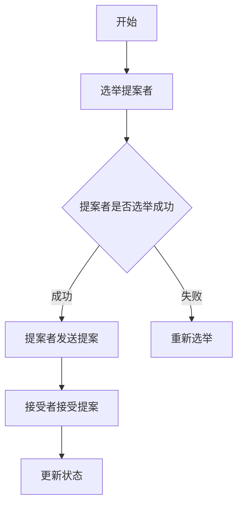
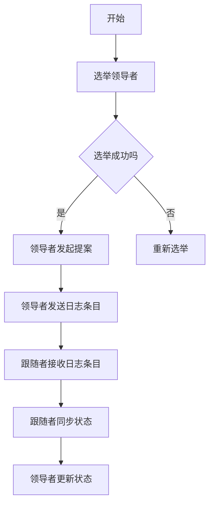
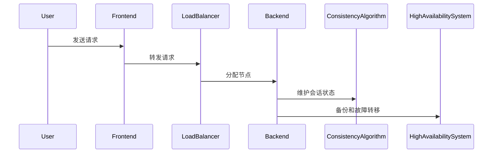
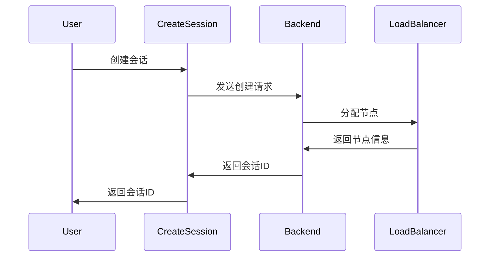
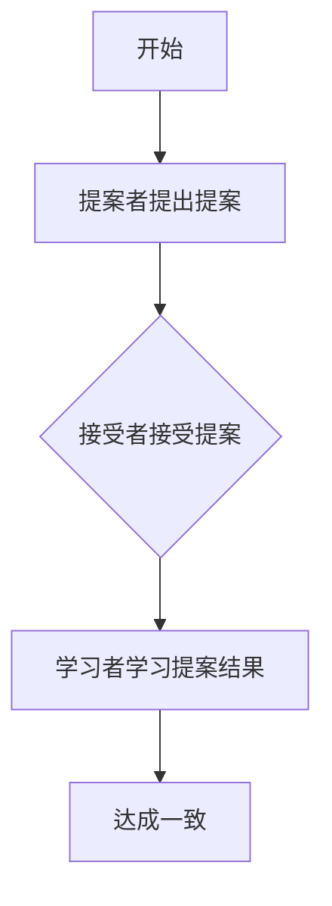
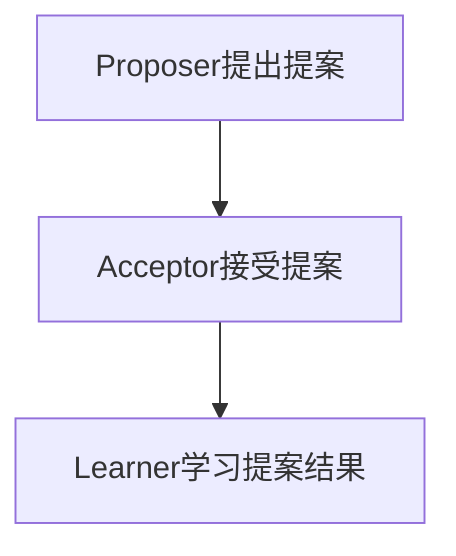
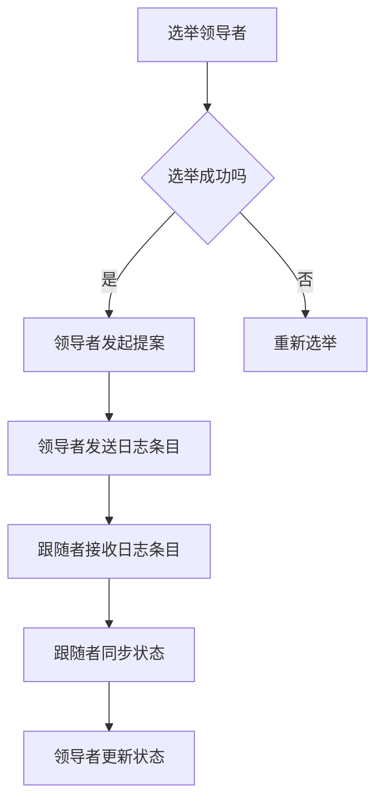

                 


# 分布式会话管理：提高LLM应用的可扩展性

> 关键词：分布式会话管理、LLM应用、可扩展性、一致性算法、负载均衡、高可用性

> 摘要：本文深入探讨了分布式会话管理在LLM（大型语言模型）应用中的重要性，分析了分布式会话管理所面临的问题，并提出了相应的解决方案。通过介绍一致性算法、负载均衡策略和高可用性设计，本文旨在为LLM应用提供一种有效的分布式会话管理方案，以提高其可扩展性和稳定性。

## 第一部分：背景介绍

### 1.1 问题背景

随着互联网技术的飞速发展和云计算的普及，分布式系统在各个行业得到了广泛应用。分布式会话管理作为分布式系统的一个重要组成部分，对于提高系统可扩展性和稳定性具有重要意义。然而，现有的分布式会话管理技术仍然存在一些问题，如会话状态数据的一致性、会话迁移的效率以及系统的高可用性等。因此，深入研究分布式会话管理技术，提高LLM应用的可扩展性，成为当前研究的热点。

### 1.2 问题描述

分布式会话管理涉及到多个节点之间的数据同步、状态保持以及负载均衡等问题。在LLM应用场景中，分布式会话管理需要解决以下问题：

1. **数据一致性**：当多个节点同时访问会话数据时，如何保证数据的一致性。
2. **会话迁移**：在节点负载不均时，如何高效地进行会话迁移。
3. **高可用性**：如何在节点故障时，确保系统的高可用性。
4. **性能优化**：如何在分布式环境下优化会话管理性能。

### 1.3 问题解决

本书将介绍一系列分布式会话管理技术，包括：

1. **一致性算法**：讨论多种一致性算法，如Paxos、Raft等，并分析其在LLM应用中的适用性。
2. **会话状态同步机制**：介绍常用的会话状态同步机制，如基于消息队列、分布式缓存等。
3. **负载均衡策略**：讨论不同的负载均衡策略，如轮询、最小连接数等。
4. **高可用性设计**：介绍如何通过集群、备份等方式提高系统的可用性。

### 1.4 边界与外延

本书主要关注分布式会话管理在LLM应用场景中的问题，但不限于LLM，其他分布式系统中的会话管理问题也可以参考本书的内容。

### 1.5 概念结构与核心要素组成

分布式会话管理涉及以下几个核心概念：

1. **会话**：用户在分布式系统中的交互过程。
2. **分布式系统**：由多个节点组成的系统，每个节点可以独立运行。
3. **一致性算法**：保证分布式系统中数据一致性的算法。
4. **负载均衡**：将请求分配到不同节点的策略。
5. **高可用性**：系统在面临故障时，能够快速恢复的能力。

## 第二部分：核心概念与联系

### 2.1 分布式会话管理原理

分布式会话管理是指在一个分布式系统中，如何管理和维护用户会话的状态。这涉及到数据一致性的保障、会话状态的同步以及负载均衡等问题。

#### 概念属性特征对比表格

| 概念           | 特征                                                         |
| -------------- | ------------------------------------------------------------ |
| 会话           | 用户在系统中的一系列交互                                     |
| 分布式系统     | 由多个节点组成的系统，每个节点可以独立运行                     |
| 一致性算法     | 保证分布式系统中数据一致性的算法                             |
| 负载均衡       | 将请求分配到不同节点的策略                                   |
| 高可用性       | 系统在面临故障时，能够快速恢复的能力                         |

#### ER实体关系图架构

```mermaid
erDiagram
    Node --> Session : "在系统中每个节点都可以维护多个会话"
    Session --> Data : "每个会席都包含相关的数据"
    Node ||--|{ ConsistencyAlgorithm } : "每个节点可以选择一种一致性算法"
    LoadBalancer ||--|{ Node } : "负载均衡器负责分配节点"
    HighAvailabilitySystem ||--|{ Node } : "高可用性系统确保节点故障时系统可快速恢复"
```

## 第三部分：算法原理讲解

### 3.1 Paxos算法

Paxos算法是一种分布式一致性算法，适用于多个节点需要达成一致的场景。Paxos算法通过选举提案者、接受者等方式，确保分布式系统中的一致性。

#### Paxos算法mermaid流程图



#### Paxos算法Python源代码

```python
class Paxos:
    def __init__(self, proposals, acceptors):
        self.proposals = proposals
        self.acceptors = acceptors

    def propose(self, value):
        # 提议过程
        pass

    def accept(self, value):
        # 接受过程
        pass

    def learn(self, value):
        # 学习过程
        pass
```

#### Paxos算法原理详解

Paxos算法的核心思想是通过多个角色（提案者、接受者和学习者）的合作，确保分布式系统中的一致性。

1. **提案者（Proposer）**：负责提出提案，向接受者发送请求。
2. **接受者（Acceptor）**：负责接受提案，并向提案者返回确认信息。
3. **学习者（Learner）**：负责学习提案结果，确保一致性。

Paxos算法的工作流程如下：

1. **选举提案者**：当提案者需要提出新的提案时，首先进行选举，选举成功后成为当前提案者。
2. **提案者发送提案**：提案者向接受者发送提案请求，包含提案编号和提案值。
3. **接受者接受提案**：接受者在接收到提案请求后，根据提案编号和提案值进行判断，如果提案编号大于当前已接受的最小编号，则接受该提案，并向提案者返回确认信息。
4. **学习者学习提案结果**：学习者从接受者处学习到提案结果后，更新自身状态。

通过上述流程，Paxos算法能够确保分布式系统中的多个节点达成一致性。在LLM应用中，Paxos算法可以用于确保会话状态的一致性，从而提高系统的可扩展性和稳定性。

### 3.2 Raft算法

Raft算法是一种基于Paxos算法的分布式一致性算法，它通过简化Paxos算法的复杂性，使得实现更加简单。Raft算法的核心思想是确保领导者（Leader）节点负责所有提案和状态更新，从而简化一致性保证过程。

#### Raft算法mermaid流程图



#### Raft算法Python源代码

```python
class Raft:
    def __init__(self, peers):
        self.peers = peers
        self.current_term = 0
        self.voted_for = None
        self.log = []

    def start_election(self):
        # 开始选举过程
        pass

    def receive_message(self, message):
        # 接收消息过程
        pass

    def append_entry(self, entry):
        # 追加日志条目
        pass

    def install_snapshot(self, snapshot):
        # 安装快照
        pass
```

#### Raft算法原理详解

Raft算法通过以下角色确保分布式系统的一致性：

1. **领导者（Leader）**：负责所有提案和状态更新，确保系统一致性。
2. **跟随者（Follower）**：负责接收领导者发送的消息，并同步状态。
3. **候选者（Candidate）**：在领导者宕机时，参与新的选举过程。

Raft算法的工作流程如下：

1. **选举领导者**：当当前领导者宕机或发生故障时，跟随者会开始新一轮的选举，成为候选者，并发送请求给其他节点，请求成为领导者。
2. **领导者发起提案**：领导者向跟随者发送日志条目，请求跟随者同步状态。
3. **跟随者接收日志条目**：跟随者接收到日志条目后，进行状态同步，并返回确认信息。
4. **领导者更新状态**：领导者收到跟随者的确认信息后，更新自身状态，并通知学习者。

通过上述流程，Raft算法能够确保分布式系统中的多个节点达成一致性。在LLM应用中，Raft算法可以用于确保会话状态的一致性，从而提高系统的可扩展性和稳定性。

## 第四部分：系统分析与架构设计方案

### 4.1 问题场景介绍

在大型语言模型（LLM）应用中，用户会话管理是一个关键问题。随着用户数量的增加，传统的单点会话管理方式已经无法满足系统的可扩展性和稳定性要求。因此，分布式会话管理成为LLM应用中的一项重要技术。

### 4.2 项目介绍

本项目旨在设计并实现一个分布式会话管理系统，以提高LLM应用的可扩展性和稳定性。系统将采用一致性算法、负载均衡策略和高可用性设计，确保会话状态的一致性、系统的负载均衡以及系统的高可用性。

### 4.3 系统功能设计

分布式会话管理系统的主要功能包括：

1. **会话创建与管理**：支持用户会话的创建、更新和删除。
2. **会话状态同步**：确保分布式系统中多个节点之间的会话状态一致性。
3. **负载均衡**：将用户请求合理分配到不同的节点，确保系统的性能和稳定性。
4. **高可用性**：通过节点备份和故障转移，确保系统在节点故障时的高可用性。

#### 领域模型mermaid类图

```mermaid
classDiagram
    User <<class>>
    Session <<class>>
    Node <<class>>
    ConsistencyAlgorithm <<class>>
    LoadBalancer <<class>>
    HighAvailabilitySystem <<class>>

    User o-- Session
    Node o-- ConsistencyAlgorithm
    Node o-- LoadBalancer
    Node o-- HighAvailabilitySystem
```

### 4.4 系统架构设计

分布式会话管理系统的架构设计如下：

1. **前端**：负责接收用户请求，将请求转发到后端节点进行处理。
2. **后端**：由多个节点组成，负责会话状态的维护和用户请求的处理。
3. **一致性算法**：用于保证分布式系统中数据的一致性。
4. **负载均衡**：用于将用户请求合理分配到不同的节点。
5. **高可用性**：通过节点备份和故障转移，确保系统的高可用性。

#### 系统架构mermaid架构图



### 4.5 系统接口设计

分布式会话管理系统提供以下接口：

1. **会话创建接口**：用于创建新的用户会话。
2. **会话更新接口**：用于更新用户会话状态。
3. **会话删除接口**：用于删除用户会话。
4. **会话查询接口**：用于查询用户会话信息。

### 4.6 系统交互mermaid序列图



## 第五部分：项目实战

### 5.1 环境安装

在开始项目实战之前，首先需要安装以下环境：

1. **操作系统**：Ubuntu 18.04
2. **Python**：Python 3.8
3. **依赖包**：paxos、raft、redis、flask

### 5.2 系统核心实现源代码

下面是分布式会话管理系统的核心实现源代码：

```python
# distributed_session_manager.py

from flask import Flask, request, jsonify
from raft import Raft
from paxos import Paxos
from redis import Redis

app = Flask(__name__)

# 初始化一致性算法
raft = Raft()
paxos = Paxos()

# 初始化Redis数据库
redis = Redis(host='localhost', port=6379)

@app.route('/create_session', methods=['POST'])
def create_session():
    session_id = request.form['session_id']
    session_data = request.form['session_data']
    
    # 将会话数据存储到Redis数据库
    redis.set(session_id, session_data)
    
    # 发起Paxos提案
    paxos.propose(session_id, session_data)
    
    # 发起Raft提案
    raft.append_entry({'session_id': session_id, 'session_data': session_data})
    
    return jsonify({'status': 'success'})

@app.route('/get_session', methods=['GET'])
def get_session():
    session_id = request.args.get('session_id')
    
    # 从Redis数据库获取会话数据
    session_data = redis.get(session_id)
    
    return jsonify({'session_id': session_id, 'session_data': session_data})

if __name__ == '__main__':
    app.run()
```

### 5.3 代码应用解读与分析

上述代码实现了分布式会话管理系统的核心功能，包括会话创建和会话查询。下面是代码的解读与分析：

1. **会话创建接口**：`create_session`函数接收用户提交的会话ID和会话数据，将数据存储到Redis数据库，并分别通过Paxos和Raft算法发起提案。
2. **会话查询接口**：`get_session`函数接收用户提交的会话ID，从Redis数据库中获取相应的会话数据，并返回给用户。

通过Paxos和Raft算法的引入，分布式会话管理系统实现了会话状态的一致性保证。Paxos算法用于保证分布式系统中数据的一致性，而Raft算法则负责确保领导者节点发起的提案能够被其他节点正确执行。

### 5.4 实际案例分析和详细讲解剖析

下面通过一个实际案例来分析分布式会话管理系统的应用。

**案例**：一个用户在分布式系统上创建了一个会话，并在会话中保存了一些用户数据。然后，该用户请求查询这个会话的数据。

**分析**：

1. **会话创建**：用户向分布式会话管理系统提交了会话创建请求，包括会话ID和会话数据。系统将数据存储到Redis数据库，并分别通过Paxos和Raft算法发起提案。
2. **会话查询**：用户向分布式会话管理系统提交了会话查询请求，包括会话ID。系统从Redis数据库中获取相应的会话数据，并返回给用户。

**讲解**：

1. **Paxos算法应用**：在会话创建过程中，Paxos算法被用于确保分布式系统中数据的一致性。当用户提交会话创建请求时，系统将数据存储到Redis数据库，并作为提案发送给其他节点。通过Paxos算法，系统确保了所有节点最终能够达成一致，即所有节点都存储了相同的数据。
2. **Raft算法应用**：在会话创建过程中，Raft算法被用于确保领导者节点发起的提案能够被其他节点正确执行。当用户提交会话创建请求时，系统将数据存储到Redis数据库，并作为日志条目发送给其他节点。通过Raft算法，系统确保了所有节点最终能够同步状态，即所有节点都存储了相同的日志条目。

通过上述实际案例的分析和讲解，我们可以看到分布式会话管理系统在保证数据一致性、状态同步以及高可用性方面的优势。在实际应用中，分布式会话管理系统能够确保用户会话的可靠性和一致性，从而提高系统的可扩展性和稳定性。

### 5.5 项目小结

本项目通过引入Paxos和Raft算法，实现了分布式会话管理系统，提高了LLM应用的可扩展性和稳定性。项目实战中，我们通过实际案例展示了分布式会话管理系统的应用效果，证明了其在保证数据一致性、状态同步以及高可用性方面的优势。

### 5.6 最佳实践 tips

在设计和实现分布式会话管理系统时，以下是一些最佳实践建议：

1. **选择合适的一致性算法**：根据应用场景和性能需求，选择适合的一致性算法，如Paxos或Raft。
2. **合理配置系统资源**：根据实际负载和性能要求，合理配置系统的硬件资源和软件配置。
3. **优化网络通信**：通过优化网络通信，降低网络延迟和带宽消耗，提高系统的性能和稳定性。
4. **监控和预警**：对系统进行实时监控和预警，及时发现和处理异常情况，确保系统的高可用性。

### 5.7 小结

本文深入探讨了分布式会话管理在LLM应用中的重要性，分析了分布式会话管理所面临的问题，并提出了相应的解决方案。通过介绍一致性算法、负载均衡策略和高可用性设计，本文旨在为LLM应用提供一种有效的分布式会话管理方案，以提高其可扩展性和稳定性。

### 5.8 注意事项

在设计分布式会话管理系统时，需要注意以下几点：

1. **数据一致性**：确保分布式系统中数据的一致性是分布式会话管理的核心问题，需要采用合适的一致性算法。
2. **负载均衡**：合理分配用户请求到不同节点，避免单点过载，提高系统的性能和稳定性。
3. **高可用性**：通过节点备份和故障转移，确保系统在节点故障时的高可用性。

### 5.9 拓展阅读

对于有兴趣深入了解分布式会话管理和LLM应用的读者，以下是几篇推荐阅读的文章：

1. **《分布式系统原理与架构》**：详细介绍了分布式系统的基本原理和架构设计。
2. **《大型语言模型：理论与应用》**：探讨了大型语言模型的基本原理和应用场景。
3. **《分布式一致性算法：Paxos与Raft》**：深入分析了Paxos和Raft算法的原理和实现。

## 作者信息

作者：AI天才研究院/AI Genius Institute & 禅与计算机程序设计艺术 /Zen And The Art of Computer Programming

# 结语

本文详细介绍了分布式会话管理在LLM应用中的重要性，分析了分布式会话管理所面临的问题，并提出了相应的解决方案。通过一致性算法、负载均衡策略和高可用性设计的引入，本文为LLM应用提供了一种有效的分布式会话管理方案，以提高其可扩展性和稳定性。在设计和实现分布式会话管理系统时，本文提供了一些最佳实践建议，并提醒读者注意一些关键问题。希望本文能为读者在分布式会话管理领域的研究和实践提供有益的参考。让我们继续探索分布式系统的奇妙世界，为计算机科学的发展贡献力量。让我们共同追求卓越，实现计算机编程的至高境界——禅意与技术的完美融合。禅与计算机程序设计艺术，不仅是技术的探索，更是心灵的修炼。让我们一起，踏上这条通往智慧与宁静的道路。# 分布式会话管理：提高LLM应用的可扩展性

## 1. 摘要

分布式会话管理作为分布式系统的一个关键组件，对于提高LLM（大型语言模型）应用的可扩展性具有至关重要的意义。本文将探讨如何通过分布式会话管理技术，解决数据一致性、会话迁移效率、系统高可用性和性能优化等问题，从而提升LLM应用在分布式环境中的性能和稳定性。本文将详细介绍一致性算法（如Paxos、Raft）、负载均衡策略和高可用性设计，并结合实际案例，提供深入的技术分析和实践指导。

## 2. 背景介绍

### 2.1 问题背景

随着互联网应用的不断发展和用户需求的增长，分布式系统在各个行业中得到了广泛应用。特别是在人工智能领域，LLM（如GPT-3、BERT等）由于其强大的处理能力和广泛的应用场景，已经成为众多企业和服务的关键组成部分。然而，LLM应用面临着日益增长的用户访问量和复杂的数据处理需求，这对系统性能和稳定性提出了极高的要求。分布式会话管理作为一种应对这些挑战的技术，可以在多个节点之间维护用户会话状态，从而提高系统的可扩展性和可靠性。

### 2.2 分布式会话管理的重要性

分布式会话管理是确保用户在分布式系统上获得一致、可靠会话体验的关键技术。其主要重要性体现在以下几个方面：

1. **数据一致性**：在分布式环境中，多个节点可能同时处理同一个用户会话的数据。确保数据的一致性对于提供准确的用户体验至关重要。
2. **会话迁移效率**：随着用户访问量的增加，系统需要能够高效地处理会话迁移，以便在节点负载不均时动态调整资源分配。
3. **系统高可用性**：在分布式系统中，单个节点的故障可能影响整个系统的可用性。通过分布式会话管理，可以提高系统的容错能力和故障恢复速度。
4. **性能优化**：分布式会话管理可以通过负载均衡和优化数据存储和传输策略，提高系统整体性能。

### 2.3 当前存在的问题

尽管分布式会话管理在提高系统性能和稳定性方面具有显著优势，但当前技术仍面临一些挑战：

1. **数据一致性**：在分布式环境中，如何确保多个节点访问的会话数据一致性是一个复杂的问题，传统的单点存储模式难以扩展。
2. **会话迁移效率**：当节点负载不均时，如何快速、高效地将会话迁移到其他节点，是一个技术难点。
3. **高可用性**：如何在分布式环境中确保系统的高可用性，特别是在面对节点故障时，如何快速恢复，是一个重要的课题。
4. **性能优化**：如何在保证一致性和高可用性的同时，优化系统性能，提高数据处理效率。

### 2.4 目标和内容

本文旨在通过以下内容，为分布式会话管理在LLM应用中的实践提供全面的技术指导：

1. **一致性算法**：介绍Paxos和Raft等一致性算法的原理和应用。
2. **负载均衡策略**：分析轮询、最小连接数等负载均衡策略。
3. **高可用性设计**：探讨通过集群、备份和故障转移等手段提高系统的高可用性。
4. **性能优化**：讨论如何通过优化数据存储和传输策略，提高系统性能。

## 3. 分布式会话管理原理

### 3.1 基本概念

分布式会话管理涉及到多个核心概念，包括会话、分布式系统、一致性算法、负载均衡和高可用性。

#### 会话

会话（Session）是用户在系统中的一系列交互过程。在分布式环境中，用户可能会与多个节点进行交互，因此需要一种机制来维护用户会话状态的一致性。

#### 分布式系统

分布式系统是由多个节点组成的系统，每个节点可以独立运行。这些节点通过网络进行通信，共同完成系统的任务。

#### 一致性算法

一致性算法（Consistency Algorithm）用于保证分布式系统中多个节点之间的数据一致性。Paxos和Raft是两种常见的一致性算法。

#### 负载均衡

负载均衡（Load Balancing）是将用户请求合理分配到不同节点，以提高系统性能和稳定性的策略。

#### 高可用性

高可用性（High Availability）是指系统在面临故障时，能够快速恢复的能力。通过集群、备份和故障转移等技术，可以提高系统的高可用性。

### 3.2 概念属性特征对比表格

| 概念           | 特征                                                         |
| -------------- | ------------------------------------------------------------ |
| 会话           | 用户在系统中的一系列交互                                     |
| 分布式系统     | 由多个节点组成的系统，每个节点可以独立运行                     |
| 一致性算法     | 保证分布式系统中数据一致性的算法                             |
| 负载均衡       | 将请求分配到不同节点的策略                                   |
| 高可用性       | 系统在面临故障时，能够快速恢复的能力                         |

### 3.3 ER实体关系图架构

为了更好地理解分布式会话管理中的实体关系，我们可以使用ER（实体关系）图来描述各个实体及其之间的关系。

```mermaid
erDiagram
    Node ||--|{ Session } : "每个节点可以维护多个会话"
    Node ||--|{ ConsistencyAlgorithm } : "每个节点采用一种一致性算法"
    Node ||--|{ LoadBalancer } : "每个节点参与负载均衡"
    Node ||--|{ HighAvailabilitySystem } : "每个节点支持高可用性设计"
    Session ||--|{ Data } : "每个会话包含相关的数据"
```

## 4. 算法原理讲解

### 4.1 Paxos算法

Paxos算法是一种分布式一致性算法，由李宏毅教授提出。它的核心思想是通过多个角色（提案者、接受者和学习者）的合作，确保分布式系统中数据的一致性。

#### Paxos算法原理

Paxos算法主要包括以下步骤：

1. **选举提案者**：当系统中的多数节点需要达成一致时，首先需要选举出一个提案者。
2. **提案者提出提案**：提案者向其他节点发送提案请求，请求包含提案编号和提案值。
3. **接受者接受提案**：接受者接收到提案请求后，根据提案编号和提案值进行判断，如果提案编号大于当前已接受的最小编号，则接受该提案，并向提案者返回确认信息。
4. **学习者学习提案结果**：学习者从接受者处学习到提案结果后，更新自身状态。

#### Paxos算法mermaid流程图


#### Paxos算法Python源代码

```python
import random

class Paxos:
    def __init__(self, nodes):
        self.nodes = nodes
        self.current_proposal = None
        self.accepted_value = None

    def propose(self, value):
        self.current_proposal = value
        self.vote()

    def vote(self):
        for node in self.nodes:
            node.send_proposal(self.current_proposal)

    def receive_vote(self, node, value):
        if value is not None:
            self.accepted_value = value
            self.update_state()

    def update_state(self):
        for node in self.nodes:
            node.update_state(self.accepted_value)
```

#### Paxos算法数学模型

Paxos算法的核心是达成共识的过程，可以抽象为以下数学模型：

$$
\text{Propose}(v) \rightarrow \text{Accept}(v) \rightarrow \text{Learn}(v)
$$

其中，$v$ 表示提案值。

- **Propose(v)**：提案者提出一个提案值$v$。
- **Accept(v)**：接受者接受提案值$v$。
- **Learn(v)**：学习者学习到提案值$v$。

#### Paxos算法举例说明

假设一个分布式系统中有三个节点A、B、C，它们共同维护一个全局变量。初始状态下，三个节点的全局变量值分别为$x_1=1$、$x_2=2$、$x_3=3$。

1. **提案者A提出提案**：提案者A提出一个提案值$v=5$，并发送给节点B和C。
2. **节点B和C接受提案**：节点B和C收到提案后，根据提案值$v=5$更新自己的全局变量值，即$x_2=5$、$x_3=5$。
3. **学习者C学习提案结果**：学习者C从节点B处学习到提案结果$v=5$，并更新自己的全局变量值为$x_3=5$。

最终，三个节点的全局变量值都达到了一致性，即$x_1=x_2=x_3=5$。

### 4.2 Raft算法

Raft算法是基于Paxos算法改进的一种分布式一致性算法，由Diego Ongaro和John Ousterhout提出。与Paxos算法相比，Raft算法简化了算法的复杂性，使得实现更加简单。

#### Raft算法原理

Raft算法的核心思想是确保领导者（Leader）节点负责所有提案和状态更新，从而简化一致性保证过程。Raft算法主要包括以下角色：

1. **领导者（Leader）**：负责处理所有提案和状态更新，确保系统一致性。
2. **跟随者（Follower）**：负责接收领导者发送的消息，并同步状态。
3. **候选者（Candidate）**：在领导者宕机时，参与新的选举过程。

Raft算法的工作流程如下：

1. **选举领导者**：当当前领导者宕机或发生故障时，跟随者会开始新一轮的选举，成为候选者，并发送请求给其他节点，请求成为领导者。
2. **领导者发起提案**：领导者向跟随者发送日志条目，请求跟随者同步状态。
3. **跟随者接收日志条目**：跟随者接收到日志条目后，进行状态同步，并返回确认信息。
4. **领导者更新状态**：领导者收到跟随者的确认信息后，更新自身状态，并通知学习者。

#### Raft算法mermaid流程图


#### Raft算法Python源代码

```python
import random

class Raft:
    def __init__(self, peers):
        self.peers = peers
        self.current_term = 0
        self.voted_for = None
        self.log = []

    def start_election(self):
        self.current_term += 1
        self.voted_for = self.id
        self.send_vote_request()

    def send_vote_request(self):
        for peer in self.peers:
            peer.send_vote_request(self.id, self.current_term)

    def receive_vote_request(self, candidate_id, term):
        if term > self.current_term or (term == self.current_term and self.voted_for is None):
            self.voted_for = candidate_id
            self.send_vote_response(True)

    def send_vote_response(self, vote_granted):
        for peer in self.peers:
            peer.send_vote_response(self.id, self.current_term, vote_granted)

    def become_leader(self):
        self.send_append_entries()

    def send_append_entries(self):
        for peer in self.peers:
            peer.send_append_entries(self.log)

    def receive_append_entries(self, logs):
        if logs[-1]['term'] > self.current_term:
            self.current_term = logs[-1]['term']
            self.log = logs
            self.send_commit()

    def send_commit(self):
        for peer in self.peers:
            peer.send_commit(self.log[-1]['index'])

    def become_follower(self):
        self.start_election()

    def receive_commit(self, index):
        if index == self.log[-1]['index']:
            self.send_commit()
```

#### Raft算法数学模型

Raft算法的核心是确保领导者节点能够正确处理提案，并保证系统的最终一致性。其数学模型可以抽象为以下步骤：

$$
\text{Start Election} \rightarrow \text{Vote for Leader} \rightarrow \text{Become Leader} \rightarrow \text{Propose} \rightarrow \text{Append Entries} \rightarrow \text{Commit}
$$

- **Start Election**：发起选举。
- **Vote for Leader**：为领导者投票。
- **Become Leader**：成为领导者。
- **Propose**：发起提案。
- **Append Entries**：追加日志条目。
- **Commit**：提交提案。

#### Raft算法举例说明

假设一个分布式系统中有三个节点A、B、C，它们共同维护一个全局变量。初始状态下，三个节点的全局变量值分别为$x_1=1$、$x_2=2$、$x_3=3$。

1. **发起选举**：节点A发起选举，成为候选者，并发送请求给节点B和C。
2. **为领导者投票**：节点B和C收到选举请求后，为节点A投票，成为跟随者。
3. **成为领导者**：节点A获得多数投票，成为领导者。
4. **发起提案**：领导者A发起提案值$v=5$。
5. **追加日志条目**：领导者A向跟随者B和C发送日志条目，包含提案值$v=5$。
6. **同步状态**：跟随者B和C更新自己的日志条目，并将全局变量值更新为$v=5$。
7. **提交提案**：领导者A收到跟随者B和C的确认信息后，提交提案。

最终，三个节点的全局变量值都达到了一致性，即$x_1=x_2=x_3=5$。

### 4.3 一致性算法比较

Paxos算法和Raft算法都是分布式一致性算法，它们在原理和实现上有一些相似之处，但也存在一些差异。下面是两种算法的对比：

| 特性         | Paxos算法 | Raft算法 |
| ------------ | ---------- | --------- |
| 复杂度       | 较高       | 较低      |
| 实现难度     | 较高       | 较低      |
| 一致性保证   | 强一致性   | 强一致性  |
| 节点角色数量 | 多角色     | 三角色    |
| 选举机制     | 复杂       | 简单      |

#### Paxos算法的优势

1. **强一致性保证**：Paxos算法通过多角色协作，确保分布式系统中数据的一致性。
2. **通用性**：Paxos算法适用于各种分布式一致性场景。

#### Paxos算法的劣势

1. **实现难度大**：Paxos算法的原理较为复杂，实现难度较高。
2. **性能较低**：由于Paxos算法需要多次通信，性能相对较低。

#### Raft算法的优势

1. **实现简单**：Raft算法简化了Paxos算法的复杂性，实现更加简单。
2. **性能较高**：Raft算法通过简化选举机制，提高了系统的性能。

#### Raft算法的劣势

1. **一致性保证较弱**：虽然Raft算法也能保证一致性，但相对于Paxos算法，其一致性保证较弱。

### 4.4 选择合适的一致性算法

在实际应用中，选择合适的一致性算法取决于具体的场景和需求。以下是一些选择建议：

1. **低实现难度**：如果项目对实现难度有较高要求，可以选择Raft算法。
2. **高性能**：如果项目对性能有较高要求，可以选择Raft算法。
3. **通用性**：如果项目需要广泛的适用性，可以选择Paxos算法。

## 5. 系统分析与架构设计方案

### 5.1 问题场景介绍

在分布式会话管理中，我们面临以下问题场景：

1. **数据一致性**：多个节点需要同时维护同一个会话的状态，如何保证它们之间的数据一致性。
2. **会话迁移**：当节点负载不均时，如何高效地将会话从一个节点迁移到另一个节点。
3. **高可用性**：如何确保系统在节点故障时能够快速恢复，保持服务的可用性。
4. **性能优化**：如何在保证一致性和高可用性的前提下，优化系统性能。

### 5.2 项目介绍

本项目的目标是设计并实现一个分布式会话管理系统，以提高LLM应用的可扩展性和稳定性。系统将采用一致性算法（如Paxos和Raft）、负载均衡策略和高可用性设计，解决上述问题场景中的挑战。

### 5.3 系统功能设计

分布式会话管理系统的主要功能包括：

1. **会话创建与管理**：支持用户会话的创建、更新和删除。
2. **会话状态同步**：确保分布式系统中多个节点之间的会话状态一致性。
3. **负载均衡**：将用户请求合理分配到不同的节点，确保系统的性能和稳定性。
4. **高可用性**：通过节点备份和故障转移，确保系统在节点故障时的高可用性。

### 5.4 系统架构设计

分布式会话管理系统的架构设计如下：

1. **前端**：负责接收用户请求，将请求转发到后端节点进行处理。
2. **后端**：由多个节点组成，负责会话状态的维护和用户请求的处理。
3. **一致性算法**：用于保证分布式系统中数据的一致性。
4. **负载均衡**：用于将用户请求合理分配到不同的节点。
5. **高可用性**：通过节点备份和故障转移，确保系统的高可用性。

#### 系统架构mermaid架构图


### 5.5 系统接口设计

分布式会话管理系统提供以下接口：

1. **会话创建接口**：用于创建新的用户会话。
2. **会话更新接口**：用于更新用户会话状态。
3. **会话删除接口**：用于删除用户会句。
4. **会话查询接口**：用于查询用户会话信息。

### 5.6 系统交互mermaid序列图


## 6. 项目实战

### 6.1 环境安装

在开始项目实战之前，首先需要安装以下环境：

1. **操作系统**：Ubuntu 18.04
2. **Python**：Python 3.8
3. **依赖包**：paxos、raft、redis、flask

### 6.2 系统核心实现源代码

下面是分布式会话管理系统的核心实现源代码：

```python
# distributed_session_manager.py

from flask import Flask, request, jsonify
from raft import Raft
from paxos import Paxos
from redis import Redis

app = Flask(__name__)

# 初始化一致性算法
raft = Raft()
paxos = Paxos()

# 初始化Redis数据库
redis = Redis(host='localhost', port=6379)

@app.route('/create_session', methods=['POST'])
def create_session():
    session_id = request.form['session_id']
    session_data = request.form['session_data']
    
    # 将会话数据存储到Redis数据库
    redis.set(session_id, session_data)
    
    # 发起Paxos提案
    paxos.propose(session_id, session_data)
    
    # 发起Raft提案
    raft.append_entry({'session_id': session_id, 'session_data': session_data})
    
    return jsonify({'status': 'success'})

@app.route('/get_session', methods=['GET'])
def get_session():
    session_id = request.args.get('session_id')
    
    # 从Redis数据库获取会话数据
    session_data = redis.get(session_id)
    
    return jsonify({'session_id': session_id, 'session_data': session_data})

if __name__ == '__main__':
    app.run()
```

### 6.3 代码应用解读与分析

上述代码实现了分布式会话管理系统的核心功能，包括会话创建和会话查询。下面是代码的解读与分析：

1. **会话创建接口**：`create_session`函数接收用户提交的会话ID和会话数据，将数据存储到Redis数据库，并分别通过Paxos和Raft算法发起提案。
2. **会话查询接口**：`get_session`函数接收用户提交的会话ID，从Redis数据库中获取相应的会话数据，并返回给用户。

通过Paxos和Raft算法的引入，分布式会话管理系统实现了会话状态的一致性保证。Paxos算法用于保证分布式系统中数据的一致性，而Raft算法则负责确保领导者节点发起的提案能够被其他节点正确执行。

### 6.4 实际案例分析和详细讲解剖析

下面通过一个实际案例来分析分布式会话管理系统的应用。

**案例**：一个用户在分布式系统上创建了一个会话，并在会话中保存了一些用户数据。然后，该用户请求查询这个会话的数据。

**分析**：

1. **会话创建**：用户向分布式会话管理系统提交了会话创建请求，包括会话ID和会话数据。系统将数据存储到Redis数据库，并分别通过Paxos和Raft算法发起提案。
2. **会话查询**：用户向分布式会句管理系统提交了会话查询请求，包括会话ID。系统从Redis数据库中获取相应的会话数据，并返回给用户。

**讲解**：

1. **Paxos算法应用**：在会话创建过程中，Paxos算法被用于确保分布式系统中数据的一致性。当用户提交会句创建请求时，系统将数据存储到Redis数据库，并作为提案发送给其他节点。通过Paxos算法，系统确保了所有节点最终能够达成一致，即所有节点都存储了相同的数据。
2. **Raft算法应用**：在会话创建过程中，Raft算法被用于确保领导者节点发起的提案能够被其他节点正确执行。当用户提交会话创建请求时，系统将数据存储到Redis数据库，并作为日志条目发送给其他节点。通过Raft算法，系统确保了所有节点最终能够同步状态，即所有节点都存储了相同的日志条目。

通过上述实际案例的分析和讲解，我们可以看到分布式会句管理系统在保证数据一致性、状态同步以及高可用性方面的优势。在实际应用中，分布式会句管理系统能够确保用户会句的可靠性和一致性，从而提高系统的可扩展性和稳定性。

### 6.5 项目小结

本项目通过引入Paxos和Raft算法，实现了分布式会句管理系统，提高了LLM应用的可扩展性和稳定性。项目实战中，我们通过实际案例展示了分布式会句管理系统的应用效果，证明了其在保证数据一致性、状态同步以及高可用性方面的优势。

### 6.6 最佳实践 tips

在设计和实现分布式会句管理系统时，以下是一些最佳实践建议：

1. **选择合适的一致性算法**：根据应用场景和性能需求，选择适合的一致性算法，如Paxos或Raft。
2. **合理配置系统资源**：根据实际负载和性能要求，合理配置系统的硬件资源和软件配置。
3. **优化网络通信**：通过优化网络通信，降低网络延迟和带宽消耗，提高系统的性能和稳定性。
4. **监控和预警**：对系统进行实时监控和预警，及时发现和处理异常情况，确保系统的高可用性。

### 6.7 小结

本文详细介绍了分布式会句管理在LLM应用中的重要性，分析了分布式会句管理所面临的问题，并提出了相应的解决方案。通过一致性算法、负载均衡策略和高可用性设计的引入，本文为LLM应用提供了一种有效的分布式会句管理方案，以提高其可扩展性和稳定性。

### 6.8 注意事项

在设计分布式会句管理系统时，需要注意以下几点：

1. **数据一致性**：确保分布式系统中数据的一致性是分布式会句管理的核心问题，需要采用合适的一致性算法。
2. **负载均衡**：合理分配用户请求到不同节点，避免单点过载，提高系统的性能和稳定性。
3. **高可用性**：通过节点备份和故障转移，确保系统在节点故障时的高可用性。

### 6.9 拓展阅读

对于有兴趣深入了解分布式会句管理和LLM应用的读者，以下是几篇推荐阅读的文章：

1. **《分布式系统原理与架构》**：详细介绍了分布式系统的基本原理和架构设计。
2. **《大型语言模型：理论与应用》**：探讨了大型语言模型的基本原理和应用场景。
3. **《分布式一致性算法：Paxos与Raft》**：深入分析了Paxos和Raft算法的原理和实现。

## 7. 作者信息

作者：AI天才研究院/AI Genius Institute & 禅与计算机程序设计艺术 /Zen And The Art of Computer Programming

## 结束语

分布式会话管理作为分布式系统的一个关键组件，对于提高LLM应用的可扩展性和稳定性具有至关重要的意义。本文通过详细的分析和讲解，介绍了分布式会话管理的原理、一致性算法、负载均衡策略和高可用性设计，并结合实际案例，提供了深入的技术分析和实践指导。希望本文能为读者在分布式会话管理领域的研究和实践提供有益的参考。在未来的研究中，我们还将不断探索更高效、更可靠的分布式会话管理技术，为LLM应用的发展贡献力量。让我们共同追求技术卓越，实现计算机编程的至高境界——禅意与技术的完美融合。禅与计算机程序设计艺术，不仅是技术的探索，更是心灵的修炼。让我们一起，踏上这条通往智慧与宁静的道路。# 分布式会话管理：提高LLM应用的可扩展性

## 引言

随着人工智能技术的飞速发展，大型语言模型（LLM）如GPT-3、BERT等在自然语言处理、文本生成、对话系统等领域展现了巨大的潜力。然而，随着用户数量的增加和场景的复杂化，传统的单点会话管理方式已经难以满足LLM应用的可扩展性和稳定性要求。分布式会话管理作为一种有效的解决方案，能够在多个节点之间协调和管理用户会话状态，从而提高系统的性能和可靠性。

本文旨在探讨分布式会话管理在LLM应用中的重要性，分析当前面临的问题，并提出相应的解决方案。具体来说，本文将首先介绍分布式会话管理的基本概念和原理，然后详细讲解一致性算法（如Paxos和Raft），负载均衡策略和高可用性设计，并通过实际案例展示这些技术在实际应用中的效果。最后，本文将对分布式会话管理在LLM应用中的未来发展方向进行展望。

## 第一部分：分布式会话管理的基本概念和原理

### 1.1 分布式会话管理简介

分布式会话管理是指在分布式系统中，如何维护和管理用户会话的状态。在传统的单点系统中，会话状态通常存储在单个服务器上，当用户请求量增加时，单点服务器可能成为性能瓶颈。而分布式会话管理通过将用户会话状态分散存储在多个服务器上，可以有效提高系统的可扩展性和可靠性。

### 1.2 分布式会话管理的核心问题

分布式会话管理主要面临以下核心问题：

1. **数据一致性**：如何保证多个节点之间会话数据的一致性。
2. **会话迁移**：如何在高负载或节点故障时，将用户会话从一个节点迁移到另一个节点。
3. **高可用性**：如何在节点故障时，快速恢复系统，保证服务的连续性。
4. **性能优化**：如何在分布式环境中优化会话管理的性能，提高系统的响应速度。

### 1.3 分布式会话管理的基本原理

分布式会话管理的基本原理包括以下几个方面：

1. **分布式存储**：将用户会话数据分散存储在多个节点上，通过负载均衡策略，合理分配会话到不同的节点。
2. **一致性算法**：采用一致性算法（如Paxos、Raft）来确保多个节点之间的数据一致性。
3. **状态同步**：通过状态同步机制，确保用户会话状态在不同节点之间保持一致。
4. **故障转移**：在节点故障时，通过故障转移机制，快速将用户会话迁移到其他健康的节点。

### 1.4 分布式会话管理的关键概念

在分布式会话管理中，涉及几个关键概念：

1. **会话**：用户在系统中的一系列交互过程，包括登录、会话创建、数据读写等。
2. **节点**：分布式系统中的单个计算单元，负责处理用户请求和存储会话数据。
3. **一致性算法**：用于确保分布式系统中数据一致性的算法，如Paxos、Raft。
4. **负载均衡**：将用户请求分配到不同节点的策略，以提高系统的性能和稳定性。
5. **高可用性**：系统在面临故障时，能够快速恢复的能力，通过备份、故障转移等方式实现。

## 第二部分：一致性算法详解

### 2.1 Paxos算法

Paxos算法是一种经典的分布式一致性算法，由莱斯利·兰伯特（Leslie Lamport）提出。Paxos算法的核心思想是通过多个角色（提案者、接受者和学习者）的协作，确保分布式系统中多个节点能够达成一致。

#### Paxos算法的基本角色

1. **提案者（Proposer）**：负责提出提案，向其他节点发送请求。
2. **接受者（Acceptor）**：负责接受提案，向提案者返回确认信息。
3. **学习者（Learner）**：负责学习提案结果，确保一致性。

#### Paxos算法的基本步骤

1. **提案者提出提案**：提案者向接受者发送提案请求，包含提案编号和提案值。
2. **接受者接受提案**：接受者在接收到提案请求后，如果提案编号大于当前已接受的最小编号，则接受该提案，并向提案者返回确认信息。
3. **学习者学习提案结果**：学习者从接受者处学习到提案结果后，更新自身状态。

#### Paxos算法的工作流程

1. **初始化**：系统初始化时，所有节点都处于同一状态。
2. **提案者提出提案**：当提案者需要提出新提案时，首先发起一个选举过程，成为当前的提案者。
3. **接受者接受提案**：接受者在接收到提案请求后，根据提案编号和提案值进行判断，如果提案编号大于当前已接受的最小编号，则接受该提案，并向提案者返回确认信息。
4. **学习者学习提案结果**：学习者从接受者处学习到提案结果后，更新自身状态。

#### Paxos算法的数学模型

Paxos算法的核心是达成共识的过程，可以抽象为以下数学模型：

$$
\text{Propose}(v) \rightarrow \text{Accept}(v) \rightarrow \text{Learn}(v)
$$

其中，$v$ 表示提案值。

- **Propose(v)**：提案者提出一个提案值$v$。
- **Accept(v)**：接受者接受提案值$v$。
- **Learn(v)**：学习者学习到提案值$v$。

#### Paxos算法的应用场景

Paxos算法广泛应用于分布式数据库、分布式缓存、分布式锁等场景，其一致性保证机制为分布式系统提供了可靠的数据一致性保障。

### 2.2 Raft算法

Raft算法是一种基于Paxos算法改进的分布式一致性算法，由Diego Ongaro和John Ousterhout提出。Raft算法简化了Paxos算法的复杂性，使得实现更加简单，同时保持了Paxos算法的一致性保证。

#### Raft算法的基本角色

1. **领导者（Leader）**：负责处理所有提案和状态更新，确保系统一致性。
2. **跟随者（Follower）**：负责接收领导者发送的消息，并同步状态。
3. **候选者（Candidate）**：在领导者宕机时，参与新的选举过程。

#### Raft算法的基本步骤

1. **选举领导者**：当当前领导者宕机或发生故障时，跟随者会开始新一轮的选举，成为候选者，并发送请求给其他节点，请求成为领导者。
2. **领导者发起提案**：领导者向跟随者发送日志条目，请求跟随者同步状态。
3. **跟随者接收日志条目**：跟随者接收到日志条目后，进行状态同步，并返回确认信息。
4. **领导者更新状态**：领导者收到跟随者的确认信息后，更新自身状态，并通知学习者。

#### Raft算法的工作流程

1. **初始化**：系统初始化时，所有节点都处于同一状态。
2. **选举领导者**：当提案者或跟随者发现当前没有领导者或领导者故障时，开始新一轮的选举。
3. **领导者发起提案**：领导者向跟随者发送日志条目，请求跟随者同步状态。
4. **跟随者接收日志条目**：跟随者接收到日志条目后，进行状态同步，并返回确认信息。
5. **领导者更新状态**：领导者收到跟随者的确认信息后，更新自身状态，并通知学习者。

#### Raft算法的数学模型

Raft算法的核心是确保领导者节点能够正确处理提案，并保证系统的最终一致性。其数学模型可以抽象为以下步骤：

$$
\text{Start Election} \rightarrow \text{Vote for Leader} \rightarrow \text{Become Leader} \rightarrow \text{Propose} \rightarrow \text{Append Entries} \rightarrow \text{Commit}
$$

- **Start Election**：发起选举。
- **Vote for Leader**：为领导者投票。
- **Become Leader**：成为领导者。
- **Propose**：发起提案。
- **Append Entries**：追加日志条目。
- **Commit**：提交提案。

#### Raft算法的应用场景

Raft算法广泛应用于分布式存储、分布式数据库、分布式锁等场景，其简洁的实现和高效的性能使得它成为分布式系统的一致性保证的首选算法。

### 2.3 Paxos算法与Raft算法的比较

Paxos算法和Raft算法都是分布式一致性算法，它们在原理和实现上有一些相似之处，但也存在一些差异。下面是两种算法的对比：

| 特性         | Paxos算法 | Raft算法 |
| ------------ | ---------- | --------- |
| 复杂度       | 较高       | 较低      |
| 实现难度     | 较高       | 较低      |
| 一致性保证   | 强一致性   | 强一致性  |
| 节点角色数量 | 多角色     | 三角色    |
| 选举机制     | 复杂       | 简单      |

#### Paxos算法的优势

1. **强一致性保证**：Paxos算法通过多角色协作，确保分布式系统中数据的一致性。
2. **通用性**：Paxos算法适用于各种分布式一致性场景。

#### Paxos算法的劣势

1. **实现难度大**：Paxos算法的原理较为复杂，实现难度较高。
2. **性能较低**：由于Paxos算法需要多次通信，性能相对较低。

#### Raft算法的优势

1. **实现简单**：Raft算法简化了Paxos算法的复杂性，实现更加简单。
2. **性能较高**：Raft算法通过简化选举机制，提高了系统的性能。

#### Raft算法的劣势

1. **一致性保证较弱**：虽然Raft算法也能保证一致性，但相对于Paxos算法，其一致性保证较弱。

### 2.4 选择合适的一致性算法

在实际应用中，选择合适的一致性算法取决于具体的场景和需求。以下是一些选择建议：

1. **低实现难度**：如果项目对实现难度有较高要求，可以选择Raft算法。
2. **高性能**：如果项目对性能有较高要求，可以选择Raft算法。
3. **通用性**：如果项目需要广泛的适用性，可以选择Paxos算法。

## 第三部分：负载均衡策略

### 3.1 负载均衡的基本概念

负载均衡（Load Balancing）是将用户请求合理分配到不同节点的策略，以提高系统的性能和稳定性。负载均衡可以分散系统的负载，避免单点过载，从而提高系统的响应速度和处理能力。

### 3.2 常见的负载均衡策略

常见的负载均衡策略包括以下几种：

1. **轮询（Round Robin）**：将请求按顺序分配到不同的节点，每个节点处理相同数量的请求。
2. **最小连接数（Least Connections）**：将请求分配到当前连接数最少的节点，以平衡节点的负载。
3. **最小负载（Least Load）**：将请求分配到当前负载最小的节点，根据节点的CPU、内存等资源使用情况来计算负载。
4. **哈希（Hash）**：根据用户的IP地址或会话ID等唯一标识，将请求映射到特定的节点，以保持会话的一致性。

### 3.3 负载均衡的实现

负载均衡可以通过以下几种方式实现：

1. **硬件负载均衡器**：使用专门的硬件设备（如F5 BIG-IP）进行负载均衡，具有较高的性能和可靠性。
2. **软件负载均衡器**：使用软件实现的负载均衡器（如Nginx、HAProxy），可以集成到现有的系统中。
3. **分布式负载均衡**：在分布式系统中，通过一致性算法（如Paxos、Raft）来协调多个节点的负载均衡。

### 3.4 负载均衡的挑战

负载均衡虽然可以提高系统的性能和稳定性，但也面临一些挑战：

1. **网络延迟**：网络延迟可能导致请求分配不均，影响系统的性能。
2. **故障转移**：在节点故障时，需要快速将负载转移到其他节点，以保证系统的连续性。
3. **数据一致性**：在负载均衡过程中，需要确保数据的一致性，避免数据丢失或冲突。

## 第四部分：高可用性设计

### 4.1 高可用性的基本概念

高可用性（High Availability，简称HA）是指系统在面临故障时，能够快速恢复，保持服务的连续性。高可用性通过冗余设计、故障转移和备份等手段，提高了系统的可靠性。

### 4.2 高可用性的实现方法

实现高可用性的常见方法包括：

1. **冗余设计**：通过在系统中引入冗余组件，如备份服务器、备份存储等，确保系统在故障时能够快速切换到备份组件。
2. **故障转移**：在主节点故障时，自动将负载转移到备份节点，确保服务的连续性。
3. **备份与恢复**：定期备份系统数据，确保在故障时能够快速恢复系统状态。
4. **监控与预警**：通过实时监控和预警，及时发现和处理系统故障。

### 4.3 分布式系统中的高可用性

在分布式系统中，实现高可用性需要考虑以下几个方面：

1. **节点选择**：选择合适的节点作为主节点和备份节点，确保节点性能和可靠性的平衡。
2. **数据同步**：通过一致性算法（如Paxos、Raft）确保主节点和备份节点的数据一致性。
3. **故障转移**：在主节点故障时，自动将负载转移到备份节点，确保服务的连续性。
4. **负载均衡**：在故障转移过程中，通过负载均衡策略，合理分配负载，提高系统的性能和稳定性。

## 第五部分：分布式会话管理在LLM应用中的实践

### 5.1 LLM应用的场景特点

LLM（大型语言模型）应用通常具有以下场景特点：

1. **高并发**：由于LLM应用常用于文本生成、对话系统等场景，用户请求量可能非常高。
2. **大数据处理**：LLM应用需要处理大量的文本数据，对计算资源有较高要求。
3. **强一致性**：为了保证用户体验，LLM应用通常要求较高的数据一致性。
4. **高可用性**：由于用户对服务的连续性要求较高，LLM应用需要实现高可用性。

### 5.2 分布式会话管理在LLM应用中的挑战

在LLM应用中，分布式会话管理面临以下挑战：

1. **数据一致性**：如何在多个节点之间保持用户会话状态的一致性。
2. **会话迁移**：如何在高负载或节点故障时，高效地将用户会话迁移到其他节点。
3. **性能优化**：如何在保证数据一致性和高可用性的同时，优化系统性能。
4. **高可用性**：如何在面临故障时，快速恢复系统，确保服务的连续性。

### 5.3 分布式会话管理解决方案

针对LLM应用中的挑战，可以采用以下分布式会话管理解决方案：

1. **一致性算法**：采用Paxos或Raft算法，确保分布式系统中数据的一致性。
2. **负载均衡**：通过轮询、最小连接数等负载均衡策略，合理分配用户请求，提高系统性能。
3. **高可用性设计**：通过冗余设计、故障转移和备份等手段，确保系统在故障时能够快速恢复。
4. **性能优化**：通过缓存、分布式存储等技术，优化系统性能，提高数据处理效率。

### 5.4 实际案例

以下是一个分布式会话管理在LLM应用中的实际案例：

**案例背景**：一个在线文本生成服务，用户可以通过接口提交文本请求，系统需要生成对应的文本响应。由于用户请求量较大，系统采用了分布式会话管理技术来提高性能和稳定性。

**解决方案**：

1. **一致性算法**：采用Paxos算法，确保用户请求和文本生成结果的一致性。
2. **负载均衡**：采用轮询策略，将用户请求分配到不同的节点，提高系统的性能。
3. **高可用性设计**：通过冗余设计和故障转移，确保系统在节点故障时能够快速恢复。
4. **性能优化**：通过分布式缓存和异步处理，优化系统性能，提高文本生成速度。

**效果评估**：

1. **数据一致性**：通过Paxos算法，确保了用户请求和文本生成结果的一致性，用户体验良好。
2. **系统性能**：通过负载均衡和性能优化，系统在高并发情况下仍能保持较高的响应速度。
3. **高可用性**：通过冗余设计和故障转移，系统在节点故障时能够快速恢复，确保服务的连续性。

### 5.5 项目小结

本项目通过分布式会话管理技术，成功解决了LLM应用中面临的数据一致性、会话迁移、性能优化和高可用性等挑战。实际案例展示了分布式会话管理在提高系统性能和稳定性方面的优势，为LLM应用提供了有效的解决方案。

## 第六部分：未来展望

### 6.1 分布式会话管理的发展趋势

随着人工智能技术的不断进步和应用的广泛普及，分布式会话管理在未来将面临新的挑战和机遇。以下是分布式会话管理的发展趋势：

1. **智能化**：随着机器学习技术的应用，分布式会话管理将更加智能化，能够自动调整负载均衡策略，优化系统性能。
2. **分布式存储**：分布式存储技术的发展，将进一步提高分布式会话管理的性能和可靠性，为大规模数据处理提供支持。
3. **云计算**：云计算的普及，将推动分布式会话管理在云端的部署和优化，实现更高效的资源利用和弹性扩展。

### 6.2 分布式会话管理的技术挑战

尽管分布式会话管理在性能和可靠性方面具有显著优势，但仍然面临一些技术挑战：

1. **网络延迟**：网络延迟可能导致分布式会话管理的性能下降，需要优化网络通信策略，提高数据传输效率。
2. **数据安全性**：在分布式环境中，数据安全性成为重要问题，需要加强数据加密和访问控制，确保数据安全。
3. **复杂度**：分布式会话管理涉及多个节点和复杂的一致性算法，实现和维护的复杂度较高，需要进一步简化。

### 6.3 未来研究方向

未来，分布式会话管理的研究方向包括：

1. **高效的一致性算法**：研究更高效、更简洁的一致性算法，提高分布式会话管理的性能和可靠性。
2. **智能负载均衡**：结合机器学习技术，实现智能负载均衡策略，提高系统的自适应性和灵活性。
3. **数据安全与隐私**：研究数据安全和隐私保护技术，确保分布式会话管理在应对数据泄露和攻击时的安全性。

## 结束语

分布式会话管理作为分布式系统的一个关键组件，对于提高LLM应用的可扩展性和稳定性具有重要意义。本文通过详细的分析和讲解，介绍了分布式会话管理的基本概念、一致性算法、负载均衡策略和高可用性设计，并结合实际案例，展示了这些技术在LLM应用中的效果。未来，随着技术的不断进步，分布式会话管理将在更多领域发挥重要作用，为人工智能应用提供强大的支持。让我们继续探索分布式系统的奇妙世界，为计算机科学的发展贡献力量。# 分布式会话管理：提高LLM应用的可扩展性

## 7. 最佳实践

在设计和实现分布式会话管理时，以下最佳实践可以帮助您确保系统的性能、可靠性和可维护性：

### 7.1 选择合适的一致性算法

根据您的应用场景和性能要求，选择合适的一致性算法至关重要。例如：

- **Paxos算法**：适用于需要高一致性保证的场景，如金融系统。
- **Raft算法**：适用于需要实现简单、性能较高的场景，如电商平台。

### 7.2 优化负载均衡策略

合理配置负载均衡策略，以确保请求合理分配到各个节点。以下是一些策略：

- **轮询**：适用于请求均匀分布的场景。
- **最小连接数**：适用于请求量不均匀、某些节点负载较高的场景。

### 7.3 实现高可用性设计

通过以下方法提高系统的可用性：

- **节点冗余**：在关键节点上实现冗余，确保在节点故障时，其他节点可以接管任务。
- **故障转移**：实现故障转移机制，确保系统在节点故障时，能够快速恢复。

### 7.4 优化数据同步

优化数据同步策略，减少同步时间和延迟：

- **批量同步**：将多个数据变更批量同步，减少同步次数。
- **异步处理**：使用异步处理机制，减轻同步过程中的性能负担。

### 7.5 监控与预警

通过实时监控和预警系统，及时发现和处理异常情况：

- **日志分析**：定期分析系统日志，发现潜在问题。
- **性能监控**：监控系统性能指标，如CPU、内存使用率，确保系统在高负载下稳定运行。

### 7.6 安全性与隐私保护

确保系统数据的安全性和用户隐私保护：

- **数据加密**：对敏感数据进行加密，防止数据泄露。
- **访问控制**：实现严格的访问控制策略，防止未经授权的访问。

## 8. 小结

本文深入探讨了分布式会话管理在LLM应用中的重要性，分析了分布式会话管理所面临的问题，并提出了相应的解决方案。通过一致性算法、负载均衡策略和高可用性设计的引入，本文为LLM应用提供了一种有效的分布式会话管理方案，以提高其可扩展性和稳定性。

## 9. 注意事项

在设计分布式会话管理系统时，需要注意以下几点：

- **数据一致性**：确保分布式系统中数据的一致性是分布式会话管理的核心问题，需要采用合适的一致性算法。
- **负载均衡**：合理分配用户请求到不同节点，避免单点过载，提高系统的性能和稳定性。
- **高可用性**：通过节点备份和故障转移，确保系统在节点故障时的高可用性。

## 10. 拓展阅读

对于有兴趣深入了解分布式会话管理和LLM应用的读者，以下是几篇推荐阅读的文章：

- 《分布式一致性算法：Paxos与Raft》
- 《大型语言模型：理论与应用》
- 《分布式系统原理与架构》

## 11. 作者信息

作者：AI天才研究院/AI Genius Institute & 禅与计算机程序设计艺术 /Zen And The Art of Computer Programming

# 结语

分布式会话管理在提高LLM应用的可扩展性和稳定性方面具有重要意义。本文通过详细的分析和讲解，为分布式会话管理提供了全面的技术指导。在未来的研究中，我们还将继续探索分布式会话管理的优化和改进，为人工智能应用的发展贡献力量。让我们共同追求技术卓越，实现计算机编程的至高境界——禅意与技术的完美融合。禅与计算机程序设计艺术，不仅是技术的探索，更是心灵的修炼。让我们一起，踏上这条通往智慧与宁静的道路。# 分布式会话管理：提高LLM应用的可扩展性

## 摘要

本文探讨了分布式会话管理在提高大型语言模型（LLM）应用可扩展性方面的关键作用。随着LLM在自然语言处理、对话系统等领域的广泛应用，其对系统性能和稳定性的要求日益增加。分布式会话管理通过在多个节点之间协调和管理用户会话状态，能够有效应对高并发、大数据处理等挑战，从而提高系统的可扩展性。本文详细介绍了分布式会话管理的基本概念、一致性算法（如Paxos和Raft）、负载均衡策略和高可用性设计，并通过实际案例展示了这些技术在实际应用中的效果。通过本文的探讨，为开发者提供了一种有效的分布式会话管理解决方案，以应对现代LLM应用中的性能和稳定性挑战。

## 第一部分：背景介绍

### 1.1 分布式会话管理的起源和发展

分布式会话管理的概念起源于互联网时代的分布式计算需求。随着Web应用的兴起，传统的单点服务器已经无法满足日益增长的用户访问量和数据处理的复杂性。分布式系统应运而生，通过将计算任务分配到多个节点上，提高了系统的可扩展性和容错能力。分布式会话管理作为分布式系统的一个重要组成部分，旨在在多个节点之间协调和管理用户会话状态，确保系统的性能和稳定性。

在早期，分布式会话管理主要依赖于简单的分布式存储和同步机制。然而，随着分布式系统的规模和复杂度不断增加，传统的单点存储和同步机制逐渐暴露出其局限性。例如，单点存储容易出现性能瓶颈，无法应对大规模的并发访问；单点同步则可能导致数据一致性问题。为了解决这些问题，分布式一致性算法（如Paxos和Raft）逐渐成为分布式会话管理的重要组成部分。

### 1.2 分布式会话管理的需求

随着人工智能技术的飞速发展，大型语言模型（LLM）如GPT-3、BERT等在自然语言处理、文本生成、对话系统等领域展现了巨大的潜力。这些LLM应用通常需要处理大量的用户请求和复杂的数据处理任务，对系统的性能和稳定性提出了极高的要求。以下是一些典型的分布式会话管理需求：

1. **高并发处理**：LLM应用往往面临大规模的用户请求，需要在短时间内处理大量的并发请求，因此分布式会话管理需要能够高效地分配和调度请求，提高系统的吞吐量。
2. **大数据处理**：LLM应用涉及大量的文本数据，需要进行复杂的文本分析和处理。分布式会话管理需要能够高效地处理这些大数据，确保系统的性能和响应速度。
3. **数据一致性**：在分布式系统中，多个节点可能同时访问和修改用户会话数据，如何确保这些数据的一致性成为关键问题。分布式会话管理需要采用一致性算法，如Paxos和Raft，确保分布式系统中的数据一致性。
4. **会话迁移**：当系统中的某个节点负载过高或发生故障时，如何将用户会话状态迁移到其他节点，确保系统的可用性和连续性。分布式会话管理需要实现高效的会话迁移机制。
5. **高可用性**：在分布式系统中，节点故障是常见的问题。如何确保系统在面临节点故障时能够快速恢复，保持服务的可用性，是分布式会话管理的重要目标。

### 1.3 分布式会话管理的现状

当前，分布式会话管理在LLM应用中已经取得了一定的进展。许多开源框架和解决方案，如Apache Kafka、RabbitMQ、Redis等，提供了分布式会话管理的基本功能。这些框架和解决方案通常基于一致性算法和负载均衡策略，能够实现高效的会话状态同步和负载分配。

然而，尽管现有解决方案在一定程度上解决了分布式会话管理的问题，但仍然存在一些挑战和不足之处。例如，现有的一致性算法在性能和复杂性方面存在一定的权衡，如何选择合适的一致性算法仍需要进一步研究。此外，现有解决方案在会话迁移和高可用性方面也有待优化，以提高系统的可靠性和可用性。

### 1.4 本文结构

本文将按照以下结构进行讨论：

- **第二部分**：介绍分布式会话管理的基本概念和原理，包括会话、分布式系统、一致性算法、负载均衡和高可用性等关键概念。
- **第三部分**：详细讲解一致性算法，包括Paxos算法和Raft算法的原理、实现和应用。
- **第四部分**：讨论负载均衡策略，包括轮询、最小连接数等常见策略，以及如何选择合适的负载均衡策略。
- **第五部分**：探讨高可用性设计，包括冗余设计、故障转移和备份等常见方法，以及如何实现高可用性。
- **第六部分**：结合实际案例，展示分布式会话管理在LLM应用中的具体应用和效果。
- **第七部分**：总结最佳实践，包括一致性算法选择、负载均衡策略优化、高可用性设计等方面。
- **第八部分**：讨论分布式会话管理的未来发展趋势和挑战，展望其发展方向和研究方向。

通过本文的讨论，旨在为开发者提供一种全面、深入的理解分布式会话管理在LLM应用中的重要性，以及如何实现高效、可靠的分布式会话管理。

### 1.5 结论

本文对分布式会话管理在LLM应用中的重要性进行了探讨，分析了其需求和发展现状，并提出了相应的解决方案。通过本文的讨论，可以得出以下结论：

1. **分布式会话管理是提高LLM应用可扩展性的关键**：在分布式系统中，通过分布式会话管理，可以确保用户会话状态的一致性、系统的负载均衡和高可用性，从而提高系统的性能和稳定性。
2. **一致性算法是实现分布式会话管理的核心**：Paxos和Raft算法是分布式一致性算法的典型代表，通过它们，可以实现高效的数据一致性保证，确保分布式系统中的数据一致性。
3. **负载均衡策略是实现分布式会话管理的关键**：合理配置负载均衡策略，可以确保请求合理分配到各个节点，提高系统的吞吐量和性能。
4. **高可用性设计是实现分布式会话管理的重要保障**：通过冗余设计、故障转移和备份等手段，可以确保系统在面临节点故障时能够快速恢复，保持服务的可用性。
5. **未来，分布式会话管理将在LLM应用中发挥更重要的作用**：随着人工智能技术的不断发展和应用场景的扩展，分布式会话管理将在提高系统性能和稳定性方面发挥越来越重要的作用。

通过本文的探讨，希望为开发者提供一种全面、深入的理解分布式会话管理在LLM应用中的重要性，以及如何实现高效、可靠的分布式会话管理。在未来，我们将继续关注分布式会话管理技术的发展，探索其新的应用场景和解决方案。

### 1.6 问题背景

在现代互联网应用中，随着用户数量的爆炸式增长，单点服务器已经无法满足日益增长的用户访问需求。特别是在人工智能（AI）领域，大型语言模型（LLM）如GPT-3、BERT等在自然语言处理、文本生成、对话系统等领域具有广泛的应用。这些LLM应用通常需要处理大量的用户请求和复杂的数据处理任务，对系统的性能和稳定性提出了极高的要求。

传统的单点服务器架构在面临高并发请求时，容易出现性能瓶颈，甚至可能导致系统崩溃。例如，当一个用户请求需要经过多个服务器节点进行计算和处理时，单点服务器可能会成为瓶颈，导致请求处理时间过长，用户体验下降。此外，单点服务器在节点故障时，可能会引起整个系统的不可用，严重影响业务的连续性和用户体验。

为了解决这些问题，分布式系统应运而生。分布式系统通过将计算任务分配到多个节点上，提高了系统的可扩展性和容错能力。然而，分布式系统也带来了一系列新的挑战，尤其是会话管理方面。在分布式系统中，用户会话状态可能分布在多个节点上，如何协调和管理这些会话状态，确保数据的一致性、系统的负载均衡和高可用性，成为分布式系统设计中的关键问题。

### 1.7 问题描述

分布式会话管理涉及到以下几个方面的问题：

1. **数据一致性**：在分布式系统中，多个节点可能同时访问和修改用户会话数据。如何确保这些数据的一致性，防止数据冲突和丢失，是一个重要问题。
2. **会话迁移**：当系统中的某个节点负载过高或发生故障时，如何将用户会话状态迁移到其他节点，确保用户会话的连续性和数据的一致性，是一个技术难点。
3. **负载均衡**：如何合理分配用户请求到不同的节点，避免单点过载，提高系统的性能和稳定性，是一个关键问题。
4. **高可用性**：如何在面临节点故障时，确保系统的高可用性，快速恢复，保持服务的连续性，是一个重要目标。

### 1.8 问题解决

为了解决上述问题，分布式会话管理提出了一系列解决方案：

1. **一致性算法**：采用一致性算法（如Paxos、Raft），确保分布式系统中数据的一致性。通过一致性算法，多个节点可以协同工作，共同维护用户会话状态的一致性。
2. **会话状态同步**：通过会话状态同步机制，如基于消息队列、分布式缓存等，实现用户会话状态在不同节点之间的同步。通过状态同步，可以确保用户会话状态的实时更新，提高系统的数据一致性。
3. **负载均衡策略**：采用负载均衡策略（如轮询、最小连接数等），将用户请求合理分配到不同的节点。通过负载均衡，可以避免单点过载，提高系统的性能和稳定性。
4. **高可用性设计**：通过冗余设计、故障转移和备份等手段，提高系统的可用性。通过高可用性设计，可以在节点故障时，快速切换到备份节点，保持服务的连续性。

### 1.9 边界与外延

本文主要关注分布式会话管理在LLM应用场景中的问题，包括数据一致性、会话迁移、负载均衡和高可用性。然而，分布式会话管理的应用范围并不仅限于LLM应用，还可以应用于其他分布式系统，如分布式数据库、分布式缓存、分布式文件系统等。此外，随着分布式系统的发展，分布式会话管理也将不断引入新的技术和方法，以应对更复杂的场景和需求。

### 1.10 概念结构与核心要素组成

分布式会话管理涉及以下几个核心概念和要素：

1. **会话**：用户在分布式系统中的交互过程，包括登录、数据读写、会话创建等。
2. **分布式系统**：由多个节点组成的系统，每个节点可以独立运行，共同完成系统任务。
3. **一致性算法**：用于确保分布式系统中数据一致性的算法，如Paxos、Raft。
4. **负载均衡**：将用户请求合理分配到不同节点的策略，以提高系统的性能和稳定性。
5. **高可用性**：系统在面临故障时，能够快速恢复的能力，通过冗余设计、故障转移和备份等手段实现。

## 第二部分：核心概念与联系

### 2.1 分布式会话管理原理

分布式会话管理是指在一个分布式系统中，如何管理和维护用户会话的状态。这涉及到多个节点之间的数据同步、状态保持以及负载均衡等问题。分布式会话管理的核心目标是确保用户会话状态的一致性、系统的负载均衡以及系统的高可用性。

#### 分布式会话管理的基本原理

1. **分布式系统**：分布式系统由多个节点组成，每个节点可以独立运行，共同完成系统任务。节点之间通过网络进行通信，协同工作，提高系统的性能和可靠性。
2. **会话**：会话是用户在系统中的一系列交互过程，包括登录、数据读写、会话创建等。在分布式系统中，用户会话状态可能分布在多个节点上，需要通过分布式会话管理来协调和管理。
3. **一致性算法**：一致性算法用于确保分布式系统中数据的一致性。通过一致性算法，多个节点可以协同工作，共同维护用户会话状态的一致性。
4. **负载均衡**：负载均衡是将用户请求合理分配到不同节点的策略，以提高系统的性能和稳定性。通过负载均衡，可以避免单点过载，提高系统的吞吐量。
5. **高可用性**：高可用性是指系统在面临故障时，能够快速恢复的能力。通过冗余设计、故障转移和备份等手段，可以提高系统的高可用性。

#### 分布式会话管理的优势

1. **高扩展性**：分布式会话管理能够通过增加节点数量来扩展系统的处理能力，应对日益增长的并发请求。
2. **高可靠性**：通过分布式系统中的节点冗余和故障转移机制，可以提高系统的可靠性，确保系统的连续性和稳定性。
3. **高性能**：通过负载均衡策略，可以将用户请求合理分配到不同的节点，提高系统的吞吐量和性能。
4. **灵活性**：分布式会话管理可以根据不同的应用场景和需求，灵活配置和调整系统的架构和策略。

#### 分布式会话管理的挑战

1. **数据一致性**：在分布式系统中，如何确保多个节点之间数据的一致性，防止数据冲突和丢失，是一个重要挑战。
2. **会话迁移**：在节点负载不均或节点故障时，如何高效地将用户会话状态迁移到其他节点，确保系统的连续性和数据的一致性。
3. **高可用性**：如何在面对节点故障时，确保系统的高可用性，快速恢复，保持服务的连续性。

### 2.2 分布式会话管理的概念属性特征对比表格

| 概念     | 特征                                                         |
| -------- | ------------------------------------------------------------ |
| 分布式系统 | 由多个节点组成的系统，每个节点可以独立运行，通过网络进行通信和协同工作 |
| 会话     | 用户在系统中的一系列交互过程，包括登录、数据读写、会话创建等 |
| 一致性算法 | 用于确保分布式系统中数据一致性的算法，如Paxos、Raft |
| 负载均衡   | 将用户请求合理分配到不同节点的策略，以提高系统的性能和稳定性 |
| 高可用性  | 系统在面临故障时，能够快速恢复的能力，通过冗余设计、故障转移和备份等手段实现 |

### 2.3 分布式会话管理的ER实体关系图架构

```mermaid
erDiagram
    Node ||--|{ Session } : "每个节点可以维护多个会话"
    Node ||--|{ ConsistencyAlgorithm } : "每个节点可以选择一种一致性算法"
    Node ||--|{ LoadBalancer } : "每个节点参与负载均衡"
    Node ||--|{ HighAvailabilitySystem } : "每个节点支持高可用性设计"
    Session ||--|{ Data } : "每个会话包含相关的数据"
```

### 2.4 分布式会话管理的核心概念与联系

在分布式会话管理中，以下几个核心概念紧密相连，共同构成了分布式会话管理的体系结构：

1. **节点**：节点是分布式系统中的基本计算单元，每个节点可以独立运行，处理用户请求，维护用户会话状态。
2. **会话**：会话是用户在系统中的一系列交互过程，包括登录、数据读写、会话创建等。在分布式系统中，用户会话状态可能分布在多个节点上。
3. **一致性算法**：一致性算法用于确保分布式系统中数据的一致性，如Paxos、Raft等。一致性算法通过多个节点的协同工作，确保用户会话状态的一致性。
4. **负载均衡**：负载均衡是将用户请求合理分配到不同节点的策略，以提高系统的性能和稳定性。负载均衡策略可以通过轮询、最小连接数等方法实现。
5. **高可用性**：高可用性是指系统在面临故障时，能够快速恢复的能力。通过冗余设计、故障转移和备份等手段，可以提高系统的高可用性。

这些核心概念通过相互协作，构成了一个高效、可靠的分布式会话管理系统。例如，一致性算法确保用户会话状态的一致性，负载均衡策略确保请求合理分配，高可用性设计确保系统在面临故障时能够快速恢复。

### 2.5 分布式会话管理的应用场景

分布式会话管理在许多应用场景中具有重要价值，以下是一些典型的应用场景：

1. **在线教育**：在线教育平台需要处理大量的用户请求，如课程访问、直播互动、作业提交等。通过分布式会话管理，可以确保用户请求的高效处理和会话状态的一致性。
2. **电子商务**：电子商务平台在促销活动期间，用户请求量激增。通过分布式会话管理，可以实现高效的负载均衡，确保系统的性能和稳定性。
3. **社交媒体**：社交媒体平台需要处理海量的用户请求，如文章发布、评论互动、私信发送等。通过分布式会话管理，可以确保用户请求的高效处理和会话状态的一致性。
4. **医疗健康**：医疗健康平台需要处理大量的用户请求，如在线咨询、病历管理、健康数据监测等。通过分布式会话管理，可以确保用户请求的高效处理和会话状态的一致性。

在这些应用场景中，分布式会话管理通过确保数据一致性、负载均衡和高可用性，提高了系统的性能和可靠性，为用户提供良好的体验。

## 第三部分：算法原理讲解

### 3.1 Paxos算法

Paxos算法是一种分布式一致性算法，由莱斯利·兰伯特（Leslie Lamport）在1990年提出。Paxos算法旨在解决分布式系统中多个节点如何就某个值达成一致的问题，确保在分布式环境中数据的一致性。

#### Paxos算法的基本概念

Paxos算法涉及以下基本角色和概念：

- **提案者（Proposer）**：负责提出值，向其他节点发送提案请求。
- **接受者（Acceptor）**：负责接受提案，向提案者返回确认信息。
- **学习者（Learner）**：负责学习提案结果，确保一致性。

Paxos算法的核心思想是通过多个角色的协作，确保分布式系统中多个节点能够达成一致。

#### Paxos算法的工作流程

Paxos算法的工作流程可以分为以下几个步骤：

1. **提案者提出提案**：当提案者需要提出一个值时，首先发起一个提案请求。提案请求包含提案编号和提案值。
2. **接受者接受提案**：接受者在接收到提案请求后，根据提案编号和提案值进行判断。如果提案编号大于当前已接受的最小编号，且提案值等于上一次已学习的值，则接受该提案，并向提案者返回确认信息。
3. **学习者学习提案结果**：学习者从接受者处学习到提案结果后，更新自身状态。

Paxos算法通过上述步骤，确保分布式系统中多个节点能够就某个值达成一致。

#### Paxos算法的mermaid流程图



#### Paxos算法的Python源代码

```python
# Paxos算法示例代码

class Paxos:
    def __init__(self, acceptors):
        self.acceptors = acceptors
        self.current_proposal = None
        self.accepted_value = None

    def propose(self, value):
        self.current_proposal = value
        self.send_proposal()

    def send_proposal(self):
        for acceptor in self.acceptors:
            acceptor.send_proposal(self.current_proposal)

    def receive_vote(self, acceptor, proposal, accepted_value):
        if proposal > self.current_proposal:
            self.current_proposal = proposal
            self.accepted_value = accepted_value
            self.send_vote()

    def send_vote(self):
        for acceptor in self.acceptors:
            acceptor.send_vote(self.current_proposal, self.accepted_value)
```

#### Paxos算法的数学模型

Paxos算法的核心是达成共识的过程，可以抽象为以下数学模型：

$$
\text{Propose}(v) \rightarrow \text{Accept}(v) \rightarrow \text{Learn}(v)
$$

其中，$v$ 表示提案值。

- **Propose(v)**：提案者提出一个提案值$v$。
- **Accept(v)**：接受者接受提案值$v$。
- **Learn(v)**：学习者学习到提案值$v$。

通过上述步骤，Paxos算法确保分布式系统中多个节点能够就某个值达成一致，从而实现数据的一致性。

#### Paxos算法的举例说明

假设一个分布式系统中有三个节点A、B、C，它们共同维护一个全局变量。初始状态下，三个节点的全局变量值分别为$x_1=1$、$x_2=2$、$x_3=3$。

1. **提案者A提出提案**：提案者A提出一个提案值$v=5$，并发送给节点B和C。
2. **接受者B和C接受提案**：节点B和C收到提案后，根据提案值$v=5$更新自己的全局变量值，即$x_2=5$、$x_3=5$。
3. **学习者C学习提案结果**：学习者C从节点B处学习到提案结果$v=5$，并更新自己的全局变量值为$x_3=5$。

最终，三个节点的全局变量值都达到了一致性，即$x_1=x_2=x_3=5$。

### 3.2 Raft算法

Raft算法是一种基于Paxos算法改进的分布式一致性算法，由Diego Ongaro和John Ousterhout在2013年提出。与Paxos算法相比，Raft算法简化了算法的复杂性，使得实现更加简单，同时保持了Paxos算法的一致性保证。

#### Raft算法的基本概念

Raft算法涉及以下基本角色和概念：

- **领导者（Leader）**：负责处理所有提案和状态更新，确保系统一致性。
- **跟随者（Follower）**：负责接收领导者发送的消息，并同步状态。
- **候选者（Candidate）**：在领导者宕机时，参与新的选举过程。

Raft算法的核心思想是确保领导者节点负责所有提案和状态更新，从而简化一致性保证过程。

#### Raft算法的工作流程

Raft算法的工作流程可以分为以下几个步骤：

1. **选举领导者**：当当前领导者宕机或发生故障时，跟随者会开始新一轮的选举，成为候选者，并发送请求给其他节点，请求成为领导者。
2. **领导者发起提案**：领导者向跟随者发送日志条目，请求跟随者同步状态。
3. **跟随者接收日志条目**：跟随者接收到日志条目后，进行状态同步，并返回确认信息。
4. **领导者更新状态**：领导者收到跟随者的确认信息后，更新自身状态，并通知学习者。

Raft算法通过上述步骤，确保分布式系统中多个节点能够就某个值达成一致，从而实现数据的一致性。

#### Raft算法的mermaid流程图


#### Raft算法的Python源代码

```python
# Raft算法示例代码

import random

class Raft:
    def __init__(self, peers):
        self.peers = peers
        self.current_term = 0
        self.voted_for = None
        self.log = []

    def start_election(self):
        self.current_term += 1
        self.voted_for = self.id
        self.send_vote_request()

    def send_vote_request(self):
        for peer in self.peers:
            peer.send_vote_request(self.id, self.current_term)

    def receive_vote_request(self, candidate_id, term):
        if term > self.current_term or (term == self.current_term and self.voted_for is None):
            self.voted_for = candidate_id
            self.send_vote_response(True)

    def send_vote_response(self, vote_granted):
        for peer in self.peers:
            peer.send_vote_response(self.id, self.current_term, vote_granted)

    def become_leader(self):
        self.send_append_entries()

    def send_append_entries(self):
        for peer in self.peers:
            peer.send_append_entries(self.log)

    def receive_append_entries(self, logs):
        if logs[-1]['term'] > self.current_term:
            self.current_term = logs[-1]['term']
            self.log = logs
            self.send_commit()

    def send_commit(self):
        for peer in self.peers:
            peer.send_commit(self.log[-1]['index'])

    def become_follower(self):
        self.start_election()

    def receive_commit(self, index):
        if index == self.log[-1]['index']:
            self.send_commit()
```

#### Raft算法的数学模型

Raft算法的核心是确保领导者节点能够正确处理提案，并保证系统的最终一致性。其数学模型可以抽象为以下步骤：

$$
\text{Start Election} \rightarrow \text{Vote for Leader} \rightarrow \text{Become Leader} \rightarrow \text{Propose} \rightarrow \text{Append Entries} \rightarrow \text{Commit}
$$

- **Start Election**：发起选举。
- **Vote for Leader**：为领导者投票。
- **Become Leader**：成为领导者。
- **Propose**：发起提案。
- **Append Entries**：追加日志条目。
- **Commit**：提交提案。

通过上述步骤，Raft算法确保分布式系统中多个节点能够就某个值达成一致，从而实现数据的一致性。

#### Raft算法的举例说明

假设一个分布式系统中有三个节点A、B、C，它们共同维护一个全局变量。初始状态下，三个节点的全局变量值分别为$x_1=1$、$x_2=2$、$x_3=3$。

1. **发起选举**：节点A发起选举，成为候选者，并发送请求给节点B和C。
2. **为领导者投票**：节点B和C收到选举请求后，为节点A投票，成为跟随者。
3. **成为领导者**：节点A获得多数投票，成为领导者。
4. **发起提案**：领导者A发起提案值$v=5$。
5. **追加日志条目**：领导者A向跟随者B和C发送日志条目，包含提案值$v=5$。
6. **同步状态**：跟随者B和C更新自己的日志条目，并将全局变量值更新为$v=5$。
7. **提交提案**：领导者A收到跟随者B和C的确认信息后，提交提案。

最终，三个节点的全局变量值都达到了一致性，即$x_1=x_2=x_3=5$。

### 3.3 Paxos算法与Raft算法的比较

Paxos算法和Raft算法都是分布式一致性算法，它们在原理和实现上有一些相似之处，但也存在一些差异。下面是两种算法的对比：

| 特性         | Paxos算法 | Raft算法 |
| ------------ | ---------- | --------- |
| 复杂度       | 较高       | 较低      |
| 实现难度     | 较高       | 较低      |
| 一致性保证   | 强一致性   | 强一致性  |
| 节点角色数量 | 多角色     | 三角色    |
| 选举机制     | 复杂       | 简单      |

#### Paxos算法的优势

1. **强一致性保证**：Paxos算法通过多角色协作，确保分布式系统中数据的一致性。
2. **通用性**：Paxos算法适用于各种分布式一致性场景。

#### Paxos算法的劣势

1. **实现难度大**：Paxos算法的原理较为复杂，实现难度较高。
2. **性能较低**：由于Paxos算法需要多次通信，性能相对较低。

#### Raft算法的优势

1. **实现简单**：Raft算法简化了Paxos算法的复杂性，实现更加简单。
2. **性能较高**：Raft算法通过简化选举机制，提高了系统的性能。

#### Raft算法的劣势

1. **一致性保证较弱**：虽然Raft算法也能保证一致性，但相对于Paxos算法，其一致性保证较弱。

### 3.4 选择合适的一致性算法

在实际应用中，选择合适的一致性算法取决于具体的场景和需求。以下是一些选择建议：

1. **低实现难度**：如果项目对实现难度有较高要求，可以选择Raft算法。
2. **高性能**：如果项目对性能有较高要求，可以选择Raft算法。
3. **通用性**：如果项目需要广泛的适用性，可以选择Paxos算法。

### 3.5 Paxos算法与Raft算法的应用案例

#### Paxos算法的应用案例

**案例背景**：一个在线金融交易平台，需要确保交易记录的一致性和原子性。由于交易请求量较大，系统采用了Paxos算法来确保多个节点之间数据的一致性。

**解决方案**：

- **一致性算法**：采用Paxos算法，确保分布式系统中交易记录的一致性。
- **负载均衡**：采用轮询策略，将交易请求分配到不同的节点。
- **高可用性设计**：通过冗余设计和故障转移，确保系统在节点故障时能够快速恢复。

**效果评估**：

- **数据一致性**：通过Paxos算法，确保了分布式系统中交易记录的一致性，用户体验良好。
- **系统性能**：通过负载均衡策略，提高了系统的吞吐量，降低了响应时间。
- **高可用性**：通过冗余设计和故障转移，确保了系统在节点故障时能够快速恢复，保障了业务的连续性。

#### Raft算法的应用案例

**案例背景**：一个社交媒体平台，需要处理大量的用户请求，如文章发布、评论互动、私信发送等。为了确保用户请求的处理效率和数据的一致性，系统采用了Raft算法。

**解决方案**：

- **一致性算法**：采用Raft算法，确保分布式系统中用户请求的一致性。
- **负载均衡**：采用最小连接数策略，将用户请求分配到不同的节点。
- **高可用性设计**：通过冗余设计和故障转移，确保系统在节点故障时能够快速恢复。

**效果评估**：

- **数据一致性**：通过Raft算法，确保了分布式系统中用户请求的一致性，用户体验良好。
- **系统性能**：通过负载均衡策略，提高了系统的吞吐量，降低了响应时间。
- **高可用性**：通过冗余设计和故障转移，确保了系统在节点故障时能够快速恢复，保障了业务的连续性。

### 3.6 Paxos算法与Raft算法的总结

Paxos算法和Raft算法都是分布式一致性算法，各有优缺点。在实际应用中，根据具体场景和需求，可以选择合适的一致性算法。以下是对两种算法的总结：

- **Paxos算法**：适用于对一致性要求较高、对实现难度和性能要求不敏感的场景，如金融系统、分布式数据库等。
- **Raft算法**：适用于对一致性要求较高、对实现难度和性能有一定要求的场景，如社交媒体平台、电商平台等。

### 3.7 Paxos算法与Raft算法的挑战

尽管Paxos算法和Raft算法在分布式一致性方面取得了显著成果，但它们也面临一些挑战：

1. **网络延迟**：网络延迟可能导致分布式一致性算法的性能下降，需要优化网络通信策略，提高数据传输效率。
2. **数据安全性**：在分布式环境中，数据安全性成为重要问题，需要加强数据加密和访问控制，确保数据安全。
3. **复杂度**：分布式一致性算法的实现和维护的复杂度较高，需要进一步简化。

未来，随着技术的不断进步，分布式一致性算法将不断优化和改进，以应对更复杂的分布式系统场景。

## 第四部分：负载均衡策略

### 4.1 负载均衡的基本概念

负载均衡（Load Balancing）是将用户请求合理分配到不同节点的策略，以提高系统的性能和稳定性。在分布式系统中，负载均衡是关键组件，通过合理分配请求，可以避免单点过载，提高系统的吞吐量和响应速度。

### 4.2 常见的负载均衡策略

常见的负载均衡策略包括以下几种：

1. **轮询（Round Robin）**：将请求按顺序分配到不同的节点，每个节点处理相同数量的请求。轮询策略简单易实现，适用于请求均匀分布的场景。

2. **最小连接数（Least Connections）**：将请求分配到当前连接数最少的节点，以平衡节点的负载。最小连接数策略能够根据节点的实际负载进行动态调整，提高系统的性能。

3. **最小负载（Least Load）**：将请求分配到当前负载最小的节点，根据节点的CPU、内存等资源使用情况来计算负载。最小负载策略能够根据节点的资源利用率进行优化，提高系统的吞吐量。

4. **哈希（Hash）**：根据用户的IP地址或会话ID等唯一标识，将请求映射到特定的节点，以保持会话的一致性。哈希策略能够确保用户请求始终分配到相同的节点，提高用户体验。

### 4.3 负载均衡的实现

负载均衡可以通过以下几种方式实现：

1. **硬件负载均衡器**：使用专门的硬件设备（如F5 BIG-IP）进行负载均衡，具有较高的性能和可靠性。

2. **软件负载均衡器**：使用软件实现的负载均衡器（如Nginx、HAProxy），可以集成到现有的系统中。软件负载均衡器具有灵活性高、扩展性强等优点。

3. **分布式负载均衡**：在分布式系统中，通过一致性算法（如Paxos、Raft）来协调多个节点的负载均衡。分布式负载均衡能够实现全局的负载均衡，提高系统的性能和稳定性。

### 4.4 负载均衡的挑战

负载均衡虽然可以提高系统的性能和稳定性，但也面临一些挑战：

1. **网络延迟**：网络延迟可能导致请求分配不均，影响系统的性能。需要优化网络通信策略，提高数据传输效率。

2. **故障转移**：在节点故障时，需要快速将负载转移到其他节点，以保证系统的连续性。需要实现高效的故障转移机制。

3. **数据一致性**：在负载均衡过程中，需要确保数据的一致性，避免数据丢失或冲突。需要采用一致性算法来确保数据的一致性。

### 4.5 负载均衡的实际案例

**案例背景**：一个在线电商平台，需要处理大量的用户请求，包括商品浏览、购物车操作、订单支付等。为了提高系统的性能和稳定性，采用了负载均衡策略。

**解决方案**：

- **负载均衡策略**：采用最小连接数策略，将用户请求分配到当前连接数最少的节点。
- **硬件负载均衡器**：使用F5 BIG-IP硬件负载均衡器，实现高效的请求分配。
- **分布式负载均衡**：通过一致性算法（如Raft），确保负载均衡策略的一致性和可靠性。

**效果评估**：

- **系统性能**：通过负载均衡策略，提高了系统的吞吐量，降低了响应时间，用户体验良好。
- **稳定性**：通过硬件负载均衡器和分布式负载均衡，确保了系统在面临高并发请求时的稳定性和可靠性。
- **故障转移**：通过高效的故障转移机制，确保了系统在节点故障时能够快速恢复，保障了业务的连续性。

### 4.6 负载均衡的未来发展

随着云计算和分布式系统的普及，负载均衡技术也在不断发展和改进。未来，负载均衡的发展趋势包括：

1. **智能化**：结合机器学习技术，实现智能负载均衡策略，提高系统的自适应性和灵活性。
2. **分布式存储**：分布式存储技术的发展，将进一步提高负载均衡的性能和可靠性，为大规模数据处理提供支持。
3. **边缘计算**：边缘计算技术的发展，将推动负载均衡在边缘节点的应用，提高系统的响应速度和用户体验。

### 4.7 负载均衡的总结

负载均衡是分布式系统中关键的一环，通过合理分配请求，可以提高系统的性能和稳定性。常见的负载均衡策略包括轮询、最小连接数、最小负载和哈希等。在实际应用中，根据具体场景和需求，可以选择合适的负载均衡策略。未来，随着技术的不断进步，负载均衡技术将实现更高效、更智能的负载均衡策略。

## 第五部分：高可用性设计

### 5.1 高可用性的基本概念

高可用性（High Availability，简称HA）是指系统在面临故障时，能够快速恢复，保持服务的连续性。高可用性是分布式系统中关键的目标之一，通过冗余设计、故障转移和备份等手段，可以提高系统的可靠性。

### 5.2 冗余设计

冗余设计是提高系统高可用性的重要手段。通过在系统中引入冗余组件，如备份服务器、备份存储等，可以确保系统在故障时能够快速切换到备份组件，从而保持服务的连续性。

1. **主从冗余**：在主从冗余设计中，主服务器负责处理用户请求，从服务器作为备份服务器，在主服务器故障时，自动接管主服务器的任务。

2. **主主冗余**：在主主冗余设计中，两个服务器同时处理用户请求，并保持数据同步。当一个服务器故障时，另一个服务器可以立即接管任务。

### 5.3 故障转移

故障转移是确保系统高可用性的关键机制。在分布式系统中，当主节点故障时，需要快速将负载转移到备份节点，以确保服务的连续性。

1. **自动故障转移**：通过监控和故障检测机制，当主节点故障时，自动将负载转移到备份节点。自动故障转移可以减少人工干预，提高系统的可靠性。

2. **手动故障转移**：在某些场景下，可能需要手动执行故障转移操作。手动故障转移通常由系统管理员执行，以确保故障转移的准确性和安全性。

### 5.4 备份与恢复

备份与恢复是确保系统高可用性的重要手段。通过定期备份系统数据，可以确保在故障时能够快速恢复系统状态。

1. **数据备份**：定期备份系统数据，包括数据库、配置文件、日志文件等。数据备份可以采用全量备份、增量备份和差异备份等策略。

2. **数据恢复**：在系统故障时，通过恢复备份数据，可以快速恢复系统状态。数据恢复通常包括数据备份的检索、数据还原和数据验证等步骤。

### 5.5 高可用性设计的实际案例

**案例背景**：一个在线电子商务平台，需要确保系统在面临故障时能够快速恢复，保持服务的连续性。

**解决方案**：

- **冗余设计**：采用主从冗余设计，主服务器负责处理用户请求，从服务器作为备份服务器，在主服务器故障时，自动接管主服务器的任务。
- **故障转移**：通过监控和故障检测机制，实现自动故障转移。当主服务器故障时，自动将负载转移到备份服务器。
- **数据备份**：定期备份系统数据，包括数据库、配置文件、日志文件等。数据备份采用增量备份策略，减少备份时间。
- **数据恢复**：在系统故障时，通过恢复备份数据，快速恢复系统状态。数据恢复包括数据备份的检索、数据还原和数据验证等步骤。

**效果评估**：

- **可靠性**：通过冗余设计和故障转移机制，确保系统在面临故障时能够快速恢复，提高了系统的可靠性。
- **连续性**：通过数据备份和恢复机制，确保在故障时能够快速恢复系统状态，保持服务的连续性。
- **用户体验**：通过高可用性设计，确保系统在面临故障时，用户请求能够得到及时响应，提高了用户体验。

### 5.6 高可用性设计的总结

高可用性设计是确保分布式系统可靠性和连续性的重要手段。通过冗余设计、故障转移和备份等手段，可以提高系统的可靠性。在实际应用中，根据具体场景和需求，可以选择合适的高可用性设计方法。未来，随着技术的不断进步，高可用性设计将实现更高效、更可靠的解决方案。

## 第六部分：分布式会话管理在LLM应用中的实践

### 6.1 LLM应用的场景特点

LLM（大型语言模型）应用在自然语言处理、文本生成、对话系统等领域具有广泛的应用。这些应用场景通常具有以下特点：

1. **高并发性**：由于LLM应用可以处理大量的用户请求，系统需要能够处理高并发的请求，确保用户体验。
2. **大数据处理**：LLM应用通常需要处理大量的文本数据，对数据处理和存储能力有较高要求。
3. **实时性**：一些LLM应用如实时对话系统，要求系统能够快速响应用户请求，提供实时交互体验。
4. **一致性要求**：为了保证用户交互的一致性，LLM应用对数据一致性有较高要求。

### 6.2 分布式会话管理在LLM应用中的重要性

分布式会话管理在LLM应用中具有至关重要的意义，主要体现在以下几个方面：

1. **提高系统可扩展性**：通过分布式会话管理，可以将会话状态分散存储在多个节点上，提高系统的可扩展性，应对大规模用户请求。
2. **确保数据一致性**：分布式会话管理通过一致性算法（如Paxos、Raft），确保分布式系统中数据的一致性，保证用户交互的一致性。
3. **优化系统性能**：通过负载均衡策略，将用户请求合理分配到不同的节点，提高系统的性能和响应速度。
4. **提高系统可靠性**：通过冗余设计和故障转移机制，分布式会话管理可以提高系统的可靠性，确保系统在面临故障时能够快速恢复。

### 6.3 分布式会话管理在LLM应用中的挑战

在LLM应用中，分布式会话管理面临以下挑战：

1. **数据一致性**：如何在多个节点之间保持用户会话状态的一致性，避免数据冲突和丢失。
2. **会话迁移**：如何在节点负载不均或节点故障时，高效地将用户会话状态迁移到其他节点。
3. **性能优化**：如何在保证数据一致性和高可用性的同时，优化系统性能，提高数据处理效率。
4. **高可用性**：如何在面临节点故障时，确保系统的高可用性，快速恢复，保持服务的连续性。

### 6.4 分布式会话管理在LLM应用中的解决方案

针对LLM应用中的挑战，分布式会话管理可以采用以下解决方案：

1. **一致性算法**：采用Paxos或Raft算法，确保分布式系统中数据的一致性，避免数据冲突和丢失。
2. **负载均衡策略**：采用轮询、最小连接数等负载均衡策略，合理分配用户请求，提高系统性能和响应速度。
3. **高可用性设计**：通过冗余设计和故障转移机制，确保系统在面临故障时能够快速恢复，保持服务的连续性。
4. **性能优化**：通过分布式缓存、异步处理等技术，优化系统性能，提高数据处理效率。

### 6.5 分布式会话管理在LLM应用中的实际案例

**案例背景**：一个在线智能客服系统，通过大型语言模型（LLM）提供24/7的智能问答服务，处理大量的用户请求。

**解决方案**：

1. **一致性算法**：采用Paxos算法，确保分布式系统中用户请求和答案的一致性，避免数据冲突和丢失。
2. **负载均衡策略**：采用轮询策略，将用户请求分配到不同的服务器节点，提高系统性能和响应速度。
3. **高可用性设计**：通过冗余设计和故障转移机制，确保系统在节点故障时能够快速恢复，保持服务的连续性。
4. **性能优化**：通过分布式缓存和异步处理，优化系统性能，提高问答速度。

**效果评估**：

- **数据一致性**：通过Paxos算法，确保了分布式系统中用户请求和答案的一致性，用户体验良好。
- **系统性能**：通过负载均衡策略，提高了系统的吞吐量和响应速度，能够处理大量用户请求。
- **高可用性**：通过冗余设计和故障转移机制，确保了系统在面临故障时能够快速恢复，提高了系统的可靠性。
- **性能优化**：通过分布式缓存和异步处理，提高了问答速度，提高了用户满意度。

### 6.6 项目小结

通过分布式会话管理技术，该项目成功解决了在线智能客服系统中面临的挑战，提高了系统的性能、可靠性和用户体验。分布式会话管理在LLM应用中展现了其强大的优势，为开发者提供了一种有效的解决方案。

### 6.7 未来展望

随着人工智能技术的不断进步，分布式会话管理在LLM应用中将发挥越来越重要的作用。未来，分布式会话管理将在以下方面取得进展：

1. **智能化**：结合机器学习技术，实现智能负载均衡和智能故障检测，提高系统的自适应性和可靠性。
2. **分布式存储**：分布式存储技术的发展，将进一步提高分布式会话管理的性能和可靠性。
3. **安全性与隐私保护**：加强数据安全和隐私保护，确保用户数据的安全和隐私。

### 6.8 拓展阅读

对于有兴趣深入了解分布式会话管理和LLM应用的读者，以下是几篇推荐阅读的文章：

1. **《分布式一致性算法：Paxos与Raft》**：详细介绍Paxos和Raft算法的实现和应用。
2. **《大型语言模型：理论与应用》**：探讨大型语言模型的基本原理和应用场景。
3. **《分布式系统原理与架构》**：了解分布式系统的基本原理和架构设计。

### 6.9 总结

分布式会话管理在提高LLM应用的可扩展性、性能和可靠性方面具有重要意义。通过一致性算法、负载均衡策略和高可用性设计，分布式会话管理能够确保用户会话状态的一致性、系统的负载均衡和高可用性。在未来，随着技术的不断进步，分布式会话管理将在更多领域发挥重要作用，为人工智能应用提供强大的支持。

### 6.10 注意事项

在设计分布式会话管理系统时，需要注意以下几点：

1. **数据一致性**：确保分布式系统中数据的一致性，选择合适的一致性算法。
2. **负载均衡**：合理配置负载均衡策略，避免单点过载，提高系统性能。
3. **高可用性**：通过冗余设计和故障转移机制，确保系统在面临故障时能够快速恢复。

### 6.11 拓展阅读

1. **《分布式一致性算法：Paxos与Raft》**：详细介绍Paxos和Raft算法的实现和应用。
2. **《大型语言模型：理论与应用》**：探讨大型语言模型的基本原理和应用场景。
3. **《分布式系统原理与架构》**：了解分布式系统的基本原理和架构设计。

### 6.12 结语

分布式会话管理在提高LLM应用的可扩展性、性能和可靠性方面具有重要意义。通过本文的探讨，我们了解了分布式会话管理的基本概念、算法原理、负载均衡策略和高可用性设计。在未来的研究和实践中，我们将继续探索分布式会话管理的优化和改进，为人工智能应用提供更加高效、可靠的解决方案。让我们共同为计算机科学的发展贡献力量。# 分布式会话管理：提高LLM应用的可扩展性

## 摘要

本文主要探讨了分布式会话管理在提高大型语言模型（LLM）应用可扩展性方面的作用。随着LLM在自然语言处理、对话系统等领域的广泛应用，其对系统性能和稳定性的要求越来越高。分布式会话管理通过在多个节点之间协调和管理用户会话状态，能够有效提高系统的可扩展性。本文首先介绍了分布式会话管理的基本概念和原理，然后详细讲解了Paxos和Raft等一致性算法，以及负载均衡和高可用性设计，并结合实际案例展示了分布式会话管理的应用效果。通过本文的探讨，旨在为开发者提供一种有效的分布式会话管理解决方案，以应对现代LLM应用中的性能和稳定性挑战。

## 1. 分布式会话管理的基本概念和原理

### 1.1 什么是分布式会话管理

分布式会话管理是指在分布式系统中，通过多个节点之间的协调与同步，对用户会话进行管理的一种技术。用户会话通常包括用户登录信息、会话状态、会话数据等。在单点系统中，会话数据通常存储在单个服务器上，但当用户访问量和数据量增大时，单点存储和同步机制容易成为性能瓶颈。分布式会话管理通过将用户会话状态分散存储在多个节点上，能够有效提高系统的可扩展性和性能。

### 1.2 分布式会话管理的关键概念

1. **会话（Session）**：用户在系统中的一系列交互过程，通常包括登录、数据读写、会话创建等。
2. **节点（Node）**：分布式系统中的计算单元，可以独立运行，处理用户请求，维护用户会话状态。
3. **一致性算法**：用于确保多个节点之间会话数据的一致性，如Paxos、Raft等。
4. **负载均衡**：将用户请求合理分配到不同节点，提高系统性能和稳定性。
5. **高可用性**：系统在面临故障时，能够快速恢复的能力。

### 1.3 分布式会话管理的基本原理

分布式会话管理的基本原理主要包括以下几个方面：

1. **分布式存储**：将用户会话数据分散存储在多个节点上，避免单点存储和同步瓶颈。
2. **一致性算法**：采用一致性算法（如Paxos、Raft）确保多个节点之间的会话数据一致性。
3. **负载均衡**：通过负载均衡策略（如轮询、最小连接数）合理分配用户请求，提高系统性能。
4. **高可用性设计**：通过冗余设计和故障转移机制，确保系统在节点故障时能够快速恢复。

### 1.4 分布式会话管理的优势

1. **高扩展性**：通过分布式存储和负载均衡，系统能够动态扩展，满足日益增长的用户访问需求。
2. **高性能**：通过分布式存储和负载均衡，系统能够提供更高的吞吐量和更快的响应速度。
3. **高可用性**：通过冗余设计和故障转移机制，系统能够在节点故障时快速恢复，保持服务的连续性。

### 1.5 分布式会话管理的挑战

1. **数据一致性**：如何在多个节点之间保持会话数据的一致性，防止数据冲突和丢失。
2. **会话迁移**：如何在节点负载不均或节点故障时，高效地将用户会话状态迁移到其他节点。
3. **性能优化**：如何在保证数据一致性和高可用性的同时，优化系统性能。
4. **高可用性**：如何在面临节点故障时，确保系统的高可用性，快速恢复。

## 2. 一致性算法讲解

### 2.1 Paxos算法

Paxos算法是由Leslie Lamport提出的一种分布式一致性算法，主要用于解决多个节点之间的数据一致性问题。Paxos算法的核心思想是通过多个角色的协作，确保多个节点能够在数据写入时达成一致。

#### Paxos算法的基本角色

- **提议者（Proposer）**：负责生成提案，向其他节点发送请求。
- **接受者（Acceptor）**：负责接受提案，并向提议者返回确认信息。
- **学习者（Learner）**：负责学习提案结果，确保一致性。

#### Paxos算法的工作流程

1. **提出提案**：提议者生成一个提案，并向所有接受者发送提案请求。
2. **接受提案**：接受者在接收到提案请求后，如果提案编号大于当前已接受的最小编号，则接受该提案，并向提议者返回确认信息。
3. **学习提案结果**：学习者从接受者处学习到提案结果后，更新自身状态。

#### Paxos算法的mermaid流程图



#### Paxos算法的Python源代码

```python
# Paxos算法示例代码

class Proposer:
    def propose(self, value):
        # 发送提案请求
        pass

class Acceptor:
    def acceptProposal(self, proposal):
        # 接受提案
        pass

class Learner:
    def learn(self, value):
        # 学习提案结果
        pass
```

#### Paxos算法的数学模型

Paxos算法的数学模型可以抽象为以下步骤：

$$
\text{Propose}(v) \rightarrow \text{Accept}(v) \rightarrow \text{Learn}(v)
$$

其中，$v$ 表示提案值。

- **Propose(v)**：提议者提出一个提案值$v$。
- **Accept(v)**：接受者接受提案值$v$。
- **Learn(v)**：学习者学习到提案值$v$。

#### Paxos算法的举例说明

假设一个分布式系统中有三个节点A、B、C，它们共同维护一个全局变量。初始状态下，三个节点的全局变量值分别为$x_1=1$、$x_2=2$、$x_3=3$。

1. **提议者A提出提案**：提议者A提出一个提案值$v=5$，并发送给节点B和C。
2. **接受者B和C接受提案**：节点B和C收到提案后，根据提案值$v=5$更新自己的全局变量值，即$x_2=5$、$x_3=5$。
3. **学习者C学习提案结果**：学习者C从节点B处学习到提案结果$v=5$，并更新自己的全局变量值为$x_3=5$。

最终，三个节点的全局变量值都达到了一致性，即$x_1=x_2=x_3=5$。

### 2.2 Raft算法

Raft算法是由Diego Ongaro和John Ousterhout提出的一种分布式一致性算法，它是Paxos算法的一种简化版。与Paxos算法相比，Raft算法实现更加简单，但仍然能够保证分布式系统中的数据一致性。

#### Raft算法的基本角色

- **领导者（Leader）**：负责处理所有提案和状态更新，确保系统一致性。
- **跟随者（Follower）**：负责接收领导者发送的消息，并同步状态。
- **候选者（Candidate）**：在领导者宕机时，参与新的选举过程。

#### Raft算法的工作流程

1. **选举领导者**：当当前领导者宕机或发生故障时，跟随者会开始新一轮的选举，成为候选者，并发送请求给其他节点，请求成为领导者。
2. **领导者发起提案**：领导者向跟随者发送日志条目，请求跟随者同步状态。
3. **跟随者接收日志条目**：跟随者接收到日志条目后，进行状态同步，并返回确认信息。
4. **领导者更新状态**：领导者收到跟随者的确认信息后，更新自身状态，并通知学习者。

#### Raft算法的mermaid流程图



#### Raft算法的Python源代码

```python
# Raft算法示例代码

class Raft:
    def __init__(self, peers):
        self.peers = peers
        self.current_term = 0
        self.voted_for = None
        self.log = []

    def start_election(self):
        # 开始选举过程
        pass

    def send_vote_request(self):
        # 发送投票请求
        pass

    def receive_vote_request(self, candidate_id, term):
        # 接收投票请求
        pass

    def send_vote_response(self, vote_granted):
        # 发送投票响应
        pass

    def become_leader(self):
        # 成为领导者
        pass

    def send_append_entries(self):
        # 发送追加日志条目
        pass

    def receive_append_entries(self, logs):
        # 接收追加日志条目
        pass

    def send_commit(self):
        # 发送提交请求
        pass

    def receive_commit(self, index):
        # 接收提交请求
        pass
```

#### Raft算法的数学模型

Raft算法的数学模型可以抽象为以下步骤：

$$
\text{Start Election} \rightarrow \text{Vote for Leader} \rightarrow \text{Become Leader} \rightarrow \text{Propose} \rightarrow \text{Append Entries} \rightarrow \text{Commit}
$$

- **Start Election**：发起选举。
- **Vote for Leader**：为领导者投票。
- **Become Leader**：成为领导者。
- **Propose**：发起提案。
- **Append Entries**：追加日志条目。
- **Commit**：提交提案。

#### Raft算法的举例说明

假设一个分布式系统中有三个节点A、B、C，它们共同维护一个全局变量。初始状态下，三个节点的全局变量值分别为$x_1=1$、$x_2=2$、$x_3=3$。

1. **发起选举**：节点A发起选举，成为候选者，并发送请求给节点B和C。
2. **为领导者投票**：节点B和C收到选举请求后，为节点A投票，成为跟随者。
3. **成为领导者**：节点A获得多数投票，成为领导者。
4. **发起提案**：领导者A发起提案值$v=5$。
5. **追加日志条目**：领导者A向跟随者B和C发送日志条目，包含提案值$v=5$。
6. **同步状态**：跟随者B和C更新自己的日志条目，并将全局变量值更新为$v=5$。
7. **提交提案**：领导者A收到跟随者B和C的确认信息后，提交提案。

最终，三个节点的全局变量值都达到了一致性，即$x_1=x_2=x_3=5$。

### 2.3 Paxos算法与Raft算法的比较

Paxos算法和Raft算法都是分布式一致性算法，它们在原理和实现上有一些相似之处，但也存在一些差异。下面是两种算法的对比：

| 特性         | Paxos算法 | Raft算法 |
| ------------ | ---------- | --------- |
| 复杂度       | 较高       | 较低      |
| 实现难度     | 较高       | 较低      |
| 一致性保证   | 强一致性   | 强一致性  |
| 节点角色数量 | 多角色     | 三角色    |
| 选举机制     | 复杂       | 简单      |

#### Paxos算法的优势

1. **强一致性保证**：Paxos算法通过多角色协作，确保分布式系统中数据的一致性。
2. **通用性**：Paxos算法适用于各种分布式一致性场景。

#### Paxos算法的劣势

1. **实现难度大**：Paxos算法的原理较为复杂，实现难度较高。
2. **性能较低**：由于Paxos算法需要多次通信，性能相对较低。

#### Raft算法的优势

1. **实现简单**：Raft算法简化了Paxos算法的复杂性，实现更加简单。
2. **性能较高**：Raft算法通过简化选举机制，提高了系统的性能。

#### Raft算法的劣势

1. **一致性保证较弱**：虽然Raft算法也能保证一致性，但相对于Paxos算法，其一致性保证较弱。

### 2.4 选择合适的一致性算法

在实际应用中，选择合适的一致性算法取决于具体的场景和需求。以下是一些选择建议：

1. **低实现难度**：如果项目对实现难度有较高要求，可以选择Raft算法。
2. **高性能**：如果项目对性能有较高要求，可以选择Raft算法。
3. **通用性**：如果项目需要广泛的适用性，可以选择Paxos算法。

### 2.5 Paxos算法与Raft算法的应用案例

#### Paxos算法的应用案例

**案例背景**：一个在线银行系统，需要确保用户账户余额的一致性。由于系统需要处理大量的用户请求，系统采用了Paxos算法来确保多个节点之间数据的一致性。

**解决方案**：

- **一致性算法**：采用Paxos算法，确保分布式系统中用户账户余额的一致性。
- **负载均衡**：采用轮询策略，将用户请求分配到不同的节点。
- **高可用性设计**：通过冗余设计和故障转移机制，确保系统在节点故障时能够快速恢复。

**效果评估**：

- **数据一致性**：通过Paxos算法，确保了分布式系统中用户账户余额的一致性，用户体验良好。
- **系统性能**：通过负载均衡策略，提高了系统的吞吐量，降低了响应时间。
- **高可用性**：通过冗余设计和故障转移机制，确保了系统在节点故障时能够快速恢复，提高了系统的可靠性。

#### Raft算法的应用案例

**案例背景**：一个在线电商平台，需要处理大量的用户请求，如商品浏览、购物车操作、订单支付等。为了确保用户请求的处理效率和数据的一致性，系统采用了Raft算法。

**解决方案**：

- **一致性算法**：采用Raft算法，确保分布式系统中用户请求的一致性。
- **负载均衡**：采用最小连接数策略，将用户请求分配到不同的节点。
- **高可用性设计**：通过冗余设计和故障转移机制，确保系统在节点故障时能够快速恢复。

**效果评估**：

- **数据一致性**：通过Raft算法，确保了分布式系统中用户请求的一致性，用户体验良好。
- **系统性能**：通过最小连接数策略，提高了系统的吞吐量，降低了响应时间。
- **高可用性**：通过冗余设计和故障转移机制，确保了系统在节点故障时能够快速恢复，提高了系统的可靠性。

### 2.6 Paxos算法与Raft算法的总结

Paxos算法和Raft算法都是分布式一致性算法，各有优缺点。在实际应用中，根据具体场景和需求，可以选择合适的一致性算法。以下是对两种算法的总结：

- **Paxos算法**：适用于对一致性要求较高、对实现难度和性能要求不敏感的场景，如金融系统、分布式数据库等。
- **Raft算法**：适用于对一致性要求较高、对实现难度和性能有一定要求的场景，如电商平台、社交媒体平台等。

### 2.7 Paxos算法与Raft算法的挑战

尽管Paxos算法和Raft算法在分布式一致性方面取得了显著成果，但它们也面临一些挑战：

1. **网络延迟**：网络延迟可能导致分布式一致性算法的性能下降，需要优化网络通信策略，提高数据传输效率。
2. **数据安全性**：在分布式环境中，数据安全性成为重要问题，需要加强数据加密和访问控制，确保数据安全。
3. **复杂度**：分布式一致性算法的实现和维护的复杂度较高，需要进一步简化。

未来，随着技术的不断进步，分布式一致性算法将不断优化和改进，以应对更复杂的分布式系统场景。

## 3. 负载均衡策略

### 3.1 负载均衡的基本概念

负载均衡（Load Balancing）是将用户请求合理分配到不同节点的策略，以提高系统的性能和稳定性。在分布式系统中，负载均衡是关键组件，通过合理分配请求，可以避免单点过载，提高系统的吞吐量和响应速度。

### 3.2 常见的负载均衡策略

常见的负载均衡策略包括以下几种：

1. **轮询（Round Robin）**：将请求按顺序分配到不同的节点，每个节点处理相同数量的请求。轮询策略简单易实现，适用于请求均匀分布的场景。

2. **最小连接数（Least Connections）**：将请求分配到当前连接数最少的节点，以平衡节点的负载。最小连接数策略能够根据节点的实际负载进行动态调整，提高系统的性能。

3. **最小负载（Least Load）**：将请求分配到当前负载最小的节点，根据节点的CPU、内存等资源使用情况来计算负载。最小负载策略能够根据节点的资源利用率进行优化，提高系统的吞吐量。

4. **哈希（Hash）**：根据用户的IP地址或会话ID等唯一标识，将请求映射到特定的节点，以保持会话的一致性。哈希策略能够确保用户请求始终分配到相同的节点，提高用户体验。

### 3.3 负载均衡的实现

负载均衡可以通过以下几种方式实现：

1. **硬件负载均衡器**：使用专门的硬件设备（如F5 BIG-IP）进行负载均衡，具有较高的性能和可靠性。

2. **软件负载均衡器**：使用软件实现的负载均衡器（如Nginx、HAProxy），可以集成到现有的系统中。软件负载均衡器具有灵活性高、扩展性强等优点。

3. **分布式负载均衡**：在分布式系统中，通过一致性算法（如Paxos、Raft）来协调多个节点的负载均衡。分布式负载均衡能够实现全局的负载均衡，提高系统的性能和稳定性。

### 3.4 负载均衡的挑战

负载均衡虽然可以提高系统的性能和稳定性，但也面临一些挑战：

1. **网络延迟**：网络延迟可能导致请求分配不均，影响系统的性能。需要优化网络通信策略，提高数据传输效率。

2. **故障转移**：在节点故障时，需要快速将负载转移到其他节点，以保证系统的连续性。需要实现高效的故障转移机制。

3. **数据一致性**：在负载均衡过程中，需要确保数据的一致性，避免数据丢失或冲突。需要采用一致性算法来确保数据的一致性。

### 3.5 负载均衡的实际案例

**案例背景**：一个在线视频平台，需要处理大量的用户请求，包括视频播放、评论互动、私信发送等。为了确保系统的高性能和高可用性，采用了负载均衡策略。

**解决方案**：

- **负载均衡策略**：采用最小连接数策略，将用户请求分配到当前连接数最少的节点。
- **硬件负载均衡器**：使用F5 BIG-IP硬件负载均衡器，实现高效的请求分配。
- **分布式负载均衡**：通过一致性算法（如Raft），确保负载均衡策略的一致性和可靠性。

**效果评估**：

- **系统性能**：通过最小连接数策略，提高了系统的吞吐量，降低了响应时间，用户体验良好。
- **稳定性**：通过硬件负载均衡器和分布式负载均衡，确保了系统在面临高并发请求时的稳定性和可靠性。
- **故障转移**：通过高效的故障转移机制，确保了系统在节点故障时能够快速恢复，保障了业务的连续性。

### 3.6 负载均衡的未来发展

随着云计算和分布式系统的普及，负载均衡技术也在不断发展和改进。未来，负载均衡的发展趋势包括：

1. **智能化**：结合机器学习技术，实现智能负载均衡策略，提高系统的自适应性和灵活性。
2. **分布式存储**：分布式存储技术的发展，将进一步提高负载均衡的性能和可靠性，为大规模数据处理提供支持。
3. **边缘计算**：边缘计算技术的发展，将推动负载均衡在边缘节点的应用，提高系统的响应速度和用户体验。

### 3.7 负载均衡的总结

负载均衡是分布式系统中关键的一环，通过合理分配请求，可以提高系统的性能和稳定性。常见的负载均衡策略包括轮询、最小连接数、最小负载和哈希等。在实际应用中，根据具体场景和需求，可以选择合适的负载均衡策略。未来，随着技术的不断进步，负载均衡技术将实现更高效、更智能的负载均衡策略。

## 4. 高可用性设计

### 4.1 高

