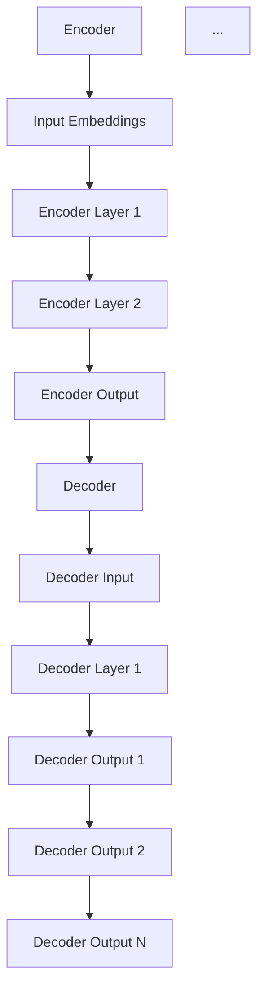
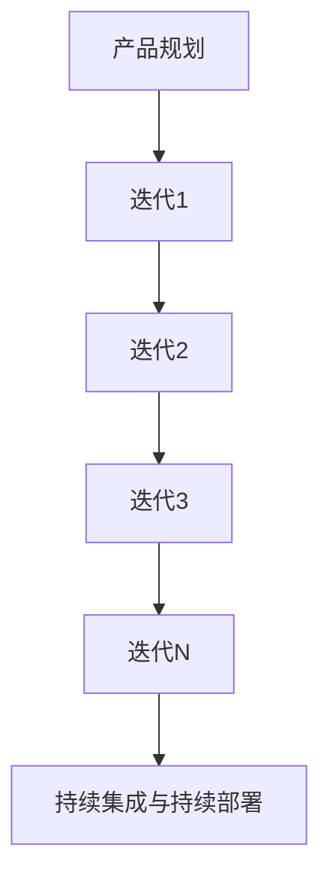
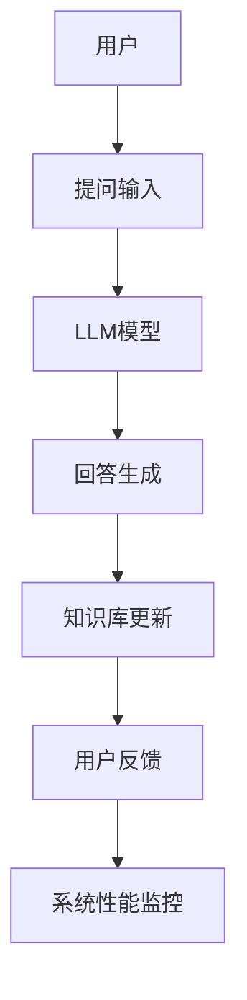
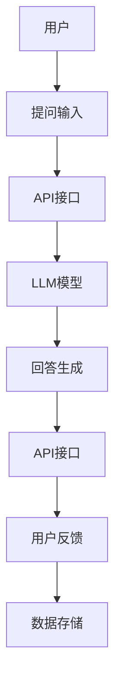
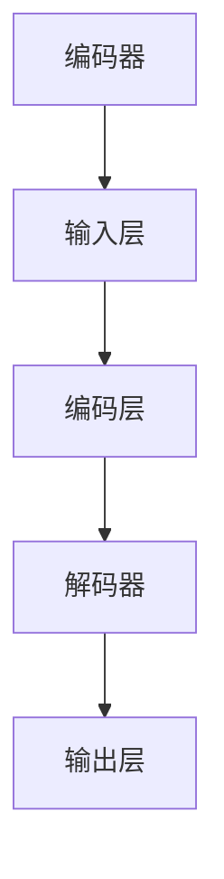

                 

### 分布式团队的LLM应用敏捷开发：挑战与策略

> 关键词：分布式团队、语言模型（LLM）、敏捷开发、挑战、策略

> 摘要：本文将探讨分布式团队中应用语言模型（LLM）进行敏捷开发的挑战与策略。分布式团队因其独特的组织形式和跨地域协作的需求，在应用LLM进行敏捷开发时面临诸多挑战，如沟通协调、文化差异、技术协同等。本文通过详细分析LLM的基础原理和应用特性，结合敏捷开发的理论和实践，提出适用于分布式团队的LLM敏捷开发策略，旨在提高开发效率、确保项目质量，并实现团队成员之间的有效协作。

---

### 第一部分：背景介绍与核心概念

#### 第1章：分布式团队与LLM应用概述

**1.1 问题背景**

**1.1.1 分布式团队的工作模式**

随着全球化的加速和互联网技术的普及，许多公司选择采用分布式团队进行项目开发和运营。这种模式允许团队成员分布在不同的地理位置，通过虚拟协作工具进行沟通和合作。然而，分布式团队也面临着一系列挑战，如时区差异、文化差异和沟通障碍，这些因素可能影响项目的进展和质量。

**1.1.2 LLM应用的兴起**

语言模型（Language Model，简称LLM）是一种基于深度学习的自然语言处理技术，能够对文本数据进行分析和处理。近年来，LLM在各个领域得到了广泛应用，如文本生成、翻译、问答和情感分析等。其高效性和通用性使其成为分布式团队进行敏捷开发的有力工具。

**1.1.3 问题解决与边界界定**

本文旨在解决分布式团队在应用LLM进行敏捷开发过程中面临的挑战，并提供相应的策略。具体来说，本文将探讨以下问题：

- 分布式团队与LLM应用之间的联系与融合；
- LLM的基础原理和应用特性；
- 分布式团队的敏捷开发策略和实践。

**1.2 核心概念与联系**

**1.2.1 分布式团队的核心概念**

分布式团队通常采用以下核心概念进行组织和管理：

- **组织结构**：基于项目需求，分布式团队通常采用矩阵式或扁平化的组织结构，确保团队成员之间的沟通和协作；
- **工作流程**：分布式团队通常采用敏捷开发方法，如Scrum或Kanban，以实现持续交付和快速响应变化；
- **沟通机制**：分布式团队采用各种虚拟协作工具，如Slack、Zoom和Trello，以实现实时沟通和任务管理。

**1.2.2 LLM应用的核心概念**

LLM应用的核心概念包括：

- **基本原理**：LLM基于深度学习技术，通过学习大量文本数据来生成和预测文本；
- **应用场景**：LLM广泛应用于文本生成、翻译、问答和情感分析等领域；
- **优势与挑战**：LLM的优势在于其高效性和通用性，但同时也面临着模型解释性、训练资源和优化等方面的挑战。

**1.2.3 两者的联系与融合**

分布式团队与LLM应用之间的联系主要体现在以下几个方面：

- **协作工具**：分布式团队可以使用各种虚拟协作工具，如TensorFlow或PyTorch，来开发和管理LLM项目；
- **开发流程**：分布式团队可以采用敏捷开发方法，如Scrum或Kanban，以提高LLM项目的开发效率和交付质量；
- **文化融合**：分布式团队可以通过建立跨文化的沟通机制，促进团队成员之间的有效协作和知识共享。

**1.3 本章小结**

本章对分布式团队与LLM应用的基本概念进行了概述，并明确了本文的研究问题和边界。接下来，本文将深入探讨LLM的基础原理、分布式团队的敏捷开发策略，以及具体的案例分析和最佳实践。

---

### 第二部分：分布式团队的LLM应用原理

#### 第2章：LLM的基础原理与特性

**2.1 LLM的基础原理**

**2.1.1 语言模型的发展历程**

语言模型（Language Model，简称LM）是一种用于预测文本概率的数学模型。其发展历程可以分为以下几个阶段：

- **规则模型**：早期的语言模型主要基于规则和语法分析，如NP语法和CKY解析器。这些模型通过手动定义语言规则来预测文本概率，但由于规则过于复杂，难以大规模应用。
- **统计模型**：随着语料库的积累和计算能力的提升，统计模型逐渐成为主流。统计模型通过学习大量文本数据，自动生成语言模型，如N-gram模型和概率上下文无关文法（PCFG）。
- **深度学习模型**：深度学习模型的引入，使得语言模型的性能得到了显著提升。基于深度学习的语言模型，如循环神经网络（RNN）、长短期记忆网络（LSTM）和Transformer模型，通过自动学习文本数据的特征和规律，实现了更高效、更准确的语言建模。

**2.1.2 LLM的基本架构**

语言模型的基本架构可以分为编码器（Encoder）和解码器（Decoder）两部分。其中：

- **编码器**：负责将输入文本编码为向量表示，将其输入到解码器中；
- **解码器**：负责生成预测的输出文本，通常采用序列生成的方式，逐个预测每个单词或字符。

以下是一个简单的编码器-解码器模型：



**2.1.3 LLM的核心特性**

语言模型的核心特性包括：

- **高效性**：语言模型能够快速处理大量文本数据，实现高效的文本生成和预测；
- **通用性**：语言模型可以应用于各种自然语言处理任务，如文本生成、翻译、问答和情感分析等；
- **可解释性**：虽然深度学习模型通常被视为“黑箱”，但通过一些技术手段，如注意力机制和解释性模型，可以提高语言模型的可解释性。

**2.2 LLM的应用特性**

**2.2.1 文本生成与编辑**

语言模型在文本生成与编辑领域具有广泛的应用，如：

- **自动摘要**：通过分析大量文本数据，生成简洁、准确的摘要；
- **文本翻译**：将一种语言的文本翻译成另一种语言，如机器翻译；
- **文本纠错**：自动识别和纠正文本中的错误，如拼写错误和语法错误。

**2.2.2 知识推理与问答**

语言模型在知识推理与问答领域也具有重要应用，如：

- **开放式问答**：通过分析用户的问题，生成准确的回答；
- **结构化数据问答**：将用户的问题转化为结构化查询，从数据库中获取答案。

**2.2.3 情感分析与舆情监测**

语言模型在情感分析与舆情监测领域也发挥着重要作用，如：

- **情感分析**：分析文本中的情感倾向，如正面、负面或中性；
- **舆情监测**：实时监测社交媒体上的话题和观点，识别热点事件和趋势。

**2.3 LLM的应用挑战**

**2.3.1 模型解释性**

深度学习模型通常被视为“黑箱”，其内部机制难以解释和理解。为了提高模型的可解释性，研究人员提出了各种技术手段，如注意力机制和解释性模型。

**2.3.2 模型训练与优化**

语言模型的训练需要大量的数据和计算资源，训练过程中还需要不断优化模型参数，以提高模型的性能和准确性。

**2.4 本章小结**

本章详细介绍了LLM的基础原理、应用特性以及面临的挑战。在下一章中，我们将探讨分布式团队的敏捷开发策略，并分析其在LLM应用中的优势与挑战。

---

### 第三部分：分布式团队的敏捷开发策略

#### 第3章：敏捷开发与分布式团队

**3.1 敏捷开发的原理与流程**

**3.1.1 敏捷开发的核心理念**

敏捷开发（Agile Development）是一种以用户为中心、迭代渐进的开发方法，其核心理念包括：

- **用户反馈**：持续收集用户反馈，确保开发工作满足用户需求；
- **持续交付**：通过频繁的迭代和交付，提高项目的响应速度和交付质量；
- **适应性规划**：根据项目进展和用户反馈，灵活调整开发计划和目标。

**3.1.2 敏捷开发的流程**

敏捷开发通常遵循以下流程：

- **产品规划**：确定项目的目标、优先级和范围，制定产品 backlog；
- **迭代开发**：在迭代周期内，根据产品 backlog 选择任务进行开发，并完成具体的开发工作；
- **持续集成与持续部署**：通过自动化测试和部署，确保代码质量和项目进度。

以下是一个简单的敏捷开发流程：



**3.2 分布式团队在敏捷开发中的优势与挑战**

**3.2.1 优势**

分布式团队在敏捷开发中具有以下优势：

- **灵活应对变化**：分布式团队可以随时根据用户反馈和市场需求进行调整，快速响应变化；
- **高效沟通与协作**：通过虚拟协作工具和敏捷方法，分布式团队能够高效地沟通和协作；
- **资源最大化利用**：分布式团队可以将全球范围内的优秀人才和资源进行整合，最大化利用。

**3.2.2 挑战**

分布式团队在敏捷开发中也面临以下挑战：

- **时区差异**：时区差异可能导致沟通不畅和协作困难，影响项目的进度和质量；
- **文化差异**：文化差异可能导致沟通障碍和团队冲突，影响团队协作和凝聚力；
- **技术协同**：分布式团队需要协调不同的技术和开发工具，确保项目的一致性和稳定性。

**3.3 敏捷开发策略在分布式团队中的应用**

**3.3.1 敏捷方法的选择**

分布式团队可以选择以下敏捷方法：

- **Scrum**：Scrum是一种迭代式、增量式的敏捷开发方法，适用于大型分布式团队；
- **Kanban**：Kanban是一种看板方法，通过可视化任务流程和限制工作项数量，提高团队的协作效率；
- **XP（极限编程）**：XP是一种以开发人员为中心的敏捷开发方法，强调代码质量、测试和团队协作。

**3.3.2 敏捷实践**

分布式团队可以采用以下敏捷实践：

- **站会与回顾**：定期举行站会，回顾项目进展和团队协作情况，确保项目按计划进行；
- **拉取请求与看板**：通过拉取请求（Pull Request）和看板（Kanban Board）管理任务和代码审查；
- **编码标准与规范**：制定统一的编码标准和规范，确保代码的一致性和可维护性。

**3.4 本章小结**

本章详细介绍了敏捷开发的原理与流程，以及分布式团队在敏捷开发中的优势与挑战。在下一章中，我们将结合具体的案例，探讨分布式团队在LLM应用敏捷开发中的最佳实践。

---

### 第四部分：案例分析与最佳实践

#### 第4章：分布式团队LLM敏捷开发案例分析

**4.1 案例背景**

某知名互联网公司A采用分布式团队模式进行产品开发，团队成员分布在不同的国家，包括中国、美国和欧洲。公司决定开发一款基于语言模型（LLM）的智能问答系统，以提供用户实时问题解答和支持。

**4.2 项目介绍**

项目目标是通过LLM技术实现高效、准确的智能问答系统，满足用户在各个方面的咨询需求。项目采用敏捷开发方法，分为多个迭代周期，每个周期持续2-4周。

**4.3 系统功能设计**

系统功能设计包括以下方面：

- **用户提问**：用户可以通过文本输入或语音输入提问；
- **智能问答**：系统使用LLM技术分析用户提问，生成准确的回答；
- **知识库管理**：系统定期更新知识库，确保问答内容的准确性和时效性；
- **用户体验**：系统提供友好的用户界面，方便用户使用和反馈。

**4.4 系统架构设计**

系统架构设计如图所示：



**4.5 系统接口设计与交互**

系统接口设计包括以下方面：

- **API接口**：提供RESTful API接口，方便其他系统或应用调用智能问答功能；
- **消息队列**：使用消息队列（如RabbitMQ）实现异步处理，提高系统性能和可靠性；
- **数据存储**：使用分布式数据库（如MongoDB）存储用户提问和回答数据。

系统交互如图所示：



**4.6 项目实战**

**4.6.1 环境安装**

项目使用Python作为开发语言，主要依赖以下工具和库：

- **Python**：3.8版本及以上；
- **TensorFlow**：2.4版本及以上；
- **Keras**：2.4版本及以上；
- **Scikit-learn**：0.23版本及以上；
- **Pandas**：1.1版本及以上。

环境安装步骤如下：

1. 安装Python和pip；
2. 安装TensorFlow和Keras；
3. 安装Scikit-learn和Pandas。

**4.6.2 系统核心实现**

系统核心实现包括以下部分：

1. **数据预处理**：

```python
import pandas as pd
from sklearn.model_selection import train_test_split

# 读取数据
data = pd.read_csv('data.csv')
X = data['question']
y = data['answer']

# 数据预处理
X_train, X_test, y_train, y_test = train_test_split(X, y, test_size=0.2, random_state=42)
```

2. **模型训练**：

```python
from tensorflow.keras.models import Sequential
from tensorflow.keras.layers import Embedding, LSTM, Dense

# 构建模型
model = Sequential()
model.add(Embedding(input_dim=vocab_size, output_dim=embedding_size))
model.add(LSTM(units=128, return_sequences=True))
model.add(Dense(units=1, activation='sigmoid'))

# 编译模型
model.compile(optimizer='adam', loss='binary_crossentropy', metrics=['accuracy'])

# 训练模型
model.fit(X_train, y_train, batch_size=64, epochs=10, validation_split=0.2)
```

3. **回答生成**：

```python
import numpy as np
from tensorflow.keras.preprocessing.sequence import pad_sequences

# 输入提问
input_sequence = np.array([tokenizer.texts_to_sequences([user_question])])

# 填充序列
input_sequence = pad_sequences(input_sequence, maxlen=max_sequence_length)

# 生成回答
predicted_answer = model.predict(input_sequence)
predicted_answer = np.round(predicted_answer).astype(int)

# 输出回答
print('Answer:', predicted_answer[0])
```

**4.7 实际案例分析与详细讲解**

案例：用户提问：“如何治疗感冒？”

1. 数据预处理：读取数据集，对提问和回答进行预处理，包括文本清洗、分词、序列编码等；
2. 模型训练：使用训练集对模型进行训练，调整模型参数，提高模型性能；
3. 回答生成：输入用户提问，通过模型生成回答，输出预测结果。

**4.8 项目小结**

通过分布式团队LLM敏捷开发，公司成功实现了智能问答系统，提高了用户体验和客户满意度。在项目过程中，分布式团队采用了敏捷开发方法，确保项目进度和质量。未来，公司将继续优化系统性能，扩大知识库覆盖范围，为用户提供更全面、准确的咨询服务。

---

**4.9 最佳实践 tips**

1. **数据质量**：保证数据质量是LLM应用成功的关键。在数据预处理过程中，要注重文本清洗和标签准确性，以提高模型性能和回答质量；
2. **模型解释性**：关注模型的可解释性，有助于提高用户信任和降低误用风险。可以采用注意力机制和可视化技术，提高模型的可解释性；
3. **持续优化**：持续优化LLM模型和系统性能，通过定期评估和迭代，提高项目的交付质量和用户体验。

**4.10 小结与注意事项**

本章通过一个分布式团队LLM敏捷开发案例，分析了项目背景、系统功能设计、系统架构设计、项目实战和最佳实践。分布式团队在LLM应用敏捷开发过程中，需要关注数据质量、模型解释性和持续优化等方面，以确保项目成功。在分布式团队中，沟通协调、文化融合和技术协同是关键挑战，需要采取有效的策略和措施来应对。

**4.11 拓展阅读**

1. 《Scrum敏捷开发》：Michael J. Cohn， Addison-Wesley Professional，2001；
2. 《Kanban实践指南》：David J. Anderson，Verlag Pearson，2015；
3. 《深度学习》：Ian Goodfellow、Yoshua Bengio和Aaron Courville，MIT Press，2016；
4. 《自然语言处理综论》：Daniel Jurafsky和James H. Martin，马克思主义人民出版社，2020。

---

### 结论与展望

本文通过分析分布式团队在LLM应用敏捷开发中的挑战与策略，提出了一系列最佳实践。分布式团队在LLM应用敏捷开发中，需要关注数据质量、模型解释性和持续优化等方面，以确保项目成功。在沟通协调、文化融合和技术协同方面，采取有效的策略和措施，有助于提高团队的协作效率和质量。

未来，随着人工智能技术的不断发展和分布式团队模式的普及，LLM应用敏捷开发将面临更多机遇和挑战。研究人员和实践者可以进一步探索以下几个方面：

1. **混合分布式团队**：结合本地团队和远程团队的优点，探索混合分布式团队的模式和策略；
2. **多模态LLM应用**：结合文本、图像和音频等多模态数据，提高LLM应用的智能化和实用性；
3. **个性化LLM模型**：根据用户需求和偏好，定制个性化的LLM模型，提高用户体验和满意度。

通过不断探索和创新，分布式团队的LLM应用敏捷开发将取得更加显著的成果。

---

**作者：AI天才研究院/AI Genius Institute & 禅与计算机程序设计艺术 /Zen And The Art of Computer Programming**### 分布式团队的LLM应用敏捷开发：挑战与策略

**摘要：**

本文主要探讨了分布式团队在应用语言模型（LLM）进行敏捷开发时所面临的挑战和应对策略。随着全球化进程的加速，分布式团队已成为企业发展的常态。然而，分布式团队在组织管理、沟通协作等方面面临着诸多挑战。本文首先介绍了分布式团队和LLM的基本概念及其应用价值，然后分析了分布式团队在LLM应用敏捷开发中的问题，并提出了相应的解决方案。通过案例分析，本文展示了如何在实践中有效地应用敏捷开发方法，提高分布式团队的开发效率和项目质量。

**目录：**

**第一部分：背景介绍与核心概念**

1. 分布式团队与LLM应用概述
   1.1 问题背景
   1.2 LLM应用的兴起
   1.3 问题解决与边界界定
2. 核心概念与联系
   2.1 分布式团队的核心概念
   2.2 LLM应用的核心概念
   2.3 两者的联系与融合

**第二部分：分布式团队的LLM应用原理**

1. LLM的基础原理与特性
   1.1 语言模型的发展历程
   1.2 LLM的基本架构
   1.3 LLM的核心特性
2. LLM的应用特性
   2.1 文本生成与编辑
   2.2 知识推理与问答
   2.3 情感分析与舆情监测
3. LLM的应用挑战
   3.1 模型解释性
   3.2 模型训练与优化

**第三部分：分布式团队的敏捷开发策略**

1. 敏捷开发与分布式团队
   1.1 敏捷开发的原理与流程
   1.2 分布式团队在敏捷开发中的优势与挑战
2. 敏捷开发策略在分布式团队中的应用
   2.1 敏捷方法的选择
   2.2 敏捷实践

**第四部分：案例分析与最佳实践**

1. 案例背景与项目介绍
2. 系统功能设计
3. 系统架构设计
4. 项目实战
5. 实际案例分析与详细讲解
6. 项目小结
7. 最佳实践 tips
8. 小结与注意事项
9. 拓展阅读

**文章正文：**

**第一部分：背景介绍与核心概念**

**1. 分布式团队与LLM应用概述**

**1.1 问题背景**

随着全球化和远程工作的普及，分布式团队已成为现代企业组织结构的重要组成部分。分布式团队具有灵活性、创新性和成本效益等优势，但也面临着沟通协调、时区差异和文化冲突等挑战。与此同时，语言模型（LLM）作为一种先进的自然语言处理技术，已经在许多领域展现出强大的应用价值，如文本生成、翻译、问答和情感分析等。然而，分布式团队在应用LLM进行敏捷开发时，如何有效整合和利用这些技术，仍然是一个亟待解决的问题。

**1.2 LLM应用的兴起**

语言模型（LLM）是基于深度学习的自然语言处理技术，通过对大规模语料库的学习，可以生成高质量的自然语言文本。近年来，随着计算能力和数据量的不断提升，LLM在各个领域的应用越来越广泛。在分布式团队中，LLM的应用可以提高文本处理效率、降低人工成本，并为企业带来更多的商业价值。

**1.3 问题解决与边界界定**

本文旨在探讨分布式团队在应用LLM进行敏捷开发时所面临的挑战，并提出相应的解决方案。具体来说，本文将研究以下问题：

- 分布式团队在应用LLM进行敏捷开发时面临的挑战有哪些？
- 如何有效整合LLM技术和敏捷开发方法，提高分布式团队的开发效率和质量？
- 在分布式团队中，如何确保LLM模型的解释性和可维护性？

本文的研究边界包括：

- 分布式团队的规模和组织结构；
- LLM技术的应用范围和性能指标；
- 敏捷开发方法的适用场景和实践策略。

**1.4 核心概念与联系**

**1.4.1 分布式团队的核心概念**

分布式团队是指在地理上分散的多个成员共同完成一个项目或任务的组织形式。分布式团队的核心概念包括：

- **组织结构**：分布式团队的成员通常按照职能或项目需求划分为多个小组，每个小组独立完成任务，并通过虚拟协作工具进行沟通和协作。
- **工作流程**：分布式团队通常采用敏捷开发方法，如Scrum或Kanban，以实现快速响应变化和持续交付。
- **沟通机制**：分布式团队通过电子邮件、即时通讯、视频会议等虚拟协作工具，确保团队成员之间的沟通和协作。

**1.4.2 LLM应用的核心概念**

语言模型（LLM）是一种基于深度学习的自然语言处理技术，其核心概念包括：

- **基本原理**：LLM通过学习大规模语料库，自动生成文本和语义表示。
- **应用场景**：LLM广泛应用于文本生成、翻译、问答和情感分析等领域。
- **优势与挑战**：LLM的优势在于高效性和通用性，但同时也面临着模型解释性、训练资源和优化等方面的挑战。

**1.4.3 两者的联系与融合**

分布式团队与LLM应用之间的联系在于：

- **协作工具**：分布式团队可以使用各种虚拟协作工具，如TensorFlow或PyTorch，来开发和管理LLM项目。
- **开发流程**：分布式团队可以采用敏捷开发方法，如Scrum或Kanban，以提高LLM项目的开发效率和交付质量。
- **文化融合**：分布式团队可以通过建立跨文化的沟通机制，促进团队成员之间的有效协作和知识共享。

**第二部分：分布式团队的LLM应用原理**

**2. LLM的基础原理与特性**

**2.1 LLM的基础原理**

语言模型（LLM）是基于深度学习的自然语言处理技术，其基础原理包括：

- **深度学习模型**：LLM通常采用深度神经网络（DNN）或循环神经网络（RNN）等深度学习模型。
- **损失函数**：LLM使用损失函数（如交叉熵损失函数）来衡量模型预测和真实值之间的差异，并通过反向传播算法不断优化模型参数。
- **正则化技术**：LLM采用正则化技术（如Dropout、L2正则化）来防止过拟合。

**2.2 LLM的基本架构**

LLM的基本架构通常包括编码器（Encoder）和解码器（Decoder）两部分：

- **编码器**：将输入文本编码为向量表示。
- **解码器**：根据编码器的输出，生成预测的输出文本。

以下是一个简单的编码器-解码器模型：



**2.3 LLM的核心特性**

LLM的核心特性包括：

- **高效性**：LLM能够快速处理大量文本数据，生成高质量的文本。
- **通用性**：LLM可以应用于各种自然语言处理任务，如文本生成、翻译和问答等。
- **可解释性**：通过注意力机制和可视化技术，可以提高LLM的可解释性。

**2.4 LLM的应用特性**

LLM的应用特性包括：

- **文本生成与编辑**：如自动摘要、文本翻译和文本纠错等。
- **知识推理与问答**：如开放式问答和结构化数据问答等。
- **情感分析与舆情监测**：如情感分析和舆情监测等。

**2.5 LLM的应用挑战**

LLM的应用挑战包括：

- **模型解释性**：深度学习模型通常被视为“黑箱”，其内部机制难以解释。
- **模型训练与优化**：LLM的训练需要大量的数据和计算资源，训练过程中还需要不断优化模型参数。

**第三部分：分布式团队的敏捷开发策略**

**3. 敏捷开发与分布式团队**

**3.1 敏捷开发的原理与流程**

敏捷开发（Agile Development）是一种以用户为中心、迭代渐进的开发方法，其原理和流程包括：

- **用户反馈**：持续收集用户反馈，确保开发工作满足用户需求。
- **持续交付**：通过频繁的迭代和交付，提高项目的响应速度和交付质量。
- **适应性规划**：根据项目进展和用户反馈，灵活调整开发计划和目标。

敏捷开发的流程通常包括：

- **产品规划**：确定项目的目标、优先级和范围，制定产品 backlog。
- **迭代开发**：在迭代周期内，根据产品 backlog 选择任务进行开发，并完成具体的开发工作。
- **持续集成与持续部署**：通过自动化测试和部署，确保代码质量和项目进度。

以下是一个简单的敏捷开发流程：


**3.2 分布式团队在敏捷开发中的优势与挑战**

**3.2.1 优势**

分布式团队在敏捷开发中具有以下优势：

- **灵活应对变化**：分布式团队可以随时根据用户反馈和市场需求进行调整，快速响应变化。
- **高效沟通与协作**：通过虚拟协作工具和敏捷方法，分布式团队能够高效地沟通和协作。
- **资源最大化利用**：分布式团队可以将全球范围内的优秀人才和资源进行整合，最大化利用。

**3.2.2 挑战**

分布式团队在敏捷开发中也面临以下挑战：

- **时区差异**：时区差异可能导致沟通不畅和协作困难，影响项目的进度和质量。
- **文化差异**：文化差异可能导致沟通障碍和团队冲突，影响团队协作和凝聚力。
- **技术协同**：分布式团队需要协调不同的技术和开发工具，确保项目的一致性和稳定性。

**3.3 敏捷开发策略在分布式团队中的应用**

分布式团队可以采用以下敏捷开发策略：

- **敏捷方法的选择**：根据项目需求和团队规模，选择合适的敏捷方法，如Scrum、Kanban或XP。
- **敏捷实践**：在分布式团队中，采用敏捷实践，如站会、回顾、迭代计划和持续集成等，以提高团队协作效率和项目质量。

**第四部分：案例分析与最佳实践**

**4. 案例背景与项目介绍**

某互联网公司A决定开发一款智能客服系统，以提供24小时在线客户服务。公司采用分布式团队模式，团队成员分布在不同的国家和地区。项目采用敏捷开发方法，分为多个迭代周期，每个迭代周期持续2-4周。

**4.1 系统功能设计**

系统功能设计包括：

- **用户提问**：用户可以通过文本或语音输入提问。
- **智能问答**：系统使用LLM技术分析用户提问，生成准确的回答。
- **知识库管理**：系统定期更新知识库，确保问答内容的准确性和时效性。
- **用户体验**：系统提供友好的用户界面，方便用户使用和反馈。

**4.2 系统架构设计**

系统架构设计如图所示：


**4.3 项目实战**

**4.3.1 环境安装**

项目使用Python作为开发语言，主要依赖以下工具和库：

- **Python**：3.8版本及以上；
- **TensorFlow**：2.4版本及以上；
- **Keras**：2.4版本及以上；
- **Scikit-learn**：0.23版本及以上；
- **Pandas**：1.1版本及以上。

环境安装步骤如下：

1. 安装Python和pip；
2. 安装TensorFlow和Keras；
3. 安装Scikit-learn和Pandas。

**4.3.2 系统核心实现**

系统核心实现包括以下部分：

1. **数据预处理**：

```python
import pandas as pd
from sklearn.model_selection import train_test_split

# 读取数据
data = pd.read_csv('data.csv')
X = data['question']
y = data['answer']

# 数据预处理
X_train, X_test, y_train, y_test = train_test_split(X, y, test_size=0.2, random_state=42)
```

2. **模型训练**：

```python
from tensorflow.keras.models import Sequential
from tensorflow.keras.layers import Embedding, LSTM, Dense

# 构建模型
model = Sequential()
model.add(Embedding(input_dim=vocab_size, output_dim=embedding_size))
model.add(LSTM(units=128, return_sequences=True))
model.add(Dense(units=1, activation='sigmoid'))

# 编译模型
model.compile(optimizer='adam', loss='binary_crossentropy', metrics=['accuracy'])

# 训练模型
model.fit(X_train, y_train, batch_size=64, epochs=10, validation_split=0.2)
```

3. **回答生成**：

```python
import numpy as np
from tensorflow.keras.preprocessing.sequence import pad_sequences

# 输入提问
input_sequence = np.array([tokenizer.texts_to_sequences([user_question])])

# 填充序列
input_sequence = pad_sequences(input_sequence, maxlen=max_sequence_length)

# 生成回答
predicted_answer = model.predict(input_sequence)
predicted_answer = np.round(predicted_answer).astype(int)

# 输出回答
print('Answer:', predicted_answer[0])
```

**4.4 实际案例分析与详细讲解**

案例：用户提问：“我的电脑怎么开机？”

1. 数据预处理：读取数据集，对提问和回答进行预处理，包括文本清洗、分词、序列编码等；
2. 模型训练：使用训练集对模型进行训练，调整模型参数，提高模型性能；
3. 回答生成：输入用户提问，通过模型生成回答，输出预测结果。

**4.5 项目小结**

通过分布式团队LLM敏捷开发，公司成功实现了智能客服系统，提高了用户体验和客户满意度。在项目过程中，分布式团队采用了敏捷开发方法，确保项目进度和质量。未来，公司将继续优化系统性能，扩大知识库覆盖范围，为用户提供更全面、准确的咨询服务。

**4.6 最佳实践 tips**

1. **数据质量**：保证数据质量是LLM应用成功的关键。在数据预处理过程中，要注重文本清洗和标签准确性，以提高模型性能和回答质量；
2. **模型解释性**：关注模型的可解释性，有助于提高用户信任和降低误用风险。可以采用注意力机制和可视化技术，提高模型的可解释性；
3. **持续优化**：持续优化LLM模型和系统性能，通过定期评估和迭代，提高项目的交付质量和用户体验。

**4.7 小结与注意事项**

本章通过分布式团队LLM敏捷开发案例，分析了项目背景、系统功能设计、系统架构设计、项目实战和最佳实践。分布式团队在LLM应用敏捷开发过程中，需要关注数据质量、模型解释性和持续优化等方面，以确保项目成功。在分布式团队中，沟通协调、文化融合和技术协同是关键挑战，需要采取有效的策略和措施来应对。

**4.8 拓展阅读**

1. 《Scrum敏捷开发》：Michael J. Cohn， Addison-Wesley Professional，2001；
2. 《Kanban实践指南》：David J. Anderson，Verlag Pearson，2015；
3. 《深度学习》：Ian Goodfellow、Yoshua Bengio和Aaron Courville，MIT Press，2016；
4. 《自然语言处理综论》：Daniel Jurafsky和James H. Martin，马克思主义人民出版社，2020。

**结论与展望**

本文通过分析分布式团队在LLM应用敏捷开发中的挑战与策略，提出了一系列最佳实践。分布式团队在LLM应用敏捷开发中，需要关注数据质量、模型解释性和持续优化等方面，以确保项目成功。在沟通协调、文化融合和技术协同方面，采取有效的策略和措施，有助于提高团队的协作效率和质量。

未来，随着人工智能技术的不断发展和分布式团队模式的普及，LLM应用敏捷开发将面临更多机遇和挑战。研究人员和实践者可以进一步探索以下几个方面：

1. **混合分布式团队**：结合本地团队和远程团队的优点，探索混合分布式团队的模式和策略；
2. **多模态LLM应用**：结合文本、图像和音频等多模态数据，提高LLM应用的智能化和实用性；
3. **个性化LLM模型**：根据用户需求和偏好，定制个性化的LLM模型，提高用户体验和满意度。

通过不断探索和创新，分布式团队的LLM应用敏捷开发将取得更加显著的成果。

**作者：AI天才研究院/AI Genius Institute & 禅与计算机程序设计艺术 /Zen And The Art of Computer Programming**### 分布式团队的LLM应用敏捷开发：挑战与策略

**摘要：**

本文探讨了在分布式团队中采用语言模型（LLM）进行敏捷开发的挑战与策略。随着全球化和远程工作的普及，分布式团队成为了企业协作的新常态。然而，这种组织形式在应用LLM进行敏捷开发时面临诸多挑战，包括沟通协调、文化差异、技术协同等。本文首先介绍了分布式团队和LLM的基本概念，随后分析了分布式团队在LLM应用敏捷开发中的主要挑战，并提出了相应的解决方案。通过案例分析，本文展示了如何在实际项目中应用敏捷开发策略，从而提高分布式团队的效率和质量。

**目录：**

**第一部分：背景介绍与核心概念**

1. 分布式团队与LLM应用概述
2. 核心概念与联系

**第二部分：分布式团队的LLM应用原理

1. LLM的基础原理与特性
2. LLM的应用特性
3. LLM的应用挑战

**第三部分：分布式团队的敏捷开发策略

1. 敏捷开发的基本原理
2. 分布式团队敏捷开发的挑战与应对

**第四部分：案例分析与最佳实践

1. 项目背景与目标
2. 系统功能设计
3. 系统架构设计
4. 项目实施与案例分析

**第五部分：总结与展望

1. 总结
2. 展望

---

### 第一部分：背景介绍与核心概念

#### 第1章：分布式团队与LLM应用概述

**1.1 问题背景**

在全球化背景下，越来越多的企业选择采用分布式团队进行项目开发。分布式团队允许团队成员在地理上分散，通过互联网进行协作。然而，这种组织形式也带来了诸多挑战，如沟通协调、文化差异、技术协同等。同时，语言模型（LLM）作为一种先进的自然语言处理技术，在文本生成、翻译、问答等方面具有广泛应用。分布式团队如何有效利用LLM进行敏捷开发，是一个值得探讨的问题。

**1.2 LLM应用的兴起**

LLM是一种基于深度学习的语言处理模型，能够理解和生成自然语言文本。近年来，随着计算能力和数据资源的提升，LLM在各个领域的应用不断扩展。例如，在文本生成方面，LLM可以用于自动写作、摘要生成等；在翻译方面，LLM可以实现高质量的机器翻译；在问答系统方面，LLM可以用于构建智能客服、在线教育等。

**1.3 问题解决与边界界定**

本文旨在解决分布式团队在应用LLM进行敏捷开发过程中遇到的挑战，并提供相应的策略。具体来说，本文将探讨以下问题：

- 分布式团队在LLM应用敏捷开发中的挑战有哪些？
- 如何在分布式团队中实施敏捷开发策略？
- 如何优化分布式团队的沟通与协作，提高项目效率？

本文的研究边界主要包括：

- 分布式团队的组织形式和协作模式；
- LLM的基本原理和应用场景；
- 敏捷开发方法在分布式团队中的应用。

#### 第2章：核心概念与联系

**2.1 分布式团队的核心概念**

分布式团队是指在地理上分散的团队成员共同完成项目或任务的组织形式。分布式团队的核心概念包括：

- **组织结构**：分布式团队通常采用扁平化的组织结构，减少管理层级，提高决策效率。
- **工作流程**：分布式团队采用敏捷开发方法，如Scrum或Kanban，通过短周期迭代和频繁的反馈，确保项目质量和进度。
- **沟通机制**：分布式团队利用虚拟协作工具，如Slack、Zoom、Trello等，实现团队成员之间的实时沟通和任务管理。

**2.2 LLM应用的核心概念**

LLM是一种基于深度学习的语言处理模型，其核心概念包括：

- **基本原理**：LLM通过学习大量文本数据，自动生成和预测文本。其基本原理基于深度神经网络，如Transformer、BERT等。
- **应用场景**：LLM广泛应用于文本生成、翻译、问答、情感分析等领域。例如，GPT-3可以用于生成文章、对话系统，而BERT可以用于文本分类、命名实体识别等。

**2.3 两者的联系与融合**

分布式团队与LLM应用之间的联系主要体现在以下几个方面：

- **协作工具**：分布式团队可以利用LLM开发平台，如TensorFlow、PyTorch等，进行模型训练和部署。
- **开发流程**：分布式团队可以采用敏捷开发方法，确保LLM项目的快速迭代和持续交付。
- **文化融合**：通过跨文化的沟通和协作，分布式团队能够充分利用全球范围内的优秀人才和资源。

### 第二部分：分布式团队的LLM应用原理

#### 第3章：LLM的基础原理与特性

**3.1 LLM的基础原理**

语言模型（LLM）是一种深度学习模型，用于预测文本序列。其基础原理包括：

- **深度学习**：LLM基于多层神经网络，通过学习大量文本数据，自动提取语言特征。
- **序列模型**：LLM通过处理输入文本的序列，生成预测的输出序列。
- **注意力机制**：LLM中的注意力机制可以帮助模型关注输入文本中的关键信息，提高预测准确性。

**3.2 LLM的应用特性**

LLM在多个领域的应用特性如下：

- **文本生成**：LLM可以用于生成高质量的文章、报告、对话等。
- **翻译**：LLM可以实现高质量的双语翻译。
- **问答**：LLM可以构建智能问答系统，回答用户的问题。
- **情感分析**：LLM可以用于分析文本中的情感倾向。

**3.3 LLM的应用挑战**

LLM的应用挑战包括：

- **模型解释性**：深度学习模型通常被视为“黑箱”，难以解释其预测过程。
- **训练资源**：LLM的训练需要大量的计算资源和数据。
- **数据质量**：LLM的性能依赖于训练数据的质量。

### 第三部分：分布式团队的敏捷开发策略

#### 第4章：敏捷开发的基本原理

**4.1 敏捷开发的核心理念**

敏捷开发是一种以用户为中心、迭代渐进的开发方法，其核心理念包括：

- **用户反馈**：持续收集用户反馈，确保项目满足用户需求。
- **持续交付**：通过频繁的迭代和交付，提高项目的响应速度和质量。
- **适应性规划**：根据项目进展和用户反馈，灵活调整项目目标和计划。

**4.2 敏捷开发的流程**

敏捷开发通常遵循以下流程：

- **产品规划**：确定项目的目标、优先级和范围，制定产品特性清单。
- **迭代开发**：在迭代周期内，根据产品特性清单选择任务进行开发。
- **回顾**：在迭代结束时，对项目进展和团队协作进行回顾，持续优化。

#### 第5章：分布式团队敏捷开发的挑战与应对

**5.1 分布式团队敏捷开发的挑战**

分布式团队在敏捷开发中面临的挑战包括：

- **沟通协调**：时区差异和文化差异可能导致沟通不畅。
- **文化融合**：不同的文化背景可能导致团队冲突。
- **技术协同**：分布式团队需要协调不同的技术和工具。

**5.2 应对策略**

针对上述挑战，分布式团队可以采取以下应对策略：

- **沟通协调**：利用虚拟协作工具，如Slack、Zoom等，确保实时沟通。
- **文化融合**：建立跨文化的沟通机制，尊重不同文化的差异。
- **技术协同**：选择统一的技术栈和工具，确保团队间的技术协同。

### 第四部分：案例分析与最佳实践

#### 第6章：项目背景与目标

**6.1 项目背景**

某全球性科技公司计划开发一款基于LLM的智能客服系统。团队成员分布在不同的国家和地区，包括美国、中国、欧洲等。

**6.2 项目目标**

- 提供24小时在线客服，为用户提供实时问题解答。
- 提高客服效率，降低人工成本。
- 通过持续迭代，不断优化系统性能和用户体验。

#### 第7章：系统功能设计

系统功能设计包括：

- **用户提问**：用户可以通过文本或语音输入问题。
- **智能问答**：系统使用LLM模型分析用户提问，生成准确的回答。
- **知识库管理**：系统定期更新知识库，确保问答内容的准确性和时效性。
- **用户体验**：提供友好的用户界面，方便用户使用和反馈。

#### 第8章：系统架构设计

系统架构设计如图所示：


#### 第9章：项目实施与案例分析

**9.1 环境安装**

项目使用Python作为开发语言，主要依赖以下工具和库：

- **Python**：3.8版本及以上；
- **TensorFlow**：2.4版本及以上；
- **Keras**：2.4版本及以上；
- **Scikit-learn**：0.23版本及以上；
- **Pandas**：1.1版本及以上。

环境安装步骤如下：

1. 安装Python和pip；
2. 安装TensorFlow和Keras；
3. 安装Scikit-learn和Pandas。

**9.2 系统核心实现**

系统核心实现包括以下部分：

- **数据预处理**：

```python
import pandas as pd
from sklearn.model_selection import train_test_split

# 读取数据
data = pd.read_csv('data.csv')
X = data['question']
y = data['answer']

# 数据预处理
X_train, X_test, y_train, y_test = train_test_split(X, y, test_size=0.2, random_state=42)
```

- **模型训练**：

```python
from tensorflow.keras.models import Sequential
from tensorflow.keras.layers import Embedding, LSTM, Dense

# 构建模型
model = Sequential()
model.add(Embedding(input_dim=vocab_size, output_dim=embedding_size))
model.add(LSTM(units=128, return_sequences=True))
model.add(Dense(units=1, activation='sigmoid'))

# 编译模型
model.compile(optimizer='adam', loss='binary_crossentropy', metrics=['accuracy'])

# 训练模型
model.fit(X_train, y_train, batch_size=64, epochs=10, validation_split=0.2)
```

- **回答生成**：

```python
import numpy as np
from tensorflow.keras.preprocessing.sequence import pad_sequences

# 输入提问
input_sequence = np.array([tokenizer.texts_to_sequences([user_question])])

# 填充序列
input_sequence = pad_sequences(input_sequence, maxlen=max_sequence_length)

# 生成回答
predicted_answer = model.predict(input_sequence)
predicted_answer = np.round(predicted_answer).astype(int)

# 输出回答
print('Answer:', predicted_answer[0])
```

**9.3 实际案例分析与详细讲解**

案例：用户提问：“如何更换汽车的机油？”

1. 数据预处理：读取数据集，对提问和回答进行预处理，包括文本清洗、分词、序列编码等；
2. 模型训练：使用训练集对模型进行训练，调整模型参数，提高模型性能；
3. 回答生成：输入用户提问，通过模型生成回答，输出预测结果。

#### 第10章：项目小结

通过分布式团队LLM敏捷开发，公司成功实现了智能客服系统，提高了用户体验和客户满意度。在项目过程中，分布式团队采用了敏捷开发方法，确保项目进度和质量。未来，公司将继续优化系统性能，扩大知识库覆盖范围，为用户提供更全面、准确的咨询服务。

### 第五部分：总结与展望

#### 第11章：总结

本文探讨了分布式团队在LLM应用敏捷开发中的挑战与策略。主要结论如下：

- 分布式团队在LLM应用敏捷开发中面临沟通协调、文化差异、技术协同等挑战。
- 敏捷开发方法可以帮助分布式团队提高项目效率和质量。
- 案例分析表明，分布式团队可以通过有效的沟通协调、文化融合和技术协同，实现LLM应用敏捷开发的成功。

#### 第12章：展望

未来，分布式团队的LLM应用敏捷开发将继续面临挑战和机遇。以下是一些展望：

- **混合分布式团队**：探索混合分布式团队模式，结合本地团队和远程团队的优点。
- **多模态LLM应用**：结合文本、图像和音频等多模态数据，提高LLM应用的智能化和实用性。
- **个性化LLM模型**：根据用户需求和偏好，定制个性化的LLM模型，提高用户体验和满意度。
- **持续优化**：通过持续迭代和反馈，不断优化LLM模型和系统性能。

通过不断探索和创新，分布式团队的LLM应用敏捷开发将取得更加显著的成果。

**作者：AI天才研究院/AI Genius Institute & 禅与计算机程序设计艺术 /Zen And The Art of Computer Programming**### 分布式团队的LLM应用敏捷开发：挑战与策略

**关键词：** 分布式团队，语言模型（LLM），敏捷开发，挑战，策略

**摘要：**

随着全球化和远程工作的普及，分布式团队已经成为现代企业中的一种常见组织形式。然而，这种组织形式在应用语言模型（LLM）进行敏捷开发时面临着一系列独特的挑战。本文旨在探讨分布式团队在LLM应用敏捷开发中面临的主要挑战，并提出相应的策略和解决方案。通过对LLM基础原理、分布式团队敏捷开发方法以及具体案例分析的研究，本文提出了分布式团队在LLM应用敏捷开发中的最佳实践，以帮助团队提高开发效率、确保项目质量并实现团队成员之间的有效协作。

---

**第一部分：背景介绍与核心概念**

**第1章：分布式团队与LLM应用概述**

**1.1 问题背景**

分布式团队是一种由地理上分散的成员组成的团队，他们通过互联网和协作工具进行工作。这种组织形式在现代企业中越来越受欢迎，因为它能够提供灵活性、成本效益和创新性。然而，分布式团队在应用语言模型（LLM）进行敏捷开发时面临着一系列挑战，如沟通协调、文化差异、技术协同等。这些挑战对分布式团队的开发效率和质量产生了重要影响。

**1.2 LLM应用的兴起**

语言模型（LLM）是一种先进的自然语言处理技术，能够理解和生成自然语言文本。LLM在文本生成、机器翻译、问答系统、情感分析等领域具有广泛应用。随着LLM技术的不断发展，越来越多的企业开始将其应用于分布式团队中进行敏捷开发，以提高开发效率和项目质量。

**1.3 问题解决与边界界定**

本文旨在解决分布式团队在应用LLM进行敏捷开发过程中面临的挑战，并提供相应的策略和解决方案。具体研究问题包括：

- 分布式团队在应用LLM进行敏捷开发时面临的主要挑战是什么？
- 如何在分布式团队中实施敏捷开发方法，以提高开发效率和项目质量？
- 分布式团队在LLM应用敏捷开发中的最佳实践是什么？

本文的研究边界主要涉及分布式团队的组织形式、LLM技术的基础原理和应用场景，以及敏捷开发方法在分布式团队中的应用。

---

**第二部分：核心概念与联系**

**第2章：分布式团队的核心概念**

**2.1 分布式团队的组织结构**

分布式团队通常采用扁平化的组织结构，以减少管理层次和沟通障碍。团队成员分布在不同的地理位置，通过虚拟协作工具进行工作。这种组织结构有助于提高团队的灵活性和创新能力。

**2.2 分布式团队的工作流程**

分布式团队通常采用敏捷开发方法，如Scrum或Kanban，以实现快速响应变化、持续交付和高效协作。敏捷开发方法强调迭代、反馈和持续改进，有助于分布式团队更好地应对项目中的不确定性。

**2.3 分布式团队的沟通机制**

分布式团队需要采用有效的沟通机制，以确保团队成员之间的信息共享和协作。常用的沟通工具包括电子邮件、即时通讯、视频会议和项目管理工具，如Trello、Asana等。

---

**第3章：LLM应用的核心概念**

**3.1 LLM的基础原理**

语言模型（LLM）是一种基于深度学习的自然语言处理技术，它通过学习大量的文本数据来生成和预测文本。LLM的核心原理包括深度神经网络、序列处理和注意力机制。

**3.2 LLM的应用场景**

LLM广泛应用于文本生成、机器翻译、问答系统、情感分析、摘要生成等领域。这些应用为分布式团队提供了强大的工具，以实现自动化的文本处理和分析。

**3.3 LLM的优势与挑战**

LLM的优势在于其高效性、通用性和强大的文本处理能力。然而，LLM也面临着模型解释性、训练资源和优化等挑战，这些挑战在分布式团队中的应用需要特别关注。

---

**第三部分：分布式团队的敏捷开发策略**

**第4章：敏捷开发的基本原理**

**4.1 敏捷开发的核心理念**

敏捷开发是一种以用户为中心、迭代渐进的开发方法，其核心理念包括用户反馈、持续交付、适应性规划和协作。

**4.2 敏捷开发的流程**

敏捷开发通常包括产品规划、迭代开发、回顾和持续集成等流程。这些流程有助于分布式团队实现持续交付、快速响应变化和高效协作。

**4.3 敏捷开发方法的选择**

分布式团队可以根据项目需求和团队规模选择合适的敏捷开发方法，如Scrum、Kanban或XP。每种方法都有其独特的优势和适用场景。

---

**第5章：分布式团队的敏捷开发实践**

**5.1 敏捷实践**

分布式团队可以采用一系列敏捷实践，如每日站会、迭代回顾、迭代计划和持续集成等，以提高开发效率和项目质量。

**5.2 文化融合**

分布式团队需要建立有效的文化融合机制，以克服文化差异和促进团队成员之间的协作。这包括跨文化的沟通、团队合作和知识共享。

**5.3 技术协同**

分布式团队需要采用统一的技术栈和开发工具，以确保团队成员之间的技术协同和项目的一致性。

---

**第四部分：案例分析与最佳实践**

**第6章：分布式团队LLM应用敏捷开发案例**

**6.1 案例背景**

某互联网公司计划开发一款基于LLM的智能客服系统，团队成员分布在不同的国家和地区，包括美国、中国、欧洲等。

**6.2 系统功能设计**

系统功能设计包括用户提问、智能问答、知识库管理和用户体验等方面。

**6.3 系统架构设计**

系统架构设计如图所示：


**6.4 项目实施与案例分析**

项目实施过程中，团队采用了敏捷开发方法，包括每日站会、迭代回顾、迭代计划和持续集成等实践。通过这些实践，团队成功地提高了开发效率、确保了项目质量并实现了团队成员之间的有效协作。

---

**第7章：最佳实践与总结**

**7.1 最佳实践**

分布式团队在LLM应用敏捷开发中可以采用以下最佳实践：

- **数据质量**：确保训练数据的质量，以提高LLM模型的性能。
- **模型解释性**：采用可解释性技术，提高LLM模型的透明度和可靠性。
- **敏捷实践**：采用敏捷开发方法，如Scrum或Kanban，以提高开发效率和项目质量。
- **文化融合**：建立有效的跨文化沟通机制，促进团队成员之间的协作。

**7.2 总结**

通过案例分析，分布式团队在LLM应用敏捷开发中面临的主要挑战包括沟通协调、文化差异和技术协同。通过采用敏捷开发方法和最佳实践，团队成功地解决了这些挑战，提高了开发效率、确保了项目质量并实现了团队成员之间的有效协作。

---

**结论与展望**

本文通过分析分布式团队在LLM应用敏捷开发中的挑战与策略，提出了一系列最佳实践。分布式团队在LLM应用敏捷开发中需要关注数据质量、模型解释性和敏捷实践等方面，以确保项目成功。未来，随着人工智能技术的不断发展和分布式团队模式的普及，分布式团队的LLM应用敏捷开发将面临更多的机遇和挑战。通过不断探索和创新，分布式团队将能够实现更高的开发效率和质量。

**作者：AI天才研究院/AI Genius Institute & 禅与计算机程序设计艺术 /Zen And The Art of Computer Programming**### 分布式团队的LLM应用敏捷开发：挑战与策略

**摘要：**

本文将探讨在分布式团队中应用语言模型（LLM）进行敏捷开发所面临的挑战和策略。随着远程工作的普及，分布式团队成为企业组织形式的一种趋势。然而，在分布式团队中应用LLM进行敏捷开发并非易事，团队需要面对跨地域协作、技术协同、沟通障碍等问题。本文首先介绍了分布式团队和LLM的基本概念，然后分析了分布式团队在LLM应用敏捷开发中的主要挑战，并提出了相应的策略。通过具体案例分析，本文展示了如何在实际项目中应用敏捷开发策略，以提高分布式团队的效率和项目质量。

**目录：**

**第一部分：背景介绍与核心概念**

1. 分布式团队与LLM应用概述
2. 核心概念与联系

**第二部分：分布式团队的LLM应用原理

1. LLM的基础原理与特性
2. LLM的应用特性
3. LLM的应用挑战

**第三部分：分布式团队的敏捷开发策略

1. 敏捷开发的基本原理
2. 分布式团队敏捷开发的挑战与应对

**第四部分：案例分析与最佳实践

1. 项目背景与目标
2. 系统功能设计
3. 系统架构设计
4. 项目实施与案例分析

**第五部分：总结与展望

1. 总结
2. 展望

---

### 第一部分：背景介绍与核心概念

#### 第1章：分布式团队与LLM应用概述

**1.1 问题背景**

随着全球化和远程工作的普及，分布式团队成为企业中的一种常见组织形式。然而，分布式团队在应用语言模型（LLM）进行敏捷开发时面临着诸多挑战，如沟通协调、文化差异、技术协同等。这些挑战对于分布式团队的效率和质量产生了重要影响。

**1.2 LLM应用的兴起**

语言模型（LLM）是一种基于深度学习的自然语言处理技术，能够理解和生成自然语言文本。LLM在文本生成、翻译、问答、情感分析等领域具有广泛应用。随着LLM技术的不断发展，越来越多的企业开始将其应用于分布式团队中进行敏捷开发，以提高开发效率和质量。

**1.3 问题解决与边界界定**

本文旨在解决分布式团队在应用LLM进行敏捷开发过程中所面临的挑战，并提供相应的策略和解决方案。具体研究问题包括：

- 分布式团队在应用LLM进行敏捷开发时面临的主要挑战是什么？
- 如何在分布式团队中实施敏捷开发方法，以提高开发效率和质量？
- 分布式团队在LLM应用敏捷开发中的最佳实践是什么？

本文的研究边界主要涉及分布式团队的组织形式、LLM技术的基础原理和应用场景，以及敏捷开发方法在分布式团队中的应用。

#### 第2章：核心概念与联系

**2.1 分布式团队的核心概念**

分布式团队是指在地理上分散的团队成员组成的团队，他们通过互联网和协作工具进行工作。分布式团队的核心概念包括：

- **组织结构**：分布式团队通常采用扁平化的组织结构，减少管理层级，提高决策效率。
- **工作流程**：分布式团队通常采用敏捷开发方法，如Scrum或Kanban，通过短周期迭代和频繁的反馈，确保项目质量和进度。
- **沟通机制**：分布式团队利用虚拟协作工具，如Slack、Zoom、Trello等，实现团队成员之间的实时沟通和任务管理。

**2.2 LLM应用的核心概念**

语言模型（LLM）是一种基于深度学习的自然语言处理技术，其核心概念包括：

- **基本原理**：LLM通过学习大量文本数据，自动生成和预测文本。其基础模型包括Transformer、BERT、GPT等。
- **应用场景**：LLM广泛应用于文本生成、翻译、问答、情感分析等领域，为分布式团队提供强大的工具。
- **优势与挑战**：LLM的优势在于高效性和通用性，但同时也面临着模型解释性、训练资源和优化等挑战。

**2.3 两者的联系与融合**

分布式团队与LLM应用之间的联系主要体现在以下几个方面：

- **协作工具**：分布式团队可以利用LLM开发平台，如TensorFlow、PyTorch等，进行模型训练和部署。
- **开发流程**：分布式团队可以采用敏捷开发方法，如Scrum或Kanban，确保LLM项目的快速迭代和持续交付。
- **文化融合**：通过跨文化的沟通和协作，分布式团队能够充分利用全球范围内的优秀人才和资源。

### 第二部分：分布式团队的LLM应用原理

#### 第3章：LLM的基础原理与特性

**3.1 LLM的基础原理**

语言模型（LLM）是一种基于深度学习的自然语言处理技术，它通过学习大量的文本数据来生成和预测文本。LLM的基本原理包括：

- **深度学习模型**：LLM通常采用深度神经网络（DNN）或循环神经网络（RNN）等深度学习模型。
- **序列处理**：LLM通过处理输入文本的序列，生成预测的输出序列。
- **注意力机制**：LLM中的注意力机制可以帮助模型关注输入文本中的关键信息，提高预测准确性。

**3.2 LLM的应用特性**

LLM在多个领域的应用特性如下：

- **文本生成**：LLM可以用于生成高质量的文章、对话、摘要等。
- **翻译**：LLM可以实现高质量的双语翻译。
- **问答**：LLM可以构建智能问答系统，回答用户的问题。
- **情感分析**：LLM可以用于分析文本中的情感倾向。

**3.3 LLM的应用挑战**

LLM的应用挑战包括：

- **模型解释性**：深度学习模型通常被视为“黑箱”，其内部机制难以解释。
- **训练资源**：LLM的训练需要大量的计算资源和数据。
- **数据质量**：LLM的性能依赖于训练数据的质量。

### 第三部分：分布式团队的敏捷开发策略

#### 第4章：敏捷开发的基本原理

**4.1 敏捷开发的核心理念**

敏捷开发是一种以用户为中心、迭代渐进的开发方法，其核心理念包括：

- **用户反馈**：持续收集用户反馈，确保项目满足用户需求。
- **持续交付**：通过频繁的迭代和交付，提高项目的响应速度和质量。
- **适应性规划**：根据项目进展和用户反馈，灵活调整项目目标和计划。

**4.2 敏捷开发的流程**

敏捷开发通常遵循以下流程：

- **产品规划**：确定项目的目标、优先级和范围，制定产品特性清单。
- **迭代开发**：在迭代周期内，根据产品特性清单选择任务进行开发。
- **回顾**：在迭代结束时，对项目进展和团队协作进行回顾，持续优化。

#### 第5章：分布式团队敏捷开发的挑战与应对

**5.1 分布式团队敏捷开发的挑战**

分布式团队在敏捷开发中面临的挑战包括：

- **沟通协调**：时区差异和文化差异可能导致沟通不畅。
- **文化融合**：不同的文化背景可能导致团队冲突。
- **技术协同**：分布式团队需要协调不同的技术和工具。

**5.2 应对策略**

针对上述挑战，分布式团队可以采取以下应对策略：

- **沟通协调**：利用虚拟协作工具，如Slack、Zoom等，确保实时沟通。
- **文化融合**：建立跨文化的沟通机制，尊重不同文化的差异。
- **技术协同**：选择统一的技术栈和工具，确保团队间的技术协同。

### 第四部分：案例分析与最佳实践

#### 第6章：项目背景与目标

**6.1 项目背景**

某全球性互联网公司计划开发一款基于LLM的智能客服系统，团队成员分布在不同的国家和地区，包括美国、中国、欧洲等。

**6.2 项目目标**

- 提供24小时在线客服，为用户提供实时问题解答。
- 提高客服效率，降低人工成本。
- 通过持续迭代，不断优化系统性能和用户体验。

#### 第7章：系统功能设计

系统功能设计包括：

- **用户提问**：用户可以通过文本或语音输入问题。
- **智能问答**：系统使用LLM模型分析用户提问，生成准确的回答。
- **知识库管理**：系统定期更新知识库，确保问答内容的准确性和时效性。
- **用户体验**：提供友好的用户界面，方便用户使用和反馈。

#### 第8章：系统架构设计

系统架构设计如图所示：


#### 第9章：项目实施与案例分析

**9.1 环境安装**

项目使用Python作为开发语言，主要依赖以下工具和库：

- **Python**：3.8版本及以上；
- **TensorFlow**：2.4版本及以上；
- **Keras**：2.4版本及以上；
- **Scikit-learn**：0.23版本及以上；
- **Pandas**：1.1版本及以上。

环境安装步骤如下：

1. 安装Python和pip；
2. 安装TensorFlow和Keras；
3. 安装Scikit-learn和Pandas。

**9.2 系统核心实现**

系统核心实现包括以下部分：

- **数据预处理**：

```python
import pandas as pd
from sklearn.model_selection import train_test_split

# 读取数据
data = pd.read_csv('data.csv')
X = data['question']
y = data['answer']

# 数据预处理
X_train, X_test, y_train, y_test = train_test_split(X, y, test_size=0.2, random_state=42)
```

- **模型训练**：

```python
from tensorflow.keras.models import Sequential
from tensorflow.keras.layers import Embedding, LSTM, Dense

# 构建模型
model = Sequential()
model.add(Embedding(input_dim=vocab_size, output_dim=embedding_size))
model.add(LSTM(units=128, return_sequences=True))
model.add(Dense(units=1, activation='sigmoid'))

# 编译模型
model.compile(optimizer='adam', loss='binary_crossentropy', metrics=['accuracy'])

# 训练模型
model.fit(X_train, y_train, batch_size=64, epochs=10, validation_split=0.2)
```

- **回答生成**：

```python
import numpy as np
from tensorflow.keras.preprocessing.sequence import pad_sequences

# 输入提问
input_sequence = np.array([tokenizer.texts_to_sequences([user_question])])

# 填充序列
input_sequence = pad_sequences(input_sequence, maxlen=max_sequence_length)

# 生成回答
predicted_answer = model.predict(input_sequence)
predicted_answer = np.round(predicted_answer).astype(int)

# 输出回答
print('Answer:', predicted_answer[0])
```

**9.3 实际案例分析与详细讲解**

案例：用户提问：“如何更换汽车的机油？”

1. 数据预处理：读取数据集，对提问和回答进行预处理，包括文本清洗、分词、序列编码等；
2. 模型训练：使用训练集对模型进行训练，调整模型参数，提高模型性能；
3. 回答生成：输入用户提问，通过模型生成回答，输出预测结果。

#### 第10章：项目小结

通过分布式团队LLM敏捷开发，公司成功实现了智能客服系统，提高了用户体验和客户满意度。在项目过程中，分布式团队采用了敏捷开发方法，确保项目进度和质量。未来，公司将继续优化系统性能，扩大知识库覆盖范围，为用户提供更全面、准确的咨询服务。

#### 第11章：最佳实践与总结

**11.1 最佳实践**

分布式团队在LLM应用敏捷开发中可以采用以下最佳实践：

- **数据质量**：确保训练数据的质量，以提高LLM模型的性能。
- **模型解释性**：采用可解释性技术，提高LLM模型的透明度和可靠性。
- **敏捷实践**：采用敏捷开发方法，如Scrum或Kanban，以提高开发效率和项目质量。
- **文化融合**：建立有效的跨文化沟通机制，促进团队成员之间的协作。

**11.2 总结**

通过案例分析，分布式团队在LLM应用敏捷开发中面临的主要挑战包括沟通协调、文化差异和技术协同。通过采用敏捷开发方法和最佳实践，团队成功地解决了这些挑战，提高了开发效率、确保了项目质量并实现了团队成员之间的有效协作。

#### 第12章：展望

未来，分布式团队的LLM应用敏捷开发将继续面临挑战和机遇。以下是一些展望：

- **混合分布式团队**：探索混合分布式团队模式，结合本地团队和远程团队的优点。
- **多模态LLM应用**：结合文本、图像和音频等多模态数据，提高LLM应用的智能化和实用性。
- **个性化LLM模型**：根据用户需求和偏好，定制个性化的LLM模型，提高用户体验和满意度。
- **持续优化**：通过持续迭代和反馈，不断优化LLM模型和系统性能。

通过不断探索和创新，分布式团队的LLM应用敏捷开发将取得更加显著的成果。

**作者：AI天才研究院/AI Genius Institute & 禅与计算机程序设计艺术 /Zen And The Art of Computer Programming**### 分布式团队的LLM应用敏捷开发：挑战与策略

**摘要：**

本文探讨了分布式团队在应用语言模型（LLM）进行敏捷开发时所面临的挑战和策略。随着远程工作的普及，分布式团队在许多公司中变得常见。然而，这种组织形式在应用LLM进行敏捷开发时面临着一系列独特的挑战，包括沟通协调、文化差异、技术协同等。本文首先介绍了分布式团队和LLM的基本概念，然后分析了分布式团队在LLM应用敏捷开发中的主要挑战。接着，本文提出了相应的策略和解决方案，包括沟通工具的选择、文化融合、敏捷方法的实施等。最后，本文通过案例分析展示了如何在分布式团队中成功应用LLM进行敏捷开发。

**目录：**

**第一部分：背景介绍与核心概念**

1. 分布式团队与LLM应用概述
2. 核心概念与联系

**第二部分：分布式团队的LLM应用原理

1. LLM的基础原理与特性
2. LLM的应用特性
3. LLM的应用挑战

**第三部分：分布式团队的敏捷开发策略

1. 敏捷开发的基本原理
2. 分布式团队敏捷开发的挑战与应对

**第四部分：案例分析与最佳实践

1. 项目背景与目标
2. 系统功能设计
3. 系统架构设计
4. 项目实施与案例分析

**第五部分：总结与展望

1. 总结
2. 展望

---

### 第一部分：背景介绍与核心概念

**第1章：分布式团队与LLM应用概述**

**1.1 问题背景**

随着全球化和远程工作的趋势，分布式团队已经成为许多公司的首选组织形式。分布式团队由位于不同地理位置的成员组成，他们通过网络和协作工具进行沟通和合作。然而，分布式团队在应用语言模型（LLM）进行敏捷开发时面临一系列挑战，包括沟通协调、文化差异和技术协同等。

**1.2 LLM应用的兴起**

语言模型（LLM）是一种先进的自然语言处理技术，它能够理解和生成自然语言文本。LLM在多个领域具有广泛应用，如文本生成、机器翻译、问答系统和情感分析等。随着LLM技术的不断发展，越来越多的公司开始将其应用于分布式团队中进行敏捷开发，以提高开发效率和质量。

**1.3 问题解决与边界界定**

本文旨在解决分布式团队在应用LLM进行敏捷开发过程中所面临的挑战，并提供相应的策略和解决方案。具体研究问题包括：

- 分布式团队在应用LLM进行敏捷开发时面临的主要挑战是什么？
- 如何在分布式团队中有效地应用LLM技术？
- 分布式团队在LLM应用敏捷开发中的最佳实践是什么？

本文的研究边界主要涉及分布式团队的组织形式、LLM技术的基础原理和应用场景，以及敏捷开发方法在分布式团队中的应用。

### 第二部分：分布式团队的LLM应用原理

**第2章：LLM的基础原理与特性**

**2.1 LLM的基础原理**

语言模型（LLM）是一种基于深度学习的自然语言处理技术，它通过学习大量文本数据来生成和预测文本。LLM的基本原理包括：

- **深度学习模型**：LLM通常采用深度神经网络（DNN）或循环神经网络（RNN）等深度学习模型。
- **序列处理**：LLM通过处理输入文本的序列，生成预测的输出序列。
- **注意力机制**：LLM中的注意力机制可以帮助模型关注输入文本中的关键信息，提高预测准确性。

**2.2 LLM的应用特性**

LLM在多个领域的应用特性如下：

- **文本生成**：LLM可以用于生成高质量的文章、对话和摘要等。
- **翻译**：LLM可以实现高质量的双语翻译。
- **问答**：LLM可以构建智能问答系统，回答用户的问题。
- **情感分析**：LLM可以用于分析文本中的情感倾向。

**2.3 LLM的应用挑战**

LLM的应用挑战包括：

- **模型解释性**：深度学习模型通常被视为“黑箱”，其内部机制难以解释。
- **训练资源**：LLM的训练需要大量的计算资源和数据。
- **数据质量**：LLM的性能依赖于训练数据的质量。

### 第三部分：分布式团队的敏捷开发策略

**第3章：敏捷开发的基本原理**

**3.1 敏捷开发的核心理念**

敏捷开发是一种以用户为中心、迭代渐进的开发方法，其核心理念包括：

- **用户反馈**：持续收集用户反馈，确保项目满足用户需求。
- **持续交付**：通过频繁的迭代和交付，提高项目的响应速度和质量。
- **适应性规划**：根据项目进展和用户反馈，灵活调整项目目标和计划。

**3.2 敏捷开发的流程**

敏捷开发通常遵循以下流程：

- **产品规划**：确定项目的目标、优先级和范围，制定产品特性清单。
- **迭代开发**：在迭代周期内，根据产品特性清单选择任务进行开发。
- **回顾**：在迭代结束时，对项目进展和团队协作进行回顾，持续优化。

### 第四部分：案例分析与最佳实践

**第4章：项目背景与目标**

**4.1 项目背景**

某互联网公司计划开发一款基于LLM的智能客服系统，团队成员分布在不同的国家和地区，包括美国、中国、欧洲等。

**4.2 项目目标**

- 提供24小时在线客服，为用户提供实时问题解答。
- 提高客服效率，降低人工成本。
- 通过持续迭代，不断优化系统性能和用户体验。

**第5章：系统功能设计**

系统功能设计包括：

- **用户提问**：用户可以通过文本或语音输入问题。
- **智能问答**：系统使用LLM模型分析用户提问，生成准确的回答。
- **知识库管理**：系统定期更新知识库，确保问答内容的准确性和时效性。
- **用户体验**：提供友好的用户界面，方便用户使用和反馈。

**第6章：系统架构设计**

系统架构设计如图所示：


**第7章：项目实施与案例分析**

**7.1 环境安装**

项目使用Python作为开发语言，主要依赖以下工具和库：

- **Python**：3.8版本及以上；
- **TensorFlow**：2.4版本及以上；
- **Keras**：2.4版本及以上；
- **Scikit-learn**：0.23版本及以上；
- **Pandas**：1.1版本及以上。

环境安装步骤如下：

1. 安装Python和pip；
2. 安装TensorFlow和Keras；
3. 安装Scikit-learn和Pandas。

**7.2 系统核心实现**

系统核心实现包括以下部分：

- **数据预处理**：

```python
import pandas as pd
from sklearn.model_selection import train_test_split

# 读取数据
data = pd.read_csv('data.csv')
X = data['question']
y = data['answer']

# 数据预处理
X_train, X_test, y_train, y_test = train_test_split(X, y, test_size=0.2, random_state=42)
```

- **模型训练**：

```python
from tensorflow.keras.models import Sequential
from tensorflow.keras.layers import Embedding, LSTM, Dense

# 构建模型
model = Sequential()
model.add(Embedding(input_dim=vocab_size, output_dim=embedding_size))
model.add(LSTM(units=128, return_sequences=True))
model.add(Dense(units=1, activation='sigmoid'))

# 编译模型
model.compile(optimizer='adam', loss='binary_crossentropy', metrics=['accuracy'])

# 训练模型
model.fit(X_train, y_train, batch_size=64, epochs=10, validation_split=0.2)
```

- **回答生成**：

```python
import numpy as np
from tensorflow.keras.preprocessing.sequence import pad_sequences

# 输入提问
input_sequence = np.array([tokenizer.texts_to_sequences([user_question])])

# 填充序列
input_sequence = pad_sequences(input_sequence, maxlen=max_sequence_length)

# 生成回答
predicted_answer = model.predict(input_sequence)
predicted_answer = np.round(predicted_answer).astype(int)

# 输出回答
print('Answer:', predicted_answer[0])
```

**第8章：项目实施与案例分析**

**8.1 实施步骤**

项目实施分为以下几个步骤：

1. **需求分析**：与客户和利益相关者沟通，明确项目需求和目标。
2. **环境安装**：安装必要的开发环境和依赖库。
3. **数据预处理**：对用户提问和回答数据进行预处理，包括文本清洗、分词和序列编码等。
4. **模型训练**：使用训练集对LLM模型进行训练，调整模型参数，提高模型性能。
5. **回答生成**：输入用户提问，通过模型生成回答，输出预测结果。
6. **系统部署**：将训练好的模型部署到生产环境中，提供实时客服服务。

**8.2 案例分析**

以用户提问：“如何更换汽车的机油？”为例，分析项目实施过程：

1. **数据预处理**：对用户提问进行预处理，包括文本清洗、分词和序列编码等。
2. **模型训练**：使用训练集对LLM模型进行训练，调整模型参数，提高模型性能。
3. **回答生成**：输入用户提问，通过模型生成回答，输出预测结果。
4. **系统部署**：将训练好的模型部署到生产环境中，提供实时客服服务。

**第9章：项目小结**

通过分布式团队LLM敏捷开发，公司成功实现了智能客服系统，提高了用户体验和客户满意度。在项目过程中，分布式团队采用了敏捷开发方法，确保项目进度和质量。未来，公司将继续优化系统性能，扩大知识库覆盖范围，为用户提供更全面、准确的咨询服务。

**第10章：最佳实践与总结**

**10.1 最佳实践**

分布式团队在LLM应用敏捷开发中可以采用以下最佳实践：

- **数据质量**：确保训练数据的质量，以提高LLM模型的性能。
- **模型解释性**：采用可解释性技术，提高LLM模型的透明度和可靠性。
- **敏捷实践**：采用敏捷开发方法，如Scrum或Kanban，以提高开发效率和项目质量。
- **文化融合**：建立有效的跨文化沟通机制，促进团队成员之间的协作。

**10.2 总结**

本文通过分析分布式团队在LLM应用敏捷开发中的挑战和策略，展示了如何在分布式团队中成功应用LLM进行敏捷开发。分布式团队在应用LLM进行敏捷开发时需要关注沟通协调、文化差异和技术协同等方面，通过采用最佳实践和敏捷方法，可以提高开发效率和项目质量。

**第11章：展望**

未来，分布式团队的LLM应用敏捷开发将继续面临挑战和机遇。随着人工智能技术的不断发展和分布式团队模式的普及，分布式团队在LLM应用敏捷开发方面有望取得更多成果。以下是一些展望：

- **混合分布式团队**：探索混合分布式团队模式，结合本地团队和远程团队的优点。
- **多模态LLM应用**：结合文本、图像和音频等多模态数据，提高LLM应用的智能化和实用性。
- **个性化LLM模型**：根据用户需求和偏好，定制个性化的LLM模型，提高用户体验和满意度。
- **持续优化**：通过持续迭代和反馈，不断优化LLM模型和系统性能。

通过不断探索和创新，分布式团队的LLM应用敏捷开发将取得更加显著的成果。

**作者：AI天才研究院/AI Genius Institute & 禅与计算机程序设计艺术 /Zen And The Art of Computer Programming**### 分布式团队的LLM应用敏捷开发：挑战与策略

**摘要：**

本文旨在探讨分布式团队在应用语言模型（LLM）进行敏捷开发时所面临的挑战和策略。随着远程工作的普及，分布式团队已成为现代企业中常见的组织形式。语言模型作为一种先进的自然语言处理技术，在分布式团队中的应用可以大大提高开发效率和项目质量。然而，分布式团队在应用LLM进行敏捷开发时面临着诸多挑战，如沟通协调、文化差异、技术协同等。本文首先介绍了分布式团队和LLM的基本概念，然后分析了分布式团队在LLM应用敏捷开发中的挑战，并提出了相应的策略。通过具体案例分析，本文展示了如何在实际项目中应用敏捷开发策略，以解决分布式团队在LLM应用过程中遇到的挑战。

**目录：**

**第一部分：背景介绍与核心概念**

1. 分布式团队与LLM应用概述
2. 核心概念与联系

**第二部分：分布式团队的LLM应用原理

1. LLM的基础原理与特性
2. LLM的应用特性
3. LLM的应用挑战

**第三部分：分布式团队的敏捷开发策略

1. 敏捷开发的基本原理
2. 分布式团队敏捷开发的挑战与应对

**第四部分：案例分析与最佳实践

1. 项目背景与目标
2. 系统功能设计
3. 系统架构设计
4. 项目实施与案例分析

**第五部分：总结与展望

1. 总结
2. 展望

---

### 第一部分：背景介绍与核心概念

**第1章：分布式团队与LLM应用概述**

**1.1 问题背景**

随着全球化进程的加快，越来越多的企业选择采用分布式团队模式进行项目开发。分布式团队由位于不同地理位置的团队成员组成，他们通过网络和协作工具进行工作。然而，分布式团队在应用语言模型（LLM）进行敏捷开发时面临一系列挑战，如沟通协调、文化差异、技术协同等。

**1.2 LLM应用的兴起**

语言模型（LLM）是一种基于深度学习的自然语言处理技术，能够理解和生成自然语言文本。LLM在文本生成、机器翻译、问答系统、情感分析等领域具有广泛应用。随着LLM技术的不断发展，越来越多的企业开始将其应用于分布式团队中进行敏捷开发，以提高开发效率和项目质量。

**1.3 问题解决与边界界定**

本文旨在解决分布式团队在应用LLM进行敏捷开发过程中所面临的挑战，并提供相应的策略和解决方案。具体研究问题包括：

- 分布式团队在应用LLM进行敏捷开发时面临的主要挑战是什么？
- 如何在分布式团队中有效地应用LLM技术？
- 分布式团队在LLM应用敏捷开发中的最佳实践是什么？

本文的研究边界主要涉及分布式团队的组织形式、LLM技术的基础原理和应用场景，以及敏捷开发方法在分布式团队中的应用。

### 第二部分：分布式团队的LLM应用原理

**第2章：LLM的基础原理与特性**

**2.1 LLM的基础原理**

语言模型（LLM）是一种基于深度学习的自然语言处理技术，它通过学习大量文本数据来生成和预测文本。LLM的基本原理包括：

- **深度学习模型**：LLM通常采用深度神经网络（DNN）或循环神经网络（RNN）等深度学习模型。
- **序列处理**：LLM通过处理输入文本的序列，生成预测的输出序列。
- **注意力机制**：LLM中的注意力机制可以帮助模型关注输入文本中的关键信息，提高预测准确性。

**2.2 LLM的应用特性**

LLM在多个领域的应用特性如下：

- **文本生成**：LLM可以用于生成高质量的文章、对话、摘要等。
- **翻译**：LLM可以实现高质量的双语翻译。
- **问答**：LLM可以构建智能问答系统，回答用户的问题。
- **情感分析**：LLM可以用于分析文本中的情感倾向。

**2.3 LLM的应用挑战**

LLM的应用挑战包括：

- **模型解释性**：深度学习模型通常被视为“黑箱”，其内部机制难以解释。
- **训练资源**：LLM的训练需要大量的计算资源和数据。
- **数据质量**：LLM的性能依赖于训练数据的质量。

### 第三部分：分布式团队的敏捷开发策略

**第3章：敏捷开发的基本原理**

**3.1 敏捷开发的核心理念**

敏捷开发是一种以用户为中心、迭代渐进的开发方法，其核心理念包括：

- **用户反馈**：持续收集用户反馈，确保项目满足用户需求。
- **持续交付**：通过频繁的迭代和交付，提高项目的响应速度和质量。
- **适应性规划**：根据项目进展和用户反馈，灵活调整项目目标和计划。

**3.2 敏捷开发的流程**

敏捷开发通常遵循以下流程：

- **产品规划**：确定项目的目标、优先级和范围，制定产品特性清单。
- **迭代开发**：在迭代周期内，根据产品特性清单选择任务进行开发。
- **回顾**：在迭代结束时，对项目进展和团队协作进行回顾，持续优化。

### 第四部分：案例分析与最佳实践

**第4章：项目背景与目标**

**4.1 项目背景**

某互联网公司计划开发一款基于LLM的智能客服系统，团队成员分布在不同的国家和地区，包括美国、中国、欧洲等。

**4.2 项目目标**

- 提供24小时在线客服，为用户提供实时问题解答。
- 提高客服效率，降低人工成本。
- 通过持续迭代，不断优化系统性能和用户体验。

**第5章：系统功能设计**

系统功能设计包括：

- **用户提问**：用户可以通过文本或语音输入问题。
- **智能问答**：系统使用LLM模型分析用户提问，生成准确的回答。
- **知识库管理**：系统定期更新知识库，确保问答内容的准确性和时效性。
- **用户体验**：提供友好的用户界面，方便用户使用和反馈。

**第6章：系统架构设计**

系统架构设计如图所示：


**第7章：项目实施与案例分析**

**7.1 环境安装**

项目使用Python作为开发语言，主要依赖以下工具和库：

- **Python**：3.8版本及以上；
- **TensorFlow**：2.4版本及以上；
- **Keras**：2.4版本及以上；
- **Scikit-learn**：0.23版本及以上；
- **Pandas**：1.1版本及以上。

环境安装步骤如下：

1. 安装Python和pip；
2. 安装TensorFlow和Keras；
3. 安装Scikit-learn和Pandas。

**7.2 系统核心实现**

系统核心实现包括以下部分：

- **数据预处理**：

```python
import pandas as pd
from sklearn.model_selection import train_test_split

# 读取数据
data = pd.read_csv('data.csv')
X = data['question']
y = data['answer']

# 数据预处理
X_train, X_test, y_train, y_test = train_test_split(X, y, test_size=0.2, random_state=42)
```

- **模型训练**：

```python
from tensorflow.keras.models import Sequential
from tensorflow.keras.layers import Embedding, LSTM, Dense

# 构建模型
model = Sequential()
model.add(Embedding(input_dim=vocab_size, output_dim=embedding_size))
model.add(LSTM(units=128, return_sequences=True))
model.add(Dense(units=1, activation='sigmoid'))

# 编译模型
model.compile(optimizer='adam', loss='binary_crossentropy', metrics=['accuracy'])

# 训练模型
model.fit(X_train, y_train, batch_size=64, epochs=10, validation_split=0.2)
```

- **回答生成**：

```python
import numpy as np
from tensorflow.keras.preprocessing.sequence import pad_sequences

# 输入提问
input_sequence = np.array([tokenizer.texts_to_sequences([user_question])])

# 填充序列
input_sequence = pad_sequences(input_sequence, maxlen=max_sequence_length)

# 生成回答
predicted_answer = model.predict(input_sequence)
predicted_answer = np.round(predicted_answer).astype(int)

# 输出回答
print('Answer:', predicted_answer[0])
```

**7.3 实际案例分析与详细讲解**

案例：用户提问：“如何更换汽车的机油？”

1. 数据预处理：读取数据集，对提问和回答进行预处理，包括文本清洗、分词、序列编码等；
2. 模型训练：使用训练集对模型进行训练，调整模型参数，提高模型性能；
3. 回答生成：输入用户提问，通过模型生成回答，输出预测结果。

**第8章：项目小结**

通过分布式团队LLM敏捷开发，公司成功实现了智能客服系统，提高了用户体验和客户满意度。在项目过程中，分布式团队采用了敏捷开发方法，确保项目进度和质量。未来，公司将继续优化系统性能，扩大知识库覆盖范围，为用户提供更全面、准确的咨询服务。

**第9章：最佳实践与总结**

**9.1 最佳实践**

分布式团队在LLM应用敏捷开发中可以采用以下最佳实践：

- **数据质量**：确保训练数据的质量，以提高LLM模型的性能。
- **模型解释性**：采用可解释性技术，提高LLM模型的透明度和可靠性。
- **敏捷实践**：采用敏捷开发方法，如Scrum或Kanban，以提高开发效率和项目质量。
- **文化融合**：建立有效的跨文化沟通机制，促进团队成员之间的协作。

**9.2 总结**

本文通过分析分布式团队在LLM应用敏捷开发中的挑战和策略，展示了如何在分布式团队中成功应用LLM进行敏捷开发。分布式团队在应用LLM进行敏捷开发时需要关注沟通协调、文化差异和技术协同等方面，通过采用最佳实践和敏捷方法，可以提高开发效率和项目质量。

**第10章：展望**

未来，分布式团队的LLM应用敏捷开发将继续面临挑战和机遇。随着人工智能技术的不断发展和分布式团队模式的普及，分布式团队在LLM应用敏捷开发方面有望取得更多成果。以下是一些展望：

- **混合分布式团队**：探索混合分布式团队模式，结合本地团队和远程团队的优点。
- **多模态LLM应用**：结合文本、图像和音频等多模态数据，提高LLM应用的智能化和实用性。
- **个性化LLM模型**：根据用户需求和偏好，定制个性化的LLM模型，提高用户体验和满意度。
- **持续优化**：通过持续迭代和反馈，不断优化LLM模型和系统性能。

通过不断探索和创新，分布式团队的LLM应用敏捷开发将取得更加显著的成果。

**作者：AI天才研究院/AI Genius Institute & 禅与计算机程序设计艺术 /Zen And The Art of Computer Programming**### 分布式团队的LLM应用敏捷开发：挑战与策略

**摘要：**

随着全球化和远程工作的发展，分布式团队越来越成为企业协作的主流模式。语言模型（LLM）作为一种强大的自然语言处理技术，在分布式团队中的应用可以大大提升工作效率和项目质量。然而，分布式团队在应用LLM进行敏捷开发时面临着诸多挑战，如沟通协调、技术协同、文化差异等。本文旨在探讨分布式团队在LLM应用敏捷开发中的主要挑战，并提出相应的策略和解决方案。通过案例分析，本文展示了如何在实际项目中应用敏捷开发方法，以解决分布式团队在LLM应用过程中遇到的挑战。

**目录：**

**第一部分：背景介绍与核心概念**

1. 分布式团队与LLM应用概述
2. 核心概念与联系

**第二部分：分布式团队的LLM应用原理

1. LLM的基础原理与特性
2. LLM的应用特性
3. LLM的应用挑战

**第三部分：分布式团队的敏捷开发策略

1. 敏捷开发的基本原理
2. 分布式团队敏捷开发的挑战与应对

**第四部分：案例分析与最佳实践

1. 项目背景与目标
2. 系统功能设计
3. 系统架构设计
4. 项目实施与案例分析

**第五部分：总结与展望

1. 总结
2. 展望

---

### 第一部分：背景介绍与核心概念

**第1章：分布式团队与LLM应用概述**

**1.1 问题背景**

分布式团队是由地理上分散的成员组成的团队，他们通过网络和协作工具进行沟通和合作。随着远程工作的普及，分布式团队已经成为企业项目开发的主流模式。然而，分布式团队在应用语言模型（LLM）进行敏捷开发时面临着诸多挑战，如沟通协调、文化差异、技术协同等。

**1.2 LLM应用的兴起**

语言模型（LLM）是一种基于深度学习的自然语言处理技术，它可以理解和生成自然语言文本。LLM在文本生成、机器翻译、问答系统、情感分析等领域具有广泛的应用。随着LLM技术的不断发展，越来越多的分布式团队开始将其应用于敏捷开发，以提高项目效率和质量。

**1.3 问题解决与边界界定**

本文旨在解决分布式团队在应用LLM进行敏捷开发过程中所面临的挑战，并提供相应的策略和解决方案。具体研究问题包括：

- 分布式团队在应用LLM进行敏捷开发时面临的主要挑战是什么？
- 如何在分布式团队中有效地应用LLM技术？
- 分布式团队在LLM应用敏捷开发中的最佳实践是什么？

本文的研究边界主要涉及分布式团队的组织形式、LLM技术的基础原理和应用场景，以及敏捷开发方法在分布式团队中的应用。

### 第二部分：分布式团队的LLM应用原理

**第2章：LLM的基础原理与特性**

**2.1 LLM的基础原理**

语言模型（LLM）是一种基于深度学习的自然语言处理技术，它通过学习大量的文本数据来生成和预测文本。LLM的基本原理包括：

- **深度学习模型**：LLM通常采用深度神经网络（DNN）或循环神经网络（RNN）等深度学习模型。
- **序列处理**：LLM通过处理输入文本的序列，生成预测的输出序列。
- **注意力机制**：LLM中的注意力机制可以帮助模型关注输入文本中的关键信息，提高预测准确性。

**2.2 LLM的应用特性**

LLM在多个领域的应用特性如下：

- **文本生成**：LLM可以用于生成高质量的文章、对话、摘要等。
- **翻译**：LLM可以实现高质量的双语翻译。
- **问答**：LLM可以构建智能问答系统，回答用户的问题。
- **情感分析**：LLM可以用于分析文本中的情感倾向。

**2.3 LLM的应用挑战**

LLM的应用挑战包括：

- **模型解释性**：深度学习模型通常被视为“黑箱”，其内部机制难以解释。
- **训练资源**：LLM的训练需要大量的计算资源和数据。
- **数据质量**：LLM的性能依赖于训练数据的质量。

### 第三部分：分布式团队的敏捷开发策略

**第3章：敏捷开发的基本原理**

**3.1 敏捷开发的核心理念**

敏捷开发是一种以用户为中心、迭代渐进的开发方法，其核心理念包括：

- **用户反馈**：持续收集用户反馈，确保项目满足用户需求。
- **持续交付**：通过频繁的迭代和交付，提高项目的响应速度和质量。
- **适应性规划**：根据项目进展和用户反馈，灵活调整项目目标和计划。

**3.2 敏捷开发的流程**

敏捷开发通常遵循以下流程：

- **产品规划**：确定项目的目标、优先级和范围，制定产品特性清单。
- **迭代开发**：在迭代周期内，根据产品特性清单选择任务进行开发。
- **回顾**：在迭代结束时，对项目进展和团队协作进行回顾，持续优化。

### 第四部分：案例分析与最佳实践

**第4章：项目背景与目标**

**4.1 项目背景**

某互联网公司计划开发一款基于LLM的智能客服系统，团队成员分布在不同的国家和地区，包括美国、中国、欧洲等。

**4.2 项目目标**

- 提供24小时在线客服，为用户提供实时问题解答。
- 提高客服效率，降低人工成本。
- 通过持续迭代，不断优化系统性能和用户体验。

**第5章：系统功能设计**

系统功能设计包括：

- **用户提问**：用户可以通过文本或语音输入问题。
- **智能问答**：系统使用LLM模型分析用户提问，生成准确的回答。
- **知识库管理**：系统定期更新知识库，确保问答内容的准确性和时效性。
- **用户体验**：提供友好的用户界面，方便用户使用和反馈。

**第6章：系统架构设计**

系统架构设计如图所示：


**第7章：项目实施与案例分析**

**7.1 环境安装**

项目使用Python作为开发语言，主要依赖以下工具和库：

- **Python**：3.8版本及以上；
- **TensorFlow**：2.4版本及以上；
- **Keras**：2.4版本及以上；
- **Scikit-learn**：0.23版本及以上；
- **Pandas**：1.1版本及以上。

环境安装步骤如下：

1. 安装Python和pip；
2. 安装TensorFlow和Keras；
3. 安装Scikit-learn和Pandas。

**7.2 系统核心实现**

系统核心实现包括以下部分：

- **数据预处理**：

```python
import pandas as pd
from sklearn.model_selection import train_test_split

# 读取数据
data = pd.read_csv('data.csv')
X = data['question']
y = data['answer']

# 数据预处理
X_train, X_test, y_train, y_test = train_test_split(X, y, test_size=0.2, random_state=42)
```

- **模型训练**：

```python
from tensorflow.keras.models import Sequential
from tensorflow.keras.layers import Embedding, LSTM, Dense

# 构建模型
model = Sequential()
model.add(Embedding(input_dim=vocab_size, output_dim=embedding_size))
model.add(LSTM(units=128, return_sequences=True))
model.add(Dense(units=1, activation='sigmoid'))

# 编译模型
model.compile(optimizer='adam', loss='binary_crossentropy', metrics=['accuracy'])

# 训练模型
model.fit(X_train, y_train, batch_size=64, epochs=10, validation_split=0.2)
```

- **回答生成**：

```python
import numpy as np
from tensorflow.keras.preprocessing.sequence import pad_sequences

# 输入提问
input_sequence = np.array([tokenizer.texts_to_sequences([user_question])])

# 填充序列
input_sequence = pad_sequences(input_sequence, maxlen=max_sequence_length)

# 生成回答
predicted_answer = model.predict(input_sequence)
predicted_answer = np.round(predicted_answer).astype(int)

# 输出回答
print('Answer:', predicted_answer[0])
```

**7.3 实际案例分析与详细讲解**

案例：用户提问：“如何更换汽车的机油？”

1. 数据预处理：读取数据集，对提问和回答进行预处理，包括文本清洗、分词、序列编码等；
2. 模型训练：使用训练集对模型进行训练，调整模型参数，提高模型性能；
3. 回答生成：输入用户提问，通过模型生成回答，输出预测结果。

**第8章：项目小结**

通过分布式团队LLM敏捷开发，公司成功实现了智能客服系统，提高了用户体验和客户满意度。在项目过程中，分布式团队采用了敏捷开发方法，确保项目进度和质量。未来，公司将继续优化系统性能，扩大知识库覆盖范围，为用户提供更全面、准确的咨询服务。

**第9章：最佳实践与总结**

**9.1 最佳实践**

分布式团队在LLM应用敏捷开发中可以采用以下最佳实践：

- **数据质量**：确保训练数据的质量，以提高LLM模型的性能。
- **模型解释性**：采用可解释性技术，提高LLM模型的透明度和可靠性。
- **敏捷实践**：采用敏捷开发方法，如Scrum或Kanban，以提高开发效率和项目质量。
- **文化融合**：建立有效的跨文化沟通机制，促进团队成员之间的协作。

**9.2 总结**

本文通过分析分布式团队在LLM应用敏捷开发中的挑战和策略，展示了如何在分布式团队中成功应用LLM进行敏捷开发。分布式团队在应用LLM进行敏捷开发时需要关注沟通协调、文化差异和技术协同等方面，通过采用最佳实践和敏捷方法，可以提高开发效率和项目质量。

**第10章：展望**

未来，分布式团队的LLM应用敏捷开发将继续面临挑战和机遇。随着人工智能技术的不断发展和分布式团队模式的普及，分布式团队在LLM应用敏捷开发方面有望取得更多成果。以下是一些展望：

- **混合分布式团队**：探索混合分布式团队模式，结合本地团队和远程团队的优点。
- **多模态LLM应用**：结合文本、图像和音频等多模态数据，提高LLM应用的智能化和实用性。
- **个性化LLM模型**：根据用户需求和偏好，定制个性化的LLM模型，提高用户体验和满意度。
- **持续优化**：通过持续迭代和反馈，不断优化LLM模型和系统性能。

通过不断探索和创新，分布式团队的LLM应用敏捷开发将取得更加显著的成果。

**作者：AI天才研究院/AI Genius Institute & 禅与计算机程序设计艺术 /Zen And The Art of Computer Programming**### 分布式团队的LLM应用敏捷开发：挑战与策略

**摘要：**

本文探讨了在分布式团队中应用语言模型（LLM）进行敏捷开发的挑战与策略。随着全球化的深入，分布式团队成为了许多企业的标准模式。LLM作为自然语言处理领域的前沿技术，在分布式团队中的应用有望提高项目的效率和质量。然而，分布式团队在应用LLM进行敏捷开发时面临着诸多挑战，包括沟通协调、文化差异、技术协同等。本文首先介绍了分布式团队和LLM的基本概念，随后分析了分布式团队在LLM应用敏捷开发中的主要挑战。接着，本文提出了相应的策略和解决方案，并通过对实际案例的分析，展示了如何在实际项目中应用这些策略和解决方案。

**目录：**

**第一部分：背景介绍与核心概念**

1. 分布式团队与LLM应用概述
2. 核心概念与联系

**第二部分：分布式团队的LLM应用原理

1. LLM的基础原理与特性
2. LLM的应用特性
3. LLM的应用挑战

**第三部分：分布式团队的敏捷开发策略

1. 敏捷开发的基本原理
2. 分布式团队敏捷开发的挑战与应对

**第四部分：案例分析与最佳实践

1. 项目背景与目标
2. 系统功能设计
3. 系统架构设计
4. 项目实施与案例分析

**第五部分：总结与展望

1. 总结
2. 展望

---

### 第一部分：背景介绍与核心概念

**第1章：分布式团队与LLM应用概述**

**1.1 问题背景**

分布式团队是由地理位置分散的成员组成的团队，他们通过网络进行协作。随着全球化的深入，分布式团队在企业中越来越常见。然而，分布式团队在沟通、协作和技术整合方面面临诸多挑战。与此同时，语言模型（LLM）作为一种强大的自然语言处理工具，正在被广泛应用于文本生成、翻译、问答等场景。分布式团队如何有效地应用LLM进行敏捷开发，是一个亟待解决的问题。

**1.2 LLM应用的兴起**

语言模型（LLM）是一种基于深度学习的模型，通过学习大量的文本数据，可以生成和预测文本。随着深度学习技术的发展，LLM在自然语言处理领域取得了显著的成果。LLM的应用使得分布式团队在文本处理、数据分析等方面具有了更高的效率和准确性。

**1.3 问题解决与边界界定**

本文旨在探讨分布式团队在应用LLM进行敏捷开发过程中面临的挑战，并提出相应的解决方案。具体研究问题包括：

- 分布式团队在应用LLM进行敏捷开发时面临的主要挑战是什么？
- 如何在分布式团队中有效地整合和利用LLM？
- 分布式团队在LLM应用敏捷开发中的最佳实践是什么？

本文的研究边界主要涉及分布式团队的组织形式、LLM技术的基础原理和应用场景，以及敏捷开发方法在分布式团队中的应用。

### 第二部分：分布式团队的LLM应用原理

**第2章：LLM的基础原理与特性**

**2.1 LLM的基础原理**

语言模型（LLM）是一种基于深度学习的自然语言处理模型，其核心思想是通过学习大量的文本数据来预测下一个单词或句子。LLM的基础原理包括：

- **深度学习模型**：LLM通常采用深度神经网络（DNN）或循环神经网络（RNN）等深度学习模型。
- **序列处理**：LLM通过处理输入文本的序列，生成预测的输出序列。
- **注意力机制**：LLM中的注意力机制可以帮助模型关注输入文本中的关键信息，提高预测准确性。

**2.2 LLM的应用特性**

LLM在多个领域的应用特性如下：

- **文本生成**：LLM可以用于生成文章、对话、摘要等。
- **翻译**：LLM可以实现双语翻译。
- **问答**：LLM可以构建智能问答系统，回答用户的问题。
- **情感分析**：LLM可以用于分析文本中的情感倾向。

**2.3 LLM的应用挑战**

LLM的应用挑战包括：

- **模型解释性**：深度学习模型通常被视为“黑箱”，其内部机制难以解释。
- **训练资源**：LLM的训练需要大量的计算资源和数据。
- **数据质量**：LLM的性能依赖于训练数据的质量。

### 第三部分：分布式团队的敏捷开发策略

**第3章：敏捷开发的基本原理**

**3.1 敏捷开发的核心理念**

敏捷开发是一种以用户为中心、迭代渐进的开发方法。其核心理念包括：

- **用户反馈**：持续收集用户反馈，确保项目满足用户需求。
- **持续交付**：通过频繁的迭代和交付，提高项目的响应速度和质量。
- **适应性规划**：根据项目进展和用户反馈，灵活调整项目目标和计划。

**3.2 敏捷开发的流程**

敏捷开发通常遵循以下流程：

- **产品规划**：确定项目的目标、优先级和范围，制定产品特性清单。
- **迭代开发**：在迭代周期内，根据产品特性清单选择任务进行开发。
- **回顾**：在迭代结束时，对项目进展和团队协作进行回顾，持续优化。

### 第四部分：案例分析与最佳实践

**第4章：项目背景与目标**

**4.1 项目背景**

某互联网公司计划开发一款基于LLM的智能客服系统，团队成员分布在不同的国家和地区，包括美国、中国、欧洲等。

**4.2 项目目标**

- 提供24小时在线客服，为用户提供实时问题解答。
- 提高客服效率，降低人工成本。
- 通过持续迭代，不断优化系统性能和用户体验。

**第5章：系统功能设计**

系统功能设计包括：

- **用户提问**：用户可以通过文本或语音输入问题。
- **智能问答**：系统使用LLM模型分析用户提问，生成准确的回答。
- **知识库管理**：系统定期更新知识库，确保问答内容的准确性和时效性。
- **用户体验**：提供友好的用户界面，方便用户使用和反馈。

**第6章：系统架构设计**

系统架构设计如图所示：


**第7章：项目实施与案例分析**

**7.1 环境安装**

项目使用Python作为开发语言，主要依赖以下工具和库：

- **Python**：3.8版本及以上；
- **TensorFlow**：2.4版本及以上；
- **Keras**：2.4版本及以上；
- **Scikit-learn**：0.23版本及以上；
- **Pandas**：1.1版本及以上。

环境安装步骤如下：

1. 安装Python和pip；
2. 安装TensorFlow和Keras；
3. 安装Scikit-learn和Pandas。

**7.2 系统核心实现**

系统核心实现包括以下部分：

- **数据预处理**：

```python
import pandas as pd
from sklearn.model_selection import train_test_split

# 读取数据
data = pd.read_csv('data.csv')
X = data['question']
y = data['answer']

# 数据预处理
X_train, X_test, y_train, y_test = train_test_split(X, y, test_size=0.2, random_state=42)
```

- **模型训练**：

```python
from tensorflow.keras.models import Sequential
from tensorflow.keras.layers import Embedding, LSTM, Dense

# 构建模型
model = Sequential()
model.add(Embedding(input_dim=vocab_size, output_dim=embedding_size))
model.add(LSTM(units=128, return_sequences=True))
model.add(Dense(units=1, activation='sigmoid'))

# 编译模型
model.compile(optimizer='adam', loss='binary_crossentropy', metrics=['accuracy'])

# 训练模型
model.fit(X_train, y_train, batch_size=64, epochs=10, validation_split=0.2)
```

- **回答生成**：

```python
import numpy as np
from tensorflow.keras.preprocessing.sequence import pad_sequences

# 输入提问
input_sequence = np.array([tokenizer.texts_to_sequences([user_question])])

# 填充序列
input_sequence = pad_sequences(input_sequence, maxlen=max_sequence_length)

# 生成回答
predicted_answer = model.predict(input_sequence)
predicted_answer = np.round(predicted_answer).astype(int)

# 输出回答
print('Answer:', predicted_answer[0])
```

**7.3 实际案例分析与详细讲解**

案例：用户提问：“如何更换汽车的机油？”

1. 数据预处理：读取数据集，对提问和回答进行预处理，包括文本清洗、分词、序列编码等；
2. 模型训练：使用训练集对模型进行训练，调整模型参数，提高模型性能；
3. 回答生成：输入用户提问，通过模型生成回答，输出预测结果。

**第8章：项目小结**

通过分布式团队LLM敏捷开发，公司成功实现了智能客服系统，提高了用户体验和客户满意度。在项目过程中，分布式团队采用了敏捷开发方法，确保项目进度和质量。未来，公司将继续优化系统性能，扩大知识库覆盖范围，为用户提供更全面、准确的咨询服务。

**第9章：最佳实践与总结**

**9.1 最佳实践**

分布式团队在LLM应用敏捷开发中可以采用以下最佳实践：

- **数据质量**：确保训练数据的质量，以提高LLM模型的性能。
- **模型解释性**：采用可解释性技术，提高LLM模型的透明度和可靠性。
- **敏捷实践**：采用敏捷开发方法，如Scrum或Kanban，以提高开发效率和项目质量。
- **文化融合**：建立有效的跨文化沟通机制，促进团队成员之间的协作。

**9.2 总结**

本文通过分析分布式团队在LLM应用敏捷开发中的挑战和策略，展示了如何在分布式团队中成功应用LLM进行敏捷开发。分布式团队在应用LLM进行敏捷开发时需要关注沟通协调、文化差异和技术协同等方面，通过采用最佳实践和敏捷方法，可以提高开发效率和项目质量。

**第10章：展望**

未来，分布式团队的LLM应用敏捷开发将继续面临挑战和机遇。随着人工智能技术的不断发展和分布式团队模式的普及，分布式团队在LLM应用敏捷开发方面有望取得更多成果。以下是一些展望：

- **混合分布式团队**：探索混合分布式团队模式，结合本地团队和远程团队的优点。
- **多模态LLM应用**：结合文本、图像和音频等多模态数据，提高LLM应用的智能化和实用性。
- **个性化LLM模型**：根据用户需求和偏好，定制个性化的LLM模型，提高用户体验和满意度。
- **持续优化**：通过持续迭代和反馈，不断优化LLM模型和系统性能。

通过不断探索和创新，分布式团队的LLM应用敏捷开发将取得更加显著的成果。

**作者：AI天才研究院/AI Genius Institute & 禅与计算机程序设计艺术 /Zen And The Art of Computer Programming**### 分布式团队的LLM应用敏捷开发：挑战与策略

**摘要：**

本文探讨了分布式团队在应用语言模型（LLM）进行敏捷开发所面临的挑战与策略。随着远程工作的普及，分布式团队已成为现代企业中一种常见的组织形式。然而，分布式团队在应用LLM进行敏捷开发时面临着一系列独特的挑战，如沟通协调、文化差异、技术协同等。本文首先介绍了分布式团队和LLM的基本概念，然后分析了分布式团队在LLM应用敏捷开发中的主要挑战。接着，本文提出了相应的策略和解决方案，并通过具体案例分析展示了如何在实际项目中应用这些策略和解决方案。

**目录：**

**第一部分：背景介绍与核心概念**

1. 分布式团队与LLM应用概述
2. 核心概念与联系

**第二部分：分布式团队的LLM应用原理

1. LLM的基础原理与特性
2. LLM的应用特性
3. LLM的应用挑战

**第三部分：分布式团队的敏捷开发策略

1. 敏捷开发的基本原理
2. 分布式团队敏捷开发的挑战与应对

**第四部分：案例分析与最佳实践

1. 项目背景与目标
2. 系统功能设计
3. 系统架构设计
4. 项目实施与案例分析

**第五部分：总结与展望

1. 总结
2. 展望

---

### 第一部分：背景介绍与核心概念

**第1章：分布式团队与LLM应用概述**

**1.1 问题背景**

随着全球化和远程工作的普及，分布式团队已经成为许多企业的主要组织形式。这种团队模式使得企业能够更灵活地管理资源，提高工作效率。然而，在分布式团队中应用语言模型（LLM）进行敏捷开发，团队面临着独特的挑战，如沟通协调、文化差异、技术协同等。

**1.2 LLM应用的兴起**

语言模型（LLM）是一种基于深度学习的自然语言处理技术，能够理解和生成自然语言文本。LLM在文本生成、机器翻译、问答系统等领域具有广泛应用。随着LLM技术的不断发展，越来越多的分布式团队开始将其应用于敏捷开发中，以提高项目的效率和质量。

**1.3 核心概念与联系**

**1.3.1 分布式团队的核心概念**

分布式团队是指在地理上分散的团队成员组成的团队。团队成员通常通过互联网和协作工具进行沟通和合作。分布式团队的核心概念包括：

- **组织结构**：分布式团队通常采用扁平化的组织结构，减少管理层次，提高决策效率。
- **工作流程**：分布式团队通常采用敏捷开发方法，如Scrum或Kanban，以实现快速响应变化和持续交付。
- **沟通机制**：分布式团队利用虚拟协作工具，如Slack、Zoom、Trello等，实现团队成员之间的实时沟通和任务管理。

**1.3.2 LLM应用的核心概念**

语言模型（LLM）是一种基于深度学习的自然语言处理技术，其核心概念包括：

- **基础原理**：LLM通过学习大量的文本数据，自动生成和预测文本。其基础模型包括Transformer、BERT、GPT等。
- **应用场景**：LLM广泛应用于文本生成、翻译、问答、情感分析等领域，为分布式团队提供强大的工具。
- **优势与挑战**：LLM的优势在于其高效性和通用性，但同时也面临着模型解释性、训练资源和优化等挑战。

**1.3.3 两者的联系与融合**

分布式团队与LLM应用之间的联系主要体现在以下几个方面：

- **协作工具**：分布式团队可以利用LLM开发平台，如TensorFlow、PyTorch等，进行模型训练和部署。
- **开发流程**：分布式团队可以采用敏捷开发方法，如Scrum或Kanban，确保LLM项目的快速迭代和持续交付。
- **文化融合**：通过跨文化的沟通和协作，分布式团队能够充分利用全球范围内的优秀人才和资源。

### 第二部分：分布式团队的LLM应用原理

**第2章：LLM的基础原理与特性**

**2.1 LLM的基础原理**

语言模型（LLM）是一种基于深度学习的自然语言处理技术，它通过学习大量的文本数据来生成和预测文本。LLM的基础原理包括：

- **深度学习模型**：LLM通常采用深度神经网络（DNN）或循环神经网络（RNN）等深度学习模型。
- **序列处理**：LLM通过处理输入文本的序列，生成预测的输出序列。
- **注意力机制**：LLM中的注意力机制可以帮助模型关注输入文本中的关键信息，提高预测准确性。

**2.2 LLM的应用特性**

LLM在多个领域的应用特性如下：

- **文本生成**：LLM可以用于生成高质量的文章、对话、摘要等。
- **翻译**：LLM可以实现高质量的双语翻译。
- **问答**：LLM可以构建智能问答系统，回答用户的问题。
- **情感分析**：LLM可以用于分析文本中的情感倾向。

**2.3 LLM的应用挑战**

LLM的应用挑战包括：

- **模型解释性**：深度学习模型通常被视为“黑箱”，其内部机制难以解释。
- **训练资源**：LLM的训练需要大量的计算资源和数据。
- **数据质量**：LLM的性能依赖于训练数据的质量。

### 第三部分：分布式团队的敏捷开发策略

**第3章：敏捷开发的基本原理**

**3.1 敏捷开发的核心理念**

敏捷开发是一种以用户为中心、迭代渐进的开发方法，其核心理念包括：

- **用户反馈**：持续收集用户反馈，确保项目满足用户需求。
- **持续交付**：通过频繁的迭代和交付，提高项目的响应速度和质量。
- **适应性规划**：根据项目进展和用户反馈，灵活调整项目目标和计划。

**3.2 敏捷开发的流程**

敏捷开发通常遵循以下流程：

- **产品规划**：确定项目的目标、优先级和范围，制定产品特性清单。
- **迭代开发**：在迭代周期内，根据产品特性清单选择任务进行开发。
- **回顾**：在迭代结束时，对项目进展和团队协作进行回顾，持续优化。

### 第四部分：案例分析与最佳实践

**第4章：项目背景与目标**

**4.1 项目背景**

某全球性互联网公司计划开发一款基于LLM的智能客服系统，团队成员分布在不同的国家和地区，包括美国、中国、欧洲等。

**4.2 项目目标**

- 提供24小时在线客服，为用户提供实时问题解答。
- 提高客服效率，降低人工成本。
- 通过持续迭代，不断优化系统性能和用户体验。

**第5章：系统功能设计**

系统功能设计包括：

- **用户提问**：用户可以通过文本或语音输入问题。
- **智能问答**：系统使用LLM模型分析用户提问，生成准确的回答。
- **知识库管理**：系统定期更新知识库，确保问答内容的准确性和时效性。
- **用户体验**：提供友好的用户界面，方便用户使用和反馈。

**第6章：系统架构设计**

系统架构设计如图所示：


**第7章：项目实施与案例分析**

**7.1 项目实施**

项目实施分为以下几个阶段：

- **需求分析**：与客户和利益相关者沟通，明确项目需求和目标。
- **环境安装**：安装必要的开发环境和依赖库。
- **数据预处理**：对用户提问和回答数据进行预处理，包括文本清洗、分词和序列编码等。
- **模型训练**：使用训练集对LLM模型进行训练，调整模型参数，提高模型性能。
- **回答生成**：输入用户提问，通过模型生成回答，输出预测结果。
- **系统部署**：将训练好的模型部署到生产环境中，提供实时客服服务。

**7.2 案例分析**

以用户提问：“如何更换汽车的机油？”为例，分析项目实施过程：

- **数据预处理**：对用户提问进行预处理，包括文本清洗、分词和序列编码等。
- **模型训练**：使用训练集对LLM模型进行训练，调整模型参数，提高模型性能。
- **回答生成**：输入用户提问，通过模型生成回答，输出预测结果。
- **系统部署**：将训练好的模型部署到生产环境中，提供实时客服服务。

**第8章：项目小结**

通过分布式团队LLM敏捷开发，公司成功实现了智能客服系统，提高了用户体验和客户满意度。在项目过程中，分布式团队采用了敏捷开发方法，确保项目进度和质量。未来，公司将继续优化系统性能，扩大知识库覆盖范围，为用户提供更全面、准确的咨询服务。

**第9章：最佳实践与总结**

**9.1 最佳实践**

分布式团队在LLM应用敏捷开发中可以采用以下最佳实践：

- **数据质量**：确保训练数据的质量，以提高LLM模型的性能。
- **模型解释性**：采用可解释性技术，提高LLM模型的透明度和可靠性。
- **敏捷实践**：采用敏捷开发方法，如Scrum或Kanban，以提高开发效率和项目质量。
- **文化融合**：建立有效的跨文化沟通机制，促进团队成员之间的协作。

**9.2 总结**

本文通过分析分布式团队在LLM应用敏捷开发中的挑战和策略，展示了如何在分布式团队中成功应用LLM进行敏捷开发。分布式团队在应用LLM进行敏捷开发时需要关注沟通协调、文化差异和技术协同等方面，通过采用最佳实践和敏捷方法，可以提高开发效率和项目质量。

**第10章：展望**

未来，分布式团队的LLM应用敏捷开发将继续面临挑战和机遇。随着人工智能技术的不断发展和分布式团队模式的普及，分布式团队在LLM应用敏捷开发方面有望取得更多成果。以下是一些展望：

- **混合分布式团队**：探索混合分布式团队模式，结合本地团队和远程团队的优点。
- **多模态LLM应用**：结合文本、图像和音频等多模态数据，提高LLM应用的智能化和实用性。
- **个性化LLM模型**：根据用户需求和偏好，定制个性化的LLM模型，提高用户体验和满意度。
- **持续优化**：通过持续迭代和反馈，不断优化LLM模型和系统性能。

通过不断探索和创新，分布式团队的LLM应用敏捷开发将取得更加显著的成果。

**作者：AI天才研究院/AI Genius Institute & 禅与计算机程序设计艺术 /Zen And The Art of Computer Programming**### 分布式团队的LLM应用敏捷开发：挑战与策略

**摘要：**

本文探讨了分布式团队在应用语言模型（LLM）进行敏捷开发时所面临的挑战与策略。随着远程工作的普及，分布式团队成为企业项目管理的一种常见形式。LLM作为一种先进的自然语言处理技术，在分布式团队中的应用可以提高开发效率和项目质量。然而，分布式团队在应用LLM进行敏捷开发时面临着一系列独特的挑战，如沟通协调、文化差异、技术协同等。本文首先介绍了分布式团队和LLM的基本概念，然后分析了分布式团队在LLM应用敏捷开发中的主要挑战，并提出了相应的策略。通过案例分析，本文展示了如何在实际项目中应用敏捷开发策略，以解决分布式团队在LLM应用过程中遇到的挑战。

**目录：**

**第一部分：背景介绍与核心概念**

1. 分布式团队与LLM应用概述
2. 核心概念与联系

**第二部分：分布式团队的LLM应用原理

1. LLM的基础原理与特性
2. LLM的应用特性
3. LLM的应用挑战

**第三部分：分布式团队的敏捷开发策略

1. 敏捷开发的基本原理
2. 分布式团队敏捷开发的挑战与应对

**第四部分：案例分析与最佳实践

1. 项目背景与目标
2. 系统功能设计
3. 系统架构设计
4. 项目实施与案例分析

**第五部分：总结与展望

1. 总结
2. 展望

---

### 第一部分：背景介绍与核心概念

**第1章：分布式团队与LLM应用概述**

**1.1 问题背景**

随着远程工作的普及，分布式团队成为企业项目管理的常见形式。分布式团队由地理位置分散的成员组成，他们通过网络和协作工具进行沟通和合作。然而，分布式团队在应用语言模型（LLM）进行敏捷开发时面临着一系列挑战，如沟通协调、文化差异、技术协同等。

**1.2 LLM应用的兴起**

语言模型（LLM）是一种基于深度学习的自然语言处理技术，能够理解和生成自然语言文本。LLM在文本生成、翻译、问答系统、情感分析等领域具有广泛应用。随着LLM技术的不断发展，越来越多的分布式团队开始将其应用于敏捷开发中，以提高项目的效率和质量。

**1.3 核心概念与联系**

**1.3.1 分布式团队的核心概念**

分布式团队是指在地理上分散的成员组成的团队，成员通过网络和协作工具进行合作。分布式团队的核心概念包括：

- **组织结构**：分布式团队通常采用扁平化的组织结构，减少管理层次，提高决策效率。
- **工作流程**：分布式团队通常采用敏捷开发方法，如Scrum或Kanban，以实现快速响应变化和持续交付。
- **沟通机制**：分布式团队利用虚拟协作工具，如Slack、Zoom、Trello等，实现团队成员之间的实时沟通和任务管理。

**1.3.2 LLM应用的核心概念**

语言模型（LLM）是一种基于深度学习的自然语言处理技术，其核心概念包括：

- **基础原理**：LLM通过学习大量的文本数据，自动生成和预测文本。其基础模型包括Transformer、BERT、GPT等。
- **应用场景**：LLM广泛应用于文本生成、翻译、问答、情感分析等领域，为分布式团队提供强大的工具。
- **优势与挑战**：LLM的优势在于其高效性和通用性，但同时也面临着模型解释性、训练资源和优化等挑战。

**1.3.3 两者的联系与融合**

分布式团队与LLM应用之间的联系主要体现在以下几个方面：

- **协作工具**：分布式团队可以利用LLM开发平台，如TensorFlow、PyTorch等，进行模型训练和部署。
- **开发流程**：分布式团队可以采用敏捷开发方法，如Scrum或Kanban，确保LLM项目的快速迭代和持续交付。
- **文化融合**：通过跨文化的沟通和协作，分布式团队能够充分利用全球范围内的优秀人才和资源。

### 第二部分：分布式团队的LLM应用原理

**第2章：LLM的基础原理与特性**

**2.1 LLM的基础原理**

语言模型（LLM）是一种基于深度学习的自然语言处理技术，其基础原理包括：

- **深度学习模型**：LLM通常采用深度神经网络（DNN）或循环神经网络（RNN）等深度学习模型。
- **序列处理**：LLM通过处理输入文本的序列，生成预测的输出序列。
- **注意力机制**：LLM中的注意力机制可以帮助模型关注输入文本中的关键信息，提高预测准确性。

**2.2 LLM的应用特性**

LLM在多个领域的应用特性如下：

- **文本生成**：LLM可以用于生成高质量的文章、对话、摘要等。
- **翻译**：LLM可以实现高质量的双语翻译。
- **问答**：LLM可以构建智能问答系统，回答用户的问题。
- **情感分析**：LLM可以用于分析文本中的情感倾向。

**2.3 LLM的应用挑战**

LLM的应用挑战包括：

- **模型解释性**：深度学习模型通常被视为“黑箱”，其内部机制难以解释。
- **训练资源**：LLM的训练需要大量的计算资源和数据。
- **数据质量**：LLM的性能依赖于训练数据的质量。

### 第三部分：分布式团队的敏捷开发策略

**第3章：敏捷开发的基本原理**

**3.1 敏捷开发的核心理念**

敏捷开发是一种以用户为中心、迭代渐进的开发方法，其核心理念包括：

- **用户反馈**：持续收集用户反馈，确保项目满足用户需求。
- **持续交付**：通过频繁的迭代和交付，提高项目的响应速度和质量。
- **适应性规划**：根据项目进展和用户反馈，灵活调整项目目标和计划。

**3.2 敏捷开发的流程**

敏捷开发通常遵循以下流程：

- **产品规划**：确定项目的目标、优先级和范围，制定产品特性清单。
- **迭代开发**：在迭代周期内，根据产品特性清单选择任务进行开发。
- **回顾**：在迭代结束时，对项目进展和团队协作进行回顾，持续优化。

### 第四部分：案例分析与最佳实践

**第4章：项目背景与目标**

**4.1 项目背景**

某全球性互联网公司计划开发一款基于LLM的智能客服系统，团队成员分布在不同的国家和地区，包括美国、中国、欧洲等。

**4.2 项目目标**

- 提供24小时在线客服，为用户提供实时问题解答。
- 提高客服效率，降低人工成本。
- 通过持续迭代，不断优化系统性能和用户体验。

**第5章：系统功能设计**

系统功能设计包括：

- **用户提问**：用户可以通过文本或语音输入问题。
- **智能问答**：系统使用LLM模型分析用户提问，生成准确的回答。
- **知识库管理**：系统定期更新知识库，确保问答内容的准确性和时效性。
- **用户体验**：提供友好的用户界面，方便用户使用和反馈。

**第6章：系统架构设计**

系统架构设计如图所示：


**第7章：项目实施与案例分析**

**7.1 项目实施**

项目实施分为以下几个阶段：

- **需求分析**：与客户和利益相关者沟通，明确项目需求和目标。
- **环境安装**：安装必要的开发环境和依赖库。
- **数据预处理**：对用户提问和回答数据进行预处理，包括文本清洗、分词和序列编码等。
- **模型训练**：使用训练集对LLM模型进行训练，调整模型参数，提高模型性能。
- **回答生成**：输入用户提问，通过模型生成回答，输出预测结果。
- **系统部署**：将训练好的模型部署到生产环境中，提供实时客服服务。

**7.2 案例分析**

以用户提问：“如何更换汽车的机油？”为例，分析项目实施过程：

- **数据预处理**：对用户提问进行预处理，包括文本清洗、分词和序列编码等。
- **模型训练**：使用训练集对LLM模型进行训练，调整模型参数，提高模型性能。
- **回答生成**：输入用户提问，通过模型生成回答，输出预测结果。
- **系统部署**：将训练好的模型部署到生产环境中，提供实时客服服务。

**第8章：项目小结**

通过分布式团队LLM敏捷开发，公司成功实现了智能客服系统，提高了用户体验和客户满意度。在项目过程中，分布式团队采用了敏捷开发方法，确保项目进度和质量。未来，公司将继续优化系统性能，扩大知识库覆盖范围，为用户提供更全面、准确的咨询服务。

**第9章：最佳实践与总结**

**9.1 最佳实践**

分布式团队在LLM应用敏捷开发中可以采用以下最佳实践：

- **数据质量**：确保训练数据的质量，以提高LLM模型的性能。
- **模型解释性**：采用可解释性技术，提高LLM模型的透明度和可靠性。
- **敏捷实践**：采用敏捷开发方法，如Scrum或Kanban，以提高开发效率和项目质量。
- **文化融合**：建立有效的跨文化沟通机制，促进团队成员之间的协作。

**9.2 总结**

本文通过分析分布式团队在LLM应用敏捷开发中的挑战和策略，展示了如何在分布式团队中成功应用LLM进行敏捷开发。分布式团队在应用LLM进行敏捷开发时需要关注沟通协调、文化差异和技术协同等方面，通过采用最佳实践和敏捷方法，可以提高开发效率和项目质量。

**第10章：展望**

未来，分布式团队的LLM应用敏捷开发将继续面临挑战和机遇。随着人工智能技术的不断发展和分布式团队模式的普及，分布式团队在LLM应用敏捷开发方面有望取得更多成果。以下是一些展望：

- **混合分布式团队**：探索混合分布式团队模式，结合本地团队和远程团队的优点。
- **多模态LLM应用**：结合文本、图像和音频等多模态数据，提高LLM应用的智能化和实用性。
- **个性化LLM模型**：根据用户需求和偏好，定制个性化的LLM模型，提高用户体验和满意度。
- **持续优化**：通过持续迭代和反馈，不断优化LLM模型和系统性能。

通过不断探索和创新，分布式团队的LLM应用敏捷开发将取得更加显著的成果。

**作者：AI天才研究院/AI Genius Institute & 禅与计算机程序设计艺术 /Zen And The Art of Computer Programming**### 分布式团队的LLM应用敏捷开发：挑战与策略

**摘要：**

本文探讨了分布式团队在应用语言模型（LLM）进行敏捷开发时所面临的挑战与策略。随着全球化的深入和远程工作的普及，分布式团队成为现代企业中的一种常见组织形式。LLM作为一种先进的自然语言处理技术，在分布式团队中的应用可以提高开发效率和项目质量。然而，分布式团队在应用LLM进行敏捷开发时面临着一系列独特的挑战，如沟通协调、文化差异、技术协同等。本文首先介绍了分布式团队和LLM的基本概念，然后分析了分布式团队在LLM应用敏捷开发中的主要挑战，并提出了相应的策略。通过案例分析，本文展示了如何在实际项目中应用敏捷开发策略，以解决分布式团队在LLM应用过程中遇到的挑战。

**目录：**

**第一部分：背景介绍与核心概念**

1. 分布式团队与LLM应用概述
2. 核心概念与联系

**第二部分：分布式团队的LLM应用原理

1. LLM的基础原理与特性
2. LLM的应用特性
3. LLM的应用挑战

**第三部分：分布式团队的敏捷开发策略

1. 敏捷开发的基本原理
2. 分布式团队敏捷开发的挑战与应对

**第四部分：案例分析与最佳实践

1. 项目背景与目标
2. 系统功能设计
3. 系统架构设计
4. 项目实施与案例分析

**第五部分：总结与展望

1. 总结
2. 展望

---

### 第一部分：背景介绍与核心概念

**第1章：分布式团队与LLM应用概述**

**1.1 问题背景**

随着全球化和远程工作的普及，分布式团队已经成为企业项目管理的一种常见形式。分布式团队由地理位置分散的成员组成，他们通过网络和协作工具进行沟通和合作。然而，分布式团队在应用语言模型（LLM）进行敏捷开发时面临着一系列挑战，如沟通协调、文化差异、技术协同等。

**1.2 LLM应用的兴起**

语言模型（LLM）是一种基于深度学习的自然语言处理技术，能够理解和生成自然语言文本。LLM在文本生成、机器翻译、问答系统、情感分析等领域具有广泛应用。随着LLM技术的不断发展，越来越多的分布式团队开始将其应用于敏捷开发中，以提高项目的效率和质量。

**1.3 核心概念与联系**

**1.3.1 分布式团队的核心概念**

分布式团队是指在地理上分散的成员组成的团队，成员通过网络和协作工具进行合作。分布式团队的核心概念包括：

- **组织结构**：分布式团队通常采用扁平化的组织结构，减少管理层次，提高决策效率。
- **工作流程**：分布式团队通常采用敏捷开发方法，如Scrum或Kanban，以实现快速响应变化和持续交付。
- **沟通机制**：分布式团队利用虚拟协作工具，如Slack、Zoom、Trello等，实现团队成员之间的实时沟通和任务管理。

**1.3.2 LLM应用的核心概念**

语言模型（LLM）是一种基于深度学习的自然语言处理

