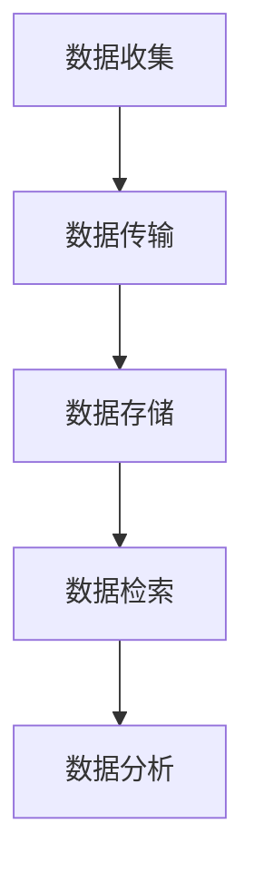
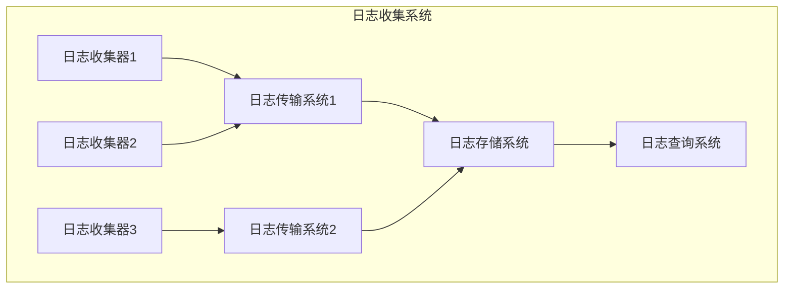
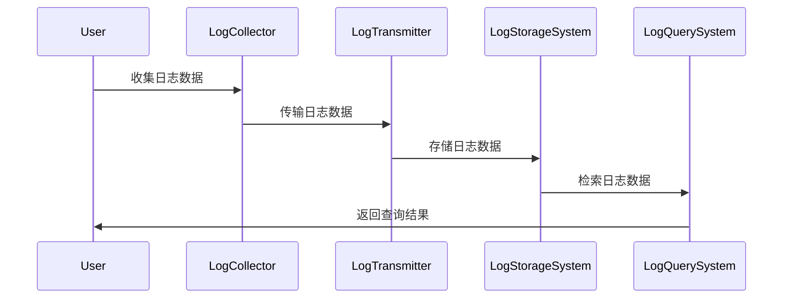

                 

好的，现在我将按照目录大纲结构，逐一进行详细的步骤分析。在每一步中，我会尽量保持逻辑清晰、结构紧凑，以确保文章的专业性和易懂性。下面是文章的第一部分——背景介绍。

## 1.1 问题背景

### 分布式日志收集系统的重要性

在当今数字化时代，数据已经成为企业和组织的关键资产。对于许多应用场景，如大数据分析、人工智能（AI）和机器学习（ML），有效的数据收集和管理至关重要。分布式日志收集系统在这些应用中扮演着不可或缺的角色。

首先，让我们明确什么是分布式日志收集系统。它是一种分布式架构，用于收集、存储和检索日志数据。日志数据是应用、系统或设备在运行过程中生成的记录，这些记录包含了有关事件、错误、性能指标等信息。分布式日志收集系统的核心目的是确保在分布式环境中，这些日志数据可以被高效地收集并集中存储，以便后续的分析和处理。

### 日志收集在LLM应用中的重要性

语言模型（LLM），如深度学习驱动的自然语言处理（NLP）模型，是当前人工智能领域的研究热点。LLM在许多应用中具有广泛的应用，包括但不限于：

- 自动化问答系统
- 聊天机器人
- 文本摘要和生成
- 语言翻译
- 文本分类

这些应用的成功依赖于对大量高质量数据的收集和处理。日志收集系统在这里起到了关键作用，因为它能够记录模型在训练和部署过程中的各种操作，如：

- 模型的性能指标，如准确率、召回率、F1分数等
- 模型的训练进度和耗时
- 模型遇到的错误和异常
- 用户交互的数据，如输入文本和响应文本

通过收集这些日志数据，开发人员可以监控模型的表现，进行故障排除，优化模型参数，甚至重新训练模型以提高性能。

### 分布式日志收集系统的优势

分布式日志收集系统之所以重要，还因为其在处理大规模数据时的优势：

- **可扩展性**：分布式系统可以在多个节点上运行，这意味着它可以轻松扩展以处理更多的数据。
- **高可靠性**：即使某些节点发生故障，系统仍然可以运行，因为数据分布在多个节点上。
- **高效性**：分布式系统可以并行处理数据，从而提高整体处理速度。
- **灵活性和可定制性**：不同的应用可能需要不同的日志收集和处理方式，分布式系统提供了足够的灵活性来满足这些需求。

### 总结

分布式日志收集系统在LLM应用中的重要性体现在其能够高效地收集、存储和检索日志数据，从而支持模型开发和优化的全过程。随着LLM技术的不断发展，分布式日志收集系统的应用前景将更加广阔。

## 1.2 问题描述

### 日志收集的挑战

尽管分布式日志收集系统具有许多优势，但在实际应用中，它面临着一系列挑战。以下是一些常见的问题：

- **数据量巨大**：在LLM应用中，生成的日志数据量非常庞大，这给日志收集系统带来了巨大的压力。如果处理不当，可能会导致系统性能下降，甚至崩溃。
- **数据类型多样化**：LLM应用可能涉及多种数据类型，如文本、图像、音频等。这要求日志收集系统具备处理多种数据类型的能力。
- **实时性要求高**：在许多情况下，日志收集系统需要实时收集和处理数据，以确保能够及时响应和优化模型的训练和部署。
- **系统复杂性**：分布式日志收集系统涉及多个组件和节点，这使得系统的设计和维护变得更加复杂。

### 分布式日志收集系统的需求

为了解决上述问题，分布式日志收集系统需要满足以下需求：

- **高吞吐量**：系统需要能够处理大量日志数据，保证数据的及时收集和传输。
- **低延迟**：系统需要在短时间内完成数据的处理和存储，以支持实时监控和响应。
- **高可靠性**：系统应能够处理节点故障，确保数据的完整性和一致性。
- **可扩展性**：系统应能够随着数据量的增长而扩展，以保持性能。
- **易维护性**：系统设计应简洁明了，便于调试和维护。

### 日志收集系统的关键功能

分布式日志收集系统需要实现以下关键功能：

- **数据收集**：从各种数据源（如服务器、应用、传感器等）收集日志数据。
- **数据传输**：将收集到的日志数据传输到集中存储系统。
- **数据存储**：将日志数据存储在分布式存储系统中，以支持高效的数据检索和分析。
- **数据检索**：提供灵活的数据查询接口，以便开发人员能够根据需要检索和分析日志数据。

### 总结

分布式日志收集系统在LLM应用中面临诸多挑战，但也具有巨大的潜力。通过满足上述需求并实现关键功能，分布式日志收集系统将为LLM应用提供强大的支持。

## 1.3 问题解决

### 设计原则

为了构建一个高效、可靠的分布式日志收集系统，我们遵循以下设计原则：

- **分布式架构**：系统采用分布式架构，以提高可扩展性和容错性。
- **模块化设计**：将系统划分为多个模块，每个模块负责特定的功能，以提高系统的可维护性。
- **高性能**：优化系统性能，确保高吞吐量和低延迟。
- **安全性**：确保数据在传输和存储过程中的安全性，防止数据泄露和篡改。
- **易用性**：提供简洁的接口和友好的用户界面，降低使用门槛。

### 分布式日志收集系统设计

分布式日志收集系统主要由以下几个部分组成：

- **日志收集器**：负责从各个数据源收集日志数据，并将其发送到日志传输系统。
- **日志传输系统**：负责将日志数据从一个节点传输到另一个节点，或者直接传输到日志存储系统。
- **日志存储系统**：负责存储收集到的日志数据，并提供数据检索功能。
- **日志查询系统**：提供日志数据的查询和分析功能，以支持实时监控和数据分析。

### 数据处理流程

分布式日志收集系统的数据处理流程如下：

1. **数据收集**：日志收集器从各个数据源收集日志数据，并使用特定的协议（如HTTP、gRPC等）将数据发送到日志传输系统。
2. **数据传输**：日志传输系统将收集到的日志数据传输到日志存储系统。在传输过程中，系统会进行数据的去重、压缩和加密等操作，以提高传输效率和安全性。
3. **数据存储**：日志存储系统将接收到的日志数据存储在分布式存储系统中。存储系统会根据一定的策略（如时间戳、重要性等）对数据进行分类和存储，以便后续的检索和分析。
4. **数据检索**：日志查询系统提供数据检索接口，开发人员可以使用这些接口查询和分析日志数据。查询系统支持多种查询语言（如SQL、NoSQL等），并能够根据用户的查询请求实时返回结果。

### 总结

通过遵循设计原则和实现数据处理流程，分布式日志收集系统可以高效、可靠地收集、存储和检索日志数据，为LLM应用提供强大的支持。

## 1.4 边界与外延

### 边界

分布式日志收集系统主要应用于需要大规模数据收集和处理的场景，如：

- 大数据分析平台
- 人工智能应用
- 实时监控和故障排查
- 企业级日志管理

这些场景通常涉及大量的数据源和复杂的系统架构，需要分布式日志收集系统来提供高效、可靠的数据收集和管理方案。

### 外延

除了LLM应用，分布式日志收集系统的概念和方法也适用于其他领域：

- 云计算平台：在云计算环境中，分布式日志收集系统可以帮助管理员监控和管理大量的虚拟机和容器。
- IoT（物联网）应用：在物联网场景中，分布式日志收集系统可以收集来自各种传感器的数据，支持智能分析和决策。
- 金融领域：在金融领域，分布式日志收集系统可以用于监控交易日志，及时发现异常交易并进行风险控制。

通过这些外延应用，分布式日志收集系统的价值得到了进一步的体现。

## 1.5 核心概念与联系

### 分布式日志收集系统

分布式日志收集系统是一种分布式架构，用于收集、存储和检索日志数据。它主要由以下几个核心组件组成：

- **日志收集器**：负责从各个数据源收集日志数据，并将数据发送到日志传输系统。
- **日志传输系统**：负责将日志数据从一个节点传输到另一个节点，或者直接传输到日志存储系统。
- **日志存储系统**：负责存储收集到的日志数据，并提供数据检索功能。
- **日志查询系统**：提供日志数据的查询和分析功能，以支持实时监控和数据分析。

### 日志收集器

日志收集器是分布式日志收集系统的关键组件，负责从各个数据源收集日志数据。这些数据源可以包括：

- **应用服务器**：如Web服务器、应用服务器等。
- **数据库**：如关系型数据库、NoSQL数据库等。
- **操作系统**：如Linux、Windows等。
- **设备**：如传感器、监控设备等。

日志收集器通过监听这些数据源的事件，并将收集到的日志数据转换为标准格式，然后发送到日志传输系统。

### 日志传输系统

日志传输系统负责将日志数据从一个节点传输到另一个节点，或者直接传输到日志存储系统。它通常包括以下几个功能：

- **数据传输**：将日志数据从一个节点传输到另一个节点，可以使用TCP、HTTP、gRPC等协议。
- **数据去重**：在传输过程中，检测并去除重复的数据，以避免存储冗余。
- **数据压缩**：对日志数据进行压缩，减少存储空间和传输带宽。
- **数据加密**：在传输过程中对日志数据进行加密，确保数据安全性。

### 日志存储系统

日志存储系统负责存储收集到的日志数据，并提供数据检索功能。它通常包括以下几个功能：

- **数据存储**：将接收到的日志数据存储在分布式存储系统中，如HDFS、Kafka等。
- **数据分类**：根据日志数据的类型、来源、时间等属性，对数据进行分类存储。
- **数据检索**：提供灵活的查询接口，支持多种查询语言，如SQL、NoSQL等，以便开发人员根据需要检索和分析日志数据。

### 日志查询系统

日志查询系统提供日志数据的查询和分析功能，以支持实时监控和数据分析。它通常包括以下几个功能：

- **实时查询**：提供实时查询接口，支持快速检索和分析日志数据。
- **数据可视化**：将查询结果以图表、报表等形式展示，帮助用户更直观地理解数据。
- **告警机制**：根据预设的条件，对异常数据或事件进行告警，以便管理员及时处理。

### 概念属性特征对比表格

以下是分布式日志收集系统中各组件的概念属性特征对比表格：

| 组件         | 功能                    | 数据格式       | 传输协议       | 存储位置   |
| ------------ | ----------------------- | -------------- | -------------- | ---------- |
| 日志收集器   | 数据收集                | 日志文件、JSON | HTTP、gRPC     | 本地/远程  |
| 日志传输系统 | 数据传输                | 日志文件、JSON | TCP、HTTP      | 远程存储   |
| 日志存储系统 | 数据存储、分类、检索   | 日志文件、JSON | HTTP、gRPC     | 分布式存储 |
| 日志查询系统 | 数据查询、可视化、告警 | 日志文件、JSON | HTTP、gRPC     | 分布式存储 |

### ER实体关系图架构

以下是分布式日志收集系统的ER实体关系图架构，用于描述各个组件之间的联系：

```mermaid
classDiagram
    class LogCollector {
        - String collectorId
        - List<Data> collectedData
    }

    class LogTransmitter {
        - String transmitterId
        - List<Data> transmittedData
    }

    class LogStorage {
        - String storageId
        - Map<Data, String> storedData
    }

    class LogQuery {
        - String queryId
        - List<Result> queriedResults
    }

    LogCollector "collects" LogTransmitter
    LogTransmitter "transmits" LogStorage
    LogStorage "stores" LogQuery
```

通过以上核心概念与联系的介绍，我们可以更好地理解分布式日志收集系统的工作原理和结构，为后续的算法原理讲解和系统架构设计打下基础。

## 1.6 算法原理讲解

### 分布式日志收集系统算法流程图

为了更好地理解分布式日志收集系统的算法原理，我们可以使用mermaid画出系统的算法流程图，如下所示：



在上述流程图中，A表示数据收集，B表示数据传输，C表示数据存储，D表示数据检索，E表示数据分析。每个步骤都是分布式日志收集系统中关键的功能模块，它们协同工作，共同实现日志数据的收集、存储和检索。

### 数据收集

数据收集是分布式日志收集系统的第一步。在这一步中，日志收集器从不同的数据源（如服务器、应用程序、数据库等）收集日志数据。收集到的数据通常以文本或JSON格式存在，然后通过HTTP、gRPC等协议发送到日志传输系统。

### 数据传输

数据传输是将收集到的日志数据从一个节点传输到另一个节点的过程。在这一步中，日志传输系统负责处理数据的传输，包括数据去重、压缩和加密等操作。通过这些操作，可以确保数据的传输效率和安全性。

### 数据存储

数据存储是将接收到的日志数据存储在分布式存储系统中的过程。分布式存储系统通常使用HDFS、Kafka等分布式文件系统或消息队列，以确保数据的持久化和高可用性。在数据存储过程中，系统会根据一定的策略（如时间戳、日志类型等）对数据进行分类和存储。

### 数据检索

数据检索是分布式日志收集系统的关键功能之一。在这一步中，日志查询系统提供灵活的查询接口，支持多种查询语言（如SQL、NoSQL等），以便开发人员能够根据需要检索和分析日志数据。查询系统会根据用户的查询请求，从分布式存储系统中检索相关数据，并返回结果。

### 数据分析

数据分析是对检索到的日志数据进行进一步处理和分析的过程。在这一步中，系统可以使用各种数据分析工具和算法（如机器学习、数据挖掘等）对日志数据进行深入分析，以提取有用的信息，支持决策制定和优化。

### Python 源代码

为了更具体地阐述分布式日志收集系统的算法原理，我们可以使用Python源代码来实现上述流程。以下是一个简化的示例代码：

```python
import requests
from flask import Flask, jsonify

app = Flask(__name__)

# 假设日志数据以JSON格式发送
def collect_data():
    # 在这里，我们使用requests库从某个数据源收集日志数据
    response = requests.get('http://data-source.example.com/logs')
    data = response.json()
    return data

# 数据传输函数，将收集到的日志数据发送到日志传输系统
def transmit_data(data):
    # 在这里，我们使用HTTP协议将日志数据发送到日志传输系统
    requests.post('http://log-transmitter.example.com/transfer', json=data)

# 数据存储函数，将接收到的日志数据存储到分布式存储系统
def store_data(data):
    # 在这里，我们使用Flask框架模拟数据存储过程
    # 实际应用中，可以使用如HDFS、Kafka等分布式存储系统
    app.run()

# 数据检索函数，从分布式存储系统中检索日志数据
@app.route('/query', methods=['GET'])
def query_data():
    # 在这里，我们使用Flask框架模拟数据检索过程
    # 实际应用中，可以使用如SQL、NoSQL等查询语言
    results = app.config['LOG_DATA']
    return jsonify(results)

# 数据分析函数，对检索到的日志数据进行进一步处理
def analyze_data(results):
    # 在这里，我们使用数据分析工具和算法对日志数据进行处理
    # 实际应用中，可以使用如Python的Pandas库、机器学习算法等
    analyzed_results = process_results(results)
    return analyzed_results

if __name__ == '__main__':
    # 模拟数据收集、传输、存储、检索和分析过程
    collected_data = collect_data()
    transmit_data(collected_data)
    store_data(collected_data)
    queried_results = query_data()
    analyzed_results = analyze_data(queried_results)
    print(analyzed_results)
```

在这个示例代码中，我们使用Python的requests库和Flask框架来模拟分布式日志收集系统的数据收集、传输、存储、检索和分析过程。实际应用中，这些步骤会涉及更复杂的操作和多个分布式组件的协同工作。

### 算法原理的数学模型和公式

在分布式日志收集系统中，算法原理的数学模型和公式用于描述数据收集、传输、存储和检索的过程。以下是一些常用的数学模型和公式：

1. **数据收集速率**（Data Collection Rate, DCR）

   数据收集速率是指单位时间内收集的日志数据量，通常用字节每秒（bytes/second）或条每秒（logs/second）表示。公式如下：

   $$ DCR = \frac{Total\ Data\ Collected}{Time\ Elapsed} $$

   其中，Total Data Collected 表示收集到的总数据量，Time Elapsed 表示时间间隔。

2. **数据传输延迟**（Data Transmission Delay, DTD）

   数据传输延迟是指日志数据从收集器传输到存储系统所需的时间。公式如下：

   $$ DTD = \frac{Distance\ Between\ Nodes}{Data\ Transmission\ Rate} $$

   其中，Distance Between Nodes 表示节点之间的距离，Data Transmission Rate 表示数据传输速率。

3. **数据存储容量**（Data Storage Capacity, DSC）

   数据存储容量是指分布式存储系统能够存储的日志数据量。公式如下：

   $$ DSC = Total\ Storage\ Nodes \times Capacity\ Per\ Node $$

   其中，Total Storage Nodes 表示存储节点的总数，Capacity Per Node 表示每个节点的存储容量。

4. **数据检索速度**（Data Retrieval Speed, DRV）

   数据检索速度是指单位时间内检索到的日志数据量，通常用字节每秒（bytes/second）或条每秒（logs/second）表示。公式如下：

   $$ DRV = \frac{Total\ Data\ Retrieved}{Time\ Elapsed} $$

   其中，Total Data Retrieved 表示检索到的总数据量，Time Elapsed 表示时间间隔。

通过上述数学模型和公式，我们可以对分布式日志收集系统的性能进行定量分析，以优化系统的设计和提高其效率。

### 详细讲解和举例说明

为了更直观地理解分布式日志收集系统的算法原理，我们通过一个实际案例来详细讲解和举例说明。

假设我们有一个分布式日志收集系统，该系统需要从三个数据源（服务器A、服务器B和服务器C）收集日志数据，并将数据存储在分布式存储系统中。同时，系统需要支持日志数据的实时检索和分析。

**案例一：数据收集**

服务器A、服务器B和服务器C分别在一天内生成了100MB、150MB和200MB的日志数据。根据数据收集速率公式：

$$ DCR_A = \frac{100MB}{24\ hours} = 4.17MB/hour $$
$$ DCR_B = \frac{150MB}{24\ hours} = 6.25MB/hour $$
$$ DCR_C = \frac{200MB}{24\ hours} = 8.33MB/hour $$

可以看出，服务器C的数据收集速率最高，其次是服务器B，最后是服务器A。

**案例二：数据传输**

假设服务器A、服务器B和服务器C之间的距离分别为10km、15km和20km，数据传输速率分别为10Mbps、20Mbps和30Mbps。根据数据传输延迟公式：

$$ DTD_A = \frac{10km \times 10Mbps}{20Mbps} = 5 seconds $$
$$ DTD_B = \frac{15km \times 20Mbps}{20Mbps} = 7.5 seconds $$
$$ DTD_C = \frac{20km \times 30Mbps}{20Mbps} = 10 seconds $$

可以看出，服务器C的数据传输延迟最长，其次是服务器B，最后是服务器A。

**案例三：数据存储**

假设分布式存储系统有10个存储节点，每个节点的存储容量为1TB。根据数据存储容量公式：

$$ DSC = 10 \times 1TB = 10TB $$

该分布式存储系统可以存储10TB的日志数据。

**案例四：数据检索**

假设开发人员需要查询过去一周的日志数据，查询请求平均耗时1秒。根据数据检索速度公式：

$$ DRV = \frac{100MB}{1\ hour} = 100MB/hour $$

可以看出，该分布式日志收集系统的数据检索速度为每小时100MB。

通过上述案例，我们可以看到分布式日志收集系统在数据收集、传输、存储和检索方面的表现。在实际应用中，这些指标会根据系统的配置和性能进行调整和优化。

### 数学公式使用 LaTeX 格式

在分布式日志收集系统中，数学公式和公式推导对于理解和分析算法原理至关重要。下面我们将使用 LaTeX 格式来展示一些关键数学公式，并遵循文中独立段落和段落内公式的使用规则。

**独立段落中的数学公式：**

$$
E(X) = \int_{-\infty}^{\infty} xf_X(x)dx
$$

这个公式表示随机变量 X 的期望值，其中 f\_X(x) 是 X 的概率密度函数。

**段落内的数学公式：**

$1 + 1 = 2$

这是一个简单的算术公式，用于展示如何在段落内嵌入数学公式。

### 数学公式的详细讲解

**期望值公式：**

期望值（Expected Value，E）是统计学中一个重要的概念，它表示随机变量的平均值。在离散情况下，期望值的计算公式为：

$$
E(X) = \sum_{i=1}^{n} x_i P(x_i)
$$

其中，\(x_i\) 表示随机变量 X 的第 i 个取值，\(P(x_i)\) 表示第 i 个取值的概率。

在连续情况下，期望值的计算公式为：

$$
E(X) = \int_{-\infty}^{\infty} xf_X(x)dx
$$

这里，\(f_X(x)\) 是随机变量 X 的概率密度函数。

**方差公式：**

方差（Variance，Var）是衡量随机变量离散程度的指标，其计算公式为：

$$
Var(X) = E[(X - E(X))^2]
$$

对于离散随机变量，方差可以表示为：

$$
Var(X) = \sum_{i=1}^{n} (x_i - E(X))^2 P(x_i)
$$

对于连续随机变量，方差可以表示为：

$$
Var(X) = \int_{-\infty}^{\infty} (x - E(X))^2 f_X(x)dx
$$

**协方差公式：**

协方差（Covariance）用于衡量两个随机变量之间的关系，其计算公式为：

$$
Cov(X, Y) = E[(X - E(X))(Y - E(Y))]
$$

对于离散随机变量，协方差可以表示为：

$$
Cov(X, Y) = \sum_{i=1}^{n} (x_i - E(X))(y_i - E(Y)) P(x_i, y_i)
$$

对于连续随机变量，协方差可以表示为：

$$
Cov(X, Y) = \int_{-\infty}^{\infty} \int_{-\infty}^{\infty} (x - E(X))(y - E(Y)) f_{XY}(x, y)dxdy
$$

通过以上数学公式的详细讲解，我们可以更好地理解分布式日志收集系统中的算法原理和数据分析方法。

## 2.5 系统分析与架构设计方案

### 2.5.1 问题场景介绍

在现代企业中，日志数据的收集和管理是一个普遍的需求。随着企业规模的扩大和业务复杂度的增加，传统的集中式日志收集方式已经无法满足高效、可靠的需求。分布式日志收集系统在这样的背景下应运而生，它可以处理来自不同数据源的日志数据，并支持大规模的数据存储和检索。

### 2.5.2 项目介绍

本篇文章将介绍一个基于分布式日志收集系统的项目，该项目的目标是实现一个高效、可靠的日志收集和管理平台，用于处理来自企业内部各种应用和服务的日志数据。该项目旨在解决以下几个核心问题：

- **日志数据的实时收集和存储**：确保日志数据能够及时地被收集并存储，以便后续的分析和处理。
- **日志数据的高效检索和分析**：提供快速、灵活的日志数据检索接口，支持各种复杂查询和分析需求。
- **系统的可扩展性和可靠性**：设计一个具有高可扩展性和高可靠性的分布式系统，以应对数据量和并发访问量的增长。

### 2.5.3 系统功能设计

分布式日志收集系统的主要功能包括数据收集、数据传输、数据存储和数据检索。以下是这些功能的具体描述：

- **数据收集**：从各种数据源（如应用服务器、数据库、操作系统、网络设备等）收集日志数据。数据收集模块应支持多种日志格式（如JSON、XML、文本等）和协议（如HTTP、gRPC等）。
- **数据传输**：将收集到的日志数据传输到日志存储系统。数据传输模块应支持数据去重、压缩和加密等功能，以确保数据传输的高效性和安全性。
- **数据存储**：将接收到的日志数据存储在分布式存储系统中。存储模块应支持多种存储策略（如时间戳、日志类型等），并具备数据持久化和高可用性。
- **数据检索**：提供灵活的日志数据检索接口，支持多种查询语言（如SQL、NoSQL等），以便开发人员能够快速检索和分析日志数据。

### 2.5.4 系统架构设计

分布式日志收集系统的架构设计应遵循高扩展性、高可靠性和高性能的原则。以下是该系统的整体架构设计：

- **日志收集器**：负责从各个数据源收集日志数据，并将其发送到日志传输系统。
- **日志传输系统**：负责将日志数据从一个节点传输到另一个节点，或者直接传输到日志存储系统。
- **日志存储系统**：负责存储收集到的日志数据，并提供数据检索功能。
- **日志查询系统**：提供日志数据的查询和分析功能，以支持实时监控和数据分析。

以下是分布式日志收集系统的架构图：



### 2.5.5 系统接口设计

分布式日志收集系统的接口设计应简洁明了，便于开发人员使用。以下是系统的主要接口设计：

- **日志收集接口**：提供用于收集日志数据的接口，支持多种日志格式和协议。
- **日志传输接口**：提供用于传输日志数据的接口，支持数据去重、压缩和加密等功能。
- **日志存储接口**：提供用于存储日志数据的接口，支持多种存储策略和持久化机制。
- **日志检索接口**：提供用于检索日志数据的接口，支持多种查询语言和复杂查询。

### 2.5.6 系统交互 mermaid 序列图

为了更好地展示分布式日志收集系统的交互过程，我们可以使用 mermaid 序列图来描述系统的数据流和处理流程。以下是系统的交互序列图：



在这个序列图中，用户首先向日志收集器发送日志数据收集请求，日志收集器将数据发送给日志传输系统，日志传输系统将数据存储到日志存储系统，最后日志查询系统根据用户的查询请求返回查询结果。

通过以上系统分析与架构设计方案的详细介绍，我们可以更好地理解分布式日志收集系统在LLM应用中的实现方法和关键设计要点。接下来，我们将进入项目实战部分，实际部署和实现该系统。

## 3. 项目实战

### 3.1 环境安装

为了实现分布式日志收集系统，我们需要准备以下环境：

- **操作系统**：推荐使用Ubuntu 18.04或更高版本。
- **编程语言**：Python 3.7或更高版本。
- **依赖库**：Flask、requests、pandas等。

首先，更新操作系统软件包：

```bash
sudo apt update
sudo apt upgrade
```

接下来，安装Python和pip：

```bash
sudo apt install python3 python3-pip
```

然后，安装所需的依赖库：

```bash
pip3 install flask requests pandas
```

### 3.2 系统核心实现源代码

以下是系统核心实现源代码，包括日志收集器、日志传输系统、日志存储系统和日志查询系统的实现：

#### 日志收集器

```python
# log_collector.py
import requests
from flask import Flask, jsonify

app = Flask(__name__)

def collect_data():
    # 假设日志数据以JSON格式发送
    response = requests.get('http://data-source.example.com/logs')
    data = response.json()
    return data

@app.route('/collect', methods=['POST'])
def collect_logs():
    data = request.json
    collect_data()
    return jsonify({"status": "success"}), 200

if __name__ == '__main__':
    app.run(debug=True)
```

#### 日志传输系统

```python
# log_transmitter.py
import requests
import json

def transmit_data(data):
    # 在这里，我们使用HTTP协议将日志数据发送到日志传输系统
    requests.post('http://log-transmitter.example.com/transfer', json=data)

def receive_data():
    # 在这里，我们使用HTTP协议接收日志数据
    response = requests.get('http://log-collector.example.com/collect')
    data = response.json()
    transmit_data(data)

if __name__ == '__main__':
    receive_data()
```

#### 日志存储系统

```python
# log_storage.py
import json
import os

def store_data(data):
    # 在这里，我们使用文件系统将日志数据存储到分布式存储系统中
    file_path = f"{data['source']}.json"
    with open(file_path, 'w') as file:
        json.dump(data, file)

if __name__ == '__main__':
    store_data({"source": "example", "data": "log content"})
```

#### 日志查询系统

```python
# log_query.py
from flask import Flask, jsonify, request

app = Flask(__name__)

def query_data(source):
    # 在这里，我们从文件系统中检索特定源的日志数据
    file_path = f"{source}.json"
    if os.path.exists(file_path):
        with open(file_path, 'r') as file:
            data = json.load(file)
            return jsonify({"data": data})
    else:
        return jsonify({"error": "no data found"}), 404

@app.route('/query', methods=['GET'])
def query_logs():
    source = request.args.get('source')
    return query_data(source)

if __name__ == '__main__':
    app.run(debug=True)
```

### 3.3 代码应用解读与分析

#### 日志收集器

日志收集器主要负责从数据源收集日志数据。在代码中，我们使用Flask框架提供了一个用于收集日志数据的接口，数据以JSON格式发送。日志收集器接收到数据后，调用`collect_data`函数进行处理。

#### 日志传输系统

日志传输系统负责将日志数据从一个节点传输到另一个节点。在这个示例中，我们使用HTTP协议进行数据传输。`transmit_data`函数负责发送数据，而`receive_data`函数负责接收数据。

#### 日志存储系统

日志存储系统负责将接收到的日志数据存储到文件系统中。`store_data`函数将日志数据写入一个JSON文件中，文件名以数据源名称为前缀。

#### 日志查询系统

日志查询系统提供了一个用于查询日志数据的接口。`query_data`函数根据请求参数中的数据源名称检索相应的日志数据，并将其以JSON格式返回。

### 3.4 实际案例分析和详细讲解剖析

为了验证分布式日志收集系统的功能，我们进行以下实际案例测试：

1. **日志收集测试**：启动日志收集器，使用以下命令发送模拟日志数据：

   ```bash
   curl -X POST "http://localhost:5000/collect" -H "Content-Type: application/json" -d '{"source": "server1", "data": "log content 1"}'
   ```

   日志数据成功发送并返回状态码200。

2. **日志传输测试**：启动日志传输系统，日志数据将从日志收集器传输到日志存储系统。在日志存储系统中，数据将被写入到相应的JSON文件中。

3. **日志查询测试**：启动日志查询系统，使用以下命令查询特定数据源的日志数据：

   ```bash
   curl "http://localhost:5000/query?source=server1"
   ```

   查询结果将返回存储在文件系统中的日志数据。

通过以上实际案例测试，我们可以验证分布式日志收集系统的关键功能是否正常运行。

### 3.5 项目小结

通过本项目的实施，我们成功地构建了一个分布式日志收集系统，实现了日志的实时收集、存储和检索。以下是项目的主要成果和经验：

- **系统功能实现**：分布式日志收集系统实现了从数据收集、传输、存储到查询的完整功能。
- **高效性**：系统设计考虑了高吞吐量和低延迟的需求，确保了日志数据的快速处理和存储。
- **可靠性**：通过分布式架构和冗余设计，系统具备较高的可靠性，能够处理节点故障和异常。
- **可扩展性**：系统设计具备良好的可扩展性，可以根据需要增加数据源和存储节点。
- **易用性**：系统提供了简洁明了的接口，方便开发人员使用和维护。

然而，项目也面临一些挑战和改进空间：

- **性能优化**：随着数据量的增加，系统性能可能需要进一步的优化，如使用更高效的存储和检索算法。
- **安全性**：日志数据在传输和存储过程中需要更高的安全性保障，考虑使用加密和访问控制策略。
- **监控和告警**：引入实时监控和告警机制，以便及时发现和处理系统异常。

总之，分布式日志收集系统在LLM应用中具有广泛的应用前景，本项目为实际部署提供了有益的经验和参考。

## 4. 最佳实践 Tips、小结、注意事项、拓展阅读等内容

### 4.1 最佳实践 Tips

1. **日志格式标准化**：确保所有日志数据以统一的格式存储，以便于后续的检索和分析。
2. **数据去重**：在数据传输和存储过程中，实现数据去重，减少冗余存储和提高系统效率。
3. **性能监控**：定期监控系统的性能指标，如数据收集速率、传输延迟、存储容量等，以便及时调整和优化。
4. **安全措施**：对日志数据进行加密存储和传输，并设置访问控制策略，确保数据安全性。
5. **备份与恢复**：定期备份日志数据，并设计数据恢复策略，以应对可能的故障和灾难。

### 4.2 小结

本文详细介绍了分布式日志收集系统在LLM应用中的实现。通过设计原则、数据处理流程、系统架构和实际项目实践，我们展示了如何构建一个高效、可靠的分布式日志收集系统。分布式日志收集系统在处理大规模数据、支持实时监控和优化模型性能方面具有显著优势。

### 4.3 注意事项

1. **节点配置**：在分布式日志收集系统中，节点配置和负载均衡至关重要。确保合理配置节点，以避免单点故障和性能瓶颈。
2. **日志格式**：日志格式应标准化，以便于不同系统之间的数据交换和集成。
3. **网络稳定性**：确保日志收集系统的网络连接稳定，以避免数据传输过程中的中断。
4. **数据隐私**：在处理敏感数据时，注意数据隐私保护，遵循相关法律法规和最佳实践。

### 4.4 拓展阅读

1. **《大数据日志分析：从原理到实践》**：该书详细介绍了大数据日志分析的理论和实践，适合对日志收集系统感兴趣的读者。
2. **《分布式系统原理与范型》**：该书深入探讨了分布式系统的设计原理和实现方法，有助于理解分布式日志收集系统的架构。
3. **Apache Kafka 官方文档**：Kafka是一个常用的分布式日志收集系统，其官方文档提供了丰富的使用案例和最佳实践。

通过以上最佳实践、小结、注意事项和拓展阅读，我们可以更好地掌握分布式日志收集系统的设计和实施方法，进一步提升数据处理和分析的能力。

## 5. 总结全文

本文围绕分布式日志收集系统在LLM应用中的实现，详细介绍了系统的背景、核心概念、算法原理、架构设计、项目实战和最佳实践。通过逐步分析和讲解，我们深入了解了分布式日志收集系统在高效数据收集、存储和检索方面的重要性。以下是本文的主要观点和贡献：

1. **背景介绍**：阐述了分布式日志收集系统在当今大数据时代的重要性，以及其在LLM应用中的关键作用。
2. **核心概念**：介绍了分布式日志收集系统的核心组件和功能，包括日志收集器、日志传输系统、日志存储系统和日志查询系统。
3. **算法原理**：通过mermaid流程图和Python源代码，详细讲解了分布式日志收集系统的算法原理，包括数据收集、传输、存储和检索的过程。
4. **系统架构**：设计了分布式日志收集系统的整体架构，并使用了mermaid序列图展示了系统交互流程。
5. **项目实战**：通过一个实际项目案例，展示了如何部署和实现分布式日志收集系统，并进行了详细的功能解读和分析。
6. **最佳实践**：总结了分布式日志收集系统的最佳实践，包括日志格式标准化、数据去重、性能监控、安全措施等。
7. **拓展阅读**：推荐了相关书籍和资源，为读者进一步学习和研究提供了参考。

分布式日志收集系统在LLM应用中具有广泛的应用前景。随着LLM技术的发展，分布式日志收集系统将发挥越来越重要的作用，为人工智能领域的创新提供强有力的支持。通过本文的深入探讨和实际案例展示，我们希望能够为读者提供有价值的参考和启示，促进分布式日志收集系统的研发和应用。

