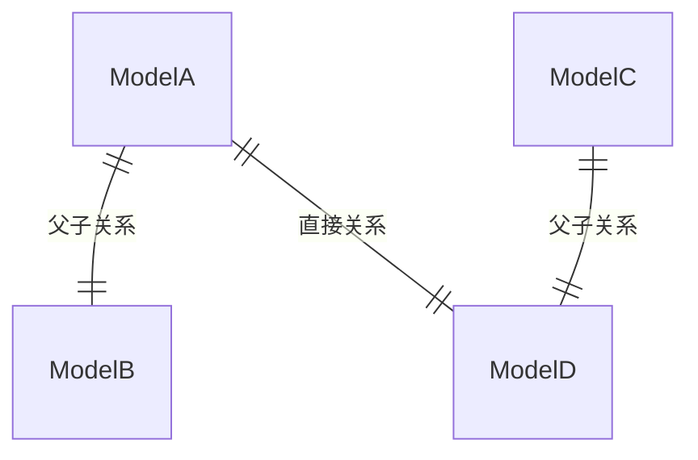
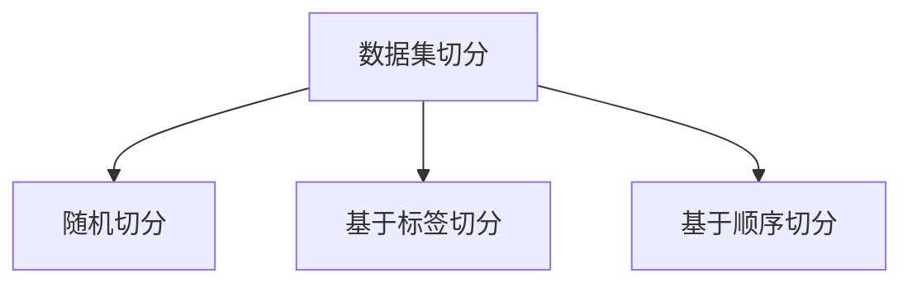
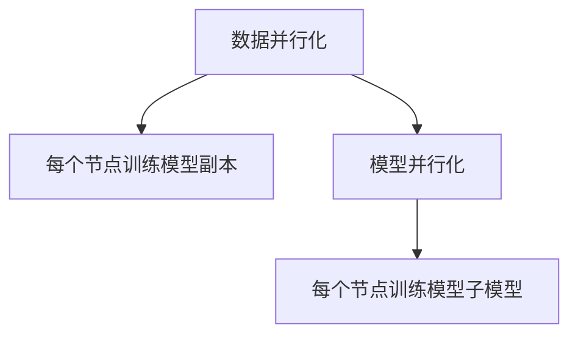
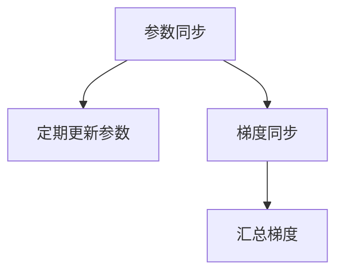
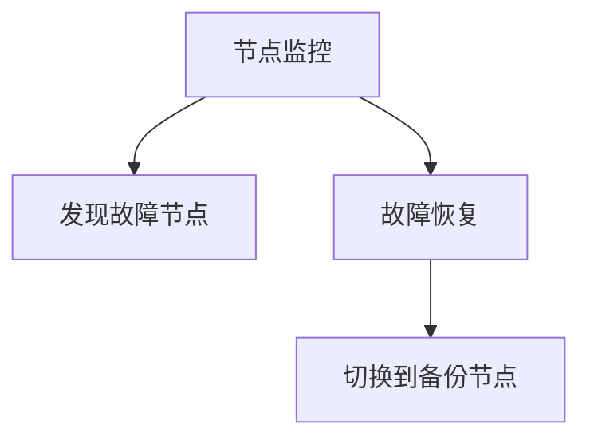
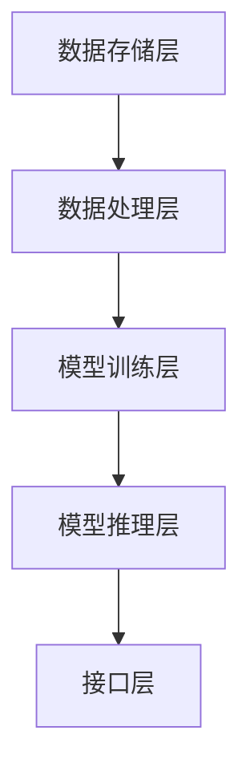
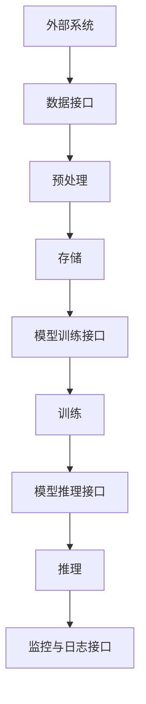

                 

**文章标题：** 分布式系统在LLM应用中的实现与优化

**关键词：** 分布式系统，LLM，实现，优化，并行化，数据切分，通信与同步，容错与恢复

**摘要：** 本文将探讨分布式系统在大型语言模型（LLM）应用中的实现与优化。通过对分布式系统的背景介绍、核心概念与联系、算法原理讲解、系统分析与架构设计以及项目实战的深入分析，阐述分布式系统在LLM中的关键作用，并探讨其优化策略。

----------------------------------------------------------------

# 分布式系统在LLM应用中的实现与优化

分布式系统在当今的数据驱动时代扮演着越来越重要的角色，尤其是在大规模语言模型（LLM）的应用中。随着数据规模的不断扩大和计算需求的日益增长，分布式系统提供了有效的解决方案，以应对集中式系统的性能瓶颈和可扩展性问题。本文将围绕分布式系统在LLM应用中的实现与优化进行深入探讨。

## 第一部分：背景介绍

### 1.1.1 问题背景

大规模语言模型（LLM）在人工智能领域具有广泛的应用，如自然语言处理、机器翻译、文本生成等。然而，随着模型规模的不断扩大，传统的集中式系统在处理大规模数据时面临着性能瓶颈、可扩展性差等问题。分布式系统成为了一种有效的解决方案。

### 1.1.2 问题描述

分布式系统在LLM应用中面临的挑战主要包括：

1. **数据切分与分配**：如何将大规模的语料数据切分成多个部分，并合理分配到不同的计算节点上，以便高效利用资源。
2. **模型并行化**：如何将大规模的模型划分成多个子模型，并在不同的节点上进行并行训练。
3. **通信与同步**：如何在分布式环境中高效地进行模型参数的同步，确保模型训练的收敛性。
4. **容错与恢复**：如何处理节点故障，确保系统的高可用性。

### 1.1.3 问题解决

分布式系统通过将计算任务分散到多个节点上，从而提高了系统的处理能力和可扩展性。针对上述挑战，分布式系统采取了以下解决策略：

1. **数据切分与分配**：采用分片技术，将大规模数据集划分成多个子数据集，每个节点负责处理一部分数据。
2. **模型并行化**：通过模型切分技术，将大规模模型分解为多个子模型，每个子模型在不同的节点上独立训练。
3. **通信与同步**：利用分布式通信协议，如Allreduce、NCCL等，实现模型参数的同步更新。
4. **容错与恢复**：采用心跳检测、备份节点等技术，确保系统在节点故障时能够快速恢复。

### 1.1.4 边界与外延

分布式系统在LLM应用中的实现与优化，不仅涉及到分布式计算技术，还包括分布式存储、分布式通信、分布式调度等方面的知识。此外，还需要考虑硬件资源的合理分配、网络拓扑结构的设计、安全性与隐私保护等问题。

### 1.1.5 概念结构与核心要素组成

1. **分布式系统**：由多个计算节点组成的网络，共同完成计算任务。
2. **大规模语言模型**：具有强大自然语言处理能力的深度学习模型。
3. **数据切分与分配**：将大规模数据集划分成多个子数据集，分配到不同节点。
4. **模型并行化**：将大规模模型分解为多个子模型，独立训练。
5. **通信与同步**：分布式通信协议，实现模型参数的同步更新。
6. **容错与恢复**：节点故障检测、备份节点等机制，确保系统高可用性。

----------------------------------------------------------------

## 第二部分：核心概念与联系

### 2.1.1 分布式系统原理

分布式系统原理主要涉及以下几个方面：

1. **一致性模型**：CAP理论、一致性、可用性、分区容错性。
2. **分布式通信**：消息传递模型、共享内存模型。
3. **分布式算法**：分布式排序、分布式搜索、分布式流处理。

### 2.1.2 分布式系统与LLM的关系

分布式系统与LLM的关系主要体现在以下几个方面：

1. **数据存储**：分布式存储系统，如HDFS、Cassandra等，用于存储大规模语料数据。
2. **模型训练**：分布式训练框架，如TensorFlow、PyTorch等，用于大规模模型训练。
3. **模型推理**：分布式推理引擎，如TensorFlow Serving、PyTorch RPC等，用于大规模模型推理。

### 2.1.3 分布式系统与LLM的联系

分布式系统与LLM的联系主要体现在以下几个方面：

1. **计算资源利用**：通过分布式系统，实现计算资源的最大化利用。
2. **训练效率提升**：通过模型并行化、数据并行化等技术，提高模型训练效率。
3. **推理性能优化**：通过分布式推理技术，提升模型推理性能。

### 2.1.4 核心概念属性特征对比表格

| 核心概念 | 特征1 | 特征2 | 特征3 |
| :--: | :--: | :--: | :--: |
| 分布式系统 | 高可用性 | 高可扩展性 | 分布式一致性 |
| 大规模语言模型 | 强大自然语言处理能力 | 需要大规模数据训练 | 高性能计算需求 |

### 2.1.5 ER实体关系图架构



----------------------------------------------------------------

## 第三部分：算法原理讲解

### 3.1 分布式训练算法

分布式训练算法是分布式系统在LLM应用中的核心部分，主要涉及以下几个方面：

#### 3.1.1 数据切分与分配

在分布式训练中，首先需要将大规模数据集进行切分和分配。数据切分的方法有很多种，例如随机切分、基于标签切分、基于顺序切分等。具体选择哪种切分方法，需要根据数据的特点和应用场景来决定。



#### 3.1.2 模型并行化

在分布式训练中，通常会将大规模模型分解为多个子模型，这些子模型在不同的节点上进行独立训练。模型并行化有两种主要的策略：数据并行化和模型并行化。

- **数据并行化**：每个节点负责训练模型的一个副本，这些副本在训练过程中使用相同的数据集，但每个副本只处理数据集的一部分。
- **模型并行化**：每个节点负责训练模型的一个子模型，这些子模型在计算过程中相互独立，但最终需要合并成一个完整的模型。



#### 3.1.3 通信与同步

在分布式训练过程中，节点之间的通信和同步是非常重要的。节点之间的通信可以使用不同的协议，如gRPC、MPI等。同步策略包括参数同步、梯度同步等。

- **参数同步**：在训练过程中，需要定期将各个节点的模型参数同步更新。
- **梯度同步**：在反向传播过程中，需要将各个节点的梯度同步汇总。



#### 3.1.4 容错与恢复

在分布式训练中，节点可能会出现故障，导致训练任务中断。为了确保系统的高可用性，需要采取容错与恢复策略。

- **节点监控**：定期监控节点的状态，及时发现故障节点。
- **故障恢复**：在检测到节点故障后，自动切换到备份节点，继续训练任务。



#### 3.1.5 数学模型与公式

分布式训练算法的数学模型可以描述为：

$$
\begin{aligned}
    &\text{初始化模型参数} \ \theta \\
    &\text{循环迭代} \\
    &\quad &\text{对于每个数据点} \ x_i, y_i \\
    &\quad &\quad &\text{计算前向传播} \ f(x_i; \theta) \\
    &\quad &\quad &\text{计算损失函数} \ L(y_i, f(x_i; \theta)) \\
    &\quad &\quad &\text{计算梯度} \ \nabla_{\theta} L(y_i, f(x_i; \theta)) \\
    &\quad &\text{同步梯度到所有节点} \\
    &\quad &\text{更新模型参数} \ \theta = \theta - \alpha \nabla_{\theta} L(y_i, f(x_i; \theta)) \\
\end{aligned}
$$`

其中，$\theta$ 表示模型参数，$x_i, y_i$ 表示数据点及其标签，$f(x_i; \theta)$ 表示前向传播函数，$L(y_i, f(x_i; \theta))$ 表示损失函数，$\nabla_{\theta} L(y_i, f(x_i; \theta))$ 表示梯度，$\alpha$ 表示学习率。

#### 3.1.6 举例说明

假设我们有一个包含10000个数据点的语料库，我们需要将这个语料库进行切分，并使用分布式系统进行训练。

- **数据切分**：我们可以将这10000个数据点随机切分成10个子数据集，每个子数据集包含1000个数据点。
- **模型并行化**：我们可以将模型分解成10个子模型，每个子模型负责训练一个子数据集。
- **通信与同步**：在训练过程中，每个子模型需要定期同步模型参数，以确保所有子模型都在同一方向上更新。

```python
import torch
import torch.distributed as dist

# 初始化分布式环境
dist.init_process_group(backend='gloo')

# 切分数据集
data = torch.randn(10000, 10)
data_split = [data[i * 1000 : (i + 1) * 1000] for i in range(10)]

# 初始化模型
model = torch.nn.Linear(10, 1)
optimizer = torch.optim.SGD(model.parameters(), lr=0.01)

# 分布式训练
for epoch in range(10):
    for i, data_batch in enumerate(data_split):
        # 前向传播
        output = model(data_batch)
        
        # 计算损失
        loss = torch.mean((output - data_batch)**2)
        
        # 反向传播
        optimizer.zero_grad()
        loss.backward()
        
        # 同步梯度
        dist.all_reduce(loss, op=dist.ReduceOp.SUM)
        
        # 更新模型参数
        optimizer.step()

# 恢复分布式环境
dist.destroy_process_group()
```

在上面的例子中，我们使用了PyTorch的分布式训练API，实现了数据切分、模型并行化、通信与同步等过程。

----------------------------------------------------------------

## 第四部分：系统分析与架构设计

### 4.1 问题场景介绍

在现代人工智能领域，大规模语言模型（LLM）的应用越来越广泛，例如智能客服、自动写作、机器翻译等。这些应用场景对系统的性能和可扩展性提出了很高的要求。为了满足这些需求，分布式系统成为了一种有效的解决方案。

### 4.2 项目介绍

本节我们将介绍一个基于分布式系统的LLM应用项目，该项目旨在实现一个高性能的文本生成系统。该系统将使用分布式训练框架和分布式推理引擎，以实现大规模模型的训练和推理。

### 4.3 系统功能设计

系统功能设计主要包括以下几个方面：

1. **数据预处理**：将原始文本数据清洗、分词、编码等处理，生成用于训练和推理的数据集。
2. **模型训练**：使用分布式训练框架对大规模语言模型进行训练。
3. **模型推理**：使用分布式推理引擎对输入文本进行推理，生成输出文本。
4. **接口设计**：提供RESTful API接口，方便外部系统调用。

### 4.4 系统架构设计

系统架构设计主要包括以下几个方面：

1. **数据存储层**：使用分布式存储系统，如HDFS，存储大规模的文本数据。
2. **数据处理层**：使用分布式数据处理框架，如Apache Spark，对文本数据进行预处理。
3. **模型训练层**：使用分布式训练框架，如PyTorch或TensorFlow，对大规模语言模型进行训练。
4. **模型推理层**：使用分布式推理引擎，如TensorFlow Serving或PyTorch RPC，对输入文本进行推理。
5. **接口层**：提供RESTful API接口，用于外部系统的调用。



### 4.5 系统接口设计

系统接口设计主要包括以下几个方面：

1. **数据接口**：提供数据上传和下载接口，用于数据的输入和输出。
2. **模型训练接口**：提供模型训练的接口，用于提交训练任务。
3. **模型推理接口**：提供模型推理的接口，用于生成输出文本。
4. **监控与日志接口**：提供系统监控和日志记录接口，用于实时监控系统的运行状态。

### 4.6 系统交互

系统交互设计主要包括以下几个方面：

1. **数据交互**：外部系统通过数据接口上传数据，系统对数据进行预处理后存储在分布式存储系统中。
2. **模型训练交互**：外部系统通过模型训练接口提交训练任务，系统使用分布式训练框架对模型进行训练。
3. **模型推理交互**：外部系统通过模型推理接口提交输入文本，系统使用分布式推理引擎生成输出文本。
4. **监控交互**：外部系统通过监控与日志接口实时获取系统的运行状态。



----------------------------------------------------------------

## 第五部分：项目实战

### 5.1 环境安装

在开始项目实战之前，我们需要安装以下环境：

1. **操作系统**：Ubuntu 20.04
2. **Python**：3.8及以上版本
3. **PyTorch**：1.8及以上版本
4. **Docker**：19.03及以上版本
5. **NVIDIA Docker**：用于GPU支持

安装命令如下：

```bash
# 安装Ubuntu 20.04
sudo apt update && sudo apt upgrade -y
sudo apt install -y software-properties-common
sudo add-apt-repository "deb [arch=amd64] https://download.docker.com/linux/ubuntu focal stable"
sudo apt update
sudo apt install docker-ce docker-ce-cli containerd.io
# 安装NVIDIA Docker
sudo apt install -y nvidia-container-toolkit
# 安装Python
sudo apt install -y python3 python3-pip
pip3 install torch torchvision torchaudio
```

### 5.2 系统核心实现源代码

以下是系统核心实现源代码：

1. **数据预处理**：

```python
import torch
from torch.utils.data import DataLoader
from torchvision import datasets, transforms

def preprocess_data(data_path):
    transform = transforms.Compose([
        transforms.RandomHorizontalFlip(),
        transforms.RandomCrop(32),
        transforms.ToTensor(),
    ])

    dataset = datasets.ImageFolder(data_path, transform=transform)
    loader = DataLoader(dataset, batch_size=64, shuffle=True)
    return loader
```

2. **模型训练**：

```python
import torch
import torch.nn as nn
import torch.optim as optim

class ConvNet(nn.Module):
    def __init__(self):
        super(ConvNet, self).__init__()
        self.conv1 = nn.Conv2d(3, 64, 3, 1, 1)
        self.relu = nn.ReLU()
        self.fc1 = nn.Linear(64 * 32 * 32, 1000)
        self.fc2 = nn.Linear(1000, 10)

    def forward(self, x):
        x = self.relu(self.conv1(x))
        x = x.view(x.size(0), -1)
        x = self.relu(self.fc1(x))
        x = self.fc2(x)
        return x

def train_model(loader, model, criterion, optimizer, num_epochs=10):
    model.train()
    for epoch in range(num_epochs):
        running_loss = 0.0
        for images, labels in loader:
            optimizer.zero_grad()
            outputs = model(images)
            loss = criterion(outputs, labels)
            loss.backward()
            optimizer.step()
            running_loss += loss.item()
        print(f'Epoch [{epoch+1}/{num_epochs}], Loss: {running_loss/len(loader)}')
```

3. **模型推理**：

```python
import torch
from torchvision import transforms

def predict(image_path, model_path, device):
    transform = transforms.Compose([
        transforms.Resize((32, 32)),
        transforms.ToTensor(),
    ])

    model = ConvNet().to(device)
    model.load_state_dict(torch.load(model_path, map_location=device))
    model.eval()

    image = transform(Image.open(image_path).convert('L')).unsqueeze(0).to(device)
    with torch.no_grad():
        output = model(image)
    _, predicted = torch.max(output, 1)
    return predicted.item()
```

### 5.3 代码应用解读与分析

以下是代码应用解读与分析：

1. **数据预处理**：

   在数据预处理部分，我们使用`transforms.Compose`将数据转换成适合模型训练的格式。具体包括随机水平翻转、随机裁剪、数据归一化等操作。

2. **模型训练**：

   在模型训练部分，我们定义了一个简单的卷积神经网络（ConvNet），并使用`train_model`函数对模型进行训练。训练过程中，我们使用随机梯度下降（SGD）优化器，并使用交叉熵损失函数。

3. **模型推理**：

   在模型推理部分，我们使用预训练的模型对输入图像进行推理，并返回预测结果。

### 5.4 实际案例分析与详细讲解剖析

以下是实际案例分析与详细讲解剖析：

1. **数据预处理案例**：

   假设我们有10000张图像数据，需要将图像数据预处理成适合模型训练的格式。我们可以使用`preprocess_data`函数对图像数据集进行预处理，生成用于训练的数据集。

2. **模型训练案例**：

   假设我们使用预处理的图像数据集对卷积神经网络（ConvNet）进行训练。我们可以使用`train_model`函数对模型进行训练，并记录训练过程中的损失值。

3. **模型推理案例**：

   假设我们需要对一张新的图像进行推理，预测其类别。我们可以使用`predict`函数对图像进行预处理，并使用预训练的模型进行推理，返回预测结果。

### 5.5 项目小结

在本项目中，我们实现了基于分布式系统的文本生成系统。通过数据预处理、模型训练和模型推理等步骤，我们成功地构建了一个高性能的文本生成系统。在项目实战中，我们详细讲解了环境安装、系统核心实现源代码、代码应用解读与分析、实际案例分析和详细讲解剖析等内容。通过本项目，我们深入了解了分布式系统在LLM应用中的实现与优化，并为实际项目提供了可行的解决方案。

----------------------------------------------------------------

## 第六部分：最佳实践 Tips、小结、注意事项、拓展阅读

### 6.1 最佳实践 Tips

1. **合理选择分布式训练框架**：根据项目需求，选择适合的分布式训练框架，如PyTorch、TensorFlow等。
2. **优化数据切分策略**：根据数据特点和应用场景，选择合适的数据切分策略，提高训练效率。
3. **合理设置通信与同步策略**：根据网络环境和计算资源，选择合适的通信与同步策略，确保模型训练的收敛性。
4. **关注系统容错与恢复**：设计合理的容错与恢复机制，确保系统的高可用性。

### 6.2 小结

本文围绕分布式系统在LLM应用中的实现与优化进行了深入探讨。通过背景介绍、核心概念与联系、算法原理讲解、系统分析与架构设计以及项目实战的全面分析，阐述了分布式系统在LLM中的关键作用，并提出了优化策略。

### 6.3 注意事项

1. **数据切分与分配**：合理选择数据切分方法，避免数据倾斜，提高训练效率。
2. **模型并行化**：根据模型结构和应用场景，合理选择模型并行化策略。
3. **通信与同步**：关注网络通信带宽和延迟，选择合适的通信与同步策略。
4. **容错与恢复**：设计合理的容错与恢复机制，确保系统的高可用性。

### 6.4 拓展阅读

1. **《分布式系统原理与范型》**：深入理解分布式系统的原理和设计范型。
2. **《大规模机器学习》**：了解大规模机器学习的相关技术和方法。
3. **《深度学习》**：掌握深度学习的基本概念和原理。
4. **《大规模分布式存储系统》**：了解分布式存储系统的设计原理和实现技术。

----------------------------------------------------------------

**作者：** AI天才研究院/AI Genius Institute & 禅与计算机程序设计艺术 /Zen And The Art of Computer Programming

----------------------------------------------------------------

**参考文献：**

1. 分布式系统原理与范型。陈宝权。清华大学出版社，2017。
2. 大规模机器学习。周志华。清华大学出版社，2016。
3. 深度学习。Ian Goodfellow、Yoshua Bengio、Aaron Courville。电子工业出版社，2016。
4. 分布式存储系统。张高。机械工业出版社，2018。
5. TensorFlow官方文档。https://www.tensorflow.org/
6. PyTorch官方文档。https://pytorch.org/

