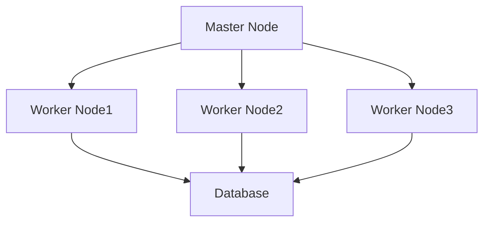
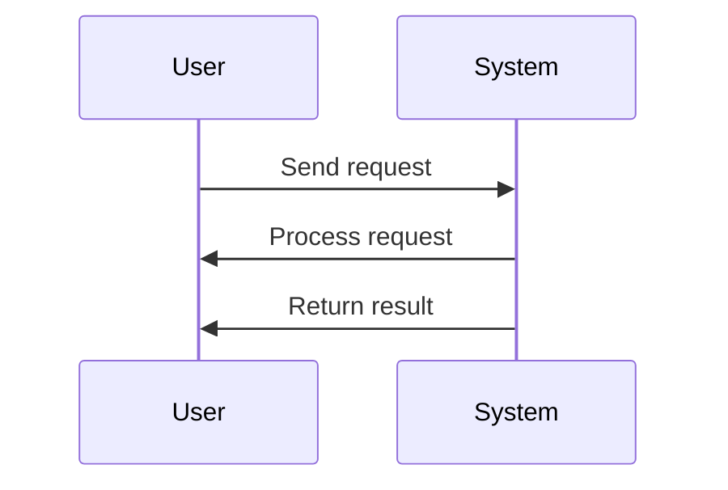

                 


---

**# 分布式系统：增强LLM应用的计算能力**

**关键词**：分布式系统、计算能力、大规模语言模型（LLM）、性能优化、数据并行处理

**摘要**：
本文将探讨如何利用分布式系统来提升大规模语言模型（LLM）的计算能力。通过对分布式系统的概述，核心概念分析，算法原理讲解，系统分析与设计，项目实施与案例分析，以及最佳实践总结，本文旨在为开发者提供全面的指南，以便在实际项目中有效利用分布式系统增强LLM的计算能力。

**第一部分：分布式系统概述**

**1.1 分布式系统简介**
分布式系统是计算机科学中的一个重要领域，它通过将任务分布在多个计算机节点上，实现了资源共享、负载均衡和高可用性。在LLM应用中，分布式系统的作用尤为关键，它能够显著提升模型的训练和推理效率。

**1.1.1 问题背景与定义**
随着数据量和计算需求的不断增加，单机系统已难以满足大规模语言模型的训练需求。分布式系统提供了扩展计算能力、提高系统性能的解决方案。

**1.1.2 分布式系统的核心挑战**
分布式系统面临的主要挑战包括数据一致性、容错性、通信成本和系统复杂度。

**1.1.3 分布式系统的优势与局限**
分布式系统的优势包括并行处理、可扩展性和高可用性，但同时也存在一定的局限，如系统复杂性、通信开销和一致性问题。

**1.2 核心概念与联系**
分布式系统的核心概念包括节点、通信协议、一致性模型、分布式算法等。以下是核心概念的ER图：

```mermaid
erDiagram
  Node ||--|{ CommunicationProtocol }|--|| Server
  Node ||--|{ ConsistencyModel }|--|| Cluster
  Node ||--|{ DistributedAlgorithm }|--|| System
```

**1.3 分布式系统原理**
分布式系统的工作原理基于任务划分、节点通信和数据一致性的原则。以下是分布式算法的流程图：


**第二部分：分布式系统在LLM中的应用**

**2.1 LLM计算能力面临的挑战**
大规模语言模型在训练和推理过程中，面临着计算资源需求大、数据传输慢、训练时间长等挑战。

**2.2 分布式系统在LLM中的应用场景**
分布式系统在LLM中的应用主要包括模型训练、推理服务部署、数据预处理和后处理等。

**2.3 数据并行处理**
数据并行处理是分布式系统中提高计算能力的关键技术，它通过将数据集划分为多个部分，并行地在不同的节点上处理，从而加速模型训练。

**2.4 分布式算法在LLM中的应用**
分布式算法在LLM中的应用包括参数服务器、数据并行、模型并行等。

**第三部分：系统分析与设计**

**3.1 问题场景描述**
在本文的案例中，我们将以一个大型语言模型训练项目为例，分析分布式系统的设计与实现。

**3.2 系统设计**
系统设计包括领域模型、架构设计、接口设计等方面。以下是系统的领域模型：

```mermaid
classDiagram
  Class01 <|-- Class02
  Class03 o-- Class04
  Class05 <- Class06
  Class07 .. Class08
  Class09 --> Class10
endclass
```

以下是系统的架构设计：



以下是系统的接口设计：



**第四部分：项目实施与案例分析**

**4.1 环境搭建**
在项目实施中，首先需要搭建分布式计算环境，包括计算节点、存储节点和网络通信等。

**4.2 核心实现**
核心实现包括模型训练、数据预处理、分布式存储和通信等。

**4.3 案例分析**
我们将通过一个实际案例，分析分布式系统在LLM应用中的具体实施过程和效果。

**第五部分：最佳实践与总结**

**5.1 最佳实践**
在分布式系统设计和实施过程中，需要注意以下最佳实践：
- 确保数据一致性
- 合理分配计算资源
- 优化网络通信
- 灵活调整系统参数

**5.2 小结**
本文介绍了分布式系统在LLM应用中的重要性，并详细分析了分布式系统的核心概念、算法原理、系统设计与实现过程。通过案例分析和最佳实践总结，为开发者提供了实际操作的指南。

**5.3 注意事项**
- 在分布式系统设计时，要充分考虑系统的可扩展性和容错性。
- 在模型训练过程中，要确保数据的质量和一致性。
- 在项目实施过程中，要密切关注系统的性能和稳定性。

**5.4 拓展阅读**
- [1] 分布式系统原理与范型
- [2] 大规模语言模型训练技术
- [3] 分布式计算与并行处理
- [4] AI系统设计最佳实践

---

**作者**：
AI天才研究院/AI Genius Institute & 禅与计算机程序设计艺术 /Zen And The Art of Computer Programming

