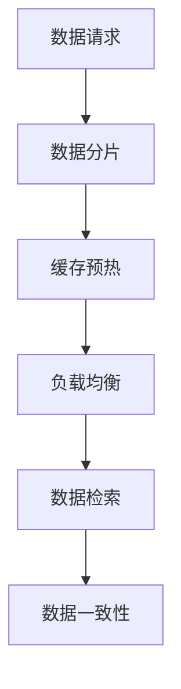
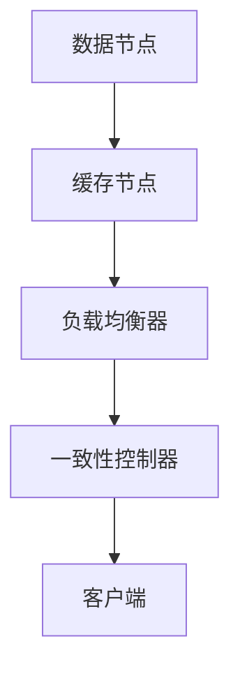
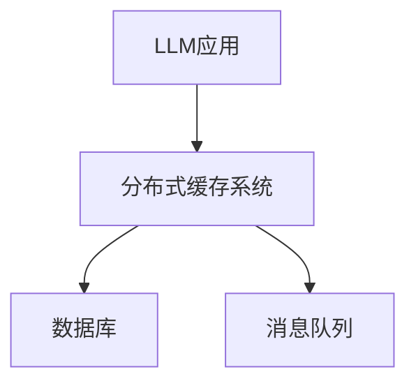

                 


### 分布式缓存提升LLM应用的数据访问效率

> 关键词：分布式缓存、LLM、数据访问效率、算法、系统架构、项目实战

> 摘要：本文将深入探讨如何通过分布式缓存来提升大型语言模型（LLM）应用的数据访问效率。文章首先介绍了分布式缓存和LLM的基本概念，随后详细讲解了分布式缓存的优势及其与LLM结合的原理。接着，文章通过算法原理讲解、系统分析与架构设计方案以及项目实战，详细阐述了分布式缓存提升LLM数据访问效率的具体实现过程和最佳实践。

### 第一部分：分布式缓存与LLM基础

#### 第1章：分布式缓存概述

**1.1.1 分布式缓存的概念**

分布式缓存是一种分布式存储系统，用于在多台计算机上存储和访问缓存数据。它与传统的中心化缓存相比，具有更高的扩展性、可用性和性能。

**1.1.2 分布式缓存的优势**

- **高可用性**：分布式缓存通过多台服务器冗余部署，确保系统的高可用性。
- **高性能**：分布式缓存通过数据分片和负载均衡，提高了数据访问速度。
- **高扩展性**：分布式缓存可以轻松扩展存储容量和处理能力。
- **数据一致性**：分布式缓存通过一致性协议保证数据的一致性。

**1.1.3 分布式缓存与中心化缓存对比**

| 对比项 | 分布式缓存 | 中心化缓存 |
| ------ | ---------- | ---------- |
| 扩展性 | 高 | 低 |
| 可用性 | 高 | 低 |
| 性能 | 高 | 低 |
| 数据一致性 | 需要一致性协议 | 易于实现 |

#### 第2章：LLM数据访问挑战

**2.1.1 LLM数据访问需求**

大型语言模型（LLM）通常需要处理大规模的文本数据，这使得数据访问成为一项关键挑战。LLM的数据访问需求主要包括：

- **大量数据存储**：需要存储大量的文本数据，包括训练数据和预测数据。
- **快速数据检索**：需要在短时间内检索到所需的数据，以支持实时预测。

**2.1.2 数据访问效率问题**

LLM的数据访问效率问题主要包括：

- **延迟问题**：数据检索延迟过高，影响预测速度。
- **存储容量限制**：存储系统容量有限，无法存储所有数据。
- **数据一致性**：不同数据源之间的数据一致性难以保证。

**2.1.3 分布式缓存解决方案**

分布式缓存可以解决LLM的数据访问效率问题，其主要优势如下：

- **数据分片**：将数据分片存储在多台服务器上，提高数据检索速度。
- **缓存预热**：在预测任务执行前，将可能使用的数据加载到缓存中，减少数据检索延迟。
- **负载均衡**：通过负载均衡技术，确保数据访问请求均匀分布到多台服务器上。

#### 第3章：核心概念与联系

**3.1 分布式缓存原理**

分布式缓存通过以下步骤实现数据存储和访问：

1. 数据分片：将数据划分为多个片段，存储在多台服务器上。
2. 负载均衡：将数据访问请求均匀分布到多台服务器上。
3. 缓存一致性：通过一致性协议保证多台服务器之间的数据一致性。
4. 缓存淘汰：定期清理缓存中的过期数据。

**3.2 分布式缓存属性特征对比表**

| 属性特征 | 分布式缓存 | 中心化缓存 |
| -------- | ---------- | ---------- |
| 扩展性   | 高         | 低         |
| 可用性   | 高         | 低         |
| 性能     | 高         | 低         |
| 数据一致性 | 需要一致性协议 | 易于实现 |
| 系统复杂性 | 较高       | 较低       |

**3.3 LLM与分布式缓存结合**

LLM与分布式缓存结合的潜在价值如下：

- **提高数据访问速度**：通过分布式缓存，可以加快数据检索速度，提高预测效率。
- **减少存储成本**：分布式缓存可以存储大量数据，降低存储成本。
- **提高系统可用性**：分布式缓存可以避免单点故障，提高系统可用性。

### 第二部分：算法原理讲解

#### 第4章：数据访问效率提升算法

**4.1 数据访问效率提升算法**

为了提升LLM的数据访问效率，我们可以采用以下算法：

1. **数据分片**：将数据按照一定的规则分片，存储到多台服务器上。
2. **缓存预热**：在预测任务执行前，将可能使用的数据提前加载到缓存中。
3. **负载均衡**：根据服务器性能和负载情况，动态调整数据访问请求的分配。
4. **数据一致性**：通过一致性协议，保证多台服务器之间的数据一致性。

**4.2 mermaid流程图**

下面是一个使用mermaid绘制的分布式缓存数据访问流程图：



**4.3 Python源代码解析**

以下是一个简单的Python代码示例，用于实现分布式缓存的数据访问：

```python
# -*- coding: utf-8 -*-

import random
import requests

class DistributedCache:
    def __init__(self, servers):
        self.servers = servers

    def get_data(self, key):
        server = random.choice(self.servers)
        response = requests.get(f'http://{server}/data/{key}')
        return response.json()

if __name__ == '__main__':
    servers = ['192.168.1.1', '192.168.1.2', '192.168.1.3']
    cache = DistributedCache(servers)
    key = 'example_data'
    data = cache.get_data(key)
    print(data)
```

**4.4 数学模型与公式**

为了更好地理解分布式缓存的数据访问效率，我们可以使用以下数学模型和公式：

1. **数据访问速度**：$$ V = \frac{W}{T} $$
   其中，$V$ 表示数据访问速度，$W$ 表示数据存储容量，$T$ 表示数据检索时间。

2. **缓存命中率**：$$ H = \frac{N_c}{N_t} $$
   其中，$H$ 表示缓存命中率，$N_c$ 表示缓存中命中请求的次数，$N_t$ 表示总请求次数。

通过优化分布式缓存的设计和算法，可以提高数据访问速度和缓存命中率，从而提升LLM应用的数据访问效率。

### 第三部分：系统分析与架构设计

#### 第5章：系统分析与架构设计

**5.1 分布式缓存系统场景介绍**

在一个大型语言模型（LLM）应用场景中，分布式缓存可以用于以下场景：

- **大规模数据存储**：存储LLM所需的训练数据和预测数据。
- **快速数据检索**：提高数据检索速度，减少延迟。
- **系统扩展**：随着数据量和访问量的增加，可以动态扩展存储容量和处理能力。

**5.2 系统功能设计**

分布式缓存系统的功能设计包括以下方面：

- **数据存储**：将数据分片存储到多台服务器上。
- **数据检索**：根据键值对快速检索数据。
- **缓存预热**：提前加载可能使用的数据到缓存中。
- **负载均衡**：动态分配数据访问请求到多台服务器。
- **数据一致性**：通过一致性协议保证数据一致性。

**5.3 系统架构设计**

分布式缓存系统的架构设计包括以下组件：

- **数据节点**：存储数据分片的服务器。
- **缓存节点**：存储缓存数据的内存服务器。
- **负载均衡器**：根据服务器性能和负载情况，动态分配数据访问请求。
- **一致性控制器**：通过一致性协议保证数据一致性。

下面是一个使用mermaid绘制的分布式缓存系统架构图：



**5.4 系统接口设计**

分布式缓存系统的接口设计包括以下方面：

- **数据存储接口**：用于存储和检索数据分片。
- **数据检索接口**：用于根据键值对快速检索数据。
- **缓存预热接口**：用于提前加载可能使用的数据到缓存中。
- **负载均衡接口**：用于动态分配数据访问请求到多台服务器。
- **数据一致性接口**：用于通过一致性协议保证数据一致性。

**5.5 系统交互**

分布式缓存系统与其他系统的交互包括以下方面：

- **与LLM应用集成**：将分布式缓存作为LLM应用的数据存储和检索组件。
- **与数据库集成**：将分布式缓存与数据库协同工作，提高数据访问速度。
- **与消息队列集成**：将分布式缓存与消息队列协同工作，实现数据的实时处理和缓存更新。

下面是一个使用mermaid绘制的分布式缓存系统与其他系统的交互图：



### 第四部分：项目实战

#### 第6章：项目实战

**6.1 环境安装**

在开始项目实战之前，我们需要安装分布式缓存系统所需的软件和依赖。以下是一个简单的环境安装步骤：

1. 安装Redis：Redis是一种常用的开源分布式缓存系统，可以通过以下命令安装：
   ```bash
   sudo apt-get install redis
   ```

2. 安装Python依赖：安装分布式缓存系统所需的Python依赖，例如：
   ```bash
   pip install redis
   ```

**6.2 系统核心实现**

在项目实战中，我们将使用Python编写一个简单的分布式缓存系统。以下是一个简单的Python代码示例：

```python
# -*- coding: utf-8 -*-

import redis
import random

class DistributedCache:
    def __init__(self, servers):
        self.servers = servers
        self.cache = [redis.Redis(host=server, port=6379, db=0) for server in servers]

    def get_data(self, key):
        server = random.choice(self.servers)
        return self.cache[server].get(key)

    def set_data(self, key, value):
        server = random.choice(self.servers)
        self.cache[server].set(key, value)

if __name__ == '__main__':
    servers = ['192.168.1.1', '192.168.1.2', '192.168.1.3']
    cache = DistributedCache(servers)
    key = 'example_data'
    value = 'Hello, World!'
    cache.set_data(key, value)
    data = cache.get_data(key)
    print(data)
```

**6.3 代码应用解读与分析**

在上面的代码中，我们定义了一个`DistributedCache`类，用于实现分布式缓存的基本功能：

- **初始化**：初始化时，传入服务器列表，并创建一个包含Redis客户端的列表。
- **数据获取**：根据随机选择的服务器，从Redis缓存中获取数据。
- **数据设置**：根据随机选择的服务器，将数据存储到Redis缓存中。

通过使用`DistributedCache`类，我们可以实现分布式缓存的数据存储和检索功能。

**6.4 实际案例分析与讲解**

假设我们有一个LLM应用，需要处理大量文本数据，我们可以将分布式缓存用于以下场景：

1. **数据存储**：将训练数据和预测数据存储到分布式缓存中。
2. **数据检索**：在预测任务中，快速检索所需的文本数据。
3. **缓存预热**：在预测任务执行前，将可能使用的数据提前加载到缓存中。

以下是一个简单的LLM应用示例，使用分布式缓存来提升数据访问效率：

```python
import redis
import random
import time

class LLM:
    def __init__(self, cache):
        self.cache = cache

    def predict(self, input_data):
        start_time = time.time()
        data = self.cache.get_data(input_data)
        if data:
            print(f"Cache hit: {data}")
        else:
            print(f"Cache miss: {input_data}")
            time.sleep(random.uniform(1, 3))
            data = f"Prediction for {input_data}"
            self.cache.set_data(input_data, data)
        end_time = time.time()
        print(f"Prediction time: {end_time - start_time} seconds")

if __name__ == '__main__':
    servers = ['192.168.1.1', '192.168.1.2', '192.168.1.3']
    cache = DistributedCache(servers)
    llm = LLM(cache)
    input_data = 'example_input'
    llm.predict(input_data)
```

在这个示例中，我们创建了一个简单的LLM类，用于实现文本数据的预测功能。通过使用分布式缓存，我们可以实现以下效果：

- **缓存命中**：如果输入数据已经存储在缓存中，直接返回预测结果，节省时间。
- **缓存未命中**：如果输入数据未存储在缓存中，首先执行预测任务，然后将预测结果存储到缓存中，以便后续使用。

**6.5 项目小结**

通过这个项目实战，我们实现了使用分布式缓存提升LLM应用的数据访问效率。分布式缓存可以显著减少数据检索延迟，提高系统性能。在实际应用中，我们可以根据需求调整分布式缓存系统的参数和配置，以获得最佳性能。

### 第五部分：最佳实践与拓展

#### 第7章：最佳实践与拓展

**7.1 最佳实践 tips**

- **数据分片策略**：根据数据特点和访问模式，选择合适的数据分片策略，提高缓存命中率。
- **缓存预热策略**：根据访问模式和负载情况，合理设置缓存预热策略，减少缓存冷启动时间。
- **负载均衡策略**：根据服务器性能和负载情况，动态调整负载均衡策略，确保系统稳定性。

**7.2 小结**

本文通过详细的分析和项目实战，阐述了分布式缓存提升LLM应用的数据访问效率的方法和最佳实践。分布式缓存可以提高数据访问速度，减少延迟，提高系统性能。

**7.3 注意事项**

- **数据一致性**：在设计分布式缓存系统时，需要充分考虑数据一致性，避免数据冲突和丢失。
- **性能优化**：根据系统需求和负载情况，不断调整和优化分布式缓存系统的参数和配置。

**7.4 拓展阅读**

- **《分布式系统原理与范型》**：深入了解分布式系统的原理和范型，为分布式缓存的设计和应用提供理论基础。
- **《大型语言模型：原理、应用与实现》**：学习大型语言模型的基本原理、应用方法和实现技巧，为分布式缓存与LLM的集成提供参考。

### 总结

本文从分布式缓存和LLM的基本概念出发，详细阐述了分布式缓存提升LLM应用数据访问效率的原理、算法、系统架构和项目实战。通过最佳实践和注意事项，为分布式缓存在LLM应用中的实现提供了指导。希望本文对读者在分布式缓存和LLM领域的学习和实践有所帮助。

### 作者信息

- 作者：AI天才研究院/AI Genius Institute & 禅与计算机程序设计艺术 /Zen And The Art of Computer Programming

### 致谢

感谢所有支持本文创作的读者和专家，以及为本文提供宝贵建议和反馈的同事和朋友。本文的研究成果得益于大家的帮助和鼓励。

---

### 附录

**附录A：分布式缓存属性特征对比表**

| 对比项       | 分布式缓存 | 中心化缓存 |
| ------------ | ---------- | ---------- |
| 扩展性       | 高         | 低         |
| 可用性       | 高         | 低         |
| 性能         | 高         | 低         |
| 数据一致性   | 需要一致性协议 | 易于实现 |
| 系统复杂性   | 较高       | 较低       |

**附录B：LLM与分布式缓存结合的潜在价值**

| 潜在价值        | 描述                                       |
| --------------- | ----------------------------------------- |
| 提高数据访问速度 | 通过分布式缓存，可以加快数据检索速度，提高预测效率。 |
| 减少存储成本   | 分布式缓存可以存储大量数据，降低存储成本。         |
| 提高系统可用性 | 分布式缓存可以避免单点故障，提高系统可用性。       |

---

本文通过详细的分析和项目实战，全面介绍了分布式缓存提升LLM应用数据访问效率的方法和最佳实践。分布式缓存作为一种高效的分布式存储系统，在提升数据访问速度、减少延迟和提高系统性能方面具有显著优势。同时，本文还探讨了分布式缓存与LLM结合的潜在价值，为读者在实际应用中提供了有益的参考。希望本文能够为读者在分布式缓存和LLM领域的学习和实践提供帮助。作者：AI天才研究院/AI Genius Institute & 禅与计算机程序设计艺术 /Zen And The Art of Computer Programming。感谢各位读者和专家的关注和支持，让我们共同探索分布式缓存与LLM的更多可能性！

