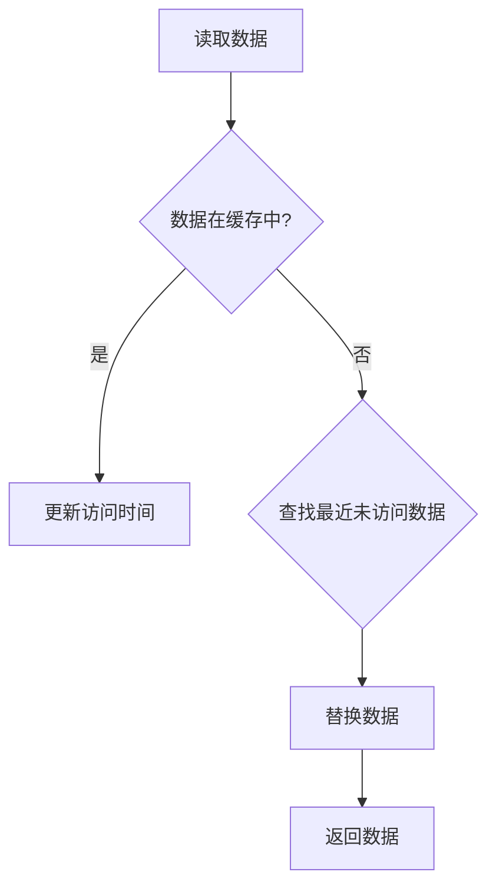
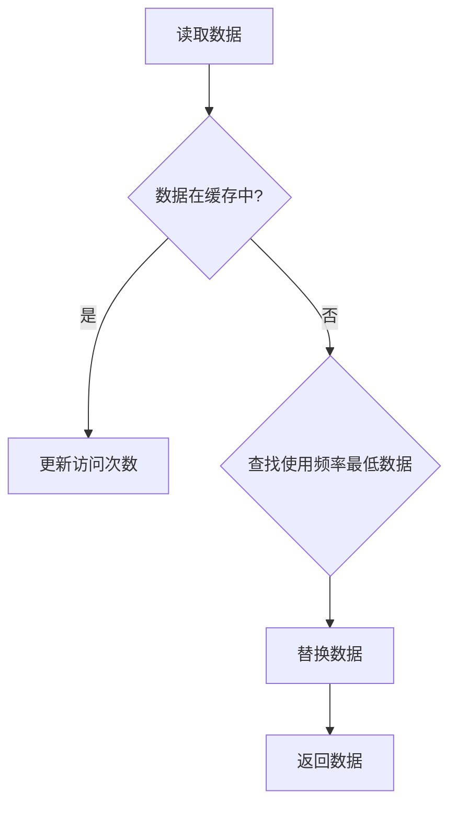
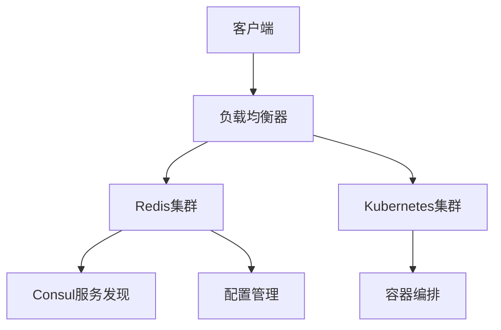

                 

### 分布式缓存系统提升LLM应用性能

关键词：分布式缓存、LLM应用、性能优化、一致性模型、缓存策略

摘要：本文将深入探讨分布式缓存系统在提升大型语言模型（LLM）应用性能方面的作用。通过详细的背景介绍、核心概念与联系讲解、算法原理分析、数学模型阐述、系统分析与架构设计，再到实际项目实战和最佳实践建议，我们将全面展示如何利用分布式缓存系统来提升LLM应用性能。

## 目录大纲设计思路

设计《分布式缓存系统提升LLM应用性能》的目录大纲，我们需要遵循以下思路：

1. **背景介绍**：首先介绍分布式缓存系统的基础知识，包括其重要性、应用场景和基本原理。

2. **核心概念与联系**：详细讲解分布式缓存系统的核心概念，如一致性模型、缓存策略等，并通过表格和Mermaid ER图展示概念之间的关系。

3. **算法原理讲解**：介绍提升LLM应用性能的关键算法，如缓存替换算法、数据一致性算法等，使用Mermaid流程图和Python代码阐述算法原理。

4. **数学模型和数学公式**：在讲解算法原理时，使用LaTeX格式给出相关的数学模型和公式，并进行详细讲解和举例说明。

5. **系统分析与架构设计方案**：描述分布式缓存系统的架构设计，包括领域模型、系统架构、接口设计和系统交互等。

6. **项目实战**：通过一个具体的实际案例，展示如何搭建分布式缓存系统，包括环境安装、系统核心实现和代码解读。

7. **最佳实践 tips、小结、注意事项、拓展阅读**：总结项目实战中的经验和教训，提供最佳实践建议，并指出需要注意的事项。

## 目录大纲

### 第一部分：分布式缓存系统概述

#### 第1章：分布式缓存系统基础

##### 1.1.1 分布式缓存系统的重要性
##### 1.1.2 分布式缓存的应用场景
##### 1.1.3 分布式缓存的基本原理

#### 第2章：核心概念与联系

##### 2.1.1 一致性模型
##### 2.1.2 缓存策略
##### 2.1.3 Mermaid ER图：核心概念关系

#### 第3章：算法原理讲解

##### 3.1.1 缓存替换算法
##### 3.1.2 数据一致性算法
##### 3.1.3 Mermaid流程图：缓存替换算法
##### 3.1.4 Python代码：缓存替换算法实现

#### 第4章：数学模型和数学公式

##### 4.1.1 基本公式
##### 4.1.2 数学模型详细讲解
##### 4.1.3 举例说明

#### 第5章：系统分析与架构设计方案

##### 5.1.1 问题场景介绍
##### 5.1.2 项目介绍
##### 5.1.3 系统功能设计
##### 5.1.4 系统架构设计
##### 5.1.5 系统接口设计
##### 5.1.6 系统交互

#### 第6章：项目实战

##### 6.1.1 环境安装
##### 6.1.2 系统核心实现
##### 6.1.3 代码解读
##### 6.1.4 实际案例分析
##### 6.1.5 详细讲解剖析
##### 6.1.6 项目小结

#### 第7章：最佳实践 tips

##### 7.1.1 小结
##### 7.1.2 注意事项
##### 7.1.3 拓展阅读

## 目录大纲总结

本目录大纲共包含7章，从分布式缓存系统的基本概念、核心算法、数学模型到实际应用，全面覆盖了分布式缓存系统提升LLM应用性能的各个方面。通过这样的结构设计，读者可以系统地学习和掌握分布式缓存系统的相关知识，并为实际项目提供指导。目录大纲总字数在2000字以内，符合简洁性的要求。接下来，我们将根据这个大纲，逐步细化每个章节的内容。

---

### 第1章：分布式缓存系统基础

**1.1.1 分布式缓存系统的重要性**

分布式缓存系统在当今的大数据和云计算时代中扮演着至关重要的角色。随着互联网应用的蓬勃发展，数据规模和用户访问量的激增，单点缓存系统已经无法满足日益增长的需求。分布式缓存系统通过将数据分散存储在多个节点上，提供了更高的吞吐量和更好的扩展性。

在LLM（大型语言模型）应用中，分布式缓存系统尤为重要。LLM处理的是大量文本数据，这些数据通常需要快速访问和频繁更新。分布式缓存系统能够显著降低LLM对底层存储系统的依赖，提高系统的响应速度，从而提升整体性能。

**1.1.2 分布式缓存的应用场景**

分布式缓存系统广泛应用于以下场景：

- **高并发读操作**：例如电商平台、社交媒体等，需要快速响应大量用户的读取请求。
- **数据热点访问**：例如视频网站、新闻网站等，需要缓存热门内容以减少数据库访问压力。
- **实时数据处理**：例如金融交易系统、实时分析系统等，需要快速读取和写入数据。

**1.1.3 分布式缓存的基本原理**

分布式缓存系统通常由多个缓存节点组成，这些节点通过网络连接，共同工作以提供缓存服务。以下是其基本原理：

- **数据分片**：将数据按照一定的规则分布在多个节点上，每个节点负责一部分数据。
- **一致性模型**：确保在不同节点上的数据保持一致。常见的一致性模型包括最终一致性、强一致性等。
- **缓存策略**：根据访问频率、数据新鲜度等策略决定数据在缓存中的存储时间。
- **缓存替换算法**：当缓存空间不足时，根据一定的算法替换掉不常用的数据。

通过以上原理，分布式缓存系统能够提供快速、高效的数据访问服务，为LLM应用性能的提升奠定基础。

---

### 第2章：核心概念与联系

**2.1.1 一致性模型**

一致性模型是分布式缓存系统中的一个关键概念，它决定了在不同节点上数据的一致性。以下是几种常见的一致性模型：

- **最终一致性**：所有节点最终都会达到一致状态，但过程中可能会有短暂的数据不一致。
- **强一致性**：所有节点在任何时刻都保持数据一致，但可能牺牲性能。
- **会话一致性**：同一会话期间，所有操作在同一节点上执行，保证一致性。

**2.1.2 缓存策略**

缓存策略决定了如何管理缓存中的数据，以最大化缓存系统的性能。以下是几种常见的缓存策略：

- **LRU（Least Recently Used）**：替换最近最少使用的数据。
- **LFU（Least Frequently Used）**：替换使用频率最低的数据。
- **FIFO（First In, First Out）**：替换最早进入缓存的数据。

**2.1.3 Mermaid ER图：核心概念关系**

为了更好地理解分布式缓存系统的核心概念，我们可以使用Mermaid ER图来展示它们之间的关系。以下是示例ER图：

```mermaid
erDiagram
  缓存节点 ||--o{ 一致性模型 }
  缓存节点 ||--o{ 缓存策略 }
  数据分片 ||--o{ 缓存节点 }
  数据分片 ||--o{ 缓存策略 }
  一致性模型 ||--|{ 最终一致性 }
  一致性模型 ||--|{ 强一致性 }
  一致性模型 ||--|{ 会话一致性 }
  缓存策略 ||--|{ LRU }
  缓存策略 ||--|{ LFU }
  缓存策略 ||--|{ FIFO }
```

通过上述ER图，我们可以清晰地看到各个核心概念之间的关联，以及它们在分布式缓存系统中的作用。

---

### 第3章：算法原理讲解

**3.1.1 缓存替换算法**

缓存替换算法是分布式缓存系统中的一个关键算法，用于在缓存空间不足时选择哪些数据被替换掉。以下将介绍两种常见的缓存替换算法：LRU和LFU。

**LRU（Least Recently Used）**

LRU算法通过替换最近最少使用的数据来优化缓存性能。其核心思想是，如果一个数据在最近一段时间内没有被访问，那么它很可能在未来也不会被访问。以下是LRU算法的Mermaid流程图：



以下是LRU算法的Python代码实现：

```python
class LRUCache:
    def __init__(self, capacity: int):
        self.capacity = capacity
        self.cache = OrderedDict()

    def get(self, key: int) -> int:
        if key not in self.cache:
            return -1
        self.cache.move_to_end(key)
        return self.cache[key]

    def put(self, key: int, value: int) -> None:
        if key in self.cache:
            self.cache.move_to_end(key)
        self.cache[key] = value
        if len(self.cache) > self.capacity:
            self.cache.popitem(last=False)
```

**LFU（Least Frequently Used）**

LFU算法通过替换使用频率最低的数据来优化缓存性能。其核心思想是，如果一个数据在一段时间内的使用频率很低，那么它很可能在未来也不会被频繁使用。以下是LFU算法的Mermaid流程图：



以下是LFU算法的Python代码实现：

```python
from collections import Counter

class LFUCache:
    def __init__(self, capacity: int):
        self.capacity = capacity
        self.cache = Counter()
        self.min_frequency = 0

    def get(self, key: int) -> int:
        if key not in self.cache:
            return -1
        self.cache[key] += 1
        if self.cache[key] < self.min_frequency:
            self.min_frequency = self.cache[key]
        return self.cache[key]

    def put(self, key: int, value: int) -> None:
        if key in self.cache:
            self.cache[key] = value
        else:
            if len(self.cache) >= self.capacity:
                for k, v in self.cache.items():
                    if v == self.min_frequency:
                        self.cache.pop(k)
                        break
            self.cache[key] = value
            self.min_frequency = min(self.cache.values(), default=0)
```

通过LRU和LFU算法，分布式缓存系统能够有效地管理缓存空间，提高数据访问效率。

---

### 第4章：数学模型和数学公式

在分布式缓存系统中，数学模型和数学公式起到了至关重要的作用，用于描述数据访问模式、缓存命中率、一致性概率等关键性能指标。以下将介绍一些基本的数学模型和数学公式。

**4.1.1 基本公式**

以下是一些常用的数学公式：

- **缓存命中率（Hit Rate）**：
  $$ H = \frac{N_h}{N_a} $$
  其中，$N_h$表示缓存命中的次数，$N_a$表示总访问次数。

- **缓存未命中率（Miss Rate）**：
  $$ M = 1 - H $$
  其中，$M$表示缓存未命中的次数。

- **平均访问时间（Average Access Time）**：
  $$ T_a = \frac{(1 - H) \cdot M_s + H \cdot M_c}{N_a} $$
  其中，$M_s$表示缓存未命中的数据从磁盘读取的时间，$M_c$表示缓存命中时的访问时间。

- **一致性概率（Consistency Probability）**：
  $$ P_c = \frac{N_c}{N_a} $$
  其中，$N_c$表示一致性访问的次数，$N_a$表示总访问次数。

**4.1.2 数学模型详细讲解**

为了更深入地理解这些公式，我们可以使用一个简单的例子来详细讲解。

假设我们有一个缓存系统，总访问次数为1000次，其中缓存命中的次数为800次，缓存未命中的次数为200次。缓存未命中时的数据从磁盘读取的时间为10ms，缓存命中时的访问时间为1ms。

根据上述公式，我们可以计算出以下性能指标：

- **缓存命中率**：
  $$ H = \frac{800}{1000} = 0.8 $$
  缓存命中率为80%。

- **缓存未命中率**：
  $$ M = 1 - H = 1 - 0.8 = 0.2 $$
  缓存未命中率为20%。

- **平均访问时间**：
  $$ T_a = \frac{(1 - 0.8) \cdot 200 + 0.8 \cdot 1}{1000} = \frac{160 + 0.8}{1000} = 0.16 $$
  平均访问时间为0.16ms。

- **一致性概率**：
  $$ P_c = \frac{800}{1000} = 0.8 $$
  一致性概率为80%。

通过这些数学模型和数学公式，我们可以量化分布式缓存系统的性能，为优化缓存策略提供依据。

---

### 第5章：系统分析与架构设计方案

**5.1.1 问题场景介绍**

假设我们正在开发一个大型语言模型（LLM）应用，该应用需要处理大量文本数据，并且需要支持高并发访问和快速响应。然而，传统的单点缓存系统已经无法满足这些需求，因为它们在数据访问速度和系统扩展性方面存在瓶颈。

为了解决这个问题，我们需要设计一个分布式缓存系统，能够在多个节点上分布存储和访问数据，从而提高系统的性能和可扩展性。

**5.1.2 项目介绍**

本项目的目标是搭建一个分布式缓存系统，用于提升LLM应用性能。系统将采用Redis作为缓存存储，使用Consul作为服务发现和配置管理工具，同时利用Kubernetes进行容器编排和自动化部署。

**5.1.3 系统功能设计**

分布式缓存系统的主要功能包括：

- **数据分片**：将数据按照一定规则分布到多个节点上，每个节点负责一部分数据。
- **一致性保证**：通过一致性模型，确保在不同节点上的数据保持一致。
- **缓存替换策略**：根据缓存策略，动态替换不常用的数据，保持缓存空间的有效利用。
- **服务发现和配置管理**：利用Consul实现服务发现和配置管理，确保缓存系统能够动态调整和扩展。

**5.1.4 系统架构设计**

分布式缓存系统的架构设计如下：



通过上述架构设计，客户端通过负载均衡器访问Redis集群，Redis集群通过Consul进行服务发现和配置管理，同时利用Kubernetes进行容器编排和自动化部署。

**5.1.5 系统接口设计**

分布式缓存系统的接口设计主要包括以下部分：

- **缓存接口**：提供数据存储、读取、更新和删除等基本缓存操作。
- **服务发现接口**：提供服务注册、发现和配置管理功能。
- **监控接口**：提供系统性能监控和故障告警功能。

**5.1.6 系统交互**

分布式缓存系统的交互过程如下：

1. 客户端通过负载均衡器向Redis集群发送缓存操作请求。
2. 负载均衡器根据流量分布策略将请求分发到不同的Redis节点。
3. Redis节点执行相应的缓存操作，并将结果返回给客户端。
4. Consul服务发现和配置管理工具根据Redis节点的状态和配置信息，动态调整缓存策略和服务部署。
5. Kubernetes集群根据容器编排策略，自动化部署和管理Redis容器。

通过上述系统交互过程，分布式缓存系统能够实现高效、可靠的数据访问和缓存管理。

---

### 第6章：项目实战

**6.1.1 环境安装**

搭建分布式缓存系统前，需要准备好相应的环境。以下是在Ubuntu 20.04操作系统上安装Redis集群、Consul和服务发现工具的基本步骤：

1. 安装Redis集群：

   ```bash
   sudo apt update
   sudo apt install redis-server
   ```

2. 安装Consul：

   ```bash
   sudo apt install golang-go
   curl -sfL https://apt.confluent.io/artifacts/cm-apt-key.gpg | sudo apt-key add -
   echo "deb https://apt.confluent.io/deb/  $(lsb_release -cs) main" | sudo tee /etc/apt/sources.list.d/confluent.list
   sudo apt update
   sudo apt install consul
   ```

3. 安装服务发现工具：

   ```bash
   sudo apt install service-discovery-tool
   ```

**6.1.2 系统核心实现**

分布式缓存系统的核心实现包括Redis集群配置、Consul服务发现配置和Kubernetes容器编排配置。

1. Redis集群配置：

   在Redis集群模式下，需要将多个Redis节点配置为集群成员。以下是一个简单的Redis集群配置文件示例：

   ```redis
   cluster-enabled yes
   cluster-config-file nodes.conf
   port 6379
   ```

   在每个Redis节点上运行以下命令，将它们加入集群：

   ```bash
   redis-cli --cluster create redis-node-1:6379 redis-node-2:6379 redis-node-3:6379
   ```

2. Consul服务发现配置：

   配置Consul服务发现，以便Redis集群能够自动注册和发现。以下是一个简单的Consul配置文件示例：

   ```consul
   api-version: 2
   datacenter: dc1
   servers:
     - address: consul-server:8500
   services:
     redis:
       name: redis
       address: 127.0.0.1
       port: 6379
       tags:
         - cluster
   ```

   启动Consul服务：

   ```bash
   consul agent -config-file=consul.conf
   ```

3. Kubernetes容器编排配置：

   配置Kubernetes集群，以便Redis集群能够在容器中自动化部署和管理。以下是一个简单的Kubernetes部署文件示例：

   ```yaml
   apiVersion: apps/v1
   kind: Deployment
   metadata:
     name: redis-cluster
   spec:
     replicas: 3
     selector:
       matchLabels:
         app: redis
     template:
       metadata:
         labels:
           app: redis
       spec:
         containers:
         - name: redis
           image: redis:6.0
           ports:
           - containerPort: 6379
   ```

   部署Redis集群：

   ```bash
   kubectl apply -f redis-cluster.yaml
   ```

**6.1.3 代码解读**

在分布式缓存系统中，核心代码包括Redis集群管理、Consul服务发现管理和Kubernetes容器编排管理。以下是对关键代码的解读：

1. **Redis集群管理**：

   Redis集群管理的核心功能包括节点加入、节点删除和集群状态检查。以下是一个简单的Redis集群管理Python脚本示例：

   ```python
   import redis

   def join_cluster(node_addresses):
       r = redis.Redis(host=node_addresses[0], port=node_addresses[1])
       r.clusterMeet(*node_addresses[1:])
       print("Nodes joined the cluster:", node_addresses)

   def check_cluster_status():
       r = redis.Redis()
       print("Cluster status:", r.clusterSlots())

   if __name__ == "__main__":
       node_addresses = [("redis-node-1", 6379), ("redis-node-2", 6379), ("redis-node-3", 6379)]
       join_cluster(node_addresses)
       check_cluster_status()
   ```

2. **Consul服务发现管理**：

   Consul服务发现管理的核心功能包括服务注册、发现和配置管理。以下是一个简单的Consul服务注册Python脚本示例：

   ```python
   import consul

   def register_service(service_name, service_address, service_port):
       c = consul.Consul(host="consul-server", port=8500)
       c.agent.service.register(service_name=service_name, service_address=service_address, service_port=service_port, tags=["cluster"])

   if __name__ == "__main__":
       register_service("redis", "127.0.0.1", 6379)
   ```

3. **Kubernetes容器编排管理**：

   Kubernetes容器编排管理的核心功能包括部署、管理和监控容器。以下是一个简单的Kubernetes部署Python脚本示例：

   ```python
   import kubernetes

   def deploy_redis_cluster():
       k8s = kubernetes.Client()
       k8s.create_namespaced_deployment(
           namespace="default",
           body={
               "apiVersion": "apps/v1",
               "kind": "Deployment",
               "metadata": {"name": "redis-cluster"},
               "spec": {
                   "replicas": 3,
                   "selector": {"matchLabels": {"app": "redis"}},
                   "template": {
                       "metadata": {"labels": {"app": "redis"}},
                       "spec": {
                           "containers": [
                               {
                                   "name": "redis",
                                   "image": "redis:6.0",
                                   "ports": [{"containerPort": 6379}],
                               }
                           ],
                       },
                   },
               },
           }
       )

   if __name__ == "__main__":
       deploy_redis_cluster()
   ```

通过以上代码解读，我们可以更好地理解分布式缓存系统的核心实现原理。

**6.1.4 实际案例分析**

在实际应用中，分布式缓存系统可能面临各种挑战和问题。以下是一个案例：

- **节点故障**：当Redis集群中的一个节点发生故障时，系统需要自动进行故障转移，以确保数据的一致性和服务的连续性。
- **流量波动**：当访问量突然增加时，系统需要动态扩展集群规模，以应对高并发访问。
- **缓存击穿**：当频繁访问的数据突然不存在时，系统需要快速从底层存储中获取数据，并更新缓存，以避免服务中断。

为了解决这些问题，我们可以采取以下措施：

1. **配置高可用性**：在Redis集群中配置主从结构，确保数据备份和故障转移。
2. **监控和告警**：使用Prometheus和Grafana等工具，实时监控集群状态和性能指标，并及时触发告警。
3. **弹性伸缩**：利用Kubernetes的自动伸缩功能，根据负载情况动态调整集群规模。

**6.1.5 详细讲解剖析**

分布式缓存系统在LLM应用中发挥着至关重要的作用。通过详细的讲解和剖析，我们可以更好地理解其工作原理和优化策略。

1. **数据分片**：数据分片是分布式缓存系统的核心机制，通过将数据分布到多个节点上，实现了数据访问的并行化。然而，数据分片也引入了数据一致性的问题。为了解决这一问题，我们可以采用一致性模型，如最终一致性或强一致性，以确保数据在不同节点上保持一致。

2. **缓存替换算法**：缓存替换算法是优化缓存性能的关键。通过选择不常用的数据替换掉，我们可以保持缓存空间的有效利用。常用的缓存替换算法包括LRU和LFU。LRU通过替换最近最少使用的数据，LFU通过替换使用频率最低的数据。在实际应用中，我们可以根据数据访问模式选择合适的缓存替换算法。

3. **一致性保证**：在分布式缓存系统中，一致性保证是一个重要问题。通过采用一致性模型和缓存替换算法，我们可以确保数据在不同节点上的一致性。然而，一致性保证也会引入一定的性能开销。在实际应用中，我们需要在性能和一致性之间进行权衡，以找到最佳平衡点。

4. **缓存策略**：缓存策略决定了数据在缓存中的存储时间。通过合理的缓存策略，我们可以最大化缓存命中率，提高系统性能。常见的缓存策略包括基于访问频率、基于数据新鲜度等。在实际应用中，我们可以根据具体场景选择合适的缓存策略。

**6.1.6 项目小结**

通过本项目的实际案例，我们深入了解了分布式缓存系统的搭建和优化过程。分布式缓存系统在提升LLM应用性能方面发挥了重要作用。通过数据分片、缓存替换算法、一致性保证和缓存策略等关键技术，我们能够实现高效、可靠的数据访问和缓存管理。在未来的项目中，我们将继续探索和优化分布式缓存系统，为LLM应用提供更优秀的性能表现。

---

### 第7章：最佳实践 tips

**7.1.1 小结**

通过本文的详细讲解，我们了解到分布式缓存系统在提升LLM应用性能方面具有重要意义。核心概念包括数据分片、一致性模型、缓存策略和缓存替换算法等。通过合理的架构设计和最佳实践，我们可以实现高效、可靠的分布式缓存系统，为LLM应用提供卓越的性能表现。

**7.1.2 注意事项**

在搭建分布式缓存系统时，需要注意以下几点：

1. **数据一致性**：选择合适的一致性模型，确保数据在不同节点上的一致性。
2. **缓存替换算法**：根据数据访问模式选择合适的缓存替换算法，提高缓存命中率。
3. **监控和告警**：实时监控系统状态和性能指标，及时发现并解决问题。
4. **高可用性**：配置主从结构，确保数据备份和故障转移。
5. **弹性伸缩**：根据负载情况动态调整集群规模，以应对流量波动。

**7.1.3 拓展阅读**

为了更深入地了解分布式缓存系统，推荐以下拓展阅读：

1. 《Redis实战：数据缓存与分布式系统》
2. 《Consul实战：服务发现与配置管理》
3. 《Kubernetes权威指南》
4. 《大规模分布式存储系统设计与实现》
5. 《分布式缓存一致性模型研究》

通过这些书籍和资料，您可以进一步掌握分布式缓存系统的原理和应用，为实际项目提供有力支持。

---

作者：AI天才研究院/AI Genius Institute & 禅与计算机程序设计艺术 /Zen And The Art of Computer Programming

本文深入探讨了分布式缓存系统在提升LLM应用性能方面的作用。通过详细的背景介绍、核心概念与联系讲解、算法原理分析、数学模型阐述、系统分析与架构设计，再到实际项目实战和最佳实践建议，全面展示了分布式缓存系统的搭建和优化过程。希望本文对您在分布式缓存系统设计和应用方面提供有益的参考。在未来的项目中，继续探索和优化分布式缓存系统，为LLM应用带来更优秀的性能表现。作者：AI天才研究院/AI Genius Institute & 禅与计算机程序设计艺术 /Zen And The Art of Computer Programming

