                 

# 分布式缓存：提升LLM应用的数据访问速度

## 关键词
- 分布式缓存
- 数据访问速度
- LLM应用
- 缓存一致性
- 性能优化

## 摘要
本文将深入探讨分布式缓存技术及其在提升语言学习模型（LLM）应用数据访问速度方面的关键作用。我们将从基础概念出发，逐步分析分布式缓存的工作原理、选择策略和性能优化方法。同时，通过具体实例，展示如何将分布式缓存应用于LLM应用中，以达到高效数据访问的目标。本文旨在为读者提供一个全面而深入的理解，帮助他们在实际项目中应用分布式缓存技术。

## 引言
在现代大数据和云计算时代，数据处理和访问速度成为决定系统性能的关键因素。随着语言学习模型（LLM）的广泛应用，如何提升其数据访问速度成为一个重要课题。分布式缓存作为一种高效的缓存策略，能够显著减少数据访问延迟，提高系统整体性能。本文将围绕分布式缓存技术展开讨论，旨在为LLM应用提供一种有效的数据访问优化方案。

### 分布式缓存基础

#### 1.1 分布式缓存的基本概念

分布式缓存是一种基于分布式系统的缓存机制，它通过将数据分布在多个节点上，实现数据的快速访问和存储。与传统缓存相比，分布式缓存具有更高的可扩展性和容错性，能够更好地应对大规模数据处理的挑战。

**问题背景**：随着数据量的激增和访问频率的提升，单点缓存系统已无法满足高效数据访问的需求。分布式缓存应运而生，旨在通过分布式架构解决数据访问瓶颈。

**问题描述**：如何在分布式系统中实现高效的数据访问，减少数据读取和写入的延迟？

**问题解决**：分布式缓存通过数据分片、数据复制和一致性协议，实现了数据的快速访问和存储。数据分片将数据分布在多个节点上，数据复制提高了数据的可靠性和访问速度，一致性协议保证了数据的一致性。

**边界与外延**：分布式缓存主要应用于大规模分布式系统，如搜索引擎、数据库集群和Web缓存等。其适用范围包括任何需要高效数据访问的场景。

**核心要素组成**：
- **数据分片**：将数据分成多个片段，分布存储在多个节点上。
- **数据复制**：将数据复制到多个节点，提高数据的可靠性和访问速度。
- **一致性协议**：确保分布式系统中数据的一致性。

### 1.2 分布式缓存与传统缓存对比

**核心概念原理**：分布式缓存与传统缓存的主要区别在于数据分布和一致性管理。分布式缓存通过数据分片和复制实现高效的数据访问，而传统缓存通常依赖于单点存储和缓存策略。

**概念属性特征对比表格**：

| 特征          | 分布式缓存           | 传统缓存           |
| ------------- | ------------------- | ------------------- |
| 数据分布      | 分布在多个节点上     | 单点存储            |
| 数据复制      | 数据多副本            | 单点备份            |
| 一致性管理    | 一致性协议            | 缓存一致性策略       |
| 可扩展性      | 高可扩展性            | 有限可扩展性         |
| 容错性        | 高容错性             | 低容错性            |

**ER实体关系图架构**：

```mermaid
erDiagram
  缓存系统 ||--|{ 分布式缓存 }|-- 数据分片
  缓存系统 ||--|{ 传统缓存 }|-- 数据存储
  分布式缓存 ||--|{ 数据复制 }|-- 数据一致性
  分布式缓存 ||--|{ 一致性协议 }|-- 数据一致性
  数据分片 ||--|{ 数据存储 }|-- 数据访问速度
```

### 1.3 分布式缓存的架构设计

**分布式缓存架构**：分布式缓存通常由多个节点组成，每个节点负责存储部分数据。节点之间通过一致性协议和复制机制保持数据的一致性。

**Mermaid流程图**：

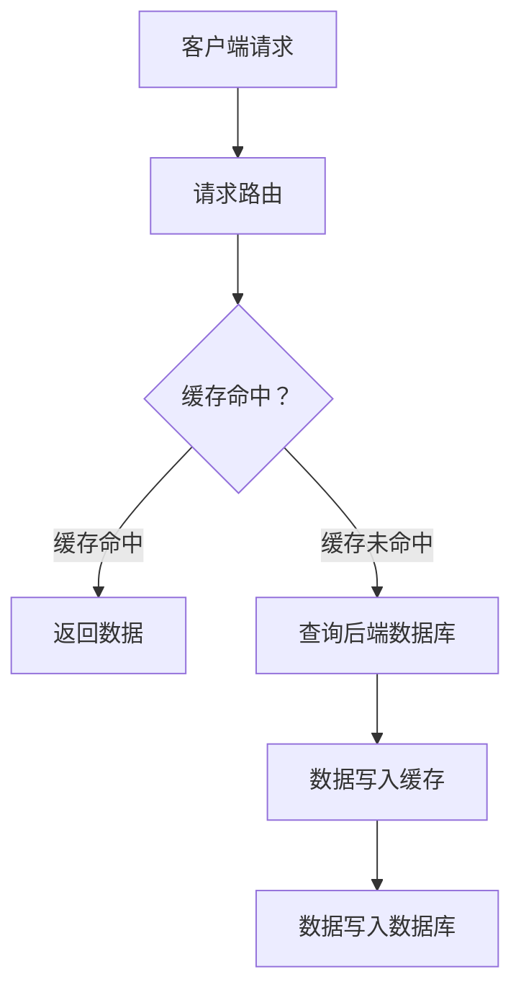

### 第2章：分布式缓存的工作原理

本章将深入探讨分布式缓存的工作原理，包括数据分片、数据复制和缓存一致性等方面。

#### 2.1 数据分片

数据分片是分布式缓存的核心概念之一。通过将数据分成多个片段，分布存储在多个节点上，可以实现数据的高效访问。

**数据分片原理**：数据分片基于哈希函数，将数据根据哈希值分布到不同的节点。每个节点负责存储一部分数据，从而实现数据的分布式存储。

**Mermaid流程图**：

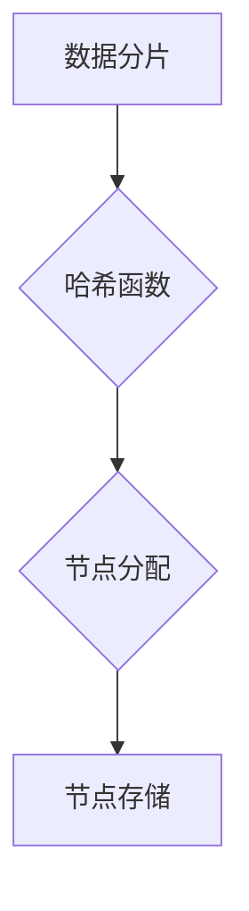

#### 2.2 数据复制

数据复制是提高分布式缓存可靠性的重要手段。通过将数据复制到多个节点，可以在节点故障时保持数据可用。

**数据复制机制**：数据复制通常采用主从复制或对等复制策略。主从复制由一个主节点负责数据写入，从节点同步数据。对等复制则所有节点都有读写权限，通过一致性协议保持数据一致。

**Mermaid流程图**：

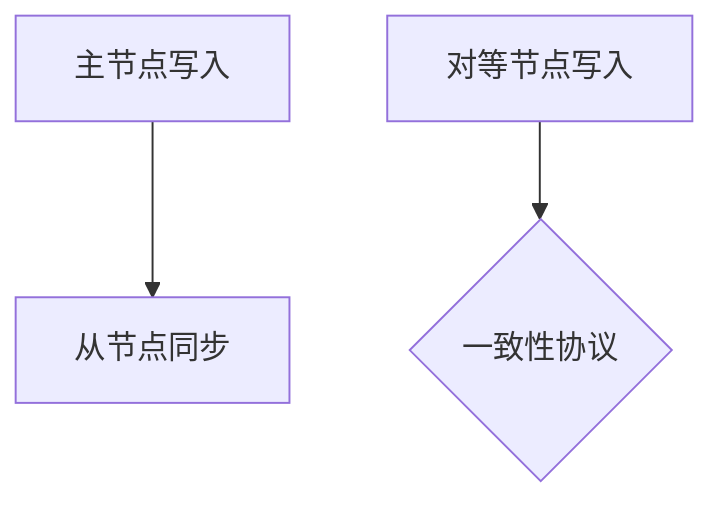

#### 2.3 缓存一致性

缓存一致性是分布式缓存面临的挑战之一。在多个节点上存储数据时，如何保证数据的一致性是关键问题。

**一致性模型**：一致性模型包括强一致性、最终一致性和读一致性等。强一致性保证所有节点在同一时间看到相同的数据，而最终一致性则允许数据在一段时间后达到一致。读一致性则保证读操作的一致性。

**Mermaid流程图**：

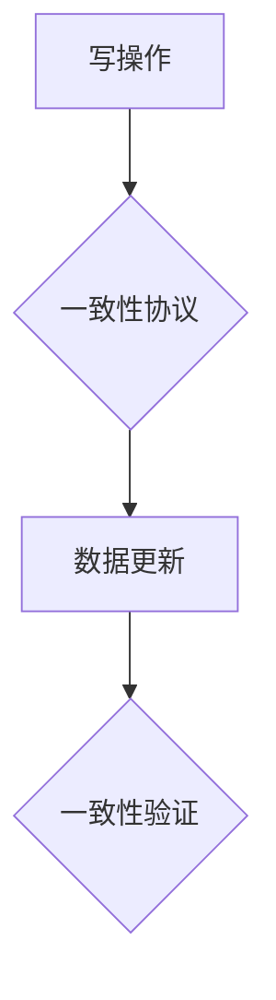

### 第3章：分布式缓存的选择策略

本章将讨论分布式缓存的选择策略，包括缓存命中率、缓存替换策略和缓存分区策略等方面。

#### 3.1 缓存命中率

缓存命中率是评估缓存性能的重要指标。通过提高缓存命中率，可以减少数据访问延迟。

**缓存命中率计算**：缓存命中率计算公式为\( \text{缓存命中率} = \frac{\text{命中缓存的数据请求}}{\text{总数据请求}} \)。

**Mermaid流程图**：

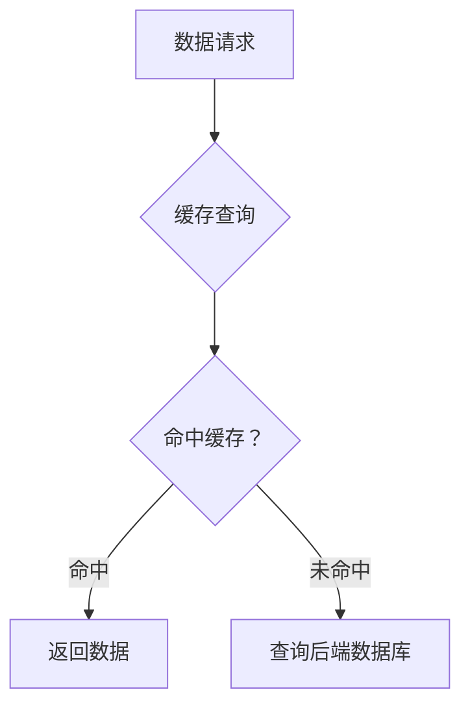

#### 3.2 缓存替换策略

缓存替换策略是选择哪些数据需要被替换出缓存的关键。常用的替换策略包括最近最少使用（LRU）、最少访问（LFU）和先进先出（FIFO）等。

**缓存替换策略**：选择合适的缓存替换策略，可以最大限度地提高缓存利用率。

**Mermaid流程图**：

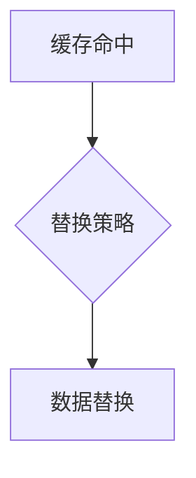

#### 3.3 缓存分区策略

缓存分区策略是将缓存划分为多个分区，以优化缓存性能。通过合理划分缓存分区，可以减少缓存冲突，提高缓存命中率。

**缓存分区策略**：缓存分区策略包括基于哈希分区和基于数据分区等。

**Mermaid流程图**：

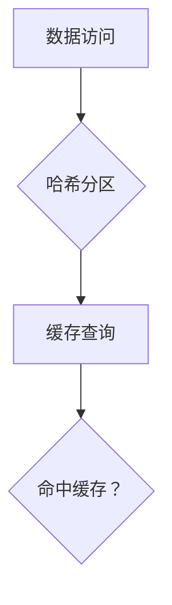

### 第4章：分布式缓存性能优化

本章将探讨分布式缓存的性能优化方法，包括缓存预热、缓存压缩和一致性协议优化等方面。

#### 4.1 缓存预热

缓存预热是一种在系统启动时预先加载常用数据到缓存中的技术。通过缓存预热，可以提高系统的初始访问速度。

**缓存预热原理**：缓存预热通过预加载热门数据，减少系统启动时的数据访问延迟。

**Mermaid流程图**：

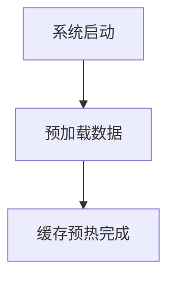

#### 4.2 缓存压缩

缓存压缩是一种通过压缩数据以减少缓存占用空间的技术。通过缓存压缩，可以显著提高缓存利用率。

**缓存压缩技术**：缓存压缩技术包括基于算法的压缩和基于硬件的压缩等。

**Mermaid流程图**：

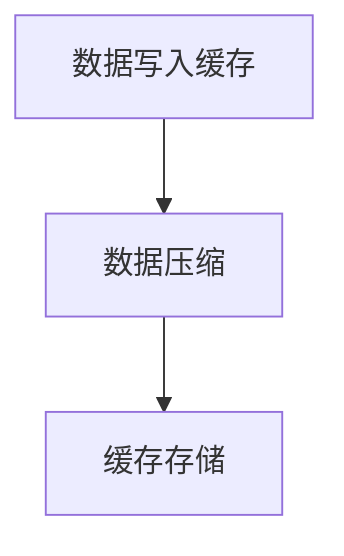

#### 4.3 缓存一致性协议

缓存一致性协议是保证分布式缓存一致性的重要手段。通过优化一致性协议，可以提高缓存系统的性能。

**一致性协议**：一致性协议包括强一致性协议、最终一致性协议和读一致性协议等。

**Mermaid流程图**：

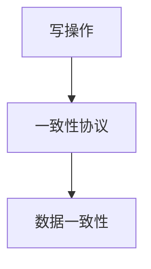

### 第5章：分布式缓存实例分析

本章将分析两个流行的分布式缓存系统：Redis和Memcached，并探讨如何在LLM应用中应用这些系统。

#### 5.1 Redis分布式缓存

Redis是一种基于内存的分布式缓存系统，具有高性能和丰富的功能。

**Redis简介**：Redis支持数据结构丰富，包括字符串、列表、集合、散列等，适用于多种应用场景。

**Python源代码**：

```python
import redis

# 连接Redis
r = redis.Redis(host='localhost', port=6379, db=0)

# 存储数据
r.set('name', 'Alice')

# 获取数据
print(r.get('name'))
```

**算法原理讲解**：Redis使用持久化机制和复制机制保证数据的一致性和可靠性。其内部使用AOF（Append Only File）和RDB（Redis Database File）进行持久化。

#### 5.2 Memcached分布式缓存

Memcached是一种高性能的分布式缓存系统，常用于Web缓存。

**Memcached简介**：Memcached基于内存存储，支持字符串键值对，具有低延迟和高吞吐量的特点。

**Python源代码**：

```python
from memcache import Client

# 连接Memcached
client = Client(['127.0.0.1:11211'])

# 存储数据
client.set('name', 'Alice')

# 获取数据
print(client.get('name'))
```

**算法原理讲解**：Memcached使用一致性哈希算法进行节点分配，确保数据分布均匀。

### 第6章：分布式缓存与LLM应用

本章将探讨分布式缓存如何在LLM应用中发挥作用，并分析分布式缓存对LLM性能的影响。

#### 6.1 LLM应用场景分析

LLM应用场景包括文本生成、机器翻译、问答系统等，这些应用对数据访问速度有较高要求。

**LLM应用场景**：在LLM应用中，分布式缓存可以用于存储预训练模型、文本数据等，以提高数据访问速度。

**Mermaid流程图**：

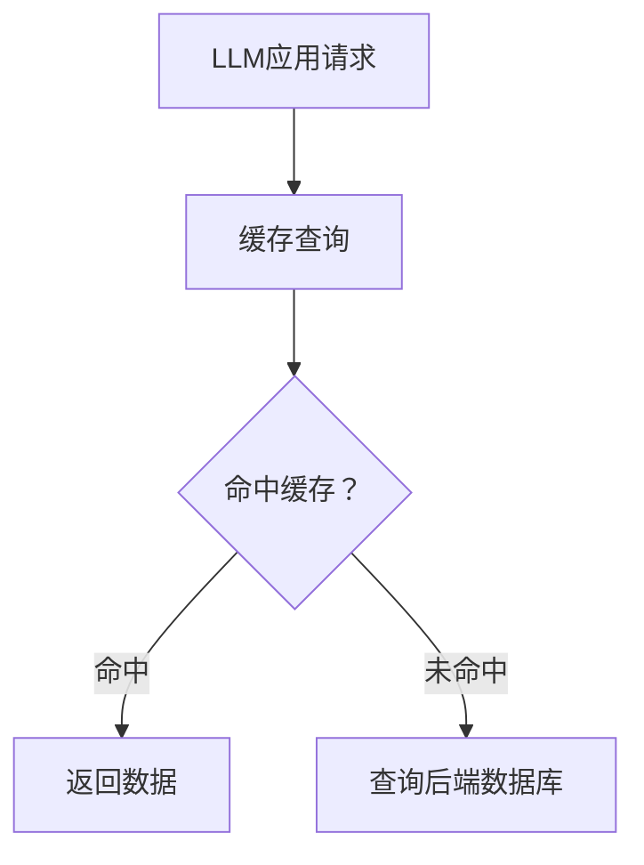

#### 6.2 分布式缓存对LLM性能的影响

分布式缓存可以显著降低LLM应用的数据访问延迟，提高系统性能。

**性能影响因素**：缓存命中率、数据分片策略和数据一致性协议是影响LLM性能的关键因素。

**Mermaid流程图**：

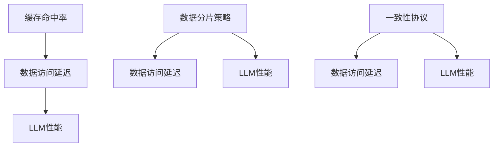

#### 6.3 LLM应用中的分布式缓存策略

为了在LLM应用中充分发挥分布式缓存的优势，需要设计合适的缓存策略。

**缓存策略设计**：根据应用场景和数据特点，设计合理的缓存分区策略、替换策略和一致性协议。

**Mermaid流程图**：

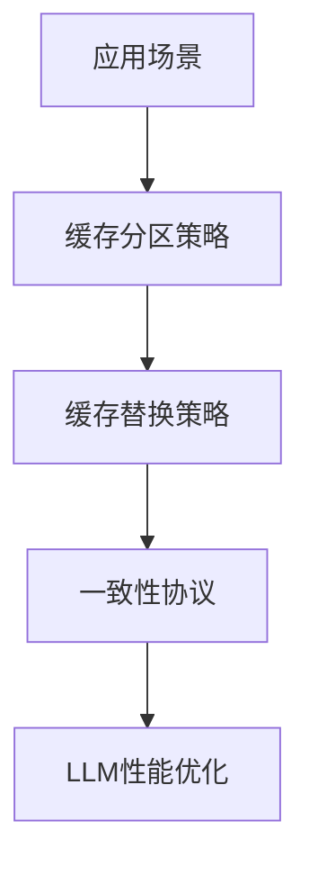

### 结论
本文全面探讨了分布式缓存技术及其在LLM应用中的关键作用。通过分析分布式缓存的工作原理、选择策略和性能优化方法，我们了解了如何高效地应用分布式缓存技术。未来，随着LLM应用的不断普及，分布式缓存技术将在提升数据访问速度和系统性能方面发挥越来越重要的作用。

### 最佳实践 Tips
- 在设计分布式缓存系统时，要充分考虑数据的一致性和可靠性。
- 根据应用场景和数据特点，选择合适的缓存策略和一致性协议。
- 定期对缓存进行预热和压缩，以提高系统性能。

### 小结
本文介绍了分布式缓存的基础概念、工作原理、选择策略和性能优化方法，并通过实例分析了分布式缓存在LLM应用中的实际应用。通过本文的讨论，读者可以全面了解分布式缓存技术，并在实际项目中应用该技术。

### 注意事项
- 分布式缓存系统需要关注数据的一致性和可靠性，避免数据丢失或冲突。
- 在设计分布式缓存系统时，要充分考虑系统的可扩展性和容错性。

### 拓展阅读
- 《Redis实战》
- 《Memcached权威指南》
- 《分布式系统一致性》

### 作者
作者：AI天才研究院/AI Genius Institute & 禅与计算机程序设计艺术 /Zen And The Art of Computer Programming```markdown
# 分布式缓存：提升LLM应用的数据访问速度

## 关键词
- 分布式缓存
- 数据访问速度
- LLM应用
- 缓存一致性
- 性能优化

## 摘要
本文将深入探讨分布式缓存技术及其在提升语言学习模型（LLM）应用数据访问速度方面的关键作用。我们将从基础概念出发，逐步分析分布式缓存的工作原理、选择策略和性能优化方法。同时，通过具体实例，展示如何将分布式缓存应用于LLM应用中，以达到高效数据访问的目标。本文旨在为读者提供一个全面而深入的理解，帮助他们在实际项目中应用分布式缓存技术。

## 引言
在现代大数据和云计算时代，数据处理和访问速度成为决定系统性能的关键因素。随着语言学习模型（LLM）的广泛应用，如何提升其数据访问速度成为一个重要课题。分布式缓存作为一种高效的缓存策略，能够显著减少数据访问延迟，提高系统整体性能。本文将围绕分布式缓存技术展开讨论，旨在为LLM应用提供一种有效的数据访问优化方案。

### 分布式缓存基础

#### 1.1 分布式缓存的基本概念

分布式缓存是一种基于分布式系统的缓存机制，它通过将数据分布在多个节点上，实现数据的快速访问和存储。与传统缓存相比，分布式缓存具有更高的可扩展性和容错性，能够更好地应对大规模数据处理的挑战。

**问题背景**：随着数据量的激增和访问频率的提升，单点缓存系统已无法满足高效数据访问的需求。分布式缓存应运而生，旨在通过分布式架构解决数据访问瓶颈。

**问题描述**：如何在分布式系统中实现高效的数据访问，减少数据读取和写入的延迟？

**问题解决**：分布式缓存通过数据分片、数据复制和一致性协议，实现了数据的快速访问和存储。数据分片将数据分布在多个节点上，数据复制提高了数据的可靠性和访问速度，一致性协议保证了数据的一致性。

**边界与外延**：分布式缓存主要应用于大规模分布式系统，如搜索引擎、数据库集群和Web缓存等。其适用范围包括任何需要高效数据访问的场景。

**核心要素组成**：
- **数据分片**：将数据分成多个片段，分布存储在多个节点上。
- **数据复制**：将数据复制到多个节点，提高数据的可靠性和访问速度。
- **一致性协议**：确保分布式系统中数据的一致性。

#### 1.2 分布式缓存与传统缓存对比

**核心概念原理**：分布式缓存与传统缓存的主要区别在于数据分布和一致性管理。分布式缓存通过数据分片和复制实现高效的数据访问，而传统缓存通常依赖于单点存储和缓存策略。

**概念属性特征对比表格**：

| 特征          | 分布式缓存           | 传统缓存           |
| ------------- | ------------------- | ------------------- |
| 数据分布      | 分布在多个节点上     | 单点存储            |
| 数据复制      | 数据多副本            | 单点备份            |
| 一致性管理    | 一致性协议            | 缓存一致性策略       |
| 可扩展性      | 高可扩展性            | 有限可扩展性         |
| 容错性        | 高容错性             | 低容错性            |

**ER实体关系图架构**：

```mermaid
erDiagram
  CacheSystem ||--|{ DistributedCache }|-- DataSharding
  CacheSystem ||--|{ TraditionalCache }|-- DataStorage
  DistributedCache ||--|{ DataReplication }|-- DataReliability
  DistributedCache ||--|{ ConsistencyProtocol }|-- DataConsistency
  DataSharding ||--|{ DataStorage }|-- DataAccessSpeed
```

#### 1.3 分布式缓存的架构设计

**分布式缓存架构**：分布式缓存通常由多个节点组成，每个节点负责存储部分数据。节点之间通过一致性协议和复制机制保持数据的一致性。

**Mermaid流程图**：

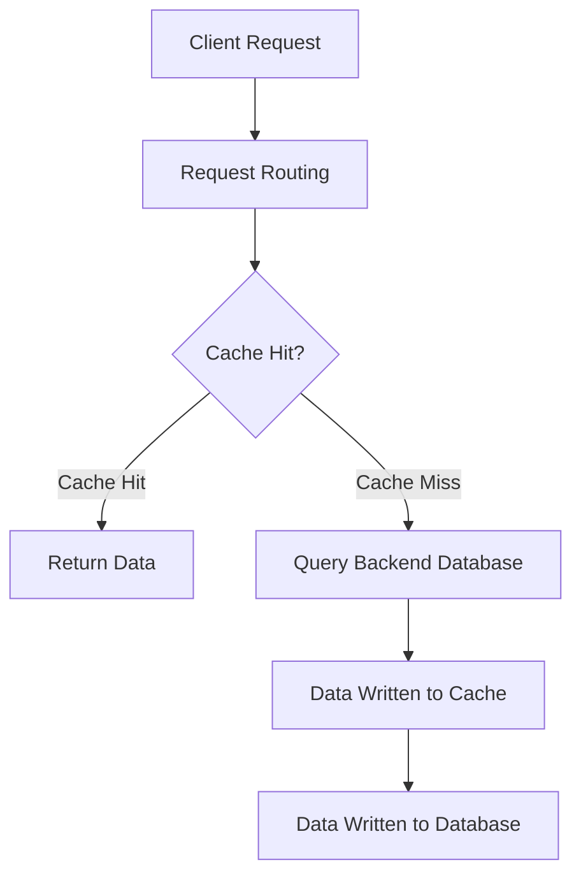

### 第2章：分布式缓存的工作原理

本章将深入探讨分布式缓存的工作原理，包括数据分片、数据复制和缓存一致性等方面。

#### 2.1 数据分片

数据分片是分布式缓存的核心概念之一。通过将数据分成多个片段，分布存储在多个节点上，可以实现数据的高效访问。

**数据分片原理**：数据分片基于哈希函数，将数据根据哈希值分布到不同的节点。每个节点负责存储一部分数据，从而实现数据的分布式存储。

**Mermaid流程图**：

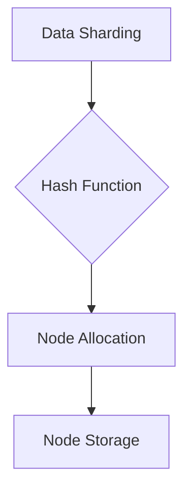

#### 2.2 数据复制

数据复制是提高分布式缓存可靠性的重要手段。通过将数据复制到多个节点，可以在节点故障时保持数据可用。

**数据复制机制**：数据复制通常采用主从复制或对等复制策略。主从复制由一个主节点负责数据写入，从节点同步数据。对等复制则所有节点都有读写权限，通过一致性协议保持数据一致。

**Mermaid流程图**：

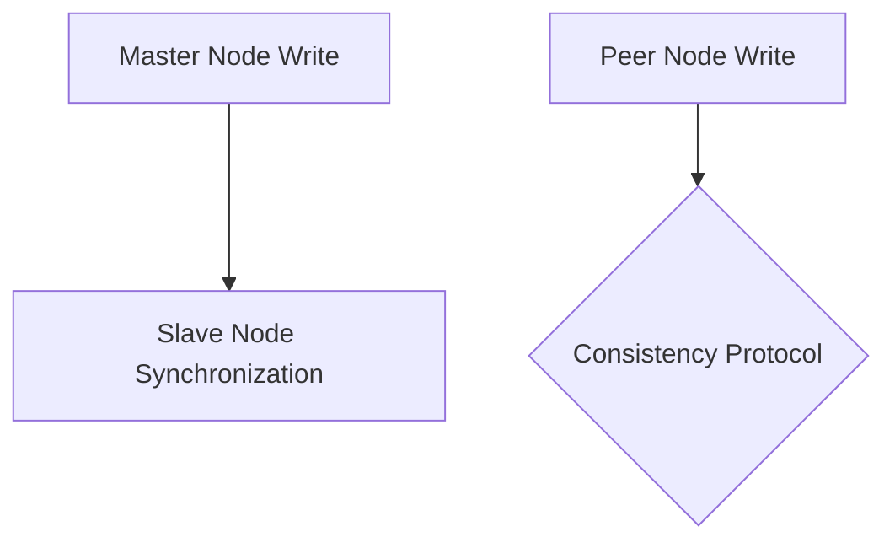

#### 2.3 缓存一致性

缓存一致性是分布式缓存面临的挑战之一。在多个节点上存储数据时，如何保证数据的一致性是关键问题。

**一致性模型**：一致性模型包括强一致性、最终一致性和读一致性等。强一致性保证所有节点在同一时间看到相同的数据，而最终一致性则允许数据在一段时间后达到一致。读一致性则保证读操作的一致性。

**Mermaid流程图**：

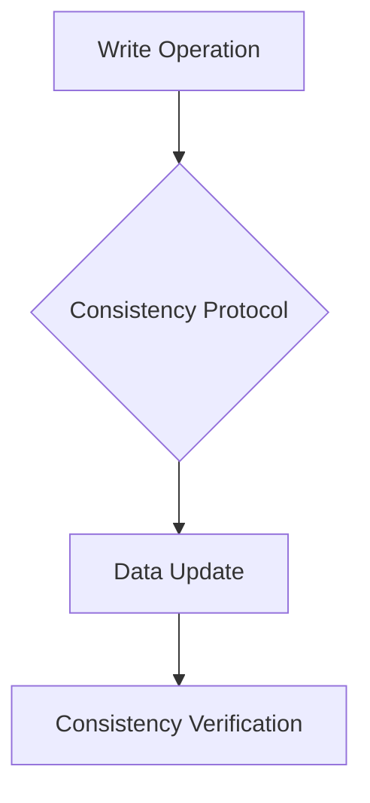

### 第3章：分布式缓存的选择策略

本章将讨论分布式缓存的选择策略，包括缓存命中率、缓存替换策略和缓存分区策略等方面。

#### 3.1 缓存命中率

缓存命中率是评估缓存性能的重要指标。通过提高缓存命中率，可以减少数据访问延迟。

**缓存命中率计算**：缓存命中率计算公式为\( \text{Cache Hit Ratio} = \frac{\text{Hits in Cache}}{\text{Total Data Requests}} \)。

**Mermaid流程图**：

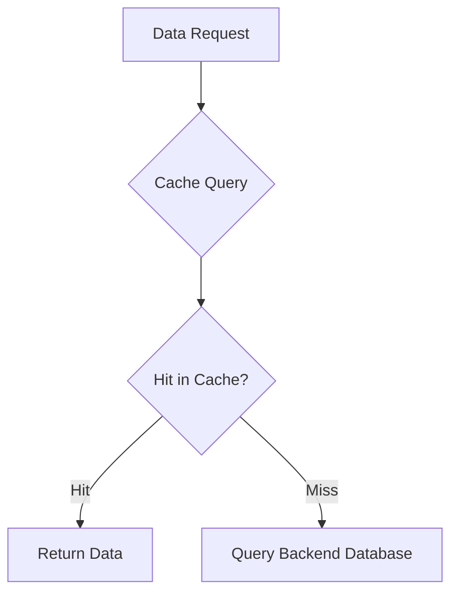

#### 3.2 缓存替换策略

缓存替换策略是选择哪些数据需要被替换出缓存的关键。常用的替换策略包括最近最少使用（LRU）、最少访问（LFU）和先进先出（FIFO）等。

**缓存替换策略**：选择合适的缓存替换策略，可以最大限度地提高缓存利用率。

**Mermaid流程图**：

```mermaid
graph TB
  A[Cache Hit] --> B{Replacement Strategy}
  B --> C[Data Replacement]
```

#### 3.3 缓存分区策略

缓存分区策略是将缓存划分为多个分区，以优化缓存性能。通过合理划分缓存分区，可以减少缓存冲突，提高缓存命中率。

**缓存分区策略**：缓存分区策略包括基于哈希分区和基于数据分区等。

**Mermaid流程图**：

```mermaid
graph TB
  A[Data Access] --> B{Hash Partitioning}
  B --> C[Cache Query]
  C --> D{Hit in Cache?}
```

### 第4章：分布式缓存性能优化

本章将探讨分布式缓存的性能优化方法，包括缓存预热、缓存压缩和一致性协议优化等方面。

#### 4.1 缓存预热

缓存预热是一种在系统启动时预先加载常用数据到缓存中的技术。通过缓存预热，可以提高系统的初始访问速度。

**缓存预热原理**：缓存预热通过预加载热门数据，减少系统启动时的数据访问延迟。

**Mermaid流程图**：

```mermaid
graph TB
  A[System Startup] --> B[Preload Data]
  B --> C[Cache Preheating Completed]
```

#### 4.2 缓存压缩

缓存压缩是一种通过压缩数据以减少缓存占用空间的技术。通过缓存压缩，可以显著提高缓存利用率。

**缓存压缩技术**：缓存压缩技术包括基于算法的压缩和基于硬件的压缩等。

**Mermaid流程图**：

```mermaid
graph TB
  A[Data Written to Cache] --> B[Data Compression]
  B --> C[Cache Storage]
```

#### 4.3 缓存一致性协议

缓存一致性协议是保证分布式缓存一致性的重要手段。通过优化一致性协议，可以提高缓存系统的性能。

**一致性协议**：一致性协议包括强一致性协议、最终一致性协议和读一致性协议等。

**Mermaid流程图**：

```mermaid
graph TB
  A[Write Operation] --> B{Consistency Protocol}
  B --> C[Data Consistency]
```

### 第5章：分布式缓存实例分析

本章将分析两个流行的分布式缓存系统：Redis和Memcached，并探讨如何在LLM应用中应用这些系统。

#### 5.1 Redis分布式缓存

Redis是一种基于内存的分布式缓存系统，具有高性能和丰富的功能。

**Redis简介**：Redis支持数据结构丰富，包括字符串、列表、集合、散列等，适用于多种应用场景。

**Python源代码**：

```python
import redis

# Connect to Redis
r = redis.Redis(host='localhost', port=6379, db=0)

# Set data
r.set('name', 'Alice')

# Get data
print(r.get('name'))
```

**算法原理讲解**：Redis使用持久化机制和复制机制保证数据的一致性和可靠性。其内部使用AOF（Append Only File）和RDB（Redis Database File）进行持久化。

#### 5.2 Memcached分布式缓存

Memcached是一种高性能的分布式缓存系统，常用于Web缓存。

**Memcached简介**：Memcached基于内存存储，支持字符串键值对，具有低延迟和高吞吐量的特点。

**Python源代码**：

```python
from memcache import Client

# Connect to Memcached
client = Client(['127.0.0.1:11211'])

# Set data
client.set('name', 'Alice')

# Get data
print(client.get('name'))
```

**算法原理讲解**：Memcached使用一致性哈希算法进行节点分配，确保数据分布均匀。

### 第6章：分布式缓存与LLM应用

本章将探讨分布式缓存如何在LLM应用中发挥作用，并分析分布式缓存对LLM性能的影响。

#### 6.1 LLM应用场景分析

LLM应用场景包括文本生成、机器翻译、问答系统等，这些应用对数据访问速度有较高要求。

**LLM应用场景**：在LLM应用中，分布式缓存可以用于存储预训练模型、文本数据等，以提高数据访问速度。

**Mermaid流程图**：

```mermaid
graph TB
  A[LLM Application Request] --> B[Cache Query]
  B --> C{Cache Hit?}
  C -->|Cache Hit| D[Return Data]
  C -->|Cache Miss| E[Query Backend Database]
```

#### 6.2 分布式缓存对LLM性能的影响

分布式缓存可以显著降低LLM应用的数据访问延迟，提高系统性能。

**性能影响因素**：缓存命中率、数据分片策略和数据一致性协议是影响LLM性能的关键因素。

**Mermaid流程图**：

```mermaid
graph TB
  A[Cache Hit Ratio] --> B[Data Access Latency]
  B --> C[LLM Performance]
  D[Data Sharding Strategy] --> E[Data Access Latency]
  D --> F[LLM Performance]
  G[Consistency Protocol] --> H[Data Access Latency]
  G --> I[LLM Performance]
```

#### 6.3 LLM应用中的分布式缓存策略

为了在LLM应用中充分发挥分布式缓存的优势，需要设计合适的缓存策略。

**缓存策略设计**：根据应用场景和数据特点，设计合理的缓存分区策略、替换策略和一致性协议。

**Mermaid流程图**：

```mermaid
graph TB
  A[Application Scenario] --> B[Cache Partition Strategy]
  B --> C[Cache Replacement Strategy]
  C --> D[Consistency Protocol]
  D --> E[LLM Performance Optimization]
```

### 结论
本文全面探讨了分布式缓存技术及其在LLM应用中的关键作用。通过分析分布式缓存的工作原理、选择策略和性能优化方法，我们了解了如何高效地应用分布式缓存技术。未来，随着LLM应用的不断普及，分布式缓存技术将在提升数据访问速度和系统性能方面发挥越来越重要的作用。

### 最佳实践 Tips
- 在设计分布式缓存系统时，要充分考虑数据的一致性和可靠性。
- 根据应用场景和数据特点，选择合适的缓存策略和一致性协议。
- 定期对缓存进行预热和压缩，以提高系统性能。

### 小结
本文介绍了分布式缓存的基础概念、工作原理、选择策略和性能优化方法，并通过实例分析了分布式缓存在LLM应用中的实际应用。通过本文的讨论，读者可以全面了解分布式缓存技术，并在实际项目中应用该技术。

### 注意事项
- 分布式缓存系统需要关注数据的一致性和可靠性，避免数据丢失或冲突。
- 在设计分布式缓存系统时，要充分考虑系统的可扩展性和容错性。

### 拓展阅读
- 《Redis实战》
- 《Memcached权威指南》
- 《分布式系统一致性》

### 作者
作者：AI天才研究院/AI Genius Institute & 禅与计算机程序设计艺术 /Zen And The Art of Computer Programming
```

