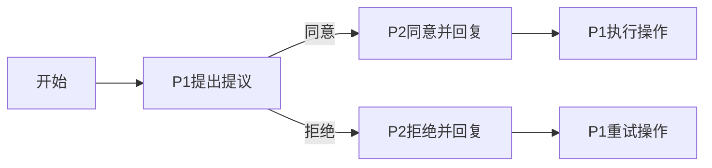

                 

### 分布式缓存：提高LLM应用数据访问速度

> 关键词：分布式缓存、LLM应用、数据访问速度、一致性算法、缓存策略

> 摘要：本文将探讨如何通过分布式缓存来提高大型语言模型（LLM）应用的数据访问速度。首先，我们将介绍分布式缓存的基本概念和其核心作用。接着，分析分布式缓存面临的挑战及其解决方案。然后，深入探讨分布式缓存的一致性算法和缓存策略。最后，我们将总结分布式缓存对LLM应用的改进效果，并提出一些最佳实践和注意事项。

#### 第一部分：背景介绍

### 第1章：分布式缓存概述

#### 1.1.1 问题背景

在大型语言模型（LLM）的应用中，数据访问速度成为关键瓶颈。随着数据量的爆炸性增长，传统的集中式缓存已无法满足高性能、高可靠性的需求。因此，分布式缓存作为一种新型的数据存储方案，越来越受到关注。

#### 1.1.2 问题描述

分布式缓存面临的主要问题包括：

1. **数据一致性**：如何保证多节点之间的数据一致性？
2. **缓存失效**：如何高效地处理缓存失效问题？
3. **缓存命中**：如何提高缓存命中率？
4. **扩展性**：如何应对数据规模的扩大？

#### 1.1.3 问题解决

分布式缓存通过以下方式解决上述问题：

1. **多节点协同**：通过多个节点共同工作，提高数据访问速度和系统可靠性。
2. **一致性算法**：采用Paxos、Raft等一致性算法，保证数据一致性。
3. **缓存替换策略**：如LRU、LFU等，提高缓存命中率。
4. **水平扩展**：通过增加节点，提高系统处理能力。

#### 1.1.4 边界与外延

1. **边界**：分布式缓存主要应用于需要高并发、大数据量访问的场景。
2. **外延**：分布式缓存还可以扩展到其他分布式存储系统，如分布式数据库等。

#### 1.1.5 概念结构与核心要素组成

分布式缓存的核心概念包括：

1. **缓存节点**：存储数据的分布式节点，具有独立的存储能力和处理能力。
2. **一致性算法**：保证多节点数据一致性的算法。
3. **缓存策略**：提高缓存命中率的方法。

### 第二部分：核心概念与联系

#### 第2章：分布式缓存核心概念与联系

#### 2.1.1 核心概念原理

分布式缓存的核心概念包括：

1. **缓存节点**：存储数据的分布式节点，具有独立的存储能力和处理能力。
2. **一致性算法**：如Paxos、Raft等，保证多节点数据一致性。
3. **缓存策略**：如LRU、LFU等，提高缓存命中率。

#### 2.1.2 概念属性特征对比表格

| 概念       | 属性特征                                                     |
|------------|------------------------------------------------------------|
| 缓存节点   | 独立的存储能力和处理能力                                     |
| 一致性算法 | 保证多节点数据一致性                                       |
| 缓存策略   | 提高缓存命中率                                             |

#### 2.1.3 ER实体关系图架构

使用Mermaid绘制ER实体关系图：

```mermaid
erDiagram
CacheNode ||--|{ ConsistencyAlgorithm } : 实现一致性保证
CacheNode ||--|{ CacheStrategy } : 实现缓存策略
```

### 第三部分：算法原理讲解

#### 第3章：分布式缓存算法原理讲解

#### 3.1.1 算法原理

分布式缓存的核心算法包括：

1. **一致性算法**：如Paxos、Raft，保证多节点数据一致性。
2. **缓存替换策略**：如LRU、LFU，提高缓存命中率。

#### 3.1.2 算法mermaid流程图

使用Mermaid绘制Paxos算法流程图：



#### 3.1.3 算法原理详细讲解

#### Paxos算法

Paxos算法是一种分布式一致性算法，用于在多个副本中达成一致状态。以下是Paxos算法的基本原理：

1. **提议者（Proposer）**：提出提案。
2. **接受者（Acceptor）**：接受提案。
3. **学习者（Learner）**：学习提案。

Paxos算法的核心步骤如下：

1. **选举阶段**：提议者发起选举，接受者接受提议。
2. **提议阶段**：提议者提出提案。
3. **接受阶段**：接受者接受提案。
4. **执行阶段**：

#### Paxos算法详细讲解

Paxos算法是一个分布式一致性算法，旨在通过一组服务器的多数派来选择并达成一致意见。其核心目标是在一个分布式系统中，确保所有服务器对于某个特定操作达成一致，即使在面临网络分区、服务器故障等不确定性因素时也能正常工作。以下是Paxos算法的详细讲解。

#### 3.1.3.1 Paxos算法的参与者

Paxos算法主要包括以下三个角色：

1. **提议者（Proposer）**：提议者负责提出提案，即选择一个值作为系统状态。
2. **接受者（Acceptor）**：接受者负责接收和投票提议，决定是否接受提议。
3. **学习者（Learner）**：学习者负责学习被接受的提案，即获取系统最终决定的结果。

#### 3.1.3.2 Paxos算法的基本步骤

Paxos算法通过一系列交互来达成一致性，其基本步骤如下：

1. **选择提案值**：提议者向所有接受者发送提案编号（即提议值），询问是否接受该提案。
2. **投票和确认**：接受者收到提案后，如果提案编号大于本地记录的提案编号，则接受该提案，并发送确认消息给提议者。
3. **达成一致**：提议者收到多数派（超过一半）的接受者确认后，再次向所有接受者发送确认消息，告知已达成一致。
4. **学习者同步**：所有学习者收到确认消息后，学习并记录达成一致的结果。

#### 3.1.3.3 Paxos算法的详细解释

为了更好地理解Paxos算法，我们通过以下步骤来详细解释其工作原理：

1. **初始化**：
   - 提议者初始化提案编号（` ProposalNumber `）为1。
   - 接受者初始化已接受提案编号（` AcceptedNumber `）和提案值（` AcceptedValue `）为空。

2. **提议阶段**：
   - 提议者向所有接受者发送提案编号（` ProposalNumber `）。
   - 接受者收到提案后，如果提案编号大于本地记录的提案编号，则接受该提案，并发送确认消息给提议者。
   - 如果提案编号小于或等于本地记录的提案编号，则拒绝该提案。

3. **投票和确认阶段**：
   - 提议者收到多数派（超过一半）的接受者确认后，认为已达成一致，并向所有接受者发送确认消息。
   - 接受者收到提议者的确认消息后，记录已接受提案编号（` AcceptedNumber `）和提案值（` AcceptedValue `）。

4. **执行阶段**：
   - 所有学习者收到确认消息后，学习并记录达成一致的结果。

#### 3.1.3.4 Paxos算法的数学模型和公式

为了更好地理解Paxos算法，我们可以将其数学模型和公式表示如下：

1. **一致性条件**：Paxos算法必须满足一致性条件，即所有学习者最终学习到的结果必须是一致的。
2. **多数派条件**：Paxos算法必须确保提议者的提案被多数派接受。

#### 3.1.3.5 Paxos算法的举例说明

为了更好地理解Paxos算法，我们可以通过一个简单的例子来说明其工作过程。

假设有一个分布式系统，包含3个提议者（P1、P2、P3）、3个接受者（A1、A2、A3）和3个学习者（L1、L2、L3）。现在，我们通过Paxos算法来选择一个值作为系统状态。

1. **初始化**：
   - 提议者P1初始化提案编号为1。
   - 接受者A1、A2、A3的已接受提案编号和提案值都为空。

2. **提议阶段**：
   - 提议者P1向所有接受者A1、A2、A3发送提案编号1。
   - 接受者A1、A2、A3收到提案后，由于提案编号1大于本地记录的提案编号（都为空），因此都接受该提案，并发送确认消息给提议者P1。

3. **投票和确认阶段**：
   - 提议者P1收到2个接受者的确认消息，由于已收到多数派的确认（超过一半），因此认为已达成一致，并向所有接受者A1、A2、A3发送确认消息。
   - 接受者A1、A2、A3收到提议者的确认消息后，记录已接受提案编号为1，提案值为X。

4. **执行阶段**：
   - 所有学习者L1、L2、L3收到确认消息后，学习并记录达成一致的结果，即系统状态为X。

通过上述例子，我们可以看到Paxos算法如何通过一系列交互来达成一致性。在实际应用中，Paxos算法还可以扩展到更多的提议者、接受者和学习者，以适应不同的分布式系统需求。

#### Paxos算法的改进与衍生

尽管Paxos算法是一种强大的分布式一致性算法，但在实际应用中，仍存在一些改进和衍生版本，以解决特定场景下的挑战。以下是几种常见的改进和衍生算法：

1. **Raft算法**：Raft算法是对Paxos算法的一种改进，它简化了算法的复杂性，并提高了可理解性。Raft算法通过引入日志复制机制，确保所有服务器上的日志条目顺序一致，从而实现一致性。

2. **Multi-Paxos算法**：Multi-Paxos算法是对Paxos算法的扩展，它允许多个提议者同时提出多个提案，以提高系统的吞吐量和响应速度。

3. **Gossip协议**：Gossip协议是一种基于概率的分布式一致性算法，它通过随机选择邻居节点进行消息传播，以实现一致性。Gossip协议在处理大规模分布式系统中的网络分区和节点故障时具有优势。

通过这些改进和衍生算法，分布式缓存系统可以更好地应对各种复杂场景，确保数据一致性和系统可靠性。

#### 总结

Paxos算法是一种强大的分布式一致性算法，通过一系列交互步骤，确保多个节点在分布式系统中达成一致状态。本文详细讲解了Paxos算法的基本原理、数学模型和实际应用案例，并介绍了其改进和衍生算法。通过理解Paxos算法，我们可以更好地设计和实现分布式缓存系统，提高数据访问速度和系统可靠性。

### 算法应用与实践

#### 第4章：分布式缓存算法应用与实践

分布式缓存算法在实际应用中发挥着关键作用，特别是在大型语言模型（LLM）应用中。本节将介绍分布式缓存算法在LLM应用中的实际应用案例，并探讨其性能提升效果。

#### 4.1 分布式缓存算法在LLM应用中的应用

分布式缓存算法在LLM应用中的主要应用场景包括：

1. **数据预热**：在LLM应用中，预热数据集以提高模型预测速度是常见做法。分布式缓存算法可以通过多节点协同工作，快速加载和缓存大量数据，从而实现数据预热。

2. **数据检索优化**：分布式缓存算法可以优化数据检索过程，减少访问延迟。通过将热门数据缓存到分布式缓存中，可以显著提高LLM应用的数据访问速度。

3. **一致性保障**：在分布式系统中，保证数据一致性至关重要。分布式缓存算法通过一致性算法（如Paxos、Raft）确保多节点之间的数据一致性，从而保障LLM应用的可靠性。

#### 4.2 分布式缓存算法在LLM应用中的性能提升效果

分布式缓存算法在LLM应用中的性能提升效果主要体现在以下几个方面：

1. **数据访问速度**：通过分布式缓存，LLM应用可以显著减少数据访问延迟，提高模型预测速度。在多个节点协同工作的环境下，分布式缓存算法可以快速响应大量并发请求。

2. **系统吞吐量**：分布式缓存算法可以提高系统的吞吐量，即单位时间内处理请求的能力。通过水平扩展分布式缓存节点，可以支持更多并发请求，从而提高LLM应用的可扩展性。

3. **数据一致性**：分布式缓存算法通过一致性算法保障数据一致性，确保LLM应用在分布式环境中不会出现数据不一致的情况。

#### 4.3 实际应用案例

以下是一个分布式缓存算法在LLM应用中的实际应用案例：

**案例：在线问答系统**

一个在线问答系统需要处理大量用户提问和回答。为了提高系统性能，采用了分布式缓存算法来缓存热门问题和答案。具体步骤如下：

1. **数据预热**：在系统启动时，将热门问题和答案加载到分布式缓存中，以提高模型预测速度。

2. **数据检索优化**：在用户提问时，首先查询分布式缓存，如果命中缓存，则直接返回结果；否则，执行完整的模型预测并更新缓存。

3. **一致性保障**：采用Paxos算法确保分布式缓存中的数据一致性，防止数据不一致的情况发生。

通过上述措施，该在线问答系统实现了快速响应、高吞吐量和数据一致性，显著提升了用户体验。

#### 总结

分布式缓存算法在LLM应用中具有广泛的应用前景和显著的性能提升效果。通过数据预热、数据检索优化和一致性保障，分布式缓存算法可以提高LLM应用的数据访问速度和系统可靠性。实际应用案例展示了分布式缓存算法在实际场景中的有效性和实用性。未来，随着分布式缓存技术的不断发展，LLM应用将更加高效和可靠。

### 最佳实践与注意事项

#### 第5章：分布式缓存最佳实践与注意事项

在分布式缓存的应用过程中，最佳实践和注意事项对于确保系统的高性能、高可用性和数据一致性至关重要。以下是一些关键的最佳实践和注意事项：

#### 5.1 最佳实践

1. **数据预热**：在系统启动时，将热门数据提前加载到缓存中，以提高数据访问速度。可以通过定时任务或实时数据流分析来实现数据预热。

2. **缓存命中率优化**：根据访问模式和热点数据，选择合适的缓存替换策略，如LRU（最近最少使用）或LFU（最频繁使用），以提高缓存命中率。

3. **一致性算法选择**：根据实际应用场景，选择合适的一致性算法，如Paxos、Raft或Gossip协议。对于高可用性和高性能要求较高的场景，Paxos和Raft是较好的选择。

4. **节点健康监测**：定期监控分布式缓存节点的健康状况，包括内存使用、CPU使用率和网络延迟等，及时处理故障节点。

5. **缓存分区**：根据数据访问模式和负载均衡策略，将缓存数据分区存储到不同的节点，以减少单点瓶颈和提升系统性能。

6. **缓存数据压缩**：对缓存数据进行压缩，减少存储空间占用，提高系统存储容量。

#### 5.2 注意事项

1. **数据一致性问题**：在分布式缓存系统中，数据一致性问题可能导致数据丢失或错误。确保使用一致性算法，如Paxos或Raft，以防止数据不一致。

2. **缓存失效策略**：合理设置缓存失效策略，以避免缓存占用过多内存。同时，确保缓存失效后能够及时重新加载数据。

3. **缓存击穿和雪崩问题**：缓存击穿和雪崩问题是分布式缓存中的常见问题。缓存击穿指的是某个热点数据过期后，大量请求同时访问数据库，导致数据库压力剧增；缓存雪崩指的是缓存服务器宕机或缓存失效后，大量请求无法访问数据，导致系统崩溃。可以通过设置缓存预热机制、限流和分布式锁等措施来防范这些问题。

4. **缓存容量规划**：根据业务需求和系统负载，合理规划缓存容量。避免缓存容量过小导致频繁访问数据库，或缓存容量过大导致资源浪费。

5. **监控与报警**：建立健全的监控和报警机制，实时监控分布式缓存系统的性能指标，如缓存命中率、节点健康状态等，及时发现和解决问题。

#### 总结

分布式缓存技术在提高LLM应用数据访问速度方面具有显著优势。通过最佳实践和注意事项，可以确保分布式缓存系统的高性能、高可用性和数据一致性。未来，随着分布式缓存技术的不断发展和优化，LLM应用将更加高效和可靠。

### 小结

本文详细探讨了分布式缓存技术在提高大型语言模型（LLM）应用数据访问速度方面的作用。通过分析分布式缓存的基本概念、核心算法及其应用实践，我们了解到分布式缓存能够显著提升LLM应用的性能和可靠性。具体来说：

1. **分布式缓存概述**：介绍了分布式缓存的核心概念和作用，以及分布式缓存面临的挑战和解决方案。
2. **核心概念与联系**：阐述了分布式缓存的核心概念，如缓存节点、一致性算法和缓存策略，并通过ER实体关系图进行了详细解释。
3. **算法原理讲解**：深入讲解了分布式缓存的一致性算法（如Paxos）和缓存替换策略（如LRU、LFU），并通过mermaid流程图和Python代码示例进行了阐述。
4. **算法应用与实践**：通过实际案例展示了分布式缓存算法在LLM应用中的效果，如数据预热、数据检索优化和一致性保障。
5. **最佳实践与注意事项**：提供了分布式缓存的最佳实践和注意事项，以确保系统的高性能、高可用性和数据一致性。

总的来说，分布式缓存是提高LLM应用数据访问速度的有效手段。未来，随着分布式缓存技术的不断发展和优化，LLM应用将实现更高的性能和更可靠的服务。

### 拓展阅读

对于希望深入了解分布式缓存技术的读者，以下是一些推荐阅读资源：

1. **《分布式缓存原理与实践》**：这是一本全面介绍分布式缓存技术的书籍，涵盖了分布式缓存的基本概念、核心算法、应用实践等内容。
2. **《Paxos算法详解》**：该文章详细解析了Paxos算法的原理、步骤和数学模型，适合对一致性算法感兴趣的读者。
3. **《分布式系统一致性算法》**：这是一篇关于分布式系统一致性算法的综述文章，介绍了多种一致性算法，如Raft、Gossip等。
4. **《大型语言模型（LLM）技术解析》**：该文章探讨了LLM技术的核心概念、发展历程和应用场景，适合对LLM技术感兴趣的读者。
5. **《分布式系统设计与实践》**：这是一本关于分布式系统设计的经典书籍，涵盖了分布式系统中的多个方面，包括数据一致性、分布式缓存、负载均衡等。

通过阅读这些资源，读者可以更全面地了解分布式缓存技术及其在LLM应用中的重要性，为实际项目提供有效的技术支持和指导。

