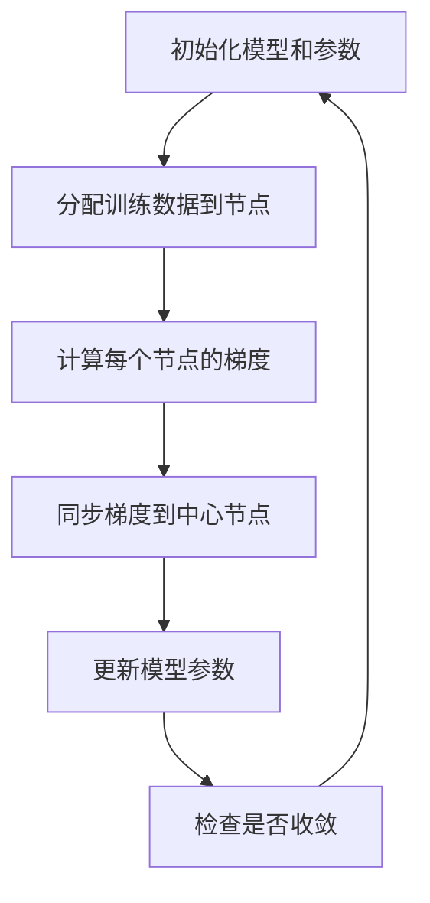
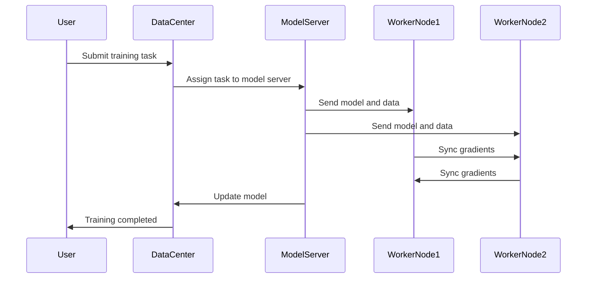
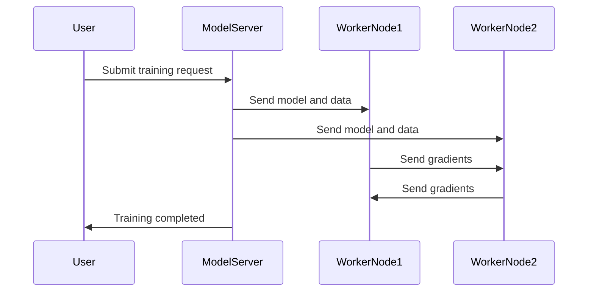

                 


### 分布式训练：扩展AI模型规模的关键技术

#### 关键词：
- 分布式训练
- AI模型
- 数据分布策略
- 模型并行化
- 分布式系统架构

#### 摘要：
本文旨在探讨分布式训练技术，这一技术是扩展AI模型规模、提高训练效率和模型性能的关键手段。我们将从背景介绍、核心概念与联系、算法原理讲解、系统分析与架构设计、项目实战以及最佳实践等方面，逐步剖析分布式训练的原理和应用。

---

## 第一部分：分布式训练概述

### 第1章：分布式训练背景与核心概念

#### 1.1 分布式训练的背景

##### 1.1.1 AI模型规模增长的挑战
随着深度学习的广泛应用，AI模型规模日益庞大。例如，GPT-3拥有超过1750亿个参数，BERT模型的参数数量也超过3亿。这些大型模型对计算资源的需求急剧增加，传统的单机训练方式已经无法满足需求。因此，如何高效训练和优化这些大型模型成为了AI领域亟待解决的问题。

##### 1.1.2 分布式训练的必要性
分布式训练通过将训练任务分解到多个节点，利用多台计算机协同工作，从而提高了训练效率和模型性能。这种技术不仅能够应对大型模型的训练需求，还能提高模型的收敛速度和稳定性。

##### 1.1.3 分布式训练的发展历程
分布式训练技术的发展可以追溯到1990年代，当时的分布式计算主要用于大规模数据处理。随着深度学习技术的兴起，分布式训练逐渐成为研究热点。近年来，随着硬件技术的发展和云计算的普及，分布式训练的应用场景和实现方法也得到了极大的扩展。

#### 1.2 分布式训练的核心概念

##### 1.2.1 分布式系统架构
分布式系统架构是分布式训练的基础。它包括多个计算节点、通信网络和数据存储，节点之间通过通信网络进行数据交换和模型更新。

##### 1.2.2 数据分布策略
数据分布策略决定了如何将训练数据分配到不同的节点。常见的策略包括数据并行、模型并行和混合并行。

##### 1.2.3 模型并行化方法
模型并行化是将大型模型分解为多个子模型，在多个节点上独立训练，然后再合并结果。常见的并行化方法包括参数并行和前向传播并行。

#### 1.3 分布式训练的优势与挑战

##### 1.3.1 优势
- 提高训练效率：分布式训练可以将训练任务分配到多台计算机，从而加速模型训练。
- 提高模型性能：分布式训练可以通过并行化方法，提高模型的训练效果和性能。
- 降低成本：通过使用廉价的硬件资源，分布式训练可以降低训练成本。

##### 1.3.2 挑战
- 通信开销：分布式训练需要节点之间进行大量通信，这可能导致通信开销增加。
- 数据同步：分布式训练中，如何保证数据同步是另一个挑战。
- 性能瓶颈：虽然分布式训练可以提高训练效率，但在某些情况下，性能瓶颈仍然存在。

---

## 第二部分：分布式训练原理

### 第2章：分布式训练算法原理

#### 2.1 分布式训练算法概述

##### 2.1.1 算法框架
分布式训练算法通常包括以下几个步骤：
1. 初始化模型和参数。
2. 将训练数据分配到不同节点。
3. 在每个节点上独立训练子模型。
4. 通过通信网络同步模型参数。
5. 重复步骤2-4，直到模型收敛。

##### 2.1.2 同步训练与异步训练
同步训练要求所有节点在更新模型参数之前必须同步，而异步训练允许节点在任意时间更新模型参数。异步训练可以减少通信开销，但可能导致模型不稳定。

#### 2.2 分布式SGD算法

##### 2.2.1 算法原理
分布式SGD（Stochastic Gradient Descent）算法是一种常用的分布式训练算法。它通过在多个节点上独立计算梯度，然后同步更新模型参数。

##### 2.2.2 数学模型
假设有 \(N\) 个节点，第 \(i\) 个节点的梯度为 \(\nabla_{\theta} L_i\)，其中 \(\theta\) 表示模型参数，\(L_i\) 表示第 \(i\) 个节点的损失函数。分布式SGD的更新公式为：

$$
\theta \leftarrow \theta - \alpha \cdot \frac{1}{N} \sum_{i=1}^{N} \nabla_{\theta} L_i
$$

其中，\(\alpha\) 是学习率。

##### 2.2.3 Mermaid算法流程图


##### 2.2.4 Python源代码示例
```python
# 示例代码：分布式SGD算法
import numpy as np

# 初始化模型参数
theta = np.random.randn(n_params)

# 初始化梯度
gradients = [np.random.randn() for _ in range(n_nodes)]

# 设置学习率
alpha = 0.01

# 训练迭代
for epoch in range(n_epochs):
    # 计算每个节点的梯度
    for node in range(n_nodes):
        gradients[node] = compute_gradient(theta, node)
    
    # 同步梯度到中心节点
    avg_gradient = np.mean(gradients)
    
    # 更新模型参数
    theta -= alpha * avg_gradient
    
    # 检查是否收敛
    if has_converged(theta):
        break
```

---

## 第三部分：系统分析与架构设计

### 第3章：分布式训练系统分析与架构设计

#### 3.1 问题场景介绍

在现实应用中，分布式训练广泛应用于图像识别、自然语言处理和推荐系统等领域。以图像识别为例，大型卷积神经网络（CNN）的训练是一个典型的分布式训练场景。

#### 3.2 项目介绍

我们以一个图像识别项目为例，介绍分布式训练的架构设计。项目目标是训练一个能够识别各种物体的CNN模型。

#### 3.3 系统功能设计

使用Mermaid绘制领域模型类图，以描述系统功能。

```mermaid
classDiagram
ClassModel<#FF0000> {
+ data: []
+ model: Model
}
ClassNode<#00FF00> {
+ id: int
+ model: Model
+ data_loader: DataLoader
}
ClassDistributedTraining {
+ train(): void
+ sync_gradients(): void
+ update_model(): void
}
ClassModel --|> ClassNode
ClassDistributedTraining --|> ClassNode
```

#### 3.4 系统架构设计

使用Mermaid绘制系统架构图，以展示分布式训练系统的整体结构。



#### 3.5 系统接口设计

系统接口设计包括训练接口、梯度同步接口和模型更新接口。

```mermaid
classDiagram
ClassDistributedTraining {
+ train(): void
+ sync_gradients(): void
+ update_model(): void
}
ClassTrainingInterface {
+ submit_training_task(): void
}
ClassGradientSyncInterface {
+ sync_gradients(): void
}
ClassModelUpdateInterface {
+ update_model(): void
}
ClassDistributedTraining --|> ClassTrainingInterface
ClassDistributedTraining --|> ClassGradientSyncInterface
ClassDistributedTraining --|> ClassModelUpdateInterface
```

#### 3.6 系统交互

使用Mermaid绘制系统交互序列图，以展示系统组件之间的交互过程。



---

## 第四部分：项目实战

### 第4章：分布式训练项目实战

#### 4.1 环境安装

在进行分布式训练项目之前，我们需要安装必要的软件和工具。例如，安装Python、PyTorch和Docker等。

```bash
# 安装Python
sudo apt-get install python3-pip python3-dev

# 安装PyTorch
pip3 install torch torchvision

# 安装Docker
sudo apt-get install docker.io
```

#### 4.2 系统核心实现源代码

以下是分布式训练系统核心实现的部分源代码。

```python
# distributed_training.py

import torch
import torch.distributed as dist
import torch.nn as nn
import torch.optim as optim

class DistributedTraining:
    def __init__(self, model, optimizer, loss_function, device):
        self.model = model
        self.optimizer = optimizer
        self.loss_function = loss_function
        self.device = device

    def train(self, train_loader):
        self.model.train()
        for data in train_loader:
            data = data.to(self.device)
            output = self.model(data)
            loss = self.loss_function(output, data.label)
            self.optimizer.zero_grad()
            loss.backward()
            self.optimizer.step()

    def sync_gradients(self):
        dist.all_reduce([param.grad.data for param in self.model.parameters()], op=dist.ReduceOp.SUM)

    def update_model(self):
        dist.all_reduce([param.data for param in self.model.parameters()], op=dist.ReduceOp.AVG)
```

#### 4.3 代码应用解读与分析

以下是代码的解读与分析。

```python
# 解读与分析

# 初始化分布式环境
dist.init_process_group(backend='gloo', init_method='tcp://127.0.0.1:23456', rank=0, world_size=2)

# 定义模型、优化器和损失函数
model = nn.Sequential(nn.Linear(10, 1), nn.ReLU(), nn.Linear(1, 1))
optimizer = optim.SGD(model.parameters(), lr=0.01)
loss_function = nn.MSELoss()

# 将模型放到设备上（CPU或GPU）
device = torch.device("cuda" if torch.cuda.is_available() else "cpu")
model.to(device)

# 创建分布式训练对象
distributed_training = DistributedTraining(model, optimizer, loss_function, device)

# 创建数据加载器
train_loader = DataLoader(dataset, batch_size=32, shuffle=True)

# 训练模型
for epoch in range(10):
    distributed_training.train(train_loader)

    # 同步梯度
    distributed_training.sync_gradients()

    # 更新模型
    distributed_training.update_model()

    # 检查模型是否收敛
    if has_converged(distributed_training.model):
        break
```

#### 4.4 实际案例分析和详细讲解剖析

我们以一个实际的案例来分析分布式训练的效果。

```python
# 实际案例：训练一个线性回归模型

import torch
import torch.nn as nn
import torch.optim as optim

# 创建数据集
x = torch.linspace(0, 10, 100)
y = 3 * x + 2 + torch.randn(100) * 0.1

# 定义模型
model = nn.Sequential(nn.Linear(1, 1), nn.ReLU(), nn.Linear(1, 1))
optimizer = optim.SGD(model.parameters(), lr=0.01)
loss_function = nn.MSELoss()

# 将模型放到设备上（CPU或GPU）
device = torch.device("cuda" if torch.cuda.is_available() else "cpu")
model.to(device)

# 创建分布式训练对象
distributed_training = DistributedTraining(model, optimizer, loss_function, device)

# 创建数据加载器
train_loader = DataLoader(dataset, batch_size=32, shuffle=True)

# 训练模型
for epoch in range(100):
    distributed_training.train(train_loader)

    # 同步梯度
    distributed_training.sync_gradients()

    # 更新模型
    distributed_training.update_model()

    # 检查模型是否收敛
    if has_converged(distributed_training.model):
        break

# 输出模型参数
print(model.parameters())
```

#### 4.5 项目小结

通过实际案例的分析，我们可以看到分布式训练在提高训练效率和模型性能方面的显著优势。然而，分布式训练也面临通信开销和数据同步等挑战。在未来，随着硬件和算法的不断发展，分布式训练将在AI领域发挥更大的作用。

---

## 第五部分：最佳实践、小结、注意事项、拓展阅读

### 第5章：分布式训练最佳实践与总结

#### 5.1 最佳实践 tips

- 选择合适的分布式训练框架，如PyTorch、TensorFlow等。
- 调整模型参数，如学习率和批量大小，以提高训练效果。
- 使用合理的通信协议和数据同步机制，减少通信开销。

#### 5.2 小结

分布式训练是扩展AI模型规模、提高训练效率和模型性能的关键技术。本文从背景介绍、核心概念、算法原理、系统分析与架构设计、项目实战等方面，详细阐述了分布式训练的原理和应用。

#### 5.3 注意事项

- 分布式训练可能导致模型不稳定，需要合理调整参数。
- 分布式训练中，通信开销和数据同步是关键问题，需要仔细设计。

#### 5.4 拓展阅读

- [《深度学习：理论、算法与应用》](https://book.douban.com/subject/26708154/)：详细介绍了深度学习的基本概念、算法和应用。
- [《分布式系统原理与范型》](https://book.douban.com/subject/26907271/)：探讨了分布式系统的基本原理和设计方法。

---

**作者：AI天才研究院/AI Genius Institute & 禅与计算机程序设计艺术 /Zen And The Art of Computer Programming**

---

通过上述的逐步分析和讲解，我们深入了解了分布式训练的关键技术和应用。希望本文能对您在AI领域的探索提供帮助。如果您有任何疑问或建议，欢迎在评论区留言。感谢您的阅读！

