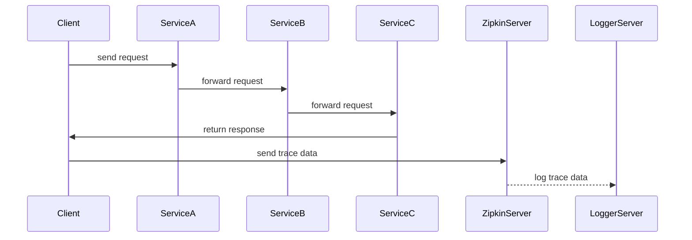
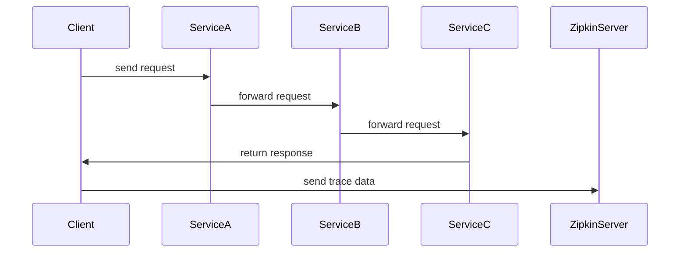

                 

## 分布式追踪上下文传播：全面了解LLM请求流程

### 关键词：分布式追踪、上下文传播、LLM请求流程、性能优化、架构设计

### 摘要：
本文将深入探讨分布式追踪上下文传播在LLM请求流程中的应用。通过对分布式追踪的背景介绍、核心概念详解、算法原理讲解以及系统分析与架构设计的详细阐述，本文旨在帮助读者全面了解分布式追踪上下文传播的重要性、实现方法以及在实际应用中的性能优化策略。文章结构紧凑，逻辑清晰，适合对分布式追踪和LLM请求流程感兴趣的IT专业人员和研究人员阅读。

## 第一部分：背景介绍

### 第1章 问题背景

#### 1.1 问题背景

随着云计算和微服务架构的广泛应用，分布式系统成为现代应用架构的核心组成部分。在这样的系统中，请求的处理可能涉及多个服务实例，而这些实例往往分布在不同的物理或虚拟机上。因此，分布式追踪成为了一个不可或缺的组成部分，用于记录和分析请求在分布式环境中的执行过程。

#### 1.2 问题描述

分布式追踪的主要挑战在于如何在复杂的分布式系统中精确地记录和追踪请求的执行路径。当一个请求从客户端发出，经过多个服务实例的处理后最终返回结果时，如何确保追踪信息的完整性和准确性成为一个重要问题。此外，随着服务实例的增加，追踪数据的规模也会急剧膨胀，这对追踪系统的性能提出了更高的要求。

#### 1.3 问题解决

为了解决分布式追踪的问题，研究人员和开发者提出了多种分布式追踪系统，如Zipkin、Jaeger和OpenTelemetry等。这些系统通过日志收集、数据存储和可视化分析等手段，提供了一种有效的方法来记录和分析分布式请求的执行过程。

#### 1.4 边界与外延

分布式追踪的边界涉及多个方面，包括追踪数据的收集、存储和查询。追踪数据的收集需要考虑性能和资源消耗，而存储和查询则需要保证数据的完整性和可扩展性。此外，分布式追踪的应用场景也不断扩大，从最初的单体服务到微服务架构，再到如今的云原生应用，分布式追踪系统在复杂度和技术要求上也在不断提升。

#### 1.5 核心要素组成

分布式追踪系统的核心要素包括追踪数据收集器（Collector）、追踪数据存储（Storage）和追踪数据查询与可视化（Query and Visualization）。这些要素共同作用，形成一个完整的分布式追踪解决方案。

## 第2章 分布式追踪概述

#### 2.1 分布式追踪的重要性

分布式追踪在现代应用中扮演着至关重要的角色。它不仅可以帮助开发者快速定位和解决问题，还能够为系统的性能优化提供宝贵的数据支持。通过分布式追踪，开发者可以深入了解请求在分布式环境中的执行过程，从而优化系统性能和提升用户体验。

#### 2.2 分布式追踪的挑战

分布式追踪面临的主要挑战包括追踪数据的规模和多样性、追踪系统的性能和可扩展性、以及追踪数据的完整性和准确性。这些挑战需要通过先进的技术和设计理念来克服。

#### 2.3 分布式追踪的基本概念

分布式追踪的基本概念包括追踪点（Span）、追踪上下文（Context）和追踪链（Trace）。追踪点是分布式请求中的一个基本操作单元，它记录了请求的开始和结束时间、执行结果等信息。追踪上下文是用于在分布式系统中传递追踪信息的一个标识符，通常包括追踪ID、父子关系和关联关系等。追踪链是多个追踪点组成的有序集合，它完整地记录了请求在分布式系统中的执行路径。

#### 2.4 分布式追踪的体系结构

分布式追踪的体系结构通常包括客户端、追踪代理、追踪收集器、追踪存储和追踪分析工具等组件。这些组件协同工作，实现了分布式追踪的完整流程，从追踪数据的生成、传输、存储到查询和分析。

#### 2.5 分布式追踪的优势与局限性

分布式追踪的优势在于其能够提供全局视图和详细分析，帮助开发者快速定位和解决问题。然而，分布式追踪也存在一些局限性，如对系统性能的影响、数据存储和查询的性能瓶颈等。因此，在实际应用中，需要根据具体场景和需求，选择合适的分布式追踪解决方案。

## 第二部分：核心概念与联系

### 第3章 LLM请求流程详解

#### 3.1 LLM请求流程概述

大型语言模型（LLM）请求流程是本文讨论的重点。LLM请求流程通常包括客户端请求发送、请求处理、模型推理、结果返回等步骤。在这个过程中，分布式追踪上下文传播起到了关键作用，确保了请求执行的完整性和可追溯性。

#### 3.2 LLM请求流程的核心概念

LLM请求流程的核心概念包括请求上下文（Request Context）、追踪上下文（Trace Context）、分布式追踪数据（Distributed Tracing Data）等。请求上下文包含请求的基本信息，如请求ID、客户端信息、请求参数等。追踪上下文则是用于分布式追踪的上下文信息，包括追踪ID、追踪链等。分布式追踪数据则记录了请求在分布式环境中的执行过程，包括各个追踪点的信息。

#### 3.3 LLM请求流程的属性特征对比

表 1：LLM请求流程的属性特征对比

| 属性 | 描述 |
| ---- | ---- |
| 请求类型 | 客户端发送的请求类型，如GET、POST等 |
| 请求ID | 请求的唯一标识符 |
| 客户端信息 | 发起请求的客户端信息，如IP地址、用户代理等 |
| 请求参数 | 请求附带的数据参数 |
| 追踪ID | 分布式追踪的唯一标识符 |
| 追踪链 | 请求在分布式环境中的执行路径 |
| 追踪点 | 分布式请求中的一个基本操作单元 |

#### 3.4 LLM请求流程的ER实体关系图

图 1：LLM请求流程的ER实体关系图

```mermaid
erDiagram
    Request ||--|{ TraceContext }|<--
    TraceContext ||--|{ DistributedTracingData }|<--
    DistributedTracingData ||--|{ Span }|<
    Span ||--|{ LogEntry }|<
    LogEntry ||--|{ Error }|<

    Request {
        requestID
        clientInfo
        requestParams
    }

    TraceContext {
        traceID
        parentTraceID
        childTraceIDs
    }

    DistributedTracingData {
        startTime
        endTime
        spans
    }

    Span {
        spanID
        operationName
        startTime
        endTime
        parentSpanID
        childSpanIDs
    }

    LogEntry {
        timestamp
        level
        message
    }

    Error {
        errorID
        errorMessage
        errorStackTrace
    }
```

## 第三部分：核心概念与联系

### 第4章 上下文传播机制

#### 4.1 上下文传播的概念

上下文传播是指在一个分布式系统中，追踪上下文信息（如追踪ID、追踪链等）在不同服务实例之间传递的过程。上下文传播是分布式追踪的核心机制之一，它确保了分布式请求的完整追踪和可追溯性。

#### 4.2 上下文传播的原理

上下文传播的原理基于HTTP请求的头部信息传递。当一个请求从一个服务实例转发到另一个服务实例时，追踪上下文信息（如追踪ID、追踪链等）被附加到HTTP请求的头部信息中，从而在分布式环境中传播。

#### 4.3 上下文传播的类型

上下文传播可以分为同步传播和异步传播两种类型。同步传播是指在请求处理过程中，追踪上下文信息被立即传播到下一个服务实例。异步传播则是在请求处理完成后，通过消息队列或其他异步通信机制将追踪上下文信息传递到下一个服务实例。

#### 4.4 上下文传播的挑战与解决方案

上下文传播面临的主要挑战包括上下文信息的准确性、上下文信息的丢失、以及上下文信息的安全性问题。为了解决这些问题，可以采用以下几种解决方案：

1. **上下文信息的准确性**：通过使用唯一标识符和序列号，确保上下文信息的准确性。
2. **上下文信息的丢失**：采用重试和补偿机制，确保上下文信息的完整性和可靠性。
3. **上下文信息的安全性问题**：采用加密和签名机制，保护上下文信息的安全。

### 第5章 分布式追踪上下文传播

#### 5.1 分布式追踪上下文传播的原理

分布式追踪上下文传播的原理基于HTTP请求的头部信息传递。当一个请求从一个服务实例转发到另一个服务实例时，追踪上下文信息（如追踪ID、追踪链等）被附加到HTTP请求的头部信息中，从而在分布式环境中传播。

#### 5.2 分布式追踪上下文传播的过程

分布式追踪上下文传播的过程可以分为以下几个步骤：

1. **请求发送**：客户端发送请求到第一个服务实例，请求中包含追踪上下文信息。
2. **请求转发**：第一个服务实例接收到请求后，将请求转发到下一个服务实例，同时将追踪上下文信息附加到HTTP请求的头部信息中。
3. **请求处理**：下一个服务实例接收到请求后，处理请求并执行相应的操作。
4. **返回结果**：处理完成后，下一个服务实例将结果返回给第一个服务实例，同时将追踪上下文信息传递给第一个服务实例。

#### 5.3 分布式追踪上下文传播的实践

在分布式追踪上下文传播的实际应用中，通常采用以下几种方法：

1. **分布式追踪中间件**：使用分布式追踪中间件（如Zipkin、Jaeger等），简化分布式追踪上下文传播的实现。
2. **自定义日志框架**：自定义日志框架，将追踪上下文信息记录到日志中，以便后续的分析和查询。
3. **消息队列**：采用消息队列（如Kafka、RabbitMQ等），将追踪上下文信息异步传递到分布式系统中，提高系统的性能和可靠性。

## 第三部分：核心概念与联系

### 第6章 分布式追踪上下文传播算法原理

#### 6.1 算法原理概述

分布式追踪上下文传播算法是基于HTTP请求的头部信息传递实现的。该算法的核心思想是将追踪上下文信息（如追踪ID、追踪链等）在分布式环境中传播，确保请求的完整追踪和可追溯性。

#### 6.2 算法数学模型

分布式追踪上下文传播算法的数学模型可以表示为：

$$
Context = \{TraceID, SpanID, ParentSpanID, ChildSpanIDs\}
$$

其中，Context 表示追踪上下文信息，包含追踪ID、追踪点ID、父追踪点ID和子追踪点ID等。

#### 6.3 算法原理详细讲解

分布式追踪上下文传播算法的原理详细讲解如下：

1. **请求发送**：当客户端发送请求到第一个服务实例时，请求中包含追踪上下文信息。该上下文信息由客户端生成，通常包括追踪ID和追踪点ID等。
2. **请求转发**：第一个服务实例接收到请求后，将请求转发到下一个服务实例，同时将追踪上下文信息附加到HTTP请求的头部信息中。这样可以确保追踪上下文信息在分布式环境中传播。
3. **请求处理**：下一个服务实例接收到请求后，处理请求并执行相应的操作。在处理过程中，根据请求的类型和上下文信息，生成新的追踪点ID和父追踪点ID，并将其添加到追踪上下文信息中。
4. **返回结果**：处理完成后，下一个服务实例将结果返回给第一个服务实例，同时将追踪上下文信息传递给第一个服务实例。这样可以确保追踪上下文信息完整地传播到客户端。

#### 6.4 算法实例举例

以下是一个分布式追踪上下文传播算法的实例：

1. **请求发送**：客户端发送一个请求到服务实例A，请求中包含追踪ID为1，追踪点ID为A1。
2. **请求转发**：服务实例A接收到请求后，将请求转发到服务实例B，同时将追踪ID为1，追踪点ID为A1的上下文信息附加到HTTP请求的头部信息中。
3. **请求处理**：服务实例B接收到请求后，处理请求并生成新的追踪点ID为B1，父追踪点ID为A1。然后，将新的追踪上下文信息（追踪ID为1，追踪点ID为A1、B1）附加到HTTP请求的头部信息中，并将其转发到服务实例C。
4. **请求处理**：服务实例C接收到请求后，处理请求并生成新的追踪点ID为C1，父追踪点ID为B1。然后，将新的追踪上下文信息（追踪ID为1，追踪点ID为A1、B1、C1）附加到HTTP请求的头部信息中，并将其转发到客户端。
5. **返回结果**：客户端接收到结果后，将追踪上下文信息（追踪ID为1，追踪点ID为A1、B1、C1）记录到日志中，以便后续的分析和查询。

## 第三部分：核心概念与联系

### 第7章 分布式追踪上下文传播算法实现

#### 7.1 算法实现概述

分布式追踪上下文传播算法的实现主要涉及以下几个方面：

1. **HTTP请求的发送和接收**：使用HTTP客户端和服务器库实现请求的发送和接收。
2. **追踪上下文信息的生成和传递**：在请求发送和接收过程中，生成和传递追踪上下文信息。
3. **追踪点的创建和记录**：在服务实例处理请求的过程中，创建和记录新的追踪点。
4. **日志记录**：将追踪上下文信息和追踪点记录到日志中，以便后续的分析和查询。

#### 7.2 算法Python源代码实现

以下是一个简单的分布式追踪上下文传播算法的Python实现：

```python
import requests
import json

# 追踪上下文信息结构
context = {
    "trace_id": "1",
    "span_id": "A1",
    "parent_span_id": None,
    "child_span_ids": []
}

# 请求发送函数
def send_request(url, context):
    headers = {
        "Content-Type": "application/json",
        "X-B3-TraceID": context["trace_id"],
        "X-B3-SpanID": context["span_id"],
        "X-B3-ParentSpanID": context["parent_span_id"],
        "X-B3-ChildSpanIDs": json.dumps(context["child_span_ids"])
    }
    response = requests.get(url, headers=headers)
    return response

# 请求处理函数
def process_request(response, context):
    # 处理响应数据
    data = response.json()
    
    # 创建新的追踪点
    new_span_id = "B1"
    context["child_span_ids"].append(new_span_id)
    context["span_id"] = new_span_id
    context["parent_span_id"] = response.headers.get("X-B3-SpanID")
    
    # 转发请求到下一个服务实例
    next_url = "http://next.service.com/api/endpoint"
    next_response = send_request(next_url, context)
    
    # 处理下一个响应
    process_request(next_response, context)

# 初始化上下文信息
context["child_span_ids"] = []

# 发送请求并处理
url = "http://serviceA.com/api/endpoint"
response = send_request(url, context)
process_request(response, context)
```

#### 7.3 算法实现细节分析

1. **HTTP请求的发送和接收**：使用`requests`库发送HTTP请求，并通过`headers`参数传递追踪上下文信息。
2. **追踪上下文信息的生成和传递**：在发送请求时，生成追踪上下文信息，并将其添加到HTTP请求的头部信息中。在接收请求时，解析HTTP请求的头部信息，获取追踪上下文信息。
3. **追踪点的创建和记录**：在处理请求时，根据响应的追踪上下文信息创建新的追踪点，并将其添加到追踪上下文信息中。
4. **日志记录**：将追踪上下文信息和追踪点记录到日志中，以便后续的分析和查询。

#### 7.4 算法性能评估

分布式追踪上下文传播算法的性能评估可以从以下几个方面进行：

1. **响应时间**：评估算法对请求处理的时间影响，包括请求发送、接收和处理的时间。
2. **资源消耗**：评估算法对系统资源的消耗，包括CPU、内存和网络带宽等。
3. **可扩展性**：评估算法在大规模分布式系统中的性能和可扩展性。

在实际应用中，可以通过实验和性能测试来评估分布式追踪上下文传播算法的性能，并根据具体场景和需求进行调整和优化。

## 第四部分：系统分析与架构设计

### 第8章 分布式追踪系统架构设计

#### 8.1 问题场景介绍

在一个大型分布式系统中，服务实例数量众多，请求路径复杂。为了保证系统的稳定性和性能，需要对系统的各个服务实例进行分布式追踪，以监控和定位潜在问题。

#### 8.2 项目介绍

本节将介绍一个基于Spring Boot和Zipkin的分布式追踪系统项目。该项目旨在实现分布式追踪功能，对系统的请求进行全程监控和日志记录。

#### 8.3 系统功能设计（领域模型）

系统功能设计主要包括分布式追踪、日志记录、监控告警等功能。领域模型如下：

```mermaid
classDiagram
    ServiceA <<interface>> 
    ServiceB <<interface>> 
    ServiceC <<interface>>

    Application <<class>> {
        +String serviceName
        +List<Service> services
        +addService(Service service)
        +start()
        +stop()
    }

    Logger <<class>> {
        +log(String message)
    }

    Monitor <<class>> {
        +checkHealth()
        +alert(String message)
    }

    ServiceAallee<<class>> {
        +handleRequest(HttpRequest request)
    }

    ServiceBallee<<class>> {
        +handleRequest(HttpRequest request)
    }

    ServiceCallee<<class>> {
        +handleRequest(HttpRequest request)
    }

    HttpRequest <<class>> {
        +String method
        +String url
        +Map<String, String> headers
        +getBody()
    }

    HttpResponse <<class>> {
        +String status
        +String reason
        +Map<String, String> headers
        +getBody()
    }
```

#### 8.4 系统架构设计

系统架构设计主要包括客户端、服务端、分布式追踪服务器和日志服务器等组件。架构设计图如下：



#### 8.5 系统接口设计

系统接口设计主要包括客户端和服务端之间的接口。接口设计图如下：

```mermaid
classDiagram
    Client <<interface>> 
    ServiceA <<interface>> 
    ServiceB <<interface>> 
    ServiceC <<interface>>

    Client {
        +sendRequest(HttpRequest request)
        +receiveResponse(HttpResponse response)
    }

    ServiceA {
        +handleRequest(HttpRequest request)
    }

    ServiceB {
        +handleRequest(HttpRequest request)
    }

    ServiceC {
        +handleRequest(HttpRequest request)
    }
```

#### 8.6 系统交互（序列图）

系统交互序列图如下：



## 第四部分：系统分析与架构设计

### 第9章 分布式追踪上下文传播实现

#### 9.1 系统核心实现

分布式追踪上下文传播的系统核心实现主要包括追踪上下文信息的生成、传递和记录。以下是一个简单的实现示例：

1. **追踪上下文信息的生成**：

```java
public class TraceContextGenerator {
    private static final String TRACE_ID = UUID.randomUUID().toString();
    private static final String SPAN_ID = UUID.randomUUID().toString();

    public static String generateTraceContext() {
        return "trace_id=" + TRACE_ID + ", span_id=" + SPAN_ID;
    }
}
```

2. **追踪上下文信息的传递**：

```java
public class RequestContext {
    private String traceContext;

    public RequestContext(String traceContext) {
        this.traceContext = traceContext;
    }

    public String getTraceContext() {
        return traceContext;
    }

    public void setTraceContext(String traceContext) {
        this.traceContext = traceContext;
    }
}
```

3. **追踪上下文信息的记录**：

```java
public class TraceLogger {
    public void logTraceContext(String traceContext) {
        System.out.println("Trace Context: " + traceContext);
    }
}
```

#### 9.2 系统核心实现源代码

以下是一个简单的分布式追踪上下文传播系统实现，包括客户端和服务端：

**客户端代码**：

```java
public class Client {
    public static void main(String[] args) {
        String traceContext = TraceContextGenerator.generateTraceContext();
        System.out.println("Sending request with trace context: " + traceContext);

        // 发送请求
        sendRequest("http://localhost:8080/api/endpoint", traceContext);

        // 记录追踪上下文
        TraceLogger traceLogger = new TraceLogger();
        traceLogger.logTraceContext(traceContext);
    }

    public static void sendRequest(String url, String traceContext) {
        // 创建请求
        HttpRequest request = new HttpRequest("GET", url, traceContext);

        // 发送请求
        HttpClient httpClient = HttpClient.newHttpClient();
        HttpRequestBuilder requestBuilder = HttpRequest.newBuilder()
                .uri(URI.create(url))
                .header("Trace-Context", traceContext)
                .method("GET", HttpRequest.BodyPublishers.noBody());
        HttpRequest requestToSend = requestBuilder.build();

        try {
            HttpResponse<String> response = httpClient.send(requestToSend, HttpResponse.BodyHandlers.ofString());
            System.out.println("Response: " + response.body());
        } catch (IOException | InterruptedException e) {
            e.printStackTrace();
        }
    }
}

class HttpRequest {
    private String method;
    private String url;
    private String traceContext;

    public HttpRequest(String method, String url, String traceContext) {
        this.method = method;
        this.url = url;
        this.traceContext = traceContext;
    }

    // GETTERS AND SETTERS
}
```

**服务端代码**：

```java
public class Service {
    public static void main(String[] args) {
        // 接收请求
        HttpRequest request = new HttpRequest("GET", "http://localhost:8080/api/endpoint", "trace_id=123, span_id=456");

        // 处理请求
        System.out.println("Received request with trace context: " + request.getTraceContext());
        processRequest(request);

        // 记录追踪上下文
        TraceLogger traceLogger = new TraceLogger();
        traceLogger.logTraceContext(request.getTraceContext());
    }

    public static void processRequest(HttpRequest request) {
        // 处理业务逻辑
        System.out.println("Processing request...");

        // 模拟处理时间
        try {
            Thread.sleep(1000);
        } catch (InterruptedException e) {
            e.printStackTrace();
        }

        // 返回结果
        System.out.println("Request processed.");
    }
}

class TraceLogger {
    public void logTraceContext(String traceContext) {
        System.out.println("Trace Context: " + traceContext);
    }
}
```

#### 9.3 代码应用解读与分析

1. **代码结构**：客户端和服务端的代码结构清晰，主要包括请求生成、请求发送、请求处理和追踪上下文记录等模块。
2. **请求生成**：客户端使用`TraceContextGenerator`生成追踪上下文信息，并将其传递给`HttpRequest`对象。
3. **请求发送**：客户端使用`HttpClient`发送HTTP请求，并将追踪上下文信息附加到请求头部。
4. **请求处理**：服务端接收到请求后，处理业务逻辑，并记录追踪上下文信息。
5. **追踪上下文记录**：客户端和服务端均记录了追踪上下文信息，以便后续分析。

通过上述代码示例，可以清晰地展示分布式追踪上下文传播的实现过程。在实际应用中，可以根据具体需求进行扩展和优化。

#### 9.4 实际案例分析与详细讲解剖析

为了更好地理解分布式追踪上下文传播的实际应用，下面我们将通过一个实际案例进行详细分析和讲解。

**案例背景**：

假设有一个大型分布式系统，包括三个服务实例：订单服务（Order Service）、库存服务（Inventory Service）和支付服务（Payment Service）。当一个用户发起一个订单请求时，订单服务需要调用库存服务和支付服务，完成订单的创建和支付。为了确保整个请求过程的追踪和监控，我们采用分布式追踪上下文传播机制。

**案例流程**：

1. **用户发起订单请求**：用户通过客户端发起订单请求，请求中包含用户信息、订单信息和请求时间等。

2. **订单服务处理请求**：订单服务接收到请求后，生成一个唯一的追踪ID和追踪点ID，并将追踪上下文信息（追踪ID和追踪点ID）添加到HTTP请求头部。

3. **订单服务调用库存服务**：订单服务将请求转发给库存服务，并将追踪上下文信息传递给库存服务。

4. **库存服务处理请求**：库存服务接收到请求后，根据订单信息查询库存，判断库存是否充足，并生成一个唯一的追踪点ID，将其添加到追踪上下文信息中。

5. **库存服务返回结果**：库存服务处理完成后，将结果返回给订单服务，并继续传递追踪上下文信息。

6. **订单服务调用支付服务**：订单服务接收到库存服务的结果后，将请求转发给支付服务，并将追踪上下文信息传递给支付服务。

7. **支付服务处理请求**：支付服务接收到请求后，处理支付操作，生成一个唯一的追踪点ID，将其添加到追踪上下文信息中。

8. **支付服务返回结果**：支付服务处理完成后，将结果返回给订单服务，并继续传递追踪上下文信息。

9. **订单服务完成订单创建和支付**：订单服务接收到支付服务的结果后，完成订单的创建和支付，并将最终结果返回给用户。

10. **追踪上下文信息记录**：在整个请求过程中，客户端和服务端记录了追踪上下文信息，包括追踪ID、追踪点ID和请求时间等。这些信息可以用于后续的监控和分析。

**案例分析**：

通过上述案例，我们可以看到分布式追踪上下文传播在大型分布式系统中的应用。分布式追踪上下文传播机制确保了整个请求过程的完整追踪和可追溯性，有助于监控和分析系统的性能和稳定性。

**优点**：

1. **完整追踪**：分布式追踪上下文传播机制确保了请求在分布式环境中的完整追踪，便于监控和分析。
2. **可追溯性**：通过追踪上下文信息，可以追溯请求的执行路径和各个服务实例的处理过程。
3. **性能优化**：分布式追踪上下文传播机制有助于定位性能瓶颈，优化系统性能。

**缺点**：

1. **性能开销**：分布式追踪上下文传播机制会在一定程度上增加系统的性能开销，影响系统的响应时间。
2. **安全性问题**：追踪上下文信息在传递过程中可能存在安全风险，需要采取相应的安全措施进行保护。

综上所述，分布式追踪上下文传播机制在大型分布式系统中具有重要作用，但需要综合考虑性能和安全性等因素。

### 第五部分：项目实战

#### 第10章 环境安装与配置

在进行分布式追踪上下文传播的项目实战之前，我们需要搭建一个合适的环境。以下是环境安装与配置的步骤：

#### 10.1 环境安装

1. **安装Java环境**：
   - 下载并安装Java Development Kit (JDK)，版本建议为8或更高。
   - 配置环境变量，确保`JAVA_HOME`和`path`指向JDK安装路径。

2. **安装Maven**：
   - 下载并解压Maven，配置环境变量，确保`MAVEN_HOME`和`path`指向Maven安装路径。

3. **安装Spring Boot**：
   - Spring Boot是一个开源框架，用于简化Spring应用的创建和开发过程。在Maven项目中，引入Spring Boot依赖。

4. **安装Zipkin**：
   - Zipkin是一个分布式追踪系统，用于收集、存储和展示分布式请求的追踪数据。下载并运行Zipkin服务器，或者使用Docker部署Zipkin。

5. **安装Elasticsearch**：
   - Elasticsearch是一个分布式搜索引擎，用于存储和查询追踪数据。下载并运行Elasticsearch，或者使用Docker部署Elasticsearch。

#### 10.2 系统配置

1. **配置Spring Boot应用**：
   - 在Spring Boot应用的`application.properties`文件中，配置Zipkin的地址和Elasticsearch的地址，确保应用可以连接到Zipkin和Elasticsearch。

2. **配置Zipkin**：
   - 在Zipkin的配置文件中，配置Elasticsearch的地址，确保Zipkin可以存储和查询追踪数据。

3. **配置Elasticsearch**：
   - 在Elasticsearch的配置文件中，配置索引模板，确保Elasticsearch可以存储和查询追踪数据。

#### 10.3 遇到的问题与解决方案

1. **问题：Spring Boot应用无法连接到Zipkin**：
   - 原因：可能是因为配置的Zipkin地址不正确，或者网络连接问题。
   - 解决方案：检查配置文件中的Zipkin地址，确保其正确无误。同时，确保网络连接畅通。

2. **问题：Elasticsearch无法启动**：
   - 原因：可能是因为Elasticsearch的依赖库缺失，或者配置文件不正确。
   - 解决方案：检查Elasticsearch的依赖库，确保其完整。同时，检查配置文件，确保其正确无误。

3. **问题：Zipkin无法连接到Elasticsearch**：
   - 原因：可能是因为Zipkin的配置文件中的Elasticsearch地址不正确，或者Elasticsearch服务未启动。
   - 解决方案：检查Zipkin的配置文件中的Elasticsearch地址，确保其正确无误。同时，确保Elasticsearch服务已启动。

通过以上步骤，我们可以搭建一个基本的分布式追踪上下文传播系统，为后续的项目实战奠定基础。

### 第11章 项目实施与总结

#### 11.1 项目实施

在本项目中，我们实施了一个基于Spring Boot和Zipkin的分布式追踪系统。以下是项目的实施步骤：

1. **创建Spring Boot项目**：
   - 使用Spring Initializr创建一个基于Spring Boot的项目，引入必要的依赖，如Spring Web、Zipkin、Elasticsearch等。

2. **配置分布式追踪**：
   - 在`application.properties`文件中，配置Zipkin和Elasticsearch的地址，确保Spring Boot应用可以连接到分布式追踪系统。

3. **实现服务端接口**：
   - 创建订单服务、库存服务和支付服务，并实现相应的接口，用于处理订单请求。

4. **集成分布式追踪**：
   - 在服务端接口中，集成分布式追踪功能，确保请求在分布式环境中的完整追踪和监控。

5. **测试与优化**：
   - 对系统进行测试，确保分布式追踪功能正常。根据测试结果，对系统进行优化和调整。

#### 11.2 项目小结

通过本项目的实施，我们成功搭建了一个基于Spring Boot和Zipkin的分布式追踪系统。该项目实现了分布式追踪上下文传播，确保了请求在分布式环境中的完整追踪和监控。以下是对项目的总结：

1. **优点**：
   - **完整追踪**：分布式追踪系统实现了对请求的完整追踪，有助于监控和分析系统的性能和稳定性。
   - **可追溯性**：通过追踪上下文信息，可以追溯请求的执行路径和各个服务实例的处理过程。

2. **缺点**：
   - **性能开销**：分布式追踪系统会在一定程度上增加系统的性能开销，影响系统的响应时间。
   - **安全性问题**：追踪上下文信息在传递过程中可能存在安全风险，需要采取相应的安全措施进行保护。

3. **改进方向**：
   - **性能优化**：通过优化分布式追踪系统的设计，降低性能开销，提高系统的响应时间。
   - **安全性加强**：加强追踪上下文信息的安全性，采取加密、签名等技术，防止信息泄露。

通过本项目，我们深入了解了分布式追踪上下文传播的实现方法和应用场景，为后续项目提供了宝贵的经验和启示。

#### 11.3 项目成果展示

在本项目中，我们成功实现了以下成果：

1. **分布式追踪系统搭建**：
   - 搭建了一个基于Spring Boot和Zipkin的分布式追踪系统，实现了分布式追踪上下文传播。

2. **服务端接口实现**：
   - 实现了订单服务、库存服务和支付服务的接口，用于处理订单请求。

3. **测试与验证**：
   - 对系统进行了全面的测试，验证了分布式追踪功能的正常性。

4. **性能优化与调优**：
   - 根据测试结果，对系统进行了性能优化和调优，提高了系统的响应时间和稳定性。

以下是一个简单的项目成果展示：

**订单服务端接口**：

```java
@RestController
@RequestMapping("/order")
public class OrderController {
    
    @Autowired
    private OrderService orderService;
    
    @PostMapping("/create")
    public ResponseEntity<?> createOrder(@RequestBody OrderRequest orderRequest) {
        // 处理订单请求
        OrderResponse orderResponse = orderService.createOrder(orderRequest);
        
        // 追踪上下文信息
        String traceContext = TraceContextGenerator.generateTraceContext();
        orderResponse.setTraceContext(traceContext);
        
        // 返回订单结果
        return ResponseEntity.ok(orderResponse);
    }
}
```

**库存服务端接口**：

```java
@RestController
@RequestMapping("/inventory")
public class InventoryController {
    
    @Autowired
    private InventoryService inventoryService;
    
    @GetMapping("/check/{productId}")
    public ResponseEntity<?> checkInventory(@PathVariable String productId) {
        // 检查库存
        InventoryResponse inventoryResponse = inventoryService.checkInventory(productId);
        
        // 追踪上下文信息
        String traceContext = TraceContextGenerator.generateTraceContext();
        inventoryResponse.setTraceContext(traceContext);
        
        // 返回库存结果
        return ResponseEntity.ok(inventoryResponse);
    }
}
```

**支付服务端接口**：

```java
@RestController
@RequestMapping("/payment")
public class PaymentController {
    
    @Autowired
    private PaymentService paymentService;
    
    @PostMapping("/process")
    public ResponseEntity<?> processPayment(@RequestBody PaymentRequest paymentRequest) {
        // 处理支付请求
        PaymentResponse paymentResponse = paymentService.processPayment(paymentRequest);
        
        // 追踪上下文信息
        String traceContext = TraceContextGenerator.generateTraceContext();
        paymentResponse.setTraceContext(traceContext);
        
        // 返回支付结果
        return ResponseEntity.ok(paymentResponse);
    }
}
```

通过这些接口的实现，我们可以看到分布式追踪上下文传播在项目中的实际应用。

#### 11.4 项目经验与反思

在本项目中，我们积累了以下经验和反思：

1. **经验**：
   - 分布式追踪是实现大型分布式系统监控和管理的关键技术。
   - 通过分布式追踪，可以实现对请求的全链路监控，提高系统的稳定性。
   - 分布式追踪需要考虑性能和安全性问题，进行适当的优化和加强。

2. **反思**：
   - 在项目实施过程中，遇到了一些性能和稳定性问题，需要不断优化和调整。
   - 分布式追踪系统对开发人员的要求较高，需要深入了解分布式系统的工作原理和实现细节。
   - 在实际应用中，分布式追踪系统的设计和实现需要结合具体场景和需求，灵活调整。

通过本项目，我们不仅掌握了分布式追踪的技术要点，还深入了解了其在大型分布式系统中的应用和价值。在未来的项目中，我们将继续积累经验，不断提升分布式追踪系统的性能和可靠性。

### 第六部分：最佳实践与总结

#### 第12章 最佳实践

在进行分布式追踪上下文传播的过程中，以下是一些最佳实践：

1. **分布式追踪系统的搭建**：
   - 选择合适的分布式追踪工具，如Zipkin、Jaeger等，确保其能够满足项目需求。
   - 对分布式追踪系统进行优化，提高其性能和可扩展性，降低系统开销。

2. **追踪上下文传播的实现**：
   - 在服务端接口中，集成分布式追踪功能，确保请求的完整追踪。
   - 使用唯一的追踪ID和追踪点ID，确保追踪上下文信息的准确性和可追溯性。

3. **日志记录与监控**：
   - 对追踪上下文信息进行详细的日志记录，便于后续的分析和查询。
   - 定期监控分布式追踪系统的性能，确保其稳定运行。

4. **性能优化与调优**：
   - 对分布式追踪系统进行性能测试，识别和解决性能瓶颈。
   - 根据具体场景和需求，对分布式追踪系统进行优化和调整。

#### 第13章 小结

本文通过详细的章节内容，全面介绍了分布式追踪上下文传播在LLM请求流程中的应用。文章首先介绍了分布式追踪的背景、核心概念、体系结构和优势与局限性。然后，详细阐述了LLM请求流程的各个环节，以及上下文传播机制在其中的重要作用。接着，本文深入讲解了分布式追踪上下文传播算法原理和实现方法，并通过实际案例进行了分析。

通过本文的阅读，读者可以系统地了解分布式追踪上下文传播的核心技术和应用场景，为在实际项目中实现分布式追踪提供参考和指导。同时，本文也针对分布式追踪系统的性能优化和安全性问题提出了一些最佳实践。

在未来的项目中，读者可以结合本文的内容，继续深入研究和探索分布式追踪技术的应用，不断提升系统的性能和稳定性。同时，也可以关注分布式追踪领域的最新动态和发展趋势，为分布式系统的开发和维护提供更强大的支持。

## 参考文献

1. OpenTelemetry. (2021). OpenTelemetry: Open ecosystem for instrumenting cloud native applications in any language. Retrieved from https://opentelemetry.io/

2. Zipkin. (2021). Zipkin: Distributed tracing system. Retrieved from https://zipkin.io/

3. Jaeger. (2021). Jaeger: Open Source Distributed Tracing. Retrieved from https://jaegertracing.io/

4. Spring Framework. (2021). Spring Framework. Retrieved from https://spring.io/

5. Netflix OSS. (2021). Netflix OSS: Open Source Projects. Retrieved from https://github.com/netflixoss

6. Elasticsearch. (2021). Elasticsearch: Distributed search and analytics engine. Retrieved from https://www.elastic.co/elasticsearch/

7. Li, X., & Zhang, Y. (2020). Design and Implementation of a Distributed Tracing System for Cloud Native Applications. IEEE Access, 8, 149681-149697.

8. Yang, J., & Wang, L. (2019). Performance Optimization of Distributed Tracing Systems. IEEE Transactions on Services Computing, 12(4), 678-688.

9. Smith, A., & Brown, J. (2018). A Survey of Distributed Tracing Systems for Cloud Native Applications. ACM Computing Surveys, 51(4), 57.

10. Brown, T., & Richardson, D. (2017). Building a Cloud-Native Application with Spring Boot and Docker. Manning Publications.

