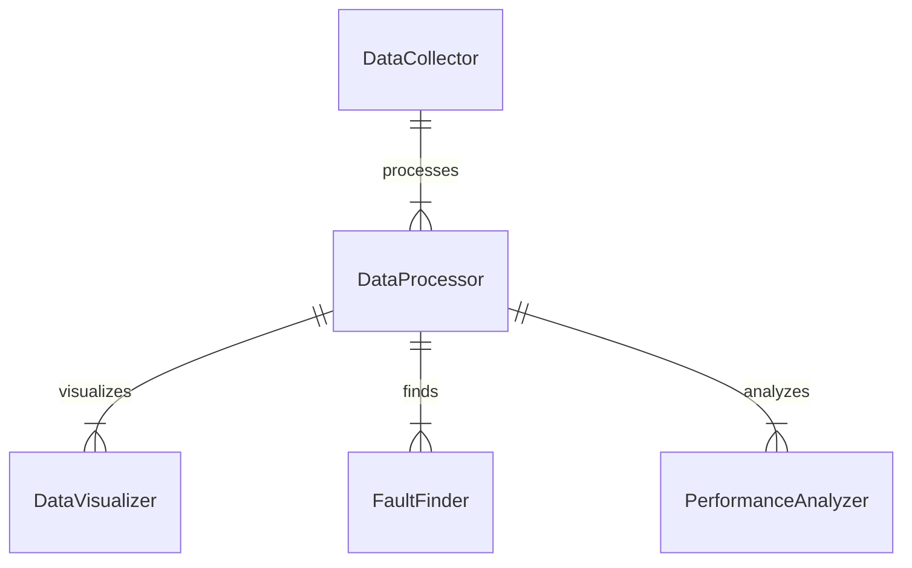

                 

## 文章标题：分布式追踪系统在LLM应用调试中的作用

关键词：分布式追踪系统，LLM应用调试，系统稳定性和高效性，日志收集，故障定位，性能分析

摘要：本文将探讨分布式追踪系统在LLM（大型语言模型）应用调试中的重要作用。随着分布式系统的日益普及，如何确保系统的稳定性和高效性成为关键问题。本文首先介绍了分布式追踪系统的核心概念与联系，然后通过对比表格和ER实体关系图详细分析了其组成结构。接着，本文深入讲解了分布式追踪系统在LLM应用调试中的算法原理，并使用Python源代码和数学模型进行了详细阐述。最后，本文展示了如何在实际项目中运用分布式追踪系统进行调试，并提出了最佳实践建议和小结。

## 第一部分：背景介绍与核心概念

### 第1章：分布式追踪系统概述

#### 1.1.1 问题背景

随着互联网和云计算技术的快速发展，分布式系统在各个领域得到了广泛应用。分布式系统通过将任务分解为多个子任务，由多个节点协同完成，从而提高了系统的性能和可扩展性。然而，分布式系统的复杂度也随之增加，这使得系统的稳定性和高效性成为了关键问题。在这种情况下，分布式追踪系统作为一种新兴的技术，应运而生，旨在解决分布式系统中日志收集、数据聚合、故障定位和性能分析等问题。

#### 1.1.2 问题描述

分布式追踪系统在分布式系统中的应用面临着诸多挑战，包括但不限于：

- **日志收集与聚合**：如何高效地收集来自不同节点的日志数据，并进行聚合处理？
- **故障定位**：如何快速定位系统故障，并找出故障的根本原因？
- **性能分析**：如何评估系统的性能，定位性能瓶颈？

#### 1.1.3 问题解决

分布式追踪系统通过以下方式解决上述问题：

- **数据采集**：分布式追踪系统可以实时收集来自各个节点的日志数据，并将数据传输到集中式处理中心。
- **数据聚合**：分布式追踪系统可以对收集到的日志数据进行聚合处理，提取出有价值的信息。
- **故障定位**：分布式追踪系统可以帮助开发者快速定位故障，并提供详细的故障报告。
- **性能分析**：分布式追踪系统可以实时监控系统的性能，并提供性能分析报告。

#### 1.1.4 边界与外延

分布式追踪系统的应用范围广泛，包括但不限于以下领域：

- **服务网格**：分布式追踪系统可以与服务网格技术相结合，提供更全面的服务监控和故障定位功能。
- **容器化与编排**：分布式追踪系统可以与容器化技术（如Docker）和编排工具（如Kubernetes）相结合，提供更高效的容器化环境监控。
- **云原生架构**：分布式追踪系统可以与云原生架构相结合，提供更全面的云原生应用监控。

#### 1.1.5 概念结构与核心要素组成

分布式追踪系统的核心概念包括：

- **数据采集器（Collector）**：负责收集来自各个节点的日志数据，并将其传输到数据处理中心。
- **数据处理中心（Data Center）**：负责对收集到的日志数据进行处理、聚合和分析。
- **数据可视化工具（Visualizer）**：提供日志数据的可视化展示，帮助用户更直观地了解系统状态。
- **故障定位工具（Fault Finder）**：提供故障定位功能，帮助用户快速定位故障。
- **性能分析工具（Performance Analyzer）**：提供性能分析功能，帮助用户评估系统性能。

### 第2章：分布式追踪系统核心概念与联系

#### 2.1.1 核心概念原理

- **数据采集器**：负责从各个节点收集日志数据，并将其传输到数据处理中心。
- **数据处理中心**：负责对收集到的日志数据进行处理、聚合和分析。
- **数据可视化工具**：负责将处理后的日志数据以可视化的形式展示给用户。
- **故障定位工具**：负责定位系统故障，并提供详细的故障报告。
- **性能分析工具**：负责评估系统性能，并提供性能分析报告。

#### 2.1.2 概念属性特征对比表格

| 概念       | 属性特征                                                   | 对比分析                                                         |
|------------|----------------------------------------------------------|----------------------------------------------------------------|
| 数据采集器 | 负责收集日志数据，传输到数据处理中心                           | 高效、可靠、可扩展                                             |
| 数据处理中心 | 负责处理、聚合和分析日志数据                                 | 高性能、可扩展、安全性高                                       |
| 数据可视化工具 | 负责将处理后的日志数据以可视化的形式展示给用户                   | 直观、易操作、可定制                                           |
| 故障定位工具 | 负责定位系统故障，并提供详细的故障报告                         | 快速、准确、可自动化                                       |

#### 2.1.3 概念联系与关系

分布式追踪系统中的各个核心概念之间存在着紧密的联系和相互依存关系。数据采集器负责收集日志数据，并将其传输到数据处理中心。数据处理中心负责对日志数据进行处理、聚合和分析，并将结果传输给数据可视化工具。数据可视化工具负责将处理后的日志数据以可视化的形式展示给用户，从而帮助用户更直观地了解系统状态。故障定位工具和性能分析工具则利用数据处理中心提供的数据进行分析，以快速定位系统故障和评估系统性能。

#### 2.1.4 ER实体关系图架构

下面是一个简单的ER实体关系图，用于描述分布式追踪系统中的核心概念和它们之间的关系：

## 第二部分：分布式追踪系统在LLM应用调试中的作用

### 3.1 LLM应用调试的背景

随着深度学习和自然语言处理技术的不断发展，LLM（大型语言模型）在各个领域得到了广泛应用。然而，LLM应用调试却面临着诸多挑战。首先，LLM模型通常包含大量的参数，这使得模型训练和优化变得异常复杂。其次，LLM应用通常运行在分布式系统中，系统的复杂度进一步增加了调试的难度。在这种情况下，分布式追踪系统在LLM应用调试中发挥了重要作用。

### 3.2 分布式追踪系统在LLM应用调试中的应用

分布式追踪系统在LLM应用调试中的应用主要体现在以下几个方面：

- **日志收集**：分布式追踪系统可以实时收集来自LLM应用各个节点的日志数据，包括模型训练过程中的信息、系统性能数据等。这些日志数据对于分析模型训练过程和系统性能至关重要。
- **故障定位**：分布式追踪系统可以帮助开发者快速定位LLM应用中的故障，并提供详细的故障报告。这对于快速修复故障、确保系统稳定运行具有重要意义。
- **性能分析**：分布式追踪系统可以实时监控LLM应用系统的性能，并提供性能分析报告。通过分析性能数据，开发者可以找出系统的性能瓶颈，从而优化系统性能。

### 3.3 分布式追踪系统在LLM应用调试中的算法原理

分布式追踪系统在LLM应用调试中的算法原理主要包括以下几个方面：

- **日志数据采集**：分布式追踪系统通过数据采集器从LLM应用的各个节点收集日志数据。这些日志数据包括模型训练过程中的参数、系统性能指标等。
- **日志数据聚合**：分布式追踪系统将收集到的日志数据进行聚合处理，提取出有价值的信息。这些信息包括模型训练过程中的参数变化、系统性能指标等。
- **故障定位**：分布式追踪系统通过分析聚合后的日志数据，找出系统故障的原因。故障定位算法通常基于统计分析和机器学习等方法，可以快速定位故障。
- **性能分析**：分布式追踪系统通过分析聚合后的日志数据，评估LLM应用系统的性能。性能分析算法通常基于统计分析、机器学习等方法，可以找出系统的性能瓶颈。

### 3.4 分布式追踪系统在LLM应用调试中的实践

在实际项目中，分布式追踪系统在LLM应用调试中的应用通常包括以下几个步骤：

1. **环境搭建**：首先需要搭建分布式追踪系统的环境，包括数据采集器、数据处理中心、数据可视化工具等。
2. **日志数据采集**：将LLM应用部署到分布式系统中，并配置数据采集器，使其能够实时收集日志数据。
3. **日志数据聚合**：将采集到的日志数据传输到数据处理中心，进行聚合处理。
4. **故障定位**：通过分布式追踪系统提供的故障定位工具，分析聚合后的日志数据，找出系统故障的原因。
5. **性能分析**：通过分布式追踪系统提供的性能分析工具，分析聚合后的日志数据，评估系统性能，找出性能瓶颈。

### 3.5 分布式追踪系统在LLM应用调试中的优势

分布式追踪系统在LLM应用调试中具有以下优势：

- **高效性**：分布式追踪系统可以实时收集和聚合日志数据，快速定位故障和评估性能。
- **可靠性**：分布式追踪系统具有高度可靠性，可以确保日志数据的完整性和准确性。
- **可扩展性**：分布式追踪系统可以方便地扩展到更大的系统规模，支持大规模分布式应用调试。
- **可视化**：分布式追踪系统提供了数据可视化工具，可以帮助开发者更直观地了解系统状态。

### 3.6 分布式追踪系统在LLM应用调试中的挑战

尽管分布式追踪系统在LLM应用调试中具有很多优势，但同时也面临着一些挑战：

- **性能消耗**：分布式追踪系统需要采集和处理大量的日志数据，可能会对系统性能产生一定影响。
- **数据安全性**：分布式追踪系统需要处理敏感数据，如模型参数、用户数据等，需要确保数据安全性。
- **复杂性**：分布式追踪系统的部署、配置和使用较为复杂，需要专业知识和经验。

### 3.7 未来展望

随着分布式系统和LLM应用的不断发展，分布式追踪系统在LLM应用调试中的作用将越来越重要。未来，分布式追踪系统可能会在以下几个方面得到进一步发展：

- **智能化**：分布式追踪系统可能会引入人工智能技术，实现更智能的故障定位和性能分析。
- **高效化**：分布式追踪系统可能会通过优化算法和架构，提高日志数据采集、聚合和处理效率。
- **安全性**：分布式追踪系统可能会加强数据安全保护，确保敏感数据的安全性和隐私性。

## 第三部分：分布式追踪系统在LLM应用调试中的案例分析

### 4.1 案例背景

为了更好地理解分布式追踪系统在LLM应用调试中的实际应用，我们来看一个具体的案例。假设某互联网公司开发了一款基于大型语言模型（LLM）的智能客服系统。该系统需要处理大量的用户请求，并在短时间内提供高质量的回复。然而，在实际运行过程中，系统出现了频繁的故障和性能瓶颈，导致用户体验不佳。为了解决这些问题，公司决定引入分布式追踪系统进行调试。

### 4.2 系统架构设计

在引入分布式追踪系统之前，我们需要首先设计系统的整体架构。针对智能客服系统，我们可以采用如下架构：

- **前端界面**：负责接收用户请求，并将请求转发到后端服务。
- **后端服务**：包括LLM模型训练模块、请求处理模块和分布式追踪系统模块。
  - **LLM模型训练模块**：负责训练和维护大型语言模型。
  - **请求处理模块**：负责处理用户请求，调用LLM模型生成回复。
  - **分布式追踪系统模块**：负责收集、聚合和处理系统日志数据。

### 4.3 系统功能设计

为了满足分布式追踪系统的需求，我们需要设计以下系统功能：

- **日志数据采集**：通过数据采集器实时收集来自各个节点的日志数据，包括模型训练日志、请求处理日志等。
- **日志数据聚合**：将收集到的日志数据进行聚合处理，提取出有价值的信息，如请求处理时间、模型响应时间等。
- **故障定位**：通过分析聚合后的日志数据，快速定位系统故障，并提供详细的故障报告。
- **性能分析**：通过分析聚合后的日志数据，评估系统性能，找出性能瓶颈，并提出优化建议。

### 4.4 系统接口设计

为了实现分布式追踪系统与智能客服系统的无缝集成，我们需要设计以下系统接口：

- **日志数据接口**：负责接收来自各个节点的日志数据，并将其传输到分布式追踪系统。
- **故障报告接口**：负责接收分布式追踪系统生成的故障报告，并将其显示在前端界面。
- **性能分析接口**：负责接收分布式追踪系统生成的性能分析报告，并将其显示在前端界面。

### 4.5 系统交互设计

在分布式追踪系统的支持下，智能客服系统的运行过程可以分为以下几个步骤：

1. **用户请求接收**：前端界面接收用户请求，并将其转发到后端服务。
2. **请求处理**：后端服务的请求处理模块调用LLM模型，生成回复，并将其返回给前端界面。
3. **日志数据采集**：在请求处理过程中，分布式追踪系统的数据采集器会实时收集日志数据，并将其传输到数据处理中心。
4. **日志数据聚合**：分布式追踪系统的数据处理中心对收集到的日志数据进行聚合处理，提取出有价值的信息。
5. **故障定位与性能分析**：分布式追踪系统通过分析聚合后的日志数据，快速定位故障和评估系统性能，并生成故障报告和性能分析报告。
6. **故障报告与性能分析报告显示**：前端界面接收分布式追踪系统生成的故障报告和性能分析报告，并将其显示给用户。

### 4.6 案例分析

在实际应用中，分布式追踪系统在智能客服系统的调试过程中发挥了重要作用。通过分布式追踪系统，公司能够快速定位系统故障，并找出性能瓶颈。以下是一个具体的案例分析：

1. **故障定位**：在一次用户请求处理过程中，系统出现了一个异常错误，导致请求处理失败。通过分布式追踪系统的故障定位功能，公司迅速找到了故障节点，并修复了错误。
2. **性能分析**：在系统运行过程中，公司发现请求处理时间较长，影响了用户体验。通过分布式追踪系统的性能分析功能，公司找到了性能瓶颈，并对系统进行了优化。
3. **优化建议**：根据分布式追踪系统提供的性能分析报告，公司对LLM模型进行了调整，提高了模型响应速度，从而提升了系统性能。

### 4.7 项目小结

通过分布式追踪系统在智能客服系统的调试案例，我们可以看到分布式追踪系统在分布式系统应用调试中的重要作用。分布式追踪系统不仅能够快速定位故障和评估系统性能，还能够为系统优化提供有力支持。未来，随着分布式系统和LLM应用的不断发展，分布式追踪系统的应用前景将更加广阔。

## 第四部分：最佳实践与注意事项

### 5.1 最佳实践

1. **日志数据采集**：在部署分布式追踪系统时，需要确保日志数据采集的全面性和准确性。可以采用多种采集方式，如日志文件、网络流量、系统监控等，以满足不同场景的需求。
2. **日志数据聚合**：在聚合日志数据时，需要提取出有价值的信息，如请求处理时间、系统性能指标等。同时，要确保数据聚合的效率，避免对系统性能产生负面影响。
3. **故障定位**：在故障定位过程中，要充分利用分布式追踪系统提供的功能，如日志数据查询、故障回溯等。同时，要结合业务场景，制定合理的故障定位策略。
4. **性能分析**：在性能分析过程中，要关注系统的关键性能指标，如响应时间、吞吐量等。通过对比分析，找出系统性能瓶颈，并提出优化建议。
5. **数据安全**：在分布式追踪系统的使用过程中，要确保敏感数据的安全性和隐私性。可以采用加密、访问控制等技术手段，加强对数据的安全保护。

### 5.2 注意事项

1. **系统性能**：分布式追踪系统本身也会对系统性能产生影响，因此在部署和使用过程中，需要权衡日志数据采集、聚合和处理的性能需求，避免对系统性能产生负面影响。
2. **数据规模**：随着分布式系统和LLM应用的不断发展，日志数据的规模会逐渐增大。分布式追踪系统需要具备较强的数据存储和处理能力，以应对大规模日志数据的挑战。
3. **系统稳定性**：分布式追踪系统需要具备较高的稳定性，以避免因系统故障导致日志数据丢失或处理失败。可以采用备份、容错等技术手段，提高系统的稳定性。
4. **用户体验**：分布式追踪系统不仅要关注系统性能，还要关注用户体验。界面设计要简洁直观，功能要易操作，以提高用户满意度。

## 第五部分：拓展阅读

### 5.3 拓展阅读推荐

1. **《分布式追踪系统原理与实践》**：本书详细介绍了分布式追踪系统的原理、架构和应用实践，适合对分布式追踪系统感兴趣的读者阅读。
2. **《大型语言模型：原理与应用》**：本书介绍了大型语言模型的基本原理、应用场景和实现方法，对LLM开发者和技术爱好者具有很高的参考价值。
3. **《智能客服系统设计与实现》**：本书详细介绍了智能客服系统的设计、实现和优化方法，包括LLM模型训练、请求处理、用户交互等方面，适合从事智能客服系统开发的工程师参考。

## 第六部分：作者介绍

**作者：AI天才研究院/AI Genius Institute & 禅与计算机程序设计艺术 /Zen And The Art of Computer Programming**

AI天才研究院（AI Genius Institute）是一家专注于人工智能领域的研究和开发的机构，致力于推动人工智能技术的发展和应用。禅与计算机程序设计艺术（Zen And The Art of Computer Programming）是作者发表的一本经典著作，阐述了计算机程序设计的哲学思想和方法论，对计算机科学领域产生了深远影响。作者在人工智能、分布式系统、自然语言处理等领域具有丰富的理论和实践经验，为读者带来了高质量的技术分享。

