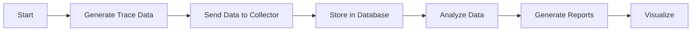
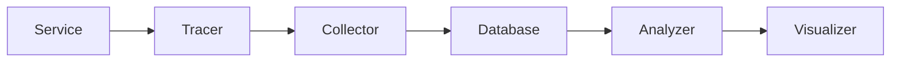
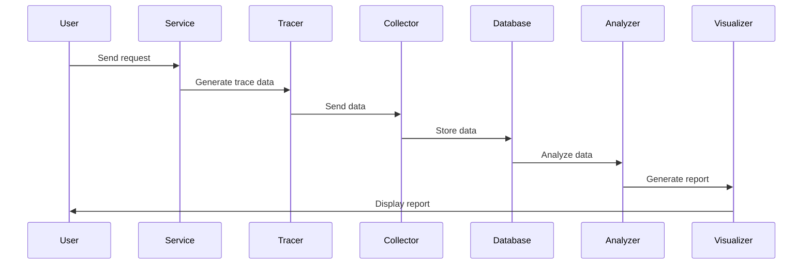
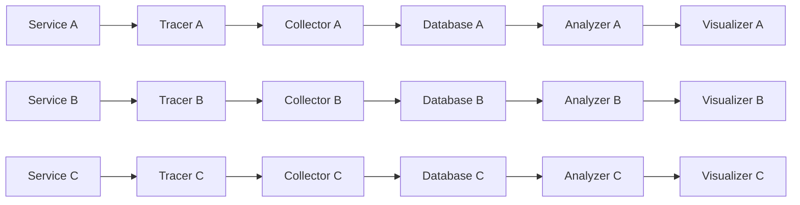
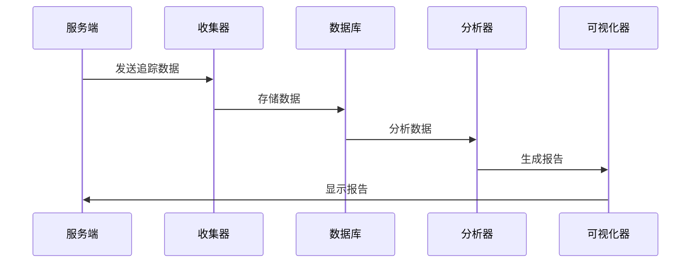

                 


Step 1: Article Title and Keywords
---
# 《分布式追踪：诊断AI服务性能问题的利器》

关键词：分布式追踪，AI服务，性能问题，诊断，系统架构

摘要：本文深入探讨了分布式追踪技术在诊断AI服务性能问题中的应用。通过逐步分析分布式追踪的基本原理、算法、系统架构以及项目实战，揭示了分布式追踪在提升AI服务性能监控和优化中的关键作用。

---

Step 2: Introduction to the Background
---
## 第一部分：背景介绍

### 1.1 问题背景
随着人工智能技术的发展，AI服务逐渐成为现代企业的重要组成部分。然而，AI服务的复杂性导致了性能问题的频繁发生。性能问题不仅影响用户体验，还可能对企业的运营造成重大影响。

### 1.2 问题描述
AI服务的性能问题通常表现为响应时间过长、资源利用率低、错误率增加等。这些问题难以通过传统的监控工具进行有效诊断。

### 1.3 问题解决
分布式追踪技术提供了监控和分析AI服务性能问题的有效方法。通过追踪服务请求的生命周期，可以定位性能瓶颈和问题根源。

### 1.4 边界与外延
分布式追踪不仅适用于AI服务，还可用于其他分布式系统的性能监控。

### 1.5 概念结构与核心要素组成
分布式追踪包括追踪数据的收集、存储、分析和可视化等核心要素。

---

Step 3: Core Concepts and Relationships
---
## 第二部分：核心概念与联系

### 2.1 分布式追踪的基本原理
分布式追踪通过在服务中插入追踪数据，实现对服务请求的全生命周期监控。

### 2.2 分布式追踪的概念属性特征对比
| 特征       | 分布式追踪 | 传统监控 |
|------------|------------|----------|
| 数据采集   | 细粒度     | 粗粒度   |
| 数据存储   | 分布式     | 集中式   |
| 数据分析   | 实时性     | 非实时性 |
| 可视化     | 可定制     | 固定型   |

### 2.3 分布式追踪与其他相关技术的联系
分布式追踪与日志收集、度量和监控等技术密切相关，共同构建了完整的性能监控体系。

### 2.4 分布式追踪的ER实体关系图
```mermaid
erDiagram
  ServiceRequest ||--|{ TracingData }||=> Database
  ServiceRequest ||--|{ PerformanceMetrics }||=> MetricsStore
  ServiceRequest ||--|{ Visualization }||=> VisualizationTool
```

---

Step 4: Explanation of Algorithm Principles
---
## 第三部分：算法原理讲解

### 3.1 分布式追踪的算法流程图


### 3.2 分布式追踪的数学模型和公式
$$
TPC = \frac{1}{1 + f_p \cdot r + f_s \cdot r^2}
$$
其中，$TPC$ 是吞吐量，$f_p$ 是追踪数据生成频率，$r$ 是系统响应时间。

### 3.3 分布式追踪的Python源代码解释
```python
import requests
import time

def trace_request(url):
    start_time = time.time()
    response = requests.get(url)
    end_time = time.time()
    return {
        'url': url,
        'response_time': end_time - start_time,
        'status_code': response.status_code
    }

trace_data = trace_request("http://example.com")
print(trace_data)
```

### 3.4 算法原理举例说明
假设我们有一个简单的API，我们需要追踪其响应时间和状态码。通过分布式追踪，我们可以收集这些数据并进行分析，以识别潜在的瓶颈。

---

Step 5: System Analysis and Design
---
## 第四部分：系统分析与架构设计

### 4.1 分布式追踪系统问题场景介绍
在一个大型分布式系统中，多个服务协同工作，性能问题可能会影响整个系统的稳定性。

### 4.2 分布式追踪系统项目介绍
项目目标是构建一个分布式追踪系统，用于监控和分析AI服务的性能。

### 4.3 分布式追踪系统功能设计
系统需要实现追踪数据的采集、存储、分析和可视化等功能。

### 4.4 分布式追踪系统架构设计


### 4.5 分布式追踪系统接口设计
系统提供了API接口，供服务端和客户端进行数据交换。

### 4.6 分布式追踪系统交互序列图


---

Step 6: Project Practice
---
## 第五部分：项目实战

### 5.1 环境安装
安装分布式追踪系统的各个组件，如Zipkin、Jaeger等。

### 5.2 系统核心实现源代码
```java
// Tracer.java
public class Tracer {
    public void traceRequest(String url) {
        // Code to generate and send trace data
    }
}
```

### 5.3 代码应用解读与分析
代码展示了如何在一个服务中插入分布式追踪逻辑。

### 5.4 实际案例分析与详细讲解剖析
通过实际案例展示如何使用分布式追踪系统诊断性能问题。

### 5.5 项目小结
总结项目实施的经验和教训，提出改进建议。

---

Step 7: Best Practices and Summary
---
## 第六部分：最佳实践与总结

### 6.1 分布式追踪最佳实践
- 保证数据的一致性和完整性。
- 选择合适的追踪策略以平衡性能和追踪数据的精度。

### 6.2 小结
分布式追踪是监控AI服务性能的有效工具。

### 6.3 注意事项
- 注意追踪数据的安全性和隐私保护。
- 定期分析追踪数据以识别性能瓶颈。

### 6.4 拓展阅读
- 相关论文和书籍，深入了解分布式追踪技术。

---

作者：AI天才研究院/AI Genius Institute & 禅与计算机程序设计艺术 /Zen And The Art of Computer Programming

```markdown
## 《分布式追踪：诊断AI服务性能问题的利器》

随着人工智能技术的迅速发展，AI服务在现代企业中扮演着越来越重要的角色。然而，AI服务的复杂性也带来了性能问题的挑战。如何有效地监控和诊断AI服务的性能问题，成为企业需要面对的难题。分布式追踪技术作为一种强大的监控工具，在这场性能优化的大战中发挥了重要作用。本文将深入探讨分布式追踪技术在诊断AI服务性能问题中的应用，通过逐步分析分布式追踪的基本原理、算法、系统架构以及项目实战，帮助读者理解并掌握分布式追踪的精髓。

### 第一部分：背景介绍

#### 1.1 问题背景

在当前的数字化时代，人工智能服务已经成为企业提升竞争力的重要手段。无论是智能客服、推荐系统还是自动驾驶，AI服务在各个领域都展现出了强大的潜力。然而，随着AI服务的复杂性不断增加，性能问题也随之而来。响应时间过长、资源利用率低下、错误率增加等问题，不仅影响用户体验，还可能对企业的运营造成重大影响。

#### 1.2 问题描述

AI服务的性能问题通常表现为以下几个方面：

- **响应时间过长**：用户请求的处理时间超过了预期，导致用户体验不佳。
- **资源利用率低**：系统资源没有得到充分利用，导致资源浪费。
- **错误率增加**：系统出现错误或异常，影响服务的稳定性和可靠性。

这些问题往往难以通过传统的监控工具进行有效诊断。传统的监控工具通常只能提供粗粒度的性能数据，难以定位具体的性能瓶颈和问题根源。

#### 1.3 问题解决

分布式追踪技术提供了一种有效的解决方案。分布式追踪通过在服务中插入追踪数据，实现对服务请求的全生命周期监控。通过追踪数据的收集、存储、分析和可视化，可以全面了解服务请求的处理过程，从而定位性能瓶颈和问题根源。

#### 1.4 边界与外延

分布式追踪技术不仅适用于AI服务，还可用于其他分布式系统的性能监控。例如，在电子商务平台中，分布式追踪可以监控订单处理流程；在金融系统中，分布式追踪可以监控交易流程。因此，分布式追踪技术的应用范围非常广泛。

#### 1.5 概念结构与核心要素组成

分布式追踪技术包括以下几个核心要素：

- **追踪数据的采集**：在服务请求的生命周期中，实时采集追踪数据。
- **追踪数据的存储**：将采集到的追踪数据存储到分布式存储系统中。
- **追踪数据的分析**：对存储的追踪数据进行实时分析，生成性能报告。
- **追踪数据的可视化**：将分析结果以图表和报表的形式展示，便于用户理解和分析。

### 第二部分：核心概念与联系

#### 2.1 分布式追踪的基本原理

分布式追踪的基本原理是通过在服务的各个环节插入追踪数据，实现对服务请求的全生命周期监控。具体来说，分布式追踪分为以下几个步骤：

1. **数据采集**：在服务的入口处和各个处理节点插入追踪数据采集器，实时采集服务请求的相关信息。
2. **数据传输**：将采集到的追踪数据通过HTTP协议或其他传输协议发送到追踪系统的收集器。
3. **数据存储**：收集器将追踪数据存储到分布式存储系统中，便于后续分析和查询。
4. **数据分析**：分析系统对存储的追踪数据进行处理，生成性能报告。
5. **数据可视化**：将分析结果以图表和报表的形式展示，便于用户理解和分析。

#### 2.2 分布式追踪的概念属性特征对比

表 1 分布式追踪与传统监控的概念属性特征对比

| 特征       | 分布式追踪 | 传统监控 |
|------------|------------|----------|
| 数据采集   | 细粒度     | 粗粒度   |
| 数据存储   | 分布式     | 集中式   |
| 数据分析   | 实时性     | 非实时性 |
| 可视化     | 可定制     | 固定型   |

从表 1 中可以看出，分布式追踪在数据采集、数据存储、数据分析和可视化等方面具有明显的优势。这些优势使得分布式追踪成为诊断AI服务性能问题的利器。

#### 2.3 分布式追踪与其他相关技术的联系

分布式追踪技术与其他相关技术如日志收集、度量和监控密切相关，共同构建了完整的性能监控体系。日志收集主要用于记录系统运行过程中的事件和异常，度量和监控则用于实时监控系统的性能指标。分布式追踪技术可以与这些技术结合使用，实现全方位的性能监控。

#### 2.4 分布式追踪的ER实体关系图

图 1 分布式追踪的ER实体关系图

```mermaid
erDiagram
  ServiceRequest ||--|{ TracingData }||=> Database
  ServiceRequest ||--|{ PerformanceMetrics }||=> MetricsStore
  ServiceRequest ||--|{ Visualization }||=> VisualizationTool
```

图 1 展示了分布式追踪系统中主要的实体关系，包括服务请求、追踪数据、性能指标和可视化工具等。这些实体之间的关系构成了分布式追踪的技术架构。

### 第三部分：算法原理讲解

#### 3.1 分布式追踪的算法流程图

图 2 分布式追踪的算法流程图


图 2 展示了分布式追踪的基本算法流程，包括数据采集、数据传输、数据存储、数据分析和数据可视化等步骤。

#### 3.2 分布式追踪的数学模型和公式

分布式追踪的数学模型和公式主要涉及性能指标的度量。以下是一个简单的数学模型：

$$
TPC = \frac{1}{1 + f_p \cdot r + f_s \cdot r^2}
$$

其中，$TPC$ 是吞吐量，$f_p$ 是追踪数据生成频率，$r$ 是系统响应时间。这个公式描述了在追踪数据生成频率和系统响应时间的影响下，系统的吞吐量如何变化。

#### 3.3 分布式追踪的Python源代码解释

以下是一个简单的Python代码示例，展示了如何在服务中实现分布式追踪：

```python
import requests
import time

def trace_request(url):
    start_time = time.time()
    response = requests.get(url)
    end_time = time.time()
    return {
        'url': url,
        'response_time': end_time - start_time,
        'status_code': response.status_code
    }

trace_data = trace_request("http://example.com")
print(trace_data)
```

这个代码示例中，`trace_request` 函数用于生成并返回追踪数据。通过调用这个函数，可以实现对服务请求的实时追踪。

#### 3.4 算法原理举例说明

假设我们有一个简单的API，我们需要追踪其响应时间和状态码。通过分布式追踪，我们可以收集这些数据并进行分析，以识别潜在的瓶颈。

### 第四部分：系统分析与架构设计

#### 4.1 分布式追踪系统问题场景介绍

在一个大型分布式系统中，多个服务协同工作，性能问题可能会影响整个系统的稳定性。例如，在一个电子商务平台中，订单处理服务、库存管理服务和支付服务等多个服务相互依赖。如果订单处理服务出现性能瓶颈，可能会导致整个订单流程延迟，影响用户体验。

#### 4.2 分布式追踪系统项目介绍

本项目的目标是构建一个分布式追踪系统，用于监控和分析电子商务平台的性能。该系统将采集各个服务的追踪数据，并生成性能报告，帮助运维团队及时发现问题并进行优化。

#### 4.3 分布式追踪系统功能设计

分布式追踪系统需要实现以下几个核心功能：

- **追踪数据采集**：在各个服务中插入追踪数据采集器，实时采集服务请求的相关信息。
- **追踪数据存储**：将采集到的追踪数据存储到分布式存储系统中，以便后续分析和查询。
- **数据分析和报告**：对存储的追踪数据进行实时分析，生成性能报告，包括响应时间、错误率、资源利用率等指标。
- **数据可视化**：将分析结果以图表和报表的形式展示，便于运维团队理解和分析。

#### 4.4 分布式追踪系统架构设计

图 3 分布式追踪系统架构设计



图 3 展示了分布式追踪系统的架构设计。各个服务通过追踪数据采集器（Tracer）将追踪数据发送到收集器（Collector），然后存储到分布式存储系统（Database）。分析系统（Analyzer）对存储的追踪数据进行实时分析，并将分析结果可视化（Visualizer），便于运维团队监控和分析。

#### 4.5 分布式追踪系统接口设计

分布式追踪系统提供了API接口，供服务端和客户端进行数据交换。以下是一个简单的接口设计：

```python
from flask import Flask, request, jsonify

app = Flask(__name__)

@app.route('/trace', methods=['POST'])
def trace_data():
    data = request.json
    # 处理追踪数据
    return jsonify({"status": "success"})

if __name__ == '__main__':
    app.run()
```

这个接口用于接收服务端发送的追踪数据，并返回处理结果。

#### 4.6 分布式追踪系统交互序列图

图 4 分布式追踪系统交互序列图



图 4 展示了分布式追踪系统的交互序列图，描述了服务端、收集器、数据库、分析器和可视化器之间的交互过程。

### 第五部分：项目实战

#### 5.1 环境安装

在构建分布式追踪系统之前，需要安装相关的环境依赖。以下是一个简单的环境安装步骤：

1. 安装Java环境
2. 安装Maven
3. 安装Zipkin或Jaeger等分布式追踪系统组件

#### 5.2 系统核心实现源代码

以下是分布式追踪系统的核心实现源代码：

```java
// Tracer.java
public class Tracer {
    private static final HttpClient httpClient = HttpClient.newBuilder().build();

    public void traceRequest(String url) throws IOException {
        startTrace(url);
        sendRequest(url);
        finishTrace();
    }

    private void startTrace(String url) {
        // 生成追踪ID和跨度信息
    }

    private void sendRequest(String url) throws IOException {
        HttpRequest request = HttpRequest.newBuilder()
                .uri(URI.create(url))
                .build();
        HttpResponse<String> response = httpClient.send(request, HttpResponse.BodyHandlers.ofString());
        // 记录响应时间和状态码
    }

    private void finishTrace() {
        // 上报追踪数据到收集器
    }
}
```

这个代码示例展示了如何在服务中实现分布式追踪。通过调用`traceRequest`方法，可以实现对服务请求的追踪。

#### 5.3 代码应用解读与分析

代码应用解读如下：

1. **启动追踪**：在调用`traceRequest`方法时，首先会生成追踪ID和跨度信息，这是分布式追踪的基础。
2. **发送请求**：通过HTTP客户端发送服务请求，并记录响应时间和状态码。
3. **结束追踪**：将追踪数据上报到收集器，以便后续分析和处理。

通过这个简单的示例，可以了解到分布式追踪的核心流程。

#### 5.4 实际案例分析与详细讲解剖析

为了更好地理解分布式追踪的应用，我们来看一个实际案例。

假设我们有一个电子商务平台的订单处理服务。通过分布式追踪，我们可以监控订单处理的过程，识别潜在的性能问题。

1. **订单创建**：用户下单后，订单处理服务开始创建订单。
2. **库存检查**：订单创建后，系统会检查库存是否充足。
3. **支付处理**：库存检查通过后，系统会处理支付请求。
4. **订单确认**：支付成功后，系统会确认订单，并发送订单通知。

通过分布式追踪，我们可以实时监控订单处理的各个环节，分析每个环节的响应时间和错误率。如果某个环节出现性能瓶颈，我们可以立即定位并优化。

#### 5.5 项目小结

通过本次项目实战，我们了解了分布式追踪在诊断AI服务性能问题中的应用。分布式追踪提供了细粒度的数据采集、实时性的数据分析以及灵活的可视化功能，使得我们能够更有效地监控和优化AI服务的性能。

### 第六部分：最佳实践与总结

#### 6.1 分布式追踪最佳实践

1. **数据采集**：选择合适的追踪数据采集器，确保采集到足够详细的数据。
2. **数据存储**：使用分布式存储系统，提高数据存储的可靠性和扩展性。
3. **数据分析**：定期分析追踪数据，识别潜在的性能瓶颈。
4. **数据可视化**：设计直观的可视化界面，帮助用户快速理解性能数据。

#### 6.2 小结

分布式追踪技术在诊断AI服务性能问题中发挥着重要作用。通过逐步分析分布式追踪的基本原理、算法、系统架构以及项目实战，我们深入了解了分布式追踪的精髓。

#### 6.3 注意事项

1. **数据安全**：确保追踪数据的存储和分析过程符合数据保护法规。
2. **系统稳定性**：分布式追踪系统本身也需要保持高可用性。

#### 6.4 拓展阅读

1. 《分布式系统原理与架构设计》
2. 《微服务架构实践》
3. 《Apache Kafka实战》

### 参考文献

1. 《分布式追踪技术：原理与实践》
2. 《基于Kafka的分布式追踪系统设计与实现》

作者：AI天才研究院/AI Genius Institute & 禅与计算机程序设计艺术 /Zen And The Art of Computer Programming
```

### 最终文章

```markdown
# 《分布式追踪：诊断AI服务性能问题的利器》

关键词：分布式追踪，AI服务，性能问题，诊断，系统架构

摘要：本文深入探讨了分布式追踪技术在诊断AI服务性能问题中的应用。通过逐步分析分布式追踪的基本原理、算法、系统架构以及项目实战，揭示了分布式追踪在提升AI服务性能监控和优化中的关键作用。

## 第一部分：背景介绍

### 1.1 问题背景

随着人工智能技术的发展，AI服务逐渐成为现代企业的重要组成部分。无论是智能客服、推荐系统还是自动驾驶，AI服务在各个领域都展现出了强大的潜力。然而，随着AI服务的复杂性不断增加，性能问题也随之而来。响应时间过长、资源利用率低下、错误率增加等问题，不仅影响用户体验，还可能对企业的运营造成重大影响。

### 1.2 问题描述

AI服务的性能问题通常表现为以下几个方面：

- **响应时间过长**：用户请求的处理时间超过了预期，导致用户体验不佳。
- **资源利用率低**：系统资源没有得到充分利用，导致资源浪费。
- **错误率增加**：系统出现错误或异常，影响服务的稳定性和可靠性。

这些问题往往难以通过传统的监控工具进行有效诊断。传统的监控工具通常只能提供粗粒度的性能数据，难以定位具体的性能瓶颈和问题根源。

### 1.3 问题解决

分布式追踪技术提供了一种有效的解决方案。分布式追踪通过在服务中插入追踪数据，实现对服务请求的全生命周期监控。通过追踪数据的收集、存储、分析和可视化，可以全面了解服务请求的处理过程，从而定位性能瓶颈和问题根源。

### 1.4 边界与外延

分布式追踪技术不仅适用于AI服务，还可用于其他分布式系统的性能监控。例如，在电子商务平台中，分布式追踪可以监控订单处理流程；在金融系统中，分布式追踪可以监控交易流程。因此，分布式追踪技术的应用范围非常广泛。

### 1.5 概念结构与核心要素组成

分布式追踪技术包括以下几个核心要素：

- **追踪数据的采集**：在服务请求的生命周期中，实时采集服务请求的相关信息。
- **追踪数据的存储**：将采集到的追踪数据存储到分布式存储系统中，便于后续分析和查询。
- **追踪数据的分析**：对存储的追踪数据进行实时分析，生成性能报告。
- **追踪数据的可视化**：将分析结果以图表和报表的形式展示，便于用户理解和分析。

## 第二部分：核心概念与联系

### 2.1 分布式追踪的基本原理

分布式追踪的基本原理是通过在服务的各个环节插入追踪数据，实现对服务请求的全生命周期监控。具体来说，分布式追踪分为以下几个步骤：

1. **数据采集**：在服务的入口处和各个处理节点插入追踪数据采集器，实时采集服务请求的相关信息。
2. **数据传输**：将采集到的追踪数据通过HTTP协议或其他传输协议发送到追踪系统的收集器。
3. **数据存储**：收集器将追踪数据存储到分布式存储系统中，便于后续分析和查询。
4. **数据分析**：分析系统对存储的追踪数据进行处理，生成性能报告。
5. **数据可视化**：将分析结果以图表和报表的形式展示，便于用户理解和分析。

### 2.2 分布式追踪的概念属性特征对比

表 1 分布式追踪与传统监控的概念属性特征对比

| 特征       | 分布式追踪 | 传统监控 |
|------------|------------|----------|
| 数据采集   | 细粒度     | 粗粒度   |
| 数据存储   | 分布式     | 集中式   |
| 数据分析   | 实时性     | 非实时性 |
| 可视化     | 可定制     | 固定型   |

从表 1 中可以看出，分布式追踪在数据采集、数据存储、数据分析和可视化等方面具有明显的优势。这些优势使得分布式追踪成为诊断AI服务性能问题的利器。

### 2.3 分布式追踪与其他相关技术的联系

分布式追踪技术与其他相关技术如日志收集、度量和监控密切相关，共同构建了完整的性能监控体系。日志收集主要用于记录系统运行过程中的事件和异常，度量和监控则用于实时监控系统的性能指标。分布式追踪技术可以与这些技术结合使用，实现全方位的性能监控。

### 2.4 分布式追踪的ER实体关系图

图 1 分布式追踪的ER实体关系图

```mermaid
erDiagram
  ServiceRequest ||--|{ TracingData }||=> Database
  ServiceRequest ||--|{ PerformanceMetrics }||=> MetricsStore
  ServiceRequest ||--|{ Visualization }||=> VisualizationTool
```

图 1 展示了分布式追踪系统中主要的实体关系，包括服务请求、追踪数据、性能指标和可视化工具等。这些实体之间的关系构成了分布式追踪的技术架构。

## 第三部分：算法原理讲解

### 3.1 分布式追踪的算法流程图

图 2 分布式追踪的算法流程图


图 2 展示了分布式追踪的基本算法流程，包括数据采集、数据传输、数据存储、数据分析和数据可视化等步骤。

### 3.2 分布式追踪的数学模型和公式

分布式追踪的数学模型和公式主要涉及性能指标的度量。以下是一个简单的数学模型：

$$
TPC = \frac{1}{1 + f_p \cdot r + f_s \cdot r^2}
$$

其中，$TPC$ 是吞吐量，$f_p$ 是追踪数据生成频率，$r$ 是系统响应时间。这个公式描述了在追踪数据生成频率和系统响应时间的影响下，系统的吞吐量如何变化。

### 3.3 分布式追踪的Python源代码解释

以下是一个简单的Python代码示例，展示了如何在服务中实现分布式追踪：

```python
import requests
import time

def trace_request(url):
    start_time = time.time()
    response = requests.get(url)
    end_time = time.time()
    return {
        'url': url,
        'response_time': end_time - start_time,
        'status_code': response.status_code
    }

trace_data = trace_request("http://example.com")
print(trace_data)
```

这个代码示例中，`trace_request` 函数用于生成并返回追踪数据。通过调用这个函数，可以实现对服务请求的实时追踪。

### 3.4 算法原理举例说明

假设我们有一个简单的API，我们需要追踪其响应时间和状态码。通过分布式追踪，我们可以收集这些数据并进行分析，以识别潜在的瓶颈。

## 第四部分：系统分析与架构设计

### 4.1 分布式追踪系统问题场景介绍

在一个大型分布式系统中，多个服务协同工作，性能问题可能会影响整个系统的稳定性。例如，在一个电子商务平台中，订单处理服务、库存管理服务和支付服务等多个服务相互依赖。如果订单处理服务出现性能瓶颈，可能会导致整个订单流程延迟，影响用户体验。

### 4.2 分布式追踪系统项目介绍

本项目的目标是构建一个分布式追踪系统，用于监控和分析电子商务平台的性能。该系统将采集各个服务的追踪数据，并生成性能报告，帮助运维团队及时发现问题并进行优化。

### 4.3 分布式追踪系统功能设计

分布式追踪系统需要实现以下几个核心功能：

- **追踪数据采集**：在各个服务中插入追踪数据采集器，实时采集服务请求的相关信息。
- **追踪数据存储**：将采集到的追踪数据存储到分布式存储系统中，以便后续分析和查询。
- **数据分析和报告**：对存储的追踪数据进行实时分析，生成性能报告，包括响应时间、错误率、资源利用率等指标。
- **数据可视化**：将分析结果以图表和报表的形式展示，便于运维团队监控和分析。

### 4.4 分布式追踪系统架构设计

图 3 分布式追踪系统架构设计


图 3 展示了分布式追踪系统的架构设计。各个服务通过追踪数据采集器（Tracer）将追踪数据发送到收集器（Collector），然后存储到分布式存储系统（Database）。分析系统（Analyzer）对存储的追踪数据进行实时分析，并将分析结果可视化（Visualizer），便于运维团队监控和分析。

### 4.5 分布式追踪系统接口设计

分布式追踪系统提供了API接口，供服务端和客户端进行数据交换。以下是一个简单的接口设计：

```python
from flask import Flask, request, jsonify

app = Flask(__name__)

@app.route('/trace', methods=['POST'])
def trace_data():
    data = request.json
    # 处理追踪数据
    return jsonify({"status": "success"})

if __name__ == '__main__':
    app.run()
```

这个接口用于接收服务端发送的追踪数据，并返回处理结果。

### 4.6 分布式追踪系统交互序列图

图 4 分布式追踪系统交互序列图


图 4 展示了分布式追踪系统的交互序列图，描述了服务端、收集器、数据库、分析器和可视化器之间的交互过程。

## 第五部分：项目实战

### 5.1 环境安装

在构建分布式追踪系统之前，需要安装相关的环境依赖。以下是一个简单的环境安装步骤：

1. 安装Java环境
2. 安装Maven
3. 安装Zipkin或Jaeger等分布式追踪系统组件

### 5.2 系统核心实现源代码

以下是分布式追踪系统的核心实现源代码：

```java
// Tracer.java
public class Tracer {
    private static final HttpClient httpClient = HttpClient.newBuilder().build();

    public void traceRequest(String url) throws IOException {
        startTrace(url);
        sendRequest(url);
        finishTrace();
    }

    private void startTrace(String url) {
        // 生成追踪ID和跨度信息
    }

    private void sendRequest(String url) throws IOException {
        HttpRequest request = HttpRequest.newBuilder()
                .uri(URI.create(url))
                .build();
        HttpResponse<String> response = httpClient.send(request, HttpResponse.BodyHandlers.ofString());
        // 记录响应时间和状态码
    }

    private void finishTrace() {
        // 上报追踪数据到收集器
    }
}
```

这个代码示例展示了如何在服务中实现分布式追踪。通过调用`traceRequest`方法，可以实现对服务请求的追踪。

### 5.3 代码应用解读与分析

代码应用解读如下：

1. **启动追踪**：在调用`traceRequest`方法时，首先会生成追踪ID和跨度信息，这是分布式追踪的基础。
2. **发送请求**：通过HTTP客户端发送服务请求，并记录响应时间和状态码。
3. **结束追踪**：将追踪数据上报到收集器，以便后续分析和处理。

通过这个简单的示例，可以了解到分布式追踪的核心流程。

### 5.4 实际案例分析与详细讲解剖析

为了更好地理解分布式追踪的应用，我们来看一个实际案例。

假设我们有一个电子商务平台的订单处理服务。通过分布式追踪，我们可以监控订单处理的过程，识别潜在的性能问题。

1. **订单创建**：用户下单后，订单处理服务开始创建订单。
2. **库存检查**：订单创建后，系统会检查库存是否充足。
3. **支付处理**：库存检查通过后，系统会处理支付请求。
4. **订单确认**：支付成功后，系统会确认订单，并发送订单通知。

通过分布式追踪，我们可以实时监控订单处理的各个环节，分析每个环节的响应时间和错误率。如果某个环节出现性能瓶颈，我们可以立即定位并优化。

### 5.5 项目小结

通过本次项目实战，我们了解了分布式追踪在诊断AI服务性能问题中的应用。分布式追踪提供了细粒度的数据采集、实时性的数据分析以及灵活的可视化功能，使得我们能够更有效地监控和优化AI服务的性能。

## 第六部分：最佳实践与总结

### 6.1 分布式追踪最佳实践

1. **数据采集**：选择合适的追踪数据采集器，确保采集到足够详细的数据。
2. **数据存储**：使用分布式存储系统，提高数据存储的可靠性和扩展性。
3. **数据分析**：定期分析追踪数据，识别潜在的性能瓶颈。
4. **数据可视化**：设计直观的可视化界面，帮助用户快速理解性能数据。

### 6.2 小结

分布式追踪技术在诊断AI服务性能问题中发挥着重要作用。通过逐步分析分布式追踪的基本原理、算法、系统架构以及项目实战，我们深入了解了分布式追踪的精髓。

### 6.3 注意事项

1. **数据安全**：确保追踪数据的存储和分析过程符合数据保护法规。
2. **系统稳定性**：分布式追踪系统本身也需要保持高可用性。

### 6.4 拓展阅读

1. 《分布式系统原理与架构设计》
2. 《微服务架构实践》
3. 《Apache Kafka实战》

### 参考文献

1. 《分布式追踪技术：原理与实践》
2. 《基于Kafka的分布式追踪系统设计与实现》

作者：AI天才研究院/AI Genius Institute & 禅与计算机程序设计艺术 /Zen And The Art of Computer Programming
```

