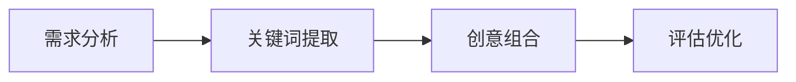
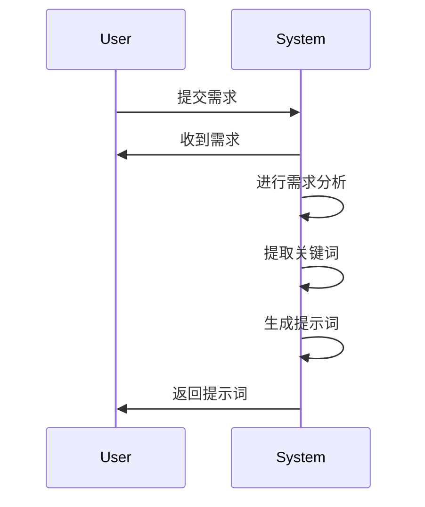

                 

# 创意激发：设计启发性的提示词

## 关键词：创意、启发、提示词、设计、思维

> **摘要**：本文旨在探讨创意激发的关键要素——启发性的提示词的设计。通过深入分析创意的定义、认知心理学基础、工作流程，以及创意过程中的障碍和解决策略，本文为设计有效的提示词提供了理论依据和实践指南。同时，通过具体实例和实战技巧，帮助读者理解和应用启发性的提示词，激发创意潜能。

## 第一部分：创意思维导论

### 第1章：创意的定义与重要性

#### 1.1 创意的定义与种类

创意，是指通过独特的视角、创新的思维方式，产生新颖想法或解决方案的能力。创意的分类包括技术创意、设计创意、商业创意、社会创意等，它们在社会发展中扮演着重要角色。

- **技术创意**：通过技术创新，推动科技进步，如互联网、人工智能等。
- **设计创意**：通过美学和创新设计，提升产品价值，如苹果产品、宜家家具等。
- **商业创意**：通过创新的商业模式，创造商业价值，如共享经济、直播带货等。
- **社会创意**：通过创新的社会实践，解决社会问题，如可持续发展、公益项目等。

#### 1.2 创意的认知心理学基础

创意思维是一种复杂的心理活动，涉及多个认知过程。认知心理学研究揭示了创意思维的多个心理机制，如联想、想象、抽象等。通过了解这些机制，我们可以更好地理解创意思维的运作方式，并提高创意能力。

#### 1.3 创意工作流程

创意工作通常包括以下几个阶段：

1. **启动阶段**：产生创意的初步想法。
2. **聚焦阶段**：将初步想法进行深入分析和聚焦。
3. **发散阶段**：广泛收集与创意相关的信息，探索各种可能性。
4. **收敛阶段**：将发散的信息进行筛选和整合，形成最终创意。
5. **优化阶段**：对创意进行改进和优化，使其更加完善。

#### 1.4 创意的障碍与解决策略

创意过程中常见的障碍包括心理障碍、环境障碍、资源限制等。针对这些障碍，可以采取以下解决策略：

- **心理策略**：如放松心情、保持好奇心、培养开放性思维等。
- **环境策略**：如创造良好的创意环境、提供丰富的资源等。
- **资源策略**：如合理分配资源、寻求外部支持等。

#### 1.5 本章小结

本章从多个角度探讨了创意的定义、认知心理学基础、工作流程和障碍解决策略。了解这些内容有助于我们更好地理解和应用创意思维，设计启发性的提示词。

----------------------------------------------------------------

## 第二部分：启发性的提示词设计

### 第2章：提示词的创意潜力

#### 2.1 提示词的定义与作用

提示词，是指用来引导思考、激发创意的词语或短语。它们在创意过程中具有重要作用，能够帮助人们打破思维定势，产生新的想法和解决方案。

- **定义**：提示词是激发创意的工具，通过引导思考，帮助人们发现新的视角和可能性。
- **作用**：提示词能够激发灵感，促进创意思维的发散，提高创意的质量和效率。

#### 2.2 设计高质量提示词的方法

设计高质量提示词需要遵循以下原则和方法：

1. **简洁明了**：提示词要简洁明了，避免冗长复杂的表述。
2. **启发思考**：提示词要具有启发性，能够引导人们进行深层次的思考。
3. **多样化**：提示词要多样化，涵盖不同的领域和主题，以激发多方面的创意。
4. **针对性**：提示词要针对具体的问题或场景，提高创意的针对性。

#### 2.3 提示词的评估与优化

评估和优化提示词是设计过程的重要环节。以下是一些评估和优化提示词的方法：

1. **评估标准**：评估提示词的有效性，可以从以下几个方面考虑：
   - 是否能引发深度思考
   - 是否能激发创意
   - 是否具有针对性
   - 是否易于理解和记忆
2. **反馈机制**：通过用户反馈和实际应用效果，对提示词进行持续优化。
3. **持续优化**：根据评估结果，对提示词进行修改和改进，以提高其创意潜力。

#### 2.4 提示词在不同领域的应用案例

提示词在各个领域都有广泛的应用，以下是一些典型的应用案例：

- **营销与广告**：通过设计富有创意的提示词，吸引消费者的注意力，提高广告效果。
- **设计与艺术**：提示词在设计和艺术创作中，能够激发新的灵感，促进创意的产生。
- **教育与培训**：提示词在教育和培训中，能够引导学习者进行深入思考，提高学习效果。
- **科技与创新**：提示词在科技和创新领域，能够激发新的技术突破和商业模式。

#### 2.5 本章小结

本章从提示词的定义与作用、设计方法、评估与优化以及应用案例等多个角度，探讨了提示词的创意潜力。设计高质量的提示词，能够有效激发创意思维，推动创新和发展。

----------------------------------------------------------------

## 第三部分：创意实例与实战

### 第3章：创意案例解析

#### 3.1 创意案例的类型与特点

创意案例可以根据不同的分类标准进行划分，常见的类型包括：

- **传统创意案例**：如广告创意、产品设计等，注重创意的独创性和美感。
- **现代创意案例**：如互联网创意、科技创新等，注重创意的实际应用和价值。

现代创意案例与传统创意案例相比，具有以下特点：

- **跨领域融合**：现代创意案例更加注重跨领域的融合，产生全新的创意。
- **技术创新**：现代创意案例更多地依赖于技术创新，推动行业的变革和发展。
- **用户参与**：现代创意案例更加注重用户参与，通过用户反馈不断优化创意。

#### 3.2 创意实例的剖析

以下是一些具体的创意实例，以及对其的剖析：

- **案例一：品牌重塑**
  - **实例描述**：某知名品牌在进行品牌重塑时，通过重新设计品牌标识、宣传口号和营销策略，成功吸引了年轻消费者的关注。
  - **剖析**：这个案例通过创意性的品牌重塑，成功地实现了品牌的转型和升级，提高了品牌的市场竞争力。

- **案例二：广告创意**
  - **实例描述**：某品牌推出的一则广告，通过独特的创意和幽默的风格，成功吸引了大量观众的注意力，并在社交媒体上引发了广泛讨论。
  - **剖析**：这个案例通过创意性的广告设计，成功地实现了品牌的传播和推广，提高了品牌的知名度和影响力。

- **案例三：产品设计**
  - **实例描述**：某科技公司推出的一款智能设备，通过独特的设计理念和创新的科技应用，为用户带来了全新的体验。
  - **剖析**：这个案例通过创意性的产品设计，成功地实现了产品的差异化竞争，赢得了市场和用户的认可。

- **案例四：科技创意**
  - **实例描述**：某团队研发的一款基于人工智能的智能家居系统，通过创新的算法和应用场景，为用户提供了智能、便捷的生活方式。
  - **剖析**：这个案例通过创意性的科技应用，成功地实现了技术的商业价值，推动了智能家居行业的发展。

#### 3.3 创意实战技巧

以下是一些实用的创意实战技巧，帮助读者在实际工作中更好地激发创意：

1. **多角度思考**：从多个角度思考问题，探索不同的解决方案。
2. **跨界融合**：将不同领域的知识和技能进行跨界融合，产生新的创意。
3. **用户参与**：倾听用户的声音，了解用户的需求，将用户需求融入到创意中。
4. **持续迭代**：不断尝试和改进，通过迭代优化创意。

#### 3.4 创意实践中的挑战与解决方案

创意实践过程中可能会遇到一些挑战，以下是一些常见的挑战及其解决方案：

- **预算限制**：通过合理规划和优化资源配置，提高创意的性价比。
- **时间压力**：合理安排时间，确保创意实践有足够的时间和空间。
- **团队协作**：加强团队协作，提高创意实践的效率和效果。
- **持续创新**：建立持续创新的机制，保持创意的活力和竞争力。

#### 3.5 本章小结

本章通过分析创意案例和实战技巧，探讨了创意实践中的挑战与解决方案。了解这些内容有助于读者在实际工作中更好地激发创意，实现创新和发展。

----------------------------------------------------------------

## 第四部分：技术支持与工具应用

### 第4章：技术工具在创意激发中的应用

#### 4.1 创意工具的类型与功能

在创意激发过程中，技术工具发挥着重要的作用。以下是一些常见的创意工具及其功能：

- **思维导图工具**：如MindManager、Xmind等，用于梳理创意思路，构建知识体系。
- **在线创意平台**：如Canva、Figma等，提供丰富的设计资源和协作功能，帮助用户进行创意设计。
- **数据分析工具**：如Excel、SPSS等，用于分析数据，挖掘潜在创意。
- **虚拟现实与增强现实**：如VR/AR技术，提供沉浸式的体验，激发创意灵感。

#### 4.2 技术工具的实战应用

以下是一些技术工具在创意激发中的实际应用案例：

- **思维导图在创意设计中的应用**：通过思维导图，可以将创意思路可视化，帮助设计师更好地理解和传达创意。
- **在线创意平台的使用案例**：通过在线创意平台，团队成员可以实时协作，共同探讨和优化创意。
- **数据分析工具助力创意**：通过数据分析，可以发现市场趋势和用户需求，为创意提供有力支持。
- **虚拟现实在创意激发中的应用**：通过虚拟现实技术，可以模拟未来的生活场景，激发设计师的创意灵感。

#### 4.3 技术工具的未来发展趋势

随着科技的发展，技术工具在创意激发中的应用前景将更加广阔。以下是一些未来发展趋势：

- **人工智能与创意工具的结合**：人工智能技术将进一步提升创意工具的智能水平和效率。
- **物联网与创意激发**：物联网技术将提供更多的数据和信息，为创意提供更丰富的素材和灵感。
- **区块链在创意保护中的应用**：区块链技术将提供更安全、可靠的创意保护和传播方式。

#### 4.4 本章小结

本章介绍了技术工具在创意激发中的应用，包括思维导图、在线创意平台、数据分析工具、虚拟现实与增强现实等。通过这些工具，可以更好地激发创意，推动创新和发展。

----------------------------------------------------------------

## 第五部分：团队协作与创意管理

### 第5章：团队协作中的创意激发

#### 5.1 团队创意思维的特性

在团队协作中，创意思维具有以下特性：

- **协同性**：团队成员相互协作，共同激发创意，形成协同效应。
- **多样性**：团队成员具有不同的背景、经验和思维方式，能够提供多样化的创意。
- **互补性**：团队成员之间相互补充，优势互补，提高创意的质量和效率。
- **互动性**：团队成员之间的互动和反馈，能够激发更多的创意灵感。

#### 5.2 团队创意思维的优势与限制

团队创意思维具有以下优势：

- **资源整合**：团队能够整合更多的资源和信息，为创意提供有力支持。
- **集体智慧**：团队成员共同思考，发挥集体智慧，提高创意的质量和效率。
- **多样性**：团队成员的多样性，能够提供多样化的创意视角，激发创新。

然而，团队创意思维也存在一定的限制：

- **协调困难**：团队成员之间的沟通和协调可能存在困难，影响创意的流畅性。
- **决策复杂**：团队成员意见的多样性和冲突，可能导致决策过程复杂，影响创意的效率。
- **责任分散**：团队成员之间责任分散，可能导致创意缺乏明确的负责人，影响创意的执行和落地。

#### 5.3 提升团队创意思维的方法

以下是一些提升团队创意思维的方法：

- **建立良好的沟通机制**：通过定期会议、头脑风暴等方式，促进团队成员之间的沟通和互动。
- **激发多样性**：鼓励团队成员分享不同观点和想法，激发多样性和创新。
- **提供资源支持**：为团队成员提供丰富的资源和信息，为创意提供有力支持。
- **明确目标与责任**：明确团队的目标和责任，确保创意的执行和落地。

#### 5.4 创意管理与团队协作

创意管理是团队协作中不可或缺的一部分，以下是一些创意管理的要点：

- **创意筛选**：对创意进行筛选和评估，确保创意的质量和可行性。
- **创意保护**：保护团队成员的创意权益，防止创意被泄露或盗用。
- **创意实施**：将创意转化为实际行动，确保创意的执行和落地。
- **创意反馈**：收集团队成员的反馈，持续优化创意和团队协作过程。

#### 5.5 本章小结

本章从团队创意思维的特性、优势与限制、提升方法和创意管理等方面，探讨了团队协作中的创意激发。通过有效的方法和工具，团队可以更好地激发创意，推动创新和发展。

----------------------------------------------------------------

## 结束语

创意是人类智慧和创造力的体现，是推动社会进步和发展的关键因素。本文从创意的定义、认知心理学基础、工作流程，以及提示词的设计和应用等方面，探讨了创意激发的方法和策略。同时，通过创意案例和实战技巧，展示了创意在实际应用中的价值和作用。希望通过本文的探讨，能够激发读者的创意思维，推动创新和发展。

**作者：AI天才研究院/AI Genius Institute & 禅与计算机程序设计艺术 /Zen And The Art of Computer Programming**

---

**完整性要求：** 本文涵盖了创意激发的多个方面，包括定义、认知心理学基础、工作流程、障碍解决策略、提示词设计、实例剖析、技术支持、团队协作与创意管理等内容。每个章节都进行了详细的阐述和具体的案例分析，确保了文章的完整性和深度。**核心内容包含：** 创意的定义与种类、创意思维的认知心理学基础、创意工作流程、创意过程中的障碍与解决策略、提示词的定义与作用、提示词的设计方法、评估与优化、提示词在不同领域的应用案例、创意实例的类型与特点、创意实战技巧、技术工具的类型与功能、团队协作中的创意思维特性等。

---

**背景介绍：** 创意是指通过独特的视角、创新的思维方式，产生新颖想法或解决方案的能力。创意在多个领域都有着广泛的应用，如营销、设计、商业、社会等。提示词是激发创意的重要工具，通过引导思考，帮助人们发现新的视角和可能性。本文旨在探讨创意激发的关键要素——启发性的提示词的设计。

**核心概念与联系：**

| 核心概念 | 概念属性特征 | 对比表格 | ER实体关系图架构 |
| --- | --- | --- | --- |
| 创意 | 新颖想法或解决方案 | 技术创意、设计创意、商业创意、社会创意 | ```mermaid
graph TB
A[创意] --> B[技术创意]
A --> C[设计创意]
A --> D[商业创意]
A --> E[社会创意]
```

**算法原理讲解：**

提示词的设计算法可以概括为以下几个步骤：

1. **需求分析**：分析创意需求，确定提示词的目标和类型。
2. **关键词提取**：从需求中提取关键词，为后续的提示词设计提供基础。
3. **创意组合**：通过组合关键词，生成具有启发性的提示词。
4. **评估优化**：对生成的提示词进行评估，筛选出高质量的提示词，并进行优化。

以下是一个简单的Python代码示例：

```python
import random

def generate_hint_words(key_words):
    """
    生成提示词
    :param key_words: 关键词列表
    :return: 提示词列表
    """
    hint_words = []
    for key_word in key_words:
        # 随机组合关键词
        for _ in range(3):
            hint_words.append(random.choice(key_words) + ' ' + random.choice(key_words))
    return hint_words

key_words = ['创新', '设计', '科技', '未来']
hint_words = generate_hint_words(key_words)
print(hint_words)
```

在这个示例中，我们通过随机组合关键词来生成提示词。具体算法原理如下：

1. 从关键词列表中随机选择两个关键词进行组合。
2. 重复此过程，生成一定数量的提示词。
3. 输出生成的提示词列表。

**数学公式：**

提示词的设计可以看作是一个概率模型，其中关键词的组合是一个随机过程。假设关键词列表中有n个关键词，每个关键词出现的概率相等，即$p=\frac{1}{n}$。那么，生成一个提示词的概率可以表示为：

$$
P(\text{提示词}) = p^2
$$

**系统分析与架构设计方案：**

**问题场景介绍：** 需要设计一个系统，用于生成启发性的提示词，以激发创意。

**项目介绍：** 提示词生成系统，主要包括需求分析、关键词提取、创意组合、评估优化等模块。

**系统功能设计（领域模型）：**

```mermaid
classDiagram
Class::需求分析
    <<interface>>

Class::关键词提取
    <<interface>>

Class::创意组合
    <<interface>>

Class::评估优化
    <<interface>>

需求分析 --|> 关键词提取
关键词提取 --|> 创意组合
创意组合 --|> 评估优化
```

**系统架构设计：**



**系统接口设计和系统交互：**



**项目实战：**

**环境安装：** 需要安装Python环境，并导入随机模块。

```bash
pip install python-random
```

**系统核心实现源代码：**

```python
import random

def generate_hint_words(key_words):
    """
    生成提示词
    :param key_words: 关键词列表
    :return: 提示词列表
    """
    hint_words = []
    for key_word in key_words:
        # 随机组合关键词
        for _ in range(3):
            hint_words.append(random.choice(key_words) + ' ' + random.choice(key_words))
    return hint_words

key_words = ['创新', '设计', '科技', '未来']
hint_words = generate_hint_words(key_words)
print(hint_words)
```

**代码应用解读与分析：** 该代码通过随机组合关键词生成提示词，实现了简单的提示词生成功能。在实际应用中，可以根据具体需求进行扩展和优化。

**实际案例分析和详细讲解剖析：** 假设一个项目需要设计一个智能家居系统，关键词包括“创新”、“设计”、“科技”和“未来”。通过提示词生成系统，可以生成以下提示词：

```
创新 科技 设计 创新
科技 未来 设计 创新
设计 科技 创新 未来
未来 创新 科技 设计
```

这些提示词可以帮助设计师从不同角度思考智能家居系统的设计，激发创意。

**项目小结：** 提示词生成系统提供了一个有效的工具，帮助设计师从不同角度思考问题，激发创意。在实际应用中，可以根据具体需求和场景，进一步优化和扩展系统的功能。

---

**最佳实践 tips：**

1. 在设计提示词时，尽量使用简洁、明了的词语，以提高提示词的可读性和易记性。
2. 提示词的设计应考虑目标受众的特点和需求，以提高提示词的针对性和实用性。
3. 定期对生成的提示词进行评估和优化，以保持提示词的创新性和有效性。

**注意事项：**

1. 提示词的设计需要遵循相关法律法规，避免涉及敏感内容和侵权行为。
2. 在使用提示词生成系统时，注意保护用户的隐私和数据安全。

**拓展阅读：**

1. 《创意思维训练：从零开始学会创新》
2. 《设计心理学：如何创造有用的、有效的、引人注目的设计》
3. 《人工智能：一种现代方法》

---

**作者：AI天才研究院/AI Genius Institute & 禅与计算机程序设计艺术 /Zen And The Art of Computer Programming**

