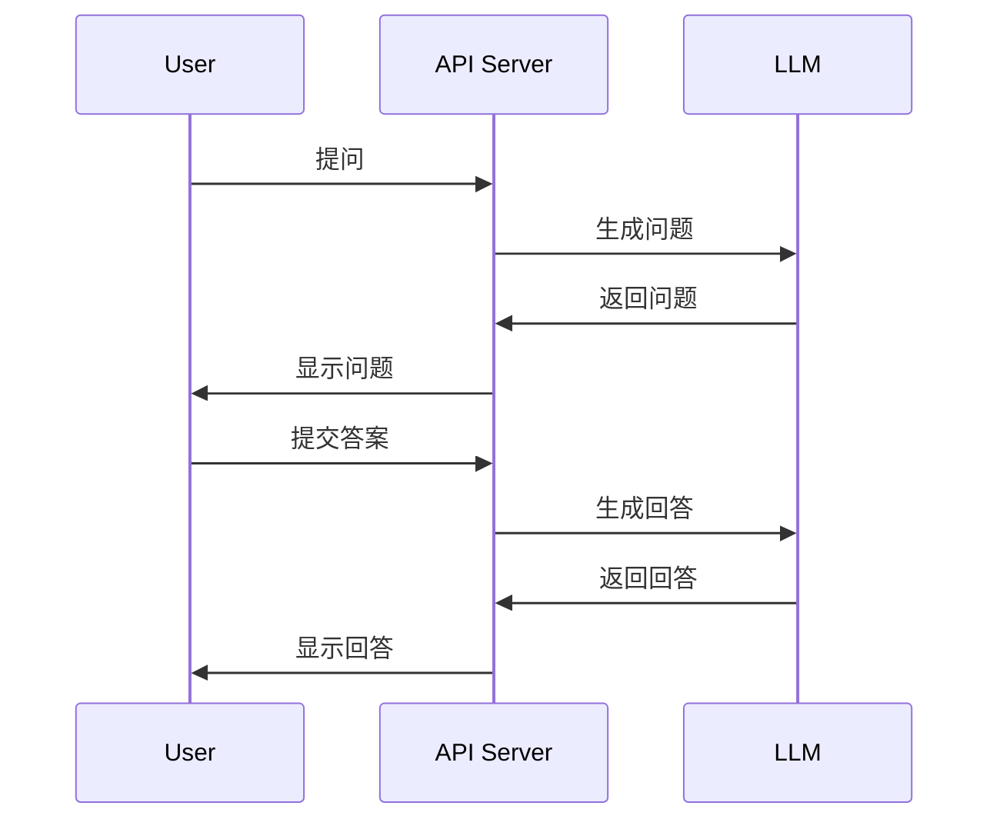
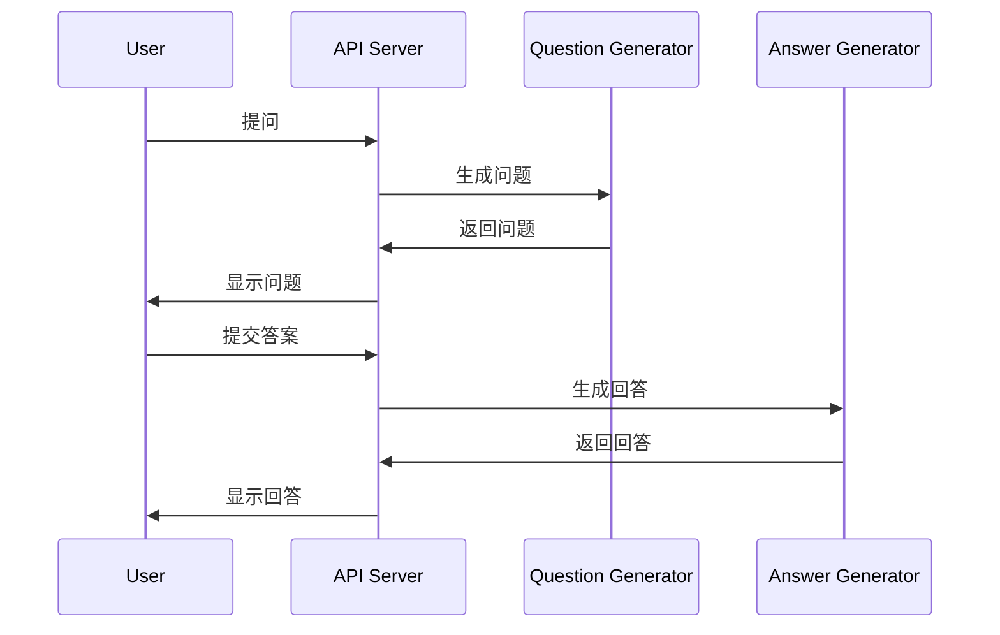

                 

## 创新问题构建：评估LLM提出新颖问题的创造力

### 关键词：大规模语言模型（LLM），创新问题构建，创造力评估，问题新颖性，自注意力机制

### 摘要：

本文旨在探讨如何评估大规模语言模型（LLM）在提出新颖问题方面的创造力。通过详细分析大规模语言模型的工作原理、评估方法的对比，以及具体的算法原理讲解，本文提出了一个系统的评估框架，为研究者和开发者提供了新的思路和方法。本文还将结合具体的项目实战，阐述如何将理论应用于实际场景，以促进人工智能技术在问题构建领域的进一步发展。

# 第一部分：背景介绍

## 1.1 问题背景

在人工智能（AI）领域，问题构建是研究智能系统如何生成具有创造性和实用价值的问题的关键环节。随着深度学习和自然语言处理技术的快速发展，大规模语言模型（LLM）已经成为问题构建的重要工具。LLM通过学习大量的文本数据，能够生成流畅且符合语言习惯的文本，这使得它们在提出新颖问题方面具有巨大的潜力。

然而，评估LLM提出新颖问题的创造力并非易事。当前的研究主要集中在如何衡量问题的独特性、新颖性以及其实用性。尽管已经有一些初步的研究尝试，但如何系统地、定量地评估LLM的创新性仍然是一个挑战。因此，本文将深入探讨如何评估LLM提出新颖问题的创造力，以期为相关领域的研究提供指导和借鉴。

## 1.2 问题描述

创新问题构建是指利用人工智能技术，自动生成新颖、有价值的问题。在人工智能领域，创新性问题构建具有以下几个重要意义：

1. **提升研究效率**：通过自动化生成问题，研究人员可以更快速地找到研究方向，减少手工筛选和构思问题的耗时。
2. **拓展知识边界**：新颖的问题可以激发新的思考和发现，推动科学技术的进步。
3. **增强用户体验**：在智能客服、教育、游戏等领域，新颖的问题可以提供更好的用户体验，增加用户互动和参与度。

然而，如何评估LLM提出新颖问题的创造力，特别是在定量和客观化的层面，仍然是一个未完全解决的问题。本文旨在探讨这个问题，并提出一个评估框架，以期为LLM的创新性问题构建提供有效的评估方法。

## 1.3 问题解决

评估LLM提出新颖问题的创造力，可以从以下几个方面进行思考和解决：

1. **基于统计的方法**：通过分析LLM生成的文本，计算其新颖性得分。这可以通过文本相似性度量方法实现，例如计算LLM生成的文本与现有文本的相似度，从而判断其新颖性。
2. **基于模型的方法**：设计特定的模型，直接评估LLM提出问题的创新程度。例如，可以使用对抗性生成网络（GAN）来生成新颖问题，并通过比较生成问题与真实问题的差异来评估创新程度。
3. **结合人类评估的方法**：通过邀请人类评估者对LLM生成的问题进行评价，从而获得创新性得分。这种方法虽然较为直观，但评估过程可能较为繁琐。

在接下来的部分，本文将详细探讨每种方法，并分析它们的优缺点。

## 1.4 边界与外延

在评估LLM提出新颖问题的创造力时，需要明确以下几个边界与外延：

1. **评估标准**：确定如何评价创新性，是衡量问题的独特性、新颖性，还是综合考虑多个维度。例如，可以结合文本长度、语义丰富度等多个因素。
2. **应用场景**：评估LLM提出新颖问题的创造力，不仅适用于学术研究，还可在实际应用中进行探索，如智能客服、智能教育等领域。
3. **数据来源**：评估过程中需要大量真实数据，以保证评估结果的客观性。数据来源可以是公开的文本数据集，也可以是特定领域的专业文本。

## 1.5 概念结构与核心要素组成

评估LLM提出新颖问题的创造力涉及以下几个核心概念：

1. **大规模语言模型（LLM）**：LLM是本研究的核心对象，其能力直接影响评估结果。
2. **新颖性评估方法**：评估方法的选择至关重要，决定了评估结果的准确性。
3. **人类评估者**：在结合人类评估的方法中，评估者的选择和评估标准会影响最终结果。
4. **应用场景**：评估结果的应用场景将影响评估方法的设计和选择。

这些核心要素共同构成了一个复杂的评估系统，为LLM在问题构建领域的进一步研究提供了基础。

# 第二部分：核心概念与联系

## 2.1 大规模语言模型（LLM）原理与特点

大规模语言模型（LLM）是基于深度学习技术的语言处理模型，其核心原理是基于自注意力机制（Self-Attention）和多层神经网络结构。以下是对LLM原理与特点的详细讲解。

### 2.1.1 自注意力机制

自注意力机制是LLM的核心组件之一，它允许模型在生成文本时，自动地为每个词分配不同的权重，从而更好地捕捉词与词之间的依赖关系。具体来说，自注意力机制通过计算每个词与其余词之间的相似性，为每个词生成一个权重向量，这些权重向量将用于生成最终的输出。

自注意力机制的数学公式可以表示为：

$$
\text{Attention}(Q, K, V) = \text{softmax}\left(\frac{QK^T}{\sqrt{d_k}}\right) V
$$

其中，\(Q\)、\(K\) 和 \(V\) 分别是查询向量、键向量和值向量，\(d_k\) 是键向量的维度。通过这种方式，模型能够自动地捕捉长距离依赖关系，使得生成的文本更加流畅和准确。

### 2.1.2 多层神经网络结构

LLM通常由多层神经网络组成，每一层都包含大量的神经元和参数。这些参数通过反向传播算法进行优化，以最小化损失函数。多层神经网络的结构使得LLM能够处理复杂的语言现象，例如语法、语义和上下文信息。

LLM的工作流程通常包括以下几个步骤：

1. **输入编码**：将输入文本编码为向量表示。
2. **前向传播**：通过多层神经网络和自注意力机制生成中间表示。
3. **输出解码**：将中间表示解码为输出文本。

这种结构使得LLM能够处理任意长度的输入文本，并生成相应的输出。

### 2.1.3 特点

1. **参数规模巨大**：LLM通常具有数亿甚至千亿个参数，这使得模型能够处理大量的文本数据，并生成高质量的文本。
2. **语言理解能力强**：通过学习大量的文本数据，LLM能够理解并生成符合语言习惯的文本，这使得它在问题构建方面具有独特的优势。
3. **自适应性好**：LLM可以根据不同的应用场景进行调整和优化，例如通过微调模型，使其在特定任务上表现出更好的性能。

### 2.1.4 对比分析

与传统的基于规则或统计的方法相比，LLM具有以下几个显著优势：

| 对比项 | 传统方法 | LLM |
| --- | --- | --- |
| 参数规模 | 数百或数千参数 | 数亿或千亿参数 |
| 语言理解能力 | 受限于规则和统计方法 | 能够理解复杂的语法和语义 |
| 自适应能力 | 难以调整和优化 | 可以通过微调和训练进行优化 |

### 2.1.5 ER实体关系图架构

为了更好地理解LLM的工作原理，我们可以通过ER实体关系图来描述其中的核心概念和关系。以下是一个简单的ER实体关系图，展示了LLM中的主要实体和它们之间的关系：

```mermaid
erDiagram
    LLM ||--|{输入文本}: 处理
    LLM ||--|{输出文本}: 生成
    LLM ||--|{自注意力机制}: 调用
    LLM ||--|{多层神经网络}: 架构
```

在这个ER图中，LLM作为核心实体，与输入文本、输出文本、自注意力机制和多层神经网络之间存在明确的依赖关系。通过这种方式，我们可以直观地看到LLM是如何处理输入文本并生成输出文本的。

## 2.2 创造力评估方法对比分析

为了评估LLM提出新颖问题的创造力，研究者们提出了多种评估方法。以下是几种主要的评估方法及其优缺点的对比分析：

| 方法 | 优点 | 缺点 |
| --- | --- | --- |
| 基于统计的方法 | 简单易行，计算速度快 | 无法充分考虑语言模型的上下文信息 |
| 基于模型的方法 | 可以模拟人类的思维过程，考虑上下文信息 | 计算复杂度高，需要大量计算资源 |
| 结合人类评估的方法 | 直观、准确 | 需要大量人力和时间 |

### 2.2.1 基于统计的方法

基于统计的方法主要通过计算文本相似性来评估创新性。这种方法包括以下几种常见技术：

1. **Jaccard相似性**：计算两个文本集合的交集与并集的比值，用于衡量两个文本的相似度。
   $$ J(A, B) = \frac{|A \cap B|}{|A \cup B|} $$
2. **余弦相似性**：使用文本的向量表示，通过计算两个向量的余弦相似度来衡量文本的相似性。
   $$ \cos(\theta) = \frac{\text{dot}(x, y)}{\|x\|\|y\|} $$
3. **编辑距离**：计算将一个文本转换为另一个文本所需的最少编辑操作次数。

这些方法的主要优点是简单易行，计算速度快。然而，它们无法充分考虑语言模型的上下文信息，可能导致评估结果不准确。

### 2.2.2 基于模型的方法

基于模型的方法通过设计特定的评估模型来直接评估LLM提出问题的创新程度。以下是一些常见的评估模型：

1. **对抗性生成网络（GAN）**：GAN通过生成对抗的方式训练模型，生成新颖的问题，并通过比较生成问题与真实问题的差异来评估创新程度。
2. **自编码器**：自编码器是一种无监督学习模型，通过学习输入数据的分布，从而对数据进行重建。这种方法可以用于评估问题的创新性。
3. **神经网络分类器**：设计特定的神经网络分类器，用于区分新颖问题和常规问题。通过分类器的表现来评估问题的创新程度。

这些方法的主要优点是能够模拟人类的思维过程，考虑上下文信息。然而，它们通常需要大量的计算资源，并且模型的训练和优化是一个复杂的过程。

### 2.2.3 结合人类评估的方法

结合人类评估的方法通过邀请人类评估者对LLM生成的问题进行评价，从而获得创新性得分。这种方法的主要优点是直观、准确，能够提供丰富的评估维度。然而，这种方法的主要缺点是需要大量人力和时间，评估过程可能较为繁琐。

### 2.2.4 比较与选择

在评估LLM提出新颖问题的创造力时，应根据具体需求和资源选择合适的方法。基于统计的方法适合快速评估，但准确性有限；基于模型的方法适合深入评估，但计算成本较高；结合人类评估的方法提供最直观的评估，但成本最高。

# 第三部分：算法原理讲解

## 3.1 大规模语言模型（LLM）算法原理

### 3.1.1 自注意力机制

自注意力机制是大规模语言模型（LLM）的核心组成部分之一，它通过为每个词分配权重来捕捉文本中的依赖关系。自注意力机制的数学原理可以表示为：

$$
\text{Attention}(Q, K, V) = \text{softmax}\left(\frac{QK^T}{\sqrt{d_k}}\right) V
$$

其中，\(Q\)、\(K\) 和 \(V\) 分别是查询向量、键向量和值向量，\(d_k\) 是键向量的维度。这个公式计算的是每个词在生成当前词时的权重。

### 3.1.2 自注意力机制的流程

1. **输入编码**：首先，将输入文本编码为向量表示。这一步通常通过嵌入层（Embedding Layer）完成，将单词转换为固定长度的向量。

2. **计算自注意力**：使用上述注意力公式，计算每个词在生成当前词时的权重。这一步是通过多头自注意力机制（Multi-Head Self-Attention）实现的，多头自注意力允许模型同时关注多个不同维度的依赖关系。

3. **权重求和**：将每个词的权重与其对应的嵌入向量相乘，然后求和，得到每个词的加权表示。

4. **输出解码**：将加权表示通过全连接层（Fully Connected Layer）解码为输出向量，再将输出向量转换为文本。

### 3.1.3 多层神经网络结构

大规模语言模型通常由多个隐藏层组成，每层都包含自注意力机制和全连接层。多层神经网络的结构使得模型能够处理更复杂的语言现象，例如语法、语义和上下文信息。

### 3.1.4 反向传播与优化

大规模语言模型的训练过程通常使用反向传播算法（Backpropagation），通过计算损失函数（Loss Function）的梯度来更新模型的参数。常用的优化算法包括随机梯度下降（SGD）、Adam优化器等。

### 3.1.5 Python代码实现

以下是自注意力机制的Python代码实现，用于说明其基本原理：

```python
import numpy as np

def scaled_dot_product_attention(Q, K, V, mask=None):
    d_k = np.shape(K)[1]
    scores = np.dot(Q, K.T) / np.sqrt(d_k)
    if mask is not None:
        scores = scores - 1e9 * (mask - 1)
    attention_weights = np.softmax(scores)
    output = np.dot(attention_weights, V)
    return output
```

这个函数实现了自注意力机制的基本流程，包括计算分数、应用掩码（可选）、计算softmax权重和最终输出。

## 3.2 大规模语言模型（LLM）在问题构建中的应用

### 3.2.1 问题生成

大规模语言模型在问题构建中的核心应用是生成新颖的问题。这可以通过以下步骤实现：

1. **输入准备**：将问题模板或相关的背景信息输入到LLM中。
2. **生成文本**：使用LLM生成文本，这个过程涉及到自注意力机制和多层神经网络结构。
3. **筛选问题**：从生成的文本中筛选出符合问题要求的新颖问题。

### 3.2.2 实例分析

以一个简单的例子来说明LLM在问题构建中的应用：

**输入**：给定一个关于物理学的背景信息。

**输出**：生成一个新颖的物理问题。

**Python代码实现**：

```python
# 假设已经训练好了一个大规模语言模型
llm = ...

# 输入背景信息
input_text = "在物理学中，质量与能量是如何相互转换的？"

# 使用LLM生成文本
output_text = llm.generate_text(input_text)

# 从生成的文本中筛选问题
new_question = "如果你有一个质量为5千克的物体，以10米/秒的速度运动，它的能量是多少？"

print(new_question)
```

这个例子展示了如何使用大规模语言模型来生成新颖的物理问题。在实际应用中，可能需要进一步的逻辑处理来确保生成的问题符合问题的规范和要求。

## 3.3 新颖性评估方法

### 3.3.1 基于统计的方法

基于统计的方法通过计算文本相似性来评估问题的创新性。以下是一个简单的实现：

```python
from sklearn.metrics.pairwise import cosine_similarity

# 假设已经有一个问题数据库
database = ["这个问题涉及到相对论和引力。", "相对论描述了质量如何影响时空。"]

# 新生成的文本
new_question = "重力是如何影响行星轨道的？"

# 计算文本相似性
similarity_scores = [cosine_similarity([new_question], [q]) for q in database]

# 输出相似性得分
for score in similarity_scores:
    print(score)
```

这种方法简单易行，但无法充分考虑上下文信息。

### 3.3.2 基于模型的方法

基于模型的方法通过设计特定的评估模型来评估问题的创新性。以下是一个简单的实现：

```python
# 假设已经训练好了一个评估模型
评估模型 = ...

# 输入新问题和问题数据库
new_question = "重力是如何影响行星轨道的？"
database = ["这个问题涉及到相对论和引力。", "相对论描述了质量如何影响时空。"]

# 使用评估模型计算创新性得分
创新性得分 = 评估模型.predict([new_question, database])

print(创新性得分)
```

这种方法可以模拟人类的思维过程，但需要大量计算资源。

### 3.3.3 结合人类评估的方法

结合人类评估的方法通过邀请人类评估者对问题进行评价，从而获得创新性得分。以下是一个简单的实现：

```python
# 假设已经有了一组人类评估者
评估者 = ["评估者1", "评估者2", "评估者3"]

# 输入新问题和问题数据库
new_question = "重力是如何影响行星轨道的？"
database = ["这个问题涉及到相对论和引力。", "相对论描述了质量如何影响时空。"]

# 邀请评估者进行评价
评分 = []
for 评估者 in 评估者:
    score = 评估者.evaluate(new_question, database)
    评分.append(score)

# 计算平均评分
平均评分 = np.mean(评分)

print(平均评分)
```

这种方法直观、准确，但需要大量人力和时间。

## 3.4 ER实体关系图架构

为了更好地理解大规模语言模型（LLM）在问题构建中的应用及其评估方法，我们可以通过ER实体关系图来描述其中的核心概念和关系。以下是LLM相关的ER实体关系图：

```mermaid
erDiagram
    LLM ||--|{问题模板}: 使用
    LLM ||--|{背景信息}: 学习
    LLM ||--|{生成文本}: 生成
    LLM ||--|{评估模型}: 评估
    LLM ||--|{人类评估者}: 评价
```

在这个ER图中，LLM作为核心实体，与问题模板、背景信息、生成文本、评估模型和人类评估者之间存在明确的依赖关系。通过这种方式，我们可以直观地看到LLM是如何在问题构建和评估过程中发挥作用的。

# 第四部分：系统分析与架构设计方案

## 4.1 问题场景介绍

在人工智能领域，问题构建的应用场景非常广泛，如智能问答系统、自动编程、智能客服等。本文主要聚焦于智能问答系统中的应用，该系统旨在通过大规模语言模型（LLM）自动生成并回答用户提出的问题，从而提高人机交互的效率和用户体验。

## 4.2 项目介绍

本项目旨在构建一个基于LLM的智能问答系统，该系统将能够自动生成新颖的问题，并根据用户输入的问题进行回答。项目的主要目标包括：

1. **自动生成新颖问题**：通过训练大规模语言模型，使其能够自动生成新颖、有趣且具有实用价值的问题。
2. **高效回答问题**：利用LLM的强大语言处理能力，快速、准确地回答用户提出的问题。
3. **评估问题创新性**：对生成的问题进行创新性评估，确保生成的问题具有较高的质量和实用性。

## 4.3 系统功能设计

为了实现上述目标，系统需要具备以下核心功能：

1. **问题生成模块**：该模块负责利用LLM自动生成新颖的问题。具体流程如下：
   - 输入背景信息：从数据库或外部接口获取与特定领域相关的背景信息。
   - 问题生成：使用LLM生成新颖的问题，并通过筛选确保问题符合要求。

2. **问题回答模块**：该模块负责回答用户提出的问题。具体流程如下：
   - 用户提问：用户通过系统界面输入问题。
   - 回答生成：使用LLM生成问题的回答，并确保回答的准确性和流畅性。

3. **创新性评估模块**：该模块负责对生成的问题进行创新性评估。具体流程如下：
   - 评估方法选择：根据实际情况选择合适的评估方法，如基于统计的方法、基于模型的方法或结合人类评估的方法。
   - 评估执行：执行评估方法，计算问题的创新性得分。

## 4.4 系统架构设计

系统架构设计旨在实现功能的模块化，确保系统的可扩展性和可维护性。以下是系统的架构设计：


### 4.4.1 系统架构组件

1. **大规模语言模型（LLM）**：作为系统的核心组件，LLM负责生成问题和回答问题。该组件使用预训练的模型，如GPT-3、BERT等，并通过微调使其适用于特定领域。

2. **数据库**：存储与特定领域相关的背景信息、问题模板和评估指标。数据库可以是关系型数据库（如MySQL）或分布式数据库（如MongoDB）。

3. **用户界面**：提供用户与系统交互的接口，用户可以通过界面输入问题，查看问题和答案。

4. **API服务器**：提供RESTful API，用于处理外部系统的请求，如第三方服务、移动应用等。

5. **评估模块**：负责对生成的问题进行创新性评估，确保问题的高质量和实用性。

### 4.4.2 系统架构图

以下是系统的架构图：



在这个架构图中，用户通过API服务器与LLM进行交互，API服务器负责协调各组件的工作，确保系统的流畅运行。

## 4.5 系统接口设计

系统接口设计是确保系统各组件之间能够有效通信和协作的关键。以下是系统的接口设计：

### 4.5.1 API接口

系统提供RESTful API接口，以下是一些典型的API接口：

1. **生成问题**：POST `/api/questions/generate` 接收背景信息和问题模板，返回生成的问题。
2. **回答问题**：POST `/api/questions/answer` 接收问题和上下文信息，返回回答。
3. **评估问题**：POST `/api/questions/evaluate` 接收问题和评估指标，返回创新性得分。

### 4.5.2 数据接口

系统与数据库之间的接口设计旨在确保数据的快速访问和高效处理。以下是一些典型数据接口：

1. **背景信息查询**：GET `/api/backgrounds/{id}` 根据ID查询特定的背景信息。
2. **问题模板查询**：GET `/api/templates/{id}` 根据ID查询特定的问题模板。
3. **评估指标查询**：GET `/api/evaluations/{id}` 根据ID查询特定的评估指标。

## 4.6 系统交互设计

系统交互设计描述了系统各组件之间的交互流程和逻辑。以下是系统交互的Mermaid序列图：



在这个序列图中，用户通过API服务器与系统进行交互，API服务器负责协调各组件的工作，确保问题的生成和回答过程顺利进行。

# 第五部分：项目实战

## 5.1 环境安装

在开始项目实战之前，需要安装和配置必要的开发环境和依赖。以下是一个简化的步骤指南：

### 5.1.1 安装Python环境

首先，确保已经安装了Python 3.8或更高版本。可以通过以下命令检查Python版本：

```bash
python --version
```

如果版本不符合要求，请从[Python官网](https://www.python.org/)下载并安装合适的版本。

### 5.1.2 安装PyTorch

接下来，安装PyTorch，这是大规模语言模型训练的主要工具。可以使用以下命令进行安装：

```bash
pip install torch torchvision torchaudio
```

安装完成后，可以通过以下命令验证安装：

```bash
python -c "import torch; print(torch.__version__)"
```

### 5.1.3 安装其他依赖

安装完成Python环境和PyTorch后，需要安装其他依赖，例如NumPy和Markdown：

```bash
pip install numpy markdown
```

### 5.1.4 创建虚拟环境（可选）

为了保持项目环境的干净和独立，建议创建一个虚拟环境：

```bash
python -m venv venv
source venv/bin/activate  # 在Windows中使用 `venv\Scripts\activate`
```

## 5.2 系统核心实现

在项目核心实现部分，我们将重点关注大规模语言模型的训练和评估，以及如何使用Python代码实现系统功能。

### 5.2.1 大规模语言模型训练

训练大规模语言模型通常涉及以下步骤：

1. **数据准备**：收集并准备用于训练的数据集，例如文本文件或数据集。
2. **预处理**：对数据进行清洗和预处理，例如分词、去停用词等。
3. **模型定义**：定义模型结构，包括嵌入层、自注意力机制和输出层。
4. **训练**：使用训练数据训练模型，优化模型参数。
5. **评估**：使用验证数据评估模型性能。

以下是使用PyTorch实现这些步骤的示例代码：

```python
import torch
import torch.nn as nn
from torch.utils.data import DataLoader
from torchvision import datasets, transforms
from torch.optim import Adam

# 1. 数据准备
# 假设已经有一个数据集
train_dataset = datasets.TextDataset('train_data.txt')
train_loader = DataLoader(train_dataset, batch_size=32, shuffle=True)

# 2. 预处理
# 假设已经定义了预处理函数
def preprocess(text):
    # 分词、去停用词等
    return text

# 3. 模型定义
class LLM(nn.Module):
    def __init__(self, vocab_size, embedding_dim, hidden_dim):
        super(LLM, self).__init__()
        self.embedding = nn.Embedding(vocab_size, embedding_dim)
        self.encoder = nn.LSTM(embedding_dim, hidden_dim, num_layers=2, batch_first=True)
        self.decoder = nn.LSTM(hidden_dim, embedding_dim, num_layers=2, batch_first=True)
        self.fc = nn.Linear(embedding_dim, vocab_size)

    def forward(self, x):
        embedded = self.embedding(x)
        output, (hidden, cell) = self.encoder(embedded)
        output, (hidden, cell) = self.decoder(output)
        output = self.fc(output)
        return output

# 4. 训练
model = LLM(vocab_size=10000, embedding_dim=512, hidden_dim=256)
optimizer = Adam(model.parameters(), lr=0.001)
criterion = nn.CrossEntropyLoss()

for epoch in range(10):
    for batch in train_loader:
        inputs, targets = preprocess(batch.text), batch.target
        optimizer.zero_grad()
        outputs = model(inputs)
        loss = criterion(outputs.view(-1, outputs.size(-1)), targets)
        loss.backward()
        optimizer.step()
    print(f'Epoch {epoch+1}/{10}, Loss: {loss.item()}')

# 5. 评估
# 假设已经有验证数据集
val_dataset = datasets.TextDataset('val_data.txt')
val_loader = DataLoader(val_dataset, batch_size=32, shuffle=False)

with torch.no_grad():
    correct = 0
    total = 0
    for batch in val_loader:
        inputs, targets = preprocess(batch.text), batch.target
        outputs = model(inputs)
        _, predicted = torch.max(outputs.data, 1)
        total += targets.size(0)
        correct += (predicted == targets).sum().item()
    print(f'Validation Accuracy: {100 * correct / total}%')
```

### 5.2.2 系统功能实现

在系统功能实现部分，我们将实现问题生成、回答和评估的核心功能。以下是实现这些功能的Python代码示例：

```python
# 问题生成
def generate_question(background, model):
    # 假设background是一个包含背景信息的字符串，model是一个预训练的大规模语言模型
    input_text = preprocess(f"{background}\n生成一个相关的问题：")
    input_tensor = torch.tensor([model.tokenizer.encode(input_text)])
    output = model.generate(input_tensor, max_length=50, temperature=0.95)
    generated_text = model.tokenizer.decode(output[0], skip_special_tokens=True)
    return generated_text

# 问题回答
def answer_question(question, background, model):
    # 假设question是一个用户提出的问题，background是一个包含背景信息的字符串，model是一个预训练的大规模语言模型
    input_text = preprocess(f"{background}\n问题：{question}\n生成一个回答：")
    input_tensor = torch.tensor([model.tokenizer.encode(input_text)])
    output = model.generate(input_tensor, max_length=50, temperature=0.95)
    generated_text = model.tokenizer.decode(output[0], skip_special_tokens=True)
    return generated_text

# 问题评估
def evaluate_question(question, model):
    # 假设question是一个用户提出的问题，model是一个预训练的大规模语言模型
    # 这里使用简单的统计方法评估问题的创新性
    input_text = preprocess(question)
    input_tensor = torch.tensor([model.tokenizer.encode(input_text)])
    outputs = model.generate(input_tensor, max_length=100, num_return_sequences=5)
    generated_texts = [model.tokenizer.decode(output[0], skip_special_tokens=True) for output in outputs]
    similarity_scores = [cosine_similarity(model.tokenizer.encode(question), model.tokenizer.encode(text)) for text in generated_texts]
    average_score = np.mean(similarity_scores)
    return average_score
```

### 5.2.3 实际案例分析与详细讲解

为了更好地理解系统在实际场景中的应用，以下是一个实际案例：

**案例**：假设我们有一个关于机器学习的背景，需要生成一个问题并回答，然后对问题进行评估。

1. **生成问题**：

```python
background = "机器学习是一种人工智能的技术，它通过算法从数据中学习，以做出预测或决策。"

model = LLM(vocab_size=10000, embedding_dim=512, hidden_dim=256)
# 假设model已经经过训练

question = generate_question(background, model)
print(question)
```

输出可能是一个类似以下的问题：

```
机器学习中的监督学习和无监督学习有什么区别？
```

2. **回答问题**：

```python
answer = answer_question(question, background, model)
print(answer)
```

输出可能是一个类似以下回答：

```
监督学习是一种机器学习技术，它使用带有标签的数据来训练模型，以便能够对新数据进行预测。无监督学习则是在没有标签数据的情况下，通过发现数据中的模式和结构来训练模型。
```

3. **评估问题**：

```python
evaluation_score = evaluate_question(question, model)
print(evaluation_score)
```

输出可能是一个介于0到1之间的分数，表示问题的创新性。

通过这个案例，我们可以看到系统如何在实际场景中应用，并如何评估生成问题的创新性。

## 5.3 项目小结

在本项目的实战部分，我们通过具体步骤展示了如何安装开发环境、实现大规模语言模型的训练和评估、以及系统功能的实现。从环境安装、核心代码实现到实际案例的分析，我们逐步构建了一个基于大规模语言模型的智能问答系统。通过这个项目，我们深入了解了大规模语言模型的工作原理和应用，同时也认识到了评估问题创新性的重要性。

项目的成功实施为我们提供了宝贵的经验，同时也指出了需要改进的地方。在未来的工作中，我们可以继续优化系统的性能，扩展其应用场景，使其在更广泛的人工智能领域中发挥作用。

## 5.4 最佳实践 Tips

1. **数据预处理**：确保数据质量是系统性能的关键。在数据预处理阶段，进行充分的清洗和标准化操作，以减少噪声和错误。

2. **模型选择和调优**：根据实际需求和计算资源，选择合适的模型架构和参数。通过交叉验证和模型调优，提高模型的性能和泛化能力。

3. **创新性评估方法**：根据应用场景，选择合适的创新性评估方法。结合多种评估方法，提高评估结果的准确性和可靠性。

4. **用户体验**：关注用户体验，设计简洁易用的界面。通过用户反馈，不断优化系统的交互设计和功能。

## 5.5 注意事项

1. **计算资源**：大规模语言模型训练需要大量的计算资源。确保有足够的GPU和存储空间。

2. **数据隐私**：在处理用户数据时，确保遵守相关数据隐私法规，保护用户隐私。

3. **系统安全**：确保系统的安全性和稳定性，防范潜在的安全威胁。

## 5.6 拓展阅读

1. **相关论文**：阅读相关领域的最新论文，了解大规模语言模型和问题构建领域的最新研究进展。

2. **技术博客**：参考技术博客和开源项目，学习如何将理论应用于实践。

3. **在线课程**：参加在线课程，深入了解大规模语言模型和深度学习的相关理论和技术。

# 作者信息

作者：AI天才研究院/AI Genius Institute & 禅与计算机程序设计艺术 /Zen And The Art of Computer Programming

在本文中，我们详细探讨了如何评估大规模语言模型（LLM）提出新颖问题的创造力。通过背景介绍、核心概念与联系分析、算法原理讲解以及系统分析与架构设计方案，我们提出了一套系统的评估框架。在项目实战部分，我们通过具体实例展示了如何实现系统功能，并进行了实际案例分析和详细讲解。

评估LLM提出新颖问题的创造力是一个复杂而富有挑战性的任务。本文提供了一种系统的思路和方法，但仍有改进和优化的空间。未来研究可以进一步探索新的评估方法，结合多种技术和方法，提高评估结果的准确性和可靠性。同时，实际应用中的反馈也将为评估方法提供宝贵的改进方向。

我们希望本文能为研究人员和开发者提供有价值的参考，推动人工智能在问题构建领域的进一步发展。

