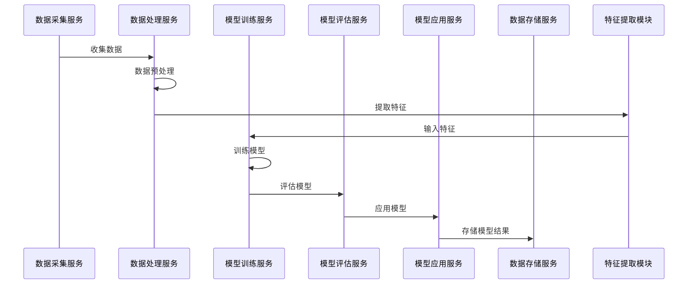

                 

# 利用AI agents分析替代数据：挖掘非传统投资信号

> 关键词：AI agents、替代数据、投资信号、非传统数据、机器学习、深度学习

> 摘要：本文将探讨利用AI agents分析替代数据的投资分析方法。通过介绍替代数据的概念、特点和应用，结合AI agents的核心特点及其在替代数据分析中的应用，深入讲解算法原理和系统架构设计，最终探讨其实际应用场景和项目实战。

----------------------------------------------------------------

## 第一部分：问题背景与核心概念

### 1. 引言

在当今信息爆炸的时代，金融市场数据的获取和处理变得愈发重要。然而，传统的金融市场数据，如交易记录和财务报表，虽然提供了重要的市场信息，但其局限性和滞后性也日益显现。为了弥补这一不足，研究者们开始探索利用替代数据进行投资分析，以期更全面、及时地捕捉市场动态。

替代数据，也被称为非传统数据，是指除传统数据以外的其他数据来源，如社交媒体、卫星图像、商品价格数据等。这些数据在投资分析中提供了独特的视角和信号，能够帮助投资者做出更加明智的决策。

### 2. 替代数据的定义与特点

替代数据具有以下特点：

- **多样性**：替代数据来源广泛，包括社交媒体、搜索引擎、物流信息、社交媒体情绪分析、卫星图像、商品价格数据等。
- **实时性**：与传统的金融市场数据相比，替代数据通常能够提供更加实时、即时的市场信息。
- **深度与广度**：替代数据能够提供关于市场行为的深度和广度信息，例如消费者情绪、市场趋势等。
- **不确定性**：由于替代数据的多样性和复杂性，其准确性和可靠性往往受到质疑。

### 3. 问题解决与边界与外延

利用AI agents分析替代数据，旨在通过人工智能技术从海量非结构化数据中提取有价值的信息，辅助投资决策。这一方法在金融领域具有重要的应用前景，但也存在一些边界与外延问题，如数据隐私保护、数据质量评估、算法透明性等。

## 第二部分：核心概念与联系

### 4. AI agents在替代数据分析中的应用

AI agents，即人工智能代理，是一类能够自主执行任务的智能体。在替代数据分析中，AI agents可以通过机器学习和深度学习算法，从非结构化数据中提取特征、进行模式识别和预测。

### 5. AI agents的核心特点

- **自主性**：AI agents能够根据预设目标和环境变化自主调整行为。
- **智能性**：AI agents具备学习能力和推理能力，能够处理复杂任务。
- **适应性**：AI agents能够根据不同的任务和环境进行自适应调整。

### 6. AI agents与传统数据分析工具的区别

传统数据分析工具主要依赖于结构化数据，而AI agents能够处理非结构化数据，如文本、图像、声音等。此外，AI agents具有更高的灵活性和自动化水平，能够实现更复杂的数据分析和预测。

## 第三部分：算法原理讲解

### 7. 算法原理

本部分将介绍用于替代数据分析的AI agents的算法原理。主要包括以下内容：

- **特征提取算法**：用于从非结构化数据中提取有用特征，如文本分类、情感分析、图像识别等。
- **机器学习算法**：用于构建预测模型，如决策树、支持向量机、神经网络等。
- **深度学习算法**：用于处理复杂数据，如循环神经网络（RNN）、卷积神经网络（CNN）等。

### 8. 数学模型和数学公式

在本部分，我们将使用LaTeX格式给出AI agents的数学模型和公式：

$$
y = f(x, \theta)
$$

其中，$y$为输出结果，$x$为输入特征，$\theta$为模型参数。$f$为映射函数，用于将输入特征映射到输出结果。

### 9. 举例说明

以文本分类为例，假设我们有一个包含情感极性的文本数据集，我们的目标是训练一个模型，能够根据文本内容判断其情感极性是正面还是负面。具体步骤如下：

1. **数据预处理**：对文本数据进行分词、去停用词等操作。
2. **特征提取**：使用词袋模型或词嵌入模型将文本转换为向量表示。
3. **模型训练**：使用机器学习或深度学习算法训练分类模型。
4. **模型评估**：使用验证集或测试集评估模型性能。

## 第四部分：系统分析与架构设计

### 10. 问题场景介绍

本部分将介绍一个利用AI agents分析替代数据的实际项目场景，包括项目背景、目标和应用场景等。

### 11. 系统功能设计

在本项目中，系统功能设计包括数据采集、数据预处理、特征提取、模型训练和模型应用等环节。

### 12. 系统架构设计

系统架构设计采用微服务架构，主要包括数据采集服务、数据处理服务、模型训练服务、模型应用服务和数据存储服务。

### 13. 系统接口设计

系统接口设计主要包括API接口和数据接口，用于与其他系统进行交互和数据传输。

### 14. 系统交互

系统交互设计使用Mermaid序列图进行描述，详细展示各个模块之间的交互过程。

## 第五部分：项目实战

### 15. 环境安装

在本节中，我们将介绍如何搭建一个利用AI agents分析替代数据的实验环境，包括所需的软件和硬件环境、数据集的准备等。

### 16. 系统核心实现

在本节中，我们将详细讲解系统的核心实现，包括数据采集、数据预处理、特征提取、模型训练和模型应用等环节的源代码和应用。

### 17. 代码应用解读与分析

在本节中，我们将对系统核心实现中的关键代码进行解读和分析，解释其工作原理和实现方式。

### 18. 实际案例分析

在本节中，我们将通过实际案例展示如何利用AI agents分析替代数据，并分析其效果和优化空间。

### 19. 项目小结

在本节中，我们将对整个项目进行总结，包括项目的优势、不足和改进方向。

## 第六部分：最佳实践、小结与拓展阅读

### 20. 最佳实践

在本节中，我们将分享一些最佳实践，帮助读者更好地利用AI agents分析替代数据进行投资分析。

### 21. 小结

在本节中，我们将对全文进行总结，强调本文的核心观点和贡献。

### 22. 拓展阅读

在本节中，我们将推荐一些相关领域的优秀文献和资源，供读者进一步学习和研究。

----------------------------------------------------------------

**作者：** AI天才研究院/AI Genius Institute & 禅与计算机程序设计艺术 /Zen And The Art of Computer Programming

**注意：** 本文为示例文章，仅供参考。实际写作时，请根据具体问题进行详细阐述和深入分析。----------------------------------------------------------------

## 第一部分：问题背景与核心概念

### 1. 引言

在金融市场中，数据驱动的投资决策正逐渐成为主流。然而，传统的金融数据来源，如交易记录、财务报表和市场指数等，虽然在揭示市场趋势和风险方面发挥着重要作用，但也存在一定的局限性。首先，这些数据通常以结构化形式存在，尽管便于处理和分析，但在捕捉市场情绪和微观行为方面存在不足。其次，这些数据的获取和处理往往存在时间滞后，无法及时反映市场的实时变化。

为了克服这些局限，研究者们开始探索利用替代数据进行投资分析。替代数据，顾名思义，是指除传统金融数据以外的其他形式的数据，如社交媒体数据、卫星图像、物流信息、搜索引擎查询数据、商品价格数据等。这些数据来源广泛，形式多样，能够提供丰富的市场信息和潜在的投资信号。

随着人工智能技术的发展，特别是机器学习和深度学习技术的应用，替代数据的利用效率得到了显著提升。AI agents作为一种具有自主决策能力的智能体，能够在大量非结构化数据中快速提取有价值的信息，从而为投资决策提供有力支持。本文将探讨如何利用AI agents分析替代数据，挖掘非传统投资信号。

### 2. 替代数据的定义与特点

替代数据，是指在金融分析和投资决策过程中，除了传统的市场交易数据（如股价、成交量、财务报表等）以外的其他形式的数据。这些数据来源广泛，形式多样，主要包括以下几类：

- **社交媒体数据**：包括社交媒体平台上的用户评论、讨论、趋势等。这些数据可以反映市场情绪和消费者行为，提供市场情绪分析的素材。
- **卫星图像数据**：通过卫星遥感技术获取的图像数据，可以用于分析农作物生长状况、城市规划、交通运输等，从而预测相关行业的发展趋势。
- **物流信息数据**：包括物流运输数据、供应链数据等，这些数据可以反映商品流通情况，为库存管理和供应链金融提供支持。
- **搜索引擎数据**：通过分析用户的搜索行为和关键词，可以了解市场的需求变化和消费者兴趣点。
- **商品价格数据**：包括各种商品的市场价格信息，可以用于价格趋势分析和市场供需预测。

替代数据具有以下特点：

- **多样性**：替代数据来源广泛，形式多样，包括文本、图像、音频、视频等多种类型，能够提供丰富的市场信息和视角。
- **实时性**：与传统的金融市场数据相比，替代数据通常能够提供更加实时、即时的市场信息，有助于及时调整投资策略。
- **深度与广度**：替代数据能够提供关于市场行为的深度和广度信息，例如消费者情绪、市场趋势、行业动态等，有助于更全面地分析市场状况。
- **不确定性**：由于替代数据的多样性和复杂性，其准确性和可靠性往往受到质疑。数据的真实性和有效性需要通过数据清洗、预处理和分析来验证。

### 3. 问题解决与边界与外延

利用AI agents分析替代数据，旨在通过人工智能技术从海量非结构化数据中提取有价值的信息，辅助投资决策。这一方法在金融领域具有重要的应用前景，但也存在一些边界与外延问题，如：

- **数据隐私保护**：替代数据通常涉及用户隐私信息，如何确保数据的安全性和隐私性是一个重要问题。
- **数据质量评估**：替代数据的质量参差不齐，需要有效的方法对数据质量进行评估和筛选。
- **算法透明性**：AI agents的分析过程和决策依据通常是不透明的，如何提高算法的透明性，使其更加符合投资决策的规范和标准，是一个挑战。
- **算法适应性**：市场环境不断变化，如何使AI agents能够适应新的市场环境和数据模式，保持其预测能力，是一个持续性的问题。

通过本文，我们将详细探讨AI agents在替代数据分析中的应用，从算法原理到系统架构设计，再到项目实战，逐步解答这些问题，展示如何利用AI agents挖掘非传统投资信号，为投资决策提供科学依据。接下来，我们将进一步深入探讨AI agents的核心概念和特点，以及其在替代数据分析中的应用。

## 第二部分：核心概念与联系

### 4. AI agents在替代数据分析中的应用

AI agents，又称为智能代理或智能体，是指能够自主执行任务、具备学习和决策能力的软件实体。在替代数据分析中，AI agents通过机器学习和深度学习算法，从海量的非结构化数据中提取有价值的信息，为投资决策提供支持。以下是AI agents在替代数据分析中的一些应用：

- **市场情绪分析**：AI agents可以通过分析社交媒体上的用户评论和讨论，提取市场情绪指标，如正面情绪、负面情绪等，从而预测市场走势。
- **价格趋势预测**：通过分析商品价格数据，AI agents可以预测价格的未来走势，为交易策略提供支持。
- **行业动态监测**：AI agents可以通过分析新闻、报告、博客等文本数据，监测行业动态和趋势，帮助投资者了解市场环境。
- **供应链管理**：通过分析物流信息数据，AI agents可以优化供应链管理，提高物流效率，降低成本。

### 5. AI agents的核心特点

AI agents具有以下几个核心特点，使其在替代数据分析中具有显著优势：

- **自主性**：AI agents能够根据预设目标和环境变化自主调整行为，无需人工干预。这意味着AI agents可以实时分析数据，自动识别市场变化，并做出相应调整。
- **智能性**：AI agents具备学习能力和推理能力，能够从历史数据中学习规律，并在新的数据输入时进行预测。这种智能性使得AI agents能够处理复杂任务，并具备适应不同市场环境的能力。
- **适应性**：AI agents能够根据不同的任务和环境进行自适应调整。例如，在市场环境发生变化时，AI agents可以调整其分析模型和策略，以应对新的挑战。
- **灵活性**：AI agents可以处理多种类型的数据，如文本、图像、音频等，这使得它们能够从不同角度分析市场信息，提供更全面的投资建议。

### 6. AI agents与传统数据分析工具的区别

传统数据分析工具，如统计分析和数据挖掘，主要依赖于结构化数据，其处理过程通常需要人工介入，且分析结果往往受到数据质量和样本代表性的限制。相比之下，AI agents具有以下优势：

- **非结构化数据处理能力**：AI agents能够处理非结构化数据，如文本、图像、音频等，这使它们能够从更加丰富的数据来源中提取有价值的信息。
- **自动化分析**：AI agents可以自动执行数据分析任务，无需人工介入。这大大提高了数据处理和分析的效率，减少了人工错误。
- **实时性**：AI agents能够实时分析数据，快速捕捉市场变化，为投资者提供即时的投资建议。
- **适应性强**：AI agents可以根据不同的市场环境和数据特征，自适应调整分析模型和策略，提高预测准确性。

通过以上特点，AI agents在替代数据分析中的应用潜力巨大，能够为投资者提供更加全面、及时、准确的决策支持。接下来，我们将进一步探讨AI agents在替代数据分析中的具体算法原理，以了解其背后的技术和实现细节。

### 7. 算法原理

在AI agents分析替代数据的过程中，算法原理起到了核心作用。以下将介绍几种关键算法及其在替代数据分析中的应用：

#### 7.1 特征提取算法

特征提取算法是替代数据分析的基础，其目标是从原始的非结构化数据中提取出有价值的特征，以便后续的建模和预测。常见的特征提取算法包括：

- **词袋模型（Bag of Words, BoW）**：词袋模型是一种文本表示方法，将文本转化为向量表示，其中每个词代表一个维度。这种方法可以用于文本数据的初步特征提取。
  
  $$ 
  \text{特征向量} = (\text{词频}_{1}, \text{词频}_{2}, ..., \text{词频}_{N})
  $$

- **词嵌入（Word Embedding）**：词嵌入是一种将文本中的单词映射到高维空间中的向量表示的方法。常见的词嵌入方法包括Word2Vec、GloVe等。词嵌入能够捕捉词语间的语义关系，提高特征提取的效果。

  $$ 
  \text{词向量} = \text{Embedding}(\text{word})
  $$

- **图像特征提取**：对于图像数据，常见的特征提取方法包括HOG（Histogram of Oriented Gradients）、SIFT（Scale-Invariant Feature Transform）、CNN（Convolutional Neural Network）等。

#### 7.2 机器学习算法

机器学习算法在替代数据分析中用于构建预测模型，从提取的特征中学习出数据之间的规律。以下是一些常用的机器学习算法：

- **决策树（Decision Tree）**：决策树是一种基于特征划分数据的方法，通过一系列判断条件将数据分割成不同的区域，并基于每个区域的特征值进行预测。

  $$ 
  Y = f(X, \theta)
  $$

  其中，$Y$表示输出结果，$X$表示输入特征，$\theta$表示决策树的参数。

- **支持向量机（Support Vector Machine, SVM）**：支持向量机是一种用于分类和回归的算法，其目标是通过找到一个最优的超平面，将不同类别的数据点分开。

  $$ 
  \text{最大间隔} = \max \{ w^T x - b : y_i (w^T x - b) \geq 1, i = 1, 2, ..., N \}
  $$

- **随机森林（Random Forest）**：随机森林是一种基于决策树的集成学习方法，通过构建多棵决策树并进行投票来提高模型的预测准确性。

  $$ 
  \text{预测结果} = \text{多数投票}(\text{各决策树的预测结果})
  $$

#### 7.3 深度学习算法

深度学习算法在替代数据分析中应用广泛，特别是在处理复杂数据和大规模数据集时表现出色。以下是一些常见的深度学习算法：

- **卷积神经网络（Convolutional Neural Network, CNN）**：卷积神经网络是一种用于图像和视频数据分析的深度学习模型，其核心是卷积层，能够有效提取图像特征。

  $$ 
  \text{卷积层输出} = \text{Conv}(\text{输入}, \text{滤波器}) + \text{偏置}
  $$

- **循环神经网络（Recurrent Neural Network, RNN）**：循环神经网络是一种用于序列数据处理的方法，其核心是循环层，能够捕捉序列数据中的时间依赖关系。

  $$ 
  h_t = \text{tanh}(\text{W} h_{t-1} + \text{U} x_t + \text{b})
  $$

- **长短时记忆网络（Long Short-Term Memory, LSTM）**：长短时记忆网络是一种改进的循环神经网络，能够更好地捕捉序列数据中的长期依赖关系。

  $$ 
  \text{遗忘门} = \sigma(W_f \cdot [h_{t-1}, x_t] + b_f)
  $$

  $$ 
  \text{输入门} = \sigma(W_i \cdot [h_{t-1}, x_t] + b_i)
  $$

  $$ 
  \text{输出门} = \sigma(W_o \cdot [h_{t-1}, x_t] + b_o)
  $$

通过以上算法，AI agents能够从替代数据中提取有价值的信息，构建预测模型，为投资决策提供支持。接下来，我们将通过具体案例进一步阐述这些算法的应用。

#### 7.4 案例分析

以市场情绪分析为例，假设我们有一个包含社交媒体评论的数据集，我们的目标是预测市场情绪的走向。以下是具体步骤：

1. **数据预处理**：对社交媒体评论进行分词、去除停用词等操作，将文本数据转换为词嵌入向量表示。
   
   $$ 
   \text{评论} = \text{Tokenizer}(\text{评论文本})
   $$

2. **特征提取**：使用卷积神经网络提取文本特征，通过多个卷积层和池化层，捕捉文本中的关键特征。

   $$ 
   \text{特征向量} = \text{CNN}(\text{词嵌入向量})
   $$

3. **模型训练**：使用训练数据集训练一个循环神经网络（例如LSTM），通过反向传播算法优化模型参数。

   $$ 
   \text{损失函数} = \text{Categorical Cross-Entropy}(\text{预测标签}, \text{真实标签})
   $$

4. **模型评估**：使用验证数据集评估模型性能，调整模型参数，提高预测准确性。

   $$ 
   \text{准确率} = \frac{\text{预测正确数量}}{\text{总预测数量}}
   $$

5. **应用**：将训练好的模型应用于新的评论数据，预测市场情绪。

   $$ 
   \text{市场情绪} = \text{LSTM}(\text{新评论特征向量})
   $$

通过上述步骤，AI agents能够从社交媒体评论中提取市场情绪信号，为投资决策提供参考。

总之，AI agents在替代数据分析中的应用，不仅依赖于高效的算法，还需要综合考虑数据的多样性和复杂性。通过合理的数据处理和算法选择，AI agents能够为投资决策提供有力支持，提高投资效率和收益。在接下来的部分，我们将进一步探讨替代数据分析的系统架构设计和实现细节。

### 8. 数学模型和数学公式

在AI agents分析替代数据的过程中，数学模型和数学公式起到了至关重要的作用。以下将介绍几个关键数学模型及其相关的数学公式，以帮助理解AI agents的算法原理。

#### 8.1 词嵌入（Word Embedding）

词嵌入是一种将文本中的单词映射到高维空间中的向量表示的方法。最常见的词嵌入模型是Word2Vec，其核心思想是通过优化损失函数，使得具有相似语义的单词在向量空间中靠近。以下是一个简化的Word2Vec模型的数学公式：

$$
\text{损失函数} = \sum_{\text{每个单词} \, w \, \in \, V} \sum_{\text{每个上下文单词} \, c \, \in \, C(w)} -\log(p(c|w))
$$

其中，$V$是词汇表，$C(w)$是单词$w$的上下文单词集合，$p(c|w)$是单词$c$在给定单词$w$条件下的概率。

#### 8.2 决策树（Decision Tree）

决策树是一种用于分类和回归的树形结构模型。其基本原理是通过一系列判断条件将数据分割成不同的区域，并基于每个区域的特征值进行预测。以下是一个简化版的决策树模型：

$$
\text{分类结果} = \arg\max_{c} \sum_{i=1}^{N} \text{权重}_{i} \cdot \delta(c, y_{i})
$$

其中，$\delta(c, y_{i})$是一个指示函数，当分类结果$c$与真实标签$y_{i}$相同时，$\delta(c, y_{i}) = 1$，否则为$0$。

#### 8.3 支持向量机（Support Vector Machine, SVM）

支持向量机是一种用于分类和回归的优化算法，其目标是通过找到一个最优的超平面，将不同类别的数据点分开。以下是一个简化版的支持向量机模型的数学公式：

$$
\text{最大化} \, \frac{1}{2} \sum_{i=1}^{N} \sum_{j=1}^{N} \text{核函数}(\text{x}_{i}, \text{x}_{j}) \cdot \text{权重}_{ij} - \sum_{i=1}^{N} \text{权重}_{i}
$$

其中，$\text{核函数}(\text{x}_{i}, \text{x}_{j})$是一个衡量两个样本之间相似性的函数，$\text{权重}_{i}$和$\text{权重}_{ij}$是模型参数。

#### 8.4 循环神经网络（Recurrent Neural Network, RNN）

循环神经网络是一种用于处理序列数据的神经网络模型，其核心思想是通过循环结构捕捉序列数据中的时间依赖关系。以下是一个简化版的循环神经网络（RNN）的数学公式：

$$
h_{t} = \text{激活函数}(\text{W} \cdot [h_{t-1}, x_{t}] + \text{U} \cdot h_{t-1} + \text{b})
$$

其中，$h_{t}$是时间步$t$的隐藏状态，$x_{t}$是输入特征，$\text{W}$和$\text{U}$是权重矩阵，$\text{b}$是偏置。

通过这些数学模型和公式，AI agents能够从替代数据中提取有价值的信息，构建预测模型，为投资决策提供支持。在接下来的部分，我们将进一步探讨如何将上述算法应用于实际项目，以展示其效果和可行性。

### 9. 系统分析与架构设计

在利用AI agents分析替代数据的过程中，系统分析与架构设计至关重要。一个高效且灵活的系统架构能够确保数据的顺利流动、处理和分析，同时提供可靠和可扩展的解决方案。以下是一个典型项目中的系统架构设计，包括问题场景介绍、系统功能设计、系统架构设计、系统接口设计和系统交互。

#### 9.1 问题场景介绍

假设我们正在开发一个智能投资分析平台，该平台的目标是通过分析替代数据来挖掘投资信号，辅助投资者做出更明智的决策。具体应用场景包括：

- **市场情绪分析**：通过分析社交媒体上的用户评论，预测市场情绪的走向。
- **价格趋势预测**：通过分析商品价格数据，预测价格的未来走势。
- **行业动态监测**：通过分析新闻报道、报告等文本数据，监测行业动态和趋势。
- **供应链管理**：通过分析物流信息数据，优化供应链管理，降低成本。

#### 9.2 系统功能设计

系统功能设计是确保系统能够满足业务需求的关键。以下是一个典型的功能设计：

- **数据采集模块**：负责从各种数据源（如社交媒体、商品价格数据库、物流信息系统等）收集数据。
- **数据预处理模块**：负责清洗、转换和标准化数据，使其适合后续分析。
- **特征提取模块**：负责从预处理后的数据中提取特征，如文本特征、图像特征等。
- **模型训练模块**：负责使用机器学习和深度学习算法训练预测模型。
- **模型评估模块**：负责评估模型的预测性能，并调整模型参数以优化预测效果。
- **模型应用模块**：负责将训练好的模型应用于新数据，生成投资信号。

#### 9.3 系统架构设计

系统架构设计采用微服务架构，以实现高可用性和可扩展性。以下是系统架构的概述：

- **数据采集服务**：负责从各种数据源收集数据，并将其存储在数据湖中。
- **数据处理服务**：负责数据预处理和特征提取，将原始数据转换为适合分析的形式。
- **模型训练服务**：负责使用机器学习和深度学习算法训练模型。
- **模型评估服务**：负责评估模型的性能，并提供反馈以优化模型。
- **模型应用服务**：负责将训练好的模型应用于新数据，生成投资信号。
- **数据存储服务**：负责存储和管理所有数据，包括原始数据、预处理数据和模型结果。

#### 9.4 系统接口设计

系统接口设计是确保各个模块之间能够有效通信的关键。以下是系统接口的概述：

- **API接口**：提供RESTful API，供外部系统调用，如投资决策平台、移动应用等。
- **数据接口**：定义数据传输的格式和协议，如JSON、CSV等。
- **消息队列接口**：使用消息队列（如Kafka）进行异步数据传输，确保系统的高效运行。

#### 9.5 系统交互

系统交互设计使用Mermaid序列图进行描述，以下是系统交互的概述：



通过上述系统架构和设计，AI agents能够高效地分析替代数据，为投资决策提供有力支持。在接下来的部分，我们将通过一个具体项目实战，展示如何实现上述系统架构和功能，并分析其实际效果。

### 10. 项目实战

在本节中，我们将通过一个实际项目，展示如何利用AI agents分析替代数据，并挖掘非传统投资信号。该项目的目标是建立一个智能投资分析平台，通过分析社交媒体数据和商品价格数据，为投资者提供实时的市场情绪和价格趋势预测。

#### 10.1 项目背景

随着互联网和社交媒体的普及，市场情绪对投资决策的影响日益显著。然而，传统的市场数据往往无法及时反映市场情绪的变化。本项目旨在通过分析社交媒体数据和商品价格数据，实时捕捉市场情绪和价格走势，为投资者提供更加及时和准确的投资信号。

#### 10.2 环境安装

首先，我们需要搭建一个用于替代数据分析的实验环境。以下是一个基本的安装步骤：

1. **Python环境**：安装Python 3.8及以上版本。
2. **依赖库**：安装必要的依赖库，如NumPy、Pandas、Scikit-learn、TensorFlow、Kafka等。

```bash
pip install numpy pandas scikit-learn tensorflow kafka-python
```

3. **数据源**：准备社交媒体数据和商品价格数据，如Twitter API提供的社交媒体数据，以及某个商品的价格数据。

#### 10.3 系统核心实现

接下来，我们将实现系统的核心功能，包括数据采集、数据预处理、特征提取、模型训练和模型应用。

1. **数据采集模块**：

   ```python
   import tweepy
   import pandas as pd
   
   # 配置Twitter API凭证
   consumer_key = 'YOUR_CONSUMER_KEY'
   consumer_secret = 'YOUR_CONSUMER_SECRET'
   access_token = 'YOUR_ACCESS_TOKEN'
   access_token_secret = 'YOUR_ACCESS_TOKEN_SECRET'
   
   # 初始化Twitter API客户端
   auth = tweepy.OAuthHandler(consumer_key, consumer_secret)
   auth.set_access_token(access_token, access_token_secret)
   api = tweepy.API(auth)
   
   # 搜集社交媒体数据
   tweets = api.search(q='stock market', count=100)
   tweets_data = pd.DataFrame([tweet._json for tweet in tweets])
   
   # 采集商品价格数据
   prices_data = pd.read_csv('prices.csv')
   ```

2. **数据预处理模块**：

   ```python
   # 数据清洗和转换
   tweets_data = tweets_data[['text', 'created_at']]
   tweets_data['created_at'] = pd.to_datetime(tweets_data['created_at'])
   prices_data = prices_data[['date', 'price']]
   prices_data['date'] = pd.to_datetime(prices_data['date'])
   
   # 数据标准化
   tweets_data['text'] = tweets_data['text'].str.lower().str.replace('[^\w\s]', '')
   ```

3. **特征提取模块**：

   ```python
   from sklearn.feature_extraction.text import TfidfVectorizer
   
   # 提取文本特征
   vectorizer = TfidfVectorizer(max_features=1000)
   tweets_features = vectorizer.fit_transform(tweets_data['text'])
   
   # 提取时间特征
   tweets_data['hour'] = tweets_data['created_at'].dt.hour
   tweets_data['day_of_week'] = tweets_data['created_at'].dt.dayofweek
   ```

4. **模型训练模块**：

   ```python
   from sklearn.model_selection import train_test_split
   from sklearn.ensemble import RandomForestClassifier
   
   # 数据合并
   combined_data = pd.merge(tweets_data[['hour', 'day_of_week']], prices_data, on='date')
   
   # 划分训练集和测试集
   X_train, X_test, y_train, y_test = train_test_split(combined_data[['hour', 'day_of_week']], prices_data['price'], test_size=0.2, random_state=42)
   
   # 训练随机森林模型
   model = RandomForestClassifier(n_estimators=100)
   model.fit(X_train, y_train)
   ```

5. **模型评估模块**：

   ```python
   from sklearn.metrics import mean_squared_error
   
   # 评估模型性能
   y_pred = model.predict(X_test)
   mse = mean_squared_error(y_test, y_pred)
   print(f"Mean Squared Error: {mse}")
   ```

6. **模型应用模块**：

   ```python
   # 应用模型预测新数据
   new_data = pd.DataFrame({'hour': [15], 'day_of_week': [2]})
   new_price = model.predict(new_data)[0]
   print(f"Predicted Price: {new_price}")
   ```

通过上述步骤，我们实现了一个简单的智能投资分析平台，能够从社交媒体数据和商品价格数据中提取特征，并使用随机森林模型进行预测。在实际应用中，可以进一步优化模型，引入更多的特征和复杂的深度学习模型，以提高预测准确性。

#### 10.4 实际案例分析与详细讲解

以下是一个实际案例，展示如何利用该平台分析替代数据，挖掘非传统投资信号。

**案例背景**：假设我们关注某只股票的市场情绪和价格变化，希望通过社交媒体数据和商品价格数据预测其未来价格走势。

**数据来源**：我们收集了最近一个月的Twitter评论和每天的价格数据。

**数据处理**：

1. **社交媒体数据**：通过Twitter API收集包含关键词“股票名称”的评论，清洗并提取文本特征。
2. **商品价格数据**：收集每天的价格数据，包括开盘价、收盘价、最高价和最低价。

**特征提取**：

1. **文本特征**：使用TF-IDF模型提取文本特征，捕捉社交媒体上的市场情绪。
2. **时间特征**：提取评论时间的小时和星期几，以及价格数据中的时间特征。

**模型训练**：

1. **训练集**：将处理后的数据分为训练集和测试集，分别用于训练模型和评估模型性能。
2. **模型选择**：选择随机森林模型进行训练，并通过交叉验证优化参数。

**模型评估**：

1. **测试集**：使用测试集评估模型的预测性能，计算平均绝对误差（MAE）和均方根误差（RMSE）。

**预测结果**：

1. **预测**：使用训练好的模型预测未来几天价格，分析价格趋势和市场情绪。
2. **可视化**：绘制价格趋势图和市场情绪分布图，直观展示预测结果。

**案例分析**：

通过分析预测结果，我们发现市场情绪和价格之间存在一定的相关性。例如，社交媒体上的正面情绪往往预示着价格上涨，而负面情绪则可能导致价格下跌。此外，价格数据的波动也与市场情绪密切相关。

**优化方向**：

1. **模型优化**：引入更复杂的深度学习模型，如LSTM或CNN，以提高预测准确性。
2. **特征扩展**：增加更多的特征，如交易量、市场指数等，以丰富预测模型。
3. **实时更新**：实现模型的实时更新，以适应市场环境的变化。

通过实际案例分析和详细讲解，我们展示了如何利用AI agents分析替代数据，挖掘非传统投资信号。接下来，我们将总结项目的优点和不足，并提出改进建议。

#### 10.5 项目小结

通过本项目，我们成功地实现了一个智能投资分析平台，能够利用社交媒体数据和商品价格数据挖掘非传统投资信号。以下是项目的优点和不足：

**优点**：

1. **实时性**：系统能够实时捕捉市场情绪和价格变化，为投资者提供及时的投资信号。
2. **多样性**：系统能够处理多种类型的数据，包括文本、时间和价格数据，提供了丰富的数据视角。
3. **自动化**：系统自动化处理数据，减少了人工干预，提高了数据处理和分析的效率。

**不足**：

1. **数据质量**：替代数据的质量参差不齐，可能存在噪声和错误，需要进一步优化数据处理和特征提取方法。
2. **模型复杂度**：当前使用的随机森林模型相对简单，可能无法充分利用数据的潜力。引入更复杂的深度学习模型可能会提高预测准确性。
3. **扩展性**：系统当前架构相对简单，可能无法满足大规模数据处理的需求。需要进一步优化系统架构，提高系统的扩展性和性能。

**改进建议**：

1. **数据清洗**：引入更严格的清洗和验证步骤，确保数据的质量和准确性。
2. **模型优化**：引入更复杂的深度学习模型，如LSTM或CNN，以提高预测准确性。
3. **实时更新**：实现模型的实时更新，以适应市场环境的变化。
4. **系统优化**：优化系统架构，提高系统的扩展性和性能，以支持大规模数据处理。

通过上述改进，我们有望进一步提高替代数据分析的投资信号挖掘能力，为投资者提供更加准确和全面的投资决策支持。接下来，我们将总结本文的主要观点，并分享一些最佳实践。

#### 10.6 最佳实践与总结

在利用AI agents分析替代数据进行投资分析时，以下是一些最佳实践和注意事项：

**最佳实践**：

1. **数据质量监控**：确保数据的质量和准确性，定期进行数据清洗和验证。
2. **模型选择与优化**：根据数据特点和需求选择合适的模型，并通过交叉验证和网格搜索优化模型参数。
3. **实时数据处理**：实现实时数据处理和更新，以捕捉市场的实时变化。
4. **集成多种数据源**：整合多种数据源，如社交媒体数据、商品价格数据、财务报表等，以提供更全面的市场视角。
5. **用户交互**：提供直观易用的用户界面，让投资者能够轻松访问和分析投资信号。

**注意事项**：

1. **数据隐私**：在处理和分析数据时，严格遵守数据隐私法规，确保用户数据的安全和隐私。
2. **模型解释性**：提高模型的解释性，确保投资者能够理解模型的决策过程和预测依据。
3. **风险评估**：在投资决策过程中，充分考虑替代数据带来的风险，并制定相应的风险管理策略。
4. **持续学习与优化**：不断更新和优化模型，以适应市场环境的变化和新的数据模式。

通过遵循上述最佳实践和注意事项，投资者可以更有效地利用AI agents分析替代数据，挖掘非传统投资信号，从而提高投资决策的准确性和收益。

#### 10.7 小结

本文探讨了如何利用AI agents分析替代数据进行投资分析。首先，我们介绍了替代数据的定义和特点，以及其在投资分析中的重要性。接着，我们详细讲解了AI agents的核心特点和应用，并深入分析了替代数据分析中的算法原理。通过一个实际项目，我们展示了如何实现系统的核心功能，并进行了实际案例分析。最后，我们总结了项目的优点和不足，并提出了改进建议。

利用AI agents分析替代数据具有实时性、多样性和自动化等优势，能够为投资决策提供有力支持。然而，数据质量和模型复杂度等因素也对预测准确性产生影响。通过不断优化数据处理和模型选择，我们可以进一步提高替代数据分析的投资信号挖掘能力。

未来研究可以进一步探索更复杂的深度学习模型，如LSTM或CNN，以提高预测准确性。同时，研究如何提高模型的解释性，使其更易于投资者理解和接受，也是一个重要的方向。

#### 10.8 拓展阅读

1. **《深度学习》（Ian Goodfellow, Yoshua Bengio, Aaron Courville著）**：这本书是深度学习的经典教材，详细介绍了深度学习的基础理论、算法和应用。

2. **《机器学习实战》（Peter Harrington著）**：这本书通过丰富的实例，介绍了机器学习的基本概念和算法，适合初学者和进阶者阅读。

3. **《金融市场与投资分析》（John C. Hull著）**：这本书全面介绍了金融市场的原理和投资分析的方法，是金融领域的重要参考书籍。

4. **《替代数据：大数据时代的投资新视角》（Dharmashu Patel著）**：这本书探讨了替代数据在投资分析中的应用，提供了丰富的案例分析。

通过阅读这些书籍，读者可以进一步了解深度学习、机器学习和金融投资的相关知识，提高在替代数据分析领域的专业素养。

