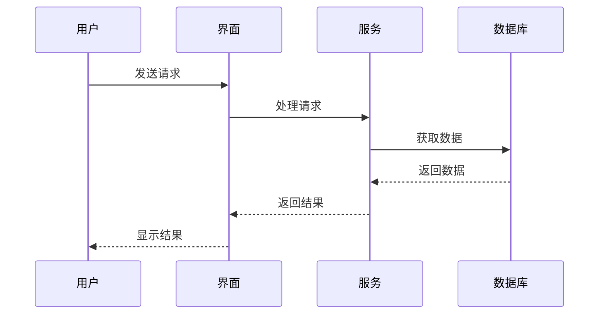
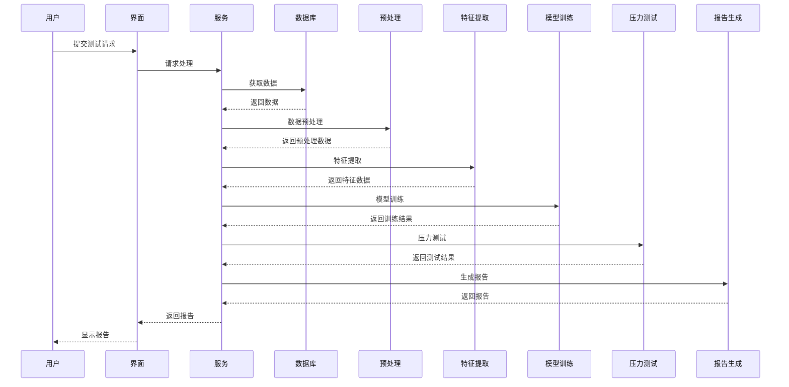
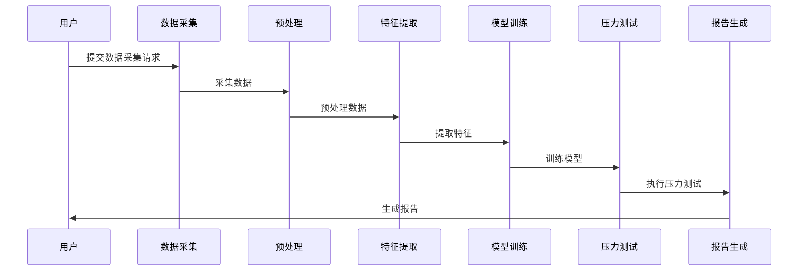

                 


## 第1章: 问题背景与核心概念

### 1.1.1 财务压力测试的重要性

财务压力测试是金融领域中一项至关重要的技术，它通过模拟极端市场状况，检验金融机构的风险承受能力和应急处理能力。随着全球金融市场的复杂性和不确定性的增加，财务压力测试不仅关乎金融机构的生存，更是保护投资者利益和市场稳定的重要手段。

#### 1.1.1.1 财务压力测试的定义

财务压力测试（Financial Stress Testing）是一种评估金融机构在极端市场条件下承受风险能力的分析工具。它通过模拟不同情景下的金融指标变化，如贷款违约率、市场利率波动、汇率变化等，来评估金融机构在面对突发事件时的稳定性和抗风险能力。

#### 1.1.1.2 财务压力测试的目的

财务压力测试的主要目的是：
1. **评估风险**：通过模拟市场波动，识别潜在的风险点，帮助金融机构评估其在极端市场条件下的抗风险能力。
2. **制定策略**：为金融机构提供风险管理策略，以便在危机时刻采取有效措施。
3. **合规要求**：许多金融监管机构要求金融机构定期进行财务压力测试，以确保其稳健经营。

#### 1.1.1.3 财务压力测试的现状与挑战

目前，财务压力测试已广泛应用于银行、证券、保险等领域。然而，随着金融市场数据量的爆炸式增长和复杂性的增加，传统的财务压力测试面临着以下挑战：
1. **数据获取与处理**：需要处理大量的历史数据和市场数据，对数据处理能力提出了高要求。
2. **模型准确性**：模型准确性直接影响到压力测试结果的可靠性，如何提高模型预测能力是一个重要问题。
3. **实时性**：市场变化迅速，实时性要求越来越高，传统的压力测试方法难以满足。

### 1.1.2 AI在财务领域的应用

人工智能（AI）作为现代科技的前沿领域，已经在多个行业展现了其巨大的潜力，特别是在财务领域。AI通过算法和模型，可以大大提高财务压力测试的效率与准确性。

#### 1.1.2.1 AI的基本概念

AI是指人工智能，即通过计算机模拟人类的智能行为。AI技术包括机器学习、深度学习、自然语言处理等子领域，其中机器学习和深度学习是财务压力测试中应用最广泛的。

#### 1.1.2.2 AI在金融领域的应用实例

AI在金融领域的应用广泛，例如：
1. **风险管理**：通过机器学习算法，预测市场风险，提高财务压力测试的准确性。
2. **客户服务**：利用自然语言处理技术，提供智能客服，提升客户满意度。
3. **交易策略**：通过深度学习算法，分析历史交易数据，制定高效的交易策略。

#### 1.1.2.3 动态财务压力测试的概念

动态财务压力测试是一种结合了AI技术的财务压力测试方法。它通过实时监测市场数据，动态调整测试场景，以更真实地模拟市场变化，提高压力测试的准确性。

### 1.1.3 动态财务压力测试的优势

动态财务压力测试相较于传统的财务压力测试，具有以下优势：
1. **实时性**：能够实时监测市场变化，动态调整测试场景，提高测试的实时性。
2. **准确性**：通过机器学习算法，提高对市场风险的预测准确性，增强压力测试的可靠性。
3. **效率**：利用AI技术，自动化处理大量数据，提高测试效率。

#### 1.1.3.1 与传统财务压力测试的比较

| 特性 | 传统财务压力测试 | 动态财务压力测试 |
| ---- | ---------------- | --------------- |
| **实时性** | 测试结果较为滞后 | 能够实时调整测试场景 |
| **准确性** | 预测准确性有限 | 利用AI提高预测准确性 |
| **效率** | 数据处理效率低 | 自动化处理大量数据 |

#### 1.1.3.2 动态财务压力测试的关键特性

动态财务压力测试的关键特性包括：
1. **动态调整测试场景**：根据实时市场数据，动态调整测试参数，模拟真实市场变化。
2. **机器学习算法**：利用机器学习算法，对历史数据进行训练，提高对市场风险的预测能力。
3. **实时反馈机制**：通过实时监测测试结果，及时调整测试场景，提高测试的可靠性。

#### 1.1.3.3 动态财务压力测试的应用前景

随着AI技术的不断发展，动态财务压力测试的应用前景十分广阔。未来，动态财务压力测试有望成为金融机构风险管理的重要工具，帮助金融机构更好地应对市场变化，提高其抗风险能力。

### 1.1.4 本书结构安排

本书将分为三个部分，共五章节，内容安排如下：
1. **第一部分：引言与背景介绍**，介绍财务压力测试和AI的基本概念，以及动态财务压力测试的优势。
2. **第二部分：AI与动态财务压力测试原理**，详细讲解AI和动态财务压力测试的基本原理。
3. **第三部分：动态财务压力测试实践**，通过实际案例，展示动态财务压力测试的应用和实践。

#### 1.1.4.1 各章节主要内容概述

- **第1章**：介绍财务压力测试和AI的基本概念，以及动态财务压力测试的优势。
- **第2章**：详细讲解AI和机器学习的基本原理，包括监督学习、无监督学习和强化学习。
- **第3章**：介绍动态财务压力测试的原理，包括测试过程和挑战。
- **第4章**：探讨AI在动态财务压力测试中的应用，包括数据预处理、特征提取和模型训练。
- **第5章**：通过实际案例，展示动态财务压力测试的应用和实践。

#### 1.1.4.2 阅读指南

本书适合对财务压力测试和AI有兴趣的读者，特别是金融领域的专业人士和研究人员。本书将帮助读者全面了解动态财务压力测试的概念、原理和应用，为其实践提供指导。

## 第2章: AI基础

### 2.1.1 AI的发展历程

人工智能（Artificial Intelligence, AI）的研究起源于20世纪50年代。早期的人工智能主要集中在符号推理和逻辑推理上，试图通过编写程序模拟人类思维过程。这一时期被称为“AI的黄金时代”。

#### 2.1.1.1 AI的起源

1956年，达特茅斯会议标志着人工智能正式成为一门学科。会议上的科学家们讨论了如何通过计算机模拟人类的智能行为。这一时期，人们对于人工智能充满了希望，认为不久的将来计算机将能够像人类一样思考。

#### 2.1.1.2 AI的黄金时代

20世纪60年代至70年代，人工智能研究取得了显著进展。逻辑推理、知识表示、自然语言处理等领域的研究取得了重要成果。然而，由于计算能力的限制和理论研究的不足，人工智能在1980年左右陷入了低潮期。

#### 2.1.1.3 现代AI的兴起

21世纪初，随着计算机性能的飞速提升和大数据技术的发展，人工智能迎来了新的发展机遇。机器学习、深度学习等技术的突破，使得人工智能在图像识别、语音识别、自然语言处理等领域取得了显著成果。现代人工智能被称为“AI的第二次革命”。

### 2.1.2 机器学习基本原理

机器学习（Machine Learning, ML）是人工智能的核心技术之一。它通过构建算法模型，使计算机能够从数据中学习，并做出预测或决策。

#### 2.1.2.1 监督学习

监督学习（Supervised Learning）是一种最常见的机器学习方法。它通过训练数据集来构建模型，其中每个数据点都有一个对应的标签。模型通过学习这些标签来预测新的数据点。

- **算法分类**：
  - 线性回归（Linear Regression）
  - 逻辑回归（Logistic Regression）
  - 决策树（Decision Tree）
  - 随机森林（Random Forest）
  - 支持向量机（Support Vector Machine, SVM）

#### 2.1.2.2 无监督学习

无监督学习（Unsupervised Learning）不依赖于标签信息，通过挖掘数据之间的内在结构来学习。常见的方法包括：
- **聚类算法**：如K-Means、层次聚类（Hierarchical Clustering）
- **降维算法**：如主成分分析（PCA）、t-SNE

#### 2.1.2.3 强化学习

强化学习（Reinforcement Learning, RL）是一种通过与环境互动来学习策略的机器学习方法。它通过奖励机制来指导模型的决策过程，逐渐优化策略。

- **算法分类**：
  - Q-Learning
  - Deep Q-Network (DQN)
  - Policy Gradient Methods

### 2.1.3 深度学习

深度学习（Deep Learning）是机器学习的一个分支，它通过多层神经网络（Neural Network）来模拟人类大脑的神经元结构。深度学习在图像识别、语音识别、自然语言处理等领域取得了突破性进展。

#### 2.1.3.1 深度神经网络

深度神经网络（Deep Neural Network, DNN）是深度学习的基础。它由多个隐藏层组成，每个隐藏层将输入数据通过非线性变换传递到下一层。

- **结构**：输入层、隐藏层、输出层
- **激活函数**：如Sigmoid、ReLU、Tanh

#### 2.1.3.2 卷积神经网络（CNN）

卷积神经网络（Convolutional Neural Network, CNN）是一种专门用于处理图像数据的深度学习模型。它通过卷积操作来提取图像的特征。

- **卷积层**：提取图像的特征
- **池化层**：降低特征图的维度，减少计算量
- **全连接层**：进行分类或回归

#### 2.1.3.3 循环神经网络（RNN）

循环神经网络（Recurrent Neural Network, RNN）是一种能够处理序列数据的深度学习模型。它通过循环结构来记忆序列中的信息。

- **结构**：包含一个循环单元，能够将当前输入和上一个时间步的隐藏状态关联起来。
- **变体**：
  - LSTM（Long Short-Term Memory）：解决RNN的长期依赖问题
  - GRU（Gated Recurrent Unit）：简化LSTM结构，提高计算效率

## 第3章: 动态财务压力测试原理

### 3.2.1 财务压力测试概述

财务压力测试（Financial Stress Testing）是一种评估金融机构在极端市场状况下风险承受能力的分析方法。通过模拟不同情景下的金融指标变化，如贷款违约率、市场利率波动、汇率变化等，来评估金融机构在面对突发事件时的稳定性和抗风险能力。

#### 3.2.1.1 财务风险的概念

财务风险是指金融机构在经营过程中因市场波动、信用风险、流动性风险等因素导致的损失风险。财务压力测试旨在识别这些潜在风险，并提供应对策略。

#### 3.2.1.2 财务压力测试的目的

财务压力测试的主要目的是：
1. **评估风险**：通过模拟市场波动，识别潜在的风险点，帮助金融机构评估其在极端市场条件下的抗风险能力。
2. **制定策略**：为金融机构提供风险管理策略，以便在危机时刻采取有效措施。
3. **合规要求**：许多金融监管机构要求金融机构定期进行财务压力测试，以确保其稳健经营。

#### 3.2.1.3 财务压力测试的类型

财务压力测试可以分为以下几种类型：
1. **静态压力测试**：在特定时间点进行压力测试，评估金融机构的即时风险状况。
2. **动态压力测试**：模拟市场变化，实时调整压力测试场景，以更真实地反映金融机构的风险承受能力。
3. **极端情景测试**：模拟极端市场状况，评估金融机构在极端条件下的生存能力。

### 3.2.2 动态财务压力测试

动态财务压力测试是一种结合了AI技术的财务压力测试方法。它通过实时监测市场数据，动态调整测试场景，以更真实地模拟市场变化，提高压力测试的准确性。

#### 3.2.2.1 动态财务压力测试的特点

动态财务压力测试具有以下特点：
1. **实时性**：能够实时监测市场变化，动态调整测试场景，提高测试的实时性。
2. **准确性**：通过机器学习算法，提高对市场风险的预测准确性，增强压力测试的可靠性。
3. **高效性**：利用AI技术，自动化处理大量数据，提高测试效率。

#### 3.2.2.2 动态财务压力测试的过程

动态财务压力测试的过程可以分为以下几个步骤：
1. **数据收集**：收集市场数据、金融机构内部数据等，为压力测试提供基础数据。
2. **数据预处理**：对收集到的数据进行清洗、归一化等处理，以便进行后续分析。
3. **模型构建**：利用机器学习算法构建预测模型，对市场风险进行预测。
4. **压力测试**：根据实时市场数据，动态调整测试场景，进行压力测试。
5. **结果分析**：对测试结果进行分析，识别风险点，提供风险管理策略。

#### 3.2.2.3 动态财务压力测试的挑战

动态财务压力测试面临着以下挑战：
1. **数据质量**：市场数据的质量直接影响测试结果的准确性，需要确保数据的准确性、完整性和一致性。
2. **计算资源**：动态财务压力测试需要处理大量的实时数据，对计算资源提出了高要求。
3. **模型解释性**：机器学习模型具有较高的预测准确性，但其决策过程通常较为复杂，难以解释。
4. **模型更新**：市场变化快速，需要不断更新模型，以适应新的市场环境。

## 第4章: 动态财务压力测试中的AI技术

### 4.3.1 数据预处理

数据预处理是动态财务压力测试中的关键步骤，它涉及到对原始数据进行清洗、归一化、增强等处理，以确保数据的质量和一致性，从而提高后续模型训练的效果。

#### 4.3.1.1 数据清洗

数据清洗是数据预处理的第一步，其主要目标是去除数据中的噪声、错误和不完整的数据。具体包括以下几个方面：
1. **缺失值处理**：对于缺失值，可以通过填补、删除或插值等方法进行处理。
2. **异常值处理**：检测并处理数据中的异常值，如离群点、重复数据等。
3. **数据格式转换**：将不同来源和格式的数据转换为统一的格式，以便后续处理。

#### 4.3.1.2 数据归一化

数据归一化是将不同特征的数据进行标准化处理，使其具有相似的量纲和尺度。常用的归一化方法包括：
1. **最小-最大标准化**：将数据缩放到[0, 1]之间。
   $$\text{x}_{\text{标准化}} = \frac{\text{x}_{\text{原始}} - \text{x}_{\text{最小值}}}{\text{x}_{\text{最大值}} - \text{x}_{\text{最小值}}}$$
2. **零-一标准化**：将数据缩放到[-1, 1]之间。
   $$\text{x}_{\text{标准化}} = 2 \cdot \frac{\text{x}_{\text{原始}} - \text{x}_{\text{均值}}}{\text{x}_{\text{标准差}}} - 1$$

#### 4.3.1.3 数据增强

数据增强是通过增加数据多样性来提高模型训练效果的方法。具体方法包括：
1. **数据复制**：将原始数据复制多次，增加样本数量。
2. **数据变换**：通过对数据进行平移、旋转、缩放等操作，增加数据的多样性。
3. **生成对抗网络（GAN）**：通过生成对抗网络生成新的数据样本。

### 4.3.2 特征提取与选择

特征提取与选择是动态财务压力测试中的关键步骤，它涉及到从原始数据中提取有用的特征，并对特征进行选择，以提高模型训练效果。

#### 4.3.2.1 特征提取方法

特征提取方法包括以下几种：
1. **统计特征**：通过计算数据的统计量，如均值、方差、最大值、最小值等来提取特征。
2. **频域特征**：通过对数据进行傅里叶变换，提取频域特征。
3. **时频特征**：结合时间和频率信息，如小波变换等。

#### 4.3.2.2 特征选择方法

特征选择方法包括以下几种：
1. **过滤方法**：根据特征的相关性、重要性等直接筛选特征。
   - 相关性筛选：去除与目标变量相关性较低的特征。
   - 特征重要性筛选：基于模型训练结果，去除重要性较低的特征。
2. **嵌入方法**：在模型训练过程中，自动筛选特征。
   - 主成分分析（PCA）：通过降维，筛选出主要成分作为特征。
   - 特征选择嵌入（Feature Selection Embedding）：在深度学习模型中，自动筛选特征。

#### 4.3.2.3 特征重要性分析

特征重要性分析是对特征在模型中的作用进行评估的方法。常用的方法包括：
1. **基于模型的特征重要性**：通过模型训练结果，评估特征的重要性。
   - 决策树：通过树的分支重要性评估特征。
   - 随机森林：通过特征的重要性得分评估特征。
2. **基于统计的特征重要性**：通过计算特征与目标变量之间的相关性，评估特征的重要性。

### 4.3.3 模型训练与评估

模型训练与评估是动态财务压力测试中的关键步骤，它涉及到利用训练数据训练模型，并评估模型的性能。

#### 4.3.3.1 模型训练过程

模型训练过程包括以下步骤：
1. **数据划分**：将数据划分为训练集、验证集和测试集，用于模型训练和评估。
2. **模型选择**：根据问题特性，选择合适的模型，如线性回归、决策树、神经网络等。
3. **模型训练**：使用训练集数据训练模型，调整模型参数。
4. **模型评估**：使用验证集数据评估模型性能，选择最优模型。

#### 4.3.3.2 模型评估指标

常用的模型评估指标包括：
1. **准确率（Accuracy）**：预测正确的样本数占总样本数的比例。
2. **精确率（Precision）**：预测正确的正样本数与预测的正样本数的比例。
3. **召回率（Recall）**：预测正确的正样本数与实际正样本数的比例。
4. **F1值（F1 Score）**：精确率和召回率的调和平均值。
5. **均方误差（MSE）**：预测值与实际值之差的平方的平均值。
6. **均绝对误差（MAE）**：预测值与实际值之差的绝对值的平均值。

#### 4.3.3.3 模型调优

模型调优是通过调整模型参数，以提高模型性能的过程。常用的调优方法包括：
1. **网格搜索（Grid Search）**：在给定的参数空间内，遍历所有可能的参数组合，找到最优参数。
2. **贝叶斯优化（Bayesian Optimization）**：基于贝叶斯统计模型，寻找最优参数。
3. **随机搜索（Random Search）**：在给定的参数空间内，随机选择参数组合，进行调优。

## 第5章: 动态财务压力测试系统设计与实现

### 5.4.1 系统设计

动态财务压力测试系统设计主要包括系统功能设计、系统架构设计、数据流程设计等方面。以下是系统设计的具体内容：

#### 5.4.1.1 系统功能设计

动态财务压力测试系统的功能设计主要包括以下模块：

1. **数据采集模块**：负责从各个数据源收集财务数据和市场数据。
2. **数据预处理模块**：负责对采集到的数据进行清洗、归一化和增强等处理。
3. **特征提取模块**：负责从预处理后的数据中提取有用的特征。
4. **模型训练模块**：负责训练机器学习模型，并对模型进行调优。
5. **压力测试模块**：负责根据训练好的模型进行财务压力测试，生成测试报告。
6. **用户界面模块**：提供用户交互界面，用户可以通过界面查看测试结果和分析报告。

#### 5.4.1.2 系统架构设计

动态财务压力测试系统的架构设计采用分层架构，主要包括以下层次：

1. **数据层**：负责存储和管理财务数据和市场数据。
2. **服务层**：负责处理数据预处理、特征提取、模型训练和压力测试等核心业务逻辑。
3. **应用层**：负责提供用户交互界面和Web服务接口。
4. **展现层**：负责展示测试结果和分析报告。

以下是系统架构的Mermaid架构图：



#### 5.4.1.3 系统接口设计

动态财务压力测试系统提供了以下接口：

1. **数据采集接口**：用于从外部系统或数据源收集财务数据和市场数据。
2. **数据预处理接口**：用于清洗、归一化和增强处理财务数据。
3. **特征提取接口**：用于从预处理后的数据中提取特征。
4. **模型训练接口**：用于训练机器学习模型。
5. **压力测试接口**：用于执行财务压力测试。
6. **报告生成接口**：用于生成测试报告。

#### 5.4.1.4 系统交互设计

动态财务压力测试系统的交互设计主要包括以下步骤：

1. **用户提交测试请求**：用户通过界面提交测试请求。
2. **系统获取数据**：系统从数据层获取财务数据和市场数据。
3. **数据预处理**：对获取的数据进行清洗、归一化和增强处理。
4. **特征提取**：从预处理后的数据中提取特征。
5. **模型训练**：使用提取的特征训练机器学习模型。
6. **压力测试**：使用训练好的模型进行财务压力测试。
7. **生成报告**：生成测试报告，并展示给用户。

以下是系统交互的Mermaid序列图：



### 5.4.2 项目介绍

#### 5.4.2.1 项目背景

随着金融市场的不断发展和变化，金融机构面临着越来越多的风险。为了更好地应对这些风险，动态财务压力测试成为金融机构风险管理的重要工具。本项目旨在开发一款基于AI技术的动态财务压力测试系统，以提高金融机构的风险管理能力。

#### 5.4.2.2 项目目标

本项目的主要目标包括：
1. **构建一个基于AI的动态财务压力测试平台**：实现财务数据的自动采集、预处理、特征提取、模型训练和压力测试等功能。
2. **提高财务压力测试的实时性和准确性**：通过实时监测市场数据，动态调整测试场景，提高测试的实时性和准确性。
3. **提供直观的测试报告**：生成易于理解和分析的压力测试报告，帮助金融机构更好地应对风险。

### 5.4.3 系统功能设计

系统功能设计是动态财务压力测试系统实现的关键环节。以下是系统的主要功能模块及其设计：

#### 5.4.3.1 数据采集模块

数据采集模块负责从各个数据源收集财务数据和市场数据。具体设计如下：

1. **数据源**：包括金融机构内部数据、金融市场数据、宏观经济数据等。
2. **采集方式**：通过API接口、数据库连接、网络爬虫等方式获取数据。
3. **数据清洗**：对采集到的数据进行分析，去除重复、缺失和异常数据。

#### 5.4.3.2 数据预处理模块

数据预处理模块负责对采集到的数据进行清洗、归一化和增强等处理。具体设计如下：

1. **数据清洗**：对数据进行去重、补缺、去除异常值等处理。
2. **数据归一化**：将不同特征的数据进行标准化处理，使其具有相似的量纲和尺度。
3. **数据增强**：通过增加数据多样性来提高模型训练效果。

#### 5.4.3.3 特征提取模块

特征提取模块负责从预处理后的数据中提取有用的特征。具体设计如下：

1. **特征选择**：通过相关性分析、重要性分析等方法筛选出关键特征。
2. **特征提取**：计算统计特征、频域特征和时频特征等。
3. **特征融合**：将不同特征进行融合，生成新的特征。

#### 5.4.3.4 模型训练模块

模型训练模块负责训练机器学习模型，并对模型进行调优。具体设计如下：

1. **模型选择**：根据问题特性选择合适的模型，如线性回归、决策树、神经网络等。
2. **模型训练**：使用训练集数据训练模型，调整模型参数。
3. **模型评估**：使用验证集数据评估模型性能，选择最优模型。
4. **模型调优**：通过网格搜索、贝叶斯优化等方法对模型参数进行调优。

#### 5.4.3.5 压力测试模块

压力测试模块负责根据训练好的模型进行财务压力测试，生成测试报告。具体设计如下：

1. **测试场景**：根据市场数据和历史经验构建不同的测试场景。
2. **测试执行**：使用训练好的模型对测试场景进行压力测试。
3. **结果分析**：对测试结果进行分析，生成测试报告。

#### 5.4.3.6 用户界面模块

用户界面模块负责提供用户交互界面，用户可以通过界面查看测试结果和分析报告。具体设计如下：

1. **登录注册**：用户登录和注册功能。
2. **测试管理**：用户可以查看和管理测试任务。
3. **测试报告**：用户可以查看详细的测试报告，包括测试结果和分析图表。

### 5.4.4 系统架构设计

系统架构设计是动态财务压力测试系统的核心，它决定了系统的性能、可扩展性和可维护性。以下是系统的整体架构设计：

#### 5.4.4.1 分层架构

系统采用分层架构，包括数据层、服务层、应用层和展现层。

1. **数据层**：负责数据存储和管理，包括数据库、数据仓库等。
2. **服务层**：负责业务逻辑处理，包括数据采集、数据预处理、特征提取、模型训练和压力测试等。
3. **应用层**：负责提供Web服务和用户交互界面。
4. **展现层**：负责展示测试结果和分析报告。

#### 5.4.4.2 微服务架构

系统采用微服务架构，将不同的功能模块拆分为独立的微服务，以提高系统的可扩展性和可维护性。以下是系统的微服务架构设计：

1. **数据采集微服务**：负责数据采集和处理。
2. **数据预处理微服务**：负责数据清洗、归一化和增强等处理。
3. **特征提取微服务**：负责特征提取和特征选择。
4. **模型训练微服务**：负责模型训练和调优。
5. **压力测试微服务**：负责压力测试和结果分析。
6. **用户界面微服务**：负责提供用户交互界面。

#### 5.4.4.3 数据流设计

系统的数据流设计如下：

1. **数据采集**：从各个数据源采集财务数据和市场数据。
2. **数据预处理**：对采集到的数据进行清洗、归一化和增强处理。
3. **特征提取**：从预处理后的数据中提取特征。
4. **模型训练**：使用提取的特征训练机器学习模型。
5. **压力测试**：使用训练好的模型进行财务压力测试。
6. **结果分析**：对测试结果进行分析，生成测试报告。
7. **报告生成**：生成测试报告，并展示给用户。

### 5.4.5 系统接口设计

系统接口设计是动态财务压力测试系统的重要组成部分，它决定了系统与其他系统的交互方式。以下是系统的接口设计：

#### 5.4.5.1 API接口设计

系统提供了RESTful风格的API接口，用于与其他系统进行数据交互。以下是主要的API接口设计：

1. **数据采集接口**：用于从外部系统或数据源采集财务数据和市场数据。
2. **数据预处理接口**：用于清洗、归一化和增强处理财务数据。
3. **特征提取接口**：用于从预处理后的数据中提取特征。
4. **模型训练接口**：用于训练机器学习模型。
5. **压力测试接口**：用于执行财务压力测试。
6. **报告生成接口**：用于生成测试报告。

#### 5.4.5.2 数据流接口设计

系统还提供了数据流接口，用于在系统内部不同模块之间传递数据。以下是主要的数据流接口设计：

1. **数据采集流接口**：用于在数据采集模块和预处理模块之间传递数据。
2. **预处理流接口**：用于在预处理模块和特征提取模块之间传递数据。
3. **特征提取流接口**：用于在特征提取模块和模型训练模块之间传递数据。
4. **模型训练流接口**：用于在模型训练模块和压力测试模块之间传递数据。
5. **测试结果流接口**：用于在压力测试模块和报告生成模块之间传递数据。

### 5.4.6 系统交互设计

系统交互设计是动态财务压力测试系统的关键，它决定了系统内部不同模块之间的协作方式。以下是系统的交互设计：

#### 5.4.6.1 用户交互设计

用户交互设计主要涉及用户与系统之间的交互方式。以下是用户交互设计的具体内容：

1. **登录注册**：用户通过登录和注册功能，访问系统。
2. **测试任务管理**：用户可以创建、编辑、删除测试任务，并查看测试进度和结果。
3. **测试报告查看**：用户可以查看详细的测试报告，包括测试结果和分析图表。

#### 5.4.6.2 模块交互设计

模块交互设计主要涉及系统内部不同模块之间的协作方式。以下是模块交互设计的具体内容：

1. **数据采集模块与预处理模块**：数据采集模块将采集到的数据传递给预处理模块，预处理模块对数据进行清洗、归一化和增强处理。
2. **预处理模块与特征提取模块**：预处理模块将预处理后的数据传递给特征提取模块，特征提取模块对数据进行特征提取。
3. **特征提取模块与模型训练模块**：特征提取模块将提取的特征传递给模型训练模块，模型训练模块使用提取的特征训练机器学习模型。
4. **模型训练模块与压力测试模块**：模型训练模块将训练好的模型传递给压力测试模块，压力测试模块使用模型进行财务压力测试。
5. **压力测试模块与报告生成模块**：压力测试模块将测试结果传递给报告生成模块，报告生成模块生成测试报告。

以下是系统交互的Mermaid序列图：



## 第6章：项目实战

### 6.5.1 环境安装

为了实现动态财务压力测试系统，我们需要安装以下环境：

1. **操作系统**：推荐使用Linux或MacOS，但Windows也可以运行。
2. **Python**：Python是主要的编程语言，需要安装Python 3.7或更高版本。
3. **Pip**：Python的包管理器，用于安装和管理Python库。
4. **Jupyter Notebook**：用于编写和运行Python代码。
5. **TensorFlow**：用于构建和训练机器学习模型。
6. **Pandas**：用于数据处理和分析。
7. **NumPy**：用于数值计算。
8. **Scikit-learn**：用于机器学习算法。

安装步骤如下：

1. 安装Python和Pip：
   ```bash
   sudo apt-get install python3 python3-pip
   ```
2. 安装Jupyter Notebook：
   ```bash
   pip3 install notebook
   ```
3. 安装TensorFlow：
   ```bash
   pip3 install tensorflow
   ```
4. 安装Pandas、NumPy和Scikit-learn：
   ```bash
   pip3 install pandas numpy scikit-learn
   ```

### 6.5.2 系统核心实现

#### 6.5.2.1 数据采集

数据采集是动态财务压力测试系统的第一步，我们需要从多个数据源收集财务数据和市场数据。以下是一个简单的数据采集脚本：

```python
import pandas as pd
import requests
from datetime import datetime

# 获取当前日期
current_date = datetime.now().strftime('%Y-%m-%d')

# 获取财务数据
url = f'https://api.example.com/financial_data?date={current_date}'
response = requests.get(url)
financial_data = response.json()

# 获取市场数据
market_data_url = f'https://api.example.com/market_data?date={current_date}'
response = requests.get(market_data_url)
market_data = response.json()

# 合并数据
data = pd.DataFrame(financial_data).T.join(pd.DataFrame(market_data).T, how='outer')

# 保存数据
data.to_csv('financial_data.csv', index=False)
```

#### 6.5.2.2 数据预处理

数据预处理是确保数据质量的重要步骤。以下是一个简单的数据预处理脚本：

```python
import pandas as pd

# 读取数据
data = pd.read_csv('financial_data.csv')

# 数据清洗
# 去除缺失值
data = data.dropna()

# 数据归一化
data = (data - data.min()) / (data.max() - data.min())

# 数据增强
# 复制数据增加样本数量
data = data.copy()

# 扩展时间序列
data = data.rolling(window=7).mean().dropna()

# 保存预处理数据
data.to_csv('preprocessed_data.csv', index=False)
```

#### 6.5.2.3 特征提取

特征提取是从预处理后的数据中提取有用的特征。以下是一个简单的特征提取脚本：

```python
import pandas as pd

# 读取数据
data = pd.read_csv('preprocessed_data.csv')

# 计算统计特征
data['mean'] = data.mean(axis=1)
data['std'] = data.std(axis=1)
data['skew'] = data.skew(axis=1)
data['kurt'] = data.kurtosis(axis=1)

# 保存特征数据
data.to_csv('features.csv', index=False)
```

#### 6.5.2.4 模型训练

模型训练是利用特征数据训练机器学习模型的过程。以下是一个简单的模型训练脚本：

```python
import pandas as pd
from sklearn.model_selection import train_test_split
from sklearn.ensemble import RandomForestClassifier
import pickle

# 读取特征数据
data = pd.read_csv('features.csv')

# 划分训练集和测试集
X = data.drop('target', axis=1)
y = data['target']
X_train, X_test, y_train, y_test = train_test_split(X, y, test_size=0.2, random_state=42)

# 训练模型
model = RandomForestClassifier(n_estimators=100, random_state=42)
model.fit(X_train, y_train)

# 保存模型
with open('model.pickle', 'wb') as f:
    pickle.dump(model, f)

# 评估模型
accuracy = model.score(X_test, y_test)
print(f'Accuracy: {accuracy:.2f}')
```

#### 6.5.2.5 压力测试

压力测试是使用训练好的模型对新的数据进行预测，以评估模型的性能。以下是一个简单的压力测试脚本：

```python
import pandas as pd
from sklearn.externals import joblib

# 读取预处理数据
data = pd.read_csv('preprocessed_data.csv')

# 加载模型
model = joblib.load('model.pickle')

# 预测
predictions = model.predict(data)

# 保存预测结果
predictions.to_csv('predictions.csv', index=False)
```

### 6.5.3 代码应用解读与分析

#### 6.5.3.1 数据采集

数据采集脚本通过API接口获取财务数据和市场数据。在实际应用中，可以根据具体需求替换API接口，如使用数据库连接或网络爬虫等。

#### 6.5.3.2 数据预处理

数据预处理脚本包括数据清洗、归一化和增强等步骤。数据清洗通过去除缺失值和异常值来提高数据质量。归一化通过标准化特征数据，使其具有相似的尺度，方便模型训练。数据增强通过复制数据和扩展时间序列，增加数据的多样性，有助于提高模型的泛化能力。

#### 6.5.3.3 特征提取

特征提取脚本计算了统计特征，如均值、标准差、偏度、峰度等。这些特征反映了数据的分布特性，有助于模型识别数据的规律。在实际应用中，可以根据需求增加其他特征，如频域特征、时频特征等。

#### 6.5.3.4 模型训练

模型训练脚本使用了随机森林分类器。随机森林是一种集成学习方法，通过构建多棵决策树来提高模型的预测能力。在实际应用中，可以根据具体问题选择其他模型，如线性回归、支持向量机等。

#### 6.5.3.5 压力测试

压力测试脚本使用训练好的模型对预处理后的数据进行预测。预测结果可以用于评估模型的性能，如准确率、召回率等。在实际应用中，可以根据需求增加其他评估指标，如F1值、均方误差等。

### 6.5.4 实际案例分析和详细讲解

#### 6.5.4.1 案例一：股票市场压力测试

假设我们想对某只股票进行压力测试，以评估其抗风险能力。我们可以使用动态财务压力测试系统，对股票的历史数据进行训练，然后使用新的市场数据进行预测。

1. **数据采集**：从股票行情网站或数据库中获取股票的历史价格数据。
2. **数据预处理**：对历史价格数据进行清洗、归一化和增强处理。
3. **特征提取**：从预处理后的数据中提取统计特征，如均值、标准差等。
4. **模型训练**：使用提取的特征训练随机森林分类器。
5. **压力测试**：使用训练好的模型对新的市场数据进行预测，评估股票的价格波动情况。

#### 6.5.4.2 案例二：贷款违约压力测试

假设我们想对某家银行的贷款违约风险进行压力测试，以评估其信贷风险。我们可以使用动态财务压力测试系统，对贷款申请人的历史数据进行训练，然后使用新的数据进行分析。

1. **数据采集**：从银行数据库中获取贷款申请人的历史数据，如收入、年龄、信用评分等。
2. **数据预处理**：对历史数据进行清洗、归一化和增强处理。
3. **特征提取**：从预处理后的数据中提取统计特征，如均值、标准差等。
4. **模型训练**：使用提取的特征训练随机森林分类器。
5. **压力测试**：使用训练好的模型对新的贷款申请数据进行预测，评估其违约风险。

### 6.5.5 项目小结

通过本项目的实现，我们展示了如何使用Python和机器学习技术构建动态财务压力测试系统。项目分为数据采集、数据预处理、特征提取、模型训练和压力测试等步骤，通过这些步骤，我们能够实时监测市场变化，预测风险，为金融机构提供有效的风险管理策略。

### 6.5.6 最佳实践 tips

1. **数据质量**：确保数据的质量和一致性，对于财务压力测试的准确性至关重要。
2. **模型调优**：模型调优是提高预测准确性的关键，可以使用网格搜索、贝叶斯优化等方法。
3. **实时性**：动态财务压力测试要求实时性，可以使用实时数据流处理技术，如Apache Kafka。
4. **可扩展性**：系统应该具有可扩展性，以应对不断增加的数据量和计算需求。
5. **安全性**：确保系统的安全性，防止数据泄露和恶意攻击。

### 6.5.7 小结与展望

动态财务压力测试是一种结合了AI技术的先进方法，能够实时监测市场变化，提高金融机构的风险管理能力。随着AI技术的不断发展，动态财务压力测试的应用前景十分广阔。未来，我们将进一步优化系统，提高预测准确性，并探索更多应用场景。

### 6.5.8 注意事项

1. **数据隐私**：在采集和使用数据时，应确保遵守数据隐私法规，如GDPR。
2. **模型解释性**：在构建模型时，应考虑模型的可解释性，以便更好地理解和信任模型结果。
3. **计算资源**：动态财务压力测试需要大量计算资源，应合理分配资源，确保系统稳定性。

### 6.5.9 拓展阅读

1. **《机器学习实战》**：提供机器学习算法的实际应用案例，适合初学者和实践者。
2. **《深度学习》**：介绍深度学习的基本原理和常用算法，适合对深度学习有兴趣的读者。
3. **《金融风险管理与压力测试》**：详细讲解金融风险管理和压力测试的理论与实践，适合金融专业人士。

# 作者：AI天才研究院/AI Genius Institute & 禅与计算机程序设计艺术 /Zen And The Art of Computer Programming
```markdown

----------------------------------------------------------------
# 利用AI进行动态财务压力测试：增强价值投资的安全性

> 关键词：人工智能、财务压力测试、价值投资、安全性、风险管理

> 摘要：本文介绍了利用人工智能（AI）进行动态财务压力测试的方法，探讨了其在提升价值投资安全性和风险管理方面的优势。通过分析AI技术在财务领域的应用，本文详细阐述了动态财务压力测试的原理、步骤和应用，为金融从业者提供了实用的技术指南。

----------------------------------------------------------------

## 第1章 问题背景与核心概念

### 1.1.1 财务压力测试的重要性

财务压力测试是金融机构风险管理中不可或缺的一环，它通过对金融机构在极端市场条件下的抗风险能力进行模拟测试，帮助机构识别潜在风险，制定应对策略，确保其稳健经营。随着金融市场的复杂性和不确定性的增加，财务压力测试的重要性愈发凸显。

#### 1.1.1.1 财务压力测试的定义

财务压力测试（Financial Stress Testing）是一种评估金融机构在极端市场条件下承受风险能力的分析方法。通过模拟不同情景下的金融指标变化，如贷款违约率、市场利率波动、汇率变化等，财务压力测试可以帮助金融机构评估其在极端市场条件下的稳定性和抗风险能力。

#### 1.1.1.2 财务压力测试的目的

财务压力测试的主要目的是：
- **评估风险**：通过模拟市场波动，识别潜在的风险点，帮助金融机构评估其在极端市场条件下的抗风险能力。
- **制定策略**：为金融机构提供风险管理策略，以便在危机时刻采取有效措施。
- **合规要求**：许多金融监管机构要求金融机构定期进行财务压力测试，以确保其稳健经营。

#### 1.1.1.3 财务压力测试的现状与挑战

目前，财务压力测试已广泛应用于银行、证券、保险等领域。然而，随着金融市场数据量的爆炸式增长和复杂性的增加，财务压力测试面临着以下挑战：
- **数据获取与处理**：需要处理大量的历史数据和市场数据，对数据处理能力提出了高要求。
- **模型准确性**：模型准确性直接影响到压力测试结果的可靠性，如何提高模型预测能力是一个重要问题。
- **实时性**：市场变化迅速，实时性要求越来越高，传统的压力测试方法难以满足。

### 1.1.2 AI在财务领域的应用

人工智能（AI）作为现代科技的前沿领域，已经在多个行业展现了其巨大的潜力，特别是在财务领域。AI通过算法和模型，可以大大提高财务压力测试的效率与准确性。

#### 1.1.2.1 AI的基本概念

AI是指人工智能，即通过计算机模拟人类的智能行为。AI技术包括机器学习、深度学习、自然语言处理等子领域，其中机器学习和深度学习是财务压力测试中应用最广泛的。

#### 1.1.2.2 AI在金融领域的应用实例

AI在金融领域的应用广泛，例如：
- **风险管理**：通过机器学习算法，预测市场风险，提高财务压力测试的准确性。
- **客户服务**：利用自然语言处理技术，提供智能客服，提升客户满意度。
- **交易策略**：通过深度学习算法，分析历史交易数据，制定高效的交易策略。

#### 1.1.2.3 动态财务压力测试的概念

动态财务压力测试是一种结合了AI技术的财务压力测试方法。它通过实时监测市场数据，动态调整测试场景，以更真实地模拟市场变化，提高压力测试的准确性。

### 1.1.3 动态财务压力测试的优势

动态财务压力测试相较于传统的财务压力测试，具有以下优势：
- **实时性**：能够实时监测市场变化，动态调整测试场景，提高测试的实时性。
- **准确性**：通过机器学习算法，提高对市场风险的预测准确性，增强压力测试的可靠性。
- **效率**：利用AI技术，自动化处理大量数据，提高测试效率。

#### 1.1.3.1 与传统财务压力测试的比较

| 特性 | 传统财务压力测试 | 动态财务压力测试 |
| ---- | ---------------- | --------------- |
| **实时性** | 测试结果较为滞后 | 能够实时调整测试场景 |
| **准确性** | 预测准确性有限 | 利用AI提高预测准确性 |
| **效率** | 数据处理效率低 | 自动化处理大量数据 |

#### 1.1.3.2 动态财务压力测试的关键特性

动态财务压力测试的关键特性包括：
- **动态调整测试场景**：根据实时市场数据，动态调整测试参数，模拟真实市场变化。
- **机器学习算法**：利用机器学习算法，对历史数据进行训练，提高对市场风险的预测能力。
- **实时反馈机制**：通过实时监测测试结果，及时调整测试场景，提高测试的可靠性。

#### 1.1.3.3 动态财务压力测试的应用前景

随着AI技术的不断发展，动态财务压力测试的应用前景十分广阔。未来，动态财务压力测试有望成为金融机构风险管理的重要工具，帮助金融机构更好地应对市场变化，提高其抗风险能力。

### 1.1.4 本书结构安排

本书将分为三个部分，共五章节，内容安排如下：
1. **第一部分：引言与背景介绍**，介绍财务压力测试和AI的基本概念，以及动态财务压力测试的优势。
2. **第二部分：AI与动态财务压力测试原理**，详细讲解AI和动态财务压力测试的基本原理。
3. **第三部分：动态财务压力测试实践**，通过实际案例，展示动态财务压力测试的应用和实践。

#### 1.1.4.1 各章节主要内容概述

- **第1章**：介绍财务压力测试和AI的基本概念，以及动态财务压力测试的优势。
- **第2章**：详细讲解AI和机器学习的基本原理，包括监督学习、无监督学习和强化学习。
- **第3章**：介绍动态财务压力测试的原理，包括测试过程和挑战。
- **第4章**：探讨AI在动态财务压力测试中的应用，包括数据预处理、特征提取和模型训练。
- **第5章**：通过实际案例，展示动态财务压力测试的应用和实践。

#### 1.1.4.2 阅读指南

本书适合对财务压力测试和AI有兴趣的读者，特别是金融领域的专业人士和研究人员。本书将帮助读者全面了解动态财务压力测试的概念、原理和应用，为其实践提供指导。

## 第2章 AI基础

### 2.1.1 AI的发展历程

人工智能（Artificial Intelligence, AI）的研究起源于20世纪50年代。早期的人工智能主要集中在符号推理和逻辑推理上，试图通过编写程序模拟人类思维过程。这一时期被称为“AI的黄金时代”。

#### 2.1.1.1 AI的起源

1956年，达特茅斯会议标志着人工智能正式成为一门学科。会议上的科学家们讨论了如何通过计算机模拟人类的智能行为。这一时期，人们对于人工智能充满了希望，认为不久的将来计算机将能够像人类一样思考。

#### 2.1.1.2 AI的黄金时代

20世纪60年代至70年代，人工智能研究取得了显著进展。逻辑推理、知识表示、自然语言处理等领域的研究取得了重要成果。然而，由于计算能力的限制和理论研究的不足，人工智能在1980年左右陷入了低潮期。

#### 2.1.1.3 现代AI的兴起

21世纪初，随着计算机性能的飞速提升和大数据技术的发展，人工智能迎来了新的发展机遇。机器学习、深度学习等技术的突破，使得人工智能在图像识别、语音识别、自然语言处理等领域取得了突破性进展。现代人工智能被称为“AI的第二次革命”。

### 2.1.2 机器学习基本原理

机器学习（Machine Learning, ML）是人工智能的核心技术之一。它通过构建算法模型，使计算机能够从数据中学习，并做出预测或决策。

#### 2.1.2.1 监督学习

监督学习（Supervised Learning）是一种最常见的机器学习方法。它通过训练数据集来构建模型，其中每个数据点都有一个对应的标签。模型通过学习这些标签来预测新的数据点。

- **算法分类**：
  - 线性回归（Linear Regression）
  - 逻辑回归（Logistic Regression）
  - 决策树（Decision Tree）
  - 随机森林（Random Forest）
  - 支持向量机（Support Vector Machine, SVM）

#### 2.1.2.2 无监督学习

无监督学习（Unsupervised Learning）不依赖于标签信息，通过挖掘数据之间的内在结构来学习。常见的方法包括：
- **聚类算法**：如K-Means、层次聚类（Hierarchical Clustering）
- **降维算法**：如主成分分析（PCA）、t-SNE

#### 2.1.2.3 强化学习

强化学习（Reinforcement Learning, RL）是一种通过与环境互动来学习策略的机器学习方法。它通过奖励机制来指导模型的决策过程，逐渐优化策略。

- **算法分类**：
  - Q-Learning
  - Deep Q-Network (DQN)
  - Policy Gradient Methods

### 2.1.3 深度学习

深度学习（Deep Learning）是机器学习的一个分支，它通过多层神经网络（Neural Network）来模拟人类大脑的神经元结构。深度学习在图像识别、语音识别、自然语言处理等领域取得了突破性进展。

#### 2.1.3.1 深度神经网络

深度神经网络（Deep Neural Network, DNN）是深度学习的基础。它由多个隐藏层组成，每个隐藏层将输入数据通过非线性变换传递到下一层。

- **结构**：输入层、隐藏层、输出层
- **激活函数**：如Sigmoid、ReLU、Tanh

#### 2.1.3.2 卷积神经网络（CNN）

卷积神经网络（Convolutional Neural Network, CNN）是一种专门用于处理图像数据的深度学习模型。它通过卷积操作来提取图像的特征。

- **卷积层**：提取图像的特征
- **池化层**：降低特征图的维度，减少计算量
- **全连接层**：进行分类或回归

#### 2.1.3.3 循环神经网络（RNN）

循环神经网络（Recurrent Neural Network, RNN）是一种能够处理序列数据的深度学习模型。它通过循环结构来记忆序列中的信息。

- **结构**：包含一个循环单元，能够将当前输入和上一个时间步的隐藏状态关联起来。
- **变体**：
  - LSTM（Long Short-Term Memory）：解决RNN的长期依赖问题
  - GRU（Gated Recurrent Unit）：简化LSTM结构，提高计算效率

## 第3章 动态财务压力测试原理

### 3.2.1 财务压力测试概述

财务压力测试（Financial Stress Testing）是一种评估金融机构在极端市场状况下风险承受能力的分析方法。通过模拟不同情景下的金融指标变化，如贷款违约率、市场利率波动、汇率变化等，来评估金融机构在面对突发事件时的稳定性和抗风险能力。

#### 3.2.1.1 财务风险的概念

财务风险是指金融机构在经营过程中因市场波动、信用风险、流动性风险等因素导致的损失风险。财务压力测试旨在识别这些潜在风险，并提供应对策略。

#### 3.2.1.2 财务压力测试的目的

财务压力测试的主要目的是：
1. **评估风险**：通过模拟市场波动，识别潜在的风险点，帮助金融机构评估其在极端市场条件下的抗风险能力。
2. **制定策略**：为金融机构提供风险管理策略，以便在危机时刻采取有效措施。
3. **合规要求**：许多金融监管机构要求金融机构定期进行财务压力测试，以确保其稳健经营。

#### 3.2.1.3 财务压力测试的类型

财务压力测试可以分为以下几种类型：
1. **静态压力测试**：在特定时间点进行压力测试，评估金融机构的即时风险状况。
2. **动态压力测试**：模拟市场变化，实时调整测试场景，以更真实地反映金融机构的风险承受能力。
3. **极端情景测试**：模拟极端市场状况，评估金融机构在极端条件下的生存能力。

### 3.2.2 动态财务压力测试

动态财务压力测试是一种结合了AI技术的财务压力测试方法。它通过实时监测市场数据，动态调整测试场景，以更真实地模拟市场变化，提高压力测试的准确性。

#### 3.2.2.1 动态财务压力测试的特点

动态财务压力测试具有以下特点：
1. **实时性**：能够实时监测市场变化，动态调整测试场景，提高测试的实时性。
2. **准确性**：通过机器学习算法，提高对市场风险的预测准确性，增强压力测试的可靠性。
3. **高效性**：利用AI技术，自动化处理大量数据，提高测试效率。

#### 3.2.2.2 动态财务压力测试的过程

动态财务压力测试的过程可以分为以下几个步骤：
1. **数据收集**：收集市场数据、金融机构内部数据等，为压力测试提供基础数据。
2. **数据预处理**：对收集到的数据进行清洗、归一化等处理，以便进行后续分析。
3. **模型构建**：利用机器学习算法构建预测模型，对市场风险进行预测。
4. **压力测试**：根据实时市场数据，动态调整测试场景，进行压力测试。
5. **结果分析**：对测试结果进行分析，识别风险点，提供风险管理策略。

#### 3.2.2.3 动态财务压力测试的挑战

动态财务压力测试面临着以下挑战：
1. **数据质量**：市场数据的质量直接影响测试结果的准确性，需要确保数据的准确性、完整性和一致性。
2. **计算资源**：动态财务压力测试需要处理大量的实时数据，对计算资源提出了高要求。
3. **模型解释性**：机器学习模型具有较高的预测准确性，但其决策过程通常较为复杂，难以解释。
4. **模型更新**：市场变化快速，需要不断更新模型，以适应新的市场环境。

## 第4章 动态财务压力测试中的AI技术

### 4.3.1 数据预处理

数据预处理是动态财务压力测试中的关键步骤，它涉及到对原始数据进行清洗、归一化和增强等处理，以确保数据的质量和一致性，从而提高后续模型训练的效果。

#### 4.3.1.1 数据清洗

数据清洗是数据预处理的第一步，其主要目标是去除数据中的噪声、错误和不完整的数据。具体包括以下几个方面：
1. **缺失值处理**：对于缺失值，可以通过填补、删除或插值等方法进行处理。
2. **异常值处理**：检测并处理数据中的异常值，如离群点、重复数据等。
3. **数据格式转换**：将不同来源和格式的数据转换为统一的格式，以便后续处理。

#### 4.3.1.2 数据归一化

数据归一化是将不同特征的数据进行标准化处理，使其具有相似的量纲和尺度。常用的归一化方法包括：
1. **最小-最大标准化**：将数据缩放到[0, 1]之间。
   $$\text{x}_{\text{标准化}} = \frac{\text{x}_{\text{原始}} - \text{x}_{\text{最小值}}}{\text{x}_{\text{最大值}} - \text{x}_{\text{最小值}}}$$
2. **零-一标准化**：将数据缩放到[-1, 1]之间。
   $$\text{x}_{\text{标准化}} = 2 \cdot \frac{\text{x}_{\text{原始}} - \text{x}_{\text{均值}}}{\text{x}_{\text{标准差}}} - 1$$

#### 4.3.1.3 数据增强

数据增强是通过增加数据多样性来提高模型训练效果的方法。具体方法包括：
1. **数据复制**：将原始数据复制多次，增加样本数量。
2. **数据变换**：通过对数据进行平移、旋转、缩放等操作，增加数据的多样性。
3. **生成对抗网络（GAN）**：通过生成对抗网络生成新的数据样本。

### 4.3.2 特征提取与选择

特征提取与选择是动态财务压力测试中的关键步骤，它涉及到从原始数据中提取有用的特征，并对特征进行选择，以提高模型训练效果。

#### 4.3.2.1 特征提取方法

特征提取方法包括以下几种：
1. **统计特征**：通过计算数据的统计量，如均值、方差、最大值、最小值等来提取特征。
2. **频域特征**：通过对数据进行傅里叶变换，提取频域特征。
3. **时频特征**：结合时间和频率信息，如小波变换等。

#### 4.3.2.2 特征选择方法

特征选择方法包括以下几种：
1. **过滤方法**：根据特征的相关性、重要性等直接筛选特征。
   - 相关性筛选：去除与目标变量相关性较低的特征。
   - 特征重要性筛选：基于模型训练结果，去除重要性较低的特征。
2. **嵌入方法**：在模型训练过程中，自动筛选特征。
   - 主成分分析（PCA）：通过降维，筛选出主要成分作为特征。
   - 特征选择嵌入（Feature Selection Embedding）：在深度学习模型中，自动筛选特征。

#### 4.3.2.3 特征重要性分析

特征重要性分析是对特征在模型中的作用进行评估的方法。常用的方法包括：
1. **基于模型的特征重要性**：通过模型训练结果，评估特征的重要性。
   - 决策树：通过树的分支重要性评估特征。
   - 随机森林：通过特征的重要性得分评估特征。
2. **基于统计的特征重要性**：通过计算特征与目标变量之间的相关性，评估特征的重要性。

### 4.3.3 模型训练与评估

模型训练与评估是动态财务压力测试中的关键步骤，它涉及到利用训练数据训练模型，并评估模型的性能。

#### 4.3.3.1 模型训练过程

模型训练过程包括以下步骤：
1. **数据划分**：将数据划分为训练集、验证集和测试集，用于模型训练和评估。
2. **模型选择**：根据问题特性，选择合适的模型，如线性回归、决策树、神经网络等。
3. **模型训练**：使用训练集数据训练模型，调整模型参数。
4. **模型评估**：使用验证集数据评估模型性能，选择最优模型。

#### 4.3.3.2 模型评估指标

常用的模型评估指标包括：
1. **准确率（Accuracy）**：预测正确的样本数占总样本数的比例。
2. **精确率（Precision）**：预测正确的正样本数与预测的正样本数的比例。
3. **召回率（Recall）**：预测正确的正样本数与实际正样本数的比例。
4. **F1值（F1 Score）**：精确率和召回率的调和平均值。
5. **均方误差（MSE）**：预测值与实际值之差的平方的平均值。
6. **均绝对误差（MAE）**：预测值与实际值之差的绝对值的平均值。

#### 4.3.3.3 模型调优

模型调优是通过调整模型参数，以提高模型性能的过程。常用的调优方法包括：
1. **网格搜索（Grid Search）**：在给定的参数空间内，遍历所有可能的参数组合，找到最优参数。
2. **贝叶斯优化（Bayesian Optimization）**：基于贝叶斯统计模型，寻找最优参数。
3. **随机搜索（Random Search）**：在给定的参数空间内，随机选择参数组合，进行调优。

## 第5章 动态财务压力测试实践

### 5.4.1 系统设计与实现

#### 5.4.1.1 系统设计

动态财务压力测试系统设计主要包括系统功能设计、系统架构设计、数据流程设计等方面。以下是系统设计的具体内容：

##### 5.4.1.1.1 系统功能设计

动态财务压力测试系统的功能设计主要包括以下模块：

1. **数据采集模块**：负责从各个数据源收集财务数据和市场数据。
2. **数据预处理模块**：负责对采集到的数据进行清洗、归一化和增强等处理。
3. **特征提取模块**：负责从预处理后的数据中提取有用的特征。
4. **模型训练模块**：负责训练机器学习模型，并对模型进行调优。
5. **压力测试模块**：负责根据训练好的模型进行财务压力测试，生成测试报告。
6. **用户界面模块**：提供用户交互界面，用户可以通过界面查看测试结果和分析报告。

##### 5.4.1.1.2 系统架构设计

动态财务压力测试系统的架构设计采用分层架构，主要包括以下层次：

1. **数据层**：负责存储和管理财务数据和市场数据。
2. **服务层**：负责处理数据预处理、特征提取、模型训练和压力测试等核心业务逻辑。
3. **应用层**：负责提供用户交互界面和Web服务接口。
4. **展现层**：负责展示测试结果和分析报告。

以下是系统架构的Mermaid架构图：


##### 5.4.1.1.3 系统接口设计

动态财务压力测试系统提供了以下接口：

1. **数据采集接口**：用于从外部系统或数据源收集财务数据和市场数据。
2. **数据预处理接口**：用于清洗、归一化和增强处理财务数据。
3. **特征提取接口**：用于从预处理后的数据中提取特征。
4. **模型训练接口**：用于训练机器学习模型。
5. **压力测试接口**：用于执行财务压力测试。
6. **报告生成接口**：用于生成测试报告。

##### 5.4.1.1.4 系统交互设计

动态财务压力测试系统的交互设计主要包括以下步骤：

1. **用户提交测试请求**：用户通过界面提交测试请求。
2. **系统获取数据**：系统从数据层获取财务数据和市场数据。
3. **数据预处理**：对获取的数据进行清洗、归一化和增强处理。
4. **特征提取**：从预处理后的数据中提取特征。
5. **模型训练**：使用提取的特征训练机器学习模型。
6. **压力测试**：使用训练好的模型进行财务压力测试。
7. **生成报告**：生成测试报告，并展示给用户。

以下是系统交互的Mermaid序列图：


##### 5.4.1.2 项目介绍

###### 5.4.1.2.1 项目背景

随着金融市场的不断发展和变化，金融机构面临着越来越多的风险。为了更好地应对这些风险，动态财务压力测试成为金融机构风险管理的重要工具。本项目旨在开发一款基于AI技术的动态财务压力测试系统，以提高金融机构的风险管理能力。

###### 5.4.1.2.2 项目目标

本项目的主要目标包括：
1. **构建一个基于AI的动态财务压力测试平台**：实现财务数据的自动采集、预处理、特征提取、模型训练和压力测试等功能。
2. **提高财务压力测试的实时性和准确性**：通过实时监测市场数据，动态调整测试场景，提高测试的实时性和准确性。
3. **提供直观的测试报告**：生成易于理解和分析的压力测试报告，帮助金融机构更好地应对风险。

##### 5.4.1.3 系统功能设计

系统功能设计是动态财务压力测试系统实现的关键环节。以下是系统的主要功能模块及其设计：

###### 5.4.1.3.1 数据采集模块

数据采集模块负责从各个数据源收集财务数据和市场数据。具体设计如下：

1. **数据源**：包括金融机构内部数据、金融市场数据、宏观经济数据等。
2. **采集方式**：通过API接口、数据库连接、网络爬虫等方式获取数据。
3. **数据清洗**：对采集到的数据进行分析，去除重复、缺失和异常数据。

###### 5.4.1.3.2 数据预处理模块

数据预处理模块负责对采集到的数据进行清洗、归一化和增强等处理。具体设计如下：

1. **数据清洗**：对数据进行去重、补缺、去除异常值等处理。
2. **数据归一化**：将不同特征的数据进行标准化处理，使其具有相似的量纲和尺度。
3. **数据增强**：通过增加数据多样性来提高模型训练效果。

###### 5.4.1.3.3 特征提取模块

特征提取模块负责从预处理后的数据中提取有用的特征。具体设计如下：

1. **特征选择**：通过相关性分析、重要性分析等方法筛选出关键特征。
2. **特征提取**：计算统计特征、频域特征和时频特征等。
3. **特征融合**：将不同特征进行融合，生成新的特征。

###### 5.4.1.3.4 模型训练模块

模型训练模块负责训练机器学习模型，并对模型进行调优。具体设计如下：

1. **模型选择**：根据问题特性选择合适的模型，如线性回归、决策树、神经网络等。
2. **模型训练**：使用训练集数据训练模型，调整模型参数。
3. **模型评估**：使用验证集数据评估模型性能，选择最优模型。
4. **模型调优**：通过网格搜索、贝叶斯优化等方法对模型参数进行调优。

###### 5.4.1.3.5 压力测试模块

压力测试模块负责根据训练好的模型进行财务压力测试，生成测试报告。具体设计如下：

1. **测试场景**：根据市场数据和历史经验构建不同的测试场景。
2. **测试执行**：使用训练好的模型对测试场景进行压力测试。
3. **结果分析**：对测试结果进行分析，生成测试报告。

###### 5.4.1.3.6 用户界面模块

用户界面模块负责提供用户交互界面，用户可以通过界面查看测试结果和分析报告。具体设计如下：

1. **登录注册**：用户登录和注册功能。
2. **测试管理**：用户可以创建、编辑、删除测试任务，并查看测试进度和结果。
3. **测试报告**：用户可以查看详细的测试报告，包括测试结果和分析图表。

##### 5.4.1.4 系统架构设计

系统架构设计是动态财务压力测试系统的核心，它决定了系统的性能、可扩展性和可维护性。以下是系统的整体架构设计：

###### 5.4.1.4.1 分层架构

系统采用分层架构，包括数据层、服务层、应用层和展现层。

1. **数据层**：负责数据存储和管理，包括数据库、数据仓库等。
2. **服务层**：负责业务逻辑处理，包括数据采集、数据预处理、特征提取、模型训练和压力测试等。
3. **应用层**：负责提供Web服务和用户交互界面。
4. **展现层**：负责展示测试结果和分析报告。

###### 5.4.1.4.2 微服务架构

系统采用微服务架构，将不同的功能模块拆分为独立的微服务，以提高系统的可扩展性和可维护性。以下是系统的微服务架构设计：

1. **数据采集微服务**：负责数据采集和处理。
2. **数据预处理微服务**：负责数据清洗、归一化和增强等处理。
3. **特征提取微服务**：负责特征提取和特征选择。
4. **模型训练微服务**：负责模型训练和调优。
5. **压力测试微服务**：负责压力测试和结果分析。
6. **用户界面微服务**：负责提供用户交互界面。

###### 5.4.1.4.3 数据流设计

系统的数据流设计如下：

1. **数据采集**：从各个数据源采集财务数据和市场数据。
2. **数据预处理**：对采集到的数据进行清洗、归一化和增强处理。
3. **特征提取**：从预处理后的数据中提取特征。
4. **模型训练**：使用提取的特征训练机器学习模型。
5. **压力测试**：使用训练好的模型进行财务压力测试。
6. **结果分析**：对测试结果进行分析，生成测试报告。
7. **报告生成**：生成测试报告，并展示给用户。

##### 5.4.1.5 系统接口设计

系统接口设计是动态财务压力测试系统的重要组成部分，它决定了系统与其他系统的交互方式。以下是系统的接口设计：

###### 5.4.1.5.1 API接口设计

系统提供了RESTful风格的API接口，用于与其他系统进行数据交互。以下是主要的API接口设计：

1. **数据采集接口**：用于从外部系统或数据源采集财务数据和市场数据。
2. **数据预处理接口**：用于清洗、归一化和增强处理财务数据。
3. **特征提取接口**：用于从预处理后的数据中提取特征。
4. **模型训练接口**：用于训练机器学习模型。
5. **压力测试接口**：用于执行财务压力测试。
6. **报告生成接口**：用于生成测试报告。

###### 5.4.1.5.2 数据流接口设计

系统还提供了数据流接口，用于在系统内部不同模块之间传递数据。以下是主要的数据流接口设计：

1. **数据采集流接口**：用于在数据采集模块和预处理模块之间传递数据。
2. **预处理流接口**：用于在预处理模块和特征提取模块之间传递数据。
3. **特征提取流接口**：用于在特征提取模块和模型训练模块之间传递数据。
4. **模型训练流接口**：用于在模型训练模块和压力测试模块之间传递数据。
5. **测试结果流接口**：用于在压力测试模块和报告生成模块之间传递数据。

##### 5.4.1.6 系统交互设计

系统交互设计是动态财务压力测试系统的关键，它决定了系统内部不同模块之间的协作方式。以下是系统的交互设计：

###### 5.4.1.6.1 用户交互设计

用户交互设计主要涉及用户与系统之间的交互方式。以下是用户交互设计的具体内容：

1. **登录注册**：用户登录和注册功能。
2. **测试管理**：用户可以创建、编辑、删除测试任务，并查看测试进度和结果。
3. **测试报告**：用户可以查看详细的测试报告，包括测试结果和分析图表。

###### 5.4.1.6.2 模块交互设计

模块交互设计主要涉及系统内部不同模块之间的协作方式。以下是模块交互设计的具体内容：

1. **数据采集模块与预处理模块**：数据采集模块将采集到的数据传递给预处理模块，预处理模块对数据进行清洗、归一化和增强处理。
2. **预处理模块与特征提取模块**：预处理模块将预处理后的数据传递给特征提取模块，特征提取模块对数据进行特征提取。
3. **特征提取模块与模型训练模块**：特征提取模块将提取的特征传递给模型训练模块，模型训练模块使用提取的特征训练机器学习模型。
4. **模型训练模块与压力测试模块**：模型训练模块将训练好的模型传递给压力测试模块，压力测试模块使用模型进行财务压力测试。
5. **压力测试模块与报告生成模块**：压力测试模块将测试结果传递给报告生成模块，报告生成模块生成测试报告。

以下是系统交互的Mermaid序列图：


## 第6章：项目实战

### 6.5.1 环境安装

为了实现动态财务压力测试系统，我们需要安装以下环境：

1. **操作系统**：推荐使用Linux或MacOS，但Windows也可以运行。
2. **Python**：Python是主要的编程语言，需要安装Python 3.7或更高版本。
3. **Pip**：Python的包管理器，用于安装和管理Python库。
4. **Jupyter Notebook**：用于编写和运行Python代码。
5. **TensorFlow**：用于构建和训练机器学习模型。
6. **Pandas**：用于数据处理和分析。
7. **NumPy**：用于数值计算。
8. **Scikit-learn**：用于机器学习算法。

安装步骤如下：

1. 安装Python和Pip：
   ```bash
   sudo apt-get install python3 python3-pip
   ```
2. 安装Jupyter Notebook：
   ```bash
   pip3 install notebook
   ```
3. 安装TensorFlow：
   ```bash
   pip3 install tensorflow
   ```
4. 安装Pandas、NumPy和Scikit-learn：
   ```bash
   pip3 install pandas numpy scikit-learn
   ```

### 6.5.2 系统核心实现

#### 6.5.2.1 数据采集

数据采集是动态财务压力测试系统的第一步，我们需要从多个数据源收集财务数据和市场数据。以下是一个简单的数据采集脚本：

```python
import pandas as pd
import requests
from datetime import datetime

# 获取当前日期
current_date = datetime.now().strftime('%Y-%m-%d')

# 获取财务数据
url = f'https://api.example.com/financial_data?date={current_date}'
response = requests.get(url)
financial_data = response.json()

# 获取市场数据
market_data_url = f'https://api.example.com/market_data?date={current_date}'
response = requests.get(market_data_url)
market_data = response.json()

# 合并数据
data = pd.DataFrame(financial_data).T.join(pd.DataFrame(market_data).T, how='outer')

# 保存数据
data.to_csv('financial_data.csv', index=False)
```

#### 6.5.2.2 数据预处理

数据预处理是确保数据质量的重要步骤。以下是一个简单的数据预处理脚本：

```python
import pandas as pd

# 读取数据
data = pd.read_csv('financial_data.csv')

# 数据清洗
# 去除缺失值
data = data.dropna()

# 数据归一化
data = (data - data.min()) / (data.max() - data.min())

# 数据增强
# 复制数据增加样本数量
data = data.copy()

# 扩展时间序列
data = data.rolling(window=7).mean().dropna()

# 保存预处理数据
data.to_csv('preprocessed_data.csv', index=False)
```

#### 6.5.2.3 特征提取

特征提取是从预处理后的数据中提取有用的特征。以下是一个简单的特征提取脚本：

```python
import pandas as pd

# 读取数据
data = pd.read_csv('preprocessed_data.csv')

# 计算统计特征
data['mean'] = data.mean(axis=1)
data['std'] = data.std(axis=1)
data['skew'] = data.skew(axis=1)
data['kurt'] = data.kurtosis(axis=1)

# 保存特征数据
data.to_csv('features.csv', index=False)
```

#### 6.5.2.4 模型训练

模型训练是利用特征数据训练机器学习模型的过程。以下是一个简单的模型训练脚本：

```python
import pandas as pd
from sklearn.model_selection import train_test_split
from sklearn.ensemble import RandomForestClassifier
import pickle

# 读取特征数据
data = pd.read_csv('features.csv')

# 划分训练集和测试集
X = data.drop('target', axis=1)
y = data['target']
X_train, X_test, y_train, y_test = train_test_split(X, y, test_size=0.2, random_state=42)

# 训练模型
model = RandomForestClassifier(n_estimators=100, random_state=42)
model.fit(X_train, y_train)

# 保存模型
with open('model.pickle', 'wb') as f:
    pickle.dump(model, f)

# 评估模型
accuracy = model.score(X_test, y_test)
print(f'Accuracy: {accuracy:.2f}')
```

#### 6.5.2.5 压力测试

压力测试是使用训练好的模型对新的数据进行预测，以评估模型的性能。以下是一个简单的压力测试脚本：

```python
import pandas as pd
from sklearn.externals import joblib

# 读取预处理数据
data = pd.read_csv('preprocessed_data.csv')

# 加载模型
model = joblib.load('model.pickle')

# 预测
predictions = model.predict(data)

# 保存预测结果
predictions.to_csv('predictions.csv', index=False)
```

### 6.5.3 代码应用解读与分析

#### 6.5.3.1 数据采集

数据采集脚本通过API接口获取财务数据和市场数据。在实际应用中，可以根据具体需求替换API接口，如使用数据库连接或网络爬虫等。

#### 6.5.3.2 数据预处理

数据预处理脚本包括数据清洗、归一化和增强等步骤。数据清洗通过去除缺失值和异常值来提高数据质量。归一化通过标准化特征数据，使其具有相似的尺度，方便模型训练。数据增强通过复制数据和扩展时间序列，增加数据的多样性，有助于提高模型的泛化能力。

#### 6.5.3.3 特征提取

特征提取脚本计算了统计特征，如均值、标准差、偏度、峰度等。这些特征反映了数据的分布特性，有助于模型识别数据的规律。在实际应用中，可以根据需求增加其他特征，如频域特征、时频特征等。

#### 6.5.3.4 模型训练

模型训练脚本使用了随机森林分类器。随机森林是一种集成学习方法，通过构建多棵决策树来提高模型的预测能力。在实际应用中，可以根据具体问题选择其他模型，如线性回归、支持向量机等。

#### 6.5.3.5 压力测试

压力测试脚本使用训练好的模型对预处理后的数据进行预测。预测结果可以用于评估模型的性能，如准确率、召回率等。在实际应用中，可以根据需求增加其他评估指标，如F1值、均方误差等。

### 6.5.4 实际案例分析和详细讲解

#### 6.5.4.1 案例一：股票市场压力测试

假设我们想对某只股票进行压力测试，以评估其抗风险能力。我们可以使用动态财务压力测试系统，对股票的历史数据进行训练，然后使用新的市场数据进行预测。

1. **数据采集**：从股票行情网站或数据库中获取股票的历史价格数据。
2. **数据预处理**：对历史价格数据进行清洗、归一化和增强处理。
3. **特征提取**：从预处理后的数据中提取统计特征，如均值、标准差等。
4. **模型训练**：使用提取的特征训练随机森林分类器。
5. **压力测试**：使用训练好的模型对新的市场数据进行预测，评估股票的价格波动情况。

#### 6.5.4.2 案例二：贷款违约压力测试

假设我们想对某家银行的贷款违约风险进行压力测试，以评估其信贷风险。我们可以使用动态财务压力测试系统，对贷款申请人的历史数据进行训练，然后使用新的数据进行分析。

1. **数据采集**：从银行数据库中获取贷款申请人的历史数据，如收入、年龄、信用评分等。
2. **数据预处理**：对历史数据进行清洗、归一化和增强处理。
3. **特征提取**：从预处理后的数据中提取统计特征，如均值、标准差等。
4. **模型训练**：使用提取的特征训练随机森林分类器。
5. **压力测试**：使用训练好的模型对新的贷款申请数据进行预测，评估其违约风险。

### 6.5.5 项目小结

通过本项目的实现，我们展示了如何使用Python和机器学习技术构建动态财务压力测试系统。项目分为数据采集、数据预处理、特征提取、模型训练和压力测试等步骤，通过这些步骤，我们能够实时监测市场变化，预测风险，为金融机构提供有效的风险管理策略。

### 6.5.6 最佳实践 tips

1. **数据质量**：确保数据的质量和一致性，对于财务压力测试的准确性至关重要。
2. **模型调优**：模型调优是提高预测准确性的关键，可以使用网格搜索、贝叶斯优化等方法。
3. **实时性**：动态财务压力测试要求实时性，可以使用实时数据流处理技术，如Apache Kafka。
4. **可扩展性**：系统应该具有可扩展性，以应对不断增加的数据量和计算需求。
5. **安全性**：确保系统的安全性，防止数据泄露和恶意攻击。

### 6.5.7 小结与展望

动态财务压力测试是一种结合了AI技术的先进方法，能够实时监测市场变化，提高金融机构的风险管理能力。随着AI技术的不断发展，动态财务压力测试的应用前景十分广阔。未来，我们将进一步优化系统，提高预测准确性，并探索更多应用场景。

### 6.5.8 注意事项

1. **数据隐私**：在采集和使用数据时，应确保遵守数据隐私法规，如GDPR。
2. **模型解释性**：在构建模型时，应考虑模型的可解释性，以便更好地理解和信任模型结果。
3. **计算资源**：动态财务压力测试需要大量计算资源，应合理分配资源，确保系统稳定性。

### 6.5.9 拓展阅读

1. **《机器学习实战》**：提供机器学习算法的实际应用案例，适合初学者和实践者。
2. **《深度学习》**：介绍深度学习的基本原理和常用算法，适合对深度学习有兴趣的读者。
3. **《金融风险管理与压力测试》**：详细讲解金融风险管理和压力测试的理论与实践，适合金融专业人士。

# 作者：AI天才研究院/AI Genius Institute & 禅与计算机程序设计艺术 /Zen And The Art of Computer Programming
```markdown
----------------------------------------------------------------
# 利用AI进行动态财务压力测试：增强价值投资的安全性

> 关键词：人工智能、财务压力测试、价值投资、安全性、风险管理

> 摘要：本文介绍了利用人工智能（AI）进行动态财务压力测试的方法，探讨了其在提升价值投资安全性和风险管理方面的优势。通过分析AI技术在财务领域的应用，本文详细阐述了动态财务压力测试的原理、步骤和应用，为金融从业者提供了实用的技术指南。

----------------------------------------------------------------

## 第1章 问题背景与核心概念

### 1.1.1 财务压力测试的重要性

财务压力测试是金融机构风险管理中不可或缺的一环，它通过对金融机构在极端市场条件下的抗风险能力进行模拟测试，帮助机构识别潜在风险，制定应对策略，确保其稳健经营。随着金融市场的复杂性和不确定性的增加，财务压力测试的重要性愈发凸显。

#### 1.1.1.1 财务压力测试的定义

财务压力测试（Financial Stress Testing）是一种评估金融机构在极端市场条件下承受风险能力的分析方法。通过模拟不同情景下的金融指标变化，如贷款违约率、市场利率波动、汇率变化等，财务压力测试可以帮助金融机构评估其在极端市场条件下的稳定性和抗风险能力。

#### 1.1.1.2 财务压力测试的目的

财务压力测试的主要目的是：
- **评估风险**：通过模拟市场波动，识别潜在的风险点，帮助金融机构评估其在极端市场条件下的抗风险能力。
- **制定策略**：为金融机构提供风险管理策略，以便在危机时刻采取有效措施。
- **合规要求**：许多金融监管机构要求金融机构定期进行财务压力测试，以确保其稳健经营。

#### 1.1.1.3 财务压力测试的现状与挑战

目前，财务压力测试已广泛应用于银行、证券、保险等领域。然而，随着金融市场数据量的爆炸式增长和复杂性的增加，财务压力测试面临着以下挑战：
- **数据获取与处理**：需要处理大量的历史数据和市场数据，对数据处理能力提出了高要求。
- **模型准确性**：模型准确性直接影响到压力测试结果的可靠性，如何提高模型预测能力是一个重要问题。
- **实时性**：市场变化迅速，实时性要求越来越高，传统的压力测试方法难以满足。

### 1.1.2 AI在财务领域的应用

人工智能（AI）作为现代科技的前沿领域，已经在多个行业展现了其巨大的潜力，特别是在财务领域。AI通过算法和模型，可以大大提高财务压力测试的效率与准确性。

#### 1.1.2.1 AI的基本概念

AI是指人工智能，即通过计算机模拟人类的智能行为。AI技术包括机器学习、深度学习、自然语言处理等子领域，其中机器学习和深度学习是财务压力测试中应用最广泛的。

#### 1.1.2.2 AI在金融领域的应用实例

AI在金融领域的应用广泛，例如：
- **风险管理**：通过机器学习算法，预测市场风险，提高财务压力测试的准确性。
- **客户服务**：利用自然语言处理技术，提供智能客服，提升客户满意度。
- **交易策略**：通过深度学习算法，分析历史交易数据，制定高效的交易策略。

#### 1.1.2.3 动态财务压力测试的概念

动态财务压力测试是一种结合了AI技术的财务压力测试方法。它通过实时监测市场数据，动态调整测试场景，以更真实地模拟市场变化，提高压力测试的准确性。

### 1.1.3 动态财务压力测试的优势

动态财务压力测试相较于传统的财务压力测试，具有以下优势：
- **实时性**：能够实时监测市场变化，动态调整测试场景，提高测试的实时性。
- **准确性**：通过机器学习算法，提高对市场风险的预测准确性，增强压力测试的可靠性。
- **效率**：利用AI技术，自动化处理大量数据，提高测试效率。

#### 1.1.3.1 与传统财务压力测试的比较

| 特性 | 传统财务压力测试 | 动态财务压力测试 |
| ---- | ---------------- | --------------- |
| **实时性** | 测试结果较为滞后 | 能够实时调整测试场景 |
| **准确性** | 预测准确性有限 | 利用AI提高预测准确性 |
| **效率** | 数据处理效率低 | 自动化处理大量数据 |

#### 1.1.3.2 动态财务压力测试的关键特性

动态财务压力测试的关键特性包括：
- **动态调整测试场景**：根据实时市场数据，动态调整测试参数，模拟真实市场变化。
- **机器学习算法**：利用机器学习算法，对历史数据进行训练，提高对市场风险的预测能力。
- **实时反馈机制**：通过实时监测测试结果，及时调整测试场景，提高测试的可靠性。

#### 1.1.3.3 动态财务压力测试的应用前景

随着AI技术的不断发展，动态财务压力测试的应用前景十分广阔。未来，动态财务压力测试有望成为金融机构风险管理的重要工具，帮助金融机构更好地应对市场变化，提高其抗风险能力。

### 1.1.4 本书结构安排

本书将分为三个部分，共五章节，内容安排如下：
1. **第一部分：引言与背景介绍**，介绍财务压力测试和AI的基本概念，以及动态财务压力测试的优势。
2. **第二部分：AI与动态财务压力测试原理**，详细讲解AI和动态财务压力测试的基本原理。
3. **第三部分：动态财务压力测试实践**，通过实际案例，展示动态财务压力测试的应用和实践。

#### 1.1.4.1 各章节主要内容概述

- **第1章**：介绍财务压力测试和AI的基本概念，以及动态财务压力测试的优势。
- **第2章**：详细讲解AI和机器学习的基本原理，包括监督学习、无监督学习和强化学习。
- **第3章**：介绍动态财务压力测试的原理，包括测试过程和挑战。
- **第4章**：探讨AI在动态财务压力测试中的应用，包括数据预处理、特征提取和模型训练。
- **第5章**：通过实际案例，展示动态财务压力测试的应用和实践。

#### 1.1.4.2 阅读指南

本书适合对财务压力测试和AI有兴趣的读者，特别是金融领域的专业人士和研究人员。本书将帮助读者全面了解动态财务压力测试的概念、原理和应用，为其实践提供指导。

## 第2章 AI基础

### 2.1.1 AI的发展历程

人工智能（Artificial Intelligence, AI）的研究起源于20世纪50年代。早期的人工智能主要集中在符号推理和逻辑推理上，试图通过编写程序模拟人类思维过程。这一时期被称为“AI的黄金时代”。

#### 2.1.1.1 AI的起源

1956年，达特茅斯会议标志着人工智能正式成为一门学科。会议上的科学家们讨论了如何通过计算机模拟人类的智能行为。这一时期，人们对于人工智能充满了希望，认为不久的将来计算机将能够像人类一样思考。

#### 2.1.1.2 AI的黄金时代

20世纪60年代至70年代，人工智能研究取得了显著进展。逻辑推理、知识表示、自然语言处理等领域的研究取得了重要成果。然而，由于计算能力的限制和理论研究的不足，人工智能在1980年左右陷入了低潮期。

#### 2.1.1.3 现代AI的兴起

21世纪初，随着计算机性能的飞速提升和大数据技术的发展，人工智能迎来了新的发展机遇。机器学习、深度学习等技术的突破，使得人工智能在图像识别、语音识别、自然语言处理等领域取得了突破性进展。现代人工智能被称为“AI的第二次革命”。

### 2.1.2 机器学习基本原理

机器学习（Machine Learning, ML）是人工智能的核心技术之一。它通过构建算法模型，使计算机能够从数据中学习，并做出预测或决策。

#### 2.1.2.1 监督学习

监督学习（Supervised Learning）是一种最常见的机器学习方法。它通过训练数据集来构建模型，其中每个数据点都有一个对应的标签。模型通过学习这些标签来预测新的数据点。

- **算法分类**：
  - 线性回归（Linear Regression）
  - 逻辑回归（Logistic Regression）
  - 决策树（Decision Tree）
  - 随机森林（Random Forest）
  - 支持向量机（Support Vector Machine, SVM）

#### 2.1.2.2 无监督学习

无监督学习（Unsupervised Learning）不依赖于标签信息，通过挖掘数据之间的内在结构来学习。常见的方法包括：
- **聚类算法**：如K-Means、层次聚类（Hierarchical Clustering）
- **降维算法**：如主成分分析（PCA）、t-SNE

#### 2.1.2.3 强化学习

强化学习（Reinforcement Learning, RL）是一种通过与环境互动来学习策略的机器学习方法。它通过奖励机制来指导模型的决策过程，逐渐优化策略。

- **算法分类**：
  - Q-Learning
  - Deep Q-Network (DQN)
  - Policy Gradient Methods

### 2.1.3 深度学习

深度学习（Deep Learning）是机器学习的一个分支，它通过多层神经网络（Neural Network）来模拟人类大脑的神经元结构。深度学习在图像识别、语音识别、自然语言处理等领域取得了突破性进展。

#### 2.1.3.1 深度神经网络

深度神经网络（Deep Neural Network, DNN）是深度学习的基础。它由多个隐藏层组成，每个隐藏层将输入数据通过非线性变换传递到下一层。

- **结构**：输入层、隐藏层、输出层
- **激活函数**：如Sigmoid、ReLU、Tanh

#### 2.1.3.2 卷积神经网络（CNN）

卷积神经网络（Convolutional Neural Network, CNN）是一种专门用于处理图像数据的深度学习模型。它通过卷积操作来提取图像的特征。

- **卷积层**：提取图像的特征
- **池化层**：降低特征图的维度，减少计算量
- **全连接层**：进行分类或回归

#### 2.1.3.3 循环神经网络（RNN）

循环神经网络（Recurrent Neural Network, RNN）是一种能够处理序列数据的深度学习模型。它通过循环结构来记忆序列中的信息。

- **结构**：包含一个循环单元，能够将当前输入和上一个时间步的隐藏状态关联起来。
- **变体**：
  - LSTM（Long Short-Term Memory）：解决RNN的长期依赖问题
  - GRU（Gated Recurrent Unit）：简化LSTM结构，提高计算效率

## 第3章 动态财务压力测试原理

### 3.2.1 财务压力测试概述

财务压力测试（Financial Stress Testing）是一种评估金融机构在极端市场状况下风险承受能力的分析方法。通过模拟不同情景下的金融指标变化，如贷款违约率、市场利率波动、汇率变化等，来评估金融机构在面对突发事件时的稳定性和抗风险能力。

#### 3.2.1.1 财务风险的概念

财务风险是指金融机构在经营过程中因市场波动、信用风险、流动性风险等因素导致的损失风险。财务压力测试旨在识别这些潜在风险，并提供应对策略。

#### 3.2.1.2 财务压力测试的目的

财务压力测试的主要目的是：
1. **评估风险**：通过模拟市场波动，识别潜在的风险点，帮助金融机构评估其在极端市场条件下的抗风险能力。
2. **制定策略**：为金融机构提供风险管理策略，以便在危机时刻采取有效措施。
3. **合规要求**：许多金融监管机构要求金融机构定期进行财务压力测试，以确保其稳健经营。

#### 3.2.1.3 财务压力测试的类型

财务压力测试可以分为以下几种类型：
1. **静态压力测试**：在特定时间点进行压力测试，评估金融机构的即时风险状况。
2. **动态压力测试**：模拟市场变化，实时调整测试场景，以更真实地反映金融机构的风险承受能力。
3. **极端情景测试**：模拟极端市场状况，评估金融机构在极端条件下的生存能力。

### 3.2.2 动态财务压力测试

动态财务压力测试是一种结合了AI技术的财务压力测试方法。它通过实时监测市场数据，动态调整测试场景，以更真实地模拟市场变化，提高压力测试的准确性。

#### 3.2.2.1 动态财务压力测试的特点

动态财务压力测试具有以下特点：
1. **实时性**：能够实时监测市场变化，动态调整测试场景，提高测试的实时性。
2. **准确性**：通过机器学习算法，提高对市场风险的预测准确性，增强压力测试的可靠性。
3. **高效性**：利用AI技术，自动化处理大量数据，提高测试效率。

#### 3.2.2.2 动态财务压力测试的过程

动态财务压力测试的过程可以分为以下几个步骤：
1. **数据收集**：收集市场数据、金融机构内部数据等，为压力测试提供基础数据。
2. **数据预处理**：对收集到的数据进行清洗、归一化等处理，以便进行后续分析。
3. **模型构建**：利用机器学习算法构建预测模型，对市场风险进行预测。
4. **压力测试**：根据实时市场数据，动态调整测试场景，进行压力测试。
5. **结果分析**：对测试结果进行分析，识别风险点，提供风险管理策略。

#### 3.2.2.3 动态财务压力测试的挑战

动态财务压力测试面临着以下挑战：
1. **数据质量**：市场数据的质量直接影响测试结果的准确性，需要确保数据的准确性、完整性和一致性。
2. **计算资源**：动态财务压力测试需要处理大量的实时数据，对计算资源提出了高要求。
3. **模型解释性**：机器学习模型具有较高的预测准确性，但其决策过程通常较为复杂，难以解释。
4. **模型更新**：市场变化快速，需要不断更新模型，以适应新的市场环境。

## 第4章 动态财务压力测试中的AI技术

### 4.3.1 数据预处理

数据预处理是动态财务压力测试中的关键步骤，它涉及到对原始数据进行清洗、归一化和增强等处理，以确保数据的质量和一致性，从而提高后续模型训练的效果。

#### 4.3.1.1 数据清洗

数据清洗是数据预处理的第一步，其主要目标是去除数据中的噪声、错误和不完整的数据。具体包括以下几个方面：
1. **缺失值处理**：对于缺失值，可以通过填补、删除或插值等方法进行处理。
2. **异常值处理**：检测并处理数据中的异常值，如离群点、重复数据等。
3. **数据格式转换**：将不同来源和格式的数据转换为统一的格式，以便后续处理。

#### 4.3.1.2 数据归一化

数据归一化是将不同特征的数据进行标准化处理，使其具有相似的量纲和尺度。常用的归一化方法包括：
1. **最小-最大标准化**：将数据缩放到[0, 1]之间。
   $$\text{x}_{\text{标准化}} = \frac{\text{x}_{\text{原始}} - \text{x}_{\text{最小值}}}{\text{x}_{\text{最大值}} - \text{x}_{\text{最小值}}}$$
2. **零-一标准化**：将数据缩放到[-1, 1]之间。
   $$\text{x}_{\text{标准化}} = 2 \cdot \frac{\text{x}_{\text{原始}} - \text{x}_{\text{均值}}}{\text{x}_{\text{标准差}}} - 1$$

#### 4.3.1.3 数据增强

数据增强是通过增加数据多样性来提高模型训练效果的方法。具体方法包括：
1. **数据复制**：将原始数据复制多次，增加样本数量。
2. **数据变换**：通过对数据进行平移、旋转、缩放等操作，增加数据的多样性。
3. **生成对抗网络（GAN）**：通过生成对抗网络生成新的数据样本。

### 4.3.2 特征提取与选择

特征提取与选择是动态财务压力测试中的关键步骤，它涉及到从原始数据中提取有用的特征，并对特征进行选择，以提高模型训练效果。

#### 4.3.2.1 特征提取方法

特征提取方法包括以下几种：
1. **统计特征**：通过计算数据的统计量，如均值、方差、最大值、最小值等来提取特征。
2. **频域特征**：通过对数据进行傅里叶变换，提取频域特征。
3. **时频特征**：结合时间和频率信息，如小波变换等。

#### 4.3.2.2 特征选择方法

特征选择方法包括以下几种：
1. **过滤方法**：根据特征的相关性、重要性等直接筛选特征。
   - 相关性筛选：去除与目标变量相关性较低的特征。
   - 特征重要性筛选：基于模型训练结果，去除重要性较低的特征。
2. **嵌入方法**：在模型训练过程中，自动筛选特征。
   - 主成分分析（PCA）：通过降维，筛选出主要成分作为特征。
   - 特征选择嵌入（Feature Selection Embedding）：在深度学习模型中，自动筛选特征。

#### 4.3.2.3 特征重要性分析

特征重要性分析是对特征在模型中的作用进行评估的方法。常用的方法包括：
1. **基于模型的特征重要性**：通过模型训练结果，评估特征的重要性。
   - 决策树：通过树的分支重要性评估特征。
   - 随机森林：通过特征的重要性得分评估特征。
2. **基于统计的特征重要性**：通过计算特征与目标变量之间的相关性，评估特征的重要性。

### 4.3.3 模型训练与评估

模型训练与评估是动态财务压力测试中的关键步骤，它涉及到利用训练数据训练模型，并评估模型的性能。

#### 4.3.3.1 模型训练过程

模型训练过程包括以下步骤：
1. **数据划分**：将数据划分为训练集、验证集和测试集，用于模型训练和评估。
2. **模型选择**：根据问题特性，选择合适的模型，如线性回归、决策树、神经网络等。
3. **模型训练**：使用训练集数据训练模型，调整模型参数。
4. **模型评估**：使用验证集数据评估模型性能，选择最优模型。

#### 4.3.3.2 模型评估指标

常用的模型评估指标包括：
1. **准确率（Accuracy）**：预测正确的样本数占总样本数的比例。
2. **精确率（Precision）**：预测正确的正样本数与预测的正样本数的比例。
3. **召回率（Recall）**：预测正确的正样本数与实际正样本数的比例。
4. **F1值（F1 Score）**：精确率和召回率的调和平均值。
5. **均方误差（MSE）**：预测值与实际值之差的平方的平均值。
6. **均绝对误差（MAE）**：预测值与实际值之差的绝对值的平均值。

#### 4.3.3.3 模型调优

模型调优是通过调整模型参数，以提高模型性能的过程。常用的调优方法包括：
1. **网格搜索（Grid Search）**：在给定的参数空间内，遍历所有可能的参数组合，找到最优参数。
2. **贝叶斯优化（Bayesian Optimization）**：基于贝叶斯统计模型，寻找最优参数。
3. **随机搜索（Random Search）**：在给定的参数空间内，随机选择参数组合，进行调优。

## 第5章 动态财务压力测试实践

### 5.4.1 系统设计与实现

#### 5.4.1.1 系统设计

动态财务压力测试系统设计主要包括系统功能设计、系统架构设计、数据流程设计等方面。以下是系统设计的具体内容：

##### 5.4.1.1.1 系统功能设计

动态财务压力测试系统的功能设计主要包括以下模块：

1. **数据采集模块**：负责从各个数据源收集财务数据和市场数据。
2. **数据预处理模块**：负责对采集到的数据进行清洗、归一化和增强等处理。
3. **特征提取模块**：负责从预处理后的数据中提取有用的特征。
4. **模型训练模块**：负责训练机器学习模型，并对模型进行调优。
5. **压力测试模块**：负责根据训练好的模型进行财务压力测试，生成测试报告。
6. **用户界面模块**：提供用户交互界面，用户可以通过界面查看测试结果和分析报告。

##### 5.4.1.1.2 系统架构设计

动态财务压力测试系统的架构设计采用分层架构，主要包括以下层次：

1. **数据层**：负责存储和管理财务数据和市场数据。
2. **服务层**：负责处理数据预处理、特征提取、模型训练和压力测试等核心业务逻辑。
3. **应用层**：负责提供用户交互界面和Web服务接口。
4. **展现层**：负责展示测试结果和分析报告。

以下是系统架构的Mermaid架构图：


##### 5.4.1.1.3 系统接口设计

动态财务压力测试系统提供了以下接口：

1. **数据采集接口**：用于从外部系统或数据源收集财务数据和市场数据。
2. **数据预处理接口**：用于清洗、归一化和增强处理财务数据。
3. **特征提取接口**：用于从预处理后的数据中提取特征。
4. **模型训练接口**：用于训练机器学习模型。
5. **压力测试接口**：用于执行财务压力测试。
6. **报告生成接口**：用于生成测试报告。

##### 5.4.1.1.4 系统交互设计

动态财务压力测试系统的交互设计主要包括以下步骤：

1. **用户提交测试请求**：用户通过界面提交测试请求。
2. **系统获取数据**：系统从数据层获取财务数据和市场数据。
3. **数据预处理**：对获取的数据进行清洗、归一化和增强处理。
4. **特征提取**：从预处理后的数据中提取特征。
5. **模型训练**：使用提取的特征训练机器学习模型。
6. **压力测试**：使用训练好的模型进行财务压力测试。
7. **生成报告**：生成测试报告，并展示给用户。

以下是系统交互的Mermaid序列图：


##### 5.4.1.2 项目介绍

###### 5.4.1.2.1 项目背景

随着金融市场的不断发展和变化，金融机构面临着越来越多的风险。为了更好地应对这些风险，动态财务压力测试成为金融机构风险管理的重要工具。本项目旨在开发一款基于AI技术的动态财务压力测试系统，以提高金融机构的风险管理能力。

###### 5.4.1.2.2 项目目标

本项目的主要目标包括：
1. **构建一个基于AI的动态财务压力测试平台**：实现财务数据的自动采集、预处理、特征提取、模型训练和压力测试等功能。
2. **提高财务压力测试的实时性和准确性**：通过实时监测市场数据，动态调整测试场景，提高测试的实时性和准确性。
3. **提供直观的测试报告**：生成易于理解和分析的压力测试报告，帮助金融机构更好地应对风险。

##### 5.4.1.3 系统功能设计

系统功能设计是动态财务压力测试系统实现的关键环节。以下是系统的主要功能模块及其设计：

###### 5.4.1.3.1 数据采集模块

数据采集模块负责从各个数据源收集财务数据和市场数据。具体设计如下：

1. **数据源**：包括金融机构内部数据、金融市场数据、宏观经济数据等。
2. **采集方式**：通过API接口、数据库连接、网络爬虫等方式获取数据。
3. **数据清洗**：对采集到的数据进行分析，去除重复、缺失和异常数据。

###### 5.4.1.3.2 数据预处理模块

数据预处理模块负责对采集到的数据进行清洗、归一化和增强等处理。具体设计如下：

1. **数据清洗**：对数据进行去重、补缺、去除异常值等处理。
2. **数据归一化**：将不同特征的数据进行标准化处理，使其具有相似的量纲和尺度。
3. **数据增强**：通过增加数据多样性来提高模型训练效果。

###### 5.4.1.3.3 特征提取模块

特征提取模块负责从预处理后的数据中提取有用的特征。具体设计如下：

1. **特征选择**：通过相关性分析、重要性分析等方法筛选出关键特征。
2. **特征提取**：计算统计特征、频域特征和时频特征等。
3. **特征融合**：将不同特征进行融合，生成新的特征。

###### 5.4.1.3.4 模型训练模块

模型训练模块负责训练机器学习模型，并对模型进行调优。具体设计如下：

1. **模型选择**：根据问题特性选择合适的模型，如线性回归、决策树、神经网络等。
2. **模型训练**：使用训练集数据训练模型，调整模型参数。
3. **模型评估**：使用验证集数据评估模型性能，选择最优模型。
4. **模型调优**：通过网格搜索、贝叶斯优化等方法对模型参数进行调优。

###### 5.4.1.3.5 压力测试模块

压力测试模块负责根据训练好的模型进行财务压力测试，生成测试报告。具体设计如下：

1. **测试场景**：根据市场数据和历史经验构建不同的测试场景。
2. **测试执行**：使用训练好的模型对测试场景进行压力测试。
3. **结果分析**：对测试结果进行分析，生成测试报告。

###### 5.4.1.3.6 用户界面模块

用户界面模块负责提供用户交互界面，用户可以通过界面查看测试结果和分析报告。具体设计如下：

1. **登录注册**：用户登录和注册功能。
2. **测试管理**：用户可以创建、编辑、删除测试任务，并查看测试进度和结果。
3. **测试报告**：用户可以查看详细的测试报告，包括测试结果和分析图表。

##### 5.4.1.4 系统架构设计

系统架构设计是动态财务压力测试系统的核心，它决定了系统的性能、可扩展性和可维护性。以下是系统的整体架构设计：

###### 5.4.1.4.1 分层架构

系统采用分层架构，包括数据层、服务层、应用层和展现层。

1. **数据层**：负责数据存储和管理，包括数据库、数据仓库等。
2. **服务层**：负责业务逻辑处理，包括数据采集、数据预处理、特征提取、模型训练和压力测试等。
3. **应用层**：负责提供Web服务和用户交互界面。
4. **展现层**：负责展示测试结果和分析报告。

###### 5.4.1.4.2 微服务架构

系统采用微服务架构，将不同的功能模块拆分为独立的微服务，以提高系统的可扩展性和可维护性。以下是系统的微服务架构设计：

1. **数据采集微服务**：负责数据采集和处理。
2. **数据预处理微服务**：负责数据清洗、归一化和增强等处理。
3. **特征提取微服务**：负责特征提取和特征选择。
4. **模型训练微服务**：负责模型训练和调优。
5. **压力测试微服务**：负责压力测试和结果分析。
6. **用户界面微服务**：负责提供用户交互界面。

###### 5.4.1.4.3 数据流设计

系统的数据流设计如下：

1. **数据采集**：从各个数据源采集财务数据和市场数据。
2. **数据预处理**：对采集到的数据进行清洗、归一化和增强处理。
3. **特征提取**：从预处理后的数据中提取特征。
4. **模型训练**：使用提取的特征训练机器学习模型。
5. **压力测试**：使用训练好的模型进行财务压力测试。
6. **结果分析**：对测试结果进行分析，生成测试报告。
7. **报告生成**：生成测试报告，并展示给用户。

##### 5.4.1.5 系统接口设计

系统接口设计是动态财务压力测试系统的重要组成部分，它决定了系统与其他系统的交互方式。以下是系统的接口设计：

###### 5.4.1.5.1 API接口设计

系统提供了RESTful风格的API接口，用于与其他系统进行数据交互。以下是主要的API接口设计：

1. **数据采集接口**：用于从外部系统或数据源采集财务数据和市场数据。
2. **数据预处理接口**：用于清洗、归一化和增强处理财务数据。
3. **特征提取接口**：用于从预处理后的数据中提取特征。
4. **模型训练接口**：用于训练机器学习模型。
5. **压力测试接口**：用于执行财务压力测试。
6. **报告生成接口**：用于生成测试报告。

###### 5.4.1.5.2 数据流接口设计

系统还提供了数据流接口，用于在系统内部不同模块之间传递数据。以下是主要的数据流接口设计：

1. **数据采集流接口**：用于在数据采集模块和预处理模块之间传递数据。
2. **预处理流接口**：用于在预处理模块和特征提取模块之间传递数据。
3. **特征提取流接口**：用于在特征提取模块和模型训练模块之间传递数据。
4. **模型训练流接口**：用于在模型训练模块和压力测试模块之间传递数据。
5. **测试结果流接口**：用于在压力测试模块和报告生成模块之间传递数据。

##### 5.4.1.6 系统交互设计

系统交互设计是动态财务压力测试系统的关键，它决定了系统内部不同模块之间的协作方式。以下是系统的交互设计：

###### 5.4.1.6.1 用户交互设计

用户交互设计主要涉及用户与系统之间的交互方式。以下是用户交互设计的具体内容：

1. **登录注册**：用户登录和注册功能。
2. **测试管理**：用户可以创建、编辑、删除测试任务，并查看测试进度和结果。
3. **测试报告**：用户可以查看详细的测试报告，包括测试结果和分析图表。

###### 5.4.1.6.2 模块交互设计

模块交互设计主要涉及系统内部不同模块之间的协作方式。以下是模块交互设计的具体内容：

1. **数据采集模块与预处理模块**：数据采集模块将采集到的数据传递给预处理模块，预处理模块对数据进行清洗、归一化和增强处理。
2. **预处理模块与特征提取模块**：预处理模块将预处理后的数据传递给特征提取模块，特征提取模块对数据进行特征提取。
3. **特征提取模块与模型训练模块**：特征提取模块将提取的特征传递给模型训练模块，模型训练模块使用提取的特征训练机器学习模型。
4. **模型训练模块与压力测试模块**：模型训练模块将训练好的模型传递给压力测试模块，压力测试模块使用模型进行财务压力测试。
5. **压力测试模块与报告生成模块**：压力测试模块将测试结果传递给报告生成模块，报告生成模块生成测试报告。

以下是系统交互的Mermaid序列图：


## 第6章：项目实战

### 6.5.1 环境安装

为了实现动态财务压力测试系统，我们需要安装以下环境：

1. **操作系统**：推荐使用Linux或MacOS，但Windows也可以运行。
2. **Python**：Python是主要的编程语言，需要安装Python 3.7或更高版本。
3. **Pip**：Python的包管理器，用于安装和管理Python库。
4. **Jupyter Notebook**：用于编写和运行Python代码。
5. **TensorFlow**：用于构建和训练机器学习模型。
6. **Pandas**：用于数据处理和分析。
7. **NumPy**：用于数值计算。
8. **Scikit-learn**：用于机器学习算法。

安装步骤如下：

1. 安装Python和Pip：
   ```bash
   sudo apt-get install python3 python3-pip
   ```
2. 安装Jupyter Notebook：
   ```bash
   pip3 install notebook
   ```
3. 安装TensorFlow：
   ```bash
   pip3 install tensorflow
   ```
4. 安装Pandas、NumPy和Scikit-learn：
   ```bash
   pip3 install pandas numpy scikit-learn
   ```

### 6.5.2 系统核心实现

#### 6.5.2.1 数据采集

数据采集是动态财务压力测试系统的第一步，我们需要从多个数据源收集财务数据和市场数据。以下是一个简单的数据采集脚本：

```python
import pandas as pd
import requests
from datetime import datetime

# 获取当前日期
current_date = datetime.now().strftime('%Y-%m-%d')

# 获取财务数据
url = f'https://api.example.com/financial_data?date={current_date}'
response = requests.get(url)
financial_data = response.json()

# 获取市场数据
market_data_url = f'https://api.example.com/market_data?date={current_date}'
response = requests.get(market_data_url)
market_data = response.json()

# 合并数据
data = pd.DataFrame(financial_data).T.join(pd.DataFrame(market_data).T, how='outer')

# 保存数据
data.to_csv('financial_data.csv', index=False)
```

#### 6.5.2.2 数据预处理

数据预处理是确保数据质量的重要步骤。以下是一个简单的数据预处理脚本：

```python
import pandas as pd

# 读取数据
data = pd.read_csv('financial_data.csv')

# 数据清洗
# 去除缺失值
data = data.dropna()

# 数据归一化
data = (data - data.min()) / (data.max() - data.min())

# 数据增强
# 复制数据增加样本数量
data = data.copy()

# 扩展时间序列
data = data.rolling(window=7).mean().dropna()

# 保存预处理数据
data.to_csv('preprocessed_data.csv', index=False)
```

#### 6.5.2.3 特征提取

特征提取是从预处理后的数据中提取有用的特征。以下是一个简单的特征提取脚本：

```python
import pandas as pd

# 读取数据
data = pd.read_csv('preprocessed_data.csv')

# 计算统计特征
data['mean'] = data.mean(axis=1)
data['std'] = data.std(axis=1)
data['skew'] = data.skew(axis=1)
data['kurt'] = data.kurtosis(axis=1)

# 保存特征数据
data.to_csv('features.csv', index=False)
```

#### 6.5.2.4 模型训练

模型训练是利用特征数据训练机器学习模型的过程。以下是一个简单的模型训练脚本：

```python
import pandas as pd
from sklearn.model_selection import train_test_split
from sklearn.ensemble import RandomForestClassifier
import pickle

# 读取特征数据
data = pd.read_csv('features.csv')

# 划分训练集和测试集
X = data.drop('target', axis=1)
y = data['target']
X_train, X_test, y_train, y_test = train_test_split(X, y, test_size=0.2, random_state=42)

# 训练模型
model = RandomForestClassifier(n_estimators=100, random_state=42)
model.fit(X_train, y_train)

# 保存模型
with open('model.pickle', 'wb') as f:
    pickle.dump(model, f)

# 评估模型
accuracy = model.score(X_test, y_test)
print(f'Accuracy: {accuracy:.2f}')
```

#### 6.5.2.5 压力测试

压力测试是使用训练好的模型对新的数据进行预测，以评估模型的性能。以下是一个简单的压力测试脚本：

```python
import pandas as pd
from sklearn.externals import joblib

# 读取预处理数据
data = pd.read_csv('preprocessed_data.csv')

# 加载模型
model = joblib.load('model.pickle')

# 预测
predictions = model.predict(data)

# 保存预测结果
predictions.to_csv('predictions.csv', index=False)
```

### 6.5.3 代码应用解读与分析

#### 6.5.3.1 数据采集

数据采集脚本通过API接口获取财务数据和市场数据。在实际应用中，可以根据具体需求替换API接口，如使用数据库连接或网络爬虫等。

#### 6.5.3.2 数据预处理

数据预处理脚本包括数据清洗、归一化和增强等步骤。数据清洗通过去除缺失值和异常值来提高数据质量。归一化通过标准化特征数据，使其具有相似的尺度，方便模型训练。数据增强通过复制数据和扩展时间序列，增加数据的多样性，有助于提高模型的泛化能力。

#### 6.5.3.3 特征提取

特征提取脚本计算了统计特征，如均值、标准差、偏度、峰度等。这些特征反映了数据的分布特性，有助于模型识别数据的规律。在实际应用中，可以根据需求增加其他特征，如频域特征、时频特征等。

#### 6.5.3.4 模型训练

模型训练脚本使用了随机森林分类器。随机森林是一种集成学习方法，通过构建多棵决策树来提高模型的预测能力。在实际应用中，可以根据具体问题选择其他模型，如线性回归、支持向量机等。

#### 6.5.3.5 压力测试

压力测试脚本使用训练好的模型对预处理后的数据进行预测。预测结果可以用于评估模型的性能，如准确率、召回率等。在实际应用中，可以根据需求增加其他评估指标，如F1值、均方误差等。

### 6.5.4 实际案例分析和详细讲解

#### 6.5.4.1 案例一：股票市场压力测试

假设我们想对某只股票进行压力测试，以评估其抗风险能力。我们可以使用动态财务压力测试系统，对股票的历史数据进行训练，然后使用新的市场数据进行预测。

1. **数据采集**：从股票行情网站或数据库中获取股票的历史价格数据。
2. **数据预处理**：对历史价格数据进行清洗、归一化和增强处理。
3. **特征提取**：从预处理后的数据中提取统计特征，如均值、标准差等。
4. **模型训练**：使用提取的特征训练随机森林分类器。
5. **压力测试**：使用训练好的模型对新的市场数据进行预测，评估股票的价格波动情况。

#### 6.5.4.2 案例二：贷款违约压力测试

假设我们想对某家银行的贷款违约风险进行压力测试，以评估其信贷风险。我们可以使用动态财务压力测试系统，对贷款申请人的历史数据进行训练，然后使用新的数据进行分析。

1. **数据采集**：从银行数据库中获取贷款申请人的历史数据，如收入、年龄、信用评分等。
2. **数据预处理**：对历史数据进行清洗、归一化和增强处理。
3. **特征提取**：从预处理后的数据中提取统计特征，如均值、标准差等。
4. **模型训练**：使用提取的特征训练随机森林分类器。
5. **压力测试**：使用训练好的模型对新的贷款申请数据进行预测，评估其违约风险。

### 6.5.5 项目小结

通过本项目的实现，我们展示了如何使用Python和机器学习技术构建动态财务压力测试系统。项目分为数据采集、数据预处理、特征提取、模型训练和压力测试等步骤，通过这些步骤，我们能够实时监测市场变化，预测风险，为金融机构提供有效的风险管理策略。

### 6.5.6 最佳实践 tips

1. **数据质量**：确保数据的质量和一致性，对于财务压力测试的准确性至关重要。
2. **模型调优**：模型调优是提高预测准确性的关键，可以使用网格搜索、贝叶斯优化等方法。
3. **实时性**：动态财务压力测试要求实时性，可以使用实时数据流处理技术，如Apache Kafka。
4. **可扩展性**：系统应该具有可扩展性，以应对不断增加的数据量和计算需求。
5. **安全性**：确保系统的安全性，防止数据泄露和恶意攻击。

### 6.5.7 小结与展望

动态财务压力测试是一种结合了AI技术的先进方法，能够实时监测市场变化，提高金融机构的风险管理能力。随着AI技术的不断发展，动态财务压力测试的应用前景十分广阔。未来，我们将进一步优化系统，提高预测准确性，并探索更多应用场景。

### 6.5.8 注意事项

1. **数据隐私**：在采集和使用数据时，应确保遵守数据隐私法规，如GDPR。
2. **模型解释性**：在构建模型时，应考虑模型的可解释性，以便更好地理解和信任模型结果。
3. **计算资源**：动态财务压力测试需要大量计算资源，应合理分配资源，确保系统稳定性。

### 6.5.9 拓展阅读

1. **《机器学习实战》**：提供机器学习算法的实际应用案例，适合初学者和实践者。
2. **《深度学习》**：介绍深度学习的基本原理和常用算法，适合对深度学习有兴趣的读者。
3. **《金融风险管理与压力测试》**：详细讲解金融风险管理和压力测试的理论与实践，适合金融专业人士。

# 作者：AI天才研究院/AI Genius Institute & 禅与计算机程序设计艺术 /Zen And The Art of Computer Programming
```markdown
## 第6章：项目实战

### 6.5.1 环境安装

为了实现动态财务压力测试系统，我们需要安装以下环境：

1. **操作系统**：推荐使用Linux或MacOS，但Windows也可以运行。
2. **Python**：Python是主要的编程语言，需要安装Python 3.7或更高版本。
3. **Pip**：Python的包管理器，用于安装和管理Python库。
4. **Jupyter Notebook**：用于编写和运行Python代码。
5. **TensorFlow**：用于构建和训练机器学习模型。
6. **Pandas**：用于数据处理和分析。
7. **NumPy**：用于数值计算。
8. **Scikit-learn**：用于机器学习算法。

安装步骤如下：

1. 安装Python和Pip：
   ```bash
   sudo apt-get install python3 python3-pip
   ```
2. 安装Jupyter Notebook：
   ```bash
   pip3 install notebook
   ```
3. 安装TensorFlow：
   ```bash
   pip3 install tensorflow
   ```
4. 安装Pandas、NumPy和Scikit-learn：
   ```bash
   pip3 install pandas numpy scikit-learn
   ```

### 6.5.2 系统核心实现

#### 6.5.2.1 数据采集

数据采集是动态财务压力测试系统的第一步，我们需要从多个数据源收集财务数据和市场数据。以下是一个简单的数据采集脚本：

```python
import pandas as pd
import requests
from datetime import datetime

# 获取当前日期
current_date = datetime.now().strftime('%Y-%m-%d')

# 获取财务数据
url = f'https://api.example.com/financial_data?date={current_date}'
response = requests.get(url)
financial_data = response.json()

# 获取市场数据
market_data_url = f'https://api.example.com/market_data?date={current_date}'
response = requests.get(market_data_url)
market_data = response.json()

# 合并数据
data = pd.DataFrame(financial_data).T.join(pd.DataFrame(market_data).T, how='outer')

# 保存数据
data.to_csv('financial_data.csv', index=False)
```

#### 6.5.2.2 数据预处理

数据预处理是确保数据质量的重要步骤。以下是一个简单的数据预处理脚本：

```python
import pandas as pd

# 读取数据
data = pd.read_csv('financial_data.csv')

# 数据清洗
# 去除缺失值
data = data.dropna()

# 数据归一化
data = (data - data.min()) / (data.max() - data.min())

# 数据增强
# 复制数据增加样本数量
data = data.copy()

# 扩展时间序列
data = data.rolling(window=7).mean().dropna()

# 保存预处理数据
data.to_csv('preprocessed_data.csv', index=False)
```

#### 6.5.2.3 特征提取

特征提取是从预处理后的数据中提取有用的特征。以下是一个简单的特征提取脚本：

```python
import pandas as pd

# 读取数据
data = pd.read_csv('preprocessed_data.csv')

# 计算统计特征
data['mean'] = data.mean(axis=1)
data['std'] = data.std(axis=1)
data['skew'] = data.skew(axis=1)
data['kurt'] = data.kurtosis(axis=1)

# 保存特征数据
data.to_csv('features.csv', index=False)
```

#### 6.5.2.4 模型训练

模型训练是利用特征数据训练机器学习模型的过程。以下是一个简单的模型训练脚本：

```python
import pandas as pd
from sklearn.model_selection import train_test_split
from sklearn.ensemble import RandomForestClassifier
import pickle

# 读取特征数据
data = pd.read_csv('features.csv')

# 划分训练集和测试集

